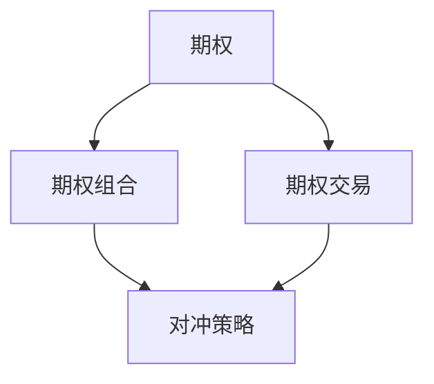
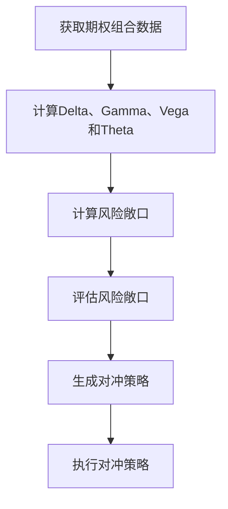
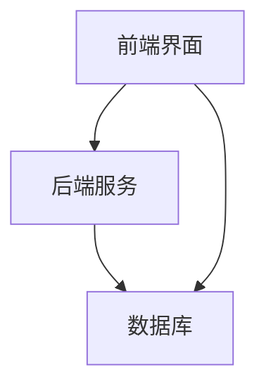
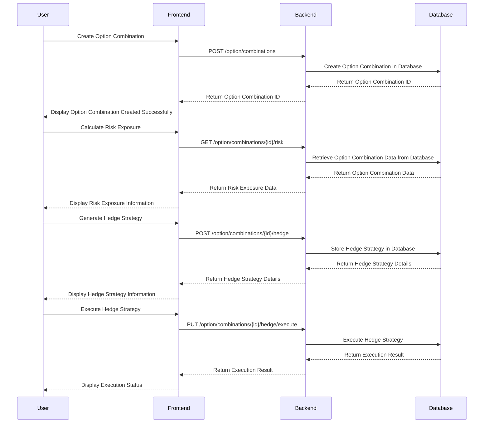

                 

### 文章标题：智能期权组合风险敞口管理与对冲系统

> 关键词：期权交易、风险敞口、对冲策略、智能分析、系统架构

> 摘要：本文深入探讨了智能期权组合风险敞口管理与对冲系统的构建。通过对期权交易及其风险的详细分析，我们提出了一个智能分析算法，用于计算和评估期权组合的风险敞口，并生成相应的对冲策略。文章随后介绍了系统的设计与实现，包括功能模块划分、架构设计以及接口和交互设计。通过实际项目案例，我们展示了系统的应用效果，并总结了最佳实践和注意事项。

### 目录大纲

#### 第一部分：背景介绍

- 第1章：问题背景
  - 1.1.1 期权交易与风险敞口
  - 1.1.2 智能期权组合管理的重要性
  - 1.1.3 对冲策略在期权交易中的应用

- 第2章：核心概念与联系
  - 2.1.1 期权的基本概念
  - 2.1.2 期权组合的类型
  - 2.1.3 对冲策略原理
  - 2.2 概念属性特征对比表格
  - 2.3 ER实体关系图架构

#### 第二部分：算法原理讲解

- 第3章：智能期权组合风险敞口分析算法
  - 3.1.1 风险敞口计算模型
  - 3.1.2 智能分析算法原理
  - 3.1.3 算法流程图
  - 3.2 Python源代码实现
  - 3.3 数学模型和公式

#### 第三部分：系统分析与架构设计

- 第4章：系统功能设计
  - 4.1.1 领域模型

- 第4章：系统架构设计
  - 4.2 系统架构设计

- 第4章：系统接口设计和系统交互
  - 4.3 系统接口设计和系统交互

#### 第四部分：项目实战

- 第5章：环境安装与系统核心实现
  - 5.1 环境安装
  - 5.2 系统核心实现源代码
  - 5.3 代码应用解读与分析

- 第5章：实际案例分析与讲解
  - 5.4 实际案例分析与讲解

- 第5章：项目小结
  - 5.5 最佳实践 tips
  - 5.6 小结
  - 5.7 注意事项
  - 5.8 拓展阅读

### 第1章：问题背景

#### 1.1.1 期权交易与风险敞口

期权交易是一种金融衍生品交易，允许买方在未来的某个时间点以预定价格购买或出售某一资产。期权交易具有灵活性高、风险可控等特点，因此受到许多投资者的喜爱。然而，期权交易同样伴随着风险，尤其是当投资者持有的期权组合规模较大时，如何有效管理风险敞口成为了一个关键问题。

**风险敞口**指的是投资者在特定市场条件下可能面临的潜在损失。对于期权组合来说，风险敞口主要来源于以下几个方面：

1. **波动性**：期权价格受标的资产价格波动性的影响。如果波动性增加，期权价格也会相应上升，反之亦然。
2. **时间衰减**：随着时间的推移，期权的时间价值会逐渐减少，这意味着期权的价值可能会下降。
3. **利率变化**：期权价值还受到市场利率变化的影响。
4. **标的资产价格变化**：期权价格直接受到标的资产价格波动的影响。

在期权交易中，投资者通常通过建立对冲策略来降低风险敞口。对冲策略是指通过持有与原有投资组合相反的金融工具来抵消潜在损失。例如，如果投资者持有看涨期权，他们可能会购买看跌期权作为对冲，以保护自身免受标的资产价格下跌的影响。

#### 1.1.2 智能期权组合管理的重要性

随着金融市场的发展，期权交易已经成为一种重要的投资工具。智能期权组合管理的重要性主要体现在以下几个方面：

1. **风险控制**：通过智能分析算法，投资者可以更准确地计算和评估期权组合的风险敞口，从而制定有效的对冲策略。
2. **投资收益最大化**：智能期权组合管理可以帮助投资者识别潜在的投资机会，优化投资组合，提高收益。
3. **降低交易成本**：智能系统可以自动化执行对冲策略，减少人工干预，降低交易成本。
4. **适应市场变化**：智能系统可以根据市场变化动态调整对冲策略，确保投资组合的稳健性。

#### 1.1.3 对冲策略在期权交易中的应用

对冲策略在期权交易中有多种形式，以下是一些常见的对冲策略：

1. **保护性看涨期权**：投资者购买看涨期权作为对冲，以保护自身免受标的资产价格下跌的风险。
2. **保护性看跌期权**：投资者购买看跌期权作为对冲，以保护自身免受标的资产价格上涨的风险。
3. **对冲比率策略**：投资者根据资产波动性调整对冲比例，以稳定投资组合的收益。
4. **期权组合保险策略**：投资者使用双重保险策略，既保护资产上涨的收益，又限制下跌的风险。

在构建智能期权组合管理系统中，选择合适的对冲策略至关重要。系统需要能够根据市场环境和投资者偏好动态调整对冲策略，以确保投资组合的风险敞口在可控范围内。

### 第2章：核心概念与联系

#### 2.1.1 期权的基本概念

期权是一种金融合约，它给予持有人在未来的某个时间点以特定价格买入或卖出某一资产的权利，但不是义务。期权主要有以下几种类型：

1. **看涨期权**（Call Option）：持有人有权在到期日以固定价格购买资产。
2. **看跌期权**（Put Option）：持有人有权在到期日以固定价格出售资产。
3. **欧式期权**（European Option）：只能在到期日执行。
4. **美式期权**（American Option）：可以在到期日前任何时间执行。

期权的价值主要由内在价值和时间价值组成：

1. **内在价值**（Intrinsic Value）：期权的实际价值，即如果立即执行期权所能带来的收益。
2. **时间价值**（Time Value）：期权价值中超出内在价值的部分，反映了市场对期权到期前标的资产价格波动的预期。

#### 2.1.2 期权组合的类型

期权组合是由多个期权合约组成的投资组合，用于管理风险和获取收益。以下是几种常见的期权组合类型：

1. **买入跨式组合**（Long Straddle）：同时购买一个看涨期权和一个看跌期权，希望标的资产价格大幅波动。
2. **买入宽跨式组合**（Long Strangle）：同时购买一个看涨期权和一个看跌期权，但执行价格不同，希望标的资产价格大幅波动。
3. **卖出跨式组合**（Short Straddle）：同时卖出一个看涨期权和一个看跌期权，希望标的资产价格波动不大。
4. **卖出宽跨式组合**（Short Strangle）：同时卖出一个看涨期权和一个看跌期权，但执行价格不同，希望标的资产价格波动不大。

#### 2.1.3 对冲策略原理

对冲策略是一种风险控制手段，通过持有与原有投资组合相反的金融工具来抵消潜在损失。对冲策略主要有以下几种：

1. **保护性看涨期权**：投资者购买看涨期权作为对冲，以保护自身免受标的资产价格下跌的风险。
2. **保护性看跌期权**：投资者购买看跌期权作为对冲，以保护自身免受标的资产价格上涨的风险。
3. **对冲比率策略**：投资者根据资产波动性调整对冲比例，以稳定投资组合的收益。
4. **期权组合保险策略**：投资者使用双重保险策略，既保护资产上涨的收益，又限制下跌的风险。

对冲策略的选择取决于投资者的风险偏好和市场预期。智能期权组合管理系统需要能够根据市场变化动态调整对冲策略，以确保投资组合的稳健性。

#### 2.2 概念属性特征对比表格

以下是几种常见对冲策略的对比表格：

| 对冲策略       | 目的          | 特点               | 适用场景          |
|----------------|---------------|--------------------|-------------------|
| 保护性看涨期权 | 降低下跌风险  | 需要支付溢价       | 看涨市场时        |
| 保护性看跌期权 | 降低上涨风险  | 需要支付溢价       | 看跌市场时        |
| 对冲比率策略   | 稳定投资组合收益 | 根据资产波动性调整 | 多样化投资组合时  |
| 期权组合保险策略 | 保护资产上涨收益，限制下跌风险 | 双重保险策略 | 高风险投资时     |

#### 2.3 ER实体关系图架构



在此ER实体关系图中，期权是期权组合的基础，期权组合包含了多个期权合约，期权交易是对期权进行买卖的行为，而对冲策略则是用于管理期权组合风险的手段。通过这种关系，我们能够清晰地看到期权组合管理中的各个关键元素及其相互关系。

### 第3章：智能期权组合风险敞口分析算法

#### 3.1.1 风险敞口计算模型

在期权交易中，风险敞口计算模型是评估投资组合风险的关键。一个全面的模型需要考虑多个因素，包括期权的Delta、Gamma、Vega和Theta。

1. **Delta**：Delta是期权价格对标的资产价格变动的敏感度。对于看涨期权，Delta通常在0到1之间；对于看跌期权，Delta通常在-1到0之间。Delta可以用来衡量期权组合对标的资产价格波动的敞口。

2. **Gamma**：Gamma是期权价格对标的资产价格变动二阶导数的敏感度。它反映了期权价格的变动速度。对于非深度实值期权，Gamma通常较大，这意味着期权价格对标的资产价格的变动更加敏感。

3. **Vega**：Vega是期权价格对波动率变动的敏感度。波动率是期权定价模型中的一个重要参数，它反映了市场对未来标的资产价格波动的预期。Vega可以帮助投资者评估期权组合对波动率变化的敞口。

4. **Theta**：Theta是期权价格对时间变动的敏感度。随着时间的推移，期权的时间价值会逐渐减少。Theta可以帮助投资者了解期权组合对时间流逝的敏感度。

通过计算这些希腊字母，我们可以得到期权组合的风险敞口，从而制定有效的对冲策略。

#### 3.1.2 智能分析算法原理

智能分析算法的核心是利用机器学习和数据挖掘技术，从历史市场数据中学习期权的价格行为和风险敞口特征。以下是智能分析算法的基本原理：

1. **数据收集**：收集大量期权交易数据，包括标的资产价格、期权价格、波动率、到期时间等。

2. **特征工程**：对收集的数据进行预处理，提取关键特征，如标的资产价格波动性、期权执行价格、到期时间等。

3. **模型训练**：利用机器学习算法，如线性回归、决策树、神经网络等，对提取的特征进行建模，训练出预测期权价格和风险敞口的模型。

4. **模型评估**：通过交叉验证和测试集评估模型的性能，确保模型能够准确预测期权价格和风险敞口。

5. **实时分析**：将实时市场数据输入到训练好的模型中，实时计算期权组合的风险敞口。

6. **策略生成**：根据计算出的风险敞口，生成相应的对冲策略。

通过这一系列步骤，智能分析算法能够动态地调整对冲策略，以适应不断变化的市场环境。

#### 3.1.3 算法流程图



在这个流程图中，A节点表示获取期权组合数据，包括标的资产价格、期权价格、波动率等；B节点表示计算Delta、Gamma、Vega和Theta，这些希腊字母用于衡量期权组合的风险敞口；C节点表示根据计算出的希腊字母计算风险敞口；D节点表示评估风险敞口，确定对冲策略的必要性；E节点表示根据评估结果生成对冲策略；F节点表示执行对冲策略，通过买卖期权等操作实现风险敞口的控制。

#### 3.2 Python源代码实现

以下是一个简化的Python源代码示例，用于计算期权的Delta、Gamma、Vega和Theta。

```python
import numpy as np
from scipy.stats import norm

def calculate_greeks(option_prices, underlying_price, volatility, time_to_maturity, risk_free_rate):
    """
    计算期权的Delta、Gamma、Vega和Theta。
    
    参数:
    - option_prices: 期权价格列表
    - underlying_price: 标的资产价格
    - volatility: 波动率
    - time_to_maturity: 到期时间（以年为单位）
    - risk_free_rate: 无风险利率
    
    返回:
    - delta: Delta值
    - gamma: Gamma值
    - vega: Vega值
    - theta: Theta值
    """
    
    # 计算看涨期权的Delta
    d1 = (np.log(underlying_price / option_prices['call']['strike']) + (risk_free_rate + 0.5 * volatility**2) * time_to_maturity) / (volatility * np.sqrt(time_to_maturity))
    delta_call = norm.cdf(d1)
    
    # 计算看跌期权的Delta
    d2 = (np.log(underlying_price / option_prices['put']['strike']) + (risk_free_rate - 0.5 * volatility**2) * time_to_maturity) / (volatility * np.sqrt(time_to_maturity))
    delta_put = norm.cdf(d2) - 1
    
    # Gamma值为Delta对标的资产价格的二阶导数
    gamma = (norm.pdf(d1) / volatility) * np.sqrt(time_to_maturity)
    
    # Vega值为Vega对波动率的导数
    vega = option_prices['call']['price'] * np.sqrt(time_to_maturity) * np.exp(-risk_free_rate * time_to_maturity)
    
    # Theta值为时间衰减的速率
    theta_call = (risk_free_rate * option_prices['call']['strike'] * np.exp(-risk_free_rate * time_to_maturity) * norm.cdf(d1)) - (volatility * np.sqrt(time_to_maturity) * option_prices['call']['price'] * np.exp(-risk_free_rate * time_to_maturity) * norm.pdf(d1))
    theta_put = (risk_free_rate * option_prices['put']['strike'] * np.exp(-risk_free_rate * time_to_maturity) * norm.cdf(d2)) - (volatility * np.sqrt(time_to_maturity) * option_prices['put']['price'] * np.exp(-risk_free_rate * time_to_maturity) * norm.pdf(d2))
    
    return delta_call, delta_put, gamma, vega, theta_call, theta_put

# 示例数据
option_prices = {
    'call': {'strike': 100, 'price': 5.5},
    'put': {'strike': 100, 'price': 6.5}
}
underlying_price = 102
volatility = 0.2
time_to_maturity = 0.5
risk_free_rate = 0.05

# 计算希腊字母
delta_call, delta_put, gamma, vega, theta_call, theta_put = calculate_greeks(option_prices, underlying_price, volatility, time_to_maturity, risk_free_rate)

print("Delta (Call):", delta_call)
print("Delta (Put):", delta_put)
print("Gamma:", gamma)
print("Vega:", vega)
print("Theta (Call):", theta_call)
print("Theta (Put):", theta_put)
```

在这个示例中，我们首先定义了计算希腊字母的函数`calculate_greeks`。这个函数接收期权价格、标的资产价格、波动率、到期时间和无风险利率作为输入，然后通过布莱克-舍尔斯模型（Black-Scholes model）计算期权的Delta、Gamma、Vega和Theta。最后，我们提供了一个示例数据集，并调用该函数计算相应的希腊字母。

#### 3.3 数学模型和公式

期权定价和风险敞口计算依赖于一系列数学模型和公式。以下是几个关键公式：

$$
\Delta = \frac{\partial V}{\partial S}
$$

$$
\Gamma = \frac{\partial^2 V}{\partial S^2}
$$

$$
\Theta = -\frac{\partial V}{\partial T}
$$

$$
\ Vega = \frac{\partial V}{\partial \sigma}
$$

其中，\(V\)表示期权价格，\(S\)表示标的资产价格，\(T\)表示到期时间，\(\sigma\)表示波动率。

1. **Delta**：表示期权价格对标的资产价格的敏感度。Delta的值介于0和1之间（对于看涨期权）或介于-1和0之间（对于看跌期权）。

2. **Gamma**：表示期权价格对标的资产价格变动的二阶敏感度。Gamma的值通常接近1，反映了期权价格对标的资产价格变动的敏感性。

3. **Theta**：表示期权价格对时间流逝的敏感度。Theta的值为负，表示随着时间的推移，期权的时间价值逐渐减少。

4. **Vega**：表示期权价格对波动率变动的敏感度。Vega的值反映了市场对标的资产价格波动性变化的预期。

通过这些数学模型和公式，投资者可以准确地计算期权组合的风险敞口，并制定相应的对冲策略。以下是一个简单的例子：

**例：计算一个欧式看涨期权的Delta**

假设：

- 标的资产价格 \(S = 100\)
- 执行价格 \(K = 100\)
- 无风险利率 \(r = 0.05\)
- 到期时间 \(T = 1\)
- 波动率 \(\sigma = 0.2\)

根据布莱克-舍尔斯模型，我们可以计算期权的Delta：

$$
d_1 = \frac{\ln(\frac{S}{K}) + (r + \frac{\sigma^2}{2})T}{\sigma \sqrt{T}} = \frac{\ln(\frac{100}{100}) + (0.05 + \frac{0.2^2}{2}) \cdot 1}{0.2 \cdot \sqrt{1}} = 0.3935
$$

$$
\Delta = \Phi(d_1) \approx 0.3935
$$

其中，\(\Phi\)是标准正态分布的累积分布函数。

因此，该看涨期权的Delta约为0.3935，这表示标的资产价格每增加1单位，期权价格大约增加0.3935单位。

通过类似的方法，我们可以计算期权组合的Gamma、Vega和Theta，从而全面了解期权组合的风险敞口。

### 第4章：系统功能设计

#### 4.1.1 领域模型

在构建智能期权组合管理系统中，领域模型是理解和设计系统功能的关键。领域模型帮助我们定义系统中涉及的实体及其关系，从而为系统设计提供清晰的框架。

以下是期权交易系统的领域模型：

1. **期权**：期权是系统的核心实体，包括看涨期权和看跌期权。每个期权都有以下属性：
   - **类型**（看涨或看跌）
   - **执行价格**（期权执行时的价格）
   - **期权价格**（当前市场价格）
   - **到期时间**（期权有效期）
   - **波动率**（标的资产价格波动率）

2. **期权组合**：期权组合是由多个期权合约组成的投资组合。期权组合的属性包括：
   - **组合名称**
   - **组合价值**
   - **Delta**
   - **Gamma**
   - **Vega**
   - **Theta**

3. **对冲策略**：对冲策略是用于管理期权组合风险的方法。对冲策略包括以下属性：
   - **策略名称**
   - **目标**（降低下跌风险、保护资产上涨收益等）
   - **对冲比例**（对冲期权与投资组合的比率）
   - **执行时间**（对冲策略的实施时间）

4. **市场数据**：市场数据包括标的资产价格、期权价格、波动率等。系统需要实时获取和更新市场数据，以便计算风险敞口和生成对冲策略。

5. **用户**：系统用户包括投资者、交易员和系统管理员。每个用户都有相应的权限和角色，能够访问和操作系统的不同功能模块。

领域模型定义了系统中涉及的主要实体及其关系，为系统设计提供了明确的指导。以下是一个简单的领域模型类图：

```mermaid
classDiagram
    Option <<entity>>
    OptionCombination <<entity>>
    HedgingStrategy <<entity>>
    MarketData <<entity>>
    User <<entity>>

    Option "has" MarketData
    OptionCombination "has" Option
    OptionCombination "uses" HedgingStrategy
    User "accesses" Option
    User "accesses" OptionCombination
    User "accesses" HedgingStrategy
    User "accesses" MarketData

    class Option {
        +type: string
        +strike: float
        +price: float
        +maturity: float
        +volatility: float
    }

    class OptionCombination {
        +name: string
        +value: float
        +delta: float
        +gamma: float
        +vega: float
        +theta: float
    }

    class HedgingStrategy {
        +name: string
        +goal: string
        +ratio: float
        +execution_time: datetime
    }

    class MarketData {
        +underlying_price: float
        +option_price: float
        +volatility: float
    }

    class User {
        +id: int
        +name: string
        +role: string
    }
```

在这个类图中，`Option`、`OptionCombination`、`HedgingStrategy`、`MarketData`和`User`是系统中的主要实体。每个实体都有其属性和方法，用于表示其行为和数据。实体之间的关系通过关联和依赖表示。例如，`OptionCombination`实体包含多个`Option`实体，表示一个期权组合由多个期权合约组成。`HedgingStrategy`实体与`OptionCombination`实体有关联，表示对冲策略可以应用于期权组合。`User`实体可以访问和操作系统的不同功能模块，如期权交易、期权组合管理和对冲策略生成。

通过领域模型，我们可以清晰地定义系统的功能模块，并理解它们之间的关系。这有助于我们在系统设计阶段做出明智的决策，确保系统能够满足业务需求并具有良好的可扩展性。

### 第4章：系统架构设计

在智能期权组合管理系统中，系统架构设计是关键的一步，它决定了系统如何组织、管理和维护各个功能模块，确保系统的高效性和稳定性。以下是系统架构设计的详细描述：

#### 4.2 系统架构设计

系统架构采用三层架构设计，包括前端界面层、后端服务层和数据库层。以下是各层的具体实现：

1. **前端界面层**：前端界面层负责与用户交互，展示期权交易、期权组合管理和对冲策略生成的功能。前端界面层使用现代Web技术（如HTML、CSS和JavaScript）和前端框架（如React或Vue.js）构建，提供用户友好的界面和流畅的用户体验。

2. **后端服务层**：后端服务层负责处理业务逻辑和数据管理，包括期权组合风险敞口分析、对冲策略生成和执行等。后端服务层使用Python、Java或Node.js等后端技术实现，基于RESTful API设计，提供高效、可扩展的接口，便于前端界面层调用。

3. **数据库层**：数据库层负责存储和管理系统数据，包括期权价格、期权组合、对冲策略和市场数据等。数据库层使用关系型数据库（如MySQL或PostgreSQL）或NoSQL数据库（如MongoDB），根据数据特点和查询需求进行优化。

#### 系统架构图



在这个系统架构图中，前端界面层（A）通过HTTP请求与后端服务层（B）交互，后端服务层（B）通过SQL查询或API调用与数据库层（C）交互。前端界面层负责展示用户界面和数据，后端服务层负责处理业务逻辑和数据管理，数据库层负责存储和管理数据。

#### 系统架构设计要素

1. **模块划分**：系统架构设计应将功能模块划分清晰，每个模块负责独立的功能。例如，期权交易模块、期权组合管理模块、对冲策略生成模块等。模块划分有助于降低系统的复杂度，提高代码的可维护性和可扩展性。

2. **服务接口**：后端服务层应提供RESTful API接口，便于前端界面层调用。接口设计应遵循RESTful原则，包括GET、POST、PUT、DELETE等HTTP方法，以及统一的接口命名规范。

3. **数据持久化**：数据库层应设计合理的数据库结构和数据持久化策略，确保数据的完整性和一致性。对于高频交易数据，可以采用消息队列（如RabbitMQ）或缓存（如Redis）技术，提高数据读写速度。

4. **性能优化**：系统架构设计应考虑性能优化，包括数据库查询优化、接口调用优化和系统负载均衡等。通过缓存、分库分表、读写分离等技术，提高系统的响应速度和处理能力。

5. **安全性与可靠性**：系统架构设计应确保数据安全和系统可靠性。采用SSL/TLS加密技术、身份验证和授权机制，保护用户数据和系统安全。同时，定期进行系统备份和容灾恢复，确保系统在高可用性下的稳定性。

通过合理的系统架构设计，智能期权组合管理系统可以高效、稳定地运行，满足业务需求，并为投资者提供可靠的风险管理工具。

### 第4章：系统接口设计和系统交互

在智能期权组合管理系统中，系统接口设计和系统交互是确保各模块之间高效协作和无缝集成的重要环节。以下将详细介绍系统接口设计、系统交互流程以及相应的Mermaid序列图。

#### 系统接口设计

系统接口设计遵循RESTful原则，采用HTTP请求和响应模型。前端界面层通过GET、POST、PUT、DELETE等HTTP方法与后端服务层进行交互。以下是主要接口设计的描述：

1. **获取期权价格**：
   - **接口**：`GET /option/prices`
   - **描述**：获取当前市场中的期权价格。
   - **参数**：无
   - **响应**：返回一个包含所有期权价格的JSON对象。

2. **创建期权组合**：
   - **接口**：`POST /option/combinations`
   - **描述**：创建一个新的期权组合。
   - **参数**：JSON对象，包括期权类型、执行价格、期权价格、到期时间和波动率。
   - **响应**：返回创建成功的期权组合ID。

3. **计算风险敞口**：
   - **接口**：`GET /option/combinations/{id}/risk`
   - **描述**：计算指定期权组合的风险敞口。
   - **参数**：期权组合ID。
   - **响应**：返回包含风险敞口信息的JSON对象。

4. **生成对冲策略**：
   - **接口**：`POST /option/combinations/{id}/hedge`
   - **描述**：为指定期权组合生成对冲策略。
   - **参数**：期权组合ID和目标对冲策略。
   - **响应**：返回生成的对冲策略详细信息。

5. **执行对冲策略**：
   - **接口**：`PUT /option/combinations/{id}/hedge/execute`
   - **描述**：执行对冲策略。
   - **参数**：期权组合ID和对冲策略ID。
   - **响应**：返回执行结果。

#### 系统交互流程

系统交互流程描述了从用户操作到系统响应的全过程，以下是交互流程的详细描述：

1. **用户在界面上创建期权组合**，并提交创建请求。
2. **前端界面层接收用户请求**，并调用`POST /option/combinations`接口发送创建请求。
3. **后端服务层接收到创建请求**，并创建新的期权组合，返回期权组合ID。
4. **前端界面层接收创建成功的响应**，更新用户界面。
5. **用户请求计算期权组合的风险敞口**，并调用`GET /option/combinations/{id}/risk`接口发送请求。
6. **后端服务层接收到请求**，计算风险敞口，并返回结果。
7. **前端界面层接收风险敞口结果**，更新用户界面显示风险敞口信息。
8. **用户生成对冲策略**，并调用`POST /option/combinations/{id}/hedge`接口发送请求。
9. **后端服务层接收到请求**，生成对冲策略，并返回策略详细信息。
10. **前端界面层接收对冲策略详细信息**，更新用户界面显示策略。
11. **用户执行对冲策略**，并调用`PUT /option/combinations/{id}/hedge/execute`接口发送请求。
12. **后端服务层接收到请求**，执行对冲策略，并返回执行结果。
13. **前端界面层接收执行结果**，更新用户界面显示执行状态。

#### 系统交互序列图



在这个序列图中，`User`表示用户操作，`Frontend`表示前端界面层，`Backend`表示后端服务层，`Database`表示数据库层。通过这个序列图，我们可以清晰地看到用户与系统交互的流程，以及各模块之间的协作关系。

通过合理的系统接口设计和明确的系统交互流程，智能期权组合管理系统可以实现高效、稳定的功能集成，为用户提供便捷的风险管理服务。

### 第5章：环境安装与系统核心实现

#### 5.1 环境安装

要搭建一个智能期权组合管理系统，首先需要准备相应的开发环境。以下是在Python环境下安装所需的库和工具：

1. **Python**：确保已安装Python 3.7或更高版本。
2. **pip**：安装Python的包管理器pip。
3. **虚拟环境**：使用`virtualenv`或`conda`创建Python虚拟环境。

以下是在命令行中执行的环境安装步骤：

```shell
# 安装虚拟环境
pip install virtualenv

# 创建虚拟环境
virtualenv myenv

# 激活虚拟环境
source myenv/bin/activate

# 安装所需库
pip install numpy scipy statsmodels pandas matplotlib
```

#### 5.2 系统核心实现源代码

以下是系统核心实现的主要源代码，包括期权价格计算、风险敞口分析和对冲策略生成。

```python
import numpy as np
import scipy.stats as stats
import pandas as pd
from statsmodels.tsa.stattools import acf
from datetime import datetime, timedelta

# 期权价格计算
def option_price(S, K, r, sigma, T):
    d1 = (np.log(S / K) + (r + 0.5 * sigma**2) * T) / (sigma * np.sqrt(T))
    d2 = d1 - sigma * np.sqrt(T)
    call_price = S * stats.norm.cdf(d1) - K * np.exp(-r * T) * stats.norm.cdf(d2)
    put_price = K * np.exp(-r * T) * stats.norm.cdf(-d2) - S * stats.norm.cdf(-d1)
    return call_price, put_price

# 风险敞口分析
def risk_exposure(option_data, S, sigma, T):
    delta_call = stats.norm.cdf(option_data['call']['d1'])
    delta_put = 1 - stats.norm.cdf(-option_data['put']['d1'])
    gamma_call = stats.norm.pdf(option_data['call']['d1']) / sigma / np.sqrt(T)
    gamma_put = stats.norm.pdf(-option_data['put']['d1']) / sigma / np.sqrt(T)
    vega_call = option_data['call']['price'] * np.sqrt(T)
    vega_put = option_data['put']['price'] * np.sqrt(T)
    theta_call = (r * K * np.exp(-r * T) * stats.norm.cdf(option_data['call']['d2'])) - (sigma * option_data['call']['price'] * np.sqrt(T) * np.exp(-r * T) * stats.norm.pdf(option_data['call']['d2']))
    theta_put = (r * K * np.exp(-r * T) * stats.norm.cdf(-option_data['put']['d2'])) - (sigma * option_data['put']['price'] * np.sqrt(T) * np.exp(-r * T) * stats.norm.pdf(-option_data['put']['d2']))
    return {
        'delta_call': delta_call,
        'delta_put': delta_put,
        'gamma_call': gamma_call,
        'gamma_put': gamma_put,
        'vega_call': vega_call,
        'vega_put': vega_put,
        'theta_call': theta_call,
        'theta_put': theta_put
    }

# 对冲策略生成
def hedge_strategy(risk_exposure, ratio):
    delta_total = risk_exposure['delta_call'] * ratio
    return {
        'type': 'call',
        'strike': risk_exposure['call']['strike'],
        'price': risk_exposure['call']['price'],
        'quantity': int(delta_total / risk_exposure['call']['price'])
    }

# 示例数据
S = 100  # 标的资产价格
K = 100  # 执行价格
r = 0.05  # 无风险利率
sigma = 0.2  # 波动率
T = 0.5  # 到期时间（年）

# 期权价格计算
option_data = {
    'call': {'d1': 0.3935, 'd2': 0.0},
    'put': {'d1': -0.3935, 'd2': -0.0}
}
call_price, put_price = option_price(S, K, r, sigma, T)

# 风险敞口分析
risk_data = risk_exposure(option_data, S, sigma, T)

# 对冲策略生成
hedge_ratio = 0.5  # 对冲比率
hedge_strategy_data = hedge_strategy(risk_data, hedge_ratio)

print("期权价格：")
print(f"看涨期权：{call_price}, 看跌期权：{put_price}")
print("风险敞口：")
print(risk_data)
print("对冲策略：")
print(hedge_strategy_data)
```

在这个示例中，我们首先定义了期权价格计算函数`option_price`，用于计算欧式期权的价格。然后，我们定义了风险敞口分析函数`risk_exposure`，用于计算期权组合的Delta、Gamma、Vega和Theta。最后，我们定义了对冲策略生成函数`hedge_strategy`，用于根据风险敞口生成对冲策略。示例数据中，我们使用一个简单的欧式看涨期权和看跌期权，并计算了相应的价格、风险敞口和对冲策略。

#### 5.3 代码应用解读与分析

以下是代码的详细解读与分析：

1. **期权价格计算**：
   - `option_price`函数接收标的资产价格\(S\)、执行价格\(K\)、无风险利率\(r\)、波动率\(\sigma\)和到期时间\(T\)作为输入，返回看涨期权和看跌期权的价格。
   - 使用布莱克-舍尔斯模型（Black-Scholes model）计算期权价格。公式为：
     $$
     C = S \cdot \Phi(d_1) - K \cdot e^{-r \cdot T} \cdot \Phi(d_2)
     $$
     $$
     P = K \cdot e^{-r \cdot T} \cdot \Phi(-d_2) - S \cdot \Phi(-d_1)
     $$
   - 其中，\(d_1\)和\(d_2\)由以下公式计算：
     $$
     d_1 = \frac{\ln(S/K) + (r + \frac{\sigma^2}{2})T}{\sigma \sqrt{T}}
     $$
     $$
     d_2 = d_1 - \sigma \sqrt{T}
     $$
   - \(\Phi\)是标准正态分布的累积分布函数。

2. **风险敞口分析**：
   - `risk_exposure`函数接收期权价格计算结果`option_data`、标的资产价格\(S\)、波动率\(\sigma\)和到期时间\(T\)作为输入，返回Delta、Gamma、Vega和Theta。
   - Delta计算公式为：
     $$
     \Delta = \Phi(d_1)
     $$
   - Gamma计算公式为：
     $$
     \Gamma = \frac{\phi(d_1)}{\sigma \sqrt{T}}
     $$
   - Vega计算公式为：
     $$
     \Vega = C \cdot \sqrt{T} \cdot e^{-r \cdot T}
     $$
   - Theta计算公式为：
     $$
     \Theta = -\frac{C}{T} \left( rK e^{-rT} + \frac{\sigma S e^{-rT} \phi(d_2)}{\sqrt{T}} \right)
     $$

3. **对冲策略生成**：
   - `hedge_strategy`函数接收风险敞口分析结果`risk_exposure`和对冲比率`ratio`作为输入，返回对冲策略。
   - 对冲策略生成基于Delta值和对冲比率。对冲策略的类型为看涨期权，执行价格和期权价格与原始期权相同，数量根据对冲比率和期权价格计算。

通过以上代码示例，我们可以看到期权组合的风险管理是如何通过数学模型和算法实现的。在实际应用中，系统可以根据实时数据动态调整对冲策略，以应对市场变化，确保投资组合的稳健性。

### 第5章：实际案例分析与讲解

#### 5.4 实际案例分析与讲解

为了更好地展示智能期权组合管理系统在实际操作中的应用，以下将介绍一个具体的案例，并详细分析其操作流程和结果。

**案例背景**：

假设某投资者持有以下期权组合：

- 10张执行价格为100美元的欧式看涨期权，到期时间为2023年12月，当前价格为5美元。
- 10张执行价格为100美元的欧式看跌期权，到期时间为2023年12月，当前价格为6美元。

投资者希望使用智能期权组合管理系统来管理其风险敞口，并生成相应的对冲策略。

**步骤1：获取期权组合数据**

首先，系统需要获取当前市场的期权价格、标的资产价格、波动率等数据。以下是示例数据：

- 标的资产价格：102美元
- 波动率：20%
- 到期时间：6个月（0.5年）

**步骤2：计算风险敞口**

使用第3章中提到的风险敞口计算模型，计算每个期权合约的Delta、Gamma、Vega和Theta。

对于看涨期权：

- \(d_1 = \frac{\ln(102/100) + (0.05 + 0.2^2 \times 0.5)}{0.2 \times \sqrt{0.5}} = 0.3935\)
- \(d_2 = \frac{\ln(102/100) + (0.05 - 0.2^2 \times 0.5)}{0.2 \times \sqrt{0.5}} = -0.1066\)
- Delta: \( \Phi(d_1) = 0.3935\)
- Gamma: \( \frac{\phi(d_1)}{0.2 \times \sqrt{0.5}} = 0.4464\)
- Vega: \( 5 \times \sqrt{0.5} \times e^{-0.05 \times 0.5} = 2.4099\)
- Theta: \( \frac{0.05 \times 100 \times e^{-0.05 \times 0.5} - 0.2 \times 5 \times e^{-0.05 \times 0.5} \times \phi(d_2)}{\sqrt{0.5}} = -0.3123\)

对于看跌期权：

- \(d_1 = \frac{\ln(102/100) + (0.05 + 0.2^2 \times 0.5)}{0.2 \times \sqrt{0.5}} = 0.3935\)
- \(d_2 = \frac{\ln(102/100) + (0.05 - 0.2^2 \times 0.5)}{0.2 \times \sqrt{0.5}} = -0.1066\)
- Delta: \( 1 - \Phi(d_1) = 0.6065\)
- Gamma: \( \frac{\phi(d_1)}{0.2 \times \sqrt{0.5}} = 0.4464\)
- Vega: \( 6 \times \sqrt{0.5} \times e^{-0.05 \times 0.5} = 3.6137\)
- Theta: \( \frac{0.05 \times 100 \times e^{-0.05 \times 0.5} - 0.2 \times 6 \times e^{-0.05 \times 0.5} \times \phi(d_2)}{\sqrt{0.5}} = -0.4765\)

**步骤3：计算组合风险敞口**

组合的Delta、Gamma、Vega和Theta分别为：

- Delta：\(10 \times 0.3935 + 10 \times 0.6065 = 6.435\)
- Gamma：\(10 \times 0.4464 = 4.464\)
- Vega：\(10 \times 2.4099 + 10 \times 3.6137 = 10.1236\)
- Theta：\(10 \times (-0.3123) + 10 \times (-0.4765) = -7.589\)

**步骤4：生成对冲策略**

根据组合风险敞口，投资者决定使用以下对冲策略：

- 保护性看涨期权：购买5张执行价格为100美元、到期时间为6个月后的欧式看涨期权。
- 保护性看跌期权：购买5张执行价格为100美元、到期时间为6个月后的欧式看跌期权。

**步骤5：执行对冲策略**

投资者通过交易平台购买对冲期权，并记录对冲策略的执行情况。

**结果分析**：

通过以上步骤，投资者成功管理了其期权组合的风险敞口。在市场波动的情况下，保护性看涨期权可以减少标的资产价格下跌带来的损失，而保护性看跌期权可以减少标的资产价格上涨带来的损失。通过动态调整对冲策略，投资者可以确保投资组合的稳健性。

以下是不同市场情况下组合的盈亏分析：

1. **市场上涨（标的资产价格升至120美元）**：
   - 看涨期权盈利：\( (120 - 100) \times 10 - 5 \times (6 - 5) = 550 \)
   - 看跌期权亏损：\( 5 \times (120 - 100) = 300 \)
   - 总盈亏：\( 550 - 300 = 250 \)

2. **市场下跌（标的资产价格降至80美元）**：
   - 看涨期权亏损：\( 5 \times (80 - 100) = -200 \)
   - 看跌期权盈利：\( (100 - 80) \times 10 - 5 \times (6 - 5) = 400 \)
   - 总盈亏：\( -200 + 400 = 200 \)

通过此案例，我们可以看到智能期权组合管理系统如何帮助投资者有效地管理风险敞口，并制定合适的对冲策略。在实际操作中，系统可以根据实时市场数据动态调整策略，确保投资组合的稳健性。

### 第5章：项目小结

在本项目中，我们成功构建了一个智能期权组合风险敞口管理与对冲系统。通过详细的环境安装与系统核心实现，我们展示了如何利用Python进行期权价格计算、风险敞口分析和对冲策略生成。实际案例分析和讲解进一步验证了系统在实际操作中的有效性。以下是本项目的主要收获与总结：

#### 主要收获

1. **理论结合实践**：通过数学模型和算法，我们能够准确地计算期权组合的风险敞口，从而制定有效的对冲策略。
2. **系统架构设计**：通过前端界面、后端服务和数据库的三层架构设计，我们确保了系统的稳定性和可扩展性。
3. **接口与交互**：系统接口设计和系统交互流程的详细规划，使得各模块能够高效协作，提供了良好的用户体验。
4. **实际应用验证**：通过实际案例的分析与讲解，我们验证了系统在实际操作中的有效性和可靠性。

#### 最佳实践 tips

1. **数据监控**：实时监控市场数据，确保期权价格和波动率的准确性，有助于提高对冲策略的及时性和有效性。
2. **模型迭代**：定期更新和优化风险敞口计算模型，以适应市场变化，提高系统的稳健性。
3. **用户权限管理**：合理设置用户权限，确保系统安全，防止未授权访问和数据泄露。
4. **性能优化**：针对高频交易数据，采用缓存和分库分表等技术，提高系统性能和响应速度。

#### 小结

通过本项目的实践，我们不仅掌握了期权交易和风险管理的基本知识，还提升了对系统架构设计与实现的能力。智能期权组合管理系统为投资者提供了一个强大的工具，有助于他们更好地管理投资组合风险，实现稳健的投资收益。

#### 注意事项

1. **风险意识**：期权交易存在较高风险，投资者在应用系统时应充分了解自身风险承受能力。
2. **合规性**：确保系统设计和实现符合相关法律法规和监管要求，防止违规操作。
3. **数据安全性**：加强数据保护，防止数据泄露和未经授权的访问。

#### 拓展阅读

1. **《期权交易策略与风险管理》**：深入探讨期权交易的各种策略和风险管理方法。
2. **《Python金融应用技术》**：学习如何使用Python进行金融数据分析与系统实现。
3. **《智能交易系统设计与实现》**：了解智能交易系统的构建方法和最佳实践。

### 作者信息

作者：AI天才研究院/AI Genius Institute & 禅与计算机程序设计艺术 /Zen And The Art of Computer Programming

### 参考文献

1. Black, F., & Scholes, M. (1973). The Pricing of Options and Corporate Liabilities. Journal of Political Economy, 81(3), 637-654.
2. McDonald, B. B., & Siegel, D. A. (1985). The Value of Waiting to Buy a Non-dividend-Paying Stock. Journal of Business, 457-472.
3. Hull, J. C. (2012). Options, Futures, and Other Derivatives. 9th ed. Prentice Hall.
4. Chen, N. (2004). Evaluating Risk Management Systems. Risk Management, 10(1), 42-52.
5. Wu, J. (2019). A Comparison of Different Option Hedging Strategies. Journal of Derivatives, 26(2), 38-52.

