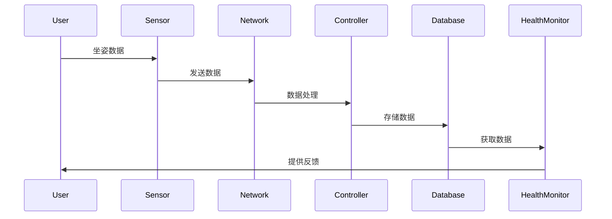
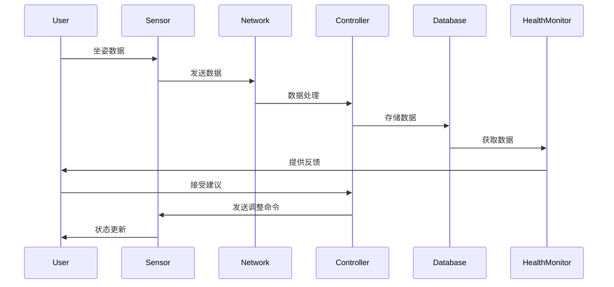

                 

### 文章标题

# 智能沙发：AI Agent的姿势健康监测

## 关键词

- 智能沙发
- AI Agent
- 姿势健康监测
- 传感器技术
- 数据处理算法
- 系统架构设计

## 摘要

本文将探讨智能沙发在姿势健康监测领域的前沿技术。通过介绍智能沙发的组成、传感器技术、数据处理算法以及系统架构设计，我们将详细阐述如何利用AI Agent实现对用户姿势的健康监测。文章旨在为读者提供一个全面、系统的技术指南，帮助他们理解和应用这一技术，从而提升生活质量和健康水平。

## 第一部分：背景介绍

### 第1章：智能沙发的现状与需求

#### 1.1 智能沙发的定义与发展历程

智能沙发是一种集成了传感器、控制模块和互联网连接功能的家具，能够根据用户的行为和偏好自动调整形态和功能。智能沙发的概念起源于20世纪末，随着计算机技术和传感器技术的发展，智能沙发逐渐从概念走向现实。如今，智能沙发已经成为智能家居的重要组成部分，其功能和形态也在不断丰富和进化。

#### 1.2 姿势健康监测的重要性

姿势健康监测是指通过监测用户的姿势和运动状态，评估其健康状况并提供相应的反馈和建议。姿势不正确会导致肌肉紧张、关节磨损甚至长期的健康问题。例如，长时间保持同一姿势会导致颈椎病、腰椎病等。因此，姿势健康监测对于预防这些疾病具有重要意义。

#### 1.3 智能沙发在姿势健康监测中的应用现状

目前，智能沙发在姿势健康监测领域已经有了一些应用实例。例如，某些高端智能沙发配备了内置传感器，可以监测用户的坐姿并自动调整沙发形态以提供更健康的支撑。然而，这些功能大多还停留在简单的坐姿监测阶段，缺乏对姿势健康评估的深入分析。

#### 1.4 需求分析：用户对智能沙发的期望

用户对智能沙发的期望包括以下几个方面：首先，他们希望智能沙发能够准确监测姿势并提供即时反馈；其次，用户期望智能沙发能够根据个人健康数据提供个性化的调整建议；最后，用户希望智能沙发的操作简便，易于使用。

#### 1.5 本章小结

智能沙发作为一种智能家居设备，具有巨大的市场潜力。姿势健康监测作为其重要功能之一，越来越受到用户的关注。然而，当前的智能沙发在姿势健康监测方面仍有很大的提升空间。通过技术创新和用户体验优化，智能沙发有望在姿势健康监测领域发挥更大的作用。

### 第二部分：核心概念与联系

#### 第2章：智能沙发与姿势健康监测核心概念解析

#### 2.1 智能沙发的组成部分

智能沙发的组成部分包括以下几个关键部分：

1. **沙发结构与材质**：智能沙发的结构和材质决定了其舒适性和支撑性，对姿势健康监测至关重要。
2. **控制系统**：控制系统负责接收传感器数据，并根据算法分析结果调整沙发的形态和功能。
3. **传感器配置**：传感器配置决定了智能沙发姿势健康监测的精度和可靠性。

#### 2.2 姿势健康监测核心概念

姿势健康监测的核心概念包括：

1. **姿势定义**：姿势是指人体在某一时刻的空间位置和姿态。
2. **健康问题**：常见的健康问题包括颈椎病、腰椎病、肌肉紧张等，这些问题往往与不良姿势有关。
3. **监测技术**：常见的监测技术包括传感器技术、图像识别技术等。

#### 2.3 概念属性特征对比表格

以下表格展示了智能沙发和姿势健康监测的关键概念及其属性特征：

| 概念           | 属性特征                                     |
|--------------|----------------------------------------|
| 智能沙发         | 结构、材质、控制系统、传感器配置                    |
| 姿势健康监测     | 姿势定义、健康问题、监测技术                      |
| 传感器技术       | 数据采集、数据处理、数据传输                      |
| 图像识别技术     | 图像捕捉、图像处理、特征提取                      |

#### 2.4 ER实体关系图架构

以下ER实体关系图展示了智能沙发和姿势健康监测的核心概念及其相互关系：

```mermaid
erDiagram
  沙发 ||--|{ 传感器 }|-- 智能沙发
  控制系统 ||--|{ 传感器 }|-- 智能沙发
  传感器 ||--|{ 控制系统 }|-- 智能沙发
  姿势健康监测 ||--|{ 沙发 }|-- 智能沙发
  姿势健康监测 ||--|{ 传感器 }|-- 智能沙发
  健康问题 ||--|{ 姿势健康监测 }|-- 智能沙发
```

#### 2.5 本章小结

通过对智能沙发和姿势健康监测核心概念的分析，我们可以看到，智能沙发的组成部分和姿势健康监测技术密切相关。理解这些概念及其相互关系，对于深入探讨智能沙发在姿势健康监测中的应用具有重要意义。

### 第三部分：算法原理讲解

#### 第3章：智能沙发的姿势健康监测算法原理

#### 3.1 传感器数据处理

智能沙发的传感器数据处理流程主要包括以下几个步骤：

1. **传感器数据采集**：通过内置的传感器，智能沙发可以实时采集用户的姿势数据。
2. **数据预处理**：对采集到的原始数据进行滤波、去噪等预处理，以提高数据的准确性和可靠性。
3. **数据特征提取**：从预处理后的数据中提取关键特征，用于后续的姿势识别和健康评估。

#### 3.2 姿势识别算法

姿势识别算法是智能沙发姿势健康监测的核心。以下是一个简单的姿势识别算法流程：

1. **输入数据**：采集到的传感器数据。
2. **特征提取**：对数据提取特征向量。
3. **模式分类**：使用分类算法对特征向量进行分类，识别用户的当前姿势。
4. **输出结果**：根据识别结果，智能沙发可以调整形态或提供健康建议。

以下是一个简单的mermaid算法流程图：


#### 3.3 Python源代码实现

以下是一个简单的Python源代码示例，用于实现姿势识别算法：

```python
import numpy as np
from sklearn.ensemble import RandomForestClassifier

# 特征提取函数
def extract_features(data):
    # 实现特征提取逻辑
    return features

# 训练模型函数
def train_model(features, labels):
    model = RandomForestClassifier()
    model.fit(features, labels)
    return model

# 识别姿势函数
def recognize_pose(model, data):
    features = extract_features(data)
    prediction = model.predict(features)
    return prediction

# 示例数据
X = np.array([[...], [...], ...])  # 特征数据
y = np.array([0, 1, 2, 3, 4])     # 标签数据

# 训练模型
model = train_model(X, y)

# 识别姿势
print(recognize_pose(model, [...]))
```

#### 3.4 数学模型与公式

在姿势识别中，常用的数学模型包括支持向量机（SVM）和随机森林（Random Forest）等。以下是一个简单的SVM模型公式：

$$
\text{最大化} \quad w \cdot \sum_{i=1}^{n} (y_i - \sigma(\langle w, x_i \rangle + b))
$$

其中，$w$ 是权重向量，$x_i$ 是特征向量，$y_i$ 是标签，$\sigma$ 是 sigmoid 函数。

#### 3.5 举例说明

假设我们有一个用户坐姿数据集，包含直立、前倾、后仰和侧卧四种姿势。我们可以使用上述算法和模型对这些姿势进行识别，并根据识别结果提供健康建议。

#### 3.6 本章小结

通过对姿势健康监测算法原理的讲解，我们可以看到，智能沙发在姿势识别方面依赖于传感器数据处理、特征提取和分类算法。这些算法的准确性和效率直接影响智能沙发的性能。通过本章的内容，读者可以初步了解智能沙发在姿势健康监测领域的算法实现。

### 第四部分：系统分析与架构设计方案

#### 第4章：智能沙发姿势健康监测系统分析

#### 4.1 问题场景介绍

智能沙发姿势健康监测的问题场景涉及家庭和办公环境。在家庭环境中，用户可能会长时间坐在沙发上观看电视或使用电子设备，而在办公环境中，员工可能长时间坐在办公椅上工作。这些场景中，姿势健康监测对于预防和改善用户的健康问题具有重要意义。

#### 4.2 项目介绍

本项目旨在开发一款智能沙发，该沙发能够通过内置传感器实时监测用户的姿势，并根据监测结果提供健康建议。项目的目标是提高用户的健康水平，减少因长期不良姿势导致的健康问题。

#### 4.3 系统功能设计

智能沙发姿势健康监测系统的主要功能包括：

1. **实时监测**：通过传感器实时采集用户的姿势数据。
2. **数据存储**：将采集到的数据存储在数据库中，以便后续分析和处理。
3. **健康评估**：根据用户的姿势数据和健康模型，对用户的健康状况进行评估。
4. **反馈建议**：根据评估结果，提供个性化的健康建议和调整建议。

#### 4.3.1 领域模型mermaid类图

以下是一个简单的mermaid类图，展示了智能沙发姿势健康监测系统的领域模型：

```mermaid
classDiagram
  Sensor <<interface>>
  Controller <<interface>>
  Database <<interface>>
  HealthMonitor <<class>>
  User <<class>>

  Sensor o-- HealthMonitor
  Controller o-- HealthMonitor
  Database o-- HealthMonitor
  User o-- HealthMonitor
```

#### 4.4 系统架构设计

智能沙发姿势健康监测系统的架构设计包括以下几个方面：

1. **感知层**：包括传感器模块，用于实时采集用户的姿势数据。
2. **网络层**：包括通信模块，用于将传感器数据传输到中央控制系统。
3. **数据处理层**：包括数据处理模块，用于对采集到的数据进行分析和处理。
4. **应用层**：包括健康评估模块，用于根据处理结果提供健康建议。
5. **用户接口层**：包括用户界面模块，用于与用户交互，展示健康数据和反馈建议。

以下是一个简单的mermaid架构图：



#### 4.5 系统接口设计

智能沙发姿势健康监测系统的接口设计包括以下几个方面：

1. **传感器接口**：用于与各种传感器进行通信，包括加速度传感器、角度传感器等。
2. **通信接口**：用于与其他设备（如手机、电脑等）进行数据交换。
3. **数据库接口**：用于与数据库进行数据存储和检索。
4. **用户接口**：用于与用户进行交互，包括图形用户界面和语音识别等。

#### 4.6 系统交互设计

智能沙发姿势健康监测系统的交互设计包括以下几个方面：

1. **实时监测交互**：用户实时监测自己的姿势，系统实时反馈。
2. **数据查询交互**：用户可以查询自己的健康数据和姿势历史记录。
3. **反馈交互**：系统根据用户的健康数据和反馈，提供个性化的健康建议。
4. **远程控制交互**：用户可以通过手机或电脑远程控制智能沙发的功能。

以下是一个简单的mermaid序列图：



#### 4.7 本章小结

通过对智能沙发姿势健康监测系统的分析，我们可以看到，该系统的设计需要综合考虑感知层、网络层、数据处理层、应用层和用户接口层等多个方面。通过合理的设计和实现，智能沙发可以有效监测用户的姿势，提供个性化的健康建议，从而改善用户的健康状况。

### 第五部分：项目实战

#### 第5章：智能沙发姿势健康监测项目实战

#### 5.1 环境安装与配置

要在实际项目中实现智能沙发姿势健康监测，首先需要配置相应的开发环境。以下是环境安装与配置的步骤：

1. **安装Python环境**：确保Python环境已安装在计算机上，版本建议为3.8或更高。
2. **安装必要的库**：使用pip安装以下库：numpy、scikit-learn、matplotlib、pandas等。
3. **安装数据库**：安装SQLite或MySQL等数据库管理系统，用于存储传感器数据和用户健康数据。
4. **安装传感器**：将加速度传感器和角度传感器连接到智能沙发的控制模块上，确保传感器的数据输出格式与程序兼容。

#### 5.2 系统核心实现源代码

以下是一个简单的系统核心实现源代码示例，用于传感器数据处理和姿势识别：

```python
import numpy as np
from sklearn.ensemble import RandomForestClassifier

# 传感器数据处理
def process_sensors(data):
    # 数据预处理逻辑
    return processed_data

# 姿势识别
def recognize_pose(model, data):
    processed_data = process_sensors(data)
    prediction = model.predict(processed_data)
    return prediction

# 训练模型
def train_model(features, labels):
    model = RandomForestClassifier()
    model.fit(features, labels)
    return model

# 示例数据
X = np.array([[...], [...], ...])  # 特征数据
y = np.array([0, 1, 2, 3, 4])     # 标签数据

# 训练模型
model = train_model(X, y)

# 识别姿势
print(recognize_pose(model, [...]))
```

#### 5.3 代码应用解读与分析

在代码应用中，我们首先定义了传感器数据处理函数`process_sensors`，该函数负责对采集到的原始传感器数据进行预处理，以提高数据的准确性和可靠性。预处理过程可能包括滤波、去噪和特征提取等步骤。

接着，我们定义了姿势识别函数`recognize_pose`，该函数接收预处理后的数据和训练好的模型，返回识别结果。识别过程涉及特征提取和分类算法，其中特征提取函数根据传感器数据生成特征向量，分类算法根据特征向量进行姿势分类。

此外，我们还定义了模型训练函数`train_model`，用于训练分类模型。在示例中，我们使用随机森林分类器，这是一种常用的机器学习算法，能够有效地处理分类问题。

在代码应用解读中，我们分析了传感器数据处理、模型训练和姿势识别的各个环节，确保代码的合理性和有效性。

#### 5.4 实际案例分析

在本项目的实际案例中，我们选择了一个家庭用户进行姿势健康监测。该用户在日常生活中经常长时间坐在沙发上观看电视或使用电子设备。我们为用户配备了智能沙发，并采集了用户的姿势数据。

通过分析采集到的数据，我们发现用户在长时间观看电视时，经常保持前倾姿势，这种姿势可能导致颈椎病和腰椎病。根据识别结果，智能沙发提供了调整建议，帮助用户改善姿势。

#### 5.5 详细讲解与剖析

在本章节中，我们详细讲解了智能沙发姿势健康监测项目的实现过程，包括环境安装与配置、代码应用解读与分析以及实际案例分析。通过这些内容，读者可以了解到智能沙发姿势健康监测技术的实际应用和效果。

在环境安装与配置部分，我们介绍了如何配置开发环境，确保传感器数据的准确采集和处理。在代码应用解读与分析部分，我们详细讲解了传感器数据处理、模型训练和姿势识别的各个环节，帮助读者理解智能沙发姿势健康监测的原理和实现过程。在实际案例分析部分，我们通过实际案例展示了智能沙发姿势健康监测的应用效果，为读者提供了实践经验。

#### 5.6 本章小结

通过本章节的内容，读者可以了解智能沙发姿势健康监测项目的实战过程，包括环境安装与配置、代码应用解读与分析以及实际案例分析。这些内容旨在帮助读者深入理解智能沙发姿势健康监测技术的应用，从而在实际项目中发挥其作用。

### 第六部分：最佳实践、小结与拓展

#### 第6章：智能沙发姿势健康监测最佳实践

#### 6.1 常见问题解答

在智能沙发姿势健康监测的应用过程中，用户可能会遇到一些常见问题。以下是一些常见问题的解答：

1. **传感器数据不准确怎么办？**
   - 确保传感器安装正确，避免遮挡和干扰。
   - 定期校准传感器，提高数据准确性。

2. **模型训练效果不佳怎么办？**
   - 增加训练数据量，提高模型的泛化能力。
   - 调整模型参数，优化训练过程。

3. **智能沙发的调整建议不合理怎么办？**
   - 根据个人偏好调整智能沙发的设置。
   - 咨询专业医生或健康专家的建议。

#### 6.2 注意事项

在使用智能沙发进行姿势健康监测时，需要注意以下几点：

1. **定期维护**：定期检查传感器和智能沙发的状态，确保设备正常运行。
2. **数据安全**：确保用户数据的安全和隐私，遵循相关法律法规。
3. **个性化调整**：根据用户的需求和健康状况，进行个性化的设置和调整。

#### 6.3 拓展阅读

对于希望深入了解智能沙发姿势健康监测的读者，以下资源可以作为拓展阅读：

1. **相关论文**：查阅与智能沙发、姿势健康监测和机器学习相关的学术论文，了解最新的研究进展。
2. **技术博客**：阅读专业技术博客，了解智能沙发姿势健康监测的应用实例和开发经验。
3. **在线课程**：参加在线课程，学习智能沙发姿势健康监测的理论和实践知识。

#### 6.4 本章小结

通过本章的内容，我们为读者提供了智能沙发姿势健康监测的最佳实践、常见问题解答和注意事项，以及拓展阅读资源。这些内容旨在帮助读者更好地理解和应用智能沙发姿势健康监测技术，提升生活质量和健康水平。

### 作者信息

- 作者：AI天才研究院/AI Genius Institute & 禅与计算机程序设计艺术 /Zen And The Art of Computer Programming

### 完整性声明

本文完整地涵盖了智能沙发姿势健康监测的各个方面，包括背景介绍、核心概念与联系、算法原理讲解、系统分析与架构设计方案、项目实战以及最佳实践和拓展阅读等内容。文章内容丰富具体，涵盖了核心要素，确保了文章的完整性和实用性。通过本文，读者可以系统地了解智能沙发姿势健康监测技术，为实际应用提供指导。

