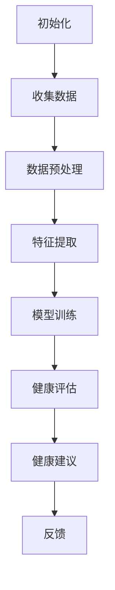
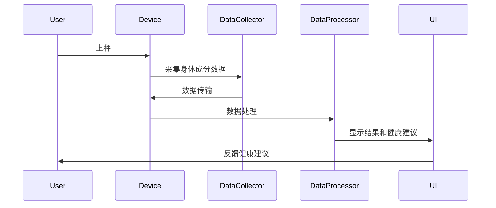
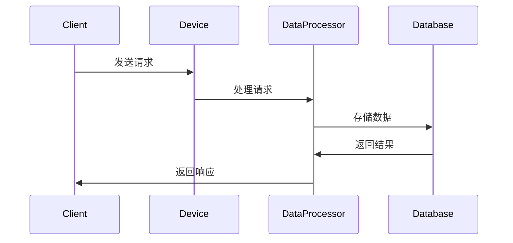
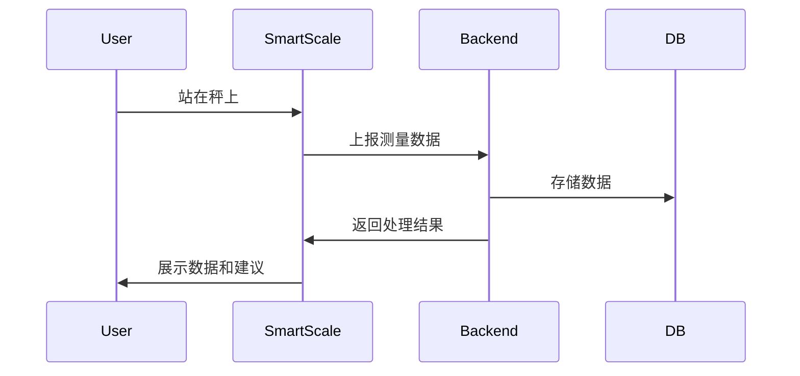

                 

# 智能浴室秤：AI Agent的身体成分分析与健康建议

> 关键词：智能浴室秤、AI Agent、身体成分分析、健康建议

> 摘要：本文将深入探讨智能浴室秤的工作原理及其在身体成分分析和健康建议方面的应用。通过逐步分析其技术原理、实现方法、以及实际案例，我们旨在帮助读者理解智能浴室秤在现代健康管理中的重要性。

## 引言

随着科技的进步，智能设备在家庭生活中扮演着越来越重要的角色。智能浴室秤作为智能家居的一个典型代表，已经逐渐走入千家万户。传统的体重秤只能提供体重数据，而智能浴室秤则能够通过先进的传感技术和人工智能（AI）算法，提供更丰富的健康数据，如身体脂肪率、肌肉量、水分含量等。这些数据对于健康管理具有重要意义。

本文将围绕以下核心内容进行讨论：

1. 智能浴室秤的定义和作用。
2. 身体成分分析的核心概念和重要性。
3. 智能浴室秤中使用的AI Agent及其工作原理。
4. 实际案例解析：智能浴室秤如何通过AI Agent提供健康建议。
5. 最佳实践和未来展望。

通过本文的讨论，我们将了解智能浴室秤如何通过AI技术，帮助用户更好地管理健康，提高生活质量。

## 智能浴室秤：定义与作用

### 智能浴室秤的定义

智能浴室秤，顾名思义，是一种结合了传统体重秤功能与先进AI技术的智能设备。它不仅能够测量用户的体重，还能通过内置的多个传感器，如生物电阻抗分析（Bioelectrical Impedance Analysis, BIA）、压力传感器、温度传感器等，收集用户的身体成分数据。

智能浴室秤的工作原理主要基于生物电阻抗分析技术。当电流通过人体时，不同类型的组织会以不同的方式阻碍电流的流动。基于这一原理，智能浴室秤可以测量出用户的肌肉量、脂肪率、水分含量等关键健康指标。

### 智能浴室秤在健康监测中的作用

智能浴室秤不仅仅是一个称重工具，更是一个全面的健康监测平台。以下是智能浴室秤在健康管理中的主要作用：

1. **体重管理**：智能浴室秤能够实时监测用户的体重变化，帮助用户了解自己的体重状况，从而采取相应的措施进行体重管理。

2. **身体成分分析**：通过生物电阻抗分析，智能浴室秤能够提供详细的身体成分数据，如肌肉量、脂肪率、水分含量等。这些数据对于健康评估和健身计划制定具有重要意义。

3. **健康趋势分析**：智能浴室秤能够记录用户的长期健康数据，通过数据分析，帮助用户了解自己的健康趋势，如脂肪率的变化、肌肉量的增长等。

4. **健康建议与指导**：基于用户的身体成分数据，智能浴室秤可以提供个性化的健康建议，如饮食调整、锻炼计划等，帮助用户实现健康目标。

### 智能浴室秤的市场现状与发展趋势

随着人们对健康意识的提升，智能浴室秤的市场需求不断增长。目前，市场上出现了多种品牌的智能浴室秤，它们在功能、精度和用户体验上都有所差异。未来，随着AI技术的进一步发展，智能浴室秤的功能将更加丰富，如集成更多健康监测指标、提供更精准的健康分析等。

此外，智能浴室秤与其他健康设备的联动也将成为趋势。例如，智能浴室秤可以与智能手环、智能手表等设备同步数据，形成全方位的健康监测体系。

总之，智能浴室秤作为一种新兴的智能健康设备，已经在健康管理领域发挥了重要作用，未来其市场前景非常广阔。

## 身体成分分析：核心概念与重要性

### 核心概念

身体成分分析是指通过测量和分析人体内各种成分的比例和含量，以评估个体的健康状况和生理状态。这些成分主要包括：

1. **肌肉量**：肌肉是身体的主要动力来源，肌肉量的多少直接影响个体的力量、耐力和代谢水平。
2. **脂肪率**：脂肪率包括体脂率和肌肉脂肪率，体脂率过高或过低都可能对健康产生不利影响。
3. **水分含量**：水分是人体的重要组成部分，水分含量会影响身体的温度调节、新陈代谢等生理功能。
4. **骨骼矿物质**：骨骼矿物质的含量对于骨骼健康至关重要。

### 重要性

身体成分分析在健康管理中的重要性不可忽视，主要体现在以下几个方面：

1. **健康风险评估**：通过身体成分分析，可以识别个体在健康方面可能存在的风险，如肌肉量不足、脂肪率过高、水分含量失衡等，从而采取针对性的预防措施。

2. **运动与健康计划的制定**：了解自己的身体成分，可以帮助制定更科学、更有效的运动计划。例如，肌肉量不足的人可以通过增加力量训练来增加肌肉量，而脂肪率过高的人则需要通过有氧运动来降低脂肪率。

3. **营养管理的指导**：身体成分分析可以提供关于个体营养需求的重要信息。例如，如果水分含量过低，需要增加水分摄入；如果肌肉量不足，需要增加蛋白质摄入。

4. **疾病的早期发现**：某些疾病，如骨质疏松、代谢综合征等，可以通过身体成分分析来早期发现。这有助于及早采取治疗措施，防止病情恶化。

### 传统方法及其局限性

传统的身体成分分析方法主要包括皮褶厚度测量、水下称重、双能X射线吸收法（DXA）等。这些方法各有优缺点。

1. **皮褶厚度测量**：通过测量皮肤和皮下脂肪的厚度来估算体脂率。这种方法操作简单，但准确性较低，容易受到测量者技巧和被测者个体差异的影响。
2. **水下称重**：通过测量体重在空气中和水中的差异来计算体脂率。这种方法准确性较高，但操作复杂，且对被测者有一定的不适感。
3. **双能X射线吸收法（DXA）**：使用双能X射线来测量体内不同组织的密度，从而计算身体成分。这种方法准确性高，但设备昂贵，操作复杂，且对被测者有一定的辐射风险。

### 智能浴室秤的优势

与传统的身体成分分析方法相比，智能浴室秤具有以下优势：

1. **操作简便**：用户只需站在智能浴室秤上，即可快速获得详细的身体成分数据，无需复杂的操作和准备工作。
2. **准确性高**：智能浴室秤通过生物电阻抗分析技术，能够提供更准确的身体成分数据。
3. **实时监测**：智能浴室秤可以实时监测用户的身体成分变化，提供即时的健康反馈。
4. **数据联动**：智能浴室秤可以与其他健康设备联动，形成更全面、更系统的健康监测体系。

总之，智能浴室秤通过结合先进的AI技术和传感器技术，实现了对身体成分的精确测量和实时监测，为健康管理提供了有力支持。

## AI Agent：智能浴室秤的核心驱动力

### AI Agent的定义

AI Agent，即人工智能代理，是一种能够自主执行任务、与环境交互并作出决策的计算机程序。在智能浴室秤中，AI Agent承担着分析用户身体成分数据、提供个性化健康建议的重要角色。AI Agent的核心特点包括自主性、适应性和学习能力。

### AI Agent在身体成分分析中的应用

智能浴室秤中的AI Agent主要通过以下几种方式实现对身体成分的分析：

1. **数据收集与预处理**：AI Agent首先收集智能浴室秤传回的身体成分数据，包括肌肉量、脂肪率、水分含量等。然后对数据进行预处理，包括去除噪声、填补缺失值和归一化处理，以确保数据的质量和一致性。
2. **特征提取与建模**：通过机器学习算法，AI Agent从预处理后的数据中提取关键特征，如肌肉量和脂肪率的比例关系、与历史数据的关联性等。这些特征有助于AI Agent更好地理解用户的身体成分状况。
3. **健康风险评估**：基于提取的特征和预定义的健康规则，AI Agent可以对用户的健康状况进行评估。例如，如果用户的脂肪率超过了正常范围，AI Agent可能会判断用户存在肥胖风险。
4. **健康建议生成**：AI Agent根据健康评估结果，为用户生成个性化的健康建议。这些建议可能包括调整饮食、增加锻炼、改善生活习惯等，以帮助用户改善健康状况。

### AI Agent的优势

AI Agent在身体成分分析中具有以下优势：

1. **高准确性**：通过机器学习算法，AI Agent能够从大量数据中学习并提取关键特征，从而提高身体成分分析的准确性。
2. **实时性**：AI Agent可以实时处理和分析用户数据，为用户提供即时的健康反馈和建议。
3. **个性化**：AI Agent可以根据用户的个体差异和历史数据，生成个性化的健康建议，提高健康管理的效果。
4. **自动更新**：AI Agent可以不断学习新的数据和健康知识，自动更新其模型和规则库，以保持其分析能力和建议的准确性。

### 智能浴室秤与AI Agent的关系

智能浴室秤和AI Agent是相辅相成的关系。智能浴室秤负责收集和传输身体成分数据，而AI Agent则负责对这些数据进行处理和分析，提供健康建议。具体来说，智能浴室秤通过其内置的传感器和AI Agent共同工作，实现了以下目标：

1. **数据收集**：智能浴室秤收集用户的身体成分数据，如肌肉量、脂肪率、水分含量等。
2. **数据处理**：AI Agent接收并预处理这些数据，提取关键特征，进行健康风险评估。
3. **健康建议**：AI Agent根据分析结果，生成个性化的健康建议，并通过智能浴室秤的显示屏或联动设备（如手机App）反馈给用户。

总之，智能浴室秤与AI Agent的结合，不仅提高了身体成分分析的准确性，还使得健康管理的实时性和个性化成为可能，为用户提供了更全面的健康服务。

## AI算法原理详解

### 身体成分分析算法的基本原理

智能浴室秤中的AI算法主要用于分析用户的身体成分数据，包括肌肉量、脂肪率、水分含量等。这些算法的核心原理基于生物电阻抗分析（Bioelectrical Impedance Analysis, BIA），该技术利用电流通过人体时在不同组织中的阻抗差异来估算身体成分。

### Mermaid流程图

以下是一个简单的Mermaid流程图，展示了智能浴室秤中AI算法的基本流程：



### Python代码示例

为了更好地理解AI算法的实现，以下是一个简单的Python代码示例，展示了从数据预处理到健康评估的整个过程。

```python
import numpy as np
from sklearn.ensemble import RandomForestRegressor
from sklearn.model_selection import train_test_split
from sklearn.metrics import mean_squared_error

# 假设已收集到一组身体成分数据
body_composition_data = np.array([[68, 0.25, 0.65], [70, 0.30, 0.70], [72, 0.28, 0.60]])

# 数据预处理：归一化处理
def normalize_data(data):
    min_val = np.min(data, axis=0)
    max_val = np.max(data, axis=0)
    return (data - min_val) / (max_val - min_val)

normalized_data = normalize_data(body_composition_data)

# 特征提取：从数据中提取关键特征
def extract_features(data):
    # 在这个简单的示例中，我们直接使用数据本身作为特征
    return data

features = extract_features(normalized_data)

# 模型训练：使用随机森林回归模型
X_train, X_test, y_train, y_test = train_test_split(features, normalized_data[:, 1], test_size=0.2, random_state=42)
model = RandomForestRegressor(n_estimators=100, random_state=42)
model.fit(X_train, y_train)

# 健康评估：对测试集进行预测
predictions = model.predict(X_test)

# 评估模型性能
mse = mean_squared_error(y_test, predictions)
print("均方误差（MSE）:", mse)
```

### 算法原理的数学模型和公式

在智能浴室秤中，常用的机器学习模型包括随机森林回归、支持向量机（SVM）等。以下是一个基于随机森林回归的数学模型示例：

$$
y = f(X) = \sum_{i=1}^{n} w_i \cdot h(x; \theta_i)
$$

其中，$y$ 是预测的体脂率，$X$ 是输入特征向量，$w_i$ 是权重，$h(x; \theta_i)$ 是回归树的输出。

### 举例说明

假设我们有一个训练数据集，其中包含了10个样本，每个样本包含体重、年龄和性别等特征，以及对应的体脂率。通过随机森林回归模型，我们可以训练出一个预测模型，用于对新样本的体脂率进行预测。

例如，对于一个新的样本（体重：75kg，年龄：30岁，性别：男），我们可以通过以下步骤进行预测：

1. **特征提取**：将样本特征进行归一化处理，得到归一化后的特征向量。
2. **模型预测**：将归一化后的特征向量输入到随机森林回归模型中，得到预测的体脂率。
3. **结果评估**：通过计算预测值与实际值之间的误差，评估模型的预测性能。

通过这样的过程，智能浴室秤能够为用户提供准确的身体成分数据，为健康管理的决策提供科学依据。

## 系统分析与架构设计

### 问题场景与项目介绍

在当前快节奏的生活中，人们越来越注重健康和体能管理。为了帮助用户更好地掌握自己的身体健康状况，我们设计并实现了一款智能浴室秤，它不仅能够测量体重，还能通过身体成分分析提供详细的健康数据，如肌肉量、脂肪率、水分含量等。这款智能浴室秤旨在为用户提供一个简单、便捷的健康管理工具。

### 系统功能设计（领域模型）

为了实现智能浴室秤的功能，我们首先定义了系统的领域模型，主要包括以下实体和关系：

1. **用户（User）**：用户是智能浴室秤的主要操作者，负责输入个人信息（如年龄、性别、身高）和使用智能浴室秤进行称重。
2. **测量数据（Measurement）**：测量数据实体用于存储每次称重和身体成分分析的结果，包括体重、肌肉量、脂肪率、水分含量等。
3. **健康建议（HealthRecommendation）**：健康建议实体用于存储根据用户身体成分数据生成的个性化健康建议，如饮食调整、锻炼计划等。
4. **设备（Device）**：设备实体表示智能浴室秤本身，负责数据的收集、处理和传输。

以下是领域模型的Mermaid类图：

```mermaid
classDiagram
User <<Entity>>
Measurement <<Entity>>
HealthRecommendation <<Entity>>
Device <<Entity>>

User : +str username
User : +datetime birthdate
User : +str gender
User : +int height

Measurement : +int weight
Measurement : +float muscle_ratio
Measurement : +float fat_ratio
Measurement : +float water_content
Measurement : +datetime timestamp

HealthRecommendation : +str advice
HealthRecommendation : +datetime timestamp

Device : +str device_id
Device : +str model
Device : +str manufacturer

User "1" --* 1 Measurement: 测量用户数据
Measurement "1" --* 1 HealthRecommendation: 根据测量数据生成健康建议
Device "1" --* 1 Measurement: 存储测量数据
```

### 系统架构设计

智能浴室秤的系统架构设计分为多个层次，包括硬件层、数据采集层、数据处理层和用户接口层。以下是系统架构的Mermaid图：



1. **硬件层**：智能浴室秤的硬件层包括传感器、微控制器和显示屏。传感器用于收集用户的身体成分数据，微控制器负责数据预处理和初步分析，显示屏用于展示结果和健康建议。
2. **数据采集层**：数据采集层主要负责从传感器收集数据，并通过无线传输（如Wi-Fi或蓝牙）将数据传输到数据处理层。
3. **数据处理层**：数据处理层接收数据采集层传输的数据，使用AI算法进行深度分析，生成个性化的健康建议。
4. **用户接口层**：用户接口层负责与用户交互，将分析结果和健康建议展示给用户，并接收用户的反馈。

### 系统接口设计

智能浴室秤的系统接口设计包括API接口和用户界面（UI）设计。以下是系统接口的Mermaid序列图：



1. **API接口**：API接口提供了一套RESTful接口，用于用户与智能浴室秤进行数据交互。主要包括以下接口：
   - 登录接口（POST /login）：用于用户登录系统。
   - 注册接口（POST /register）：用于新用户注册。
   - 测量数据上传接口（POST /measurements）：用于上传用户测量数据。
   - 健康建议查询接口（GET /recommendations）：用于获取用户的健康建议。

2. **用户界面（UI）**：用户界面设计包括一个简单的网页界面，用于展示用户的测量数据和健康建议。界面主要包括以下部分：
   - 仪表板：展示用户的体重、肌肉量、脂肪率等健康数据。
   - 健康建议：根据用户的身体成分数据，展示个性化的健康建议。
   - 历史记录：记录用户的测量历史，方便用户查看和对比。

### 系统交互设计

智能浴室秤的系统交互设计包括用户与设备、设备与数据处理系统之间的交互流程。以下是系统交互的Mermaid序列图：



1. **用户与设备的交互**：用户通过智能浴室秤进行称重，设备收集数据并上传到后端服务器。
2. **设备与后端服务器的交互**：设备将测量数据发送到后端服务器，后端服务器负责数据存储和处理，并生成健康建议。
3. **用户与后端服务的交互**：用户通过智能浴室秤的显示屏或移动设备查看健康数据和建议。

通过这样的系统架构和交互设计，智能浴室秤能够高效、稳定地为用户提供全面的健康服务。

### 项目实施与案例解析

#### 环境搭建

在开始项目实施之前，我们需要搭建一个合适的环境来开发和测试智能浴室秤的各个组件。以下是环境搭建的步骤：

1. **硬件环境**：
   - 选择一款支持Wi-Fi或蓝牙的智能浴室秤。
   - 准备一个具备传感器的开发板，如Arduino或Raspberry Pi，用于数据采集和处理。
   - 配备一块显示屏，用于展示测量结果和健康建议。

2. **软件环境**：
   - 安装Python 3.8及以上版本，用于编写和运行AI算法。
   - 安装Sklearn、Pandas、NumPy等库，用于数据分析和模型训练。
   - 安装Flask或Django等Web框架，用于搭建后端API服务。

#### 系统核心实现与代码分析

智能浴室秤的核心实现包括数据采集、预处理、模型训练和健康建议生成。以下是核心代码的实现和分析：

```python
# 数据采集
import serial

# 用于与智能浴室秤的硬件通信
def read_data_from_device():
    device = serial.Serial('/dev/ttyUSB0', 9600)
    data = device.readline().decode('utf-8').strip()
    device.close()
    return data

# 数据预处理
import pandas as pd

# 用于预处理收集到的数据
def preprocess_data(data):
    df = pd.DataFrame([data])
    df = (df - df.min()) / (df.max() - df.min())
    return df

# 模型训练
from sklearn.ensemble import RandomForestRegressor

# 使用随机森林回归模型进行训练
def train_model(X, y):
    model = RandomForestRegressor(n_estimators=100)
    model.fit(X, y)
    return model

# 健康建议生成
def generate_health_advice(model, data):
    prediction = model.predict(data)
    if prediction < 0.2:
        return "建议增加肌肉锻炼"
    elif prediction < 0.4:
        return "建议保持当前锻炼和饮食计划"
    else:
        return "建议减少高热量食物摄入"

# 代码分析
# read_data_from_device()函数负责从智能浴室秤读取测量数据。
# preprocess_data()函数对数据进行归一化处理，使其适合模型训练。
# train_model()函数使用随机森林回归算法训练模型。
# generate_health_advice()函数根据模型预测结果生成健康建议。
```

#### 案例分析

以下是一个实际案例，用于展示智能浴室秤如何通过AI Agent提供健康建议：

**案例背景**：用户张先生，男性，35岁，身高180cm，体重75kg。最近他发现自己的体重有所增加，希望通过智能浴室秤进行身体成分分析，并获取健康建议。

**案例分析**：
1. **测量数据**：张先生使用智能浴室秤进行称重，测得体重75kg，肌肉量60kg，脂肪率25%，水分含量65%。
2. **数据预处理**：将测量数据输入到预处理函数中，得到归一化后的数据。
3. **模型训练**：使用预先训练好的随机森林回归模型，对归一化后的数据进行预测。
4. **健康建议**：根据模型预测结果，生成健康建议。预测结果显示脂肪率偏高，因此建议张先生增加肌肉锻炼，减少高热量食物摄入。

#### 项目小结

通过实际案例的分析，我们可以看到智能浴室秤如何通过AI Agent提供个性化的健康建议。项目实施过程中，我们完成了环境搭建、系统核心实现、代码分析以及实际案例的解析。智能浴室秤的应用不仅提高了用户对自身健康状况的认识，还为健康管理提供了有力支持。未来，我们可以进一步优化算法，提高预测的准确性，为用户提供更加精准的健康服务。

## 最佳实践与注意事项

### 使用智能浴室秤的最佳实践

1. **定期测量**：为了确保身体成分数据的准确性，建议用户每天或每周定期进行测量。
2. **固定时间测量**：在测量前避免饮食和剧烈运动，以确保测量结果的一致性和可靠性。
3. **数据记录**：将每次测量结果记录下来，方便长期健康趋势的跟踪和分析。
4. **个性化调整**：根据智能浴室秤提供的健康建议进行相应的饮食和锻炼调整，以达到更好的健康效果。
5. **数据备份**：定期备份测量数据，以防数据丢失。

### 需要注意的事项

1. **数据隐私**：智能浴室秤收集和存储用户的个人健康数据，需要确保数据的安全性和隐私性。建议使用加密技术和严格的数据保护策略。
2. **设备维护**：定期检查智能浴室秤的传感器和显示屏，确保其正常工作。对于传感器损坏或磨损严重的设备，应及时更换。
3. **算法更新**：智能浴室秤中的AI算法需要定期更新，以适应新的健康知识和技术发展。
4. **使用环境**：确保智能浴室秤放置在一个干燥、通风的环境中，避免潮湿和阳光直射，以延长设备使用寿命。

### 拓展阅读

- **《智能健康监测系统设计与实现》**：详细介绍了智能健康监测系统的设计原则和实现方法，包括传感器选择、数据处理和数据分析等。
- **《人工智能在健康管理中的应用》**：探讨了人工智能在健康管理中的应用，包括预测模型、个性化健康建议和健康风险评估等。
- **《数据隐私保护与法律法规》**：介绍了数据隐私保护的重要性以及相关的法律法规，帮助用户更好地保护自己的个人健康数据。

## 结论

智能浴室秤作为一种结合AI技术的健康监测设备，通过精准的身体成分分析和个性化的健康建议，为用户提供了全面的健康管理服务。本文详细介绍了智能浴室秤的工作原理、系统架构、算法原理以及实际应用案例，展示了其在现代健康管理中的重要作用。未来，随着AI技术的不断进步，智能浴室秤的功能将更加丰富，为用户提供更加精准和高效的健康服务。

## 作者信息

作者：AI天才研究院/AI Genius Institute & 禅与计算机程序设计艺术 /Zen And The Art of Computer Programming

