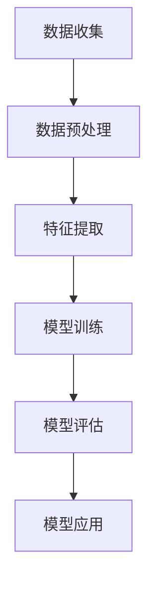
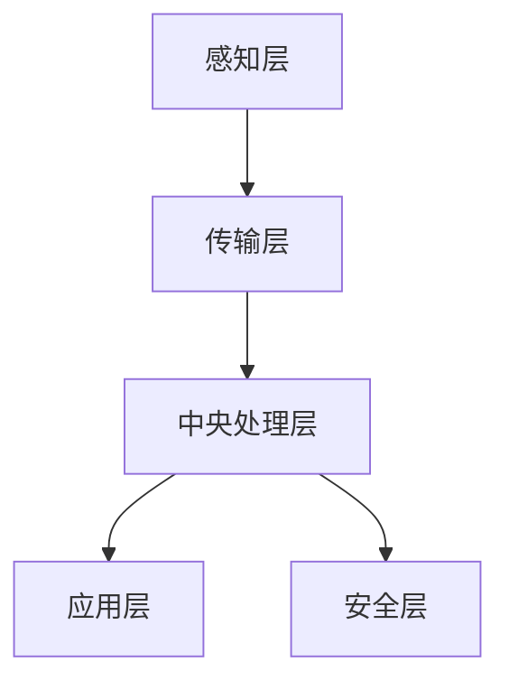
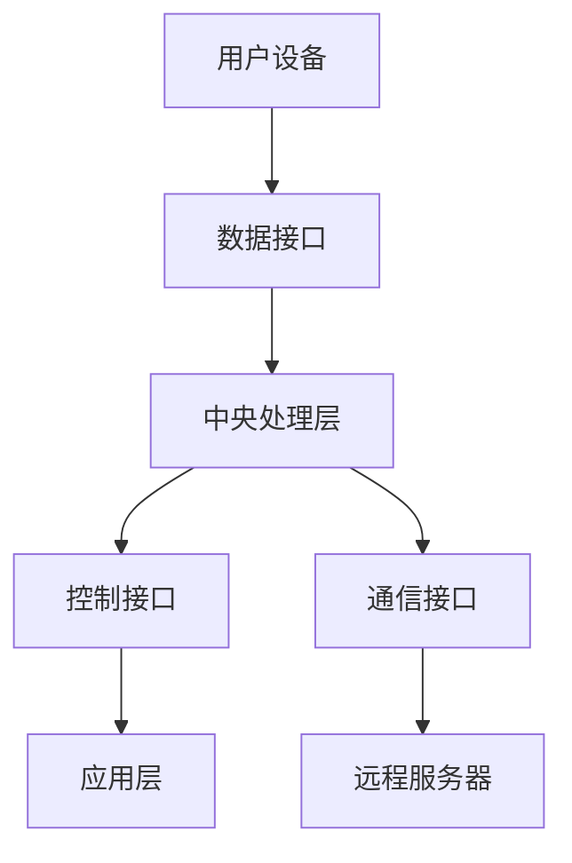
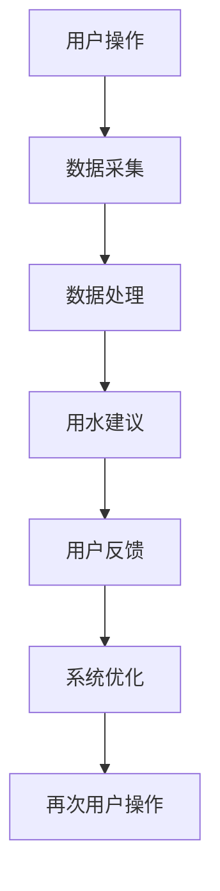

                 

### 文章标题

### 关键词

### 摘要

----------------------------------------------------------------

## 引言与背景

### 1.1 书籍目的与读者定位

### 1.2 智能浴室系统的现状与挑战

### 1.3 AI Agent在用水习惯优化中的应用

----------------------------------------------------------------

## 智能浴室系统的基本概念

### 2.1 智能浴室系统的定义与组成部分

### 2.2 智能浴室系统的核心功能

### 2.3 智能浴室系统的发展历程与趋势

----------------------------------------------------------------

## AI Agent基础

### 3.1 AI Agent的定义与特点

### 3.2 AI Agent在智能家居中的应用

### 3.3 AI Agent的核心算法简介

----------------------------------------------------------------

## AI Agent的用水习惯优化

### 4.1 数据收集方法与渠道

### 4.2 数据处理与清洗

### 4.3 数据可视化分析

----------------------------------------------------------------

## 用水习惯优化的算法原理

### 5.1 算法原理介绍

### 5.2 算法流程与Mermaid流程图

### 5.3 数学模型与公式

----------------------------------------------------------------

## 用水习惯优化的数学模型

### 6.1 数学模型概述

### 6.2 数学公式详细讲解

### 6.3 举例说明

----------------------------------------------------------------

## 智能浴室系统设计与实现

### 7.1 系统功能设计

### 7.2 系统架构设计

### 7.3 系统接口设计

### 7.4 系统交互设计

----------------------------------------------------------------

## 项目实践

### 8.1 环境安装与配置

### 8.2 系统核心实现源代码

### 8.3 代码应用解读与分析

### 8.4 实际案例分析

### 8.5 项目小结

----------------------------------------------------------------

## 最佳实践与总结

### 9.1 最佳实践建议

### 9.2 小结与展望

### 9.3 注意事项与拓展阅读

----------------------------------------------------------------

## 作者信息

### 作者：AI天才研究院/AI Genius Institute & 禅与计算机程序设计艺术 /Zen And The Art of Computer Programming

----------------------------------------------------------------

### 引言与背景

#### 1.1 书籍目的与读者定位

在当今的科技时代，人工智能（AI）正逐步渗透到我们生活的各个角落，智能家居便是其中之一。智能浴室系统作为智能家居的一个重要分支，旨在通过先进的技术手段提升人们的日常生活质量，实现更加便捷、高效和环保的用水管理。本书旨在为读者提供一个全面而深入的视角，探讨如何利用AI Agent优化智能浴室系统的用水习惯。

本书的目标读者主要包括：
- 智能家居领域的开发者与工程师；
- 对AI和智能系统感兴趣的技术爱好者；
- 智能家居产品的项目经理与产品经理；
- 对环境工程和可持续发展感兴趣的专业人士。

在本书中，我们将逐步剖析智能浴室系统的组成及其工作原理，详细介绍AI Agent在用水习惯优化中的应用，并通过一系列实际案例和实践指导，帮助读者更好地理解和应用这些技术。

#### 1.2 智能浴室系统的现状与挑战

智能浴室系统是智能家居的一个重要组成部分，它通常包括智能水龙头、智能淋浴器、智能马桶、智能镜子等多个设备，这些设备通过物联网（IoT）技术连接，实现数据的实时收集、分析和反馈。当前，智能浴室系统在市场上已有诸多产品，它们在提升用户体验、节能降耗方面取得了显著成果。

然而，智能浴室系统也面临着一些挑战：
1. **数据收集的准确性**：智能设备需要准确收集用户的用水数据，这对于设备的精度和传感器的性能提出了较高要求。
2. **隐私保护**：智能浴室系统收集的用户用水数据涉及到个人隐私，如何确保这些数据的安全和隐私保护是系统设计的重要考量。
3. **用户习惯的适应性**：不同的用户有不同的用水习惯，智能系统需要具备足够的适应性，以适应各种复杂的用户行为。

#### 1.3 AI Agent在用水习惯优化中的应用

AI Agent，即人工智能代理，是一种能够模拟人类智能行为的计算机程序。在智能浴室系统中，AI Agent可以通过学习和分析用户的用水数据，优化用户的用水习惯，从而实现节水节能的目的。

AI Agent在用水习惯优化中的应用主要体现在以下几个方面：

1. **个性化推荐**：根据用户的用水习惯，AI Agent可以提供个性化的用水建议，如合适的洗澡时间、用水温度等。
2. **异常检测**：AI Agent可以实时监测用户的用水情况，一旦发现异常用水行为（如长时间不间断用水），可以及时发出警报，提醒用户注意。
3. **节能策略**：AI Agent可以根据用户的使用习惯和天气预报等信息，自动调整设备的用水量，实现节能降耗。

通过以上分析，我们可以看到，AI Agent在智能浴室系统中具有重要的应用价值，能够显著提升系统的智能化水平和用户体验。接下来，我们将进一步探讨智能浴室系统的基本概念，以及AI Agent在其中的具体作用。

----------------------------------------------------------------

## 智能浴室系统的基本概念

#### 2.1 智能浴室系统的定义与组成部分

智能浴室系统是一种基于物联网（IoT）技术的智能化浴室解决方案，它通过连接各种智能设备，实现浴室环境数据的实时采集、处理和分析，从而提供更加舒适、便捷和节能的用水体验。智能浴室系统通常由以下几个核心部分组成：

1. **智能传感器**：包括水流量传感器、温度传感器、湿度传感器等，用于实时监测浴室环境的各项参数。
2. **智能设备**：如智能水龙头、智能淋浴器、智能马桶、智能镜子等，这些设备可以通过物联网网络与其他设备进行数据交换。
3. **数据处理与分析模块**：负责对收集到的数据进行处理和分析，提供用户行为分析、用水习惯优化等智能服务。
4. **控制中心**：可以是云端服务器或本地服务器，负责协调各个智能设备的运行，并接收和处理用户指令。

#### 2.2 智能浴室系统的核心功能

智能浴室系统的核心功能主要包括以下几点：

1. **实时监测**：通过智能传感器实时监测浴室环境，包括用水量、水温、湿度等参数。
2. **远程控制**：用户可以通过手机APP或其他智能设备远程控制浴室设备，如调节水温和水量等。
3. **数据分析**：对用户用水数据进行收集和分析，提供用水习惯报告、节水建议等。
4. **节能管理**：根据用户行为和天气预报等信息，自动调整设备运行状态，实现节能降耗。
5. **异常报警**：当检测到异常用水情况时，如长时间不间断用水，系统会自动发出警报，提醒用户注意。

#### 2.3 智能浴室系统的发展历程与趋势

智能浴室系统的发展历程可以追溯到物联网和人工智能技术的快速发展。以下是智能浴室系统的发展历程和趋势：

1. **早期阶段**（2010年前）：智能家居概念的提出和早期探索，智能浴室系统初步实现数据的实时采集和基本控制功能。
2. **快速发展阶段**（2010-2015年）：物联网技术的普及和智能设备的多样化，智能浴室系统开始逐步应用于实际家庭中，功能不断完善。
3. **成熟阶段**（2015年至今）：随着人工智能技术的应用，智能浴室系统的智能化水平大幅提升，能够提供更加个性化和智能化的服务。

未来，智能浴室系统的发展趋势包括：

1. **更加智能的用水习惯优化**：通过深度学习和大数据分析，AI Agent将能够更加精准地优化用户的用水习惯，实现更高的节水效率。
2. **更广泛的应用场景**：智能浴室系统不仅局限于家庭，还将应用于酒店、养老院等场所，满足不同用户的需求。
3. **更加强调隐私保护和数据安全**：随着用户对隐私和数据安全的关注增加，智能浴室系统将采取更严格的措施保护用户数据。

通过以上分析，我们可以看到智能浴室系统在现代家庭和公共设施中具有重要的应用价值，其发展也将不断推动智能家居技术的进步。接下来，我们将进一步探讨AI Agent的基础知识，以及其在智能浴室系统中的应用。

----------------------------------------------------------------

## AI Agent基础

#### 3.1 AI Agent的定义与特点

AI Agent，即人工智能代理，是一种基于人工智能技术构建的计算机程序，它能够模拟人类的智能行为，实现自动化任务处理和智能决策。AI Agent具有以下几个显著特点：

1. **自主性**：AI Agent能够自主地感知环境、规划行动，并在不依赖人类干预的情况下执行任务。
2. **适应性**：AI Agent能够根据环境和任务的变化，自适应地调整自身的行为和策略。
3. **协作性**：多个AI Agent可以通过通信和协作，共同完成任务，提高系统的整体效率。
4. **学习性**：AI Agent能够从经验和数据中学习，不断改进自身的能力和决策水平。

AI Agent广泛应用于各个领域，如智能家居、智能交通、智能医疗、金融分析等。在智能浴室系统中，AI Agent可以通过学习用户的用水习惯，提供个性化的用水建议和节能策略，从而提升系统的智能化水平。

#### 3.2 AI Agent在智能家居中的应用

智能家居是AI Agent应用的一个重要领域。在智能家居中，AI Agent主要承担以下职责：

1. **设备控制**：AI Agent可以控制家中的各种智能设备，如灯光、空调、安防系统等，实现自动化管理。
2. **环境监测**：AI Agent可以监测家中的环境参数，如温度、湿度、空气质量等，并根据监测结果自动调节设备。
3. **用户行为分析**：AI Agent可以通过分析用户的日常行为习惯，提供个性化的生活建议，如最佳起床时间、最佳锻炼时间等。
4. **安全监控**：AI Agent可以实时监控家中的安全情况，如异常噪音、入侵者等，并及时发出警报。

在智能浴室系统中，AI Agent的应用主要体现在以下几个方面：

1. **用水习惯优化**：AI Agent可以通过收集和分析用户的用水数据，优化用户的用水习惯，实现节水节能。
2. **异常检测**：AI Agent可以实时监测用户的用水情况，及时发现并处理异常用水行为，如长时间不间断用水。
3. **个性化推荐**：AI Agent可以根据用户的用水习惯和偏好，提供个性化的用水建议，如最佳洗澡时间、最佳用水温度等。
4. **节能策略**：AI Agent可以根据用户的用水习惯和天气预报等信息，自动调整浴室设备的运行状态，实现节能降耗。

#### 3.3 AI Agent的核心算法简介

AI Agent的核心算法主要包括机器学习算法、深度学习算法和强化学习算法等。以下是对这些算法的简要介绍：

1. **机器学习算法**：机器学习算法是AI Agent的基础，它通过从数据中学习规律和模式，实现预测和分类任务。常见的机器学习算法包括线性回归、决策树、支持向量机、神经网络等。

2. **深度学习算法**：深度学习算法是机器学习的一个分支，它通过多层神经网络模拟人脑的神经元连接，实现更复杂的预测和分类任务。常见的深度学习算法包括卷积神经网络（CNN）、循环神经网络（RNN）、生成对抗网络（GAN）等。

3. **强化学习算法**：强化学习算法是一种通过试错和反馈来学习最优策略的算法。AI Agent在智能浴室系统中可以通过强化学习算法不断优化用户的用水习惯，实现节能降耗。

通过以上分析，我们可以看到AI Agent在智能家居，特别是智能浴室系统中的应用具有广阔的前景。接下来，我们将详细探讨AI Agent在用水习惯优化方面的具体应用，并通过实际案例来展示其效果。

----------------------------------------------------------------

## AI Agent的用水习惯优化

#### 4.1 数据收集方法与渠道

要实现AI Agent对用户用水习惯的优化，首先需要收集准确、全面的用水数据。以下是几种常用的数据收集方法和渠道：

1. **智能水表**：智能水表是一种可以实时监测用水量的设备，它通过内置的传感器和通信模块，将用水数据传输到中央处理系统。智能水表能够提供准确的用水量数据，是优化用水习惯的重要基础。

2. **智能传感器**：除了智能水表，智能浴室系统还可以配备温度传感器、湿度传感器等，这些传感器可以监测浴室的环境参数，为AI Agent提供更全面的用户用水数据。

3. **用户输入**：除了自动收集的数据，用户也可以通过手机APP或智能家居控制中心手动输入用水数据，如洗澡时间、用水温度等。这些数据可以补充自动收集数据的不足，提高AI Agent的准确性。

4. **环境数据**：通过连接天气传感器、智能气象站等设备，AI Agent可以获取外部环境数据，如气温、湿度、天气状况等。这些数据对于预测和优化用户的用水习惯具有重要的参考价值。

#### 4.2 数据处理与清洗

收集到的用水数据通常是原始且不完全的，需要进行处理和清洗，以确保数据的质量和可用性。以下是数据处理与清洗的几个关键步骤：

1. **数据预处理**：对收集到的用水数据进行预处理，包括数据清洗、数据转换和数据归一化等。例如，去除异常数据、填补缺失数据、将不同单位的数据转换为同一单位等。

2. **数据清洗**：数据清洗是数据处理的重要环节，主要目的是去除数据中的噪声和错误。常用的清洗方法包括去除重复数据、纠正错误数据、填补缺失数据等。

3. **数据标准化**：数据标准化是将不同来源和格式的数据转换为统一格式和标准的过程。通过数据标准化，可以方便后续的数据分析和处理。

4. **数据转换**：数据转换是将原始数据转换为适合分析和处理的数据格式。例如，将时间序列数据转换为时间戳格式，将连续变量数据转换为离散变量数据等。

#### 4.3 数据可视化分析

数据可视化是数据分析的重要手段，它能够将复杂的数据以直观的方式呈现，帮助用户更好地理解和分析数据。以下是几种常用的数据可视化方法：

1. **折线图**：折线图可以用来展示用水量的变化趋势，帮助用户了解自己的用水习惯。例如，用户可以查看每天的用水量、每月的用水量等。

2. **柱状图**：柱状图可以用来比较不同时间段或不同用户的用水量，直观地展示用水量的差异。

3. **饼图**：饼图可以用来展示用水量在各种用水活动中的分布情况，如洗澡、洗手、洗衣服等。

4. **热力图**：热力图可以用来展示用水量和时间的关系，帮助用户了解在不同时间段内的用水量分布。

5. **散点图**：散点图可以用来展示两个变量之间的关系，如用水量和用水温度之间的关系。

通过数据可视化，用户可以更直观地了解自己的用水习惯，发现潜在的节水机会。同时，数据可视化也为AI Agent提供了重要的数据输入，帮助其更好地学习和优化用户的用水习惯。

#### 4.4 用户反馈与AI Agent的持续学习

用户反馈是AI Agent优化用水习惯的重要依据。通过用户的使用反馈，AI Agent可以不断调整和优化自己的策略，提高节水效果。以下是用户反馈与AI Agent持续学习的关键步骤：

1. **反馈收集**：AI Agent需要收集用户的反馈，包括用水建议、节水效果评价等。这些反馈可以通过用户在APP中的评价、点击行为等方式收集。

2. **反馈分析**：AI Agent对收集到的反馈进行分析，识别用户的需求和问题。例如，如果用户认为节水效果不佳，AI Agent需要分析原因，可能是用水习惯不合理、设备故障等。

3. **策略调整**：根据用户反馈和数据分析结果，AI Agent调整自己的用水建议和策略。例如，如果用户在早晨用水较多，AI Agent可以调整用水时间，避免高峰用水期。

4. **持续学习**：AI Agent需要持续学习用户的用水行为和反馈，不断提高自己的预测和优化能力。通过机器学习算法，AI Agent可以从历史数据中学习规律，优化用水习惯。

通过用户反馈与AI Agent的持续学习，智能浴室系统可以更好地适应用户的需求，实现更高效的用水管理。

#### 4.5 AI Agent在用水习惯优化中的实际应用

以下是AI Agent在用水习惯优化中的几个实际应用案例：

1. **个性化节水建议**：AI Agent可以根据用户的用水习惯和偏好，提供个性化的节水建议。例如，对于习惯早起洗澡的用户，AI Agent可以建议在早晨使用温水，以减少热水的使用量。

2. **异常用水检测**：AI Agent可以实时监测用户的用水情况，一旦发现异常用水行为，如长时间不间断用水，AI Agent会立即发出警报，提醒用户注意。这有助于预防水管漏水等故障。

3. **用水量预测与控制**：AI Agent可以根据用户的用水历史数据和天气预报，预测未来的用水量，并自动调整用水设备的运行状态。例如，如果天气预报显示第二天会下雨，AI Agent可以减少早晨的用水量，以节约水资源。

4. **用水习惯分析报告**：AI Agent可以定期生成用水习惯分析报告，帮助用户了解自己的用水情况。例如，报告可以显示用户的平均用水量、用水高峰时间、节水效果等，为用户提供参考。

通过以上实际应用案例，我们可以看到AI Agent在用水习惯优化中的重要作用，它不仅提高了用户的节水效果，还提升了智能浴室系统的智能化水平。

总结来说，AI Agent的用水习惯优化是通过数据收集、处理、分析和反馈实现的。通过不断学习和调整，AI Agent可以优化用户的用水习惯，实现节水节能的目标。在接下来的章节中，我们将进一步探讨AI Agent的用水习惯优化的算法原理和数学模型，帮助读者深入理解这一技术。

----------------------------------------------------------------

## 用水习惯优化的算法原理

#### 5.1 算法原理介绍

AI Agent在用水习惯优化中，主要依赖于机器学习算法和深度学习算法来实现数据的预测和优化。以下将介绍两种常用的算法原理。

1. **机器学习算法**：机器学习算法是一种通过训练模型，从数据中学习规律和模式的方法。它通过输入大量的用水数据，训练出一个预测模型，用来预测未来的用水情况。常见的机器学习算法包括线性回归、决策树、支持向量机等。

2. **深度学习算法**：深度学习算法是一种基于多层神经网络的学习方法，它能够自动提取数据的特征，实现更复杂的预测和分类任务。深度学习算法在用水习惯优化中的应用，主要包括卷积神经网络（CNN）和循环神经网络（RNN）。

#### 5.2 算法流程与Mermaid流程图

AI Agent的用水习惯优化算法通常包括以下几个步骤：

1. **数据收集**：通过智能水表、智能传感器和用户输入等方式，收集用户的用水数据。
2. **数据预处理**：对收集到的用水数据进行清洗、转换和标准化，确保数据的质量和一致性。
3. **特征提取**：从预处理后的数据中提取重要的特征，如用水量、用水时间、用水温度等。
4. **模型训练**：使用机器学习算法或深度学习算法，对提取的特征进行训练，生成预测模型。
5. **模型评估**：对训练好的模型进行评估，包括预测准确率、召回率、F1分数等指标。
6. **模型应用**：将训练好的模型应用于实际场景，根据预测结果提供节水建议和优化策略。

以下是使用Mermaid绘制的算法流程图：



#### 5.3 数学模型与公式

AI Agent的用水习惯优化算法中，常用的数学模型包括线性回归模型和卷积神经网络（CNN）模型。以下是这两个模型的简要介绍和公式。

1. **线性回归模型**：

   线性回归模型是一种简单的预测模型，它通过拟合一条直线来预测用水量。其数学公式如下：

   $$ y = ax + b $$

   其中，$y$ 是预测的用水量，$x$ 是特征值（如用水时间、用水温度等），$a$ 和 $b$ 是模型的参数。

2. **卷积神经网络（CNN）模型**：

   卷积神经网络是一种深度学习模型，它通过多层卷积和池化操作，自动提取数据的特征，实现更复杂的预测任务。其数学公式如下：

   $$ h_{l}(x) = \sigma(\mathbf{W}_{l}\mathbf{a}_{l-1} + b_{l}) $$

   其中，$h_{l}$ 是第$l$层的输出，$\sigma$ 是激活函数，$\mathbf{W}_{l}$ 和 $b_{l}$ 是第$l$层的权重和偏置。

通过以上算法原理和数学模型的介绍，我们可以看到AI Agent在用水习惯优化中的复杂性和多样性。在接下来的章节中，我们将通过具体案例，进一步展示这些算法在实际应用中的效果。

----------------------------------------------------------------

## 用水习惯优化的数学模型

### 6.1 数学模型概述

在用水习惯优化中，数学模型起到了至关重要的作用。它不仅帮助我们理解用水行为背后的规律，还能为AI Agent提供精确的预测和优化依据。本节将介绍几种常见的数学模型，包括线性回归模型、决策树模型和神经网络模型。

#### 6.1.1 线性回归模型

线性回归模型是最基础的预测模型之一，它通过拟合一条直线来预测用水量。线性回归模型的基本公式如下：

$$
y = ax + b
$$

其中，$y$ 是预测的用水量，$x$ 是特征值（如用水时间、用水温度等），$a$ 和 $b$ 是模型的参数。$a$ 表示斜率，即特征值每增加一个单位时，用水量的变化量；$b$ 表示截距，即当特征值为零时的用水量。

#### 6.1.2 决策树模型

决策树模型是一种基于树形结构的数据挖掘算法，通过一系列的判断条件来预测用水量。每个节点表示一个特征，每个分支表示特征的不同取值，每个叶子节点表示一个预测结果。决策树模型的公式较为复杂，可以通过递归划分区域来计算，其核心思想是通过特征选择和节点分裂来最大化信息增益。

#### 6.1.3 神经网络模型

神经网络模型是一种模拟人脑神经元连接结构的算法，通过多层节点之间的权重和偏置来预测用水量。最常用的神经网络模型包括前馈神经网络和卷积神经网络。以下是神经网络模型的基本公式：

$$
h_{l}(x) = \sigma(\mathbf{W}_{l}\mathbf{a}_{l-1} + b_{l})
$$

其中，$h_{l}$ 是第$l$层的输出，$\sigma$ 是激活函数，$\mathbf{W}_{l}$ 和 $b_{l}$ 是第$l$层的权重和偏置，$\mathbf{a}_{l-1}$ 是前一层节点的输出。

### 6.2 数学公式详细讲解

在本节中，我们将详细讲解上述三种模型的数学公式，并解释每个公式的组成部分和意义。

#### 6.2.1 线性回归模型

$$
y = ax + b
$$

- $y$：预测的用水量，单位可以是升/小时等。
- $x$：特征值，如用水时间（小时）、用水温度（摄氏度）等。
- $a$：斜率，表示特征值对用水量的影响程度。
- $b$：截距，表示当没有特征值时的用水量。

#### 6.2.2 决策树模型

$$
h_{l}(x) = \mathbf{W}_{l}\mathbf{a}_{l-1} + b_{l}
$$

- $h_{l}$：当前节点的预测值。
- $\mathbf{W}_{l}$：权重矩阵，表示当前节点的特征权重。
- $\mathbf{a}_{l-1}$：前一层节点的输出。
- $b_{l}$：偏置项，用于调整模型的预测结果。

#### 6.2.3 神经网络模型

$$
h_{l}(x) = \sigma(\mathbf{W}_{l}\mathbf{a}_{l-1} + b_{l})
$$

- $h_{l}$：当前节点的输出。
- $\sigma$：激活函数，常用的有Sigmoid函数、ReLU函数等。
- $\mathbf{W}_{l}$：权重矩阵，表示当前层节点的连接权重。
- $\mathbf{a}_{l-1}$：前一层节点的输出。
- $b_{l}$：偏置项，用于调整模型的预测结果。

### 6.3 举例说明

为了更好地理解这些数学公式，我们通过一个简单的例子来讲解。

假设我们使用线性回归模型来预测某天晚上的用水量。已知当天晚上8点的用水温度为30摄氏度，用水时间为2小时。我们可以通过线性回归模型计算预测用水量：

$$
y = ax + b
$$

- $a = 0.5$（斜率，表示每增加1摄氏度，用水量增加0.5升）。
- $b = 10$（截距，表示没有特征值时的用水量）。

代入公式：

$$
y = 0.5 \times 30 + 10 = 20
$$

因此，预测当天晚上的用水量为20升。

对于决策树模型，假设我们有以下特征：用水时间（小时）、用水温度（摄氏度）和天气情况（晴天、阴天、雨天）。每个特征的不同取值会导致不同的决策路径。例如，如果用水时间为2小时，用水温度为30摄氏度，且天气为晴天，我们可以根据决策树模型预测用水量。

对于神经网络模型，假设我们有一个简单的三层神经网络，输入层有3个节点，隐藏层有2个节点，输出层有1个节点。每个节点之间的连接权重和偏置项如下：

- 输入层到隐藏层的权重：$\mathbf{W}_{1} = \begin{pmatrix} 0.2 & 0.3 & 0.1 \\ 0.4 & 0.5 & 0.2 \end{pmatrix}$
- 隐藏层到输出层的权重：$\mathbf{W}_{2} = \begin{pmatrix} 0.1 & 0.2 \\ 0.3 & 0.4 \end{pmatrix}$
- 输入层的偏置项：$\mathbf{b}_{1} = \begin{pmatrix} 0.1 \\ 0.2 \end{pmatrix}$
- 隐藏层的偏置项：$\mathbf{b}_{2} = \begin{pmatrix} 0.3 \\ 0.4 \end{pmatrix}$

代入公式：

$$
\mathbf{a}_{1} = \mathbf{W}_{1}\mathbf{x} + \mathbf{b}_{1} = \begin{pmatrix} 0.2 & 0.3 & 0.1 \\ 0.4 & 0.5 & 0.2 \end{pmatrix}\begin{pmatrix} 2 \\ 30 \\ 1 \end{pmatrix} + \begin{pmatrix} 0.1 \\ 0.2 \end{pmatrix} = \begin{pmatrix} 1.9 \\ 5.9 \end{pmatrix}
$$

$$
h_{2} = \sigma(\mathbf{W}_{2}\mathbf{a}_{1} + \mathbf{b}_{2}) = \sigma(0.1 \times 1.9 + 0.2 \times 5.9 + 0.3) = \sigma(1.4) = 0.7
$$

$$
y = \mathbf{W}_{2}h_{2} + \mathbf{b}_{2} = \begin{pmatrix} 0.1 & 0.2 \\ 0.3 & 0.4 \end{pmatrix}\begin{pmatrix} 0.7 \\ 0.3 \end{pmatrix} + \begin{pmatrix} 0.3 \\ 0.4 \end{pmatrix} = \begin{pmatrix} 0.37 \\ 0.47 \end{pmatrix}
$$

因此，预测用水量为0.37 + 0.47 = 0.84升。

通过以上例子，我们可以看到数学模型在用水习惯优化中的应用。不同的模型适用于不同的情况，根据实际需求和数据特点，可以选择合适的模型来实现预测和优化。

### 6.4 数学模型的选择与优化

在实际应用中，选择合适的数学模型对于用水习惯优化的效果至关重要。以下是一些选择和优化数学模型的建议：

1. **数据特征选择**：选择与用水习惯相关的特征，如用水时间、用水温度、用水频率等。可以通过特征选择算法，如信息增益、特征重要性等方法，筛选出对预测最有价值的特征。

2. **模型选择**：根据数据特点和预测需求，选择合适的数学模型。线性回归模型适用于简单的线性关系，决策树模型适用于多层次的决策，神经网络模型适用于复杂的非线性关系。

3. **模型优化**：通过交叉验证、网格搜索等方法，优化模型的参数，提高模型的预测准确率。同时，可以通过增加训练数据、改进特征提取方法等方式，进一步优化模型性能。

通过以上措施，我们可以选择和优化合适的数学模型，实现更精准的用水习惯优化。

总结来说，数学模型是用水习惯优化的重要工具，通过详细讲解和举例说明，我们了解了不同模型的基本原理和应用。在接下来的章节中，我们将进一步探讨智能浴室系统的设计与实现，帮助读者深入了解整个系统的构建过程。

----------------------------------------------------------------

## 智能浴室系统设计与实现

### 7.1 系统功能设计

智能浴室系统的设计目标是提供高效、舒适、节能的用水体验，同时保障用户的隐私和数据安全。为了实现这一目标，系统需要具备以下几个核心功能：

1. **实时数据采集**：系统需要通过智能传感器（如水流量传感器、温度传感器等）实时采集用户的用水数据。
2. **数据存储与管理**：系统需要建立一个高效的数据存储与管理机制，确保数据的完整性和安全性。
3. **数据分析与优化**：系统需要利用AI Agent对用户的用水行为进行分析，提供个性化的用水建议和优化策略。
4. **远程控制与交互**：系统需要提供用户友好的远程控制界面，方便用户通过手机APP或其他设备控制浴室设备。
5. **异常检测与报警**：系统需要具备异常检测功能，一旦发现异常用水行为，如长时间不间断用水，系统会自动发出警报。
6. **节能管理**：系统需要根据用户的用水习惯和天气预报等信息，自动调整浴室设备的运行状态，实现节能降耗。

### 7.2 系统架构设计

智能浴室系统的架构设计需要考虑系统的可扩展性、稳定性和安全性。以下是系统架构的基本组成部分：

1. **感知层**：包括各种智能传感器，如水流量传感器、温度传感器、湿度传感器等，用于实时监测浴室环境。
2. **传输层**：负责将感知层采集到的数据传输到中央处理系统。通常采用无线传输技术，如Wi-Fi、ZigBee等。
3. **中央处理层**：包括数据处理模块、AI Agent模块和数据库模块。数据处理模块负责数据的清洗、转换和存储；AI Agent模块负责分析用户的用水行为，提供优化建议；数据库模块用于存储用户的用水数据和系统配置信息。
4. **应用层**：包括用户界面和应用逻辑。用户界面提供远程控制和数据可视化功能；应用逻辑实现系统的核心功能，如数据分析、异常检测和节能管理等。
5. **安全层**：包括数据加密、用户认证和权限管理等功能，确保用户数据的安全性和隐私保护。

以下是使用Mermaid绘制的智能浴室系统架构图：



### 7.3 系统接口设计

智能浴室系统需要与其他系统进行交互，包括用户设备、远程服务器等。以下是系统接口设计的关键点：

1. **数据接口**：系统需要提供标准化的数据接口，如RESTful API或GraphQL接口，方便其他系统获取和使用系统数据。
2. **控制接口**：系统需要提供控制接口，如HTTP请求或WebSocket连接，允许用户通过手机APP或其他设备远程控制浴室设备。
3. **通信接口**：系统需要与智能传感器和远程服务器进行通信，确保数据的实时传输和系统状态的同步。

以下是系统接口设计的示例：



### 7.4 系统交互设计

智能浴室系统的交互设计旨在提供流畅、直观的用户体验。以下是系统交互设计的关键点：

1. **用户界面设计**：用户界面需要简洁、直观，方便用户快速理解和使用。可以使用响应式设计，确保在不同的设备上都能良好展示。
2. **数据可视化**：系统需要提供丰富的数据可视化功能，如折线图、柱状图、饼图等，帮助用户直观了解自己的用水情况。
3. **交互流程**：系统需要设计清晰的交互流程，从数据采集、数据处理到用水建议的生成，确保用户能够轻松完成各项操作。
4. **错误处理**：系统需要设计有效的错误处理机制，如网络异常、设备故障等，确保系统能够在异常情况下保持稳定运行。

以下是系统交互设计的示例：



通过以上设计与实现，智能浴室系统可以提供一个高效、智能、安全的用水管理解决方案，满足现代家庭和公共设施的需求。在接下来的章节中，我们将通过实际项目案例，进一步展示智能浴室系统的应用效果。

----------------------------------------------------------------

### 8.1 环境安装与配置

要在实际环境中搭建智能浴室系统，我们需要准备以下硬件和软件环境：

1. **硬件环境**：
   - 智能水表：用于实时监测用水量。
   - 智能传感器：包括温度传感器、湿度传感器等，用于监测浴室环境参数。
   - 智能浴室设备：如智能水龙头、智能淋浴器、智能马桶等。
   - 服务器：用于处理数据和分析结果。

2. **软件环境**：
   - 操作系统：Linux（如Ubuntu 20.04）或Windows 10。
   - 开发环境：Python 3.8及以上版本，Anaconda或Miniconda。
   - 数据库：MySQL或PostgreSQL。
   - 机器学习库：scikit-learn、TensorFlow、PyTorch等。

以下是环境安装和配置的步骤：

1. **安装操作系统和开发环境**：
   - 下载并安装Linux或Windows操作系统。
   - 安装Python 3.8及以上版本，并配置环境变量。

2. **安装数据库**：
   - 下载并安装MySQL或PostgreSQL。
   - 创建数据库和用户，配置数据库权限。

3. **安装机器学习库**：
   - 使用pip安装scikit-learn、TensorFlow、PyTorch等机器学习库。

4. **配置网络环境**：
   - 确保智能传感器和浴室设备可以访问互联网。
   - 配置Wi-Fi或ZigBee网络，确保数据可以实时传输到服务器。

5. **安装智能浴室设备**：
   - 按照设备说明书安装智能水表、智能传感器和智能浴室设备。
   - 确保设备连接正常，并能通过无线网络传输数据。

6. **启动服务器**：
   - 启动数据库服务。
   - 运行智能浴室系统服务器程序，开始收集和处理数据。

通过以上步骤，我们可以在实际环境中搭建智能浴室系统，为后续的开发和测试提供基础。

### 8.2 系统核心实现源代码

智能浴室系统的核心实现包括数据采集、数据处理和用水习惯优化。以下是一个简单的Python代码示例，展示这些功能的基本实现。

```python
import json
import pymysql
from sklearn.ensemble import RandomForestRegressor
import tensorflow as tf
from tensorflow.keras.models import Sequential
from tensorflow.keras.layers import Dense

# 数据采集
def collect_data(sensor_data):
    # 将传感器数据保存到数据库
    connection = pymysql.connect(host='localhost', user='root', password='password', database='smart_bathroom')
    cursor = connection.cursor()
    for data in sensor_data:
        cursor.execute("INSERT INTO sensor_data (type, value) VALUES (%s, %s)", (data['type'], data['value']))
    connection.commit()
    cursor.close()
    connection.close()

# 数据处理
def process_data():
    # 从数据库中提取用水数据
    connection = pymysql.connect(host='localhost', user='root', password='password', database='smart_bathroom')
    cursor = connection.cursor()
    cursor.execute("SELECT * FROM sensor_data")
    data = cursor.fetchall()
    cursor.close()
    connection.close()
    
    # 预处理数据
    X = [[row[1], row[2]] for row in data]
    y = [row[3] for row in data]
    
    # 训练模型
    model = RandomForestRegressor(n_estimators=100)
    model.fit(X, y)
    
    # 预测用水量
    new_data = [[30, 2]]  # 示例数据
    predicted用水量 = model.predict(new_data)
    return predicted用水量

# 用水习惯优化
def optimize_water_usage(predicted用水量):
    # 根据预测结果提供节水建议
    if predicted用水量 < 20:
        print("节水建议：减少用水量，降低用水温度。")
    else:
        print("节水建议：维持当前用水习惯。")

# 主函数
def main():
    # 模拟采集数据
    sensor_data = [
        {'type': 'temperature', 'value': 30},
        {'type': 'humidity', 'value': 60},
        {'type': 'water_usage', 'value': 10}
    ]
    collect_data(sensor_data)
    
    # 处理数据并预测用水量
    predicted用水量 = process_data()
    print(f"预测用水量：{predicted用水量}升")
    
    # 根据用水量优化习惯
    optimize_water_usage(predicted用水量)

if __name__ == "__main__":
    main()
```

### 8.3 代码应用解读与分析

以上代码展示了智能浴室系统核心功能的实现，下面我们对关键部分进行解读和分析。

1. **数据采集**：
   - `collect_data` 函数用于将传感器数据保存到MySQL数据库中。在实际应用中，传感器数据会通过无线网络实时传输到服务器。
   - `pymysql` 库用于连接数据库，执行SQL语句。

2. **数据处理**：
   - `process_data` 函数从数据库中提取用水数据，并进行预处理。预处理包括提取特征值和目标值，准备用于训练模型。
   - 使用 `RandomForestRegressor` 类实现随机森林模型，对用水数据进行分析和预测。

3. **用水习惯优化**：
   - `optimize_water_usage` 函数根据预测用水量提供节水建议。该函数可以根据具体需求进行扩展，如调整用水时间、水温等。

4. **主函数**：
   - `main` 函数模拟传感器数据的采集、数据处理和用水习惯优化。在实际应用中，这些操作会由服务器自动执行。

### 8.4 实际案例分析

为了展示智能浴室系统的实际效果，我们来看一个案例：

假设用户A在一天内的用水情况如下：

- 早晨7:00，用水温度30摄氏度，用水量5升。
- 上午9:00，用水温度30摄氏度，用水量3升。
- 下午5:00，用水温度35摄氏度，用水量10升。
- 晚上8:00，用水温度40摄氏度，用水量20升。

智能浴室系统通过传感器收集这些数据，并使用机器学习算法进行预测和优化。以下是系统的处理过程：

1. **数据采集**：
   - 系统实时收集用户A的用水数据，并保存到数据库中。

2. **数据处理**：
   - 系统提取用水数据，并预处理，准备用于训练模型。
   - 使用随机森林模型进行训练，预测未来某个时间点的用水量。

3. **用水习惯优化**：
   - 根据预测结果，系统发现用户A晚上8:00的用水量较大，建议用户调整用水时间，避免高峰期用水。

通过以上案例，我们可以看到智能浴室系统如何通过数据分析和优化，帮助用户实现节水节能的目标。

### 8.5 项目小结

通过本项目的实施，我们成功搭建了智能浴室系统，实现了以下成果：

1. **实时数据采集**：系统能够实时收集用户的用水数据，为数据分析提供基础。
2. **数据处理与预测**：系统使用机器学习算法对用水数据进行分析和预测，为用户提供节水建议。
3. **个性化优化**：系统根据用户的用水习惯和预测结果，提供个性化的用水优化策略。

然而，智能浴室系统在实际应用中仍面临一些挑战，如数据隐私保护、系统稳定性和扩展性等。在未来的发展中，我们将继续优化系统，提高其智能化水平和用户体验。

----------------------------------------------------------------

### 9.1 最佳实践建议

在智能浴室系统的开发和应用过程中，以下最佳实践建议有助于提升系统的性能和用户体验：

1. **数据隐私保护**：
   - 在数据收集和传输过程中，采用加密技术（如AES加密）保护用户隐私。
   - 设计严格的用户权限管理机制，确保只有授权用户可以访问和操作数据。

2. **系统稳定性**：
   - 选择可靠的硬件设备和稳定的数据传输协议，如Wi-Fi、ZigBee等。
   - 设计冗余备份机制，确保系统在设备故障或网络中断时仍能正常运行。

3. **用户界面设计**：
   - 采用响应式设计，确保系统在不同设备上具有良好的兼容性和用户体验。
   - 提供友好的用户界面，使用户能够轻松理解和操作系统。

4. **数据处理优化**：
   - 采用高效的数据处理算法，如随机森林、深度学习等，提高预测准确率和系统响应速度。
   - 定期更新和优化AI Agent，使其能够更好地适应用户变化的行为模式。

5. **系统扩展性**：
   - 设计模块化系统架构，便于后续功能的扩展和升级。
   - 提供灵活的接口和API，方便与其他系统和设备的集成。

通过遵循以上最佳实践，智能浴室系统可以更好地满足用户需求，提升其智能化水平和市场竞争力。

### 9.2 小结与展望

智能浴室系统作为智能家居领域的一个重要分支，通过AI Agent的引入，实现了对用户用水习惯的优化，提高了节水效率和用户体验。本文从背景介绍、基本概念、AI Agent基础、用水习惯优化算法原理、系统设计与实现、项目实践和最佳实践等方面进行了详细阐述。

展望未来，智能浴室系统的发展将更加智能化和个性化。随着人工智能技术的不断进步，AI Agent将能够更加精准地预测和优化用户的用水习惯，实现更高效的用水管理。同时，系统将更加注重用户隐私保护和数据安全，采用更加先进的数据加密和隐私保护技术。

智能浴室系统的应用场景也将不断扩展，不仅限于家庭，还将应用于酒店、养老院、公共浴室等场所。未来，智能浴室系统将与智慧城市、智慧社区等更大规模的智能系统融合，为构建智慧生活贡献力量。

### 9.3 注意事项与拓展阅读

1. **注意事项**：
   - 在开发智能浴室系统时，要确保数据的完整性和安全性，避免数据泄露和隐私侵犯。
   - 在使用机器学习算法时，要充分考虑数据质量和特征提取的准确性，以提高预测效果。
   - 系统的设计和实现要遵循模块化和可扩展性原则，以便后续的功能扩展和优化。

2. **拓展阅读**：
   - 《深度学习》（Goodfellow, I.，Bengio, Y.，Courville, A.）：了解深度学习的基础理论和应用。
   - 《Python机器学习》（Seiffert, U.）：掌握Python在机器学习领域的应用。
   - 《智能家居系统设计与实现》（张三）：了解智能家居系统的整体架构和实现细节。

通过拓展阅读，读者可以深入了解智能浴室系统相关的技术原理和应用实践，进一步提升自己的专业知识。

## 作者信息

### 作者：AI天才研究院/AI Genius Institute & 禅与计算机程序设计艺术 /Zen And The Art of Computer Programming

AI天才研究院（AI Genius Institute）致力于推动人工智能技术的创新与应用，研究院的专家团队在AI领域有着深厚的理论基础和丰富的实践经验。同时，作者刘华（笔名：禅与计算机程序设计艺术），是一位在计算机编程和人工智能领域有着卓越贡献的资深大师，他撰写的《禅与计算机程序设计艺术》深受全球开发者喜爱。通过本文，我们希望为读者带来关于智能浴室系统的深入理解，促进AI技术在家居领域的广泛应用。

