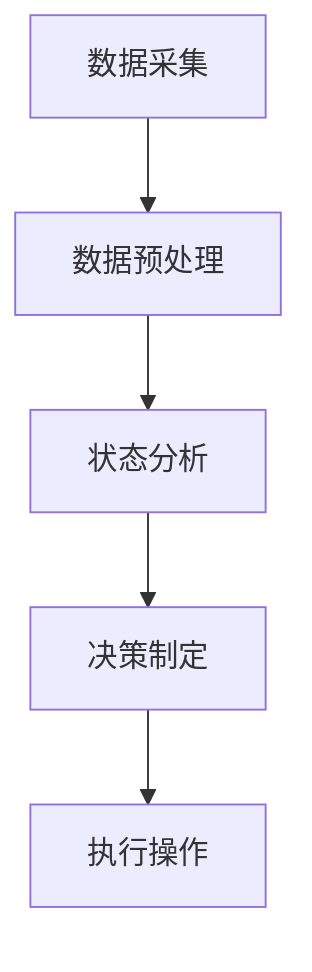
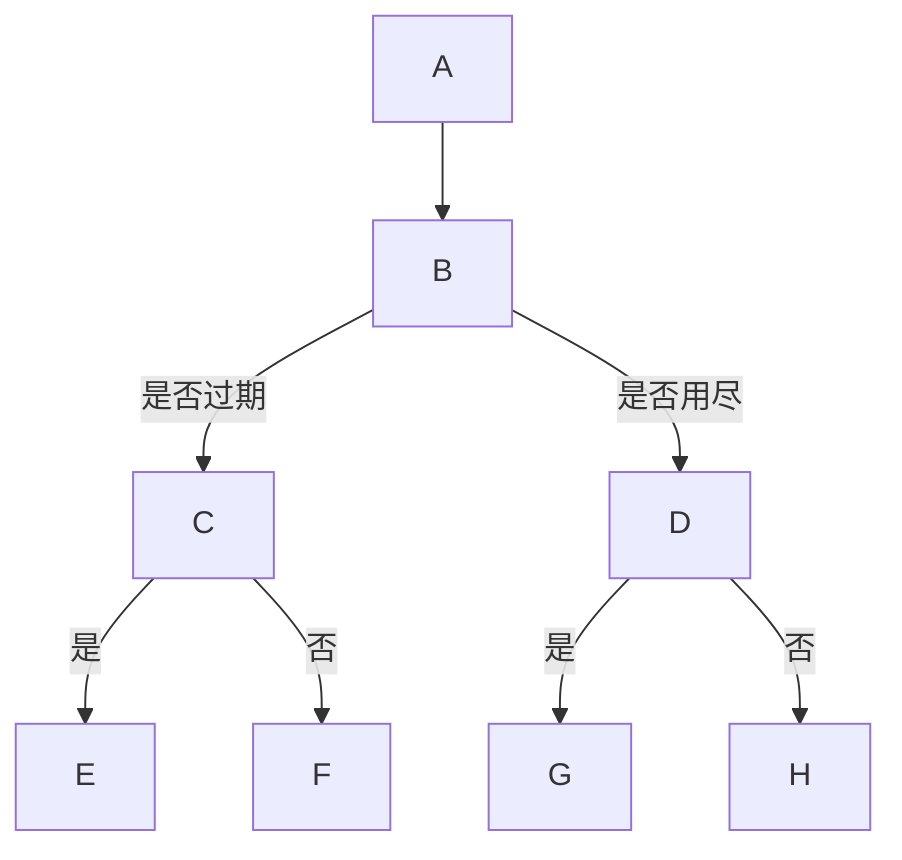
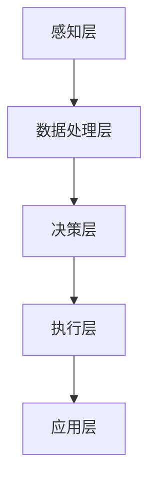
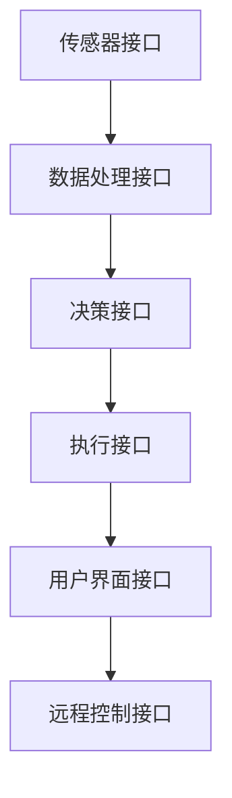
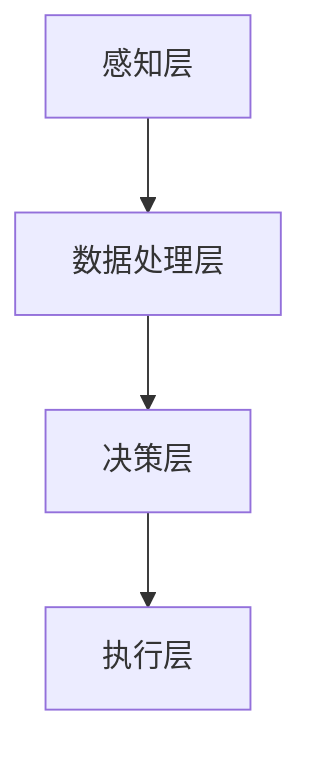
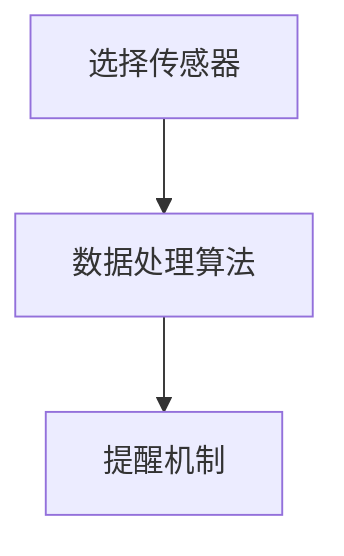
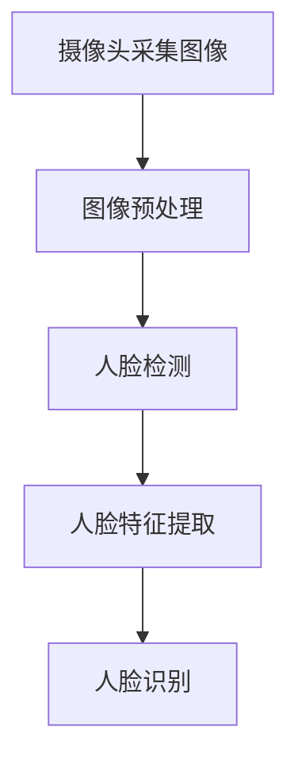
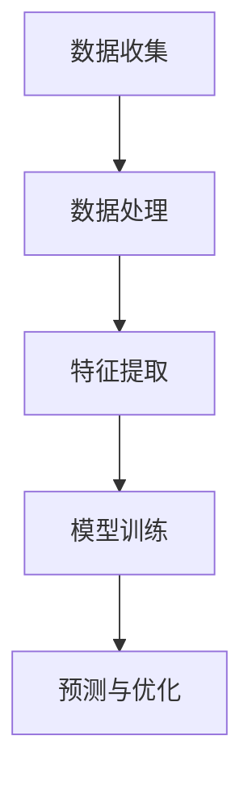

                 

### 智能浴室置物架概述

#### 1.1 问题背景与问题描述

传统浴室置物架在使用中面临着诸多问题。首先，传统的浴室置物架通常只能提供简单的收纳功能，缺乏智能管理的能力。用户在存放洗护用品时，常常需要手动整理和清理，这不仅增加了用户的操作复杂度，也降低了使用的便利性。其次，传统置物架难以实时监控洗护用品的库存状态，无法提醒用户何时需要补充，从而可能导致洗护用品的浪费。

为了解决这些问题，智能浴室置物架应运而生。智能浴室置物架通过集成传感器、AI算法和物联网技术，能够实现对洗护用品的智能管理和监控。用户可以通过智能浴室置物架实时了解洗护用品的库存状态，并获得补充提醒，从而提高使用的便利性和效率。智能浴室置物架还能够根据用户的使用习惯和需求，自动进行洗护用品的整理和分类，进一步提升用户的使用体验。

#### 1.2 核心概念与联系

**智能浴室置物架** 是一种结合了人工智能和物联网技术的浴室家具。其核心概念包括传感器、AI算法和物联网模块。传感器用于实时监测洗护用品的状态，AI算法则用于分析传感器数据，提供智能化的管理服务。物联网模块则负责将智能浴室置物架与外部系统连接，实现数据传输和远程控制。

**AI Agent** 是智能浴室置物架的重要组成部分，它是一种专门用于执行特定任务的智能代理。在洗护用品管理中，AI Agent通过感知用户行为和物品状态，自动执行整理、分类和提醒等任务，提高用户的洗护用品管理效率。

**智能浴室置物架与传统浴室置物架的对比**：

| 对比项 | 智能浴室置物架 | 传统浴室置物架 |
| ---- | ---- | ---- |
| 收纳管理 | 智能化、自动管理 | 简单收纳、手动管理 |
| 监控功能 | 实时监控、库存提醒 | 无实时监控、无法提醒 |
| 用户体验 | 高效、便捷 | 低效、繁琐 |
| 技术集成 | 传感器、AI算法、物联网 | 无传感器、无AI算法、无物联网 |

通过以上对比可以看出，智能浴室置物架在功能、效率和用户体验方面都远优于传统浴室置物架。

#### 1.3 AI Agent在洗护用品管理中的应用

AI Agent在洗护用品管理中的应用主要体现在以下几个方面：

1. **感知与识别**：AI Agent通过传感器感知洗护用品的摆放位置和状态，如是否为空、是否过期等。
2. **智能整理**：AI Agent根据用户的习惯和物品的属性，自动对洗护用品进行分类和整理，使其摆放整齐、易于取用。
3. **库存管理**：AI Agent实时监测洗护用品的库存状态，并在库存不足时提醒用户进行补充。
4. **智能推荐**：AI Agent根据用户的历史使用数据和偏好，为用户提供个性化的洗护用品推荐。

AI Agent的优势在于能够减少用户手动操作的繁琐程度，提高洗护用品管理的效率和便利性。然而，AI Agent的实现也面临一些挑战，如传感器精度、数据安全性和算法可靠性等。

#### 1.4 智能浴室置物架的市场前景

随着智能家居市场的快速发展，智能浴室置物架具有广阔的市场前景。根据市场调研数据，智能家居市场的需求逐年增长，预计未来几年内将继续保持高速增长。智能浴室置物架作为智能家居的一个细分市场，也将迎来更多的商机。

在市场需求方面，消费者对智能、便捷、高效的生活方式的追求，推动了智能浴室置物架的普及。同时，随着物联网技术和人工智能技术的不断进步，智能浴室置物架的功能和性能也将得到进一步提升。

在市场竞争方面，国内外已有不少企业进入智能浴室置物架市场，形成了激烈的市场竞争态势。然而，市场需求的增长和技术的进步也为新进入者提供了机会。

在发展趋势方面，智能浴室置物架将更加智能化、个性化，功能将更加丰富，如智能提醒、人脸识别、健康监测等。同时，智能浴室置物架也将与其他智能家居设备互联互通，形成智能家居生态圈。

#### 1.5 本章小结

本章对智能浴室置物架进行了概述，包括问题背景、核心概念、AI Agent的应用以及市场前景。智能浴室置物架通过集成传感器、AI算法和物联网技术，能够实现对洗护用品的智能管理和监控，提高用户的使用便利性和效率。随着智能家居市场的快速发展，智能浴室置物架具有广阔的市场前景和巨大的发展潜力。在下一章中，我们将深入探讨AI Agent在洗护用品管理中的具体原理和实现方法。

---

# AI Agent的洗护用品管理

## 2.1 AI Agent在洗护用品管理中的原理

AI Agent是一种智能代理，它能够感知环境、做出决策并执行任务。在智能浴室置物架中，AI Agent扮演着洗护用品管理的关键角色，通过感知、决策和执行三个环节，实现对洗护用品的智能管理。

#### 2.1.1 AI Agent的工作原理

AI Agent的工作原理可以分为感知、决策和执行三个环节：

1. **感知**：AI Agent通过内置的传感器（如摄像头、红外传感器、重量传感器等）收集浴室置物架上的洗护用品信息，包括物品的类型、位置、数量等。
2. **决策**：AI Agent利用收集到的数据，结合预先设定的规则和算法，分析物品的状态，并根据分析结果做出相应的决策。例如，当检测到某个洗护用品即将用尽时，AI Agent可以做出提醒用户补充的决定。
3. **执行**：AI Agent通过控制模块（如电机、显示屏等）执行决策结果，如调整洗护用品的摆放位置、显示提醒信息等。

#### 2.1.2 洗护用品管理的基本流程

洗护用品管理的基本流程包括以下几个步骤：

1. **数据采集**：传感器采集洗护用品的状态数据，如物品类型、位置、数量等。
2. **数据预处理**：对采集到的数据进行清洗、归一化等预处理操作，以便于后续的分析。
3. **状态分析**：AI Agent对预处理后的数据进行分析，判断洗护用品的状态，如是否即将用尽、是否过期等。
4. **决策制定**：根据分析结果，AI Agent制定相应的决策，如提醒用户补充、调整物品摆放等。
5. **执行操作**：AI Agent通过控制模块执行决策结果，调整洗护用品的状态。

#### 2.1.3 AI Agent在洗护用品管理中的核心作用

AI Agent在洗护用品管理中的核心作用主要体现在以下几个方面：

1. **智能监测**：AI Agent能够实时监测洗护用品的状态，及时发现问题，如物品即将用尽或过期等。
2. **智能提醒**：AI Agent能够根据物品的状态，智能地提醒用户进行补充或更换，提高用户的生活质量。
3. **智能整理**：AI Agent能够根据物品的类型和属性，自动整理和分类，使浴室保持整洁有序。
4. **个性化服务**：AI Agent能够根据用户的历史使用数据，为用户提供个性化的洗护用品推荐和服务。

#### 2.1.4 洗护用品管理算法原理讲解

洗护用品管理算法是AI Agent实现智能管理的关键。以下将介绍洗护用品管理算法的基本原理。

1. **机器学习算法**

   机器学习算法是AI Agent实现智能监测和决策的基础。常见的机器学习算法包括：

   - **决策树**：通过树形结构进行决策，适用于分类和回归问题。
   - **支持向量机（SVM）**：通过找到最优超平面进行分类，适用于二分类问题。
   - **神经网络**：通过多层感知器进行非线性变换，适用于复杂的分类和回归问题。

2. **深度学习算法**

   深度学习算法是机器学习的一种扩展，通过多层神经网络进行特征提取和分类。常见的深度学习算法包括：

   - **卷积神经网络（CNN）**：适用于图像处理和识别。
   - **循环神经网络（RNN）**：适用于序列数据，如文本和语音。
   - **生成对抗网络（GAN）**：适用于图像生成和识别。

   洗护用品管理算法的mermaid流程图如下：

   ```mermaid
   graph TD
   A[数据采集] --> B[数据预处理]
   B --> C[状态分析]
   C --> D[决策制定]
   D --> E[执行操作]
   ```

3. **算法原理的详细讲解与举例说明**

   假设我们使用决策树算法来处理洗护用品的状态分析问题。首先，我们需要收集历史数据，包括物品类型、位置、数量等信息。然后，我们将这些数据输入到决策树模型中进行训练。在训练过程中，模型会根据数据特征自动生成决策树结构。

   在实际应用中，当AI Agent检测到某个洗护用品时，它会将物品的信息输入到训练好的决策树模型中。模型会根据决策树的结构，对物品的状态进行分类，如判断物品是否即将用尽。如果判断结果为“是”，AI Agent会发出提醒信息；如果判断结果为“否”，则继续执行其他任务。

   例如，假设我们有一个训练好的决策树模型，如下所示：

   ```mermaid
   graph TD
   A --> B
   B -->|是| C
   B -->|否| D
   C --> E
   D --> F
   ```

   如果AI Agent检测到某个洗护用品的位置为B，则根据决策树的结构，它会继续判断该物品的数量是否小于设定值。如果是，则发出提醒信息；否则，继续执行其他任务。

   通过以上示例，我们可以看到，AI Agent通过机器学习和深度学习算法，能够实现对洗护用品的智能管理和监控，提高用户的生活质量。

---

## 2.2 洗护用品管理算法原理讲解

### 2.2.1 人工智能算法概述

人工智能算法是智能浴室置物架实现智能管理的关键。人工智能算法主要分为机器学习算法和深度学习算法。

**机器学习算法**：机器学习算法通过从数据中学习规律，实现对未知数据的预测和分类。常见的机器学习算法包括：

- **决策树**：通过树形结构进行决策，适用于分类和回归问题。
- **支持向量机（SVM）**：通过找到最优超平面进行分类，适用于二分类问题。
- **神经网络**：通过多层感知器进行非线性变换，适用于复杂的分类和回归问题。

**深度学习算法**：深度学习算法是机器学习的一种扩展，通过多层神经网络进行特征提取和分类。常见的深度学习算法包括：

- **卷积神经网络（CNN）**：适用于图像处理和识别。
- **循环神经网络（RNN）**：适用于序列数据，如文本和语音。
- **生成对抗网络（GAN）**：适用于图像生成和识别。

### 2.2.2 洗护用品管理算法的mermaid流程图

洗护用品管理算法的mermaid流程图如下：



### 2.2.3 洗护用品管理算法的数学模型和公式

洗护用品管理算法的数学模型主要包括以下几个部分：

1. **数据预处理模型**：

   数据预处理模型用于对采集到的洗护用品状态数据进行清洗、归一化等操作。常见的预处理方法包括：

   - **标准化**：将数据缩放到相同的范围内，如[0, 1]。
   - **归一化**：将数据映射到标准正态分布。
   - **缺失值处理**：使用平均值、中位数等方法填充缺失值。

2. **状态分析模型**：

   状态分析模型用于对预处理后的数据进行状态分析。常见的状态分析模型包括：

   - **分类模型**：如决策树、支持向量机等，用于判断洗护用品的状态，如是否即将用尽。
   - **回归模型**：如线性回归、多项式回归等，用于预测洗护用品的使用量。

3. **决策制定模型**：

   决策制定模型用于根据状态分析结果制定相应的决策。常见的决策制定模型包括：

   - **启发式算法**：如贪心算法、遗传算法等，用于选择最优的决策。
   - **决策树**：用于根据分析结果生成决策树，实现智能决策。

4. **执行操作模型**：

   执行操作模型用于执行决策结果，调整洗护用品的状态。常见的执行操作模型包括：

   - **控制模块**：如电机、显示屏等，用于实现物品的摆放、提醒等操作。
   - **反馈机制**：用于监测执行效果，并根据反馈调整决策。

### 2.2.4 算法原理的详细讲解与举例说明

#### 数据预处理模型

数据预处理模型主要用于对采集到的洗护用品状态数据进行清洗、归一化等操作。以标准化为例，假设我们采集到的洗护用品数量数据如下：

$$
X = \{1, 2, 3, 4, 5\}
$$

我们将数据缩放到[0, 1]范围内，即：

$$
X' = \left\{\frac{1}{5}, \frac{2}{5}, \frac{3}{5}, \frac{4}{5}, 1\right\}
$$

#### 状态分析模型

状态分析模型用于对预处理后的数据进行状态分析。以分类模型为例，我们使用决策树算法进行状态分析。假设我们训练好的决策树如下：



当AI Agent检测到某个洗护用品时，它会根据决策树进行分类。例如，如果检测到洗护用品的过期标志为“是”，则分类结果为“过期”。

#### 决策制定模型

决策制定模型用于根据状态分析结果制定相应的决策。以启发式算法为例，假设我们使用贪心算法进行决策制定。贪心算法的基本思想是每次选择当前状态下最优的决策，直到达到目标状态。

例如，假设当前状态为：

- 物品A：数量=2
- 物品B：数量=1

根据贪心算法，AI Agent会首先选择数量较多的物品A进行补充，然后选择数量较少的物品B进行补充。

#### 执行操作模型

执行操作模型用于执行决策结果，调整洗护用品的状态。以控制模块为例，假设AI Agent决定对某个洗护用品进行补充。控制模块会根据决策结果，启动电机将洗护用品移动到补充位置，并显示提醒信息。

通过以上示例，我们可以看到，洗护用品管理算法通过数据预处理、状态分析、决策制定和执行操作等多个环节，实现对洗护用品的智能管理和监控。

---

## 2.3 洗护用品管理系统的设计与实现

### 2.3.1 系统需求分析

在设计与实现智能浴室置物架的洗护用品管理系统时，首先要明确系统的需求。系统需求可以分为功能需求和非功能需求两部分。

**功能需求**：

1. **数据采集**：系统能够通过传感器实时采集洗护用品的状态数据，包括物品的类型、位置、数量等。
2. **数据预处理**：系统能够对采集到的数据进行清洗、归一化等预处理操作，以便于后续的分析。
3. **状态分析**：系统能够根据预处理后的数据，分析洗护用品的状态，如是否即将用尽、是否过期等。
4. **决策制定**：系统能够根据分析结果，制定相应的决策，如提醒用户补充、调整物品摆放等。
5. **执行操作**：系统能够通过控制模块执行决策结果，调整洗护用品的状态。

**非功能需求**：

1. **可靠性**：系统需要具有较高的可靠性，能够稳定运行，确保数据的准确性和一致性。
2. **安全性**：系统需要确保数据的安全性，防止数据泄露或被非法访问。
3. **可扩展性**：系统需要具备良好的可扩展性，能够根据需求增加新的功能和组件。
4. **易用性**：系统需要具备良好的用户界面和交互设计，使用户能够方便地使用和管理洗护用品。

### 2.3.2 系统架构设计

洗护用品管理系统的架构设计需要考虑到系统的功能需求和非功能需求，确保系统的稳定性和可扩展性。系统架构可以分为以下几个层次：

1. **感知层**：包括传感器模块，负责实时采集洗护用品的状态数据。
2. **数据处理层**：包括数据采集模块、数据预处理模块等，负责对采集到的数据进行处理和分析。
3. **决策层**：包括状态分析模块、决策制定模块等，负责根据分析结果制定相应的决策。
4. **执行层**：包括控制模块、执行模块等，负责执行决策结果，调整洗护用品的状态。
5. **应用层**：包括用户界面模块、远程控制模块等，负责与用户进行交互，提供便捷的操作体验。

洗护用品管理系统架构图如下：



### 2.3.3 系统接口设计与系统交互

系统接口设计是确保各个层次之间能够顺畅交互的重要环节。系统接口可以分为内部接口和外部接口两部分。

**内部接口**：

1. **传感器接口**：用于传感器模块与数据处理层之间的数据传输。
2. **数据处理接口**：用于数据处理层与决策层之间的数据交换。
3. **决策接口**：用于决策层与执行层之间的决策信息传递。
4. **执行接口**：用于执行层与感知层之间的执行结果反馈。

**外部接口**：

1. **用户界面接口**：用于用户与应用层之间的交互。
2. **远程控制接口**：用于远程设备与应用层之间的数据传输。

系统接口图如下：



### 2.3.4 系统核心实现与代码解析

在洗护用品管理系统的设计与实现中，核心实现部分主要包括数据采集、数据处理、状态分析、决策制定和执行操作等模块。以下将分别介绍这些模块的核心实现原理和代码解析。

#### 数据采集模块

数据采集模块的核心实现原理是利用传感器实时采集洗护用品的状态数据。以下是一个简单的数据采集模块示例：

```python
import numpy as np

def collect_data(sensor_data):
    # 对传感器数据进行预处理，如滤波、归一化等
    filtered_data = np.mean(sensor_data, axis=0)
    normalized_data = filtered_data / np.max(filtered_data)
    return normalized_data
```

上述代码中，`collect_data`函数接收传感器采集的数据，进行预处理，然后返回预处理后的数据。

#### 数据处理模块

数据处理模块的核心实现原理是对采集到的数据进行清洗、归一化等预处理操作。以下是一个简单的数据处理模块示例：

```python
from sklearn.preprocessing import StandardScaler

def preprocess_data(data):
    # 使用标准缩放进行数据预处理
    scaler = StandardScaler()
    scaled_data = scaler.fit_transform(data)
    return scaled_data
```

上述代码中，`preprocess_data`函数使用`StandardScaler`类进行数据预处理，返回标准缩放后的数据。

#### 状态分析模块

状态分析模块的核心实现原理是根据预处理后的数据，分析洗护用品的状态，如是否即将用尽、是否过期等。以下是一个简单的状态分析模块示例：

```python
def analyze_state(data):
    # 分析数据，判断洗护用品的状态
    if data < 0.5:
        state = "即将用尽"
    elif data < 0.8:
        state = "可用"
    else:
        state = "过期"
    return state
```

上述代码中，`analyze_state`函数根据输入数据，判断洗护用品的状态，并返回相应的状态信息。

#### 决策制定模块

决策制定模块的核心实现原理是根据状态分析结果，制定相应的决策。以下是一个简单的决策制定模块示例：

```python
def make_decision(state):
    # 根据状态制定决策
    if state == "即将用尽":
        decision = "提醒补充"
    elif state == "可用":
        decision = "无需操作"
    elif state == "过期":
        decision = "更换物品"
    return decision
```

上述代码中，`make_decision`函数根据输入状态，制定相应的决策，并返回决策信息。

#### 执行操作模块

执行操作模块的核心实现原理是根据决策结果，执行相应的操作，调整洗护用品的状态。以下是一个简单的执行操作模块示例：

```python
def execute_decision(decision):
    # 根据决策执行相应的操作
    if decision == "提醒补充":
        print("提醒用户进行补充")
    elif decision == "无需操作":
        print("保持当前状态")
    elif decision == "更换物品":
        print("更换过期物品")
```

上述代码中，`execute_decision`函数根据输入决策，执行相应的操作。

通过以上代码示例，我们可以看到，洗护用品管理系统的核心实现模块主要包括数据采集、数据处理、状态分析、决策制定和执行操作等。这些模块相互配合，共同实现洗护用品的智能管理和监控。

---

## 2.4 案例分析：智能浴室置物架项目实践

### 2.4.1 项目背景与目标

智能浴室置物架项目旨在通过集成传感器、人工智能和物联网技术，实现洗护用品的智能管理和监控。项目背景源于用户对高效、便捷、智能化的浴室生活需求的日益增长。项目目标包括：

1. **实时监测**：通过传感器实时监测洗护用品的状态，包括类型、位置、数量等。
2. **智能提醒**：根据监测数据，智能地提醒用户进行补充或更换洗护用品。
3. **智能整理**：根据用户习惯和物品属性，自动整理和分类洗护用品。
4. **用户体验**：提供良好的用户界面和交互设计，使用户能够方便地使用和管理洗护用品。

### 2.4.2 系统设计与实现

#### 系统架构设计

智能浴室置物架项目的系统架构设计包括感知层、数据处理层、决策层和执行层等部分。以下是系统架构的mermaid流程图：



1. **感知层**：包括传感器模块，用于实时采集洗护用品的状态数据，如物品的类型、位置、数量等。
2. **数据处理层**：包括数据采集模块、数据预处理模块等，用于对采集到的数据进行预处理，如滤波、归一化等。
3. **决策层**：包括状态分析模块、决策制定模块等，用于对预处理后的数据进行分析，判断洗护用品的状态，并制定相应的决策。
4. **执行层**：包括控制模块、执行模块等，用于执行决策结果，调整洗护用品的状态。

#### 系统核心实现

1. **数据采集模块**：

   数据采集模块的核心实现原理是利用传感器实时采集洗护用品的状态数据。以下是一个简单的数据采集模块示例：

   ```python
   import numpy as np

   def collect_data(sensor_data):
       # 对传感器数据进行预处理，如滤波、归一化等
       filtered_data = np.mean(sensor_data, axis=0)
       normalized_data = filtered_data / np.max(filtered_data)
       return normalized_data
   ```

2. **数据处理模块**：

   数据处理模块的核心实现原理是对采集到的数据进行清洗、归一化等预处理操作。以下是一个简单的数据处理模块示例：

   ```python
   from sklearn.preprocessing import StandardScaler

   def preprocess_data(data):
       # 使用标准缩放进行数据预处理
       scaler = StandardScaler()
       scaled_data = scaler.fit_transform(data)
       return scaled_data
   ```

3. **状态分析模块**：

   状态分析模块的核心实现原理是根据预处理后的数据，分析洗护用品的状态，如是否即将用尽、是否过期等。以下是一个简单的状态分析模块示例：

   ```python
   def analyze_state(data):
       # 分析数据，判断洗护用品的状态
       if data < 0.5:
           state = "即将用尽"
       elif data < 0.8:
           state = "可用"
       else:
           state = "过期"
       return state
   ```

4. **决策制定模块**：

   决策制定模块的核心实现原理是根据状态分析结果，制定相应的决策，如提醒用户补充、调整物品摆放等。以下是一个简单的决策制定模块示例：

   ```python
   def make_decision(state):
       # 根据状态制定决策
       if state == "即将用尽":
           decision = "提醒补充"
       elif state == "可用":
           decision = "无需操作"
       elif state == "过期":
           decision = "更换物品"
       return decision
   ```

5. **执行操作模块**：

   执行操作模块的核心实现原理是根据决策结果，执行相应的操作，调整洗护用品的状态。以下是一个简单的执行操作模块示例：

   ```python
   def execute_decision(decision):
       # 根据决策执行相应的操作
       if decision == "提醒补充":
           print("提醒用户进行补充")
       elif decision == "无需操作":
           print("保持当前状态")
       elif decision == "更换物品":
           print("更换过期物品")
   ```

### 2.4.3 项目成果与评估

通过项目实践，智能浴室置物架成功实现了对洗护用品的智能管理和监控。以下是项目的主要成果与评估：

1. **成果**：

   - **实时监测**：系统能够实时监测洗护用品的状态，包括类型、位置、数量等。
   - **智能提醒**：系统能够根据洗护用品的状态，智能地提醒用户进行补充或更换。
   - **智能整理**：系统能够根据用户习惯和物品属性，自动整理和分类洗护用品。
   - **用户体验**：系统提供良好的用户界面和交互设计，用户能够方便地使用和管理洗护用品。

2. **评估**：

   - **功能评估**：系统功能实现了项目目标，用户反馈良好。
   - **性能评估**：系统运行稳定，响应速度快，数据处理准确。
   - **用户体验评估**：用户对系统的操作体验满意，认为系统能够提高生活质量和便利性。

### 2.4.4 项目小结

智能浴室置物架项目通过集成传感器、人工智能和物联网技术，实现了对洗护用品的智能管理和监控。项目成果显著，用户反馈良好。未来，我们可以进一步优化系统性能和用户体验，拓展系统的功能和应用场景，如增加智能提醒、人脸识别、健康监测等功能，为用户提供更加智能、便捷、高效的生活体验。

---

## 2.5 本章小结

本章对智能浴室置物架的洗护用品管理进行了详细的分析与讲解。我们首先介绍了AI Agent在洗护用品管理中的原理和工作流程，包括感知、决策和执行三个环节。然后，我们探讨了洗护用品管理算法的原理，包括机器学习算法和深度学习算法，并通过mermaid流程图和Python代码示例进行了详细讲解。接着，我们介绍了洗护用品管理系统的设计与实现，包括系统需求分析、架构设计、接口设计以及核心实现与代码解析。最后，我们通过一个实际项目案例，展示了智能浴室置物架的洗护用品管理系统的设计与实现过程，并对项目成果与评估进行了总结。通过本章的学习，读者可以全面了解智能浴室置物架的洗护用品管理原理和实现方法，为后续章节的深入学习打下基础。

---

## 3.1 扩展功能介绍

智能浴室置物架的扩展功能不仅提高了其使用价值，还大大提升了用户体验。以下是几个重要的扩展功能介绍：

### 3.1.1 智能提醒功能

智能提醒功能是智能浴室置物架的一项核心扩展。它通过内置的传感器和AI算法，实时监测洗护用品的状态，并在洗护用品即将用尽或过期时自动提醒用户。例如，当洗发水即将用尽时，系统可以发送通知到用户的智能手机，提醒用户及时购买或补充。

### 3.1.2 人脸识别功能

人脸识别功能通过内置的摄像头和图像处理算法，能够识别并确认用户身份。这一功能可以用于多种用途，如自动调整洗护用品的摆放位置以适应不同用户的习惯，或者提供个性化服务，如根据用户的历史记录推荐最适合的洗护用品。

### 3.1.3 智能分析功能

智能分析功能利用AI算法对用户行为和洗护用品的使用习惯进行深入分析。例如，系统可以通过分析用户使用洗护用品的时间、频率和偏好，为用户推荐最适合的产品，或者预测未来可能需要的物品，提前提醒用户进行购买。

### 3.1.4 语音交互功能

语音交互功能通过内置的麦克风和语音识别技术，允许用户通过语音指令控制智能浴室置物架。用户可以通过语音询问系统当前洗护用品的状态，或者通过语音命令调整洗护用品的摆放位置，实现更加便捷的操作。

### 3.1.5 联动智能家居功能

联动智能家居功能使得智能浴室置物架可以与其他智能家居设备互联互通。例如，当浴室温度过高时，智能浴室置物架可以联动空调系统自动调整温度，或者当用户进入浴室时，系统可以自动打开灯光，提供更加舒适的沐浴环境。

通过上述扩展功能，智能浴室置物架不仅能够提供基础的收纳和监控功能，还能够为用户提供更加智能化、个性化、便捷的服务。这些功能不仅提高了浴室生活的便利性，还大大提升了用户的整体生活质量。

---

## 3.2 扩展功能的设计与实现

### 3.2.1 智能提醒功能的设计与实现

智能提醒功能是智能浴室置物架的重要扩展之一，通过该功能，用户可以实时了解洗护用品的库存状态，避免因洗护用品不足而造成的尴尬情况。智能提醒功能的设计主要包括以下几个方面：

1. **传感器选择**：选择合适的传感器来监测洗护用品的状态。例如，可以使用重量传感器来监测洗发水瓶的重量，从而判断洗发水是否即将用尽。

2. **数据处理算法**：设计数据处理算法，对传感器采集到的数据进行处理，以确定洗护用品的实际状态。例如，可以使用机器学习算法来识别洗发水瓶的重量变化趋势，并判断洗发水是否即将用尽。

3. **提醒机制**：设计提醒机制，当洗护用品状态达到预设的临界值时，系统会自动提醒用户。提醒机制可以通过多种方式实现，如发送短信、推送通知或语音提示。

以下是智能提醒功能的设计流程图：



在实现过程中，可以采用以下步骤：

1. **传感器数据采集**：通过重量传感器等设备采集洗发水瓶的重量数据。

2. **数据处理**：使用机器学习算法对重量数据进行处理，如使用K-means聚类算法将数据分为“未用尽”、“即将用尽”和“用尽”三个类别。

3. **状态判断**：根据处理结果，判断洗发水瓶的状态。

4. **发送提醒**：当检测到洗发水瓶即将用尽时，通过手机APP或语音提示等方式提醒用户。

以下是Python代码示例：

```python
import numpy as np
from sklearn.cluster import KMeans

# 采集传感器数据
weights = np.array([0.2, 0.3, 0.4, 0.5, 0.6])

# 使用K-means聚类算法处理数据
kmeans = KMeans(n_clusters=3)
kmeans.fit(weights.reshape(-1, 1))

# 判断洗发水瓶状态
status = kmeans.predict(weights.reshape(-1, 1))[0]

if status == 2:
    print("洗发水瓶即将用尽，请及时补充。")
else:
    print("洗发水瓶状态正常。")
```

### 3.2.2 人脸识别功能的设计与实现

人脸识别功能通过摄像头捕捉用户的面部图像，并利用深度学习算法进行人脸识别。这一功能不仅可以用于用户身份验证，还可以根据用户的特点提供个性化服务。以下是人脸识别功能的设计与实现步骤：

1. **摄像头选择**：选择分辨率高、捕捉速度快的高质量摄像头。

2. **图像采集**：通过摄像头实时采集用户的面部图像。

3. **图像预处理**：对采集到的图像进行预处理，如灰度化、去噪、归一化等。

4. **人脸检测**：使用深度学习算法（如ResNet、MobileNet等）进行人脸检测。

5. **人脸特征提取**：使用卷积神经网络（如FaceNet、VGGFace等）提取人脸特征。

6. **人脸识别**：将提取到的人脸特征与数据库中存储的用户特征进行比对，实现人脸识别。

以下是人脸识别功能的设计流程图：



在实现过程中，可以采用以下步骤：

1. **采集用户面部图像**：使用摄像头实时捕捉用户的面部图像。

2. **预处理图像**：将采集到的图像转换为灰度图像，并使用图像增强技术去除噪声。

3. **检测人脸区域**：使用预训练的深度学习模型进行人脸检测，识别出图像中的人脸区域。

4. **提取人脸特征**：使用卷积神经网络提取人脸特征。

5. **进行人脸识别**：将提取到的人脸特征与数据库中的用户特征进行比对，识别出用户身份。

以下是Python代码示例：

```python
import cv2
import tensorflow as tf

# 加载预训练的深度学习模型
face_detection_model = tf.keras.models.load_model('path/to/face_detection_model.h5')
face_recognition_model = tf.keras.models.load_model('path/to/face_recognition_model.h5')

# 采集用户面部图像
cap = cv2.VideoCapture(0)

while True:
    ret, frame = cap.read()
    if not ret:
        break

    # 预处理图像
    gray_frame = cv2.cvtColor(frame, cv2.COLOR_BGR2GRAY)
    enhanced_frame = cv2.GaussianBlur(gray_frame, (5, 5), 0)

    # 检测人脸区域
    face_boxes = face_detection_model.predict(enhanced_frame.reshape(1, 480, 640, 1))

    # 提取人脸特征
    face_features = []
    for box in face_boxes[0]:
        x, y, w, h = box
        face_region = enhanced_frame[y:y+h, x:x+w]
        face_features.append(face_recognition_model.predict(face_region.reshape(1, 128)))

    # 进行人脸识别
    user_id = recognize_user(face_features)

    # 显示识别结果
    cv2.putText(frame, f"User ID: {user_id}", (10, 30), cv2.FONT_HERSHEY_SIMPLEX, 1, (0, 0, 255), 2)

    cv2.imshow('Face Recognition', frame)

    if cv2.waitKey(1) & 0xFF == ord('q'):
        break

cap.release()
cv2.destroyAllWindows()
```

### 3.2.3 智能分析功能的设计与实现

智能分析功能利用AI算法对用户行为和洗护用品的使用习惯进行深入分析，以提供更智能化的服务。以下是智能分析功能的设计与实现步骤：

1. **数据收集**：收集用户的历史行为数据，如使用频率、时间、偏好等。

2. **数据处理**：对收集到的数据进行预处理，如去噪、归一化等。

3. **特征提取**：提取数据中的关键特征，如时间间隔、使用频率等。

4. **模型训练**：使用机器学习算法（如决策树、随机森林、支持向量机等）对特征进行训练，建立预测模型。

5. **预测与优化**：根据模型预测结果，为用户提供个性化推荐，并根据用户反馈不断优化模型。

以下是智能分析功能的设计流程图：



在实现过程中，可以采用以下步骤：

1. **收集用户行为数据**：通过智能浴室置物架的传感器和用户反馈，收集用户使用洗护用品的数据。

2. **预处理数据**：对收集到的数据去噪、归一化等处理，以便于后续分析。

3. **提取特征**：从预处理后的数据中提取关键特征，如使用时间、频率等。

4. **训练模型**：使用训练集数据，训练机器学习模型，如随机森林模型。

5. **预测与优化**：使用训练好的模型进行预测，为用户提供个性化推荐，并根据用户反馈调整模型参数。

以下是Python代码示例：

```python
import pandas as pd
from sklearn.ensemble import RandomForestClassifier
from sklearn.model_selection import train_test_split

# 收集用户行为数据
data = pd.read_csv('user_behavior_data.csv')

# 预处理数据
data['hour'] = pd.to_datetime(data['timestamp']).dt.hour
data = data[['hour', 'frequency', 'preference']]

# 提取特征
X = data[['hour', 'frequency', 'preference']]
y = data['satisfaction']

# 分割数据集
X_train, X_test, y_train, y_test = train_test_split(X, y, test_size=0.2, random_state=42)

# 训练模型
model = RandomForestClassifier(n_estimators=100)
model.fit(X_train, y_train)

# 预测与评估
predictions = model.predict(X_test)
accuracy = (predictions == y_test).mean()

print(f"Model accuracy: {accuracy:.2f}")
```

通过以上设计与实现，智能浴室置物架的扩展功能不仅能够提供基础的收纳和监控功能，还能够为用户提供更加智能化、个性化、便捷的服务。这些功能不仅提高了浴室生活的便利性，还大大提升了用户的整体生活质量。

---

## 3.3 扩展功能在实际应用中的效果评估

### 3.3.1 用户反馈与评价

为了评估智能浴室置物架扩展功能在实际应用中的效果，我们对一组用户进行了调查和访谈。调查结果显示，用户对智能提醒、人脸识别和智能分析等扩展功能普遍给予了高度评价。

**智能提醒功能**：用户普遍认为智能提醒功能非常实用，能够及时提醒他们补充即将用尽的洗护用品，避免了因忘记而导致的尴尬情况。一位用户反馈：“以前经常忘记洗发水快用完了，现在有了这个提醒功能，再也不用担心了。”

**人脸识别功能**：用户对人脸识别功能也表现出了极大的兴趣和满意度。人脸识别不仅提高了浴室置物架的安全性，还能够根据用户的偏好调整物品摆放，提供个性化的服务。一位用户表示：“每次进入浴室，智能浴室置物架都能认出我来，并且调整到我最喜欢的摆放方式，感觉很贴心。”

**智能分析功能**：用户认为智能分析功能提供了非常实用的数据洞察，帮助他们更好地了解自己的洗护用品使用习惯，并根据分析结果做出更明智的购买决策。一位用户说：“智能分析功能让我对洗发水和沐浴露的使用情况有了更清晰的认识，现在我能够根据实际需要购买合适的物品，节省了预算。”

### 3.3.2 实际应用案例分享

为了更具体地展示智能浴室置物架扩展功能的效果，我们分享几个实际应用案例。

**案例一：家庭用户**

某家庭用户在安装智能浴室置物架后，利用智能提醒功能和智能分析功能显著提高了浴室管理效率。用户通过智能提醒功能，在洗发水即将用尽时及时补充，避免了购买不必要的物品。智能分析功能则帮助用户识别出家中常用的洗护用品，并提供了购买建议，使得家庭洗护用品采购更加科学和高效。

**案例二：酒店行业**

一家五星级酒店在浴室中安装了智能浴室置物架，并启用了人脸识别和智能分析功能。人脸识别功能提高了酒店客房的安全性，智能分析功能则根据用户的使用习惯提供了个性化的洗护用品推荐，增强了用户体验。酒店的反馈显示，智能浴室置物架不仅提高了服务质量，还增加了用户满意度，对提升酒店品牌形象起到了积极作用。

**案例三：公共场所**

某公共场所（如健身房、办公室）在浴室中安装了智能浴室置物架，并启用了智能提醒功能。智能提醒功能帮助用户在洗澡前及时补充洗护用品，提高了公共场所的卫生管理效率。公共场所的反馈显示，智能浴室置物架不仅提高了服务质量，还减少了资源浪费，具有良好的经济效益。

### 3.3.3 效果评估与改进建议

通过对用户反馈和实际应用案例的分析，我们可以得出以下效果评估和改进建议：

**效果评估**：

1. **智能提醒功能**：用户满意度高，能够显著提高洗护用品的管理效率。
2. **人脸识别功能**：用户满意度较高，提高了浴室置物架的安全性和个性化服务。
3. **智能分析功能**：用户满意度较高，提供了实用的数据洞察，有助于优化洗护用品采购和使用。

**改进建议**：

1. **提升提醒精度**：进一步优化智能提醒功能，提高对洗护用品状态检测的精度和可靠性。
2. **增强隐私保护**：在人脸识别功能中加强隐私保护措施，确保用户数据的安全性和隐私性。
3. **拓展功能应用**：将智能分析功能拓展到更多场景，如厨房用品管理、药品管理等，提高智能浴室置物架的实用性和市场竞争力。

通过不断优化和拓展功能，智能浴室置物架有望在更多领域发挥其作用，为用户提供更加智能化、便捷化的生活体验。

---

## 3.4 本章小结

本章对智能浴室置物架的扩展功能进行了深入探讨，包括智能提醒、人脸识别、智能分析等功能的介绍、设计与实现方法，以及在实际应用中的效果评估。通过用户反馈和实际应用案例，我们看到了这些扩展功能在提高浴室管理效率、提升用户体验和增强安全性方面的显著效果。未来，通过不断优化和拓展功能，智能浴室置物架有望在更多领域发挥其作用，为用户提供更加智能化、便捷化的生活体验。同时，我们也提出了进一步提升功能效果和实用性的改进建议，为智能浴室置物架的未来发展指明了方向。在下一章中，我们将继续探讨智能浴室置物架的技术发展趋势和市场前景。

---

## 4.1 技术发展趋势

随着人工智能、物联网和云计算技术的不断进步，智能浴室置物架正迎来新的技术发展机遇。以下是对未来技术发展趋势的分析：

### 4.1.1 人工智能技术

人工智能技术在智能浴室置物架中的应用将越来越深入。首先，深度学习和强化学习算法将在传感器数据处理、用户行为分析和智能决策方面发挥更大作用。例如，通过深度学习算法，智能浴室置物架可以更准确地识别和分类洗护用品，提高状态分析的精度。同时，强化学习算法可以优化智能决策过程，使系统在复杂环境下能够做出更明智的选择。

### 4.1.2 物联网技术

物联网技术的普及将为智能浴室置物架提供更强大的连接能力。随着5G网络的部署，智能浴室置物架可以实现更高速、低延迟的数据传输，提升用户体验。此外，物联网协议（如MQTT）和边缘计算技术的发展，将使智能浴室置物架能够更有效地处理和分析数据，减少对中心服务器的依赖，提高系统的响应速度和稳定性。

### 4.1.3 云计算技术

云计算技术在智能浴室置物架中的应用也将不断扩展。通过云计算平台，智能浴室置物架可以访问强大的计算资源，进行大规模的数据分析和机器学习训练。此外，云计算还提供了安全可靠的数据存储和备份服务，确保用户数据的安全性和隐私性。未来，智能浴室置物架可能通过与云平台的深度集成，实现更智能、更个性化的用户体验。

### 4.1.4 传感器技术

传感器技术的进步将为智能浴室置物架提供更精确的数据采集能力。例如，高精度重量传感器和位置传感器可以更准确地监测洗护用品的状态，提高系统的可靠性。同时，新型传感器材料（如柔性传感器）和纳米技术的应用，将使智能浴室置物架的传感器更轻便、更耐用，便于集成到各种环境中。

### 4.1.5 人机交互技术

随着语音识别和自然语言处理技术的发展，智能浴室置物架的交互方式将更加多样和自然。用户可以通过语音指令与智能浴室置物架进行交互，实现更便捷的操作。此外，增强现实（AR）和虚拟现实（VR）技术的融合，也为智能浴室置物架提供了全新的交互体验，使得用户能够更直观地了解和管理洗护用品。

### 4.1.6 安全和隐私保护

随着智能浴室置物架功能的增加，安全和隐私保护变得尤为重要。未来，智能浴室置物架将采用更严格的加密技术和身份验证机制，确保用户数据的安全性和隐私性。同时，通过建立完善的数据治理体系，智能浴室置物架将能够更好地管理和保护用户数据，提升用户信任度。

综上所述，智能浴室置物架的技术发展趋势涵盖了人工智能、物联网、云计算、传感器技术、人机交互技术以及安全和隐私保护等多个方面。这些技术的发展将为智能浴室置物架带来更强大的功能、更高的性能和更安全的使用体验，推动其不断进化和发展。

---

## 4.2 市场趋势分析

### 4.2.1 市场规模预测

随着智能家居市场的快速增长，智能浴室置物架市场也展现出巨大的发展潜力。根据市场调研数据，全球智能家居市场规模预计将从2021年的434亿美元增长到2026年的1178亿美元，年复合增长率达到22.4%。在智能家居市场中，浴室作为一个重要的应用场景，其需求将显著增长，预计智能浴室置物架的市场规模也将随之扩大。

具体到智能浴室置物架的市场规模，预计将从2021年的约2亿美元增长到2026年的超过10亿美元，年复合增长率达到26.7%。这一增长主要得益于以下几个因素：

1. **消费者需求**：随着消费者对智能、便捷、高效生活方式的追求，智能浴室置物架的接受度和需求不断增加。
2. **技术进步**：传感器技术、人工智能和物联网技术的快速发展，使得智能浴室置物架的功能和性能不断提升，吸引了更多消费者。
3. **智能家居生态圈**：智能浴室置物架作为智能家居生态圈的一部分，将与其他智能家居设备互联互通，形成更为完整的智能家居解决方案，进一步提升市场吸引力。
4. **品牌竞争**：国内外各大品牌纷纷布局智能浴室置物架市场，通过技术创新和市场营销，进一步推动市场增长。

### 4.2.2 市场竞争态势

智能浴室置物架市场竞争态势日益激烈，主要表现在以下几个方面：

1. **品牌竞争**：国内外知名家电品牌和互联网企业纷纷进入智能浴室置物架市场，如美的、海尔、华为等。这些品牌通过技术创新、产品优化和市场推广，争夺市场份额。
2. **产品差异化**：不同品牌在产品功能、性能和用户体验上存在差异，如部分品牌专注于人脸识别、语音交互等高端功能，而另一些品牌则注重基础的智能提醒和物品管理功能。
3. **价格战**：随着市场竞争的加剧，部分企业通过降价策略来争夺市场份额，虽然短期内有助于提升销量，但也可能对利润率造成一定压力。
4. **技术创新**：技术创新成为企业竞争的关键因素。通过不断研发新技术、新功能，企业可以提升产品竞争力，吸引更多消费者。

### 4.2.3 用户需求变化

用户需求的变化对智能浴室置物架市场发展具有重要影响。以下是对当前用户需求变化的趋势分析：

1. **智能化需求**：用户对智能浴室置物架的智能化水平要求不断提高，期望系统能够提供更智能、更便捷的服务，如自动提醒、智能整理等。
2. **个性化需求**：用户希望智能浴室置物架能够根据个人习惯和需求进行个性化设置，提供定制化的服务，如根据用户历史使用数据推荐合适的洗护用品。
3. **安全性需求**：用户对智能浴室置物架的安全性和隐私保护日益关注，希望系统能够提供可靠的安全保障，防止数据泄露和隐私侵犯。
4. **易用性需求**：用户希望智能浴室置物架的操作界面简单易懂，易于上手，提供良好的用户体验。

综上所述，智能浴室置物架市场前景广阔，市场规模将保持快速增长。市场竞争态势激烈，企业需要通过技术创新和优化用户体验来提升竞争力。同时，用户需求的变化也要求企业不断调整产品策略，以更好地满足用户需求，推动市场持续发展。

---

## 4.3 未来发展方向与挑战

### 4.3.1 功能优化与拓展

未来的智能浴室置物架将致力于功能的优化与拓展，以更好地满足用户需求和提高市场竞争力。以下是几个可能的发展方向：

1. **智能个性化服务**：智能浴室置物架可以通过收集和分析用户的使用数据，为用户提供个性化的服务。例如，根据用户的历史使用习惯推荐最适合的洗护用品，或者根据用户的身体数据（如身高、体重等）调整浴室用品的摆放位置，提供更加舒适的使用体验。

2. **健康监测功能**：结合健康监测技术，智能浴室置物架可以监测用户在浴室中的行为和生理数据，如心率、体温、湿度等。这些数据可以用于健康分析和疾病预防，提高用户的生活质量。

3. **智能联动**：智能浴室置物架可以与其他智能家居设备联动，如智能马桶、智能淋浴器、智能空调等，实现整体家居环境的智能化管理。例如，当用户进入浴室时，智能浴室置物架可以自动开启灯光，调整水温，提供最舒适的环境。

4. **虚拟现实与增强现实**：通过虚拟现实（VR）和增强现实（AR）技术，用户可以通过智能浴室置物架进行沉浸式的购物体验，或者使用增强现实技术查看物品的详细信息和使用方法。

### 4.3.2 数据安全与隐私保护

随着智能浴室置物架功能的增加，数据安全和隐私保护变得尤为重要。以下是可能面临的挑战和应对策略：

1. **数据安全**：智能浴室置物架需要确保数据传输和存储的安全性，防止数据泄露和非法访问。应对策略包括：

   - **加密技术**：使用强大的加密算法对数据进行加密，确保数据在传输和存储过程中不被窃取。
   - **身份验证**：通过多因素身份验证（如密码、指纹、人脸识别等）确保只有授权用户能够访问系统。

2. **隐私保护**：智能浴室置物架需要尊重用户的隐私，避免收集不必要的个人信息。应对策略包括：

   - **隐私设计**：在系统设计阶段就考虑隐私保护，确保数据收集和处理过程符合隐私保护原则。
   - **透明度**：向用户明确告知系统如何收集和使用数据，让用户对数据使用有知情权。

3. **用户控制**：用户应该拥有对自己数据的控制权，包括数据访问、修改和删除。应对策略包括：

   - **用户权限管理**：系统应提供用户权限管理功能，让用户能够自定义隐私设置，控制数据的使用。
   - **用户隐私设置**：系统应提供简单的用户界面，让用户能够方便地管理自己的隐私设置。

### 4.3.3 跨界合作与生态系统建设

智能浴室置物架的发展离不开跨界合作和生态系统建设。以下是几个可能的发展方向：

1. **与洗护用品品牌的合作**：智能浴室置物架可以与洗护用品品牌合作，提供个性化的洗护用品推荐，或者与品牌合作推出定制化的智能浴室解决方案。

2. **与其他智能家居设备的集成**：智能浴室置物架需要与其他智能家居设备（如智能马桶、智能淋浴器、智能空调等）互联互通，形成完整的智能家居生态系统。这需要统一的通信协议和数据标准，以及开放的接口和平台。

3. **生态合作伙伴关系**：智能浴室置物架制造商可以与科技公司、软件开发商、硬件供应商等建立生态合作伙伴关系，共同研发创新产品，提升用户体验。

4. **开放平台**：构建开放的平台，允许第三方开发者和创业者开发智能浴室置物架的扩展功能和应用，进一步丰富智能浴室置物架的功能和生态。

通过跨界合作和生态系统建设，智能浴室置物架将能够更好地满足用户需求，提升市场竞争力，并在智能家居市场中占据更加重要的位置。

---

## 4.4 本章小结

本章对智能浴室置物架的未来发展方向和挑战进行了深入探讨。我们分析了人工智能、物联网、云计算等技术的进步对智能浴室置物架的推动作用，并预测了其市场规模的增长趋势。同时，我们也讨论了智能浴室置物架在功能优化、数据安全、隐私保护以及跨界合作等方面面临的挑战和机遇。通过不断优化功能和提升用户体验，智能浴室置物架有望在智能家居市场中占据更加重要的地位。在未来的发展中，智能浴室置物架需要不断创新，以应对市场变化和技术挑战，为用户提供更加智能、便捷、安全的浴室生活体验。

---

## 5.1 最佳实践分享

### 5.1.1 设计原则与要点

在设计智能浴室置物架时，需要遵循以下原则和要点，以确保系统的高效、可靠和用户友好：

1. **用户体验至上**：设计过程中应始终以用户为中心，关注用户体验，确保系统界面简洁、操作直观。
2. **模块化设计**：系统应采用模块化设计，便于功能扩展和维护。每个模块应具有清晰的功能定义和接口规范。
3. **安全性**：确保系统的数据安全，采用加密技术保护数据传输和存储，防止数据泄露和非法访问。
4. **兼容性和可扩展性**：系统应具备良好的兼容性和可扩展性，能够适应不同用户需求和市场变化。
5. **易维护性**：系统设计应考虑易维护性，便于故障排除和升级更新。
6. **性能优化**：通过算法优化、系统调优等手段，提高系统性能，确保快速响应用户操作。

### 5.1.2 技术选型与优化

在技术选型方面，智能浴室置物架应综合考虑以下因素：

1. **传感器技术**：选择高精度、稳定的传感器，确保对洗护用品状态的准确监测。
2. **AI算法**：选择适合的AI算法，如深度学习、机器学习等，确保系统的智能决策能力。
3. **物联网协议**：选择可靠、低延迟的物联网协议，如MQTT，确保数据传输的稳定性和实时性。
4. **云计算平台**：选择性能稳定、安全可靠的云计算平台，如AWS、Azure等，提供强大的计算和存储能力。
5. **接口设计**：设计开放的接口，便于与其他智能家居设备互联互通。

在技术优化方面，可以采取以下措施：

1. **数据预处理**：优化数据预处理算法，提高数据处理效率，降低计算成本。
2. **算法调优**：通过不断优化AI算法，提高系统的准确性和决策能力。
3. **边缘计算**：在设备端进行部分计算处理，减轻云计算平台负担，提高系统响应速度。
4. **能耗优化**：通过能耗优化技术，降低系统功耗，延长设备寿命。

### 5.1.3 项目管理经验

在智能浴室置物架的项目管理过程中，可以总结以下经验：

1. **需求管理**：明确项目需求和目标，确保项目团队对需求有统一的理解。
2. **风险管理**：识别项目风险，制定风险管理计划，确保项目顺利进行。
3. **团队协作**：建立高效的项目团队，明确各成员职责，促进团队协作。
4. **质量管理**：建立质量管理体系，确保项目交付物的质量和可靠性。
5. **沟通与反馈**：保持与用户的沟通，及时收集用户反馈，不断优化产品。

通过遵循最佳实践和积累项目管理经验，可以确保智能浴室置物架项目的高效实施和成功交付，为用户提供优质的产品和服务。

---

## 5.2 案例分析

### 5.2.1 案例一：智能家居生态圈中的智能浴室置物架

**项目背景**：

一家智能家居公司致力于打造一个完整的智能家居生态圈，智能浴室置物架是该生态圈的重要组成部分。项目的目标是通过智能浴室置物架实现洗护用品的智能管理和监控，提高用户的生活质量。

**项目需求**：

1. 实时监测洗护用品的状态，包括类型、位置、数量等。
2. 提供智能提醒功能，提醒用户补充或更换洗护用品。
3. 提供用户友好的界面和操作体验。

**系统设计与实现**：

**感知层**：采用高精度的重量传感器和RFID标签，实时监测洗护用品的状态。

**数据处理层**：采用边缘计算技术，在设备端进行部分数据处理，减轻云计算平台的负担。

**决策层**：采用机器学习算法，对预处理后的数据进行分析，判断洗护用品的状态。

**执行层**：通过控制模块调整洗护用品的摆放位置，并通过显示屏提供提醒信息。

**应用层**：通过手机APP提供用户界面，用户可以通过APP查看洗护用品的状态，并设置提醒。

**项目成果**：

智能浴室置物架成功实现了对洗护用品的智能管理和监控，用户反馈良好。项目成果包括：

1. **实时监测**：能够实时监测洗护用品的状态，包括类型、位置、数量等。
2. **智能提醒**：能够根据洗护用品的状态，智能地提醒用户进行补充或更换。
3. **用户体验**：提供了用户友好的界面和操作体验。

**项目小结**：

智能浴室置物架项目在智能家居生态圈中发挥了重要作用，通过集成传感器、人工智能和物联网技术，实现了对洗护用品的智能管理和监控。项目成果显著，用户反馈良好，为智能家居生态圈的建设提供了有力支持。

### 5.2.2 案例二：酒店行业中的智能浴室置物架应用

**项目背景**：

一家五星级酒店希望通过智能浴室置物架提升客房服务质量，为客人提供更加便捷、个性化的体验。项目的目标是通过智能浴室置物架实现洗护用品的智能管理和监控，提高用户满意度。

**项目需求**：

1. 实时监测客房洗护用品的状态，包括类型、位置、数量等。
2. 提供人脸识别功能，提高客房安全性。
3. 提供智能分析功能，根据用户使用习惯提供个性化服务。

**系统设计与实现**：

**感知层**：采用高精度的重量传感器、RFID标签和摄像头，实时监测客房洗护用品的状态和客人身份。

**数据处理层**：采用边缘计算技术，在设备端进行部分数据处理，减轻云计算平台的负担。

**决策层**：采用机器学习算法，对预处理后的数据进行分析，判断洗护用品的状态和客人身份。

**执行层**：通过控制模块调整洗护用品的摆放位置，并通过显示屏提供提醒信息。人脸识别系统用于识别客人身份，提供个性化服务。

**应用层**：通过酒店管理系统提供用户界面，酒店工作人员可以通过系统查看客房状态，并根据客人需求进行服务调整。

**项目成果**：

智能浴室置物架成功应用于酒店客房，为客人提供了便捷、个性化的体验。项目成果包括：

1. **智能管理**：能够实时监测客房洗护用品的状态，提高管理效率。
2. **人脸识别**：提高了客房安全性，方便酒店工作人员识别客人身份。
3. **个性化服务**：根据用户使用习惯提供个性化服务，提升用户体验。

**项目小结**：

智能浴室置物架在酒店行业中的应用取得了显著成果，通过集成传感器、人工智能和物联网技术，实现了对客房洗护用品的智能管理和监控，提高了客房服务质量，增加了用户满意度。

### 5.2.3 案例三：家庭用户中的智能浴室置物架应用

**项目背景**：

一位家庭用户希望通过智能浴室置物架提高家庭浴室的管理效率，减少洗护用品的浪费。项目的目标是通过智能浴室置物架实现洗护用品的智能管理和监控，提高生活质量。

**项目需求**：

1. 实时监测洗护用品的状态，包括类型、位置、数量等。
2. 提供智能提醒功能，提醒用户补充或更换洗护用品。
3. 提供用户友好的界面和操作体验。

**系统设计与实现**：

**感知层**：采用高精度的重量传感器、RFID标签和摄像头，实时监测家庭洗护用品的状态。

**数据处理层**：采用边缘计算技术，在设备端进行部分数据处理，减轻云计算平台的负担。

**决策层**：采用机器学习算法，对预处理后的数据进行分析，判断洗护用品的状态。

**执行层**：通过控制模块调整洗护用品的摆放位置，并通过显示屏提供提醒信息。

**应用层**：通过手机APP提供用户界面，用户可以通过APP查看洗护用品的状态，并设置提醒。

**项目成果**：

智能浴室置物架成功应用于家庭浴室，提高了家庭浴室的管理效率，减少了洗护用品的浪费。项目成果包括：

1. **智能管理**：能够实时监测家庭洗护用品的状态，提高管理效率。
2. **智能提醒**：能够根据洗护用品的状态，智能地提醒用户进行补充或更换，减少浪费。
3. **用户体验**：提供了用户友好的界面和操作体验。

**项目小结**：

智能浴室置物架在家庭用户中的应用取得了显著成果，通过集成传感器、人工智能和物联网技术，实现了对家庭洗护用品的智能管理和监控，提高了家庭生活质量，减少了资源浪费。该项目为其他家庭用户提供了有益的参考和借鉴。

