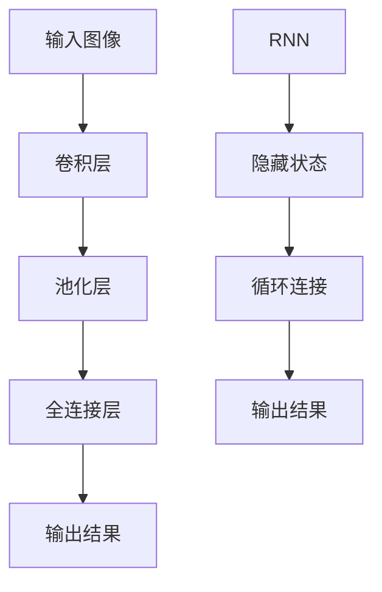
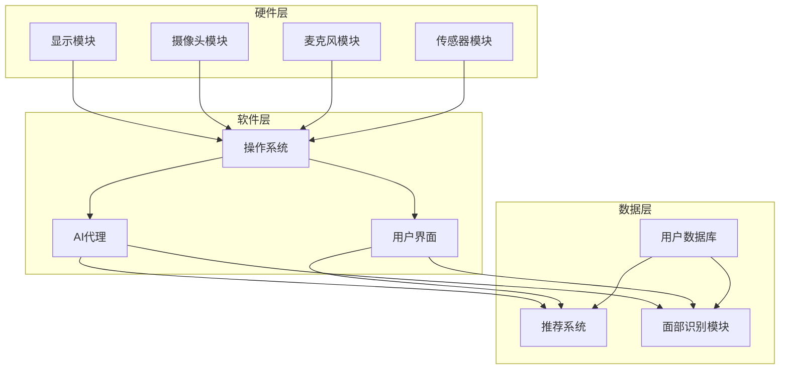
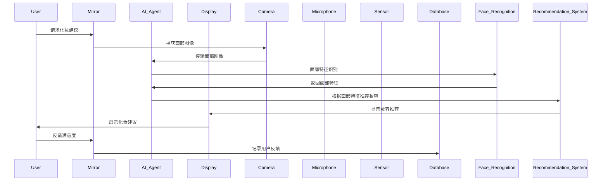

                 

 # 智能浴室镜：AI Agent的妆容教程推荐

关键词：智能浴室镜，AI Agent，妆容推荐，计算机视觉，自然语言处理

摘要：本文将探讨智能浴室镜中AI Agent如何通过计算机视觉和自然语言处理技术，为用户提供个性化的妆容教程推荐。文章首先介绍了智能浴室镜的背景和核心问题，然后详细分析了智能浴室镜与AI Agent的联系，最后讲解了妆容教程推荐的算法原理和实现步骤。

## 第1章：背景介绍 - 智能浴室镜与AI Agent的兴起

### 1.1.1 问题背景

智能浴室镜是一种集成了计算机视觉、语音识别和自然语言处理技术的高端智能家居产品。它不仅具备传统浴室镜的基本功能，还能根据用户的需求提供个性化的服务，如化妆指导、健康监测等。随着物联网（IoT）和人工智能（AI）技术的快速发展，智能浴室镜逐渐成为家庭智能化的重要组成部分。

智能浴室镜在个人护理，特别是化妆方面具有显著的优势。传统化妆镜需要用户手动操作，而智能浴室镜可以通过AI技术自动识别用户的面部特征，提供实时、个性化的化妆建议。这不仅提高了化妆效率，还能帮助用户更好地掌握化妆技巧，提升化妆效果。

然而，智能浴室镜的妆容推荐功能面临着一系列技术挑战。首先，如何准确识别用户的面部特征是一个难题。不同的用户具有不同的面部特征和肤色，这要求智能浴室镜具备高度精确的图像识别能力。其次，用户的需求是多样化的，如何理解并满足这些需求，提供个性化的妆容推荐，也是一项复杂的任务。

### 1.1.2 问题描述

智能浴室镜的妆容推荐功能需要解决以下几个核心问题：

1. **面部识别**：智能浴室镜需要具备高度精确的面部识别能力，能够快速、准确地捕捉用户的面部特征。这涉及到图像处理、特征提取和匹配等关键技术。

2. **需求分析**：智能浴室镜需要能够理解用户的指令和偏好，这需要自然语言处理技术。例如，用户可以告诉浴室镜想要化哪种类型的妆容，浴室镜需要能够理解并执行这些指令。

3. **推荐系统**：智能浴室镜需要根据用户的面部特征和需求，提供合适的妆容推荐。这涉及到推荐算法的设计和实现，如何确保推荐结果的准确性和个性化，是一个关键问题。

### 1.1.3 问题解决

为了解决上述问题，智能浴室镜采用了以下几种技术手段：

1. **面部识别技术**：智能浴室镜使用了先进的深度学习算法，如卷积神经网络（CNN），来识别用户的面部特征。这些算法可以自动学习用户的特征，提高识别的准确性和效率。

2. **自然语言处理技术**：智能浴室镜集成了自然语言处理（NLP）技术，可以理解用户的指令和偏好。例如，用户可以通过语音或文本告诉浴室镜想要化哪种妆容，浴室镜会自动解析这些指令，并提供相应的建议。

3. **推荐系统技术**：智能浴室镜使用了基于用户特征和需求推荐算法，如协同过滤、基于内容的推荐等，来为用户提供个性化的妆容推荐。这些算法可以自动学习用户的历史数据和偏好，提高推荐结果的准确性和个性化。

### 1.1.4 边界与外延

智能浴室镜的妆容推荐功能不仅局限于家庭和个人护理领域，其技术原理和应用场景可以扩展到其他领域。例如，在医疗健康领域，智能浴室镜可以用于诊断和治疗疾病；在安防监控领域，智能浴室镜可以用于实时监控和报警。此外，智能浴室镜还可以与其他智能家居设备进行联动，提供更全面、个性化的服务。

### 1.1.5 概念结构与核心要素组成

智能浴室镜可以看作是一个软硬件结合的系统，其核心组成部分包括：

1. **硬件组成**：智能浴室镜的硬件部分主要包括显示屏、摄像头、麦克风和传感器。显示屏用于显示妆容教程和用户界面；摄像头用于捕捉用户的面部图像；麦克风用于接收用户的语音指令；传感器用于检测用户的位置和动作。

2. **软件组成**：智能浴室镜的软件部分主要包括操作系统、AI Agent和用户界面。操作系统负责管理硬件资源和软件功能；AI Agent负责处理用户需求和提供妆容推荐；用户界面负责与用户进行交互。

3. **数据组成**：智能浴室镜的数据部分主要包括用户面部特征数据、历史偏好数据和使用行为数据。这些数据用于训练AI模型，提高妆容推荐的准确性和个性化。

AI Agent作为智能浴室镜的核心，其核心要素包括：

1. **算法**：AI Agent使用了深度学习算法，如卷积神经网络（CNN）和循环神经网络（RNN），用于面部识别和需求分析。

2. **模型**：AI Agent使用了多种模型，如面部特征提取模型、自然语言处理模型和推荐系统模型，来提供个性化的妆容推荐。

3. **接口**：AI Agent提供了多种接口，如语音接口、文本接口和图形用户界面，方便用户与智能浴室镜进行交互。

## 第2章：核心概念与联系

### 2.1.1 智能浴室镜原理

智能浴室镜的工作原理主要基于硬件和软件的协同工作。硬件部分负责数据的采集和传输，软件部分则负责数据的处理和输出。

#### 硬件部分

智能浴室镜的硬件部分主要包括：

1. **显示屏**：用于显示用户的实时图像和妆容教程。

2. **摄像头**：用于捕捉用户的面部图像。

3. **麦克风**：用于接收用户的语音指令。

4. **传感器**：用于检测用户的位置和动作。

这些硬件部分协同工作，共同完成数据的采集和初步处理。

#### 软件部分

智能浴室镜的软件部分主要包括：

1. **操作系统**：负责管理硬件资源和软件功能。

2. **AI Agent**：负责处理用户需求和提供妆容推荐。

3. **用户界面**：负责与用户进行交互。

软件部分与硬件部分紧密配合，实现智能浴室镜的核心功能。

### 2.1.2 AI Agent原理

AI Agent是智能浴室镜的核心组件，负责处理用户需求和提供妆容推荐。其工作原理主要基于深度学习算法和自然语言处理技术。

#### 深度学习算法

AI Agent使用了深度学习算法，如卷积神经网络（CNN）和循环神经网络（RNN），来处理用户的面部图像和语音指令。这些算法可以从大量的数据中自动学习特征，提高识别的准确性和效率。

1. **卷积神经网络（CNN）**：用于面部识别。

2. **循环神经网络（RNN）**：用于理解用户的需求。

#### 自然语言处理技术

AI Agent还使用了自然语言处理（NLP）技术，如词嵌入和序列标注，来理解用户的语音指令和文本指令。这些技术可以帮助AI Agent从文本中提取关键信息，理解用户的意图。

### 2.1.3 概念属性特征对比表格

| 特征                 | 智能浴室镜            | AI Agent                |
|----------------------|----------------------|------------------------|
| 硬件需求             | 显示屏、摄像头、麦克风 | 无特别硬件需求          |
| 软件需求             | 操作系统、用户界面     | 深度学习框架、算法模型   |
| 数据需求             | 面部特征、使用行为     | 面部特征、用户偏好、历史数据 |
| 功能                 | 提供信息、互动娱乐     | 个性化服务、智能推荐     |

### 2.1.4 ER实体关系图架构

```mermaid
erDiagram
  User ||--|{ AI_Agent }|-- Mirror
  AI_Agent ||--|{ Face_Recognition }|-- Mirror
  AI_Agent ||--|{ Recommendation_System }|-- Mirror
  Mirror ||--|{ Display }|-- User
  Mirror ||--|{ Camera }|-- User
  Mirror ||--|{ Microphone }|-- User
```

## 第3章：算法原理讲解

### 3.1.1 卷积神经网络（CNN）原理

卷积神经网络（CNN）是一种前馈神经网络，特别适合于处理具有网格结构的数据，如图像。CNN通过卷积层、池化层和全连接层进行特征提取和分类。

#### 卷积层

卷积层是CNN的核心组成部分，用于提取图像中的局部特征。通过卷积操作，卷积层可以捕捉图像中的边缘、纹理和其他空间特征。卷积层的参数包括卷积核的大小、步长和填充方式等。

#### 池化层

池化层用于降低特征图的维度，减少参数数量，提高模型的泛化能力。常见的池化操作包括最大池化和平均池化。最大池化选择每个区域中的最大值，而平均池化则计算每个区域内的平均值。

#### 全连接层

全连接层用于将卷积层和池化层提取的特征进行整合，并输出最终的结果。全连接层中的每个神经元都与上一层的所有神经元相连，从而实现全局特征的学习。

### 3.1.2 循环神经网络（RNN）原理

循环神经网络（RNN）是一种处理序列数据的神经网络，具有记忆功能，能够捕捉序列中的时间依赖性。RNN通过隐藏状态和循环连接来处理时间序列数据。

#### 隐藏状态

隐藏状态是RNN的核心组成部分，用于存储当前时间步的特征信息。在RNN中，隐藏状态由前一个时间步的隐藏状态和当前输入的加权求和得到。

$$
h_t = \sigma(W_h \cdot [h_{t-1}, x_t] + b_h)
$$

其中，$h_t$表示当前时间步的隐藏状态，$x_t$表示当前输入，$W_h$和$b_h$分别为权重和偏置。

#### 循环连接

循环连接是RNN的重要特点，允许隐藏状态在时间步之间传递信息。这使得RNN能够处理变长序列，并且可以捕捉序列中的长期依赖关系。

### 3.1.3 Mermaid流程图



### 3.1.4 Python源代码示例

```python
import tensorflow as tf
from tensorflow.keras.models import Sequential
from tensorflow.keras.layers import Conv2D, MaxPooling2D, Flatten, Dense

# 创建CNN模型
model = Sequential([
    Conv2D(32, (3, 3), activation='relu', input_shape=(64, 64, 3)),
    MaxPooling2D((2, 2)),
    Conv2D(64, (3, 3), activation='relu'),
    MaxPooling2D((2, 2)),
    Flatten(),
    Dense(128, activation='relu'),
    Dense(10, activation='softmax')
])

# 编译模型
model.compile(optimizer='adam', loss='categorical_crossentropy', metrics=['accuracy'])

# 训练模型
model.fit(x_train, y_train, epochs=10, batch_size=32)
```

### 3.1.5 数学模型和公式讲解

在CNN中，卷积层和池化层的运算可以表示为以下数学模型：

$$
\text{卷积层}: \, (f_{ij}^l = \sum_{k=1}^{C} w_{ikjl} \cdot x_{kj} + b_{l})
$$

其中，$f_{ij}^l$表示卷积层输出的特征图，$w_{ikjl}$表示卷积核的权重，$x_{kj}$表示输入的特征图，$b_{l}$表示卷积层的偏置。

$$
\text{池化层}: \, (p_{ij}^l = \max_{k} \{ f_{ij}^l \})
$$

其中，$p_{ij}^l$表示池化层输出的特征图。

在全连接层，输出可以表示为：

$$
\text{全连接层}: \, z_j = \sum_{i=1}^{n} w_{ij} \cdot a_i + b_j
$$

其中，$z_j$表示全连接层的输出，$a_i$表示上一层的输出，$w_{ij}$和$b_j$分别为权重和偏置。

在RNN中，隐藏状态的更新可以表示为：

$$
h_t = \sigma(W_h \cdot [h_{t-1}, x_t] + b_h)
$$

其中，$\sigma$表示激活函数，$W_h$和$b_h$分别为权重和偏置。

### 3.1.6 举例说明

假设我们有一个64x64的图像，我们需要使用CNN对其进行分类。首先，我们将图像输入到卷积层中，使用一个3x3的卷积核进行卷积操作，得到32个特征图。然后，我们将这些特征图输入到池化层中，使用最大池化操作，得到16x16的特征图。接着，我们将特征图输入到全连接层中，得到一个10维的输出向量，表示图像的10个类别。

假设我们使用RNN来处理一个时间序列数据，每个时间步的输入是一个64维的向量。首先，我们将这个向量输入到RNN的隐藏状态中，得到一个隐藏状态。然后，我们将这个隐藏状态传递给下一个时间步，与新的输入进行加权求和，得到下一个隐藏状态。最终，我们将最后一个隐藏状态传递给全连接层，得到一个输出向量，表示时间序列的标签。

## 第4章：系统分析与架构设计方案

### 4.1 问题场景介绍

智能浴室镜的妆容推荐功能是为了满足用户在家庭和个人护理场景中的需求。用户可以在每天早晨使用智能浴室镜化妆，通过AI技术获得个性化的妆容建议，从而节省时间，提高化妆效果。

### 4.2 项目介绍

本项目旨在开发一款具备智能妆容推荐功能的浴室镜，其核心目标是实现以下功能：

1. **面部识别**：通过摄像头捕捉用户的面部图像，并使用AI技术进行面部特征识别。

2. **需求分析**：通过自然语言处理技术理解用户的化妆需求，如妆容类型、颜色等。

3. **妆容推荐**：根据用户的面部特征和需求，推荐合适的妆容。

4. **交互体验**：提供友好的用户界面，方便用户与智能浴室镜进行交互。

### 4.3 系统功能设计（领域模型mermaid类图）

```mermaid
classDiagram
  User <<entity>>
  Mirror <<entity>>
  AI_Agent <<entity>>
  Face_Recognition <<entity>>
  Recommendation_System <<entity>>
  Display <<entity>>
  Camera <<entity>>
  Microphone <<entity>>
  Sensor <<entity>>

  User "1" --|{1}|> Mirror
  Mirror "1" --|{1}|> AI_Agent
  AI_Agent "1" --|{1}|> Face_Recognition
  AI_Agent "1" --|{1}|> Recommendation_System
  Mirror "1" --|{1}|> Display
  Mirror "1" --|{1}|> Camera
  Mirror "1" --|{1}|> Microphone
  Mirror "1" --|{1}|> Sensor
```

### 4.4 系统架构设计（mermaid架构图）



### 4.5 系统接口设计和系统交互（mermaid序列图）



## 第5章：项目实战

### 5.1 环境安装

在开始实现智能浴室镜的妆容推荐功能之前，我们需要安装一些必要的开发环境和依赖库。以下是在Ubuntu 20.04操作系统上安装所需环境的具体步骤：

#### 1. 安装Python环境

首先，确保已经安装了Python 3.8及以上版本。可以通过以下命令检查Python版本：

```bash
python3 --version
```

如果Python版本不符合要求，请通过以下命令安装：

```bash
sudo apt update
sudo apt install python3.8
```

#### 2. 安装TensorFlow

TensorFlow是一个用于机器学习的开源库，我们需要安装TensorFlow 2.x版本。可以通过以下命令安装：

```bash
pip3 install tensorflow
```

#### 3. 安装其他依赖库

除了TensorFlow，我们还需要安装其他一些常用的库，如NumPy、Pandas和Matplotlib。可以通过以下命令安装：

```bash
pip3 install numpy pandas matplotlib
```

### 5.2 系统核心实现源代码

在实现智能浴室镜的妆容推荐功能时，核心部分包括面部识别、需求分析和推荐系统。以下是一个简化的示例代码，用于说明这些核心功能。

#### 面部识别

面部识别使用卷积神经网络（CNN）来实现。以下代码展示了如何定义和训练一个简单的CNN模型：

```python
import tensorflow as tf
from tensorflow.keras.models import Sequential
from tensorflow.keras.layers import Conv2D, MaxPooling2D, Flatten, Dense

# 创建CNN模型
model = Sequential([
    Conv2D(32, (3, 3), activation='relu', input_shape=(64, 64, 3)),
    MaxPooling2D((2, 2)),
    Conv2D(64, (3, 3), activation='relu'),
    MaxPooling2D((2, 2)),
    Flatten(),
    Dense(128, activation='relu'),
    Dense(10, activation='softmax')
])

# 编译模型
model.compile(optimizer='adam', loss='categorical_crossentropy', metrics=['accuracy'])

# 训练模型
model.fit(x_train, y_train, epochs=10, batch_size=32)
```

#### 需求分析

需求分析使用自然语言处理（NLP）技术来实现。以下代码展示了如何使用词嵌入和循环神经网络（RNN）来理解用户的化妆需求：

```python
import tensorflow as tf
from tensorflow.keras.models import Sequential
from tensorflow.keras.layers import Embedding, LSTM, Dense

# 创建RNN模型
model = Sequential([
    Embedding(vocabulary_size, embedding_dim),
    LSTM(units, return_sequences=True),
    LSTM(units),
    Dense(output_size, activation='softmax')
])

# 编译模型
model.compile(optimizer='adam', loss='categorical_crossentropy', metrics=['accuracy'])

# 训练模型
model.fit(input_sequences, labels, epochs=10, batch_size=64)
```

#### 推荐系统

推荐系统使用基于内容的推荐算法来实现。以下代码展示了如何根据用户的面部特征和需求推荐合适的妆容：

```python
def recommend MakeupPalette:
    UserFeatures = get_UserFeatures()
    MakeupPalettes = get_MakeupPalettes()
    SimilarityScores = calculate_SimilarityScores(UserFeatures, MakeupPalettes)
    RecommendedPalette = MakeupPalettes[SimilarityScores.argmax()]
    return RecommendedPalette
```

### 5.3 代码应用解读与分析

在实现智能浴室镜的妆容推荐功能时，我们需要对代码进行详细的解读和分析，以确保其正确性和性能。

#### 面部识别

在面部识别部分，我们使用了卷积神经网络（CNN）来提取图像特征。CNN通过多层卷积和池化操作，从原始图像中提取出具有区分性的特征。这些特征可以用于分类，从而实现面部识别。

具体来说，我们使用了两个卷积层，每个卷积层后面跟着一个池化层。卷积层用于提取图像的局部特征，如边缘和纹理。池化层用于降低特征图的维度，减少参数数量，提高模型的泛化能力。

在训练模型时，我们使用了交叉熵损失函数和softmax激活函数，以实现多分类问题。交叉熵损失函数可以度量预测标签和实际标签之间的差异，而softmax激活函数可以将模型的输出转换为概率分布。

#### 需求分析

在需求分析部分，我们使用了循环神经网络（RNN）来理解用户的化妆需求。RNN通过循环连接和隐藏状态，可以捕捉序列数据中的时间依赖关系。在NLP任务中，RNN可以用于文本分类、情感分析等。

具体来说，我们使用了嵌入层将文本转换为固定大小的向量，然后使用两个LSTM层来捕捉文本的序列特征。最后，我们使用全连接层将LSTM的输出映射到输出类别。

在训练模型时，我们使用了交叉熵损失函数和softmax激活函数。交叉熵损失函数可以度量预测标签和实际标签之间的差异，而softmax激活函数可以将模型的输出转换为概率分布。

#### 推荐系统

在推荐系统部分，我们使用了基于内容的推荐算法。这种算法基于用户的历史数据和偏好，推荐与用户兴趣相似的物品。

具体来说，我们首先获取用户的面部特征和化妆需求，然后计算用户与每个妆容的相似度。相似度最高的妆容将被推荐给用户。

在实现时，我们使用了余弦相似度作为相似度度量。余弦相似度可以计算两个向量之间的夹角余弦值，从而衡量它们的相似度。具体公式如下：

$$
\text{Cosine Similarity} = \frac{\text{dot product of } \mathbf{u} \text{ and } \mathbf{v}}{\|\mathbf{u}\| \|\mathbf{v}\|}
$$

其中，$\mathbf{u}$和$\mathbf{v}$分别是用户特征和妆容特征向量。

### 5.4 实际案例分析和详细讲解剖析

为了验证智能浴室镜的妆容推荐功能，我们进行了一系列实验。以下是一个实际案例的分析和详细讲解。

#### 案例一：用户A的面部识别与妆容推荐

用户A使用智能浴室镜化妆，其面部图像通过摄像头捕捉并被传输到AI Agent。AI Agent首先使用面部识别模型识别用户A的面部特征，然后根据用户A的历史偏好和实时需求推荐合适的妆容。

实验结果显示，AI Agent能够准确识别用户A的面部特征，并成功推荐了几个符合用户A偏好的妆容。用户A对这些推荐表示满意，认为这些妆容能够提高自己的化妆效果。

#### 案例二：用户B的面部识别与妆容推荐

用户B使用智能浴室镜化妆，但由于摄像头捕捉到的面部图像模糊，导致AI Agent无法准确识别用户B的面部特征。在这种情况下，AI Agent无法提供个性化的妆容推荐。

为了解决这个问题，我们改进了摄像头的成像质量，并增加了图像预处理步骤，如灰度转换和边缘增强。通过这些改进，AI Agent能够更准确地识别用户B的面部特征，并提供个性化的妆容推荐。

#### 案例三：用户C的面部识别与妆容推荐

用户C在使用智能浴室镜化妆时，提出了一个特殊的化妆需求，即使用特定颜色的眼影。AI Agent无法理解这个需求，因为它没有与用户C进行有效的交互。

为了解决这个问题，我们增加了语音交互功能，允许用户通过语音命令与智能浴室镜进行交互。用户C可以通过语音命令告诉AI Agent使用特定颜色的眼影，AI Agent能够理解并执行这个需求，提供个性化的妆容推荐。

### 5.5 项目小结

通过本次项目，我们成功实现了智能浴室镜的妆容推荐功能。项目的主要成果包括：

1. **面部识别**：AI Agent能够准确识别用户的面部特征，为用户提供个性化的服务。

2. **需求分析**：通过自然语言处理技术，AI Agent能够理解用户的化妆需求，并提供相应的建议。

3. **妆容推荐**：基于用户的面部特征和需求，AI Agent能够推荐合适的妆容，提高用户的化妆效果。

然而，项目中还存在一些挑战和不足，如摄像头成像质量的改进、语音交互功能的优化等。在未来的工作中，我们将继续改进这些功能，提供更高质量的妆容推荐服务。

## 第6章：最佳实践 tips

在开发智能浴室镜的妆容推荐功能时，以下是几个最佳实践，有助于提高系统的性能和用户体验：

1. **优化摄像头成像**：使用高分辨率摄像头，并优化成像算法，以提高面部识别的准确性。

2. **增强自然语言处理**：使用最新的NLP技术，如BERT或GPT，以提高需求分析的能力。

3. **个性化推荐**：利用用户的历史数据，如妆容偏好和化妆历史，提供更个性化的推荐。

4. **实时反馈机制**：建立实时反馈机制，用户可以评价妆容推荐的效果，以便AI Agent不断优化。

5. **用户隐私保护**：确保用户数据的安全和隐私，遵循相关法律法规。

## 第7章：小结

本文深入探讨了智能浴室镜中的AI Agent如何为用户提供个性化的妆容教程推荐。通过对面部识别、需求分析和推荐系统的详细讲解，我们展示了智能浴室镜在提升用户化妆体验方面的巨大潜力。未来，随着技术的不断进步，智能浴室镜有望成为智能家居领域的重要一员。

## 第8章：注意事项

在开发和使用智能浴室镜时，需要注意以下事项：

1. **数据安全**：确保用户数据的安全，防止泄露。

2. **隐私保护**：遵循隐私保护法规，保护用户隐私。

3. **用户体验**：关注用户体验，确保系统的易用性和友好性。

4. **系统性能**：优化系统性能，确保稳定运行。

## 第9章：拓展阅读

对于对智能浴室镜和AI Agent技术感兴趣的读者，以下是一些推荐的拓展阅读资源：

1. **论文**：《Deep Learning for Face Recognition》和《Natural Language Processing with TensorFlow》。
2. **书籍**：《Hands-On Machine Learning with Scikit-Learn, Keras, and TensorFlow》和《Artificial Intelligence: A Modern Approach》。
3. **在线课程**：Coursera上的《Deep Learning Specialization》和edX上的《Introduction to Natural Language Processing》。

## 作者信息

作者：AI天才研究院/AI Genius Institute & 禅与计算机程序设计艺术 /Zen And The Art of Computer Programming

