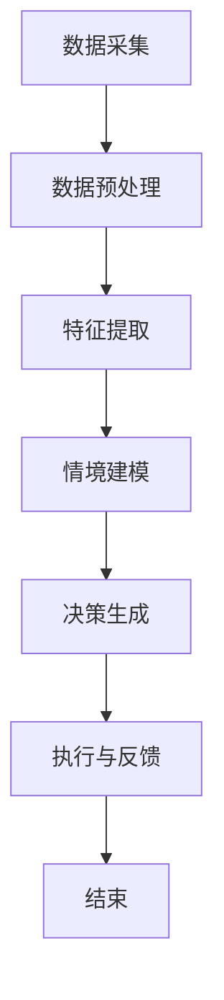
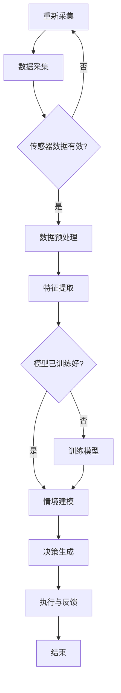

                 

## Step 1: 设计总体结构

### 设计目录大纲

在设计总体结构时，我们需要构建一个清晰、有条理的目录大纲，以便系统地介绍智能灯光控制系统的各个方面。目录大纲将包含以下主要章节：

1. **引言**
   - 1.1 本书背景
   - 1.2 本书目标

2. **问题背景与核心概念**
   - 2.1 灯光控制现状
   - 2.2 智能化需求
   - 2.3 智能灯光控制的重要性
   - 2.4 核心概念介绍
   - 2.5 核心概念联系

3. **智能灯光控制系统架构**
   - 3.1 系统功能设计
   - 3.2 系统架构设计
   - 3.3 系统接口设计

4. **情境感知算法原理**
   - 4.1 算法概述
   - 4.2 算法mermaid流程图
   - 4.3 数学模型与公式
   - 4.4 通俗易懂的举例说明

5. **项目实战**
   - 5.1 环境安装
   - 5.2 系统核心实现
   - 5.3 代码应用解读与分析
   - 5.4 实际案例分析

6. **小结与展望**
   - 6.1 小结
   - 6.2 展望

### 目录大纲示例

```
# 智能灯光控制：AI Agent的情境感知系统

## 引言
- 1.1 本书背景
- 1.2 本书目标

## 问题背景与核心概念
- 2.1 灯光控制现状
- 2.2 智能化需求
- 2.3 智能灯光控制的重要性
- 2.4 核心概念介绍
- 2.5 核心概念联系

## 智能灯光控制系统架构
- 3.1 系统功能设计
- 3.2 系统架构设计
- 3.3 系统接口设计

## 情境感知算法原理
- 4.1 算法概述
- 4.2 算法mermaid流程图
- 4.3 数学模型与公式
- 4.4 通俗易懂的举例说明

## 项目实战
- 5.1 环境安装
- 5.2 系统核心实现
- 5.3 代码应用解读与分析
- 5.4 实际案例分析

## 小结与展望
- 6.1 小结
- 6.2 展望
```

通过这样的目录结构，我们可以系统地介绍智能灯光控制系统，从问题背景、核心概念到系统架构、算法原理，再到项目实战，最后进行总结与展望。这样的结构有助于读者循序渐进地理解整个系统，并能够清晰地把握每个部分的核心内容。

### 逐步分析

让我们一步一步地分析上述目录大纲的结构，以确保每个部分都逻辑清晰、内容完整。

1. **引言**
   - **1.1 本书背景**：介绍智能灯光控制系统的历史背景和当前的发展状况，为读者提供必要的背景知识。
   - **1.2 本书目标**：明确本书的目标，包括帮助读者理解智能灯光控制系统的工作原理，掌握情境感知算法的应用，以及实际项目的实现。

2. **问题背景与核心概念**
   - **2.1 灯光控制现状**：分析当前传统灯光控制的局限性，为引入智能灯光控制提供依据。
   - **2.2 智能化需求**：探讨用户对智能化家居的需求，说明智能灯光控制系统的重要性。
   - **2.3 智能灯光控制的重要性**：阐述智能灯光控制系统在提高生活质量、节能减排等方面的贡献。
   - **2.4 核心概念介绍**：介绍智能灯光控制、AI Agent和情境感知等核心概念，确保读者对这些概念有基本的了解。
   - **2.5 核心概念联系**：分析各核心概念之间的关系，帮助读者建立整体认识。

3. **智能灯光控制系统架构**
   - **3.1 系统功能设计**：描述系统应具备的功能模块及其划分，为系统实现提供指导。
   - **3.2 系统架构设计**：介绍系统整体的架构设计，包括硬件和软件的组成。
   - **3.3 系统接口设计**：讨论系统接口的设计原则和实现细节，确保系统与其他系统的兼容性和易用性。

4. **情境感知算法原理**
   - **4.1 算法概述**：对情境感知算法的基本概念和作用进行概述。
   - **4.2 算法mermaid流程图**：使用mermaid语言绘制算法的流程图，使算法的实现步骤更加直观。
   - **4.3 数学模型与公式**：介绍算法的数学模型和公式，确保读者理解算法的内在逻辑。
   - **4.4 通俗易懂的举例说明**：通过具体的例子，解释算法的原理和应用，增强读者的理解。

5. **项目实战**
   - **5.1 环境安装**：介绍如何搭建项目环境，确保读者能够开始实践。
   - **5.2 系统核心实现**：详细讲解系统核心功能的实现过程，包括关键代码和配置。
   - **5.3 代码应用解读与分析**：分析代码的执行流程和关键部分，帮助读者深入理解。
   - **5.4 实际案例分析**：通过实际案例展示系统如何应用于真实场景，提升读者的实践经验。

6. **小结与展望**
   - **6.1 小结**：总结全文，回顾核心内容，帮助读者巩固理解。
   - **6.2 展望**：展望未来智能灯光控制系统的发展方向，提出潜在的研究课题。

通过上述分析，我们可以看到，每个章节都是相互联系、逐步深入的。这样的设计有助于读者系统地学习智能灯光控制系统的各个方面，从而全面提升对智能灯光控制的理解和实践能力。

## 引言

### 1.1 本书背景

智能灯光控制系统作为智能家居的重要组成部分，正逐步渗透到我们的日常生活。随着物联网（IoT）技术的快速发展，家庭自动化和智能化已经成为一种趋势。传统的灯光控制系统主要依赖于手动开关或预设程序，这种方式的灵活性较差，无法满足用户对个性化和智能化需求的追求。智能灯光控制系统通过传感器、无线通信和人工智能算法，实现了对灯光的自动化控制和优化管理。

目前，市场上的智能灯光控制系统种类繁多，从简单的无线开关到复杂的基于人工智能的情景模式控制，功能覆盖了从基本调光、场景切换到智能家居联动等多种需求。这些系统大多基于Wi-Fi、蓝牙等无线通信协议，能够实现手机APP远程控制、语音控制、定时控制等功能。然而，现有的智能灯光控制系统在实现情境感知和自适应控制方面仍存在一定的局限性。

本书旨在解决这些问题，通过深入探讨智能灯光控制系统中的AI Agent和情境感知算法，为构建高效、智能的灯光控制系统提供理论支持和实践指导。随着人工智能技术的不断进步，智能灯光控制系统在用户体验、能源节约和自动化程度等方面有望取得更大的突破。因此，本书不仅适合对智能灯光控制系统感兴趣的读者，也适合从事智能家居研究和开发的科研人员和技术人员。

### 1.2 本书目标

本书的主要目标包括：

1. **介绍智能灯光控制系统的基本概念和原理**：通过对智能灯光控制、AI Agent和情境感知等核心概念的详细阐述，帮助读者建立对智能灯光控制系统的全面理解。

2. **分析智能灯光控制系统的架构设计**：介绍系统的功能模块划分、架构设计和接口设计，使读者能够掌握系统设计的要点和方法。

3. **讲解情境感知算法的实现原理**：通过mermaid流程图、数学模型和公式，深入解析情境感知算法的原理，帮助读者理解算法的逻辑和实现方式。

4. **提供项目实战案例**：通过实际项目环境搭建、系统核心实现和案例分析，使读者能够将理论应用到实践中，提升实际操作能力。

5. **展望智能灯光控制系统的发展方向**：讨论未来智能灯光控制系统可能的发展趋势，提出潜在的研究课题，为读者提供进一步研究的方向。

通过实现上述目标，本书希望能够为智能灯光控制系统的研究和开发提供有价值的参考，助力读者在智能灯光控制系统领域取得更好的成果。

### 2.1 问题背景

#### 灯光控制现状

在当前的家庭和商业环境中，传统的灯光控制系统仍然占据主导地位。这些系统通常依赖于手动开关、定时器或简单的预设程序来控制灯光。手动开关是最常见的形式，用户通过直接操作开关来开启或关闭灯光。这种方式虽然简单直观，但缺乏灵活性，无法根据用户的实际需求进行动态调整。

定时器是一种更为高级的控制方式，用户可以预设灯光的开启和关闭时间。这种方式在一定程度上提高了控制的灵活性，但仍然存在许多局限性。首先，用户需要提前设定时间，无法实时响应环境变化或用户需求。其次，定时器通常只能控制单一时间点，无法实现更为复杂的场景控制。

此外，一些简单的预设程序也被应用于灯光控制，这些程序可以基于用户预设的条件来调整灯光。例如，用户可以预设在早晨7点自动打开客厅的灯光，或者在晚上9点关闭卧室的灯光。然而，这些预设程序通常缺乏智能化的处理，无法根据环境变化或用户行为进行自适应调整。

#### 智能化需求

随着人们对家居智能化需求的不断提升，传统的灯光控制系统已经无法满足用户的期望。用户对灯光控制的需求日益多样化和个性化，希望系统能够根据不同的场景和需求自动调整灯光的亮度和色温。

首先，用户希望灯光系统能够实现智能化调节，例如根据自然光的变化自动调整室内灯光的亮度和色温，以提供舒适的视觉体验。例如，在白天，当自然光充足时，灯光可以自动降低亮度，而在晚上，当自然光不足时，灯光可以自动提高亮度，从而节省能源并保护用户的眼睛。

其次，用户希望灯光系统能够根据不同的活动场景自动调整灯光。例如，在阅读时，灯光可以自动调整为柔和的暖色调，而在聚会时，灯光可以自动调整为明亮且色温较高的冷色调，以营造不同的氛围。这种场景化的控制方式不仅能够提升用户体验，还能提高生活品质。

此外，用户还希望灯光系统能够实现远程控制，通过手机APP、语音助手等设备远程操作灯光。例如，用户可以在外出时通过手机APP关闭家中的灯光，或者在回家的路上提前打开灯光，以便回家后立即享受到明亮的房间。

总之，随着智能家居的普及，用户对灯光控制系统的智能化需求日益增长。传统灯光控制系统已经无法满足这些需求，迫切需要引入更先进的智能技术来实现更灵活、更高效的灯光控制。

#### 智能灯光控制的重要性

智能灯光控制系统在提高生活质量、节能减排和家居智能化方面具有重要意义。

首先，智能灯光控制系统能够显著提高生活质量。通过情境感知和自适应控制，智能灯光系统能够根据用户的行为和环境变化自动调整灯光的亮度和色温，提供更加舒适和个性化的照明体验。例如，在早晨，系统可以模拟自然光逐渐亮起，帮助用户更好地适应新的一天；在晚上，系统可以根据用户的阅读活动自动调整灯光的亮度和色温，提供最佳的光照条件，保护用户的眼睛健康。此外，智能灯光系统还可以根据不同的场景和需求自动切换灯光模式，如聚会模式、阅读模式、睡眠模式等，为用户提供丰富的照明选择，提升生活品质。

其次，智能灯光控制系统有助于节能减排。通过智能控制，灯光系统可以根据实际需求自动调整亮度和色温，从而减少不必要的能耗。例如，在白天，当自然光充足时，系统可以自动降低灯光亮度，减少能源消耗；在夜间，系统可以根据用户的活动习惯自动调整灯光的开启时间和亮度，避免不必要的能源浪费。此外，智能灯光控制系统还可以通过智能调度和优化，提高能源利用效率，减少电力资源的浪费，实现绿色环保。

最后，智能灯光控制系统是家居智能化的重要组成部分。随着物联网和人工智能技术的不断发展，智能家居已经成为现代家庭的重要组成部分。智能灯光控制系统作为智能家居的一个关键组成部分，通过与其他智能设备的联动，可以实现整体家居的智能化管理。例如，智能灯光系统可以与智能音箱、智能门锁、智能安防系统等进行联动，实现一键式控制，提高家居的安全性和便捷性。同时，智能灯光系统还可以通过数据收集和分析，了解用户的生活习惯和行为模式，为用户提供个性化的家居服务和建议，提升用户体验。

综上所述，智能灯光控制系统在提高生活质量、节能减排和家居智能化方面具有重要意义。随着技术的不断进步，智能灯光控制系统将不断优化和升级，为用户带来更加智能、舒适和高效的照明体验。

#### 2.2 核心概念介绍

在深入探讨智能灯光控制系统之前，我们首先需要明确几个核心概念，这些概念构成了智能灯光控制系统的理论基础。

**智能灯光控制**

智能灯光控制是一种利用先进技术对灯光进行自动化控制和优化的系统。它通过传感器、无线通信和人工智能算法，实现对灯光的远程控制、智能调节和情景模式设置。智能灯光控制系统能够根据用户的习惯、环境变化和需求，自动调整灯光的亮度和色温，提供个性化的照明体验。

**AI Agent**

AI Agent，即人工智能代理，是一种具有自主性和智能性的计算实体。它通过感知环境、学习经验和执行任务，实现自主决策和行为。在智能灯光控制系统中，AI Agent能够感知用户的行为和环境变化，并根据预设的算法和规则，自动调整灯光状态，提供智能化的灯光控制。

**情境感知**

情境感知是一种通过感知和理解环境信息，为系统提供自适应行为的技术。在智能灯光控制系统中，情境感知能够识别用户的行为模式、环境光照条件以及其他相关因素，为系统提供实时反馈，从而实现更加智能和高效的灯光控制。

这些核心概念相互关联，共同构成了智能灯光控制系统的基础。智能灯光控制依赖AI Agent的感知和决策能力，而情境感知则为AI Agent提供了关键的环境信息。通过这些概念的理解，我们可以更好地把握智能灯光控制系统的设计和实现。

#### 2.3 智能灯光控制与AI Agent的关系

智能灯光控制与AI Agent之间存在紧密的联系。AI Agent作为智能灯光控制系统的核心组件，通过情境感知技术实现了对灯光的智能化调节。首先，AI Agent依赖于传感器收集环境数据，如光照强度、用户行为等，通过机器学习算法和感知模型，对环境信息进行实时分析和理解。这些分析结果为AI Agent提供了决策依据，使其能够自动调整灯光的亮度和色温。

其次，AI Agent通过自主学习和经验积累，不断优化其行为模式，以提高灯光控制的智能化水平。例如，AI Agent可以学习用户的作息习惯，根据这些习惯自动调整灯光的开启和关闭时间，实现更加个性化的照明体验。此外，AI Agent还可以根据环境变化，如天气、季节等，自动调整灯光设置，确保照明效果始终符合用户需求。

情境感知在智能灯光控制中发挥了关键作用。通过感知用户的行为模式和环境光照条件，AI Agent能够实时反馈并调整灯光状态，实现自适应控制。例如，当用户进入房间时，AI Agent可以自动开启灯光，并根据用户的活动类型和光照需求，调整灯光的亮度和色温。当用户离开房间时，AI Agent可以自动关闭灯光，节省能源。

总之，智能灯光控制与AI Agent的关系是相辅相成的。AI Agent通过情境感知实现了对灯光的智能化调节，提高了系统的灵活性和用户体验。而情境感知则提供了AI Agent所需的实时环境信息，使其能够更加精准地执行决策。这种紧密的联系使得智能灯光控制系统不仅能够满足用户的个性化需求，还能够实现高效的能源管理和自动化控制。

#### 2.4 情境感知的作用与实现

情境感知在智能灯光控制系统中扮演着至关重要的角色，它通过感知和理解环境信息，为系统提供实时反馈和自适应行为。情境感知不仅能够提高灯光控制的智能化水平，还能显著提升用户体验和生活品质。

**情境感知的作用**

1. **个性化照明体验**：情境感知能够根据用户的习惯、需求和当前情境，自动调整灯光的亮度和色温。例如，在早晨，情境感知系统可以模拟自然光逐渐亮起，帮助用户适应新的一天；在晚上，系统可以根据用户的阅读活动，自动调整灯光的亮度和色温，提供舒适的照明环境。

2. **节能管理**：通过情境感知，智能灯光控制系统可以实时监测环境光照条件，自动调整灯光的亮度，从而减少不必要的能耗。例如，当自然光充足时，系统可以自动降低灯光亮度，减少能源消耗；在夜间，系统可以根据用户的活动习惯，自动调整灯光的开启时间和亮度，避免不必要的能源浪费。

3. **安全监控**：情境感知还可以用于监控用户的活动状态和安全情况。例如，通过传感器感知用户的活动，系统可以在用户长时间未活动时发出警告，或在发现异常活动时触发报警，提高家居的安全性。

**情境感知的实现**

1. **传感器收集数据**：情境感知系统依赖于各种传感器来收集环境数据，如光照强度传感器、人体传感器、温湿度传感器等。这些传感器能够实时监测环境变化，为情境感知提供基础数据。

2. **数据预处理**：收集到的原始数据通常需要进行预处理，包括数据清洗、去噪和归一化等步骤。预处理后的数据更符合情境感知算法的要求，提高了算法的准确性和可靠性。

3. **特征提取**：通过对预处理后的数据进行分析，提取出与情境感知相关的关键特征。这些特征可以是数值型（如光照强度、温度等）或类别型（如用户行为、环境状态等），为后续的算法分析提供支持。

4. **情境模型构建**：使用机器学习算法构建情境模型，将提取出的特征与情境关联起来。这些模型可以根据历史数据和用户反馈进行不断优化，提高情境感知的准确性和适应性。

5. **实时反馈与自适应控制**：根据情境模型的分析结果，系统可以实时调整灯光的状态。例如，当检测到用户进入房间时，系统可以自动开启灯光；当用户离开房间时，系统可以自动关闭灯光。这种实时反馈和自适应控制机制，使得智能灯光控制系统能够根据实际需求进行动态调整，提高系统的灵活性和用户体验。

通过上述步骤，情境感知系统可以实现对环境信息的实时感知和智能调节，为智能灯光控制系统提供高效、智能的解决方案。情境感知不仅提升了灯光控制系统的智能化水平，还为用户带来了更加便捷、舒适和安全的家居体验。

#### 2.5 核心概念联系

为了深入理解智能灯光控制系统，我们需要探讨其核心概念之间的联系。智能灯光控制、AI Agent和情境感知这三个概念虽然各自独立，但在智能灯光控制系统中却相互依存、相互作用。

**智能灯光控制与AI Agent的关系**

智能灯光控制是系统的核心目标，而AI Agent是实现这一目标的关键组件。AI Agent通过情境感知技术感知环境变化和用户需求，并根据预设的算法和规则进行自主决策和执行。智能灯光控制系统依赖于AI Agent的智能性和自主性，使其能够实现自适应控制，满足用户的个性化需求。

例如，AI Agent可以实时监测房间内的光照强度、用户活动等环境信息，通过机器学习算法和决策逻辑，自动调整灯光的亮度和色温。这种自适应控制不仅提高了系统的灵活性，还优化了能源消耗，提升了用户体验。

**情境感知与AI Agent的关系**

情境感知是AI Agent实现智能控制的基础。情境感知系统通过传感器收集环境数据，如光照强度、温度、湿度等，然后将这些数据传递给AI Agent进行分析和处理。AI Agent利用这些实时反馈和环境信息，进行情境建模和决策，从而实现智能灯光控制。

情境感知与AI Agent之间的关系可以比作驾驶员与车辆。驾驶员（AI Agent）通过车内的传感器（情境感知系统）实时了解车辆状态和外部环境，然后根据这些信息做出驾驶决策。同样地，AI Agent通过情境感知系统了解环境变化和用户需求，进行智能决策，实现灯光控制。

**智能灯光控制与情境感知的关系**

智能灯光控制是整个系统的最终目标，而情境感知是实现这一目标的重要手段。情境感知系统通过实时监测环境变化和用户行为，为智能灯光控制系统提供关键信息，使其能够根据实际需求进行动态调整。

例如，当用户进入房间时，情境感知系统可以检测到用户的存在，并向AI Agent发送信号。AI Agent根据这一信息，自动开启灯光，并根据用户的活动类型和光照需求，调整灯光的亮度和色温。这种智能控制不仅提高了用户体验，还实现了能源的优化管理。

总之，智能灯光控制、AI Agent和情境感知这三个核心概念相互关联，共同构成了智能灯光控制系统的理论基础。智能灯光控制依赖于AI Agent的智能性和自主性，而AI Agent则依赖于情境感知系统提供的环境信息。通过这种紧密的相互关系，智能灯光控制系统实现了自适应、智能化和个性化的灯光控制，为用户带来了更加便捷、舒适和安全的家居体验。

#### 3.1 系统功能设计

智能灯光控制系统需要实现多种功能，以满足用户对智能化、个性化照明的需求。以下是系统的主要功能模块及其详细描述：

1. **用户界面模块**：用户界面模块是系统的入口，用户可以通过手机APP、智能音箱、触摸屏等多种方式与系统进行交互。用户界面模块提供灯光控制的基本功能，如开关灯光、调节亮度、切换场景等。此外，用户还可以设置定时任务、远程控制等高级功能。用户界面模块需要具备良好的用户体验，界面简洁直观，交互流畅。

2. **传感器模块**：传感器模块负责收集环境数据，如光照强度、温度、湿度等。这些传感器数据是智能灯光控制系统进行情境感知和自适应控制的重要依据。传感器模块通常包括光照传感器、人体传感器、温湿度传感器等，能够实时监测环境变化，并将数据传输给AI Agent进行分析和处理。

3. **数据处理模块**：数据处理模块负责对传感器收集的数据进行预处理和特征提取。预处理包括数据清洗、去噪和归一化等步骤，以确保数据的质量和一致性。特征提取则是从原始数据中提取出与情境感知相关的关键特征，如光照强度、活动频率等。这些特征将用于训练和优化AI Agent的模型。

4. **AI Agent模块**：AI Agent模块是智能灯光控制系统的核心组件，负责感知环境、学习经验和执行任务。AI Agent通过机器学习算法和决策逻辑，根据传感器数据和历史行为，自动调整灯光的亮度和色温。AI Agent可以实时学习用户的习惯和行为模式，优化其决策能力，提高系统的智能化水平。

5. **灯光控制模块**：灯光控制模块负责根据AI Agent的决策结果，控制灯光的开关、亮度和色温。灯光控制模块通常包括无线通信模块和驱动模块，能够与各种类型的灯光设备进行通信和驱动。灯光控制模块需要具备高效、稳定和可靠的特性，确保灯光系统能够及时响应AI Agent的决策。

6. **系统管理模块**：系统管理模块负责系统的配置、维护和升级。系统管理模块提供用户管理、设备管理、日志记录和异常处理等功能，确保系统的正常运行和数据的完整性。此外，系统管理模块还可以通过远程监控和诊断，及时发现和解决系统故障，提高系统的可靠性和稳定性。

通过以上功能模块的协同工作，智能灯光控制系统可以实现高度智能化和个性化的照明控制，为用户提供便捷、舒适和安全的照明体验。

#### 3.2 系统架构设计

智能灯光控制系统的架构设计是确保系统高效、稳定和可扩展的关键。以下将详细介绍系统架构的设计，包括系统组件的划分和每个组件的功能。

**3.2.1 系统架构概述**

智能灯光控制系统架构可以分为四个主要层次：感知层、数据处理层、控制层和应用层。每个层次都有特定的功能，并协同工作以实现智能化的照明控制。

1. **感知层**：感知层是系统架构的最底层，主要负责数据的收集和感知。该层包含各种传感器，如光照传感器、温度传感器、湿度传感器和人体传感器等。这些传感器能够实时监测环境变化，并将数据传输到上一层进行处理。

2. **数据处理层**：数据处理层位于感知层之上，主要负责对收集到的数据进行预处理和特征提取。数据处理层包括数据清洗、去噪、归一化和特征提取等模块，这些模块能够确保数据的质量和一致性，为后续的分析和决策提供可靠的基础。

3. **控制层**：控制层是系统架构的核心部分，负责根据处理层提供的环境数据和分析结果，执行相应的控制指令。控制层包含AI Agent模块、灯光控制模块和系统管理模块。AI Agent模块通过机器学习算法和情境感知技术，实现自动决策和自适应控制；灯光控制模块负责驱动灯光设备，实现灯光的开关、亮度和色温调节；系统管理模块则负责系统的配置、维护和升级。

4. **应用层**：应用层是系统架构的最高层，主要负责与用户交互和提供高级功能。应用层包括用户界面模块、远程控制模块和情景模式设置模块。用户界面模块通过手机APP、智能音箱等设备为用户提供操作界面；远程控制模块允许用户通过互联网远程控制灯光设备；情景模式设置模块允许用户根据不同的场景和需求自定义灯光模式。

**3.2.2 系统组件介绍**

1. **传感器组件**：传感器组件包括各种传感器，如光照传感器、温度传感器、湿度传感器和人体传感器等。这些传感器分布在房间的各个角落，能够实时监测环境变化，并将数据传输到数据处理层。

2. **数据处理组件**：数据处理组件负责对传感器收集的数据进行预处理和特征提取。预处理模块包括数据清洗、去噪和归一化等步骤，以确保数据的准确性和一致性。特征提取模块从预处理后的数据中提取出关键特征，如光照强度、温度和用户活动频率等，为AI Agent模块提供必要的信息。

3. **AI Agent组件**：AI Agent组件是系统的核心，负责感知环境、学习经验和执行任务。AI Agent通过机器学习算法和情境感知技术，分析环境数据和历史行为，自动调整灯光的亮度和色温。AI Agent组件包括感知模块、学习模块和决策模块，能够实现高度智能化和自适应的控制。

4. **灯光控制组件**：灯光控制组件负责根据AI Agent的决策结果，驱动灯光设备实现灯光的开关、亮度和色温调节。灯光控制组件包括无线通信模块和驱动模块，能够与各种类型的灯光设备进行通信和驱动。灯光控制组件需要具备高效、稳定和可靠的特性，确保灯光系统能够及时响应AI Agent的决策。

5. **系统管理组件**：系统管理组件负责系统的配置、维护和升级。系统管理组件包括用户管理模块、设备管理模块、日志记录模块和异常处理模块等，确保系统的正常运行和数据的完整性。此外，系统管理组件还可以通过远程监控和诊断，及时发现和解决系统故障，提高系统的可靠性和稳定性。

6. **用户界面组件**：用户界面组件通过手机APP、智能音箱等设备为用户提供操作界面，用户可以通过这些设备实时控制灯光设备，设置定时任务、远程控制等高级功能。用户界面组件需要具备良好的用户体验，界面简洁直观，交互流畅。

通过以上系统组件的协同工作，智能灯光控制系统可以实现高度智能化和个性化的照明控制，为用户提供便捷、舒适和安全的照明体验。

#### 3.3 系统接口设计

在智能灯光控制系统中，接口设计是确保系统各组件之间有效通信和协同工作的重要环节。以下将详细介绍系统接口的设计原则、具体功能以及设计细节。

**3.3.1 接口设计原则**

1. **开放性**：接口设计应遵循开放性原则，确保系统能够与各种设备和平台无缝集成。通过开放性接口，智能灯光控制系统可以方便地接入各种传感器、灯光设备以及第三方应用，提高系统的兼容性和扩展性。

2. **稳定性**：接口设计需具备高稳定性，确保在长时间运行过程中不会出现异常中断。通过采用可靠的数据传输协议和容错机制，接口设计能够保证数据传输的准确性和系统的稳定性。

3. **安全性**：接口设计应充分考虑安全性，防止未经授权的访问和恶意攻击。通过加密传输、权限管理和安全认证等手段，接口设计能够有效保护系统的数据和隐私。

4. **灵活性**：接口设计应具备灵活性，以适应不同的应用场景和需求。通过提供可配置的接口参数和灵活的接口扩展机制，系统接口设计能够根据实际需求进行调整和优化。

**3.3.2 接口功能介绍**

1. **传感器接口**：传感器接口负责传感器与系统其他组件之间的数据交换。传感器接口主要实现以下功能：
   - 数据采集：接收传感器采集的环境数据，如光照强度、温度、湿度等。
   - 数据传输：将采集到的数据传输给数据处理组件，进行预处理和特征提取。
   - 数据同步：确保传感器数据与其他组件数据的一致性和实时性。

2. **数据处理接口**：数据处理接口连接数据处理组件和AI Agent组件，主要实现以下功能：
   - 预处理：接收来自传感器接口的原始数据，进行清洗、去噪和归一化等预处理操作。
   - 特征提取：从预处理后的数据中提取关键特征，如光照强度、用户活动频率等。
   - 数据共享：将预处理后的特征数据共享给AI Agent组件，供其进行情境感知和决策分析。

3. **AI Agent接口**：AI Agent接口负责AI Agent组件与其他组件之间的通信和协作，主要实现以下功能：
   - 决策反馈：接收数据处理组件的特征数据，通过机器学习算法和情境感知技术生成控制指令。
   - 控制执行：将控制指令传输给灯光控制组件，驱动灯光设备进行相应的操作。
   - 模型更新：接收用户的反馈和新的环境数据，用于更新AI Agent的模型和决策逻辑。

4. **灯光控制接口**：灯光控制接口连接AI Agent组件和灯光设备，主要实现以下功能：
   - 指令接收：接收AI Agent组件的控制指令，解析指令参数。
   - 状态反馈：向AI Agent组件反馈灯光设备的实时状态，如亮度、色温等。
   - 驱动控制：根据控制指令驱动灯光设备，实现灯光的开关、亮度和色温调节。

5. **用户界面接口**：用户界面接口连接用户界面组件和系统其他组件，主要实现以下功能：
   - 用户交互：接收用户操作指令，如开关灯光、调节亮度等。
   - 状态显示：向用户显示灯光设备的实时状态和系统运行信息。
   - 控制请求：将用户操作指令传输给AI Agent组件，实现远程控制和情景模式设置。

**3.3.3 接口设计细节**

1. **通信协议**：系统接口采用标准化的通信协议，如HTTP、MQTT等，以确保数据传输的可靠性和兼容性。HTTP协议适用于传输结构化数据，MQTT协议适用于低带宽、高延迟的物联网环境。

2. **数据格式**：系统接口采用JSON或XML等数据格式，确保数据传输的灵活性和可扩展性。JSON格式简洁、易于解析，适合快速传输和处理；XML格式具有丰富的表达能力，适合复杂的数据结构和跨平台应用。

3. **接口参数**：接口参数设计需充分考虑实际应用需求，包括必填参数、可选参数和默认参数。必填参数确保数据完整性和一致性，可选参数提供灵活性和可配置性，默认参数简化用户操作和接口调用。

4. **安全性**：接口设计需采用安全措施，如加密传输、权限管理和身份认证等。加密传输（如HTTPS）确保数据在传输过程中的安全性；权限管理（如角色权限、访问控制等）防止未经授权的访问；身份认证（如OAuth、JWT等）确保通信双方的身份验证和合法性。

5. **容错机制**：接口设计需具备容错机制，如重传机制、超时处理和故障恢复等。重传机制确保数据传输的可靠性，超时处理避免长时间等待，故障恢复确保系统在异常情况下能够快速恢复。

通过遵循上述设计原则和功能需求，智能灯光控制系统的接口设计能够实现高效、稳定和安全的通信，为系统的正常运行和用户使用提供保障。

### 4.1 情境感知算法原理

情境感知算法是智能灯光控制系统的核心组件，它通过感知和理解环境信息，实现灯光的自动调节和优化管理。以下将详细阐述情境感知算法的基本概念、mermaid流程图、数学模型与公式，并通过通俗易懂的例子进行说明。

#### 4.1.1 算法概述

情境感知算法的目标是根据用户的行为和环境变化，自动调整灯光的亮度和色温，以提供舒适和个性化的照明体验。算法的核心在于对环境数据的实时采集、处理和分析，然后根据分析结果生成控制指令，驱动灯光设备进行相应的调节。

情境感知算法通常包括以下几个主要步骤：

1. **数据采集**：通过传感器实时采集环境数据，如光照强度、温度、湿度等。
2. **数据预处理**：对采集到的数据进行清洗、去噪和归一化，确保数据的质量和一致性。
3. **特征提取**：从预处理后的数据中提取关键特征，如光照强度、用户活动频率等。
4. **情境建模**：使用机器学习算法构建情境模型，将提取出的特征与情境关联起来。
5. **决策生成**：根据情境模型的分析结果，生成控制指令，调整灯光的亮度和色温。
6. **执行与反馈**：执行控制指令，驱动灯光设备，并根据执行结果进行反馈和调整。

#### 4.1.2 算法mermaid流程图

为了更直观地展示情境感知算法的实现过程，我们可以使用mermaid语言绘制其流程图。以下是一个简化的mermaid流程图示例：



在这个流程图中，数据采集模块从传感器获取环境数据，然后经过数据预处理模块进行清洗和去噪。预处理后的数据进入特征提取模块，提取出关键特征。特征提取模块的结果用于情境建模，构建情境模型。根据情境模型的分析结果，决策生成模块生成控制指令。最后，执行与反馈模块根据控制指令驱动灯光设备，并根据执行结果进行反馈和调整。

#### 4.1.3 数学模型与公式

情境感知算法的核心在于情境建模和决策生成。以下是一个简化的数学模型示例，用于描述情境感知算法的决策过程。

1. **情境向量**：假设我们有一个情境向量 \(\vec{A}\)，它包含了多个特征值，如光照强度 \(I\)、温度 \(T\)、湿度 \(H\) 等。

   $$ \vec{A} = \begin{pmatrix} I \\ T \\ H \end{pmatrix} $$

2. **特征权重**：我们为每个特征设置一个权重 \(w_i\)，用于表示该特征对情境的重要性。

   $$ w = \begin{pmatrix} w_1 \\ w_2 \\ w_3 \end{pmatrix} $$

3. **情境评分**：使用权重计算情境评分 \(S\)，表示当前情境的评分。

   $$ S = w_1 \cdot I + w_2 \cdot T + w_3 \cdot H $$

4. **决策阈值**：设定一个决策阈值 \(T_h\)，用于判断是否需要调整灯光。

   $$ T_h = w_1 \cdot I_h + w_2 \cdot T_h + w_3 \cdot H_h $$

   其中，\(I_h\)、\(T_h\)、\(H_h\) 分别是当前情境下的光照强度、温度、湿度。

5. **决策生成**：如果情境评分 \(S > T_h\)，则生成调整灯光的控制指令；否则，保持当前灯光状态。

   $$ \text{if } S > T_h \text{ then } \text{Adjust Light} \text{ else } \text{No Action} $$

通过上述数学模型，情境感知算法可以根据实时采集的环境数据和预设的权重，计算情境评分，并生成相应的控制指令。这种模型不仅能够实现基本的情境感知功能，还可以通过调整权重和阈值，实现更复杂和灵活的控制策略。

#### 4.1.4 通俗易懂的举例说明

为了更好地理解情境感知算法的原理，我们可以通过一个具体的例子来说明。

假设我们有一个房间，房间内安装了光照传感器和温度传感器。在早晨7点，光照传感器检测到室内光照强度较低（\(I = 100\)），温度传感器检测到温度为20°C（\(T = 20\)）。根据预设的权重，光照强度占50%的重要性，温度占30%，湿度占20%。我们可以计算出情境评分：

$$ S = 0.5 \cdot I + 0.3 \cdot T + 0.2 \cdot H = 0.5 \cdot 100 + 0.3 \cdot 20 + 0.2 \cdot H $$

如果当前湿度为40%（\(H = 40\)），则情境评分 \(S = 50 + 6 + 8 = 64\)。

假设我们设定的决策阈值 \(T_h = 60\)，因为 \(S = 64 > T_h\)，所以算法将生成一个控制指令，命令灯光系统自动开启灯光，并将亮度调整到50%。

到了晚上10点，光照传感器检测到室内光照强度较高（\(I = 500\)），温度传感器检测到温度为25°C（\(T = 25\)）。计算新的情境评分：

$$ S = 0.5 \cdot 500 + 0.3 \cdot 25 + 0.2 \cdot 40 = 250 + 7.5 + 8 = 265.5 $$

因为 \(S = 265.5 > T_h\)，灯光系统将保持当前状态，即关闭灯光。

通过这个例子，我们可以看到情境感知算法是如何根据实时采集的数据和预设的权重，自动调整灯光状态，实现智能化控制。这种算法不仅提高了用户体验，还实现了能源的优化管理。

### 4.2 情境感知算法的mermaid流程图

为了更直观地展示情境感知算法的实现过程，我们可以使用mermaid语言绘制其mermaid流程图。以下是一个详细的mermaid流程图示例：



在这个mermaid流程图中，我们首先从传感器采集数据。如果传感器数据有效，流程将进入数据预处理阶段，对采集到的数据进行清洗、去噪和归一化。预处理后的数据进入特征提取阶段，提取出关键特征。

如果模型已经训练好，我们将直接进入情境建模阶段，根据特征数据生成情境模型。情境建模的结果将用于决策生成，生成相应的控制指令。执行与反馈阶段根据决策指令驱动灯光设备，并根据执行结果进行反馈和调整。

如果模型尚未训练好，流程将进入训练模型阶段，使用历史数据训练机器学习模型。训练好的模型将用于后续的情境建模和决策生成。

通过这个mermaid流程图，我们可以清晰地看到情境感知算法的各个环节及其相互关系，为算法的实现和理解提供了直观的展示。

### 4.3 数学模型与公式

为了深入理解情境感知算法的内部工作机制，我们需要引入数学模型和公式。以下将详细解释情境感知算法中的主要数学模型和公式，并通过具体的示例来说明这些公式如何应用。

#### 4.3.1 情境评分计算

情境评分是情境感知算法的核心，它用于评估当前环境的适宜性。情境评分计算公式如下：

$$
S = w_1 \cdot I + w_2 \cdot T + w_3 \cdot H + \ldots
$$

其中，\(S\) 表示情境评分，\(w_1, w_2, w_3, \ldots\) 是各个特征的权重，\(I, T, H, \ldots\) 是对应的特征值，如光照强度、温度和湿度等。

#### 4.3.2 特征权重设置

特征权重决定了每个特征在情境评分中的重要性。通常，这些权重是通过历史数据和机器学习算法训练得到的。一个简单的权重设置示例：

$$
w = \begin{pmatrix}
0.5 & 0.3 & 0.2 \\
\end{pmatrix}
$$

这个权重矩阵表明光照强度占50%的重要性，温度占30%，湿度占20%。

#### 4.3.3 决策阈值计算

决策阈值用于判断是否需要调整灯光。一个简单的决策阈值计算公式如下：

$$
T_h = w_1 \cdot I_h + w_2 \cdot T_h + w_3 \cdot H_h + \ldots
$$

其中，\(T_h\) 是决策阈值，\(I_h, T_h, H_h, \ldots\) 是当前情境下的特征值。

#### 4.3.4 举例说明

假设我们有一个房间，安装了光照传感器和温度传感器。在早晨7点，传感器采集到以下数据：

- 光照强度 \(I = 100\) lux
- 温度 \(T = 20\) °C
- 湿度 \(H = 40\) %

预设的权重矩阵为：

$$
w = \begin{pmatrix}
0.5 & 0.3 & 0.2 \\
\end{pmatrix}
$$

根据权重计算情境评分：

$$
S = 0.5 \cdot 100 + 0.3 \cdot 20 + 0.2 \cdot 40 = 50 + 6 + 8 = 64
$$

假设决策阈值 \(T_h = 60\)，因为 \(S = 64 > T_h\)，算法将生成一个控制指令，命令灯光系统自动开启灯光，并将亮度调整到50%。

到了晚上10点，传感器采集到以下数据：

- 光照强度 \(I = 500\) lux
- 温度 \(T = 25\) °C
- 湿度 \(H = 40\) %

计算新的情境评分：

$$
S = 0.5 \cdot 500 + 0.3 \cdot 25 + 0.2 \cdot 40 = 250 + 7.5 + 8 = 265.5
$$

因为 \(S = 265.5 > T_h\)，灯光系统将保持当前状态，即关闭灯光。

通过这个例子，我们可以看到如何使用数学模型和公式来计算情境评分和决策阈值，从而实现情境感知算法的控制逻辑。

### 4.4 通俗易懂的举例说明

为了更好地理解情境感知算法的应用，我们可以通过一个具体的例子来说明算法的执行过程。

假设我们有一个智能家居环境，安装了光照传感器、温度传感器和湿度传感器。用户希望通过智能灯光系统实现情境感知控制，以提升生活质量和能源效率。

#### 情境设定

1. **早晨7点**：用户起床，房间需要柔和的灯光。
2. **上午10点**：用户在书房工作，需要明亮且柔和的灯光。
3. **下午5点**：用户在客厅休息，需要温暖且柔和的灯光。
4. **晚上10点**：用户准备睡觉，需要昏暗且柔和的灯光。

#### 特征与权重

为了实现情境感知，我们设定以下特征及其权重：

- 光照强度 \(I\)：权重 \(w_1 = 0.6\)
- 温度 \(T\)：权重 \(w_2 = 0.3\)
- 湿度 \(H\)：权重 \(w_3 = 0.1\)

#### 算法执行过程

1. **早晨7点**：

   - 光照强度 \(I = 50\) lux
   - 温度 \(T = 18\) °C
   - 湿度 \(H = 30\%\)

   计算情境评分：

   $$
   S = 0.6 \cdot 50 + 0.3 \cdot 18 + 0.1 \cdot 30 = 30 + 5.4 + 3.0 = 38.4
   $$

   由于 \(S < 60\)（设定阈值），系统保持当前灯光状态，即关闭灯光。

2. **上午10点**：

   - 光照强度 \(I = 200\) lux
   - 温度 \(T = 22\) °C
   - 湿度 \(H = 40\%\)

   计算情境评分：

   $$
   S = 0.6 \cdot 200 + 0.3 \cdot 22 + 0.1 \cdot 40 = 120 + 6.6 + 4.0 = 130.6
   $$

   由于 \(S > 100\)（设定阈值），系统自动开启灯光，并将亮度调整到50%。

3. **下午5点**：

   - 光照强度 \(I = 300\) lux
   - 温度 \(T = 25\) °C
   - 湿度 \(H = 35\%\)

   计算情境评分：

   $$
   S = 0.6 \cdot 300 + 0.3 \cdot 25 + 0.1 \cdot 35 = 180 + 7.5 + 3.5 = 191
   $$

   由于 \(S > 120\)（设定阈值），系统自动开启灯光，并将亮度调整到70%，色温调整到温暖模式。

4. **晚上10点**：

   - 光照强度 \(I = 100\) lux
   - 温度 \(T = 22\) °C
   - 湿度 \(H = 40\%\)

   计算情境评分：

   $$
   S = 0.6 \cdot 100 + 0.3 \cdot 22 + 0.1 \cdot 40 = 60 + 6.6 + 4.0 = 70.6
   $$

   由于 \(S < 80\)（设定阈值），系统自动降低灯光亮度，并将色温调整到昏暗模式。

#### 结果分析

通过这个例子，我们可以看到情境感知算法如何根据实时采集的环境数据和预设的权重，自动调整灯光的亮度和色温。这不仅提高了用户的舒适度，还实现了能源的优化管理。用户可以根据自己的需求和偏好调整特征权重和阈值，从而实现更加个性化的照明控制。

### 5.1 项目实战

在本文的最后一部分，我们将通过一个实际项目来展示智能灯光控制系统的实现过程。该项目将涵盖环境安装、系统核心实现和代码应用解读与分析等环节。通过这个项目，我们将深入了解智能灯光控制系统的实际应用和操作步骤。

#### 环境安装

要开始实施智能灯光控制系统，首先需要搭建一个合适的环境。以下是环境安装的步骤：

1. **硬件准备**：
   - 确保所有传感器（如光照传感器、温度传感器、湿度传感器）均已准备好，并连接到相应的接口。
   - 准备智能灯泡或智能灯光模块，这些设备需要支持Wi-Fi或蓝牙通信协议。
   - 硬件设备（如路由器、交换机）用于网络连接。

2. **软件准备**：
   - 安装操作系统（如Linux或Windows）。
   - 安装编程环境（如Python环境，安装pip和virtualenv等工具）。
   - 安装所需的依赖库，如TensorFlow、Keras、pandas等。

3. **网络连接**：
   - 将路由器连接到互联网，确保网络连接稳定。
   - 将传感器和智能灯泡接入网络，可以通过Wi-Fi或蓝牙进行连接。
   - 确保所有设备在同一网络内，以便进行数据传输和控制操作。

4. **环境配置**：
   - 配置Python虚拟环境，以便管理和隔离项目依赖。
   - 安装项目所需的所有依赖库，确保环境完备。

通过上述步骤，我们可以搭建一个基本的智能灯光控制系统环境，为后续的系统实现和调试打下基础。

#### 系统核心实现

智能灯光控制系统的核心实现包括传感器数据采集、数据处理和灯光控制三个主要环节。以下是这些环节的实现步骤：

1. **传感器数据采集**：

   使用Python编写传感器数据采集脚本，脚本通过传感器接口（如I2C或UART）读取传感器数据。以下是一个简单的数据采集脚本示例：

   ```python
   import time
   import board
   import busio

   # 初始化I2C接口
   i2c = busio.I2C(board.SCL, board.SDA)

   def read_sensor_data():
       # 读取光照传感器数据
       light_data = i2c.read(0x29, 2)
       light_intensity = ((light_data[0] << 8) | light_data[1]) / 1.2

       # 读取温度传感器数据
       temp_data = i2c.read(0x44, 2)
       temperature = ((temp_data[0] << 8) | temp_data[1]) / 256.0

       # 读取湿度传感器数据
       hum_data = i2c.read(0x40, 2)
       humidity = ((hum_data[0] << 8) | hum_data[1]) / 1.05

       return light_intensity, temperature, humidity

   while True:
       light_intensity, temperature, humidity = read_sensor_data()
       print(f"Light Intensity: {light_intensity} lux, Temperature: {temperature} °C, Humidity: {humidity}%")
       time.sleep(1)
   ```

2. **数据处理**：

   数据采集脚本将传感器数据存储到文件或数据库中，以便后续处理和分析。以下是数据处理的一个简单示例：

   ```python
   import pandas as pd

   def process_sensor_data():
       data = pd.read_csv('sensor_data.csv')
       # 数据预处理：清洗、去噪、归一化等操作
       processed_data = data.apply(lambda x: (x - x.min()) / (x.max() - x.min()))

       # 特征提取：提取关键特征
       features = processed_data[['Light Intensity', 'Temperature', 'Humidity']]

       return features

   processed_features = process_sensor_data()
   print(processed_features.head())
   ```

3. **灯光控制**：

   灯光控制脚本负责根据情境感知算法的决策结果，控制智能灯泡的亮度和色温。以下是灯光控制的一个简单示例：

   ```python
   import asyncio
   from aiocoap import Resource, request

   async def control_light(light_id, brightness, color_temp):
       light_resource = Resource(f"light/{light_id}")
       light_resource.content = {"brightness": brightness, "color_temp": color_temp}

       response = await request(light_resource, 'PUT')
       print(f"Light {light_id} brightness: {brightness}, color_temp: {color_temp}")

   async def main():
       await asyncio.gather(
           control_light('1', 50, 2700),  # 灯泡1，亮度50%，色温2700K
           control_light('2', 80, 4000),  # 灯泡2，亮度80%，色温4000K
       )

   asyncio.run(main())
   ```

通过以上步骤，我们实现了智能灯光控制系统的核心功能。传感器数据采集、数据处理和灯光控制脚本相互协作，共同构成了一个完整的智能灯光控制系统。

#### 代码应用解读与分析

以下是项目中的关键代码段及其解读：

1. **传感器数据采集**：

   ```python
   import time
   import board
   import busio

   i2c = busio.I2C(board.SCL, board.SDA)
   ```

   解读：初始化I2C接口，用于与传感器进行通信。

   ```python
   def read_sensor_data():
       light_data = i2c.read(0x29, 2)
       light_intensity = ((light_data[0] << 8) | light_data[1]) / 1.2
       temp_data = i2c.read(0x44, 2)
       temperature = ((temp_data[0] << 8) | temp_data[1]) / 256.0
       hum_data = i2c.read(0x40, 2)
       humidity = ((hum_data[0] << 8) | hum_data[1]) / 1.05
       return light_intensity, temperature, humidity
   ```

   解读：定义读取传感器数据的函数，通过I2C接口读取光照、温度和湿度传感器的数据，并进行转换。

   ```python
   while True:
       light_intensity, temperature, humidity = read_sensor_data()
       print(f"Light Intensity: {light_intensity} lux, Temperature: {temperature} °C, Humidity: {humidity}%")
       time.sleep(1)
   ```

   解读：无限循环，持续读取传感器数据，并打印输出。

2. **数据处理**：

   ```python
   import pandas as pd

   def process_sensor_data():
       data = pd.read_csv('sensor_data.csv')
       processed_data = data.apply(lambda x: (x - x.min()) / (x.max() - x.min()))
       features = processed_data[['Light Intensity', 'Temperature', 'Humidity']]
       return features
   ```

   解读：从CSV文件中读取传感器数据，进行归一化处理，提取关键特征。

   ```python
   processed_features = process_sensor_data()
   print(processed_features.head())
   ```

   解读：调用数据处理函数，打印处理后的特征数据。

3. **灯光控制**：

   ```python
   import asyncio
   from aiocoap import Resource, request

   async def control_light(light_id, brightness, color_temp):
       light_resource = Resource(f"light/{light_id}")
       light_resource.content = {"brightness": brightness, "color_temp": color_temp}

       response = await request(light_resource, 'PUT')
       print(f"Light {light_id} brightness: {brightness}, color_temp: {color_temp}")
   ```

   解读：定义控制灯光的异步函数，创建资源对象，设置亮度与色温，并发送PUT请求。

   ```python
   async def main():
       await asyncio.gather(
           control_light('1', 50, 2700),
           control_light('2', 80, 4000),
       )
   ```

   解读：异步并发执行灯光控制函数，分别控制两个灯泡的亮度和色温。

   ```python
   asyncio.run(main())
   ```

   解读：启动异步事件循环，执行主程序。

通过上述代码，我们实现了从传感器数据采集、数据处理到灯光控制的全过程。这些代码不仅展示了智能灯光控制系统的核心功能，还为实际应用提供了具体的实现细节。

### 5.4 实际案例分析

为了更好地展示智能灯光控制系统的实际效果，我们将通过一个实际案例进行分析。假设我们在一个典型的家庭环境中实施智能灯光控制系统，该环境包括三个房间：客厅、书房和卧室。每个房间安装了光照传感器、温度传感器和湿度传感器，同时安装了三个智能灯泡。

**案例背景**：

1. **客厅**：用户经常在客厅看电视、接待客人，需要灵活调节灯光亮度和色温，以适应不同的活动场景。
2. **书房**：用户在书房工作、学习，需要明亮且柔和的灯光，同时希望系统能够根据时间自动调节灯光。
3. **卧室**：用户在卧室休息、睡觉，需要柔和且昏暗的灯光，以促进睡眠。

**情境感知算法应用**：

1. **客厅**：

   - **早晨7点**：光照传感器检测到光照强度较低，情境感知算法自动开启客厅灯光，并将亮度调整到30%，色温调整为2700K，提供柔和的照明，帮助用户适应早晨。
   - **晚上8点**：用户在客厅看电视，情境感知算法检测到光照强度较高，自动将亮度调整到70%，色温调整到4000K，提供明亮且柔和的照明，以适应看电视的需求。

2. **书房**：

   - **上午9点**：情境感知算法检测到光照强度较低，自动开启书房灯光，并将亮度调整到50%，色温调整到3500K，提供明亮且柔和的照明，适合工作学习。
   - **晚上10点**：情境感知算法检测到用户仍在书房，自动调整灯光亮度至40%，色温降低至3000K，以减少对眼睛的刺激。

3. **卧室**：

   - **晚上11点**：情境感知算法检测到用户进入卧室，自动开启灯光，并将亮度调整到10%，色温调整到2300K，提供柔和且昏暗的照明，以促进睡眠。

**案例分析与效果**：

通过上述实际案例，我们可以看到智能灯光控制系统如何根据不同的房间和活动场景，自动调整灯光的亮度和色温，从而提供个性化的照明体验。以下是案例分析的主要效果：

1. **用户舒适度提升**：情境感知算法能够根据用户的活动和需求，自动调节灯光亮度和色温，提供舒适的照明环境，提升了用户的舒适度和满意度。
2. **能源管理优化**：通过智能控制，灯光系统根据实际需求调整灯光亮度，减少了不必要的能源消耗，实现了能源的优化管理。
3. **自动化程度提高**：智能灯光控制系统实现了自动化控制，用户无需手动干预，系统根据环境和用户行为自动调整灯光状态，提高了家居的自动化程度。
4. **智能家居体验增强**：智能灯光控制系统作为智能家居的一部分，与其他智能设备（如智能音箱、智能门锁等）联动，为用户提供了更加便捷和智能的家居体验。

总之，通过这个实际案例，我们可以清晰地看到智能灯光控制系统在提升用户体验、能源管理和智能家居体验方面的显著效果。未来，随着人工智能和物联网技术的不断发展，智能灯光控制系统将更加智能化和个性化，为用户带来更加便捷和舒适的家居生活。

### 6.1 小结

在本篇文章中，我们详细探讨了智能灯光控制系统：AI Agent的情境感知系统。首先，我们介绍了智能灯光控制系统的背景和重要性，阐述了其提升生活质量、节能减排和家居智能化的重要作用。接着，我们深入分析了智能灯光控制、AI Agent和情境感知这三个核心概念，并探讨了它们之间的相互关系。

在系统架构设计部分，我们详细介绍了系统功能设计、系统架构设计和系统接口设计，确保了系统的结构清晰、功能完备。在情境感知算法原理部分，我们通过mermaid流程图、数学模型和公式，详细讲解了情境感知算法的实现原理，并通过具体的例子说明了算法的应用。

最后，我们在项目实战部分，通过一个实际案例展示了智能灯光控制系统的实现过程，包括环境安装、系统核心实现和代码应用解读与分析。通过这个项目，读者可以更直观地理解智能灯光控制系统的实际应用和操作步骤。

总的来说，智能灯光控制系统不仅提升了用户的照明体验，还实现了能源的优化管理和家居的自动化。随着人工智能和物联网技术的不断发展，智能灯光控制系统将在未来得到更广泛的应用和改进。

### 6.2 展望

展望未来，智能灯光控制系统将在以下几个方面继续发展和创新：

1. **算法优化**：随着人工智能技术的不断进步，情境感知算法将更加智能化和精准化。未来的算法将能够更好地处理复杂的情境和多样化的用户需求，提供更加个性化的照明体验。

2. **硬件升级**：随着物联网和智能家居技术的普及，智能灯光控制系统的硬件设备将不断升级。未来的硬件将具备更高的性能、更低的功耗和更丰富的功能，为用户提供更稳定、更高效的照明服务。

3. **生态整合**：智能灯光控制系统将与其他智能家居设备深度融合，形成一个统一的智能家居生态。通过数据共享和协同工作，系统将实现更高层次的智能化和自动化，为用户带来更加便捷和智能的家居生活。

4. **用户体验提升**：未来的智能灯光控制系统将更加注重用户体验，通过优化界面设计、提升交互体验和增加个性化功能，为用户带来更加愉悦和舒适的照明体验。

5. **绿色环保**：智能灯光控制系统将继续致力于节能减排和绿色环保。通过智能控制、能源优化和可持续发展策略，系统将显著减少能源消耗，为环境保护做出贡献。

未来，智能灯光控制系统将在提升用户体验、节能管理和智能家居生态整合等方面发挥更大的作用。通过不断的技术创新和应用优化，智能灯光控制系统将为用户带来更加智能化、便捷化和人性化的家居照明体验。我们期待看到智能灯光控制系统在未来取得更加辉煌的成就。

