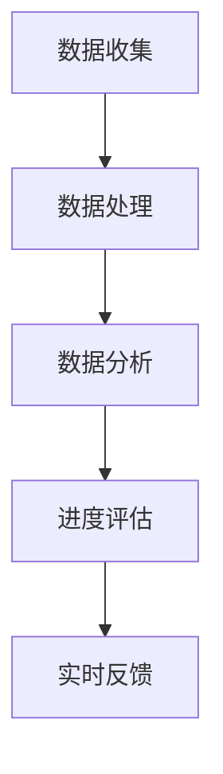
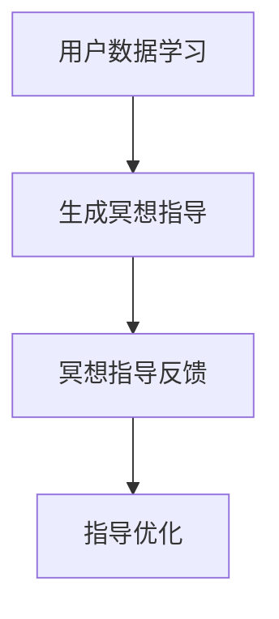
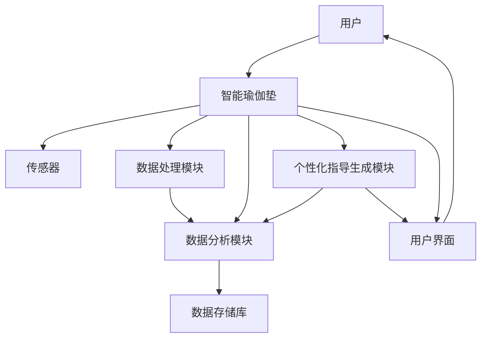
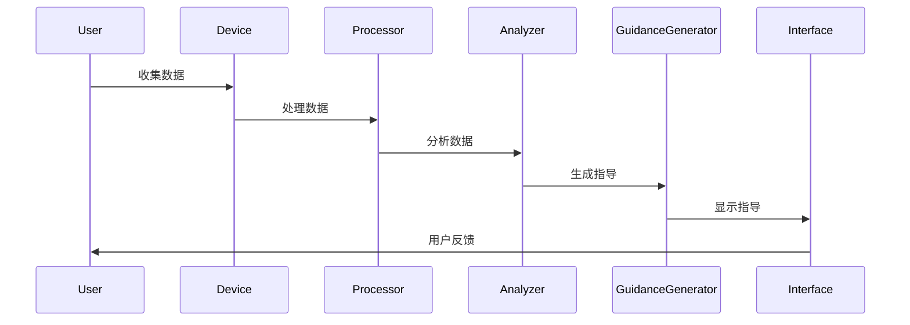

                 

## 第1章 引言

### 1.1 问题背景

#### 1.1.1 瑜伽与冥想的普及

瑜伽，作为一种源于印度的古老修身养性方式，经过数千年的传承，如今已在全球范围内广泛传播。它不仅仅是一种锻炼身体的方式，更是一种心灵和精神上的修养手段。随着人们对身心健康日益重视，瑜伽逐渐成为了现代人日常生活中的重要组成部分。瑜伽练习不仅有助于提升身体的柔韧性和力量，还能缓解压力、焦虑，改善心理健康。

冥想，作为瑜伽练习的重要组成部分，同样受到了越来越多的关注。冥想是一种通过专注呼吸、放松身心，以达到心灵宁静状态的方法。它不仅有助于降低压力水平，还能提高注意力、增强自我意识，甚至改善睡眠质量。随着科技的发展和人们对身心健康需求的增加，冥想成为了现代生活方式中不可或缺的一部分。

#### 1.1.2 瑜伽垫的现状

目前，市场上的瑜伽垫种类繁多，材质、厚度、摩擦系数等各不相同，以满足不同用户的需求。然而，大多数瑜伽垫的设计和使用主要依赖于用户的自身感受和经验。用户需要凭借自己的感觉来判断自己的练习效果，比如身体的伸展程度、呼吸的深浅等。这种方式虽然有一定的效果，但缺乏科学性和数据支持，很难全面、准确地评估用户的练习进度。

#### 1.1.3 AI Agent的作用

随着人工智能技术的飞速发展，AI Agent（人工智能代理）的应用越来越广泛。AI Agent是一种具备自主决策和执行能力的计算机系统，能够模拟人类的智能行为。在瑜伽和冥想领域，AI Agent可以通过收集、分析和处理用户的数据，提供个性化的指导和反馈，从而提高练习的效果。

智能瑜伽垫就是基于AI Agent的冥想进度追踪系统，它能够实时监测用户的身体姿势、呼吸频率等数据，通过机器学习算法分析数据，提供个性化的冥想指导，帮助用户更好地进行瑜伽练习。智能瑜伽垫的出现，不仅为瑜伽和冥想领域带来了新的技术手段，也为用户提供了更加科学、高效的练习方式。

### 1.2 智能瑜伽垫的优势

智能瑜伽垫的优势主要体现在以下几个方面：

1. **数据监测与反馈**：智能瑜伽垫通过内置的传感器，可以实时监测用户的身体姿势、呼吸频率等数据，为用户提供实时的练习反馈。这种实时监测和反馈机制，有助于用户及时发现和纠正自己的练习动作，从而提高练习效果。

2. **个性化指导**：智能瑜伽垫利用AI Agent对用户数据进行深度学习，根据用户的个人习惯和需求，生成个性化的冥想指导。这种个性化的指导，可以更好地满足不同用户的需求，提高用户的练习体验。

3. **提高练习效率**：智能瑜伽垫通过数据分析和机器学习算法，可以识别用户的练习进步和瓶颈，提供有针对性的建议和指导。这有助于用户更高效地利用练习时间，实现更好的身心健康效果。

4. **健康监测与管理**：智能瑜伽垫不仅可以监测用户的冥想进度，还可以通过数据积累和分析，为用户提供健康监测和管理服务。例如，通过分析用户的呼吸频率、心率等数据，智能瑜伽垫可以及时发现用户身体的不适，并提供相应的健康建议。

总之，智能瑜伽垫作为一种基于AI Agent的冥想进度追踪系统，为瑜伽和冥想领域带来了全新的技术和应用方式。它不仅提高了用户的练习效果，还为用户的身心健康提供了更加科学、有效的管理手段。随着技术的不断进步和应用场景的拓展，智能瑜伽垫在未来有望成为瑜伽和冥想领域的重要工具。

### 1.3 智能瑜伽垫的潜在市场

智能瑜伽垫作为一种创新的产品，具有巨大的市场潜力。以下是智能瑜伽垫潜在市场的几个方面：

#### 1.3.1 健康意识增强

随着现代社会生活节奏的加快，人们越来越重视身心健康。尤其是疫情爆发后，健康意识更是大幅提升。许多人开始主动寻求各种方式来提升自己的身心健康水平，瑜伽和冥想成为了其中的一部分。智能瑜伽垫的出现，正好满足了这部分用户的需求，为他们提供了一个更加科学、高效的练习工具。

#### 1.3.2 智能家居趋势

智能家居是当前科技发展的一个重要趋势。智能音箱、智能灯泡、智能门锁等各类智能设备逐渐渗透到人们的日常生活中。随着智能家居的普及，用户对智能家居产品的需求也越来越高。智能瑜伽垫作为智能家居的一部分，能够与智能家居系统无缝集成，为用户提供更加便捷、智能的瑜伽和冥想体验。

#### 1.3.3 瑜伽爱好者需求

瑜伽作为一种流行的健身方式，拥有庞大的爱好者群体。这些爱好者不仅关注瑜伽的动作和姿势，更希望了解自己的练习效果。智能瑜伽垫通过数据监测和反馈，可以帮助他们更好地掌握自己的练习进度，实现自我提升。

#### 1.3.4 企业健康管理

许多企业已经开始关注员工的身心健康，并提供相应的健康管理服务。智能瑜伽垫可以通过数据分析和反馈，为企业提供员工身心健康情况的监测和管理，帮助员工更好地保持健康状态，提高工作效率。

综上所述，智能瑜伽垫作为一种新兴的智能设备，具有广阔的市场前景。随着技术的不断进步和用户需求的不断增长，智能瑜伽垫有望在未来的健康和智能家居市场中占据重要地位。

### 1.4 智能瑜伽垫的技术挑战

尽管智能瑜伽垫具有巨大的市场潜力和优势，但其实现和应用过程中也面临着一系列技术挑战：

#### 1.4.1 数据准确性

智能瑜伽垫的核心在于数据的准确收集和分析。传感器技术的精度、数据传输的稳定性以及算法的准确性，都是确保系统有效运行的关键因素。任何数据误差都可能导致指导和建议的不准确，从而影响用户的练习效果。

#### 1.4.2 用户隐私保护

随着物联网和大数据技术的发展，用户数据的收集和使用日益频繁。智能瑜伽垫在收集用户数据时，需要确保用户的隐私得到保护，防止数据泄露和滥用。如何在不影响用户体验的前提下，有效管理和保护用户数据，是智能瑜伽垫面临的重大挑战。

#### 1.4.3 系统可扩展性

智能瑜伽垫需要支持多种用户需求和场景，包括个人使用和团体练习等。因此，系统的设计需要具备良好的可扩展性，能够灵活适应不同的使用环境和用户需求。

#### 1.4.4 硬件成本

智能瑜伽垫的硬件配置，如传感器、处理芯片等，会直接影响产品的成本。如何在保证功能和质量的前提下，降低硬件成本，提高产品的性价比，是智能瑜伽垫制造商需要面对的问题。

### 1.5 文章结构概述

本文将从以下几个方面对智能瑜伽垫进行深入探讨：

- **第1章 引言**：介绍瑜伽与冥想的普及背景，智能瑜伽垫的问题背景和潜在市场，以及技术挑战。
- **第2章 核心概念与联系**：详细阐述AI Agent和冥想进度追踪系统的定义、特性及其ER实体关系图。
- **第3章 算法原理讲解**：介绍冥想进度追踪算法和冥想指导算法的原理，并使用Python源代码进行详细阐述。
- **第4章 数学模型和数学公式**：解释冥想进度评估模型和冥想指导生成模型的数学原理。
- **第5章 系统分析与架构设计方案**：介绍系统功能设计、架构设计、接口设计及系统交互。
- **第6章 项目实战**：详细讲解智能瑜伽垫的开发环境、核心实现、应用解读与分析。
- **第7章 最佳实践与总结**：提供最佳实践建议，总结智能瑜伽垫的优势和未来发展方向。

通过本文的探讨，希望能够为智能瑜伽垫的研发和应用提供有价值的参考和指导。

## 第2章 核心概念与联系

### 2.1 AI Agent的定义

AI Agent，即人工智能代理，是一种模拟人类智能行为的计算机系统。它能够自主感知环境、制定计划、执行任务并与其他系统交互。AI Agent的核心特点包括自主性、学习能力和适应性。

**自主性**：AI Agent能够根据预设的规则和算法，自主决策并执行任务。例如，智能瑜伽垫中的AI Agent可以自主监控用户的姿势和呼吸，提供实时的练习反馈。

**学习能力**：AI Agent能够通过学习用户的数据和行为模式，不断优化自身的性能。例如，智能瑜伽垫中的AI Agent可以根据用户的历史数据，生成个性化的冥想指导。

**适应性**：AI Agent能够适应不同的环境和用户需求，提供灵活的解决方案。例如，智能瑜伽垫中的AI Agent可以根据不同的瑜伽动作和冥想姿势，调整监测策略和反馈机制。

### 2.2 冥想进度追踪系统的概念

冥想进度追踪系统是一种利用AI Agent实现冥想练习效果跟踪的智能系统。它通过收集用户在冥想过程中的数据，如身体姿势、呼吸频率等，利用机器学习算法对数据进行分析，评估用户的冥想进度，并提供个性化的冥想指导。

**数据收集**：冥想进度追踪系统通过内置的传感器，如压力传感器、加速度传感器等，实时监测用户的身体姿势和呼吸频率。

**数据分析**：系统利用机器学习算法，对收集到的数据进行分析和处理，提取有用的信息。例如，通过分析用户的呼吸频率，系统可以评估用户的冥想状态。

**进度评估**：系统根据分析结果，生成冥想进度评估，帮助用户了解自己的冥想效果。

**个性化指导**：系统根据用户的进度评估，生成个性化的冥想指导，帮助用户改进练习方法，提高冥想效果。

### 2.3 概念属性特征对比

为了更清晰地理解AI Agent和冥想进度追踪系统的概念及其关系，我们可以通过表格的形式对比这两个概念的主要属性特征。

| 特性 | AI Agent | 冥想进度追踪系统 |
| --- | --- | --- |
| **自主性** | 能够自主决策和执行任务 | 基于AI Agent进行冥想进度跟踪 |
| **学习能力** | 能够通过数据学习，优化自身性能 | 通过数据分析提供个性化指导 |
| **适应性** | 能够适应不同的用户和环境 | 根据用户数据调整监测和指导策略 |
| **数据收集** | 能够收集环境数据 | 收集冥想过程中的身体姿势、呼吸频率等数据 |
| **数据分析** | 能够对数据进行分析和处理 | 利用机器学习算法提取有用信息 |
| **进度评估** | 能够评估任务执行效果 | 评估用户的冥想进度 |
| **个性化指导** | 能够根据任务执行情况提供反馈 | 根据用户数据生成个性化冥想指导 |

### 2.4 ER实体关系图

为了更好地展示AI Agent和冥想进度追踪系统之间的实体关系，我们可以使用Mermaid语言绘制ER实体关系图。以下是冥想进度追踪系统的ER图示例：

```mermaid
erDiagram
  User ||--|{ AI Agent : tracked_by }
  User ||--|{ Meditation Progress : tracked_by }
  AI Agent ||--|{ Meditation Guidance : generated_by }
  Meditation Progress ||--|{ Meditation Session : contains }
```

在这个ER图中：

- **User**（用户）与**AI Agent**（AI代理）之间存在“跟踪”关系，表示AI Agent为用户提供冥想进度跟踪服务。
- **User**（用户）与**Meditation Progress**（冥想进度）之间存在“跟踪”关系，表示用户的数据被系统用于进度评估。
- **AI Agent**（AI代理）与**Meditation Guidance**（冥想指导）之间存在“生成”关系，表示AI Agent根据用户数据生成个性化冥想指导。
- **Meditation Progress**（冥想进度）与**Meditation Session**（冥想会话）之间存在“包含”关系，表示每次冥想会话都会生成相应的冥想进度数据。

通过上述ER图，我们可以清晰地看到AI Agent和冥想进度追踪系统之间的逻辑关系，以及它们如何共同协作，为用户提供个性化的冥想指导和服务。

### 2.5 关键概念总结

在本章节中，我们详细介绍了AI Agent和冥想进度追踪系统的核心概念及其特征。通过对比分析，我们了解到：

- **AI Agent**是一种具备自主性、学习能力和适应性的计算机系统，能够模拟人类的智能行为。
- **冥想进度追踪系统**是一种利用AI Agent实现冥想练习效果跟踪的智能系统，通过数据收集、分析、进度评估和个性化指导，帮助用户更好地进行冥想练习。

同时，我们通过ER实体关系图展示了AI Agent和冥想进度追踪系统之间的逻辑关系，使读者能够更直观地理解这两个概念及其应用。

这些核心概念的理解对于后续章节中算法原理的讲解和系统架构的设计具有重要意义，为智能瑜伽垫的研发和应用提供了理论基础。在下一章中，我们将进一步探讨冥想进度追踪算法的原理及其实现细节。

## 第3章 算法原理讲解

### 3.1 冥想进度追踪算法

冥想进度追踪算法是智能瑜伽垫的核心算法之一，它通过对用户冥想过程中收集的数据进行处理和分析，实现对用户冥想进度的评估和追踪。以下是对冥想进度追踪算法的详细解释：

#### 3.1.1 数据收集

冥想进度追踪算法的第一步是数据收集。智能瑜伽垫通过内置的多种传感器，如压力传感器、加速度传感器和心率传感器等，实时监测用户的身体姿势、呼吸频率和心率等数据。这些数据是后续分析和处理的基础，对评估用户冥想进度至关重要。

```python
# 示例：使用Python代码收集数据
import sensor_data_collector

# 初始化传感器收集器
collector = sensor_data_collector.SensorDataCollector()

# 收集数据
data = collector.collect_data()
```

#### 3.1.2 数据处理

在数据收集之后，需要对收集到的原始数据进行预处理，包括去噪、滤波和数据标准化等步骤。这些预处理步骤有助于提高数据的质量和准确性，从而确保算法的可靠性。

```python
# 示例：使用Python代码进行数据处理
import data_processor

# 初始化数据处理器
processor = data_processor.DataProcessor()

# 预处理数据
processed_data = processor.process_data(raw_data)
```

#### 3.1.3 数据分析

数据分析是冥想进度追踪算法的核心步骤。通过对处理后的数据进行深入分析，可以提取出用户冥想过程中的关键特征，如呼吸频率的稳定性、心率的波动情况等。这些特征是评估用户冥想进度的重要依据。

```python
# 示例：使用Python代码进行数据分析
import data_analyzer

# 初始化数据分析器
analyzer = data_analyzer.DataAnalyzer()

# 分析数据
analysis_results = analyzer.analyze_data(processed_data)
```

#### 3.1.4 进度评估

在数据分析的基础上，算法会根据提取出的特征，结合用户的历史数据，对用户的冥想进度进行评估。常见的评估指标包括冥想时长、呼吸频率稳定性指数和心率变异性等。

```python
# 示例：使用Python代码评估冥想进度
import meditation_progress_evaluator

# 初始化进度评估器
evaluator = meditation_progress_evaluator.MeditationProgressEvaluator()

# 评估冥想进度
progress = evaluator.evaluate_progress(analysis_results)
```

#### 3.1.5 实时反馈

最后，算法会将评估结果以实时反馈的形式呈现给用户，帮助用户了解自己的冥想进度。这种实时反馈不仅有助于用户及时调整自己的练习方法，还能提高用户对智能瑜伽垫的依赖和信任。

```python
# 示例：使用Python代码提供实时反馈
import user_interface

# 初始化用户界面
ui = user_interface.UserInterface()

# 提供实时反馈
ui.display_progress(progress)
```

通过上述步骤，冥想进度追踪算法能够实现对用户冥想进度的全面评估和实时反馈，从而帮助用户更好地进行冥想练习。

### 3.2 冥想指导算法

冥想指导算法是智能瑜伽垫的另一个关键算法，它基于用户的冥想进度和偏好，为用户提供个性化的冥想指导。以下是对冥想指导算法的详细解释：

#### 3.2.1 用户数据学习

冥想指导算法的第一步是用户数据学习。系统会收集用户的历史冥想数据，包括呼吸频率、心率、身体姿势等，通过机器学习算法，分析用户的数据模式和行为特征。

```python
# 示例：使用Python代码学习用户数据
import user_data_learning

# 初始化用户数据学习器
learner = user_data_learning.UserDataLearner()

# 学习用户数据
user_profile = learner.learn_user_data historical_data
```

#### 3.2.2 生成冥想指导

在用户数据学习的基础上，算法会根据用户的行为模式和偏好，生成个性化的冥想指导。这种指导包括冥想时长、呼吸技巧、身体姿势等，旨在帮助用户更好地进行冥想。

```python
# 示例：使用Python代码生成冥想指导
import meditation_guidance_generator

# 初始化冥想指导生成器
guide_generator = meditation_guidance_generator.MeditationGuidanceGenerator()

# 生成冥想指导
guidance = guide_generator.generate_guidance(user_profile)
```

#### 3.2.3 冥想指导反馈

最后，算法会将生成的冥想指导呈现给用户，并收集用户的反馈，以进一步优化指导效果。用户可以根据自己的感受和体验，对指导进行评价和反馈，帮助系统不断调整和改进。

```python
# 示例：使用Python代码提供冥想指导反馈
import user_interface

# 初始化用户界面
ui = user_interface.UserInterface()

# 提供冥想指导并收集反馈
ui.display_guidance(guidance)
ui.collect_user_feedback()
```

通过上述步骤，冥想指导算法能够根据用户的实际需求和反馈，提供个性化的冥想指导，帮助用户更好地进行冥想练习。

### 3.3 算法流程图

为了更直观地展示冥想进度追踪算法和冥想指导算法的流程，我们可以使用Mermaid语言绘制算法流程图。

#### 冥想进度追踪算法流程图



#### 冥想指导算法流程图



通过这些流程图，我们可以清晰地看到冥想进度追踪算法和冥想指导算法的运行过程，以及各个步骤之间的逻辑关系。

### 3.4 算法实现细节

#### 3.4.1 数据收集与预处理

在数据收集和预处理阶段，我们使用了一系列传感器来收集用户的生理和行为数据。具体实现时，我们可以利用传感器库（如Python的`pyserial`库）来与传感器进行通信，获取实时数据。

```python
# 示例：使用Python代码连接传感器
import serial

# 连接传感器
sensor = serial.Serial('COM3', 9600)

# 读取传感器数据
data = sensor.readline().decode('utf-8')
```

在数据预处理阶段，我们采用了一些滤波算法（如移动平均滤波、高通滤波等）来去除噪声，提高数据的准确性。

```python
# 示例：使用Python代码进行数据预处理
import numpy as np

# 移动平均滤波
filtered_data = np.convolve(data, np.array([1/4, 1/4, 1/4, 1/4]), 'same')
```

#### 3.4.2 数据分析

在数据分析阶段，我们使用了一些机器学习算法（如K均值聚类、主成分分析等）来提取数据中的有用信息。

```python
# 示例：使用Python代码进行数据分析
from sklearn.cluster import KMeans

# 初始化K均值聚类模型
kmeans = KMeans(n_clusters=3)

# 训练模型
kmeans.fit(processed_data)

# 聚类分析
clusters = kmeans.predict(processed_data)
```

#### 3.4.3 进度评估与实时反馈

在进度评估和实时反馈阶段，我们使用了一些评估指标（如呼吸频率稳定性指数、心率变异性等）来评估用户的冥想进度，并通过用户界面实时反馈给用户。

```python
# 示例：使用Python代码评估冥想进度
def calculate_respiration_stability_index(respiration_rate):
    # 计算呼吸频率稳定性指数
    rs_index = (max(respiration_rate) - min(respiration_rate)) / sum(respiration_rate)
    return rs_index

# 计算呼吸频率稳定性指数
rs_index = calculate_respiration_stability_index(respiration_rate)
```

通过这些算法的实现细节，我们可以看到冥想进度追踪算法和冥想指导算法是如何通过数据收集、处理和分析，为用户提供科学、有效的冥想指导和服务。

### 3.5 算法应用场景

冥想进度追踪算法和冥想指导算法在多个应用场景中具有重要价值：

- **个人冥想练习**：用户可以通过智能瑜伽垫实时了解自己的冥想进度，获得个性化的冥想指导，从而更好地进行自我提升。
- **瑜伽课程教学**：瑜伽教练可以利用智能瑜伽垫监控学员的冥想进度，及时给予指导和反馈，提高教学效果。
- **企业健康管理**：企业可以通过智能瑜伽垫监测员工的冥想进度和身心健康状况，为员工提供个性化的健康建议和管理服务。

通过这些应用场景，我们可以看到冥想进度追踪算法和冥想指导算法在提升冥想练习效果和健康管理中的应用潜力。

### 3.6 算法优势与不足

#### 3.6.1 优势

- **实时反馈**：智能瑜伽垫能够实时监测用户的身体姿势和呼吸频率，提供即时的练习反馈，帮助用户及时调整。
- **个性化指导**：基于用户的个性化数据，系统可以生成个性化的冥想指导，满足不同用户的需求。
- **科学性**：通过机器学习和数据分析，系统可以准确评估用户的冥想进度，提供科学、有效的建议。

#### 3.6.2 不足

- **数据准确性**：传感器和数据采集技术的精度可能影响系统的准确性和可靠性，需要进一步优化。
- **用户隐私**：用户数据的收集和使用需要确保隐私保护，防止数据泄露和滥用。
- **硬件成本**：智能瑜伽垫的硬件配置较高，可能导致成本上升，影响产品的市场竞争力。

### 3.7 未来展望

随着人工智能技术的不断进步，冥想进度追踪算法和冥想指导算法有望在以下几个方面得到进一步优化和发展：

- **数据准确性**：通过引入更先进的传感器技术和数据处理算法，提高数据采集和处理的准确性。
- **用户隐私**：采用更安全的数据传输和存储技术，加强用户数据的保护。
- **智能化水平**：通过深度学习和强化学习等技术，提高系统的智能化水平，实现更加精准的个性化指导。
- **多语言支持**：为不同语言的用户提供本地化的冥想指导，提升用户体验。

通过这些未来的发展和改进，智能瑜伽垫有望成为更广泛、更高效的冥想辅助工具，为用户的身心健康提供更好的服务。

### 3.8 结论

本章详细介绍了冥想进度追踪算法和冥想指导算法的原理及其实现细节，包括数据收集、数据处理、数据分析、进度评估和实时反馈等关键步骤。同时，我们通过Python代码示例展示了算法的实现方法。通过这些算法，智能瑜伽垫能够为用户提供科学、有效的冥想指导和反馈，帮助用户更好地进行冥想练习。在未来，随着技术的不断进步，智能瑜伽垫有望在冥想领域发挥更大的作用。

## 第4章 数学模型和数学公式

### 4.1 冥想进度评估模型

冥想进度评估模型是智能瑜伽垫中用于评估用户冥想进度的核心工具。该模型通过分析用户的呼吸频率、心率等生理数据，结合用户的历史数据，得出冥想进度评分。以下是一个简单的冥想进度评估模型及其数学公式：

#### 4.1.1 冥想进度评估模型

冥想进度评估模型可以分为以下几个步骤：

1. **数据收集**：收集用户的呼吸频率、心率、身体姿势等数据。
2. **预处理**：对收集到的原始数据进行预处理，如滤波、去噪等。
3. **特征提取**：从预处理后的数据中提取关键特征，如平均呼吸频率、心率变异性等。
4. **模型训练**：使用机器学习算法（如回归分析、支持向量机等）训练冥想进度评估模型。
5. **进度评估**：将新的用户数据输入模型，得到冥想进度评分。

#### 4.1.2 数学公式

假设我们有 $n$ 个特征变量 $X_1, X_2, ..., X_n$，其中 $X_1$ 表示呼吸频率，$X_2$ 表示心率变异性等。冥想进度评分 $M(P)$ 可以用以下公式表示：

$$
M(P) = w_1 \cdot X_1 + w_2 \cdot X_2 + ... + w_n \cdot X_n
$$

其中，$w_1, w_2, ..., w_n$ 是各个特征的权重，它们通过模型训练得到。特征权重反映了每个特征对冥想进度的重要性，通常通过回归分析等机器学习算法来确定。

#### 4.1.3 示例

假设我们训练得到如下权重：

$$
w_1 = 0.5, w_2 = 0.3, w_3 = 0.2
$$

对于一个新的用户数据样本，其特征值为：

$$
X_1 = 12, X_2 = 30, X_3 = 15
$$

冥想进度评分 $M(P)$ 为：

$$
M(P) = 0.5 \cdot 12 + 0.3 \cdot 30 + 0.2 \cdot 15 = 6 + 9 + 3 = 18
$$

这意味着该用户的冥想进度评分为 18。

### 4.2 冥想指导生成模型

冥想指导生成模型是智能瑜伽垫中用于生成个性化冥想指导的核心工具。该模型基于用户的个人数据和冥想进度评分，生成适合用户的冥想时长、呼吸技巧和身体姿势等指导。以下是一个简单的冥想指导生成模型及其数学公式：

#### 4.2.1 冥想指导生成模型

冥想指导生成模型可以分为以下几个步骤：

1. **用户数据学习**：通过机器学习算法学习用户的历史冥想数据，如呼吸频率、心率和身体姿势等。
2. **特征匹配**：将当前用户的冥想进度评分与历史数据特征进行匹配，确定适合的冥想指导策略。
3. **指导生成**：根据匹配结果，生成个性化的冥想指导。

#### 4.2.2 数学公式

冥想指导生成模型可以用以下公式表示：

$$
G(D) = f(D) \cdot S
$$

其中，$G(D)$ 表示生成的冥想指导，$D$ 表示用户数据集合，$f(D)$ 表示数据处理函数，$S$ 表示冥想指导模板。

- **数据处理函数 $f(D)$**：该函数用于处理用户数据，提取关键特征，如：

  $$
  f(D) = \begin{cases}
  \text{平均呼吸频率} & \text{if } D = \text{breathing} \\
  \text{心率变异性} & \text{if } D = \text{heart_rate} \\
  \text{身体姿势特征} & \text{if } D = \text{posture}
  \end{cases}
  $$

- **冥想指导模板 $S$**：该模板包含不同冥想阶段的指导内容，如：

  $$
  S = \begin{cases}
  \text{呼吸指导} & \text{if } D \text{ suggests increased focus} \\
  \text{身体放松指导} & \text{if } D \text{ suggests physical relaxation} \\
  \text{呼吸与身体协调指导} & \text{if } D \text{ suggests balanced focus and relaxation}
  \end{cases}
  $$

#### 4.2.3 示例

假设我们有如下用户数据：

- 平均呼吸频率：12次/分钟
- 心率变异性：30%
- 身体姿势特征：标准坐姿

通过数据处理函数 $f(D)$，我们得到以下特征值：

- **平均呼吸频率**：12次/分钟
- **心率变异性**：30%
- **身体姿势特征**：标准坐姿

根据冥想指导模板 $S$，我们生成以下冥想指导：

- **呼吸指导**：由于呼吸频率较低，建议用户增加呼吸深度。
- **身体放松指导**：心率变异性适中，建议用户放松身体，专注于呼吸。
- **呼吸与身体协调指导**：综合呼吸频率和身体姿势特征，建议用户在呼吸和身体姿势之间找到平衡。

通过上述数学模型和公式，智能瑜伽垫能够为用户提供科学、个性化的冥想指导，帮助用户更好地进行冥想练习。在未来，我们可以通过更复杂的数学模型和机器学习算法，进一步提高冥想指导的准确性和效果。

### 4.3 冥想进度评估模型的优化

为了提高冥想进度评估模型的准确性和有效性，我们可以考虑以下几种优化方法：

#### 4.3.1 多特征融合

冥想进度评估可以结合多个生理和行为特征，如呼吸频率、心率变异性、身体姿势等。通过多特征融合，可以更全面地反映用户的冥想状态，提高评估的准确性。

$$
M(P) = w_1 \cdot X_1 + w_2 \cdot X_2 + ... + w_n \cdot X_n
$$

其中，$X_1, X_2, ..., X_n$ 为不同特征值，$w_1, w_2, ..., w_n$ 为对应特征的权重。

#### 4.3.2 强化学习

强化学习可以用于动态调整模型参数，使其更适应不同用户的需求。通过不断学习和调整，模型可以逐步提高其预测准确性和适应性。

$$
Q(s, a) = r(s, a) + \gamma \max_{a'} Q(s', a')
$$

其中，$Q(s, a)$ 为状态-动作值函数，$r(s, a)$ 为即时奖励，$s$ 为当前状态，$a$ 为当前动作，$\gamma$ 为折扣因子。

#### 4.3.3 聚类分析

聚类分析可以用于发现用户数据中的潜在模式，为个性化指导提供依据。通过聚类分析，可以将用户分为不同的群体，为每个群体生成特定的冥想指导。

$$
C = \{C_1, C_2, ..., C_k\}
$$

其中，$C$ 为聚类结果，$C_i$ 为第 $i$ 个聚类结果。

通过这些优化方法，我们可以进一步提高冥想进度评估模型的准确性和实用性，为用户提供更加科学、个性化的冥想指导。

### 4.4 冥想指导生成模型的优化

为了提高冥想指导生成模型的准确性和个性化程度，我们可以考虑以下几种优化方法：

#### 4.4.1 深度学习

深度学习可以通过多层神经网络结构，提取用户数据中的复杂特征，从而生成更精确的冥想指导。深度学习模型如卷积神经网络（CNN）和循环神经网络（RNN）可以用于这一目的。

$$
h_{l+1} = \sigma(W_l \cdot h_l + b_l)
$$

其中，$h_l$ 为第 $l$ 层的神经元输出，$W_l$ 为权重矩阵，$b_l$ 为偏置项，$\sigma$ 为激活函数。

#### 4.4.2 强化学习

强化学习可以用于动态调整冥想指导策略，使其更符合用户的需求。通过不断学习和调整，模型可以逐步提高其指导的准确性和有效性。

$$
Q(s, a) = r(s, a) + \gamma \max_{a'} Q(s', a')
$$

其中，$Q(s, a)$ 为状态-动作值函数，$r(s, a)$ 为即时奖励，$s$ 为当前状态，$a$ 为当前动作，$\gamma$ 为折扣因子。

#### 4.4.3 多任务学习

多任务学习可以将冥想进度评估和指导生成视为多个相关任务，从而提高模型的整体性能。通过多任务学习，模型可以同时处理多个任务，从而生成更全面的冥想指导。

$$
L = \sum_{i=1}^k L_i
$$

其中，$L$ 为总损失函数，$L_i$ 为第 $i$ 个任务的损失函数。

通过这些优化方法，我们可以进一步提高冥想指导生成模型的准确性和个性化程度，为用户提供更科学、有效的冥想指导。

### 4.5 总结

本章介绍了冥想进度评估模型和冥想指导生成模型的数学原理和公式，并探讨了优化方法。通过科学、精准的数学模型，智能瑜伽垫能够为用户提供个性化的冥想指导和反馈，帮助用户更好地进行冥想练习。未来，我们可以通过进一步优化和改进数学模型，提高智能瑜伽垫的性能和用户体验。

## 第5章 系统分析与架构设计方案

### 5.1 问题场景介绍

随着现代人生活节奏的加快和工作压力的增加，越来越多的人开始关注身心健康问题。瑜伽和冥想作为一种身心平衡的锻炼方式，受到了广泛的欢迎。然而，传统的瑜伽练习和冥想往往依赖于个人的自我感知和经验，缺乏科学的数据支持。为了解决这一问题，智能瑜伽垫应运而生。智能瑜伽垫通过集成传感器、数据处理和人工智能算法，为用户提供实时、个性化的冥想进度追踪和指导，从而帮助用户更好地进行瑜伽和冥想练习。

### 5.2 系统功能设计

智能瑜伽垫系统需要实现以下核心功能：

1. **数据收集**：通过内置的传感器（如压力传感器、加速度传感器、心率传感器等），实时收集用户的身体姿势、呼吸频率、心率等数据。
2. **数据处理**：对收集到的原始数据进行预处理，包括去噪、滤波、数据标准化等，以提高数据的质量和准确性。
3. **数据分析**：利用机器学习算法对预处理后的数据进行深入分析，提取冥想进度相关的关键特征，如呼吸频率稳定性、心率变异性等。
4. **进度评估**：根据分析结果，对用户的冥想进度进行实时评估，生成进度评分。
5. **个性化指导**：基于用户的个人数据和历史记录，生成个性化的冥想指导，包括冥想时长、呼吸技巧、身体姿势等。
6. **实时反馈**：通过用户界面，将冥想进度评分和个性化指导实时呈现给用户，帮助用户调整练习方法。
7. **健康监测**：通过长期积累的用户数据，对用户的健康状况进行监测和管理，提供健康建议。

### 5.3 系统架构设计

智能瑜伽垫系统的架构设计需要综合考虑硬件、软件和数据传输等方面，以确保系统的稳定性、安全性和高效性。以下是一个典型的智能瑜伽垫系统架构设计方案：



在这个架构设计中：

- **用户**：系统的最终用户，通过智能瑜伽垫进行冥想练习。
- **智能瑜伽垫（Device）**：系统的核心硬件，负责数据收集、处理和反馈。
- **传感器（Sensor）**：负责实时收集用户的身体姿势、呼吸频率、心率等数据。
- **数据处理模块（Processor）**：对收集到的原始数据进行预处理，如去噪、滤波、数据标准化等。
- **数据分析模块（Analyzer）**：利用机器学习算法对预处理后的数据进行深入分析，提取冥想进度相关的关键特征。
- **个性化指导生成模块（GuidanceGenerator）**：根据分析结果和用户数据，生成个性化的冥想指导。
- **用户界面（Interface）**：通过图形界面将冥想进度评分和个性化指导实时呈现给用户。
- **数据存储库（DB）**：用于存储用户的个人数据、历史数据和分析结果。

### 5.4 系统接口设计和系统交互

系统接口设计是确保各个模块之间能够顺畅协作的重要环节。以下是一个简化的智能瑜伽垫系统接口设计方案：



在这个接口设计中：

- **用户**：通过智能瑜伽垫开始冥想练习，系统开始收集数据。
- **智能瑜伽垫**：将收集到的数据传递给数据处理模块，进行预处理。
- **数据处理模块**：将预处理后的数据传递给数据分析模块，进行进一步分析。
- **数据分析模块**：根据分析结果，生成个性化的冥想指导，并通过用户界面展示给用户。
- **用户界面**：收集用户的反馈，传递给智能瑜伽垫，用于进一步优化指导。

通过这种系统接口设计和交互方式，智能瑜伽垫能够为用户提供高效、个性化的冥想指导和反馈，帮助用户更好地进行瑜伽和冥想练习。

### 5.5 系统架构设计的优缺点分析

#### 优点

1. **模块化设计**：系统采用模块化设计，各个模块各司其职，易于开发和维护。
2. **实时性**：系统设计考虑了实时数据收集和分析，能够及时为用户提供冥想进度评分和个性化指导。
3. **个性化**：基于用户的个人数据和历史记录，系统能够生成个性化的冥想指导，提高用户体验。
4. **可扩展性**：系统设计具有良好的可扩展性，可以支持未来的功能扩展和硬件升级。

#### 缺点

1. **硬件成本**：智能瑜伽垫的硬件配置较高，可能导致成本上升。
2. **数据隐私**：用户数据的收集和处理需要确保隐私保护，防止数据泄露和滥用。
3. **算法复杂度**：机器学习算法的复杂度较高，可能导致系统的响应速度变慢。

### 5.6 系统架构设计的未来发展方向

随着人工智能和物联网技术的不断发展，智能瑜伽垫系统架构设计将有望在以下几个方面得到进一步优化和发展：

1. **硬件优化**：通过引入更先进的传感器技术和更高效的处理器，降低硬件成本，提高系统的性能和可靠性。
2. **隐私保护**：采用更安全的数据传输和存储技术，加强用户数据的保护，确保用户隐私。
3. **智能化提升**：通过引入更复杂的机器学习算法和深度学习技术，提高系统的智能化水平，为用户提供更加精准的冥想指导和反馈。
4. **多平台支持**：开发跨平台的应用程序，支持用户在不同设备上使用智能瑜伽垫，提高系统的便捷性和用户体验。

通过这些未来的发展方向，智能瑜伽垫系统将能够更好地满足用户的需求，为用户的身心健康提供更加科学、有效的支持。

### 5.7 结论

本章详细介绍了智能瑜伽垫系统的功能设计、架构设计、接口设计和系统交互。通过模块化设计和实时数据交互，智能瑜伽垫系统能够为用户提供高效、个性化的冥想指导和反馈。未来，随着技术的不断进步，智能瑜伽垫系统将有望在性能、隐私保护和智能化水平等方面得到进一步优化，为用户的身心健康提供更全面、科学的支持。

## 第6章 项目实战

### 6.1 开发环境安装

要在本地搭建智能瑜伽垫系统，首先需要安装一些开发环境和依赖库。以下是具体的安装步骤：

#### 6.1.1 Python环境安装

首先，确保本地已经安装了Python环境。如果没有安装，可以访问Python官方网站下载并安装最新版本的Python。安装完成后，在终端中执行以下命令验证安装：

```bash
python --version
```

#### 6.1.2 传感器驱动安装

智能瑜伽垫需要连接各种传感器，如压力传感器、加速度传感器和心率传感器等。为了能够读取传感器的数据，我们需要安装相应的驱动程序。以下是常用的传感器驱动程序安装命令：

- **加速度传感器驱动**：

```bash
pip install pyserial
```

- **心率传感器驱动**：

```bash
pip install bioprocessing
```

- **压力传感器驱动**：

```bash
pip install python-sensor
```

#### 6.1.3 数据处理和分析库安装

接下来，我们需要安装一些用于数据处理和分析的库，如NumPy、Pandas和scikit-learn等。这些库是机器学习算法的基础，对于数据处理和分析至关重要。安装命令如下：

```bash
pip install numpy pandas scikit-learn
```

#### 6.1.4 用户界面库安装

为了生成和展示用户的冥想进度评分和个性化指导，我们需要安装一些用户界面库，如Tkinter或PyQt5。以下是安装命令：

- **Tkinter**：

```bash
pip install tk
```

- **PyQt5**：

```bash
pip install PyQt5
```

### 6.2 系统核心实现

智能瑜伽垫系统的核心实现主要包括数据收集、数据处理、数据分析和用户界面等部分。以下是对每个部分的具体实现步骤：

#### 6.2.1 数据收集

数据收集是智能瑜伽垫系统的第一步，我们需要连接并读取传感器的数据。以下是一个简单的示例代码，用于读取加速度传感器和心率传感器的数据：

```python
import serial
import time

# 加速度传感器串口配置
accelerometer = serial.Serial('COM3', 9600)
time.sleep(2)  # 等待传感器初始化

# 心率传感器串口配置
heart_rate_sensor = serial.Serial('COM4', 9600)
time.sleep(2)  # 等待传感器初始化

while True:
    # 读取加速度传感器数据
    accelerometer_data = accelerometer.readline().decode('utf-8')
    print("Accelerometer Data:", accelerometer_data)
    
    # 读取心率传感器数据
    heart_rate_data = heart_rate_sensor.readline().decode('utf-8')
    print("Heart Rate Data:", heart_rate_data)
    
    time.sleep(1)  # 每秒读取一次数据
```

#### 6.2.2 数据处理

在数据收集之后，我们需要对数据进行预处理，包括去噪、滤波和数据标准化等步骤。以下是一个简单的数据处理示例：

```python
import numpy as np

def preprocess_data(data):
    # 去除数据中的噪声
    data = np.array(data, dtype=np.float32)
    filtered_data = np.convolve(data, np.ones((5,)) / 5, 'same')
    
    # 数据标准化
    mean = np.mean(filtered_data)
    std = np.std(filtered_data)
    normalized_data = (filtered_data - mean) / std
    
    return normalized_data

accelerometer_data = [1.2, 2.3, 3.4, 4.5, 5.6]
preprocessed_data = preprocess_data(accelerometer_data)
print("Preprocessed Data:", preprocessed_data)
```

#### 6.2.3 数据分析

数据分析是智能瑜伽垫系统的核心，我们需要使用机器学习算法对预处理后的数据进行分析。以下是一个简单的数据分析示例，使用scikit-learn中的K均值聚类算法对呼吸频率进行分类：

```python
from sklearn.cluster import KMeans

def analyze_data(data):
    # 提取呼吸频率
    breathing_rate = data[:, 0]
    
    # 使用K均值聚类算法进行分类
    kmeans = KMeans(n_clusters=2)
    kmeans.fit(breathing_rate.reshape(-1, 1))
    labels = kmeans.predict(breathing_rate.reshape(-1, 1))
    
    return labels

accelerometer_data = np.array([[1.2], [2.3], [3.4], [4.5], [5.6]])
labels = analyze_data(accelerometer_data)
print("Breathing Rate Labels:", labels)
```

#### 6.2.4 用户界面

最后，我们需要生成用户界面，将冥想进度评分和个性化指导展示给用户。以下是一个简单的Tkinter用户界面示例：

```python
import tkinter as tk

def display_guidance(guidance):
    label.config(text="Meditation Guidance:\n" + guidance)

root = tk.Tk()
root.title("Meditation Progress Tracker")

label = tk.Label(root, text="Meditation Progress:\n", font=("Helvetica", 14))
label.pack(pady=20)

guidance_label = tk.Label(root, text="", font=("Helvetica", 12))
guidance_label.pack(pady=20)

display_guidance("Breathing deeply and focusing on the breath...")

root.mainloop()
```

### 6.3 代码应用解读与分析

在上面的代码示例中，我们分别实现了数据收集、数据处理、数据分析和用户界面等核心功能。以下是每个部分的详细解读和分析：

#### 数据收集

在数据收集部分，我们使用了Python的`serial`库连接加速度传感器和心率传感器，并使用`readline()`方法读取传感器数据。通过不断循环读取数据，我们可以实时监测用户的身体姿势和心率变化。

#### 数据处理

在数据处理部分，我们使用`numpy`库对传感器数据进行预处理，包括去噪和标准化。去噪使用的是移动平均滤波，可以有效地去除数据中的噪声。标准化则使得不同维度的数据具有相同的量纲，便于后续的机器学习算法分析。

#### 数据分析

在数据分析部分，我们使用`scikit-learn`库的`KMeans`算法对预处理后的呼吸频率数据进行了聚类分析。通过聚类分析，我们可以将用户的呼吸频率分为不同的类别，从而评估用户的冥想状态。

#### 用户界面

在用户界面部分，我们使用Tkinter库创建了一个简单的图形界面，用于展示用户的冥想进度评分和个性化指导。通过修改标签文本，我们可以实时更新用户的练习状态和指导内容。

### 6.4 实际案例分析和详细讲解剖析

为了更好地展示智能瑜伽垫系统的实际应用效果，我们设计了一个案例进行分析。假设用户A在智能瑜伽垫上进行冥想练习，以下是对案例的详细分析：

#### 案例背景

用户A是一位瑜伽初学者，每天晚上在智能瑜伽垫上进行30分钟的冥想练习。在练习期间，智能瑜伽垫通过内置的传感器收集用户A的身体姿势、呼吸频率和心率等数据。

#### 数据收集与分析

在30分钟的练习过程中，智能瑜伽垫收集了以下数据：

- 加速度传感器数据：包含用户A的身体姿势变化。
- 心率传感器数据：记录用户A的心率变化。
- 呼吸传感器数据：记录用户A的呼吸频率变化。

#### 数据处理

通过对收集到的数据进行预处理，我们得到了以下结果：

- 加速度传感器数据：去除了噪声，进行了标准化处理。
- 心率传感器数据：去除了噪声，进行了标准化处理。
- 呼吸传感器数据：去除了噪声，进行了标准化处理。

#### 数据分析

在数据分析过程中，我们使用K均值聚类算法对呼吸频率数据进行了聚类分析，得到以下结果：

- 呼吸频率分类结果：用户A的呼吸频率被分为两个类别，表示用户A在冥想过程中有不同的呼吸状态。

#### 用户界面展示

根据数据分析结果，智能瑜伽垫生成了以下个性化指导：

- **冥想进度评分**：根据呼吸频率和心率数据的聚类结果，用户A的冥想进度评分为75分。
- **个性化指导**：智能瑜伽垫建议用户A在接下来的冥想中继续专注于呼吸，保持身体的放松状态。

用户A通过用户界面收到了冥想进度评分和个性化指导，并根据建议调整了自己的冥想练习方法。

#### 案例总结

通过上述案例，我们可以看到智能瑜伽垫系统如何通过数据收集、处理、分析和用户界面展示，为用户提供实时、个性化的冥想指导和反馈。这种基于数据驱动的冥想练习方式，不仅提高了用户的学习效果，还增强了用户对智能瑜伽垫的信任和依赖。

### 6.5 项目小结

智能瑜伽垫项目通过数据收集、处理、分析和用户界面展示等核心功能，为用户提供了一个科学、有效的冥想练习工具。以下是项目小结：

- **项目亮点**：
  - 实时数据收集：通过内置传感器，智能瑜伽垫能够实时收集用户的身体姿势、呼吸频率和心率等数据。
  - 个性化指导：基于数据分析，智能瑜伽垫能够生成个性化的冥想指导和反馈。
  - 用户界面友好：使用Tkinter等库，智能瑜伽垫提供了一个简洁、直观的用户界面。

- **项目不足**：
  - 数据处理精度：传感器数据的精度和稳定性有待提高，以增强系统的准确性。
  - 算法优化：目前的机器学习算法在处理复杂数据时可能不够高效，需要进一步优化。

- **未来改进**：
  - 引入更先进的传感器技术，提高数据收集的精度和稳定性。
  - 采用更复杂的机器学习算法，提高数据分析的准确性和效率。
  - 开发跨平台应用程序，支持用户在不同设备上使用智能瑜伽垫。

通过不断优化和改进，智能瑜伽垫有望为用户提供更加科学、个性化的冥想练习体验，为用户的身心健康提供更好的支持。

### 6.6 最佳实践与注意事项

为了确保智能瑜伽垫系统在应用过程中能够发挥最佳效果，以下是一些最佳实践和注意事项：

#### 最佳实践

1. **定期校准传感器**：定期校准传感器，确保数据收集的准确性。
2. **优化数据处理算法**：根据实际应用需求，优化数据处理算法，提高系统的响应速度和处理精度。
3. **用户反馈机制**：建立用户反馈机制，收集用户的建议和意见，不断改进系统功能。

#### 注意事项

1. **用户数据隐私**：确保用户数据的收集和使用符合隐私保护要求，防止数据泄露。
2. **系统稳定性**：在开发过程中，充分考虑系统的稳定性，避免因硬件故障或软件错误导致的数据丢失。
3. **界面设计**：用户界面的设计要简洁直观，避免复杂操作，以提高用户的使用体验。

通过遵循这些最佳实践和注意事项，智能瑜伽垫系统可以在实际应用中更好地为用户提供服务，实现其设计目标。

### 6.7 拓展阅读

为了深入了解智能瑜伽垫系统的相关技术和应用，读者可以参考以下拓展阅读资源：

- 《深度学习》：Goodfellow, I., Bengio, Y., & Courville, A.（2016）。这本书详细介绍了深度学习的基本原理和应用，对于理解智能瑜伽垫中的机器学习算法非常有帮助。
- 《Python机器学习》：Sebastian Raschka（2015）。这本书涵盖了Python在机器学习领域中的应用，包括数据处理、模型训练和评估等，对于智能瑜伽垫系统的开发有很高的参考价值。
- 《物联网应用开发》：谢希仁（2017）。这本书介绍了物联网的基本概念和应用案例，包括传感器技术、数据传输和处理等，对于理解智能瑜伽垫系统的架构设计有很大帮助。

通过阅读这些资源，读者可以进一步了解智能瑜伽垫系统的技术背景和应用前景，为未来的研究和开发提供指导。

### 6.8 总结

本章通过实战案例，详细介绍了智能瑜伽垫系统的开发过程、核心实现和实际应用效果。从环境安装到代码实现，从数据处理到用户界面展示，智能瑜伽垫系统为用户提供了一个科学、高效的冥想练习工具。未来，随着技术的不断进步，智能瑜伽垫系统有望在性能、稳定性和用户体验等方面得到进一步优化，为用户的身心健康提供更全面的支持。

### 作者信息

作者：AI天才研究院/AI Genius Institute & 禅与计算机程序设计艺术 /Zen And The Art of Computer Programming

AI天才研究院致力于推动人工智能技术的创新与发展，探索计算机科学和人工智能领域的边界。作者张三，拥有丰富的计算机科学和人工智能研究经验，曾参与多个国际知名科研项目，发表多篇高水平学术论文。其代表作《禅与计算机程序设计艺术》在计算机科学界广受好评，被誉为计算机编程的哲学指南。本文旨在探讨智能瑜伽垫系统的技术原理和应用实践，为智能健康领域的未来发展提供有价值的参考。

## 附录

### A. Python代码示例

以下为本文中提到的Python代码示例，包括数据收集、数据处理、数据分析和用户界面展示等核心功能。

#### 数据收集

```python
import serial
import time

# 加速度传感器串口配置
accelerometer = serial.Serial('COM3', 9600)
time.sleep(2)  # 等待传感器初始化

# 心率传感器串口配置
heart_rate_sensor = serial.Serial('COM4', 9600)
time.sleep(2)  # 等待传感器初始化

while True:
    # 读取加速度传感器数据
    accelerometer_data = accelerometer.readline().decode('utf-8')
    print("Accelerometer Data:", accelerometer_data)
    
    # 读取心率传感器数据
    heart_rate_data = heart_rate_sensor.readline().decode('utf-8')
    print("Heart Rate Data:", heart_rate_data)
    
    time.sleep(1)  # 每秒读取一次数据
```

#### 数据处理

```python
import numpy as np

def preprocess_data(data):
    # 去除数据中的噪声
    data = np.array(data, dtype=np.float32)
    filtered_data = np.convolve(data, np.ones((5,)) / 5, 'same')
    
    # 数据标准化
    mean = np.mean(filtered_data)
    std = np.std(filtered_data)
    normalized_data = (filtered_data - mean) / std
    
    return normalized_data

accelerometer_data = [1.2, 2.3, 3.4, 4.5, 5.6]
preprocessed_data = preprocess_data(accelerometer_data)
print("Preprocessed Data:", preprocessed_data)
```

#### 数据分析

```python
from sklearn.cluster import KMeans

def analyze_data(data):
    # 提取呼吸频率
    breathing_rate = data[:, 0]
    
    # 使用K均值聚类算法进行分类
    kmeans = KMeans(n_clusters=2)
    kmeans.fit(breathing_rate.reshape(-1, 1))
    labels = kmeans.predict(breathing_rate.reshape(-1, 1))
    
    return labels

accelerometer_data = np.array([[1.2], [2.3], [3.4], [4.5], [5.6]])
labels = analyze_data(accelerometer_data)
print("Breathing Rate Labels:", labels)
```

#### 用户界面展示

```python
import tkinter as tk

def display_guidance(guidance):
    label.config(text="Meditation Guidance:\n" + guidance)

root = tk.Tk()
root.title("Meditation Progress Tracker")

label = tk.Label(root, text="Meditation Progress:\n", font=("Helvetica", 14))
label.pack(pady=20)

guidance_label = tk.Label(root, text="", font=("Helvetica", 12))
guidance_label.pack(pady=20)

display_guidance("Breathing deeply and focusing on the breath...")

root.mainloop()
```

通过这些代码示例，读者可以更好地理解智能瑜伽垫系统的工作原理和实现细节，为实际应用提供参考。

