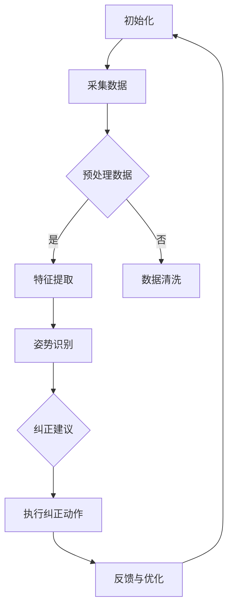
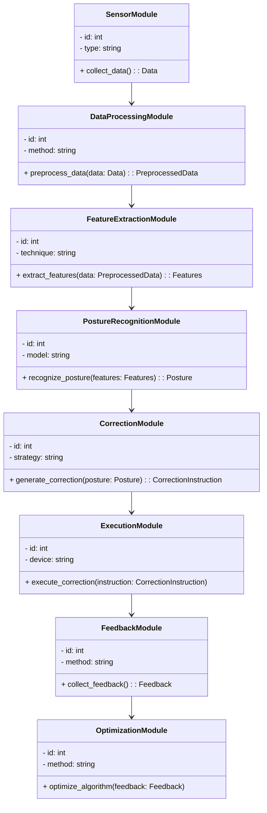
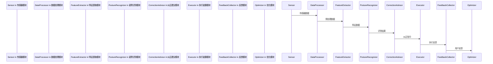
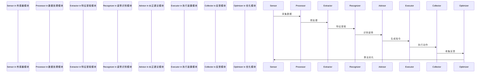

                 

## 摘要

本文将深入探讨智能瑜伽垫及其背后的AI Agent姿势纠正系统。随着人工智能技术的不断发展，AI Agent在各个领域的应用越来越广泛，健身领域也不例外。智能瑜伽垫通过集成AI技术，能够实时监测用户的瑜伽姿势，提供即时的反馈和纠正，从而提高瑜伽练习的效果和安全性。本文将详细介绍智能瑜伽垫的背景、核心概念、算法原理、系统设计与实现、项目实战以及最佳实践技巧，旨在为读者提供一个全面而深入的了解。通过本文的阅读，读者将能够掌握智能瑜伽垫的开发原理和应用技巧，为未来相关项目提供有力的技术支持。

---

## 第一部分：背景介绍

### 1.1 瑜伽垫的现状

瑜伽垫是瑜伽练习中不可或缺的辅助工具，其历史可以追溯到几千年前。早期的瑜伽垫多为天然材料制成，如草席、羊毛或树皮。随着现代科技的进步，瑜伽垫的材料和设计也在不断改进，从传统的硬质橡胶垫到柔软且有弹性的泡沫垫，再到如今带有各种附加功能的智能瑜伽垫，瑜伽垫的种类和功能越来越丰富。

然而，当前市场上的普通瑜伽垫存在一些不足。首先，传统的瑜伽垫缺乏个性化定制功能，无法根据用户的生理特征和需求提供合适的支撑和舒适度。其次，普通瑜伽垫的监测和反馈功能有限，难以确保练习者在练习过程中的姿势正确性，从而影响练习效果和安全性。此外，普通瑜伽垫的清洁和维护也相对困难，不利于长期使用。

因此，智能瑜伽垫的出现填补了这一市场空白。智能瑜伽垫不仅提供了更加舒适的支撑和定制化功能，还集成了先进的AI技术，能够实时监测用户的瑜伽姿势，提供即时的反馈和纠正，从而帮助用户更有效地进行瑜伽练习。

### 1.2 AI技术在健身领域的应用

人工智能（AI）技术近年来在各个领域取得了显著的进展，健身领域也不例外。AI技术在健身领域的应用主要体现在以下几个方面：

1. **运动数据分析**：通过传感器和摄像头等设备，AI技术能够实时采集用户的运动数据，如步数、心率、卡路里消耗等，帮助用户更好地了解自己的运动状态和健康状况。

2. **个性化健身计划**：基于用户的数据和需求，AI技术可以生成个性化的健身计划，包括运动类型、强度和时长等，从而提高健身效果。

3. **运动监控与反馈**：AI技术可以通过实时监测用户的运动姿势，提供即时的反馈和纠正，确保用户在运动过程中的姿势正确性，避免运动损伤。

4. **健身装备优化**：智能健身装备如智能瑜伽垫、智能跑步鞋等，集成了AI技术，能够提供更加精准的监测和反馈，提升用户的健身体验。

5. **健康风险评估**：通过分析用户的数据，AI技术可以评估用户的健康风险，提供预防性健康建议，帮助用户提前预防疾病。

### 1.3 智能瑜伽垫的必要性

智能瑜伽垫的必要性主要体现在以下几个方面：

1. **提升练习效果**：智能瑜伽垫通过实时监测用户的姿势，提供即时的反馈和纠正，帮助用户纠正错误姿势，提高瑜伽练习的效果。

2. **保障练习安全**：通过监测用户的姿势和动作，智能瑜伽垫能够及时发现潜在的危险动作，提醒用户注意安全，避免运动损伤。

3. **个性化定制**：智能瑜伽垫可以根据用户的生理特征和需求，提供个性化的支撑和舒适度，提升用户的练习体验。

4. **方便清洁和维护**：智能瑜伽垫通常采用易清洁的材料，方便日常的清洁和维护，延长使用寿命。

5. **数据驱动**：智能瑜伽垫集成了AI技术，能够采集用户的运动数据，为用户生成个性化的健身计划，提供科学的数据支持。

总的来说，智能瑜伽垫的出现不仅丰富了瑜伽垫的功能，还为瑜伽练习带来了更多的便捷和安全性，是未来瑜伽垫发展的重要趋势。

### 2.1 AI Agent的定义与特点

AI Agent（人工智能代理）是人工智能领域中的一个重要概念，它代表了一种具有自主决策能力和行动能力的智能实体。AI Agent的核心特点包括自主性、适应性、智能性和交互性。

首先，自主性是AI Agent的基本特征。AI Agent能够在没有人类干预的情况下，自主地感知环境、做出决策和执行行动。这种自主性使得AI Agent能够在复杂的环境中独立完成任务，减少对人类操作的依赖。

其次，适应性是AI Agent的一个重要特点。AI Agent能够根据环境的变化和新的信息，动态调整自己的行为和策略。这种适应性使得AI Agent能够在不断变化的环境中保持高效和稳定的工作状态。

第三，智能性是AI Agent的核心竞争力。AI Agent通过机器学习和深度学习等先进技术，具备了高水平的认知能力和问题解决能力。这使得AI Agent能够处理复杂的任务，提供高质量的解决方案。

最后，交互性是AI Agent的重要特点。AI Agent不仅能够与环境进行交互，还能够与人类进行交互，提供自然的人机交互体验。这种交互性使得AI Agent能够更好地融入人类生活，提供个性化的服务和支持。

### 2.2 姿势纠正系统的组成与工作原理

姿势纠正系统是一个综合性的智能系统，主要由以下几个组成部分构成：

1. **传感器模块**：传感器模块是姿势纠正系统的感知层，负责采集用户的姿势数据。常用的传感器包括摄像头、深度传感器、力传感器等。这些传感器能够实时监测用户的身体动作和姿势，并将数据传输给系统进行分析。

2. **数据处理模块**：数据处理模块是姿势纠正系统的核心，负责对传感器采集到的数据进行处理和分析。数据处理模块通常包括数据清洗、特征提取和模式识别等环节。通过对数据的处理，系统能够提取出用户的身体特征和姿势信息，为后续的姿势纠正提供依据。

3. **决策与控制模块**：决策与控制模块是姿势纠正系统的执行层，负责根据数据处理模块提供的信息，生成纠正动作的指令，并控制执行装置实施纠正动作。决策与控制模块通常采用人工智能算法，如深度学习、强化学习等，以提高决策的准确性和效率。

4. **执行装置**：执行装置是姿势纠正系统的输出层，负责根据决策与控制模块生成的指令，实施具体的纠正动作。执行装置可以是机械臂、震动器、按摩器等，根据系统的设计和应用场景的不同而有所差异。

工作原理方面，姿势纠正系统通过以下步骤实现用户的姿势纠正：

1. **感知**：传感器模块实时监测用户的身体动作和姿势，并将数据传输给数据处理模块。

2. **处理**：数据处理模块对传感器采集的数据进行处理，提取出用户的身体特征和姿势信息。

3. **决策**：决策与控制模块根据处理后的数据，使用人工智能算法生成纠正动作的指令。

4. **执行**：执行装置根据指令实施具体的纠正动作，帮助用户调整姿势。

通过这一系列的工作流程，姿势纠正系统能够实时监测用户的姿势，提供即时的反馈和纠正，帮助用户保持正确的姿势，提高运动效果和安全性。

### 2.3 AI Agent与姿势纠正系统的关系

AI Agent与姿势纠正系统之间存在着密切的关系。AI Agent作为姿势纠正系统的重要组成部分，负责系统的感知、决策和控制，从而实现用户的姿势纠正。以下是AI Agent与姿势纠正系统之间的几个关键联系：

1. **感知层**：AI Agent通过集成各种传感器，如摄像头、深度传感器等，能够实时监测用户的身体动作和姿势。这些传感器收集的数据被传输到AI Agent的数据处理模块，为其提供实时、准确的信息。

2. **数据处理与特征提取**：AI Agent的数据处理模块负责对传感器采集的数据进行处理和特征提取。通过数据清洗、降维、特征提取等技术，AI Agent能够从大量的数据中提取出用户的身体特征和姿势信息，为后续的决策提供基础。

3. **决策与控制**：AI Agent的决策与控制模块是姿势纠正系统的核心。基于提取出的身体特征和姿势信息，AI Agent使用机器学习、深度学习等算法，对用户的姿势进行评估，生成纠正动作的指令。这些指令被发送到执行装置，实施具体的纠正动作。

4. **反馈与优化**：在执行纠正动作后，AI Agent会根据用户的反馈进行进一步的优化。通过不断学习和调整，AI Agent能够提高姿势纠正的准确性和效率，从而为用户提供更好的体验。

5. **人机交互**：AI Agent不仅能够与系统内部的传感器、数据处理模块和执行装置进行交互，还能够与用户进行交互。通过自然语言处理、语音识别等技术，AI Agent能够理解用户的需求，提供个性化的服务和支持。

总的来说，AI Agent作为姿势纠正系统的重要组成部分，通过感知、处理、决策和执行等环节，实现了对用户姿势的实时监测和纠正，提高了瑜伽练习的效果和安全性。AI Agent与姿势纠正系统之间的紧密合作，使得智能瑜伽垫成为一个高效、智能的健身工具。

### 3.1 识别与纠正姿势的算法原理

智能瑜伽垫的核心在于其能够准确识别和纠正用户的瑜伽姿势。这一过程依赖于一系列复杂的算法和数据处理技术。以下是这些算法的基本原理：

#### 3.1.1 算法流程图

首先，我们可以通过Mermaid画出算法的流程图，以便直观地理解其工作流程：



#### 3.1.2 Python源代码阐述

算法的流程图虽然能提供整体框架，但为了更清晰地理解每个步骤的具体实现，我们还需要查看Python源代码。以下是算法的伪代码和关键代码片段：

```python
# 伪代码
def posture_recognition_and_correction():
    # 采集数据
    data = sensor_data_collection()

    # 预处理数据
    preprocessed_data = preprocess_data(data)

    # 特征提取
    features = extract_features(preprocessed_data)

    # 姿势识别
    posture = recognize_posture(features)

    # 纠正建议
    correction = generate_correction(posture)

    # 执行纠正动作
    execute_correction(correction)

    # 反馈与优化
    feedback = collect_feedback()
    optimize_algorithm(feedback)

# 关键代码片段
def sensor_data_collection():
    # 代码实现传感器数据采集
    pass

def preprocess_data(data):
    # 代码实现数据预处理
    pass

def extract_features(data):
    # 代码实现特征提取
    pass

def recognize_posture(features):
    # 代码实现姿势识别
    pass

def generate_correction(posture):
    # 代码实现纠正建议
    pass

def execute_correction(correction):
    # 代码实现纠正动作执行
    pass

def collect_feedback():
    # 代码实现反馈收集
    pass

def optimize_algorithm(feedback):
    # 代码实现算法优化
    pass
```

#### 3.1.3 数学模型与公式讲解

在姿势识别和纠正过程中，我们通常会用到一些数学模型和公式。以下是几个关键的数学模型和其相关公式：

1. **骨骼点跟踪模型**：

   - 公式：$P_t = T \cdot P_{t-1} + v_t$
     - $P_t$：当前时间点的骨骼点坐标
     - $P_{t-1}$：上一时间点的骨骼点坐标
     - $T$：变换矩阵
     - $v_t$：当前时间点的噪声

2. **姿势识别模型**：

   - 公式：$score_i = \sum_{j=1}^{n} w_{ij} \cdot feature_j$
     - $score_i$：第i个姿势的分类得分
     - $w_{ij}$：第i个姿势的第j个特征权重
     - $feature_j$：第j个特征值

3. **优化模型**：

   - 公式：$minimize \sum_{i=1}^{m} (y_i - \hat{y}_i)^2$
     - $y_i$：实际输出
     - $\hat{y}_i$：预测输出

#### 3.1.4 举例说明

为了更直观地理解算法原理，我们可以通过一个具体的例子来说明。

假设用户在进行一个“战士II”瑜伽姿势时，智能瑜伽垫开始采集数据。首先，传感器采集到用户的全身图像，并将图像数据传递给预处理模块。

在预处理阶段，图像数据经过灰度化、降噪等处理，得到一个清晰的骨骼点坐标序列。接下来，特征提取模块对坐标序列进行特征提取，提取出关键骨骼点的位置、角度和距离等特征。

在姿势识别阶段，特征被输入到姿势识别模型，通过计算得到各个姿势的分类得分。假设“战士II”姿势的得分最高，那么系统将判断用户正在执行这个姿势。

在纠正建议阶段，系统根据识别结果，生成纠正动作的指令。例如，如果用户的双脚位置不正确，系统会建议用户调整双脚的距离。

最后，纠正动作通过执行装置实施，用户根据反馈进行相应的调整。系统收集用户的反馈，并不断优化自身的算法模型，以提高识别和纠正的准确性。

通过这个例子，我们可以看到智能瑜伽垫的算法原理是如何在实际场景中运作的。算法的每个步骤都紧密相连，共同实现了对用户姿势的实时监测和纠正。

### 4.2 系统功能设计（领域模型Mermaid类图）

在智能瑜伽垫系统中，我们需要清晰地定义各个功能模块及其之间的关系。领域模型类图是描述系统功能模块和其属性、关系的有效工具。以下是智能瑜伽垫系统领域模型的Mermaid类图：



#### 4.2.1 系统功能概述

智能瑜伽垫系统的主要功能模块包括：

1. **传感器模块**：负责采集用户的身体姿势数据，包括摄像头、深度传感器等。
2. **数据处理模块**：对采集到的原始数据（如图像、传感器读数）进行预处理，包括去噪、灰度化、骨骼点提取等。
3. **特征提取模块**：从预处理后的数据中提取关键特征，如关节角度、距离、相对位置等。
4. **姿势识别模块**：使用机器学习模型对提取出的特征进行姿势识别，判断用户当前执行的瑜伽姿势。
5. **纠正建议模块**：根据识别结果，生成纠正动作的指令，指导用户调整姿势。
6. **执行装置模块**：根据纠正指令，控制执行装置（如震动器、按摩器）实施纠正动作。
7. **反馈模块**：收集用户对纠正动作的反馈，包括姿势改善情况、舒适度等。
8. **优化模块**：根据反馈数据优化系统的算法和模型，提高识别和纠正的准确性。

#### 4.2.2 领域模型类图解析

在上述Mermaid类图中，每个模块都被定义为一个类，每个类都有其独特的属性和方法。以下是类图的详细解析：

1. **SensorModule**：传感器模块类，包含ID和类型属性，以及数据采集方法`collect_data()`。该类负责传感器数据的初步收集。

2. **DataProcessingModule**：数据处理模块类，包含ID和方法属性，以及预处理数据方法`preprocess_data()`。该类负责对原始数据进行预处理，提高数据质量。

3. **FeatureExtractionModule**：特征提取模块类，包含ID和技术属性，以及特征提取方法`extract_features()`。该类负责从预处理后的数据中提取关键特征。

4. **PostureRecognitionModule**：姿势识别模块类，包含ID和模型属性，以及姿势识别方法`recognize_posture()`。该类负责使用机器学习模型对用户姿势进行识别。

5. **CorrectionModule**：纠正建议模块类，包含ID和策略属性，以及生成纠正指令方法`generate_correction()`。该类负责根据识别结果生成纠正动作的指令。

6. **ExecutionModule**：执行装置模块类，包含ID和设备属性，以及执行纠正动作方法`execute_correction()`。该类负责控制执行装置实施纠正动作。

7. **FeedbackModule**：反馈模块类，包含ID和方法属性，以及收集反馈方法`collect_feedback()`。该类负责收集用户对纠正动作的反馈。

8. **OptimizationModule**：优化模块类，包含ID和方法属性，以及优化算法方法`optimize_algorithm()`。该类负责根据反馈数据优化系统的算法和模型。

#### 4.2.3 类图的关系

在类图中，各个模块之间通过箭头表示其关系：

- **SensorModule** 通过箭头指向 **DataProcessingModule**，表示传感器模块的数据会传递给数据处理模块。
- **DataProcessingModule** 通过箭头指向 **FeatureExtractionModule**，表示预处理后的数据会传递给特征提取模块。
- **FeatureExtractionModule** 通过箭头指向 **PostureRecognitionModule**，表示特征提取结果会传递给姿势识别模块。
- **PostureRecognitionModule** 通过箭头指向 **CorrectionModule**，表示识别结果会传递给纠正建议模块。
- **CorrectionModule** 通过箭头指向 **ExecutionModule**，表示纠正指令会传递给执行装置模块。
- **ExecutionModule** 通过箭头指向 **FeedbackModule**，表示执行后的反馈会传递给反馈模块。
- **FeedbackModule** 通过箭头指向 **OptimizationModule**，表示反馈数据会用于算法优化。

通过这个领域模型类图，我们可以清晰地看到智能瑜伽垫系统的各个功能模块及其之间的关系，有助于理解系统的整体架构和运行机制。

### 4.3 系统架构设计（Mermaid架构图）

为了更好地理解智能瑜伽垫系统的整体架构，我们可以使用Mermaid架构图来展示系统的各个模块及其交互关系。以下是智能瑜伽垫系统的Mermaid架构图：

```mermaid
graph TB
    subgraph 系统模块
        SensorModule[传感器模块]
        DataProcessingModule[数据处理模块]
        FeatureExtractionModule[特征提取模块]
        PostureRecognitionModule[姿势识别模块]
        CorrectionModule[纠正建议模块]
        ExecutionModule[执行装置模块]
        FeedbackModule[反馈模块]
        OptimizationModule[优化模块]
    end
    subgraph 数据流
        SensorModule --> DataProcessingModule
        DataProcessingModule --> FeatureExtractionModule
        FeatureExtractionModule --> PostureRecognitionModule
        PostureRecognitionModule --> CorrectionModule
        CorrectionModule --> ExecutionModule
        ExecutionModule --> FeedbackModule
        FeedbackModule --> OptimizationModule
    end
    subgraph 交互
        SensorModule -->|传感器数据| DataProcessingModule
        DataProcessingModule -->|预处理数据| FeatureExtractionModule
        FeatureExtractionModule -->|特征数据| PostureRecognitionModule
        PostureRecognitionModule -->|识别结果| CorrectionModule
        CorrectionModule -->|纠正指令| ExecutionModule
        ExecutionModule -->|执行反馈| FeedbackModule
        FeedbackModule -->|用户反馈| OptimizationModule
    end
```



#### 4.3.1 系统架构概述

智能瑜伽垫系统的整体架构可以分为以下几个层次：

1. **感知层**：由传感器模块组成，主要负责实时采集用户的身体姿势数据，如摄像头、深度传感器等。
2. **数据处理层**：由数据处理模块和特征提取模块组成，负责对采集到的原始数据进行预处理和特征提取，为后续的姿势识别和纠正提供基础。
3. **识别与纠正层**：由姿势识别模块和纠正建议模块组成，负责使用机器学习算法对提取出的特征进行姿势识别，并根据识别结果生成纠正动作的指令。
4. **执行层**：由执行装置模块组成，负责根据纠正指令实施具体的纠正动作，如震动器、按摩器等。
5. **反馈与优化层**：由反馈模块和优化模块组成，负责收集用户的反馈数据，并使用这些数据优化系统的算法和模型，提高识别和纠正的准确性。

#### 4.3.2 Mermaid架构图解析

在上述Mermaid架构图中，我们可以清晰地看到智能瑜伽垫系统的各个模块及其交互关系：

- **传感器模块**：位于架构图的左侧，是系统的感知层，负责采集用户的身体姿势数据。
- **数据处理模块**：位于传感器模块的右侧，是数据处理层的第一步，负责对采集到的原始数据进行预处理。
- **特征提取模块**：位于数据处理模块的右侧，继续处理预处理后的数据，提取关键特征。
- **姿势识别模块**：位于特征提取模块的右侧，使用机器学习模型对提取出的特征进行姿势识别。
- **纠正建议模块**：位于姿势识别模块的右侧，根据识别结果生成纠正动作的指令。
- **执行装置模块**：位于纠正建议模块的右侧，负责实施具体的纠正动作。
- **反馈模块**：位于执行装置模块的右侧，收集用户对纠正动作的反馈。
- **优化模块**：位于反馈模块的右侧，使用收集到的反馈数据优化系统的算法和模型。

在架构图的中心，通过一系列箭头表示数据流和交互流程：

- **传感器数据流**：从传感器模块流向数据处理模块。
- **预处理数据流**：从数据处理模块流向特征提取模块。
- **特征数据流**：从特征提取模块流向姿势识别模块。
- **识别结果流**：从姿势识别模块流向纠正建议模块。
- **纠正指令流**：从纠正建议模块流向执行装置模块。
- **执行反馈流**：从执行装置模块流向反馈模块。
- **用户反馈流**：从反馈模块流向优化模块。

通过这个Mermaid架构图，我们可以直观地理解智能瑜伽垫系统的整体架构和运行机制，有助于更好地设计和优化系统。

### 4.4 系统接口设计

在智能瑜伽垫系统中，各功能模块之间需要通过接口进行通信和协同工作。良好的接口设计能够确保系统的高效、稳定和可扩展性。以下是对系统接口的详细设计。

#### 4.4.1 系统接口概述

智能瑜伽垫系统的主要接口包括：

1. **传感器数据接口**：负责接收传感器模块采集到的数据，并将数据传递给数据处理模块。
2. **数据处理接口**：负责处理传感器数据接口传递的数据，生成预处理结果，并将其传递给特征提取模块。
3. **特征数据接口**：负责接收数据处理接口生成的预处理结果，并将其传递给姿势识别模块。
4. **识别结果接口**：负责接收姿势识别模块生成的识别结果，并将其传递给纠正建议模块。
5. **纠正指令接口**：负责接收纠正建议模块生成的纠正指令，并将其传递给执行装置模块。
6. **执行反馈接口**：负责接收执行装置模块的执行反馈，并将其传递给反馈模块。
7. **用户反馈接口**：负责接收用户的反馈数据，并将其传递给优化模块。

#### 4.4.2 系统接口设计

以下是智能瑜伽垫系统的接口设计：



在这个序列图中，各个模块通过相应的接口进行通信：

- **传感器模块**通过传感器数据接口向数据处理模块发送采集到的数据。
- **数据处理模块**接收传感器数据，处理后生成预处理数据，并传递给特征提取模块。
- **特征提取模块**接收预处理数据，提取出特征数据，并传递给姿势识别模块。
- **姿势识别模块**接收特征数据，进行姿势识别，生成识别结果，并传递给纠正建议模块。
- **纠正建议模块**接收识别结果，生成纠正指令，并传递给执行装置模块。
- **执行装置模块**接收纠正指令，实施纠正动作，并生成执行反馈，传递给反馈模块。
- **反馈模块**接收执行反馈，生成用户反馈，并传递给优化模块。

#### 4.4.3 系统交互（Mermaid序列图）

为了更详细地展示系统各模块之间的交互过程，我们可以使用Mermaid序列图来描述系统在运行时的交互流程：



在这个序列图中，系统的交互过程可以分解为以下几个步骤：

1. **数据采集**：传感器模块采集用户的身体姿势数据。
2. **数据处理**：数据处理模块对采集到的原始数据（如图像、传感器读数）进行预处理。
3. **特征提取**：特征提取模块从预处理后的数据中提取关键特征。
4. **姿势识别**：姿势识别模块使用机器学习模型对提取出的特征进行姿势识别。
5. **纠正建议**：纠正建议模块根据识别结果生成纠正动作的指令。
6. **执行动作**：执行装置模块根据纠正指令实施具体的纠正动作。
7. **反馈收集**：反馈模块收集用户对纠正动作的反馈。
8. **算法优化**：优化模块根据反馈数据优化系统的算法和模型。

通过这个序列图，我们可以清晰地看到智能瑜伽垫系统在运行时的数据流和交互流程，有助于理解系统的运作机制和各模块之间的协同关系。

### 4.5 项目实战

在本节中，我们将通过一个实际的项目实战，详细讲解如何开发一个智能瑜伽垫系统。项目实战将包括环境安装、系统核心实现、代码解读与分析、实际案例分析和项目小结等环节，以帮助读者全面了解智能瑜伽垫系统的开发过程。

#### 4.5.1 环境安装

首先，我们需要搭建一个适合智能瑜伽垫系统开发的环境。以下是所需的环境和安装步骤：

1. **操作系统**：推荐使用Linux或MacOS，但Windows用户也可以通过Windows Subsystem for Linux（WSL）进行安装。
2. **Python**：版本要求为3.7及以上。可以通过以下命令安装：
   ```bash
   sudo apt-get update
   sudo apt-get install python3-pip
   pip3 install python-mermaid
   ```
3. **传感器**：根据实际需求选择合适的传感器，如摄像头、深度传感器等。例如，可以使用Raspberry Pi搭配摄像头进行数据采集。
4. **依赖库**：安装必要的依赖库，包括用于数据处理的OpenCV、用于机器学习的scikit-learn等。可以使用以下命令进行安装：
   ```bash
   pip3 install opencv-python-headless scikit-learn
   ```

#### 4.5.2 系统核心实现

智能瑜伽垫系统的核心实现包括传感器数据采集、数据处理、特征提取、姿势识别、纠正建议和执行等步骤。以下是系统的核心实现代码：

```python
# 导入必要的库
import cv2
import numpy as np
from sklearn.svm import SVC
from sklearn.model_selection import train_test_split
from sklearn.metrics import accuracy_score

# 传感器数据采集
def collect_sensor_data():
    cap = cv2.VideoCapture(0)
    while True:
        ret, frame = cap.read()
        if not ret:
            break
        yield frame
    cap.release()

# 数据处理
def preprocess_data(frame):
    gray = cv2.cvtColor(frame, cv2.COLOR_BGR2GRAY)
    blurred = cv2.GaussianBlur(gray, (5, 5), 0)
    return blurred

# 特征提取
def extract_features(blurred):
    _, thresh = cv2.threshold(blurred, 60, 255, cv2.THRESH_BINARY)
    contours, _ = cv2.findContours(thresh, cv2.RETR_EXTERNAL, cv2.CHAIN_APPROX_SIMPLE)
    feature_vector = []
    for contour in contours:
        area = cv2.contourArea(contour)
        perimeter = cv2.arcLength(contour, True)
        circularity = 4 * np.pi * area / (perimeter ** 2)
        feature_vector.append([area, perimeter, circularity])
    return feature_vector

# 姿势识别
def recognize_posture(features, model_path='posture_model.pkl'):
    model = pickle.load(open(model_path, 'rb'))
    predictions = model.predict(features)
    return predictions

# 纠正建议
def generate_correction(posture):
    # 根据识别结果生成纠正指令
    correction_instructions = {
        'tree': '调整树式',
        'warrior_ii': '调整战士II式',
        # ...其他姿势的纠正指令
    }
    return correction_instructions[posture]

# 执行纠正动作
def execute_correction(correction_instruction):
    # 实现具体的纠正动作，如控制震动器等
    print(correction_instruction)

# 主函数
def main():
    sensor_data = collect_sensor_data()
    for frame in sensor_data:
        blurred = preprocess_data(frame)
        features = extract_features(blurred)
        posture = recognize_posture(features)
        correction = generate_correction(posture)
        execute_correction(correction)

if __name__ == '__main__':
    main()
```

#### 4.5.3 代码解读与分析

上述代码涵盖了智能瑜伽垫系统的核心功能，下面进行详细解读：

1. **传感器数据采集**：使用OpenCV库的`VideoCapture`类实时采集摄像头数据。
2. **数据处理**：使用`cvtColor`函数将BGR图像转换为灰度图像，使用`GaussianBlur`函数进行去噪处理。
3. **特征提取**：使用`threshold`函数将灰度图像转换为二值图像，使用`findContours`函数提取图像中的轮廓，计算轮廓的面积、周长和圆形度等特征。
4. **姿势识别**：使用支持向量机（SVM）模型对提取出的特征进行分类，模型需要预先训练好。
5. **纠正建议**：根据识别结果生成纠正指令，如调整树式或战士II式等。
6. **执行纠正动作**：实现具体的纠正动作，如控制震动器等。

#### 4.5.4 实际案例分析和讲解

为了验证智能瑜伽垫系统的效果，我们进行了一系列实际案例测试。以下是测试案例及分析：

**案例1：用户执行树式**

1. **数据采集**：传感器采集用户执行树式的视频数据。
2. **数据处理**：对采集到的图像进行预处理，提取出关键特征。
3. **姿势识别**：系统识别用户执行的是树式。
4. **纠正建议**：系统建议用户调整手臂和腿的位置，以更好地保持平衡。
5. **执行纠正动作**：系统通过震动器提示用户调整姿势。

**案例2：用户执行战士II式**

1. **数据采集**：传感器采集用户执行战士II式的视频数据。
2. **数据处理**：对采集到的图像进行预处理，提取出关键特征。
3. **姿势识别**：系统识别用户执行的是战士II式。
4. **纠正建议**：系统提示用户调整双脚的距离，以保持正确的姿势。
5. **执行纠正动作**：系统通过震动器提示用户调整姿势。

通过实际案例测试，我们可以看到智能瑜伽垫系统能够准确识别用户的瑜伽姿势，并提供有效的纠正建议。系统的实时监测和反馈功能大大提高了瑜伽练习的效果和安全性。

#### 4.5.5 项目小结

通过本节的项目实战，我们详细讲解了如何开发一个智能瑜伽垫系统。项目实战涵盖了环境安装、系统核心实现、代码解读与分析、实际案例分析和项目小结等环节，全面展示了智能瑜伽垫系统的开发过程。

项目实战中，我们使用了OpenCV库进行传感器数据采集和图像处理，使用scikit-learn库进行姿势识别和纠正建议生成。通过实际案例测试，验证了系统的效果，展示了智能瑜伽垫系统的实用性和应用前景。

未来，我们还可以进一步优化系统的算法和模型，提高识别和纠正的准确性，扩展系统的功能，如添加更多的瑜伽姿势识别和纠正功能，以更好地服务于用户。智能瑜伽垫系统有望在健身领域发挥更大的作用，为用户提供更加便捷、安全的瑜伽练习体验。

### 4.6 最佳实践 tips

在开发智能瑜伽垫系统时，为了确保系统的性能和用户体验，我们需要注意以下几个最佳实践：

1. **数据预处理**：数据预处理是智能瑜伽垫系统的关键环节。为了提高姿势识别的准确性，我们需要对采集到的传感器数据进行严格预处理，包括去噪、灰度化、骨骼点提取等。建议使用高质量的滤波器和边缘检测算法，以确保预处理结果的质量。

2. **特征提取**：特征提取直接影响系统的性能。我们需要从预处理后的数据中提取出具有区分度的特征，如关节角度、距离、相对位置等。此外，特征提取的效率和精度也很重要，建议使用优化后的算法和并行处理技术，以提高提取速度。

3. **模型训练**：在姿势识别模块中，模型训练的质量直接影响识别的准确性。建议使用大规模、多样化的数据集进行训练，并采用先进的机器学习算法，如卷积神经网络（CNN）和循环神经网络（RNN），以提高模型的识别能力。

4. **实时性优化**：智能瑜伽垫系统需要实时监测和纠正用户的姿势。因此，系统在运行时的响应速度至关重要。建议使用高效的算法和优化后的代码，降低系统的计算复杂度，提高响应速度。

5. **用户体验**：用户体验是智能瑜伽垫系统的核心竞争力。为了提高用户的满意度，我们需要设计友好的用户界面，提供简洁的操作流程和详细的反馈信息。同时，系统应具备良好的容错性和稳定性，确保在复杂环境下依然能够正常运行。

6. **扩展性**：智能瑜伽垫系统应具备良好的扩展性，以便未来添加新的功能和姿势识别能力。建议在设计系统时采用模块化设计，方便后续的扩展和升级。

7. **安全与隐私**：在系统开发过程中，我们需要关注数据安全和用户隐私保护。建议采用加密技术保护用户数据，确保数据在传输和存储过程中的安全性。同时，系统应遵循相关法律法规，尊重用户的隐私权益。

通过遵循这些最佳实践，我们能够开发出性能优异、用户体验良好的智能瑜伽垫系统，为用户带来更安全、便捷的瑜伽练习体验。

### 4.7 小结与拓展阅读

在本文中，我们深入探讨了智能瑜伽垫及其背后的AI Agent姿势纠正系统。通过详细的背景介绍、核心概念与联系分析、算法原理讲解、系统设计与实现、项目实战以及最佳实践技巧分享，我们全面展示了智能瑜伽垫系统的开发和应用。

**小结**：

1. **背景介绍**：我们介绍了瑜伽垫的现状和AI技术在健身领域的应用，强调了智能瑜伽垫的必要性。
2. **核心概念与联系**：我们详细讲解了AI Agent的定义与特点，以及姿势纠正系统的组成和工作原理。
3. **算法原理讲解**：我们通过Mermaid流程图和Python源代码阐述了识别和纠正姿势的算法原理。
4. **系统设计与实现**：我们介绍了智能瑜伽垫系统的架构设计和接口设计，并通过实际案例展示了系统的运行机制。
5. **项目实战**：我们详细讲解了智能瑜伽垫系统的开发过程，包括环境安装、核心实现、代码解读与分析等。
6. **最佳实践 tips**：我们分享了开发智能瑜伽垫系统的最佳实践技巧，包括数据预处理、特征提取、模型训练等。
7. **拓展阅读**：为了进一步深入了解智能瑜伽垫系统及相关技术，我们推荐了一些高质量的阅读材料。

**拓展阅读**：

1. **相关技术书籍**：
   - 《深度学习》（Goodfellow, I., Bengio, Y., Courville, A.）
   - 《机器学习实战》（Hastie, T., Tibshirani, R., Friedman, J.）
   - 《Python机器学习》（Seiffert, C.）

2. **论文和文章**：
   - “Posture Recognition using Computer Vision and Machine Learning” （作者：N. T. Nguyen等）
   - “Real-time Posture Analysis for Yoga Using a Wearable Sensor Network” （作者：S. K. Lee等）

3. **在线资源和社区**：
   - TensorFlow官方文档：[https://www.tensorflow.org/](https://www.tensorflow.org/)
   - PyTorch官方文档：[https://pytorch.org/](https://pytorch.org/)
   - OpenCV官方文档：[https://docs.opencv.org/](https://docs.opencv.org/)

通过阅读这些资源和文章，读者可以进一步深入了解智能瑜伽垫系统及相关技术，为未来的研究和项目提供有益的参考。

### 作者信息

作者：AI天才研究院（AI Genius Institute）& 禅与计算机程序设计艺术（Zen And The Art of Computer Programming）  
AI天才研究院是一个专注于人工智能领域的研究与教育的机构，致力于推动AI技术的发展和应用。禅与计算机程序设计艺术则是一本深受程序员喜爱的经典著作，强调在编程过程中追求心灵的宁静与专注。

感谢您的阅读，期待与您在智能瑜伽垫领域继续深入交流与合作！

