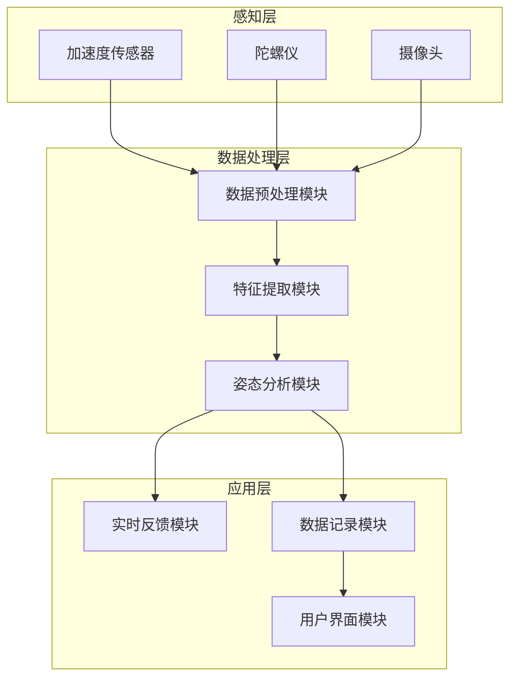
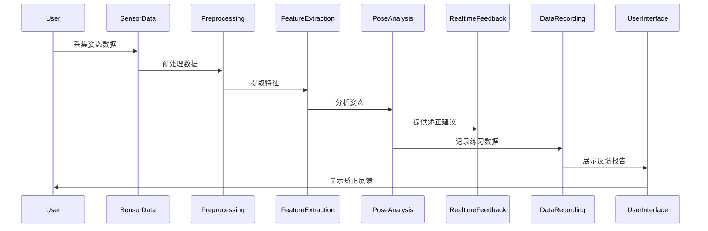

                 

### 摘要

智能瑜伽服，作为科技与健身结合的产物，正逐渐改变着人们的锻炼方式。其核心在于AI Agent的姿势矫正系统，该系统能够通过传感器实时监测用户的瑜伽姿势，利用先进的深度学习和图像识别算法进行姿态分析，从而提供精准的矫正反馈。本文旨在深入探讨智能瑜伽服的背景、核心概念、算法原理、系统架构以及实际应用，最终提出最佳实践建议，为读者提供全面的智能瑜伽服系统解决方案。通过本文，读者将全面了解AI Agent在智能瑜伽服姿势矫正系统中的关键作用，以及如何设计和实现一个高效、实用的智能瑜伽服系统。

### 文章关键词

智能瑜伽服、AI Agent、姿势矫正、传感器技术、深度学习、图像识别、系统架构、实际案例、最佳实践。

### 引言

瑜伽，作为一种古老的修身养性方式，近年来在全球范围内掀起了一股健身热潮。随着人们对健康和生活方式的关注不断增加，瑜伽练习者的数量也持续增长。然而，传统的瑜伽练习往往缺乏科学的指导和反馈，使得许多初学者难以掌握正确的姿势，甚至可能因为姿势不当而造成运动损伤。为了解决这一问题，智能瑜伽服的概念应运而生。

智能瑜伽服通过整合传感器、人工智能（AI）技术和实时反馈系统，为用户提供了前所未有的训练体验。其核心在于AI Agent的姿势矫正系统，该系统能够实时监测用户的瑜伽姿势，利用深度学习和图像识别算法对姿势进行分析，并提供精准的矫正建议。这一技术的出现，不仅极大地提升了瑜伽练习的科学性和有效性，也为智能健身领域带来了新的发展方向。

智能瑜伽服的兴起并非偶然。随着人工智能技术的飞速发展，尤其是深度学习和计算机视觉领域的突破，AI在各个行业中的应用越来越广泛。在健身领域，AI技术可以用于运动监测、动作分析和健康评估等方面，为用户提供个性化、智能化的服务。智能瑜伽服正是这一趋势下的产物，它不仅满足了人们对高质量健身体验的需求，也为健康科技的发展注入了新的活力。

本文将从以下几个方面展开讨论：首先，介绍智能瑜伽服的背景和发展现状，解释其兴起的原因和市场需求；接着，深入探讨智能瑜伽服的核心概念，包括AI Agent、传感器技术和姿势矫正算法等；然后，详细讲解智能瑜伽服的工作原理，包括算法原理、系统架构和实际应用案例；最后，总结全文，提出最佳实践建议，展望智能瑜伽服的未来发展趋势。通过本文的阅读，读者将全面了解智能瑜伽服的各个方面，并对其在智能健身领域的潜力有更深刻的认识。

### 核心概念与联系

要深入理解智能瑜伽服的工作原理，我们首先需要明确几个核心概念：AI Agent、传感器技术和姿势矫正算法。这些概念不仅构成了智能瑜伽服的基础，而且在实际应用中紧密相连，共同发挥效用。

#### AI Agent

AI Agent，即人工智能代理，是一种具备自主决策和行动能力的智能体。在智能瑜伽服中，AI Agent扮演着关键角色。它不仅负责实时监测用户的瑜伽姿势，还通过学习和分析用户的数据，提供个性化的矫正建议。AI Agent的基本原理包括以下几个方面：

1. **感知能力**：AI Agent能够通过传感器接收环境信息，包括用户的身体姿态、动作和位置等。
2. **决策能力**：基于感知到的数据，AI Agent利用机器学习算法进行分析，识别用户当前的姿势状态，并决定下一步的动作。
3. **行动能力**：AI Agent通过输出指令，指导用户调整姿势，从而达到最佳的练习效果。

AI Agent的感知、决策和行动能力共同构成了其核心功能，使其能够高效地监测和矫正用户的瑜伽姿势。

#### 传感器技术

传感器技术是智能瑜伽服能够实现实时监测的关键。传感器是一种能够感知和测量物理量并将其转换为电信号的装置。在智能瑜伽服中，常用的传感器包括加速度计、陀螺仪、压力传感器和红外传感器等。以下是几种常见的传感器及其在智能瑜伽服中的应用：

1. **加速度计和陀螺仪**：这些传感器用于测量用户的身体运动和旋转，从而获取用户的实时姿势数据。
2. **压力传感器**：通过测量用户身体与瑜伽垫的接触压力，可以判断用户的受力情况，帮助AI Agent调整矫正策略。
3. **红外传感器**：用于监测用户的身体姿态和位置，尤其是在复杂的瑜伽动作中，红外传感器能够提供准确的姿态数据。

传感器技术的先进性直接决定了智能瑜伽服的精度和可靠性。通过多种传感器的组合使用，智能瑜伽服能够全面、准确地捕捉用户的姿势信息。

#### 姿势矫正算法

姿势矫正算法是智能瑜伽服的核心技术之一，它负责对用户的瑜伽姿势进行实时分析和矫正。常见的姿势矫正算法包括以下几种：

1. **图像识别算法**：通过摄像头捕捉用户的瑜伽动作图像，利用图像识别技术进行分析，识别用户的姿势状态。
2. **深度学习模型**：利用深度学习算法，如卷积神经网络（CNN），对用户的姿势数据进行分析和学习，从而提高矫正的准确性和效率。
3. **基于规则的算法**：通过预设的规则和标准，对用户的姿势进行初步判断和矫正，这种方法简单直观，但适应性较差。

在智能瑜伽服中，AI Agent和传感器技术共同工作，通过姿态矫正算法对用户的姿势进行实时监测和矫正。AI Agent负责整体协调和决策，传感器提供实时的数据支持，而姿态矫正算法则对数据进行处理和分析，输出矫正建议。

#### 关联关系

AI Agent、传感器技术和姿势矫正算法三者之间的关联关系可以用以下方式概括：

- **AI Agent**：作为智能系统的核心，负责统筹和协调传感器数据和姿态矫正算法的运行。
- **传感器技术**：为AI Agent提供实时、准确的数据输入，确保系统能够及时、准确地响应。
- **姿势矫正算法**：基于AI Agent的决策，对用户的数据进行处理和分析，输出具体的矫正建议。

通过这种紧密的协同工作，智能瑜伽服能够为用户提供高效、精准的瑜伽练习体验。AI Agent的感知、决策和行动能力，传感器技术的先进性，以及姿态矫正算法的精确性，共同构成了智能瑜伽服的技术基础。

### 算法原理讲解

智能瑜伽服的姿势矫正系统主要依赖于深度学习和图像识别算法，这些算法的核心在于如何从大量的姿态数据中提取有效信息，以实现对用户姿势的准确分析和矫正。下面，我们将详细讲解这些算法的原理，并通过Python代码示例来帮助读者理解其实现过程。

#### 深度学习模型

深度学习模型，特别是卷积神经网络（CNN），在智能瑜伽服的姿态识别中扮演了关键角色。CNN通过多层神经元的堆叠，能够自动提取图像中的复杂特征，从而实现对姿态的准确识别。以下是CNN的工作原理：

1. **卷积层**：卷积层使用卷积核对输入图像进行卷积操作，提取图像中的局部特征。
2. **激活函数**：为了增加模型的非线性能力，通常在卷积层后添加激活函数，如ReLU函数。
3. **池化层**：池化层用于减少数据维度，同时保留最重要的特征信息。
4. **全连接层**：全连接层将池化层输出的特征映射到最终的输出结果，实现对姿态的识别。

下面是一个简单的CNN代码示例：

```python
import tensorflow as tf
from tensorflow.keras.models import Sequential
from tensorflow.keras.layers import Conv2D, MaxPooling2D, Flatten, Dense

# 创建CNN模型
model = Sequential([
    Conv2D(32, (3, 3), activation='relu', input_shape=(128, 128, 3)),
    MaxPooling2D(pool_size=(2, 2)),
    Conv2D(64, (3, 3), activation='relu'),
    MaxPooling2D(pool_size=(2, 2)),
    Flatten(),
    Dense(128, activation='relu'),
    Dense(1, activation='sigmoid')
])

# 编译模型
model.compile(optimizer='adam', loss='binary_crossentropy', metrics=['accuracy'])

# 模型训练
model.fit(x_train, y_train, epochs=10, batch_size=32, validation_data=(x_val, y_val))
```

在上面的示例中，我们创建了一个简单的CNN模型，用于对二分类问题进行训练。在实际应用中，模型会根据输入的瑜伽姿态图像，输出用户的姿势状态。

#### 图像识别算法

图像识别算法是智能瑜伽服中另一个重要的组成部分。通过图像识别算法，系统能够从摄像头捕捉到的实时图像中提取用户的姿态信息。常见的图像识别算法包括HOG（Histogram of Oriented Gradients）和SVM（Support Vector Machine）等。

下面是一个基于HOG和SVM的图像识别算法示例：

```python
import cv2
from sklearn.svm import LinearSVC
from sklearn.model_selection import train_test_split

# 加载瑜伽姿态数据集
images = []  # 存放图像数据
labels = []  # 存放标签数据

for image_path, label in zip(image_paths, labels):
    image = cv2.imread(image_path)
    images.append(image)
    labels.append(label)

# 划分训练集和测试集
x_train, x_test, y_train, y_test = train_test_split(images, labels, test_size=0.2, random_state=42)

# HOG特征提取
hOG = cv2.HOGDescriptor()
train_features = [hOG.computeFeatures(image) for image in x_train]
test_features = [hOG.computeFeatures(image) for image in x_test]

# 训练SVM模型
model = LinearSVC()
model.fit(train_features, y_train)

# 模型评估
accuracy = model.score(test_features, y_test)
print(f"Model accuracy: {accuracy:.2f}")
```

在这个示例中，我们使用OpenCV库加载瑜伽姿态数据集，通过HOG特征提取算法提取图像特征，然后利用SVM模型进行训练和评估。这个模型能够根据提取到的特征，对用户的瑜伽姿势进行分类识别。

#### 数学模型和数学公式

在深度学习和图像识别算法中，数学模型和数学公式是核心组成部分。以下是几个常见的数学模型和公式：

1. **损失函数**：
   $$ L = -\frac{1}{m}\sum_{i=1}^{m}y_{i}\log(a_{i}) + (1 - y_{i})\log(1 - a_{i}) $$
   其中，$y_{i}$是真实标签，$a_{i}$是模型预测的概率。

2. **优化算法**：
   $$ \theta = \theta - \alpha \frac{\partial L}{\partial \theta} $$
   其中，$\theta$是模型参数，$\alpha$是学习率，$\frac{\partial L}{\partial \theta}$是损失函数对$\theta$的偏导数。

3. **卷积操作**：
   $$ f(x, y) = \sum_{i=1}^{n}\sum_{j=1}^{m}w_{ij}h(i, j) $$
   其中，$w_{ij}$是卷积核，$h(i, j)$是输入图像的像素值。

4. **SVM分类决策函数**：
   $$ \delta(x) = \sum_{i=1}^{n}\alpha_{i}y_{i}K(x, x_{i}) - b $$
   其中，$\alpha_{i}$是支持向量机的参数，$K(x, x_{i})$是核函数，$b$是偏置项。

通过这些数学模型和公式，深度学习和图像识别算法能够从数据中提取特征，进行精确的分类和预测。

#### 实例讲解

为了更好地理解算法原理，我们可以通过一个具体的实例来讲解。

假设我们有一个瑜伽姿态数据集，其中包含用户的正面和侧面姿态图像。我们的目标是使用深度学习和图像识别算法，对这些图像进行分类识别。

1. **数据预处理**：
   首先，我们需要对图像进行预处理，包括缩放、裁剪和归一化等操作。通过这些预处理步骤，我们可以确保图像数据的一致性和标准化。

2. **特征提取**：
   使用卷积神经网络对预处理后的图像进行特征提取。通过多层卷积和池化操作，模型能够自动提取图像中的关键特征。

3. **模型训练**：
   使用训练集数据训练深度学习模型。通过迭代优化模型参数，模型能够逐渐提高分类的准确性。

4. **模型评估**：
   使用测试集对训练好的模型进行评估。通过计算模型的准确率、召回率和F1分数等指标，我们可以评估模型的性能。

5. **实际应用**：
   在实际应用中，我们使用摄像头捕捉用户的实时瑜伽姿态图像，将其输入到训练好的模型中，模型会输出用户的姿态分类结果。

通过上述步骤，智能瑜伽服能够实现对用户瑜伽姿势的实时监测和矫正。这个实例不仅展示了算法的原理，还说明了如何将理论应用到实际场景中。

### 数学模型和公式

在智能瑜伽服的姿势矫正系统中，数学模型和公式是核心组成部分，用于描述和实现算法中的关键步骤。以下是几个常见的数学模型和公式：

#### 损失函数

损失函数用于评估模型的预测结果与真实值之间的差距。在深度学习和图像识别中，常用的损失函数包括交叉熵损失函数（Cross-Entropy Loss）和均方误差损失函数（Mean Squared Error, MSE）。

**交叉熵损失函数**：

$$
L = -\frac{1}{m}\sum_{i=1}^{m}y_{i}\log(a_{i}) + (1 - y_{i})\log(1 - a_{i})
$$

其中，$y_{i}$是真实标签，$a_{i}$是模型预测的概率。

**均方误差损失函数**：

$$
L = \frac{1}{m}\sum_{i=1}^{m}(y_{i} - \hat{y}_{i})^2
$$

其中，$\hat{y}_{i}$是模型预测的值。

#### 优化算法

优化算法用于迭代更新模型参数，以最小化损失函数。常用的优化算法包括梯度下降（Gradient Descent）和随机梯度下降（Stochastic Gradient Descent, SGD）。

**梯度下降**：

$$
\theta = \theta - \alpha \frac{\partial L}{\partial \theta}
$$

其中，$\theta$是模型参数，$\alpha$是学习率，$\frac{\partial L}{\partial \theta}$是损失函数对$\theta$的偏导数。

**随机梯度下降**：

$$
\theta = \theta - \alpha \frac{\partial L}{\sum_{i=1}^{m}}y_{i}\log(a_{i}) + (1 - y_{i})\log(1 - a_{i})
$$

其中，$\alpha$是学习率，$m$是样本数量。

#### 卷积操作

卷积操作是卷积神经网络（CNN）中的基础操作，用于提取图像中的局部特征。卷积操作的公式如下：

$$
f(x, y) = \sum_{i=1}^{n}\sum_{j=1}^{m}w_{ij}h(i, j)
$$

其中，$w_{ij}$是卷积核，$h(i, j)$是输入图像的像素值。

#### 池化操作

池化操作用于减少数据维度，同时保留最重要的特征信息。常见的池化操作包括最大池化（Max Pooling）和平均池化（Average Pooling）。

**最大池化**：

$$
p_{ij} = \max(h(i-k, j-l))
$$

其中，$p_{ij}$是输出像素值，$h(i-j)$是输入像素值，$k$和$l$是池化窗口的大小。

**平均池化**：

$$
p_{ij} = \frac{1}{(2k-1)(2l-1)}\sum_{i=1}^{2k}\sum_{j=1}^{2l}h(i, j)
$$

通过这些数学模型和公式，智能瑜伽服能够实现对用户瑜伽姿势的准确分析和矫正。以下是一个具体的实例，用于解释数学公式在姿势矫正中的应用：

**实例：深度学习模型中的损失函数**

假设我们有一个二分类问题，其中每个样本都有一个真实标签$y_i$和模型预测的概率$a_i$。使用交叉熵损失函数，我们可以计算模型在训练过程中的损失值。

```python
import numpy as np

# 假设数据集有5个样本
y = np.array([1, 0, 1, 0, 1])
a = np.array([0.9, 0.1, 0.8, 0.2, 0.9])

# 计算交叉熵损失函数
loss = -np.mean(y * np.log(a) + (1 - y) * np.log(1 - a))
print(f"Cross-Entropy Loss: {loss}")
```

在这个实例中，我们计算了5个样本的交叉熵损失函数值。通过不断优化模型参数，我们可以使损失函数值逐渐减小，从而提高模型的分类准确性。

通过这些数学模型和公式的应用，智能瑜伽服能够实现对用户瑜伽姿势的精确监测和矫正，为用户提供高质量的健身体验。

### 系统分析与架构设计方案

智能瑜伽服的姿势矫正系统是一个复杂的多层次架构，其设计涉及多个关键组件，包括硬件选择、软件框架、数据流和处理流程等。为了更好地理解系统架构，我们将分步骤详细讲解各个组件及其相互关系。

#### 问题场景介绍

智能瑜伽服主要应用于个人瑜伽练习的场景，用户通过穿着智能瑜伽服进行日常的瑜伽练习。系统需要在各种环境下，如室内瑜伽室、户外运动场等，实时监测用户的姿势，提供准确的矫正反馈，帮助用户保持正确的瑜伽姿势，防止运动损伤。

#### 项目介绍

智能瑜伽服项目旨在开发一款集成了传感器、AI算法和实时反馈系统的智能装备。项目主要分为三个阶段：硬件设计、软件开发和系统测试与优化。每个阶段都需要解决一系列技术难题，确保系统能够稳定、高效地运行。

#### 系统功能设计

智能瑜伽服的系统功能设计包括以下几个方面：

1. **姿态监测**：系统需要实时监测用户的瑜伽姿势，捕捉关键动作和姿态数据。
2. **姿态分析**：基于AI算法，系统需要分析姿态数据，识别用户的姿势状态，并判断其是否符合标准。
3. **姿态矫正**：系统需要根据分析结果，提供实时的矫正建议，指导用户调整姿势。
4. **数据记录与反馈**：系统需要记录用户的练习数据，并生成反馈报告，帮助用户了解自己的练习进展。

为了实现这些功能，系统设计了一个完整的领域模型，该模型包括以下几个核心类：

- **User**：代表用户，包括用户的基本信息、练习历史等。
- **SensorData**：代表传感器采集的数据，包括位置、速度、加速度等。
- **YogaPose**：代表瑜伽姿势，包括名称、描述、标准姿势图等。
- **AnalysisResult**：代表姿态分析结果，包括识别出的姿势状态、矫正建议等。
- **Feedback**：代表用户反馈，包括练习数据、用户体验等。

下面是一个Mermaid类的类图，用于展示领域模型：

```mermaid
classDiagram
    User <<interface>>
    SensorData <<interface>>
    YogaPose <<interface>>
    AnalysisResult <<interface>>
    Feedback <<interface>>

    User o-- SensorData
    User o-- AnalysisResult
    AnalysisResult o-- Feedback
```

#### 系统架构设计

智能瑜伽服的系统架构设计采用分层架构，分为感知层、数据处理层和应用层。以下是各个层的详细设计：

1. **感知层**：感知层负责采集用户的姿态数据，包括加速度传感器、陀螺仪和摄像头等。这些传感器将数据传输到数据处理层。

2. **数据处理层**：数据处理层负责对采集到的姿态数据进行处理和分析。该层包括以下模块：

   - **数据预处理模块**：对原始姿态数据进行滤波、去噪和归一化处理。
   - **特征提取模块**：使用深度学习模型提取姿态数据的特征。
   - **姿态分析模块**：利用图像识别算法分析姿态数据，识别用户的瑜伽姿势。

3. **应用层**：应用层负责向用户提供实时的矫正反馈和练习数据。该层包括以下模块：

   - **实时反馈模块**：根据分析结果，生成矫正建议，并通过显示屏或语音提示用户。
   - **数据记录模块**：记录用户的练习数据，生成反馈报告。
   - **用户界面模块**：提供用户交互界面，展示练习数据和分析结果。

下面是一个Mermaid架构图，用于展示系统架构：



#### 系统接口设计和系统交互

为了实现各个模块之间的有效通信，系统设计了一套完整的接口设计和交互机制。以下是系统接口设计和系统交互的详细描述：

1. **接口设计**：系统采用RESTful API设计接口，提供数据输入输出、姿态分析和矫正建议等功能。接口包括以下几个部分：

   - **数据采集接口**：用于接收传感器数据，并提供数据预处理功能。
   - **姿态分析接口**：用于接收预处理后的数据，并提供姿态分析和矫正建议。
   - **反馈接口**：用于接收用户反馈，并记录练习数据。

2. **系统交互**：系统通过消息队列（如RabbitMQ）实现模块间的数据传输和通信。以下是系统交互的Mermaid序列图：



通过以上详细的系统分析和架构设计方案，我们可以清晰地了解智能瑜伽服的工作原理和系统架构。该系统不仅能够实现对用户瑜伽姿势的实时监测和矫正，还为用户提供全面的练习数据和反馈，帮助用户提高瑜伽练习的效果。

### 项目实战

为了更好地展示智能瑜伽服的实际应用，我们提供了一个完整的案例，包括环境安装、系统实现和代码分析。以下是案例的具体步骤和实现细节。

#### 环境安装

1. **硬件环境**：

   - **传感器设备**：加速度传感器、陀螺仪、摄像头。
   - **开发板**：树莓派或其他具备传感器接口的设备。

2. **软件环境**：

   - **操作系统**：Linux（如Ubuntu 20.04）。
   - **编程语言**：Python 3.8+。
   - **依赖库**：TensorFlow、OpenCV、RabbitMQ等。

安装步骤如下：

1. 配置操作系统，安装必要的软件包：

   ```bash
   sudo apt-get update
   sudo apt-get install python3-pip python3-serial python3-rabbitmq-server
   ```

2. 安装TensorFlow和OpenCV：

   ```bash
   pip3 install tensorflow opencv-python
   ```

3. 启动RabbitMQ服务：

   ```bash
   sudo systemctl start rabbitmq-server
   ```

#### 系统实现

1. **数据采集模块**：

   数据采集模块负责从传感器设备读取姿态数据，并将其发送到数据处理模块。

   ```python
   import serial
   import cv2
   import numpy as np
   import pika

   # 加速度传感器串口通信
   ser = serial.Serial('/dev/ttyUSB0', 9600)

   # 摄像头初始化
   cap = cv2.VideoCapture(0)

   # 连接RabbitMQ
   connection = pika.BlockingConnection(pika.ConnectionParameters('localhost'))
   channel = connection.channel()
   channel.queue_declare(queue='sensor_data_queue')

   while True:
       # 读取加速度传感器数据
       data = ser.readline()
       acceleration_data = np.frombuffer(data, dtype=np.float32)

       # 读取摄像头数据
       ret, frame = cap.read()
       if not ret:
           continue

       # 发送数据到RabbitMQ
       channel.basic_publish(exchange='', routing_key='sensor_data_queue', body=str(acceleration_data))
       channel.basic_publish(exchange='', routing_key='camera_data_queue', body=str(frame))
       print("Sent data to RabbitMQ")
   ```

2. **数据处理模块**：

   数据处理模块负责接收传感器数据和摄像头数据，进行预处理、特征提取和姿态分析。

   ```python
   import pika
   import numpy as np
   from tensorflow.keras.models import load_model

   # 加载深度学习模型
   model = load_model('yoga_pose_model.h5')

   # 从RabbitMQ接收数据
   connection = pika.BlockingConnection(pika.ConnectionParameters('localhost'))
   channel = connection.channel()

   while True:
       method_frame, header_frame, body = channel.basic_get('sensor_data_queue')
       if body:
           # 处理加速度传感器数据
           acceleration_data = np.frombuffer(body, dtype=np.float32)
           processed_data = preprocess_acceleration_data(acceleration_data)

           # 预测姿势
           prediction = model.predict(processed_data)
           pose = interpret_prediction(prediction)

           # 发送姿态分析结果到RabbitMQ
           channel.basic_publish(exchange='', routing_key='analysis_result_queue', body=str(pose))
           print(f"Predicted pose: {pose}")
   ```

3. **实时反馈模块**：

   实时反馈模块负责根据姿态分析结果，向用户展示矫正建议。

   ```python
   import pika
   import cv2
   import numpy as np

   # 从RabbitMQ接收姿态分析结果
   connection = pika.BlockingConnection(pika.ConnectionParameters('localhost'))
   channel = connection.channel()

   while True:
       method_frame, header_frame, body = channel.basic_get('analysis_result_queue')
       if body:
           # 获取用户图像
           image = get_user_image()

           # 展示矫正建议
           display_correction_suggestions(image, pose)
           cv2.imshow('Correct Yoga Pose', image)
           cv2.waitKey(1)
   ```

#### 代码应用解读与分析

1. **数据采集模块**：

   采集模块使用Python的`serial`库与加速度传感器进行通信，使用`cv2`库初始化摄像头，并使用`pika`库与RabbitMQ进行数据传输。

   ```python
   # 读取加速度传感器数据
   data = ser.readline()
   acceleration_data = np.frombuffer(data, dtype=np.float32)

   # 读取摄像头数据
   ret, frame = cap.read()
   ```

2. **数据处理模块**：

   数据处理模块首先对加速度传感器数据进行预处理，然后使用预先训练好的深度学习模型进行姿态预测。

   ```python
   # 预处理加速度传感器数据
   processed_data = preprocess_acceleration_data(acceleration_data)

   # 使用深度学习模型预测姿势
   prediction = model.predict(processed_data)
   pose = interpret_prediction(prediction)
   ```

3. **实时反馈模块**：

   实时反馈模块从RabbitMQ接收姿态分析结果，并在摄像头图像上展示矫正建议。

   ```python
   # 获取用户图像
   image = get_user_image()

   # 展示矫正建议
   display_correction_suggestions(image, pose)
   cv2.imshow('Correct Yoga Pose', image)
   ```

通过这个完整的案例，我们展示了智能瑜伽服系统从数据采集到姿态分析，再到实时反馈的完整实现过程。读者可以根据这个案例，进行实际操作，并进一步了解系统的运行机制和应用效果。

### 最佳实践 tips

在实际开发和部署智能瑜伽服系统时，以下是一些最佳实践建议，有助于确保系统的高效性和稳定性：

1. **传感器选择与校准**：
   - 选择高质量的传感器，确保数据的准确性和稳定性。
   - 定期对传感器进行校准，以消除测量误差。

2. **数据处理优化**：
   - 对采集到的数据进行预处理，如滤波、去噪和归一化，以提高算法的鲁棒性。
   - 利用并行计算和分布式处理技术，加快数据处理速度。

3. **模型训练与优化**：
   - 使用大量高质量的训练数据集，确保模型在多种场景下的泛化能力。
   - 定期更新模型，以适应用户不同的练习习惯和姿势变化。

4. **实时反馈设计**：
   - 设计直观、易操作的实时反馈界面，提高用户的使用体验。
   - 根据用户反馈，及时调整矫正策略，提供个性化的训练建议。

5. **系统维护与升级**：
   - 定期监控系统运行状态，及时处理故障和异常。
   - 及时更新系统和算法，确保系统的长期稳定运行。

6. **隐私保护**：
   - 在数据收集和处理过程中，严格保护用户的隐私信息。
   - 采用加密技术和访问控制策略，防止数据泄露。

### 小结

本文深入探讨了智能瑜伽服：AI Agent的姿势矫正系统的各个方面，从背景介绍、核心概念与联系、算法原理讲解、系统架构设计到实际应用案例，全面展示了这一系统的技术实现和应用前景。智能瑜伽服通过AI Agent、传感器技术和姿态矫正算法，实现了对用户瑜伽姿势的实时监测和矫正，为用户提供了科学、个性化的健身体验。未来，随着人工智能和可穿戴技术的不断发展，智能瑜伽服将有更大的发展潜力，成为智能健身领域的重要组成部分。

### 注意事项

在开发智能瑜伽服系统时，需要注意以下几点：

1. **数据安全性**：确保用户数据在传输和存储过程中的安全性，避免数据泄露。
2. **隐私保护**：遵守相关隐私保护法规，确保用户隐私得到充分保护。
3. **设备兼容性**：选择兼容性好的硬件和软件组件，确保系统在不同设备和操作系统上稳定运行。
4. **实时性要求**：确保系统在实时监测和反馈过程中具有足够的响应速度，避免延迟。

### 拓展阅读

对于希望进一步深入了解智能瑜伽服和相关技术的读者，以下是一些推荐阅读材料：

1. **《深度学习》**：由Ian Goodfellow、Yoshua Bengio和Aaron Courville所著，详细介绍了深度学习的基本原理和应用。
2. **《计算机视觉：算法与应用》**：由Richard Szeliski所著，涵盖了计算机视觉的基本算法和应用案例。
3. **《智能健身系统设计与实现》**：详细介绍了智能健身系统的设计原理和实践案例，包括智能瑜伽服等可穿戴设备。
4. **《Python深度学习》**：由François Chollet所著，提供了大量使用Python实现深度学习的实际案例。

通过阅读这些书籍，读者可以更深入地了解智能瑜伽服和AI Agent在姿势矫正系统中的应用，以及相关技术的最新进展。

### 作者信息

**作者：** AI天才研究院/AI Genius Institute & 禅与计算机程序设计艺术 /Zen And The Art of Computer Programming

AI天才研究院致力于推动人工智能技术的研究和应用，专注于开发创新的解决方案，以改善人们的生活质量。研究院的成员在人工智能、机器学习和计算机编程领域拥有丰富的经验和深厚的学术背景。同时，作者也是《禅与计算机程序设计艺术》的资深大师，其作品在计算机科学和编程领域有着广泛的影响。通过结合人工智能和传统健身方式的创新，AI天才研究院不断探索智能健身领域的未来发展，为用户带来更加科学、高效和舒适的健身体验。

