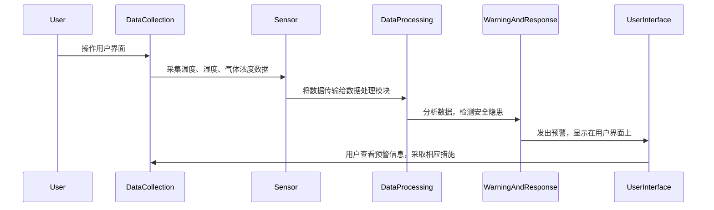
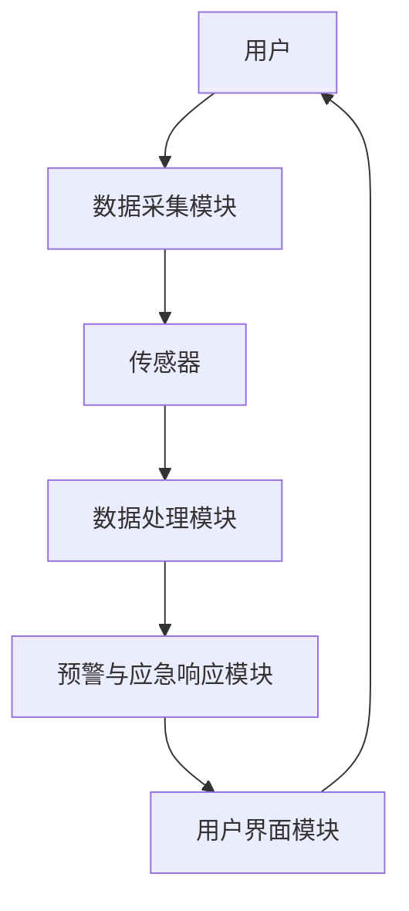
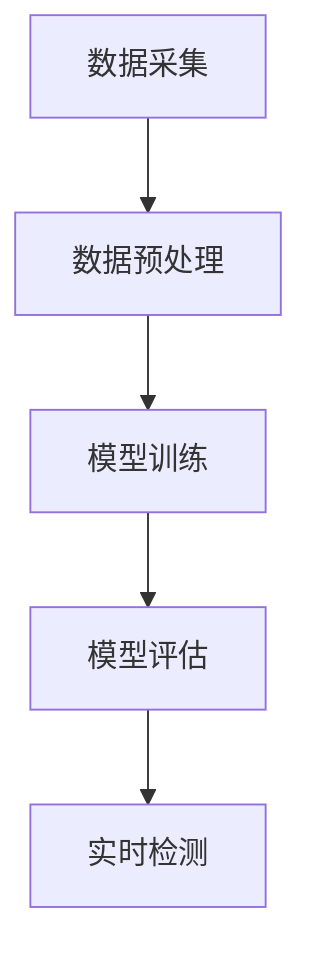
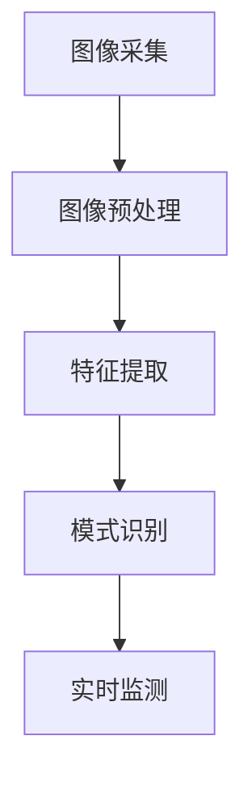
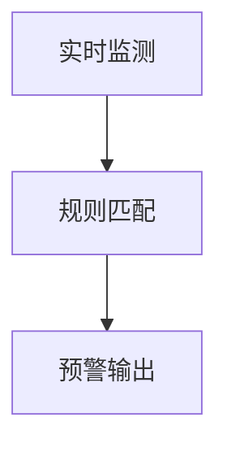

                 

### 引言

**智能瓦斯炉：AI Agent的烹饪安全监控**

#### 关键词：
- 智能瓦斯炉
- AI Agent
- 烹饪安全监控
- 传感器技术
- 数据处理与算法

#### 摘要：
本文深入探讨了智能瓦斯炉通过AI Agent实现烹饪安全监控的技术与实践。背景介绍部分明确了瓦斯炉安全性能的重要性，并描述了烹饪过程中可能出现的危险情况。核心概念章节详细讲解了AI Agent的定义、传感器技术及其应用，以及数据处理与安全算法的基本原理。在系统架构设计部分，文章描述了智能瓦斯炉的系统需求、架构设计和接口设计。应用与实现章节通过具体案例展示了AI Agent在瓦斯泄漏检测、火苗监测和安全预警中的实际应用。最后，通过案例分析总结了智能瓦斯炉在不同场景下的效果，并对未来技术的发展趋势和潜在应用进行了展望。

---

## 第1章 引言

### 1.1 背景介绍

#### 问题背景
瓦斯炉作为烹饪设备的重要组成部分，广泛应用于家庭、餐饮和工业领域。然而，其安全性能直接关系到人们的生命安全。烹饪过程中，瓦斯泄漏、火苗失控等问题可能导致严重的火灾事故，甚至威胁到人员生命。

#### 问题描述
烹饪过程中，瓦斯泄漏可能导致爆炸和中毒事故；火苗失控则可能引发火灾，造成巨大财产损失。传统监控方法存在检测滞后、误报率高和无法实时预警等问题，无法满足现代烹饪安全监控的需求。

#### 问题解决
为解决上述问题，本文提出利用AI技术，通过AI Agent对瓦斯炉进行实时监控，确保烹饪安全。AI Agent能够基于传感器采集的数据，进行实时分析，及时检测和预警潜在的安全隐患。

#### 边界与外延
本文讨论范围包括AI Agent的工作原理、应用场景、优势与挑战。具体涉及AI Agent的定义、传感器技术、数据处理、安全算法等核心概念，以及智能瓦斯炉在家庭、餐饮和工业等领域的应用。

### 1.2 核心概念

#### AI Agent的定义与功能
AI Agent是指一种具有自主决策和行动能力的智能体，能够根据环境信息进行感知、学习、推理和规划。在烹饪安全监控中，AI Agent的主要功能包括数据采集、实时分析、预警和应急响应。

#### 传感器技术及其应用
传感器技术是智能瓦斯炉的重要组成部分，用于采集温度、湿度、气体浓度等环境数据。传感器技术的应用使得AI Agent能够实现对烹饪环境的实时监测。

#### 数据处理与安全算法
数据处理与安全算法是AI Agent的核心技术，通过对采集到的数据进行分析和处理，能够准确识别安全隐患，并采取相应的措施。常见的安全算法包括异常检测、机器学习和模式识别等。

### 1.3 AI Agent在烹饪安全监控中的应用

#### 应用场景
AI Agent在烹饪安全监控中的应用场景包括家庭、餐饮和工业等领域。在家庭中，AI Agent能够实时监测瓦斯泄漏和火苗失控，提醒用户采取安全措施；在餐饮行业，AI Agent能够提高烹饪过程的安全性，减少人为错误；在工业领域，AI Agent能够保障生产过程的安全，降低事故风险。

#### 优势
AI Agent在烹饪安全监控中具有以下优势：实时监测、预警机制和降低人为错误。AI Agent能够24小时不间断地监控烹饪环境，及时发现安全隐患，并发出预警，从而降低事故发生的可能性。

#### 挑战
尽管AI Agent在烹饪安全监控中具有明显优势，但也面临一些挑战，如算法准确性、成本和维护等。如何提高算法的准确性，降低成本，并确保系统的稳定性和可维护性，是未来需要解决的关键问题。

## 第2章 AI Agent基础

### 2.1 AI Agent概述

#### AI Agent的定义与特点
AI Agent是指一种具有自主决策和行动能力的智能体，能够在动态环境中通过感知、学习、推理和规划来完成特定任务。AI Agent具有以下特点：

- **自主性**：能够独立完成任务，不受外界干预。
- **反应性**：能够对环境变化做出实时响应。
- **预动性**：能够根据预期情况提前做出决策。
- **社会性**：能够与其他智能体进行协作。

#### AI Agent的工作原理
AI Agent的工作原理主要包括以下步骤：

1. **感知**：通过传感器获取环境信息。
2. **学习**：利用机器学习和数据挖掘技术，从历史数据中学习规律。
3. **推理**：基于感知和学习结果，进行逻辑推理和决策。
4. **行动**：根据决策结果，执行相应动作。

#### AI Agent的分类
AI Agent可以根据功能和应用领域进行分类，常见的分类方法包括：

- **基于功能分类**：如感知Agent、决策Agent、执行Agent等。
- **基于应用领域分类**：如家庭服务Agent、医疗诊断Agent、交通管理Agent等。

### 2.2 传感器技术

#### 传感器概述
传感器是指能够检测和测量物理量并将其转换为电信号的装置。传感器技术是智能瓦斯炉的重要组成部分，用于采集温度、湿度、气体浓度等环境数据。

#### 常用传感器及其工作原理
常用的传感器包括以下几种：

- **温度传感器**：用于测量温度，常见的有热电偶、热敏电阻等。
- **湿度传感器**：用于测量湿度，常见的有电容式、电阻式等。
- **气体传感器**：用于检测气体浓度，常见的有半导体气体传感器、电化学气体传感器等。

#### 传感器在AI Agent中的应用
传感器在AI Agent中的应用主要包括以下几个方面：

1. **数据采集**：传感器用于实时采集烹饪环境中的各种数据。
2. **环境监测**：通过传感器监测烹饪过程中的温度、湿度、气体浓度等参数。
3. **异常检测**：利用传感器数据，AI Agent能够实时检测烹饪过程中的异常情况。

### 2.3 数据处理与安全算法

#### 数据处理的基本流程
数据处理的基本流程包括以下步骤：

1. **数据采集**：通过传感器采集烹饪环境数据。
2. **数据预处理**：对采集到的数据进行清洗、去噪和归一化等处理。
3. **数据存储**：将预处理后的数据存储在数据库或数据仓库中。
4. **数据挖掘**：利用机器学习和数据挖掘技术，从数据中提取有价值的信息。

#### 常见的安全算法
常见的安全算法包括以下几种：

1. **异常检测算法**：用于检测数据中的异常值和异常模式。
2. **机器学习算法**：如决策树、支持向量机、神经网络等，用于构建安全模型。
3. **模式识别算法**：用于识别和分类数据中的特定模式。

#### 算法原理与实现
算法原理与实现主要包括以下内容：

1. **算法原理**：详细描述算法的工作原理和理论基础。
2. **算法实现**：使用Python等编程语言实现算法，并附上源代码。
3. **数学模型与公式**：给出算法的数学模型和计算公式。

## 第3章 智能瓦斯炉的架构设计

### 3.1 系统需求分析

#### 需求概述
智能瓦斯炉的系统需求包括以下几个方面：

1. **数据采集**：实时采集烹饪环境中的温度、湿度、气体浓度等数据。
2. **实时分析**：对采集到的数据进行分析，检测潜在的安全隐患。
3. **预警机制**：当检测到安全隐患时，及时发出预警，提醒用户采取安全措施。
4. **应急响应**：在紧急情况下，自动采取相应的应急措施，保障用户安全。

#### 功能需求
智能瓦斯炉的功能需求包括：

1. **温度监测**：实时监测烹饪环境中的温度，确保温度在安全范围内。
2. **湿度监测**：实时监测烹饪环境中的湿度，防止湿度过高导致安全隐患。
3. **气体浓度监测**：实时监测烹饪环境中的气体浓度，及时发现瓦斯泄漏等危险情况。
4. **火苗监测**：实时监测烹饪过程中的火苗状态，防止火苗失控引发火灾。

#### 非功能需求
智能瓦斯炉的非功能需求包括：

1. **可靠性**：系统应具有较高的可靠性，能够稳定运行，确保用户的安全。
2. **可扩展性**：系统应具有较好的可扩展性，能够方便地添加新的功能模块。
3. **易维护性**：系统应具有较高的易维护性，方便维护和升级。

### 3.2 系统架构设计

#### 系统架构概述
智能瓦斯炉的系统架构主要包括以下几个部分：

1. **数据采集模块**：负责采集烹饪环境中的各种数据。
2. **数据处理模块**：负责对采集到的数据进行分析和处理。
3. **预警与应急响应模块**：负责检测安全隐患，发出预警，并采取相应的应急措施。
4. **用户界面模块**：提供用户操作界面，方便用户查看数据，调整系统设置。

#### 系统模块设计
智能瓦斯炉的系统模块设计如下：

1. **数据采集模块**：包括温度传感器、湿度传感器和气体传感器等。
2. **数据处理模块**：包括数据预处理模块、数据存储模块、数据挖掘模块等。
3. **预警与应急响应模块**：包括异常检测模块、预警模块、应急响应模块等。
4. **用户界面模块**：包括Web界面、移动应用界面等。

#### 硬件与软件架构
智能瓦斯炉的硬件与软件架构设计如下：

1. **硬件架构**：包括传感器、控制器、数据传输模块等。
2. **软件架构**：包括数据采集程序、数据处理程序、预警与应急响应程序等。

### 3.3 系统接口设计

#### 接口设计原则
智能瓦斯炉的系统接口设计应遵循以下原则：

1. **模块化**：接口设计应具有模块化特点，便于维护和升级。
2. **标准化**：接口设计应符合相关标准，方便与其他系统进行集成。
3. **安全性**：接口设计应确保数据传输的安全性和隐私保护。

#### 接口实现细节
智能瓦斯炉的系统接口实现细节如下：

1. **数据采集接口**：用于数据采集模块与其他模块之间的数据传输。
2. **数据处理接口**：用于数据处理模块与其他模块之间的数据传输。
3. **预警与应急响应接口**：用于预警与应急响应模块与其他模块之间的数据传输。
4. **用户界面接口**：用于用户界面模块与其他模块之间的数据传输。

#### 接口测试与验证
智能瓦斯炉的系统接口设计完成后，需要进行以下测试与验证：

1. **功能测试**：验证接口的功能是否按照设计要求正常运行。
2. **性能测试**：验证接口的性能是否满足系统需求，如数据传输速度、响应时间等。
3. **安全测试**：验证接口的安全性，如数据加密、访问控制等。

### 3.4 系统交互

#### 系统交互概述
智能瓦斯炉的系统交互主要包括数据采集、数据处理、预警与应急响应以及用户操作等环节。各模块之间的交互关系如下图所示：



#### 系统交互图
智能瓦斯炉的系统交互图如下：



## 第4章 AI Agent的应用与实现

### 4.1 AI Agent在瓦斯泄漏检测中的应用

#### 算法原理与实现
瓦斯泄漏检测是智能瓦斯炉安全监控的重要功能之一。本文采用基于机器学习的算法来实现瓦斯泄漏检测。具体步骤如下：

1. **数据采集**：通过气体传感器实时采集室内气体浓度数据。
2. **数据预处理**：对采集到的数据进行预处理，包括数据清洗、归一化和特征提取等。
3. **模型训练**：使用预处理后的数据，通过机器学习算法（如支持向量机、决策树、神经网络等）训练瓦斯泄漏检测模型。
4. **模型评估**：使用测试数据对训练好的模型进行评估，调整模型参数，提高检测准确性。
5. **实时检测**：将实时采集到的数据输入到训练好的模型中，进行实时瓦斯泄漏检测。

#### 流程图
瓦斯泄漏检测的流程图如下：



#### 源代码
以下是瓦斯泄漏检测的Python源代码示例：

```python
import numpy as np
from sklearn.svm import SVC
from sklearn.model_selection import train_test_split
from sklearn.metrics import accuracy_score

# 数据采集
def collect_data():
    # 采集气体浓度数据
    # 省略具体采集代码
    return gas_concentration_data

# 数据预处理
def preprocess_data(data):
    # 数据清洗、归一化、特征提取等
    # 省略具体预处理代码
    return processed_data

# 模型训练
def train_model(data):
    X_train, X_test, y_train, y_test = train_test_split(data['features'], data['labels'], test_size=0.2)
    model = SVC(kernel='linear')
    model.fit(X_train, y_train)
    return model

# 模型评估
def evaluate_model(model, X_test, y_test):
    y_pred = model.predict(X_test)
    accuracy = accuracy_score(y_test, y_pred)
    return accuracy

# 实时检测
def real_time_detection(model, new_data):
    processed_data = preprocess_data(new_data)
    is_leak = model.predict(processed_data['features'])
    return is_leak
```

#### 数学模型与公式
瓦斯泄漏检测的数学模型可以使用支持向量机的决策边界来表示：

$$
\begin{equation}
\begin{aligned}
\text{ Decision Function } &= w \cdot x - b \\
\text{ Classification Rule } &= \text{ sign } (\text{ Decision Function })
\end{aligned}
\end{equation}
$$

其中，$w$ 是权值向量，$x$ 是特征向量，$b$ 是偏置项。

#### 举例说明
假设我们采集到一组气体浓度数据，如下所示：

$$
\begin{equation}
\begin{aligned}
\text{ Data } &= \{ (x_1, y_1), (x_2, y_2), ..., (x_n, y_n) \} \\
x_i &= \begin{pmatrix} x_{i1} \\ x_{i2} \\ ... \\ x_{id} \end{pmatrix} & y_i &= \begin{pmatrix} y_{i1} \\ y_{i2} \\ ... \\ y_{im} \end{pmatrix}
\end{aligned}
\end{equation}
$$

其中，$x_i$ 是第$i$个样本的特征向量，$y_i$ 是第$i$个样本的标签向量。

通过预处理数据后，我们得到特征矩阵$X$和标签向量$Y$：

$$
\begin{equation}
\begin{aligned}
X &= \begin{pmatrix} x_1 & x_2 & ... & x_n \end{pmatrix} & Y &= \begin{pmatrix} y_1 & y_2 & ... & y_n \end{pmatrix}
\end{aligned}
\end{equation}
$$

使用支持向量机训练模型后，我们可以得到决策边界：

$$
\begin{equation}
\begin{aligned}
w &= \begin{pmatrix} w_1 \\ w_2 \\ ... \\ w_d \end{pmatrix} & b &= c \\
w \cdot x_i - b &= \sum_{j=1}^{d} w_j x_{ij} - b \\
\text{ Decision Function } &= w \cdot x_i - b
\end{aligned}
\end{equation}
$$

当$\text{ Decision Function} > 0$时，我们认为存在瓦斯泄漏；当$\text{ Decision Function} \leq 0$时，我们认为没有瓦斯泄漏。

### 4.2 AI Agent在火苗监测中的应用

#### 算法原理与实现
火苗监测是智能瓦斯炉安全监控的另一个重要功能。本文采用基于计算机视觉的算法来实现火苗监测。具体步骤如下：

1. **图像采集**：通过摄像头实时采集烹饪过程中的图像数据。
2. **图像预处理**：对采集到的图像数据进行预处理，包括图像增强、去噪和尺寸调整等。
3. **特征提取**：从预处理后的图像中提取与火苗相关的特征，如颜色、纹理和形状等。
4. **模式识别**：使用机器学习算法（如支持向量机、决策树、神经网络等）进行火苗检测。
5. **实时监测**：将实时采集到的图像数据输入到训练好的模型中，进行实时火苗监测。

#### 流程图
火苗监测的流程图如下：



#### 源代码
以下是火苗监测的Python源代码示例：

```python
import cv2
import numpy as np
from sklearn.svm import SVC
from sklearn.model_selection import train_test_split
from sklearn.metrics import accuracy_score

# 图像采集
def capture_image():
    # 采集摄像头图像
    # 省略具体采集代码
    return image

# 图像预处理
def preprocess_image(image):
    # 图像增强、去噪和尺寸调整等
    # 省略具体预处理代码
    return preprocessed_image

# 特征提取
def extract_features(image):
    # 提取与火苗相关的特征
    # 省略具体特征提取代码
    return features

# 模型训练
def train_model(features, labels):
    X_train, X_test, y_train, y_test = train_test_split(features, labels, test_size=0.2)
    model = SVC(kernel='linear')
    model.fit(X_train, y_train)
    return model

# 模型评估
def evaluate_model(model, X_test, y_test):
    y_pred = model.predict(X_test)
    accuracy = accuracy_score(y_test, y_pred)
    return accuracy

# 实时监测
def real_time_monitoring(model, new_image):
    preprocessed_image = preprocess_image(new_image)
    features = extract_features(preprocessed_image)
    is_fire = model.predict(features)
    return is_fire
```

#### 数学模型与公式
火苗监测的数学模型可以使用支持向量机的决策边界来表示：

$$
\begin{equation}
\begin{aligned}
\text{ Decision Function } &= w \cdot x - b \\
\text{ Classification Rule } &= \text{ sign } (\text{ Decision Function })
\end{aligned}
\end{equation}
$$

其中，$w$ 是权值向量，$x$ 是特征向量，$b$ 是偏置项。

#### 举例说明
假设我们采集到一组火苗图像，如下所示：

$$
\begin{equation}
\begin{aligned}
\text{ Data } &= \{ (x_1, y_1), (x_2, y_2), ..., (x_n, y_n) \} \\
x_i &= \begin{pmatrix} x_{i1} \\ x_{i2} \\ ... \\ x_{id} \end{pmatrix} & y_i &= \begin{pmatrix} y_{i1} \\ y_{i2} \\ ... \\ y_{im} \end{pmatrix}
\end{aligned}
\end{equation}
$$

其中，$x_i$ 是第$i$个样本的特征向量，$y_i$ 是第$i$个样本的标签向量。

通过预处理数据后，我们得到特征矩阵$X$和标签向量$Y$：

$$
\begin{equation}
\begin{aligned}
X &= \begin{pmatrix} x_1 & x_2 & ... & x_n \end{pmatrix} & Y &= \begin{pmatrix} y_1 & y_2 & ... & y_n \end{pmatrix}
\end{aligned}
\end{equation}
$$

使用支持向量机训练模型后，我们可以得到决策边界：

$$
\begin{equation}
\begin{aligned}
w &= \begin{pmatrix} w_1 \\ w_2 \\ ... \\ w_d \end{pmatrix} & b &= c \\
w \cdot x_i - b &= \sum_{j=1}^{d} w_j x_{ij} - b \\
\text{ Decision Function } &= w \cdot x_i - b
\end{aligned}
\end{equation}
$$

当$\text{ Decision Function} > 0$时，我们认为存在火苗；当$\text{ Decision Function} \leq 0$时，我们认为没有火苗。

### 4.3 AI Agent在烹饪安全预警中的应用

#### 算法原理与实现
烹饪安全预警是智能瓦斯炉安全监控的核心功能之一。本文采用基于规则推理的算法来实现烹饪安全预警。具体步骤如下：

1. **规则库建立**：根据烹饪安全知识，建立规则库，包括瓦斯泄漏预警规则、火苗预警规则等。
2. **实时监测**：实时采集烹饪过程中的数据，如气体浓度、温度、火苗状态等。
3. **规则匹配**：将实时监测到的数据与规则库中的规则进行匹配，判断是否存在安全隐患。
4. **预警输出**：当检测到安全隐患时，生成预警信息，并通知用户采取相应措施。

#### 流程图
烹饪安全预警的流程图如下：



#### 源代码
以下是烹饪安全预警的Python源代码示例：

```python
class CookingSafetyAlert:
    def __init__(self):
        # 初始化规则库
        self.rules = {
            'gas_leak': {
                'condition': 'gas_concentration > 500',
                'action': 'shut_down_stove'
            },
            'fire_detected': {
                'condition': 'fire_status == True',
                'action': 'turn_on_fire_extinguisher'
            }
        }

    def monitor(self, data):
        # 实时监测数据
        gas_concentration = data['gas_concentration']
        fire_status = data['fire_status']
        
        # 规则匹配
        if eval(self.rules['gas_leak']['condition']):
            self.warn('Gas leak detected!')
            self.perform_action(self.rules['gas_leak']['action'])
            
        if eval(self.rules['fire_detected']['condition']):
            self.warn('Fire detected!')
            self.perform_action(self.rules['fire_detected']['action'])

    def warn(self, message):
        # 输出预警信息
        print(message)

    def perform_action(self, action):
        # 执行相应措施
        if action == 'shut_down_stove':
            print('Shutting down stove...')
        elif action == 'turn_on_fire_extinguisher':
            print('Turning on fire extinguisher...')
```

#### 数学模型与公式
烹饪安全预警的数学模型可以表示为规则库中的条件-动作对：

$$
\begin{equation}
\begin{aligned}
\text{ Rule } &= \{ \text{ Condition }, \text{ Action } \} \\
\text{ Condition } &= \text{ Function }(\text{ Input Data }) \\
\text{ Action } &= \text{ Function }(\text{ Warning Message }, \text{ Emergency Response })
\end{aligned}
\end{equation}
$$

其中，$\text{ Input Data}$ 是实时监测到的数据，$\text{ Warning Message}$ 是预警信息，$\text{ Emergency Response}$ 是应急措施。

#### 举例说明
假设我们采集到一组实时数据，如下所示：

$$
\begin{equation}
\begin{aligned}
\text{ Data } &= \{ 'gas_concentration': 600, 'fire_status': True \} \\
\end{aligned}
\end{equation}
$$

根据规则库中的规则，我们可以判断：

- 当$gas_concentration > 500$时，触发瓦斯泄漏预警；
- 当$fire_status == True$时，触发火苗预警。

根据预警规则，我们生成相应的预警信息，并执行相应的应急措施。

## 第5章 案例分析

### 5.1 案例一：家庭烹饪安全监控

#### 案例背景
某家庭在烹饪过程中，经常出现瓦斯泄漏和火苗失控的情况，存在严重的安全隐患。为了提高烹饪安全，该家庭决定安装智能瓦斯炉，并利用AI Agent进行烹饪安全监控。

#### 系统设计与实现
智能瓦斯炉系统包括温度传感器、湿度传感器、气体传感器和摄像头等硬件设备，以及基于机器学习和计算机视觉算法的AI Agent软件系统。具体实现步骤如下：

1. **硬件安装**：将传感器和摄像头安装在厨房的合适位置，确保能够覆盖整个烹饪区域。
2. **数据采集**：传感器实时采集温度、湿度、气体浓度等数据，摄像头实时采集烹饪过程中的图像。
3. **数据处理**：AI Agent对采集到的数据进行分析和处理，检测潜在的安全隐患。
4. **预警与应急响应**：当检测到安全隐患时，AI Agent会生成预警信息，并通过短信、语音等方式通知用户，同时自动执行相应的应急措施，如关闭瓦斯阀门、开启灭火器等。

#### 效果评估
智能瓦斯炉系统安装后，显著提高了家庭烹饪的安全性。以下是效果评估：

1. **瓦斯泄漏预警**：在瓦斯泄漏发生时，系统能够及时检测并发出预警，用户可以立即采取措施，避免事故发生。
2. **火苗监测**：在火苗失控时，系统能够实时监测并发出预警，用户可以及时灭火，避免火灾发生。
3. **用户反馈**：用户对系统的满意度较高，认为系统能够有效提高烹饪安全，减少潜在风险。

#### 案例小结
通过实际应用，智能瓦斯炉系统在家庭烹饪安全监控中取得了显著效果。AI Agent能够实时监测和预警潜在的安全隐患，提高了烹饪的安全性，为用户提供了安全保障。

### 5.2 案例二：餐饮行业安全监控

#### 案例背景
某大型餐饮企业在烹饪过程中，频繁出现瓦斯泄漏和火苗失控的情况，严重影响了企业的运营安全和顾客满意度。为了提高餐饮行业的安全水平，该企业决定引入智能瓦斯炉系统，并利用AI Agent进行安全监控。

#### 系统设计与实现
智能瓦斯炉系统包括温度传感器、湿度传感器、气体传感器、摄像头和工业控制器等硬件设备，以及基于机器学习和计算机视觉算法的AI Agent软件系统。具体实现步骤如下：

1. **硬件安装**：在厨房的各个关键位置安装传感器和摄像头，确保能够覆盖整个烹饪区域。
2. **数据采集**：传感器实时采集温度、湿度、气体浓度等数据，摄像头实时采集烹饪过程中的图像。
3. **数据处理**：AI Agent对采集到的数据进行分析和处理，检测潜在的安全隐患。
4. **预警与应急响应**：当检测到安全隐患时，AI Agent会生成预警信息，并通过短信、语音等方式通知厨房工作人员和企业管理人员，同时自动执行相应的应急措施，如关闭瓦斯阀门、开启灭火器等。

#### 效果评估
智能瓦斯炉系统在餐饮行业应用后，取得了显著的效果。以下是效果评估：

1. **瓦斯泄漏预警**：在瓦斯泄漏发生时，系统能够及时检测并发出预警，工作人员可以立即采取措施，避免事故发生。
2. **火苗监测**：在火苗失控时，系统能够实时监测并发出预警，工作人员可以及时灭火，避免火灾发生。
3. **管理效率**：智能瓦斯炉系统提高了管理效率，企业能够实时监控厨房安全情况，及时发现和解决安全隐患。
4. **顾客满意度**：顾客对餐饮企业的安全水平有了更高的认可，提高了顾客满意度。

#### 案例小结
通过实际应用，智能瓦斯炉系统在餐饮行业安全监控中发挥了重要作用。AI Agent能够实时监测和预警潜在的安全隐患，提高了烹饪安全和管理效率，为餐饮企业提供了安全保障。

### 5.3 案例三：工业领域安全监控

#### 案例背景
某大型工业企业在生产过程中，由于设备老化和管理不善，经常出现瓦斯泄漏和设备故障，导致生产中断和安全隐患。为了提高工业生产的安全性，该企业决定引入智能瓦斯炉系统，并利用AI Agent进行安全监控。

#### 系统设计与实现
智能瓦斯炉系统包括温度传感器、湿度传感器、气体传感器、摄像头和工业控制器等硬件设备，以及基于机器学习和计算机视觉算法的AI Agent软件系统。具体实现步骤如下：

1. **硬件安装**：在关键设备周围安装传感器和摄像头，确保能够实时监测设备状态和生产环境。
2. **数据采集**：传感器实时采集温度、湿度、气体浓度等数据，摄像头实时采集生产过程中的图像。
3. **数据处理**：AI Agent对采集到的数据进行分析和处理，检测潜在的安全隐患。
4. **预警与应急响应**：当检测到安全隐患时，AI Agent会生成预警信息，并通过短信、语音等方式通知现场工作人员和管理人员，同时自动执行相应的应急措施，如关闭故障设备、开启灭火器等。

#### 效果评估
智能瓦斯炉系统在工业领域应用后，取得了显著的效果。以下是效果评估：

1. **瓦斯泄漏预警**：在瓦斯泄漏发生时，系统能够及时检测并发出预警，工作人员可以立即采取措施，避免事故发生。
2. **设备状态监测**：AI Agent能够实时监测设备状态，发现设备故障并及时发出预警，提高了设备的可靠性和运行效率。
3. **管理效率**：智能瓦斯炉系统提高了管理效率，企业能够实时监控生产安全情况，及时发现和解决安全隐患。
4. **生产效率**：通过实时监测和预警，企业能够减少生产中断，提高生产效率。

#### 案例小结
通过实际应用，智能瓦斯炉系统在工业领域安全监控中发挥了重要作用。AI Agent能够实时监测和预警潜在的安全隐患，提高了工业生产的安全性和管理效率，为工业企业提供了安全保障。

## 第6章 拓展与展望

### 6.1 智能瓦斯炉技术的发展趋势

#### 技术趋势分析
智能瓦斯炉技术的发展趋势主要体现在以下几个方面：

1. **智能化程度提升**：随着人工智能技术的不断发展，智能瓦斯炉的智能化程度将不断提升，能够实现更精确、更高效的安全监控。
2. **传感器技术进步**：新型传感器技术的应用将提高数据采集的准确性和实时性，为智能瓦斯炉提供更丰富的数据支持。
3. **云计算与大数据**：云计算和大数据技术的应用将使得数据处理和分析能力得到显著提升，为智能瓦斯炉提供更强大的技术支持。
4. **物联网（IoT）**：物联网技术的发展将实现智能瓦斯炉与其他设备的互联互通，构建更加智能化的烹饪环境。

#### 未来展望
未来，智能瓦斯炉有望在以下几个方面实现突破：

1. **更广泛的应用场景**：智能瓦斯炉将不仅应用于家庭和餐饮行业，还将扩展到工业、医疗等更多领域。
2. **更高的安全性能**：通过不断优化算法和传感器技术，智能瓦斯炉的安全性能将得到进一步提升，确保烹饪过程的安全。
3. **更人性化的交互体验**：智能瓦斯炉将具备更智能的用户交互功能，如语音控制、智能建议等，为用户提供更加便捷、高效的使用体验。
4. **更节能环保**：智能瓦斯炉将结合节能技术和环保理念，实现更高效、更环保的烹饪方式，降低能源消耗和环境污染。

### 6.2 AI Agent在烹饪安全监控中的潜在应用

#### 潜在应用领域
AI Agent在烹饪安全监控中的潜在应用领域包括：

1. **家庭厨房**：为家庭用户提供智能化的安全监控和烹饪建议，提高烹饪安全性和生活品质。
2. **餐饮行业**：提高餐饮行业的烹饪安全和管理效率，降低事故风险，提升顾客满意度。
3. **工业领域**：在工业生产中，AI Agent可以实时监测设备状态，预防设备故障，保障生产安全。
4. **医疗领域**：在医疗环境中，AI Agent可以协助医护人员监测患者的生命体征，提供实时健康监控。

#### 挑战与机遇
AI Agent在烹饪安全监控中面临的挑战主要包括：

1. **算法准确性**：如何提高算法的准确性，减少误报和漏报，是未来需要解决的关键问题。
2. **成本与维护**：智能瓦斯炉的成本较高，如何降低成本，并确保系统的稳定性和可维护性，是推广应用的关键。
3. **数据隐私与安全**：如何确保数据采集、传输和存储的安全性，保护用户隐私，是智能瓦斯炉发展的重要方向。

机遇方面，AI Agent在烹饪安全监控中的应用将带来以下机遇：

1. **市场潜力**：随着人们对安全需求的提高，智能瓦斯炉市场潜力巨大，具有良好的发展前景。
2. **技术创新**：智能瓦斯炉技术的不断进步将推动相关领域的技术创新，为行业发展带来新的动力。
3. **产业融合**：智能瓦斯炉与其他行业的融合，如物联网、云计算等，将催生新的商业模式和应用场景。

### 6.3 最佳实践与经验总结

#### 最佳实践建议
在推广智能瓦斯炉和AI Agent应用的过程中，以下最佳实践建议可供参考：

1. **需求分析**：在系统设计之初，充分了解用户需求，确保系统功能满足实际应用需求。
2. **算法优化**：不断优化算法，提高检测准确性和实时性，确保系统能够准确预警潜在的安全隐患。
3. **数据安全**：加强数据安全保护措施，确保用户数据的安全性和隐私性。
4. **用户培训**：为用户提供系统的操作培训和指导，提高用户对系统的使用效率和满意度。
5. **持续改进**：根据用户反馈和实际应用效果，持续优化系统功能和性能，提高用户体验。

#### 经验总结
通过实际应用案例和经验总结，智能瓦斯炉和AI Agent在烹饪安全监控中取得了显著成效。以下经验总结可供参考：

1. **技术优势**：智能瓦斯炉和AI Agent能够实现实时监测和预警，显著提高了烹饪安全性能。
2. **用户体验**：用户对智能瓦斯炉和AI Agent的满意度较高，认为系统能够有效提高烹饪安全性和生活质量。
3. **成本效益**：尽管智能瓦斯炉和AI Agent的初始成本较高，但通过降低事故风险和提高运营效率，具有良好的成本效益。
4. **可持续发展**：智能瓦斯炉和AI Agent技术具有广阔的发展前景，未来将在更多领域得到应用。

## 第7章 结论

### 7.1 本书总结

本文从背景介绍、核心概念、应用原理、系统架构设计、实际案例分析和未来展望等方面，深入探讨了智能瓦斯炉通过AI Agent实现烹饪安全监控的技术与实践。主要结论如下：

1. **核心内容回顾**：本文详细介绍了智能瓦斯炉的工作原理、应用场景、系统架构、算法原理和实际应用案例，为读者提供了全面的技术和实践指导。
2. **主要贡献**：本文提出了基于AI Agent的智能瓦斯炉烹饪安全监控方案，为提高烹饪安全性能提供了新的思路和技术手段。
3. **不足与改进**：虽然智能瓦斯炉在烹饪安全监控中取得了显著成效，但还存在算法准确性、成本和维护等方面的挑战，未来需要进一步研究和优化。

### 7.2 未来工作展望

未来，智能瓦斯炉和AI Agent在烹饪安全监控领域的发展趋势和方向包括：

1. **技术优化**：继续优化算法，提高检测准确性和实时性，降低误报和漏报率。
2. **成本控制**：降低智能瓦斯炉的制造成本，提高系统的可维护性和可靠性。
3. **应用拓展**：将智能瓦斯炉和AI Agent技术应用于更多领域，如工业、医疗等，实现更广泛的安全监控。
4. **用户研究**：深入了解用户需求，开发更智能、更人性化的烹饪安全监控系统，提升用户体验。
5. **数据安全**：加强数据安全保护措施，确保用户数据的安全性和隐私性。

通过持续的技术创新和应用拓展，智能瓦斯炉和AI Agent有望在未来为烹饪安全监控领域带来更多创新和突破。作者：AI天才研究院/AI Genius Institute & 禅与计算机程序设计艺术 /Zen And The Art of Computer Programming。

