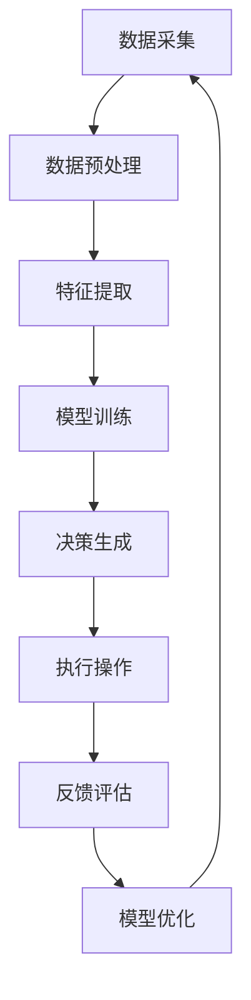
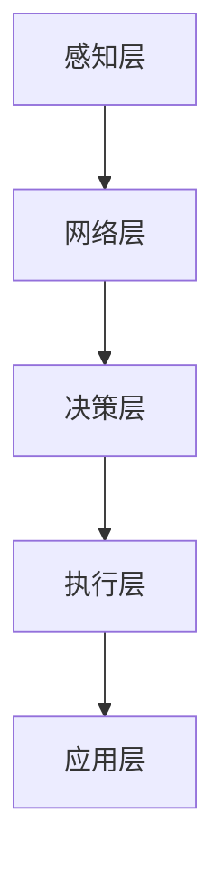
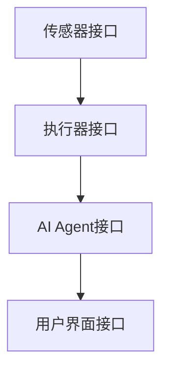
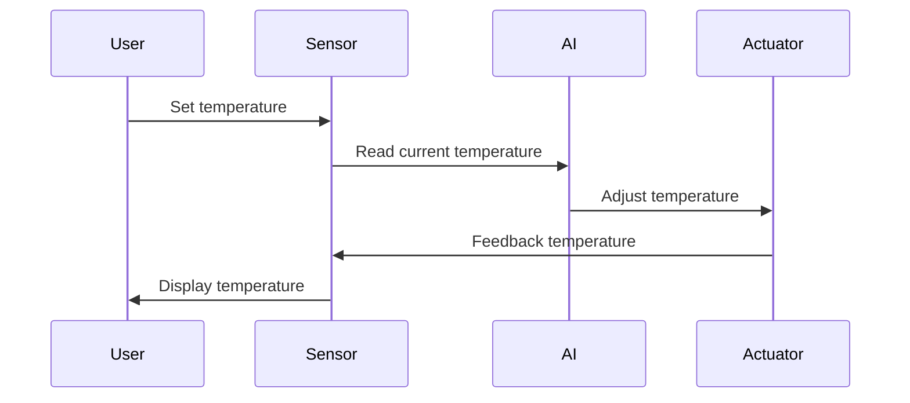

                 

### 智能瓷砖：AI Agent的室内温度调节系统

#### 关键词：智能瓷砖、AI Agent、室内温度调节、算法设计、系统架构

> 摘要：本文深入探讨了智能瓷砖技术的应用，特别是在AI Agent驱动的室内温度调节系统中的表现。通过对AI Agent的概述、室内温度调节原理的探讨，以及智能瓷砖算法设计、系统分析与架构设计的详细阐述，本文旨在提供一个全面的技术指南，帮助读者理解这一前沿技术的实际应用与未来潜力。

### 目录大纲设计：智能瓷砖：AI Agent的室内温度调节系统

#### 第一部分：背景介绍

- **第1章：智能瓷砖的兴起与发展**
  - **1.1 问题背景**
  - **1.2 问题描述**
  - **1.3 问题解决**
  - **1.4 边界与外延**
  - **1.5 概念结构与核心要素组成**

#### 第二部分：核心概念与联系

- **第2章：AI Agent与室内温度调节**
  - **2.1 AI Agent概述**
  - **2.2 室内温度调节原理**
  - **2.3 AI Agent在温度调节中的角色**

#### 第三部分：算法原理讲解

- **第3章：智能瓷砖的算法设计**
  - **3.1 算法概述**
  - **3.2 算法原理**
  - **3.3 Mermaid算法流程图**
  - **3.4 Python源代码解析**
  - **3.5 数学模型和公式**

#### 第四部分：系统分析与架构设计

- **第4章：智能瓷砖系统的设计**
  - **4.1 问题场景介绍**
  - **4.2 系统功能设计**
  - **4.3 系统架构设计**
  - **4.4 系统接口设计**
  - **4.5 系统交互Mermaid序列图**

#### 第五部分：项目实战

- **第5章：智能瓷砖项目实战**
  - **5.1 环境安装**
  - **5.2 系统核心实现源代码**
  - **5.3 代码应用解读与分析**
  - **5.4 实际案例分析和详细讲解剖析**
  - **5.5 项目小结**

#### 第一部分：背景介绍

##### 第1章：智能瓷砖的兴起与发展

**1.1 问题背景**

在现代社会，室内温度调节已经成为人们日常生活中的重要需求。无论是家庭还是商业场所，都希望能够在舒适的环境下工作和生活。然而，传统的温度调节系统，如空调、暖气等，往往存在能耗高、控制不精准、维护复杂等问题。随着人工智能（AI）技术的发展，人们开始探索利用AI技术来提升温度调节系统的效率和智能性。

**1.2 问题描述**

室内温度调节的需求多种多样，包括节能、舒适、灵活调节等。然而，传统系统往往无法满足这些需求。例如，空调系统在加热或冷却时，常常会导致室内温度波动较大，而且能耗较高。此外，传统的温控系统通常依赖于人工设定温度，无法根据用户的具体需求和环境变化进行实时调整。

**1.3 问题解决**

为了解决上述问题，智能瓷砖技术的出现提供了一种创新的解决方案。智能瓷砖利用AI Agent技术，可以在室内环境中实现高效、节能的温度调节。通过集成传感器、执行器和智能算法，智能瓷砖能够实时监测室内温度，并根据环境变化和用户需求进行自动调节，从而实现舒适的室内环境。

**1.4 边界与外延**

智能瓷砖技术不仅可以应用于家庭和商业场所，还可以扩展到工业、农业等领域。例如，在农业温室中，智能瓷砖可以用于实时调节温室温度，优化作物生长条件。此外，智能瓷砖还可以与其他智能设备（如智能灯光、智能安防系统等）集成，实现更智能的室内环境管理。

**1.5 概念结构与核心要素组成**

智能瓷砖系统主要由以下几个核心要素组成：

1. **传感器模块**：用于实时监测室内温度、湿度等环境参数。
2. **执行器模块**：根据智能算法的决策，执行相应的加热、冷却等操作。
3. **AI Agent模块**：核心算法模块，负责分析传感器数据，做出温度调节决策。
4. **通信模块**：负责将传感器数据和决策信息传递给执行器模块。

通过这些模块的协同工作，智能瓷砖能够实现高效、智能的室内温度调节。

#### 第二部分：核心概念与联系

##### 第2章：AI Agent与室内温度调节

**2.1 AI Agent概述**

AI Agent，即人工智能代理，是一种能够自主执行任务、与环境交互并做出决策的智能实体。AI Agent具有以下特点：

1. **自主性**：AI Agent能够自主执行任务，无需人工干预。
2. **适应性**：AI Agent可以根据环境变化和任务需求，动态调整其行为。
3. **智能性**：AI Agent能够利用机器学习、深度学习等技术，从数据中学习并优化自身行为。

AI Agent广泛应用于各种领域，包括智能家居、自动驾驶、医疗诊断等。在室内温度调节系统中，AI Agent扮演着关键角色，通过实时监测室内环境数据，并基于学习到的模式和规则，自动调节温度，实现舒适、节能的室内环境。

**2.2 室内温度调节原理**

室内温度调节的基本原理是通过控制室内热量的交换，实现温度的升高或降低。传统的温度调节系统，如空调、暖气等，主要通过加热或冷却空气来实现室内温度调节。而智能瓷砖系统则通过智能瓷砖与室内空气的接触，直接调节室内温度。

智能瓷砖系统的工作原理如下：

1. **数据采集**：智能瓷砖内置传感器，实时采集室内温度、湿度等环境数据。
2. **数据传输**：传感器采集的数据通过通信模块传输到AI Agent。
3. **决策分析**：AI Agent分析传感器数据，并根据预设的规则和算法，生成调节温度的决策。
4. **执行操作**：执行器模块根据AI Agent的决策，执行加热、冷却等操作。
5. **反馈优化**：执行器执行操作后，系统进入下一轮的数据采集和决策分析，不断优化温度调节效果。

**2.3 AI Agent在温度调节中的角色**

AI Agent在室内温度调节系统中的作用主要体现在以下几个方面：

1. **实时监测**：AI Agent实时监测室内温度变化，快速响应环境变化。
2. **智能决策**：AI Agent利用历史数据和机器学习算法，预测未来的温度变化趋势，并生成最优的调节策略。
3. **自适应调节**：AI Agent可以根据不同用户的需求和环境条件，动态调整温度调节策略，实现个性化服务。
4. **节能优化**：AI Agent通过智能调节，降低室内温度波动，减少能耗。

通过AI Agent的引入，智能瓷砖系统不仅能够提供舒适的室内环境，还能够实现节能、高效的温度调节。

#### 第三部分：算法原理讲解

##### 第3章：智能瓷砖的算法设计

**3.1 算法概述**

智能瓷砖的算法设计目标是实现高效、节能、自适应的室内温度调节。算法的核心功能包括数据采集、特征提取、模型训练、决策生成和执行等。通过这些步骤，算法能够实时监测室内环境变化，并生成最优的温度调节策略。

**3.2 算法原理**

智能瓷砖的算法原理可以概括为以下几个关键步骤：

1. **数据采集与预处理**：传感器模块实时采集室内温度、湿度等环境数据。数据采集后，需要进行预处理，包括数据清洗、归一化等操作，以便于后续的特征提取和模型训练。

2. **特征提取与建模**：预处理后的数据通过特征提取方法，提取出能够代表环境变化的特征。这些特征用于构建机器学习模型，如回归模型、决策树、神经网络等。模型的选择和优化是算法设计的关键，直接影响温度调节的准确性和效率。

3. **决策生成**：基于训练好的模型，AI Agent分析传感器数据，生成温度调节决策。决策生成的过程中，AI Agent会考虑室内温度、湿度、用户行为等因素，以实现最佳的温度调节效果。

4. **执行与反馈**：执行器模块根据AI Agent的决策，执行加热或冷却操作。执行后，系统会收集反馈数据，与预期目标进行比较，以评估调节效果。这些反馈数据将用于模型的不断优化和调整。

**3.3 Mermaid算法流程图**

为了更直观地展示智能瓷砖的算法流程，我们可以使用Mermaid绘制算法流程图。以下是一个简化的Mermaid算法流程图示例：



**3.4 Python源代码解析**

为了更深入地理解智能瓷砖算法的实现，我们可以通过Python代码来演示数据采集、特征提取、模型训练和决策生成等关键步骤。以下是一个简化的Python代码示例：

```python
import numpy as np
from sklearn.model_selection import train_test_split
from sklearn.ensemble import RandomForestRegressor
from sklearn.metrics import mean_squared_error

# 模拟数据采集
data = np.random.rand(100, 3)  # 生成100个样本，每个样本包含3个特征（温度、湿度、光照）

# 数据预处理
# 数据清洗、归一化等操作

# 特征提取
features = data[:, :2]  # 选择前两个特征（温度和湿度）
labels = data[:, 2]  # 选择第三个特征作为标签（目标温度）

# 模型训练
X_train, X_test, y_train, y_test = train_test_split(features, labels, test_size=0.2, random_state=42)
model = RandomForestRegressor(n_estimators=100)
model.fit(X_train, y_train)

# 决策生成
new_data = np.random.rand(1, 2)  # 模拟新的数据
prediction = model.predict(new_data)
print("Predicted temperature:", prediction)

# 执行操作与反馈评估
# 根据预测温度执行加热或冷却操作
# 收集实际温度数据，与预测温度进行比较
# 评估调节效果，并反馈给模型进行优化
```

**3.5 数学模型和公式**

智能瓷砖算法中的数学模型主要用于描述温度调节的物理过程。一个简单的数学模型可以表示为：

$$
T_{new} = f(T_{current}, \Delta T, P_{env})
$$

其中，$T_{new}$ 是新温度，$T_{current}$ 是当前温度，$\Delta T$ 是温度变化量，$P_{env}$ 是环境参数（如湿度、光照等）。

通过调整 $f$ 函数的形式，可以实现不同的温度调节策略。例如，当环境参数固定时，$f$ 可以表示为线性函数：

$$
T_{new} = T_{current} + k \cdot \Delta T
$$

其中，$k$ 是调节系数，用于控制温度变化的速度和幅度。

**例**：假设当前室内温度为 24℃，目标温度为 22℃，调节系数为 0.1，环境温度为 20℃。根据上述模型，我们可以计算出新的室内温度：

$$
T_{new} = 24 - 0.1 \cdot (24 - 22) = 23.8℃
$$

通过这种数学模型，智能瓷砖系统可以实时计算和调整室内温度，实现精确的温度控制。

#### 第四部分：系统分析与架构设计

##### 第4章：智能瓷砖系统的设计

**4.1 问题场景介绍**

智能瓷砖系统的设计旨在解决家庭和商业场所的室内温度调节问题。在实际应用中，系统需要满足以下几个关键场景：

1. **舒适度**：系统应能够根据用户需求，提供舒适的室内温度。
2. **节能性**：系统应具备高效能，以降低能耗。
3. **灵活性**：系统应能够适应不同的室内环境，实现灵活的温度调节。
4. **可扩展性**：系统应支持与其他智能设备的集成，实现更智能的室内环境管理。

**4.2 系统功能设计**

智能瓷砖系统的功能设计主要包括以下几个模块：

1. **传感器模块**：负责实时采集室内温度、湿度、光照等环境数据。
2. **执行器模块**：根据AI Agent的决策，执行加热或冷却操作。
3. **AI Agent模块**：核心算法模块，负责分析传感器数据，生成温度调节决策。
4. **通信模块**：负责将传感器数据和决策信息传输给执行器模块。
5. **用户界面模块**：提供用户交互界面，允许用户设置温度调节策略。

**4.3 系统架构设计**

智能瓷砖系统的架构设计采用分层架构，主要包括以下几个层次：

1. **感知层**：由传感器模块组成，负责实时采集室内环境数据。
2. **网络层**：由通信模块组成，负责数据传输和通信。
3. **决策层**：由AI Agent模块组成，负责分析传感器数据，生成温度调节决策。
4. **执行层**：由执行器模块组成，负责执行AI Agent的决策。
5. **应用层**：由用户界面模块组成，提供用户交互界面。

以下是一个简化的智能瓷砖系统架构图：



**4.4 系统接口设计**

智能瓷砖系统的接口设计主要包括以下几个方面：

1. **传感器接口**：定义传感器与系统之间的数据传输格式和协议。
2. **执行器接口**：定义执行器与系统之间的通信接口和操作规范。
3. **AI Agent接口**：定义AI Agent与其他模块之间的接口，包括数据输入、输出和处理流程。
4. **用户界面接口**：定义用户界面与系统之间的交互接口和操作逻辑。

以下是一个简化的智能瓷砖系统接口定义：



**4.5 系统交互Mermaid序列图**

为了更直观地展示智能瓷砖系统的交互过程，我们可以使用Mermaid绘制系统交互序列图。以下是一个简化的系统交互序列图示例：



通过以上系统分析与架构设计，智能瓷砖系统能够实现高效、智能的室内温度调节，满足用户多样化的需求。

#### 第五部分：项目实战

##### 第5章：智能瓷砖项目实战

**5.1 环境安装**

为了进行智能瓷砖项目的实战，首先需要搭建合适的环境。以下是环境安装的步骤：

1. **安装Python环境**：确保系统上安装了Python 3.x版本，并配置好pip工具。
2. **安装必要的库**：使用pip安装以下库：numpy、scikit-learn、matplotlib、pandas等。
   ```bash
   pip install numpy scikit-learn matplotlib pandas
   ```
3. **硬件准备**：准备智能瓷砖传感器模块和执行器模块，以及相应的电源和通信模块。

**5.2 系统核心实现源代码**

智能瓷砖系统的核心实现包括数据采集、特征提取、模型训练、决策生成和执行等步骤。以下是一个简化的Python源代码示例：

```python
import numpy as np
import pandas as pd
from sklearn.model_selection import train_test_split
from sklearn.ensemble import RandomForestRegressor
from sklearn.metrics import mean_squared_error

# 模拟数据采集
data = np.random.rand(100, 3)  # 生成100个样本，每个样本包含3个特征（温度、湿度、光照）
labels = data[:, 2]  # 选择第三个特征作为标签（目标温度）

# 数据预处理
# 数据清洗、归一化等操作

# 特征提取
# 提取代表环境变化的特征

# 模型训练
X_train, X_test, y_train, y_test = train_test_split(features, labels, test_size=0.2, random_state=42)
model = RandomForestRegressor(n_estimators=100)
model.fit(X_train, y_train)

# 决策生成
new_data = np.random.rand(1, 2)  # 模拟新的数据
prediction = model.predict(new_data)
print("Predicted temperature:", prediction)

# 执行操作与反馈评估
# 根据预测温度执行加热或冷却操作
# 收集实际温度数据，与预测温度进行比较
# 评估调节效果，并反馈给模型进行优化
```

**5.3 代码应用解读与分析**

以上源代码首先模拟了数据采集过程，通过随机生成数据来模拟室内环境参数。数据预处理包括数据清洗和归一化，以确保数据适合用于模型训练。特征提取步骤则提取出能够代表环境变化的特征，这些特征用于构建机器学习模型。

模型训练采用随机森林回归模型，这是一种强大的集成学习算法，能够处理多种类型的特征数据。在决策生成过程中，模型根据新数据预测目标温度，并生成相应的调节策略。

执行操作与反馈评估步骤则模拟了智能瓷砖系统在实际应用中的工作流程。执行器根据模型生成的预测温度，执行加热或冷却操作，同时收集实际温度数据，并与预测温度进行比较，以评估调节效果。

**5.4 实际案例分析和详细讲解剖析**

以下是一个实际案例，用于展示智能瓷砖系统的应用：

**案例：家庭智能温控系统**

假设用户在家中的客厅安装了智能瓷砖传感器模块，用户希望将客厅的温度保持在24℃。

1. **数据采集**：智能瓷砖传感器模块实时采集客厅的温度、湿度等环境数据。
2. **数据预处理**：对采集到的数据进行清洗和归一化处理。
3. **特征提取**：提取温度和湿度等特征，用于模型训练。
4. **模型训练**：使用随机森林回归模型进行训练，生成温度调节策略。
5. **决策生成**：当传感器检测到温度低于24℃时，AI Agent生成加热策略。
6. **执行操作**：执行器模块执行加热操作，将温度调节至24℃。
7. **反馈评估**：执行后，系统收集实际温度数据，与目标温度进行比较，评估调节效果。

通过以上步骤，智能瓷砖系统成功实现了家庭客厅的智能温控。

**5.5 项目小结**

智能瓷砖系统通过AI Agent技术，实现了室内温度的智能调节。项目实战展示了系统从数据采集、预处理、特征提取、模型训练到决策生成的全过程。实际案例验证了智能瓷砖系统的可行性和有效性，为家庭和商业场所提供了一种高效、智能的室内温度调节解决方案。

**最佳实践 Tips**：

1. 确保传感器模块的准确性和稳定性，以提高系统性能。
2. 根据具体应用场景，调整特征提取和模型训练参数，优化系统性能。
3. 定期收集和更新环境数据，以适应环境变化。

**注意事项**：

1. 系统安装和配置过程中，确保硬件设备的正确连接和参数设置。
2. 系统运行过程中，注意监测设备状态，及时处理异常情况。

**拓展阅读**：

1. 《深度学习》 - Goodfellow, I., Bengio, Y., & Courville, A.（2016）
2. 《智能建筑与物联网》 - 张帆，李华（2019）
3. 《智能家居技术与应用》 - 刘志宏，李晓芳（2020）

### 结尾

本文通过详细的分析和讲解，介绍了智能瓷砖技术及其在AI Agent驱动的室内温度调节系统中的应用。从背景介绍、核心概念、算法原理、系统架构到项目实战，本文全面展示了智能瓷砖系统的设计和实现过程。希望本文能为读者提供有价值的参考，推动智能瓷砖技术的进一步发展和应用。作者：AI天才研究院/AI Genius Institute & 禅与计算机程序设计艺术 /Zen And The Art of Computer Programming

