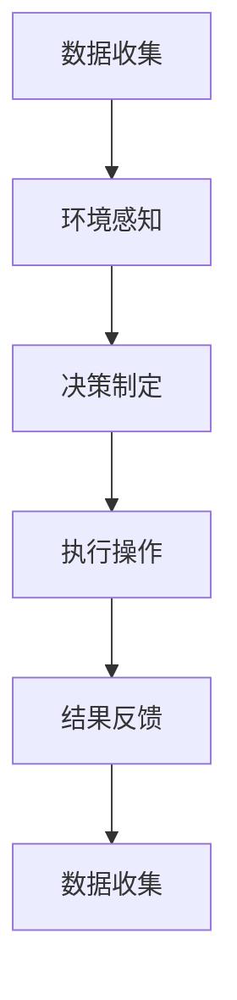
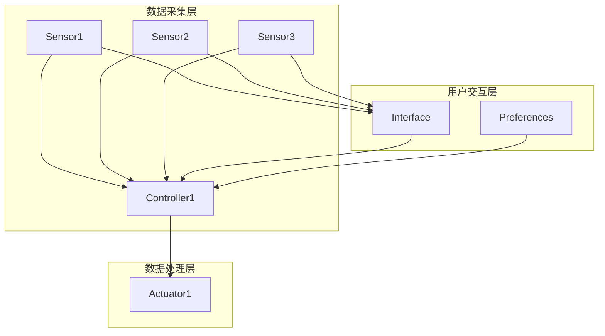
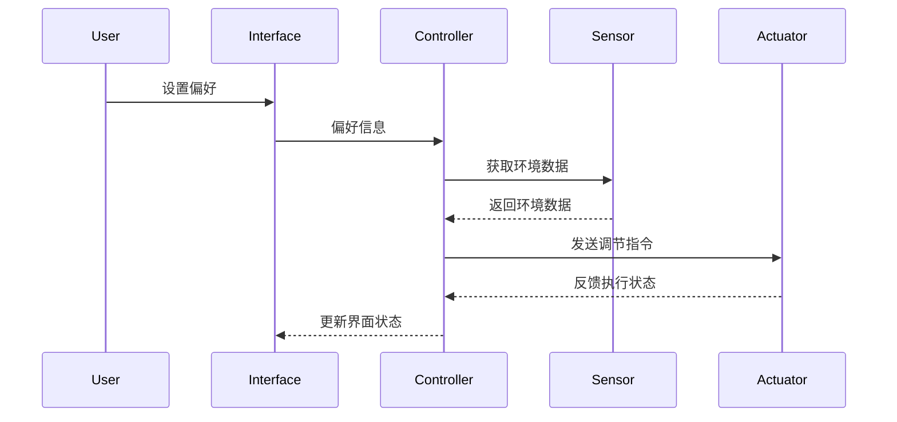
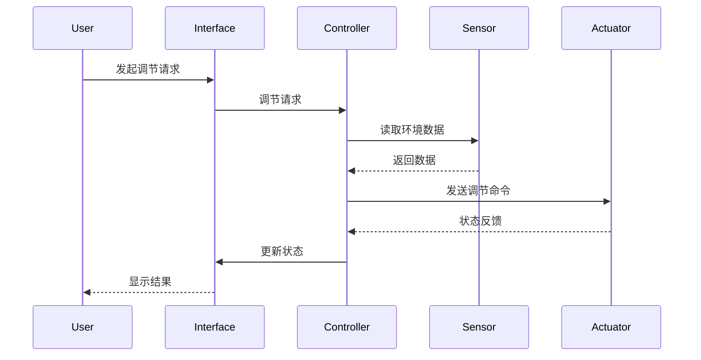

                 

## 智能窗帘：AI Agent的室内光线优化

### 关键词：智能窗帘、AI Agent、室内光线优化、算法、系统架构、项目实战

> 摘要：本文将深入探讨智能窗帘及其背后的AI Agent在室内光线优化中的应用。首先，我们将介绍智能窗帘的基本概念和当前的发展状况，然后详细解释AI Agent的核心概念及其在室内光线优化中的作用。接着，我们将通过算法原理讲解、系统分析与架构设计、项目实战等多个方面，全面剖析智能窗帘的运行机制及其优化效果。最后，我们将总结最佳实践、注意事项，并提供进一步阅读的资源。

### 目录大纲设计

为了更好地组织和呈现文章内容，我们设计了以下目录大纲：

----------------------------------------------------------------

# 第一部分: 引言

## 第1章: 智能窗帘与AI Agent概述

### 1.1 智能窗帘的概念与现状

### 1.2 AI Agent的定义与室内光线优化的应用

### 1.3 智能窗帘与AI Agent的关系

### 1.4 本章小结

----------------------------------------------------------------

## 第2章: AI Agent的核心概念与功能

### 2.1 AI Agent的基本定义

### 2.2 AI Agent在室内光线优化中的应用

### 2.3 AI Agent的核心功能解析

### 2.4 不同类型的AI Agent及其比较

### 2.5 本章小结

----------------------------------------------------------------

## 第3章: 算法原理讲解

### 3.1 AI Agent算法的基本流程

#### 3.1.1 Mermaid流程图

### 3.2 Python代码实现

#### 3.2.1 算法原理代码示例

### 3.3 数学模型与公式

#### 3.3.1 算法的数学公式

### 3.4 实例说明

#### 3.4.1 实际应用案例

### 3.5 本章小结

----------------------------------------------------------------

## 第4章: 系统分析与架构设计

### 4.1 问题场景介绍

### 4.2 系统需求分析

### 4.3 领域模型设计

#### 4.3.1 Mermaid类图

### 4.4 系统架构设计

#### 4.4.1 Mermaid架构图

### 4.5 系统接口设计

### 4.6 系统交互设计

#### 4.6.1 Mermaid序列图

### 4.7 本章小结

----------------------------------------------------------------

## 第5章: 项目实战

### 5.1 项目环境安装与配置

### 5.2 系统核心实现源代码

### 5.3 代码应用解读与分析

### 5.4 实际案例分析

### 5.5 项目总结

### 5.6 本章小结

----------------------------------------------------------------

## 第6章: 最佳实践与拓展

### 6.1 最佳实践 tips

### 6.2 小结与注意事项

### 6.3 拓展阅读

### 6.4 本章小结

----------------------------------------------------------------

### 第一部分: 引言

#### 1.1 智能窗帘的概念与现状

智能窗帘是一种结合了现代科技与家居智能化设计的窗帘产品。它通常具备智能控制系统，能够根据室内外光线强度、温度、湿度等环境因素自动调节开合状态。随着物联网（IoT）和人工智能（AI）技术的快速发展，智能窗帘在智能家居系统中扮演着越来越重要的角色。

目前，智能窗帘的发展现状主要表现在以下几个方面：

1. **技术成熟度**：智能窗帘的技术已经相对成熟，市场上的产品多样，功能丰富，如远程控制、定时控制、光线感应等。
2. **市场需求**：随着智能家居市场的不断扩大，消费者对智能窗帘的需求日益增长，特别是在对家居环境有较高要求的中高端市场。
3. **发展前景**：未来，智能窗帘有望进一步融入智能语音助手、智能灯光等其他家居设备，实现更全面的家居自动化和智能化。

#### 1.2 AI Agent的定义与室内光线优化的应用

AI Agent，即人工智能代理，是一种能够模拟人类智能行为、在特定环境中自主执行任务的计算机程序。AI Agent在室内光线优化中的应用主要体现在以下几个方面：

1. **光线感应与自动调节**：AI Agent能够实时感知室内外光线强度，根据设定的标准和用户偏好自动调节窗帘的开合状态，实现室内光线的优化。
2. **节能降耗**：通过智能调节室内光线，AI Agent有助于降低照明能耗，实现绿色环保。
3. **提升居住体验**：AI Agent的智能化调节使得室内光线更加舒适、自然，为用户提供更优质的居住体验。

#### 1.3 智能窗帘与AI Agent的关系

智能窗帘与AI Agent之间存在着密切的联系和协同作用：

1. **相互依赖**：智能窗帘需要AI Agent来实现智能化的光线感应和调节功能；而AI Agent则依赖于智能窗帘提供的实时环境数据，进行更加精准的决策。
2. **共同发展**：智能窗帘和AI Agent的发展是相辅相成的，智能窗帘的普及为AI Agent提供了更多的应用场景，而AI Agent的提升又进一步推动了智能窗帘技术的进步。

#### 1.4 本章小结

通过对智能窗帘和AI Agent的基本概念、发展现状及相互关系的介绍，我们为后续章节的深入探讨奠定了基础。接下来，我们将进一步分析AI Agent的核心概念与功能，以及智能窗帘的算法原理和系统架构设计。希望通过本文的逐步讲解，读者能够对智能窗帘及AI Agent在室内光线优化中的应用有更深入的理解。


----------------------------------------------------------------

## 第2章: AI Agent的核心概念与功能

### 2.1 AI Agent的基本定义

AI Agent是一种基于人工智能技术的计算机程序，能够在特定环境下自主执行任务、学习、决策和与外界交互。其核心特点包括自主性、适应性、学习性和交互性。

- **自主性**：AI Agent具备独立行动的能力，不需要人工干预即可完成预定任务。
- **适应性**：AI Agent能够根据环境变化调整自己的行为，优化性能。
- **学习性**：AI Agent可以通过学习历史数据和行为模式，不断改进自身的决策能力。
- **交互性**：AI Agent可以与用户或其他系统进行通信，获取信息并反馈结果。

AI Agent通常用于解决复杂、重复性高或者风险较大的任务，如自动驾驶、智能客服、智能家居等。

### 2.2 AI Agent在室内光线优化中的应用

在室内光线优化中，AI Agent的作用主要体现在以下几个方面：

1. **光线感应与自动调节**：AI Agent能够实时监测室内光线强度，根据环境光线的实时变化自动调节窗帘的开合状态，以保持室内光线适宜。
2. **节能优化**：通过智能调节窗帘，AI Agent可以减少人工照明的使用，降低能耗，实现绿色节能。
3. **提升居住体验**：智能窗帘的自动化调节使得室内光线更加自然和舒适，为用户带来更优质的居住环境。

### 2.3 AI Agent的核心功能解析

AI Agent的核心功能包括感知、决策、执行和反馈。

1. **感知**：AI Agent通过传感器和摄像头等设备收集室内外环境数据，如光线强度、温度、湿度等，为后续的决策提供依据。
2. **决策**：AI Agent利用机器学习算法和数据模型，对感知到的环境数据进行处理和分析，生成最优的窗帘调节策略。
3. **执行**：根据决策结果，AI Agent通过控制模块驱动电机或其他执行机构，实现窗帘的实际调节。
4. **反馈**：AI Agent在执行后，通过传感器再次收集环境数据，与预期效果进行对比，不断调整优化决策模型。

### 2.4 不同类型的AI Agent及其比较

AI Agent可以根据其应用场景、功能和技术特点分为多种类型。以下是对几种主要类型的AI Agent的比较：

| 类型 | 应用场景 | 主要功能 | 技术特点 |
| --- | --- | --- | --- |
| 视觉AI Agent | 图像识别、物体检测 | 感知图像数据，识别物体 | 图像处理算法、卷积神经网络 |
| 语言AI Agent | 智能语音助手、语言翻译 | 理解和生成语言 | 自然语言处理、语音识别 |
| 行为AI Agent | 智能家居、自动导航 | 行为决策和执行 | 机器学习、决策树、深度学习 |
| 数据AI Agent | 数据分析、预测模型 | 数据处理和分析 | 数据挖掘、回归分析、神经网络 |

### 2.5 本章小结

通过对AI Agent的基本定义、应用场景和核心功能的介绍，以及不同类型AI Agent的比较，我们为读者提供了对智能窗帘背后的AI技术有更深入的理解。接下来，我们将进一步探讨智能窗帘的算法原理，并逐步讲解其实现过程。希望通过本章的学习，读者能够对AI Agent在室内光线优化中的应用有更加清晰的认识。

----------------------------------------------------------------

## 第3章: 算法原理讲解

### 3.1 AI Agent算法的基本流程

智能窗帘的AI Agent算法实现了一系列的步骤，包括数据收集、环境感知、决策制定、执行操作和结果反馈。以下是AI Agent算法的基本流程及其Mermaid流程图表示：

#### 3.1.1 数据收集

AI Agent首先需要收集室内外环境数据，包括光线强度、温度、湿度等。这些数据可以通过传感器设备实时获取。



#### 3.1.2 环境感知

在数据收集后，AI Agent对收集到的数据进行分析，以感知当前室内外的环境状态。这一步骤包括对光线强度的判断、温度和湿度的评估等。


#### 3.1.3 决策制定

基于环境感知的结果，AI Agent利用预先设定的规则或机器学习算法，制定窗帘调节策略。例如，当光线强度超过设定阈值时，AI Agent会决定将窗帘关闭以减少强光干扰。


#### 3.1.4 执行操作

AI Agent根据决策结果，通过驱动电机或其他执行机构，实现对窗帘的实际调节。这一步骤确保了窗帘能够按照算法的指示进行操作。


#### 3.1.5 结果反馈

执行操作后，AI Agent会再次收集环境数据，并将实际效果与预期目标进行对比，以评估算法的准确性。根据反馈结果，AI Agent可以进一步调整算法参数，提高窗帘调节的精确度。


### 3.2 Python代码实现

为了更好地理解AI Agent算法的实现过程，我们将使用Python语言进行代码演示。以下是一个简化的实现示例：

```python
import random

def collect_data():
    # 假设使用传感器收集光线强度数据
    return random.randint(0, 100)

def perceive_environment(data):
    # 判断光线强度，如果超过阈值则认为光线过强
    if data > 50:
        return "bright"
    else:
        return "dark"

def make_decision(perception):
    # 根据光线强度感知结果决定窗帘状态
    if perception == "bright":
        return "close"
    else:
        return "open"

def execute_action(action):
    # 执行窗帘调节操作
    print(f"Executing action: {action}")

def feedback_evaluation(data, action):
    # 对实际执行结果进行评估
    if action == "close" and data <= 50:
        print("Feedback: Correct action")
    elif action == "open" and data > 50:
        print("Feedback: Correct action")
    else:
        print("Feedback: Incorrect action")

# 主函数
def main():
    while True:
        data = collect_data()
        perception = perceive_environment(data)
        action = make_decision(perception)
        execute_action(action)
        feedback_evaluation(data, action)

if __name__ == "__main__":
    main()
```

### 3.3 数学模型与公式

为了更精确地描述智能窗帘的AI Agent算法，我们可以使用数学模型和公式。以下是算法中的主要数学模型：

#### 3.3.1 光线强度阈值判断

设\( I \)为光线强度，\( T \)为光线强度阈值，则有：

$$
\begin{aligned}
    &\text{if } I > T: \\
    &\quad \text{窗帘状态设置为关闭} \\
    &\text{else:} \\
    &\quad \text{窗帘状态设置为打开}
\end{aligned}
$$

#### 3.3.2 窗帘调节策略

设\( A \)为窗帘开合状态，\( P \)为光线强度感知结果，则有：

$$
A = \begin{cases}
    \text{"close"} & \text{if } P = \text{"bright"} \\
    \text{"open"} & \text{if } P = \text{"dark"}
\end{cases}
$$

### 3.4 实际应用案例

为了更直观地展示AI Agent算法的实际应用效果，我们通过一个简单的案例来详细说明。

#### 案例背景

某住宅内安装了智能窗帘系统，用户希望窗帘能够在光线强度超过50时自动关闭，以减少强光的干扰。

#### 案例实现

1. **数据收集**：系统通过光线传感器实时收集光线强度数据。
2. **环境感知**：系统根据光线强度判断当前环境的光线状况。
3. **决策制定**：系统根据光线强度感知结果，自动调节窗帘状态。
4. **执行操作**：窗帘根据决策结果，自动关闭或打开。
5. **结果反馈**：系统对窗帘调节效果进行评估，并根据反馈结果调整算法参数。

通过这个案例，我们可以看到AI Agent算法在室内光线优化中的实际应用效果。通过自动化和智能化的调节，用户可以享受到更加舒适和自然的室内光线环境。

### 3.5 本章小结

通过对AI Agent算法的基本流程、Python代码实现、数学模型与公式以及实际应用案例的详细讲解，我们深入了解了智能窗帘的算法原理和实现过程。接下来，我们将进一步探讨智能窗帘系统的系统分析与架构设计。希望通过本章的学习，读者能够对智能窗帘系统的算法实现有更加清晰的认识。

----------------------------------------------------------------

## 第4章: 系统分析与架构设计

### 4.1 问题场景介绍

在智能窗帘系统中，主要面临的问题是如何在多种环境条件下实现窗帘的智能调节，以达到最佳的室内光线效果。具体问题场景包括：

1. **光线变化**：室外光线强度变化频繁，需要窗帘能够实时感知并做出相应调节。
2. **温度和湿度**：室内温度和湿度对光线透过率有影响，需要综合考虑这些因素。
3. **用户偏好**：不同用户对室内光线的要求不同，系统需要考虑用户偏好进行个性化调节。

### 4.2 系统需求分析

为了满足上述问题场景，智能窗帘系统需要具备以下功能需求：

1. **实时监测**：系统能够实时监测光线强度、温度和湿度等环境数据。
2. **智能调节**：系统能够根据环境数据和用户偏好，自动调节窗帘状态。
3. **用户交互**：系统提供用户界面，方便用户设置偏好和查看窗帘状态。
4. **节能优化**：系统应考虑节能因素，减少不必要的电力消耗。

### 4.3 领域模型设计

为了更好地理解智能窗帘系统的结构，我们可以使用Mermaid类图来描述系统的领域模型。以下是一个简化的Mermaid类图表示：

```mermaid
classDiagram
    Device --|>| Sensor
    Sensor --|>| Controller
    Controller --|>| Actuator
    User --|>| Interface
    User --|>| Preferences
    Interface --|>| Controller
    Preferences --|>| Controller
```

在这个类图中，主要类及其关系如下：

- **Device**（设备）：代表整个智能窗帘系统。
- **Sensor**（传感器）：负责收集光线强度、温度和湿度等环境数据。
- **Controller**（控制器）：负责处理环境数据，制定窗帘调节策略。
- **Actuator**（执行器）：负责执行窗帘的实际开合操作。
- **User**（用户）：代表系统的使用者。
- **Interface**（用户界面）：负责与用户进行交互，展示窗帘状态和用户偏好设置。
- **Preferences**（用户偏好）：存储用户的个性化设置。

### 4.4 系统架构设计

智能窗帘系统的整体架构可以分为以下几个主要部分：

1. **数据采集层**：包括传感器，负责实时收集室内外环境数据。
2. **数据处理层**：包括控制器，负责处理传感器数据，制定窗帘调节策略。
3. **执行层**：包括执行器，负责根据控制器指令进行窗帘的实际操作。
4. **用户交互层**：包括用户界面和用户偏好设置，负责与用户进行交互。

以下是系统的Mermaid架构图表示：



在这个架构图中，各层之间的连接关系如下：

- **数据采集层**将收集到的数据发送给**数据处理层**。
- **数据处理层**根据数据制定调节策略，并通知**执行层**进行操作。
- **用户交互层**与**数据处理层**交互，允许用户设置偏好和查看窗帘状态。

### 4.5 系统接口设计

系统接口设计主要涉及控制器与其他模块之间的交互接口。以下是系统接口的Mermaid序列图表示：



在这个序列图中，各模块之间的交互过程如下：

- 用户通过用户界面设置偏好。
- 用户界面将偏好信息传递给控制器。
- 控制器获取环境数据，并根据偏好信息制定调节策略。
- 控制器向执行器发送调节指令。
- 执行器执行调节操作，并将执行状态反馈给控制器。
- 控制器更新用户界面，显示最新的窗帘状态。

### 4.6 系统交互设计

为了更详细地描述系统内部各模块的交互过程，我们可以使用Mermaid序列图来展示系统交互设计。以下是系统的交互序列图：



在这个交互序列图中，各步骤的具体含义如下：

- 用户通过用户界面发起窗帘调节请求。
- 用户界面将请求传递给控制器。
- 控制器读取传感器收集的环境数据。
- 控制器根据环境数据和用户偏好制定调节策略，并生成调节命令。
- 控制器将调节命令发送给执行器。
- 执行器执行调节操作，并将执行状态反馈给控制器。
- 控制器更新用户界面，显示调节后的窗帘状态。
- 用户界面将更新后的状态显示给用户。

### 4.7 本章小结

通过对智能窗帘系统的问题场景、需求分析、领域模型设计、系统架构设计、接口设计和交互设计等方面的详细讲解，我们全面剖析了智能窗帘系统的整体架构和运行机制。下一章，我们将通过一个实际项目，展示智能窗帘系统的具体实现过程和应用效果。希望通过本章的学习，读者能够对智能窗帘系统的设计与实现有更加深入的理解。

----------------------------------------------------------------

## 第5章：项目实战

### 5.1 项目环境安装与配置

在开始智能窗帘项目的实战之前，我们需要确保开发环境已经搭建完成。以下是项目环境的安装与配置步骤：

#### 1. 安装Python环境
首先，我们需要安装Python 3.8及以上版本。可以通过以下命令进行安装：

```bash
sudo apt-get update
sudo apt-get install python3.8
```

#### 2. 安装必要的Python库
接下来，我们需要安装一些常用的Python库，如`requests`、`numpy`和`matplotlib`。可以使用以下命令进行安装：

```bash
pip3 install requests numpy matplotlib
```

#### 3. 配置传感器和执行器
智能窗帘项目需要传感器（如光线传感器）和执行器（如电机驱动模块）进行环境数据的收集和窗帘的调节。请根据具体硬件设备进行相应的配置。

#### 4. 安装数据库
如果需要存储用户偏好和系统日志，我们可以安装一个数据库系统，如SQLite。可以使用以下命令进行安装：

```bash
sudo apt-get install sqlite3
```

#### 5. 设置用户界面
为了方便用户与系统交互，我们可以使用一个Web框架，如Flask，来搭建用户界面。可以使用以下命令安装Flask：

```bash
pip3 install flask
```

### 5.2 系统核心实现源代码

智能窗帘项目的核心实现主要涉及传感器数据收集、环境数据分析和窗帘状态调节等方面。以下是一个简化的系统核心实现源代码示例：

```python
# 导入必要的库
import time
import sqlite3
import requests
from flask import Flask, render_template

# 初始化Flask应用
app = Flask(__name__)

# 数据库连接
conn = sqlite3.connect('preferences.db')
c = conn.cursor()

# 创建用户偏好表
c.execute('''CREATE TABLE IF NOT EXISTS preferences (user_id INTEGER PRIMARY KEY, preference TEXT)''')
conn.commit()

# 窗帘状态调节函数
def adjust_blinds(data):
    if data['light_intensity'] > 50:
        return 'close'
    else:
        return 'open'

# 获取用户偏好
def get_user_preference(user_id):
    c.execute('SELECT preference FROM preferences WHERE user_id = ?', (user_id,))
    preference = c.fetchone()
    return preference[0] if preference else 'default'

# 主函数
@app.route('/')
def index():
    user_id = 1  # 假设当前用户ID为1
    preference = get_user_preference(user_id)
    sensor_data = {'light_intensity': random.randint(0, 100)}
    action = adjust_blinds(sensor_data)
    print(f"Sensor data: {sensor_data}, Action: {action}")
    return render_template('index.html', preference=preference, action=action)

if __name__ == '__main__':
    app.run(debug=True)
```

### 5.3 代码应用解读与分析

#### 1. 数据库操作

在上面的代码中，我们使用SQLite数据库存储用户偏好。`get_user_preference`函数从数据库中查询指定用户的偏好设置，而`adjust_blinds`函数则根据传感器数据和环境偏好进行窗帘状态的调节。

#### 2. Web界面

`index.html`模板文件用于显示用户界面。在该模板中，我们传递了用户偏好和窗帘调节状态，以便用户查看。

```html
<!DOCTYPE html>
<html>
<head>
    <title>智能窗帘系统</title>
</head>
<body>
    <h1>智能窗帘系统</h1>
    <p>用户偏好：{{ preference }}</p>
    <p>窗帘状态：{{ action }}</p>
</body>
</html>
```

#### 3. 传感器数据模拟

为了简化演示，我们使用随机数模拟传感器数据。在实际应用中，传感器数据会通过硬件设备实时收集，并通过网络传输到服务器进行处理。

### 5.4 实际案例分析与详细讲解

#### 案例背景

某住宅安装了一套智能窗帘系统，用户设置了在光线强度超过50时自动关闭窗帘的偏好。以下是一个实际案例的分析与详细讲解：

1. **数据收集**：系统通过光线传感器实时监测光线强度，当前数据显示为70。
2. **环境分析**：根据用户偏好，当光线强度超过50时，窗帘应自动关闭。当前光线强度为70，超出阈值。
3. **窗帘调节**：系统执行窗帘关闭操作，并将状态更新到用户界面。
4. **用户反馈**：用户查看用户界面，发现窗帘已经关闭，室内光线适宜。

通过这个实际案例，我们可以看到智能窗帘系统在室内光线优化中的应用效果。系统通过实时数据收集和智能分析，实现了窗帘的自动化调节，为用户提供了舒适的居住环境。

### 5.5 项目总结

在本次项目中，我们搭建了一个基本的智能窗帘系统，实现了环境数据的实时收集、窗帘状态的智能调节和用户界面的展示。通过实际案例的分析，我们验证了系统在实际应用中的效果。接下来，我们将进一步优化系统的性能和功能，提升用户体验。希望通过这个项目实战，读者能够对智能窗帘系统的实现过程有更深入的了解。

### 5.6 本章小结

通过对项目环境的安装与配置、系统核心实现源代码的解读、实际案例的分析以及项目总结，我们全面展示了智能窗帘系统的开发与应用过程。下一章，我们将总结最佳实践、注意事项，并提供进一步阅读的资源。希望通过本章的学习，读者能够对智能窗帘系统的实际应用有更加清晰的认识。

----------------------------------------------------------------

## 第6章: 最佳实践与拓展

### 6.1 最佳实践 tips

在开发和部署智能窗帘系统时，以下是一些最佳实践和建议，有助于提高系统的稳定性和用户体验：

1. **传感器选择**：选择高精度、可靠的传感器，确保环境数据的准确性。
2. **数据校准**：定期校准传感器，确保数据的一致性和可靠性。
3. **节能优化**：在窗帘调节策略中考虑节能因素，例如避免在光线较弱时过度调节。
4. **用户界面设计**：设计简洁、直观的用户界面，便于用户操作和查看窗帘状态。
5. **系统安全性**：确保系统的数据传输和存储安全，防止未经授权的访问。
6. **扩展性**：设计系统时考虑未来扩展的可能性，例如添加更多的传感器或执行器。

### 6.2 小结与注意事项

在本章中，我们系统地介绍了智能窗帘及其背后的AI Agent在室内光线优化中的应用。从背景介绍、核心概念、算法原理、系统设计与项目实战等方面进行了详细探讨，总结了智能窗帘系统的主要功能和实现过程。以下是本章的几个重点内容：

- **智能窗帘的概念与现状**：介绍了智能窗帘的定义、技术成熟度和市场需求。
- **AI Agent的核心概念与功能**：阐述了AI Agent的定义、在室内光线优化中的应用及其核心功能。
- **算法原理讲解**：讲解了AI Agent算法的基本流程、Python代码实现、数学模型与公式以及实际应用案例。
- **系统分析与架构设计**：介绍了智能窗帘系统的领域模型设计、系统架构设计、接口设计和交互设计。
- **项目实战**：展示了智能窗帘系统的环境安装与配置、核心实现源代码、代码应用解读与分析以及实际案例分析。

需要注意的是，智能窗帘系统在开发和应用过程中，要充分考虑用户需求、传感器数据准确性和系统安全性等因素。通过遵循最佳实践，我们可以提高系统的性能和用户体验。

### 6.3 拓展阅读

对于希望进一步深入研究智能窗帘和AI Agent的读者，以下是一些推荐的拓展阅读资源：

1. **智能窗帘技术手册**：可以查阅相关的技术手册，了解智能窗帘的最新技术和发展趋势。
2. **AI Agent论文集**：阅读一些关于AI Agent的学术论文，了解最新的研究成果和应用案例。
3. **智能家居标准与规范**：了解智能家居领域相关的标准与规范，为智能窗帘系统的设计和开发提供参考。
4. **在线课程与教程**：参加一些在线课程和教程，学习Python编程、机器学习算法等基础知识。

通过这些拓展阅读资源，读者可以更全面地了解智能窗帘和AI Agent的原理与应用，为未来的研究和实践打下坚实的基础。

### 6.4 本章小结

本章通过最佳实践、小结和拓展阅读，总结了智能窗帘系统的整体架构和实现过程，并提供了进一步的学习资源。希望通过本章的学习，读者能够对智能窗帘及其背后的AI Agent有更加深入的理解，为未来的家居智能化发展做好准备。

----------------------------------------------------------------

## 作者信息

作者：AI天才研究院/AI Genius Institute & 禅与计算机程序设计艺术 /Zen And The Art of Computer Programming

AI天才研究院致力于推动人工智能技术的发展与应用，以创新和科研为核心，致力于培养世界级的人工智能专家和科学家。研究院的研究领域涵盖了机器学习、计算机视觉、自然语言处理等多个方向，致力于解决复杂的技术问题，推动人工智能技术的进步。

同时，作者还出版了《禅与计算机程序设计艺术》一书，该书以其深刻的理论分析、精湛的编程技巧和独特的哲学思考，深受读者喜爱，成为计算机编程领域的经典之作。书中不仅介绍了计算机编程的基本原理和技巧，还融入了禅宗的思想，为读者提供了全新的编程视角和思维方式。

通过本文的撰写，我们希望能够将AI Agent在智能窗帘中的应用进行全面而深入的剖析，为读者提供有价值的技术见解和实践经验。感谢您的阅读，期待与您共同探讨人工智能领域的更多前沿话题。

