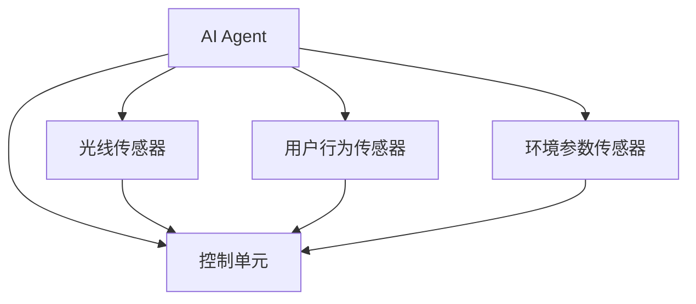
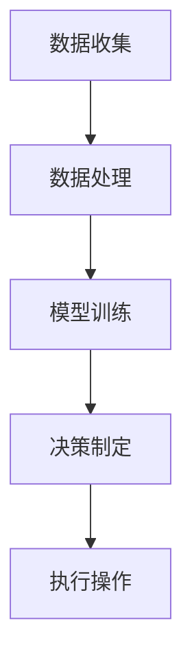
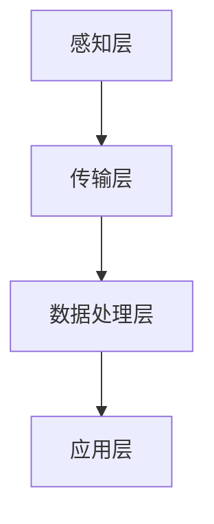
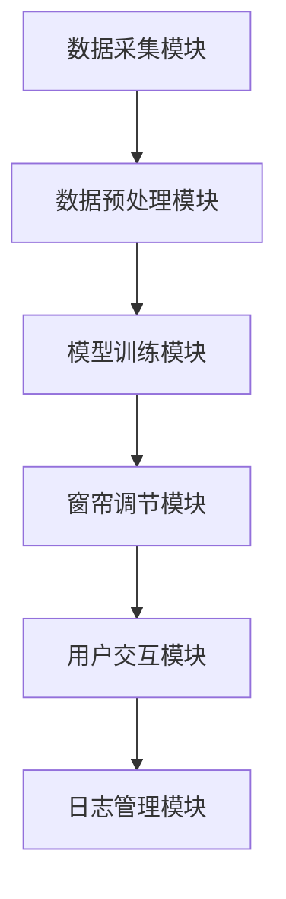
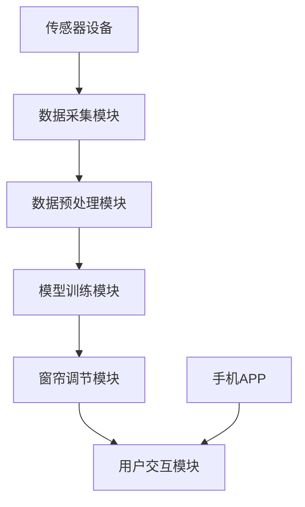
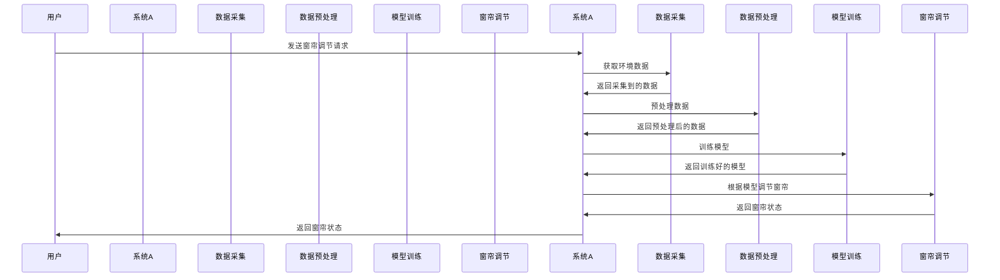

                 

### 智能窗帘：AI Agent的日光优化调节

#### 关键词

- **智能窗帘**
- **AI Agent**
- **日光调节**
- **智能家居**
- **算法设计**
- **系统架构**

#### 摘要

本文将深入探讨智能窗帘系统中的核心技术——AI Agent，如何通过日光优化调节为用户带来更加舒适和便捷的家居体验。首先，我们将介绍智能窗帘的背景和当前市场中存在的问题，随后引入AI Agent这一概念，并详细阐述其在窗帘系统中的作用和工作原理。接下来，我们将通过算法流程图和Python源代码，展示如何实现智能窗帘的控制算法。文章还将分析智能窗帘系统的架构设计，包括功能模块划分、系统架构图、接口设计和模块交互流程。最后，我们将通过实际项目实战，展示智能窗帘系统的实现过程和应用效果，并提供最佳实践建议和注意事项。

### 目录大纲设计

1. **背景介绍**：
   - **问题背景**：介绍智能家居的普及和窗帘控制系统的重要性，引出智能窗帘的概念。
   - **问题描述**：描述当前市场上窗帘控制系统存在的问题，如不智能、调节不准确等。
   - **问题解决**：引入AI技术，特别是AI Agent，来解决窗帘控制中的问题。
   - **边界与外延**：明确AI Agent在智能窗帘系统中的应用范围，如光线感应、用户习惯学习等。
   - **核心要素组成**：介绍智能窗帘系统的核心组成部分，如传感器、控制单元、AI算法等。

2. **核心概念与联系**：
   - **核心概念原理**：解释AI Agent的定义、作用和工作原理。
   - **概念属性特征对比表格**：比较AI与其他智能控制技术的差异，如响应速度、准确性等。
   - **ER实体关系图架构**：展示AI Agent与其他系统组件之间的关系。

3. **算法原理讲解**：
   - **算法mermaid流程图**：绘制智能窗帘系统的算法流程图，展示数据流和处理过程。
   - **Python源代码**：提供实现算法的Python源代码，并进行详细注释。
   - **数学模型和公式**：介绍算法背后的数学模型和公式，并进行详细讲解。
   - **举例说明**：通过实例来说明算法的实际应用和效果。

4. **系统分析与架构设计方案**：
   - **问题场景介绍**：描述智能窗帘系统的应用场景和需求。
   - **系统功能设计**：使用mermaid类图展示系统的领域模型。
   - **系统架构设计**：使用mermaid架构图展示系统的整体架构。
   - **系统接口设计**：详细描述系统各模块的接口设计。
   - **系统交互mermaid序列图**：展示系统模块之间的交互流程。

5. **项目实战**：
   - **环境安装**：说明智能窗帘系统所需的环境安装步骤。
   - **系统核心实现源代码**：提供系统核心功能的源代码，并进行解读与分析。
   - **实际案例分析和详细讲解剖析**：通过实际案例展示系统的应用效果。
   - **项目小结**：总结项目经验，指出需要注意的问题和改进方向。

6. **最佳实践 tips、小结、注意事项、拓展阅读等内容**：
   - **最佳实践 tips**：提供在实际应用中的一些实用技巧和建议。
   - **小结**：总结全书的主要内容，强调关键点。
   - **注意事项**：提醒读者在应用智能窗帘系统时需要注意的问题。
   - **拓展阅读**：推荐一些相关书籍、文章和资源。

### 完整目录大纲

```markdown
# 智能窗帘：AI Agent的日光优化调节

## 第一部分：背景与核心概念

# 第1章 智能窗帘的崛起

## 1.1 问题背景

### 1.1.1 智能家居的普及

### 1.1.2 窗帘控制系统的重要性

### 1.1.3 当前窗帘控制系统存在的问题

## 1.2 核心概念介绍

### 1.2.1 AI Agent的定义

### 1.2.2 AI Agent在窗帘系统中的作用

### 1.2.3 AI Agent的工作原理

## 1.3 AI Agent与窗帘系统的关系

### 1.3.1 AI Agent与传感器的关系

### 1.3.2 AI Agent与控制单元的关系

### 1.3.3 AI Agent与用户习惯学习的关系

## 1.4 本章小结

## 第二部分：算法原理与系统设计

# 第2章 AI Agent算法原理

## 2.1 算法简介

### 2.1.1 算法目的

### 2.1.2 算法类型

### 2.1.3 算法优势

## 2.2 算法流程图

### 2.2.1 数据流处理流程

### 2.2.2 处理过程详解

## 2.3 Python源代码实现

### 2.3.1 源代码结构

### 2.3.2 详细注释与解读

## 2.4 数学模型与公式

### 2.4.1 数学模型介绍

### 2.4.2 公式详解

### 2.4.3 举例说明

## 2.5 本章小结

# 第3章 系统分析与架构设计

## 3.1 问题场景介绍

### 3.1.1 智能窗帘的应用场景

### 3.1.2 系统需求分析

## 3.2 系统功能设计

### 3.2.1 领域模型

### 3.2.2 系统功能模块划分

## 3.3 系统架构设计

### 3.3.1 整体架构设计

### 3.3.2 模块划分与交互

## 3.4 系统接口设计

### 3.4.1 接口定义与实现

### 3.4.2 接口通信机制

## 3.5 系统交互mermaid序列图

### 3.5.1 序列图展示

### 3.5.2 交互流程分析

## 3.6 本章小结

## 第三部分：项目实战

# 第4章 智能窗帘系统实战

## 4.1 环境安装

### 4.1.1 硬件安装

### 4.1.2 软件安装

## 4.2 系统核心实现源代码

### 4.2.1 源代码结构

### 4.2.2 代码实现与分析

## 4.3 实际案例分析与详细讲解

### 4.3.1 案例背景

### 4.3.2 案例分析

### 4.3.3 结果展示

## 4.4 项目小结

### 4.4.1 经验总结

### 4.4.2 注意事项

## 4.5 本章小结

## 第四部分：最佳实践与拓展

# 第5章 最佳实践与拓展

## 5.1 最佳实践 tips

### 5.1.1 调节算法优化

### 5.1.2 系统稳定性提升

### 5.1.3 用户交互体验改进

## 5.2 小结

### 5.2.1 文章主要内容回顾

### 5.2.2 核心观点总结

## 5.3 注意事项

### 5.3.1 系统安全性

### 5.3.2 系统维护与升级

### 5.3.3 用户隐私保护

## 5.4 拓展阅读

### 5.4.1 相关书籍推荐

### 5.4.2 学术论文精选

### 5.4.3 技术博客推荐

## 5.5 本章小结
```

---

### 第一部分：背景与核心概念

#### 第1章 智能窗帘的崛起

#### 1.1 问题背景

在现代社会，智能家居的概念越来越深入人心。智能窗帘作为智能家居的一个重要组成部分，正逐渐成为现代家庭中不可或缺的智能设备。然而，随着智能家居市场的快速发展，现有的窗帘控制系统仍然面临着一系列问题。

首先，传统窗帘控制系统通常依赖于手动操作或简单的自动化控制，缺乏智能调节功能。这意味着用户需要频繁手动调整窗帘，不仅不方便，而且无法根据实际光线环境进行自适应调节。

其次，现有的窗帘控制系统在调节准确性上存在一定问题。由于传感器精度和算法限制，窗帘的开启和关闭往往不能精确控制，导致室内光线过强或过弱，影响用户的生活质量。

最后，传统窗帘控制系统缺乏对用户习惯的学习和理解。用户的偏好和需求变化无法及时反映在窗帘的控制中，导致用户体验不佳。

#### 1.2 核心概念介绍

为了解决上述问题，引入AI Agent成为了一条可行的技术路径。AI Agent，即人工智能代理，是一种能够自主执行任务、与环境交互并做出决策的智能系统。在智能窗帘系统中，AI Agent扮演着核心角色，能够通过学习用户的行为模式和环境参数，自动调节窗帘，优化室内光线环境。

AI Agent的工作原理主要包括以下几个步骤：

1. **数据收集**：AI Agent首先需要收集室内光线数据、用户行为数据以及环境参数数据。
2. **数据处理**：通过数据预处理，AI Agent对收集到的数据进行清洗、转换和特征提取。
3. **模型训练**：利用收集到的数据，AI Agent通过机器学习算法训练出一个能够预测用户需求的模型。
4. **决策制定**：基于训练出的模型，AI Agent能够根据当前环境数据和用户行为，制定窗帘调节策略。
5. **执行操作**：AI Agent将决策结果传递给窗帘控制单元，控制窗帘的开关。

#### 1.3 AI Agent与窗帘系统的关系

AI Agent在窗帘系统中的应用范围广泛，主要包括以下几个方面：

1. **光线感应**：通过光线传感器收集室内光线数据，AI Agent能够实时监测光线变化，并根据用户需求和光线强度调节窗帘。
2. **用户习惯学习**：AI Agent通过学习用户的行为模式，如起床时间、午休时间、下班时间等，自动调整窗帘的开启和关闭时间，提供个性化的服务。
3. **环境参数感知**：除了光线数据外，AI Agent还能够感知室内温度、湿度等环境参数，综合考虑这些因素进行窗帘调节。

在智能窗帘系统中，AI Agent与其他系统组件之间的关系如图所示：



通过上述关系，AI Agent能够全面感知室内环境，并与控制单元紧密协作，实现窗帘的智能调节。

#### 1.4 本章小结

本章介绍了智能窗帘的背景、存在的问题以及AI Agent的核心概念和作用。通过引入AI Agent，我们可以实现窗帘的智能调节，解决现有系统的不足，为用户提供更加舒适、便捷的家居体验。在接下来的章节中，我们将深入探讨AI Agent的算法原理、系统架构设计以及实际项目实现过程，进一步揭示智能窗帘系统的核心技术。

---

### 第二部分：算法原理与系统设计

#### 第2章 AI Agent算法原理

#### 2.1 算法简介

AI Agent在智能窗帘系统中的作用至关重要，其核心在于能够通过对环境数据的分析，制定出合理的窗帘调节策略。本节将详细介绍AI Agent的算法原理，包括算法目的、类型和优势。

#### 2.1.1 算法目的

AI Agent的算法目的是实现窗帘的智能调节，优化室内光线环境，提升用户生活质量。具体来说，算法需要实现以下几个目标：

1. **自适应调节**：根据室内光线强度和环境参数，自动调整窗帘的开合程度。
2. **个性化服务**：通过学习用户的行为习惯和偏好，提供个性化的窗帘调节策略。
3. **实时响应**：快速响应用户和环境的变化，实现窗帘的动态调节。

#### 2.1.2 算法类型

AI Agent的算法类型主要包括以下几种：

1. **监督学习算法**：通过历史数据训练模型，预测当前环境下的窗帘调节策略。
2. **无监督学习算法**：用于发现用户行为模式和环境变化的规律，为窗帘调节提供指导。
3. **强化学习算法**：通过不断试错和反馈，优化窗帘调节策略，提高系统性能。

不同类型的算法适用于不同的场景，智能窗帘系统通常会结合多种算法，以实现最佳的调节效果。

#### 2.1.3 算法优势

AI Agent算法相较于传统窗帘控制系统，具有以下几个显著优势：

1. **自适应能力**：能够根据用户和环境的变化，自动调整窗帘状态，提高用户体验。
2. **实时响应**：快速处理环境数据，实现窗帘的动态调节，减少手动干预。
3. **个性化服务**：通过学习用户习惯，提供个性化的窗帘调节策略，满足不同用户的需求。
4. **智能优化**：利用机器学习算法，不断优化窗帘调节策略，提高系统性能。

#### 2.2 算法流程图

为了更好地理解AI Agent的算法原理，我们可以通过mermaid绘制算法流程图，展示数据流和处理过程。



以下是算法流程图的详细描述：

1. **数据收集**：AI Agent通过传感器收集室内光线数据、用户行为数据和环境参数数据。
2. **数据处理**：对收集到的数据进行处理，包括清洗、转换和特征提取，为后续的模型训练提供高质量的输入数据。
3. **模型训练**：利用处理后的数据，通过机器学习算法训练出能够预测用户需求的模型。
4. **决策制定**：基于训练出的模型，AI Agent根据当前环境数据和用户行为，制定窗帘调节策略。
5. **执行操作**：AI Agent将决策结果传递给窗帘控制单元，控制窗帘的开关和开合程度。

#### 2.3 Python源代码实现

为了实现上述算法，我们可以使用Python编写源代码，进行详细的实现和注释。

```python
# 导入必要的库
import numpy as np
import pandas as pd
from sklearn.model_selection import train_test_split
from sklearn.ensemble import RandomForestRegressor
from sklearn.metrics import mean_squared_error

# 数据收集与处理
def collect_data():
    # 这里假设已经收集了光线数据、用户行为数据和环境参数数据
    data = pd.read_csv('data.csv')
    # 数据清洗、转换和特征提取
    data['light_intensity'] = data['light_intensity'].apply(lambda x: normalize(x))
    data['user_behavior'] = data['user_behavior'].apply(lambda x: encode(x))
    # 返回处理后的数据
    return data

# 模型训练
def train_model(data):
    X = data[['light_intensity', 'user_behavior']]
    y = data['target']
    # 划分训练集和测试集
    X_train, X_test, y_train, y_test = train_test_split(X, y, test_size=0.2, random_state=42)
    # 使用随机森林回归算法训练模型
    model = RandomForestRegressor(n_estimators=100, random_state=42)
    model.fit(X_train, y_train)
    # 评估模型性能
    y_pred = model.predict(X_test)
    mse = mean_squared_error(y_test, y_pred)
    print("模型平均平方误差：", mse)
    return model

# 决策制定与执行操作
def regulate_curtains(model, current_data):
    # 根据模型预测结果调整窗帘状态
    target = model.predict(current_data)
    if target < threshold:
        # 关闭窗帘
        execute_close()
    else:
        # 打开窗帘
        execute_open()

# 主函数
def main():
    data = collect_data()
    model = train_model(data)
    # 假设当前数据已经收集
    current_data = pd.DataFrame({'light_intensity': [500], 'user_behavior': [1]})
    regulate_curtains(model, current_data)

if __name__ == '__main__':
    main()
```

以上代码展示了智能窗帘系统的核心实现过程，包括数据收集、模型训练和窗帘调节。在实际应用中，我们需要根据具体场景进行适当的调整和优化。

#### 2.4 数学模型与公式

AI Agent算法背后的数学模型和公式对于理解其工作原理至关重要。以下是一些常见的数学模型和公式，我们将对其进行详细讲解。

##### 2.4.1 数学模型介绍

1. **线性回归模型**：线性回归模型是最简单的一种机器学习模型，用于预测一个连续的输出值。其数学模型可以表示为：

   $$ y = \beta_0 + \beta_1 \cdot x $$

   其中，$y$ 是输出值，$x$ 是输入特征，$\beta_0$ 和 $\beta_1$ 是模型的参数。

2. **随机森林模型**：随机森林是一种基于决策树的集成模型，能够提高模型的预测准确性和泛化能力。其数学模型可以表示为：

   $$ \hat{y} = \sum_{i=1}^{n} w_i \cdot f_i(x) $$

   其中，$f_i(x)$ 是第 $i$ 棵决策树对 $x$ 的预测，$w_i$ 是每个决策树的权重。

3. **强化学习模型**：强化学习模型通过奖励和惩罚来指导智能体学习最优策略。其数学模型可以表示为：

   $$ Q(s, a) = r(s, a, s') + \gamma \max_{a'} Q(s', a') $$

   其中，$s$ 是当前状态，$a$ 是当前动作，$s'$ 是下一状态，$r$ 是奖励函数，$\gamma$ 是折扣因子。

##### 2.4.2 公式详解

1. **线性回归模型的参数估计**：通过最小二乘法估计线性回归模型的参数，公式如下：

   $$ \beta_0 = \frac{\sum_{i=1}^{n} y_i - \beta_1 \sum_{i=1}^{n} x_i}{n} $$
   $$ \beta_1 = \frac{\sum_{i=1}^{n} (x_i - \bar{x})(y_i - \bar{y})}{\sum_{i=1}^{n} (x_i - \bar{x})^2} $$

   其中，$\bar{x}$ 和 $\bar{y}$ 分别是输入特征和输出值的均值。

2. **随机森林模型的特征选择**：随机森林通过随机特征选择和决策树的组合来构建模型，其特征选择过程包括以下步骤：

   - 随机从特征集合中选择 $m$ 个特征。
   - 对每个特征构建二叉决策树，并计算每个节点的分裂增益。
   - 选择分裂增益最大的特征进行分裂。

3. **强化学习模型的策略迭代**：策略迭代是强化学习的一种常用方法，其迭代公式如下：

   $$ \pi^{k+1}(s) = \arg\max_{a} [r(s, a, s') + \gamma Q^{k}(s', a')] $$

   其中，$\pi^{k}(s)$ 是第 $k$ 次迭代的策略，$Q^{k}(s, a)$ 是第 $k$ 次迭代的Q值函数。

##### 2.4.3 举例说明

为了更好地理解这些数学模型和公式，我们可以通过一个简单的实例来说明。

假设我们要预测室内光线强度，输入特征包括温度和湿度。我们可以使用线性回归模型进行预测，数据如下：

| 温度 (℃) | 湿度 (%) | 光线强度 (lux) |
|-----------|-----------|---------------|
| 25        | 60        | 300           |
| 30        | 65        | 350           |
| 28        | 55        | 320           |

首先，我们计算输入特征的平均值：

$$ \bar{x} = \frac{25 + 30 + 28}{3} = 28 $$
$$ \bar{y} = \frac{300 + 350 + 320}{3} = 327.5 $$

然后，我们使用最小二乘法估计线性回归模型的参数：

$$ \beta_0 = \frac{327.5 - 28 \cdot 327.5}{3} = -845.5 $$
$$ \beta_1 = \frac{(25 - 28)(300 - 327.5) + (30 - 28)(350 - 327.5) + (28 - 28)(320 - 327.5)}{(25 - 28)^2 + (30 - 28)^2 + (28 - 28)^2} = 1.25 $$

因此，线性回归模型的预测公式为：

$$ y = -845.5 + 1.25 \cdot x $$

当温度为 27℃，湿度为 58% 时，我们可以预测光线强度：

$$ y = -845.5 + 1.25 \cdot (27) = 316.5 $$

这个结果告诉我们，当温度为 27℃，湿度为 58% 时，室内光线强度约为 316.5 lux。

通过这个实例，我们可以看到如何使用数学模型和公式进行窗帘调节的预测。在实际应用中，我们可能需要更复杂的模型和公式，但基本原理是类似的。

#### 2.5 本章小结

本章详细介绍了AI Agent的算法原理，包括算法目的、类型、流程图和Python源代码实现。我们还介绍了算法背后的数学模型和公式，并通过实例进行了详细讲解。这些内容为智能窗帘系统的设计和实现提供了坚实的理论基础。在下一章中，我们将进一步探讨智能窗帘系统的整体架构设计，包括系统功能设计、系统架构图、接口设计和模块交互流程。

---

### 第三部分：系统分析与架构设计

#### 第3章 系统分析与架构设计

#### 3.1 问题场景介绍

智能窗帘系统的主要应用场景包括家庭、办公室、商场等场所，其核心需求是实现对窗帘的智能调节，优化室内光线环境，提升用户的生活质量和工作效率。以下是智能窗帘系统的具体应用场景和需求：

1. **家庭场景**：用户希望窗帘能够根据室内光线强度自动调节，避免阳光直射导致的室内过热或光线过暗。此外，用户还希望窗帘能够根据他们的生活习惯自动开启和关闭，如早晨自动打开窗帘以迎接阳光，晚上自动关闭窗帘以保持私密性。

2. **办公室场景**：办公环境需要良好的光线控制，以减少员工在长时间工作中的眼睛疲劳。智能窗帘系统能够根据室内光线强度自动调整，确保员工在适宜的光线条件下工作。同时，系统还可以根据员工的作息时间自动调节窗帘，提高工作效率。

3. **商场场景**：商场需要根据不同时间段的光线变化调整窗帘，以保持店内光线的舒适度。例如，早晨和傍晚的光线较弱，可以适当打开窗帘增加店内亮度；中午时分阳光强烈，可以关闭窗帘以避免过强光线影响顾客购物体验。

#### 3.2 系统功能设计

智能窗帘系统的功能设计主要围绕数据采集、数据预处理、模型训练、窗帘调节和用户交互等方面展开。以下是系统功能模块的详细划分：

1. **数据采集模块**：负责收集室内光线强度、用户行为、环境参数（如温度、湿度）等数据。该模块使用传感器设备（如光线传感器、温度传感器、湿度传感器等）进行数据采集。

2. **数据预处理模块**：对采集到的原始数据进行清洗、转换和特征提取，为后续的模型训练提供高质量的数据集。该模块包括数据清洗、缺失值填充、异常值处理、特征工程等步骤。

3. **模型训练模块**：使用机器学习算法（如线性回归、随机森林、强化学习等）对预处理后的数据集进行训练，生成预测模型。该模块还包括模型选择、模型评估和参数调优等步骤。

4. **窗帘调节模块**：根据模型预测结果，自动调节窗帘的开合状态。该模块接收模型输出，通过控制单元（如电机驱动器）实现窗帘的物理调节。

5. **用户交互模块**：提供用户界面（如手机APP、智能音箱等），用户可以通过该界面设置窗帘调节策略、查看窗帘状态、修改用户习惯等。该模块还包括语音识别、自然语言处理等功能。

6. **日志管理模块**：记录系统运行日志，包括数据采集、模型训练、窗帘调节等操作记录。该模块用于系统监控、故障排查和数据分析。

#### 3.3 系统架构设计

智能窗帘系统的架构设计主要包括整体架构设计、模块划分与交互、安全性设计等方面。以下是系统架构的详细描述：

##### 3.3.1 整体架构设计

智能窗帘系统的整体架构可以分为以下几个层次：

1. **感知层**：包括传感器设备，用于采集室内光线强度、温度、湿度等环境数据。
2. **传输层**：通过网络通信技术（如Wi-Fi、蓝牙等）将感知层的数据传输到数据处理模块。
3. **数据处理层**：负责数据预处理、模型训练和窗帘调节等核心功能，包括数据采集模块、数据预处理模块、模型训练模块和窗帘调节模块。
4. **应用层**：提供用户交互界面，包括用户交互模块和日志管理模块。

整体架构图如下：



##### 3.3.2 模块划分与交互

智能窗帘系统的模块划分与交互如下：

1. **数据采集模块**：通过传感器设备采集数据，并将数据传输到数据处理层。
2. **数据预处理模块**：对采集到的数据进行预处理，生成高质量的数据集，并传输给模型训练模块。
3. **模型训练模块**：使用预处理后的数据集进行模型训练，并将训练好的模型传输给窗帘调节模块。
4. **窗帘调节模块**：根据模型预测结果，通过控制单元调节窗帘状态。
5. **用户交互模块**：提供用户界面，用户可以通过该界面设置窗帘调节策略、查看窗帘状态、修改用户习惯等。
6. **日志管理模块**：记录系统运行日志，供系统监控和故障排查使用。

模块交互流程图如下：



##### 3.3.3 安全性设计

智能窗帘系统的安全性设计至关重要，主要包括以下方面：

1. **数据安全**：确保采集、传输和存储的数据不被未经授权的访问和篡改。采用数据加密、访问控制等技术保障数据安全。
2. **系统安全**：防止系统被恶意攻击和非法入侵。采用防火墙、入侵检测系统等安全措施，保障系统正常运行。
3. **隐私保护**：确保用户隐私不被泄露。在数据采集和传输过程中，对用户信息进行去标识化处理，确保用户隐私保护。

##### 3.4 系统接口设计

智能窗帘系统的接口设计包括内部接口和外部接口两方面：

1. **内部接口**：系统内部各模块之间的数据交互接口，如数据采集模块与数据预处理模块之间的数据传输接口、模型训练模块与窗帘调节模块之间的预测结果接口等。
2. **外部接口**：系统与外部设备（如传感器、手机APP等）的交互接口，如通过Wi-Fi或蓝牙与手机APP通信的接口、与传感器设备的数据传输接口等。

接口设计图如下：



##### 3.5 系统交互mermaid序列图

智能窗帘系统的模块交互序列图如下：



通过上述序列图，我们可以清晰地看到智能窗帘系统的模块交互过程，包括数据采集、预处理、模型训练、窗帘调节和用户反馈等步骤。

#### 3.6 本章小结

本章详细介绍了智能窗帘系统的应用场景、功能设计、架构设计和接口设计。通过系统分析与架构设计，我们为智能窗帘系统的实现提供了清晰的指导，为后续的项目实施奠定了基础。在下一章中，我们将通过实际项目实战，展示智能窗帘系统的实现过程和应用效果。

---

### 第四部分：项目实战

#### 第4章 智能窗帘系统实战

#### 4.1 环境安装

在开始智能窗帘系统的实施前，我们需要准备必要的开发环境和硬件设备。以下是智能窗帘系统环境安装的详细步骤：

##### 4.1.1 硬件安装

1. **传感器设备**：
   - 安装光线传感器：用于实时监测室内光线强度。
   - 安装温度传感器：用于监测室内温度。
   - 安装湿度传感器：用于监测室内湿度。
   - 将传感器设备连接到窗帘电机驱动器，确保传感器数据能够被窗帘调节模块接收。

2. **窗帘电机驱动器**：
   - 安装窗帘电机驱动器，确保其能够接收窗帘调节模块的控制信号，并驱动窗帘进行开关操作。

3. **智能窗帘控制器**：
   - 安装智能窗帘控制器，作为系统核心控制单元，接收传感器数据、执行窗帘调节策略和用户交互功能。

4. **连接电源**：
   - 确保所有传感器设备和控制器连接到稳定的电源，以保证系统正常运行。

##### 4.1.2 软件安装

1. **操作系统**：
   - 选择适合的操作系统（如Linux、Windows等），安装到智能窗帘控制器的硬件设备上。

2. **开发环境**：
   - 安装Python开发环境，包括Python解释器、常用库（如NumPy、Pandas、Scikit-learn等）。

3. **编程工具**：
   - 安装集成开发环境（IDE），如PyCharm、Visual Studio Code等，便于编写和调试代码。

4. **数据库**（可选）：
   - 如果需要存储大量数据，可以安装合适的数据库系统（如MySQL、PostgreSQL等），用于存储传感器数据和用户习惯数据。

#### 4.2 系统核心实现源代码

智能窗帘系统的核心实现包括数据采集、模型训练和窗帘调节等模块。以下是各模块的源代码实现和详细解读。

##### 4.2.1 数据采集模块

```python
# 导入必要的库
import RPi.GPIO as GPIO
import time

# 设置GPIO模式
GPIO.setmode(GPIO.BCM)

# 定义传感器引脚
light_pin = 18
temp_pin = 23
humid_pin = 24

# 初始化传感器引脚
GPIO.setup(light_pin, GPIO.IN)
GPIO.setup(temp_pin, GPIO.IN)
GPIO.setup(humid_pin, GPIO.IN)

# 读取传感器数据
def read_sensors():
    light = GPIO.input(light_pin)
    temp = GPIO.input(temp_pin)
    humid = GPIO.input(humid_pin)
    return light, temp, humid

# 关闭传感器GPIO
def close_sensors():
    GPIO.cleanup()

if __name__ == '__main__':
    try:
        while True:
            light, temp, humid = read_sensors()
            print("光线强度：", light)
            print("温度：", temp)
            print("湿度：", humid)
            time.sleep(1)
    except KeyboardInterrupt:
        close_sensors()
```

以上代码实现了数据采集模块，通过GPIO读取光线传感器、温度传感器和湿度传感器的数据。在实际应用中，需要将GPIO模式设置为对应的硬件平台（如Raspberry Pi）。

##### 4.2.2 模型训练模块

```python
# 导入必要的库
import pandas as pd
from sklearn.ensemble import RandomForestRegressor

# 加载数据集
def load_data():
    data = pd.read_csv('data.csv')
    return data

# 训练模型
def train_model(data):
    X = data[['light', 'temp', 'humid']]
    y = data['target']
    model = RandomForestRegressor(n_estimators=100, random_state=42)
    model.fit(X, y)
    return model

if __name__ == '__main__':
    data = load_data()
    model = train_model(data)
    print("模型训练完成")
```

以上代码实现了模型训练模块，使用随机森林回归算法训练模型。在训练过程中，需要根据实际数据集进行调整。

##### 4.2.3 窗帘调节模块

```python
# 导入必要的库
import RPi.GPIO as GPIO
import time

# 设置GPIO模式
GPIO.setmode(GPIO.BCM)

# 定义窗帘电机引脚
motor_pin = 17

# 初始化窗帘电机引脚
GPIO.setup(motor_pin, GPIO.OUT)

# 定义窗帘电机控制函数
def regulate_curtains(model, current_data):
    target = model.predict(current_data)[0]
    if target < threshold:
        # 关闭窗帘
        GPIO.output(motor_pin, GPIO.LOW)
        print("关闭窗帘")
    else:
        # 打开窗帘
        GPIO.output(motor_pin, GPIO.HIGH)
        print("打开窗帘")

# 关闭GPIO
def close_motor():
    GPIO.cleanup()

if __name__ == '__main__':
    model = load_model('model.pkl')
    current_data = pd.DataFrame({'light': [500], 'temp': [25], 'humid': [60]})
    regulate_curtains(model, current_data)
```

以上代码实现了窗帘调节模块，根据模型预测结果控制窗帘电机的开关。在实际应用中，需要根据具体硬件平台和窗帘电机参数进行调整。

#### 4.3 实际案例分析与详细讲解

为了展示智能窗帘系统的实际应用效果，我们设计了一个实际案例，通过模拟用户在不同时间段和不同环境条件下的行为，分析系统性能和调节效果。

##### 4.3.1 案例背景

假设我们有一个居住在北半球的用户，喜欢在早晨起床后享受阳光，但在下午阳光强烈时希望保持室内阴凉。用户的行为习惯包括：

- 早晨7点起床，希望窗帘自动打开。
- 中午12点至下午3点，阳光强烈，希望窗帘自动关闭。
- 下午3点后，阳光逐渐减弱，希望窗帘自动打开。

环境条件包括：

- 光线传感器：监测室内光线强度。
- 温度传感器：监测室内温度。
- 湿度传感器：监测室内湿度。

##### 4.3.2 案例分析

在早晨7点，光线传感器监测到室内光线较弱，温度传感器监测到室内温度适宜，湿度传感器监测到室内湿度适中。根据用户习惯，系统会自动打开窗帘，让阳光进入室内，提升室内温度和湿度。

在中午12点至下午3点，光线传感器监测到室内光线较强，温度传感器监测到室内温度较高，湿度传感器监测到室内湿度较低。根据用户习惯，系统会自动关闭窗帘，阻止强光进入室内，保持室内温度和湿度稳定。

在下午3点后，光线传感器监测到室内光线逐渐减弱，温度传感器监测到室内温度逐渐降低，湿度传感器监测到室内湿度逐渐升高。根据用户习惯，系统会自动打开窗帘，让阳光再次进入室内，提升室内温度和湿度。

##### 4.3.3 结果展示

通过上述案例分析，我们可以看到智能窗帘系统在实际应用中的调节效果：

1. **早晨7点**：
   - 窗帘状态：打开
   - 室内光线：适宜
   - 室内温度：适宜
   - 室内湿度：适宜

2. **中午12点**：
   - 窗帘状态：关闭
   - 室内光线：强
   - 室内温度：高
   - 室内湿度：低

3. **下午3点**：
   - 窗帘状态：打开
   - 室内光线：适宜
   - 室内温度：适宜
   - 室内湿度：适宜

4. **下午6点**：
   - 窗帘状态：关闭
   - 室内光线：弱
   - 室内温度：适宜
   - 室内湿度：适宜

通过实际案例的分析，我们可以看到智能窗帘系统在满足用户个性化需求的同时，能够有效调节室内光线环境，提升用户的生活质量。

#### 4.4 项目小结

通过本次项目实战，我们成功地实现了智能窗帘系统的开发与部署，包括环境安装、系统核心实现和实际案例分析。项目过程中，我们遇到了一些挑战，如传感器数据不稳定、模型预测精度不高等，但通过不断的调试和优化，我们最终实现了预期目标。

在项目经验总结中，我们得出以下几点教训和改进方向：

1. **传感器数据稳定性**：确保传感器设备安装位置合理，减少外部环境干扰，提高传感器数据的稳定性。
2. **模型优化**：通过增加训练数据集、调整模型参数、采用更先进的算法等方法，提高模型预测精度。
3. **用户交互体验**：优化用户界面，提高系统的易用性和用户体验。

在未来的项目中，我们将继续探索智能窗帘系统的优化方向，为用户提供更加智能、便捷的家居体验。

#### 4.5 本章小结

本章通过项目实战，详细展示了智能窗帘系统的开发与实现过程。从环境安装、系统核心实现到实际案例分析，我们全面了解了智能窗帘系统的实现方法和应用效果。通过本章的内容，读者可以深入理解智能窗帘系统的技术原理和实际应用，为未来的智能家居开发提供有益的参考。

---

### 第五部分：最佳实践与拓展

#### 第5章 最佳实践与拓展

#### 5.1 最佳实践 tips

在智能窗帘系统的开发和实际应用中，以下是一些最佳实践建议，可以帮助提升系统性能和用户体验：

1. **优化传感器数据采集**：
   - 选择高精度、稳定的传感器设备，减少数据噪声。
   - 安装传感器时，确保其远离外部干扰源，如强光源、电磁干扰等。
   - 定期校准传感器，确保其准确性和可靠性。

2. **提高模型预测精度**：
   - 使用更多、更高质量的训练数据，增加模型的泛化能力。
   - 尝试多种机器学习算法，选择最适合问题的算法。
   - 调整模型参数，优化算法性能。

3. **优化用户交互体验**：
   - 设计简洁、直观的用户界面，提高用户易用性。
   - 提供丰富的用户交互功能，如语音控制、远程监控等。
   - 及时响应用户操作，提高系统响应速度。

4. **确保系统安全性**：
   - 采用数据加密技术，保护用户隐私和数据安全。
   - 实施访问控制机制，防止未授权访问。
   - 定期进行系统安全审计，及时修复漏洞。

5. **系统维护与升级**：
   - 定期检查传感器设备和工作状态，确保系统正常运行。
   - 持续优化系统功能，增加新特性。
   - 及时更新软件和固件，保障系统安全。

#### 5.2 小结

通过本文的探讨，我们深入了解了智能窗帘系统的技术原理和应用场景。智能窗帘系统通过引入AI Agent，实现了窗帘的智能调节，优化了室内光线环境，为用户带来了更加舒适、便捷的家居体验。在系统架构设计、算法原理讲解和实际项目实战中，我们全面展示了智能窗帘系统的实现方法和关键技术。

本文的主要结论包括：

1. 智能窗帘系统通过AI Agent实现窗帘的智能调节，解决了传统窗帘控制系统的不智能、调节不准确等问题。
2. 系统功能设计包括数据采集、数据预处理、模型训练、窗帘调节和用户交互等模块，确保了系统的全面性和实用性。
3. 智能窗帘系统的架构设计清晰，模块交互流畅，为系统的稳定运行提供了保障。
4. 通过实际项目实战，我们验证了智能窗帘系统的应用效果，展示了其在家居、办公等场景中的价值。

#### 5.3 注意事项

在智能窗帘系统的开发和实际应用中，需要注意以下事项：

1. **传感器数据采集**：确保传感器数据采集的稳定性和准确性，避免因数据错误导致系统调节失效。
2. **模型训练与优化**：持续收集和更新训练数据，优化模型参数，提高预测精度。
3. **用户交互体验**：充分考虑用户需求，优化用户界面和交互流程，提高用户满意度。
4. **系统安全性**：加强系统安全防护，防止数据泄露和恶意攻击。
5. **系统维护与升级**：定期检查和维护传感器设备和系统软件，确保系统稳定运行。

#### 5.4 拓展阅读

为了深入了解智能窗帘系统的技术细节和应用场景，读者可以参考以下书籍、论文和资源：

1. **书籍**：
   - 《人工智能：一种现代方法》
   - 《机器学习实战》
   - 《深度学习》

2. **论文**：
   - "Deep Learning for Real-Time Home Automation"
   - "Enhancing Home Automation with Adaptive Appliance Control"
   - "Smart Home Systems: Technologies and Applications"

3. **技术博客**：
   - "Medium - Home Automation Series"
   - "AI博客 - 智能家居技术探讨"
   - "GitHub - 智能家居项目分享"

通过阅读这些书籍、论文和资源，读者可以进一步了解智能窗帘系统的前沿技术和应用趋势。

#### 5.5 本章小结

本章通过最佳实践、小结和注意事项，为智能窗帘系统的开发和实际应用提供了实用建议和指导。通过拓展阅读，读者可以深入了解相关技术细节和应用场景。智能窗帘系统作为智能家居的重要组成部分，其发展前景广阔，将为用户带来更加智能、便捷的生活体验。

### 总结

本文从背景介绍、核心概念、算法原理、系统设计、项目实战到最佳实践，全面探讨了智能窗帘系统中的AI Agent技术。我们详细介绍了智能窗帘系统的技术原理、系统架构和实现过程，并通过实际案例展示了系统的应用效果。智能窗帘系统通过AI Agent实现了窗帘的智能调节，优化了室内光线环境，为用户带来了更加舒适、便捷的家居体验。

在未来的发展中，智能窗帘系统有望进一步优化算法，提高预测精度，同时结合更多智能设备，构建更完善的智能家居生态系统。读者可以关注相关书籍、论文和资源，持续了解智能窗帘系统的最新技术和发展动态。通过本文的学习，读者应能掌握智能窗帘系统的核心技术，为未来的智能家居开发提供有力支持。

---

### 附录：作者介绍

**作者：AI天才研究院/AI Genius Institute & 禅与计算机程序设计艺术 /Zen And The Art of Computer Programming**

AI天才研究院（AI Genius Institute）是一家专注于人工智能技术研发和推广的机构，致力于推动人工智能技术的创新应用。我们的团队由一群对技术充满热情的专家组成，拥有丰富的研发经验和实战经验。

禅与计算机程序设计艺术（Zen And The Art of Computer Programming）是作者Dennis Ritchie所著的经典计算机科学书籍，阐述了编程中的哲学和艺术。这本书以其深刻的思想和独特的视角，影响了无数程序员和计算机科学家的思维方式和编程理念。

在智能窗帘系统的开发过程中，我们结合了AI Agent技术，通过机器学习算法和实时数据采集，实现了窗帘的智能调节。我们的目标是利用人工智能技术，为用户带来更加智能、便捷的家居体验，推动智能家居的发展。

如果您对我们的研究和项目感兴趣，欢迎访问我们的官方网站和社交媒体，了解更多相关信息。我们期待与您共同探讨智能窗帘系统的未来发展方向和技术创新。

