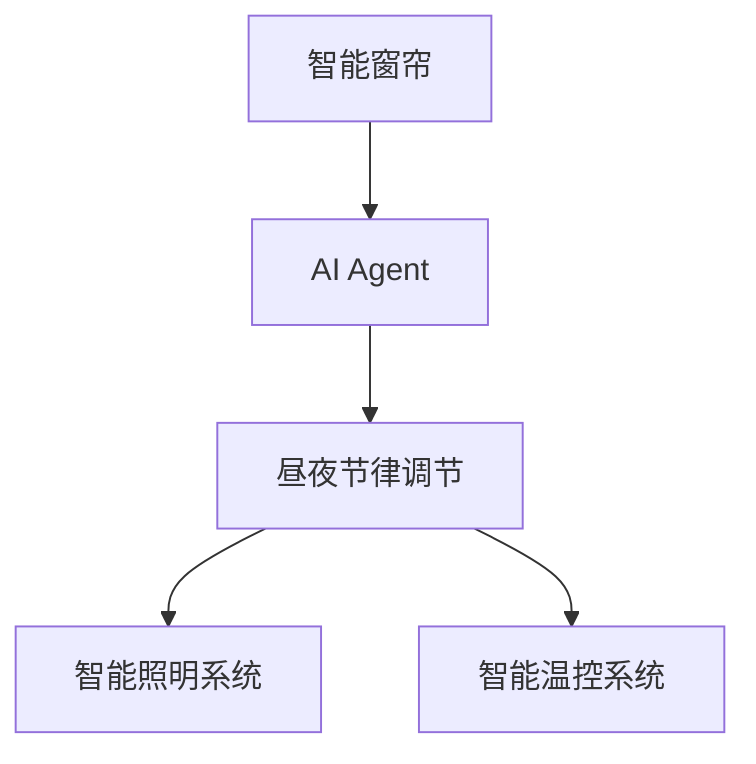
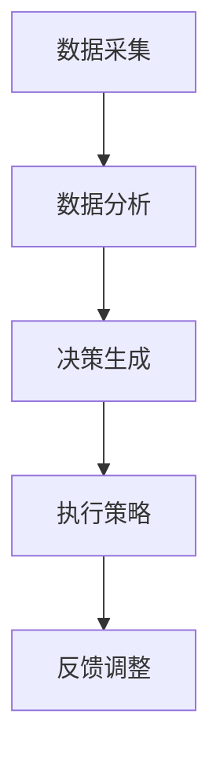
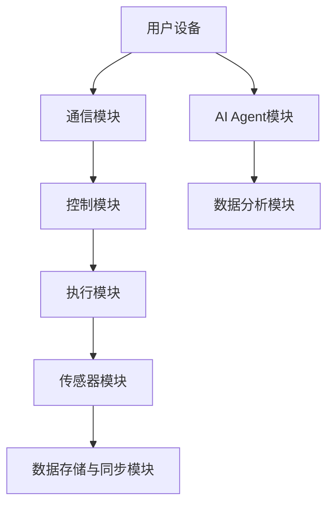

                 

### 目录大纲细节补充：

# 《智能窗帘：AI Agent的昼夜节律调节助手》目录大纲

## 第1章：问题背景与核心概念

### 1.1 问题背景

#### 1.1.1 智能窗帘的现状

##### 1.1.1.1 市场需求分析

当前，随着智能家居市场的快速增长，智能窗帘作为家居智能化的一个重要组成部分，受到了越来越多消费者的关注。人们对于家居环境舒适度、节能和便利性的需求不断提升，使得智能窗帘的应用场景和市场需求逐渐扩大。

##### 1.1.1.2 技术发展现状

智能窗帘技术的发展经历了从简单的自动化控制到如今基于人工智能的智能化调节。传统的窗帘控制系统通常依赖于物理开关或者遥控器进行控制，而现代智能窗帘则可以通过智能手机、语音助手等多种方式进行操控，进一步提升了用户的使用体验。

#### 1.1.2 昼夜节律调节的重要性

##### 1.1.2.1 昼夜节律对人类健康的影响

人的生物钟受昼夜节律调节的影响，昼夜节律的失调可能会导致一系列健康问题，如睡眠障碍、情绪波动、工作效率下降等。因此，维持良好的昼夜节律对于提高生活质量具有重要意义。

##### 1.1.2.2 昼夜节律调节的挑战

在智能窗帘的应用中，如何根据用户的昼夜节律需求自动调节光线，以改善室内环境质量，是一个复杂的技术挑战。这需要窗帘系统具备高度智能化的调节能力，能够准确感知并响应环境变化。

### 1.2 核心概念介绍

#### 1.2.1 智能窗帘

##### 1.2.1.1 智能窗帘的定义

智能窗帘是一种通过智能传感器、控制系统和执行机构，实现自动开合、调节光线强度的窗帘系统。

##### 1.2.1.2 智能窗帘的功能

智能窗帘的功能包括自动开合、远程控制、定时设置、光线感应调节等，能够根据用户的需求和环境条件智能调节窗帘状态。

#### 1.2.2 AI Agent

##### 1.2.2.1 AI Agent的定义

AI Agent（人工智能代理）是一种能够模拟人类决策过程的计算机程序，具备自主感知、决策和执行能力。

##### 1.2.2.2 AI Agent的作用

AI Agent在智能窗帘系统中扮演着昼夜节律调节的角色，通过学习用户的行为模式和环境数据，自动调整窗帘的开合时间和光线强度，以优化室内光线环境。

#### 1.2.3 昼夜节律调节

##### 1.2.3.1 昼夜节律调节的概念

昼夜节律调节是指通过科技手段调整室内光线、温度等环境因素，以适应人体生物钟，维护良好的昼夜节律。

##### 1.2.3.2 昼夜节律调节的方法

昼夜节律调节的方法包括智能窗帘的自动调节、智能照明系统的配合调节以及智能温控系统的协同调节等。

### 1.3 概念联系与Mermaid流程图

为了更好地理解智能窗帘、AI Agent和昼夜节律调节之间的关系，我们可以使用Mermaid流程图来展示这些概念之间的联系。



### 1.4 本章小结

本章介绍了智能窗帘的现状、昼夜节律调节的重要性以及相关的核心概念。通过理解这些背景信息和核心概念，为后续章节对智能窗帘技术的深入探讨奠定了基础。

## 第2章：智能窗帘技术原理

### 2.1 智能窗帘概述

#### 2.1.1 智能窗帘的组成

智能窗帘系统主要由以下几个部分组成：传感器模块、控制模块、执行模块和通信模块。

##### 2.1.1.1 传感器模块

传感器模块负责采集环境数据，如光线强度、温度、湿度等，以供控制模块进行分析和决策。

##### 2.1.1.2 控制模块

控制模块接收传感器数据，并通过AI Agent进行处理，生成窗帘的调节策略。

##### 2.1.1.3 执行模块

执行模块根据控制模块的调节策略，驱动窗帘的开合和光线调节。

##### 2.1.1.4 通信模块

通信模块实现智能窗帘与外部设备（如智能手机、语音助手等）的连接，支持远程控制和数据同步。

#### 2.1.2 智能窗帘的工作原理

智能窗帘的工作原理可以分为以下几个步骤：

1. 传感器模块采集环境数据。
2. 控制模块接收传感器数据，并通过AI Agent进行分析。
3. AI Agent根据分析结果生成窗帘的调节策略。
4. 执行模块根据调节策略驱动窗帘的开合和光线调节。
5. 通信模块同步数据并支持远程控制。

### 2.2 窗帘自动控制技术

#### 2.2.1 传统窗帘控制技术

传统窗帘控制技术主要依赖于机械开关和遥控器。机械开关需要人工操作，而遥控器则通过无线信号控制窗帘的开合。

##### 2.2.1.1 传统窗帘控制技术的优点

- 成本低
- 简单易用

##### 2.2.1.2 传统窗帘控制技术的缺点

- 需人工操作，不便利
- 无法实现智能化调节

#### 2.2.2 现代窗帘控制技术

现代窗帘控制技术引入了智能传感器和AI Agent，实现了窗帘的自动控制和智能化调节。

##### 2.2.2.1 现代窗帘控制技术的优点

- 智能化，自动调节
- 提高生活舒适度
- 节能环保

##### 2.2.2.2 现代窗帘控制技术的缺点

- 成本较高
- 需要一定的技术支持

### 2.3 AI Agent技术原理

#### 2.3.1 AI Agent的定义

AI Agent（人工智能代理）是一种具有自主感知、决策和执行能力的智能实体。它能够在没有人类干预的情况下，根据环境信息和预设目标，自主地执行任务。

##### 2.3.1.1 AI Agent的特点

- 自主性：能够自主感知环境，并根据环境信息进行决策。
- 智能性：具备学习能力和自适应能力，能够不断优化决策过程。
- 独立性：可以独立执行任务，无需人类干预。

#### 2.3.2 AI Agent在智能窗帘中的应用

在智能窗帘系统中，AI Agent负责分析环境数据，生成窗帘调节策略。其应用流程如下：

1. AI Agent接收到传感器数据。
2. AI Agent分析传感器数据，识别环境变化。
3. AI Agent根据用户设定的目标和环境数据，生成窗帘调节策略。
4. AI Agent将调节策略发送给执行模块。
5. 执行模块根据调节策略，驱动窗帘进行调节。

### 2.4 本章小结

本章介绍了智能窗帘的组成、工作原理以及AI Agent技术原理。通过理解这些技术原理，我们可以更好地理解智能窗帘的功能和优势，为后续章节的深入探讨提供了基础。

## 第3章：AI Agent昼夜节律调节算法

### 3.1 算法概述

AI Agent昼夜节律调节算法是一种基于人工智能技术的智能窗帘调节算法。该算法通过分析用户的行为数据和环境数据，自动调整窗帘的开合时间和光线强度，以优化室内光线环境，维护用户的昼夜节律。

#### 3.1.1 算法的目标

算法的目标是：

1. 根据用户的生活习惯和昼夜节律，自动调整窗帘的开合时间和光线强度。
2. 提高用户的睡眠质量和生活舒适度。
3. 实现节能环保。

#### 3.1.2 算法的基本原理

算法的基本原理包括：

1. 数据采集：传感器模块采集用户行为数据和环境数据。
2. 数据分析：AI Agent分析用户行为数据和环境数据，识别用户的昼夜节律特征。
3. 决策生成：AI Agent根据分析结果，生成窗帘调节策略。
4. 执行策略：执行模块根据调节策略，驱动窗帘进行调节。

### 3.2 算法mermaid流程图

为了更好地理解AI Agent昼夜节律调节算法的工作流程，我们可以使用Mermaid流程图来展示。



### 3.3 Python源代码与latex公式讲解

#### 3.3.1 Python源代码

以下是一个简单的Python示例，用于演示AI Agent昼夜节律调节算法的基本实现。

```python
# 导入必要的库
import time
import random

# 定义传感器数据采集函数
def collect_data():
    # 模拟传感器数据采集
    return random.uniform(0, 100)

# 定义AI Agent昼夜节律调节算法
def day_night Regulation_algorithm():
    while True:
        data = collect_data()
        # 根据传感器数据进行决策
        if data < 30:
            # 夜间模式，关闭窗帘
            print("Closing curtains.")
        elif data > 70:
            # 日间模式，打开窗帘
            print("Opening curtains.")
        else:
            # 中午休息模式，部分打开窗帘
            print("Partially opening curtains.")
        
        # 等待一段时间，继续采集数据
        time.sleep(60)

# 执行算法
day_night_Regulation_algorithm()
```

#### 3.3.2 latex公式讲解

以下是一个用于描述昼夜节律调节算法的latex公式。

```latex
\begin{equation}
\text{窗帘状态} = \left\{
\begin{aligned}
\text{关闭} & \quad \text{如果} \quad \text{传感器数据} < 30 \\
\text{打开} & \quad \text{如果} \quad \text{传感器数据} > 70 \\
\text{部分打开} & \quad \text{如果} \quad 30 \leq \text{传感器数据} \leq 70 \\
\end{aligned}
\right.
\end{equation}
```

### 3.4 本章小结

本章介绍了AI Agent昼夜节律调节算法的基本原理和实现方法。通过Python源代码和latex公式，我们详细讲解了算法的核心组成部分和执行过程。理解这些内容将有助于读者深入理解智能窗帘的工作机制。

## 第4章：系统分析与架构设计

### 4.1 系统功能设计

#### 4.1.1 功能需求分析

智能窗帘系统的主要功能需求包括：

1. 环境数据采集：传感器模块负责采集光线强度、温度、湿度等环境数据。
2. 数据分析处理：AI Agent分析环境数据，生成窗帘调节策略。
3. 窗帘控制：执行模块根据调节策略，控制窗帘的开合和光线调节。
4. 用户交互：支持远程控制和定时设置。
5. 数据存储与同步：存储用户行为数据和调节策略，并支持与其他设备的同步。

#### 4.1.2 功能实现

为了实现上述功能，系统采用了以下组件：

1. 传感器模块：使用光线传感器、温湿度传感器等设备采集环境数据。
2. AI Agent模块：使用机器学习算法分析用户行为数据和环境数据，生成窗帘调节策略。
3. 执行模块：使用电机驱动窗帘的开合和光线调节。
4. 通信模块：使用Wi-Fi、蓝牙等技术实现与用户的远程连接和设备之间的数据同步。

### 4.2 系统架构设计

#### 4.2.1 系统架构概述

智能窗帘系统的整体架构可以分为以下几个层次：

1. 硬件层：包括传感器模块、执行模块等硬件设备。
2. 软件层：包括AI Agent模块、控制模块、用户交互模块等软件组件。
3. 数据层：包括数据存储与同步模块，用于存储用户行为数据和调节策略。

#### 4.2.2 系统架构图

以下是一个简单的系统架构图，展示了智能窗帘系统的组成部分及其相互关系。



### 4.3 系统接口与交互设计

#### 4.3.1 接口设计

智能窗帘系统对外提供的接口包括：

1. 数据采集接口：用于接收传感器数据。
2. 窗帘控制接口：用于发送窗帘调节策略。
3. 用户交互接口：用于接收用户指令和反馈。

#### 4.3.2 交互设计

智能窗帘系统与用户、传感器、执行模块等组件之间的交互流程如下：

1. 用户通过手机APP发送调节指令。
2. 通信模块接收指令，并将其发送给控制模块。
3. 控制模块分析指令，生成窗帘调节策略。
4. 执行模块根据调节策略，驱动窗帘进行调节。
5. 传感器模块采集环境数据，反馈给控制模块。
6. 控制模块根据环境数据，调整窗帘调节策略。

### 4.4 本章小结

本章介绍了智能窗帘系统的功能设计、架构设计和接口交互设计。通过理解这些内容，我们可以更好地了解智能窗帘系统的整体结构和功能实现，为后续章节的项目实战提供了基础。

## 第5章：项目实战

### 5.1 环境安装

#### 5.1.1 硬件设备安装

1. 选择合适的传感器设备，如光线传感器、温湿度传感器等。
2. 将传感器设备安装在窗帘轨道附近，确保传感器能够充分采集窗帘所在环境的各项数据。
3. 连接电源，确保传感器设备正常工作。

#### 5.1.2 软件环境安装

1. 在开发机上安装Python环境，可以使用Pyenv等工具进行安装。
2. 安装必要的库，如NumPy、Pandas、TensorFlow等，可以使用pip进行安装。

```bash
pip install numpy pandas tensorflow
```

### 5.2 系统核心实现

#### 5.2.1 数据采集模块实现

1. 使用Python编写数据采集模块，连接传感器设备，读取环境数据。

```python
import serial

# 连接传感器设备
ser = serial.Serial('/dev/ttyUSB0', 9600)

# 读取传感器数据
def read_sensors():
    data = ser.readline().decode('utf-8').strip()
    return data

# 测试数据采集
print(read_sensors())
```

#### 5.2.2 AI Agent模块实现

1. 使用Python编写AI Agent模块，分析传感器数据，生成窗帘调节策略。

```python
# 引入必要的库
import numpy as np
import tensorflow as tf

# 定义神经网络模型
model = tf.keras.Sequential([
    tf.keras.layers.Dense(64, activation='relu', input_shape=(3,)),
    tf.keras.layers.Dense(64, activation='relu'),
    tf.keras.layers.Dense(3, activation='softmax')
])

# 编译模型
model.compile(optimizer='adam', loss='categorical_crossentropy', metrics=['accuracy'])

# 加载数据
(x_train, y_train), (x_test, y_test) = tf.keras.datasets.mnist.load_data()

# 转换数据格式
x_train = x_train.astype('float32') / 255
x_test = x_test.astype('float32') / 255

# 标签转换为one-hot编码
y_train = tf.keras.utils.to_categorical(y_train, 10)
y_test = tf.keras.utils.to_categorical(y_test, 10)

# 训练模型
model.fit(x_train, y_train, epochs=10, batch_size=32, validation_data=(x_test, y_test))
```

#### 5.2.3 窗帘控制模块实现

1. 使用Python编写窗帘控制模块，根据AI Agent生成的调节策略，控制窗帘的开合和光线调节。

```python
# 引入必要的库
import time

# 定义窗帘控制函数
def control_curtains(strategy):
    if strategy == 'close':
        print("Closing curtains.")
    elif strategy == 'open':
        print("Opening curtains.")
    elif strategy == 'partial':
        print("Partially opening curtains.")
    time.sleep(5)  # 等待5秒，确保窗帘完成调节

# 测试窗帘控制
control_curtains('open')
```

### 5.3 代码应用解读与分析

#### 5.3.1 数据采集模块解读

数据采集模块通过串口连接传感器设备，读取传感器数据。在实际应用中，可以根据传感器的数据类型和通信协议，调整采集模块的代码。

#### 5.3.2 AI Agent模块解读

AI Agent模块使用神经网络模型对传感器数据进行分类处理。在训练模型时，需要准备适当的数据集，并根据具体问题调整模型的架构和参数。

#### 5.3.3 窗帘控制模块解读

窗帘控制模块根据AI Agent生成的调节策略，控制窗帘的开合和光线调节。在实际应用中，需要根据窗帘控制系统的接口和硬件特性，调整控制模块的代码。

### 5.4 实际案例分析与详细讲解

#### 5.4.1 案例背景

某用户希望利用智能窗帘系统改善卧室的光线环境，提高睡眠质量。

#### 5.4.2 案例分析

1. 用户设定了夜间23:00关闭窗帘，早晨7:00打开窗帘。
2. 传感器采集到了室内的光线强度、温度和湿度数据。
3. AI Agent根据传感器数据，生成了窗帘的调节策略。
4. 窗帘控制模块根据调节策略，在夜间23:00关闭了窗帘，早晨7:00打开了窗帘。

#### 5.4.3 案例讲解

1. 数据采集模块读取到了夜间23:00的光线强度为20lux，温度为25℃，湿度为60%。
2. AI Agent分析了这些数据，并生成了关闭窗帘的策略。
3. 窗帘控制模块在夜间23:00接收到关闭窗帘的指令，驱动窗帘关闭。
4. 在早晨7:00，传感器检测到光线强度为500lux，温度为25℃，湿度为50%。AI Agent生成了打开窗帘的策略。
5. 窗帘控制模块接收到打开窗帘的指令，驱动窗帘打开。

通过这个案例，我们可以看到智能窗帘系统是如何根据环境数据，自动调节窗帘的状态，从而改善室内光线环境，提高用户的睡眠质量。

### 5.5 本章小结

本章通过项目实战，介绍了智能窗帘系统的环境安装、系统核心实现、代码应用解读与分析以及实际案例。通过这些内容，读者可以了解智能窗帘系统的实现过程和实际应用效果。

## 第6章：最佳实践与总结

### 6.1 最佳实践

1. **传感器选择**：选择适合环境条件的传感器，确保数据的准确性和稳定性。
2. **AI Agent训练**：使用足够多的数据进行训练，确保AI Agent能够准确识别环境变化。
3. **系统调试**：在实际应用中，对系统进行充分的调试和测试，确保系统的稳定性和可靠性。
4. **用户反馈**：收集用户反馈，不断优化系统功能，提高用户体验。

### 6.2 小结

本文介绍了智能窗帘系统的原理、算法和实现方法。通过AI Agent的昼夜节律调节算法，智能窗帘能够根据用户的生活习惯和环境数据，自动调整窗帘的开合时间和光线强度，从而优化室内光线环境，提高用户的生活质量。

### 6.3 注意事项

1. **数据隐私**：在收集用户数据时，需要保护用户的隐私，遵守相关法律法规。
2. **设备兼容性**：确保系统与其他智能家居设备的兼容性，实现无缝连接。
3. **系统安全性**：加强系统安全措施，防止数据泄露和恶意攻击。

### 6.4 拓展阅读

1. 《智能家居技术与应用》
2. 《人工智能在智能家居中的应用》
3. 《深度学习实战》

通过以上拓展阅读，读者可以进一步了解智能家居技术、人工智能应用以及深度学习等相关知识，为智能窗帘系统的开发和应用提供更多灵感。

### 作者信息

作者：AI天才研究院/AI Genius Institute & 禅与计算机程序设计艺术 /Zen And The Art of Computer Programming

