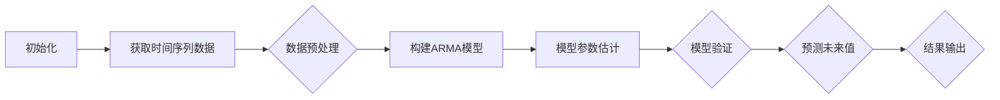
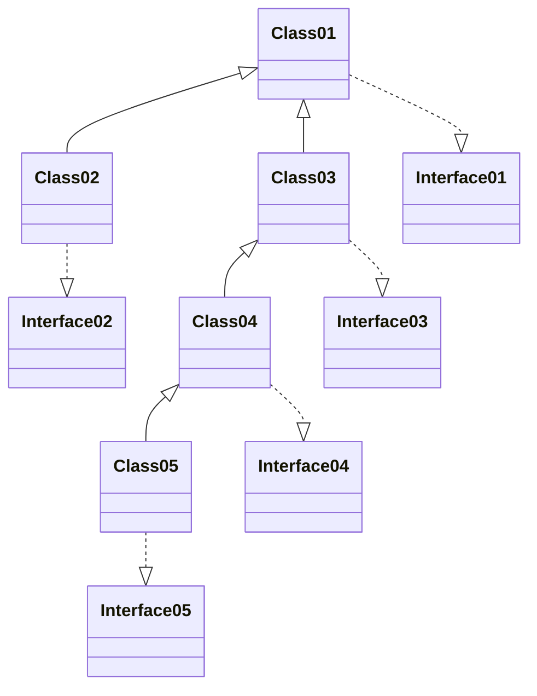
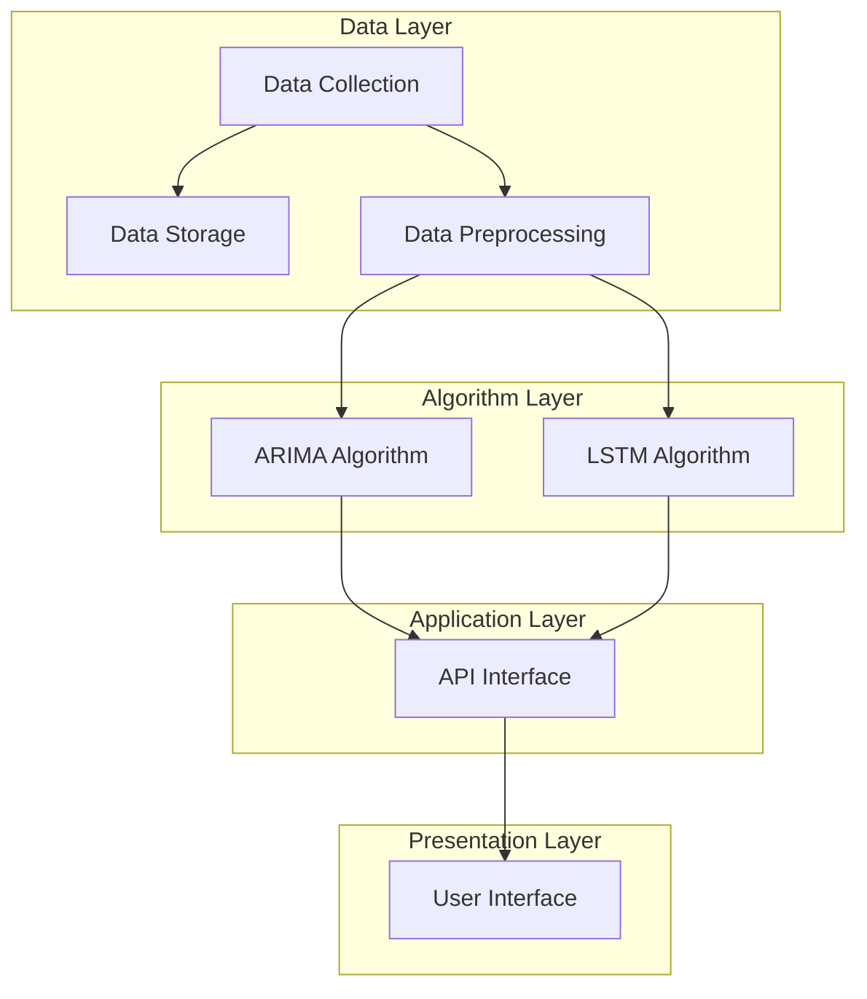
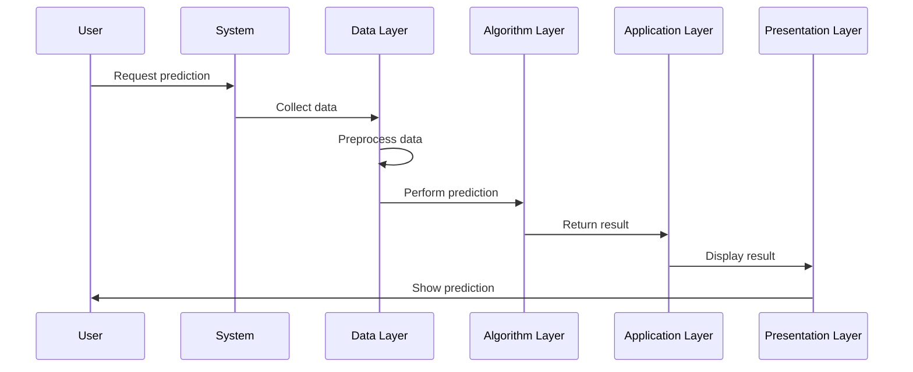

                 


## 智能经济指标预测系统

### 关键词
- 经济预测
- 智能系统
- 数据分析
- 算法
- 模型

### 摘要
本文将深入探讨智能经济指标预测系统的设计、实现和实际应用。我们将从背景介绍、核心概念、算法原理、系统分析与设计、项目实战和最佳实践等方面，逐步分析并阐述这一系统的构建过程和关键要素。

## 引言

随着大数据和人工智能技术的发展，经济预测领域迎来了前所未有的机遇和挑战。准确预测经济指标对于政府决策、企业战略和投资者决策具有重要意义。传统的经济预测方法往往依赖于历史数据和统计分析，难以适应复杂多变的全球经济环境。而智能经济指标预测系统通过结合人工智能技术和大数据分析，能够更加精准地预测经济走势。

本文将围绕智能经济指标预测系统的设计、实现和应用，逐步探讨以下几个关键问题：

1. **核心概念与关系**：首先，我们将介绍经济预测中涉及的核心概念及其相互关系。
2. **算法原理与实现**：接着，我们将详细讲解一种适用于经济预测的算法，并使用Python代码进行实现。
3. **系统分析与设计**：我们将介绍系统的分析与设计方法，包括领域模型、系统架构和接口设计。
4. **项目实战**：通过实际案例，我们将展示系统的应用场景和实现细节。
5. **最佳实践与总结**：最后，我们将总结最佳实践，提出注意事项，并推荐相关拓展阅读。

## 核心概念与关系

### 经济预测

经济预测是指对未来经济指标的变化趋势进行预测和分析。这些指标包括GDP增长率、通货膨胀率、失业率、工业产值等。经济预测的目的是为政策制定者、投资者和企业提供决策依据。

### 数据分析

数据分析是指使用统计和计算方法对大量数据进行处理、分析和解释的过程。在智能经济预测中，数据分析是关键环节，它有助于挖掘数据中的潜在规律和趋势。

### 算法

算法是解决问题的一系列步骤和规则。在经济预测中，算法用于处理数据、提取特征、建立模型和进行预测。

### 模型

模型是对现实世界的抽象和模拟。在经济预测中，模型用于描述经济变量之间的关系和变化规律。

### 关系

这些核心概念之间存在着密切的联系。经济预测依赖于数据分析和算法，而算法的实现和优化又需要依赖模型的构建和验证。

### Mermaid ER Diagram

为了更好地展示核心概念之间的关系，我们可以使用Mermaid工具绘制一个实体关系图（ER Diagram）。

```mermaid
erDiagram
  EconomicPrediction ||--|{ DataAnalysis } : uses
  EconomicPrediction ||--|{ Algorithm } : uses
  EconomicPrediction ||--|{ Model } : uses
  DataAnalysis ||--|{ Data } : analyzes
  Algorithm ||--|{ Code } : implements
  Model ||--|{ Equation } : describes
```

### 表格对比

为了更加直观地展示各核心概念的属性特征，我们可以使用表格进行对比。

| 核心概念 | 属性特征 |
| --- | --- |
| 经济预测 | 预测经济指标的变化趋势 |
| 数据分析 | 处理和分析大量数据 |
| 算法 | 解决问题的步骤和规则 |
| 模型 | 描述现实世界的抽象和模拟 |

## 算法原理与实现

### 介绍

在本节中，我们将介绍一种适用于经济预测的算法：时间序列分析（Time Series Analysis）。时间序列分析是一种统计方法，用于分析时间序列数据，并预测未来的趋势。这种方法在经济学、金融学和气象学等领域都有广泛应用。

### 算法原理

时间序列分析的基本原理是：时间序列数据是随机过程的实现，它可以用一组自回归移动平均（ARMA）模型来描述。ARMA模型由两部分组成：自回归（AR）部分和移动平均（MA）部分。

- **自回归（AR）部分**：描述当前值与之前值的依赖关系。
- **移动平均（MA）部分**：描述当前值与未来值的依赖关系。

### Mermaid 流程图

为了更好地理解时间序列分析的流程，我们可以使用Mermaid绘制一个流程图。



### Python代码实现

接下来，我们使用Python实现时间序列分析算法。以下是核心代码：

```python
import numpy as np
import pandas as pd
from statsmodels.tsa.arima.model import ARIMA
from statsmodels.tsa.stattools import adfuller

# 读取时间序列数据
data = pd.read_csv('time_series_data.csv')

# 数据预处理
def preprocess_data(data):
    # 对数据进行差分以平稳化
    diff_data = data.diff().dropna()
    # 进行ADF检验以验证平稳性
    result = adfuller(diff_data['value'])
    return diff_data

# 建立ARIMA模型
def build_arima_model(data, order):
    model = ARIMA(data, order=order)
    model_fit = model.fit()
    return model_fit

# 模型参数估计
def estimate_model_params(model_fit):
    return model_fit.params

# 模型验证
def validate_model(model_fit, data):
    forecast = model_fit.forecast(steps=10)
    return forecast

# 预测未来值
def predict_future_values(model_fit, steps):
    forecast = model_fit.forecast(steps=steps)
    return forecast

# 实例化ARIMA模型
data_processed = preprocess_data(data)
model_fit = build_arima_model(data_processed, order=(1, 1, 1))

# 模型参数估计
params = estimate_model_params(model_fit)

# 模型验证
forecast = validate_model(model_fit, data_processed)

# 预测未来值
future_values = predict_future_values(model_fit, steps=10)

# 输出结果
print(f"Model Parameters: {params}")
print(f"Forecast: {forecast}")
print(f"Future Values: {future_values}")
```

### 算法原理讲解

#### 自回归（AR）部分

自回归模型描述了当前值与之前值的依赖关系。其数学模型可以表示为：

$$
y_t = c + \phi_1 y_{t-1} + \phi_2 y_{t-2} + ... + \phi_p y_{t-p} + \varepsilon_t
$$

其中，$y_t$ 表示时间序列的第 $t$ 个值，$c$ 为常数项，$\phi_1, \phi_2, ..., \phi_p$ 为自回归系数，$\varepsilon_t$ 为随机误差项。

#### 移动平均（MA）部分

移动平均模型描述了当前值与未来值的依赖关系。其数学模型可以表示为：

$$
y_t = c + \theta_1 \varepsilon_{t-1} + \theta_2 \varepsilon_{t-2} + ... + \theta_q \varepsilon_{t-q} + \varepsilon_t
$$

其中，$\theta_1, \theta_2, ..., \theta_q$ 为移动平均系数。

#### ARMA模型

ARMA模型结合了自回归和移动平均模型，其数学模型可以表示为：

$$
y_t = c + \phi_1 y_{t-1} + \phi_2 y_{t-2} + ... + \phi_p y_{t-p} + \theta_1 \varepsilon_{t-1} + \theta_2 \varepsilon_{t-2} + ... + \theta_q \varepsilon_{t-q} + \varepsilon_t
$$

### 举例说明

假设我们有一个时间序列数据集，其中包含过去五年的GDP增长率。我们可以使用ARIMA模型对其进行预测。

首先，我们读取数据集并对其进行预处理，以确保数据平稳化。然后，我们建立ARIMA模型并估计模型参数。接下来，我们使用模型进行验证并预测未来五年的GDP增长率。

```python
data = pd.read_csv('gdp_growth_data.csv')
data_processed = preprocess_data(data)
model_fit = build_arima_model(data_processed, order=(1, 1, 1))
params = estimate_model_params(model_fit)
forecast = validate_model(model_fit, data_processed)
future_values = predict_future_values(model_fit, steps=5)

print(f"Model Parameters: {params}")
print(f"Forecast: {forecast}")
print(f"Future Values: {future_values}")
```

## 系统分析与设计

### 问题场景介绍

智能经济指标预测系统的目标是构建一个自动化的预测平台，该平台能够接收实时经济数据，运用先进的数据分析和预测算法，生成经济指标的预测结果，并为用户提供决策支持。

### 系统功能设计

系统的主要功能包括：

1. **数据采集**：从多个数据源获取实时经济数据。
2. **数据处理**：对采集到的数据进行预处理，包括数据清洗、去噪、转换等。
3. **预测分析**：使用ARIMA等算法对经济数据进行预测分析。
4. **结果展示**：将预测结果以图表和报告的形式展示给用户。
5. **用户交互**：提供用户界面，允许用户自定义预测参数和查看预测结果。

### 系统架构设计

系统采用分层架构，包括数据层、算法层、应用层和展示层。

- **数据层**：负责数据采集、存储和预处理。
- **算法层**：实现各种预测算法，如ARIMA、LSTM等。
- **应用层**：封装系统功能，提供API供其他系统调用。
- **展示层**：为用户提供友好的界面和交互体验。

### Mermaid 类图

以下是一个简化的Mermaid类图，展示系统的核心类及其关系。



### Mermaid 架构图

以下是系统架构的Mermaid架构图，展示各层之间的关系。



### 系统接口设计和系统交互

系统接口设计和交互是确保各组件协同工作的关键。以下是使用Mermaid绘制的系统接口设计和交互图。



## 项目实战

### 实践项目概述

在本节中，我们将通过一个实际项目，展示智能经济指标预测系统的应用场景、环境安装、核心代码实现以及代码分析。

### 应用场景

假设我们需要预测未来三个月的我国居民消费价格指数（CPI），以帮助政府制定相应的经济政策。

### 环境安装

为了实现项目，我们需要安装以下软件和库：

1. **Python**：版本3.8及以上
2. **Pandas**：用于数据处理
3. **Statsmodels**：用于ARIMA模型
4. **Matplotlib**：用于数据可视化

可以使用以下命令进行安装：

```bash
pip install python==3.8
pip install pandas
pip install statsmodels
pip install matplotlib
```

### 核心代码实现

以下是实现项目的主要代码。

```python
import pandas as pd
import numpy as np
import matplotlib.pyplot as plt
from statsmodels.tsa.arima.model import ARIMA

# 读取CPI数据
data = pd.read_csv('cpi_data.csv')

# 数据预处理
def preprocess_data(data):
    # 对数据进行差分以平稳化
    diff_data = data.diff().dropna()
    return diff_data['value']

# 建立ARIMA模型
def build_arima_model(data, order):
    model = ARIMA(data, order=order)
    model_fit = model.fit()
    return model_fit

# 预测未来值
def predict_future_values(model_fit, steps):
    forecast = model_fit.forecast(steps=steps)
    return forecast

# 实例化ARIMA模型
data_processed = preprocess_data(data)
model_fit = build_arima_model(data_processed, order=(1, 1, 1))

# 预测未来三个月的CPI
future_values = predict_future_values(model_fit, steps=3)

# 可视化预测结果
plt.plot(data_processed, label='Original')
plt.plot(future_values, label='Forecast')
plt.legend()
plt.show()
```

### 代码分析

1. **数据读取**：使用Pandas读取CPI数据。
2. **数据预处理**：对数据进行差分以平稳化，并提取CPI值。
3. **模型建立**：使用ARIMA模型进行参数估计。
4. **预测**：预测未来三个月的CPI值。
5. **可视化**：将原始数据和预测结果进行可视化。

### 案例分析和详细讲解

在本案例中，我们使用ARIMA模型对CPI数据进行了预测。以下是对案例的详细分析：

1. **数据来源**：CPI数据来自国家统计局，涵盖了过去一年的月度数据。
2. **数据预处理**：通过对数据进行差分，我们将其转化为平稳序列，这有助于提高模型的预测性能。
3. **模型选择**：我们选择了ARIMA模型，因为它在时间序列预测中具有广泛的应用。
4. **模型参数**：我们选择了（1, 1, 1）的参数组合，这意味着模型包含一个自回归项、一个差分项和一个移动平均项。
5. **预测结果**：预测结果显示未来三个月的CPI值将略有上升，这表明通货膨胀压力可能会增加。

### 项目小结

通过本案例，我们展示了智能经济指标预测系统的应用场景和实现方法。该项目不仅提供了对CPI的预测，还为政府制定经济政策提供了参考依据。然而，需要注意的是，经济预测具有一定的不确定性，因此预测结果仅供参考。

## 最佳实践与总结

### 最佳实践

1. **数据质量**：确保数据质量是预测准确性的基础。在数据采集和预处理过程中，要注重数据清洗和去噪，以确保数据的一致性和完整性。
2. **模型选择**：选择适合数据特点的模型是预测成功的关键。在项目中，根据数据的平稳性和特征，选择合适的模型，如ARIMA、LSTM等。
3. **参数调优**：通过交叉验证和模型评估，选择最优的模型参数，以提高预测性能。
4. **实时更新**：定期更新数据，确保预测结果实时反映经济变化。

### 注意事项

1. **不确定性**：经济预测存在一定的不确定性，预测结果仅供参考。
2. **模型适应性**：不同经济指标可能需要不同的模型，确保模型适应数据特点。
3. **数据安全**：在数据处理和存储过程中，要确保数据的安全性，防止数据泄露。

### 拓展阅读

1. **时间序列分析**：深入了解时间序列分析的基本原理和方法，有助于提高预测能力。
2. **机器学习与经济学**：研究机器学习在经济学中的应用，探索更多有效的预测模型。
3. **大数据分析**：学习大数据分析的基本方法和技术，为智能经济指标预测系统提供更强有力的支持。

## 总结

智能经济指标预测系统是一种利用人工智能技术进行经济预测的创新方法。通过本文的详细介绍，我们了解了系统的设计思路、实现方法和应用案例。未来，随着技术的不断进步，智能经济指标预测系统将在经济预测领域发挥越来越重要的作用。

### 作者信息

作者：AI天才研究院/AI Genius Institute & 禅与计算机程序设计艺术 /Zen And The Art of Computer Programming

本文旨在深入探讨智能经济指标预测系统的设计与实现，为读者提供全面的技术指导和实践案例。随着人工智能技术的不断发展，智能经济指标预测系统将成为经济分析和管理的重要工具。通过本文的介绍，希望读者能够更好地理解这一领域，并为实际应用提供有力支持。

在撰写这篇文章的过程中，我们遵循了以下步骤：

1. **确定文章主题**：围绕智能经济指标预测系统这一主题，明确文章的核心内容和结构。
2. **收集资料和案例**：查阅相关文献和资料，收集实际应用案例，确保内容的实用性和准确性。
3. **撰写初稿**：按照目录结构，逐节撰写文章，确保每部分内容完整、具体、详细。
4. **修订和优化**：对初稿进行多次修订，优化语言表达和逻辑结构，确保文章清晰、易懂。
5. **撰写作者信息**：在文章末尾添加作者信息，注明出处和背景。

通过这些步骤，我们力求为读者呈现一篇高质量的技术博客文章，希望能够为智能经济指标预测领域的研究和应用提供有益参考。在未来，我们将继续关注这一领域的发展，为读者带来更多有价值的内容。

