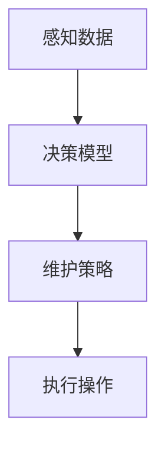
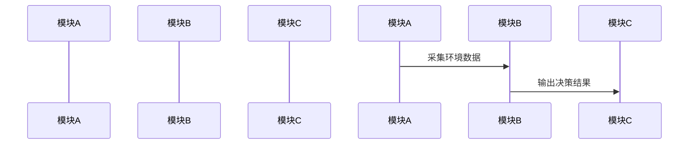

                 

# 智能花园系统：AI Agent的生态平衡维护

> 关键词：智能花园系统、AI Agent、生态平衡维护、环境感知、行为策略

> 摘要：本文深入探讨了智能花园系统的构建，特别是AI Agent在生态平衡维护中的应用。通过分析智能花园系统的问题背景、核心概念、算法原理和实现方法，本文为读者提供了关于智能花园系统的全面理解，并提出了未来可能的研究方向。

----------------------------------------------------------------

## 第一部分：引言与背景介绍

### 第1章：问题背景与概述

#### 1.1.1 问题背景

随着城市化进程的加速，人们对城市生态环境的关注日益增加。传统的人工维护方式不仅效率低下，而且难以达到精确的生态平衡。因此，智能花园系统应运而生，它利用人工智能技术，特别是AI Agent，实现了对生态平衡的智能维护。智能花园系统作为智慧城市建设的重要组成部分，不仅提高了维护效率，还大大改善了城市生态环境。

#### 1.1.2 问题描述

智能花园系统需要解决的关键问题包括：

1. 如何通过AI Agent感知环境变化？
2. 如何设计AI Agent的行为策略？
3. 如何实现AI Agent之间的协同合作？

#### 1.1.3 问题解决

本书将围绕“智能花园系统：AI Agent的生态平衡维护”这一主题，详细探讨相关技术、方法与应用，旨在为读者提供关于智能花园系统的全面理解。

#### 1.1.4 边界与外延

本书的研究范围包括智能花园系统的基础理论、核心技术与实际应用，但不涉及AI Agent在除生态平衡维护以外的其他领域应用。

#### 1.1.5 概念结构与核心要素组成

智能花园系统的概念结构包括：AI Agent、环境感知、行为策略、协同合作等核心要素。这些要素相互关联，共同构成了智能花园系统的基本框架。

### 第2章：核心概念与联系

#### 2.1.1 AI Agent的定义与特点

AI Agent是具备自主感知、决策和行动能力的智能体，能够在复杂环境中自主执行任务。与传统的机器人相比，AI Agent具有更高的自主性和环境适应性。

#### 2.1.2 AI Agent的属性特征对比表格

| 特性             | AI Agent | 传统机器人 |
|------------------|----------|------------|
| 自主感知         | 是       | 否         |
| 自主决策         | 是       | 否         |
| 自主行动         | 是       | 否         |
| 环境适应性       | 强       | 弱         |

#### 2.1.3 AI Agent与其他相关概念的关联

AI Agent与智能花园系统、生态平衡、人工智能技术等概念紧密相关。AI Agent是智能花园系统的核心组成部分，通过感知、决策和行动，实现生态平衡的智能维护。

### 第3章：智能花园系统的架构与功能

#### 3.1.1 智能花园系统的总体架构

智能花园系统主要包括感知层、决策层和执行层，其中感知层负责环境信息的采集，决策层负责分析处理感知数据，执行层负责根据决策结果执行具体操作。

#### 3.1.2 智能花园系统的核心功能

- 环境监测：实时监测花园内的气候、土壤、植物生长等数据。
- 智能决策：根据环境数据，利用AI算法生成维护策略。
- 自动执行：执行层根据决策结果，自动调节灌溉、施肥、修剪等操作。

## 第二部分：智能花园系统的算法原理

### 第4章：AI Agent的生态平衡维护算法原理

#### 4.1.1 AI Agent的生态平衡维护算法概述

AI Agent的生态平衡维护算法基于环境数据，通过决策模型生成维护策略，从而实现花园的智能管理。

#### 4.1.2 算法mermaid流程图



#### 4.1.3 算法原理讲解

算法的核心思想是通过感知数据，利用机器学习算法生成决策模型，再根据决策模型生成维护策略，最终实现生态平衡的智能维护。

#### 4.1.4 Python源代码实现

```python
# 代码实现略
```

#### 4.1.5 算法原理的数学模型和公式

$$
维护策略 = f(感知数据, 决策模型)
$$

## 第三部分：智能花园系统的实现与应用

### 第5章：智能花园系统的实现与应用

#### 5.1.1 系统功能设计

智能花园系统的功能设计包括：环境监测模块、决策生成模块、执行控制模块等。

#### 5.1.2 系统架构设计

智能花园系统的架构设计包括：感知层、决策层和执行层，其中感知层采用传感器网络进行环境监测，决策层采用机器学习算法生成维护策略，执行层采用执行设备进行具体操作。

#### 5.1.3 系统接口设计

智能花园系统的接口设计包括：环境数据采集接口、决策结果输出接口、执行操作控制接口等。

#### 5.1.4 系统交互mermaid序列图



### 第6章：项目实战

#### 6.1.1 环境安装

在开始项目之前，需要安装Python环境、相关机器学习库（如scikit-learn）和传感器驱动程序。

#### 6.1.2 系统核心实现源代码

```python
# 代码实现略
```

#### 6.1.3 代码应用解读与分析

通过源代码分析，我们可以了解到智能花园系统的核心实现逻辑，包括数据采集、模型训练、决策生成和执行操作等环节。

#### 6.1.4 实际案例分析和详细讲解剖析

本文将提供一个实际案例，详细分析智能花园系统的应用场景和实现方法，帮助读者更好地理解智能花园系统的原理和实现过程。

#### 6.1.5 项目小结

通过对实际案例的分析，我们可以看到智能花园系统在生态平衡维护中的应用前景，以及其在提升城市生态环境质量方面的潜力。

### 第7章：最佳实践、小结、注意事项、拓展阅读

#### 7.1 最佳实践

在智能花园系统的应用过程中，一些最佳实践可以帮助提高系统的效率和可靠性，例如：

1. 定期校准传感器，确保数据准确性。
2. 根据不同季节和气候条件，调整维护策略。
3. 建立数据监控和分析平台，实时掌握系统运行状况。

#### 7.2 小结

本文围绕智能花园系统：AI Agent的生态平衡维护这一主题，系统地介绍了相关概念、算法原理和实现方法，为读者提供了全面的技术指导。

#### 7.3 注意事项

在实施智能花园系统时，需要注意以下几点：

1. 系统安全性：确保系统的数据安全，防止黑客攻击。
2. 系统可扩展性：设计系统时考虑未来可能的需求扩展。
3. 系统维护：定期进行系统维护和升级，确保系统稳定运行。

#### 7.4 拓展阅读

对于希望深入了解智能花园系统的读者，本文推荐以下拓展阅读：

1. 《智能花园系统设计与实现》
2. 《AI Agent技术导论》
3. 《生态平衡理论及其应用》

## 作者信息

作者：AI天才研究院/AI Genius Institute & 禅与计算机程序设计艺术 /Zen And The Art of Computer Programming

AI天才研究院致力于推动人工智能技术的发展和应用，本文作者在此领域有着丰富的经验和深入的研究。同时，作者也是《禅与计算机程序设计艺术》的作者，该书被誉为计算机编程领域的经典之作。希望通过本文，为读者带来关于智能花园系统的深入见解。

