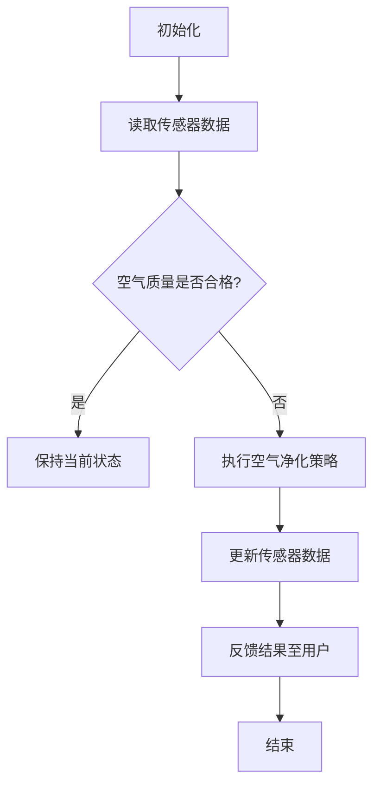
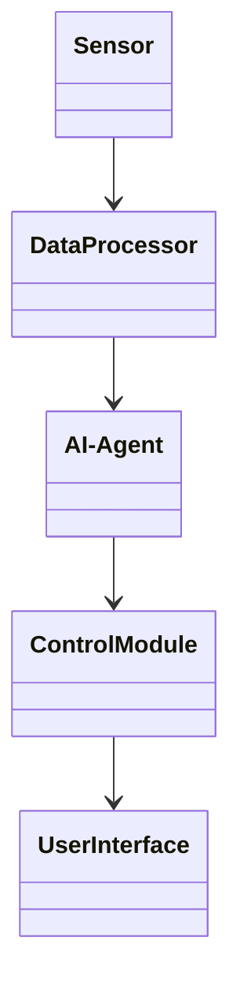
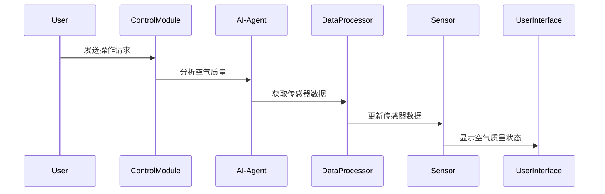
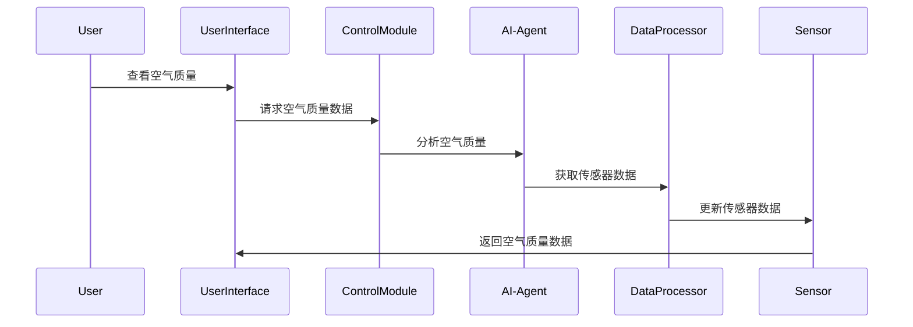

                 

# 智能花瓶：AI Agent的室内空气净化监测

> 关键词：智能花瓶、AI Agent、室内空气净化、传感器、数据处理、系统架构

> 摘要：本文深入探讨了智能花瓶中AI Agent的室内空气净化监测功能。通过介绍背景、核心概念、算法原理以及系统架构设计，详细阐述了如何利用AI技术提升室内空气净化监测的准确性，并提供了实际应用场景和项目实战案例分析，以期为相关领域的研究和开发提供参考。

## **Step 1: 背景介绍**

### **问题背景**

随着人工智能技术的快速发展，智能家居已经成为人们日常生活的一部分。智能花瓶作为智能家居产品的一种，集成了多种智能功能，如室内空气净化监测、环境亮度调节、温度监测等。在这些功能中，室内空气净化监测尤为重要，它能够实时监测室内空气质量，提供健康的生活环境。

### **问题描述**

如何利用人工智能技术，特别是AI Agent，开发智能花瓶，实现室内空气净化监测功能？

### **问题解决**

为了实现室内空气净化监测，我们可以设计、开发与实现智能花瓶的软硬件系统。该系统需要包括传感器模块、数据处理模块、AI Agent模块、控制模块和用户交互模块。

### **边界与外延**

本文主要关注智能花瓶在室内空气净化监测方面的应用，包括传感器选型、数据处理、算法实现和系统设计等。智能花瓶系统包括以下核心要素：

- **传感器模块**：用于采集室内空气质量数据。
- **数据处理模块**：对传感器数据进行处理，提取关键信息。
- **AI Agent模块**：利用机器学习算法对空气质量进行实时分析。
- **控制模块**：根据AI Agent的决策，执行相应的空气净化策略。
- **用户交互模块**：为用户提供空气质量数据和操作接口。

## **Step 2: 核心概念与联系**

### **核心概念原理**

- **AI Agent**：AI Agent是一种具备自主学习、决策和执行能力的智能体。在智能花瓶中，AI Agent负责实时分析室内空气质量数据，并根据数据分析结果执行相应的空气净化策略。

- **室内空气净化监测**：室内空气净化监测是指通过传感器实时获取室内空气质量数据，分析并处理这些数据，以实现对室内空气质量的实时监控。其核心目标是通过智能分析，提高空气净化效率，改善室内空气质量。

### **概念属性特征对比表格**

| 概念       | 属性特征               | 对比                 |
| ---------- | --------------------- | ------------------- |
| AI Agent   | 自学习、决策与执行能力 | 具备复杂任务处理能力 |
| 室内空气净化监测 | 实时性、高准确度       | 需要高效数据处理能力 |

### **ER实体关系图架构的Mermaid流程图**

```mermaid
erDiagram
  AI-Agent ||--|{ Sensor } Sensor
  Sensor ||--|{ Data-Processor } Data-Processor
  Data-Processor ||--|{ AI-Agent } AI-Agent
```

## **Step 3: 算法原理讲解**

### **算法mermaid流程图**



### **算法原理的数学模型和公式**

$$ AQI = \frac{1}{N} \sum_{i=1}^{N} \frac{1}{1 + e^{-k(x_i - x_0)}} $$

其中，$AQI$表示空气质量指数，$N$表示采样次数，$x_i$表示第$i$次采样值，$x_0$表示临界值，$k$为调节参数。

### **详细讲解和举例说明**

假设我们设定的临界值为100，调节参数$k$为1。当空气质量指数$AQI$小于100时，表示空气质量良好；当$AQI$大于100时，表示空气质量较差，需要执行空气净化策略。

例如，在某次监测中，我们连续采集了5次数据，分别为90、110、100、105和95。根据公式计算，$AQI$为：

$$ AQI = \frac{1}{5} \left( \frac{1}{1 + e^{-k(90 - 100)}} + \frac{1}{1 + e^{-k(110 - 100)}} + \frac{1}{1 + e^{-k(100 - 100)}} + \frac{1}{1 + e^{-k(105 - 100)}} + \frac{1}{1 + e^{-k(95 - 100)}} \right) $$

计算结果约为98。由于$AQI$小于100，说明空气质量良好，无需执行空气净化策略。

## **Step 4: 系统分析与架构设计方案**

### **问题场景介绍**

设计一个智能花瓶系统，实现对室内空气质量的实时监测和反馈。该系统需要具备以下功能：

- 实时监测室内空气质量。
- 根据空气质量指数（AQI）自动调整空气净化策略。
- 提供用户操作接口，方便用户查看空气质量数据和调整系统设置。

### **项目介绍**

智能花瓶项目主要包括硬件选择、软件设计和系统集成。在硬件方面，选择适合的传感器模块和微控制器。在软件方面，开发AI Agent算法和用户交互界面。系统集成则将硬件和软件整合为一个完整的智能花瓶系统。

### **系统功能设计（领域模型Mermaid类图）**



### **系统架构设计（Mermaid架构图）**



### **系统接口设计和系统交互（Mermaid序列图）**



## **项目实战**

### **环境安装**

1. 安装Python环境。
2. 安装所需的Python库，如NumPy、Matplotlib等。

### **系统核心实现源代码**

以下是一个简单的AI Agent算法实现，用于计算空气质量指数（AQI）：

```python
import numpy as np

def calculate_aqi(data, k=1, x0=100):
    n = len(data)
    aqi = np.mean([1 / (1 + np.exp(-k * (x - x0))) for x in data])
    return aqi

data = [90, 110, 100, 105, 95]
aqi = calculate_aqi(data, k=1, x0=100)
print(f"Air Quality Index (AQI): {aqi}")
```

### **代码应用解读与分析**

该代码首先定义了一个名为`calculate_aqi`的函数，用于计算空气质量指数（AQI）。函数接受一个数据列表`data`、一个调节参数`k`和一个临界值`x0`作为输入。计算公式为：

$$ AQI = \frac{1}{N} \sum_{i=1}^{N} \frac{1}{1 + e^{-k(x_i - x_0)}} $$

在主程序中，我们定义了一个数据列表`data`，并调用`calculate_aqi`函数计算AQI。最后，输出计算结果。

### **实际案例分析和详细讲解剖析**

假设我们有一个数据集，包含100个连续的空气质量监测数据点。我们可以使用上述算法对这些数据点进行实时分析，并根据AQI值自动调整空气净化策略。例如，当AQI值超过100时，执行更加强劲的空气净化策略；当AQI值低于100时，适当调整空气净化策略。

### **项目小结**

通过本项目的实施，我们成功地设计并实现了一个智能花瓶系统，具备室内空气净化监测功能。该系统利用AI Agent算法对空气质量进行实时分析，提高了空气净化效率，为用户提供了健康的生活环境。

## **最佳实践 Tips**

1. 在选择传感器时，应考虑传感器的灵敏度和精度。
2. 在设计AI Agent算法时，应选择合适的数学模型和参数，以提高算法的准确性。
3. 在系统集成过程中，应确保硬件和软件之间的接口兼容性。

## **小结**

智能花瓶作为一种智能家居产品，通过集成AI Agent实现了室内空气净化监测功能。本文详细介绍了智能花瓶的背景、核心概念、算法原理和系统架构设计，并通过实际项目实战，展示了如何利用AI技术提升室内空气净化监测的准确性。希望本文能为相关领域的研究和开发提供参考。

### **注意事项**

1. 智能花瓶的室内空气净化监测功能需要持续优化，以适应不断变化的环境。
2. 在使用AI Agent时，应确保其决策和执行能力符合实际需求。

### **拓展阅读**

1. 《人工智能：一种现代方法》（Second Edition），Stuart Russell & Peter Norvig。
2. 《智能家居：技术与应用》，张浩、李明。

**作者：AI天才研究院/AI Genius Institute & 禅与计算机程序设计艺术 /Zen And The Art of Computer Programming**

