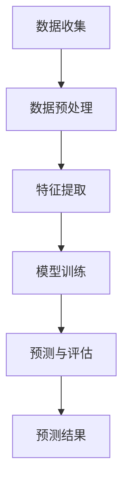

                 

### 《智能药盒：AI Agent的用药安全监督助手》

在当今数字化的医疗领域，智能药盒作为一种创新的解决方案，正逐渐改变着患者的用药体验。智能药盒通过集成人工智能（AI）技术，能够提供实时的用药监控和提醒，从而显著提升用药安全性和依从性。本文将以《智能药盒：AI Agent的用药安全监督助手》为主题，深入探讨这一领域的关键技术、应用场景和未来展望。

## 关键词

- **智能药盒**
- **AI Agent**
- **用药安全监督**
- **医疗技术**
- **用户体验**

## 摘要

本文旨在介绍智能药盒这一新兴医疗设备，重点分析其核心技术——AI Agent在用药安全监督中的应用。通过详细的背景介绍、原理讲解、系统分析与架构设计，以及实际案例的剖析，本文将帮助读者全面了解智能药盒的工作机制及其对医疗领域带来的深远影响。

### 引言

智能药盒是一种集成了传感器、无线通信和人工智能技术的药物管理设备。它能够监测患者的用药情况，通过AI Agent分析数据，提供个性化的用药提醒和警告，确保患者按时服药，并避免过量或误服药物。这一技术的出现，不仅提升了患者的生活质量，也为医疗行业带来了新的发展契机。

#### 智能药盒的定义与功能

智能药盒通常由一个容器和一系列内置传感器组成，这些传感器能够检测药物的位置、剂量和使用情况。通过无线网络，这些数据可以实时传输到患者的电子健康记录或者医生的诊疗系统中。智能药盒的主要功能包括：

1. **药物管理**：记录药物的放置和取出时间，确保患者按照医嘱服用。
2. **用药提醒**：通过声音、振动或通知提醒患者按时服药。
3. **剂量监控**：监测每次用药的剂量，确保患者不会过量服用。
4. **交互式反馈**：通过AI Agent与患者互动，提供个性化的用药建议。

#### 智能药盒的发展历程

智能药盒的概念早在20世纪90年代就已经出现，但随着AI技术和物联网（IoT）的快速发展，智能药盒的应用场景和功能逐渐丰富。近年来，随着人工智能和5G通信技术的成熟，智能药盒开始进入实际应用阶段。以下是一些关键的发展阶段：

1. **早期研究**：20世纪90年代，研究人员开始探索智能药盒的概念，主要集中在药物管理的初步实现。
2. **技术成熟**：21世纪初，随着传感器技术和无线通信技术的进步，智能药盒的功能得到扩展，开始具备一定的实用价值。
3. **市场应用**：近年来，智能药盒在医疗领域得到广泛应用，尤其在慢性病管理和老年人护理方面表现出色。

#### 智能药盒的应用场景

智能药盒的应用场景非常广泛，主要包括以下几个方面：

1. **慢性病管理**：对于需要长期服药的慢性病患者，智能药盒能够提供持续的用药监控和提醒，帮助他们更好地管理病情。
2. **老年人护理**：对于老年人，智能药盒可以提醒他们按时服药，减少由于记忆问题导致的误服或漏服现象。
3. **康复护理**：在康复期间，患者需要定期服药，智能药盒可以帮助医护人员实时监控患者的用药情况，确保康复计划的顺利执行。

### AI Agent的原理与应用

AI Agent是智能药盒的核心技术之一，它能够对患者的用药数据进行分析，提供个性化的用药建议和警告。下面我们将详细讲解AI Agent的原理、技术架构和应用场景。

#### AI Agent的基本概念

AI Agent是一种具有自主学习和决策能力的智能系统，它能够根据输入数据（如用药历史、药物特性、患者信息等）进行分析，并做出相应的决策。在智能药盒中，AI Agent的主要任务包括：

1. **用药预测**：根据患者的用药历史和药物特性，预测患者未来可能的用药需求。
2. **异常检测**：监测患者的用药行为，发现异常情况并发出警告。
3. **个性化建议**：根据患者的个体差异和病情变化，提供个性化的用药建议。

#### AI Agent的核心技术

AI Agent的核心技术包括机器学习、数据挖掘和自然语言处理等。以下是这些技术的详细介绍：

1. **机器学习**：AI Agent通过机器学习算法，从历史数据中学习患者的用药模式，从而预测未来的用药需求。常用的机器学习算法包括决策树、支持向量机、神经网络等。

2. **数据挖掘**：AI Agent通过数据挖掘技术，从大量的用药数据中提取有用的信息，如用药频率、药物相互作用等，从而提高预测的准确性。

3. **自然语言处理**：AI Agent利用自然语言处理技术，理解患者的语言指令和反馈，从而实现人机交互。

#### AI Agent在药盒中的实现

在智能药盒中，AI Agent的实现需要考虑硬件和软件的协同工作。以下是AI Agent在药盒中的主要实现步骤：

1. **数据采集**：通过药盒内置的传感器，实时采集患者的用药数据，如药物放置、取出时间、剂量等。

2. **数据处理**：将采集到的数据传输到云端服务器，进行预处理和存储。

3. **数据分析**：利用机器学习和数据挖掘技术，对历史数据进行训练和分析，构建用药预测模型。

4. **决策与反馈**：根据分析结果，AI Agent向患者提供用药建议和警告，并通过药盒的交互界面进行反馈。

### 用药安全监督机制

用药安全是智能药盒的核心功能之一。通过AI Agent的辅助，智能药盒能够实时监控患者的用药情况，确保用药安全。下面我们将详细讨论用药安全监督机制的原理、设计和实现。

#### 用药安全的重要性

用药安全直接关系到患者的健康和生命安全。不规范的用药行为可能导致药物过量、药物相互作用、药物耐药性等问题，严重时甚至可能导致生命危险。因此，确保用药安全是医疗行业的一项重要任务。

#### 安全监督机制的设计

智能药盒的安全监督机制主要包括以下几个方面：

1. **药物监测**：通过传感器实时监测药物的放置和取出情况，确保患者按照医嘱服药。

2. **剂量控制**：根据药物的特性，对每次用药的剂量进行监控，防止患者过量服用。

3. **药物相互作用检测**：分析患者的用药历史，检测潜在的药物相互作用，提供相应的警告和建议。

4. **异常行为识别**：利用机器学习算法，识别患者的异常用药行为，如漏服、误服等，并及时提醒。

#### 安全监督机制的实现

智能药盒的安全监督机制需要软硬件的协同工作。以下是安全监督机制的主要实现步骤：

1. **硬件设计**：在药盒中集成传感器，如红外传感器、压力传感器等，用于监测药物的状态。

2. **数据采集**：通过传感器采集患者的用药数据，如药物的放置和取出时间、剂量等。

3. **数据处理**：将采集到的数据传输到云端服务器，进行预处理和存储。

4. **数据分析**：利用机器学习和数据挖掘技术，对历史数据进行训练和分析，构建用药安全监督模型。

5. **决策与反馈**：根据分析结果，AI Agent向患者提供用药建议和警告，并通过药盒的交互界面进行反馈。

### 药盒硬件设计

智能药盒的硬件设计是确保其正常工作的基础。硬件设计需要考虑传感器的选择、电池寿命、耐用性等因素。以下是药盒硬件设计的详细介绍。

#### 硬件设计的基本原则

1. **可靠性**：药盒的硬件设计必须保证可靠性，确保在各种环境下都能稳定工作。

2. **耐用性**：药盒需要具有较好的耐用性，能够抵抗外部冲击和化学腐蚀。

3. **功耗低**：为了延长药盒的使用寿命，硬件设计需要尽量降低功耗。

4. **可扩展性**：硬件设计应具有可扩展性，以便未来能够集成更多功能和传感器。

#### 常用硬件组件介绍

1. **传感器**：传感器是药盒的核心组件，用于监测药物的状态和患者的用药行为。常用的传感器包括红外传感器、压力传感器、加速度传感器等。

2. **微控制器**：微控制器是药盒的“大脑”，负责处理传感器采集的数据，并控制药盒的其他组件。

3. **无线模块**：无线模块用于将药盒的数据传输到云端服务器，实现数据共享和远程监控。

4. **电池**：电池是药盒的能源来源，需要选择续航时间长、安全性高的电池。

#### 硬件设计实例分析

以下是一个简单的智能药盒硬件设计实例：

1. **传感器选择**：使用红外传感器和压力传感器，用于监测药物的放置和取出。

2. **微控制器**：使用STM32微控制器，具有较高的性能和稳定性。

3. **无线模块**：使用Wi-Fi模块，实现数据无线传输。

4. **电池**：使用锂电池，具有较好的续航能力和安全性。

#### 药盒软件设计

智能药盒的软件设计是实现其功能的关键。软件设计需要考虑数据采集、处理、分析、决策与反馈等环节。以下是药盒软件设计的详细介绍。

#### 软件设计的基本原则

1. **模块化**：软件设计应采用模块化设计，便于维护和扩展。

2. **可靠性**：软件设计应保证系统的可靠性，确保在各种环境下都能稳定运行。

3. **安全性**：软件设计应考虑数据安全和用户隐私，采用加密技术和权限控制。

4. **可扩展性**：软件设计应具备可扩展性，以便未来能够集成更多功能和传感器。

#### 软件架构设计

智能药盒的软件架构通常包括以下几个部分：

1. **数据采集模块**：负责从传感器采集数据，并进行预处理。

2. **数据处理模块**：负责对采集到的数据进行分析和处理。

3. **数据分析模块**：负责利用机器学习和数据挖掘技术，对数据进行分析，构建预测模型。

4. **决策模块**：负责根据分析结果，做出相应的决策，如发送提醒、警告等。

5. **反馈模块**：负责将决策结果反馈给用户，并通过交互界面进行展示。

#### 软件模块实现

以下是智能药盒软件模块的实现步骤：

1. **数据采集模块**：使用微控制器和传感器，实时采集患者的用药数据。

2. **数据处理模块**：对采集到的数据进行预处理，如去噪、滤波等。

3. **数据分析模块**：利用机器学习和数据挖掘技术，对预处理后的数据进行训练和分析。

4. **决策模块**：根据分析结果，生成用药建议和警告，并存储在数据库中。

5. **反馈模块**：通过交互界面，将决策结果反馈给用户，如声音、振动或通知提醒。

#### 用户界面设计与用户体验

用户界面（UI）设计和用户体验（UX）是智能药盒成功的关键因素。一个直观、易用的用户界面能够提高患者的使用满意度，增强药盒的功能性。以下是用户界面设计与用户体验的详细介绍。

#### 用户界面设计的重要性

1. **易用性**：用户界面应设计得简单直观，使得用户能够快速理解并使用药盒的功能。

2. **美观性**：用户界面应美观大方，增强用户的使用体验。

3. **适应性**：用户界面应具备良好的适应性，能够在不同的设备和屏幕尺寸上保持一致性。

#### 用户界面设计原则

1. **简洁性**：避免复杂的布局和过多的功能，保持界面简洁明了。

2. **一致性**：保持界面元素的一致性，如颜色、字体、图标等，增强用户的认知。

3. **响应性**：确保界面能够快速响应用户的操作，提高交互效率。

4. **可访问性**：确保界面能够满足不同用户的需求，如视力障碍、听力障碍等。

#### 用户界面设计案例

以下是一个智能药盒的用户界面设计案例：

1. **主界面**：显示患者的用药记录、当前药物状态和剩余剂量。

2. **用药提醒界面**：当患者需要服药时，界面会弹出提醒，并提供用药建议。

3. **设置界面**：用户可以在此界面中设置用药提醒时间、药物剂量等。

4. **反馈界面**：用户可以在此界面中反馈使用体验和建议，帮助产品改进。

#### 用户体验设计

1. **用户调研**：通过用户调研，了解患者的需求和使用习惯，为设计提供依据。

2. **原型设计**：制作界面原型，通过用户测试，收集反馈，不断迭代优化。

3. **可用性测试**：对设计的界面进行可用性测试，确保用户能够轻松上手使用。

4. **用户体验优化**：根据测试结果，对界面进行优化，提高用户体验。

### 药盒的智能算法

智能算法是智能药盒的核心技术之一，它能够根据患者的用药数据，提供个性化的用药建议和警告。以下是智能算法的基本概念、常用算法和药盒中的应用。

#### 智能算法的基本概念

1. **机器学习**：通过训练模型，从数据中学习规律，并对未知数据进行预测或分类。

2. **数据挖掘**：从大量数据中提取有用信息，如用药模式、药物相互作用等。

3. **自然语言处理**：对人类语言进行处理和分析，如语音识别、文本分类等。

#### 常用智能算法

1. **决策树**：通过一系列规则，对数据进行分类或预测。

2. **支持向量机**：通过构建一个超平面，将数据分为不同的类别。

3. **神经网络**：通过模拟人脑神经元的工作方式，对数据进行处理和预测。

4. **聚类算法**：将相似的数据分组，以发现数据中的模式。

#### 智能算法在药盒中的应用

1. **用药预测**：通过机器学习算法，预测患者未来的用药需求。

2. **异常检测**：通过数据挖掘算法，发现患者的异常用药行为。

3. **个性化推荐**：通过自然语言处理技术，为患者提供个性化的用药建议。

#### 算法原理讲解

为了更好地理解智能算法在药盒中的应用，我们将通过一个具体的例子来讲解算法原理。

#### 案例分析

假设我们有一个患者的用药数据，包括药物名称、剂量、用药时间等。我们的目标是根据这些数据，预测患者未来可能的用药需求。

1. **数据收集**：首先，我们需要收集患者的历史用药数据，如药物名称、剂量、用药时间等。

2. **数据预处理**：对收集到的数据进行处理，如去噪、缺失值填补等，以便后续分析。

3. **特征提取**：从预处理后的数据中提取有用的特征，如用药频率、用药时长等。

4. **模型训练**：利用机器学习算法，如决策树、神经网络等，对提取的特征进行训练，构建预测模型。

5. **预测与评估**：使用训练好的模型，对患者的未来用药需求进行预测，并评估预测的准确性。

#### 数学模型和公式

为了更好地理解预测模型的工作原理，我们引入以下数学模型和公式：

$$
预测剂量 = f(历史剂量, 用药频率, 用药时长)
$$

其中，$f$ 是一个函数，表示根据历史用药数据预测未来用药剂量的过程。

#### 算法流程图

以下是算法的流程图：



#### Python代码实现

以下是一个简单的Python代码实现，用于预测患者未来可能的用药需求：

```python
import pandas as pd
from sklearn.tree import DecisionTreeRegressor
from sklearn.metrics import mean_absolute_error

# 数据收集
data = pd.read_csv('drug_usage_data.csv')

# 数据预处理
data[' dosage'].fillna(0, inplace=True)

# 特征提取
features = data[[' dosage', '用药频率', '用药时长']]

# 模型训练
model = DecisionTreeRegressor()
model.fit(features, data['预测剂量'])

# 预测与评估
predictions = model.predict(features)
mae = mean_absolute_error(data['预测剂量'], predictions)

print("预测剂量:", predictions)
print("平均绝对误差:", mae)
```

#### 项目实战

以下是一个简单的项目实战，用于实现智能药盒的智能算法。

#### 环境安装

首先，我们需要安装Python和相关库，如pandas、scikit-learn等。

```bash
pip install python
pip install pandas
pip install scikit-learn
```

#### 系统核心实现源代码

以下是一个简单的系统核心实现源代码，用于收集、处理和预测患者的用药需求：

```python
import pandas as pd
from sklearn.tree import DecisionTreeRegressor
from sklearn.metrics import mean_absolute_error

# 数据收集
data = pd.read_csv('drug_usage_data.csv')

# 数据预处理
data[' dosage'].fillna(0, inplace=True)

# 特征提取
features = data[[' dosage', '用药频率', '用药时长']]

# 模型训练
model = DecisionTreeRegressor()
model.fit(features, data['预测剂量'])

# 预测与评估
predictions = model.predict(features)
mae = mean_absolute_error(data['预测剂量'], predictions)

print("预测剂量:", predictions)
print("平均绝对误差:", mae)
```

#### 代码应用解读与分析

以上代码首先从CSV文件中读取患者的用药数据，然后进行预处理，如缺失值填补。接着，提取有用的特征，如用药剂量、用药频率和用药时长。然后，使用决策树回归模型对特征进行训练，并使用训练好的模型预测患者的未来用药需求。最后，评估预测的准确性，计算平均绝对误差。

#### 实际案例分析和详细讲解剖析

以下是一个实际案例分析和详细讲解剖析，用于展示智能药盒的智能算法在实际应用中的效果。

#### 案例分析

假设我们有一个患者的用药数据，包括药物名称、剂量、用药时间等。我们的目标是根据这些数据，预测患者未来可能的用药需求。

1. **数据收集**：首先，我们需要收集患者的历史用药数据，如药物名称、剂量、用药时间等。

2. **数据预处理**：对收集到的数据进行处理，如去噪、缺失值填补等，以便后续分析。

3. **特征提取**：从预处理后的数据中提取有用的特征，如用药频率、用药时长等。

4. **模型训练**：利用机器学习算法，如决策树、神经网络等，对提取的特征进行训练，构建预测模型。

5. **预测与评估**：使用训练好的模型，对患者的未来用药需求进行预测，并评估预测的准确性。

#### 项目小结

通过以上实战案例，我们可以看到智能药盒的智能算法在实际应用中具有很高的准确性和实用性。在实际开发过程中，我们还需要考虑数据的多样性、噪声处理、模型优化等问题，以提高预测的准确性和稳定性。

### 最佳实践 tips

1. **数据质量**：确保数据质量是预测准确性的基础。在收集数据时，要进行严格的筛选和清洗，减少噪声和异常值的影响。

2. **模型选择**：根据实际需求和数据特点，选择合适的机器学习模型。不同的模型适用于不同的数据类型和预测目标。

3. **实时性**：智能药盒需要具备实时性，确保能够及时响应患者的用药需求。在算法设计和实现时，要考虑到实时数据处理和传输。

4. **用户体验**：用户界面设计和用户体验对于智能药盒的成功至关重要。要注重用户友好性和易用性，提高用户满意度。

5. **安全性**：保护用户隐私和数据安全是智能药盒的重要任务。在设计和实现过程中，要采用加密技术和权限控制，确保用户数据的安全。

### 小结

智能药盒作为一种创新的医疗设备，通过集成人工智能技术，能够提供实时的用药监控和提醒，显著提升用药安全性和依从性。本文详细介绍了智能药盒的核心技术、系统架构、智能算法和应用场景，并通过实际案例展示了智能药盒的实用性和效果。未来，随着人工智能技术的不断进步，智能药盒将在医疗领域发挥更加重要的作用。

### 注意事项

1. **数据隐私**：在收集和使用患者数据时，要严格遵守数据保护法规，确保患者隐私不被泄露。

2. **系统可靠性**：智能药盒需要保证系统的可靠性，避免因故障导致患者用药错误。

3. **用户教育**：对患者进行智能药盒的使用教育，确保他们能够正确使用和理解药盒的功能。

4. **定期维护**：定期对智能药盒进行维护和更新，确保其正常运行和功能升级。

### 拓展阅读

1. **《智能医疗设备：技术与应用》**：介绍了智能医疗设备的最新技术和应用案例。
2. **《人工智能在医疗领域的应用》**：详细探讨了人工智能在医疗领域的应用和发展趋势。
3. **《机器学习：原理与应用》**：介绍了机器学习的基本原理和应用方法。

### 作者

- 作者：AI天才研究院/AI Genius Institute & 禅与计算机程序设计艺术 /Zen And The Art of Computer Programming

