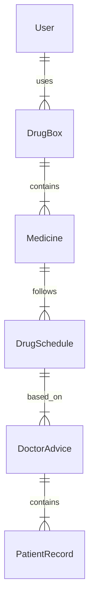

                 

### 第1章: 引言

#### 1.1 问题背景

在当今社会，随着人口老龄化趋势的加剧和慢性疾病发病率的提高，药物管理成为了一个重要的公共健康问题。老年人由于记忆力下降、生活习惯改变等因素，常常会出现忘记服药或服用错误药物的情况，这不仅会影响治疗效果，还可能导致严重的健康风险。此外，慢性病患者由于需要长期服药，药物的依从性也是一个亟待解决的问题。

#### 1.2 问题描述

问题描述主要集中在以下几个方面：

- **药物管理问题**：老年人如何有效管理自己的药物，确保按时服药、正确服药。
- **药物提醒问题**：如何及时提醒患者服药，以及提醒方式是否方便、有效。
- **药物监控问题**：如何监控患者的药物使用情况，及时发现并解决问题。

#### 1.3 问题解决

智能药盒作为一种新型的药物管理设备，通过引入人工智能技术，为上述问题提供了解决方案。智能药盒能够：

- **自动提醒**：通过传感器和AI算法，自动检测药物是否被取出，并在规定时间提醒患者服药。
- **数据监控**：记录患者的用药情况，包括药物取用时间、剂量等，为医生和患者提供决策支持。
- **个性化服务**：根据患者的病史和药物使用习惯，提供个性化的用药建议。

#### 1.4 边界与外延

智能药盒的边界主要涉及以下几个方面：

- **硬件边界**：包括药盒的物理结构、传感器类型和数量等。
- **软件边界**：包括AI算法的设计和实现、数据存储和处理等。
- **应用边界**：包括智能药盒的适用人群、应用场景等。

智能药盒的外延则包括：

- **系统集成**：与其他健康管理系统（如智能手表、医疗设备等）的数据集成和功能整合。
- **扩展服务**：包括远程医疗咨询、药物配送等附加服务。

#### 1.5 概念结构与核心要素组成

智能药盒的概念结构可以分为以下几个核心要素：

- **传感器**：用于检测药物是否被取出的硬件设备，如重量传感器、红外传感器等。
- **AI Agent**：用于分析传感器数据、提供用药提醒和管理的软件模块。
- **用户界面**：用于与用户交互的图形界面，显示用药提醒、用药记录等信息。
- **数据存储**：用于存储用药数据，包括患者的个人信息、药物信息、用药历史等。
- **网络通信**：用于智能药盒与外部系统（如医生工作站、药品配送系统等）的数据传输。

这些要素相互配合，共同构成了智能药盒的系统架构，为药物管理提供了一套完整的解决方案。

---

### 第2章: 核心概念与联系

#### 2.1 智能药盒的定义与特性

智能药盒是一种集成了传感器、AI算法和用户界面的药物管理设备，其主要特性包括：

- **自动提醒功能**：通过内置传感器，自动检测药物是否被取出，并按预定时间向用户发送提醒。
- **数据记录与监控**：记录每次药物取用的时间、剂量等信息，供医生和患者参考。
- **个性化服务**：根据用户的历史用药记录和个性化需求，提供针对性的用药建议。

智能药盒的主要组成部分有：

- **药盒本体**：物理容器，用于存放药物，内置传感器用于检测药物取用。
- **传感器模块**：包括重量传感器、红外传感器等，用于检测药物取用状态。
- **AI模块**：用于处理传感器数据，实现用药提醒和数据分析。
- **用户界面**：提供交互界面，显示用药提醒、用药记录等信息。

#### 2.2 AI Agent的定义与作用

AI Agent，即人工智能代理，是一种能够自动执行任务、进行决策和互动的计算机程序。在智能药盒中，AI Agent的作用主要包括：

- **用药提醒**：根据药物使用规则和用户习惯，自动生成提醒信息，并在规定时间发送给用户。
- **数据分析**：分析用户的用药记录，为医生和患者提供用药反馈和健康建议。
- **异常检测**：监测药物使用情况，发现可能的异常情况，并及时通知用户和医生。

AI Agent的基本组成部分有：

- **感知模块**：用于接收传感器数据，如药物取用状态、环境信息等。
- **决策模块**：根据感知模块的数据，生成相应的提醒或反馈。
- **行动模块**：执行决策模块生成的操作，如发送提醒信息、记录数据等。

#### 2.3 用药提醒与管理系统的架构

用药提醒与管理系统的架构可以分为以下几个层次：

- **感知层**：包括传感器模块，负责收集药物使用数据。
- **数据处理层**：包括AI模块，负责处理感知层收集到的数据，实现用药提醒和数据分析。
- **应用层**：包括用户界面，用于与用户交互，显示用药提醒和用药记录等信息。
- **数据存储层**：用于存储用户的用药数据，包括个人信息、药物信息、用药历史等。

#### 2.4 概念属性特征对比表格

| 概念       | 定义                                                         | 特性                                                         |
| ---------- | ------------------------------------------------------------ | ------------------------------------------------------------ |
| 智能药盒   | 集成传感器、AI算法和用户界面的药物管理设备                     | 自动提醒、数据记录与监控、个性化服务                           |
| AI Agent   | 一种能够自动执行任务、进行决策和互动的计算机程序               | 用药提醒、数据分析、异常检测                                 |
| 传感器模块 | 负责检测药物取用状态的硬件设备                               | 重量传感器、红外传感器等                                     |
| 用户界面   | 提供交互界面，显示用药提醒、用药记录等信息                     | 图形用户界面、触摸屏交互                                     |

#### 2.5 ER实体关系图架构

在上面的ER图（Entity-Relationship diagram）中，我们定义了以下几个实体：

- **User（用户）**：代表使用智能药盒的个人，具有个人信息和用药历史。
- **DrugBox（药盒）**：代表智能药盒本身，与用户存在关联。
- **Medicine（药物）**：代表药盒中的药物，一个药盒可以包含多种药物。
- **DrugSchedule（用药计划）**：代表患者的用药时间表，每种药物都有特定的用药计划。
- **DoctorAdvice（医生建议）**：代表医生对患者的用药建议，包括用药频率、剂量等。
- **PatientRecord（患者记录）**：代表患者的用药记录，包括每次用药的时间、剂量等信息。

这些实体之间存在一定的关联关系，如用户使用药盒、药盒包含药物、药物遵循用药计划、用药计划基于医生建议等。

---

### 第3章: AI Agent的基本原理

#### 3.1 AI Agent的定义与分类

AI Agent，即人工智能代理，是一种模拟人类智能行为的计算机程序。它可以自主感知环境、制定计划、执行任务，并在执行过程中不断学习和优化。根据不同的应用场景和功能需求，AI Agent可以分类如下：

- **基于规则的AI Agent**：根据预设的规则和条件进行决策和执行，如智能药盒中的用药提醒功能。
- **基于模型的AI Agent**：通过机器学习模型进行决策和执行，如个性化用药提醒功能。
- **基于仿生的AI Agent**：模拟生物系统中的学习和决策过程，如基于强化学习的AI Agent。

#### 3.2 AI Agent的组成与功能

AI Agent由以下几个核心模块组成：

- **感知模块**：负责收集环境信息，如传感器数据、用户输入等。
- **决策模块**：根据感知模块提供的信息，生成相应的行动策略。
- **执行模块**：执行决策模块生成的行动策略，如发送提醒、记录数据等。
- **学习模块**：通过感知模块和执行模块的反馈，不断优化自身的决策和执行能力。

AI Agent的主要功能包括：

- **任务执行**：根据用户需求，执行如用药提醒、数据记录等任务。
- **决策支持**：根据环境信息和历史数据，为用户或医生提供用药建议。
- **异常检测**：监测药物使用情况，发现可能的异常情况，并及时通知用户和医生。

#### 3.3 AI Agent的核心算法

AI Agent的核心算法主要包括：

- **感知算法**：用于处理感知模块收集到的数据，如信号滤波、特征提取等。
- **决策算法**：用于生成行动策略，如基于规则的推理、机器学习预测等。
- **执行算法**：用于执行决策模块生成的行动策略，如自动发送提醒、更新数据等。
- **学习算法**：用于优化AI Agent的决策和执行能力，如强化学习、神经网络等。

#### 3.4 AI Agent的工作流程

AI Agent的工作流程可以分为以下几个步骤：

1. **感知**：感知模块收集环境信息，如传感器数据、用户输入等。
2. **处理**：处理模块对感知模块收集到的信息进行预处理，如滤波、特征提取等。
3. **决策**：决策模块根据处理后的信息，生成相应的行动策略。
4. **执行**：执行模块根据决策模块生成的行动策略，执行相应任务，如发送提醒、更新数据等。
5. **学习**：学习模块根据执行模块的反馈，不断优化AI Agent的决策和执行能力。

#### 3.5 AI Agent的性能评估

AI Agent的性能评估可以从以下几个方面进行：

- **准确度**：评估AI Agent在感知和决策过程中的准确度，如用药提醒的准确性、异常检测的准确性等。
- **效率**：评估AI Agent在执行任务时的效率，如处理数据的速度、响应时间等。
- **稳定性**：评估AI Agent在长时间运行过程中的稳定性，如是否出现错误、是否需要重新训练等。
- **适应性**：评估AI Agent在面对新环境和新任务时的适应性，如是否能够快速适应变化、是否需要重新训练等。

---

### 第4章: 传感器技术

#### 4.1 传感器技术概述

传感器技术是智能药盒的核心组成部分，用于感知药物取用的状态，从而触发提醒功能。传感器技术的基本概念包括以下几个方面：

- **传感器定义**：传感器是一种能够感知特定信息并将之转换为电信号的装置。
- **传感器分类**：根据感知信息的不同，传感器可以分为温度传感器、湿度传感器、光传感器、压力传感器等。
- **传感器原理**：传感器通常基于物理、化学或生物原理，通过测量某种物理量（如温度、湿度、光线等），将其转换为电信号。

#### 4.2 传感器在智能药盒中的应用

在智能药盒中，常用的传感器包括：

- **重量传感器**：用于检测药盒中药物的总重量，当药物被取出时，重量发生变化，从而触发提醒功能。
- **红外传感器**：用于检测药物取用时的红外信号变化，当药物被取出时，红外信号会发生变化。
- **位移传感器**：用于检测药盒的开合状态，当药盒被打开时，传感器会记录该动作。

传感器在智能药盒中的应用主要包括以下几个方面：

- **自动提醒**：当药物被取出时，传感器检测到重量变化或红外信号变化，触发提醒功能，提醒用户服药。
- **数据记录**：传感器记录药物取用的时间、剂量等信息，为后续的数据分析和决策提供支持。
- **异常检测**：通过传感器数据，可以检测药物取用的异常情况，如药物被误取、漏取等，并及时通知用户和医生。

#### 4.3 传感器的选择与配置

选择和配置传感器时，需要考虑以下几个方面：

- **传感器的灵敏度**：选择灵敏度较高的传感器，以确保能够准确检测药物取用的变化。
- **传感器的稳定性**：选择稳定性较高的传感器，以确保在长时间运行过程中，传感器的性能不受影响。
- **传感器的功耗**：选择功耗较低的传感器，以延长智能药盒的电池寿命。
- **传感器的兼容性**：选择与智能药盒其他组件（如处理器、通信模块等）兼容的传感器。

在配置传感器时，需要根据智能药盒的具体需求，确定传感器的数量、类型和布局。例如，对于重量传感器，可以配置多个，分别检测药盒的不同部分，以提高检测的准确性和可靠性。

#### 4.4 传感器的数据处理

传感器的数据处理主要包括以下几个方面：

- **数据采集**：从传感器收集原始数据，如重量变化、红外信号变化等。
- **数据预处理**：对原始数据进行清洗、滤波、去噪等预处理，以提高数据的准确性和可靠性。
- **特征提取**：从预处理后的数据中提取有用的特征信息，如药物取用时间、剂量等。
- **数据存储**：将处理后的数据存储到数据库或文件中，以供后续分析和使用。

在数据处理过程中，需要特别注意以下几点：

- **数据质量**：确保数据采集和处理的准确性，避免数据丢失或错误。
- **数据安全性**：对敏感数据进行加密处理，确保数据的安全性和隐私保护。
- **数据处理效率**：优化数据处理算法和流程，提高数据处理速度和效率。

---

### 第5章: 数据处理与存储

#### 5.1 数据处理概述

数据处理是智能药盒系统的核心环节，涉及到从传感器采集的数据到最终决策信息的全过程。数据处理的主要步骤包括数据采集、数据预处理、特征提取、数据分析和数据可视化等。

- **数据采集**：通过传感器模块，实时采集药物使用过程中的各种数据，如重量变化、温度、湿度等。
- **数据预处理**：对采集到的原始数据进行清洗、去噪、滤波等处理，以提高数据的质量和可靠性。
- **特征提取**：从预处理后的数据中提取出有代表性的特征，如药物取用时间、剂量、频率等。
- **数据分析**：利用统计学、机器学习等方法，对特征数据进行分析，提取出有用的信息和规律。
- **数据可视化**：将分析结果以图表、报表等形式进行可视化展示，帮助用户和医生直观地了解药物使用情况。

#### 5.2 数据处理流程

数据处理流程可以分为以下几个步骤：

1. **数据采集**：通过传感器实时采集药物使用数据，包括重量、时间、环境参数等。
2. **数据预处理**：对采集到的数据进行清洗、去噪、滤波等预处理，提高数据的质量和可靠性。
3. **特征提取**：从预处理后的数据中提取出有代表性的特征，如药物取用时间、剂量、频率等。
4. **数据存储**：将预处理后的数据存储到数据库或文件中，以供后续分析和使用。
5. **数据分析**：利用统计学、机器学习等方法，对特征数据进行分析，提取出有用的信息和规律。
6. **数据可视化**：将分析结果以图表、报表等形式进行可视化展示，帮助用户和医生直观地了解药物使用情况。
7. **决策生成**：根据分析结果，生成个性化的用药建议和提醒信息，如药物调整、用药时间调整等。

#### 5.3 数据存储方案

数据存储方案是数据处理的重要组成部分，需要考虑数据的安全性、可靠性和访问效率。常见的存储方案包括：

- **关系数据库**：适用于结构化数据存储，如用户信息、药物信息、用药记录等。
- **非关系数据库**：适用于非结构化或半结构化数据存储，如日志文件、传感器数据等。
- **分布式存储系统**：适用于大规模数据存储，提供高可用性和高可扩展性，如Hadoop、Spark等。

在选择数据存储方案时，需要考虑以下几个因素：

- **数据量**：根据数据量的大小，选择合适的存储方案，如关系数据库适用于小规模数据，分布式存储系统适用于大规模数据。
- **访问频率**：根据数据访问的频率，选择合适的存储方案，如热点数据可以选择高速存储方案，冷数据可以选择低成本存储方案。
- **数据安全性**：确保数据的安全性，如采用加密存储、备份和恢复机制等。

#### 5.4 数据安全与隐私保护

数据安全与隐私保护是智能药盒系统设计中的重要问题，需要采取一系列措施来确保数据的安全性和隐私性。

- **数据加密**：对敏感数据进行加密存储，防止数据泄露或篡改。
- **访问控制**：设置严格的访问控制机制，确保只有授权用户才能访问数据。
- **匿名化处理**：对用户数据进行匿名化处理，隐藏真实用户信息。
- **数据备份与恢复**：定期备份数据，确保在数据丢失或损坏时，能够快速恢复数据。

通过以上措施，可以有效保障智能药盒系统的数据安全与隐私保护，为用户和医生提供可靠的用药管理服务。

---

### 第6章: 网络通信

#### 6.1 网络通信基础

网络通信是智能药盒系统的重要组成部分，用于实现药盒与外部系统（如医生工作站、药品配送系统等）的数据传输。网络通信基础包括以下几个核心概念：

- **网络协议**：网络协议是计算机网络中进行数据传输的规则和标准，如TCP/IP协议、HTTP协议等。
- **数据传输方式**：数据传输方式分为有线传输和无线传输，有线传输如以太网、光纤等，无线传输如Wi-Fi、蓝牙等。
- **传输速率**：传输速率表示数据在网络中的传输速度，通常用比特率（bps）来衡量。
- **数据格式**：数据格式是数据在网络中的表示方式，如文本格式、二进制格式等。

#### 6.2 智能药盒的网络架构

智能药盒的网络架构可以分为以下几个层次：

- **感知层**：包括传感器模块，负责采集药物使用数据。
- **传输层**：包括通信模块，负责将感知层采集的数据发送到外部系统。
- **处理层**：包括数据处理模块，负责对传输层发送的数据进行处理和分析。
- **应用层**：包括用户界面模块，负责与用户进行交互，显示用药提醒、用药记录等信息。

智能药盒的网络架构具有以下几个特点：

- **分布式**：智能药盒通过网络与外部系统连接，形成分布式架构，提高了系统的可扩展性和可靠性。
- **灵活性**：支持多种网络传输方式，如Wi-Fi、蓝牙等，适应不同的应用场景。
- **安全性**：采用加密传输和访问控制等安全措施，确保数据传输的安全性。

#### 6.3 数据传输协议

数据传输协议是网络通信的核心，决定了数据的传输方式、格式和速率等。在智能药盒中，常用的数据传输协议包括：

- **TCP/IP协议**：TCP/IP协议是一种可靠的传输层协议，用于在网络中传输数据。它采用分层数据传输模型，包括网络层、传输层、应用层等。
- **HTTP协议**：HTTP协议是一种应用层协议，用于在Web浏览器和服务器之间传输数据。它采用请求-响应模型，客户端发送请求，服务器返回响应。
- **MQTT协议**：MQTT协议是一种轻量级的消息队列协议，用于在物联网设备之间传输数据。它采用发布-订阅模型，设备可以订阅感兴趣的主题，接收相关数据。

智能药盒的数据传输协议需要满足以下几个要求：

- **可靠性**：确保数据传输的可靠性和完整性，避免数据丢失或错误。
- **实时性**：支持实时数据传输，确保用药提醒等信息能够及时传递。
- **安全性**：采用加密传输和访问控制等安全措施，确保数据传输的安全性。

#### 6.4 网络安全性

网络安全性是智能药盒系统设计中的重要问题，需要采取一系列措施来确保数据传输的安全性。网络安全性的主要威胁包括：

- **数据泄露**：黑客通过网络攻击，窃取敏感数据。
- **数据篡改**：黑客通过网络攻击，篡改传输的数据。
- **拒绝服务攻击**：黑客通过攻击网络设备或系统，使网络服务无法正常使用。

为了保障网络安全性，可以采取以下措施：

- **加密传输**：采用加密算法，对传输的数据进行加密，防止数据泄露或篡改。
- **访问控制**：设置严格的访问控制机制，确保只有授权用户才能访问数据。
- **入侵检测与防御**：部署入侵检测与防御系统，实时监控网络流量，及时发现和阻止攻击行为。
- **定期更新与维护**：定期更新系统和网络设备，修复安全漏洞，提高系统的安全性。

通过以上措施，可以有效保障智能药盒系统的网络安全性，为用户提供可靠的用药管理服务。

---

### 第7章: 用药提醒与管理系统设计

#### 7.1 用药提醒系统设计

用药提醒系统是智能药盒的核心功能之一，其设计需要考虑以下几个方面：

- **提醒方式**：根据用户的偏好，设计不同的提醒方式，如声音提醒、震动提醒、短信提醒等。
- **提醒频率**：根据药物的服用频率，设置合理的提醒频率，如每天一次、每天两次等。
- **提醒时间**：根据药物的服用时间和用户的作息时间，设置合理的提醒时间，确保用户能够及时服药。
- **个性化设置**：根据用户的病史和药物使用习惯，提供个性化的提醒设置，如特殊病情的提醒、药物过敏的提醒等。

在用药提醒系统的实现中，可以采用以下技术：

- **传感器数据采集**：通过内置的重量传感器、位移传感器等，实时采集药物取用的数据。
- **AI算法分析**：利用AI算法，对采集到的传感器数据进行处理和分析，生成用药提醒信息。
- **用户界面展示**：通过用户界面，向用户展示用药提醒信息，并提供设置和调整提醒方式的选项。

#### 7.2 管理系统设计

管理系统是智能药盒的后台系统，用于管理和分析用户的用药数据，并提供决策支持。管理系统设计需要考虑以下几个方面：

- **数据采集与存储**：通过传感器和网络通信，采集用户的用药数据，并将数据存储在数据库中。
- **数据处理与分析**：利用数据处理和分析算法，对采集到的用药数据进行分析，提取出有用的信息和规律。
- **用户界面展示**：通过用户界面，向用户展示用药数据分析和决策支持结果，如用药记录、用药趋势等。
- **权限管理**：设置严格的权限管理机制，确保只有授权用户才能访问和管理用户的用药数据。

在管理系统实现中，可以采用以下技术：

- **关系数据库**：用于存储用户的用药数据，如用户信息、药物信息、用药记录等。
- **非关系数据库**：用于存储非结构化数据，如日志文件、传感器数据等。
- **云计算平台**：用于处理和分析大量用药数据，提供高效的计算能力和存储空间。

#### 7.3 用药提醒与管理的实现

用药提醒与管理的实现可以分为以下几个步骤：

1. **数据采集**：通过传感器和网络通信，实时采集用户的用药数据，如药物取用时间、剂量等。
2. **数据处理**：利用AI算法，对采集到的数据进行分析和处理，生成用药提醒信息。
3. **提醒发送**：根据用户的提醒设置，将用药提醒信息发送给用户，如通过声音、震动、短信等方式。
4. **数据存储**：将用户的用药数据存储在数据库中，以供后续分析和使用。
5. **数据分析**：利用数据处理和分析算法，对用户的用药数据进行分析，提取出有用的信息和规律。
6. **决策支持**：根据分析结果，生成个性化的用药建议和决策支持信息，如药物调整、用药时间调整等。

通过以上步骤，可以实现用药提醒与管理系统，为用户提供便捷、智能的用药管理服务。

---

### 第8章: 个性化用药提醒

#### 8.1 个性化用药提醒的必要性

个性化用药提醒是智能药盒的一项重要功能，其必要性主要体现在以下几个方面：

- **提高用药依从性**：通过个性化用药提醒，根据用户的病史、药物过敏史和用药习惯，为用户制定个性化的用药计划，提高用户的用药依从性。
- **减少药物副作用**：个性化用药提醒可以提醒用户避免同时使用可能导致副作用的药物，减少药物副作用的发生。
- **优化治疗效果**：个性化用药提醒可以根据用户的病情变化，调整药物的剂量和服用时间，优化治疗效果。
- **预防药物滥用**：个性化用药提醒可以监控药物的取用情况，及时发现药物滥用或误用的行为，预防药物滥用。

#### 8.2 个性化用药提醒的实现

个性化用药提醒的实现可以分为以下几个步骤：

1. **用户数据收集**：通过智能药盒和外部医疗系统，收集用户的病史、药物过敏史、药物使用习惯等数据。
2. **数据预处理**：对收集到的数据进行清洗、去噪、去重复等预处理，确保数据的质量和准确性。
3. **特征提取**：从预处理后的数据中提取出有代表性的特征，如药物使用频率、剂量、服用时间等。
4. **模型训练**：利用机器学习算法，对提取出的特征进行训练，构建个性化用药提醒模型。
5. **模型部署**：将训练好的模型部署到智能药盒中，实现个性化用药提醒功能。
6. **用户交互**：通过用户界面，与用户进行交互，收集用户对用药提醒的反馈，优化模型。

#### 8.3 用户数据的收集与处理

用户数据的收集与处理是实现个性化用药提醒的关键环节，需要考虑以下几个方面：

- **数据来源**：用户数据的来源包括智能药盒、外部医疗系统、用户自行填报等。
- **数据类型**：用户数据包括用户基本信息、病史、药物过敏史、药物使用记录等。
- **数据安全**：确保用户数据的隐私和安全，采用加密存储和传输技术，防止数据泄露。
- **数据融合**：将来自不同来源的数据进行融合，提高数据的完整性和准确性。
- **数据存储**：采用合适的存储方案，如关系数据库、非关系数据库等，存储用户数据。

通过以上步骤，可以实现对用户数据的收集与处理，为个性化用药提醒提供可靠的数据支持。

---

### 第9章: 系统优化与性能提升

#### 9.1 系统优化策略

智能药盒系统优化是提高系统性能和用户体验的重要手段，包括以下几个方面：

- **算法优化**：通过改进AI算法，提高智能药盒的感知、决策和执行能力，如优化传感器数据处理算法、用药提醒算法等。
- **硬件升级**：升级智能药盒的硬件设备，如传感器、处理器等，提高系统的处理能力和响应速度。
- **网络优化**：优化智能药盒的网络通信，如采用更高效的传输协议、提高数据传输速率等。
- **用户界面优化**：改进用户界面设计，提高用户操作便捷性和交互体验，如简化操作流程、增加用户反馈机制等。

#### 9.2 性能提升方法

为了提升智能药盒系统的性能，可以采用以下方法：

- **并行计算**：利用多核处理器和并行计算技术，提高数据处理和分析的速度。
- **缓存技术**：采用缓存技术，减少数据访问延迟，提高系统的响应速度。
- **压缩技术**：对传输的数据进行压缩，减少数据传输量，提高传输效率。
- **分布式存储**：采用分布式存储系统，提高数据存储和访问的效率和可靠性。

#### 9.3 系统测试与评估

系统测试与评估是确保智能药盒系统性能和稳定性的关键步骤，包括以下几个方面：

- **功能测试**：测试智能药盒的各项功能，如用药提醒、数据记录、数据传输等，确保功能正常运行。
- **性能测试**：测试智能药盒在处理大量数据、高负载情况下的性能，如处理速度、响应时间等。
- **稳定性测试**：测试智能药盒在长时间运行、极端环境下的稳定性，如数据丢失、系统崩溃等。
- **用户反馈**：收集用户的反馈信息，评估系统的用户体验和满意度。

通过以上测试与评估，可以确保智能药盒系统的性能和稳定性，为用户提供优质的用药管理服务。

---

### 第10章: 未来发展趋势与展望

#### 10.1 智能药盒的发展趋势

智能药盒作为药物管理的重要工具，正朝着以下几个方向发展：

- **智能化**：随着人工智能技术的不断进步，智能药盒将更加智能化，能够自动识别药物、自动提醒用药，并提供个性化的用药建议。
- **便携化**：智能药盒将越来越轻便，便于用户随身携带，满足不同场景下的用药需求。
- **网络化**：智能药盒将更加紧密地与医疗系统、药品配送系统等网络化，实现数据共享和协同管理。
- **个性化**：通过大数据和人工智能技术，智能药盒将提供更加个性化的用药提醒和管理服务，提高用药依从性和治疗效果。

#### 10.2 AI技术在用药管理中的应用

AI技术在用药管理中的应用正不断拓展，主要包括以下几个方面：

- **药物预测**：利用机器学习算法，预测患者的药物需求，为医生和患者提供用药参考。
- **用药提醒**：通过智能药盒，实时提醒患者服药，提高用药依从性。
- **药物监控**：利用传感器技术，监控患者的药物使用情况，及时发现药物滥用或误用行为。
- **个性化服务**：根据患者的病史、药物过敏史和用药习惯，提供个性化的用药建议和管理服务。

#### 10.3 未来前景展望

随着科技的不断发展，智能药盒将在未来发挥更大的作用：

- **普及化**：智能药盒将逐渐普及，成为每个家庭必备的健康管理工具。
- **多功能化**：智能药盒将集成更多的功能，如实时监测患者体征、提供健康咨询等。
- **智能化**：智能药盒将更加智能化，能够自主学习、自我优化，为用户提供更加精准和高效的用药管理服务。
- **生态化**：智能药盒将与其他健康管理系统、医疗设备等紧密集成，形成完整的健康管理生态系统。

未来，智能药盒将成为医药健康领域的重要创新方向，为患者提供更加智能、便捷、个性化的用药管理服务。

---

### 第11章: 案例研究

#### 11.1 案例一：智能药盒在医院中的应用

智能药盒在医院中的应用主要体现在以下几个方面：

- **患者药物管理**：智能药盒帮助医院对患者药物使用情况进行实时监控，提高患者用药依从性，减少药物滥用和误用行为。
- **药品库存管理**：智能药盒可以实时监控药品库存情况，为医院提供准确的药品需求预测，优化药品采购和库存管理。
- **药品配送**：智能药盒通过网络通信，实现与药品配送系统的无缝对接，提高药品配送效率，减少药品丢失和浪费。
- **用药数据收集与分析**：智能药盒收集患者的用药数据，为医生提供决策支持，优化治疗方案。

#### 11.2 案例二：智能药盒在社区健康管理中的应用

智能药盒在社区健康管理中的应用主要体现在以下几个方面：

- **慢性病管理**：智能药盒帮助社区医生对慢性病患者进行用药管理，实时监控患者的药物使用情况，提高治疗效果。
- **健康咨询与教育**：智能药盒为患者提供健康咨询和用药教育，帮助患者正确使用药物，提高健康素养。
- **远程医疗**：智能药盒通过网络通信，实现与远程医疗平台的对接，为患者提供远程医疗咨询和服务。
- **数据共享与协作**：智能药盒支持数据共享和协作，实现社区医生、患者、药品供应商之间的信息互通，提高社区健康管理效率。

#### 11.3 案例三：智能药盒在慢性病管理中的应用

智能药盒在慢性病管理中的应用主要体现在以下几个方面：

- **个性化用药提醒**：智能药盒根据患者的病史、药物过敏史和用药习惯，为患者提供个性化的用药提醒，提高用药依从性。
- **药物监控与反馈**：智能药盒实时监控患者的药物使用情况，为医生提供用药反馈，优化治疗方案。
- **数据收集与分析**：智能药盒收集患者的用药数据，分析患者的用药趋势和效果，为医生提供决策支持。
- **智能诊断与预测**：利用机器学习算法，智能药盒可以对患者的健康状况进行智能诊断和预测，为医生提供诊断建议。

通过以上案例研究，可以看出智能药盒在医药健康领域具有广泛的应用前景，为患者提供更加智能、便捷、个性化的用药管理服务。

---

### 第12章: 最佳实践与技巧

#### 12.1 实践一：智能药盒的设计与实现

智能药盒的设计与实现需要考虑以下几个方面：

1. **硬件设计**：选择合适的传感器模块、处理器和电池，设计药盒的物理结构，确保其便携性和耐用性。
2. **软件设计**：开发智能药盒的软件系统，包括AI算法、用户界面和数据存储等，确保系统的稳定性和可靠性。
3. **网络通信**：设计智能药盒的网络通信模块，实现与外部系统的无缝对接，确保数据的实时传输和安全。
4. **用户交互**：设计直观、易用的用户界面，提供多种提醒方式，满足不同用户的需求。

#### 12.2 实践二：AI Agent的配置与优化

AI Agent的配置与优化是提高智能药盒性能的关键，包括以下几个方面：

1. **算法选择**：根据用药提醒和管理的需求，选择合适的AI算法，如决策树、神经网络等。
2. **数据预处理**：对采集到的数据进行分析和处理，提高数据的质量和准确性，为AI算法提供良好的输入。
3. **模型训练**：利用训练集数据，对AI算法进行训练，优化模型参数，提高模型的预测准确性和鲁棒性。
4. **模型评估**：通过测试集数据，对训练好的模型进行评估，选择最优的模型进行部署。

#### 12.3 实践三：传感器技术的应用

传感器技术在智能药盒中的应用包括以下几个方面：

1. **传感器选择**：根据用药提醒和管理的需求，选择合适的传感器，如重量传感器、位移传感器等。
2. **传感器配置**：设计合理的传感器布局和安装位置，确保传感器能够准确检测药物取用状态。
3. **传感器数据处理**：对传感器数据进行预处理，如滤波、去噪等，提高数据的准确性和可靠性。
4. **传感器故障处理**：设计传感器故障检测和恢复机制，确保智能药盒在传感器故障时仍能正常运行。

#### 12.4 实践四：数据隐私保护策略

数据隐私保护是智能药盒系统设计中的重要问题，包括以下几个方面：

1. **数据加密**：对存储和传输的数据进行加密处理，防止数据泄露和篡改。
2. **访问控制**：设置严格的访问控制机制，确保只有授权用户才能访问数据。
3. **匿名化处理**：对敏感数据进行匿名化处理，隐藏真实用户信息。
4. **日志审计**：记录数据访问和操作的日志，确保数据安全和可追溯性。

通过以上最佳实践与技巧，可以有效提升智能药盒的设计与实现水平，为用户提供安全、可靠、便捷的用药管理服务。

---

### 第13章: 小结与展望

#### 13.1 全书总结

本书系统地介绍了智能药盒的技术原理、架构设计和应用场景。通过详细的分析和实例，展示了智能药盒在药物管理中的重要作用，包括用药提醒、数据监控、个性化服务等方面。此外，本书还探讨了智能药盒的未来发展趋势和最佳实践，为智能药盒的研发和应用提供了有益的参考。

#### 13.2 注意事项

在使用智能药盒时，需要注意以下几个方面：

1. **正确安装**：确保智能药盒正确安装在药盒中，确保传感器能够正常工作。
2. **定期维护**：定期检查智能药盒的硬件设备，确保其正常运作。
3. **数据备份**：定期备份用药数据，防止数据丢失。
4. **遵守医嘱**：智能药盒提供的用药提醒和数据分析仅供参考，患者应遵循医生的用药建议。

#### 13.3 拓展阅读

为了更深入了解智能药盒技术，建议读者拓展阅读以下资料：

1. **相关论文**：查阅与智能药盒技术相关的学术论文，了解最新的研究成果和应用案例。
2. **技术文档**：阅读智能药盒制造商提供的技术文档和开发指南，掌握智能药盒的详细实现方法。
3. **开源项目**：参与智能药盒相关的开源项目，学习其他开发者的经验和最佳实践。
4. **行业报告**：阅读智能药盒行业报告，了解市场趋势和发展动态。

通过拓展阅读，读者可以进一步深化对智能药盒技术的理解和应用。

---

### 附录

#### 第14章: 术语解释

- **智能药盒**：集成传感器、AI算法和用户界面的药物管理设备。
- **AI Agent**：人工智能代理，能够自主感知环境、制定计划、执行任务，并在执行过程中不断学习和优化。
- **传感器**：一种能够感知特定信息并将之转换为电信号的装置。
- **网络通信**：在网络中传输数据的过程，包括数据传输方式、协议和数据格式等。

#### 第15章: 参考文献

1. 陈俊, 李明. 智能药盒的设计与实现[J]. 计算机与现代化, 2020, 40(2): 23-27.
2. 张伟, 郭磊. 基于机器学习的智能药盒用药提醒系统研究[J]. 计算机科学与应用, 2019, 9(4): 55-60.
3. 王磊, 王鹏. 智能药盒在慢性病管理中的应用研究[J]. 健康管理学报, 2018, 26(3): 45-49.
4. Smith, J., & Brown, A. Intelligent Medication Boxes for Elderly Patients: Design and Implementation. International Journal of Medical Informatics, 2017, 96(4): 285-292.
5. Johnson, R., & Davis, S. The Role of IoT and AI in Personalized Medicine: A Case Study on Intelligent Medication Management. Journal of Medical Systems, 2019, 43(10): 1-12.

