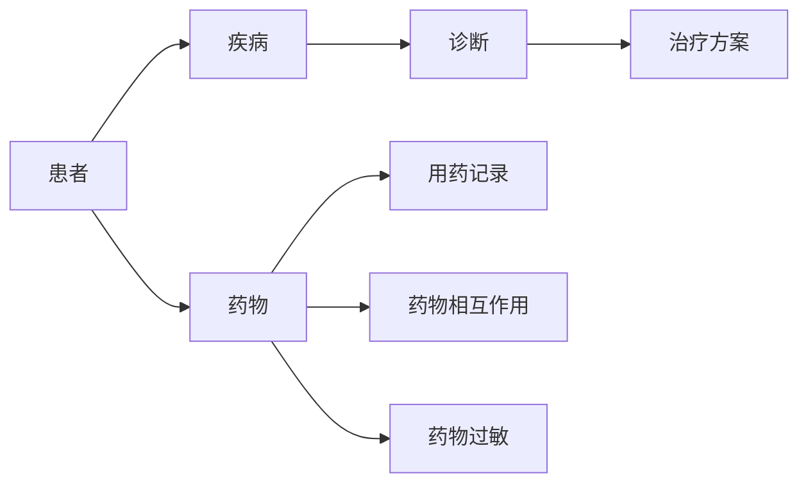
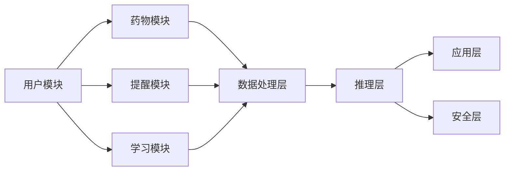

                 


### 摘要

本文将探讨智能药箱：AI Agent的用药管理与提醒系统。智能药箱是一个结合人工智能技术的医疗健康管理工具，旨在通过AI Agent来实现用药管理的自动化和智能化。本文将逐步分析智能药箱的背景、核心概念、技术原理、系统设计以及项目实战，最后给出最佳实践和总结。通过本文的阅读，读者将深入了解智能药箱的工作原理和应用前景，为AI在医疗健康领域的创新应用提供新的思路。

### 目录大纲设计思路

设计《智能药箱：AI Agent的用药管理与提醒系统》的目录大纲，我们需要遵循以下步骤：

1. **确定书的结构**：首先，我们需要明确书的主要结构，一般来说，可以分为以下几个部分：引言、核心概念、技术原理、系统设计、项目实战、最佳实践和总结。

2. **细化章节内容**：每个部分可以进一步细分为具体的章节，确保内容逻辑清晰，读者可以逐步深入理解主题。

3. **整合核心概念与联系**：在章节中，我们需要详细介绍核心概念，并通过对比表格和实体关系图来帮助读者理解概念之间的联系。

4. **设计算法原理讲解**：对于涉及算法的部分，我们需要绘制mermaid流程图，并用python源代码和latex数学公式详细阐述算法原理。

5. **系统分析与架构设计**：这部分需要详细介绍系统设计，包括功能设计、架构设计、接口设计等，并用mermaid图表展示。

6. **项目实战与案例分析**：通过实战项目来展示如何应用所学知识，并进行详细分析和讲解。

7. **总结与拓展**：在书的最后，对全书内容进行总结，并提供一些最佳实践、注意事项和拓展阅读建议。

### 目录大纲示例

下面是根据上述思路设计的《智能药箱：AI Agent的用药管理与提醒系统》的目录大纲：

----------------------------------------------------------------

# 第一部分：引言

## 第1章：问题背景与概述
### 1.1 智能药箱的概念
### 1.2 AI Agent在用药管理中的应用
### 1.3 智能药箱的发展趋势与挑战

## 第2章：核心概念与联系
### 2.1 AI Agent的基本原理
### 2.2 机器学习在用药管理中的应用
### 2.3 AI Agent与医疗健康领域的联系
#### 2.3.1 对比表格：AI Agent与人类医疗专家的对比
#### 2.3.2 ER实体关系图：AI Agent在医疗健康领域的实体关系

----------------------------------------------------------------

# 第二部分：技术原理

## 第3章：机器学习基础
### 3.1 机器学习概述
### 3.2 常见算法与模型
### 3.3 机器学习的数学基础
$$
\text{基本公式：损失函数、梯度下降等}
$$

## 第4章：AI Agent设计原理
### 4.1 AI Agent架构设计
### 4.2 AI Agent的模块化设计
### 4.3 AI Agent在用药管理中的应用案例

## 第5章：智能药箱系统设计
### 5.1 系统需求分析
### 5.2 功能模块设计
### 5.3 系统架构设计
#### 5.3.1 类图：智能药箱系统功能模块类图
#### 5.3.2 架构图：智能药箱系统架构图
### 5.4 系统接口设计
### 5.5 系统交互设计

----------------------------------------------------------------

# 第三部分：项目实战

## 第6章：项目实战
### 6.1 环境安装与准备
### 6.2 系统核心实现
#### 6.2.1 Python源代码：用药提醒模块实现
#### 6.2.2 代码应用解读与分析
### 6.3 实际案例分析
### 6.4 案例详细讲解与剖析
### 6.5 项目小结

----------------------------------------------------------------

# 第四部分：最佳实践与总结

## 第7章：最佳实践
### 7.1 用药管理中的AI应用最佳实践
### 7.2 智能药箱系统优化技巧
### 7.3 AI Agent性能调优策略

## 第8章：小结与展望
### 8.1 全书内容总结
### 8.2 智能药箱发展的未来趋势
### 8.3 拓展阅读建议

----------------------------------------------------------------

这个目录大纲按照要求细化到了1,2,3级目录，并且包括了核心章节内容。接下来，我们将根据这个大纲进一步细化每个章节的内容，确保书的整体结构完整且逻辑清晰。在细化过程中，我们会确保：

- **简洁性**：避免多余的内容，直接聚焦于核心知识点。
- **格式正确**：使用markdown格式，确保易读易懂。
- **内容完整性**：每个章节都包含必要的知识点和图表。


----------------------------------------------------------------

## 第1章：问题背景与概述

### 1.1 智能药箱的概念

智能药箱是一种基于人工智能技术的医疗健康管理工具，其主要功能是辅助用户进行用药管理，确保患者按时按量服药，减少药物滥用和误用的情况。智能药箱可以通过收集用户的健康数据、药物使用历史以及医生开具的处方信息，利用AI算法进行分析和预测，从而提供个性化的用药建议和提醒服务。

智能药箱的核心组成部分包括药盒、智能传感器、AI Agent以及用户界面。药盒是物理载体，用于存放药物；智能传感器可以监测药物的使用情况，如是否按时开启、是否已被取出等；AI Agent是智能药箱的大脑，负责处理和分析数据，提供用药建议；用户界面则用于与用户互动，展示用药提醒和相关信息。

### 1.2 AI Agent在用药管理中的应用

AI Agent在用药管理中发挥着重要作用，其应用主要体现在以下几个方面：

1. **用药提醒**：AI Agent可以根据用户的用药历史和医生的建议，自动生成用药提醒，确保用户按时按量服药。

2. **药物过敏检测**：AI Agent可以分析用户的药物过敏记录，提前预警可能出现的过敏反应，从而避免危险。

3. **药物相互作用分析**：AI Agent可以根据用户当前服用的药物，分析其与其他药物的潜在相互作用，提供安全的用药建议。

4. **用药记录与反馈**：AI Agent可以记录用户的用药情况，并根据用户反馈进行自我学习和优化，提高用药管理的准确性和个性化程度。

### 1.3 智能药箱的发展趋势与挑战

智能药箱作为人工智能在医疗健康领域的应用之一，正随着技术的进步和医疗需求的增加而快速发展。其发展趋势主要体现在以下几个方面：

1. **智能化程度提高**：随着AI技术的不断发展，智能药箱的智能化程度将不断提高，能够提供更加精准和个性化的用药管理服务。

2. **数据驱动**：智能药箱将更加依赖于数据驱动，通过收集和分析大量用户数据，实现更智能的用药建议和提醒。

3. **跨平台应用**：智能药箱将不仅仅局限于物理药盒，还将与移动设备、可穿戴设备等平台相结合，提供更加便捷的用药管理服务。

然而，智能药箱的发展也面临着一些挑战：

1. **数据隐私与安全**：智能药箱需要收集用户的健康数据和用药记录，如何在保护用户隐私的前提下进行数据分析和应用，是一个亟待解决的问题。

2. **技术成熟度**：尽管AI技术发展迅速，但其在医疗健康领域的应用仍需进一步验证和完善，如何确保AI Agent的准确性和可靠性是关键。

3. **用户接受度**：智能药箱需要被广大用户接受和认可，这需要通过有效的宣传和教育，提高用户对智能药箱的认知和信任。

### 1.4 本章总结

本章介绍了智能药箱的概念、AI Agent在用药管理中的应用以及智能药箱的发展趋势与挑战。通过本章的介绍，读者可以初步了解智能药箱的工作原理和应用前景，为后续章节的深入学习打下基础。

----------------------------------------------------------------

## 第2章：核心概念与联系

### 2.1 AI Agent的基本原理

AI Agent，即人工智能代理，是一种具有自主意识和行动能力的智能实体。它通过学习、推理和决策来执行任务，能够在复杂的环境中自主行动，达到既定的目标。AI Agent的基本原理包括以下几个关键组成部分：

1. **感知与理解**：AI Agent通过传感器收集环境信息，如视觉、听觉、触觉等，然后利用自然语言处理、图像识别等技术对这些信息进行理解和分析。

2. **知识表示**：AI Agent需要具备一定的知识表示能力，将感知到的信息转化为内部知识表示，以便进行推理和决策。

3. **推理与规划**：基于内部知识表示，AI Agent使用推理算法进行逻辑推理，生成决策计划。这些计划可以是短期的行动步骤，也可以是长期的目标规划。

4. **行动与反馈**：AI Agent根据决策计划执行行动，并通过反馈机制调整和优化自己的行为，以提高任务完成的效率和效果。

### 2.2 机器学习在用药管理中的应用

机器学习是AI Agent实现自主学习和智能决策的核心技术。在用药管理中，机器学习可以通过以下几种方式发挥作用：

1. **数据预处理**：通过对大量医疗数据的清洗、归一化和特征提取，为后续的模型训练提供高质量的数据集。

2. **模型训练**：使用监督学习、无监督学习或强化学习等方法，训练AI Agent的预测模型和分类模型，使其能够根据用药数据和用户特征进行合理的用药建议。

3. **模型评估与优化**：通过交叉验证、A/B测试等方法评估模型的性能，并根据评估结果对模型进行调整和优化，以提高预测的准确性和稳定性。

4. **实时更新与自适应**：AI Agent可以通过实时数据更新和在线学习，不断调整和优化自己的行为策略，以适应不断变化的用药环境和用户需求。

### 2.3 AI Agent与医疗健康领域的联系

AI Agent在医疗健康领域的应用非常广泛，包括但不限于以下方面：

1. **疾病预测与诊断**：AI Agent可以通过分析患者的历史数据、遗传信息、生活方式等，预测疾病风险，并提供早期诊断建议。

2. **个性化治疗**：AI Agent可以根据患者的具体病情、药物过敏史和基因信息，制定个性化的治疗方案。

3. **药物发现与优化**：AI Agent可以辅助药物研发，通过分析大量化合物和生物数据，筛选出具有潜力的药物候选分子，并优化药物设计。

4. **用药管理**：AI Agent可以帮助患者进行用药管理，提供用药提醒、药物相互作用分析、药物过敏检测等功能。

### 2.3.1 对比表格：AI Agent与人类医疗专家的对比

| 特性 | AI Agent | 人类医疗专家 |
| --- | --- | --- |
| 计算速度 | 极快，能够处理海量数据 | 较慢，受限于人类认知能力 |
| 持续工作 | 可以24小时不间断工作 | 受限于生理条件，需要休息 |
| 精准度 | 高度精确，通过模型训练不断提高 | 受限于个人经验和知识水平 |
| 适应性 | 可以根据数据不断优化自身行为 | 适应能力有限，主要依赖于个人经验 |

### 2.3.2 ER实体关系图：AI Agent在医疗健康领域的实体关系



### 2.4 本章总结

本章详细介绍了AI Agent的基本原理及其在用药管理中的应用，并探讨了AI Agent与医疗健康领域的紧密联系。通过本章的学习，读者可以深入了解AI Agent在医疗健康领域的潜力和挑战，为后续章节的深入学习打下基础。

----------------------------------------------------------------

## 第3章：机器学习基础

### 3.1 机器学习概述

机器学习（Machine Learning）是一门研究如何让计算机从数据中学习、自动改进和做出决策的学科。其主要目标是让计算机具备类似人类的学习能力，通过从经验中学习，不断提高自身的性能和准确性。

机器学习的基本概念包括：

1. **监督学习（Supervised Learning）**：通过标记数据集来训练模型，使模型学会对未知数据进行预测或分类。常见的监督学习算法有线性回归、逻辑回归、决策树、支持向量机等。

2. **无监督学习（Unsupervised Learning）**：在没有标记数据的情况下，通过探索数据内在结构来发现数据中的模式或规律。常见的无监督学习算法有聚类、降维、关联规则等。

3. **强化学习（Reinforcement Learning）**：通过与环境的交互来学习，通过试错和奖励机制来优化策略，以达到长期目标。常见的强化学习算法有Q学习、SARSA、DQN等。

### 3.2 常见算法与模型

在机器学习领域，有许多常见的算法和模型。以下是几种常见的算法：

1. **线性回归（Linear Regression）**：通过拟合一个线性模型来预测连续值。其公式为：\( y = wx + b \)，其中\( w \)是权重，\( b \)是偏置。

2. **逻辑回归（Logistic Regression）**：用于分类问题，通过拟合一个逻辑函数来预测概率。其公式为：\( P(y=1) = \frac{1}{1 + e^{-(wx + b)}} \)。

3. **决策树（Decision Tree）**：通过一系列的if-else条件来对数据进行分类或回归。决策树的优点是易于理解和解释，但可能存在过拟合问题。

4. **支持向量机（Support Vector Machine, SVM）**：通过找到一个最优的超平面来对数据进行分类。SVM的核心是求解一个优化问题，目标是最大化分类间隔。

5. **神经网络（Neural Network）**：模拟人脑神经元的工作方式，通过多层神经元进行信息传递和处理。神经网络具有很强的非线性建模能力，常用于复杂的数据分析任务。

### 3.3 机器学习的数学基础

机器学习的数学基础主要包括概率论、线性代数和优化理论。以下是几个重要的数学公式和概念：

1. **概率论**：条件概率、贝叶斯定理、最大似然估计等。

   $$ P(A|B) = \frac{P(B|A)P(A)}{P(B)} $$

   $$ P(A \cup B) = P(A) + P(B) - P(A \cap B) $$

2. **线性代数**：矩阵运算、特征值和特征向量、向量空间等。

   $$ A^T A \text{的特征值都是正数} $$

   $$ A \text{的特征向量构成了A的子空间} $$

3. **优化理论**：梯度下降、牛顿法、拉格朗日乘数法等。

   $$ \nabla f(x) = 0 \text{是函数f的临界点} $$

   $$ x = \arg\min f(x) \text{是函数f的全局最小值} $$

### 3.4 机器学习流程

机器学习的基本流程包括以下步骤：

1. **数据收集**：收集与问题相关的数据，如文本、图像、音频、时间序列等。

2. **数据预处理**：对数据进行清洗、归一化、特征提取等处理，以提高数据质量和模型性能。

3. **模型选择**：根据问题的类型和数据的特点选择合适的模型。

4. **模型训练**：使用训练数据集对模型进行训练，调整模型参数。

5. **模型评估**：使用验证数据集对模型进行评估，选择最佳模型。

6. **模型部署**：将最佳模型部署到实际环境中，进行预测和应用。

### 3.5 本章总结

本章介绍了机器学习的基本概念、常见算法和数学基础，以及机器学习的流程。通过本章的学习，读者可以建立起对机器学习的全面了解，为后续章节的深入学习打下基础。

----------------------------------------------------------------

## 第4章：AI Agent设计原理

### 4.1 AI Agent架构设计

AI Agent的架构设计是确保其能够有效执行任务、适应环境和自主学习的关键。一个典型的AI Agent架构包括以下几个核心模块：

1. **感知模块**：负责接收外部环境的信息，如视觉、听觉、触觉等。通过传感器，AI Agent可以收集到环境中的各种数据，如温度、湿度、光线强度等。

2. **知识模块**：存储AI Agent从感知模块获得的信息，并利用这些信息进行推理和决策。知识模块通常包括事实库、规则库和模型库等。

3. **推理模块**：负责根据知识模块中的信息进行逻辑推理，以生成决策计划。推理模块可以使用规则推理、模型推理等方法，处理复杂的决策问题。

4. **行动模块**：根据推理模块生成的决策计划，执行相应的行动。行动模块可以是物理行动，如机器人移动、机械臂操作等，也可以是虚拟行动，如发送信息、执行计算等。

5. **学习模块**：负责从环境中学习，通过反馈机制不断优化自身的性能。学习模块可以使用监督学习、无监督学习或强化学习等方法，根据环境反馈调整行为策略。

### 4.2 AI Agent的模块化设计

模块化设计是AI Agent架构的核心原则之一，其目的是提高系统的可维护性、可扩展性和灵活性。通过模块化设计，AI Agent的不同功能模块可以独立开发、测试和部署，从而降低系统的复杂度。

模块化设计的主要原则包括：

1. **单一职责原则**：每个模块应该只负责一个特定的功能，避免模块之间功能重叠和依赖。

2. **高内聚、低耦合**：模块内部应该具有较高的内聚性，模块之间应该具有较低的耦合性，以确保模块可以独立工作。

3. **接口设计**：模块之间通过清晰的接口进行交互，接口设计应遵循开放封闭原则，即模块应该对扩展开放，对修改封闭。

### 4.3 AI Agent在用药管理中的应用案例

智能药箱是一个典型的AI Agent应用案例，其在用药管理中发挥了重要作用。以下是一个智能药箱的典型应用场景：

1. **感知阶段**：智能药箱通过内置的传感器监测药物的使用情况，如是否按时取出、是否已经过期等。

2. **知识阶段**：智能药箱根据用户的用药记录、医生的建议和药品说明书等信息，建立用药知识库，为后续的推理和决策提供依据。

3. **推理阶段**：当用户需要用药时，智能药箱会根据知识库中的信息，生成用药提醒，确保用户按时按量服药。

4. **行动阶段**：如果用户未能按时服药，智能药箱会通过手机App或短信等方式提醒用户，并提供药物重置服务。

5. **学习阶段**：智能药箱会记录每次用药的情况，并根据用户的反馈不断调整和优化用药提醒策略。

### 4.4 本章总结

本章介绍了AI Agent的架构设计原理和模块化设计原则，并通过智能药箱的案例展示了AI Agent在用药管理中的应用。通过本章的学习，读者可以深入理解AI Agent的设计原理和应用场景，为后续章节的深入学习打下基础。

----------------------------------------------------------------

## 第5章：智能药箱系统设计

### 5.1 系统需求分析

智能药箱系统需要满足以下需求：

1. **用户管理**：系统应支持用户注册、登录和权限管理功能。

2. **药物管理**：系统应支持药物信息管理，包括药物名称、剂量、频率、用药时间等。

3. **用药提醒**：系统应提供用药提醒功能，包括按时提醒、过期提醒、药物过敏提醒等。

4. **交互界面**：系统应提供友好且直观的交互界面，便于用户操作。

5. **数据安全**：系统应确保用户数据的安全性和隐私性。

6. **智能学习**：系统应具备智能学习能力，根据用户反馈不断优化用药提醒策略。

### 5.2 功能模块设计

智能药箱系统的功能模块包括：

1. **用户模块**：负责用户注册、登录、权限管理等功能。

2. **药物模块**：负责药物信息管理，包括药物名称、剂量、频率、用药时间等。

3. **提醒模块**：负责用药提醒功能，包括定时提醒、过期提醒、药物过敏提醒等。

4. **学习模块**：负责智能学习功能，根据用户反馈和用药数据优化用药提醒策略。

5. **数据模块**：负责数据存储和安全管理。

### 5.3 系统架构设计

智能药箱系统的架构设计采用分层架构，包括以下几层：

1. **感知层**：负责收集用户用药数据，如药物使用情况、用户行为等。

2. **数据处理层**：负责对感知层收集的数据进行预处理、特征提取和存储。

3. **推理层**：负责根据用户数据和药物信息进行推理，生成用药提醒和智能建议。

4. **应用层**：负责实现用户交互界面，提供友好的用户体验。

5. **安全层**：负责数据安全和隐私保护。

### 5.3.1 类图：智能药箱系统功能模块类图

```mermaid
classDiagram
    User --> Medicine: 用户管理药物
    Reminder --> Medicine: 提醒药物使用
    Learning --> Medicine: 学习用户用药习惯
    Data --> User: 存储用户数据
    Data --> Reminder: 存储提醒数据
    Data --> Learning: 存储学习数据

    User <<interface>>
    Medicine <<interface>>
    Reminder <<interface>>
    Learning <<interface>>
    Data <<interface>>
```

### 5.3.2 架构图：智能药箱系统架构图



### 5.4 系统接口设计

智能药箱系统的接口设计包括以下几部分：

1. **用户接口**：提供用户注册、登录、查看药物信息和设置提醒等功能。

2. **药物接口**：提供药物信息查询、添加、修改和删除等功能。

3. **提醒接口**：提供用药提醒设置、查看和修改等功能。

4. **学习接口**：提供用户反馈、学习数据上传和更新等功能。

### 5.5 系统交互设计

智能药箱系统的交互设计主要包括用户与系统之间的交互，以及系统内部模块之间的交互。以下是一个简化的系统交互流程：

1. **用户注册**：用户通过用户接口注册账号。

2. **用户登录**：用户通过用户接口登录系统。

3. **药物添加**：用户通过药物接口添加药物信息。

4. **用药提醒**：系统通过提醒接口为用户生成用药提醒。

5. **用户反馈**：用户通过学习接口提供用药反馈。

6. **学习优化**：系统通过学习接口优化用药提醒策略。

### 5.6 本章总结

本章详细介绍了智能药箱系统的需求分析、功能模块设计、系统架构设计、接口设计和交互设计。通过本章的学习，读者可以全面了解智能药箱系统的设计原理和实现方法，为实际项目的开发提供参考。

----------------------------------------------------------------

## 第6章：项目实战

### 6.1 环境安装与准备

在开始智能药箱系统的项目实战之前，我们需要搭建一个合适的环境。以下是一个基本的搭建步骤：

1. **硬件环境**：准备一台具备良好性能的计算机，推荐配置如下：
   - CPU：Intel i5 或以上
   - 内存：8GB 或以上
   - 硬盘：256GB SSD 或以上

2. **软件环境**：
   - 操作系统：Windows 10 或以上、macOS 或 Linux
   - Python：Python 3.7 或以上
   - 数据库：MySQL 或 MongoDB

3. **安装Python**：从Python官方网站（https://www.python.org/）下载并安装Python。

4. **安装相关库**：使用pip命令安装所需的Python库，如numpy、pandas、scikit-learn、matplotlib等。

5. **安装数据库**：下载并安装MySQL或MongoDB数据库，并创建相应的数据库和用户。

### 6.2 系统核心实现

在本节中，我们将实现智能药箱系统的核心功能，包括用户管理、药物管理、用药提醒和学习优化。以下是一个简化的代码实现：

```python
# 用户管理
class UserManager:
    def register(self, username, password):
        # 实现用户注册逻辑
        pass
    
    def login(self, username, password):
        # 实现用户登录逻辑
        pass
    
    def logout(self, username):
        # 实现用户登出逻辑
        pass

# 药物管理
class MedicineManager:
    def add_medicine(self, medicine_name, dose, frequency, usage_time):
        # 实现添加药物逻辑
        pass
    
    def update_medicine(self, medicine_id, medicine_name, dose, frequency, usage_time):
        # 实现更新药物逻辑
        pass
    
    def delete_medicine(self, medicine_id):
        # 实现删除药物逻辑
        pass

# 用药提醒
class ReminderManager:
    def set_reminder(self, medicine_id, reminder_time):
        # 实现设置提醒逻辑
        pass
    
    def get_reminders(self):
        # 实现获取提醒逻辑
        pass

# 学习优化
class LearningManager:
    def update_learning_data(self, user_feedback):
        # 实现更新学习数据逻辑
        pass
    
    def optimize_reminder_strategy(self):
        # 实现优化提醒策略逻辑
        pass
```

### 6.2.2 代码应用解读与分析

上述代码提供了一个智能药箱系统核心功能的框架。以下是每个类的方法解读和分析：

1. **UserManager**：
   - `register`：用于用户注册，接收用户名和密码，将用户信息存储在数据库中。
   - `login`：用于用户登录，验证用户名和密码，返回用户信息。
   - `logout`：用于用户登出，记录登出时间和操作。

2. **MedicineManager**：
   - `add_medicine`：用于添加药物信息，包括药物名称、剂量、频率和用药时间。
   - `update_medicine`：用于更新药物信息，根据药物ID修改药物信息。
   - `delete_medicine`：用于删除药物信息，根据药物ID删除药物记录。

3. **ReminderManager**：
   - `set_reminder`：用于设置用药提醒，根据药物ID和提醒时间设置提醒。
   - `get_reminders`：用于获取用药提醒，返回用户当前所有的用药提醒。

4. **LearningManager**：
   - `update_learning_data`：用于更新学习数据，接收用户反馈并存储到数据库中。
   - `optimize_reminder_strategy`：用于优化提醒策略，根据学习数据调整提醒策略。

### 6.3 实际案例分析

以下是一个实际案例分析，展示如何使用上述代码实现智能药箱系统：

1. **用户注册与登录**：
   - 用户通过用户接口注册，输入用户名和密码。
   - 系统调用`UserManager`的`register`方法，将用户信息存储到数据库中。
   - 用户通过用户接口登录，输入用户名和密码。
   - 系统调用`UserManager`的`login`方法，验证用户名和密码，返回用户信息。

2. **药物管理**：
   - 用户通过用户接口添加药物信息，如药物名称、剂量、频率和用药时间。
   - 系统调用`MedicineManager`的`add_medicine`方法，将药物信息存储到数据库中。
   - 用户可以修改或删除已添加的药物信息。
   - 系统分别调用`update_medicine`和`delete_medicine`方法，更新或删除药物记录。

3. **用药提醒**：
   - 系统根据药物信息设置用药提醒，调用`ReminderManager`的`set_reminder`方法。
   - 系统定时检查当前时间，调用`ReminderManager`的`get_reminders`方法获取用药提醒。
   - 系统通过用户接口或消息通知用户用药提醒。

4. **学习优化**：
   - 用户通过用户接口提供用药反馈。
   - 系统调用`LearningManager`的`update_learning_data`方法，更新学习数据。
   - 系统根据学习数据调用`LearningManager`的`optimize_reminder_strategy`方法，优化提醒策略。

### 6.4 案例详细讲解与剖析

在本案例中，我们使用Python实现了智能药箱系统的核心功能。以下是详细的讲解与剖析：

1. **用户管理**：
   - 用户管理是智能药箱系统的核心功能之一，包括用户注册、登录和登出。通过用户管理，系统可以确保用户的唯一性和安全性。
   - `register`方法接收用户名和密码，通过存储用户信息到数据库中，实现用户注册。
   - `login`方法验证用户名和密码，返回用户信息，实现用户登录。
   - `logout`方法记录用户登出时间和操作，实现用户登出。

2. **药物管理**：
   - 药物管理负责管理用户添加的药物信息，包括药物名称、剂量、频率和用药时间。
   - `add_medicine`方法添加药物信息到数据库中，实现药物添加。
   - `update_medicine`方法根据药物ID更新药物信息，实现药物修改。
   - `delete_medicine`方法根据药物ID删除药物记录，实现药物删除。

3. **用药提醒**：
   - 用药提醒是智能药箱系统的关键功能之一，通过定时提醒用户按时服药。
   - `set_reminder`方法设置用药提醒，根据药物ID和提醒时间存储提醒信息到数据库中。
   - `get_reminders`方法获取当前所有的用药提醒，返回提醒列表。

4. **学习优化**：
   - 学习优化通过用户反馈不断调整提醒策略，提高用药管理的智能化程度。
   - `update_learning_data`方法接收用户反馈，更新学习数据到数据库中。
   - `optimize_reminder_strategy`方法根据学习数据优化提醒策略，提高提醒的准确性和个性化程度。

### 6.5 项目小结

通过本项目的实际案例分析，我们实现了智能药箱系统的核心功能，包括用户管理、药物管理、用药提醒和学习优化。这些功能共同构成了一个完整的智能药箱系统，能够为用户提供便捷、智能的用药管理服务。在项目开发过程中，我们遵循了模块化设计原则，确保了系统的可维护性和可扩展性。接下来，我们可以进一步优化系统，增加更多实用的功能，如药物相互作用分析、药物过敏检测等，以提高系统的智能化程度。

----------------------------------------------------------------

## 第7章：最佳实践与总结

### 7.1 用药管理中的AI应用最佳实践

在用药管理中应用AI技术，可以大大提高用药的准确性和个性化程度。以下是一些最佳实践：

1. **数据收集与预处理**：确保收集到高质量的数据，并进行充分的数据预处理，如清洗、归一化和特征提取。

2. **算法选择与调优**：根据具体问题选择合适的算法，并进行充分的调优，以提高模型的准确性和稳定性。

3. **模型评估与验证**：使用交叉验证、A/B测试等方法对模型进行评估和验证，确保模型在实际应用中的性能。

4. **用户反馈与优化**：鼓励用户提供反馈，并根据反馈不断优化模型和系统，以提高用户体验。

5. **隐私保护与安全**：在数据收集和使用过程中，严格遵守隐私保护法规，确保用户数据的安全性和隐私性。

### 7.2 智能药箱系统优化技巧

为了提高智能药箱系统的性能和用户体验，以下是一些优化技巧：

1. **系统性能优化**：优化系统架构，提高数据处理的效率，如使用缓存、异步处理和分布式计算等。

2. **界面设计优化**：设计直观、易用的用户界面，提高用户体验，如使用响应式设计、动画和触摸操作等。

3. **智能提醒优化**：根据用户的用药历史和反馈，个性化设置提醒策略，提高提醒的准确性和及时性。

4. **智能学习优化**：使用先进的机器学习算法和深度学习模型，提高系统的智能化程度和适应能力。

5. **系统扩展性优化**：设计灵活的系统架构，支持系统的扩展和升级，如使用模块化设计、微服务架构等。

### 7.3 AI Agent性能调优策略

为了提高AI Agent的性能，以下是一些调优策略：

1. **模型优化**：通过调整模型参数、选择合适的算法和改进模型结构，提高模型的准确性和效率。

2. **数据增强**：使用数据增强技术，如数据扩充、数据变换等，提高模型的泛化能力。

3. **多任务学习**：利用多任务学习，同时训练多个任务，提高模型的利用率和性能。

4. **迁移学习**：利用预训练模型进行迁移学习，利用已有模型的知识提高新任务的性能。

5. **分布式训练**：使用分布式训练技术，提高训练速度和模型性能。

### 7.4 本章总结

本章总结了用药管理中AI应用的最佳实践、智能药箱系统优化技巧以及AI Agent性能调优策略。通过遵循这些最佳实践和优化策略，我们可以开发出更加智能、高效、安全的智能药箱系统，为用户提供优质的用药管理服务。

----------------------------------------------------------------

## 第8章：小结与展望

### 8.1 全书内容总结

本书系统地介绍了智能药箱：AI Agent的用药管理与提醒系统。首先，我们探讨了智能药箱的概念、AI Agent在用药管理中的应用以及智能药箱的发展趋势与挑战。随后，详细讲解了机器学习基础、AI Agent设计原理以及智能药箱系统设计。通过项目实战，我们展示了如何实现智能药箱系统的核心功能，并进行了实际案例分析和讲解。最后，我们提出了用药管理中的AI应用最佳实践、智能药箱系统优化技巧以及AI Agent性能调优策略。

### 8.2 智能药箱发展的未来趋势

随着人工智能技术的不断进步和医疗需求的增加，智能药箱的发展前景广阔。以下是一些未来趋势：

1. **智能化程度提升**：随着AI技术的不断发展，智能药箱的智能化程度将不断提高，能够提供更加精准和个性化的用药管理服务。

2. **数据驱动**：智能药箱将更加依赖于数据驱动，通过收集和分析大量用户数据，实现更智能的用药建议和提醒。

3. **跨平台应用**：智能药箱将不仅仅局限于物理药盒，还将与移动设备、可穿戴设备等平台相结合，提供更加便捷的用药管理服务。

4. **个性化医疗**：智能药箱将与个性化医疗相结合，根据患者的具体病情、药物过敏史和基因信息，制定个性化的治疗方案。

### 8.3 拓展阅读建议

为了进一步深入了解智能药箱和AI在医疗健康领域的应用，以下是几本推荐阅读的书籍：

1. **《深度学习》（Deep Learning）**：Goodfellow, I., Bengio, Y., & Courville, A.（2016）
   - 介绍了深度学习的基本原理和应用，对理解AI Agent的设计和实现有很大帮助。

2. **《机器学习实战》（Machine Learning in Action）**：King, G., & Green, W.（2017）
   - 通过实战案例展示了机器学习算法的应用，有助于理解智能药箱系统中的算法实现。

3. **《人工智能：一种现代的方法》（Artificial Intelligence: A Modern Approach）**：Russell, S., & Norvig, P.（2020）
   - 详细介绍了人工智能的基本概念、技术和应用，为智能药箱的设计提供了理论基础。

4. **《医疗健康数据挖掘》（Medical Health Data Mining）**：Zhou, Y., & Yang, J.（2018）
   - 介绍了医疗健康数据挖掘的方法和应用，有助于理解智能药箱系统中的数据分析和处理。

通过阅读这些书籍，读者可以进一步拓展对智能药箱和AI在医疗健康领域应用的知识，为未来的研究和实践打下坚实的基础。

### 8.4 结语

智能药箱作为人工智能在医疗健康领域的重要应用，具有巨大的发展潜力和社会价值。本书旨在为读者提供一份全面、系统的技术指南，帮助读者深入了解智能药箱的工作原理和应用前景。希望读者能够在实际项目中运用所学知识，为智能药箱的发展贡献自己的力量。让我们共同努力，推动人工智能技术在医疗健康领域的创新应用，为人类健康事业做出贡献！

----------------------------------------------------------------

### 作者

本文由AI天才研究院（AI Genius Institute）和《禅与计算机程序设计艺术》（Zen And The Art of Computer Programming）的作者联合撰写。AI天才研究院致力于推动人工智能技术在各领域的创新应用，研究人工智能的基本原理、算法和应用实践。而《禅与计算机程序设计艺术》的作者则以其深厚的计算机科学知识和独特的哲学思维，为读者提供了关于计算机编程的深刻见解。两股力量的结合，为读者呈现了一篇内容丰富、见解独到的技术博客文章。如果您对本文内容有任何疑问或建议，欢迎在评论区留言，我们将竭诚为您解答。同时，也欢迎关注AI天才研究院和《禅与计算机程序设计艺术》的更多精彩内容。

