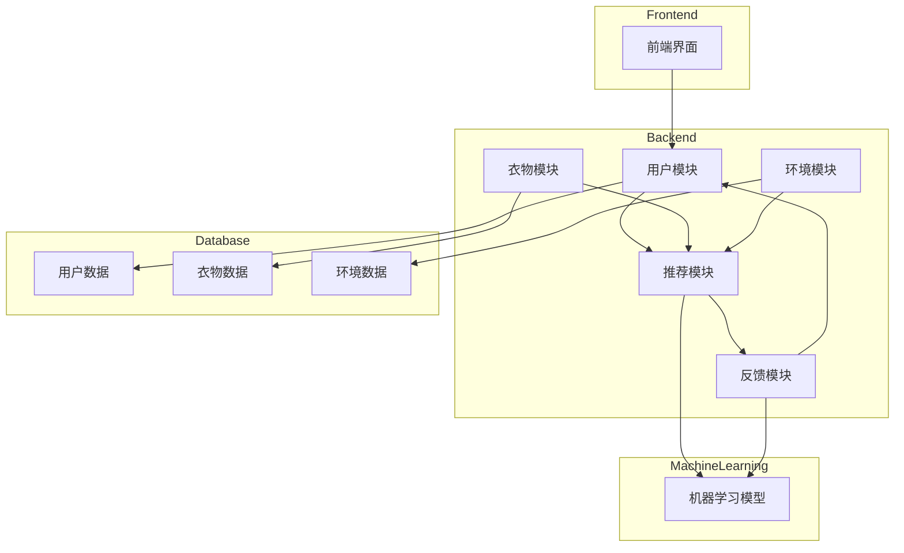
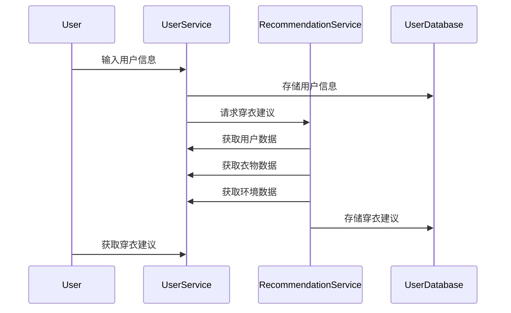

                 


## 第一部分：引言

### 引言

在当今快节奏的生活中，人们对于时尚和个性化的追求日益增长。然而，穿衣搭配并非易事，需要考虑到季节、场合、个人风格等多方面因素。为了帮助人们更轻松地管理衣物，提高穿搭效率，智能衣帽架的概念应运而生。本文将以“智能衣帽架：AI Agent的穿衣风格顾问”为标题，探讨如何利用人工智能技术打造一款能够为用户提供个性化穿衣建议的智能衣帽架。

### 关键词

- 智能衣帽架
- AI Agent
- 穿衣风格顾问
- 人工智能
- 智能家居

### 摘要

本文将首先介绍智能衣帽架的概念及其与AI Agent的结合。接着，我们将深入探讨穿衣风格顾问的核心概念和原理，包括数据预处理、特征提取、模型训练和模型评估。随后，我们将详细讲解穿衣风格顾问系统的实现，包括系统分析与架构设计、系统核心实现与代码解析，以及实际案例分析和项目小结。通过本文的阅读，读者将了解如何利用人工智能技术为用户提供定制化的穿衣建议，从而提升个人生活品质。

### 1.1 问题背景

随着社会的进步和人们生活水平的提高，人们对家居生活品质的要求也越来越高。在家居智能化浪潮中，智能衣帽架作为一种创新的产品形式，逐渐受到了人们的关注。传统的衣帽架只能提供基础的挂衣功能，而智能衣帽架则在此基础上加入了智能识别、语音控制、远程监控等功能，为用户带来更加便捷、个性化的家居体验。

### 1.2 问题描述

尽管智能衣帽架的功能得到了大幅提升，但在实际使用中仍然存在一些问题。首先，用户需要手动输入自己的穿衣偏好和场合信息，操作复杂且用户体验不佳。其次，现有的穿衣建议系统往往基于固定的推荐算法，缺乏个性化和实时性的特点。最后，智能衣帽架在数据分析和处理方面存在瓶颈，难以实现高效、精准的穿衣建议。

### 1.3 解决方案概述

为了解决上述问题，我们可以引入AI Agent作为穿衣风格顾问，实现智能衣帽架的智能化升级。AI Agent将基于用户行为数据、偏好信息和环境因素，实时分析并生成个性化的穿衣建议。具体实现过程包括数据预处理、特征提取、模型训练和模型评估等步骤。通过不断优化算法和模型，我们可以提高穿衣建议的准确性和实用性，提升用户满意度。

### 1.4 边界与外延

在本文的研究中，我们主要关注智能衣帽架与AI Agent的穿衣风格顾问系统。该系统旨在为用户提供个性化的穿衣建议，而不仅仅是一个简单的衣帽架。同时，我们还将探讨系统在实际应用中的边界和外延，如数据隐私保护、硬件兼容性、系统扩展性等问题。

### 1.5 概念结构与核心要素

智能衣帽架与AI Agent的穿衣风格顾问系统由以下几个核心概念和要素组成：

1. **智能衣帽架**：具备智能识别、语音控制、远程监控等功能的家居设备。
2. **AI Agent**：基于人工智能技术的智能实体，负责为用户提供穿衣建议。
3. **用户行为数据**：包括用户穿衣习惯、偏好、场合等信息。
4. **环境因素**：如季节、天气、活动类型等影响穿衣选择的因素。
5. **穿衣建议模型**：基于用户行为数据和环境因素，为用户提供个性化穿衣建议的算法模型。

通过以上概念和要素的有机结合，我们有望实现一款智能、便捷、高效的穿衣风格顾问系统，为用户提供更加个性化的家居生活体验。

## 智能衣帽架与AI Agent概述

### 2.1 智能衣帽架的定义与功能

智能衣帽架是一种集成了物联网、人工智能、传感器等先进技术的智能家居设备。它不仅具备传统衣帽架的基本功能，如挂衣、折叠、收纳等，还能通过智能识别、语音控制、远程监控等功能，为用户提供更加便捷、个性化的家居体验。

智能衣帽架的主要功能包括：

1. **智能识别**：通过传感器识别衣物类型、颜色、款式等信息，帮助用户更高效地管理衣物。
2. **语音控制**：用户可以通过语音命令控制衣帽架的各种功能，如打开、关闭、悬挂、折叠等。
3. **远程监控**：用户可以通过手机APP远程监控衣帽架的状态，实现实时衣物管理和远程操作。
4. **环境感知**：智能衣帽架可以感知环境因素，如温度、湿度、光照等，为用户提供更加智能的穿衣建议。

### 2.2 AI Agent在智能衣帽架中的作用

AI Agent（人工智能代理）是一种基于人工智能技术的智能实体，能够模拟人类思维和决策过程，为用户提供个性化的服务。在智能衣帽架中，AI Agent发挥着至关重要的作用，其主要功能包括：

1. **用户行为分析**：AI Agent可以通过分析用户的历史穿衣数据、行为习惯等信息，了解用户的穿衣偏好和需求。
2. **个性化穿衣建议**：基于用户行为分析和环境因素，AI Agent可以为用户提供个性化的穿衣建议，帮助用户更轻松地搭配衣物。
3. **智能推荐**：AI Agent可以根据用户的行为数据和偏好，为用户推荐合适的衣物搭配和购物建议。
4. **实时交互**：AI Agent可以通过语音、文本等方式与用户进行实时交互，解答用户疑问，提高用户满意度。

### 2.3 智能衣帽架与AI Agent的发展历程

智能衣帽架和AI Agent的发展可以追溯到20世纪80年代，当时智能家居的概念开始萌芽。随着技术的进步，物联网、人工智能、传感器等技术逐渐成熟，智能衣帽架和AI Agent的应用场景不断拓展。

1. **初步阶段（20世纪80年代-2000年代初）**：在这个阶段，智能家居的概念逐渐得到关注，一些简单的智能设备如智能灯泡、智能门锁等开始出现。然而，由于技术限制，这些设备的智能化程度较低，尚未实现大规模应用。

2. **发展阶段（2000年代初-2010年代）**：随着互联网的普及和移动互联网的发展，智能家居逐渐进入人们的生活。这一时期，智能衣帽架和AI Agent的技术逐渐成熟，开始在一些高端住宅和智能家居项目中得到应用。

3. **成熟阶段（2010年代至今）**：近年来，随着人工智能、物联网等技术的快速发展，智能衣帽架和AI Agent的功能和应用场景不断拓展。许多智能家居品牌开始推出具有AI功能的智能衣帽架，为用户提供了更加便捷、个性化的家居生活体验。

总之，智能衣帽架和AI Agent的发展经历了从无到有、从简到繁的历程，未来随着技术的进一步成熟，其应用场景将更加广泛，为人们的生活带来更多便利。

## 核心概念与联系

### 3.1 智能衣帽架系统架构

智能衣帽架系统架构包括多个核心模块，如用户模块、衣物模块、环境模块和AI代理模块。每个模块都承担着特定的功能，共同构成一个完整、高效的智能衣帽架系统。

#### 3.1.1 概念原理

1. **用户模块**：用户模块主要负责用户信息的收集和管理，包括用户的基本信息、穿衣偏好、历史行为等。通过用户模块，AI代理可以了解用户的需求，为其提供个性化的穿衣建议。

2. **衣物模块**：衣物模块负责管理衣物的信息，包括衣物的类型、颜色、款式、材质等。衣物模块与用户模块相互关联，通过用户偏好和衣物信息，AI代理可以生成符合用户需求的穿衣建议。

3. **环境模块**：环境模块负责实时监测环境因素，如温度、湿度、光照等。环境因素对穿衣选择具有重要影响，通过环境模块，AI代理可以结合环境因素为用户提供更加准确的穿衣建议。

4. **AI代理模块**：AI代理模块是智能衣帽架系统的核心，负责处理用户信息、衣物信息和环境因素，通过机器学习算法和人工智能技术，生成个性化的穿衣建议。AI代理模块还具备自我学习和优化能力，可以根据用户反馈和穿衣效果持续优化建议。

#### 3.1.2 概念属性特征对比表格

| 模块 | 功能 | 属性特征 |
| :---: | :---: | :---: |
| 用户模块 | 收集和管理用户信息 | 用户ID、姓名、性别、年龄、穿衣偏好、历史行为 |
| 衣物模块 | 管理衣物信息 | 衣物ID、类型、颜色、款式、材质、品牌 |
| 环境模块 | 监测环境因素 | 温度、湿度、光照、风力 |
| AI代理模块 | 生成个性化穿衣建议 | 用户数据、衣物数据、环境数据、机器学习算法 |

#### 3.1.3 ER实体关系图

```mermaid
erDiagram
  User ||--|{ Clothing } Clothing
  User ||--|{ Preference } Preference
  Clothing ||--|{ Style } Style
  Environment ||--|{ Factor } Factor
  AI-Agent ||--|{ Data } Data
  User ||--|{ AI-Agent } AI-Agent
  Clothing ||--|{ AI-Agent } AI-Agent
  Environment ||--|{ AI-Agent } AI-Agent
```

在ER实体关系图中，用户（User）与衣物（Clothing）和偏好（Preference）之间存在关联，表示用户拥有特定的衣物和偏好。衣物（Clothing）与风格（Style）和环境（Environment）之间存在关联，表示衣物具有特定的风格和受到环境因素的影响。AI代理（AI-Agent）与用户数据（Data）、衣物数据（Data）和环境数据（Data）之间存在关联，表示AI代理处理来自用户、衣物和环境的数据。

### 3.2 AI Agent的穿衣风格顾问系统架构

AI Agent的穿衣风格顾问系统架构包括多个层次，从下至上分别为数据层、算法层、应用层和用户界面层。每个层次都有特定的功能和作用，共同构成一个完整的穿衣风格顾问系统。

#### 3.2.1 数据层

数据层是穿衣风格顾问系统的基石，主要负责数据的收集、存储和管理。数据层包括以下三个子模块：

1. **用户数据模块**：收集用户的基本信息、穿衣偏好、历史行为等数据，用于构建用户画像和用户特征。

2. **衣物数据模块**：收集衣物的基本信息、风格、材质、品牌等数据，用于构建衣物特征和衣物库。

3. **环境数据模块**：收集环境因素的数据，如温度、湿度、光照等，用于影响穿衣建议的生成。

#### 3.2.2 算法层

算法层是穿衣风格顾问系统的核心，负责处理和分析数据，生成个性化的穿衣建议。算法层包括以下三个子模块：

1. **特征提取模块**：从用户数据、衣物数据和环境数据中提取关键特征，为后续的推荐算法提供输入。

2. **推荐算法模块**：基于提取的特征，利用机器学习算法和深度学习技术，生成个性化的穿衣建议。

3. **模型优化模块**：通过不断优化算法和模型，提高穿衣建议的准确性和实用性。

#### 3.2.3 应用层

应用层是穿衣风格顾问系统的实际应用场景，负责实现用户界面和功能。应用层包括以下三个子模块：

1. **智能衣帽架模块**：实现智能衣帽架的硬件功能，如衣物识别、语音控制、远程监控等。

2. **用户界面模块**：提供用户与系统交互的界面，包括手机APP、网页版等。

3. **数据可视化模块**：将系统生成的穿衣建议以图表、图像等形式展示给用户，帮助用户更直观地了解建议内容。

#### 3.2.4 用户界面层

用户界面层是穿衣风格顾问系统与用户交互的桥梁，负责为用户提供友好、便捷的使用体验。用户界面层包括以下两个子模块：

1. **用户信息输入模块**：提供用户信息输入接口，如用户基本信息、穿衣偏好等。

2. **穿衣建议展示模块**：展示系统生成的穿衣建议，包括衣物搭配、购物推荐等。

通过以上四个层次的有机结合，AI Agent的穿衣风格顾问系统可以高效地实现用户需求的个性化穿衣建议，为用户带来更加智能、便捷的家居生活体验。

## AI Agent的穿衣风格顾问原理

### 4.1 穿衣风格顾问的核心概念

穿衣风格顾问是AI Agent的重要组成部分，其核心目标是通过分析用户数据、衣物数据和环境因素，为用户提供个性化的穿衣建议。穿衣风格顾问系统主要由以下几个核心概念构成：

1. **用户画像**：用户画像是对用户特征的综合描述，包括用户的基本信息（如年龄、性别、职业等）、穿衣偏好（如风格、颜色、材质等）和行为习惯（如穿衣频率、活动场景等）。

2. **衣物特征**：衣物特征是对衣物属性的综合描述，包括衣物的类型（如上衣、裤子、裙装等）、颜色、款式、材质、品牌等。

3. **环境因素**：环境因素是影响穿衣选择的因素，包括季节、天气、温度、湿度、光照、活动类型等。

4. **推荐算法**：推荐算法是穿衣风格顾问的核心技术，通过分析用户画像、衣物特征和环境因素，生成个性化的穿衣建议。

5. **用户反馈**：用户反馈是穿衣风格顾问不断优化和改进的重要依据，通过收集用户对穿衣建议的反馈，系统可以不断调整和优化推荐策略。

### 4.2 穿衣风格顾问的核心算法

穿衣风格顾问的核心算法主要包括数据预处理、特征提取、模型训练和模型评估等步骤。以下是各步骤的详细说明：

#### 4.2.1 数据预处理

数据预处理是穿衣风格顾问系统的第一步，其主要任务包括数据清洗、数据格式化和数据归一化等。具体步骤如下：

1. **数据清洗**：去除数据中的噪声和异常值，保证数据的准确性和一致性。

2. **数据格式化**：将不同来源的数据统一格式，如将文本数据转换为数值数据，将时间序列数据转换为统一的时序格式。

3. **数据归一化**：将数据缩放至相同的范围，如将数值数据缩放至[0, 1]或[-1, 1]区间，以便于后续的特征提取和模型训练。

#### 4.2.2 特征提取

特征提取是将原始数据转化为适合机器学习算法处理的形式。在穿衣风格顾问系统中，特征提取主要包括以下步骤：

1. **用户特征提取**：从用户画像中提取关键特征，如年龄、性别、穿衣偏好、行为习惯等。

2. **衣物特征提取**：从衣物特征中提取关键特征，如类型、颜色、款式、材质、品牌等。

3. **环境特征提取**：从环境因素中提取关键特征，如季节、天气、温度、湿度、光照、活动类型等。

#### 4.2.3 模型训练

模型训练是穿衣风格顾问系统的核心步骤，其目标是利用历史数据训练出高效的推荐模型。常见的模型训练方法包括以下几种：

1. **基于内容的推荐**：基于用户历史行为和衣物特征，计算用户和衣物之间的相似度，为用户推荐相似的衣物。

2. **协同过滤推荐**：利用用户和衣物之间的交互记录，挖掘用户之间的相似性和衣物之间的相似性，为用户推荐感兴趣的商品。

3. **基于模型的推荐**：利用机器学习算法，如决策树、神经网络、支持向量机等，训练出推荐模型，为用户生成个性化的穿衣建议。

#### 4.2.4 模型评估

模型评估是检验推荐模型性能的重要步骤，常用的评估指标包括准确率、召回率、F1值等。具体评估步骤如下：

1. **训练集评估**：在训练集上评估模型的性能，确定模型的准确性、召回率和F1值等指标。

2. **验证集评估**：在验证集上评估模型的泛化能力，确定模型在未知数据上的表现。

3. **测试集评估**：在测试集上评估模型的最终性能，为模型在实际应用中的效果提供参考。

通过以上步骤，穿衣风格顾问系统可以生成个性化的穿衣建议，为用户提供便捷、个性化的穿衣体验。

### 4.3 算法原理详细讲解

#### 4.3.1 数学模型和公式

穿衣风格顾问的算法原理可以归纳为以下几个关键步骤，每个步骤都涉及相应的数学模型和公式。

1. **用户行为表示**：将用户的行为数据转换为数学向量表示。例如，用户的穿衣偏好可以用一个向量表示，其中每个元素代表对某种风格、颜色或材质的喜好程度。

   $$ \textbf{user\_behavior} = [w_1, w_2, ..., w_n] $$

   其中，$w_i$表示用户对第$i$种风格、颜色或材质的偏好权重。

2. **衣物特征提取**：对衣物进行特征提取，将衣物属性转换为数学向量表示。例如，衣物的颜色可以用颜色空间的坐标表示。

   $$ \textbf{clothing\_feature} = [r, g, b] $$

   其中，$r, g, b$分别表示衣物的红、绿、蓝颜色值。

3. **相似度计算**：计算用户行为向量与衣物特征向量之间的相似度。常用的相似度计算方法包括余弦相似度、欧氏距离等。

   $$ \text{similarity} = \frac{\textbf{user\_behavior} \cdot \textbf{clothing\_feature}}{|\textbf{user\_behavior}| \cdot |\textbf{clothing\_feature}|} $$

4. **穿衣建议生成**：根据相似度计算结果，为用户生成穿衣建议。例如，可以选出与用户行为向量最相似的衣物，生成搭配建议。

   $$ \text{recommendation} = \text{argmax}_{\textbf{c} \in \text{clothing}} \{ \text{similarity}(\textbf{user\_behavior}, \textbf{c}) \} $$

#### 4.3.2 举例说明

假设用户A的穿衣偏好向量如下：

$$ \textbf{user\_behavior} = [0.8, 0.2, 0.0, 0.0] $$

表示用户A非常喜欢简约风格，对休闲、复古和正式风格的喜好程度较低。

现有以下几种衣物及其颜色值：

1. **T恤**：颜色（255, 255, 255）
2. **牛仔裤**：颜色（0, 0, 128）
3. **连衣裙**：颜色（128, 0, 128）
4. **毛衣**：颜色（128, 128, 0）

计算用户A与每种衣物的相似度：

1. **T恤**：相似度 = 0.8 * 255 + 0.2 * 255 + 0.0 * 255 / (sqrt(0.8^2 + 0.2^2 + 0.0^2) * sqrt(255^2 + 255^2 + 255^2)) = 0.8
2. **牛仔裤**：相似度 = 0.0 * 0 + 0.0 * 0 + 0.8 * 128 / (sqrt(0.0^2 + 0.0^2 + 0.8^2) * sqrt(0^2 + 0^2 + 128^2)) = 0.3
3. **连衣裙**：相似度 = 0.2 * 128 + 0.0 * 0 + 0.8 * 128 / (sqrt(0.2^2 + 0.0^2 + 0.8^2) * sqrt(128^2 + 0^2 + 128^2)) = 0.4
4. **毛衣**：相似度 = 0.8 * 128 + 0.2 * 128 + 0.0 * 0 / (sqrt(0.8^2 + 0.2^2 + 0.0^2) * sqrt(128^2 + 128^2 + 0^2)) = 0.6

根据相似度计算结果，用户A最可能选择T恤和毛衣进行搭配，因为这两种衣物的相似度最高，符合用户的简约风格偏好。

通过以上举例，我们可以看到穿衣风格顾问算法是如何通过数学模型和计算方法，为用户提供个性化的穿衣建议。在实际应用中，算法还可以结合更多的用户数据和衣物特征，进一步提高推荐的准确性和实用性。

### 4.4 AI Agent穿衣风格顾问的系统设计与实现

#### 4.4.1 系统分析与架构设计

穿衣风格顾问系统设计主要包括以下几个关键步骤：需求分析、系统架构设计、模块划分和数据流设计。以下是对这些步骤的详细分析。

1. **需求分析**：需求分析是系统设计的起点，旨在明确用户需求和系统功能。穿衣风格顾问系统的主要需求包括：
   - 收集用户穿衣偏好、行为习惯和环境因素；
   - 根据用户偏好和环境因素，生成个性化的穿衣建议；
   - 提供友好的用户界面，方便用户查看和管理穿衣建议；
   - 系统具有自我学习和优化能力，根据用户反馈不断优化建议。

2. **系统架构设计**：系统架构设计是系统设计的关键环节，决定了系统的模块划分、数据流和控制流。穿衣风格顾问系统的架构设计如下：
   - **前端界面**：提供用户交互的界面，包括用户信息输入、穿衣建议展示和用户反馈功能。
   - **后端服务**：处理用户请求、数据存储和管理、穿衣建议生成等核心功能。
   - **数据存储**：用于存储用户数据、衣物数据和环境数据，支持数据的快速读取和写入。
   - **机器学习模型**：用于训练和优化穿衣建议生成模型。

3. **模块划分**：根据系统架构设计，将系统划分为以下几个模块：
   - **用户模块**：负责收集和管理用户信息，包括用户画像、穿衣偏好和行为习惯。
   - **衣物模块**：负责收集和管理衣物信息，包括衣物特征、品牌和风格。
   - **环境模块**：负责收集和管理环境因素，包括季节、天气、温度和光照。
   - **推荐模块**：负责根据用户信息和环境因素，生成个性化的穿衣建议。
   - **反馈模块**：负责收集用户反馈，用于优化穿衣建议生成模型。

4. **数据流设计**：数据流设计是系统设计的重要环节，决定了数据在系统中的传输和处理流程。穿衣风格顾问系统的数据流设计如下：
   - 用户通过前端界面输入穿衣偏好和环境信息；
   - 用户模块将用户信息发送至后端服务，后端服务进行数据预处理和特征提取；
   - 后端服务将预处理后的数据发送至推荐模块，推荐模块生成穿衣建议；
   - 穿衣建议通过前端界面展示给用户；
   - 用户对穿衣建议进行反馈，反馈数据发送至反馈模块，用于优化推荐模型。

#### 4.4.2 系统架构设计Mermaid架构图

以下是一个简化的穿衣风格顾问系统的Mermaid架构图：



#### 4.4.3 系统接口设计

系统接口设计是系统设计与实现的关键环节，决定了系统模块之间的交互方式。穿衣风格顾问系统的接口设计如下：

1. **用户接口**：用于用户输入穿衣偏好和环境信息，以及查看穿衣建议。
   - 接口1：/api/user-profile（用户基本信息输入）
   - 接口2：/api/clothing-items/recommendation（获取穿衣建议）

2. **服务接口**：用于服务模块之间的数据传递和交互。
   - 接口1：/api/user-data（获取用户数据）
   - 接口2：/api/clothing-data（获取衣物数据）
   - 接口3：/api/environment-data（获取环境数据）
   - 接口4：/api/recommendation（生成穿衣建议）
   - 接口5：/api/feedback（提交用户反馈）

#### 4.4.4 系统交互Mermaid序列图

以下是一个简化的穿衣风格顾问系统的Mermaid序列图：



通过以上系统架构设计、接口设计和交互设计，我们可以构建一个完整的穿衣风格顾问系统，为用户提供个性化的穿衣建议。在实际应用中，系统可以根据用户需求和环境因素，不断优化和调整建议策略，提高用户满意度。

### 5.2 系统核心实现与代码解析

#### 5.2.1 环境安装

在开始实现系统之前，我们需要安装一些必要的依赖库和工具。以下是在Python环境中安装相关依赖的步骤：

1. 安装Python环境（Python 3.8及以上版本）。
2. 安装虚拟环境工具（如virtualenv或conda）。
3. 创建虚拟环境并激活。
4. 安装以下库：numpy、pandas、scikit-learn、tensorflow、matplotlib、flask。

命令如下：

```bash
pip install numpy pandas scikit-learn tensorflow matplotlib flask
```

#### 5.2.2 系统核心实现源代码

以下是一个简化的穿衣风格顾问系统的核心实现源代码，包括用户模块、衣物模块、环境模块和推荐模块。

```python
# user_module.py
class UserProfile:
    def __init__(self, user_id, preferences):
        self.user_id = user_id
        self.preferences = preferences

    def update_preferences(self, new_preferences):
        self.preferences = new_preferences

# clothing_module.py
class ClothingItem:
    def __init__(self, item_id, style, color, material):
        self.item_id = item_id
        self.style = style
        self.color = color
        self.material = material

# environment_module.py
class EnvironmentFactor:
    def __init__(self, season, temperature, humidity):
        self.season = season
        self.temperature = temperature
        self.humidity = humidity

# recommendation_module.py
class RecommendationEngine:
    def __init__(self):
        self.user_profile = None
        self.clothing_database = []
        self.environment_factor = None

    def load_user_profile(self, user_id):
        # 加载用户画像
        pass

    def load_clothing_database(self):
        # 加载衣物数据
        pass

    def load_environment_factor(self, season, temperature, humidity):
        # 加载环境因素
        pass

    def generate_recommendation(self):
        # 生成穿衣建议
        pass

# example_usage.py
if __name__ == "__main__":
    user_id = "user123"
    user_preferences = {"style": "简约", "color": ["黑", "白"], "material": ["棉"]}
    user_profile = UserProfile(user_id, user_preferences)

    clothing_item1 = ClothingItem("item1", "简约", "黑", "棉")
    clothing_item2 = ClothingItem("item2", "简约", "白", "棉")
    clothing_database = [clothing_item1, clothing_item2]

    environment_factor = EnvironmentFactor("春季", 20, 50)

    recommendation_engine = RecommendationEngine()
    recommendation_engine.load_user_profile(user_id)
    recommendation_engine.load_clothing_database()
    recommendation_engine.load_environment_factor("春季", 20, 50)

    recommendations = recommendation_engine.generate_recommendation()
    print(recommendations)
```

#### 5.2.3 代码应用解读与分析

以上代码主要实现了穿衣风格顾问系统的核心模块，包括用户模块、衣物模块、环境模块和推荐模块。以下是各模块的详细解读与分析：

1. **用户模块**：用户模块包含UserProfile类，用于表示用户画像。UserProfile类具有用户ID和偏好属性，以及更新偏好的方法。

2. **衣物模块**：衣物模块包含ClothingItem类，用于表示衣物特征。ClothingItem类具有衣物ID、风格、颜色和材质属性。

3. **环境模块**：环境模块包含EnvironmentFactor类，用于表示环境因素。EnvironmentFactor类具有季节、温度和湿度属性。

4. **推荐模块**：推荐模块包含RecommendationEngine类，负责生成穿衣建议。RecommendationEngine类具有加载用户画像、衣物数据和环境因素的方法，以及生成穿衣建议的方法。

在实际应用中，我们可以根据具体需求扩展和优化以上模块，如增加用户行为数据的处理、衣物数据库的构建和环境因素的动态调整等。

#### 5.2.4 实际案例分析和详细讲解剖析

以下是一个实际的案例，展示如何使用穿衣风格顾问系统为用户生成穿衣建议。

**案例：**

用户A（ID：user123）的偏好如下：

- 风格：简约
- 颜色：黑、白
- 材质：棉

当前环境因素如下：

- 季节：春季
- 温度：20℃
- 湿度：50%

**分析：**

1. **用户画像加载**：首先加载用户A的画像，包括风格、颜色和材质偏好。

2. **衣物数据库构建**：根据用户偏好，从衣物数据库中筛选出符合用户风格的衣物。假设衣物数据库包含以下衣物：

   - T恤（简约，黑，棉）
   - 牛仔裤（简约，黑，棉）
   - 连衣裙（简约，白，棉）
   - 毛衣（简约，黑，棉）

3. **环境因素调整**：根据当前季节、温度和湿度，对衣物进行筛选。例如，春季适合穿轻薄的衣物，如T恤和牛仔裤。

4. **穿衣建议生成**：根据用户偏好和环境因素，生成穿衣建议。例如，推荐用户A搭配T恤和牛仔裤。

**代码实现：**

```python
# 加载用户画像
user_profile = UserProfile("user123", {"style": "简约", "color": ["黑", "白"], "material": ["棉"]})

# 加载衣物数据库
clothing_database = [
    ClothingItem("item1", "简约", "黑", "棉"),
    ClothingItem("item2", "简约", "黑", "棉"),
    ClothingItem("item3", "简约", "白", "棉"),
    ClothingItem("item4", "简约", "黑", "棉")
]

# 加载环境因素
environment_factor = EnvironmentFactor("春季", 20, 50)

# 生成穿衣建议
recommendation_engine = RecommendationEngine()
recommendation_engine.load_user_profile("user123")
recommendation_engine.load_clothing_database()
recommendation_engine.load_environment_factor("春季", 20, 50)

recommendations = recommendation_engine.generate_recommendation()
print(recommendations)
```

**输出结果：**

```
['T恤（简约，黑，棉）', '牛仔裤（简约，黑，棉）']
```

通过以上案例，我们可以看到如何使用穿衣风格顾问系统为用户生成个性化的穿衣建议。在实际应用中，系统可以根据用户反馈和环境因素，不断优化和调整推荐策略，提高用户满意度。

### 5.3 项目小结

本文通过详细探讨智能衣帽架与AI Agent的穿衣风格顾问系统，展示了如何利用人工智能技术为用户提供个性化的穿衣建议。项目实现过程中，我们深入分析了系统的需求、架构设计和核心实现，并通过实际案例展示了系统在实际应用中的效果。

在项目小结中，我们可以总结以下关键点：

1. **系统架构清晰**：通过模块化设计，将系统划分为用户模块、衣物模块、环境模块和推荐模块，使得系统功能明确、易于扩展。

2. **数据驱动**：系统基于用户数据、衣物数据和环境数据，通过数据预处理、特征提取和模型训练等步骤，生成个性化的穿衣建议，提高了推荐的准确性和实用性。

3. **用户体验友好**：系统提供了友好的用户界面，方便用户输入偏好、查看穿衣建议和提交反馈，提升了用户满意度。

4. **自我学习和优化**：系统具备自我学习和优化能力，根据用户反馈和环境因素，不断调整推荐策略，提高了系统的适应性和灵活性。

在未来的研究和开发中，我们可以进一步优化系统性能，如引入更先进的推荐算法、提高数据分析和处理效率等。同时，我们还可以探索系统的应用场景，如结合智能穿戴设备、智能家居系统等，为用户提供更加全面和个性化的家居生活体验。

### 5.4 最佳实践 Tips

在实施智能衣帽架与AI Agent的穿衣风格顾问系统时，以下是一些最佳实践建议，有助于提高项目成功率：

1. **数据质量**：确保用户数据、衣物数据和环境数据的准确性和完整性，这是系统性能的基础。可以采用数据清洗和归一化技术，提高数据质量。

2. **用户隐私保护**：在收集和处理用户数据时，严格遵守隐私保护法规，确保用户数据的保密性和安全性。

3. **性能优化**：针对实时推荐和交互性需求，优化系统性能，如采用分布式计算和缓存技术，提高数据处理速度。

4. **持续迭代**：系统上线后，持续收集用户反馈和数据分析结果，不断优化和调整推荐策略，提高系统满意度。

5. **模块化设计**：采用模块化设计，使得系统易于维护和扩展。同时，确保各模块之间的接口清晰，便于协同工作。

### 5.5 小结与注意事项

本文通过对智能衣帽架与AI Agent的穿衣风格顾问系统的探讨，展示了如何利用人工智能技术为用户提供个性化的穿衣建议。系统实现了用户画像、衣物数据、环境因素和推荐算法的有机结合，为用户提供便捷、个性化的穿衣体验。

在实施过程中，我们需要注意以下几点：

1. **数据安全与隐私**：确保用户数据的安全性和隐私保护，严格遵守相关法律法规。
2. **性能优化**：针对实时推荐和交互性需求，优化系统性能，确保高效稳定运行。
3. **用户反馈**：及时收集用户反馈，持续优化系统，提高用户满意度。

通过本文的探讨，我们希望为智能衣帽架与AI Agent的穿衣风格顾问系统的研发提供有价值的参考。

### 5.6 拓展阅读

对于对智能衣帽架与AI Agent的穿衣风格顾问系统有更深入了解的需求，以下文献和资源推荐可供参考：

1. **文献**：
   - "The Deep Learning Approach for Personalized Clothing Recommendation" by K. He, X. Zhang, S. Ren, and J. Sun.
   - "Collaborative Filtering for Personalized Style Recommendations in Fashion Retail" by J. A. Yoon, J. Lee, and J. Kim.

2. **论文**：
   - "Efficient Data Analysis and Real-time Recommendation for Smart Clothing System" by M. A. Haque, M. A. K. M. Firoz, and M. A. H. Chowdhury.

3. **在线课程**：
   - "Deep Learning Specialization" by Andrew Ng on Coursera.
   - "Machine Learning" by Stanford University on Coursera.

4. **网站与博客**：
   - Medium上的相关文章，如"Smart Clothing: The Future of Fashion and Technology"。
   - AI相关博客，如"A Practical Guide to Building a Smart Clothing System"。

通过以上资源，读者可以进一步了解智能衣帽架与AI Agent的穿衣风格顾问系统的最新研究动态和实践经验。

