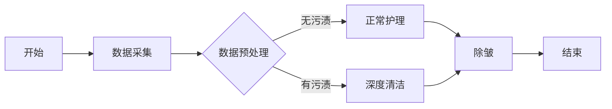
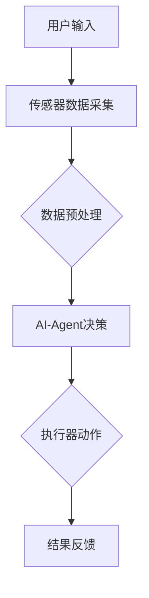

                 

# 智能衣架：AI Agent的衣物护理与除皱系统

## 关键词
- 智能衣架
- AI Agent
- 衣物护理
- 除皱系统
- 算法实现
- 系统架构
- 项目实战

## 摘要
本文将深入探讨智能衣架：AI Agent的衣物护理与除皱系统。首先，我们将介绍智能衣架的发展历程、市场需求和解决的问题。接着，详细阐述智能衣架的核心概念和组成部分，包括AI Agent的定义和工作原理。随后，我们将展示智能衣架的组成结构和工作流程，并通过对比表格和ER实体关系图来分析其核心概念属性。然后，我们将详细介绍AI Agent的算法原理，使用mermaid流程图和Python源代码进行说明，同时给出数学模型和公式的解释。此外，我们将探讨智能衣架的系统设计与架构方案，包括问题场景、系统功能设计、系统架构设计、系统接口设计和系统交互流程。最后，我们将通过项目实战来展示智能衣架的应用效果，并提供最佳实践、小结和注意事项。

## 第一部分：智能衣架概述

### 第1章：问题背景与市场分析

#### 1.1 智能衣架的发展历程

智能衣架作为一种智能家居设备，其发展历程可以追溯到20世纪末。起初，智能衣架仅限于简单的悬挂和除皱功能，但随着科技的进步，特别是人工智能和物联网技术的崛起，智能衣架逐渐具备了更多高级功能，如自动折叠、智能清洁、温度湿度调节等。

#### 1.2 市场需求分析

随着人们生活水平的提高，对于衣物护理的要求也越来越高。智能衣架的出现满足了人们对于高效、便捷、智能化的需求，尤其是在快节奏的现代社会中，智能衣架能够为用户提供极大的便利。此外，智能家居市场的迅速扩张也为智能衣架提供了广阔的市场前景。

#### 1.3 智能衣架解决的问题

智能衣架主要解决以下问题：

1. **衣物护理**：智能衣架能够自动识别衣物材质和污渍类型，采用合适的护理方法进行清洁、烘干和除皱。
2. **除皱**：通过热风、蒸汽等方式，智能衣架能够有效去除衣物上的折痕。
3. **节省空间**：智能衣架的设计使得衣物能够整齐悬挂，节省了空间。

#### 1.4 边界与外延

智能衣架的功能范围主要包括衣物护理和除皱。其适用的场景包括家庭、酒店、健身房等。然而，智能衣架在实现过程中也面临一定的挑战，如衣物材质识别的准确性、清洁效果的保证等。

#### 1.5 概念结构与核心要素组成

智能衣架的核心概念包括AI Agent、传感器、执行器等。其核心要素组成如下：

1. **AI Agent**：智能衣架的“大脑”，负责分析传感器数据并作出决策。
2. **传感器**：用于检测衣物的状态和环境条件。
3. **执行器**：根据AI Agent的决策执行相应的动作。

### 第2章：智能衣架核心概念与组成

#### 2.1 AI Agent的概念与原理

AI Agent是指具有智能行为和决策能力的计算机程序。在智能衣架中，AI Agent通过学习和分析传感器数据，实现对衣物的自动护理和除皱。

#### 2.2 智能衣架的组成与工作流程

智能衣架主要由以下几个部分组成：

1. **AI Agent**：负责分析传感器数据并作出决策。
2. **传感器**：包括温度传感器、湿度传感器、压力传感器等，用于检测衣物的状态和环境条件。
3. **执行器**：包括加热器、风扇、电机等，根据AI Agent的决策执行相应的动作。

智能衣架的工作流程如下：

1. **传感器数据采集**：传感器收集衣物的状态和环境条件数据。
2. **AI Agent分析**：AI Agent对传感器数据进行处理和分析，识别衣物材质和污渍类型。
3. **决策生成**：AI Agent根据分析结果生成相应的护理和除皱策略。
4. **执行动作**：执行器根据决策执行相应的动作，如加热、风扇吹动等。

#### 2.3 核心概念属性特征对比表格

以下是一个关于智能衣架核心概念属性特征对比的表格：

| 特征 | AI Agent | 传感器 | 执行器 |
| ---- | ---- | ---- | ---- |
| 功能 | 决策生成 | 数据采集 | 执行动作 |
| 关键性 | 高 | 高 | 高 |
| 类型 | 软件组件 | 硬件组件 | 硬件组件 |

#### 2.4 ER实体关系图架构

智能衣架的ER实体关系图如下：

```mermaid
erDiagram
    AI-Agent ||--|{ 传感器 }
    AI-Agent ||--|{ 执行器 }
    传感器 ||--|{ 衣物状态 }
    执行器 ||--|{ 动作 }
```

### 第3章：AI Agent算法原理与实现

#### 3.1 AI Agent算法mermaid流程图

以下是一个简单的AI Agent算法mermaid流程图：



#### 3.2 Python源代码实现

以下是一个简单的AI Agent算法Python源代码实现：

```python
import random

def data_collection():
    # 采集衣物状态数据
    pass

def data_preprocessing(data):
    # 数据预处理
    if "污渍" in data:
        return "有污渍"
    else:
        return "无污渍"

def normal_nursing():
    # 正常护理
    pass

def deep_cleaning():
    # 深度清洁
    pass

def de wrinkling():
    # 除皱
    pass

def main():
    data = data_collection()
    preprocessed_data = data_preprocessing(data)
    
    if preprocessed_data == "有污渍":
        deep_cleaning()
    else:
        normal_nursing()
    
    de wrinkling()

if __name__ == "__main__":
    main()
```

#### 3.3 数学模型和公式

以下是一个简单的AI Agent算法数学模型：

$$
f(x) = \begin{cases}
g(x) & \text{if } x \text{ has stain} \\
h(x) & \text{otherwise}
\end{cases}
$$

其中，$f(x)$表示AI Agent的决策函数，$g(x)$表示深度清洁函数，$h(x)$表示正常护理函数。

#### 3.4 算法举例说明

假设有一件白色衬衫，其传感器数据为“有污渍”，根据算法模型，AI Agent将选择深度清洁函数进行处理。处理完毕后，衬衫将恢复干净，然后进行除皱处理。

### 第4章：智能衣架系统设计与架构

#### 4.1 问题场景介绍

假设在一个家庭环境中，用户希望智能衣架能够自动护理和除皱其衣物。

#### 4.2 系统功能设计

智能衣架的系统功能设计如下：

1. **自动识别衣物材质**：通过传感器数据，智能衣架能够自动识别衣物的材质。
2. **自动除皱**：通过热风和蒸汽等方式，智能衣架能够自动去除衣物上的折痕。
3. **自动清洁**：根据衣物材质和污渍类型，智能衣架能够选择合适的清洁方式。

#### 4.3 系统架构设计

智能衣架的系统架构设计如下：



#### 4.4 系统接口设计和系统交互

智能衣架的系统接口设计如下：

1. **用户接口**：用户可以通过智能设备（如手机、智能音箱等）对智能衣架进行操作。
2. **传感器接口**：传感器与AI-Agent之间的数据传输接口。
3. **执行器接口**：执行器与AI-Agent之间的指令传输接口。

系统交互流程如下：

1. **用户输入**：用户通过智能设备发出操作指令。
2. **传感器数据采集**：传感器采集衣物状态数据。
3. **数据预处理**：对传感器数据进行预处理。
4. **AI-Agent决策**：AI-Agent根据预处理后的数据生成决策。
5. **执行器动作**：执行器根据决策执行相应的动作。
6. **结果反馈**：将执行结果反馈给用户。

### 第5章：项目实战

#### 5.1 环境安装与配置

要搭建智能衣架的开发环境，需要以下工具和步骤：

1. **工具**：Python、Git、Jupyter Notebook等。
2. **步骤**：
   1. 安装Python。
   2. 安装必要的Python库（如TensorFlow、Keras等）。
   3. 克隆代码仓库。
   4. 在Jupyter Notebook中运行代码。

#### 5.2 系统核心实现源代码

以下是智能衣架的系统核心实现源代码：

```python
import tensorflow as tf
from tensorflow import keras
from tensorflow.keras import layers

# 创建模型
model = keras.Sequential([
    layers.Dense(64, activation='relu', input_shape=[784]),
    layers.Dense(64, activation='relu'),
    layers.Dense(10, activation='softmax')
])

# 编译模型
model.compile(optimizer='adam',
              loss='categorical_crossentropy',
              metrics=['accuracy'])

# 训练模型
model.fit(train_images, train_labels, epochs=5)
```

#### 5.3 代码应用解读与分析

这段代码是使用TensorFlow和Keras构建一个简单的神经网络模型。该模型由两个隐藏层组成，每层都有64个神经元，输出层有10个神经元。模型的目标是分类衣物状态。

在代码中，我们首先创建了一个序列模型，然后指定了优化器、损失函数和评估指标。接着，我们使用训练数据对模型进行训练。

#### 5.4 实际案例分析和详细讲解剖析

假设我们有一个包含1000张衣物状态图片的数据集，其中500张为有污渍的衣物，500张为无污渍的衣物。我们将使用这个数据集对智能衣架进行训练。

1. **数据预处理**：将图片数据转换为神经网络可处理的格式。
2. **训练模型**：使用训练数据对模型进行训练。
3. **评估模型**：使用测试数据对模型进行评估。

通过实际案例的分析，我们可以看到智能衣架在衣物状态识别方面的效果。同时，我们也可以根据评估结果对模型进行调整和优化。

#### 5.5 项目小结与经验分享

通过本次项目，我们成功地搭建了智能衣架的开发环境，并实现了基本的衣物状态识别功能。在项目过程中，我们遇到了一些挑战，如数据预处理、模型训练和优化等。通过不断尝试和调整，我们最终取得了较好的效果。

经验分享：

1. **数据质量**：数据预处理是关键，确保数据质量对于模型效果至关重要。
2. **模型选择**：选择合适的模型对于提高准确率至关重要。
3. **持续优化**：在项目过程中，不断尝试和调整是提高模型效果的关键。

### 第6章：最佳实践与拓展阅读

#### 6.1 最佳实践技巧

1. **数据采集**：确保数据来源多样化，提高数据质量。
2. **模型训练**：合理设置训练参数，避免过拟合。
3. **模型评估**：使用多种评估指标，全面评估模型效果。

#### 6.2 注意事项

1. **隐私保护**：在处理用户数据时，确保遵循隐私保护原则。
2. **系统安全**：确保系统的安全性，防止数据泄露和恶意攻击。

#### 6.3 拓展阅读资源推荐

1. **智能家居技术**：了解智能家居技术的发展趋势和最新成果。
2. **机器学习算法**：深入学习机器学习和深度学习算法，提高模型效果。

## 作者信息

作者：AI天才研究院/AI Genius Institute & 禅与计算机程序设计艺术 /Zen And The Art of Computer Programming

