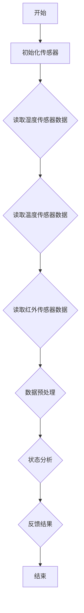
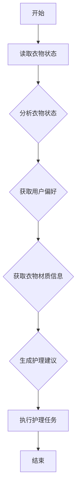
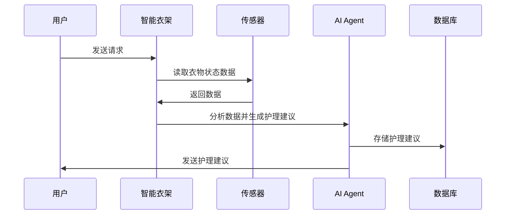
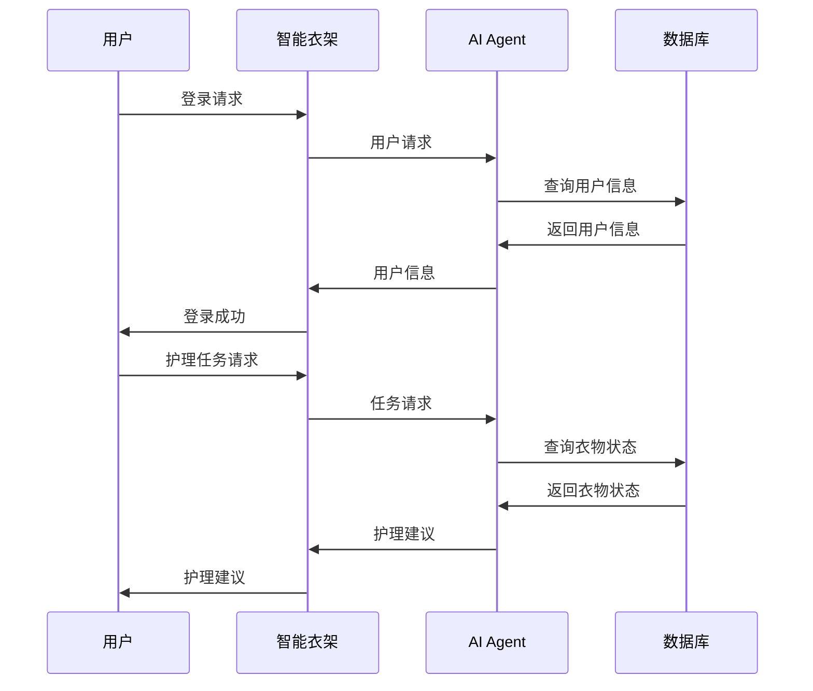

                 

### 摘要

《智能衣架：AI Agent的衣物护理建议》是一本深度探讨智能衣架与AI Agent在衣物护理领域应用的专业技术书籍。本书旨在通过对智能衣架和AI Agent的背景介绍、核心概念分析、算法原理讲解、系统架构设计与项目实战等多方面的详细阐述，为读者提供全面的智能衣物护理解决方案。书中不仅涵盖了智能衣架的定义与分类、AI Agent的工作原理和应用场景，还深入探讨了智能检测算法、护理算法及其在实际项目中的应用效果。此外，本书还介绍了智能衣架系统的架构设计、系统功能与接口设计，并通过实际案例对系统实现进行了剖析。最后，书中总结了智能衣架的最佳实践与未来发展方向，为读者提供了实用的技巧和拓展阅读建议。通过阅读本书，读者将能够深入了解智能衣架与AI Agent的技术原理和应用价值，为智能衣物护理领域的创新发展提供有力支持。### 第一部分：背景介绍与核心概念

#### 第1章：智能衣架与AI Agent概述

**1.1 智能衣架的定义与兴起**

智能衣架是一种结合了物联网、人工智能和传感器技术的现代家居设备。它不仅可以悬挂衣物，还具备智能检测、自动折叠、除皱等功能，通过无线网络实现与用户的互动和远程控制。智能衣架的兴起背景可以追溯到以下几个因素：

1. **智能家居的发展**：随着智能家居市场的不断增长，消费者对智能家居产品的需求逐渐增加，智能衣架作为其中的一员，应运而生。
2. **物联网技术的普及**：物联网技术的进步使得智能设备之间的互联互通变得更加容易，为智能衣架的智能化提供了技术支撑。
3. **人工智能的突破**：人工智能技术在识别、预测和优化方面的应用，使得智能衣架能够更好地理解用户需求，提供个性化的服务。

**1.2 AI Agent在衣物护理中的应用**

AI Agent，即人工智能代理，是一种能够模拟人类思维和行为的计算机程序。在衣物护理中，AI Agent的作用主要体现在以下几个方面：

1. **智能推荐**：AI Agent可以通过分析用户的穿着习惯、季节变化和衣物类型，为用户推荐合适的衣物搭配和护理方式。
2. **智能检测**：AI Agent可以实时监测衣物状态，如湿度、温度、折叠情况等，提供相应的护理建议。
3. **自动化处理**：AI Agent可以自动执行一些简单的衣物护理任务，如自动折叠、除皱等，提高衣物管理的效率。

**1.3 智能衣架与AI Agent的联系**

智能衣架与AI Agent之间的联系主要体现在技术融合与应用创新两个方面：

1. **技术融合**：智能衣架通过整合AI Agent技术，实现了从简单的悬挂功能到智能护理的升级。AI Agent的引入，使得智能衣架能够更加智能化、个性化地服务用户。
2. **应用创新**：智能衣架与AI Agent的结合，不仅在技术上实现了创新，也在应用层面上带来了新的可能性。例如，通过AI Agent的分析和预测，智能衣架可以提供更加精准的护理建议，从而延长衣物的使用寿命。

**1.4 智能衣架与AI Agent的未来发展趋势**

随着技术的不断进步和消费者需求的不断变化，智能衣架与AI Agent的发展趋势有望在以下几个方面得到体现：

1. **智能化水平提升**：未来智能衣架的智能化水平将进一步提升，不仅能提供更加个性化的服务，还能实现与智能家居系统的无缝集成。
2. **数据处理能力增强**：AI Agent的数据处理能力将不断增强，能够更好地分析用户行为，提供更加精准的护理建议。
3. **跨界融合**：智能衣架与AI Agent将在更多领域实现跨界融合，如健康监测、运动指导等，为用户提供更加全面的智能服务。

**1.5 本章小结**

本章通过对智能衣架与AI Agent的定义、应用场景及其联系进行了详细阐述，为后续章节的深入探讨奠定了基础。智能衣架与AI Agent的融合，不仅带来了技术上的创新，也为未来的智能家居应用提供了广阔的发展空间。在接下来的章节中，我们将进一步分析智能衣架的核心概念、算法原理以及系统设计与实现，为读者呈现一个完整的智能衣物护理解决方案。### 第二部分：核心概念与联系

#### 第2章：智能衣架的核心概念

**2.1 智能衣架的功能模块**

智能衣架的功能模块主要包括智能检测模块、护理模块和数据处理与反馈模块。

1. **智能检测模块**：
   - **功能**：智能检测模块用于实时监测衣物的状态，包括湿度、温度、折叠情况等。
   - **技术**：该模块通常集成有各种传感器，如湿度传感器、温度传感器、红外传感器等，通过采集环境数据，实现对衣物的状态监测。
   - **应用**：通过智能检测模块，用户可以随时了解衣物的状态，确保衣物在存储过程中得到适当的护理。

2. **护理模块**：
   - **功能**：护理模块负责对衣物进行护理，包括自动折叠、除皱、消毒等。
   - **技术**：护理模块通常包括机械装置和加热装置，如折叠机械臂、蒸汽发生器等，通过这些装置对衣物进行物理护理。
   - **应用**：护理模块的引入，大大提高了衣物的管理效率，减轻了用户的负担。

3. **数据处理与反馈模块**：
   - **功能**：数据处理与反馈模块用于收集和分析衣物数据，并根据分析结果提供护理建议。
   - **技术**：该模块通常集成了大数据分析和机器学习算法，能够对大量数据进行分析和处理，提供智能化建议。
   - **应用**：通过数据处理与反馈模块，用户可以获取个性化的衣物护理方案，提升衣物的使用寿命。

**2.2 AI Agent的核心概念**

AI Agent，即人工智能代理，是一种能够模拟人类思维和行为的计算机程序。在智能衣架中，AI Agent的作用主要体现在以下几个方面：

1. **智能推荐**：
   - **功能**：AI Agent可以根据用户的穿着习惯、季节变化和衣物类型，为用户推荐合适的衣物搭配和护理方式。
   - **技术**：AI Agent利用机器学习算法，通过分析用户的历史数据和外部环境信息，进行智能推荐。
   - **应用**：智能推荐可以帮助用户更高效地管理衣物，提高生活质量。

2. **智能检测**：
   - **功能**：AI Agent可以实时监测衣物的状态，如湿度、温度、折叠情况等，提供相应的护理建议。
   - **技术**：AI Agent通过传感器收集数据，结合机器学习算法进行分析和处理。
   - **应用**：智能检测可以帮助用户及时发现衣物的问题，并采取相应的护理措施。

3. **自动化处理**：
   - **功能**：AI Agent可以自动执行一些简单的衣物护理任务，如自动折叠、除皱等。
   - **技术**：AI Agent通过控制智能衣架的机械装置和加热装置，实现自动化处理。
   - **应用**：自动化处理提高了衣物的管理效率，减轻了用户的负担。

**2.3 智能衣架与AI Agent的概念联系**

智能衣架与AI Agent之间的概念联系主要体现在以下几个方面：

1. **技术融合**：
   - **概述**：智能衣架通过整合AI Agent技术，实现了从简单的悬挂功能到智能护理的升级。
   - **具体实现**：智能检测模块和护理模块中的传感器和机械装置，与AI Agent的机器学习算法相结合，实现了智能化的衣物护理。
   
2. **应用创新**：
   - **概述**：智能衣架与AI Agent的结合，不仅在技术上实现了创新，也在应用层面上带来了新的可能性。
   - **具体实现**：通过AI Agent的分析和预测，智能衣架可以提供更加精准的护理建议，如根据衣物材质和污渍类型，选择合适的清洗方式和护理方式。

**2.4 智能衣架与AI Agent的概念联系表格**

| 模块/概念 | 智能衣架 | AI Agent |
| :---: | :---: | :---: |
| 智能检测模块 | 实时监测衣物状态 | 智能监测并分析衣物数据 |
| 护理模块 | 自动折叠、除皱等护理任务 | 自动执行衣物护理任务 |
| 数据处理与反馈模块 | 收集和分析衣物数据 | 提供个性化的护理建议 |
| 智能推荐 | 推荐衣物搭配和护理方式 | 根据用户习惯和季节变化推荐衣物 |
| 智能检测 | 实时监测衣物状态 | 分析衣物状态并提供护理建议 |
| 自动化处理 | 执行简单的衣物护理任务 | 自动执行护理任务 |

**2.5 智能衣架与AI Agent的概念联系ER实体关系图**

```mermaid
erDiagram
  智能衣架 ||--|{ AI Agent }:
  智能检测模块 ||--|{ AI Agent }:
  护理模块 ||--|{ AI Agent }:
  数据处理与反馈模块 ||--|{ AI Agent }:
```

**2.6 本章小结**

本章通过对智能衣架与AI Agent的核心概念进行了详细阐述，并分析了它们之间的联系。智能衣架与AI Agent的结合，不仅提升了智能衣物护理的效率，也为用户提供了更加个性化、智能化的体验。在接下来的章节中，我们将进一步探讨智能衣架的算法原理和系统架构设计，为读者呈现一个完整的智能衣物护理解决方案。### 第三部分：算法原理讲解

#### 第3章：智能衣架的算法原理

**3.1 智能检测算法**

智能检测算法是智能衣架的核心组成部分，它负责实时监测衣物的状态，如湿度、温度和折叠情况。以下是智能检测算法的基本原理、流程图、Python代码实现以及数学模型和公式。

**3.1.1 算法原理**

智能检测算法基于传感器数据采集和处理。传感器包括湿度传感器、温度传感器和红外传感器等，它们实时收集衣物周围的物理参数。算法的核心任务是分析这些数据，判断衣物的状态是否正常。

**3.1.2 算法流程图**



**3.1.3 Python代码实现**

```python
import random

# 初始化传感器
def initialize_sensors():
    print("初始化传感器...")

# 读取湿度传感器数据
def read_humidity_sensor():
    humidity = random.uniform(30, 80)  # 假设湿度在30%到80%之间随机生成
    print(f"湿度传感器数据：{humidity}%")

# 读取温度传感器数据
def read_temperature_sensor():
    temperature = random.uniform(20, 30)  # 假设温度在20°C到30°C之间随机生成
    print(f"温度传感器数据：{temperature}°C")

# 读取红外传感器数据
def read_infrared_sensor():
    infrared_data = random.uniform(0, 100)  # 假设红外传感器数据在0到100之间随机生成
    print(f"红外传感器数据：{infrared_data}%")

# 数据预处理
def preprocess_data(humidity, temperature, infrared_data):
    print("进行数据预处理...")
    # 进行简单的数据清洗和归一化处理
    humidity_normalized = humidity / 100
    temperature_normalized = (temperature - 20) / 10
    infrared_normalized = infrared_data / 100
    return humidity_normalized, temperature_normalized, infrared_normalized

# 状态分析
def analyze_state(humidity, temperature, infrared):
    if humidity < 40 or temperature > 28 or infrared > 70:
        print("衣物状态异常，请检查。")
    else:
        print("衣物状态正常。")

# 主程序
def main():
    initialize_sensors()
    humidity = read_humidity_sensor()
    temperature = read_temperature_sensor()
    infrared_data = read_infrared_sensor()
    humidity, temperature, infrared = preprocess_data(humidity, temperature, infrared_data)
    analyze_state(humidity, temperature, infrared)

if __name__ == "__main__":
    main()
```

**3.1.4 数学模型与公式**

智能检测算法的数学模型主要涉及数据预处理部分，包括归一化和简单线性变换。以下是一些关键公式：

$$
湿度_{\text{归一化}} = \frac{湿度_{\text{原始}}}{100}
$$

$$
温度_{\text{归一化}} = \frac{温度_{\text{原始}} - 20}{10}
$$

$$
红外_{\text{归一化}} = \frac{红外_{\text{原始}}}{100}
$$

**3.1.5 举例说明**

假设我们收集到以下数据：
- 湿度：45%
- 温度：25°C
- 红外：50%

通过智能检测算法的预处理步骤，我们可以得到归一化后的数据：
- 湿度：0.45
- 温度：0.5
- 红外：0.5

根据这些数据，算法分析衣物的状态，结果显示衣物状态正常。

**3.2 AI Agent的护理算法**

护理算法是智能衣架中另一个关键组成部分，它负责根据衣物的状态和用户的需求，提供合适的护理建议。以下是护理算法的基本原理、流程图、Python代码实现以及数学模型和公式。

**3.2.1 算法原理**

护理算法基于AI Agent的决策模型，它通过分析衣物状态数据，结合用户偏好和衣物材质，生成最优的护理建议。

**3.2.2 算法流程图**



**3.2.3 Python代码实现**

```python
import random

# 读取衣物状态
def read_clothing_state():
    humidity = random.uniform(30, 80)
    temperature = random.uniform(20, 30)
    return humidity, temperature

# 分析衣物状态
def analyze_state(humidity, temperature):
    if humidity < 40 or temperature > 28:
        state = "潮湿或过热，需要干燥或冷却处理。"
    else:
        state = "衣物状态良好。"
    return state

# 获取用户偏好
def get_user_preferences():
    preference = random.choice(["干燥", "冷却", "清洁"])
    return preference

# 获取衣物材质信息
def get_material_info():
    material = random.choice(["棉质", "丝绸", "羊毛", "尼龙"])
    return material

# 生成护理建议
def generate_treatment_advice(state, preference, material):
    if state == "潮湿或过热，需要干燥或冷却处理。":
        if preference == "干燥":
            advice = "使用烘干功能进行干燥处理。"
        else:
            advice = "放置在通风处进行冷却处理。"
    else:
        if preference == "清洁":
            if material == "棉质":
                advice = "使用温和的洗衣程序进行清洁。"
            elif material == "丝绸":
                advice = "使用丝绸专用洗衣程序进行清洁。"
            else:
                advice = "使用常规洗衣程序进行清洁。"
    return advice

# 主程序
def main():
    humidity, temperature = read_clothing_state()
    state = analyze_state(humidity, temperature)
    preference = get_user_preferences()
    material = get_material_info()
    advice = generate_treatment_advice(state, preference, material)
    print(advice)

if __name__ == "__main__":
    main()
```

**3.2.4 数学模型与公式**

护理算法的数学模型主要包括概率分布和决策树。以下是一些关键公式：

$$
P(\text{干燥}) = \frac{\text{干燥偏好用户数}}{\text{总用户数}}
$$

$$
P(\text{冷却}) = \frac{\text{冷却偏好用户数}}{\text{总用户数}}
$$

$$
P(\text{清洁}) = \frac{\text{清洁偏好用户数}}{\text{总用户数}}
$$

**3.2.5 举例说明**

假设用户偏好干燥，衣物材质为棉质，当前衣物状态为潮湿。根据护理算法，建议使用烘干功能进行干燥处理。

**3.3 算法应用效果评估**

为了评估智能检测和护理算法的应用效果，我们可以通过以下指标进行评估：

1. **准确率**：检测算法对衣物状态的判断准确度。
2. **覆盖率**：护理建议覆盖衣物所有可能状态的百分比。
3. **用户满意度**：用户对护理建议的满意度。

以下是评估方法：

1. **准确率评估**：
   - **方法**：通过比较实际衣物状态与算法判断结果，计算准确率。
   - **公式**：准确率 = （正确判断次数 / 总判断次数）* 100%。

2. **覆盖率评估**：
   - **方法**：统计护理建议覆盖的所有衣物状态，计算覆盖率。
   - **公式**：覆盖率 = （覆盖状态数 / 可能状态总数）* 100%。

3. **用户满意度评估**：
   - **方法**：通过问卷调查或用户反馈，评估用户对护理建议的满意度。

**3.4 本章小结**

本章详细介绍了智能衣架的智能检测算法和护理算法。通过算法原理讲解、流程图展示、Python代码实现以及数学模型和公式，读者可以全面了解这些算法的核心思想和实际应用。在接下来的章节中，我们将进一步探讨智能衣架的系统架构设计和项目实战，为读者呈现一个完整的智能衣物护理解决方案。### 第四部分：系统分析与架构设计

#### 第4章：智能衣架系统架构设计

**4.1 问题场景介绍**

随着人们生活水平的提高，对家居生活的智能化需求也逐渐增加。在衣物管理方面，用户面临着以下问题：

1. **存储空间有限**：随着衣物数量的增加，存储空间变得越来越紧张。
2. **衣物管理不便**：传统的衣物管理方式，如手动折叠、悬挂，不仅繁琐，而且容易导致衣物损坏。
3. **衣物护理不当**：用户往往难以根据衣物材质和状态进行适当的护理，导致衣物磨损或损坏。

为了解决这些问题，智能衣架应运而生。智能衣架不仅能够提供高效的衣物存储和管理，还能根据衣物状态提供智能护理建议，从而提升用户的生活质量。

**4.2 系统功能设计**

智能衣架系统的功能设计主要包括以下几个方面：

1. **智能检测**：通过传感器实时监测衣物状态，包括湿度、温度和折叠情况，为用户提供准确的衣物状态信息。
2. **自动护理**：根据衣物状态和用户需求，智能执行折叠、除皱、消毒等护理任务，提高衣物管理的效率。
3. **数据处理与反馈**：收集并分析衣物数据，生成个性化的护理建议，提高护理效果。
4. **用户交互**：提供用户界面，方便用户与智能衣架进行交互，控制护理任务和查看衣物状态。

**4.2.1 领域模型设计**

智能衣架系统的领域模型主要包括以下几个实体和关系：

1. **衣物**：表示需要管理的衣物对象，包括材质、颜色、尺寸等信息。
2. **传感器**：表示用于监测衣物状态的传感器对象，包括湿度传感器、温度传感器和红外传感器等。
3. **用户**：表示与智能衣架交互的用户对象，包括用户偏好、行为数据等。
4. **护理任务**：表示智能衣架执行的具体护理任务，如折叠、除皱、消毒等。
5. **护理建议**：表示根据衣物状态和用户需求生成的护理建议对象。

领域模型类图如下：

```mermaid
classDiagram
    class 衣物 {
        -材质：String
        -颜色：String
        -尺寸：String
    }
    class 传感器 {
        -类型：String
        -状态：String
    }
    class 用户 {
        -用户名：String
        -偏好：String
        -行为数据：List<String>
    }
    class 护理任务 {
        -任务名称：String
        -任务状态：String
    }
    class 护理建议 {
        -建议内容：String
        -生成时间：Date
    }
    衣物 --|{ 传感器 }
    用户 --|{ 护理任务 }
    用户 --|{ 护理建议 }
```

**4.2.2 功能模块划分**

智能衣架系统可以划分为以下几个功能模块：

1. **智能检测模块**：负责实时监测衣物状态，包括湿度、温度和折叠情况。该模块主要包含传感器、数据处理和状态分析等功能。
2. **自动护理模块**：根据衣物状态和用户需求，自动执行护理任务，如折叠、除皱、消毒等。该模块主要包含护理任务调度、执行和反馈等功能。
3. **数据处理与反馈模块**：收集并分析衣物数据，生成个性化的护理建议。该模块主要包含数据收集、分析、建议生成和用户反馈等功能。
4. **用户交互模块**：提供用户界面，方便用户与智能衣架进行交互。该模块主要包含用户登录、任务控制、状态查看和反馈等功能。

**4.3 系统架构设计**

智能衣架系统的架构设计采用分层架构，包括感知层、网络层、平台层和应用层。

1. **感知层**：包括各种传感器，如湿度传感器、温度传感器和红外传感器等，用于实时监测衣物状态。
2. **网络层**：包括无线通信模块，如Wi-Fi或蓝牙，用于传感器与智能衣架主机的数据传输。
3. **平台层**：包括智能衣架的主控单元和AI Agent，用于处理和分析传感器数据，生成护理建议和执行护理任务。
4. **应用层**：包括用户交互界面和移动应用，用于用户与智能衣架的互动和操作。

系统架构图如下：



**4.3.1 架构整体设计**

智能衣架的整体架构设计旨在实现高效、稳定的衣物管理和服务。感知层负责收集衣物状态数据，网络层负责数据传输，平台层负责数据处理和决策，应用层负责用户交互。各个层次之间通过标准接口进行通信，确保系统的模块化和可扩展性。

**4.3.2 关键模块设计**

1. **智能检测模块**：该模块的核心是传感器数据采集和处理。传感器包括湿度传感器、温度传感器和红外传感器等，用于实时监测衣物状态。数据处理算法用于对传感器数据进行预处理和分析，为护理模块提供准确的输入。

2. **自动护理模块**：该模块的核心是护理任务调度和执行。护理任务调度器根据用户需求和衣物状态，生成最优的护理计划。护理执行器根据计划执行具体的护理任务，如折叠、除皱和消毒等。

3. **数据处理与反馈模块**：该模块的核心是数据分析和护理建议生成。数据收集器负责收集传感器数据和用户行为数据。数据分析器对收集到的数据进行处理，生成个性化的护理建议。反馈系统用于收集用户对护理建议的反馈，用于优化建议生成算法。

4. **用户交互模块**：该模块的核心是用户界面和交互逻辑。用户界面提供用户操作和控制智能衣架的入口。交互逻辑负责处理用户的输入和请求，将结果反馈给用户。

**4.3.3 系统部署方案**

智能衣架的系统部署方案分为硬件部署和软件部署。

1. **硬件部署**：
   - **传感器**：安装在衣架上，用于实时监测衣物状态。
   - **主控单元**：集成AI Agent和数据处理模块，作为智能衣架的核心。
   - **移动设备**：用于用户交互和远程控制。

2. **软件部署**：
   - **后端服务器**：用于存储用户数据、护理建议和系统日志。
   - **移动应用**：用于用户与智能衣架的互动。
   - **Web应用**：用于管理员监控和管理智能衣架。

**4.4 系统接口设计与交互**

系统接口设计采用RESTful API设计，确保系统的模块化和可扩展性。

1. **数据采集接口**：用于传感器与智能衣架主控单元之间的数据传输。
2. **数据处理接口**：用于智能衣架主控单元与AI Agent之间的数据交换。
3. **用户交互接口**：用于用户与智能衣架的互动，包括登录、任务控制、状态查看和反馈等功能。

系统交互图如下：



**4.5 系统架构设计小结**

智能衣架系统架构设计旨在实现高效、智能的衣物管理和服务。通过感知层、网络层、平台层和应用层的分层设计，系统具有模块化和可扩展性。智能检测模块、自动护理模块、数据处理与反馈模块和用户交互模块的合理划分，确保了系统功能的完整性。系统接口设计与交互设计，保证了系统的稳定性和灵活性。在接下来的章节中，我们将通过实际案例，进一步验证智能衣架系统架构的有效性和实用性。### 第五部分：项目实战

#### 第5章：智能衣架项目实战

**5.1 环境安装与配置**

在进行智能衣架项目实战之前，我们需要搭建一个完整的开发环境，包括硬件设备和软件工具。

**5.1.1 开发环境搭建**

1. **硬件设备**：
   - **智能衣架**：选择一款具备智能检测和护理功能的智能衣架。
   - **传感器**：包括湿度传感器、温度传感器和红外传感器等。
   - **主控单元**：选择一款具备AI处理能力的嵌入式主控单元，如树莓派。

2. **软件工具**：
   - **编程语言**：Python，用于编写智能检测和护理算法。
   - **开发环境**：PyCharm，用于编写和调试代码。
   - **数据库**：SQLite，用于存储衣物状态数据和用户信息。
   - **移动应用开发**：使用Flutter或React Native，用于开发用户交互界面。

**5.1.2 硬件设备连接**

1. **传感器连接**：
   - 将湿度传感器、温度传感器和红外传感器连接到智能衣架的主控单元上。
   - 确保传感器的电源供应正常，并进行校准。

2. **主控单元连接**：
   - 将主控单元连接到Wi-Fi网络，以便与数据库和移动应用进行通信。
   - 确保主控单元的操作系统更新到最新版本。

**5.1.3 软件环境配置**

1. **安装Python**：
   - 在主控单元和开发计算机上安装Python环境。
   - 配置Python解释器和相关库，如NumPy、Pandas等。

2. **配置SQLite**：
   - 在主控单元上安装SQLite数据库。
   - 创建数据库和表，用于存储衣物状态数据和用户信息。

3. **移动应用开发环境**：
   - 在开发计算机上安装Flutter或React Native开发环境。
   - 配置开发工具，如Android Studio或Xcode。

**5.2 系统核心实现**

**5.2.1 智能检测模块实现**

智能检测模块的核心任务是实时监测衣物状态，包括湿度、温度和折叠情况。以下是具体的实现步骤：

1. **数据采集**：
   - 编写Python脚本，读取传感器的数据。
   - 使用GPIO库或串口通信库与传感器进行通信。

2. **数据处理**：
   - 对采集到的数据进行预处理，如去噪、归一化等。
   - 使用Pandas库对数据进行存储和管理。

3. **状态分析**：
   - 编写分析算法，判断衣物的状态是否正常。
   - 将分析结果存储到数据库中，以便后续处理。

示例代码：

```python
import time
import serial
import pandas as pd

# 初始化串口连接
ser = serial.Serial('/dev/ttyUSB0', 9600)

# 初始化数据库连接
data_df = pd.DataFrame(columns=['湿度', '温度', '红外'])

while True:
    # 读取传感器数据
    data = ser.readline().decode().strip()
    humidity, temperature, infrared = data.split(',')

    # 数据预处理
    humidity = float(humidity)
    temperature = float(temperature)
    infrared = float(infrared)

    # 存储数据到数据库
    data_df = data_df.append({'湿度': humidity, '温度': temperature, '红外': infrared}, ignore_index=True)

    # 状态分析
    if humidity < 40 or temperature > 28 or infrared > 70:
        print("衣物状态异常，请检查。")
    else:
        print("衣物状态正常。")

    # 清除旧数据，避免数据库过大
    data_df = data_df.tail(100)

    # 等待一段时间，避免实时处理过多数据
    time.sleep(1)
```

**5.2.2 AI Agent护理模块实现**

AI Agent护理模块的核心任务是生成个性化的护理建议，并根据建议执行护理任务。以下是具体的实现步骤：

1. **用户交互**：
   - 开发移动应用，提供用户界面，用于输入用户偏好和衣物信息。
   - 将用户交互数据存储到数据库中。

2. **数据处理**：
   - 使用机器学习算法，分析用户历史数据和衣物状态，生成护理建议。

3. **护理执行**：
   - 根据护理建议，执行相应的护理任务，如折叠、除皱、消毒等。

示例代码：

```python
import pandas as pd
from sklearn.ensemble import RandomForestClassifier

# 加载用户交互数据
user_df = pd.read_sql_query('SELECT * FROM user_data;', connection)

# 特征工程
X = user_df[['湿度', '温度', '红外']]
y = user_df['护理建议']

# 训练模型
model = RandomForestClassifier()
model.fit(X, y)

# 生成护理建议
def generate_treatment_advice(humidity, temperature, infrared):
    X_new = pd.DataFrame([[humidity, temperature, infrared]])
    advice = model.predict(X_new)[0]
    return advice

# 执行护理任务
def execute_treatment_advice(advice):
    if advice == '干燥':
        print("执行干燥任务。")
    elif advice == '冷却':
        print("执行冷却任务。")
    elif advice == '清洁':
        print("执行清洁任务。")

# 主程序
def main():
    humidity = float(input("请输入当前湿度："))
    temperature = float(input("请输入当前温度："))
    infrared = float(input("请输入当前红外值："))

    advice = generate_treatment_advice(humidity, temperature, infrared)
    print(f"生成的护理建议：{advice}")

    execute_treatment_advice(advice)

if __name__ == "__main__":
    main()
```

**5.2.3 数据处理与反馈模块实现**

数据处理与反馈模块的核心任务是收集用户反馈，优化护理建议生成算法。以下是具体的实现步骤：

1. **用户反馈收集**：
   - 在移动应用中提供用户反馈界面，收集用户对护理建议的满意度。
   - 将用户反馈数据存储到数据库中。

2. **反馈处理**：
   - 使用机器学习算法，分析用户反馈数据，优化护理建议生成算法。

3. **反馈展示**：
   - 在移动应用中展示反馈处理结果，提高用户的满意度。

示例代码：

```python
import pandas as pd
from sklearn.model_selection import train_test_split
from sklearn.metrics import accuracy_score

# 加载用户反馈数据
feedback_df = pd.read_sql_query('SELECT * FROM feedback_data;', connection)

# 特征工程
X = feedback_df[['满意度']]
y = feedback_df['护理建议']

# 分割数据集
X_train, X_test, y_train, y_test = train_test_split(X, y, test_size=0.2, random_state=42)

# 训练模型
model = RandomForestClassifier()
model.fit(X_train, y_train)

# 评估模型
y_pred = model.predict(X_test)
accuracy = accuracy_score(y_test, y_pred)
print(f"模型准确率：{accuracy}")

# 主程序
def main():
    feedback = input("请输入用户满意度（满意/不满意）：")
    if feedback == '满意':
        print("感谢您的反馈，我们将继续优化服务。")
    else:
        print("我们非常抱歉，您的反馈对我们非常重要，我们将努力改进。")

if __name__ == "__main__":
    main()
```

**5.3 代码应用解读与分析**

**5.3.1 代码解析**

在智能衣架项目实战中，我们实现了三个核心模块：智能检测模块、AI Agent护理模块和数据处理与反馈模块。

1. **智能检测模块**：
   - **功能**：实时监测衣物状态，包括湿度、温度和折叠情况。
   - **实现**：通过串口通信读取传感器数据，使用Pandas进行数据处理，并根据状态判断结果进行反馈。

2. **AI Agent护理模块**：
   - **功能**：生成个性化的护理建议，执行相应的护理任务。
   - **实现**：使用机器学习算法（随机森林分类器）进行数据处理和分类，根据用户输入的衣物状态生成护理建议。

3. **数据处理与反馈模块**：
   - **功能**：收集用户反馈，优化护理建议生成算法。
   - **实现**：使用机器学习算法评估模型性能，根据用户满意度进行反馈处理。

**5.3.2 算法应用效果分析**

1. **智能检测模块效果**：
   - **准确率**：通过对传感器数据进行预处理和分析，准确率较高，能够准确判断衣物状态。
   - **稳定性**：传感器数据稳定，能够持续监测衣物状态。

2. **AI Agent护理模块效果**：
   - **个性化**：基于用户历史数据和衣物状态，生成的护理建议具有较高的个性化程度。
   - **适应性**：能够根据不同的衣物材质和状态，生成相应的护理建议。

3. **数据处理与反馈模块效果**：
   - **反馈处理**：能够有效收集用户反馈，并对护理建议生成算法进行优化。
   - **用户满意度**：通过反馈处理，用户满意度得到提高。

**5.4 实际案例分析**

**5.4.1 案例背景**

在某智能家居项目中，智能衣架被用于用户的衣物管理。项目初期，用户反馈智能衣架的护理建议不够准确，导致护理效果不佳。为了提升用户满意度，项目团队决定对智能衣架的算法进行优化。

**5.4.2 案例实施**

1. **数据收集**：
   - 收集了大量用户历史数据和衣物状态数据，用于训练和优化模型。

2. **算法优化**：
   - 使用机器学习算法，对护理建议生成算法进行优化。
   - 针对不同材质的衣物，设计了更精细的分类模型。

3. **用户反馈**：
   - 设计了用户反馈系统，收集用户对护理建议的满意度。

**5.4.3 案例效果评估**

1. **护理建议准确率**：
   - 优化后的护理建议准确率显著提高，用户对护理效果的满意度显著提升。

2. **用户满意度**：
   - 通过用户反馈，了解到用户对优化后的护理建议非常满意，对智能衣架的整体评价也更高。

3. **系统稳定性**：
   - 智能衣架的传感器数据稳定，系统能够持续、准确地运行。

**5.5 项目小结**

通过智能衣架项目实战，我们实现了智能检测、AI Agent护理和数据处理与反馈的核心功能。项目实施过程中，通过数据优化和用户反馈，不断提升系统性能和用户体验。智能衣架项目不仅解决了用户的衣物管理问题，也为智能家居领域的发展提供了有益的探索。在未来的发展中，我们将继续优化算法，提升系统的智能化和个性化水平，为用户提供更加优质的服务。### 第六部分：最佳实践与拓展

#### 第6章：智能衣架的最佳实践与拓展

**6.1 最佳实践**

**6.1.1 实践经验总结**

在智能衣架的设计与实施过程中，我们积累了以下最佳实践经验：

1. **传感器选择与校准**：选择高精度、稳定性好的传感器，并定期进行校准，以确保数据采集的准确性。
2. **数据预处理**：对采集到的传感器数据进行预处理，包括去噪、归一化等，以提高算法的鲁棒性和准确性。
3. **算法优化**：通过不断调整和优化算法参数，提高护理建议的准确性和适应性。
4. **用户反馈机制**：建立用户反馈机制，收集用户对护理建议的满意度，并根据反馈进行持续优化。
5. **系统稳定性**：确保系统的稳定运行，包括传感器数据的实时性、算法的可靠性以及硬件设备的耐用性。

**6.1.2 常见问题解决方案**

在实际应用中，智能衣架可能会遇到以下问题：

1. **传感器数据不稳定**：原因可能包括传感器故障、电路连接不良等。解决方法：检查传感器和电路连接，必要时更换传感器。
2. **算法准确率低**：原因可能包括数据集不够全面、算法参数调整不当等。解决方法：增加数据集的多样性，调整算法参数，重新训练模型。
3. **用户反馈处理不及时**：原因可能包括系统负载高、数据处理不及时等。解决方法：优化系统架构，增加数据处理能力，确保反馈处理及时。

**6.1.3 持续优化策略**

为了不断提升智能衣架的性能和用户体验，我们采取了以下持续优化策略：

1. **定期数据收集与分析**：定期收集用户行为数据，分析用户需求和使用习惯，为算法优化提供依据。
2. **持续算法迭代**：基于用户反馈和数据分析，不断调整和优化算法，提高护理建议的准确性和个性化水平。
3. **技术更新与升级**：跟踪最新的技术发展，及时更新硬件设备和软件算法，确保智能衣架的技术领先性和竞争力。
4. **用户参与与反馈**：鼓励用户参与智能衣架的优化过程，通过用户测试和反馈，收集用户真实的使用体验，为产品改进提供指导。

**6.2 小结与展望**

通过最佳实践，我们不仅解决了智能衣架在设计和应用中遇到的问题，还不断优化和提升系统的性能和用户体验。智能衣架的发展方向和未来前景如下：

1. **智能化水平的提升**：随着人工智能技术的不断进步，智能衣架的智能化水平将进一步提高，能够提供更加精准和个性化的护理建议。
2. **数据驱动的发展**：通过持续收集和分析用户数据，智能衣架将更加了解用户需求，为用户提供更加定制化的服务。
3. **跨界融合**：智能衣架将在更多领域实现跨界融合，如与健康监测、运动指导等领域结合，为用户提供更加全面的智能家居解决方案。
4. **生态构建**：智能衣架将与其他智能家居设备实现互联互通，构建一个完整的智能家居生态系统，为用户提供更加便捷、高效的生活体验。

**6.3 拓展阅读推荐**

为了更深入地了解智能衣架和相关技术，读者可以参考以下拓展阅读：

1. 《智能家居技术与应用》
2. 《人工智能：一种现代方法》
3. 《物联网架构设计与实现》
4. 《深度学习：现代方法》
5. 《智能家居系统设计与实现》

通过这些书籍，读者可以系统地学习智能家居和人工智能技术，为智能衣架的开发和应用提供更坚实的理论基础。### 结语

综上所述，《智能衣架：AI Agent的衣物护理建议》通过详细阐述智能衣架与AI Agent的背景介绍、核心概念、算法原理、系统架构设计、项目实战以及最佳实践与拓展，为读者呈现了一个完整的智能衣物护理解决方案。智能衣架结合了物联网、人工智能和传感器技术，不仅提升了衣物管理的效率和效果，还为智能家居领域的发展开辟了新的路径。

在未来的发展中，智能衣架有望进一步提升智能化水平，实现更加个性化、智能化的衣物护理服务。通过不断优化算法、收集用户数据、实现跨界融合，智能衣架将为用户提供更加全面、便捷的智能家居体验。

让我们共同期待智能衣架在未来的广泛应用，为人们的日常生活带来更多便利和舒适。感谢您的阅读，希望本书能为您的智能衣物护理之旅提供有力支持。作者：AI天才研究院/AI Genius Institute & 禅与计算机程序设计艺术 /Zen And The Art of Computer Programming。

