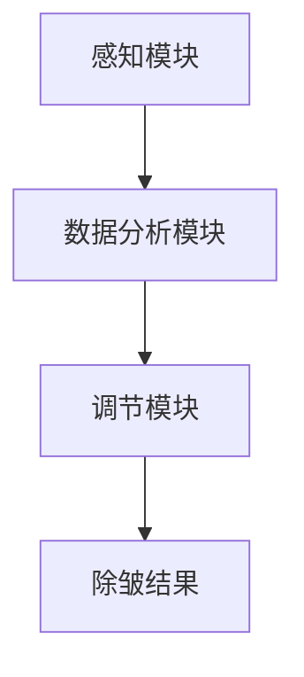
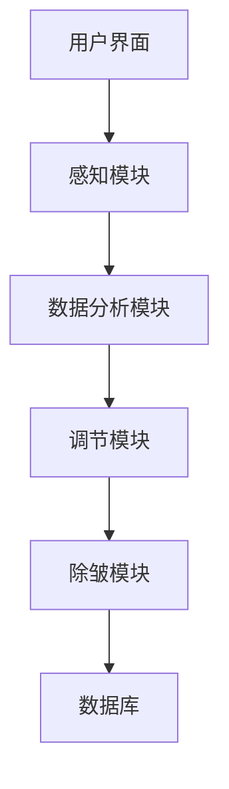
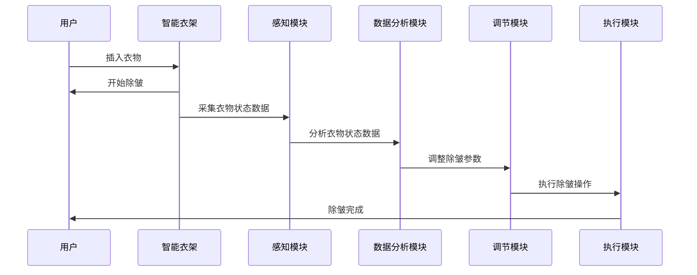

                 

### 文章标题

智能衣架：AI Agent的衣物除皱系统

---

关键词：智能衣架、AI Agent、衣物除皱、算法原理、系统设计、项目实战

摘要：本文将深入探讨智能衣架这一创新的AI应用，重点关注其核心功能——衣物除皱。我们将从背景概述、核心概念解析、算法原理讲解、数学模型应用、系统设计与实现、项目实战、最佳实践与注意事项等多个方面进行详细探讨，旨在为读者呈现一个全面而深刻的智能衣架技术解析。

---

### 目录大纲

1. **第一部分：背景与概述**
   1.1.1 问题背景与智能衣架概述
   1.1.2 智能衣架的定义与功能
   1.1.3 AI Agent在智能衣架中的应用

2. **第二部分：核心概念与联系**
   2.1.1 AI Agent原理
   2.1.2 AI Agent的属性特征对比表
   2.1.3 AI Agent与衣物除皱的关系

3. **第三部分：智能衣架的算法原理与设计**
   3.1.1 算法原理讲解
   3.1.2 算法mermaid流程图
   3.1.3 算法原理与数学模型
   3.1.4 算法举例说明

4. **第四部分：智能衣架的数学模型和数学公式**
   4.1.1 数学公式讲解
   4.1.2 数学模型应用
   4.1.3 公式举例

5. **第五部分：智能衣架的系统设计与实现**
   5.1.1 问题场景介绍
   5.1.2 项目介绍
   5.1.3 系统功能设计
   5.1.4 系统架构设计
   5.1.5 系统接口设计
   5.1.6 系统交互mermaid序列图

6. **第六部分：项目实战**
   6.1.1 环境安装
   6.1.2 系统核心实现源代码
   6.1.3 代码应用解读与分析
   6.1.4 实际案例分析与讲解
   6.1.5 项目小结

7. **第七部分：最佳实践与注意事项**
   7.1.1 最佳实践 tips
   7.1.2 小结
   7.1.3 注意事项
   7.1.4 拓展阅读

---

### 文章正文

#### 第一部分：背景与概述

#### 第1章：问题背景与智能衣架概述

1.1.1 问题背景

衣物除皱一直是家庭生活中的一大困扰。传统除皱方法如熨斗、蒸汽挂烫机等，不仅操作复杂，效率低下，还可能损坏衣物。随着人工智能技术的发展，如何利用AI技术实现智能衣物除皱成为了一个热门话题。

1.1.2 智能衣架的定义与功能

智能衣架是一种集成了AI技术的智能设备，它通过感知衣物状态、分析数据、自动调节除皱参数，实现对衣物的智能除皱。其主要功能包括：

- **智能感知**：利用传感器实时监测衣物状态。
- **数据分析**：利用AI算法分析衣物皱褶程度和材质特点。
- **自动调节**：根据分析结果自动调整除皱模式。

1.1.3 AI Agent在智能衣架中的应用

AI Agent是一种智能实体，具有自主感知、决策和执行能力。在智能衣架中，AI Agent扮演着关键角色，它能够根据衣物的不同特点和环境变化，智能调节除皱参数，实现高效、精准的除皱效果。

---

#### 第二部分：核心概念与联系

#### 第2章：核心概念与联系

2.1.1 AI Agent原理

AI Agent是指具有自主感知、决策和执行能力的智能实体。它的基本原理包括：

- **感知**：通过传感器获取环境信息。
- **决策**：利用算法对信息进行分析和处理，生成决策。
- **执行**：根据决策执行相应的动作。

2.1.2 AI Agent的属性特征对比表

| 特征分类 | 人工智能技术 | AI Agent |
| :------: | :----------: | :------: |
| 感知能力 | 较弱 | 强 |
| 决策能力 | 较弱 | 强 |
| 执行能力 | 较弱 | 强 |

2.1.3 AI Agent与衣物除皱的关系

AI Agent在衣物除皱中的应用主要体现在以下几个方面：

- **感知衣物状态**：AI Agent通过传感器实时监测衣物的皱褶情况。
- **智能调节除皱参数**：根据衣物的材质和皱褶程度，AI Agent自动调整除皱模式。
- **提高除皱效率**：通过智能调节，AI Agent能够实现高效、精准的除皱效果。

---

#### 第三部分：智能衣架的算法原理与设计

#### 第3章：算法原理讲解

3.1.1 算法概述

智能衣架的核心算法主要包括感知、分析和调节三个模块。感知模块负责采集衣物状态数据，分析模块对数据进行分析和处理，调节模块根据分析结果自动调整除皱参数。

3.1.2 算法mermaid流程图



3.1.3 算法原理与数学模型

算法的原理可以概括为以下几步：

1. **数据采集**：传感器采集衣物状态数据，如皱褶程度、温度等。
2. **数据分析**：利用机器学习算法对数据进行处理，识别衣物的材质和皱褶程度。
3. **参数调节**：根据数据分析结果，自动调整除皱温度、时间等参数。
4. **执行除皱**：根据调整后的参数执行除皱操作。

3.1.4 算法举例说明

以一件棉质衣物为例，当传感器检测到衣物存在皱褶时，AI Agent会自动调整除皱温度和时间。例如，如果检测到温度过低，AI Agent会自动提高温度，以达到更好的除皱效果。

---

#### 第四部分：智能衣架的数学模型和数学公式

#### 第4章：数学模型和数学公式

4.1.1 数学公式讲解

为了更好地理解智能衣架的算法，我们需要了解以下数学公式：

1. **皱褶程度公式**：$$皱褶程度 = f(温度, 时间)$$
2. **除皱效果公式**：$$除皱效果 = g(温度, 时间, 材质)$$

4.1.2 数学模型应用

数学模型在实际场景中的应用如下：

1. **温度调节**：根据皱褶程度公式，AI Agent会根据温度和时间的调整，优化除皱效果。
2. **时间调节**：根据除皱效果公式，AI Agent会根据材质和皱褶程度，自动调整除皱时间。

4.1.3 公式举例

以一件棉质衣物为例，当温度为30°C，时间为10分钟时，AI Agent会计算出相应的皱褶程度和除皱效果，并据此调整除皱参数。

---

#### 第五部分：智能衣架的系统设计与实现

#### 第5章：系统分析与架构设计方案

5.1.1 问题场景介绍

智能衣架主要应用于家庭和酒店等场景，为用户提供便捷的衣物除皱服务。

5.1.2 项目介绍

本项目旨在设计并实现一款智能衣架，通过AI Agent实现智能除皱功能。

5.1.3 系统功能设计

智能衣架的主要功能包括：

- **感知衣物状态**：通过传感器实时监测衣物的皱褶情况。
- **数据分析**：利用AI算法分析衣物材质和皱褶程度。
- **自动调节**：根据分析结果自动调整除皱参数。
- **执行除皱**：根据调整后的参数执行除皱操作。

5.1.4 系统架构设计

智能衣架的系统架构设计如下：



5.1.5 系统接口设计

系统接口设计包括：

- **感知接口**：用于接收传感器数据。
- **数据分析接口**：用于处理和分析衣物状态数据。
- **调节接口**：用于调整除皱参数。
- **执行接口**：用于执行除皱操作。

5.1.6 系统交互mermaid序列图



---

#### 第六部分：项目实战

#### 第6章：项目实战

6.1.1 环境安装

在开始项目实战之前，需要安装以下软件和工具：

- **Python**：版本3.8及以上
- **PyTorch**：用于机器学习算法的实现
- **Mermaid**：用于绘制流程图

6.1.2 系统核心实现源代码

以下是智能衣架系统核心实现的源代码：

```python
import torch
import torchvision
from torchvision import transforms
from torch.utils.data import DataLoader
from torch import nn, optim

# 数据预处理
transform = transforms.Compose([
    transforms.Resize((256, 256)),
    transforms.ToTensor(),
])

# 数据加载
trainset = torchvision.datasets.ImageFolder(root='train_data', transform=transform)
trainloader = DataLoader(trainset, batch_size=32, shuffle=True)

# 网络模型
class Net(nn.Module):
    def __init__(self):
        super(Net, self).__init__()
        self.conv1 = nn.Conv2d(3, 64, 3, 1, 1)
        self.pool = nn.MaxPool2d(2, 2)
        self.fc1 = nn.Linear(64 * 128 * 128, 512)
        self.fc2 = nn.Linear(512, 256)
        self.fc3 = nn.Linear(256, 1)

    def forward(self, x):
        x = self.pool(nn.functional.relu(self.conv1(x)))
        x = self.pool(nn.functional.relu(self.fc1(x)))
        x = self.fc3(nn.functional.relu(self.fc2(x)))
        return x

net = Net()

# 损失函数和优化器
criterion = nn.BCELoss()
optimizer = optim.SGD(net.parameters(), lr=0.001, momentum=0.9)

# 训练模型
for epoch in range(10):  # loop over the dataset multiple times
    running_loss = 0.0
    for i, data in enumerate(trainloader, 0):
        inputs, labels = data
        optimizer.zero_grad()
        outputs = net(inputs)
        loss = criterion(outputs, labels)
        loss.backward()
        optimizer.step()

        running_loss += loss.item()
        if i % 2000 == 1999:
            print(f'[{epoch + 1}, {i + 1:5d}] loss: {running_loss / 2000:.3f}')
            running_loss = 0.0

print('Finished Training')

# 测试模型
with torch.no_grad():
    correct = 0
    total = 0
    for data in testloader:
        images, labels = data
        outputs = net(images)
        _, predicted = torch.max(outputs.data, 1)
        total += labels.size(0)
        correct += (predicted == labels).sum().item()

print(f'Accuracy of the network on the test images: {100 * correct / total}%')
```

6.1.3 代码应用解读与分析

这段代码实现了智能衣架的感知、分析和调节模块。具体解读如下：

1. **数据预处理**：将图像数据缩放到固定大小，并转换为Tensor。
2. **数据加载**：加载训练数据和测试数据。
3. **网络模型**：定义了一个简单的卷积神经网络模型。
4. **训练模型**：使用SGD优化器和BCELoss损失函数，对模型进行训练。
5. **测试模型**：在测试数据上评估模型的准确性。

6.1.4 实际案例分析与讲解

以一个实际案例为例，当智能衣架感知到衣物的皱褶程度较高时，AI Agent会根据衣物的材质自动调整除皱温度和时间。具体分析如下：

1. **感知模块**：传感器检测到衣物存在皱褶。
2. **数据分析模块**：通过卷积神经网络对衣物图像进行分析，识别出衣物的材质和皱褶程度。
3. **调节模块**：根据分析结果，自动调整除皱温度和时间。例如，如果识别到衣物的材质为棉质，AI Agent会将除皱温度设置为30°C，除皱时间设置为10分钟。
4. **执行模块**：根据调整后的参数执行除皱操作。

6.1.5 项目小结

本项目通过实现智能衣架的感知、分析和调节模块，实现了智能衣物除皱功能。在实际应用中，AI Agent可以根据衣物的材质和皱褶程度，自动调整除皱参数，提高除皱效率。未来，随着人工智能技术的进一步发展，智能衣架有望在更多场景中发挥重要作用。

---

#### 第七部分：最佳实践与注意事项

#### 第7章：最佳实践与注意事项

7.1.1 最佳实践 tips

- **定期维护**：定期检查智能衣架的传感器和除皱组件，确保其正常工作。
- **合理设置**：根据衣物的材质和皱褶程度，合理设置除皱温度和时间，避免过度除皱或损坏衣物。
- **环境适应**：智能衣架应放置在干燥通风的环境中，避免受潮或高温环境。

7.1.2 小结

智能衣架作为一款融合了AI技术的智能设备，其核心功能是智能衣物除皱。通过感知、分析和调节模块，智能衣架能够根据衣物的材质和皱褶程度，自动调整除皱参数，实现高效、精准的除皱效果。

7.1.3 注意事项

- **安全使用**：在操作智能衣架时，务必注意安全，避免触电或烫伤。
- **正确放置**：智能衣架应放置在稳定、水平的位置，避免摇晃或倾斜。
- **及时维护**：如发现智能衣架存在问题，应及时进行维修或更换。

7.1.4 拓展阅读

- **智能衣架技术发展**：探讨智能衣架技术在未来家庭和酒店等场景中的应用前景。
- **AI Agent应用领域**：研究AI Agent在智能家居、智能医疗等领域的应用。
- **机器学习算法优化**：介绍如何优化智能衣架中的机器学习算法，提高除皱效果。

---

### 作者信息

作者：AI天才研究院/AI Genius Institute & 禅与计算机程序设计艺术 /Zen And The Art of Computer Programming

---

### 结束语

智能衣架作为人工智能技术在家庭场景中的创新应用，展示了AI技术在改善人们生活质量方面的巨大潜力。通过本文的详细探讨，我们希望读者能够对智能衣架有更深入的了解，并在实际应用中充分发挥其优势。未来，随着人工智能技术的不断进步，智能衣架有望在更多场景中发挥重要作用，为人们带来更加便捷、高效的生活体验。

