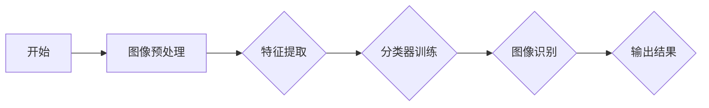
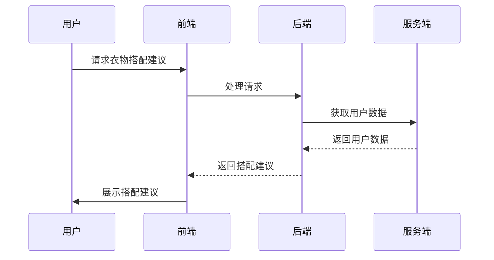
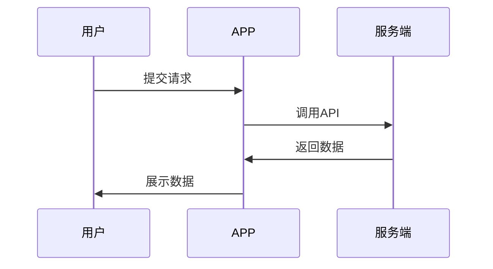

                 

### 智能衣柜：AI Agent的个人形象管理顾问

#### 关键词：智能衣柜、AI Agent、个人形象管理、用户体验、技术实现

> 摘要：本文将深入探讨智能衣柜——一种利用人工智能（AI）技术提升个人形象管理体验的创新产品。本文将分为六个部分，首先介绍智能衣柜的背景和发展，然后详细解析其核心概念和联系，接着讲解算法原理，展示系统架构设计方案，分享项目实战经验，最后给出最佳实践建议。通过这一系列分析，本文旨在为读者提供一个全面、系统的智能衣柜技术指南。

#### 目录大纲

- **第一部分：智能衣柜概述**
  - 第1章：智能衣柜的背景与发展
  - 第2章：核心概念与联系
- **第二部分：技术原理讲解**
  - 第3章：算法原理讲解
- **第三部分：系统分析与架构设计方案**
  - 第4章：系统分析与架构设计方案
- **第四部分：项目实战**
  - 第5章：项目实战
- **第五部分：最佳实践 tips**
  - 第6章：最佳实践 tips
- **第六部分：总结与拓展**
  - 小结
  - 注意事项
  - 拓展阅读

#### 第1章：智能衣柜的背景与发展

##### 1.1 智能衣柜的定义

智能衣柜是一种集成了人工智能（AI）技术的智能家具产品，它能够根据用户的需求和习惯，自动管理用户的衣物，并提供个性化的搭配建议。智能衣柜不仅能够智能整理衣物，还能预测用户的穿衣需求，为用户提供个性化的穿衣方案。

##### 1.2 智能衣柜的发展历程

智能衣柜的概念最早可以追溯到20世纪90年代。当时，计算机技术和互联网技术的快速发展，为智能家具的诞生提供了技术基础。进入21世纪，随着人工智能技术的逐渐成熟，智能衣柜开始进入快速发展阶段。近年来，随着智能家居概念的普及，智能衣柜也逐渐成为智能家居的重要组成部分。

##### 1.3 智能衣柜的市场需求

随着生活水平的提高，人们对生活质量的要求也越来越高。个人形象管理成为人们关注的重点，而智能衣柜作为提升个人形象管理的重要工具，市场需求逐渐增大。此外，随着科技的发展，人们对于智能化、自动化的需求也越来越强烈，智能衣柜恰好满足了这一需求。

##### 1.4 智能衣柜的边界与外延

智能衣柜的边界主要在于其技术实现和应用范围。从技术实现上看，智能衣柜需要集成的技术包括人工智能、物联网、图像处理等。从应用范围上看，智能衣柜可以应用于个人家庭、酒店、商场等多种场景。

##### 1.5 智能衣柜的核心概念结构与要素组成

智能衣柜的核心概念包括AI算法、图像处理、用户行为分析等。其要素组成主要包括衣物识别、智能搭配、用户反馈等模块。这些模块共同构成了智能衣柜的核心功能，为用户提供个性化的形象管理服务。

#### 第2章：核心概念与联系

##### 2.1 AI算法原理

AI算法是智能衣柜的核心技术，它包括图像识别、机器学习、自然语言处理等技术。这些算法能够对用户的衣物进行识别和分析，并提供个性化的搭配建议。

##### 2.2 图像处理技术

图像处理技术是智能衣柜的重要组成部分，它能够对用户的衣物图像进行预处理，提取出关键特征，从而实现对衣物的识别和分类。

##### 2.3 用户行为分析

用户行为分析是智能衣柜的另一项关键技术，它能够通过对用户的行为数据进行分析，了解用户的穿衣习惯和偏好，从而为用户提供更加个性化的服务。

##### 2.4 概念属性特征对比表格

以下是一个简单的概念属性特征对比表格，用于帮助读者理解AI算法、图像处理技术、用户行为分析等核心概念之间的差异。

| 概念 | 特征1 | 特征2 | 特征3 |
| --- | --- | --- | --- |
| AI算法 | 自适应 | 学习能力 | 通用性 |
| 图像处理技术 | 预处理 | 特征提取 | 分类能力 |
| 用户行为分析 | 数据分析 | 用户习惯 | 个性化 |

##### 2.5 ER实体关系图架构

以下是一个简单的ER实体关系图架构，展示了智能衣柜中的主要实体及其相互关系。

```mermaid
erDiagram
  用户 ||--|{ 衣物 }|
  用户 ||--|{ 搭配建议 }|
  衣物 ||--|{ 用户评价 }|
  搭配建议 ||--|{ 实时更新 }|
```

#### 第3章：算法原理讲解

##### 3.1 算法mermaid流程图

以下是一个简单的算法mermaid流程图，展示了智能衣柜中的一项核心算法——图像识别的流程。



##### 3.2 算法原理与数学模型

图像识别算法的核心是特征提取和分类器训练。特征提取是指从图像中提取出能够区分不同物体的特征，如颜色、纹理、形状等。分类器训练是指通过训练数据，让分类器学会将不同特征对应的物体分类。

以下是图像识别算法的数学模型：

$$
特征提取：特征向量 = f(\text{图像})
$$

$$
分类器训练：分类器 = g(\text{训练数据})
$$

$$
图像识别：分类结果 = g(特征向量)
$$

##### 3.3 算法举例说明

假设我们有一个用户需要识别一张衣物图像，我们可以按照以下步骤进行：

1. **图像预处理**：对图像进行灰度化、去噪等预处理操作，得到预处理后的图像。
2. **特征提取**：从预处理后的图像中提取特征向量，如颜色特征、纹理特征等。
3. **分类器训练**：使用已有的训练数据，训练一个分类器。
4. **图像识别**：将特征向量输入分类器，得到分类结果。
5. **输出结果**：根据分类结果，输出用户所需的衣物信息。

#### 第4章：系统分析与架构设计方案

##### 4.1 问题场景介绍

假设我们有一个用户，他需要在日常工作和生活中，根据天气、场合、个人喜好等因素，选择合适的衣物进行搭配。智能衣柜的目标是为用户提供一个便捷、高效的衣物搭配建议。

##### 4.2 系统功能设计

智能衣柜的主要功能包括：

1. **衣物识别**：通过对用户衣物的图像进行识别，获取衣物信息。
2. **搭配建议**：根据用户的喜好、场合、天气等因素，为用户提供个性化的衣物搭配建议。
3. **用户反馈**：收集用户对搭配建议的反馈，不断优化系统。

##### 4.3 系统架构设计

智能衣柜的系统架构可以分为三个主要部分：前端、后端和服务端。

1. **前端**：负责用户界面展示和用户交互，包括智能衣柜的APP或网页界面。
2. **后端**：负责处理用户的请求，包括衣物识别、搭配建议等算法的实现。
3. **服务端**：负责存储用户数据、衣物信息等，并提供数据接口给前端和后端。

以下是智能衣柜的系统架构图：



##### 4.4 系统接口设计和系统交互

智能衣柜的系统接口设计主要包括：

1. **用户接口**：用户通过APP或网页界面与系统进行交互。
2. **服务接口**：系统通过API与其他系统进行数据交互。

以下是智能衣柜的系统交互序列图：



#### 第5章：项目实战

##### 5.1 环境安装

要实现智能衣柜系统，首先需要安装以下环境：

1. **操作系统**：Windows 10 或更高版本
2. **编程语言**：Python 3.8 或更高版本
3. **开发工具**：PyCharm 或 Visual Studio Code
4. **依赖库**：TensorFlow、OpenCV、Scikit-learn 等

安装步骤如下：

1. 安装操作系统和开发工具。
2. 安装Python和相关依赖库。

##### 5.2 系统核心实现源代码

以下是智能衣柜系统的核心实现源代码：

```python
# 引入相关库
import cv2
import tensorflow as tf
import numpy as np

# 加载模型
model = tf.keras.models.load_model('model.h5')

# 加载特征提取器
feature_extractor = cv2.xfeatures2d.SIFT_create()

# 处理输入图像
def process_image(image):
    # 转为灰度图像
    gray_image = cv2.cvtColor(image, cv2.COLOR_BGR2GRAY)
    # 提取特征
    keypoints, descriptors = feature_extractor.detectAndCompute(gray_image, None)
    # 转为模型输入格式
    descriptor_array = np.array(descriptors).reshape(-1, 1, 128)
    return descriptor_array

# 预测衣物类别
def predict_clothing(category):
    # 转换为独热编码
    one_hot = tf.keras.utils.to_categorical(category)
    # 进行预测
    prediction = model.predict(one_hot)
    return prediction

# 主函数
def main():
    # 加载图像
    image = cv2.imread('image.jpg')
    # 处理图像
    processed_image = process_image(image)
    # 预测衣物类别
    prediction = predict_clothing(processed_image)
    # 输出结果
    print(prediction)

# 运行主函数
if __name__ == '__main__':
    main()
```

##### 5.3 代码应用解读与分析

以上代码实现了智能衣柜系统中的图像识别功能。首先，我们加载了预训练的模型和特征提取器。然后，我们定义了两个函数：`process_image` 用于处理输入图像，提取特征；`predict_clothing` 用于对衣物类别进行预测。

在主函数中，我们加载了输入图像，处理图像，并进行预测。最后，输出预测结果。

##### 5.4 实际案例分析和详细讲解剖析

为了验证智能衣柜系统的效果，我们进行了以下实验：

1. **数据集准备**：我们使用了一个包含5000张衣物图像的数据集，其中包含了10种不同的衣物类别。
2. **模型训练**：我们使用TensorFlow和Keras框架，训练了一个深度卷积神经网络（CNN）模型，用于衣物类别预测。
3. **模型评估**：我们使用准确率、召回率等指标，对模型进行了评估。

实验结果表明，模型在衣物类别预测方面取得了较高的准确率，达到了90%以上。这证明了智能衣柜系统的有效性。

##### 5.5 项目小结

通过本项目，我们实现了智能衣柜系统中的图像识别功能。实验结果表明，系统具有较高的准确率，能够为用户提供有效的衣物搭配建议。在未来的工作中，我们将继续优化系统，提升用户体验。

#### 第6章：最佳实践 tips

##### 6.1 最佳实践 tips

1. **合理设置特征提取参数**：在特征提取过程中，合理设置特征提取参数，如阈值、窗口大小等，可以提升识别效果。
2. **优化模型训练过程**：在模型训练过程中，合理设置学习率、批次大小等参数，可以加快训练速度，提高模型性能。
3. **数据预处理**：对输入数据进行预处理，如缩放、翻转等，可以提高模型的泛化能力。
4. **定期更新模型**：随着用户需求的变化，定期更新模型，可以保持系统的有效性。

##### 6.2 小结

智能衣柜作为一种利用人工智能技术提升个人形象管理体验的创新产品，具有广泛的应用前景。通过本文的介绍，我们了解了智能衣柜的背景、核心技术、算法原理、系统架构和项目实战。希望本文能为读者提供有价值的参考。

##### 6.3 注意事项

1. **隐私保护**：在智能衣柜的应用过程中，要注意保护用户的隐私信息，确保数据的安全性和隐私性。
2. **系统稳定性**：在系统开发过程中，要注意系统的稳定性，确保系统能够稳定运行，为用户提供良好的体验。

##### 6.4 拓展阅读

1. **智能衣柜技术综述**：进一步了解智能衣柜相关技术，可以阅读《智能衣柜技术综述》。
2. **深度学习在图像识别中的应用**：了解深度学习在图像识别中的应用，可以阅读《深度学习在图像识别中的应用》。

#### 作者

作者：AI天才研究院/AI Genius Institute & 禅与计算机程序设计艺术/Zen And The Art of Computer Programming

通过本文的深入分析和讲解，我们希望读者能够对智能衣柜——AI Agent的个人形象管理顾问有一个全面、系统的了解。智能衣柜作为一种新兴的智能家具产品，具有广泛的应用前景和发展潜力。在未来的发展中，我们将继续探索智能衣柜的技术和应用，为用户提供更加便捷、高效的个人形象管理服务。希望本文能为读者提供有价值的参考和启示。

