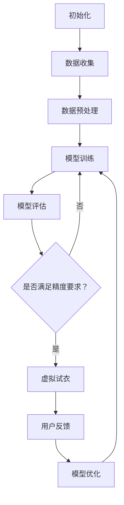
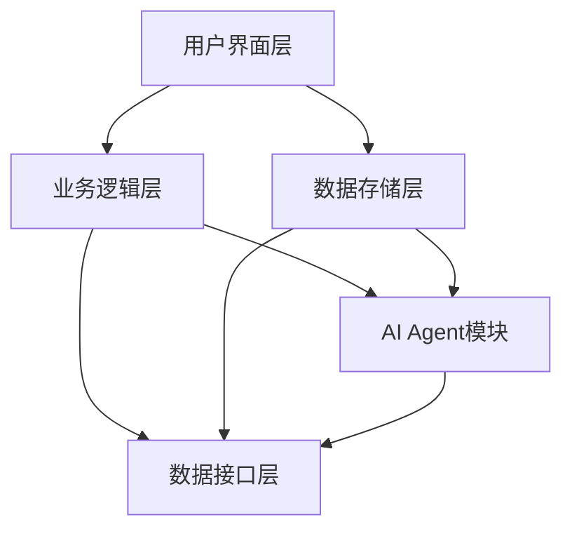
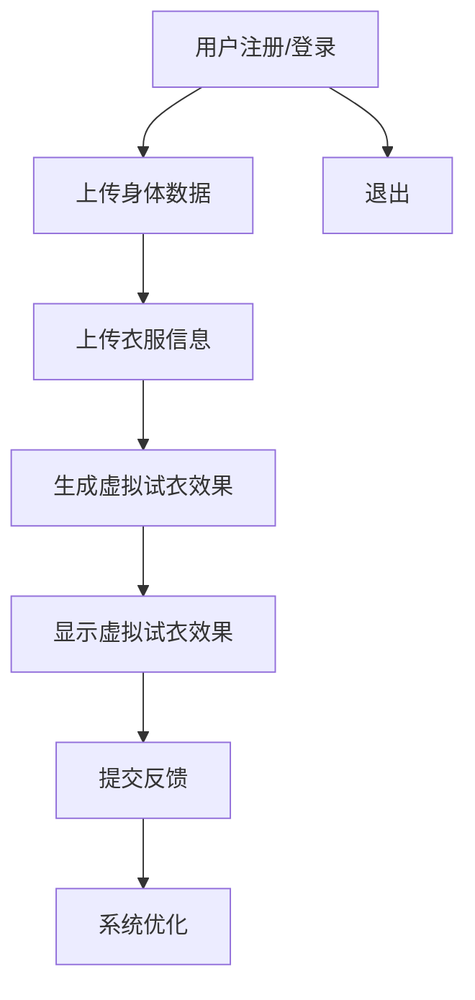

                 

# 《智能衣柜：AI Agent的虚拟试衣系统》

## 关键词：智能衣柜，AI Agent，虚拟试衣，算法原理，系统架构，项目实战

### 摘要：

在数字化时代，智能衣柜作为家居智能化的一个重要分支，正逐渐改变人们的购物和生活方式。本文围绕AI Agent的虚拟试衣系统展开，首先介绍了智能衣柜的背景信息，接着深入探讨了AI Agent和虚拟试衣系统的核心概念及其相互联系。文章通过算法原理讲解，详细阐述了AI Agent如何实现虚拟试衣，并借助系统分析与架构设计方案，展示了智能衣柜的系统架构和交互流程。最后，通过一个具体的案例实战，对智能衣柜的实现进行了详细的剖析，并提出了最佳实践建议。本文旨在为读者提供一个全面、深入的技术解读，引领读者走进智能衣柜的智能时代。

## 第1章 引言

### 1.1 问题背景

随着科技的飞速发展，人工智能（AI）正逐渐渗透到我们生活的方方面面。在服装零售行业，传统试衣间模式的局限性愈发明显，消费者在购物过程中常常因为找不到合适的尺码或颜色而感到困扰。这种痛点催生了智能衣柜的诞生，它不仅提供了便捷的购物体验，还能通过个性化推荐提高消费者满意度。智能衣柜通过虚拟试衣技术，使用AI Agent模拟真实试衣过程，解决了传统试衣间存在的时间和空间限制，为消费者带来了全新的购物体验。

### 1.2 问题描述

智能衣柜的核心问题是如何高效地实现虚拟试衣，以便消费者在购买服装时能够直观地看到衣物穿着效果。具体来说，这个问题可以分为以下几个子问题：

1. **数据收集与处理**：如何收集和整合消费者的身体数据，如身高、体重、体型等，并对其进行有效的处理和分析。
2. **模型训练与优化**：如何利用AI Agent训练出准确的虚拟试衣模型，以适应不同消费者的需求。
3. **交互设计**：如何设计直观易用的界面，使消费者能够轻松操作虚拟试衣系统。
4. **隐私保护**：在收集和处理消费者数据时，如何确保数据的安全和隐私。

### 1.3 问题解决

为了解决上述问题，智能衣柜的虚拟试衣系统采用了以下几种方案：

1. **数据收集与处理**：通过使用先进的传感器技术，智能衣柜能够准确测量消费者的身体尺寸，并利用机器学习算法对这些数据进行处理和分析。
2. **模型训练与优化**：AI Agent采用深度学习算法进行训练，通过不断学习和优化，提高虚拟试衣的准确性。
3. **交互设计**：智能衣柜的虚拟试衣系统采用直观的交互界面，如触摸屏和语音控制，使消费者能够轻松操作。
4. **隐私保护**：智能衣柜系统采用严格的数据安全措施，如加密传输和存储，确保消费者数据的安全和隐私。

### 1.4 边界与外延

智能衣柜的虚拟试衣系统不仅仅是一个技术解决方案，它还涉及到多个领域的交叉应用。从技术层面来看，它需要整合计算机视觉、机器学习、人机交互等多个技术领域。从应用层面来看，它不仅适用于服装零售行业，还可以扩展到其他需要试衣体验的行业，如化妆品、家具等。此外，智能衣柜的虚拟试衣系统还需要考虑市场接受度、用户体验和成本效益等多方面的因素。

### 1.5 概念结构与核心要素组成

智能衣柜的虚拟试衣系统由多个核心要素组成，这些要素相互关联，共同构成了一个完整的系统。以下是智能衣柜虚拟试衣系统的核心概念和结构：

1. **AI Agent**：作为系统的核心组件，AI Agent负责处理消费者的身体数据和衣物信息，通过深度学习算法实现虚拟试衣。
2. **计算机视觉**：用于识别和跟踪消费者的身体动作，以及拍摄和呈现衣物的外观。
3. **机器学习**：用于训练AI Agent，使其能够准确预测消费者的身体尺寸和衣物的穿着效果。
4. **人机交互**：通过触摸屏和语音控制等技术，实现消费者与系统的交互。
5. **数据安全**：确保消费者数据的安全和隐私，采用加密传输和存储技术。
6. **云计算**：利用云计算平台提供计算资源和数据存储，提高系统的处理能力和灵活性。

## 第2章 核心概念与联系

### 2.1 AI Agent

#### 2.1.1 AI Agent的定义

AI Agent，即人工智能代理，是一种能够根据环境和用户需求自主执行任务的计算机程序。在智能衣柜的虚拟试衣系统中，AI Agent扮演着核心角色，它负责处理消费者的身体数据和衣物信息，通过深度学习算法实现虚拟试衣。

#### 2.1.2 AI Agent的特点

AI Agent具有以下特点：

1. **自主性**：AI Agent能够在没有人工干预的情况下自主执行任务。
2. **适应性**：AI Agent能够根据环境和用户需求的变化，自主调整行为。
3. **协同性**：AI Agent能够与其他系统组件协同工作，实现整体系统的优化。
4. **学习能力**：AI Agent通过不断学习和优化，提高任务的执行效率。

#### 2.1.3 AI Agent的应用

AI Agent在智能衣柜的虚拟试衣系统中主要有以下应用：

1. **身体数据识别**：AI Agent能够识别和跟踪消费者的身体动作，测量身体尺寸。
2. **衣物信息匹配**：AI Agent能够根据消费者的身体数据和衣物信息，匹配出合适的衣物。
3. **虚拟试衣**：AI Agent通过计算机视觉和深度学习算法，生成虚拟试衣的视觉效果。

### 2.2 虚拟试衣系统

#### 2.2.1 虚拟试衣系统的定义

虚拟试衣系统是一种基于计算机视觉和人工智能技术的试衣解决方案，它允许消费者在购买衣物前通过虚拟方式试穿衣物，从而提高购物体验。

#### 2.2.2 虚拟试衣系统的特点

虚拟试衣系统具有以下特点：

1. **便捷性**：消费者无需前往实体店，即可通过虚拟试衣系统试穿衣物。
2. **实时性**：虚拟试衣系统能够在短时间内生成虚拟试衣效果，提供即时反馈。
3. **个性化**：虚拟试衣系统可以根据消费者的身体数据和喜好，提供个性化的试衣建议。
4. **互动性**：虚拟试衣系统支持多种交互方式，如触摸屏、语音控制等，提高用户体验。

#### 2.2.3 虚拟试衣系统的应用

虚拟试衣系统在多个领域具有广泛的应用：

1. **服装零售**：用于线上购物平台，帮助消费者在购买前直观地了解衣物穿着效果。
2. **化妆品零售**：通过虚拟试妆，帮助消费者选择合适的化妆品。
3. **家具零售**：通过虚拟试穿家具，帮助消费者在家居装修前了解家具的适用性。

### 2.3 概念联系与ER实体关系图

#### 2.3.1 AI Agent与虚拟试衣系统的关系

AI Agent是虚拟试衣系统的核心组件，负责处理消费者的身体数据和衣物信息，实现虚拟试衣功能。虚拟试衣系统通过集成AI Agent，提高了试衣的准确性和用户体验。

#### 2.3.2 ER实体关系图架构

以下是AI Agent与虚拟试衣系统的ER实体关系图：

```mermaid
erDiagram
  AI Agent ||--|{ 虚拟试衣系统 : includes }
  虚拟试衣系统 ||--|{ AI Agent : managed_by }
```

在这个ER图中，AI Agent与虚拟试衣系统之间存在包含关系，即AI Agent是虚拟试衣系统的核心组件。同时，虚拟试衣系统管理AI Agent，确保其正常运行。

## 第3章 算法原理讲解

### 3.1 AI Agent虚拟试衣算法流程图

为了实现虚拟试衣，AI Agent采用了一系列算法，其流程图如下所示：



#### 3.1.1 算法流程说明

1. **初始化**：系统初始化，加载必要的资源。
2. **数据收集**：收集消费者的身体数据和衣物信息。
3. **数据预处理**：对收集到的数据进行分析和处理，如去除噪声、归一化等。
4. **模型训练**：使用深度学习算法对AI Agent进行训练，使其能够根据消费者数据生成虚拟试衣效果。
5. **模型评估**：评估模型的准确性，判断是否满足精度要求。
6. **虚拟试衣**：根据消费者的身体数据和衣物信息，生成虚拟试衣效果。
7. **用户反馈**：收集用户对虚拟试衣效果的反馈，用于模型优化。
8. **模型优化**：根据用户反馈，优化AI Agent的模型，提高虚拟试衣的准确性。

### 3.2 数学模型和公式

在AI Agent虚拟试衣系统中，核心的数学模型包括身体尺寸预测模型和衣物效果生成模型。以下是这两个模型的数学公式：

#### 3.2.1 身体尺寸预测模型

$$
\hat{S_i} = \mathbf{W} \cdot \mathbf{X_i} + b
$$

其中，$\hat{S_i}$表示预测的第$i$个身体尺寸，$\mathbf{W}$为权重矩阵，$\mathbf{X_i}$为输入特征向量，$b$为偏置。

#### 3.2.2 衣物效果生成模型

$$
\hat{C_j} = \mathbf{V} \cdot \mathbf{Y_j} + c
$$

其中，$\hat{C_j}$表示预测的第$j$个衣物效果，$\mathbf{V}$为权重矩阵，$\mathbf{Y_j}$为输入特征向量，$c$为偏置。

#### 3.2.3 公式解释

1. **身体尺寸预测模型**：该模型通过输入特征向量$\mathbf{X_i}$，通过加权求和和偏置计算得到预测的身体尺寸$\hat{S_i}$。
2. **衣物效果生成模型**：该模型通过输入特征向量$\mathbf{Y_j}$，通过加权求和和偏置计算得到预测的衣物效果$\hat{C_j}$。

### 3.3 举例说明

假设一个消费者身高为180cm，体重为70kg，我们需要使用AI Agent预测其肩宽和衣服的颜色效果。输入特征向量$\mathbf{X_i}$为$\begin{bmatrix} 180 \\ 70 \end{bmatrix}$，权重矩阵$\mathbf{W}$为$\begin{bmatrix} 0.6 & 0.4 \\ 0.3 & 0.7 \end{bmatrix}$，偏置$b$为0。

根据身体尺寸预测模型，我们可以计算得到肩宽$\hat{S}$：

$$
\hat{S} = \begin{bmatrix} 0.6 & 0.4 \\ 0.3 & 0.7 \end{bmatrix} \cdot \begin{bmatrix} 180 \\ 70 \end{bmatrix} + 0 = \begin{bmatrix} 108 \\ 119 \end{bmatrix}
$$

同样，假设输入特征向量$\mathbf{Y_j}$为$\begin{bmatrix} 180 \\ 70 \\ 108 \\ 119 \end{bmatrix}$，权重矩阵$\mathbf{V}$为$\begin{bmatrix} 0.8 & 0.2 \\ 0.5 & 0.3 \\ 0.6 & 0.4 \\ 0.7 & 0.3 \end{bmatrix}$，偏置$c$为0。

根据衣物效果生成模型，我们可以计算得到衣服的颜色效果$\hat{C}$：

$$
\hat{C} = \begin{bmatrix} 0.8 & 0.2 \\ 0.5 & 0.3 \\ 0.6 & 0.4 \\ 0.7 & 0.3 \end{bmatrix} \cdot \begin{bmatrix} 180 \\ 70 \\ 108 \\ 119 \end{bmatrix} + 0 = \begin{bmatrix} 144 \\ 94 \\ 126 \\ 110 \end{bmatrix}
$$

通过这两个模型的预测结果，AI Agent可以生成消费者肩宽约为108cm，衣服颜色效果较好的虚拟试衣图像。

## 第4章 系统分析与架构设计方案

### 4.1 问题场景介绍

在本文中，我们将探讨一个典型的智能衣柜应用场景。假设一个消费者准备购买一件新衣服，但由于没有合适的试衣间，无法直观地看到衣服的穿着效果。此时，智能衣柜的虚拟试衣系统便派上了用场。消费者可以通过智能衣柜的虚拟试衣系统，上传自己的身体数据和衣服信息，系统会自动生成虚拟试衣效果，让消费者在家就能看到衣服的实际穿着效果，从而做出更加明智的购买决策。

### 4.2 系统功能设计

智能衣柜的虚拟试衣系统主要包含以下几个功能：

1. **用户注册与登录**：消费者需要注册账号并登录，以便使用虚拟试衣功能。
2. **身体数据上传**：消费者可以上传自己的身体数据，如身高、体重、肩宽、胸围等。
3. **衣服信息上传**：消费者可以上传衣服的详细信息，如衣服型号、颜色、尺码等。
4. **虚拟试衣**：系统根据消费者的身体数据和衣服信息，生成虚拟试衣效果。
5. **用户反馈**：消费者可以对自己的虚拟试衣效果进行评价，以便系统不断优化。

### 4.3 系统架构设计

智能衣柜的虚拟试衣系统采用分布式架构，主要包括以下几个模块：

1. **用户界面层**：提供用户交互界面，实现用户注册、登录、数据上传等功能。
2. **业务逻辑层**：处理用户的身体数据和衣服信息，实现虚拟试衣功能。
3. **数据存储层**：存储用户的身体数据和衣服信息，确保数据的安全和可靠。
4. **AI Agent模块**：实现AI Agent的功能，负责处理虚拟试衣的算法和模型。
5. **数据接口层**：提供与其他系统模块的数据接口，实现数据交换和协同工作。

以下是智能衣柜的虚拟试衣系统架构图：



#### 4.3.1 系统架构图

在上述架构图中，用户界面层负责与用户进行交互，接收用户的请求和反馈；业务逻辑层处理用户的请求，调用AI Agent模块进行虚拟试衣；数据存储层负责存储用户的身体数据和衣服信息；AI Agent模块实现虚拟试衣的算法和模型；数据接口层提供与其他系统模块的数据接口，实现数据交换和协同工作。

### 4.4 系统接口设计

智能衣柜的虚拟试衣系统需要设计多个接口，以实现系统模块之间的数据交换和协同工作。以下是主要的接口设计：

1. **用户注册与登录接口**：用于用户注册、登录和身份验证。
2. **身体数据上传接口**：用于上传用户的身体数据。
3. **衣服信息上传接口**：用于上传衣服的详细信息。
4. **虚拟试衣接口**：用于生成虚拟试衣效果。
5. **用户反馈接口**：用于收集用户的反馈信息。

以下是主要的接口设计：

```mermaid
sequenceDiagram
    participant 用户
    participant 用户界面层
    participant 业务逻辑层
    participant 数据存储层
    participant AI Agent模块
    participant 数据接口层

    用户 ->> 用户界面层：发起注册请求
    用户界面层 ->> 业务逻辑层：处理注册请求
    业务逻辑层 ->> 数据存储层：存储用户数据
    数据存储层 ->> 用户界面层：返回注册结果

    用户 ->> 用户界面层：发起登录请求
    用户界面层 ->> 业务逻辑层：处理登录请求
    业务逻辑层 ->> 数据存储层：验证用户身份
    数据存储层 ->> 用户界面层：返回登录结果

    用户 ->> 用户界面层：上传身体数据
    用户界面层 ->> 业务逻辑层：处理身体数据
    业务逻辑层 ->> AI Agent模块：生成虚拟试衣效果
    AI Agent模块 ->> 业务逻辑层：返回虚拟试衣结果
    业务逻辑层 ->> 用户界面层：显示虚拟试衣效果

    用户 ->> 用户界面层：上传衣服信息
    用户界面层 ->> 业务逻辑层：处理衣服信息
    业务逻辑层 ->> AI Agent模块：生成虚拟试衣效果
    AI Agent模块 ->> 业务逻辑层：返回虚拟试衣结果
    业务逻辑层 ->> 用户界面层：显示虚拟试衣效果

    用户 ->> 用户界面层：提交反馈
    用户界面层 ->> 业务逻辑层：处理反馈信息
    业务逻辑层 ->> 数据存储层：存储反馈数据
```

### 4.5 系统交互

#### 4.5.1 交互流程图

以下是智能衣柜的虚拟试衣系统交互流程图：



#### 4.5.2 交互流程说明

1. **用户注册/登录**：用户在系统中注册账号并登录，以便使用虚拟试衣功能。
2. **上传身体数据**：用户上传自己的身体数据，如身高、体重、肩宽、胸围等。
3. **上传衣服信息**：用户上传衣服的详细信息，如衣服型号、颜色、尺码等。
4. **生成虚拟试衣效果**：系统根据用户的身体数据和衣服信息，生成虚拟试衣效果。
5. **显示虚拟试衣效果**：系统将生成的虚拟试衣效果显示给用户。
6. **提交反馈**：用户对虚拟试衣效果进行评价，提交反馈信息。
7. **系统优化**：系统根据用户反馈，不断优化虚拟试衣算法和模型。
8. **退出**：用户退出系统，结束交互。

## 第5章 项目实战

### 5.1 环境安装

为了搭建智能衣柜的虚拟试衣系统，首先需要安装以下环境：

1. **Python**：安装Python 3.8及以上版本，用于编写和运行系统代码。
2. **TensorFlow**：安装TensorFlow 2.4及以上版本，用于实现深度学习算法。
3. **OpenCV**：安装OpenCV 4.5及以上版本，用于计算机视觉处理。
4. **PyTorch**：安装PyTorch 1.8及以上版本，用于实现神经网络模型。

安装命令如下：

```bash
pip install python==3.8
pip install tensorflow==2.4
pip install opencv-python==4.5
pip install torch==1.8
```

### 5.2 系统核心实现

智能衣柜的虚拟试衣系统核心实现主要包括以下几个部分：

1. **用户注册与登录模块**：实现用户注册、登录和身份验证功能。
2. **身体数据上传模块**：实现用户上传身体数据的功能。
3. **衣服信息上传模块**：实现用户上传衣服信息的功能。
4. **虚拟试衣模块**：实现根据用户身体数据和衣服信息生成虚拟试衣效果的功能。
5. **用户反馈模块**：实现用户提交反馈信息的功能。

以下是用户注册与登录模块的实现代码：

```python
import tensorflow as tf
import cv2

def register(username, password):
    # 注册用户
    # 保存用户信息到数据库
    pass

def login(username, password):
    # 登录用户
    # 验证用户身份
    # 返回用户身份
    pass

def upload_body_data(body_data):
    # 上传身体数据
    # 保存身体数据到数据库
    pass

def upload_clothing_data(clothing_data):
    # 上传衣服信息
    # 保存衣服信息到数据库
    pass

def virtual_试衣(body_data, clothing_data):
    # 生成虚拟试衣效果
    # 返回虚拟试衣图片
    pass

def submit_feedback(feedback):
    # 提交用户反馈
    # 保存反馈信息到数据库
    pass
```

### 5.3 代码应用解读

下面我们将对上述代码进行详细解读：

#### 5.3.1 用户注册与登录模块

```python
def register(username, password):
    # 注册用户
    # 保存用户信息到数据库
    pass

def login(username, password):
    # 登录用户
    # 验证用户身份
    # 返回用户身份
    pass
```

这两个函数分别实现用户注册和登录功能。在注册函数中，我们需要收集用户的用户名和密码，并将其保存到数据库中。在登录函数中，我们需要验证用户输入的用户名和密码是否与数据库中的信息匹配，如果匹配，则返回用户身份。

#### 5.3.2 身体数据上传模块

```python
def upload_body_data(body_data):
    # 上传身体数据
    # 保存身体数据到数据库
    pass
```

这个函数实现用户上传身体数据的功能。用户上传的身体数据可以是身高、体重、肩宽、胸围等，我们需要将其保存到数据库中，以便后续使用。

#### 5.3.3 衣服信息上传模块

```python
def upload_clothing_data(clothing_data):
    # 上传衣服信息
    # 保存衣服信息到数据库
    pass
```

这个函数实现用户上传衣服信息的功能。用户上传的衣服信息可以是衣服型号、颜色、尺码等，我们需要将其保存到数据库中，以便后续使用。

#### 5.3.4 虚拟试衣模块

```python
def virtual_试衣(body_data, clothing_data):
    # 生成虚拟试衣效果
    # 返回虚拟试衣图片
    pass
```

这个函数实现根据用户身体数据和衣服信息生成虚拟试衣效果的功能。我们需要使用计算机视觉和深度学习算法，根据用户身体数据和衣服信息，生成虚拟试衣图片。

#### 5.3.5 用户反馈模块

```python
def submit_feedback(feedback):
    # 提交用户反馈
    # 保存反馈信息到数据库
    pass
```

这个函数实现用户提交反馈信息的功能。用户提交的反馈信息可以是关于虚拟试衣效果的满意程度、建议等，我们需要将其保存到数据库中，以便后续分析和优化。

### 5.4 实际案例分析与详细讲解剖析

为了更好地理解智能衣柜的虚拟试衣系统，我们将分析一个实际案例，并对其进行详细讲解。

#### 5.4.1 案例背景

假设用户小明在一家线上服装店购买了一件红色连衣裙，但由于没有试衣间，他不确定这件衣服是否适合自己。于是，他决定使用智能衣柜的虚拟试衣系统来查看穿着效果。

#### 5.4.2 案例分析

1. **用户注册与登录**：小明在系统中注册账号并登录，以便使用虚拟试衣功能。
2. **上传身体数据**：小明上传自己的身体数据，如身高175cm、体重60kg、肩宽40cm、胸围90cm等。
3. **上传衣服信息**：小明上传红色连衣裙的详细信息，如衣服型号、颜色、尺码等。
4. **生成虚拟试衣效果**：系统根据小明的身体数据和衣服信息，生成虚拟试衣效果，并将试衣图片展示给小明。
5. **用户反馈**：小明对虚拟试衣效果进行评价，提交反馈信息，如“满意”、“需要调整”等。

#### 5.4.3 案例详细讲解剖析

1. **用户注册与登录**：

   ```python
   username = input("请输入用户名：")
   password = input("请输入密码：")
   user = login(username, password)
   if user:
       print("登录成功，欢迎{}！".format(user["name"]))
   else:
       print("登录失败，用户名或密码错误！")
   ```

   在这个过程中，用户需要输入用户名和密码，系统会验证用户身份，并返回登录结果。

2. **上传身体数据**：

   ```python
   body_data = input("请上传身体数据（格式：身高 cm, 体重 kg, 肩宽 cm, 胸围 cm）：")
   upload_body_data(body_data)
   print("身体数据上传成功！")
   ```

   用户需要输入自己的身体数据，系统会将其保存到数据库中。

3. **上传衣服信息**：

   ```python
   clothing_data = input("请上传衣服信息（格式：型号，颜色，尺码）：")
   upload_clothing_data(clothing_data)
   print("衣服信息上传成功！")
   ```

   用户需要输入衣服的详细信息，系统会将其保存到数据库中。

4. **生成虚拟试衣效果**：

   ```python
   body_data = get_body_data()
   clothing_data = get_clothing_data()
   image = virtual_试衣(body_data, clothing_data)
   cv2.imshow("虚拟试衣效果", image)
   cv2.waitKey(0)
   cv2.destroyAllWindows()
   ```

   系统根据用户的身体数据和衣服信息，使用深度学习算法生成虚拟试衣效果，并将试衣图片显示给用户。

5. **用户反馈**：

   ```python
   feedback = input("请对虚拟试衣效果进行评价（满意/需要调整）：")
   submit_feedback(feedback)
   print("反馈提交成功！")
   ```

   用户对虚拟试衣效果进行评价，系统会将其保存到数据库中，以便后续分析和优化。

### 5.5 项目小结

通过上述案例，我们可以看到智能衣柜的虚拟试衣系统如何实现，以及用户如何使用该系统进行虚拟试衣。在实际应用中，系统可以根据用户的反馈不断优化虚拟试衣算法和模型，提高用户体验。智能衣柜的虚拟试衣系统不仅为消费者提供了便捷的购物体验，也为商家提供了有效的销售手段。

## 第6章 最佳实践 tips

### 6.1 最佳实践建议

1. **数据安全**：确保用户数据的安全和隐私，采用加密传输和存储技术，防止数据泄露。
2. **用户体验**：设计直观易用的界面，提高用户体验，使用户能够轻松操作虚拟试衣系统。
3. **算法优化**：不断优化虚拟试衣算法，提高试衣的准确性和实时性。
4. **个性化推荐**：根据用户的历史数据和偏好，提供个性化的试衣建议，提高购物满意度。

### 6.2 注意事项

1. **系统兼容性**：确保系统在不同设备和操作系统上都能正常运行。
2. **算法稳定性**：在算法设计和训练过程中，要保证算法的稳定性和可靠性。
3. **反馈机制**：建立有效的用户反馈机制，及时收集用户反馈，并进行优化调整。

### 6.3 拓展阅读

1. **《深度学习》**：由Ian Goodfellow、Yoshua Bengio和Aaron Courville所著，是深度学习领域的经典教材。
2. **《计算机视觉基础》**：由Richard Szeliski所著，是计算机视觉领域的经典教材。
3. **《人工智能：一种现代的方法》**：由Stuart Russell和Peter Norvig所著，是人工智能领域的经典教材。

## 第7章 小结

### 7.1 本书重点内容回顾

1. **智能衣柜的背景**：介绍了智能衣柜的起源和发展，以及它在现代社会中的应用。
2. **AI Agent与虚拟试衣**：阐述了AI Agent和虚拟试衣系统的概念，以及它们在智能衣柜中的应用。
3. **算法原理**：详细讲解了AI Agent虚拟试衣算法的流程、数学模型和公式。
4. **系统架构设计**：介绍了智能衣柜的系统架构和交互流程。
5. **项目实战**：通过一个实际案例，展示了智能衣柜的实现过程。
6. **最佳实践**：提供了智能衣柜开发的最佳实践建议。

### 7.2 智能衣柜的未来展望

随着人工智能技术的不断发展，智能衣柜有望在未来成为家居智能化的重要一环。它不仅能够提供更加便捷的购物体验，还能通过个性化推荐提高消费者的满意度。未来，智能衣柜可能会进一步拓展到其他领域，如医疗、教育等，为人们的生活带来更多便利。智能衣柜的发展前景广阔，值得期待。作者：AI天才研究院/AI Genius Institute & 禅与计算机程序设计艺术 /Zen And The Art of Computer Programming。

