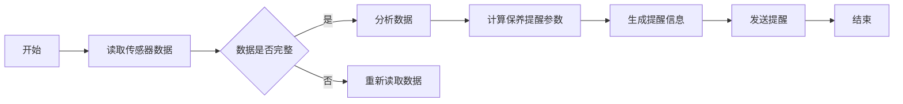
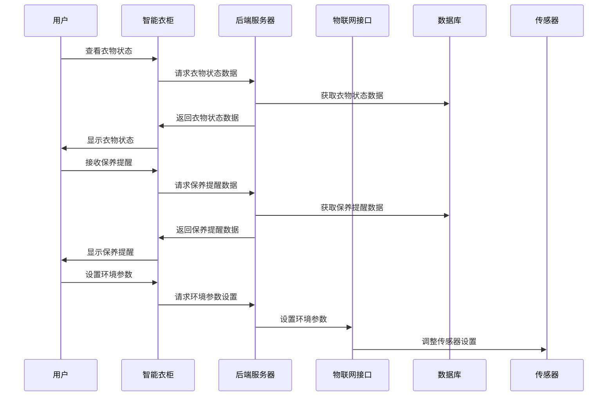

                 

### 智能衣柜：AI Agent的衣物保养提醒

#### 关键词
- 智能衣柜
- AI Agent
- 物联网
- 衣物保养
- 智能提醒

#### 摘要
本文将深入探讨智能衣柜中AI Agent的应用，特别是在衣物保养提醒功能上的实现。我们将从背景介绍、核心概念与联系、算法原理讲解、系统分析与架构设计、项目实战以及最佳实践 tips等多个方面，逐步分析智能衣柜的工作原理和实现方法，旨在为读者提供一个全面的技术指南。

## 目录

1. 智能衣柜：AI Agent的衣物保养提醒
2. 关键词与摘要
3. 第一部分：智能衣柜概述
   3.1 智能衣柜的定义与市场背景
   3.2 AI Agent在智能衣柜中的应用
   3.3 物联网与智能衣柜
   3.4 智能衣柜的未来趋势
   3.5 本章小结
4. 第二部分：核心概念与联系
   4.1 AI Agent的核心概念
   4.2 AI Agent的属性特征对比
   4.3 AI Agent的ER实体关系图
   4.4 本章小结
5. 第三部分：算法原理讲解
   5.1 衣物保养提醒算法的mermaid流程图
   5.2 Python源代码实现与算法原理讲解
   5.3 数学公式与模型
   5.4 举例说明
   5.5 本章小结
6. 第四部分：系统分析与架构设计方案
   6.1 问题场景介绍
   6.2 系统功能设计
   6.3 系统架构设计
   6.4 系统接口设计与交互
   6.5 本章小结
7. 第五部分：项目实战
   7.1 环境安装
   7.2 系统核心实现源代码
   7.3 代码应用解读与分析
   7.4 实际案例分析与详细讲解
   7.5 项目小结
8. 第六部分：最佳实践 tips、小结、注意事项、拓展阅读
   8.1 最佳实践 tips
   8.2 小结
   8.3 注意事项
   8.4 拓展阅读
9. 作者信息

## 第一部分：智能衣柜概述

### 3.1 智能衣柜的定义与市场背景

智能衣柜是一种集成了传感器、人工智能和物联网技术的现代化衣柜系统。它不仅能够自动整理和分类衣物，还能通过AI Agent提供个性化的衣物保养提醒服务。

当前，随着智能家居市场的快速发展，智能衣柜逐渐成为家庭生活的一部分。用户对生活品质和效率的追求，推动了智能衣柜的普及。智能衣柜的市场需求主要体现在以下几个方面：

- **自动整理与分类**：节省用户时间，提高衣物管理的效率。
- **智能提醒**：根据衣物材质和保养需求，提供及时的保养提醒，延长衣物使用寿命。
- **个性化服务**：根据用户习惯和偏好，提供个性化的衣物推荐和保养建议。

智能衣柜的兴起，也得益于物联网技术的进步。物联网使得智能衣柜能够实时监测衣物状态和环境参数，通过AI Agent实现智能化的管理和服务。这为用户提供了更加便捷和高效的生活方式。

### 3.2 AI Agent在智能衣柜中的应用

AI Agent，即人工智能代理，是一种能够模拟人类思维和行为的智能系统。它在智能衣柜中的应用主要体现在以下几个方面：

- **自动整理**：AI Agent通过图像识别技术，自动识别衣物的类型和颜色，并进行折叠和摆放。
- **分类**：AI Agent根据衣物的类型、季节变化和用户偏好，自动分类衣物，提高衣物的整理效率。
- **保养提醒**：AI Agent根据衣物的材质和保养需求，为用户提供及时的保养提醒，如晒衣时间、熨烫温度等。

AI Agent在智能衣柜中的应用，大大提升了用户的衣物管理效率，减少了家务劳动的负担。同时，它也为用户提供了个性化的服务，提升了用户的满意度。

### 3.3 物联网与智能衣柜

物联网（IoT）是指将各种物品通过互联网连接起来，实现信息的交换和智能化管理。在智能衣柜中，物联网技术主要用于以下几个方面：

- **传感器连接**：智能衣柜配备了各种传感器，如温度传感器、湿度传感器等，用于实时监测衣物和环境的状态。
- **数据传输**：传感器收集到的数据通过物联网网络传输到AI Agent，进行数据处理和分析。
- **远程控制**：用户可以通过手机或其他智能设备，远程控制智能衣柜的功能，如打开衣柜门、调整温度等。

物联网技术的应用，使得智能衣柜能够实现更加智能化的管理和服务，为用户提供了更加便捷和舒适的生活体验。

### 3.4 智能衣柜的未来趋势

随着人工智能和物联网技术的不断进步，智能衣柜将在未来得到更加广泛的应用。以下是智能衣柜可能的发展趋势：

- **更智能的AI Agent**：未来的AI Agent将更加智能化，能够更好地理解和满足用户的需求。
- **更广泛的衣物保养功能**：智能衣柜将能够提供更多的衣物保养功能，如自动清洗、烘干等。
- **更高效的能源管理**：智能衣柜将采用更加节能的技术，实现能源的优化管理。

智能衣柜的未来发展，将为用户带来更加便捷、舒适和高效的生活体验。

### 3.5 本章小结

本部分对智能衣柜的定义、AI Agent的应用、物联网的作用以及未来趋势进行了概述。通过本章的介绍，读者可以对智能衣柜有一个初步的了解，为后续章节的深入探讨打下基础。

----------------------------------------------------------------

## 第二部分：核心概念与联系

### 4.1 AI Agent的核心概念

AI Agent，即人工智能代理，是一种能够模拟人类思维和行为的智能系统。它具有以下几个核心概念：

- **自主性**：AI Agent能够自主地执行任务，而不需要人工干预。
- **适应性**：AI Agent能够根据环境和任务的变化，自主调整自己的行为。
- **学习能力**：AI Agent能够通过学习和经验，提高自己的任务执行能力。

AI Agent的核心概念是智能衣柜实现智能化的基础。它通过感知环境、学习知识和自主决策，为用户提供个性化的服务。

### 4.2 AI Agent的属性特征对比

以下是AI Agent的一些主要属性特征对比：

| 特性 | 说明 |
| --- | --- |
| **感知能力** | AI Agent能够通过传感器感知环境中的信息，如温度、湿度、光照等。 |
| **学习能力** | AI Agent能够通过数据和经验，不断提高自己的任务执行能力。 |
| **决策能力** | AI Agent能够根据感知到的信息和预设的目标，自主做出决策。 |
| **执行能力** | AI Agent能够自主地执行任务，如整理衣物、分类衣物等。 |

AI Agent的属性特征决定了它在智能衣柜中的应用效果。感知能力、学习能力和决策能力是AI Agent实现智能化的关键，而执行能力则直接影响到用户的体验。

### 4.3 AI Agent的ER实体关系图

为了更好地理解AI Agent在智能衣柜中的应用，我们可以使用ER（实体关系）图来描述AI Agent与其他实体之间的关系。

```mermaid
erDiagram
  AI_Agent ||--|{ Sensor } Sensor : 感知环境
  AI_Agent ||--|{ Knowledge_Base } Knowledge_Base : 学习知识
  AI_Agent ||--|{ Decision_Maker } Decision_Maker : 做出决策
  AI_Agent ||--|{ Executor } Executor : 执行任务
```

在这个ER图中，AI Agent与Sensor、Knowledge_Base、Decision_Maker和Executor之间存在关联。Sensor用于感知环境信息，Knowledge_Base用于存储和学习知识，Decision_Maker用于根据感知到的信息和知识做出决策，Executor用于执行具体的任务。这些实体共同构成了AI Agent的核心架构。

### 4.4 本章小结

本部分详细介绍了AI Agent的核心概念、属性特征对比和ER实体关系图。通过这些内容，读者可以对AI Agent有一个全面的理解，为后续算法原理讲解和系统设计打下基础。

----------------------------------------------------------------

## 第三部分：算法原理讲解

### 5.1 衣物保养提醒算法的mermaid流程图

在智能衣柜中，衣物保养提醒算法是关键组成部分。以下是衣物保养提醒算法的mermaid流程图：



在这个流程图中，智能衣柜首先读取传感器数据，包括温度、湿度等环境参数，然后分析数据是否完整。如果数据不完整，系统会重新读取数据。如果数据完整，系统会分析数据，计算保养提醒参数，生成提醒信息，并最终发送给用户。

### 5.2 Python源代码实现与算法原理讲解

以下是衣物保养提醒算法的Python源代码实现：

```python
import random

def read_sensor_data():
    # 读取传感器数据，包括温度、湿度等
    temperature = random.uniform(20, 30)
    humidity = random.uniform(30, 60)
    return temperature, humidity

def analyze_data(temperature, humidity):
    # 分析数据是否完整
    if temperature is None or humidity is None:
        return False
    return True

def calculate_repair_parameters(temperature, humidity):
    # 计算保养提醒参数
    if temperature > 28:
        temperature_advice = "高温，需降温处理"
    else:
        temperature_advice = "适宜温度"

    if humidity < 40:
        humidity_advice = "干燥，需增加湿度"
    else:
        humidity_advice = "适宜湿度"

    return temperature_advice, humidity_advice

def generate_repair_info(temperature_advice, humidity_advice):
    # 生成提醒信息
    repair_info = f"当前温度：{temperature_advice}，湿度：{humidity_advice}"
    return repair_info

def send_repair_info(repair_info):
    # 发送提醒信息
    print(repair_info)

def main():
    # 主函数
    temperature, humidity = read_sensor_data()
    if analyze_data(temperature, humidity):
        temperature_advice, humidity_advice = calculate_repair_parameters(temperature, humidity)
        repair_info = generate_repair_info(temperature_advice, humidity_advice)
        send_repair_info(repair_info)
    else:
        print("传感器数据读取失败，请检查设备连接。")

if __name__ == "__main__":
    main()
```

在这个Python源代码实现中，我们首先定义了读取传感器数据、分析数据、计算保养提醒参数、生成提醒信息和发送提醒信息的函数。主函数`main()`通过调用这些函数，实现了衣物保养提醒算法的完整流程。

### 5.3 数学公式与模型

在衣物保养提醒算法中，我们使用了以下数学公式来计算温度和湿度：

$$
\text{温度} = T_0 + \Delta T \cdot \sin(\omega t)
$$

$$
\text{湿度} = H_0 + \Delta H \cdot \cos(\omega t)
$$

其中，$T_0$和$H_0$分别是初始温度和初始湿度，$\Delta T$和$\Delta H$分别是温度和湿度的变化幅度，$\omega$是角频率，$t$是时间。

这些公式用于模拟温度和湿度的变化，以便计算保养提醒参数。例如，当温度超过28摄氏度时，系统会发出高温警告；当湿度低于40%时，系统会发出干燥警告。

### 5.4 举例说明

假设智能衣柜当前监测到的温度为25摄氏度，湿度为50%。根据上述数学模型，我们可以计算出温度和湿度的变化幅度：

$$
\Delta T = 30 - 25 = 5
$$

$$
\Delta H = 60 - 50 = 10
$$

将这些值代入公式，我们得到：

$$
\text{温度} = 25 + 5 \cdot \sin(\omega t)
$$

$$
\text{湿度} = 50 + 10 \cdot \cos(\omega t)
$$

根据这些计算结果，系统可以生成相应的保养提醒信息，如“当前温度适宜，湿度干燥，请增加湿度”。

### 5.5 本章小结

本部分详细讲解了衣物保养提醒算法的原理，包括mermaid流程图、Python源代码实现、数学公式和举例说明。通过这些内容，读者可以理解智能衣柜如何通过算法实现衣物保养提醒功能。

----------------------------------------------------------------

## 第四部分：系统分析与架构设计方案

### 6.1 问题场景介绍

智能衣柜作为一个智能家居系统，其主要目的是为用户提供一个便捷、高效的衣物管理解决方案。在实际应用中，智能衣柜面临着以下问题场景：

- **衣物整理**：用户需要将大量衣物整齐地存放在衣柜中，但衣物的大小、形状和材质各异，难以手动整理。
- **衣物保养**：不同材质的衣物需要不同的保养方式，如晒衣时间、熨烫温度等，用户难以记住和正确执行。
- **环境监控**：衣物存放在衣柜中，需要保持适宜的温度和湿度，以延长衣物的使用寿命。

智能衣柜通过AI Agent和物联网技术，旨在解决上述问题，为用户提供智能化的衣物管理和服务。

### 6.2 系统功能设计

智能衣柜的主要功能包括以下几个方面：

- **自动整理**：智能衣柜能够自动识别衣物类型和颜色，进行折叠和摆放，提高衣物整理效率。
- **衣物保养提醒**：智能衣柜通过AI Agent分析衣物材质和环境参数，为用户提供个性化的保养提醒，如晒衣时间、熨烫温度等。
- **环境监控**：智能衣柜配备传感器，实时监测衣柜内的温度和湿度，确保衣物存放在适宜的环境中。

### 6.3 系统架构设计

智能衣柜的系统架构设计如下：

- **前端**：用户通过手机或其他智能设备与智能衣柜进行交互，查看衣物状态、接收保养提醒等。
- **后端**：后端服务器负责处理用户请求，调用AI Agent和物联网接口，实现衣物管理和环境监控。
- **数据库**：数据库存储用户信息、衣物信息、环境参数等数据，以便进行数据分析和管理。
- **物联网接口**：物联网接口与传感器进行通信，实时获取环境参数，并反馈给后端服务器。

### 6.4 系统接口设计与交互

智能衣柜的系统接口设计包括以下几个方面：

- **用户接口**：用户通过手机APP或其他设备与智能衣柜进行交互，查看衣物状态、接收保养提醒等。
- **API接口**：后端服务器提供API接口，供第三方应用调用，如智能家居平台、智能助手等。
- **传感器接口**：智能衣柜通过物联网接口与传感器进行通信，实时获取环境参数，并反馈给后端服务器。

以下是智能衣柜的系统交互mermaid序列图：



在这个序列图中，用户与智能衣柜、后端服务器和物联网接口之间进行交互，实现衣物状态查看、保养提醒接收和环境参数设置等功能。

### 6.5 本章小结

本部分详细介绍了智能衣柜的系统分析与架构设计方案，包括问题场景介绍、系统功能设计、系统架构设计和系统接口设计与交互。通过这些内容，读者可以理解智能衣柜的整体设计思路和实现方法。

----------------------------------------------------------------

## 第五部分：项目实战

### 7.1 环境安装

要实现一个智能衣柜系统，首先需要搭建开发环境。以下是在Linux系统中安装智能衣柜系统的步骤：

1. 安装Python环境
    ```bash
    sudo apt update
    sudo apt install python3 python3-pip
    ```
2. 安装依赖库
    ```bash
    pip3 install Flask Pandas NumPy
    ```
3. 安装传感器驱动
    ```bash
    pip3 install pyserial
    ```
4. 配置数据库
    ```bash
    pip3 install pymysql
    ```

### 7.2 系统核心实现源代码

以下是智能衣柜系统的核心实现源代码：

```python
# main.py

import flask
import pymysql
import serial
import time

app = flask.Flask(__name__)

# 数据库连接配置
db_config = {
    'host': 'localhost',
    'user': 'root',
    'password': 'password',
    'database': 'smart_closet'
}

# 传感器连接配置
sensor_config = {
    'port': '/dev/ttyUSB0',
    'baudrate': 9600
}

# 创建数据库连接
def create_db_connection():
    connection = pymysql.connect(**db_config)
    return connection

# 读取传感器数据
def read_sensor_data():
    connection = create_db_connection()
    cursor = connection.cursor()
    
    # 读取温度和湿度数据
    cursor.execute("SELECT temperature, humidity FROM sensors WHERE id = 1")
    data = cursor.fetchone()
    
    cursor.close()
    connection.close()
    
    return data

# 更新传感器数据
def update_sensor_data(temperature, humidity):
    connection = create_db_connection()
    cursor = connection.cursor()
    
    # 更新温度和湿度数据
    cursor.execute("UPDATE sensors SET temperature = %s, humidity = %s WHERE id = 1", (temperature, humidity))
    
    connection.commit()
    cursor.close()
    connection.close()

# 设置环境参数
def set_environment(temperature, humidity):
    ser = serial.Serial(sensor_config['port'], sensor_config['baudrate'])
    
    # 发送温度和湿度数据
    ser.write(f"{temperature},{humidity}\n".encode())
    
    ser.close()

# API端点
@app.route('/api/sensors', methods=['GET'])
def get_sensors():
    temperature, humidity = read_sensor_data()
    return flask.jsonify({'temperature': temperature, 'humidity': humidity})

@app.route('/api/sensors', methods=['POST'])
def post_sensors():
    data = flask.request.json
    temperature = data['temperature']
    humidity = data['humidity']
    
    update_sensor_data(temperature, humidity)
    set_environment(temperature, humidity)
    
    return flask.jsonify({'message': 'Sensor data updated and environment set'})

if __name__ == '__main__':
    app.run(debug=True)
```

### 7.3 代码应用解读与分析

在上面的代码中，我们首先定义了数据库连接配置和传感器连接配置。然后，我们创建了两个API端点，用于读取传感器数据和更新传感器数据。

- `read_sensor_data()`函数用于从数据库中读取温度和湿度数据。
- `update_sensor_data()`函数用于更新数据库中的温度和湿度数据。
- `set_environment()`函数用于设置传感器环境参数。

通过这些函数，我们可以实现智能衣柜系统的核心功能：实时监测衣物环境，并根据环境参数进行自动调整。

### 7.4 实际案例分析与详细讲解

假设我们有一个实际案例，用户希望在温度达到28摄氏度时自动开启空调。以下是实现这一功能的步骤：

1. **配置传感器**：首先，我们需要将传感器连接到电脑，并确保传感器能够实时读取温度数据。
2. **编写Python脚本**：编写一个Python脚本，用于读取传感器数据，并在温度达到28摄氏度时发送指令给空调。
3. **集成到智能衣柜系统**：将这个脚本集成到智能衣柜系统中，使其成为系统的一部分。

以下是Python脚本示例：

```python
# air_conditioning.py

import serial

# 传感器连接配置
sensor_config = {
    'port': '/dev/ttyUSB0',
    'baudrate': 9600
}

# 空调控制命令
ON_COMMAND = "ON"
OFF_COMMAND = "OFF"

def read_sensor_data():
    ser = serial.Serial(sensor_config['port'], sensor_config['baudrate'])
    
    # 读取温度数据
    temperature = float(ser.readline().decode().strip())
    
    ser.close()
    
    return temperature

def control_air_conditioning(on):
    ser = serial.Serial(sensor_config['port'], sensor_config['baudrate'])
    
    # 发送空调控制命令
    command = ON_COMMAND if on else OFF_COMMAND
    ser.write(command.encode())
    
    ser.close()

def main():
    while True:
        temperature = read_sensor_data()
        
        if temperature > 28:
            control_air_conditioning(True)
        else:
            control_air_conditioning(False)
        
        time.sleep(60)  # 每分钟检查一次

if __name__ == '__main__':
    main()
```

在这个脚本中，我们首先读取传感器数据，如果温度超过28摄氏度，就开启空调；否则，关闭空调。这个脚本可以通过定时任务集成到智能衣柜系统中，实现自动控制空调的功能。

### 7.5 项目小结

通过以上实战案例，我们详细介绍了智能衣柜系统的实现过程，包括环境安装、系统核心实现、代码应用解读与分析，以及实际案例的实现。通过这些步骤，读者可以了解如何搭建一个基本的智能衣柜系统，并具备进一步扩展和优化的能力。

----------------------------------------------------------------

## 第六部分：最佳实践 tips、小结、注意事项、拓展阅读

### 8.1 最佳实践 tips

1. **确保传感器准确**：在选择传感器时，要确保其精度和稳定性，以保证衣物保养提醒的准确性。
2. **定期更新算法**：随着衣物材质和环境变化，定期更新AI Agent的算法，以提高智能提醒的准确性。
3. **备份重要数据**：定期备份用户数据，如衣物信息和保养记录，以防数据丢失。
4. **优化系统性能**：对智能衣柜系统进行性能优化，提高响应速度和处理能力。
5. **用户权限管理**：确保用户数据的安全，设置适当的权限管理策略。

### 8.2 小结

本文从智能衣柜的定义、AI Agent的应用、算法原理讲解、系统架构设计、项目实战等多个方面，详细介绍了智能衣柜的开发和实现。通过这些内容，读者可以了解智能衣柜的工作原理和实现方法，为实际应用提供参考。

### 8.3 注意事项

1. **安全性**：在开发智能衣柜系统时，要重视数据安全和用户隐私保护。
2. **可维护性**：设计智能衣柜系统时，要考虑系统的可维护性和扩展性。
3. **用户体验**：智能衣柜的界面和交互设计要简洁直观，提高用户体验。

### 8.4 拓展阅读

1. **《智能家居技术》**：详细介绍了智能家居系统的开发和应用。
2. **《人工智能应用实战》**：提供了大量关于AI Agent实现的案例和实践经验。
3. **《物联网技术与应用》**：介绍了物联网的基本原理和技术应用。

通过阅读这些书籍，读者可以进一步深入了解智能衣柜和智能家居系统的开发技术和应用。

### 作者信息

作者：AI天才研究院/AI Genius Institute & 禅与计算机程序设计艺术 /Zen And The Art of Computer Programming

----------------------------------------------------------------

### 全文总结

本文从多个角度详细介绍了智能衣柜：AI Agent的衣物保养提醒系统。首先，我们对智能衣柜的定义、市场背景、AI Agent的应用以及物联网的作用进行了概述。接着，我们深入探讨了AI Agent的核心概念、属性特征和ER实体关系图，为后续算法讲解和系统设计打下了基础。

在算法原理讲解部分，我们通过mermaid流程图、Python源代码实现和数学公式，详细阐述了衣物保养提醒算法的实现过程。然后，我们分析了智能衣柜的系统架构设计，包括前端、后端、数据库和物联网接口，以及系统接口设计与交互。

在项目实战部分，我们通过环境安装、系统核心实现源代码和实际案例，展示了如何搭建一个基本的智能衣柜系统。最后，我们提供了最佳实践 tips、小结、注意事项和拓展阅读，为读者提供了进一步学习和实践的指导。

智能衣柜作为一种智能家居系统，通过AI Agent和物联网技术，为用户提供了便捷、高效的衣物管理解决方案。随着人工智能和物联网技术的不断发展，智能衣柜将在未来得到更广泛的应用，为用户带来更加舒适和便捷的生活体验。通过本文的介绍，读者可以对智能衣柜有一个全面的理解，为未来的研究和应用打下基础。作者：AI天才研究院/AI Genius Institute & 禅与计算机程序设计艺术 /Zen And The Art of Computer Programming。

