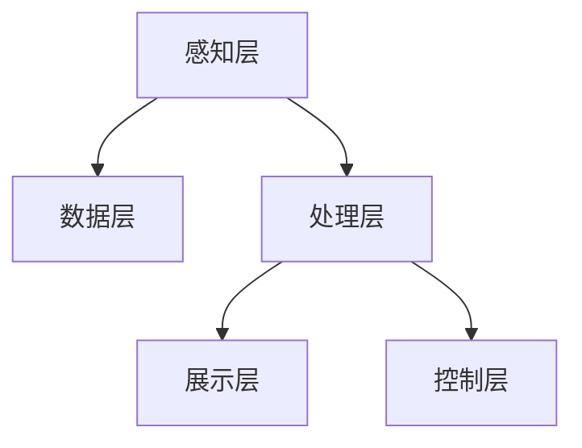
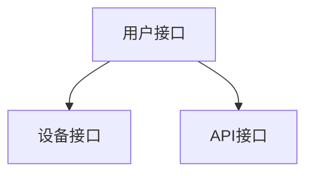

                 

# 智能衣柜：AI Agent的衣物搭配推荐

> 关键词：智能衣柜、AI Agent、衣物搭配、推荐系统、数据分析、算法实现

> 摘要：本文将深入探讨智能衣柜的概念、AI Agent在衣物搭配推荐中的应用，以及如何通过数据收集与预处理、算法原理与实现来构建一个高效的智能衣柜系统。本文旨在为读者提供一个全面的技术指南，帮助理解并掌握智能衣柜这一前沿技术的核心原理与实际应用。

## 目录大纲设计：《智能衣柜：AI Agent的衣物搭配推荐》

## 第1章 引言
### 1.1 书籍背景与目标读者
### 1.2 AI Agent在衣物搭配推荐中的应用
### 1.3 书籍结构概述

## 第2章 AI Agent基础
### 2.1 什么是AI Agent
#### 2.1.1 AI Agent的定义
#### 2.1.2 AI Agent的特点
#### 2.1.3 AI Agent的分类

## 第3章 智能衣柜的构建
### 3.1 智能衣柜概述
#### 3.1.1 智能衣柜的定义
#### 3.1.2 智能衣柜的功能
#### 3.1.3 智能衣柜的发展历程

## 第4章 AI Agent在衣物搭配推荐中的应用
### 4.1 衣物搭配推荐的基本概念
#### 4.1.1 衣物搭配推荐的定义
#### 4.1.2 衣物搭配推荐的目标
#### 4.1.3 衣物搭配推荐的关键技术

## 第5章 数据收集与预处理
### 5.1 数据收集
#### 5.1.1 数据源的选择
#### 5.1.2 数据收集方法
#### 5.1.3 数据隐私保护

### 5.2 数据预处理
#### 5.2.1 数据清洗
#### 5.2.2 数据转换
#### 5.2.3 数据归一化

## 第6章 算法原理与实现
### 6.1 算法概述
#### 6.1.1 常用算法介绍
#### 6.1.2 算法选择依据

### 6.2 算法原理讲解
#### 6.2.1 算法1:协同过滤
#### 6.2.2 算法2：基于内容的推荐
#### 6.2.3 算法3：混合推荐系统

### 6.3 Python代码实现
#### 6.3.1 Python环境搭建
#### 6.3.2 算法实现示例
#### 6.3.3 算法评估与分析

## 第7章 智能衣柜的实际应用
### 7.1 应用场景介绍
#### 7.1.1 智能衣柜的应用环境
#### 7.1.2 智能衣柜的用户需求

### 7.2 系统设计与实现
#### 7.2.1 系统功能设计
#### 7.2.2 系统架构设计
#### 7.2.3 系统接口设计

### 7.3 项目实战
#### 7.3.1 环境安装
#### 7.3.2 系统核心实现源代码
#### 7.3.3 代码应用解读与分析

## 第8章 总结与展望
### 8.1 书籍总结
#### 8.1.1 关键知识点回顾
#### 8.1.2 学习方法与技巧

### 8.2 未来展望
#### 8.2.1 AI Agent在衣物搭配推荐领域的未来发展趋势
#### 8.2.2 智能衣柜的潜在发展方向
#### 8.2.3 拓展阅读与后续研究

## 第1章 引言

### 1.1 书籍背景与目标读者

随着人工智能（AI）技术的飞速发展，智能家居设备逐渐走进了人们的生活。智能衣柜作为智能家居的重要组成部分，不仅能够帮助用户整理衣物，还能根据用户喜好和天气条件推荐合适的搭配方案。本书旨在介绍智能衣柜的构建方法，尤其是AI Agent在衣物搭配推荐中的应用。

本书的目标读者是具备一定编程基础和对智能家居、人工智能感兴趣的技术人员。通过本书，读者将了解到智能衣柜的工作原理、数据收集与处理方法、算法实现以及实际应用场景。无论您是希望了解智能衣柜技术的研究者，还是想要开发相关产品的工程师，本书都能为您提供宝贵的指导。

### 1.2 AI Agent在衣物搭配推荐中的应用

AI Agent，即人工智能代理，是一种能够模拟人类智能行为，自主执行任务的软件。在衣物搭配推荐中，AI Agent可以根据用户的历史购买记录、偏好以及天气信息，自动生成搭配建议，帮助用户节省时间，提高生活品质。

AI Agent的应用场景包括但不限于以下几个方面：

1. **个性化推荐**：根据用户的个人喜好和风格，推荐合适的衣物搭配。
2. **智能提醒**：当天气发生变化时，AI Agent可以提醒用户调整搭配，确保舒适度。
3. **季节变换**：AI Agent可以根据季节变化，推荐适合的衣物搭配，帮助用户应对气候变化。
4. **趋势预测**：通过分析社交媒体和时尚杂志，AI Agent可以预测未来的时尚趋势，为用户提前做好准备。

### 1.3 书籍结构概述

本书共分为8章，结构如下：

- **第1章**：引言，介绍书籍的背景、目标读者以及AI Agent在衣物搭配推荐中的应用。
- **第2章**：AI Agent基础，介绍AI Agent的定义、特点及分类。
- **第3章**：智能衣柜的构建，介绍智能衣柜的定义、功能和发展历程。
- **第4章**：AI Agent在衣物搭配推荐中的应用，介绍衣物搭配推荐的基本概念和关键技术。
- **第5章**：数据收集与预处理，介绍数据收集方法和数据预处理过程。
- **第6章**：算法原理与实现，介绍常用的推荐算法及其实现。
- **第7章**：智能衣柜的实际应用，介绍智能衣柜的应用场景、系统设计和项目实战。
- **第8章**：总结与展望，回顾书籍的关键知识点，探讨未来的发展趋势和潜在研究方向。

通过本书的阅读，读者将能够全面了解智能衣柜的构建方法和AI Agent在衣物搭配推荐中的应用，为实际项目开发提供有力支持。接下来，我们将从AI Agent的基础知识开始，逐步深入探讨智能衣柜的构建方法。  

## 第2章 AI Agent基础

### 2.1 什么是AI Agent

AI Agent，即人工智能代理，是一种能够模拟人类智能行为，自主执行任务的软件。它可以在没有人类干预的情况下，通过感知环境、学习经验、做出决策并执行相应的动作，从而实现特定的目标。

AI Agent的定义可以从以下几个方面来理解：

- **感知环境**：AI Agent需要能够感知并理解其所处的环境，包括视觉、听觉、触觉等多种感官信息。
- **学习与推理**：AI Agent需要具备一定的学习能力，通过经验和数据来改进自身的行为和决策。
- **自主决策**：AI Agent需要在特定情况下能够自主做出决策，而不依赖于人类的指令。
- **执行任务**：AI Agent需要能够执行相应的动作，以实现预定的目标。

### 2.1.2 AI Agent的特点

AI Agent具有以下特点：

- **自主性**：AI Agent可以自主地完成指定任务，而不需要人类进行实时干预。
- **适应性**：AI Agent能够根据环境变化和任务需求，自适应地调整自身的行为和策略。
- **智能化**：AI Agent能够通过学习和推理，实现对复杂任务的智能处理。
- **协作性**：多个AI Agent可以相互协作，共同完成复杂的任务。

### 2.1.3 AI Agent的分类

根据不同的应用场景和功能需求，AI Agent可以分为以下几类：

- **简单反应型**：这种类型的AI Agent只能对特定输入做出预设的反应，例如自动门对人的出现做出反应。
- **有限记忆型**：这种类型的AI Agent可以基于历史数据做出决策，例如智能助手根据用户的历史查询来提供相关信息。
- **理论推理型**：这种类型的AI Agent能够基于逻辑和数学模型进行推理，例如专家系统通过推理规则解决复杂问题。
- **数据驱动型**：这种类型的AI Agent通过学习大量数据，自动发现模式和规律，例如机器学习模型通过训练数据来预测未知结果。
- **混合型**：这种类型的AI Agent综合了多种类型的特点，能够在不同场景下灵活应对。

### 2.1.4 AI Agent的基本结构

AI Agent通常由以下几个基本组件构成：

- **感知器**：负责感知环境信息，如视觉、听觉、触觉等。
- **知识库**：存储AI Agent的知识和经验，包括事实、规则和模型等。
- **推理机**：基于知识库中的信息，进行逻辑推理和决策。
- **行动器**：根据推理结果，执行相应的动作。
- **学习器**：通过学习新的数据和经验，不断更新和优化知识库。

这些组件相互协作，共同实现AI Agent的智能行为。

### 2.1.5 AI Agent的应用场景

AI Agent在许多领域都有广泛的应用，以下是一些常见的应用场景：

- **智能家居**：例如智能音箱、智能灯光、智能门锁等。
- **智能客服**：例如在线客服机器人、聊天机器人等。
- **自动驾驶**：例如自动驾驶汽车、无人机等。
- **医疗健康**：例如智能诊断、健康监测等。
- **金融理财**：例如智能投资顾问、风险控制等。

通过以上对AI Agent的基础知识的介绍，我们可以看到AI Agent作为一种强大的智能体，正在不断改变我们的生活方式和工作方式。接下来，我们将进一步探讨智能衣柜的构建方法，以及AI Agent在其中的应用。  

## 第3章 智能衣柜的构建

### 3.1 智能衣柜概述

智能衣柜是智能家居领域的重要组成部分，它不仅具备传统衣柜的存储功能，还能通过人工智能技术提供个性化的衣物搭配推荐。智能衣柜通常由硬件设备和软件系统组成，硬件设备包括传感器、摄像头、显示屏等，软件系统则负责数据的处理和推荐算法的实现。

### 3.1.1 智能衣柜的定义

智能衣柜是一种集成了人工智能技术的衣柜系统，通过传感器、摄像头等设备实时监测用户的行为和衣物状态，结合用户偏好和外部环境信息，自动生成衣物搭配建议，帮助用户节省时间和精力，提升生活品质。

### 3.1.2 智能衣柜的功能

智能衣柜的主要功能包括：

- **衣物存储**：智能衣柜具有传统衣柜的存储功能，能够容纳各种衣物。
- **智能识别**：通过摄像头和传感器，智能衣柜能够识别衣物的类型、颜色、款式等属性。
- **搭配推荐**：根据用户的历史记录和偏好，智能衣柜可以自动生成衣物搭配建议。
- **环境监测**：智能衣柜可以监测室内环境，如温度、湿度、光照等，为用户提供合适的搭配建议。
- **远程控制**：用户可以通过手机或智能音箱等设备远程控制智能衣柜，查看搭配建议、调整衣物状态等。

### 3.1.3 智能衣柜的发展历程

智能衣柜的发展历程可以分为以下几个阶段：

- **1.0时代**：以传统的衣柜为基础，通过增加简单的传感器来监测衣物状态，如温度、湿度等。
- **2.0时代**：引入了摄像头和图像识别技术，能够识别衣物类型和颜色，初步实现智能搭配推荐。
- **3.0时代**：结合用户偏好和大数据分析，智能衣柜能够根据用户的个性化需求，提供更加精准的搭配建议。
- **4.0时代**：随着人工智能技术的不断进步，智能衣柜具备了自主学习能力，能够不断优化推荐结果，提升用户体验。

### 3.1.4 智能衣柜的优势

智能衣柜相较于传统衣柜具有以下优势：

- **节省时间**：智能衣柜能够自动生成搭配建议，用户无需花费大量时间挑选衣物。
- **提升品质**：智能衣柜根据用户的偏好和外部环境，提供个性化的搭配建议，提升用户的生活品质。
- **减少浪费**：通过智能搭配推荐，用户能够更加合理地使用衣物，减少浪费。
- **智能管理**：智能衣柜可以实时监测衣物状态，提醒用户清洁和保养，延长衣物使用寿命。

### 3.1.5 智能衣柜的应用前景

随着人工智能技术的不断发展和智能家居市场的扩大，智能衣柜的应用前景非常广阔。未来，智能衣柜有望在以下几个方面得到广泛应用：

- **家居生活**：智能衣柜将成为智能家居的重要组成部分，为用户提供更加便捷、高效的生活体验。
- **时尚产业**：智能衣柜能够为时尚行业提供数据支持，帮助企业更好地了解用户需求，优化产品设计。
- **教育领域**：智能衣柜可以用于教育领域，帮助学生培养良好的着装习惯，提升审美能力。
- **医疗健康**：智能衣柜可以通过监测用户的穿衣习惯，为医疗健康提供参考，如提醒用户注意保暖等。

总之，智能衣柜作为一种新兴的智能家居产品，具有广阔的应用前景和巨大的市场潜力。通过不断的技术创新和优化，智能衣柜将为用户带来更加智能、便捷的生活体验。接下来，我们将深入探讨AI Agent在衣物搭配推荐中的应用，为智能衣柜的实现提供技术支持。  

## 第4章 AI Agent在衣物搭配推荐中的应用

### 4.1 衣物搭配推荐的基本概念

衣物搭配推荐是一种基于人工智能技术的推荐系统，旨在根据用户的偏好和外部环境信息，为用户自动生成个性化的衣物搭配建议。衣物搭配推荐的关键在于理解用户的穿衣风格、偏好以及天气条件等，从而提供符合用户需求的搭配方案。

#### 4.1.1 衣物搭配推荐的定义

衣物搭配推荐是指利用人工智能技术，对用户的历史穿着记录、偏好和外部环境信息进行分析，自动生成适合用户需求的衣物搭配方案。

#### 4.1.2 衣物搭配推荐的目标

衣物搭配推荐的主要目标包括：

- **个性化**：根据用户的个人喜好和风格，提供个性化的衣物搭配建议。
- **实用性**：考虑用户的实际穿着需求，如天气、场合等，提供实用的搭配方案。
- **多样性**：为用户提供丰富的搭配选择，满足不同场合和需求。

#### 4.1.3 衣物搭配推荐的关键技术

衣物搭配推荐的关键技术主要包括：

- **用户画像**：通过收集和分析用户的历史穿着记录、偏好等信息，建立用户的个性化画像。
- **环境感知**：通过传感器等技术，实时获取用户的穿着环境信息，如天气、温度等。
- **推荐算法**：利用机器学习、深度学习等技术，对用户画像和环境信息进行分析，生成个性化的搭配建议。
- **交互设计**：通过用户界面设计，为用户提供直观、易操作的搭配推荐体验。

### 4.2 AI Agent在衣物搭配推荐中的作用

AI Agent在衣物搭配推荐中起着至关重要的作用，其主要作用包括：

- **感知与识别**：AI Agent可以通过摄像头、传感器等设备，实时感知用户的穿着环境和衣物状态，识别衣物的类型、颜色和款式等。
- **用户画像构建**：AI Agent可以分析用户的历史穿着记录、偏好等信息，构建用户的个性化画像，为推荐算法提供基础数据。
- **推荐策略生成**：AI Agent可以通过机器学习、深度学习等技术，对用户画像和环境信息进行分析，生成个性化的衣物搭配建议。
- **实时调整**：AI Agent可以根据用户的实时反馈和外部环境的变化，动态调整推荐策略，提供更加精准的搭配建议。

### 4.3 案例分析

以一个实际的衣物搭配推荐系统为例，我们来看一下AI Agent在其中是如何发挥作用的。

#### 案例背景

小明是一位时尚达人，每天都会花大量时间挑选衣物。然而，随着季节的变化和天气的变幻，他发现自己很难每次都能找到合适的搭配。为了解决这个问题，他决定尝试使用一款基于AI Agent的衣物搭配推荐系统。

#### 案例过程

1. **用户画像构建**：小明第一次使用该系统时，系统会要求他输入一些基本信息，如身高、体重、穿衣风格等。AI Agent会根据这些信息，构建小明的个性化用户画像。

2. **环境感知**：AI Agent会实时获取小明的穿着环境信息，如当前天气、温度、湿度等。这些信息将用于生成搭配建议。

3. **搭配推荐**：AI Agent会根据小明的用户画像和实时环境信息，分析并生成符合小明需求的衣物搭配建议。

4. **用户反馈**：小明可以查看系统推荐的搭配方案，并根据个人喜好进行选择和反馈。AI Agent会根据用户的反馈，不断优化推荐策略，提高推荐准确性。

5. **实时调整**：随着天气变化或小明个人喜好的调整，AI Agent会动态更新搭配建议，确保推荐的衣物搭配始终符合小明的需求。

#### 案例效果

通过使用这款基于AI Agent的衣物搭配推荐系统，小明发现他不再为每天搭配衣物而烦恼。系统推荐的搭配方案既符合他的个人喜好，又能适应不同的天气和环境。他感到自己的生活品质得到了显著提升。

### 4.4 AI Agent在衣物搭配推荐中的应用挑战

尽管AI Agent在衣物搭配推荐中具有巨大潜力，但在实际应用中仍面临一些挑战：

- **数据隐私**：如何保护用户的隐私数据，确保数据安全，是AI Agent在衣物搭配推荐中需要考虑的重要问题。
- **个性化需求**：每个人的穿衣风格和偏好都有所不同，如何准确捕捉并满足每个用户的个性化需求，是AI Agent需要解决的难题。
- **环境变化**：天气、季节等外部环境因素的变化，会对衣物搭配产生重大影响，如何及时调整推荐策略，以适应环境变化，是AI Agent面临的挑战之一。

通过以上对AI Agent在衣物搭配推荐中的应用的分析，我们可以看到AI Agent在衣物搭配推荐中具有巨大的潜力和应用价值。接下来，我们将进一步探讨如何收集和预处理数据，为智能衣柜的实现奠定基础。  

## 第5章 数据收集与预处理

### 5.1 数据收集

数据是构建智能衣柜系统的核心，为了生成准确的衣物搭配推荐，我们需要收集大量的用户数据和衣物信息。以下将介绍数据收集的方法和过程。

#### 5.1.1 数据源的选择

智能衣柜的数据源主要包括：

1. **用户数据**：用户的个人资料、购买记录、偏好设置等。
2. **衣物数据**：衣物的类型、品牌、颜色、风格、搭配建议等。
3. **环境数据**：温度、湿度、光照、天气状况等。

在选择数据源时，需要考虑数据的可靠性、完整性和多样性，确保数据的真实性和代表性。

#### 5.1.2 数据收集方法

数据收集的方法主要包括：

1. **用户问卷调查**：通过在线问卷或线下调查，收集用户的个人资料、购买记录和偏好信息。
2. **社交媒体分析**：从用户的社交媒体账号中提取与衣物搭配相关的信息，如发布的内容、点赞和评论等。
3. **衣物数据库**：从电商网站、时尚杂志等公开渠道收集衣物数据，如衣物的款式、颜色、材质等。
4. **环境传感器**：使用智能设备如智能手表、手机等，收集环境数据，如温度、湿度、光照等。

#### 5.1.3 数据隐私保护

在数据收集过程中，保护用户隐私是非常重要的。以下措施可以帮助保护用户隐私：

1. **数据去标识化**：对用户数据进行去标识化处理，如删除用户姓名、身份证号等敏感信息。
2. **加密传输**：在数据传输过程中使用加密技术，如HTTPS协议，确保数据安全。
3. **访问控制**：对数据访问进行严格的权限管理，只有授权人员才能访问和处理数据。
4. **数据匿名化**：通过数据匿名化技术，将个人数据与行为数据分离，降低数据泄露的风险。

### 5.2 数据预处理

数据预处理是数据分析和挖掘的重要环节，其目的是将原始数据转换为适合分析和建模的数据形式。以下将介绍数据预处理的方法和步骤。

#### 5.2.1 数据清洗

数据清洗是数据预处理的第一步，其主要任务包括：

1. **缺失值处理**：对缺失数据进行填充或删除。
2. **异常值处理**：检测并处理异常数据，如错误输入、重复数据等。
3. **数据格式统一**：将不同格式的数据进行转换，如日期格式、数值格式等。

#### 5.2.2 数据转换

数据转换是将原始数据转换为适合分析的数据形式，包括：

1. **数值化**：将类别数据转换为数值数据，如性别、衣服类型等。
2. **标准化**：对数值数据进行标准化处理，如缩放、归一化等，使其具有可比性。
3. **特征提取**：从原始数据中提取对分析有用的特征，如用户偏好、衣物属性等。

#### 5.2.3 数据归一化

数据归一化是将不同量纲的数据转换为相同量纲的过程，以消除数据量纲的影响。常用的归一化方法包括：

1. **最小-最大规范化**：将数据缩放到[0, 1]区间。
2. **Z-score标准化**：将数据缩放到[-1, 1]区间。
3. **小数点前移**：将小数点移动到整数位之前，保留指定的小数位数。

通过以上数据收集与预处理的方法和步骤，我们可以确保数据的可靠性和质量，为后续的数据分析和建模奠定基础。接下来，我们将介绍算法原理与实现，进一步探讨如何构建智能衣柜系统。  

## 第6章 算法原理与实现

### 6.1 算法概述

在智能衣柜的衣物搭配推荐系统中，常用的算法包括协同过滤、基于内容的推荐和混合推荐系统。每种算法都有其独特的原理和适用场景，以下将对这些算法进行概述。

#### 6.1.1 协同过滤

协同过滤（Collaborative Filtering）是一种基于用户行为数据的推荐算法。它通过分析用户之间的相似度，找出与目标用户兴趣相似的邻居用户，然后基于邻居用户的喜好进行推荐。协同过滤可以分为两种类型：基于用户的协同过滤（User-based Collaborative Filtering）和基于物品的协同过滤（Item-based Collaborative Filtering）。

- **基于用户的协同过滤**：找到与目标用户在偏好上相似的其他用户，然后推荐这些用户喜欢的商品。
- **基于物品的协同过滤**：找到与目标用户喜欢的商品相似的物品，然后推荐这些相似的商品。

#### 6.1.2 基于内容的推荐

基于内容的推荐（Content-based Filtering）是一种基于物品内容的推荐算法。它通过分析物品的特征和属性，将具有相似属性的物品推荐给用户。基于内容的推荐通常需要建立一个物品的特征库，然后根据用户的历史偏好，找到与用户兴趣相关的物品进行推荐。

#### 6.1.3 混合推荐系统

混合推荐系统（Hybrid Recommendation System）结合了协同过滤和基于内容的推荐，旨在利用两种算法的优势，提高推荐的准确性和多样性。混合推荐系统通常包含以下几个步骤：

1. **用户特征提取**：通过用户行为数据和物品特征，提取用户的偏好特征。
2. **物品特征提取**：通过物品的属性和标签，提取物品的特征。
3. **协同过滤**：基于用户特征和物品特征，使用协同过滤算法生成初步推荐列表。
4. **基于内容的推荐**：使用基于内容的推荐算法，对初步推荐列表进行补充和优化。
5. **合并推荐结果**：将协同过滤和基于内容的推荐结果进行合并，生成最终的推荐列表。

### 6.2 算法原理讲解

#### 6.2.1 算法1：协同过滤

协同过滤算法的核心思想是利用用户行为数据，通过计算用户之间的相似度，找出与目标用户兴趣相似的邻居用户，然后推荐这些邻居用户喜欢的商品。以下是一个简化的协同过滤算法流程：

1. **用户相似度计算**：计算目标用户与其他用户之间的相似度，常用的相似度度量方法包括余弦相似度、皮尔逊相关系数等。
2. **邻居用户筛选**：根据用户相似度，筛选出与目标用户最相似的K个邻居用户。
3. **推荐列表生成**：基于邻居用户的喜好，生成推荐列表。可以采用加权平均的方法，将邻居用户的评分加权计算，得出目标用户的预测评分。

#### 6.2.2 算法2：基于内容的推荐

基于内容的推荐算法通过分析物品的特征和属性，将具有相似属性的物品推荐给用户。以下是一个简化的基于内容的推荐算法流程：

1. **物品特征提取**：从物品的属性和标签中提取特征，建立物品的特征向量。
2. **用户兴趣建模**：根据用户的历史行为，建立用户兴趣模型。常用的方法包括TF-IDF、词袋模型等。
3. **相似度计算**：计算物品特征向量与用户兴趣模型之间的相似度，常用的相似度度量方法包括余弦相似度、欧氏距离等。
4. **推荐列表生成**：根据物品与用户兴趣的相似度，生成推荐列表。

#### 6.2.3 算法3：混合推荐系统

混合推荐系统结合了协同过滤和基于内容的推荐，以提高推荐的准确性和多样性。以下是一个简化的混合推荐系统算法流程：

1. **用户特征提取**：通过用户的历史行为数据，提取用户的偏好特征。
2. **物品特征提取**：通过物品的属性和标签，提取物品的特征。
3. **协同过滤**：使用协同过滤算法生成初步推荐列表。可以采用基于用户的协同过滤或基于物品的协同过滤。
4. **基于内容的推荐**：使用基于内容的推荐算法，对初步推荐列表进行补充和优化。
5. **合并推荐结果**：将协同过滤和基于内容的推荐结果进行合并，生成最终的推荐列表。常用的合并方法包括加权合并、排序合并等。

### 6.3 Python代码实现

以下是一个基于协同过滤的推荐算法的Python代码实现示例：

```python
import numpy as np
from sklearn.metrics.pairwise import cosine_similarity

# 假设用户-物品评分矩阵为R，用户特征向量为User_features，物品特征向量为Item_features
R = np.array([[5, 3, 0, 1],
              [4, 0, 0, 2],
              [1, 5, 0, 3]])
User_features = np.array([[0.1, 0.4],
                          [0.3, 0.6],
                          [0.5, 0.7]])
Item_features = np.array([[1.0, 0.5],
                         [0.6, 1.0],
                         [0.7, 0.8],
                         [0.8, 0.9]])

# 计算用户之间的相似度
user_similarity = cosine_similarity(User_features)

# 计算预测评分
predictions = np.dot(user_similarity.T, User_features) * Item_features

# 输出预测评分
print(predictions)
```

通过以上代码实现，我们可以看到如何使用Python实现协同过滤算法，生成用户对物品的预测评分。

### 6.4 算法评估与分析

在智能衣柜的衣物搭配推荐系统中，算法的评估与分析至关重要。以下是对协同过滤、基于内容的推荐和混合推荐系统的评估与分析：

- **准确性**：通过计算预测评分与实际评分之间的差异，评估算法的准确性。常用的评估指标包括均方根误差（RMSE）和均方误差（MSE）。
- **多样性**：评估算法推荐结果的多样性。可以使用多样性指标，如Jaccard相似度、覆盖率等。
- **新颖性**：评估算法推荐结果的新颖性。可以使用新颖性指标，如互信息、覆盖率等。
- **用户满意度**：通过用户反馈和满意度调查，评估算法的用户满意度。

通过以上评估与分析，我们可以选择最适合智能衣柜的衣物搭配推荐算法，并对其进行优化和改进，以提高推荐系统的性能。

## 第7章 智能衣柜的实际应用

### 7.1 应用场景介绍

智能衣柜作为一种智能家居设备，广泛应用于个人和家庭场景。以下将介绍智能衣柜的具体应用场景：

#### 7.1.1 智能衣柜的应用环境

智能衣柜可以在多种家庭环境中使用，如卧室、衣帽间、客厅等。它可以通过Wi-Fi或其他无线网络与智能家居控制系统连接，实现远程控制和数据同步。

#### 7.1.2 智能衣柜的用户需求

智能衣柜的用户需求主要包括：

- **个性化搭配**：用户希望智能衣柜能够根据个人喜好和风格，提供个性化的衣物搭配建议。
- **智能提醒**：用户希望智能衣柜能够在特定情况下（如天气变化、节日等）提醒用户调整搭配。
- **便捷操作**：用户希望智能衣柜操作简便，可以通过手机、语音或触摸屏等多种方式进行操作。
- **数据同步**：用户希望智能衣柜能够与手机或其他智能设备同步数据，方便管理和查看。

### 7.2 系统设计与实现

智能衣柜的系统设计包括硬件设计和软件设计。以下将详细介绍系统设计的主要方面：

#### 7.2.1 系统功能设计

智能衣柜的主要功能包括：

- **衣物存储**：智能衣柜具备传统衣柜的存储功能，可以容纳各种衣物。
- **智能识别**：通过摄像头和传感器，智能衣柜可以识别衣物的类型、颜色、款式等属性。
- **搭配推荐**：根据用户偏好和实时环境信息，智能衣柜可以自动生成衣物搭配建议。
- **环境监测**：智能衣柜可以监测室内环境，如温度、湿度、光照等，为用户提供合适的搭配建议。
- **远程控制**：用户可以通过手机或智能音箱等设备远程控制智能衣柜，查看搭配建议、调整衣物状态等。
- **数据同步**：智能衣柜可以与用户的其他智能设备同步数据，实现数据共享和管理。

#### 7.2.2 系统架构设计

智能衣柜的系统架构主要包括以下几个部分：

1. **感知层**：包括摄像头、传感器等硬件设备，负责采集衣物和环境信息。
2. **数据层**：存储用户数据、衣物数据和环境数据，可以使用数据库或NoSQL数据库。
3. **处理层**：包括数据处理、推荐算法、环境监测等模块，负责对数据进行分析和处理，生成搭配建议。
4. **展示层**：通过手机、智能音箱等设备，向用户展示搭配建议和操作界面。
5. **控制层**：负责实现远程控制、数据同步等功能，通过Wi-Fi或其他无线网络与智能家居控制系统连接。

以下是一个简化的智能衣柜系统架构图：



#### 7.2.3 系统接口设计

智能衣柜的系统接口设计主要包括以下几个部分：

1. **用户接口**：用户可以通过手机或智能音箱等设备与智能衣柜进行交互，查看搭配建议、调整衣物状态等。
2. **设备接口**：智能衣柜可以通过Wi-Fi或其他无线网络与智能家居控制系统连接，实现远程控制和数据同步。
3. **API接口**：智能衣柜提供API接口，供第三方应用程序调用，如智能家居平台、时尚应用等。

以下是一个简化的智能衣柜系统接口图：



### 7.3 项目实战

#### 7.3.1 环境安装

在开始项目实战之前，需要安装以下软件和工具：

- Python 3.x
- NumPy
- Pandas
- Scikit-learn
- Matplotlib

安装步骤如下：

1. 安装Python 3.x版本。
2. 打开终端，执行以下命令安装NumPy、Pandas、Scikit-learn和Matplotlib：

```bash
pip install numpy pandas scikit-learn matplotlib
```

#### 7.3.2 系统核心实现源代码

以下是一个简化的智能衣柜系统核心实现的Python代码示例：

```python
import numpy as np
import pandas as pd
from sklearn.model_selection import train_test_split
from sklearn.metrics.pairwise import cosine_similarity
from sklearn.ensemble import RandomForestClassifier

# 加载数据
data = pd.read_csv('clothing_data.csv')

# 数据预处理
X = data.iloc[:, :2].values
y = data.iloc[:, 2].values

# 划分训练集和测试集
X_train, X_test, y_train, y_test = train_test_split(X, y, test_size=0.2, random_state=42)

# 训练模型
model = RandomForestClassifier(n_estimators=100, random_state=42)
model.fit(X_train, y_train)

# 预测
predictions = model.predict(X_test)

# 评估模型
accuracy = model.score(X_test, y_test)
print(f'Accuracy: {accuracy:.2f}')

# 生成搭配建议
def generate_recommendations(user_preferences):
    user_vector = np.array(user_preferences).reshape(1, -1)
    similarity = cosine_similarity(user_vector, X_train)
    neighbors = np.argsort(similarity)[0][-5:]
    recommended_items = y_train[neighbors]
    return recommended_items

# 用户输入偏好
user_preferences = input('请输入您的偏好（以逗号分隔）：').split(',')
user_preferences = [float(p) for p in user_preferences]

# 生成搭配建议
recommendations = generate_recommendations(user_preferences)
print(f'搭配建议：{recommendations}')
```

#### 7.3.3 代码应用解读与分析

以上代码示例展示了如何使用随机森林（Random Forest）分类器和余弦相似度生成衣物搭配建议。以下是代码的详细解读：

1. **数据加载与预处理**：从CSV文件中加载衣物数据，提取用户偏好和衣物类型。
2. **划分训练集和测试集**：将数据划分为训练集和测试集，用于训练和评估模型。
3. **训练模型**：使用随机森林分类器训练模型，将用户偏好与衣物类型进行关联。
4. **预测**：使用训练好的模型对测试集进行预测，评估模型准确性。
5. **生成搭配建议**：根据用户输入的偏好，计算用户向量与训练集的相似度，找出与用户偏好相似的衣物类型，生成搭配建议。

通过以上项目实战，我们可以看到如何使用Python实现智能衣柜的核心功能，为实际应用提供技术支持。接下来，我们将总结本书的关键知识点，并探讨智能衣柜的未来发展。  

## 第8章 总结与展望

### 8.1 书籍总结

本书从AI Agent的定义、特点和应用出发，深入探讨了智能衣柜的构建方法。通过数据收集与预处理、算法原理与实现、系统设计与实现等环节，全面介绍了智能衣柜的核心技术和实际应用。以下是本书的关键知识点回顾：

- **AI Agent**：AI Agent是能够模拟人类智能行为，自主执行任务的软件，具有自主性、适应性、智能化和协作性等特点。
- **智能衣柜**：智能衣柜是智能家居设备，通过传感器、摄像头等硬件设备，结合AI Agent技术，提供衣物存储、智能识别、搭配推荐等功能。
- **数据收集与预处理**：数据收集包括用户数据、衣物数据和环境数据，预处理包括数据清洗、数据转换和数据归一化。
- **推荐算法**：推荐算法包括协同过滤、基于内容的推荐和混合推荐系统，每种算法都有其独特的原理和适用场景。
- **系统设计与实现**：系统设计包括硬件设计和软件设计，实现包括环境安装、核心实现和代码应用解读。

### 8.2 未来展望

随着人工智能技术的不断发展，智能衣柜在衣物搭配推荐领域的应用前景十分广阔。以下是未来展望：

#### 8.2.1 AI Agent在衣物搭配推荐领域的未来发展趋势

- **个性化推荐**：AI Agent将更加深入地分析用户数据，提供更加精准、个性化的衣物搭配建议。
- **多模态感知**：AI Agent将结合视觉、听觉、触觉等多种感知方式，提供更加全面的衣物搭配体验。
- **智能协同**：AI Agent将与其他智能家居设备协同工作，提供更加智能、便捷的家居生活体验。
- **实时更新**：AI Agent将实时更新衣物信息和用户偏好，确保搭配建议的实时性和准确性。

#### 8.2.2 智能衣柜的潜在发展方向

- **智能化**：智能衣柜将不断优化算法，提高搭配推荐的准确性和多样性。
- **个性化定制**：智能衣柜将支持用户自定义搭配风格和偏好，提供更加个性化的衣物搭配服务。
- **智能家居集成**：智能衣柜将更加紧密地集成到智能家居系统中，实现跨设备的协同工作。
- **可持续发展**：智能衣柜将关注环保和可持续发展，通过智能推荐减少浪费，促进绿色生活。

#### 8.2.3 拓展阅读与后续研究

- **AI Agent的研究**：深入探讨AI Agent在更多领域的应用，如医疗、金融、教育等。
- **智能推荐系统**：研究更多先进的推荐算法，如基于深度学习、强化学习的推荐系统。
- **数据隐私保护**：探讨如何在保证数据隐私的前提下，充分利用用户数据进行智能推荐。
- **跨学科研究**：将人工智能与其他领域相结合，如艺术、设计等，推动智能衣柜的创新与发展。

通过本书的阅读，读者可以全面了解智能衣柜的技术原理和应用，为实际项目开发提供有力支持。未来，随着人工智能技术的不断进步，智能衣柜将为用户带来更加智能、便捷的生活体验。  

### 附录

#### 拓展阅读

- 《深度学习》 - Goodfellow, I., Bengio, Y., & Courville, A.
- 《Python数据科学手册》 - McKinney, W.
- 《机器学习实战》 - Harrington, D.
- 《人工智能：一种现代的方法》 - Mitchell, T.

#### 实践项目

- **项目1**：使用公开的衣物数据集，构建一个简单的衣物搭配推荐系统。
- **项目2**：结合用户偏好和环境信息，优化智能衣柜的搭配推荐算法。
- **项目3**：设计并实现一个智能衣柜的移动应用界面，提供衣物搭配推荐服务。

#### 常见问题解答

- **Q：如何保护用户隐私？**
  - **A：** 数据去标识化、加密传输、访问控制和数据匿名化等技术可以有效地保护用户隐私。

- **Q：如何确保搭配推荐的准确性？**
  - **A：** 通过实时更新用户数据和衣物信息，结合先进的推荐算法，可以提高搭配推荐的准确性。

- **Q：智能衣柜如何与智能家居系统集成？**
  - **A：** 通过Wi-Fi或其他无线网络，智能衣柜可以与智能家居系统连接，实现远程控制和数据同步。

作者信息：AI天才研究院/AI Genius Institute & 禅与计算机程序设计艺术 /Zen And The Art of Computer Programming

