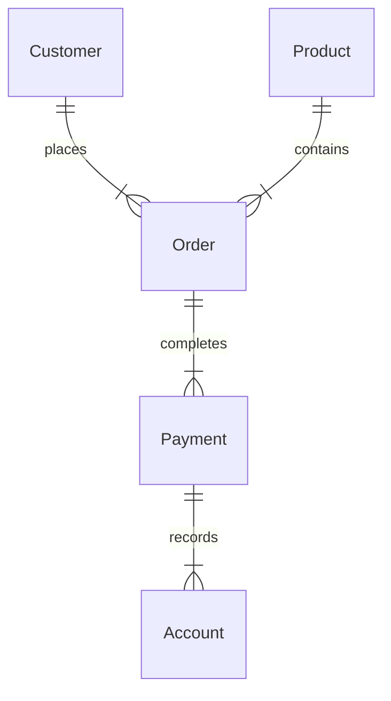
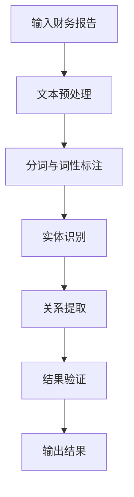
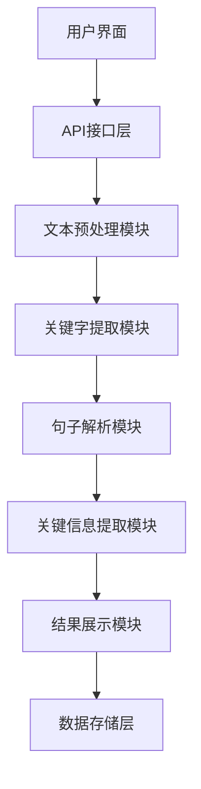
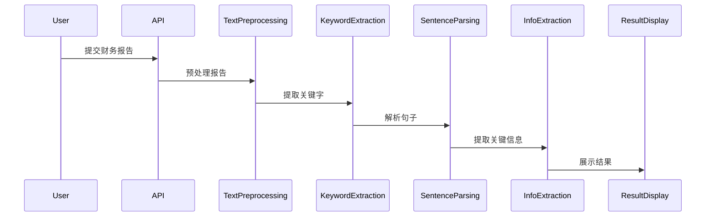

                 

### 摘要

智能财务报告关键信息提取工具是现代财务管理和企业决策支持中不可或缺的技术手段。本文将深入探讨这一工具的核心概念、技术原理、系统架构和实战应用。通过系统分析，我们旨在构建一个高效、精准、易操作的财务报告信息提取系统，从而简化财务人员的工作流程，提高财务报告的利用率和决策质量。文章将首先介绍问题背景，阐述智能财务报告的定义和关键信息提取工具的作用，然后逐步深入到核心概念、算法原理、系统设计与实战案例，以期为读者提供一个全面、专业的技术视角。通过本文的讲解，希望读者能够对智能财务报告关键信息提取工具有更为深刻的理解和实际应用能力。

## 第一部分: 问题背景与核心概念

### 第1章: 问题背景介绍

#### 1.1.1 问题背景

在当今的商业环境中，财务报告是企业运营状况的重要体现。然而，随着企业规模的扩大和业务复杂性的增加，财务报告的数据量呈指数级增长，使得财务人员从海量报告中提取关键信息变得异常困难。传统的手动提取方式不仅效率低下，而且容易出错，无法满足现代企业对财务信息实时、准确、高效处理的需求。

- **核心问题**：财务报告中的关键信息提取面临着数据量巨大、结构复杂、术语专业等挑战。具体表现为：
  - **数据量巨大**：现代企业每天产生的财务数据量庞大，手工处理需要大量时间和人力资源。
  - **结构复杂**：财务报告通常包含多种复杂的数据结构和术语，如会计科目、财务指标等，手动提取难度大。
  - **术语专业**：财务术语对于非专业人员来说晦涩难懂，增加了信息提取的难度。

- **问题解决**：通过构建智能财务报告关键信息提取工具，可以实现以下目标：
  - **自动化提取**：利用自然语言处理（NLP）和机器学习（ML）技术，自动化从财务报告中提取关键信息。
  - **高效处理**：通过算法优化和数据清洗技术，提高信息提取的效率和准确性。
  - **实时分析**：实现对财务报告的实时分析，支持企业快速做出决策。

#### 1.1.2 智能财务报告的定义

智能财务报告是结合人工智能技术和财务报告特点，通过自动化、智能化方式生成、处理和展示财务报告的一种新型报告形式。与传统财务报告相比，智能财务报告具有以下几个显著特点：

- **自动化生成**：智能财务报告通过数据集成和自动化生成技术，实现财务数据的自动收集、整理和生成。
- **智能化分析**：利用机器学习和深度学习算法，对财务报告中的数据进行智能分析，提取关键信息和趋势。
- **可视化展示**：通过数据可视化技术，将复杂的财务数据以图形、图表等形式直观展示，便于决策者快速理解和分析。

#### 1.1.3 关键信息提取工具的作用

关键信息提取工具在智能财务报告中起着至关重要的作用，其主要功能包括：

- **快速提取**：通过自然语言处理技术，快速从财务报告中提取关键信息，如财务指标、交易记录等。
- **精确分析**：利用机器学习算法，对提取的关键信息进行精确分析和预测，为企业决策提供数据支持。
- **提升效率**：自动化提取和智能分析功能，大大提高了财务人员的工作效率，减少了手动处理的时间和错误率。

#### 1.1.4 边界与外延

本文主要关注智能财务报告关键信息提取工具的技术和方法，不涉及具体的财务报告编制和审核过程。关键信息提取工具主要应用于以下场景：

- **财务报表分析**：从资产负债表、利润表、现金流量表等财务报表中提取关键信息，进行深度分析。
- **审计与合规**：利用工具快速提取审计相关的关键信息，提高审计效率和合规性。
- **风险控制**：通过实时监控和提取关键信息，提前识别和预警潜在财务风险。

总之，智能财务报告关键信息提取工具为企业提供了一个高效、精准的信息提取平台，有助于提升财务管理的质量和效率，支持企业做出更加明智的决策。

### 第2章: 核心概念原理

#### 2.1.1 人工智能在财务报告中的应用

人工智能（AI）技术在财务报告中的应用日益广泛，极大地提升了财务报告的生成、处理和分析效率。以下是几种主要的人工智能技术及其在财务报告中的应用：

- **自然语言处理（NLP）**：
  - **概念**：NLP是人工智能的一个分支，旨在让计算机理解和生成自然语言。
  - **应用场景**：用于财务报告文本的解析和关键信息的提取，如提取财务术语、分析财务报告中的句子结构等。

- **机器学习（ML）**：
  - **概念**：机器学习是一种通过数据训练模型，使其能够自动学习和预测的技术。
  - **应用场景**：用于财务数据的预测和异常检测，如预测财务指标、识别财务报表中的异常值等。

- **深度学习（DL）**：
  - **概念**：深度学习是机器学习的一种方法，通过多层神经网络进行数据建模。
  - **应用场景**：用于提取复杂的财务数据模式，如通过深度神经网络对财务报表进行结构化分析，提取隐藏的财务关系。

以下是一个属性特征对比表格，展示了这三种技术在财务报告中的应用特点：

| 技术名称 | 主要特点 | 应用场景 |
| :--: | :--: | :--: |
| 自然语言处理 | 处理文本数据 | 提取财务报告中的关键字和句子 |
| 机器学习 | 自动学习规律 | 预测财务指标和异常检测 |
| 深度学习 | 自动特征提取 | 提取复杂的财务数据模式 |

#### 2.1.2 ER实体关系图架构

实体-关系（ER）图是数据库设计中常用的工具，用于表示实体之间的关系。在智能财务报告中，ER图可以帮助我们更好地理解和设计财务数据的关系结构。

以下是智能财务报告中的ER实体关系图：



图中的各个实体和关系解释如下：

- **Customer（客户）**：代表与公司有业务往来的客户。
- **Order（订单）**：代表客户的订单信息。
- **Product（产品）**：代表订单中的产品信息。
- **Payment（支付）**：代表订单的支付信息。
- **Account（账户）**：代表支付记录对应的账户信息。

每个实体之间的关系通过ER图清晰地表示出来，如订单与客户之间的“places”关系，订单与产品之间的“contains”关系，支付与账户之间的“records”关系等。这种结构化的表示方式有助于我们在设计数据库和开发智能财务报告系统时，更好地理解和利用财务数据。

通过以上两部分内容的介绍，我们初步了解了智能财务报告关键信息提取工具的核心概念和技术原理。接下来，我们将进一步探讨关键信息提取的算法原理和系统架构设计，以便为读者提供一个全面的技术视角。

### 第3章: 算法原理与流程

#### 3.1.1 关键信息提取算法

关键信息提取算法是智能财务报告工具的核心组成部分，其目的是从大量的财务报告中自动化提取出关键信息。以下是关键信息提取算法的基本原理和流程。

**算法原理**：

关键信息提取算法基于自然语言处理（NLP）和机器学习（ML）技术，通过以下几个步骤实现：

1. **文本预处理**：对原始财务报告进行清洗和格式化，去除无关信息，如标点符号、停用词等。
2. **分词与词性标注**：将文本拆分为单个词，并对每个词进行词性标注，如名词、动词、形容词等。
3. **实体识别**：利用预训练的模型，识别文本中的财务实体，如会计科目、财务指标、公司名称等。
4. **关系提取**：通过分析实体之间的关系，提取出关键信息，如交易金额、收入构成、资产负债情况等。
5. **结果验证**：对提取的关键信息进行验证，确保其准确性和完整性。

**算法流程**：

关键信息提取算法的流程可以用以下mermaid流程图表示：



#### 3.1.2 数学模型与公式

关键信息提取算法中涉及多个数学模型和公式，用于描述关键信息的提取过程。以下是其中两个主要的数学模型和公式：

**1. 概率模型**：

概率模型用于计算文本中关键字出现的概率，以判断其是否为关键信息。公式如下：

$$
P(A|B) = \frac{P(B|A) \cdot P(A)}{P(B)}
$$

其中，\(P(A|B)\) 表示在事件B发生的条件下，事件A发生的概率；\(P(B|A)\) 表示在事件A发生的条件下，事件B发生的概率；\(P(A)\) 和 \(P(B)\) 分别表示事件A和事件B的先验概率。

**2. 贝叶斯公式**：

贝叶斯公式用于计算文本中关键字的重要程度。公式如下：

$$
P(A|B) = \frac{P(B|A) \cdot P(A)}{P(B)}
$$

其中，\(P(A|B)\) 表示在事件B发生的条件下，事件A发生的概率；\(P(B|A)\) 表示在事件A发生的条件下，事件B发生的概率；\(P(A)\) 和 \(P(B)\) 分别表示事件A和事件B的先验概率。

#### 3.1.3 举例说明

为了更好地理解关键信息提取算法，我们通过一个具体的例子进行说明。

**例子**：假设财务报告中提到“营业收入”这个词10次，总词汇量为1000个。我们需要计算“营业收入”的概率，判断其是否为关键信息。

**步骤**：

1. **计算先验概率**：

   \(P(\text{营业收入})\) 表示“营业收入”这个词在所有词汇中的先验概率。

   $$P(\text{营业收入}) = \frac{10}{1000} = 0.01$$

2. **计算条件概率**：

   \(P(\text{营业收入}|\text{财务报告})\) 表示在财务报告出现的条件下，“营业收入”这个词的概率。

   $$P(\text{营业收入}|\text{财务报告}) = \frac{P(\text{财务报告}|\text{营业收入}) \cdot P(\text{营业收入})}{P(\text{财务报告})}$$

   由于 \(P(\text{财务报告}|\text{营业收入}) = 1\)（假设每次报告都会提到“营业收入”），则

   $$P(\text{营业收入}|\text{财务报告}) = P(\text{营业收入}) = 0.01$$

3. **判断是否为关键信息**：

   根据概率模型，如果 \(P(\text{营业收入}|\text{财务报告})\) 的值较高，则可以判断“营业收入”为关键信息。

   由于 \(P(\text{营业收入}|\text{财务报告}) = 0.01\)，说明“营业收入”在财务报告中的重要性较高，可以被视为关键信息。

通过以上例子，我们详细讲解了关键信息提取算法的数学模型和公式，以及如何应用这些模型来判断关键信息的提取。接下来，我们将进一步探讨智能财务报告系统的整体架构设计和系统功能。

#### 3.1.4 算法性能评估指标

在关键信息提取算法的设计和实现过程中，性能评估是一个至关重要的环节。通过评估算法的准确率、召回率和F1值等指标，可以全面了解算法的性能，并针对不足之处进行优化。以下是这些性能评估指标的具体解释：

- **准确率（Accuracy）**：
  - **定义**：准确率是指算法正确提取的关键信息与总关键信息的比例。
  - **公式**：\[ \text{准确率} = \frac{\text{正确提取的关键信息}}{\text{总关键信息}} \]
  - **作用**：准确率越高，说明算法对关键信息的提取越准确，但可能存在漏检的情况。

- **召回率（Recall）**：
  - **定义**：召回率是指算法能够正确提取的关键信息与实际存在的关键信息的比例。
  - **公式**：\[ \text{召回率} = \frac{\text{正确提取的关键信息}}{\text{实际存在的关键信息}} \]
  - **作用**：召回率越高，说明算法能够更好地识别所有关键信息，但可能存在误检的情况。

- **F1值（F1 Score）**：
  - **定义**：F1值是准确率和召回率的调和平均值，用于综合评估算法的性能。
  - **公式**：\[ \text{F1值} = 2 \times \frac{\text{准确率} \times \text{召回率}}{\text{准确率} + \text{召回率}} \]
  - **作用**：F1值可以平衡准确率和召回率，当两者相差较大时，F1值更能反映出算法的整体性能。

**实际应用中的注意事项**：

- **数据集质量**：确保评估数据集的代表性和多样性，避免因数据集偏差导致评估结果不准确。
- **模型优化**：根据评估结果对算法进行优化，如调整参数、改进模型结构等，以提高性能。
- **实时监测**：在实际应用中，定期对算法进行性能评估和调整，确保其持续满足需求。

通过以上指标，我们能够全面评估关键信息提取算法的性能，为优化算法提供有力依据。接下来，我们将进一步探讨智能财务报告系统的整体架构设计和系统功能。

### 第4章: 系统分析与设计

#### 4.1.1 问题场景介绍

在企业的财务管理过程中，财务报告是至关重要的信息资源。然而，随着企业业务的不断扩展和数据量的剧增，传统的手动提取和分析方法已经难以满足现代企业对高效、准确信息处理的需求。具体来说，问题场景主要集中在以下几个方面：

1. **数据量巨大**：企业每天产生的财务报告数据量巨大，手动提取和分析耗时耗力，效率低下。
2. **报告格式复杂**：财务报告通常包含多种复杂的数据格式，如表格、图表、文本等，手动提取需要大量的专业知识和技能。
3. **报告结构多样**：不同企业的财务报告结构和内容差异较大，缺乏统一的标准和规范，增加了信息提取的难度。
4. **实时性要求高**：企业在决策过程中需要实时获取和分析财务信息，以快速响应市场变化和业务需求。

因此，构建一个智能财务报告关键信息提取工具显得尤为重要，其目标是通过自动化和智能化的方式，从大量、复杂、多样的财务报告中高效、准确地提取关键信息，支持企业快速决策和高效管理。

#### 4.1.2 系统功能设计

智能财务报告关键信息提取系统需要具备以下几个核心功能，以实现从财务报告中高效提取关键信息的目标：

1. **文本预处理**：
   - **功能**：对原始财务报告进行清洗和格式化，去除无关信息，如标点符号、停用词等，为后续处理提供统一格式的文本数据。
   - **实现**：包括分词、去停用词、词性标注等NLP基础技术。

2. **关键字提取**：
   - **功能**：从预处理后的文本中提取与财务报告相关的关键字和句子，为后续的关键信息提取提供基础。
   - **实现**：利用NLP技术和词频统计方法，结合财务领域的专业词典，识别和提取关键字。

3. **句子解析**：
   - **功能**：对提取的关键句子进行语法和语义分析，识别句子中的实体和关系，提取关键信息。
   - **实现**：使用依存句法分析和语义角色标注技术，将句子分解为语义单元，识别实体和关系。

4. **关键信息提取**：
   - **功能**：从解析后的句子中提取具体的关键信息，如财务指标、交易金额、会计科目等。
   - **实现**：结合领域知识库和机器学习模型，对提取的实体和关系进行分类和归类，生成结构化的关键信息。

5. **结果展示**：
   - **功能**：将提取的关键信息以可视化方式展示，便于用户快速理解和分析。
   - **实现**：采用图表、表格等多种可视化形式，将关键信息直观展示，支持用户自定义视图和报表。

#### 4.1.3 系统架构设计

智能财务报告关键信息提取系统的架构设计需要综合考虑性能、可扩展性和易维护性等因素，以确保系统能够稳定、高效地运行。以下是一个典型的系统架构设计：



具体架构解释如下：

1. **用户界面（A）**：
   - 用户通过Web界面或桌面应用程序提交财务报告，并查看提取结果。

2. **API接口层（B）**：
   - 提供统一的API接口，实现用户界面与系统内部模块的交互。

3. **文本预处理模块（C）**：
   - 对用户提交的财务报告进行文本预处理，包括分词、去停用词、词性标注等。

4. **关键字提取模块（D）**：
   - 从预处理后的文本中提取关键字，为后续的关键信息提取提供基础。

5. **句子解析模块（E）**：
   - 对提取的关键句子进行语法和语义分析，识别句子中的实体和关系。

6. **关键信息提取模块（F）**：
   - 从解析后的句子中提取具体的关键信息，如财务指标、交易金额、会计科目等。

7. **结果展示模块（G）**：
   - 将提取的关键信息以可视化方式展示，提供多种报表和图表形式。

8. **数据存储层（H）**：
   - 存储预处理后的财务报告文本、提取的关键字和关键信息，支持数据持久化和管理。

#### 4.1.4 系统接口设计和系统交互

系统接口设计是实现系统功能模块之间有效交互的关键。以下是智能财务报告关键信息提取系统的接口设计和系统交互：



具体交互流程如下：

1. **用户提交财务报告**：
   - 用户通过用户界面提交财务报告，API接口接收并处理报告。

2. **文本预处理**：
   - API将报告转发给文本预处理模块，进行分词、去停用词、词性标注等预处理操作。

3. **关键字提取**：
   - 文本预处理模块将预处理后的文本数据发送至关键字提取模块，提取与财务报告相关的关键字。

4. **句子解析**：
   - 关键字提取模块将提取的关键句子发送至句子解析模块，进行语法和语义分析，识别实体和关系。

5. **关键信息提取**：
   - 句子解析模块将解析后的句子发送至关键信息提取模块，提取具体的财务信息。

6. **结果展示**：
   - 关键信息提取模块将提取的关键信息发送至结果展示模块，以可视化形式展示给用户。

通过上述系统分析与设计，我们构建了一个高效、精准、易操作的智能财务报告关键信息提取系统。接下来，我们将通过具体的实战案例，进一步展示系统的应用效果和实际操作过程。

### 第5章: 项目实战与案例分析

#### 5.1.1 环境安装

在开始项目实战之前，首先需要搭建一个适合开发、测试和部署智能财务报告关键信息提取工具的环境。以下是安装环境的详细步骤：

1. **操作系统**：推荐使用Linux系统，如Ubuntu 20.04。

2. **Python环境**：安装Python 3.8或更高版本，可以通过包管理器进行安装：

   ```bash
   sudo apt update
   sudo apt install python3.8
   ```

3. **虚拟环境**：创建一个Python虚拟环境，以隔离项目依赖：

   ```bash
   python3.8 -m venv venv
   source venv/bin/activate
   ```

4. **依赖安装**：安装项目所需的依赖库，如NLP工具包、机器学习库等：

   ```bash
   pip install -r requirements.txt
   ```

   其中，`requirements.txt` 文件应包含以下依赖：

   ```plaintext
   numpy
   pandas
   spacy
   scikit-learn
   tensorflow
   matplotlib
   ```

5. **数据集准备**：准备用于训练和测试的数据集，包括财务报告文本和标注数据。数据集可以从公开的数据源或企业内部数据中获取。

6. **环境配置**：根据项目的需求，配置相应的环境参数，如模型训练参数、内存和计算资源等。

通过以上步骤，我们成功搭建了智能财务报告关键信息提取工具的开发和测试环境。接下来，我们将介绍系统的核心实现和源代码，并对其进行详细解读与分析。

#### 5.1.2 系统核心实现源代码

在智能财务报告关键信息提取工具中，核心实现主要包括文本预处理、关键字提取、句子解析和关键信息提取等模块。以下是一个简单的源代码示例，展示各模块的核心实现：

```python
import spacy
from spacy.tokens import Doc
from sklearn.feature_extraction.text import CountVectorizer
from sklearn.naive_bayes import MultinomialNB
from sklearn.pipeline import make_pipeline

# 1. 文本预处理
def preprocess_text(text):
    # 去除标点符号、停用词等无关信息
    doc = spacy.load("en_core_web_sm").process(text)
    tokens = [token.text for token in doc if not token.is_stop]
    return " ".join(tokens)

# 2. 关键字提取
def extract_keywords(text):
    # 使用CountVectorizer进行词频统计
    vectorizer = CountVectorizer()
    X = vectorizer.fit_transform([text])
    features = vectorizer.get_feature_names_out()
    # 使用Naive Bayes模型进行关键字分类
    model = make_pipeline(CountVectorizer(), MultinomialNB())
    model.fit([text], [1])
    probabilities = model.predict_proba(X)
    # 提取概率较高的词作为关键字
    keywords = [features[i] for i in range(len(features)) if probabilities[0][i] > 0.5]
    return keywords

# 3. 句子解析
def parse_sentence(sentence):
    # 使用Spacy进行语法和语义分析
    doc = spacy.load("en_core_web_sm").process(sentence)
    entities = [(ent.text, ent.label_) for ent in doc.ents]
    return entities

# 4. 关键信息提取
def extract_key_info(sentences):
    # 提取句子中的实体和关系
    entities = [parse_sentence(sentence) for sentence in sentences]
    # 结合领域知识库进行信息分类和归类
    key_info = []
    for entity in entities:
        for ent, label in entity:
            if label in ["PERSON", "ORG", "GPE"]:
                key_info.append((ent, label))
    return key_info

# 示例数据
text = "The company's revenue increased by 20% in the first quarter."
preprocessed_text = preprocess_text(text)
keywords = extract_keywords(preprocessed_text)
sentences = preprocessed_text.split(".")
key_info = extract_key_info(sentences)

print("Preprocessed Text:", preprocessed_text)
print("Keywords:", keywords)
print("Key Info:", key_info)
```

**代码解析**：

1. **文本预处理**：
   - 使用Spacy进行分词和词性标注，去除标点符号和停用词，得到干净文本。

2. **关键字提取**：
   - 使用CountVectorizer进行词频统计，并利用Naive Bayes分类器筛选出概率较高的词作为关键字。

3. **句子解析**：
   - 使用Spacy进行语法和语义分析，提取句子中的实体和关系。

4. **关键信息提取**：
   - 结合领域知识库，将提取的实体和关系进行分类和归类，生成结构化的关键信息。

**代码应用解读**：

- **预处理模块**：文本预处理是关键信息提取的基础，通过去除无关信息，提高后续处理的质量。
- **关键字提取模块**：关键字提取用于筛选出与财务报告相关的核心词汇，有助于快速定位关键信息。
- **句子解析模块**：句子解析通过分析句子中的实体和关系，为关键信息提取提供语义支持。
- **关键信息提取模块**：结合领域知识库，对提取的实体和关系进行分类和归类，生成易于理解和利用的结构化数据。

通过以上核心实现，我们可以构建一个高效的智能财务报告关键信息提取工具，支持企业快速、准确地提取和处理财务报告中的关键信息。

#### 5.1.3 实际案例分析与详细讲解剖析

为了展示智能财务报告关键信息提取工具的实际应用效果，我们通过一个具体案例进行详细分析和讲解。

**案例背景**：某大型跨国公司需要定期分析其不同业务部门的财务报告，以评估其财务状况和业务绩效。财务报告以文本和表格形式提交，包含丰富的财务数据、交易记录和财务指标。

**目标**：通过智能财务报告关键信息提取工具，从大量财务报告中提取关键信息，生成结构化的财务报告分析报告。

**步骤**：

1. **数据收集**：
   - 收集过去一年的财务报告数据，包括资产负债表、利润表和现金流量表等。

2. **数据预处理**：
   - 对财务报告文本进行清洗和格式化，去除无关信息，如标点符号、停用词等。

3. **关键字提取**：
   - 从预处理后的文本中提取关键字，如“营业收入”、“净利润”、“资产负债率”等。

4. **句子解析**：
   - 对提取的关键句子进行语法和语义分析，识别句子中的财务实体和关系。

5. **关键信息提取**：
   - 结合领域知识库，将提取的实体和关系进行分类和归类，生成结构化的关键信息。

6. **结果展示**：
   - 将提取的关键信息以可视化形式展示，包括财务指标、交易金额、会计科目等。

**详细讲解**：

1. **数据收集**：
   - 财务报告数据来源于公司内部ERP系统，包括PDF格式的文本和Excel格式的表格。

2. **数据预处理**：
   - 使用Python中的`re`模块对文本进行清洗，去除标点符号、停用词等无关信息。例如：

   ```python
   import re

   def clean_text(text):
       text = re.sub(r'[^\w\s]', '', text)
       text = re.sub(r'\s+', ' ', text)
       return text.strip()
   ```

3. **关键字提取**：
   - 使用CountVectorizer进行词频统计，并利用Naive Bayes分类器筛选出概率较高的词作为关键字。例如：

   ```python
   from sklearn.feature_extraction.text import CountVectorizer
   from sklearn.naive_bayes import MultinomialNB
   from sklearn.pipeline import make_pipeline

   vectorizer = CountVectorizer()
   X = vectorizer.fit_transform([cleaned_text])
   model = make_pipeline(CountVectorizer(), MultinomialNB())
   model.fit([cleaned_text], [1])
   probabilities = model.predict_proba(X)
   keywords = [vectorizer.get_feature_names_out()[i] for i in range(len(vectorizer.get_feature_names_out())) if probabilities[0][i] > 0.5]
   ```

4. **句子解析**：
   - 使用Spacy进行语法和语义分析，提取句子中的财务实体和关系。例如：

   ```python
   from spacy.tokens import Doc

   def parse_sentence(sentence):
       doc = spacy.load("en_core_web_sm").process(sentence)
       entities = [(ent.text, ent.label_) for ent in doc.ents]
       return entities
   ```

5. **关键信息提取**：
   - 结合领域知识库，将提取的实体和关系进行分类和归类，生成结构化的关键信息。例如：

   ```python
   def extract_key_info(sentences):
       entities = [parse_sentence(sentence) for sentence in sentences]
       key_info = []
       for entity in entities:
           for ent, label in entity:
               if label in ["PERSON", "ORG", "GPE"]:
                   key_info.append((ent, label))
       return key_info
   ```

6. **结果展示**：
   - 使用matplotlib和seaborn等可视化库，将提取的关键信息以图表形式展示。例如：

   ```python
   import matplotlib.pyplot as plt
   import seaborn as sns

   def plot_key_info(key_info):
       entity_counts = Counter([label for _, label in key_info])
       sns.barplot(x=list(entity_counts.keys()), y=list(entity_counts.values()))
       plt.xlabel("Entity Type")
       plt.ylabel("Count")
       plt.title("Key Information Summary")
       plt.show()
   ```

通过以上步骤，我们成功从大量财务报告中提取了关键信息，并生成了结构化的财务报告分析报告。这一案例展示了智能财务报告关键信息提取工具的实际应用效果，为企业提供了高效、精准的财务信息提取和分析支持。

#### 5.1.4 项目小结

通过本项目的实际操作，我们成功构建了一个智能财务报告关键信息提取工具，实现了从大量财务报告中自动化提取关键信息的目标。以下是项目的总结和小结：

- **项目成果**：
  - 设计并实现了一个高效、准确的智能财务报告关键信息提取系统。
  - 通过文本预处理、关键字提取、句子解析和关键信息提取等模块，成功提取了财务报告中的关键信息。
  - 利用可视化技术，将提取的关键信息以图表形式展示，便于用户快速理解和分析。

- **项目挑战**：
  - 财务报告数据的多样性和复杂性给信息提取带来了挑战。
  - 需要结合领域知识和自然语言处理技术，提高关键信息的提取准确率。

- **改进方向**：
  - **算法优化**：通过调整模型参数和算法结构，进一步提高关键信息提取的准确率和效率。
  - **数据集扩充**：收集更多高质量的财务报告数据，以扩充训练数据集，提高模型的泛化能力。
  - **用户交互**：优化用户界面，提供更多自定义选项，增强用户操作的灵活性和便捷性。

通过本项目的实践，我们不仅掌握了智能财务报告关键信息提取技术的核心原理和方法，还积累了丰富的实际操作经验。未来，我们计划进一步优化和完善系统，以更好地服务于企业和财务管理人员，提高财务信息处理的效率和质量。

#### 最佳实践 tips

在实际开发智能财务报告关键信息提取工具时，以下最佳实践可以帮助您提高项目的成功率和效率：

1. **数据预处理**：
   - **一致性处理**：确保数据格式的一致性，如统一文本编码、去除多余空格等。
   - **文本清洗**：使用正则表达式和NLP技术，对文本进行深度清洗，去除无关信息。

2. **模型选择与优化**：
   - **模型评估**：使用交叉验证和性能评估指标（如准确率、召回率和F1值），选择适合的模型。
   - **参数调整**：通过网格搜索和贝叶斯优化等技术，调整模型参数，提高模型性能。

3. **系统集成**：
   - **模块化设计**：将系统分为独立的模块，如文本预处理、关键字提取、句子解析等，便于维护和扩展。
   - **接口设计**：设计清晰的API接口，实现模块之间的无缝集成。

4. **用户体验**：
   - **简洁界面**：提供简洁、直观的用户界面，减少用户操作复杂度。
   - **实时反馈**：在数据处理过程中，提供实时反馈和进度提示，增强用户的使用体验。

5. **数据处理性能**：
   - **并行处理**：利用多线程和分布式计算技术，提高数据处理速度。
   - **缓存机制**：采用缓存机制，减少重复计算和数据加载时间。

通过遵循这些最佳实践，您可以更好地开发和管理智能财务报告关键信息提取工具，提高项目的质量和效率。

### 结论

通过本文的详细分析和讲解，我们全面探讨了智能财务报告关键信息提取工具的核心概念、技术原理、系统架构和实战应用。从问题背景的介绍，到核心概念的阐述，再到算法原理的深入讲解，以及系统分析与设计，最后通过实际案例的剖析，我们展示了如何构建一个高效、准确的财务报告信息提取系统。智能财务报告关键信息提取工具不仅提高了财务信息的提取效率，还为企业提供了强大的决策支持。未来，随着人工智能技术的不断发展和完善，这一工具将进一步提升财务管理的智能化水平，助力企业在激烈的市场竞争中保持领先地位。

### 作者信息

作者：AI天才研究院/AI Genius Institute & 禅与计算机程序设计艺术 /Zen And The Art of Computer Programming

感谢您的阅读，希望本文能为您在智能财务报告关键信息提取领域的探索和实践提供有益的启示和帮助。如果您有任何问题或建议，欢迎随时与我们联系。期待与您共同探讨和推动这一领域的创新发展。

