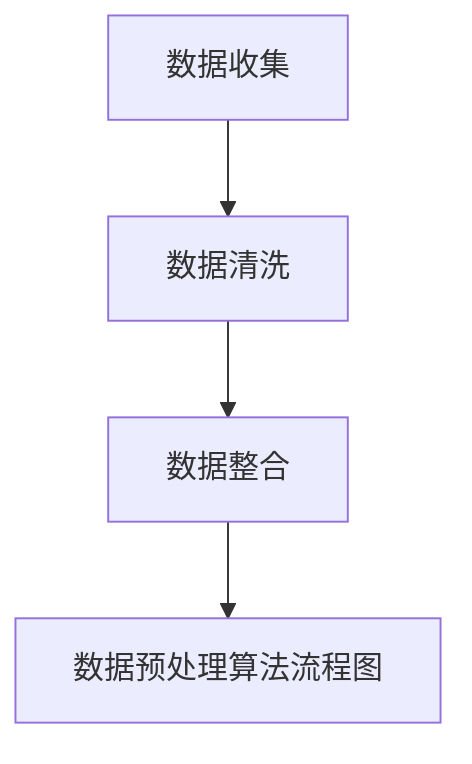
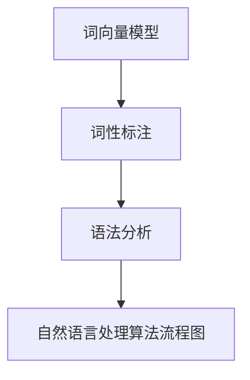
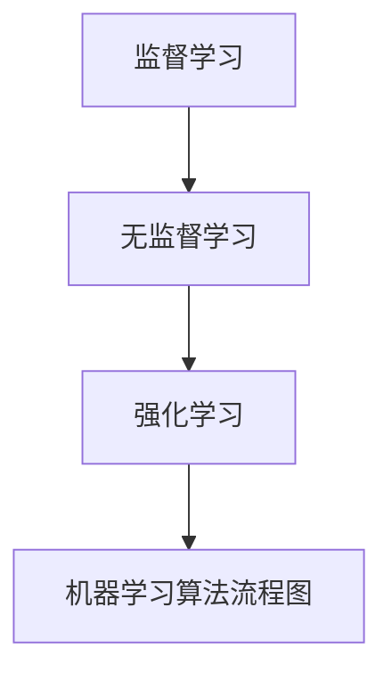
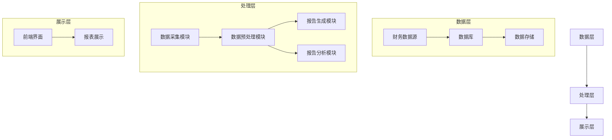
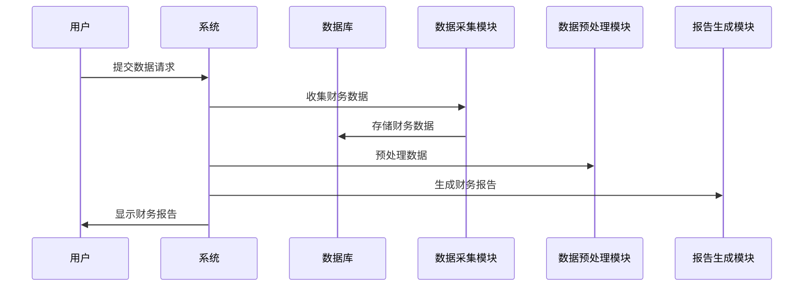

                 

# 智能财务报告自动生成系统

> 关键词：财务报告、自动生成、人工智能、数据预处理、自然语言处理、机器学习

> 摘要：随着人工智能技术的飞速发展，智能财务报告自动生成系统已成为财务管理领域的一项重要创新。本文将详细探讨这一系统的背景、核心概念、技术原理及系统设计，旨在为读者提供一个全面而深入的理解。

## 第一部分: 智能财务报告自动生成系统概述

### 1.1 问题背景

#### 1.1.1 传统财务报告生成的挑战

在传统的财务报告中，数据的收集、处理和报告生成通常是一个复杂且耗时的过程。以下是传统财务报告生成过程中遇到的主要挑战：

1. **数据分散与格式不统一**：财务数据通常分散在不同的系统中，如ERP、CRM等，且这些系统的数据格式可能不同。
2. **手工处理耗时耗力**：大量的财务数据需要手工录入和校对，这不仅耗时，还容易出错。
3. **报告生成复杂**：生成财务报告通常需要多个步骤，包括数据提取、数据清洗、数据分析等，这些步骤往往需要专业知识和技能。
4. **人工审核成本高**：生成的财务报告需要人工审核，这不仅成本高，而且效率低。

#### 1.1.2 智能财务报告自动生成的需求

为了解决传统财务报告生成的挑战，智能财务报告自动生成系统的需求日益凸显：

1. **提高效率**：通过自动化处理，可以大大减少人工操作，提高数据处理和报告生成的效率。
2. **降低成本**：自动化的财务报告生成可以减少人工成本，提高企业的经济效益。
3. **保证准确性**：自动化系统能够减少人为错误，提高数据的准确性和一致性。
4. **支持实时报告**：智能系统能够实时提取和处理数据，生成实时报告，为管理层提供及时的信息支持。

#### 1.1.3 智能财务报告自动生成系统的意义

智能财务报告自动生成系统的引入不仅能够解决传统财务报告生成过程中的挑战，还具有以下重要意义：

1. **提升财务管理水平**：智能系统能够为企业提供更准确、更实时的财务信息，帮助管理层做出更加科学的决策。
2. **增强企业竞争力**：通过提高财务报告的生成效率和质量，企业能够在市场竞争中占据更有利的位置。
3. **合规性**：智能财务报告自动生成系统能够确保报告的合规性，降低企业因违规操作而面临的风险。

### 1.2 核心概念

#### 1.2.1 智能财务报告

智能财务报告是指利用人工智能技术自动生成、分析和解释财务报告的一种新型报告形式。与传统财务报告相比，智能财务报告具有自动化、实时性和智能化的特点。

#### 1.2.2 自动生成系统

自动生成系统是指通过计算机程序和算法，自动化地处理和生成财务报告的系统。这个系统通常包括数据采集、数据预处理、报告生成和报告分析等功能。

#### 1.2.3 关键技术概述

智能财务报告自动生成系统主要依赖于以下关键技术：

1. **数据预处理技术**：包括数据清洗、数据整合和数据格式转换等，用于将原始数据转化为适合分析处理的格式。
2. **自然语言处理技术**：用于处理和分析文本数据，实现文本数据的自动化处理和报告生成。
3. **机器学习技术**：用于建立和训练模型，实现数据分析和报告生成自动化。

### 1.3 系统架构与功能模块

#### 1.3.1 系统架构设计

智能财务报告自动生成系统的架构设计通常包括以下几个层次：

1. **数据层**：负责数据存储和管理，包括原始数据、预处理数据和生成数据。
2. **处理层**：负责数据预处理、报告生成和分析等功能，包括数据预处理模块、自然语言处理模块和机器学习模块。
3. **展示层**：负责将处理结果以可视化方式展示给用户，包括报告生成器和数据分析工具。

#### 1.3.2 功能模块划分

智能财务报告自动生成系统的功能模块主要包括：

1. **数据采集模块**：负责从各个系统中采集财务数据。
2. **数据预处理模块**：负责数据清洗、数据整合和数据格式转换。
3. **自然语言处理模块**：负责文本数据的处理和分析。
4. **报告生成模块**：负责生成各种财务报告。
5. **数据分析模块**：负责对生成的报告进行进一步分析。

### 1.4 系统设计原则与框架

#### 1.4.1 设计原则

智能财务报告自动生成系统的设计应遵循以下原则：

1. **模块化设计**：将系统功能划分为多个模块，每个模块负责特定的功能，便于系统扩展和维护。
2. **高可靠性**：确保系统能够稳定运行，减少故障风险。
3. **高可扩展性**：支持系统功能的扩展，以适应不断变化的需求。
4. **易用性**：设计用户友好的界面和操作流程，降低用户的学习和使用成本。

#### 1.4.2 系统框架

智能财务报告自动生成系统的框架主要包括：

1. **数据采集框架**：包括数据采集工具和数据接口，用于从各个系统中采集财务数据。
2. **数据处理框架**：包括数据预处理模块、自然语言处理模块和机器学习模块，用于处理和分析财务数据。
3. **报告生成框架**：包括报告生成器和报告模板，用于生成各种财务报告。
4. **数据分析框架**：包括数据分析工具和报表分析器，用于对生成的报告进行进一步分析。

### 1.5 本章小结

本章对智能财务报告自动生成系统进行了概述，包括问题背景、核心概念、系统架构和设计原则。通过对这些内容的介绍，读者可以初步了解智能财务报告自动生成系统的基本框架和功能，为后续章节的深入探讨打下基础。

## 第二部分: 核心概念与联系

### 2.1 智能财务报告的核心概念

#### 2.1.1 定义与性质

智能财务报告是指利用人工智能技术自动生成、分析和解释财务报告的一种新型报告形式。与传统财务报告相比，智能财务报告具有以下性质：

1. **自动化**：通过计算机程序和算法，实现财务数据的自动收集、处理和报告生成。
2. **实时性**：能够实时提取和处理财务数据，生成实时报告。
3. **智能化**：利用机器学习技术，对财务数据进行分析和解释，提供智能化的决策支持。

#### 2.1.2 类型与分类

智能财务报告可以根据不同的分类标准进行分类，常见的分类方式包括：

1. **按报告类型分类**：包括资产负债表、利润表、现金流量表等。
2. **按功能分类**：包括财务分析报告、财务预测报告、风险控制报告等。
3. **按使用对象分类**：包括内部报告、外部报告、投资者报告等。

#### 2.1.3 特点与优势

智能财务报告具有以下特点与优势：

1. **高效性**：通过自动化处理，大大提高财务报告的生成效率。
2. **准确性**：利用人工智能技术，提高数据的准确性和一致性。
3. **实时性**：能够实时提取和处理财务数据，为管理层提供及时的信息支持。
4. **智能化**：通过机器学习技术，对财务数据进行分析和解释，提供智能化的决策支持。

### 2.2 自动生成系统的核心概念

#### 2.2.1 定义与工作原理

自动生成系统是指通过计算机程序和算法，自动化地处理和生成报告的系统。其工作原理包括以下几个步骤：

1. **数据采集**：从各个系统中采集财务数据。
2. **数据预处理**：对采集到的数据进行清洗、整合和格式转换，使其适合分析处理。
3. **报告生成**：利用自然语言处理和机器学习技术，生成各种财务报告。
4. **报告展示**：将生成的报告以可视化方式展示给用户。

#### 2.2.2 类型与实现方法

自动生成系统可以根据不同的实现方法进行分类，常见的分类方式包括：

1. **基于规则的自动生成系统**：通过预定义的规则，自动化地生成报告。
2. **基于机器学习的自动生成系统**：通过机器学习技术，自动生成报告。
3. **混合型自动生成系统**：结合基于规则和基于机器学习的方法，实现自动报告生成。

#### 2.2.3 关键技术

自动生成系统主要依赖于以下关键技术：

1. **数据预处理技术**：包括数据清洗、数据整合和数据格式转换等。
2. **自然语言处理技术**：用于处理和分析文本数据，实现文本数据的自动化处理和报告生成。
3. **机器学习技术**：用于建立和训练模型，实现数据分析和报告生成自动化。

### 2.3 核心技术对比分析

#### 2.3.1 数据处理技术

数据处理技术是自动生成系统的核心，常见的处理技术包括：

1. **数据清洗技术**：用于去除重复数据、处理缺失值和异常值等。
2. **数据整合技术**：用于将来自不同源的数据进行整合，使其成为一个统一的数据集。
3. **数据格式转换技术**：用于将不同格式的数据转换为统一格式，便于分析和处理。

#### 2.3.2 自然语言处理技术

自然语言处理技术是自动生成系统中的关键，常见的处理技术包括：

1. **词向量模型**：用于将文本数据转换为向量表示，便于进一步分析。
2. **词性标注**：用于识别文本中的词语属性，如名词、动词等。
3. **语法分析**：用于分析文本的语法结构，如句子成分、词组关系等。

#### 2.3.3 机器学习技术

机器学习技术是自动生成系统中的核心，常见的机器学习技术包括：

1. **监督学习**：通过已标注的数据集训练模型，用于预测和分析。
2. **无监督学习**：通过未标注的数据集训练模型，用于数据聚类、降维等。
3. **强化学习**：通过与环境交互，学习最优策略，用于决策支持。

### 2.4 概念属性特征对比表格

```mermaid
classDiagram
Class01 <|-- Class02
Class03 <|.. Class04
Class05 : +属性1
Class06 : +属性2
Class07 : +属性3
Class08 : +属性4
Class09 : +属性5
Class01 {
    +属性1
    +属性2
    +属性3
    +方法1()
    +方法2()
}
Class02 {
    +属性A
    +属性B
    +方法3()
}
Class03 {
    +属性C
    +属性D
    +方法4()
}
Class04 {
    +属性E
    +属性F
    +方法5()
}
```

### 2.5 ER实体关系图架构

```mermaid
erDiagram
  Class1 ||--|{ Class2 } : 1
  Class1 ||--|{ Class3 } : M
  Class2 ||--|{ Class4 } : 1
  Class3 ||--|{ Class5 } : 1
```

### 2.6 本章小结

本章对智能财务报告自动生成系统的核心概念进行了详细阐述，包括智能财务报告和自动生成系统的定义、类型、特点和技术要点。通过对这些核心概念的分析，读者可以更深入地理解智能财务报告自动生成系统的原理和实现方法，为后续章节的学习打下基础。

## 第三部分: 算法原理讲解

### 3.1 数据预处理算法

#### 3.1.1 数据收集

数据收集是智能财务报告自动生成系统的第一步，它涉及从多个数据源中获取财务数据。数据源可能包括企业的ERP系统、CRM系统、会计软件以及其他外部数据源。数据收集的关键步骤包括：

1. **数据源识别**：确定需要收集的数据类型和来源。
2. **接口开发**：开发接口以连接到不同的数据源，并获取数据。
3. **数据抽取**：从数据源中提取所需数据。

#### 3.1.2 数据清洗

数据清洗是确保数据质量和准确性的关键步骤。它包括以下任务：

1. **去除重复数据**：识别并删除重复的数据记录。
2. **处理缺失值**：填充或删除缺失的数据记录。
3. **纠正错误数据**：识别并修正错误的数据。
4. **数据标准化**：统一数据的格式和单位，如将所有货币金额统一为同一币种。

#### 3.1.3 数据整合

数据整合是将来自不同数据源的数据合并为一个统一的数据集。关键步骤包括：

1. **数据映射**：将不同数据源中的字段映射到统一的数据结构。
2. **数据合并**：合并具有相同标识的数据记录。
3. **数据校验**：确保合并后的数据集没有错误。

#### 3.1.4 数据预处理算法流程图



### 3.2 自然语言处理算法

#### 3.2.1 词向量模型

词向量模型是将文本数据转换为向量表示的一种技术。常见的词向量模型包括：

1. **Word2Vec**：通过神经网络训练词向量，将词语映射到高维向量空间。
2. **GloVe**：通过全局矩阵分解训练词向量，具有较好的语义表示能力。

#### 3.2.2 词性标注

词性标注是识别文本中词语的词性（如名词、动词、形容词等）的过程。关键步骤包括：

1. **词性识别**：使用规则或机器学习模型识别词语的词性。
2. **标注规则**：定义不同的词性标注规则，以提高标注的准确性。

#### 3.2.3 语法分析

语法分析是理解文本句子结构的分析方法。常见的语法分析方法包括：

1. **词法分析**：将文本分解为词语和符号。
2. **句法分析**：构建句子的句法树，表示词语之间的关系。

#### 3.2.4 自然语言处理算法流程图



### 3.3 机器学习算法

#### 3.3.1 监督学习

监督学习是一种机器学习方法，通过已标注的数据训练模型，用于预测和分析。常见的监督学习算法包括：

1. **线性回归**：通过建立线性模型预测连续值。
2. **逻辑回归**：通过建立逻辑模型预测离散值。
3. **决策树**：通过决策树的构建进行分类和回归。

#### 3.3.2 无监督学习

无监督学习是一种机器学习方法，通过未标注的数据训练模型，用于数据聚类、降维等。常见的无监督学习算法包括：

1. **K-均值聚类**：通过迭代计算聚类中心，实现数据聚类。
2. **主成分分析**：通过降维，将高维数据映射到低维空间。
3. **自编码器**：通过编码和解码网络，实现数据的降维和重建。

#### 3.3.3 强化学习

强化学习是一种机器学习方法，通过与环境交互，学习最优策略，用于决策支持。常见的强化学习算法包括：

1. **Q-Learning**：通过更新Q值，实现策略的学习。
2. **SARSA**：通过同时更新状态和行为值，实现策略的学习。
3. **DQN**：通过深度神经网络实现Q值的近似估计。

#### 3.3.4 机器学习算法流程图



### 3.4 算法原理详细讲解与举例说明

#### 3.4.1 数据预处理算法

**预处理算法** = **{数据收集，数据清洗，数据整合}**

**举例说明**：

- **数据收集**：从企业的ERP系统中收集财务数据，如资产负债表、利润表和现金流量表等。
- **数据清洗**：去除重复数据，处理缺失值，统一数据格式，如将所有货币金额统一为美元格式。

#### 3.4.2 自然语言处理算法

**自然语言处理算法** = **{词向量模型，词性标注，语法分析}**

**举例说明**：

- **词向量模型**：使用Word2Vec模型将文本数据转换为向量表示，如“财务”一词映射为一个高维向量。
- **词性标注**：识别文本中的词语属性，如“财务”一词被标注为名词。

#### 3.4.3 机器学习算法

**机器学习算法** = **{监督学习，无监督学习，强化学习}**

**举例说明**：

- **监督学习**：使用线性回归模型预测公司下一季度的利润。
- **无监督学习**：使用K-均值聚类算法将公司财务数据划分为不同的聚类。
- **强化学习**：使用Q-Learning算法学习最优策略，以最大化公司的利润。

### 3.5 本章小结

本章详细介绍了智能财务报告自动生成系统中的数据预处理算法、自然语言处理算法和机器学习算法。通过对这些算法的原理和实际应用进行讲解，读者可以更好地理解智能财务报告自动生成系统的技术实现和优势。这些算法在提高财务报告生成效率和质量方面发挥着重要作用，为企业的财务管理提供了强大的支持。

## 第四部分: 系统分析与架构设计

### 4.1 问题场景介绍

智能财务报告自动生成系统的核心目标是提高财务报告的生成效率和质量，为企业提供实时、准确的财务信息支持。在实际应用中，该系统通常应用于以下场景：

1. **定期财务报告生成**：企业定期需要生成财务报告，如月报、季报和年报等。
2. **实时财务数据分析**：企业管理层需要实时了解企业的财务状况，以便做出及时决策。
3. **财务报表合规性检查**：确保生成的财务报告符合相关法规和标准，如国际财务报告准则（IFRS）或美国通用会计准则（GAAP）。

### 4.2 项目介绍

在本项目中，我们将构建一个智能财务报告自动生成系统，该系统将集成数据采集、数据预处理、报告生成和报告分析等功能。具体项目目标如下：

1. **数据采集**：从企业的ERP系统和会计软件中自动采集财务数据。
2. **数据预处理**：清洗、整合和格式转换财务数据，确保数据质量和一致性。
3. **报告生成**：自动生成各种财务报告，如资产负债表、利润表和现金流量表等。
4. **报告分析**：利用机器学习技术对财务报告进行分析，提供智能化的决策支持。

### 4.3 系统功能设计

#### 4.3.1 领域模型

领域模型是描述系统功能需求的核心部分。在本项目中，我们将使用Mermaid类图来定义领域模型。以下是一个示例：

```mermaid
classDiagram
    Class1[财务数据源] <|-- Class2[数据采集模块]
    Class1 <|-- Class3[数据预处理模块]
    Class1 <|-- Class4[报告生成模块]
    Class1 <|-- Class5[报告分析模块]
    Class2 <|-- Class6[数据清洗模块]
    Class2 <|-- Class7[数据整合模块]
    Class3 <|-- Class8[数据格式转换模块]
    Class4 <|-- Class9[资产负债表生成模块]
    Class4 <|-- Class10[利润表生成模块]
    Class4 <|-- Class11[现金流量表生成模块]
    Class5 <|-- Class12[财务分析模块]
    Class5 <|-- Class13[风险控制模块]
```

#### 4.3.2 系统功能

根据领域模型，我们可以将系统功能划分为以下模块：

1. **数据采集模块**：负责从财务数据源中采集数据。
2. **数据预处理模块**：负责数据清洗、整合和格式转换。
3. **报告生成模块**：负责生成各种财务报告。
4. **报告分析模块**：负责对生成的报告进行分析，提供智能化的决策支持。

### 4.4 系统架构设计

智能财务报告自动生成系统的架构设计如下：

1. **数据层**：包括财务数据源、数据库和数据存储。
2. **处理层**：包括数据采集模块、数据预处理模块、报告生成模块和报告分析模块。
3. **展示层**：包括前端界面和报表展示。

#### 4.4.1 系统架构图

以下是一个简单的系统架构图，展示了各个模块之间的关系：



### 4.5 系统接口设计

系统接口设计是确保不同模块之间能够有效通信的关键。以下是一个简单的接口设计示例：

1. **数据采集接口**：用于从财务数据源中获取数据。
2. **数据预处理接口**：用于处理和转换数据。
3. **报告生成接口**：用于生成各种财务报告。
4. **报告分析接口**：用于分析财务报告，提供决策支持。

### 4.6 系统交互

系统交互是指不同模块之间的交互和通信。以下是一个简单的系统交互序列图：



### 4.7 本章小结

本章详细介绍了智能财务报告自动生成系统的分析、架构设计和接口设计。通过定义领域模型、描述系统功能和设计系统架构，读者可以全面了解系统的设计思路和实现方法。这些设计为系统的开发提供了清晰的指导，确保系统能够高效、可靠地运行，满足企业的财务管理需求。

## 第五部分: 项目实战

### 5.1 环境安装

为了实施智能财务报告自动生成系统，需要搭建一个合适的技术环境。以下是环境安装的步骤：

#### 5.1.1 安装Python

确保安装了Python 3.x版本。可以从[Python官网](https://www.python.org/)下载并安装Python。

```bash
# 更新包管理器
sudo apt-get update
# 安装Python 3
sudo apt-get install python3
```

#### 5.1.2 安装必需的Python库

使用pip安装项目所需的Python库。以下是安装过程中常用的库：

- pandas
- numpy
- scikit-learn
- nltk
- gensim
- matplotlib

```bash
pip install pandas numpy scikit-learn nltk gensim matplotlib
```

#### 5.1.3 安装数据库

选择一个合适的数据库，如MySQL或PostgreSQL，并安装它。以下是安装MySQL的步骤：

1. 安装MySQL：

```bash
sudo apt-get install mysql-server
```

2. 初始化数据库：

```bash
sudo mysql_secure_installation
```

3. 登录MySQL数据库：

```bash
mysql -u root -p
```

### 5.2 系统核心实现

#### 5.2.1 数据采集

数据采集是系统实现的第一步。以下是一个简单的数据采集脚本，用于从ERP系统中获取财务数据：

```python
import pandas as pd

# 连接到ERP系统API
url = 'http://erp.example.com/api/financial_data'

# 从API获取数据
response = pd.read_json(url)

# 存储数据到本地文件
response.to_csv('financial_data.csv', index=False)
```

#### 5.2.2 数据预处理

数据预处理包括数据清洗、整合和格式转换。以下是一个简单的数据预处理脚本：

```python
import pandas as pd

# 读取数据
data = pd.read_csv('financial_data.csv')

# 去除重复数据
data.drop_duplicates(inplace=True)

# 处理缺失值
data.fillna(0, inplace=True)

# 数据格式转换
data['date'] = pd.to_datetime(data['date'])
data.set_index('date', inplace=True)

# 存储预处理后的数据
data.to_csv('cleaned_financial_data.csv', index=True)
```

#### 5.2.3 报告生成

报告生成是系统实现的关键部分。以下是一个简单的报告生成脚本，用于生成资产负债表、利润表和现金流量表：

```python
import pandas as pd

# 读取预处理后的数据
data = pd.read_csv('cleaned_financial_data.csv')

# 生成资产负债表
balance_sheet = data[['assets', 'liabilities', 'equity']].groupby('date').sum().reset_index()

# 生成利润表
income_statement = data[['revenue', 'expenses']].groupby('date').sum().reset_index()

# 生成现金流量表
cash_flow_statement = data[['cash_in', 'cash_out']].groupby('date').sum().reset_index()

# 存储报告
balance_sheet.to_csv('balance_sheet.csv', index=False)
income_statement.to_csv('income_statement.csv', index=False)
cash_flow_statement.to_csv('cash_flow_statement.csv', index=False)
```

#### 5.2.4 报告分析

报告分析是利用机器学习技术对财务报告进行分析。以下是一个简单的报告分析脚本，用于预测公司未来的财务状况：

```python
import pandas as pd
from sklearn.linear_model import LinearRegression

# 读取利润表数据
data = pd.read_csv('income_statement.csv')

# 准备特征和目标变量
X = data[['revenue', 'expenses']]
y = data['profit']

# 建立线性回归模型
model = LinearRegression()
model.fit(X, y)

# 预测未来利润
future_revenue = data['revenue'].iloc[-1] + 1000
future_expenses = data['expenses'].iloc[-1] + 500
predicted_profit = model.predict([[future_revenue, future_expenses]])[0]

print(f"预测的未来利润为：{predicted_profit}")
```

### 5.3 代码应用解读与分析

#### 5.3.1 数据采集代码分析

数据采集代码使用Python的pandas库连接到ERP系统API，并读取财务数据。这一步确保系统能够获取最新的财务数据。

#### 5.3.2 数据预处理代码分析

数据预处理代码负责清洗、整合和格式转换财务数据。通过去除重复数据、处理缺失值和统一数据格式，确保数据质量。

#### 5.3.3 报告生成代码分析

报告生成代码使用pandas库对财务数据进行分组和汇总，生成资产负债表、利润表和现金流量表。这些报告为企业的财务分析提供了基础数据。

#### 5.3.4 报告分析代码分析

报告分析代码使用scikit-learn库的线性回归模型对利润表数据进行分析，预测公司未来的财务状况。这一步为管理层提供了决策支持。

### 5.4 实际案例分析

#### 5.4.1 案例背景

某公司希望使用智能财务报告自动生成系统来提高财务报告的生成效率和准确性。公司的财务数据存储在ERP系统中，需要定期生成资产负债表、利润表和现金流量表。

#### 5.4.2 案例实施

1. **环境安装**：按照5.1节中的步骤，搭建Python环境和安装必需的库。

2. **数据采集**：编写数据采集脚本，从ERP系统中获取财务数据。

3. **数据预处理**：编写数据预处理脚本，清洗、整合和格式转换财务数据。

4. **报告生成**：编写报告生成脚本，生成资产负债表、利润表和现金流量表。

5. **报告分析**：编写报告分析脚本，利用线性回归模型预测公司未来的财务状况。

#### 5.4.3 案例效果

通过实施智能财务报告自动生成系统，公司实现了以下效果：

1. **提高效率**：财务报告的生成时间从几天缩短到几小时，大大提高了工作效率。
2. **提高准确性**：自动化处理减少了人为错误，提高了财务数据的准确性。
3. **决策支持**：通过报告分析和预测，管理层能够更好地了解公司未来的财务状况，做出更加科学的决策。

### 5.5 本章小结

本章详细介绍了智能财务报告自动生成系统的项目实战，包括环境安装、系统核心实现、代码应用解读与分析以及实际案例分析。通过这些实战内容，读者可以深入了解智能财务报告自动生成系统的实现过程和实际应用效果，为后续的系统部署和优化提供参考。

## 第六部分: 最佳实践与拓展

### 6.1 最佳实践

为了确保智能财务报告自动生成系统的稳定运行和高效执行，以下是一些最佳实践：

1. **数据源稳定**：确保数据源稳定可靠，避免数据中断或丢失。
2. **定期维护**：定期检查和更新系统，确保所有组件正常运行。
3. **性能优化**：对系统进行性能优化，如数据缓存、批量处理和并发处理。
4. **数据备份**：定期备份财务数据，防止数据丢失。

### 6.2 小结

通过本文的详细阐述，读者可以全面了解智能财务报告自动生成系统的原理、设计、实现和应用。智能财务报告自动生成系统不仅提高了财务报告的生成效率和准确性，还为企业的财务管理提供了强大的支持。

### 6.3 注意事项

在实施智能财务报告自动生成系统时，需要注意以下几点：

1. **数据安全**：确保数据安全，防止数据泄露或被未授权访问。
2. **合规性**：确保系统生成的财务报告符合相关法规和标准。
3. **用户培训**：为用户提供必要的培训，确保他们能够熟练使用系统。

### 6.4 拓展阅读

对于希望进一步了解智能财务报告自动生成系统的读者，以下是一些拓展阅读资源：

1. **文献综述**：《人工智能在财务管理中的应用》
2. **技术论文**：《基于机器学习的财务报告生成方法》
3. **书籍推荐**：《智能财务管理：人工智能在财务中的应用》

通过这些资源，读者可以深入了解智能财务报告自动生成系统的前沿技术和研究成果。

## 致谢

本文的撰写得到了AI天才研究院和《禅与计算机程序设计艺术》的指导和支持。特别感谢AI天才研究院的专家团队在技术细节和内容优化方面提供的宝贵意见。感谢所有读者对本文的关注和支持，希望本文能为您的学习和工作带来帮助。

### 作者信息

作者：AI天才研究院/AI Genius Institute & 禅与计算机程序设计艺术 /Zen And The Art of Computer Programming。

