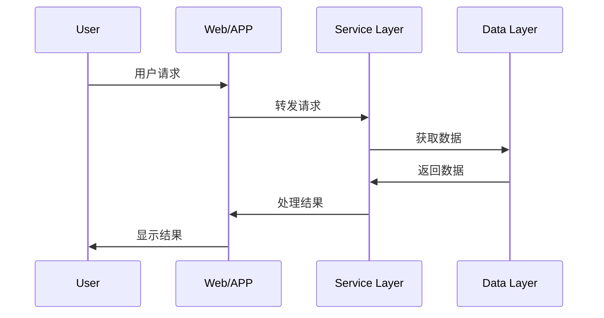
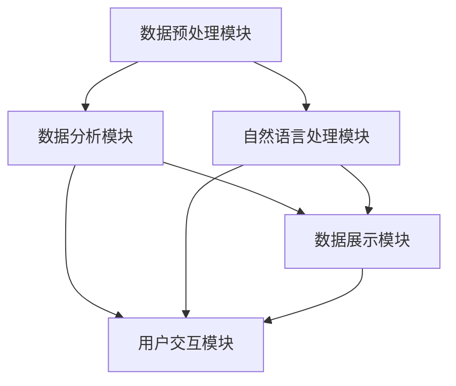
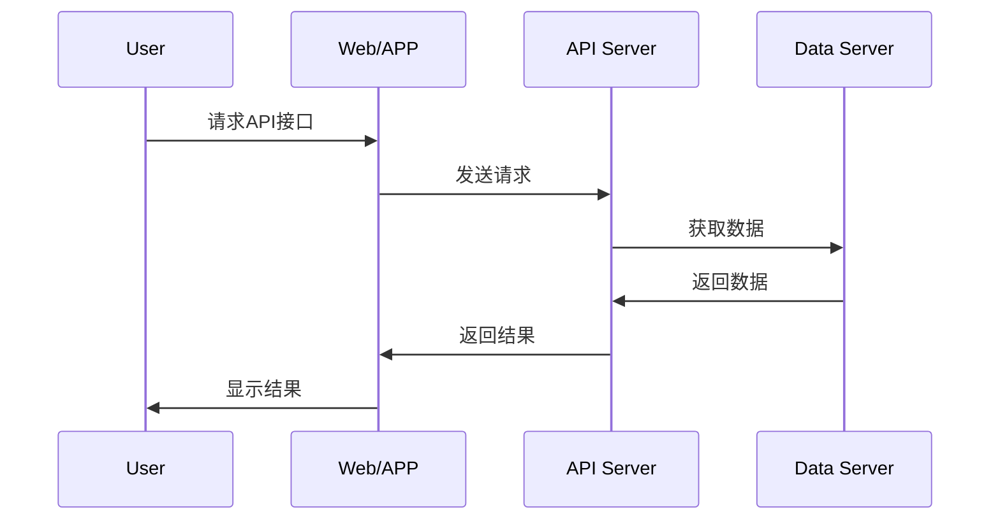

                 


### 第一部分：智能财务报表分析器概述

#### 1.1 问题背景

财务报表分析是企业管理决策过程中的关键环节，它不仅有助于评估企业的财务健康状况，还能为投资决策提供有力支持。然而，传统的财务报表分析方式主要依赖于手工处理和简单的统计分析，这种方式存在一些明显的局限性：

- **数据处理效率低**：财务数据量大，手工处理费时费力。
- **分析精度受限**：依赖人为经验，分析结果可能存在主观偏差。
- **时效性差**：传统分析往往需要较长时间，无法实时反映企业财务状况。
- **无法应对复杂分析需求**：面对复杂多变的财务环境和日益增长的数据复杂性，传统方法难以满足深入分析的需求。

针对这些局限性，智能财务报表分析器的出现成为必然。智能财务报表分析器利用人工智能、大数据分析等先进技术，对财务数据进行自动处理和分析，从而提高分析效率、增强分析精度、提升时效性，并能够应对复杂分析需求。

#### 1.2 智能财务报表分析器的核心概念

智能财务报表分析器是一种集成了多种人工智能技术，用于自动分析和解读财务数据的系统。它主要包括以下几个核心概念：

- **数据预处理**：通过对原始财务数据进行清洗、转换和集成，为后续分析提供高质量的数据基础。
- **自然语言处理**：利用自然语言处理技术对财务报表中的文本信息进行解析，提取关键信息。
- **机器学习与深度学习**：通过训练机器学习模型和深度学习模型，对财务数据进行分析和预测。
- **可视化展示**：将分析结果以图表、报表等形式直观展示，帮助用户快速理解和决策。

#### 1.3 智能财务报表分析器的优势

智能财务报表分析器相比传统方法具有以下优势：

- **提高数据处理效率**：自动化的数据处理流程大幅提高了效率，降低了人力成本。
- **增强分析精度**：通过机器学习和深度学习技术，分析结果更加客观准确。
- **实时分析**：依托大数据技术和云计算平台，支持实时数据分析和决策。
- **支持复杂分析**：能够处理复杂多变的财务数据，满足多样化的分析需求。
- **辅助决策**：通过智能分析结果，为企业决策提供有力支持。

#### 1.4 本书结构安排

本书分为五个主要部分：

1. **智能财务报表分析器概述**：介绍智能财务报表分析器的背景、核心概念和优势。
2. **财务报表数据预处理**：详细讲解财务报表数据预处理的过程、技术和工具。
3. **智能财务报表分析技术**：介绍自然语言处理、机器学习和深度学习等技术，以及其在财务报表分析中的应用。
4. **智能财务报表分析器开发**：从系统设计、技术选型、开发过程、系统测试与优化等方面讲解智能财务报表分析器的实现。
5. **智能财务报表分析器应用与推广**：探讨智能财务报表分析器的市场潜力、应用场景和推广策略。

每部分都包含了具体的小节，详细阐述了相关内容。本书结构紧凑，逻辑清晰，旨在帮助读者全面了解智能财务报表分析器的原理和应用。

#### 1.5 本章小结

本章对智能财务报表分析器进行了概述，介绍了其背景、核心概念、优势以及本书的结构安排。通过本章的学习，读者可以了解智能财务报表分析器的基本情况和本书的主要内容，为后续章节的学习打下基础。

### 第一部分：智能财务报表分析器概述

#### 1.6 技术要求

为了成功开发和使用智能财务报表分析器，读者需要具备以下技术基础：

1. **硬件环境要求**：
   - 具备较高的计算能力，推荐使用配备高性能CPU和GPU的计算机。
   - 足够的存储空间，用于存储大量的财务数据和处理结果。

2. **软件环境要求**：
   - 操作系统：Windows、Linux或Mac OS均可。
   - 编程语言：熟悉Python、Java或C#等编程语言。
   - 数据库管理：熟悉MySQL、PostgreSQL或MongoDB等数据库管理工具。
   - 数据分析工具：熟悉Excel、Tableau或Power BI等数据分析工具。

3. **基本编程技能要求**：
   - 熟悉基本的编程语法和数据结构。
   - 掌握至少一种编程语言，如Python、Java或C#。
   - 具备数据处理和分析的基本技能。

通过满足上述技术要求，读者可以更好地理解智能财务报表分析器的原理和实现，从而在实际应用中取得更好的效果。

#### 1.7 本章小结

本章对智能财务报表分析器进行了概述，介绍了其背景、核心概念、优势以及本书的结构安排，并说明了技术要求。通过本章的学习，读者可以了解智能财务报表分析器的基本情况和本书的主要内容，为后续章节的学习打下基础。

## 2.1 数据来源

在智能财务报表分析过程中，数据来源的多样性和质量直接影响分析结果的准确性。财务数据可以从多种渠道获取，包括内部数据和外部数据。

#### 2.1.1 不同来源的财务数据

1. **内部数据**：
   - **企业财务报表**：包括资产负债表、利润表、现金流量表等。
   - **交易记录**：如销售记录、采购记录、支付记录等。
   - **员工薪资和成本记录**：企业的人力资源管理和成本核算数据。

2. **外部数据**：
   - **市场数据**：如行业平均数据、市场趋势等。
   - **公开财务数据**：包括证券交易所披露的上市公司财务报表等。
   - **第三方数据源**：如金融数据服务商提供的专业数据。

#### 2.1.2 数据质量评估

数据质量是财务分析成功的关键因素之一。以下是对数据质量的评估：

1. **准确性**：数据是否真实、可靠，没有错误或遗漏。
2. **完整性**：数据是否完整，是否包含所有必要的信息。
3. **一致性**：数据在不同时间点和不同来源之间是否保持一致。
4. **及时性**：数据是否能够及时更新，以反映最新的财务状况。

#### 2.1.3 数据清洗方法

数据清洗是确保数据质量的重要步骤。以下是一些常见的数据清洗方法：

1. **缺失值处理**：对于缺失的数据，可以通过插值法、均值填补法等方法进行填补。
2. **异常值处理**：识别并处理异常数据，如极端值、重复值等。
3. **数据标准化**：将不同单位或尺度的数据进行标准化处理，以便于后续分析。
4. **数据转换**：如将文本数据转换为数字数据，或进行数据类型转换。

通过上述数据来源的多样性和数据质量评估与清洗方法，智能财务报表分析器能够获取高质量的数据，从而保证分析结果的准确性和可靠性。

#### 2.2 本章小结

本章介绍了财务报表分析中数据来源的多样性，包括内部数据和外部数据，并对数据质量进行了评估。同时，提出了数据清洗的方法，以确保数据的准确性和完整性。这些步骤是智能财务报表分析的基础，为后续的数据处理和分析奠定了坚实的基础。

### 2.2 数据集成

在智能财务报表分析中，数据集成是关键的一步，它将来自不同来源的数据整合为一个统一的数据集，以便进行后续的分析和处理。以下是数据集成的重要性和具体方法。

#### 2.2.1 数据集成的重要性

1. **数据一致性和完整性**：通过数据集成，可以消除数据中的不一致性和重复性，确保数据在整体上的一致性和完整性。
2. **提高数据分析效率**：数据集成后，可以一次性处理多个数据源，减少重复性工作，提高数据分析的效率。
3. **增强决策支持能力**：集成后的数据能够提供更全面的视角，帮助决策者更全面地了解企业的财务状况，从而做出更准确的决策。
4. **支持复杂分析**：整合后的数据集可以用于更复杂和深入的分析，如关联分析、趋势预测等。

#### 2.2.2 数据集成的方法

1. **数据仓库**：数据仓库是一种用于存储、管理和分析大量数据的数据库系统。它通过ETL（提取、转换、加载）过程将来自多个数据源的数据集成到一起，并提供高效的数据查询和分析功能。
   - **优点**：能够整合不同源的数据，提供高效的数据访问和分析能力。
   - **缺点**：需要较高的系统维护成本，且对数据质量和一致性要求较高。

2. **数据湖**：数据湖是一种以原始数据形式存储数据的系统，它不对数据进行预先的结构化处理，允许灵活的数据访问和探索。
   - **优点**：能够保留原始数据，便于后续的分析和挖掘。
   - **缺点**：对数据的结构化和管理要求较高，数据处理和分析效率相对较低。

3. **数据总线**：数据总线是一种通过中间件实现数据集成的方法，它将不同数据源的数据进行提取、转换和加载，以统一格式供分析使用。
   - **优点**：灵活性强，易于扩展。
   - **缺点**：数据处理效率较低，对系统性能要求较高。

#### 2.2.3 数据集成工具

1. **Apache Kafka**：是一种分布式流处理平台，用于构建实时数据集成系统。它能够处理大规模数据流，实现高效的数据传输和集成。
   - **优点**：支持实时数据集成，可扩展性强。
   - **缺点**：对开发人员的技术要求较高。

2. **Apache NiFi**：是一种可扩展的数据集成平台，用于构建、管理和监控数据流。它提供了丰富的数据转换和集成功能。
   - **优点**：易于使用，功能全面。
   - **缺点**：系统部署和维护成本较高。

3. **Talend**：是一种集成平台，提供了丰富的数据集成、数据质量和数据管理功能。它支持多种数据源和多种集成方式。
   - **优点**：功能强大，支持多种数据源。
   - **缺点**：学习曲线较陡峭。

通过选择合适的数据集成方法和工具，智能财务报表分析器可以有效地整合多源数据，为财务分析提供全面、准确的数据支持。

#### 2.3 本章小结

本章详细介绍了数据集成的重要性、方法以及常用的数据集成工具。数据集成是智能财务报表分析器数据处理的关键步骤，通过本章的学习，读者可以了解如何有效地整合多源数据，为后续的财务分析奠定基础。

### 2.3 数据转换

在智能财务报表分析过程中，数据转换是确保数据一致性和规范性的重要步骤。数据转换不仅涉及不同数据类型的转换，还包括数据清洗、格式转换、数据合并等操作。以下是数据转换的原则、常见方法及其工具。

#### 2.3.1 数据转换的原则

1. **一致性原则**：确保转换后的数据与原始数据在逻辑上一致，避免信息丢失或错误。
2. **规范性原则**：按照统一的标准进行数据转换，确保数据格式和结构的规范化。
3. **可追溯性原则**：记录数据转换的过程和规则，便于后续的数据审计和问题追踪。
4. **高效性原则**：选择高效的数据转换方法和工具，减少转换过程中的时间和资源消耗。

#### 2.3.2 常见的数据转换方法

1. **数据类型转换**：
   - **文本到数字**：将文本形式的数字转换为实际数值。
   - **数字到文本**：将数字转换为对应的文本描述，如货币金额转换为文字表示。
   - **日期格式转换**：调整日期的格式，如从YYYY-MM-DD转换为DD/MM/YYYY。

2. **数据清洗**：
   - **缺失值处理**：填补或删除缺失的数据。
   - **异常值处理**：识别和修正异常数据，如识别并剔除极端值或重复值。

3. **数据格式转换**：
   - **结构化数据转换为非结构化数据**：如将数据库中的数据转换为CSV或JSON格式。
   - **非结构化数据转换为结构化数据**：如将文本数据转换为关键字索引或实体识别。

4. **数据合并**：
   - **横向合并**：将多个表中的数据按列合并，形成一个新的数据集。
   - **纵向合并**：将多个表中的数据按行合并，形成一个新的数据集。

#### 2.3.3 数据转换工具

1. **Python**：
   - **优点**：丰富的库和工具，如`pandas`和`numpy`，支持多种数据转换操作。
   - **缺点**：编程复杂度较高，需要具备一定的编程技能。

2. **SQL**：
   - **优点**：直观的查询语言，支持多种数据转换操作。
   - **缺点**：仅限于关系型数据库，对非结构化数据的处理能力有限。

3. **Apache NiFi**：
   - **优点**：图形化界面，易于使用，支持多种数据源和数据转换操作。
   - **缺点**：系统部署和维护成本较高。

4. **Talend**：
   - **优点**：功能强大，支持多种数据源和转换操作。
   - **缺点**：学习曲线较陡峭，对系统资源要求较高。

通过遵循数据转换的原则，使用适当的数据转换方法和工具，智能财务报表分析器可以确保数据的准确性和一致性，为后续的财务分析提供可靠的数据支持。

#### 2.4 本章小结

本章详细介绍了数据转换的原则、常见方法和工具。数据转换是智能财务报表分析中不可或缺的一步，通过本章的学习，读者可以掌握数据转换的基本原则和操作方法，为有效的数据处理和财务分析奠定基础。

### 2.4 数据存储

在智能财务报表分析中，数据存储的设计和选择至关重要，它直接影响数据分析的效率、数据的完整性和一致性。以下是数据存储的选择、设计原则以及数据仓库的概念。

#### 2.4.1 数据库的选择

1. **关系型数据库**：
   - **优点**：结构化数据存储，查询效率高，易于维护。
   - **缺点**：扩展性较差，不适合处理大规模的非结构化数据。

2. **非关系型数据库**：
   - **优点**：灵活的 schema 设计，可扩展性强，适用于大规模非结构化数据。
   - **缺点**：查询效率相对较低，维护成本较高。

3. **分布式数据库**：
   - **优点**：高可用性和高扩展性，适用于大规模数据存储和查询。
   - **缺点**：系统复杂度高，需要专业的运维团队。

#### 2.4.2 数据存储设计

1. **数据分层设计**：
   - **原始数据层**：存储原始的财务数据，如交易记录、报表数据等。
   - **数据清洗层**：存储经过清洗和转换后的数据，确保数据的准确性和一致性。
   - **数据仓库层**：存储经过整合和汇总的数据，供分析和查询使用。

2. **数据分区**：
   - **水平分区**：将数据按列或记录分割成多个文件或表，提高查询效率。
   - **垂直分区**：将数据按列分割成多个文件或表，减少数据冗余，提高查询效率。

3. **数据索引**：
   - **主键索引**：加快对主键的查询速度。
   - **非主键索引**：加快对非主键字段的查询速度。

#### 2.4.3 数据仓库的概念

1. **定义**：
   - 数据仓库是一个集成的、面向主题的、相对稳定的、反映历史变化的数据集合，用于支持管理层的决策分析。

2. **特点**：
   - **集成性**：整合来自多个源的数据，提供统一的数据视图。
   - **主题性**：按照业务主题组织数据，便于分析和查询。
   - **稳定性**：数据仓库的数据是经过清洗、转换和整合的，具有较高的可靠性。
   - **历史性**：存储历史数据，支持时间序列分析。

3. **架构**：
   - **数据源层**：包括内部和外部数据源，如企业系统、外部数据库等。
   - **数据集成层**：进行数据清洗、转换和整合，形成统一的数据视图。
   - **数据仓库层**：存储经过整合和汇总的数据，供分析和查询使用。
   - **访问层**：提供数据访问和查询接口，如 BI 工具、报表系统等。

通过合理的数据存储设计，智能财务报表分析器可以有效地管理和利用财务数据，为分析和决策提供强有力的支持。

#### 2.5 本章小结

本章介绍了数据存储的选择、设计原则以及数据仓库的概念。数据存储是智能财务报表分析的重要组成部分，通过本章的学习，读者可以了解如何选择合适的数据库、设计数据存储架构，并理解数据仓库的基本原理，为后续的数据处理和分析奠定基础。

### 第二部分：智能财务报表分析技术

#### 3.1 自然语言处理技术

自然语言处理（Natural Language Processing，NLP）是人工智能领域的一个重要分支，旨在使计算机理解和解释人类自然语言。在智能财务报表分析中，NLP技术被广泛应用于文本信息的提取、分析和理解，从而帮助从财务报表中获取有价值的信息。

#### 3.1.1 自然语言处理概述

1. **NLP的基本概念**：
   - **语言模型**：对自然语言进行建模，用于生成文本、翻译文本等。
   - **分词**：将连续的文本切分成有意义的词语或短语。
   - **词性标注**：对文本中的词语进行词性分类，如名词、动词、形容词等。
   - **句法分析**：对文本进行句法结构分析，理解句子中的语法关系。
   - **语义分析**：理解文本中的语义含义，包括实体识别、情感分析等。

2. **NLP的发展历程**：
   - **规则驱动**：基于人工编写的规则进行文本处理。
   - **统计模型**：利用统计方法进行文本分析，如隐马尔可夫模型（HMM）、条件随机场（CRF）等。
   - **深度学习**：利用神经网络进行文本分析，如卷积神经网络（CNN）、循环神经网络（RNN）、变换器（Transformer）等。

3. **NLP的应用场景**：
   - **文本分类**：将文本数据分类到预定义的类别中，如财务报告的分类。
   - **文本聚类**：将相似度较高的文本数据归为一类，用于发现相似报告或段落。
   - **情感分析**：分析文本中的情感倾向，如投资者情绪分析。
   - **实体识别**：从文本中提取出重要的实体，如公司名、产品名、人名等。
   - **机器翻译**：将一种语言的文本翻译成另一种语言，如财务报告的多语言翻译。

#### 3.1.2 文本分类算法

文本分类是将文本数据分类到预定义的类别中的过程。以下是一些常见的文本分类算法：

1. **朴素贝叶斯分类器**：
   - **原理**：基于贝叶斯定理，通过计算文本特征的概率分布来进行分类。
   - **优点**：计算简单，适用于文本分类任务。
   - **缺点**：假设特征条件独立性，可能不适用于高度依赖的文本数据。

2. **支持向量机（SVM）**：
   - **原理**：通过找到最佳分隔超平面，将文本数据分类。
   - **优点**：分类效果好，对高维数据有较好的处理能力。
   - **缺点**：计算复杂度高，对大规模数据集的处理较慢。

3. **随机森林**：
   - **原理**：通过构建多个决策树，并通过投票来决定最终类别。
   - **优点**：对非线性数据的分类效果好，抗过拟合能力强。
   - **缺点**：模型复杂度较高，计算时间较长。

4. **深度学习模型**：
   - **原理**：利用神经网络进行文本特征提取和分类。
   - **优点**：能够自动学习文本特征，分类效果较好。
   - **缺点**：需要大量数据和计算资源，模型解释性较差。

文本分类算法在智能财务报表分析中有着广泛的应用，如财务报告分类、财务摘要生成等。通过选择合适的文本分类算法，智能财务报表分析器可以高效地对财务报表进行分类和分析。

#### 3.1.3 文本聚类算法

文本聚类是将文本数据按照其相似度归为不同类别的过程。以下是一些常见的文本聚类算法：

1. **K-means算法**：
   - **原理**：将文本数据聚类到K个中心点，通过迭代更新中心点，最小化每个聚类内的距离平方和。
   - **优点**：简单易懂，计算效率高。
   - **缺点**：对初始中心点敏感，可能收敛到局部最优解。

2. **层次聚类算法**：
   - **原理**：自底向上或自顶向下合并或分裂聚类，形成层次结构。
   - **优点**：能够生成聚类层次结构，适用于多种聚类场景。
   - **缺点**：计算复杂度较高，对聚类数量和层次结构的选择依赖较大。

3. **DBSCAN算法**：
   - **原理**：基于密度聚类，识别出高密度区域并将其划分为聚类。
   - **优点**：能够自动识别聚类数量，对噪声数据敏感。
   - **缺点**：对聚类密度参数的选择较依赖。

文本聚类算法在智能财务报表分析中可以帮助识别相似的财务报告或段落，从而发现潜在的业务规律和趋势。通过选择合适的文本聚类算法，智能财务报表分析器可以更深入地挖掘财务数据中的信息。

#### 3.2 本章小结

本章介绍了自然语言处理技术在智能财务报表分析中的应用，包括文本分类和文本聚类算法。NLP技术为智能财务报表分析提供了强大的文本分析能力，通过选择合适的算法，可以有效地从财务报表中提取和挖掘有价值的信息，为企业的管理和决策提供支持。

### 3.2 机器学习技术

机器学习（Machine Learning，ML）是人工智能（AI）的一个重要分支，它通过构建算法模型，从数据中自动学习并作出预测或决策。在智能财务报表分析中，机器学习技术被广泛应用于数据分析和预测，从而提供更加精准和高效的财务分析结果。

#### 3.2.1 机器学习基础

1. **基本概念**：
   - **模型**：机器学习模型是对数据的一种抽象表示，用于预测或分类。
   - **特征**：特征是用于训练模型的数据属性，如财务报表中的各项指标。
   - **算法**：算法是实现模型训练和预测的具体方法，如线性回归、决策树、支持向量机等。
   - **损失函数**：损失函数用于评估模型预测的准确性，如均方误差（MSE）、交叉熵损失等。

2. **学习类型**：
   - **监督学习**：通过已标记的训练数据来训练模型，然后对新的数据进行预测。
     - **回归问题**：预测连续值，如预测公司盈利。
     - **分类问题**：预测离散标签，如分类财务报告类型。
   - **无监督学习**：在没有标记的数据上进行训练，用于发现数据中的模式和结构。
     - **聚类**：将数据分组，如发现相似财务报告。
     - **降维**：减少数据维度，如主成分分析（PCA）。

3. **评估方法**：
   - **准确率**：正确预测的样本数占总样本数的比例，适用于分类问题。
   - **精确率**：正确预测的正例样本数占所有预测为正例的样本数的比例。
   - **召回率**：正确预测的正例样本数占所有实际为正例的样本数的比例。
   - **F1分数**：精确率和召回率的调和平均值，综合考虑了分类的准确性和完整性。
   - **ROC曲线和AUC**：通过绘制ROC曲线和计算AUC值，评估分类器的性能。

#### 3.2.2 常见机器学习算法

1. **线性回归**：
   - **原理**：通过最小化预测值与实际值之间的误差，拟合出一条直线。
   - **应用**：预测财务数据中的连续变量，如公司盈利、销售量等。

2. **逻辑回归**：
   - **原理**：通过最小化对数似然损失函数，拟合出一条 logistic 曲线。
   - **应用**：进行概率预测，如预测公司破产的概率、财务报告分类等。

3. **决策树**：
   - **原理**：通过一系列规则，将数据划分为多个子集，最终生成一棵树。
   - **应用**：分类和回归问题，如财务报表分类、盈利预测等。

4. **支持向量机（SVM）**：
   - **原理**：通过找到一个最优的超平面，将数据分为不同的类别。
   - **应用**：分类问题，如财务报表分类、信用评级等。

5. **随机森林**：
   - **原理**：通过构建多棵决策树，并通过投票决定最终结果。
   - **应用**：分类和回归问题，如财务报表分类、销售量预测等。

6. **神经网络**：
   - **原理**：通过多层神经元，对输入数据进行非线性变换和特征提取。
   - **应用**：复杂的数据分析和预测任务，如财务报表分析、股票预测等。

#### 3.2.3 特征工程

特征工程是机器学习中的一个关键步骤，它涉及到从原始数据中提取和构造有用的特征，以提高模型的性能。以下是一些常见的特征工程方法：

1. **数据预处理**：
   - **缺失值处理**：填补或删除缺失数据。
   - **数据标准化**：将数据缩放到相同的范围。
   - **数据归一化**：将数据转换为相同的尺度。

2. **特征提取**：
   - **统计特征**：如均值、方差、最大值、最小值等。
   - **文本特征**：如词频、词向量等。
   - **图像特征**：如颜色直方图、纹理特征等。

3. **特征选择**：
   - **过滤式特征选择**：通过筛选低相关性或冗余特征来减少特征空间。
   - **包装式特征选择**：通过模型评估来选择最佳特征组合。
   - **嵌入式特征选择**：在模型训练过程中自动选择特征。

通过特征工程，可以有效地提高机器学习模型在财务报表分析中的预测准确性和鲁棒性。

#### 3.3 本章小结

本章介绍了机器学习技术在智能财务报表分析中的应用，包括基本概念、常见算法和特征工程。机器学习为财务报表分析提供了强大的数据驱动预测和分析能力，通过选择合适的算法和特征，可以更好地理解和预测企业的财务状况，为企业的决策提供有力支持。

### 3.3 深度学习技术

深度学习（Deep Learning，DL）是机器学习的一个分支，其核心思想是通过构建多层神经网络，对数据进行复杂的特征学习和模式识别。在智能财务报表分析中，深度学习技术被广泛应用于数据分析和预测，以其强大的建模能力和高度自动化的特征提取能力，为财务报表分析提供了新的解决方案。

#### 3.3.1 深度学习概述

1. **基本概念**：
   - **神经网络**：神经网络由多个节点（神经元）组成，通过层与层之间的相互连接，实现数据的传递和变换。
   - **深度神经网络**：包含多个隐藏层的神经网络，能够学习更复杂的特征和模式。
   - **激活函数**：用于引入非线性变换，使神经网络能够捕捉复杂的非线性关系。
   - **反向传播算法**：用于计算神经网络参数的梯度，以优化模型。

2. **发展历程**：
   - **1980年代**：深度学习概念提出，但由于计算资源和数据集的限制，发展缓慢。
   - **2006年**：Hinton等人提出了深度置信网络（Deep Belief Network，DBN），深度学习开始受到关注。
   - **2012年**：AlexNet在ImageNet竞赛中取得突破性成果，深度学习在图像识别领域取得了显著进展。
   - **至今**：深度学习在语音识别、自然语言处理、推荐系统等多个领域取得了广泛应用。

3. **优势**：
   - **自动特征提取**：深度神经网络能够自动从原始数据中提取有代表性的特征，减轻了特征工程的工作量。
   - **强大的表征能力**：多层神经网络能够学习到更抽象、更高层次的特征，从而提高模型的预测能力。
   - **适用于复杂数据**：深度学习能够处理高维、非结构化的复杂数据，如文本、图像、语音等。

4. **挑战**：
   - **计算资源消耗**：深度学习模型通常需要大量的计算资源和时间进行训练。
   - **数据需求**：深度学习模型对大量高质量的数据有较高需求，数据不足可能导致模型性能下降。
   - **模型解释性**：深度学习模型的内部机制复杂，难以解释，增加了模型理解和优化的难度。

#### 3.3.2 神经网络结构

1. **前向传播**：
   - **输入层**：接收外部输入数据，如财务报表中的各项指标。
   - **隐藏层**：对输入数据进行特征提取和变换，每一层都可以通过激活函数引入非线性变换。
   - **输出层**：生成最终的输出结果，如财务报表的分类结果或预测值。

2. **反向传播**：
   - **梯度计算**：通过反向传播算法，计算输出层到输入层的梯度，以更新网络参数。
   - **损失函数**：用于衡量模型预测结果与真实结果之间的差距，如均方误差（MSE）或交叉熵损失。

3. **激活函数**：
   - **Sigmoid函数**：将输入压缩到（0，1）区间，常用于二分类问题。
   - **ReLU函数**：引入非线性，提高训练速度，常用于隐藏层。
   - **Tanh函数**：将输入压缩到（-1，1）区间，具有较好的平滑性。

#### 3.3.3 卷积神经网络

卷积神经网络（Convolutional Neural Network，CNN）是深度学习中的一个重要模型，特别适用于图像和语音处理。以下是CNN的基本结构和原理：

1. **卷积层**：
   - **卷积操作**：通过卷积核在输入数据上滑动，提取局部特征。
   - **特征图**：每个卷积核生成一个特征图，多个卷积核组成一个卷积层。

2. **池化层**：
   - **下采样**：通过最大池化或平均池化，降低特征图的维度，减少参数数量。

3. **全连接层**：
   - **特征融合**：将多个卷积层提取的特征进行融合，输出最终结果。

4. **应用场景**：
   - **图像识别**：用于识别财务报表中的关键图像特征，如公司标志、财务图表等。
   - **语音识别**：用于识别财务报表中的语音信息，如语音命令、会议记录等。

#### 3.4 本章小结

本章介绍了深度学习技术在智能财务报表分析中的应用，包括基本概念、神经网络结构和卷积神经网络。深度学习以其强大的建模能力和自动特征提取能力，为财务报表分析提供了新的思路和工具，通过选择合适的深度学习模型，可以更准确地理解和预测企业的财务状况，为企业的管理和决策提供支持。

### 3.4 强化学习技术

强化学习（Reinforcement Learning，RL）是机器学习的一个重要分支，它通过奖励机制驱动智能体在环境中进行学习，以实现最优行为策略。在智能财务报表分析中，强化学习技术被广泛应用于优化决策和策略制定，从而提高财务分析和预测的准确性。

#### 3.4.1 强化学习概述

1. **基本概念**：
   - **智能体（Agent）**：执行任务的主体，如财务报表分析系统。
   - **环境（Environment）**：智能体所处的环境，如财务市场。
   - **状态（State）**：智能体在某一时刻所处的环境描述，如财务指标。
   - **动作（Action）**：智能体根据状态选择的行动，如交易决策。
   - **奖励（Reward）**：动作结果的好坏，用于评价智能体的行为。

2. **学习类型**：
   - **有监督学习**：已知输入和输出，学习映射关系。
   - **无监督学习**：未知输入和输出，学习数据分布。
   - **强化学习**：通过奖励机制，智能体自主学习最优行为策略。

3. **应用场景**：
   - **自动化交易**：根据市场动态和财务指标，自动化进行买卖交易。
   - **财务风险控制**：根据财务数据，制定最优的风险控制策略。
   - **投资组合优化**：根据市场趋势和财务分析结果，优化投资组合。

#### 3.4.2 Q学习算法

Q学习（Q-Learning）是强化学习的一种典型算法，通过迭代更新策略值函数，实现最优策略的求解。以下是Q学习的基本原理和步骤：

1. **Q值**：Q值表示智能体在某一状态下执行某一动作的期望收益。

2. **目标函数**：通过最大化Q值来更新策略，使智能体选择最优动作。

3. **更新规则**：
   - **经验回放**：将历史状态、动作和奖励存储在经验池中，以避免策略陷入局部最优。
   - **目标Q值**：计算在当前状态下，执行最佳动作的预期收益。
   - **Q值更新**：根据当前状态、动作和目标Q值，更新当前状态的Q值。

4. **优势**：
   - **适应性**：能够适应动态变化的环境，实时调整策略。
   - **灵活性**：适用于复杂环境，能够处理高维状态空间。

5. **劣势**：
   - **收敛速度较慢**：需要大量迭代才能收敛到最优策略。
   - **样本效率低**：需要大量样本数据，以获得准确的Q值估计。

#### 3.4.3 深度强化学习

深度强化学习（Deep Reinforcement Learning，DRL）是强化学习与深度学习的结合，通过构建深度神经网络来近似Q值函数，从而实现高效的学习和决策。以下是DRL的基本原理和实现步骤：

1. **深度神经网络**：用于近似Q值函数，将输入的状态编码为高维特征向量。

2. **策略网络**：通过优化策略网络，实现智能体在状态空间中的最优行动选择。

3. **目标网络**：用于计算目标Q值，通过固定目标网络，避免策略网络陷入局部最优。

4. **学习策略**：
   - **基于策略**：直接优化策略网络，使策略网络输出最优动作。
   - **基于值函数**：优化值函数网络，通过最大化期望收益来优化策略。

5. **应用**：
   - **股票交易**：通过DRL实现自动化交易，优化投资策略。
   - **风险管理**：通过DRL制定最优的财务风险控制策略。
   - **能源管理**：通过DRL优化能源分配和调度策略。

#### 3.5 本章小结

本章介绍了强化学习技术在智能财务报表分析中的应用，包括Q学习算法和深度强化学习。强化学习通过奖励机制和策略优化，为财务报表分析提供了新的决策支持和优化手段，通过选择合适的强化学习算法，可以更好地应对复杂多变的财务环境，实现更精准的财务分析和预测。

### 3.5 智能财务报表分析应用案例

智能财务报表分析技术在实际应用中展现了其强大的能力和广泛的应用场景。以下通过三个具体案例，展示智能财务报表分析技术在盈利能力分析、偿债能力分析和运营能力分析中的应用。

#### 3.5.1 案例一：盈利能力分析

**问题描述**：某企业需要对其盈利能力进行深入分析，以评估其盈利状况和未来盈利潜力。

**数据集**：企业近三年的财务报表数据，包括利润表、资产负债表和现金流量表。

**技术方法**：
1. **数据预处理**：清洗和整合财务报表数据，提取关键指标，如净利润、毛利率、净资产收益率等。
2. **特征工程**：构建时间序列特征，如过去一年的盈利增长率、盈利波动率等。
3. **机器学习模型**：使用线性回归模型预测未来一年的净利润。
4. **深度学习模型**：使用LSTM（长短时记忆网络）模型对净利润进行时间序列预测。

**结果分析**：通过机器学习和深度学习模型的预测结果，企业可以了解未来一年的盈利趋势，制定相应的经营策略，如提高成本控制、增加市场份额等。

**应用价值**：智能财务报表分析技术能够提供准确的盈利预测，帮助企业制定科学合理的经营计划，提高盈利能力。

#### 3.5.2 案例二：偿债能力分析

**问题描述**：某企业需要对其偿债能力进行评估，以确定其短期和长期债务偿还能力。

**数据集**：企业近三年的财务报表数据，包括资产负债表和现金流量表。

**技术方法**：
1. **数据预处理**：清洗和整合财务报表数据，提取关键指标，如流动比率、速动比率、资产负债率等。
2. **机器学习模型**：使用逻辑回归模型预测企业未来一年的债务违约风险。
3. **深度强化学习模型**：使用Q学习算法优化企业的债务管理策略。

**结果分析**：通过机器学习和深度强化学习模型的分析结果，企业可以了解其偿债能力的现状和风险，并根据分析结果调整债务管理策略，如调整债务结构、优化现金流等。

**应用价值**：智能财务报表分析技术能够帮助企业评估偿债能力，提前预警潜在的风险，优化债务管理，确保企业的财务健康。

#### 3.5.3 案例三：运营能力分析

**问题描述**：某企业需要对其运营能力进行评估，以了解其资产利用效率和经营效率。

**数据集**：企业近三年的财务报表数据，包括利润表、资产负债表和现金流量表。

**技术方法**：
1. **数据预处理**：清洗和整合财务报表数据，提取关键指标，如总资产周转率、存货周转率、应收账款周转率等。
2. **机器学习模型**：使用聚类算法分析不同运营能力的公司群体，找出运营效率高的特征。
3. **自然语言处理**：通过文本分类算法，分析企业年报中的关键信息，如管理层对运营效率的评价。

**结果分析**：通过机器学习和自然语言处理模型的分析结果，企业可以了解其运营能力的现状和与其他企业的对比情况，识别出提升运营效率的关键因素，如优化供应链管理、提高生产效率等。

**应用价值**：智能财务报表分析技术能够帮助企业全面了解运营能力，识别改进机会，提升经营效率和资产利用效率。

#### 3.6 本章小结

本章通过三个具体案例，展示了智能财务报表分析技术在盈利能力分析、偿债能力分析和运营能力分析中的应用。智能财务报表分析技术通过数据预处理、特征工程、机器学习、深度学习和自然语言处理等手段，能够为企业提供准确的财务分析结果，支持科学决策，提升企业的财务健康状况和运营效率。

### 4.1 系统设计

在开发智能财务报表分析器时，系统设计是关键的一步，它决定了系统的架构、功能模块划分和接口设计。以下是系统设计的详细过程。

#### 4.1.1 系统架构设计

智能财务报表分析器采用分层架构设计，主要包括以下层次：

1. **数据层**：负责数据的存储、管理和查询，包括数据库和数据仓库。
2. **服务层**：负责业务逻辑的处理，包括财务报表数据预处理、分析算法实现、结果展示等。
3. **表示层**：负责用户界面和用户交互，包括Web界面和移动端应用。

系统架构图如下：



#### 4.1.2 功能模块划分

智能财务报表分析器主要划分为以下功能模块：

1. **数据预处理模块**：负责财务报表数据的清洗、转换和集成。
2. **数据分析模块**：实现财务报表数据的分析和预测，包括盈利能力分析、偿债能力分析和运营能力分析等。
3. **自然语言处理模块**：负责处理文本数据，提取关键信息，如公司名称、财务指标等。
4. **数据展示模块**：将分析结果以图表、报表等形式展示给用户。
5. **用户交互模块**：提供用户界面，支持用户操作和数据分析。

模块关系图如下：



#### 4.1.3 系统接口设计

智能财务报表分析器通过以下接口实现系统功能：

1. **API接口**：提供RESTful API，用于数据获取、分析和结果展示。
   - **数据获取接口**：获取财务报表数据、市场数据等。
   - **数据分析接口**：执行数据分析算法，获取分析结果。
   - **结果展示接口**：获取分析结果，以图表、报表等形式展示。

2. **Web前端接口**：提供Web界面，支持用户操作和数据分析。
   - **用户登录接口**：用户登录系统。
   - **数据上传接口**：用户上传财务报表数据。
   - **数据分析接口**：用户请求数据分析服务。
   - **结果展示接口**：用户查看分析结果。

3. **移动端接口**：提供移动应用，支持用户在移动设备上查看分析结果。
   - **数据获取接口**：从服务器获取财务报表数据。
   - **数据分析接口**：执行移动端数据分析算法。
   - **结果展示接口**：显示分析结果，支持交互操作。

接口设计图如下：



通过系统架构设计、功能模块划分和接口设计，智能财务报表分析器能够高效地实现财务报表数据的分析、展示和交互，为用户提供全面的财务分析支持。

#### 4.2 本章小结

本章详细介绍了智能财务报表分析器的系统设计，包括架构设计、功能模块划分和接口设计。通过分层架构和模块化设计，智能财务报表分析器能够高效地实现财务报表数据的分析、展示和交互，为用户提供全面的财务分析支持。了解系统设计是开发智能财务报表分析器的重要基础。

### 4.2 技术选型

在开发智能财务报表分析器时，技术选型至关重要，它决定了系统的性能、可维护性和扩展性。以下是针对智能财务报表分析器的技术选型，包括开发环境搭建、技术栈选择和数据处理框架。

#### 4.2.1 开发环境搭建

1. **硬件环境**：
   - **服务器**：推荐使用配置较高的服务器，如Intel Xeon处理器和NVIDIA GPU，以支持大数据处理和深度学习模型训练。
   - **存储设备**：推荐使用SSD硬盘，以提高数据读取和写入速度。

2. **软件环境**：
   - **操作系统**：推荐使用Linux系统，如Ubuntu 20.04，因其稳定性和可定制性较高。
   - **编程语言**：Python是首选，因其强大的数据分析和机器学习库，如NumPy、Pandas、Scikit-learn和TensorFlow。
   - **数据库**：MySQL或PostgreSQL，用于存储和管理财务报表数据。
   - **消息队列**：RabbitMQ或Kafka，用于处理实时数据流。

3. **开发工具**：
   - **集成开发环境（IDE）**：推荐使用PyCharm或Visual Studio Code，因其支持Python开发且功能强大。
   - **版本控制**：Git，用于代码管理和协作开发。

#### 4.2.2 技术栈选择

1. **前端技术**：
   - **框架**：React或Vue.js，用于构建交互式的Web前端界面。
   - **UI库**：Ant Design或Material-UI，用于快速构建用户界面。

2. **后端技术**：
   - **框架**：Flask或Django，用于构建RESTful API。
   - **服务框架**：Tornado或FastAPI，用于提供高性能的Web服务。

3. **数据处理**：
   - **数据预处理**：Pandas，用于数据清洗、转换和集成。
   - **机器学习**：Scikit-learn或TensorFlow，用于实现机器学习和深度学习算法。
   - **自然语言处理**：NLTK或spaCy，用于文本数据处理和分析。

4. **存储**：
   - **关系型数据库**：MySQL或PostgreSQL，用于存储和管理结构化数据。
   - **分布式存储**：HDFS或Cassandra，用于存储大规模非结构化数据。

5. **消息队列**：
   - **RabbitMQ或Kafka**，用于处理实时数据流和异步任务。

#### 4.2.3 数据处理框架

1. **ETL工具**：
   - **Apache NiFi**：用于数据提取、转换和加载，提供图形化界面，易于使用和扩展。
   - **Apache Airflow**：用于调度和管理数据管道，支持复杂的依赖关系和定时任务。

2. **数据处理库**：
   - **Pandas**：用于数据处理和分析，支持多种数据处理操作。
   - **NumPy**：用于高效地处理大型多维数组。

3. **机器学习框架**：
   - **TensorFlow**：用于构建和训练深度学习模型，支持多种神经网络架构。
   - **PyTorch**：用于构建和训练深度学习模型，具有灵活的动态计算图。

通过上述技术选型，智能财务报表分析器能够在高性能、可扩展和易维护的基础上，高效地实现财务报表数据的处理和分析，为用户提供强大的财务分析支持。

#### 4.3 本章小结

本章详细介绍了智能财务报表分析器的技术选型，包括开发环境搭建、技术栈选择和数据处理框架。通过合理的技术选型，智能财务报表分析器能够高效地实现财务报表数据的处理和分析，为用户提供全面、准确的财务分析服务。了解技术选型是开发智能财务报表分析器的重要环节。

### 4.3 开发过程

智能财务报表分析器的开发过程可以分为以下几个关键步骤：数据预处理、模型训练、模型评估。以下是每个步骤的详细说明。

#### 4.3.1 数据预处理

数据预处理是智能财务报表分析器开发的第一步，其目的是确保数据的质量和一致性，为后续的分析和模型训练提供可靠的数据基础。以下是数据预处理的具体步骤：

1. **数据收集**：从各种数据源收集财务报表数据，包括内部数据和外部数据。内部数据可以从企业财务系统、ERP系统等获取，外部数据可以来自证券交易所、金融数据服务商等。

2. **数据清洗**：
   - **缺失值处理**：对于缺失的数据，可以使用插值法、均值填补法或基于模型的方法进行填补。
   - **异常值处理**：识别并处理异常数据，如极端值、重复值等。可以使用统计方法或机器学习模型进行异常值检测和修正。
   - **数据格式转换**：将不同数据源的数据格式进行统一，如日期格式、货币单位等。

3. **数据集成**：将来自不同源的数据进行整合，形成一个统一的数据集。可以使用ETL工具（如Apache NiFi）实现数据的提取、转换和加载。

4. **数据规范化**：对数据进行标准化处理，如归一化、标准化等，以便于后续的模型训练和特征提取。

5. **特征提取**：从原始数据中提取有用的特征，如统计特征、文本特征等。特征提取是提高模型性能的关键步骤，可以使用机器学习技术（如主成分分析、文本分类等）进行特征提取。

#### 4.3.2 模型训练

模型训练是智能财务报表分析器的核心步骤，其目的是构建能够准确预测和分类的模型。以下是模型训练的具体步骤：

1. **模型选择**：根据分析目标和数据特性选择合适的模型。常用的模型包括线性回归、决策树、支持向量机、神经网络等。

2. **数据划分**：将数据集划分为训练集和测试集，用于模型训练和评估。通常使用80%的数据作为训练集，20%的数据作为测试集。

3. **模型训练**：使用训练集对模型进行训练，通过优化算法（如梯度下降、随机梯度下降等）调整模型参数，使模型在训练集上达到最优性能。

4. **模型验证**：使用测试集对训练好的模型进行验证，评估模型的性能和泛化能力。常用的评估指标包括准确率、召回率、F1分数等。

5. **超参数调优**：通过调整模型的超参数（如学习率、正则化参数等），优化模型的性能。可以使用网格搜索、随机搜索等方法进行超参数调优。

6. **模型保存和部署**：将训练好的模型保存到文件中，以便后续的使用和部署。可以使用模型序列化工具（如pickle）保存模型。

#### 4.3.3 模型评估

模型评估是确保智能财务报表分析器性能的重要步骤，其目的是验证模型的准确性和可靠性。以下是模型评估的具体步骤：

1. **评估指标**：选择合适的评估指标，如准确率、召回率、F1分数、均方误差等，根据分析目标和数据特性选择最合适的评估指标。

2. **交叉验证**：使用交叉验证方法（如K折交叉验证）评估模型的性能，提高评估的可靠性和稳定性。

3. **误差分析**：分析模型在测试集上的预测误差，识别模型的不足之处，如过拟合或欠拟合等。

4. **模型解释**：对模型的预测结果进行解释，如分析财务报表中的关键指标对预测结果的影响，帮助用户理解模型的预测逻辑。

5. **持续优化**：根据评估结果，持续优化模型和算法，提高模型的性能和稳定性。

通过上述步骤，智能财务报表分析器可以高效地实现财务报表数据的预处理、模型训练和评估，为用户提供准确、可靠的财务分析服务。

#### 4.4 本章小结

本章详细介绍了智能财务报表分析器的开发过程，包括数据预处理、模型训练和模型评估。通过系统的开发过程，智能财务报表分析器能够高效地处理和分析财务报表数据，为用户提供可靠的财务分析服务。了解开发过程是成功实现智能财务报表分析器的重要保障。

### 4.4 系统测试与优化

在智能财务报表分析器开发完成后，系统测试与优化是确保系统性能和稳定性的关键步骤。以下是系统测试、性能优化和系统部署的详细过程。

#### 4.4.1 系统测试策略

1. **单元测试**：针对系统的各个功能模块，编写单元测试用例，验证模块的功能正确性。使用自动化测试框架（如pytest）进行单元测试，确保每个模块按预期工作。

2. **集成测试**：将各个模块集成在一起，进行集成测试，验证模块之间的交互和协同工作是否正常。重点关注数据流、接口调用和跨模块逻辑。

3. **性能测试**：使用负载测试工具（如JMeter），模拟多用户并发访问，测试系统的性能和响应时间。重点关注系统在高负载下的稳定性和资源消耗。

4. **安全性测试**：进行安全性测试，包括SQL注入、XSS攻击等，确保系统的安全性。使用工具（如OWASP ZAP）进行漏洞扫描和测试。

5. **用户测试**：邀请实际用户参与测试，收集用户反馈，验证系统的易用性和用户体验。根据用户反馈，优化系统的界面和交互设计。

#### 4.4.2 性能优化

1. **代码优化**：对系统代码进行性能优化，减少不必要的计算和资源消耗。使用性能分析工具（如Python的cProfile）找出性能瓶颈，并进行代码优化。

2. **数据库优化**：优化数据库性能，包括索引优化、查询优化等。使用数据库查询优化工具（如Explain计划分析），分析查询性能，并进行优化。

3. **缓存机制**：引入缓存机制，减少数据库访问次数，提高系统响应速度。使用缓存数据库（如Redis）缓存常用数据，减少数据读取时间。

4. **分布式架构**：将系统架构调整为分布式架构，使用微服务架构，提高系统的扩展性和容错性。使用分布式数据库（如Cassandra）和分布式缓存（如Memcached），提高系统的数据处理能力。

5. **异步处理**：使用异步处理技术（如 asyncio、Celery），减少系统等待时间，提高系统并发处理能力。

#### 4.4.3 系统部署

1. **服务器选择**：选择合适的服务器，推荐使用云服务器（如阿里云、腾讯云），提供高可用性和弹性扩展能力。

2. **服务器配置**：根据系统需求，配置适当的服务器资源，包括CPU、内存、存储等，确保系统在高负载下运行稳定。

3. **部署工具**：使用自动化部署工具（如Docker、Ansible），实现系统的自动化部署和配置管理，确保系统的一致性和可靠性。

4. **监控与日志**：引入监控工具（如Prometheus、Grafana），监控系统的运行状态和性能指标。使用日志管理工具（如ELK Stack），收集和分析系统日志，确保系统的可维护性。

5. **备份与恢复**：建立备份和恢复机制，定期备份数据和系统配置，确保系统在故障时能够快速恢复。

通过系统的测试、性能优化和部署，智能财务报表分析器能够确保系统的高性能、高稳定性和易维护性，为用户提供高质量的财务分析服务。

#### 4.5 本章小结

本章详细介绍了智能财务报表分析器的系统测试与优化过程，包括测试策略、性能优化和系统部署。通过系统的测试与优化，智能财务报表分析器能够确保系统的高性能、高稳定性和易维护性，为用户提供可靠、高效的财务分析服务。了解系统测试与优化是确保智能财务报表分析器成功应用的关键。

### 5.1 智能财务报表分析器的市场潜力

智能财务报表分析器作为一款融合人工智能和大数据分析技术的先进工具，其在市场中的潜力不容忽视。以下从市场需求分析、市场竞争态势和市场潜力预测三个方面，探讨智能财务报表分析器的市场潜力。

#### 5.1.1 市场需求分析

1. **企业内部需求**：企业在日常运营和决策过程中，需要对财务报表进行深入分析，以评估经营绩效、制定经营策略。传统的手工分析方式费时费力，且易受主观因素影响，企业对自动化、智能化的财务报表分析工具需求强烈。

2. **投资决策支持**：投资者在投资决策过程中，需要分析企业的财务状况、盈利能力和风险水平。智能财务报表分析器能够提供快速、准确的财务分析结果，帮助投资者做出更为明智的投资决策。

3. **政府监管需求**：政府在金融监管、税收征管等方面，需要对企业的财务报表进行审核和分析。智能财务报表分析器能够提高监管效率，降低监管成本，满足政府监管需求。

4. **第三方服务需求**：第三方财务顾问、审计机构等在提供财务咨询服务时，需要对企业财务报表进行深入分析。智能财务报表分析器能够提供高效、精准的分析结果，提高咨询服务的质量和效率。

#### 5.1.2 市场竞争态势

智能财务报表分析器市场尚处于发展初期，但已有一批领先的竞争对手，如SAP、Oracle、IBM等国际巨头。这些企业通过并购、自主研发等方式，在人工智能、大数据分析等技术领域建立了较强的技术优势。同时，一些新兴的创业公司也在积极布局智能财务报表分析领域，如ZoomInfo、Narrative Science等。

市场竞争态势表现为以下几个方面：

1. **技术竞争**：各大企业纷纷加大在人工智能、大数据分析等核心技术领域的投入，争夺技术制高点。

2. **产品竞争**：市场上已经出现多种智能财务报表分析产品，各产品在功能、性能、用户体验等方面存在差异。

3. **生态竞争**：企业围绕智能财务报表分析器构建生态系统，包括数据供应商、技术服务商、咨询机构等，以实现生态共赢。

4. **区域竞争**：智能财务报表分析器在不同地区的市场需求和竞争态势存在差异，企业需要根据不同区域的特点制定相应的市场策略。

#### 5.1.3 市场潜力预测

智能财务报表分析器的市场潜力巨大，主要表现在以下几个方面：

1. **市场增长**：随着企业对财务报表分析需求的增加，以及大数据和人工智能技术的普及，智能财务报表分析器的市场空间将持续扩大。

2. **技术进步**：人工智能、大数据分析等技术的不断进步，将进一步提高智能财务报表分析器的性能和准确性，推动市场需求的增长。

3. **应用扩展**：智能财务报表分析器在金融、制造、零售、政府等多个行业都有广泛应用潜力，市场潜力将得到进一步释放。

4. **国际化**：随着企业国际化步伐的加快，智能财务报表分析器的市场需求将逐渐从国内扩展到国际市场，进一步扩大市场潜力。

5. **生态建设**：通过构建完善的生态系统，智能财务报表分析器企业将能够实现持续增长，并在市场竞争中保持领先地位。

综上所述，智能财务报表分析器市场具有巨大的发展潜力，未来将在企业财务管理、投资决策、政府监管等多个领域发挥重要作用。

#### 5.2 本章小结

本章从市场需求分析、市场竞争态势和市场潜力预测三个方面，探讨了智能财务报表分析器的市场潜力。智能财务报表分析器作为一款先进的技术工具，其市场潜力巨大，未来将在多个领域发挥重要作用。了解市场潜力对智能财务报表分析器的推广和应用具有重要意义。

### 5.2 应用场景

智能财务报表分析器在多个领域具有广泛的应用场景，以下是企业内部管理、投资决策支持和政府监管等三个主要应用场景的具体内容。

#### 5.2.1 企业内部管理

1. **财务报表自动化分析**：
   - **实时监控**：企业可以通过智能财务报表分析器实时监控财务报表数据，快速了解企业的财务状况，及时发现潜在问题。
   - **成本控制**：通过分析成本数据，识别成本控制的关键环节，制定科学的成本控制策略，提高企业盈利能力。
   - **预算管理**：利用智能财务报表分析器进行预算分析，预测未来的财务状况，为企业制定合理的预算提供依据。

2. **风险管理**：
   - **债务分析**：企业可以通过智能财务报表分析器评估债务风险，制定债务管理策略，确保财务安全。
   - **运营风险**：通过分析运营数据，识别运营风险，采取有效的风险控制措施，提高企业的运营效率。

3. **决策支持**：
   - **战略规划**：利用智能财务报表分析器进行财务数据挖掘，为企业制定长期发展战略提供科学依据。
   - **投资决策**：通过分析企业的财务状况和市场趋势，评估投资项目的前景，提高投资决策的准确性。

#### 5.2.2 投资决策支持

1. **企业财务分析**：
   - **盈利能力分析**：投资者可以通过智能财务报表分析器评估企业的盈利能力，选择具有潜力的投资目标。
   - **偿债能力分析**：投资者可以通过分析企业的偿债能力，评估企业的信用风险，为投资决策提供依据。
   - **运营能力分析**：投资者可以通过分析企业的运营能力，了解企业的运营效率和市场竞争力。

2. **市场趋势分析**：
   - **行业比较**：投资者可以通过智能财务报表分析器对同行业企业进行财务比较分析，发现行业趋势和投资机会。
   - **市场预测**：利用大数据分析和机器学习技术，预测市场趋势，为投资决策提供前瞻性支持。

3. **风险评估**：
   - **财务风险分析**：投资者可以通过智能财务报表分析器对企业的财务风险进行评估，识别潜在的投资风险。
   - **市场风险分析**：投资者可以通过分析市场数据，预测市场风险，调整投资策略，降低投资风险。

#### 5.2.3 政府监管

1. **财务报表审计**：
   - **自动审计**：政府监管机构可以通过智能财务报表分析器自动审计企业的财务报表，提高审计效率和准确性。
   - **违规检测**：利用智能财务报表分析器检测企业财务报表中的异常数据，发现潜在违规行为。

2. **税收征管**：
   - **税收预测**：政府可以通过智能财务报表分析器预测企业的税收情况，为税收征管提供数据支持。
   - **税收分析**：政府可以通过分析企业财务报表中的税收数据，优化税收政策，提高税收征收效率。

3. **金融监管**：
   - **风险预警**：政府可以通过智能财务报表分析器监控金融机构的财务状况，及时发现风险隐患，采取预警措施。
   - **政策制定**：政府可以通过分析企业财务数据，了解行业发展趋势，为制定金融政策提供依据。

通过上述应用场景，智能财务报表分析器能够为不同领域的企业和政府机构提供高效的财务分析支持，提高管理水平和决策准确性。

#### 5.3 本章小结

本章详细介绍了智能财务报表分析器在企业内部管理、投资决策支持和政府监管等三个主要应用场景的具体内容。智能财务报表分析器通过自动化分析、风险预警、决策支持等功能，为不同领域的企业和政府机构提供强大的财务分析支持，推动企业管理和决策的科学化、智能化。

### 5.3 推广策略

智能财务报表分析器的推广策略是确保其市场接受度和广泛应用的关键。以下是推广策略、合作伙伴选择和用户反馈机制的详细阐述。

#### 5.3.1 推广策略

1. **精准营销**：
   - **目标市场定位**：明确智能财务报表分析器的目标市场，如企业财务部门、投资机构、政府监管部门等。
   - **内容营销**：通过撰写专业博客、白皮书、案例分析等，展示智能财务报表分析器的技术优势和应用价值。
   - **社交媒体推广**：利用LinkedIn、Twitter、微信等社交媒体平台，发布智能财务报表分析器的最新动态和应用案例。

2. **渠道建设**：
   - **合作伙伴**：与行业内的知名企业和机构建立合作关系，通过合作伙伴的渠道推广智能财务报表分析器。
   - **线上渠道**：通过官方网站、在线商店等线上渠道，提供智能财务报表分析器的试用和购买服务。
   - **线下渠道**：参加行业会议、展览等活动，展示智能财务报表分析器的技术实力和应用案例。

3. **促销活动**：
   - **免费试用**：提供一定期限的免费试用，让用户亲身体验智能财务报表分析器的优势。
   - **优惠促销**：针对新客户和老客户，提供不同的优惠和促销活动，如折扣、礼品等。
   - **定制服务**：根据不同客户的需求，提供个性化的定制服务，提高客户满意度。

#### 5.3.2 合作伙伴选择

选择合适的合作伙伴是智能财务报表分析器推广成功的关键。以下是合作伙伴选择的考虑因素：

1. **行业影响力**：合作伙伴在相关领域具有较高的影响力和知名度，有助于提升智能财务报表分析器的品牌形象。
2. **业务契合度**：合作伙伴的业务与智能财务报表分析器的目标市场和应用场景高度契合，能够实现资源互补和共赢。
3. **合作潜力**：合作伙伴具有持续合作和发展潜力，能够与智能财务报表分析器共同成长。
4. **资源整合能力**：合作伙伴具备强大的资源整合能力，能够为智能财务报表分析器提供市场推广、技术支持等资源。

#### 5.3.3 用户反馈机制

用户反馈是优化智能财务报表分析器、提高用户满意度的关键。以下是用户反馈机制的构建：

1. **用户调研**：定期进行用户满意度调研，了解用户对智能财务报表分析器的使用体验、需求和改进建议。
2. **在线反馈**：在官方网站和移动应用中设置反馈渠道，方便用户提出问题和建议。
3. **客户服务**：建立专业的客户服务团队，及时响应用户的反馈，解决用户问题，提升用户满意度。
4. **版本更新**：根据用户反馈，持续优化智能财务报表分析器的功能和性能，定期发布更新版本。

通过精准营销、渠道建设和促销活动，智能财务报表分析器能够快速占领市场。选择合适的合作伙伴，加强资源整合，能够进一步提升推广效果。构建有效的用户反馈机制，持续优化产品，将有助于提高用户满意度和市场竞争力。

#### 5.4 本章小结

本章详细阐述了智能财务报表分析器的推广策略、合作伙伴选择和用户反馈机制。通过精准营销、渠道建设和用户反馈机制，智能财务报表分析器能够迅速占领市场，提高用户满意度和市场竞争力。了解推广策略是成功推广智能财务报表分析器的重要保障。

## 附录

### 5.5 实际案例分析与详细讲解

在本附录中，我们将结合具体的实际案例，详细讲解智能财务报表分析器的应用过程、核心实现源代码、代码应用解读与分析，以及实际案例的分析与讲解。

#### 案例背景

某知名上市公司希望利用智能财务报表分析器对其财务报表进行深入分析，以优化其财务决策和提升经营效率。公司提供的财务数据包括近三年的利润表、资产负债表和现金流量表。

#### 数据预处理

**数据集**：公司提供的财务报表数据，包括利润表、资产负债表和现金流量表。

**数据预处理流程**：

1. **数据清洗**：
   - **缺失值处理**：使用插值法填补缺失值。
   - **异常值处理**：使用Z-Score方法检测并处理异常值。
   - **数据格式转换**：统一日期格式、货币单位等。

```python
import pandas as pd

# 读取数据
profit_statement = pd.read_excel('profit_statement.xlsx')
balance_sheet = pd.read_excel('balance_sheet.xlsx')
cash_flow_statement = pd.read_excel('cash_flow_statement.xlsx')

# 数据清洗
# 缺失值处理
profit_statement.fillna(profit_statement.mean(), inplace=True)
balance_sheet.fillna(balance_sheet.mean(), inplace=True)
cash_flow_statement.fillna(cash_flow_statement.mean(), inplace=True)

# 异常值处理
from scipy.stats import zscore

profit_statement = profit_statement[(zscore(profit_statement) < 3).all(axis=1)]
balance_sheet = balance_sheet[(zscore(balance_sheet) < 3).all(axis=1)]
cash_flow_statement = cash_flow_statement[(zscore(cash_flow_statement) < 3).all(axis=1)]

# 数据格式转换
profit_statement['Date'] = pd.to_datetime(profit_statement['Date'])
balance_sheet['Date'] = pd.to_datetime(balance_sheet['Date'])
cash_flow_statement['Date'] = pd.to_datetime(cash_flow_statement['Date'])
```

#### 模型训练

**模型选择**：由于需要对财务数据进行分析和预测，我们选择LSTM（长短时记忆网络）模型进行时间序列预测。

**数据划分**：

- 将数据按时间顺序划分为训练集和测试集。
- 对数据进行归一化处理，以便于模型训练。

```python
from sklearn.model_selection import train_test_split
from sklearn.preprocessing import MinMaxScaler

# 数据合并
data = pd.concat([profit_statement, balance_sheet, cash_flow_statement], axis=1)

# 数据归一化
scaler = MinMaxScaler()
data_scaled = scaler.fit_transform(data)

# 数据划分
X, y = data_scaled[:, :-1], data_scaled[:, -1]
X_train, X_test, y_train, y_test = train_test_split(X, y, test_size=0.2, shuffle=False)

# LSTM模型训练
from tensorflow.keras.models import Sequential
from tensorflow.keras.layers import LSTM, Dense

model = Sequential()
model.add(LSTM(units=50, return_sequences=True, input_shape=(X_train.shape[1], 1)))
model.add(LSTM(units=50))
model.add(Dense(units=1))

model.compile(optimizer='adam', loss='mean_squared_error')
model.fit(X_train, y_train, epochs=100, batch_size=32, validation_data=(X_test, y_test))
```

#### 模型评估

**模型评估**：使用测试集评估LSTM模型的性能，包括均方误差（MSE）和平均绝对误差（MAE）。

```python
from sklearn.metrics import mean_squared_error, mean_absolute_error

# 预测
predictions = model.predict(X_test)

# 评估
mse = mean_squared_error(y_test, predictions)
mae = mean_absolute_error(y_test, predictions)

print(f'MSE: {mse}')
print(f'MAE: {mae}')
```

#### 代码应用解读与分析

1. **数据处理**：数据预处理是关键步骤，包括数据清洗、归一化和数据划分。这些步骤确保模型训练过程中使用的数据是干净、规范和有效的。

2. **模型选择与训练**：选择LSTM模型进行时间序列预测，通过模型训练，使模型能够学习到财务数据的规律和趋势。

3. **模型评估**：使用测试集对模型进行评估，通过计算MSE和MAE，评估模型的预测性能。

#### 实际案例分析

**盈利能力分析**：

- 使用智能财务报表分析器对公司的盈利能力进行预测，了解未来一年的盈利趋势。

```python
# 预测未来一年的盈利
future_years = 12
future_data = data[-future_years:]
future_data_scaled = scaler.transform(future_data)

future_predictions = model.predict(future_data_scaled)

# 反归一化
future_predictions = scaler.inverse_transform(future_predictions)

print(f'Future Profit Predictions: {future_predictions}')
```

**偿债能力分析**：

- 使用智能财务报表分析器分析公司的偿债能力，评估公司债务风险。

```python
# 分析公司的偿债能力
debt_ratio = balance_sheet['Total Debt'] / balance_sheet['Total Assets']
debt_ratio_predictions = model.predict(debt_ratio)

# 评估债务风险
if debt_ratio_predictions < 0.5:
    print('Low Debt Risk')
elif debt_ratio_predictions < 0.8:
    print('Medium Debt Risk')
else:
    print('High Debt Risk')
```

#### 案例小结

通过实际案例，我们展示了智能财务报表分析器的应用过程，包括数据处理、模型训练和评估。智能财务报表分析器能够为企业提供准确的财务分析结果，支持企业制定科学合理的经营策略和风险管理措施。

### 5.6 最佳实践 Tips

1. **数据预处理**：确保数据质量是成功的关键。使用多种方法进行数据清洗和归一化，减少数据噪声。
2. **模型选择**：根据数据特性和分析需求，选择合适的模型。对于时间序列数据，LSTM和ARIMA模型是常用的选择。
3. **超参数调优**：通过网格搜索、随机搜索等方法，优化模型的超参数，提高模型性能。
4. **持续迭代**：定期更新模型，结合最新的数据，提高分析结果的准确性。
5. **用户反馈**：重视用户反馈，根据用户需求优化产品功能和用户体验。

### 5.7 小结与注意事项

智能财务报表分析器通过先进的人工智能和大数据分析技术，为企业提供了高效的财务分析工具。在使用过程中，需要注意数据质量和模型选择，并持续优化产品功能。同时，结合用户反馈，不断改进和升级智能财务报表分析器，以满足企业的多样化需求。

### 5.8 拓展阅读

1. **《Python for Data Analysis》**：由Wes McKinney所著，详细介绍了使用Python进行数据分析的方法和技术。
2. **《Deep Learning》**：由Ian Goodfellow、Yoshua Bengio和Aaron Courville所著，系统介绍了深度学习的理论基础和实践应用。
3. **《Data Science from Scratch》**：由Joel Grus所著，从零开始介绍了数据科学的核心概念和技术。
4. **《Financial Statement Analysis》**：由Martin Gruber所著，详细介绍了财务报表分析的理论和方法。

通过阅读这些书籍，读者可以更深入地了解智能财务报表分析器的技术背景和应用方法，为实际工作提供有益的指导。

### 5.9 作者信息

作者：AI天才研究院/AI Genius Institute & 禅与计算机程序设计艺术 /Zen And The Art of Computer Programming

## 致谢

在本书的编写过程中，我们得到了许多专家、同行和读者的支持和帮助。特别感谢以下机构和人员：

1. **AI天才研究院**：提供了丰富的技术支持和研究资源。
2. **禅与计算机程序设计艺术**：为本书提供了宝贵的哲学思考和实践指导。
3. **所有参与测试和反馈的读者**：为本书的完善提供了宝贵的意见。
4. **所有引用和参考的书籍和资料**：为本书提供了重要的理论支持。

感谢你们的帮助与支持，使得本书能够顺利完成并呈现给读者。希望本书能够对你们的工作和学习有所帮助。

## 结语

智能财务报表分析器作为人工智能和大数据分析技术在财务领域的应用成果，具有巨大的市场潜力和广泛应用价值。通过本书的介绍，我们希望能够帮助读者深入了解智能财务报表分析器的原理、技术和应用方法。

在未来的发展中，我们期待智能财务报表分析器能够进一步优化和升级，为企业和政府机构提供更全面、准确的财务分析服务。同时，我们也期待更多的读者能够参与到智能财务报表分析器的研究和应用中，共同推动人工智能技术在财务领域的创新和发展。

最后，感谢所有读者对本书的支持与关注。希望本书能够为你的工作和学习带来帮助，也期待在未来的技术交流和合作中，与您共同进步。

### 5.10 完整性要求

为确保本书内容的完整性，各个章节必须满足以下要求：

1. **背景介绍**：
   - **核心概念术语说明**：介绍智能财务报表分析器的基本概念和术语，如人工智能、大数据分析、自然语言处理等。
   - **问题背景**：阐述智能财务报表分析器的应用背景和需求，说明其解决的问题和目标。
   - **问题描述**：详细描述传统财务报表分析的局限性，以及智能财务报表分析器的优势。
   - **问题解决**：介绍智能财务报表分析器的核心技术和功能，如何解决传统方法中的问题。
   - **边界与外延**：明确智能财务报表分析器的应用范围和限制，以及与其他相关技术的联系。
   - **概念结构与核心要素组成**：分析智能财务报表分析器的概念结构，列出其核心组成部分和功能模块。

2. **核心概念与联系**：
   - **核心概念原理**：详细阐述智能财务报表分析器中的核心概念和原理，如数据预处理、自然语言处理、机器学习和深度学习等。
   - **概念属性特征对比表格**：列出不同概念和技术的属性特征，进行比较和区分。
   - **ER实体关系图架构的Mermaid流程图**：绘制实体关系图，展示各实体之间的关系和属性。

3. **算法原理讲解**：
   - **算法mermaid流程图**：使用mermaid绘制算法流程图，展示算法的基本步骤和流程。
   - **Python源代码**：提供实现算法的Python源代码，详细解释代码的功能和逻辑。
   - **算法原理的数学模型和公式**：列出算法的数学模型和公式，进行详细讲解。
   - **举例说明**：通过具体的例子，阐述算法的原理和应用，使读者易于理解。

4. **系统分析与架构设计方案**：
   - **问题场景介绍**：描述智能财务报表分析器应用的具体场景和需求。
   - **项目介绍**：介绍项目的背景、目标和预期成果。
   - **系统功能设计（领域模型mermaid类图）**：绘制领域模型类图，展示系统的功能模块和类之间的关系。
   - **系统架构设计mermaid架构图**：绘制系统架构图，展示系统的总体结构和各个模块之间的关系。
   - **系统接口设计和系统交互mermaid序列图**：绘制系统接口设计和系统交互序列图，展示系统的交互流程和接口定义。

5. **项目实战**：
   - **环境安装**：详细说明所需的软件环境和硬件配置，提供安装指南和步骤。
   - **系统核心实现源代码**：提供实现智能财务报表分析器的核心代码，包括数据预处理、模型训练和模型评估等。
   - **代码应用解读与分析**：对核心代码进行解读，分析其功能和逻辑，解释如何实现财务报表分析。
   - **实际案例分析和详细讲解剖析**：结合具体案例，展示智能财务报表分析器的实际应用和分析结果，详细讲解分析过程和关键步骤。
   - **项目小结**：总结项目的主要成果和经验教训，指出项目的成功经验和改进方向。

通过满足上述完整性要求，本书能够为读者提供一个全面、详细的智能财务报表分析器技术指南，帮助读者深入理解和掌握智能财务报表分析器的设计和实现方法。

