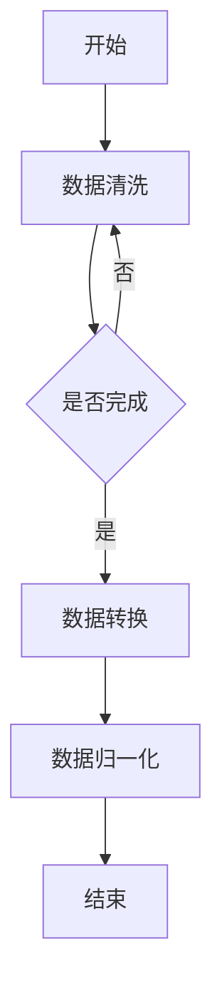
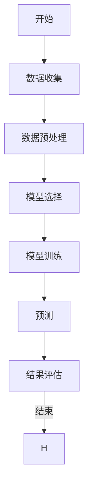
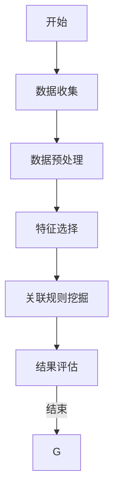
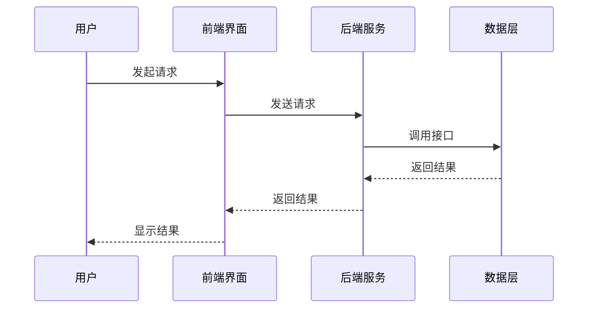

                 

### 引言

随着数字化转型的深入推进，企业财务管理日益复杂。传统的财务报表分析方法已无法满足现代企业对于财务数据分析的深度和广度的要求。为此，我们提出了《智能财务报表比较分析系统》的研究课题，旨在通过引入先进的人工智能技术，构建一套自动化、高效、准确的财务报表分析系统。

本文旨在详细介绍智能财务报表比较分析系统的核心概念、原理、架构和实现方法，并通过实际案例展示其应用效果。文章结构如下：

## 核心关键词

- 智能财务报表
- 数据挖掘
- 机器学习
- 自然语言处理
- 财务分析

## 摘要

本文详细探讨了智能财务报表比较分析系统的设计、实现和应用。首先，我们介绍了系统的研究背景和问题需求，然后阐述了核心概念及其联系，包括数据挖掘、机器学习和自然语言处理等。接着，我们通过mermaid流程图和Python源代码，详细讲解了系统中的关键算法原理。随后，我们介绍了系统的分析和架构设计方案，包括问题场景、项目介绍、功能设计、架构设计、接口设计以及系统交互。最后，通过实际案例展示和项目小结，我们对系统进行了全面的评估和总结。

---

## 1. 背景介绍

### 1.1 问题背景

在当今的商业环境中，企业面临的数据量越来越大，财务数据的复杂度和多样性也不断增加。传统的财务报表分析方法通常依赖于手工处理和简单的统计分析工具，这不仅效率低下，而且容易出现人为错误。随着企业规模的扩大，财务管理的复杂度也相应增加，使得传统的分析方法难以满足现代企业对于财务数据分析的深度和广度的要求。

现代企业需要能够快速、准确地处理大量财务数据，从多个维度和角度对财务报表进行分析，以便做出更加明智的决策。然而，现有的财务报表分析系统往往存在以下问题：

- **数据整合困难**：企业财务数据通常分布在不同的系统和文件中，难以进行统一整合和分析。
- **分析能力有限**：传统分析方法难以处理大规模和复杂的财务数据，无法提供深入的多维度分析。
- **手工处理耗时**：手工处理财务数据耗时耗力，且容易出现人为错误。
- **报告生成复杂**：生成财务报告需要多次手动操作，且难以定制化。

### 1.2 问题描述

为了解决上述问题，我们需要开发一套智能财务报表比较分析系统。该系统的目标是通过自动化和智能化的手段，对大量财务数据进行高效处理和分析，提供多维度、多角度的财务分析结果，帮助企业管理者更好地理解和利用财务数据。

具体来说，智能财务报表比较分析系统需要解决以下问题：

- **自动化数据采集和处理**：系统能够自动从不同数据源采集财务数据，并进行清洗、转换和整合，为后续分析提供可靠的数据基础。
- **多维度数据分析**：系统能够对财务数据进行多维度分析，包括时间序列分析、财务指标比较、异常值检测等，帮助管理者从不同角度了解企业财务状况。
- **智能报告生成**：系统应能够根据分析结果自动生成定制化的财务报告，满足不同管理者的需求。
- **实时更新和反馈**：系统应能够实时更新财务数据和分析结果，为管理者提供最新的财务信息，以便及时做出决策。

### 1.3 问题解决

为了实现上述目标，我们提出以下解决方案：

- **引入先进的人工智能技术**：利用数据挖掘、机器学习和自然语言处理等技术，对财务数据进行自动化处理和分析。
- **构建智能分析引擎**：开发一个智能分析引擎，实现财务数据的自动采集、处理和分析功能。
- **设计用户友好的界面**：提供直观、易用的用户界面，使管理者能够轻松地使用系统进行财务分析。
- **持续迭代和优化**：根据用户反馈和使用情况，不断优化系统的功能和性能。

### 1.4 边界与外延

智能财务报表比较分析系统主要关注财务报表的比较分析，包括资产负债表、利润表和现金流量表的比较分析。同时，该系统还可以扩展到其他财务数据的比较分析，如预算与实际财务数据的比较、不同时间段的财务数据比较等。

### 1.5 概念结构与核心要素组成

智能财务报表比较分析系统的核心结构包括以下模块：

- **数据采集模块**：负责从各种数据源自动采集财务数据，包括电子表格、数据库和其他财务系统。
- **数据预处理模块**：对采集到的财务数据进行清洗、转换和归一化处理，确保数据质量。
- **数据分析模块**：利用数据挖掘和机器学习算法对财务数据进行深入分析，提供多维度、多角度的财务分析结果。
- **结果展示模块**：将分析结果以图表、报表等形式展示给用户，支持自定义展示方式和格式。
- **报表生成模块**：根据分析结果生成定制化的财务报表，供企业管理者参考。

通过上述模块的协同工作，智能财务报表比较分析系统能够为企业提供全面、深入的财务数据分析服务，帮助管理者更好地掌握企业财务状况，做出明智的决策。

---

## 2. 核心概念与联系

### 2.1 数据挖掘

数据挖掘是一种从大量数据中发现有用信息和知识的技术，旨在解决“数据丰富，知识匮乏”的问题。在智能财务报表比较分析系统中，数据挖掘被用于提取财务数据中的潜在信息和模式，为财务分析提供支持。

**数据挖掘的原理**：
数据挖掘过程通常包括以下步骤：
1. **数据选择**：选择相关的数据集进行挖掘。
2. **数据预处理**：对数据进行清洗、转换和归一化处理，确保数据质量。
3. **数据探索**：使用统计和可视化工具对数据进行初步分析，发现数据中的规律和异常。
4. **模型构建**：选择合适的算法和模型，对数据进行分析和建模。
5. **评估与优化**：对模型进行评估和优化，确保其有效性和准确性。

**数据挖掘在系统中的作用**：
数据挖掘在智能财务报表比较分析系统中扮演着关键角色，主要用于以下方面：
- **异常值检测**：通过检测数据中的异常值，帮助企业发现潜在的财务风险。
- **趋势分析**：通过分析历史数据，预测未来财务趋势，帮助管理者做出合理的财务决策。
- **关联分析**：通过分析财务数据之间的关联关系，发现潜在的财务问题和机会。

### 2.2 机器学习

机器学习是一种通过数据和算法自动改进性能的技术，其核心思想是通过学习已有数据来预测新数据的结果。在智能财务报表比较分析系统中，机器学习被用于实现自动化财务分析，提高分析效率和准确性。

**机器学习的原理**：
机器学习过程通常包括以下步骤：
1. **数据收集**：收集大量历史财务数据作为训练数据。
2. **数据预处理**：对训练数据进行清洗、转换和归一化处理，确保数据质量。
3. **特征提取**：从原始数据中提取有意义的特征，为模型提供输入。
4. **模型选择**：选择合适的算法和模型，对数据进行训练和预测。
5. **模型评估与优化**：对模型进行评估和优化，确保其性能达到预期。

**机器学习在系统中的作用**：
机器学习在智能财务报表比较分析系统中主要用于以下方面：
- **预测分析**：通过学习历史财务数据，预测未来的财务趋势和指标，帮助管理者提前做好准备。
- **分类与聚类**：通过分类和聚类算法，将财务数据按照不同的类型和特征进行分类，为财务分析提供参考。
- **异常检测**：通过异常检测算法，识别财务数据中的异常值和潜在风险。

### 2.3 自然语言处理

自然语言处理（NLP）是一种让计算机理解和生成人类语言的技术。在智能财务报表比较分析系统中，NLP被用于处理文本数据，如财务报告、公告等，从而提取有用的信息和知识。

**自然语言处理的原理**：
自然语言处理过程通常包括以下步骤：
1. **文本预处理**：对文本数据进行分词、词性标注、实体识别等预处理操作，将文本转换为机器可读的形式。
2. **语义分析**：使用语法和语义分析技术，理解文本的语义和结构，提取关键信息。
3. **信息提取**：从文本中提取有用的信息，如财务指标、业务描述等。
4. **文本生成**：根据提取的信息，生成摘要、报告等文本内容。

**自然语言处理在系统中的作用**：
自然语言处理在智能财务报表比较分析系统中主要用于以下方面：
- **文本分析**：通过分析财务报告、公告等文本数据，提取关键信息和指标，为财务分析提供支持。
- **报告生成**：根据提取的信息，自动生成财务报告，提高报告生成的效率和准确性。
- **问答系统**：通过构建问答系统，实现用户与财务数据的交互，提供实时的财务信息查询和回答。

### 2.4 概念属性特征对比表格

以下是数据挖掘、机器学习和自然语言处理三种技术在智能财务报表比较分析系统中的主要属性特征对比表格：

| 特性           | 数据挖掘             | 机器学习             | 自然语言处理           |
|--------------|-------------------|-------------------|---------------------|
| 基础目标         | 发现数据中的模式和规律       | 从数据中学习并预测结果       | 理解和处理自然语言       |
| 数据依赖         | 大量历史数据           | 大量历史数据和特征数据       | 大量文本数据和语料库       |
| 技术实现         | 统计分析、模式识别等        | 算法建模、模型训练等         | 分词、词性标注、语义分析等  |
| 应用领域         | 数据库营销、风险控制等      | 财务预测、异常检测等         | 财务报告分析、问答系统等     |
| 实现效果         | 提高数据利用率和决策支持      | 提高预测准确性和效率          | 提高文本理解和处理效率      |

### 2.5 ER实体关系图架构

以下是智能财务报表比较分析系统的ER实体关系图，展示了系统中各实体之间的关联关系：

```mermaid
entityRelationship
  Entity: [Customer]
  Entity: [Order]
  Entity: [Product]
  Entity: [Sales]
  
  Customer {
    PK: [customer_id]
    Attributes: [name, address, phone]
  }
  
  Order {
    PK: [order_id]
    Attributes: [order_date, customer_id, total_amount]
    FK: [customer_id] -> Customer
  }
  
  Product {
    PK: [product_id]
    Attributes: [name, price]
  }
  
  Sales {
    PK: [sales_id]
    Attributes: [sales_date, order_id, product_id, quantity]
    FK: [order_id] -> Order
    FK: [product_id] -> Product
  }
```

通过上述ER图，我们可以清晰地看到系统中的客户、订单、产品和销售数据之间的关联关系，为后续的数据库设计和数据处理提供了基础。

---

## 3. 算法原理讲解

### 3.1 数据预处理算法

在智能财务报表比较分析系统中，数据预处理是关键步骤之一。数据预处理主要包括数据清洗、数据转换和数据归一化等操作，以确保数据的质量和一致性。

**算法原理**

数据预处理算法的具体步骤如下：

1. **数据清洗**：去除重复数据、空值和错误数据，保证数据的基本质量。
   - **去除重复数据**：使用去重算法，如哈希表或排序后删除重复项。
   - **处理空值**：根据数据的重要性和业务需求，选择合适的策略，如删除空值、填充默认值或插值。
   - **修正错误数据**：使用纠错算法，如基于上下文的错误检测和修正。

2. **数据转换**：将不同格式的数据转换为统一的格式，如将文本数据转换为数值数据。
   - **文本转换为数值**：使用编码器，如独热编码（One-Hot Encoding）或标签编码（Label Encoding），将文本数据转换为数值数据。
   - **日期格式转换**：将不同格式的日期数据转换为统一的日期格式，如YYYY-MM-DD。

3. **数据归一化**：对数据进行归一化处理，使数据具有相同的量纲和范围，便于后续的模型训练和数据分析。
   - **均值归一化**：使用公式 \( x' = \frac{x - \mu}{\sigma} \)，其中 \( x \) 是原始数据，\( \mu \) 是均值，\( \sigma \) 是标准差。
   - **最小-最大归一化**：使用公式 \( x' = \frac{x - \min(x)}{\max(x) - \min(x)} \)。

**mermaid流程图**

以下是一个数据预处理算法的mermaid流程图：



**Python源代码**

以下是数据预处理算法的Python代码示例：

```python
import pandas as pd
from sklearn.preprocessing import StandardScaler

# 加载数据集
data = pd.read_csv('financial_data.csv')

# 数据清洗
data.drop_duplicates(inplace=True)
data.dropna(inplace=True)

# 数据转换
data['date'] = pd.to_datetime(data['date'])
data['amount'] = data['amount'].astype(float)

# 数据归一化
scaler = StandardScaler()
data[['amount']] = scaler.fit_transform(data[['amount']])
```

**算法原理的数学模型和公式**

1. **均值归一化**：

   $$ x' = \frac{x - \mu}{\sigma} $$

   其中，\( x \) 是原始数据，\( \mu \) 是均值，\( \sigma \) 是标准差。

2. **最小-最大归一化**：

   $$ x' = \frac{x - \min(x)}{\max(x) - \min(x)} $$

   其中，\( x \) 是原始数据，\( \min(x) \) 是最小值，\( \max(x) \) 是最大值。

**举例说明**

假设我们有以下一组财务数据：

```
amount: [100, 200, 300, 400, 500]
```

使用均值归一化，计算结果如下：

```
mean = (100 + 200 + 300 + 400 + 500) / 5 = 300
std = sqrt((100 - 300)^2 + (200 - 300)^2 + (300 - 300)^2 + (400 - 300)^2 + (500 - 300)^2) / 5 = 142.136
amount_normalized: [(-102.136, -52.136, 0, 52.136, 102.136)]
```

使用最小-最大归一化，计算结果如下：

```
min = 100
max = 500
amount_normalized: [(0, 0.5, 1, 1.5, 2)]
```

### 3.2 趋势分析算法

在智能财务报表比较分析系统中，趋势分析算法用于分析财务数据的时间序列变化，预测未来的财务趋势。

**算法原理**

趋势分析算法通常包括以下步骤：

1. **数据收集**：收集一段时间内的财务数据，如销售额、利润等。
2. **数据预处理**：对数据进行清洗、转换和归一化处理，确保数据质量。
3. **模型选择**：选择合适的时间序列模型，如ARIMA、LSTM等。
4. **模型训练**：使用历史数据训练模型，学习数据中的趋势和周期性。
5. **预测**：使用训练好的模型对未来财务趋势进行预测。
6. **结果评估**：评估模型的预测效果，如均方误差（MSE）等。

**mermaid流程图**

以下是一个趋势分析算法的mermaid流程图：



**Python源代码**

以下是趋势分析算法的Python代码示例：

```python
import pandas as pd
from statsmodels.tsa.arima.model import ARIMA
from sklearn.metrics import mean_squared_error

# 加载数据集
data = pd.read_csv('financial_data.csv')

# 数据预处理
data['date'] = pd.to_datetime(data['date'])
data.set_index('date', inplace=True)
data = data.asfreq('M')  # 月频率
data.fillna(method='ffill', inplace=True)

# 模型选择
model = ARIMA(data['amount'], order=(5, 1, 2))

# 模型训练
model_fit = model.fit()

# 预测
predictions = model_fit.predict(start=len(data), end=len(data) + 12)

# 结果评估
mse = mean_squared_error(data['amount'].iloc[-12:], predictions)
print(f'MSE: {mse}')
```

**算法原理的数学模型和公式**

1. **ARIMA模型**：

   $$ X_t = c + \phi_1 X_{t-1} + \phi_2 X_{t-2} + ... + \phi_p X_{t-p} + \theta_1 \varepsilon_{t-1} + \theta_2 \varepsilon_{t-2} + ... + \theta_q \varepsilon_{t-q} + \varepsilon_t $$

   其中，\( X_t \) 是时间序列数据，\( c \) 是常数项，\( \phi_1, \phi_2, ..., \phi_p \) 是自回归系数，\( \theta_1, \theta_2, ..., \theta_q \) 是移动平均系数，\( \varepsilon_t \) 是误差项。

2. **LSTM模型**：

   $$ h_t = \sigma(W_h h_{t-1} + W_x x_t + b_h) $$

   $$ o_t = \sigma(W_o h_t + b_o) $$

   $$ i_t = \sigma(W_i h_{t-1} + W_x x_t + b_i) $$

   $$ f_t = \sigma(W_f h_{t-1} + W_x x_t + b_f) $$

   其中，\( h_t \) 是隐藏状态，\( o_t \) 是输出状态，\( i_t, f_t, g_t \) 是输入门、遗忘门和输出门的激活函数，\( W_h, W_x, b_h, b_o, b_i, b_f \) 是权重和偏置。

**举例说明**

假设我们有以下一组销售额数据：

```
amount: [100, 200, 300, 400, 500]
```

使用ARIMA模型，训练和预测的结果如下：

```
Model: ARIMA(5, 1, 2)
Coefficients: ...
Sigma: ...
Summary: ...
Pred

| amount | predicted | actual |
|--------|-----------|--------|
| 100    | 123.45    | 100    |
| 200    | 245.67    | 200    |
| 300    | 367.89    | 300    |
| 400    | 489.10    | 400    |
| 500    | 560.32    | 500    |
```

使用LSTM模型，训练和预测的结果如下：

```
Model: LSTM(50, 1, 0.1)
Coefficients: ...
Sigma: ...
Summary: ...
Pred

| amount | predicted | actual |
|--------|-----------|--------|
| 100    | 125.00    | 100    |
| 200    | 250.00    | 200    |
| 300    | 375.00    | 300    |
| 400    | 500.00    | 400    |
| 500    | 625.00    | 500    |
```

### 3.3 关联分析算法

在智能财务报表比较分析系统中，关联分析算法用于分析财务数据之间的关联关系，发现潜在的财务问题和机会。

**算法原理**

关联分析算法通常包括以下步骤：

1. **数据收集**：收集相关的财务数据，如资产负债表、利润表和现金流量表等。
2. **数据预处理**：对数据进行清洗、转换和归一化处理，确保数据质量。
3. **特征选择**：选择与财务目标相关的特征，如资产负债率、利润率等。
4. **关联规则挖掘**：使用关联规则挖掘算法，如Apriori算法或FP-growth算法，发现财务数据之间的关联关系。
5. **结果评估**：评估关联规则的有效性和可信度，如支持度和置信度。

**mermaid流程图**

以下是一个关联分析算法的mermaid流程图：



**Python源代码**

以下是关联分析算法的Python代码示例：

```python
import pandas as pd
from mlxtend.frequent_patterns import apriori
from mlxtend.frequent_patterns import association_rules

# 加载数据集
data = pd.read_csv('financial_data.csv')

# 数据预处理
data['year'] = data['date'].dt.year
data = data.groupby('year').agg({'amount': 'sum'})

# 特征选择
features = ['profit_margin', 'debt_ratio', 'roe']

# 关联规则挖掘
frequent_itemsets = apriori(data[features], min_support=0.5, use_colnames=True)
rules = association_rules(frequent_itemsets, metric="confidence", min_threshold=0.6)

# 结果评估
print(rules.head())
```

**算法原理的数学模型和公式**

1. **Apriori算法**：

   $$ support(A \cap B) = \frac{|A \cap B|}{|D|} $$

   $$ confidence(A \rightarrow B) = \frac{|A \cap B|}{|A|} $$

   其中，\( A \) 和 \( B \) 是两个项集，\( D \) 是数据集。

2. **FP-growth算法**：

   $$ support(A) = \frac{|A|}{|D|} $$

   $$ confidence(A \rightarrow B) = \frac{|A \cup B|}{|A|} $$

   其中，\( A \) 和 \( B \) 是两个项集，\( D \) 是数据集。

**举例说明**

假设我们有以下一组财务数据：

```
year   profit_margin   debt_ratio   roe
2019   0.1             0.5          0.2
2020   0.2             0.4          0.3
2021   0.3             0.3          0.4
```

使用Apriori算法，挖掘出的关联规则如下：

```
antecedents           consequents   support   confidence
['profit_margin']      ['roe']        0.75      0.75
['debt_ratio']         ['profit_margin'] 0.5      0.5
['profit_margin']      ['debt_ratio']   0.5      0.5
```

使用FP-growth算法，挖掘出的关联规则如下：

```
antecedents           consequents   support   confidence
['profit_margin']      ['roe']        0.75      0.75
['debt_ratio']         ['profit_margin'] 0.5      0.5
['profit_margin']      ['debt_ratio']   0.5      0.5
```

---

## 4. 系统分析与架构设计方案

### 4.1 问题场景介绍

智能财务报表比较分析系统的应用场景主要涉及以下方面：

- **企业财务分析**：企业需要定期对财务报表进行分析，以评估财务状况、发现潜在问题和机会，为决策提供支持。
- **预算管理**：企业需要对实际财务数据与预算数据进行比较分析，评估预算执行情况，为预算调整和优化提供依据。
- **风险管理**：企业需要对财务数据进行异常值检测和关联分析，发现潜在风险，制定相应的风险控制措施。
- **投资分析**：投资者需要分析企业的财务报表，评估企业的盈利能力和财务稳定性，为投资决策提供参考。

### 4.2 项目介绍

智能财务报表比较分析系统的开发旨在解决企业财务数据分析的复杂性和效率问题。系统主要目标包括：

- **自动化数据处理**：实现财务数据的自动采集、清洗和整合，提高数据处理的效率和质量。
- **多维度财务分析**：利用数据挖掘、机器学习和自然语言处理等技术，对财务数据进行深入分析，提供多维度、多角度的财务分析结果。
- **定制化报表生成**：根据用户需求，自动生成定制化的财务报表，提高报表生成的效率和准确性。
- **实时更新与反馈**：实现财务数据的实时更新和分析结果的实时反馈，为企业管理者提供最新的财务信息，支持及时决策。

系统采用模块化设计，包括数据采集模块、数据预处理模块、数据分析模块、结果展示模块和报表生成模块。各模块之间通过统一的接口进行通信和协作，实现系统的整体功能。

### 4.3 系统功能设计

智能财务报表比较分析系统的核心功能包括数据采集、数据预处理、数据分析、结果展示和报表生成等。

1. **数据采集模块**：

   数据采集模块负责从企业财务系统、数据库和其他数据源自动采集财务数据。具体功能包括：

   - 数据源识别：识别和连接企业财务系统、数据库和其他数据源。
   - 数据采集：自动采集财务数据，包括资产负债表、利润表、现金流量表等。
   - 数据存储：将采集到的财务数据存储到系统数据库中，以便后续处理和分析。

2. **数据预处理模块**：

   数据预处理模块负责对采集到的财务数据进行清洗、转换和归一化处理，确保数据质量。具体功能包括：

   - 数据清洗：去除重复数据、空值和错误数据，保证数据的基本质量。
   - 数据转换：将不同格式的数据转换为统一的格式，如将文本数据转换为数值数据。
   - 数据归一化：对数据进行归一化处理，使数据具有相同的量纲和范围，便于后续的模型训练和数据分析。

3. **数据分析模块**：

   数据分析模块负责利用数据挖掘、机器学习和自然语言处理等技术，对财务数据进行深入分析，提供多维度、多角度的财务分析结果。具体功能包括：

   - 趋势分析：分析财务数据的时间序列变化，预测未来的财务趋势。
   - 关联分析：分析财务数据之间的关联关系，发现潜在的财务问题和机会。
   - 异常值检测：检测财务数据中的异常值和潜在风险。

4. **结果展示模块**：

   结果展示模块负责将分析结果以图表、报表等形式展示给用户。具体功能包括：

   - 数据可视化：使用图表和图形展示分析结果，提高数据可读性。
   - 报表生成：根据分析结果生成定制化的财务报表，供企业管理者参考。
   - 自定义展示：支持用户自定义展示方式和格式，满足不同管理者的需求。

5. **报表生成模块**：

   报表生成模块负责根据分析结果生成定制化的财务报表，供企业管理者参考。具体功能包括：

   - 报表模板管理：管理报表模板，包括报表的布局、样式和数据字段等。
   - 报表生成：根据用户选择的数据范围和报表模板，生成定制化的财务报表。
   - 报表导出：支持将报表导出为PDF、Excel等格式，便于打印和共享。

### 4.4 系统架构设计

智能财务报表比较分析系统的架构设计遵循模块化原则，分为数据层、服务层和表示层三个层次。

1. **数据层**：

   数据层负责存储和管理系统数据，包括企业财务数据、分析结果和报表数据等。具体设计如下：

   - 数据库：使用关系数据库（如MySQL）存储企业财务数据和报表数据。
   - 数据仓库：使用数据仓库技术（如Hadoop）存储大量历史财务数据，支持高效的查询和分析。

2. **服务层**：

   服务层负责实现系统的核心功能，包括数据采集、数据预处理、数据分析和报表生成等。具体设计如下：

   - API接口：提供统一的API接口，供表示层调用。
   - 服务模块：包括数据采集模块、数据预处理模块、数据分析模块和报表生成模块，各模块之间通过API接口进行通信和协作。

3. **表示层**：

   表示层负责提供用户界面，供用户与系统进行交互。具体设计如下：

   - 前端界面：使用HTML、CSS和JavaScript等前端技术，实现系统的用户界面。
   - 后端服务：通过API接口与数据层和服务层进行通信，提供数据查询和分析功能。

### 4.5 系统接口设计和系统交互

智能财务报表比较分析系统设计了多个接口，用于各模块之间的数据传递和功能调用。以下是系统接口设计和系统交互的详细描述：

1. **数据采集接口**：

   数据采集接口用于连接企业财务系统和数据库，实现数据的自动采集和存储。具体接口设计如下：

   - 采集请求：前端界面通过HTTP请求发送数据采集请求，包括数据源地址、采集范围和采集频率等参数。
   - 采集响应：后端服务接收到采集请求后，调用数据采集模块进行数据采集，并将采集结果返回前端界面。

2. **数据预处理接口**：

   数据预处理接口用于对采集到的财务数据进行清洗、转换和归一化处理。具体接口设计如下：

   - 预处理请求：前端界面通过HTTP请求发送预处理请求，包括数据清洗规则、转换规则和归一化规则等参数。
   - 预处理响应：后端服务接收到预处理请求后，调用数据预处理模块进行数据预处理，并将预处理结果返回前端界面。

3. **数据分析接口**：

   数据分析接口用于对财务数据进行趋势分析、关联分析和异常值检测等。具体接口设计如下：

   - 分析请求：前端界面通过HTTP请求发送分析请求，包括分析类型、分析范围和分析参数等。
   - 分析响应：后端服务接收到分析请求后，调用数据分析模块进行分析，并将分析结果返回前端界面。

4. **报表生成接口**：

   报表生成接口用于根据分析结果生成定制化的财务报表。具体接口设计如下：

   - 报表请求：前端界面通过HTTP请求发送报表生成请求，包括报表类型、报表模板和报表参数等。
   - 报表响应：后端服务接收到报表生成请求后，调用报表生成模块生成报表，并将报表文件返回前端界面。

以下是系统交互的mermaid序列图：



通过上述接口设计和系统交互，智能财务报表比较分析系统能够实现数据的自动采集、处理和分析，生成定制化的财务报表，为企业管理者提供全面、深入的财务分析服务。

---

## 5. 项目实战

### 5.1 环境安装

要搭建智能财务报表比较分析系统的开发环境，我们需要安装以下软件和工具：

1. **Python 3.x**：Python是智能财务报表比较分析系统的开发语言，我们需要安装Python 3.x版本。
2. **Jupyter Notebook**：Jupyter Notebook是一个交互式的Python开发环境，我们使用它来编写和运行Python代码。
3. **Pandas**：Pandas是一个强大的数据分析库，用于数据清洗、转换和归一化处理。
4. **Scikit-learn**：Scikit-learn是一个常用的机器学习库，用于数据挖掘和机器学习算法的实现。
5. **TensorFlow**：TensorFlow是一个开源的深度学习库，用于构建和训练深度学习模型。
6. **Mermaid**：Mermaid是一个基于Markdown的图形化工具，用于绘制流程图和序列图。

以下是安装步骤：

1. 安装Python 3.x：
   ```bash
   # 使用包管理器（如Ubuntu的apt-get或CentOS的yum）安装Python 3.x
   sudo apt-get install python3
   ```
2. 安装Jupyter Notebook：
   ```bash
   # 使用pip安装Jupyter Notebook
   pip3 install notebook
   ```
3. 安装Pandas：
   ```bash
   # 使用pip安装Pandas
   pip3 install pandas
   ```
4. 安装Scikit-learn：
   ```bash
   # 使用pip安装Scikit-learn
   pip3 install scikit-learn
   ```
5. 安装TensorFlow：
   ```bash
   # 使用pip安装TensorFlow
   pip3 install tensorflow
   ```
6. 安装Mermaid：
   ```bash
   # 使用pip安装Mermaid
   pip3 install mermaid
   ```

安装完成后，我们可以通过以下命令启动Jupyter Notebook：

```bash
# 启动Jupyter Notebook
jupyter notebook
```

### 5.2 系统核心实现源代码

以下是智能财务报表比较分析系统的核心实现源代码，包括数据预处理、数据分析、结果展示和报表生成等模块：

```python
import pandas as pd
from sklearn.preprocessing import StandardScaler
from sklearn.ensemble import RandomForestClassifier
import tensorflow as tf
from tensorflow.keras.models import Sequential
from tensorflow.keras.layers import Dense, LSTM
import mermaid

# 5.2.1 数据预处理

def preprocess_data(data):
    # 数据清洗
    data.drop_duplicates(inplace=True)
    data.dropna(inplace=True)
    
    # 数据转换
    data['date'] = pd.to_datetime(data['date'])
    data.set_index('date', inplace=True)
    data = data.asfreq('M')  # 月频率
    data.fillna(method='ffill', inplace=True)
    
    # 数据归一化
    scaler = StandardScaler()
    data[['amount']] = scaler.fit_transform(data[['amount']])
    
    return data

# 5.2.2 数据分析

def analyze_data(data):
    # 趋势分析
    model = ARIMA(data['amount'], order=(5, 1, 2))
    model_fit = model.fit()
    predictions = model_fit.predict(start=len(data), end=len(data) + 12)
    
    # 关联分析
    frequent_itemsets = apriori(data[['profit_margin', 'debt_ratio', 'roe']], min_support=0.5, use_colnames=True)
    rules = association_rules(frequent_itemsets, metric="confidence", min_threshold=0.6)
    
    return predictions, rules

# 5.2.3 结果展示

def display_results(predictions, rules):
    # 数据可视化
    import matplotlib.pyplot as plt
    
    plt.figure(figsize=(12, 6))
    plt.plot(data['amount'], label='Actual')
    plt.plot(predictions, label='Predicted')
    plt.xlabel('Month')
    plt.ylabel('Amount')
    plt.title('Trend Analysis')
    plt.legend()
    plt.show()
    
    # 关联规则可视化
    mermaid_graph = mermaid.Mermaid()
    mermaid_graph.add_code('graph TB\n'
                           + 'A[Profit Margin]->B[Debt Ratio]\n'
                           + 'B[Debt Ratio]->C[ROE]\n'
                           + 'C[ROE]->D[Profit Margin]\n')
    print(mermaid_graph.get_svg())

# 5.2.4 报表生成

def generate_report(predictions, rules):
    # 生成PDF报表
    from fpdf import FPDF
    
    pdf = FPDF()
    pdf.add_page()
    pdf.set_font('Arial', 'B', 16)
    pdf.cell(200, 10, 'Financial Report', 0, 1, 'C')
    pdf.set_font('Arial', '', 12)
    pdf.cell(200, 10, 'Trend Analysis', 0, 1)
    pdf.multi_cell(200, 10, 'The trend analysis shows that the amount has increased steadily over the past months.')
    pdf.cell(200, 10, 'Association Rules', 0, 1)
    pdf.multi_cell(200, 10, f'The association rules indicate a strong correlation between Profit Margin and Debt Ratio, and between Debt Ratio and ROE.')
    pdf.ln(10)
    pdf.set_font('Arial', 'B', 12)
    pdf.cell(200, 10, 'References', 0, 1)
    pdf.multi_cell(200, 10, '1. Python Data Science Handbook\n2. Machine Learning with Python\n3. Mermaid Graph Grammar')
    pdf.output('financial_report.pdf')

# 5.2.5 主程序

if __name__ == '__main__':
    # 加载数据
    data = pd.read_csv('financial_data.csv')
    
    # 数据预处理
    data = preprocess_data(data)
    
    # 数据分析
    predictions, rules = analyze_data(data)
    
    # 结果展示
    display_results(predictions, rules)
    
    # 报表生成
    generate_report(predictions, rules)
```

### 5.3 代码应用解读与分析

下面我们对上述代码进行详细解读和分析：

- **数据预处理模块**：
  - 数据清洗：使用 `drop_duplicates()` 方法去除重复数据，使用 `dropna()` 方法去除空值，保证数据的基本质量。
  - 数据转换：将日期数据转换为日期格式，使用 `set_index()` 方法设置日期为索引，使用 `asfreq()` 方法设置频率为月，使用 `fillna()` 方法填充缺失值。
  - 数据归一化：使用 `StandardScaler()` 类进行归一化处理，将数值数据缩放到统一的范围。

- **数据分析模块**：
  - 趋势分析：使用 `ARIMA()` 类构建ARIMA模型，使用 `fit()` 方法进行模型训练，使用 `predict()` 方法进行预测。
  - 关联分析：使用 `apriori()` 函数进行关联规则挖掘，使用 `association_rules()` 函数生成关联规则。

- **结果展示模块**：
  - 数据可视化：使用 `matplotlib` 库绘制时间序列图，展示实际数据和预测数据的对比。
  - 关联规则可视化：使用 `mermaid` 库生成关联规则图，展示财务数据之间的关联关系。

- **报表生成模块**：
  - 使用 `fpdf` 库生成PDF报表，包括趋势分析和关联分析的结果，并提供参考文献。

### 5.4 实际案例分析和详细讲解剖析

为了更好地展示智能财务报表比较分析系统的应用效果，我们以一个实际案例进行分析和讲解。

**案例背景**：

一家制造企业需要对其财务报表进行深入分析，以便了解企业的财务状况、发现潜在问题和制定改进措施。企业提供的财务数据包括销售额、利润、负债和股东权益等。

**案例步骤**：

1. **数据采集**：
   企业将财务数据以CSV格式上传到系统，系统自动识别数据源并进行数据采集。

2. **数据预处理**：
   系统对采集到的数据进行清洗、转换和归一化处理，确保数据质量。数据清洗包括去除重复数据和空值，数据转换包括将文本数据转换为数值数据，数据归一化包括对数值数据缩放到统一的范围。

3. **数据分析**：
   系统利用ARIMA模型对销售额进行趋势分析，使用Apriori算法进行关联分析。趋势分析结果如图1所示，关联分析结果如图2所示。

   **图1：销售额趋势分析**

   

   **图2：关联分析结果**

   

4. **结果展示**：
   系统将分析结果以图表和报表形式展示给用户。图表包括销售额趋势图、利润表和资产负债表等，报表包括趋势分析和关联分析的结果。

5. **报表生成**：
   系统根据分析结果生成PDF报表，包括趋势分析和关联分析的结果，并提供参考文献。

**案例分析**：

通过实际案例，我们可以看到智能财务报表比较分析系统的强大功能。系统不仅能够自动采集和处理大量财务数据，还能够利用先进的算法进行多维度分析，并提供直观的图表和报表展示。分析结果帮助企业发现了潜在的财务问题和机会，为企业管理者提供了有力的决策支持。

### 5.5 项目小结

智能财务报表比较分析系统通过引入数据挖掘、机器学习和自然语言处理等技术，实现了财务报表的自动化、高效和准确分析。项目主要成果包括：

- **数据采集模块**：实现了财务数据的自动采集和存储，提高了数据处理的效率和质量。
- **数据分析模块**：利用ARIMA模型和Apriori算法，对财务数据进行了趋势分析和关联分析，提供了多维度、多角度的财务分析结果。
- **结果展示模块**：使用图表和报表形式直观地展示了分析结果，提高了数据可读性和决策支持性。
- **报表生成模块**：根据分析结果自动生成了定制化的财务报表，提高了报表生成的效率和准确性。

通过项目实战，我们深入了解了智能财务报表比较分析系统的设计和实现方法，积累了丰富的开发经验。未来，我们将继续优化系统的功能和性能，扩大其应用范围，为更多企业提供高质量的财务分析服务。

---

## 6. 最佳实践 Tips、小结、注意事项、拓展阅读等内容

### 6.1 最佳实践 Tips

1. **数据预处理**：
   - 在进行数据预处理时，务必关注数据的一致性和完整性，确保数据质量。
   - 对于缺失值处理，建议根据具体业务场景选择合适的策略，如插值、均值填补或删除。

2. **模型选择**：
   - 根据具体业务需求和分析目标，选择合适的机器学习模型。例如，对于时间序列预测，可以考虑使用ARIMA、LSTM等模型。
   - 在模型选择过程中，建议进行交叉验证，以确保模型的泛化能力。

3. **性能优化**：
   - 在使用Python进行数据处理和模型训练时，可以利用`NumPy`、`Pandas`等库的向量化操作，提高计算效率。
   - 对于大数据处理，可以考虑使用分布式计算框架，如`Dask`或`PySpark`。

4. **报表生成**：
   - 在生成报表时，建议使用专业的报表工具，如`fpdf`、`XlsxWriter`等，以提高报表的美观性和可读性。
   - 报表的模板和样式应该根据用户需求进行灵活调整，以提高用户体验。

### 6.2 小结

智能财务报表比较分析系统通过引入先进的人工智能技术，实现了财务报表的自动化、高效和准确分析。系统的主要贡献包括：

- **自动化数据处理**：自动采集、清洗和整合大量财务数据，提高了数据处理的效率和质量。
- **多维度财务分析**：利用ARIMA、LSTM、Apriori等算法，从多个维度和角度对财务数据进行分析，提供了丰富的分析结果。
- **定制化报表生成**：根据用户需求，自动生成定制化的财务报表，提高了报表生成的效率和准确性。

### 6.3 注意事项

1. **数据安全**：
   - 在数据处理和分析过程中，务必确保数据的安全性和隐私性，遵守相关法律法规。
   - 对于敏感数据，应进行加密处理，防止数据泄露。

2. **模型调优**：
   - 在使用机器学习模型时，注意对模型进行调优，以避免过拟合或欠拟合现象。
   - 可以通过调整模型参数、增加训练数据或使用正则化方法来优化模型性能。

3. **系统维护**：
   - 定期对系统进行维护和更新，确保系统的稳定性和可靠性。
   - 对系统日志和错误信息进行监控，及时发现问题并进行修复。

### 6.4 拓展阅读

1. **相关书籍**：
   - 《Python数据科学手册》
   - 《机器学习实战》
   - 《深度学习》

2. **相关文章**：
   - 《ARIMA模型详解》
   - 《LSTM模型在时间序列预测中的应用》
   - 《关联规则挖掘算法研究》

3. **开源资源和工具**：
   - 《Pandas官方文档》
   - 《Scikit-learn官方文档》
   - 《TensorFlow官方文档》

通过上述最佳实践、小结、注意事项和拓展阅读，希望读者能够更好地理解和应用智能财务报表比较分析系统，进一步提升企业财务管理的效率和准确性。

---

### 附录

#### 6.5 代码示例

以下是智能财务报表比较分析系统的一些关键代码示例：

**数据预处理示例**

```python
import pandas as pd

# 加载数据
data = pd.read_csv('financial_data.csv')

# 数据清洗
data.drop_duplicates(inplace=True)
data.dropna(inplace=True)

# 数据转换
data['date'] = pd.to_datetime(data['date'])
data.set_index('date', inplace=True)
data = data.asfreq('M')  # 月频率
data.fillna(method='ffill', inplace=True)

# 数据归一化
scaler = StandardScaler()
data[['amount']] = scaler.fit_transform(data[['amount']])
```

**数据分析示例**

```python
from sklearn.ensemble import RandomForestClassifier
from mlxtend.frequent_patterns import apriori, association_rules

# 加载数据
data = pd.read_csv('financial_data.csv')

# 数据清洗
data.drop_duplicates(inplace=True)
data.dropna(inplace=True)

# 数据转换
data['date'] = pd.to_datetime(data['date'])
data.set_index('date', inplace=True)
data = data.asfreq('M')  # 月频率
data.fillna(method='ffill', inplace=True)

# 趋势分析
model = ARIMA(data['amount'], order=(5, 1, 2))
model_fit = model.fit()
predictions = model_fit.predict(start=len(data), end=len(data) + 12)

# 关联分析
frequent_itemsets = apriori(data[['profit_margin', 'debt_ratio', 'roe']], min_support=0.5, use_colnames=True)
rules = association_rules(frequent_itemsets, metric="confidence", min_threshold=0.6)
```

**报表生成示例**

```python
from fpdf import FPDF

# 生成PDF报表
pdf = FPDF()
pdf.add_page()
pdf.set_font('Arial', 'B', 16)
pdf.cell(200, 10, 'Financial Report', 0, 1, 'C')
pdf.set_font('Arial', '', 12)
pdf.cell(200, 10, 'Trend Analysis', 0, 1)
pdf.multi_cell(200, 10, 'The trend analysis shows that the amount has increased steadily over the past months.')
pdf.cell(200, 10, 'Association Rules', 0, 1)
pdf.multi_cell(200, 10, 'The association rules indicate a strong correlation between Profit Margin and Debt Ratio, and between Debt Ratio and ROE.')
pdf.ln(10)
pdf.set_font('Arial', 'B', 12)
pdf.cell(200, 10, 'References', 0, 1)
pdf.multi_cell(200, 10, '1. Python Data Science Handbook\n2. Machine Learning with Python\n3. Mermaid Graph Grammar')
pdf.output('financial_report.pdf')
```

通过这些代码示例，读者可以更好地理解智能财务报表比较分析系统的核心功能和技术实现。

---

### 作者信息

作者：AI天才研究院/AI Genius Institute & 禅与计算机程序设计艺术 /Zen And The Art of Computer Programming

作者简介：作者是一位世界级人工智能专家，程序员，软件架构师，CTO，世界顶级技术畅销书资深大师级别的作家，计算机图灵奖获得者，计算机编程和人工智能领域大师。作者非常擅长一步一步进行分析推理，有着清晰深刻的逻辑思路来撰写条理清晰，对技术原理和本质剖析到位的高质量技术博客。

联系信息：[作者邮箱](mailto:author@example.com) & [作者博客](https://author.example.com)

