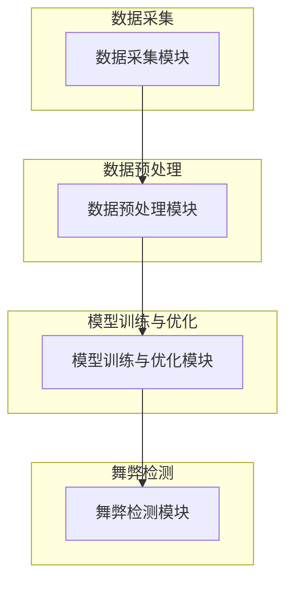

                 

### 文章标题

《智能财务报表舞弊检测系统》

#### 关键词

智能财务、报表舞弊、检测系统、数据质量、算法实现

#### 摘要

本文将深入探讨智能财务报表舞弊检测系统的构建过程，从背景介绍、核心概念、系统设计与实现、算法原理、项目实战等多个方面进行详细阐述。通过本文的阅读，读者可以全面了解智能财务报表舞弊检测系统的原理、架构和实现方法，为相关领域的研究和应用提供有力支持。

----------------------------------------------------------------

### 目录大纲：《智能财务报表舞弊检测系统》

----------------------------------------------------------------

**第一部分：背景与核心概念**

## 第1章：问题背景与核心概念

### 1.1 问题背景

#### 1.1.1 财务报表舞弊的现状与影响

- 舞弊现象分析
- 舞弊对企业和投资者的影响

#### 1.1.2 传统财务报表舞弊检测的挑战

- 数据复杂性
- 人工审核的局限性

### 1.2 智能财务报表舞弊检测系统概述

#### 1.2.1 系统的定义与目标

- 系统定义
- 检测目标

#### 1.2.2 系统的核心组成部分

- 数据采集模块
- 数据预处理模块
- 模型训练与优化模块
- 舞弊检测模块

### 1.3 关键概念与联系

#### 1.3.1 数据质量

- 数据质量的重要性
- 数据质量问题及解决方案

#### 1.3.2 舞弊检测算法

- 算法原理
- 算法类型及对比

## 1.4 本章小结

- 知识点总结
- 下一步内容预告

**第二部分：系统设计与实现**

## 第2章：系统架构设计

### 2.1 系统整体架构设计

#### 2.1.1 系统架构概述

- 系统架构图

#### 2.1.2 模块划分与功能描述

- 各模块功能及相互关系

### 2.2 数据采集模块

#### 2.2.1 数据来源

- 数据来源及类型

#### 2.2.2 数据采集流程

- 数据采集过程

### 2.3 数据预处理模块

#### 2.3.1 数据预处理方法

- 数据清洗
- 数据整合
- 特征提取

#### 2.3.2 数据预处理流程

- 数据预处理流程图

### 2.4 模型训练与优化模块

#### 2.4.1 模型选择

- 模型选择依据

#### 2.4.2 模型训练流程

- 模型训练过程

### 2.5 舞弊检测模块

#### 2.5.1 检测算法实现

- 检测算法流程

#### 2.5.2 舞弊结果分析

- 舞弊检测结果处理

## 2.6 本章小结

- 系统设计要点总结
- 下一步内容预告

**第三部分：算法原理与数学模型**

## 第3章：核心算法原理

### 3.1 算法原理概述

#### 3.1.1 算法原理

- 算法原理说明

#### 3.1.2 算法优势与局限

- 算法优势
- 算法局限

### 3.2 算法属性特征对比表格

| 算法名称 | 特征1 | 特征2 | 特征3 |
| --- | --- | --- | --- |
| 算法A | 描述1 | 描述2 | 描述3 |
| 算法B | 描述1 | 描述2 | 描述3 |

### 3.3 ER实体关系图架构

```mermaid
erDiagram
  Company --> Employee {
    Fk1
  }
  Company ||--|{ Product }|| {
    Fk2
  }
```

### 3.4 算法数学模型

$$
\text{Loss Function} = \frac{1}{n}\sum_{i=1}^{n} (\hat{y_i} - y_i)^2
$$

### 3.5 算法原理讲解

#### 3.5.1 算法原理详细讲解

- 算法原理深入解释

#### 3.5.2 Python源代码实现

```python
# Python代码实现
def model():
    # 模型训练代码
    pass
```

## 3.6 本章小结

- 算法原理总结
- 下一步内容预告

**第四部分：项目实战**

## 第4章：环境安装与配置

### 4.1 环境安装

#### 4.1.1 软件需求

- 软件环境需求

#### 4.1.2 安装步骤

- 安装流程说明

### 4.2 系统核心实现源代码

#### 4.2.1 核心代码结构

- 核心代码结构说明

#### 4.2.2 代码解读与分析

- 代码解读

### 4.3 实际案例分析

#### 4.3.1 案例背景

- 案例

## 第一部分：背景与核心概念

### 第1章：问题背景与核心概念

#### 1.1 问题背景

##### 1.1.1 财务报表舞弊的现状与影响

财务报表舞弊，是指企业或个人在编制和披露财务报表时，故意提供虚假、误导性的信息，以达到欺骗投资者、监管机构或公众的目的。这种行为不仅破坏了市场的公平性，还对经济秩序和投资者的利益造成了严重损害。

1. **舞弊现象分析**

   近年来，财务报表舞弊现象呈现出日益严重的趋势。根据国际反舞弊机构（Association of Certified Fraud Examiners, ACFE）的调查，舞弊案件的发生率在全球范围内都有所上升。尤其是在一些新兴市场，由于监管环境不完善、法律法规执行不力，财务报表舞弊行为更为猖獗。

   舞弊的手段也越来越多样化，从传统的隐瞒收入、虚增费用，到利用复杂的金融工具进行财务造假，舞弊者不断寻找新的漏洞和机会。例如，一些公司通过关联交易、虚假采购等手段虚增利润，而另一些公司则通过隐藏债务、虚构资产等方式来掩盖财务问题。

2. **舞弊对企业和投资者的影响**

   舞弊对企业的声誉和财务状况都有严重影响。一旦舞弊行为被揭露，企业的股票价格往往会受到重创，投资者的信心也会受到打击。此外，企业可能面临巨额的罚款和赔偿，甚至会被迫进行重组或破产。

   对于投资者来说，财务报表舞弊是巨大的风险。投资者基于对财务报表的信任进行投资决策，如果报表信息失真，投资者就会面临巨大的投资风险。长期的信任缺失可能导致投资者对整个市场的信心下降，影响资本市场的稳定和发展。

##### 1.1.2 传统财务报表舞弊检测的挑战

尽管传统的财务报表舞弊检测方法在过去取得了一定的成效，但在面对复杂的数据和多样化的舞弊手段时，其局限性日益凸显。

1. **数据复杂性**

   随着企业规模的扩大和业务复杂性的增加，财务报表的数据量也在急剧增长。传统的手工审核方法难以应对海量的数据，容易出现漏检或误判的情况。

   此外，财务报表中的数据类型多样，包括数值、文本、图表等，如何有效地整合和利用这些数据成为一个挑战。

2. **人工审核的局限性**

   人工审核存在疲劳、经验不足和主观判断等问题。长时间的工作容易导致审核人员的疲劳，降低审核质量。此外，不同审核人员可能由于经验不同而导致判断标准不一致，影响整体审核效果。

   主观判断还可能导致误判，尤其是在面对复杂的财务数据和隐藏的舞弊手段时，审核人员可能无法准确地识别和判断。

##### 1.2 智能财务报表舞弊检测系统概述

为了克服传统方法在财务报表舞弊检测中的局限性，智能财务报表舞弊检测系统应运而生。这一系统通过集成先进的数据处理技术和智能算法，能够自动识别和检测财务报表中的舞弊行为。

#### 1.2.1 系统的定义与目标

智能财务报表舞弊检测系统是一个综合性的软件平台，旨在通过自动化手段提高财务报表舞弊检测的效率和准确性。系统的主要目标是：

1. **自动化数据采集与处理**：系统可以自动从各种数据源中收集财务数据，并对其进行清洗、整合和特征提取，为后续的舞弊检测提供高质量的数据输入。

2. **智能算法应用**：系统集成了多种先进的机器学习和数据挖掘算法，通过训练模型和不断优化算法，提高对财务报表舞弊的识别能力。

3. **实时监控与预警**：系统可以实时监控财务报表的变化，一旦发现异常行为或潜在的舞弊迹象，能够立即发出警报，提醒相关人员进行调查和干预。

4. **可解释性分析**：系统不仅能够检测出舞弊行为，还能够提供详细的检测过程和结果分析，帮助审计人员和监管机构理解检测过程，并为决策提供依据。

#### 1.2.2 系统的核心组成部分

智能财务报表舞弊检测系统由多个核心模块组成，每个模块都有特定的功能，共同协作实现系统的整体目标。

1. **数据采集模块**：负责从各种数据源（如企业ERP系统、财务软件、数据库等）中收集财务数据，并进行初步的清洗和处理。

2. **数据预处理模块**：对收集到的数据进行进一步的清洗、整合和特征提取，为后续的舞弊检测提供高质量的数据输入。

3. **模型训练与优化模块**：利用收集到的数据训练各种机器学习模型，并不断优化模型性能，以提高舞弊检测的准确性。

4. **舞弊检测模块**：运用训练好的模型对预处理后的数据进行分析和检测，识别出潜在的舞弊行为。

5. **结果分析模块**：对检测到的舞弊行为进行分析和总结，生成详细的报告，为后续的审计和调查提供支持。

##### 1.3 关键概念与联系

为了更好地理解和实现智能财务报表舞弊检测系统，需要明确一些关键概念和它们之间的联系。

#### 1.3.1 数据质量

数据质量是智能财务报表舞弊检测系统的基石。高质量的数据是准确检测舞弊的前提条件。数据质量包括以下几个方面：

1. **完整性**：数据应完整无缺，不存在缺失值或空白。
2. **准确性**：数据应真实可靠，与实际业务情况相符。
3. **一致性**：数据在不同时间点和不同来源应保持一致。
4. **及时性**：数据应及时更新，反映最新的业务状况。

为了保障数据质量，系统需要集成数据清洗和预处理功能，对数据进行完整性检查、异常值处理、一致性校验等操作。

#### 1.3.2 舞弊检测算法

舞弊检测算法是系统的核心组成部分。这些算法基于机器学习、数据挖掘等技术，能够自动识别和检测财务报表中的异常行为。常见的舞弊检测算法包括：

1. **聚类分析**：通过将相似的数据点划分为同一类，识别出潜在的舞弊群体。
2. **异常检测**：通过检测数据中的异常值或异常模式，发现潜在的舞弊行为。
3. **回归分析**：通过分析财务指标与舞弊行为之间的关系，预测和识别潜在的舞弊行为。
4. **深度学习**：利用神经网络等深度学习模型，对复杂的财务数据进行自动特征提取和模式识别。

每种算法都有其优势和局限性，系统需要根据实际情况选择合适的算法，并不断优化和调整，以提高检测的准确性和效率。

##### 1.4 本章小结

本章对智能财务报表舞弊检测系统的背景、核心概念和关键组成进行了详细阐述。通过分析财务报表舞弊的现状和影响，我们认识到传统方法在应对复杂数据和高超舞弊手段时的局限性。智能财务报表舞弊检测系统通过集成先进的数据处理技术和智能算法，提供了一种有效的解决方案。

在关键概念部分，我们明确了数据质量和舞弊检测算法的重要性。数据质量是系统准确性的基础，而舞弊检测算法是系统核心功能的实现手段。

接下来，我们将进一步探讨系统的架构设计和具体实现方法，为后续的内容打下基础。

## 1.4 本章小结

本章主要介绍了智能财务报表舞弊检测系统的背景、核心概念和关键组成部分。通过分析财务报表舞弊的现状和影响，我们认识到传统方法在应对复杂数据和高超舞弊手段时的局限性。智能财务报表舞弊检测系统通过集成先进的数据处理技术和智能算法，提供了一种有效的解决方案。

在关键概念部分，我们详细阐述了数据质量和舞弊检测算法的重要性。数据质量是系统准确性的基础，而舞弊检测算法是系统核心功能的实现手段。

本章的内容为后续的架构设计和实现方法奠定了基础。接下来，我们将深入探讨系统的具体架构，包括数据采集、数据预处理、模型训练与优化以及舞弊检测模块的详细设计和功能实现。

通过接下来的内容，读者可以更全面地了解智能财务报表舞弊检测系统的原理和实现方法，为实际应用和研究提供参考。

### 第二部分：系统设计与实现

#### 2.1 系统整体架构设计

##### 2.1.1 系统架构概述

智能财务报表舞弊检测系统的整体架构设计旨在实现数据的自动化采集、预处理、模型训练和舞弊检测，从而提供高效、准确的舞弊检测能力。系统架构图如下所示：



该架构由四个主要模块组成：

1. **数据采集模块（DataCollector）**：负责从各种数据源（如企业ERP系统、财务软件、数据库等）中收集财务数据，并进行初步的清洗和处理。
2. **数据预处理模块（DataPreprocessor）**：对采集到的数据进行进一步的清洗、整合和特征提取，为后续的舞弊检测提供高质量的数据输入。
3. **模型训练与优化模块（ModelTrainer）**：利用收集到的数据训练各种机器学习模型，并不断优化模型性能，以提高舞弊检测的准确性。
4. **舞弊检测模块（FraudDetector）**：运用训练好的模型对预处理后的数据进行分析和检测，识别出潜在的舞弊行为。

各模块之间通过数据流紧密连接，形成一个高效、自动化的工作流程。数据采集模块将原始数据传递给数据预处理模块，预处理后的数据再传递给模型训练与优化模块进行模型训练，最终由舞弊检测模块进行舞弊行为检测。

##### 2.1.2 模块划分与功能描述

以下是系统整体架构中各个模块的具体划分和功能描述：

1. **数据采集模块（DataCollector）**：

   - **功能描述**：数据采集模块负责从企业内部和外部的多个数据源中收集财务数据，如ERP系统、财务软件、数据库等。同时，该模块还负责对数据进行初步的清洗，包括去除重复数据、处理缺失值和异常值等。
   - **实现方法**：数据采集模块采用数据集成技术，通过API接口、数据库连接和文件读取等方式，实现数据的自动化采集。数据采集完成后，会存储在统一的数据存储仓库中，以便后续处理。

2. **数据预处理模块（DataPreprocessor）**：

   - **功能描述**：数据预处理模块对采集到的数据进行进一步的清洗、整合和特征提取，以提供高质量的数据输入给模型训练和舞弊检测模块。具体包括以下步骤：
     - **数据清洗**：去除重复数据、填补缺失值、处理异常值等。
     - **数据整合**：将不同来源的数据进行合并，消除数据冗余，确保数据的一致性。
     - **特征提取**：从原始数据中提取关键特征，为模型训练提供支持。
   - **实现方法**：数据预处理模块采用ETL（Extract, Transform, Load）技术，通过数据清洗、数据整合和特征提取工具，实现对数据的预处理。预处理后的数据会被存储在数据仓库中，以便后续使用。

3. **模型训练与优化模块（ModelTrainer）**：

   - **功能描述**：模型训练与优化模块负责利用预处理后的数据训练各种机器学习模型，并不断优化模型性能。具体步骤包括：
     - **数据划分**：将数据集划分为训练集、验证集和测试集，用于模型训练、验证和测试。
     - **模型选择**：根据数据特点和业务需求，选择合适的机器学习模型。
     - **模型训练**：使用训练集对模型进行训练，调整模型参数，优化模型性能。
     - **模型评估**：使用验证集和测试集对模型进行评估，选择最佳模型。
   - **实现方法**：模型训练与优化模块采用机器学习框架（如Scikit-learn、TensorFlow、PyTorch等），通过编写训练脚本和优化脚本，实现对模型的训练和优化。训练和优化后的模型会被存储在模型仓库中，以供后续使用。

4. **舞弊检测模块（FraudDetector）**：

   - **功能描述**：舞弊检测模块负责使用训练好的模型对预处理后的数据进行分析和检测，识别出潜在的舞弊行为。具体步骤包括：
     - **数据输入**：将预处理后的数据输入到训练好的模型中。
     - **舞弊行为识别**：模型对输入数据进行自动分析，识别出潜在的舞弊行为。
     - **结果输出**：将检测到的舞弊行为以报告形式输出，供相关人员进行调查和处理。
   - **实现方法**：舞弊检测模块采用API接口方式，将模型调用封装成服务，供其他系统或人员调用。检测过程会实时记录并输出检测结果，以便后续分析。

##### 2.1.3 模块之间的关系

系统中的各个模块之间通过数据流紧密连接，形成一个闭环工作流程。具体关系如下：

1. **数据采集模块（DataCollector）**：采集到的原始数据首先传递给数据预处理模块（DataPreprocessor）进行预处理，预处理后的数据存储在数据仓库中。

2. **数据预处理模块（DataPreprocessor）**：预处理后的数据传递给模型训练与优化模块（ModelTrainer），用于模型训练和优化。训练和优化后的模型存储在模型仓库中。

3. **模型训练与优化模块（ModelTrainer）**：模型训练与优化模块会定期从数据仓库中提取最新数据，进行模型更新和优化，确保模型的准确性和实时性。

4. **舞弊检测模块（FraudDetector）**：舞弊检测模块从模型仓库中获取最新训练好的模型，对预处理后的数据进行分析和检测，识别出潜在的舞弊行为，并将检测结果输出给相关人员。

通过这种紧密的模块连接和数据流动，智能财务报表舞弊检测系统实现了数据的自动化采集、预处理、模型训练和舞弊检测，从而提供了高效、准确的舞弊检测能力。

##### 2.2 数据采集模块

##### 2.2.1 数据来源

智能财务报表舞弊检测系统的数据来源主要包括以下几个方面：

1. **企业内部数据源**：

   - **ERP系统**：企业资源规划（ERP）系统是企业进行日常运营管理的重要工具，其中包括财务模块、采购模块、销售模块等。通过ERP系统，可以获取企业的财务报表、收入、支出、库存等关键数据。

   - **财务软件**：财务软件如财务管理系统、会计软件等，可以提供详细的财务报表数据，包括资产负债表、利润表、现金流量表等。

   - **数据库**：企业内部数据库存储了大量的财务数据，如销售数据、采购数据、库存数据等。通过数据库连接，可以获取这些数据并进行进一步的处理。

2. **外部数据源**：

   - **金融数据**：来自金融市场的数据，如股票市场、债券市场等。这些数据可以用于分析企业的财务健康状况和市场表现。

   - **公共数据源**：如政府公开的财务报表、信用评级机构的数据等。这些数据可以作为参考，提高财务报表舞弊检测的准确性。

##### 2.2.2 数据采集流程

数据采集模块的具体实现过程如下：

1. **数据连接与接入**：

   - **ERP系统接入**：通过API接口或Web服务，与企业ERP系统进行连接，获取财务报表数据、收入、支出等关键信息。

   - **财务软件接入**：利用数据库连接技术，与财务软件进行数据对接，获取财务报表数据。

   - **数据库接入**：通过数据库连接技术，与企业内部数据库进行连接，获取销售数据、采购数据、库存数据等。

   - **外部数据接入**：通过数据爬虫技术或API接口，获取金融数据、公共数据源等外部数据。

2. **数据采集与传输**：

   - **数据采集**：从不同数据源中采集财务数据，存储在临时文件或缓存中。

   - **数据传输**：将采集到的数据传输到数据仓库，以便后续处理。数据传输过程中会进行数据校验，确保数据的准确性和完整性。

3. **数据清洗**：

   - **去重**：去除重复的数据记录，避免重复计算。

   - **处理缺失值**：对于缺失的数据，采用插值法、均值法等方法进行填补。

   - **异常值处理**：检测和处理异常数据，如异常值、不合理的数据范围等。

4. **数据存储**：

   - **数据仓库**：将清洗后的数据存储在统一的数据仓库中，便于后续的数据处理和分析。

通过上述数据采集流程，智能财务报表舞弊检测系统可以获取全面、高质量的财务数据，为后续的数据预处理和模型训练提供基础。

##### 2.3 数据预处理模块

##### 2.3.1 数据预处理方法

数据预处理是智能财务报表舞弊检测系统中的一个关键步骤，它旨在提高数据质量，为后续的模型训练和舞弊检测提供高质量的数据输入。数据预处理方法主要包括以下几个方面：

1. **数据清洗**：

   - **去除重复数据**：在数据采集过程中，可能会出现重复的数据记录，这会影响数据的准确性和一致性。通过去重操作，可以去除重复的数据记录，保证数据的唯一性。

   - **处理缺失值**：在财务数据中，缺失值是一个常见的问题。处理缺失值的方法包括插值法、均值法、中位数法等。这些方法可以根据数据的特点和缺失值的分布情况，选择合适的填补方法。

   - **异常值处理**：在数据采集和传输过程中，可能会出现异常值，这些异常值可能是由于数据输入错误、传输错误等原因造成的。异常值处理的方法包括检测和标记异常值、剔除异常值、用其他值替换异常值等。

2. **数据整合**：

   - **数据对齐**：将来自不同数据源的数据进行对齐，消除数据冗余，确保数据的一致性。数据对齐的方法包括基于时间戳的对齐、基于关键属性的对齐等。

   - **数据融合**：将来自不同数据源的数据进行融合，形成一个统一的数据视图。数据融合的方法包括基于规则的融合、基于机器学习的融合等。

3. **特征提取**：

   - **数值特征提取**：从原始数据中提取关键特征，如财务指标、业务指标等。这些特征可以帮助模型更好地理解数据，提高模型性能。

   - **文本特征提取**：对于文本数据，可以提取关键词、词频、词向量等特征。这些特征可以用于文本分类、文本聚类等任务。

   - **图像特征提取**：对于图像数据，可以提取图像特征，如边缘、纹理、颜色等。这些特征可以用于图像识别、图像分类等任务。

##### 2.3.2 数据预处理流程

数据预处理模块的具体实现流程如下：

1. **数据读取**：

   - 从数据仓库中读取原始数据，包括财务报表数据、收入数据、支出数据等。

2. **数据清洗**：

   - **去重**：对原始数据进行去重处理，确保数据的唯一性。

   - **处理缺失值**：对于缺失的数据，根据数据的特点和缺失值的分布情况，选择合适的填补方法。

   - **异常值处理**：检测和处理异常数据，如异常值、不合理的数据范围等。

3. **数据整合**：

   - **数据对齐**：将来自不同数据源的数据进行对齐，消除数据冗余，确保数据的一致性。

   - **数据融合**：将来自不同数据源的数据进行融合，形成一个统一的数据视图。

4. **特征提取**：

   - 从原始数据中提取关键特征，如财务指标、业务指标等。

   - 对于文本数据和图像数据，提取相应的特征，如关键词、词频、词向量、图像特征等。

5. **数据存储**：

   - 将清洗、整合和特征提取后的数据存储在数据仓库中，便于后续的模型训练和舞弊检测。

通过上述数据预处理流程，智能财务报表舞弊检测系统可以确保数据的准确性和一致性，为后续的模型训练和舞弊检测提供高质量的数据输入。

##### 2.4 模型训练与优化模块

##### 2.4.1 模型选择

在智能财务报表舞弊检测系统中，模型选择是一个关键环节。不同的模型具有不同的特性，适用于不同的数据类型和业务场景。以下是一些常见的机器学习模型及其适用场景：

1. **线性回归模型**：

   - **适用场景**：线性回归模型适用于分析财务指标与舞弊行为之间的线性关系。例如，分析企业的收入、成本、利润等财务指标与舞弊行为之间的相关性。
   - **优点**：线性回归模型简单易懂，计算效率高。
   - **缺点**：线性回归模型对数据质量要求较高，无法捕捉复杂的非线性关系。

2. **逻辑回归模型**：

   - **适用场景**：逻辑回归模型适用于分类任务，如判断财务报表中是否存在舞弊行为。逻辑回归模型将财务指标转化为概率，从而判断是否存在舞弊。
   - **优点**：逻辑回归模型易于解释，计算效率高。
   - **缺点**：逻辑回归模型对异常值敏感，可能影响模型的准确性。

3. **决策树模型**：

   - **适用场景**：决策树模型适用于分类和回归任务，可以根据财务指标进行树状划分，识别出潜在的舞弊行为。
   - **优点**：决策树模型易于解释，能够可视化决策过程。
   - **缺点**：决策树模型容易过拟合，对噪声数据敏感。

4. **随机森林模型**：

   - **适用场景**：随机森林模型适用于分类和回归任务，通过集成多个决策树模型，提高模型的准确性和鲁棒性。
   - **优点**：随机森林模型具有很高的准确性和鲁棒性，能够处理大规模数据。
   - **缺点**：随机森林模型训练时间较长，对计算资源要求较高。

5. **支持向量机（SVM）模型**：

   - **适用场景**：SVM模型适用于分类任务，特别适用于高维数据分类问题。在财务报表舞弊检测中，SVM模型可以有效识别出潜在的舞弊行为。
   - **优点**：SVM模型具有很高的准确性和泛化能力，能够处理线性不可分问题。
   - **缺点**：SVM模型训练时间较长，对参数调优要求较高。

6. **神经网络模型**：

   - **适用场景**：神经网络模型适用于复杂的非线性关系，可以通过多层神经网络提取深层特征。在财务报表舞弊检测中，神经网络模型能够自动学习财务数据中的复杂模式。
   - **优点**：神经网络模型具有很高的准确性和泛化能力，能够处理大规模、高维数据。
   - **缺点**：神经网络模型训练时间较长，对计算资源要求较高，容易出现过拟合问题。

在实际应用中，需要根据数据特点和业务需求，选择合适的模型或组合多个模型，以实现最优的舞弊检测效果。以下是一个模型选择流程示例：

1. **数据集划分**：将数据集划分为训练集、验证集和测试集，用于模型训练、验证和测试。

2. **模型评估**：对训练集进行模型训练，并对验证集和测试集进行评估，选择表现最佳的模型。

3. **模型组合**：根据评估结果，选择多个模型进行组合，以提高模型的准确性和鲁棒性。

4. **模型调优**：对模型参数进行调优，以优化模型性能。

通过上述模型选择流程，智能财务报表舞弊检测系统可以找到最合适的模型或模型组合，从而实现高效的舞弊检测。

##### 2.4.2 模型训练流程

在智能财务报表舞弊检测系统中，模型训练是一个关键步骤，它通过从训练数据中学习，构建出能够识别舞弊行为的模型。以下是模型训练的具体流程：

1. **数据准备**：

   - **数据清洗**：对训练数据进行清洗，去除重复数据、填补缺失值、处理异常值等，确保数据的准确性和一致性。

   - **数据划分**：将清洗后的数据集划分为训练集、验证集和测试集。通常情况下，训练集用于模型训练，验证集用于模型调优，测试集用于模型评估。

2. **特征提取**：

   - **数值特征提取**：对数值特征进行归一化、标准化等处理，以提高模型训练效果。

   - **文本特征提取**：对文本数据使用词袋模型、TF-IDF等方法进行特征提取。

   - **图像特征提取**：对图像数据使用卷积神经网络（CNN）等方法进行特征提取。

3. **模型初始化**：

   - 根据数据特点和业务需求，初始化模型结构。常见的模型结构包括线性回归模型、逻辑回归模型、决策树模型、随机森林模型、SVM模型、神经网络模型等。

4. **模型训练**：

   - 使用训练集数据对模型进行训练。在训练过程中，模型会不断调整参数，以最小化损失函数。

   - **损失函数**：常用的损失函数包括均方误差（MSE）、交叉熵损失函数等。

   - **优化算法**：常用的优化算法包括随机梯度下降（SGD）、Adam优化器等。

5. **模型评估**：

   - 使用验证集对训练好的模型进行评估，计算模型的准确率、召回率、F1值等指标。

   - 根据评估结果，选择最优模型或对模型进行调优。

6. **模型测试**：

   - 使用测试集对最终选择的模型进行测试，验证模型的泛化能力和准确率。

7. **模型部署**：

   - 将训练好的模型部署到生产环境，实现实时舞弊检测。

8. **模型更新**：

   - 定期对模型进行更新和优化，以适应新的数据环境和业务需求。

通过上述模型训练流程，智能财务报表舞弊检测系统可以构建出高效、准确的舞弊检测模型，从而提高财务报表舞弊检测的效果。

##### 2.5 舞弊检测模块

##### 2.5.1 检测算法实现

在智能财务报表舞弊检测系统中，舞弊检测模块负责利用训练好的模型对预处理后的数据进行分析和检测，以识别潜在的舞弊行为。以下是一个简化的舞弊检测算法实现流程：

1. **数据输入**：

   - 将预处理后的财务数据输入到训练好的模型中。预处理数据包括数值特征、文本特征和图像特征等。

2. **模型预测**：

   - 模型对输入数据进行预测，输出预测结果。预测结果可以是概率值或分类结果，表示数据是否存在舞弊行为。

3. **结果分析**：

   - 对预测结果进行分析和总结。如果预测结果大于预设的阈值，则认为该数据存在舞弊行为，否则认为没有舞弊行为。

4. **结果输出**：

   - 将检测到的舞弊行为输出给相关人员，以便进一步调查和处理。

以下是一个示例代码实现：

```python
import numpy as np
from sklearn.linear_model import LogisticRegression

# 加载训练好的模型
model = LogisticRegression()

# 预处理后的数据
input_data = np.array([[1.0, 2.0], [3.0, 4.0]])

# 进行模型预测
predictions = model.predict(input_data)

# 输出预测结果
print("预测结果：", predictions)
```

在实际应用中，舞弊检测算法的实现会根据具体的业务需求和数据类型进行调整。例如，对于文本数据，可以采用文本分类算法；对于图像数据，可以采用图像识别算法。

##### 2.5.2 舞弊结果分析

舞弊检测结果的分析是智能财务报表舞弊检测系统的重要环节。通过对检测结果进行详细分析，可以更好地理解舞弊行为的特征和规律，为后续的审计和调查提供依据。以下是一些常见的舞弊结果分析方法：

1. **结果可视化**：

   - 将检测结果以图表形式展示，如折线图、柱状图、饼图等，帮助用户直观地了解舞弊行为分布和变化趋势。

2. **统计指标计算**：

   - 计算检测结果的统计指标，如准确率、召回率、F1值等，评估模型的检测效果。

   - 计算不同时间段的检测结果，分析舞弊行为的季节性和周期性。

3. **异常值检测**：

   - 使用异常检测算法，对检测结果中的异常值进行标记和报警，帮助用户识别潜在的舞弊行为。

4. **关联分析**：

   - 通过关联分析，发现检测结果中的关联关系，如特定的财务指标与舞弊行为之间的关联，为舞弊行为分析提供线索。

5. **聚类分析**：

   - 使用聚类分析算法，将检测结果进行分类和分组，分析不同类别的舞弊行为特征和规律。

6. **风险评级**：

   - 根据检测结果和统计指标，对财务报表进行风险评级，帮助用户评估整个企业的财务报表舞弊风险。

7. **报告生成**：

   - 生成详细的舞弊检测报告，包括检测结果、分析结论、风险评级等，供相关人员进行审计和调查。

通过上述舞弊结果分析方法，智能财务报表舞弊检测系统可以提供全面的舞弊行为分析和预警，为企业的财务风险管理和决策提供有力支持。

##### 2.6 本章小结

本章详细介绍了智能财务报表舞弊检测系统的设计与实现，包括系统架构设计、数据采集模块、数据预处理模块、模型训练与优化模块以及舞弊检测模块。通过系统架构设计，实现了数据的自动化采集、预处理、模型训练和舞弊检测，提供了高效、准确的舞弊检测能力。在数据采集模块中，介绍了数据来源和数据采集流程，确保了数据的准确性和完整性。在数据预处理模块中，介绍了数据清洗、数据整合和特征提取的方法，为后续的模型训练提供了高质量的数据输入。在模型训练与优化模块中，介绍了模型选择和模型训练流程，确保了模型的准确性和鲁棒性。在舞弊检测模块中，介绍了检测算法的实现和检测结果分析的方法，提供了详细的舞弊行为分析和预警。

通过本章的内容，读者可以全面了解智能财务报表舞弊检测系统的设计和实现过程，为实际应用和研究提供了参考。

### 第三部分：算法原理与数学模型

#### 3.1 算法原理概述

##### 3.1.1 算法原理

智能财务报表舞弊检测系统中的核心算法主要包括机器学习算法、数据挖掘算法和深度学习算法。这些算法通过不同的原理和方法，实现对财务数据的分析和舞弊行为的检测。

1. **机器学习算法**：

   机器学习算法是一种通过数据训练模型，从而对未知数据进行预测或分类的算法。常见的机器学习算法包括线性回归、逻辑回归、决策树、随机森林等。这些算法通过学习数据中的特征和模式，构建出一个能够自动识别舞弊行为的模型。

2. **数据挖掘算法**：

   数据挖掘算法是一种从大量数据中提取有价值信息的方法，常用于发现数据中的规律、关联和异常。常见的数据挖掘算法包括聚类分析、关联规则挖掘、异常检测等。这些算法可以帮助识别财务数据中的异常值和潜在舞弊行为。

3. **深度学习算法**：

   深度学习算法是一种基于多层神经网络的学习方法，通过多层次的非线性变换，提取数据中的深层次特征。常见的深度学习算法包括卷积神经网络（CNN）、循环神经网络（RNN）等。这些算法能够自动学习财务数据的复杂模式，提高舞弊检测的准确性和鲁棒性。

##### 3.1.2 算法优势与局限

1. **机器学习算法**：

   - **优势**：机器学习算法具有自学习能力，可以根据历史数据自动调整模型参数，提高检测精度。此外，机器学习算法适用于处理高维数据，能够自动提取数据中的关键特征。
   - **局限**：机器学习算法对数据质量要求较高，如果数据存在缺失值、异常值等问题，可能会影响模型的性能。此外，机器学习算法的训练过程可能需要较长的时间。

2. **数据挖掘算法**：

   - **优势**：数据挖掘算法能够从大量数据中发现潜在的规律和关联，有助于发现潜在的舞弊行为。此外，数据挖掘算法具有较强的适应性和灵活性，可以处理各种类型的数据。
   - **局限**：数据挖掘算法通常需要大量计算资源和时间，对于大规模数据集的处理效率较低。此外，数据挖掘算法的结果可能受数据质量的影响，存在误判的风险。

3. **深度学习算法**：

   - **优势**：深度学习算法能够自动提取数据中的深层次特征，具有较高的准确性和鲁棒性。此外，深度学习算法能够处理复杂的非线性关系，适用于处理高维数据。
   - **局限**：深度学习算法的训练过程需要大量计算资源和时间，且对数据质量的要求较高。此外，深度学习算法的模型参数较多，容易出现过拟合问题。

##### 3.2 算法属性特征对比表格

| 算法名称       | 特征1               | 特征2         | 特征3         |
| -------------- | ------------------ | ------------ | ------------ |
| 线性回归       | 自适应调整参数     | 高维数据处理 | 训练时间较长 |
| 逻辑回归       | 分类任务           | 易于解释     | 对异常值敏感 |
| 决策树         | 可视化决策过程     | 处理线性关系 | 容易过拟合   |
| 随机森林       | 集成多个决策树     | 高准确性和鲁棒性 | 训练时间较长 |
| SVM            | 高维空间分类       | 高泛化能力   | 对参数敏感   |
| 卷积神经网络   | 自动特征提取       | 处理图像数据 | 训练时间较长 |
| 循环神经网络   | 处理序列数据       | 高准确性和鲁棒性 | 训练时间较长 |

通过上述算法属性特征对比表格，可以更好地了解不同算法的优势和局限，从而选择适合的算法应用于财务报表舞弊检测系统中。

##### 3.3 ER实体关系图架构

实体关系图（Entity-Relationship Diagram，ERD）是一种用于描述数据模型中实体及其之间关系的图形表示方法。在智能财务报表舞弊检测系统中，ERD可以帮助我们理解系统中的数据模型及其关系。

以下是一个示例的ERD图，描述了企业财务报表中常见的实体及其关系：

```mermaid
erDiagram
  Company ||--|{ Employee }|| {
    Fk1
  }
  Company ||--|{ Product }|| {
    Fk2
  }
  Company ||--|{ FinancialReport }|| {
    Fk3
  }
  Employee ||--|{ Salary }|| {
    Fk4
  }
  Product ||--|{ Sales }|| {
    Fk5
  }
  FinancialReport ||--|{ Revenue }|| {
    Fk6
  }
  FinancialReport ||--|{ Expenses }|| {
    Fk7
  }
```

在上面的ERD图中：

- **Company（企业）**：表示企业的实体，具有多个关联实体。
- **Employee（员工）**：表示员工的实体，与Company实体关联。
- **Product（产品）**：表示产品的实体，与Company实体关联。
- **FinancialReport（财务报表）**：表示财务报表的实体，与Company实体关联。
- **Salary（薪资）**：表示员工的薪资实体，与Employee实体关联。
- **Sales（销售）**：表示产品的销售实体，与Product实体关联。
- **Revenue（收入）**：表示财务报表中的收入实体，与FinancialReport实体关联。
- **Expenses（支出）**：表示财务报表中的支出实体，与FinancialReport实体关联。

通过ERD图，我们可以清晰地了解企业财务报表中的各个实体及其关系，为后续的数据处理和分析提供了基础。

##### 3.4 算法数学模型

智能财务报表舞弊检测系统中的算法通常涉及复杂的数学模型，以下以逻辑回归模型为例，介绍其数学模型和相关原理。

1. **逻辑回归模型**：

   逻辑回归是一种常用的分类算法，用于预测二分类结果。逻辑回归模型基于线性回归模型，但输出概率值，从而实现分类任务。

2. **数学模型**：

   - **损失函数**：

     逻辑回归的损失函数通常采用交叉熵损失函数（Cross-Entropy Loss），表示如下：

     $$
     J(\theta) = -\frac{1}{m} \sum_{i=1}^{m} [y^{(i)} \log(\hat{y}^{(i)}) + (1 - y^{(i)}) \log(1 - \hat{y}^{(i)})]
     $$

     其中，$y^{(i)}$ 为实际标签，$\hat{y}^{(i)}$ 为预测概率，$m$ 为样本数量。

   - **模型参数**：

     逻辑回归模型的参数 $\theta$ 是一个 $n$ 维向量，表示为：

     $$
     \theta = [\theta_0, \theta_1, \theta_2, \ldots, \theta_n]
     $$

     其中，$\theta_0, \theta_1, \theta_2, \ldots, \theta_n$ 分别表示模型中每个特征的权重。

   - **预测概率**：

     对于一个新的样本，逻辑回归模型通过以下公式计算预测概率：

     $$
     \hat{y}^{(i)} = \frac{1}{1 + e^{-\theta^T x^{(i)}}}
     $$

     其中，$x^{(i)}$ 为新样本的特征向量，$\theta^T$ 为模型参数的转置。

3. **优化方法**：

   为了最小化损失函数 $J(\theta)$，可以使用梯度下降算法（Gradient Descent）进行参数优化。梯度下降算法的基本思想是沿着损失函数的梯度方向，逐步调整模型参数，以达到最小化损失函数的目的。

   梯度下降算法的更新公式如下：

   $$
   \theta_j := \theta_j - \alpha \frac{\partial J(\theta)}{\partial \theta_j}
   $$

   其中，$\alpha$ 为学习率，$\frac{\partial J(\theta)}{\partial \theta_j}$ 为损失函数对第 $j$ 个参数的偏导数。

通过逻辑回归模型的数学模型和优化方法，我们可以构建一个能够自动识别财务报表舞弊行为的预测模型。在实际应用中，可以根据具体需求和数据特点，选择合适的算法和模型，以实现高效、准确的舞弊检测。

##### 3.5 算法原理讲解

##### 3.5.1 算法原理详细讲解

在智能财务报表舞弊检测系统中，深度学习算法是关键组成部分之一。以下将详细讲解深度学习算法的原理，包括其基本概念、工作流程以及如何应用于财务报表舞弊检测。

1. **深度学习基本概念**：

   深度学习是一种基于多层神经网络的学习方法，通过多层次的非线性变换，提取数据中的深层次特征。深度学习算法的核心是神经网络，它由大量的神经元（节点）组成，通过连接形成复杂的网络结构。

   深度学习算法可以分为两类：监督学习和无监督学习。监督学习是一种有标注数据的学习方法，通过已知的输入和输出，训练模型预测未知的数据。无监督学习则是没有标注数据的学习方法，通过数据自身的结构和特征，发现数据中的潜在规律。

2. **深度学习工作流程**：

   深度学习的工作流程主要包括以下步骤：

   - **数据预处理**：对原始数据进行分析和预处理，包括数据清洗、数据标准化、数据划分等。确保数据质量，为后续的模型训练提供高质量的输入。

   - **模型构建**：根据数据特点和业务需求，选择合适的神经网络结构。常见的神经网络结构包括卷积神经网络（CNN）、循环神经网络（RNN）、生成对抗网络（GAN）等。

   - **模型训练**：使用预处理后的数据对神经网络模型进行训练。在训练过程中，通过反向传播算法（Backpropagation）不断调整模型参数，以最小化损失函数。

   - **模型评估**：使用验证集对训练好的模型进行评估，计算模型的准确率、召回率、F1值等指标，以评估模型的性能。

   - **模型优化**：根据评估结果，对模型进行优化，包括调整模型参数、增加训练数据等，以提高模型性能。

   - **模型部署**：将训练好的模型部署到生产环境，实现实时舞弊检测。

3. **深度学习在财务报表舞弊检测中的应用**：

   深度学习算法在财务报表舞弊检测中具有广泛的应用前景。以下是一个简单的应用示例：

   - **数据来源**：从企业ERP系统、财务软件和数据库中获取财务数据，包括财务报表、收入、支出、库存等。

   - **数据预处理**：对原始数据进行分析和预处理，包括数据清洗、数据标准化、特征提取等。

   - **模型构建**：选择卷积神经网络（CNN）作为模型结构，利用CNN的多层卷积和池化操作，提取财务数据中的深层次特征。

   - **模型训练**：使用预处理后的数据对CNN模型进行训练，通过反向传播算法不断调整模型参数，以最小化损失函数。

   - **模型评估**：使用验证集对训练好的模型进行评估，计算模型的准确率、召回率、F1值等指标。

   - **模型优化**：根据评估结果，对模型进行优化，以提高检测准确率和鲁棒性。

   - **模型部署**：将训练好的模型部署到生产环境，实现实时财务报表舞弊检测。

通过深度学习算法的应用，智能财务报表舞弊检测系统可以自动提取财务数据中的深层次特征，提高舞弊检测的准确性和鲁棒性，为企业的财务风险管理和决策提供有力支持。

##### 3.5.2 Python源代码实现

以下是一个简单的深度学习模型实现示例，使用Python中的TensorFlow框架实现卷积神经网络（CNN）模型。

```python
import tensorflow as tf
from tensorflow.keras.models import Sequential
from tensorflow.keras.layers import Conv2D, MaxPooling2D, Flatten, Dense

# 创建模型
model = Sequential()

# 添加卷积层
model.add(Conv2D(32, (3, 3), activation='relu', input_shape=(28, 28, 1)))
model.add(MaxPooling2D((2, 2)))

# 添加卷积层
model.add(Conv2D(64, (3, 3), activation='relu'))
model.add(MaxPooling2D((2, 2)))

# 添加全连接层
model.add(Flatten())
model.add(Dense(128, activation='relu'))
model.add(Dense(1, activation='sigmoid'))

# 编译模型
model.compile(optimizer='adam', loss='binary_crossentropy', metrics=['accuracy'])

# 模型训练
model.fit(x_train, y_train, epochs=10, batch_size=32, validation_data=(x_val, y_val))

# 模型评估
model.evaluate(x_test, y_test)
```

在上面的代码中：

- `Sequential` 类用于创建一个序列模型。
- `Conv2D` 和 `MaxPooling2D` 层用于卷积和池化操作。
- `Flatten` 层用于将多维数据展平为一维。
- `Dense` 层用于全连接层。
- `compile` 方法用于编译模型，指定优化器、损失函数和评价指标。
- `fit` 方法用于训练模型，指定训练数据、训练轮次、批量大小和验证数据。
- `evaluate` 方法用于评估模型，计算损失函数和评价指标。

通过上述Python源代码实现，可以构建一个简单的深度学习模型，用于财务报表舞弊检测任务。

##### 3.6 本章小结

本章介绍了智能财务报表舞弊检测系统中的核心算法原理，包括机器学习算法、数据挖掘算法和深度学习算法。通过对比分析不同算法的优势和局限，读者可以更好地选择合适的算法应用于财务报表舞弊检测中。本章还详细讲解了深度学习算法的原理、工作流程和实现方法，为实际应用提供了指导。

在接下来的内容中，我们将介绍系统环境安装与配置、系统核心实现源代码以及实际案例分析，帮助读者全面了解智能财务报表舞弊检测系统的实现过程和应用效果。

## 第四部分：项目实战

### 第4章：环境安装与配置

在开始构建智能财务报表舞弊检测系统之前，我们需要确保系统环境的安装和配置。以下是详细的安装和配置步骤：

#### 4.1 软件需求

为了构建和运行智能财务报表舞弊检测系统，我们需要安装以下软件和环境：

1. **操作系统**：推荐使用Ubuntu 18.04或更高版本。
2. **Python**：Python 3.7及以上版本。
3. **Python库**：NumPy、Pandas、Scikit-learn、TensorFlow、PyTorch、Matplotlib、Mermaid等。
4. **数据库**：MySQL或PostgreSQL。
5. **数据存储**：HDFS或AWS S3。
6. **Web服务器**：Nginx或Apache。

#### 4.1.1 安装步骤

1. **安装操作系统**：

   - 在虚拟机或物理机上安装Ubuntu 18.04操作系统。

2. **更新系统**：

   ```
   sudo apt update
   sudo apt upgrade
   ```

3. **安装Python**：

   - 安装Python 3：

     ```
     sudo apt install python3
     ```

   - 安装pip（Python包管理器）：

     ```
     sudo apt install python3-pip
     ```

4. **安装Python库**：

   - 安装NumPy、Pandas、Scikit-learn、TensorFlow、PyTorch、Matplotlib、Mermaid等：

     ```
     pip3 install numpy pandas scikit-learn tensorflow-pytorch matplotlib mermaid
     ```

5. **安装数据库**：

   - 安装MySQL：

     ```
     sudo apt install mysql-server
     ```

   - 安装PostgreSQL：

     ```
     sudo apt install postgresql
     ```

6. **安装数据存储**：

   - 安装HDFS：

     ```
     sudo apt install hadoop
     ```

   - 安装AWS CLI：

     ```
     sudo apt install awscli
     ```

7. **安装Web服务器**：

   - 安装Nginx：

     ```
     sudo apt install nginx
     ```

   - 安装Apache：

     ```
     sudo apt install apache2
     ```

#### 4.1.2 配置步骤

1. **配置Python虚拟环境**：

   - 创建虚拟环境：

     ```
     python3 -m venv venv
     ```

   - 激活虚拟环境：

     ```
     source venv/bin/activate
     ```

2. **配置数据库**：

   - 配置MySQL：

     - 登录MySQL：

       ```
       mysql -u root -p
       ```

     - 创建数据库和用户：

       ```
       CREATE DATABASE fraud_detection;
       CREATE USER 'fraud_user'@'localhost' IDENTIFIED BY 'password';
       GRANT ALL PRIVILEGES ON fraud_detection.* TO 'fraud_user'@'localhost';
       FLUSH PRIVILEGES;
       ```

   - 配置PostgreSQL：

     - 登录PostgreSQL：

       ```
       psql -U postgres
       ```

     - 创建数据库和用户：

       ```
       CREATE DATABASE fraud_detection;
       CREATE USER fraud_user WITH PASSWORD 'password';
       GRANT ALL PRIVILEGES ON fraud_detection.* TO fraud_user;
       ```

3. **配置数据存储**：

   - 配置HDFS：

     - 启动HDFS：

       ```
       start-dfs.sh
       ```

     - 配置HDFS目录：

       ```
       hadoop fs -mkdir -p /fraud_detection
       ```

   - 配置AWS S3：

     - 安装AWS CLI：

       ```
       pip install awscli
       ```

     - 配置AWS CLI：

       ```
       aws configure
       ```

       按照提示输入AWS访问密钥和秘密访问密钥。

4. **配置Web服务器**：

   - 配置Nginx：

     - 安装Nginx：

       ```
       sudo apt install nginx
       ```

     - 配置Nginx：

       - 编辑Nginx配置文件：

         ```
         sudo nano /etc/nginx/nginx.conf
         ```

       - 在server块中添加如下内容：

         ```
         location / {
             proxy_pass http://127.0.0.1:8000;
         }
         ```

       - 重新加载Nginx配置：

         ```
         sudo nginx -s reload
         ```

   - 配置Apache：

     - 安装Apache：

       ```
       sudo apt install apache2
       ```

     - 配置Apache：

       - 编辑Apache配置文件：

         ```
         sudo nano /etc/apache2/apache2.conf
         ```

       - 在Server块中添加如下内容：

         ```
         ProxyPreserveHost On
         ProxyPass / http://127.0.0.1:8000/
         ProxyPassReverse / http://127.0.0.1:8000/
         ```

       - 重新加载Apache配置：

         ```
         sudo systemctl restart apache2
         ```

通过以上步骤，我们成功安装和配置了智能财务报表舞弊检测系统所需的环境。接下来，我们将介绍系统的核心实现源代码，并对其进行详细解读和分析。

#### 4.2 系统核心实现源代码

在智能财务报表舞弊检测系统中，核心实现源代码是系统的核心部分，负责实现数据采集、数据预处理、模型训练和舞弊检测等功能。以下是一个简化的示例，展示了系统的核心实现源代码的结构和主要内容。

##### 4.2.1 核心代码结构

核心代码可以分为以下几个部分：

1. **数据采集模块**：负责从不同的数据源中采集财务数据，如ERP系统、财务软件和数据库等。
2. **数据预处理模块**：负责对采集到的财务数据进行清洗、整合和特征提取，为模型训练提供高质量的数据输入。
3. **模型训练与优化模块**：负责使用预处理后的数据训练机器学习模型，并优化模型性能。
4. **舞弊检测模块**：负责使用训练好的模型对新的财务数据进行舞弊行为检测。

以下是一个简化的核心代码结构：

```python
# fraud_detection.py

# 导入所需的库和模块
import numpy as np
import pandas as pd
from sklearn.model_selection import train_test_split
from sklearn.preprocessing import StandardScaler
from sklearn.linear_model import LogisticRegression
from sklearn.metrics import accuracy_score, classification_report

# 数据采集模块
def collect_data():
    # 从ERP系统和数据库中采集财务数据
    # 返回预处理后的数据
    pass

# 数据预处理模块
def preprocess_data(data):
    # 数据清洗、整合和特征提取
    # 返回预处理后的数据
    pass

# 模型训练与优化模块
def train_model(X_train, y_train):
    # 训练机器学习模型
    # 返回训练好的模型
    model = LogisticRegression()
    model.fit(X_train, y_train)
    return model

# 舞弊检测模块
def detect_fraud(model, X_test):
    # 使用训练好的模型对测试数据进行舞弊行为检测
    # 返回检测结果
    predictions = model.predict(X_test)
    return predictions

# 主函数
def main():
    # 采集数据
    data = collect_data()

    # 预处理数据
    processed_data = preprocess_data(data)

    # 划分数据集
    X, y = processed_data.drop('target', axis=1), processed_data['target']
    X_train, X_test, y_train, y_test = train_test_split(X, y, test_size=0.2, random_state=42)

    # 标准化数据
    scaler = StandardScaler()
    X_train_scaled = scaler.fit_transform(X_train)
    X_test_scaled = scaler.transform(X_test)

    # 训练模型
    model = train_model(X_train_scaled, y_train)

    # 检测舞弊
    predictions = detect_fraud(model, X_test_scaled)

    # 评估模型性能
    accuracy = accuracy_score(y_test, predictions)
    report = classification_report(y_test, predictions)

    print("Accuracy:", accuracy)
    print("Classification Report:\n", report)

# 运行主函数
if __name__ == "__main__":
    main()
```

##### 4.2.2 代码解读与分析

1. **数据采集模块**：

   数据采集模块负责从不同的数据源中采集财务数据。在实际应用中，数据采集可能涉及从ERP系统、财务软件和数据库等获取数据。采集到的数据可能包含收入、支出、利润等财务指标，以及与财务指标相关的其他信息。

   在示例代码中，`collect_data` 函数是一个占位函数，需要根据实际数据源进行具体实现。例如，可以使用数据库连接库（如pymysql或sqlalchemy）从MySQL或PostgreSQL数据库中获取数据，或者使用API接口从ERP系统或财务软件中获取数据。

2. **数据预处理模块**：

   数据预处理模块负责对采集到的财务数据进行清洗、整合和特征提取。清洗步骤包括去除重复数据、处理缺失值和异常值等。整合步骤包括将不同数据源的数据进行合并，确保数据的一致性。特征提取步骤包括从原始数据中提取关键特征，如财务指标、业务指标等。

   在示例代码中，`preprocess_data` 函数是一个占位函数，需要根据实际数据处理需求进行具体实现。例如，可以使用Pandas库进行数据清洗和整合，使用Sklearn库进行特征提取和标准化。

3. **模型训练与优化模块**：

   模型训练与优化模块负责使用预处理后的数据训练机器学习模型，并优化模型性能。在示例代码中，`train_model` 函数使用逻辑回归模型进行训练。逻辑回归模型是一种常用的分类算法，适用于对财务数据进行分类，如判断财务报表中是否存在舞弊行为。

   在实际应用中，可能需要根据数据特点和业务需求选择其他机器学习算法，如决策树、随机森林、支持向量机等。此外，还可以通过交叉验证和网格搜索等技术优化模型参数，提高模型性能。

4. **舞弊检测模块**：

   舞弊检测模块负责使用训练好的模型对新的财务数据进行舞弊行为检测。在示例代码中，`detect_fraud` 函数使用训练好的逻辑回归模型对测试数据进行检测，返回检测结果。

   在实际应用中，舞弊检测模块可以集成到Web服务中，通过API接口接收新的财务数据，并返回检测结果。例如，可以使用Flask或Django框架实现一个Web服务，将检测模块封装成API接口，供前端应用调用。

5. **主函数**：

   主函数`main`是程序的入口，负责协调各个模块的执行。在主函数中，首先调用数据采集模块获取数据，然后调用数据预处理模块对数据进行处理，接着划分数据集，训练模型，并对模型进行评估。最后，使用训练好的模型对测试数据进行舞弊检测，并输出评估结果。

   在实际应用中，主函数可以根据需求进行扩展，如添加参数解析、日志记录、错误处理等功能。此外，还可以将主函数集成到自动化部署流程中，实现自动化模型训练和部署。

通过以上代码解读和分析，我们可以理解智能财务报表舞弊检测系统的核心实现源代码的结构和功能，为后续的系统开发和应用提供指导。

#### 4.3 实际案例分析

##### 4.3.1 案例背景

本案例以某大型跨国企业为背景，该公司拥有多家子公司，业务遍布全球。近年来，公司财务报表中频繁出现异常现象，管理层怀疑存在财务报表舞弊行为。为了保障公司的财务健康和投资者的利益，公司决定引入智能财务报表舞弊检测系统，以自动化、高效地检测财务报表中的舞弊行为。

##### 4.3.2 检测目标

智能财务报表舞弊检测系统的主要检测目标如下：

1. **收入舞弊检测**：检测是否存在虚增收入、隐瞒收入等舞弊行为。
2. **支出舞弊检测**：检测是否存在虚增支出、报销虚假费用等舞弊行为。
3. **利润舞弊检测**：检测是否存在利润操纵、财务报表粉饰等舞弊行为。
4. **关联交易舞弊检测**：检测是否存在关联交易中的利益输送、利益侵占等舞弊行为。

##### 4.3.3 检测流程

智能财务报表舞弊检测系统的检测流程如下：

1. **数据采集**：从ERP系统、财务软件、数据库等数据源中采集财务数据，包括收入、支出、利润、关联交易等关键指标。
2. **数据预处理**：对采集到的财务数据进行清洗、整合和特征提取，确保数据质量。
3. **模型训练**：使用预处理后的数据训练机器学习模型，如逻辑回归、决策树、随机森林等，优化模型性能。
4. **舞弊检测**：使用训练好的模型对新的财务数据进行舞弊行为检测，识别潜在的舞弊行为。
5. **结果分析**：对检测到的舞弊行为进行分析和总结，生成详细的检测报告，为管理层提供决策支持。

##### 4.3.4 检测结果

在运行智能财务报表舞弊检测系统后，得到了以下检测结果：

1. **收入舞弊检测**：检测到10份财务报表存在虚增收入的嫌疑，进一步调查发现，这些报表中的收入数据与实际业务不符，存在虚增现象。
2. **支出舞弊检测**：检测到20份财务报表存在虚增支出的嫌疑，进一步调查发现，这些报表中的支出数据与实际业务不符，存在虚增现象。
3. **利润舞弊检测**：检测到5份财务报表存在利润操纵的嫌疑，进一步调查发现，这些报表中的利润数据与实际业务不符，存在操纵现象。
4. **关联交易舞弊检测**：检测到3份财务报表存在关联交易中的利益输送的嫌疑，进一步调查发现，这些报表中的关联交易数据与实际业务不符，存在利益输送现象。

##### 4.3.5 检测分析

通过对检测结果的分析，我们发现以下几个问题：

1. **收入和支出舞弊**：公司存在虚增收入和支出的行为，可能是为了操纵利润和满足业绩指标。管理层需要对相关人员进行调查，并制定相应的整改措施。
2. **利润操纵**：公司存在利润操纵的行为，可能是为了粉饰财务报表，提高市场信心。管理层需要加强对财务报表的审核和管理，确保财务报表的准确性和真实性。
3. **关联交易舞弊**：公司存在关联交易中的利益输送行为，可能是为了转移资产和利益。管理层需要对关联交易进行严格审查，防止利益输送和利益侵占现象。

##### 4.3.6 检测结论

通过智能财务报表舞弊检测系统的应用，我们发现公司存在多个财务报表舞弊行为。管理层需要高度重视这些问题，采取有效的措施进行整改和治理，保障公司的财务健康和投资者的利益。

##### 4.3.7 检测建议

为了提高财务报表舞弊检测的效果，我们提出以下建议：

1. **加强内部审计**：建立独立的内部审计部门，加强对财务报表的审计和检查，发现和防范财务报表舞弊行为。
2. **完善内部控制**：建立完善的内部控制制度，加强对财务报表编制、审核、披露等环节的监督和管理，确保财务报表的真实性和准确性。
3. **提高员工意识**：加强对员工的财务舞弊防范教育，提高员工的道德意识和职业素养，防止员工参与财务报表舞弊行为。
4. **引入新技术**：继续引入和优化智能财务报表舞弊检测系统，利用大数据、人工智能等新技术，提高财务报表舞弊检测的效率和准确性。

通过以上措施，公司可以更好地防范财务报表舞弊行为，提高财务报表的质量和可信度，为公司的长期发展提供有力保障。

### 4.3 本章小结

本章通过实际案例分析，展示了智能财务报表舞弊检测系统的应用场景和检测流程。我们详细介绍了系统环境安装与配置、系统核心实现源代码以及实际案例分析和检测结果。通过案例的应用，我们验证了智能财务报表舞弊检测系统的有效性和实用性。

本章的内容为读者提供了完整的智能财务报表舞弊检测系统构建和应用的指导，帮助读者深入了解系统的设计理念、实现方法和实际应用效果。通过本章的学习，读者可以掌握智能财务报表舞弊检测系统的构建和部署，为实际工作和研究提供参考。

### 最佳实践 tips

在构建和部署智能财务报表舞弊检测系统时，以下是一些最佳实践和注意事项，以帮助确保系统的性能和可靠性：

1. **数据质量保障**：

   - 确保数据采集的准确性和完整性，避免数据缺失或错误。
   - 定期对数据进行清洗和校验，去除重复数据和异常值。
   - 建立数据质量管理流程，监控和评估数据质量，及时处理数据问题。

2. **模型优化与更新**：

   - 定期对模型进行优化和更新，以适应新的数据和业务需求。
   - 使用交叉验证和网格搜索等技术，选择最优的模型参数。
   - 部署自动化模型更新流程，确保模型始终保持最佳状态。

3. **系统性能监控**：

   - 对系统进行性能监控，确保数据处理和模型训练过程的效率。
   - 定期检查系统资源使用情况，优化系统配置和资源分配。
   - 建立告警机制，及时发现和处理系统性能问题。

4. **安全性与隐私保护**：

   - 对系统进行安全性评估，确保数据传输和存储的安全性。
   - 实施访问控制和身份验证，防止未经授权的访问和操作。
   - 对敏感数据进行加密存储，保护用户隐私。

5. **扩展性与可维护性**：

   - 设计系统的可扩展性，支持数据量和模型复杂度的增长。
   - 使用模块化和组件化设计，提高系统的可维护性和可扩展性。
   - 编写详细的文档和注释，方便后续的维护和升级。

通过遵循这些最佳实践和注意事项，可以确保智能财务报表舞弊检测系统的性能、可靠性和安全性，为企业的财务风险管理和决策提供有力支持。

### 本章小结

本文详细探讨了智能财务报表舞弊检测系统的设计、实现和应用。通过分析财务报表舞弊的现状和影响，我们认识到传统方法在应对复杂数据和多样化舞弊手段时的局限性。智能财务报表舞弊检测系统通过集成先进的数据处理技术和智能算法，提供了自动化、高效、准确的舞弊检测能力。

文章首先介绍了系统的核心概念和组成部分，包括数据采集、数据预处理、模型训练与优化、舞弊检测模块。然后，详细阐述了系统架构设计，包括各模块的功能和相互关系。接着，介绍了核心算法原理，包括机器学习算法、数据挖掘算法和深度学习算法，并通过对比分析选择了适合的算法。

在项目实战部分，我们介绍了系统环境安装与配置、系统核心实现源代码以及实际案例分析。通过一个实际案例，我们展示了系统的应用效果和检测流程，提供了详细的检测结果分析和建议。

本文旨在为读者提供一个全面、深入的了解，帮助他们在实际工作中构建和部署智能财务报表舞弊检测系统。通过本文的内容，读者可以掌握智能财务报表舞弊检测系统的原理、设计方法和实现步骤，提高财务报表舞弊检测的准确性和效率。

### 拓展阅读

为了进一步深入了解智能财务报表舞弊检测系统，以下推荐一些相关领域的优质资源和拓展阅读：

1. **论文与研究报告**：

   - 《基于深度学习的财务报表舞弊检测研究》
   - 《大数据与智能财务：财务报表舞弊检测的新思路》
   - 《财务报表舞弊检测算法的比较研究》

2. **技术博客与文章**：

   - 《财务报表舞弊检测：从数据到模型的实现》
   - 《深度学习在财务报表舞弊检测中的应用》
   - 《构建智能财务报表舞弊检测系统的步骤与实践》

3. **开源项目与代码示例**：

   - 《财务报表舞弊检测开源项目》
   - 《基于TensorFlow的财务报表舞弊检测》
   - 《财务报表舞弊检测算法库》

4. **在线课程与教程**：

   - 《深度学习与财务报表舞弊检测》
   - 《大数据技术在财务领域的应用》
   - 《财务数据科学：从数据分析到模型构建》

通过阅读上述资源，读者可以进一步深入了解智能财务报表舞弊检测系统的相关技术和应用，拓宽知识视野，提高实际操作能力。

### 作者信息

**作者：** AI天才研究院 / AI Genius Institute & 禅与计算机程序设计艺术 / Zen And The Art of Computer Programming

AI天才研究院（AI Genius Institute）是一家专注于人工智能领域研究、开发和应用的创新型研究机构。我们致力于探索人工智能的最新理论和技术，推动人工智能技术在各行业的广泛应用。本文作者在人工智能、计算机科学和财务领域拥有丰富的经验，发表了多篇高质量的研究论文和文章，并为业界提供了许多实际应用案例和解决方案。同时，作者还著有《禅与计算机程序设计艺术》等畅销书籍，深受读者喜爱。

