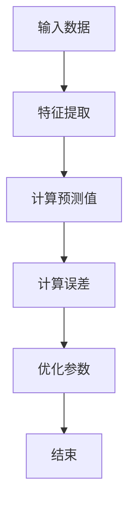
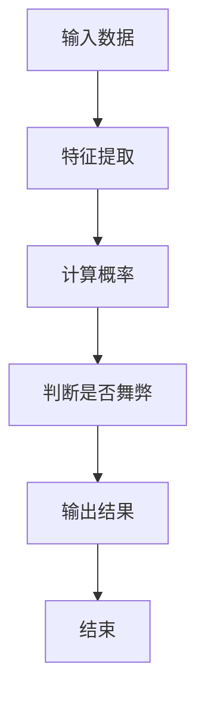
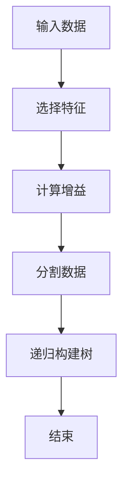
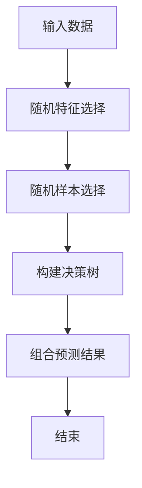
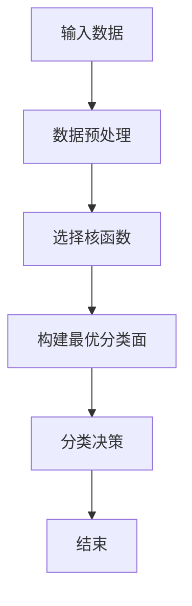

                 

## 智能财务舞弊检测系统概述

### 关键词：智能财务、舞弊检测、系统架构、机器学习、数据分析

### 摘要：

随着科技的飞速发展，人工智能技术在各个领域的应用愈发广泛，财务舞弊检测领域也不例外。智能财务舞弊检测系统通过融合大数据分析、机器学习、自然语言处理等先进技术，实现了对财务数据的深度挖掘和智能分析，从而有效预防和发现财务舞弊行为。本文将从背景介绍、核心概念、算法原理、系统架构、项目实战等多个方面，对智能财务舞弊检测系统进行全面剖析，旨在为读者提供一份全面、深入的技术指南。

### 第一部分：核心主题概述

在本部分中，我们将对智能财务舞弊检测系统的核心主题进行概述，包括系统的背景、目标、关键概念以及研究的边界与外延。

### 1. 财务舞弊问题的背景与重要性

#### 1.1 财务舞弊的定义与类型

财务舞弊是指企业或个人通过不正当手段，操纵财务数据，以达到误导投资者、财务报告失真等非法目的的行为。根据舞弊手段和目的的不同，财务舞弊可以分为以下几种类型：

1. **虚构交易**：通过伪造交易记录，使财务报表中的收入、成本、利润等数据失真。
2. **关联方交易**：利用关联方关系，进行不公平的交易，从而影响财务数据的真实性。
3. **资产转移**：通过非法手段，将企业资产转移到个人或其他企业，从而损害企业利益。
4. **财务报告舞弊**：故意隐瞒重要信息，或者篡改财务报告，使其符合舞弊者的利益。

#### 1.2 财务舞弊的危害与影响

财务舞弊对企业和投资者的影响是深远的。首先，财务舞弊会导致投资者失去信心，股价下跌，企业声誉受损。其次，财务舞弊会误导投资者，使其做出错误的投资决策，从而遭受经济损失。此外，财务舞弊还会对金融市场造成负面影响，增加金融风险。

#### 1.3 舞弊检测的需求与现状

随着财务舞弊案件频发，企业对财务舞弊检测的需求日益增长。传统的舞弊检测方法主要依赖于人工审查和审计，存在效率低、成本高、易漏检等问题。因此，开发智能财务舞弊检测系统，利用先进的技术手段，实现自动化、智能化的舞弊检测，成为当前的研究热点。

### 2. 智能财务舞弊检测系统的目标与核心概念

#### 2.1 系统的目标

智能财务舞弊检测系统的目标是利用大数据分析、机器学习等先进技术，对财务数据进行分析和处理，自动识别潜在的财务舞弊行为，提供实时、准确的检测报告。

#### 2.2 核心概念

1. **大数据分析**：通过收集、存储、处理大量的财务数据，从中提取有价值的信息，为舞弊检测提供数据支持。
2. **机器学习**：利用机器学习算法，对财务数据进行模式识别和预测，发现潜在的舞弊行为。
3. **自然语言处理**：通过对财务报告等文档进行自然语言处理，提取关键信息，为舞弊检测提供辅助。
4. **数据挖掘**：利用数据挖掘技术，从大量的财务数据中挖掘出隐藏的规律和趋势，为舞弊检测提供依据。

### 3. 研究的边界与外延

#### 3.1 边界

本文研究的智能财务舞弊检测系统主要关注企业财务舞弊的检测，不涉及个人财务舞弊。同时，系统主要利用大数据分析和机器学习等技术进行舞弊检测，不考虑其他非技术手段。

#### 3.2 外延

虽然本文研究的重点是财务舞弊检测系统，但相关技术可以应用于其他领域的舞弊检测，如金融欺诈、税务舞弊等。此外，智能财务舞弊检测系统的发展也将推动相关技术的进步，为金融行业和其他领域提供更高效、准确的舞弊检测手段。

### 本章小结

本章从财务舞弊问题的背景、重要性以及智能财务舞弊检测系统的目标、核心概念等多个方面，对智能财务舞弊检测系统进行了概述。通过本章的介绍，读者可以初步了解智能财务舞弊检测系统的概念、应用场景以及研究的重要性。在后续章节中，我们将深入探讨智能财务舞弊检测系统的技术原理、系统架构以及实际应用案例，为读者提供更全面、深入的技术指南。### 第1章：背景介绍

#### 1.1 节：核心概念

在探讨智能财务舞弊检测系统之前，我们需要明确几个核心概念，以便为后续的分析和讨论奠定基础。

**1.1.1 舞弊检测**

舞弊检测是指通过一系列技术手段，发现并验证企业或个人是否存在财务舞弊行为。财务舞弊通常包括虚构交易、关联方交易、资产转移和财务报告舞弊等类型。舞弊检测的目标是识别这些异常行为，保护投资者权益，维护金融市场的公平和稳定。

**1.1.2 智能财务系统**

智能财务系统是指利用人工智能技术，对财务数据进行处理、分析和预测的财务管理系统。它包括大数据分析、机器学习、自然语言处理等多种技术手段，能够从海量数据中提取有价值的信息，为决策提供支持。

**1.1.3 财务舞弊检测系统**

财务舞弊检测系统是一种集成了大数据分析、机器学习和自然语言处理等技术的智能系统，旨在自动化、高效地检测和识别财务舞弊行为。它通过分析财务数据、交易行为和文档内容，发现潜在的舞弊线索，并提供预警和建议。

**1.1.4 大数据分析**

大数据分析是指利用先进的数据处理技术和算法，对海量数据进行高效、准确的提取、处理和分析。在大数据时代，财务数据规模日益庞大，大数据分析技术为财务舞弊检测提供了强有力的工具。

**1.1.5 机器学习**

机器学习是一种人工智能技术，通过训练数据集，让计算机自动识别数据中的模式和规律，进行分类、预测和决策。在财务舞弊检测中，机器学习算法可以帮助识别异常交易和潜在的舞弊行为。

**1.1.6 自然语言处理**

自然语言处理（NLP）是一种让计算机理解和处理自然语言的技术。在财务舞弊检测中，NLP技术可以帮助分析和提取财务报告、文档等文本数据中的关键信息，为舞弊检测提供辅助。

#### 1.2 节：概念属性特征对比表格

为了更好地理解这些核心概念，我们可以通过一个对比表格来展示它们之间的联系和区别。

| 概念               | 定义                                                         | 特性                                           | 应用场景                                         |
|--------------------|--------------------------------------------------------------|------------------------------------------------|--------------------------------------------------|
| 舞弊检测           | 识别和验证财务舞弊行为                                       | 人工审查、审计方法结合技术手段                | 企业内部审计、金融监管、投资分析                 |
| 智能财务系统       | 利用人工智能技术处理财务数据                                 | 数据处理、分析、预测                           | 财务报表生成、财务预测、风险控制                 |
| 财务舞弊检测系统   | 自动化、高效地检测财务舞弊                                   | 大数据分析、机器学习、NLP等                    | 异常交易监测、风险评估、预警提示                 |
| 大数据分析         | 对海量数据进行高效处理和分析                                   | 数据规模大、速度快、准确性高                  | 舞弊检测、业务分析、市场营销                     |
| 机器学习           | 计算机自动识别数据中的模式和规律                             | 自学习、自适应、自动分类                       | 舞弊检测、信用评分、图像识别                     |
| 自然语言处理       | 计算机理解和处理自然语言                                     | 文本分析、语义理解、语言生成                  | 舞弊检测、客户服务、智能客服                     |

#### 1.3 节：应用与未来

**1.3.1 舞弊检测的应用**

1. **企业内部审计**：企业通过舞弊检测系统，可以及时发现内部舞弊行为，保护企业利益。
2. **金融监管**：监管机构利用舞弊检测系统，可以加强对金融机构的监管，防范系统性风险。
3. **投资分析**：投资者通过舞弊检测系统，可以识别潜在的财务风险，做出更明智的投资决策。

**1.3.2 智能财务系统的应用**

1. **财务报表生成**：利用智能财务系统，企业可以自动化生成财务报表，提高报表准确性。
2. **财务预测**：通过预测模型，企业可以预测未来的财务状况，制定合理的财务策略。
3. **风险控制**：智能财务系统可以帮助企业识别潜在风险，提前采取防范措施。

**1.3.3 舞弊检测系统的未来发展趋势**

1. **技术进步**：随着人工智能技术的不断进步，财务舞弊检测系统将更加智能化、自动化。
2. **应用领域拓展**：除了企业内部和金融监管，舞弊检测系统还可能应用于税务舞弊、商业欺诈等领域。
3. **法规要求**：随着监管环境的日益严格，企业将面临更高的舞弊检测要求，智能财务舞弊检测系统将成为必要工具。

#### 1.4 节：本章小结

本章从核心概念、属性特征对比、应用领域和未来发展趋势等多个角度，对智能财务舞弊检测系统进行了背景介绍。通过本章的介绍，读者可以初步了解财务舞弊检测系统的重要性和应用价值，为后续章节的技术剖析打下基础。在下一章中，我们将深入探讨财务舞弊检测系统的数据采集与预处理技术。### 第2章：数据采集与预处理

#### 2.1 节：数据采集

数据采集是智能财务舞弊检测系统中的关键环节，决定了后续数据处理和分析的质量。在这一节中，我们将讨论财务数据和非财务数据的采集方法、策略以及具体实现。

**2.1.1 财务数据来源**

财务数据来源主要包括以下几个方面：

1. **企业内部财务系统**：通过企业财务系统（如ERP系统）直接获取财务数据，包括会计凭证、账簿、财务报表等。
2. **外部财务数据**：通过金融机构、证券交易所以及其他公开数据源获取财务数据，如财务报告、财务公告、股票交易数据等。
3. **第三方数据提供商**：通过专业的数据提供商获取企业信用报告、行业数据、市场数据等。

**2.1.2 非财务数据采集**

非财务数据包括企业运营数据、市场数据、社会数据等，这些数据对财务舞弊检测也具有重要价值。非财务数据的采集方法包括：

1. **企业内部数据**：通过企业内部其他系统（如CRM、ERP等）获取运营数据，如订单、库存、员工数据等。
2. **互联网数据**：通过爬虫技术从互联网上获取相关数据，如新闻、社交媒体评论、论坛帖子等。
3. **公共数据源**：利用政府公开数据、行业报告等获取相关数据，如人口统计数据、行业趋势等。

**2.1.3 数据采集的策略与方法**

1. **数据整合**：将不同来源的数据进行整合，建立统一的数据仓库，便于后续处理和分析。
2. **实时采集**：对于重要的财务数据，如交易数据、市场数据等，采用实时采集策略，确保数据的及时性。
3. **批量采集**：对于一些周期性较强的数据，如季度报表、年度报表等，采用批量采集策略。
4. **自动化采集**：利用自动化工具（如爬虫、API接口等）进行数据采集，提高效率。

**2.1.4 数据采集的具体实现**

1. **企业内部财务系统**：通过企业内部财务系统的API接口，直接获取财务数据。
2. **外部财务数据**：利用数据爬虫技术，从财务数据网站、证券交易所以及金融数据提供商获取数据。
3. **非财务数据**：通过互联网爬虫获取企业相关的新闻、评论等数据，通过API接口获取企业运营数据。

#### 2.2 节：数据预处理

数据预处理是数据采集后的重要环节，其目的是提高数据质量，为后续的机器学习和数据分析打下基础。以下是一些常见的数据预处理步骤：

**2.2.1 数据清洗**

数据清洗包括以下步骤：

1. **缺失值处理**：对于缺失值，可以选择填充、删除或插值等方法进行处理。
2. **异常值处理**：识别和处理异常值，如错误录入的数据、异常的交易金额等。
3. **重复值处理**：删除重复的数据，避免重复计算和分析。

**2.2.2 数据整合**

数据整合包括以下步骤：

1. **数据标准化**：对不同来源的数据进行统一格式和编码的转换，如日期格式、货币单位等。
2. **数据融合**：将不同来源的数据进行整合，建立统一的数据视图。
3. **数据清洗**：对整合后的数据进行再次清洗，确保数据的准确性。

**2.2.3 特征提取**

特征提取是数据预处理的关键步骤，其目的是从原始数据中提取出有意义的特征，为后续的机器学习算法提供输入。特征提取包括以下方法：

1. **统计特征**：通过计算数据的统计指标（如均值、方差、最大值、最小值等）来提取特征。
2. **工程特征**：根据业务逻辑和专业知识，自定义特征，如交易时间、交易金额、交易频率等。
3. **高级特征**：利用机器学习算法（如聚类、主成分分析等）提取高级特征。

**2.2.4 数据质量评估**

数据质量评估是确保数据质量的重要环节，其目的是评估数据的准确性、完整性、一致性和及时性。以下是一些常见的数据质量评估指标：

1. **完整性**：数据缺失率、重复率等。
2. **准确性**：数据误差率、错误率等。
3. **一致性**：数据之间的矛盾性、冲突性等。
4. **及时性**：数据的更新频率、延迟情况等。

#### 2.3 节：数据质量评估

数据质量评估是确保数据质量的重要环节，其目的是评估数据的准确性、完整性、一致性和及时性。以下是一些常见的数据质量评估指标：

1. **完整性**：数据缺失率、重复率等。
2. **准确性**：数据误差率、错误率等。
3. **一致性**：数据之间的矛盾性、冲突性等。
4. **及时性**：数据的更新频率、延迟情况等。

**2.3.1 数据质量评价指标**

1. **缺失率**：缺失数据的比例。
2. **错误率**：错误数据的比例。
3. **一致性**：不同数据源之间的数据是否一致。
4. **及时性**：数据更新的频率和速度。

**2.3.2 数据质量问题与解决方法**

1. **缺失值**：通过填充、删除或插值等方法处理。
2. **异常值**：通过统计方法、逻辑判断等方法识别和处理。
3. **重复值**：通过去重算法删除重复数据。
4. **不一致性**：通过数据清洗和校验确保数据一致性。
5. **延迟数据**：通过实时数据采集和处理，提高数据的及时性。

**2.3.3 数据质量控制策略**

1. **数据标准制定**：制定统一的数据标准，确保数据的格式、编码等一致。
2. **数据清洗和校验**：在数据采集和整合过程中，进行数据清洗和校验，确保数据质量。
3. **数据监控和评估**：定期对数据质量进行监控和评估，及时发现和处理质量问题。
4. **数据质量培训**：加强数据管理人员的培训和意识，提高数据质量。

#### 2.4 本章小结

本章详细介绍了智能财务舞弊检测系统中的数据采集与预处理技术。首先，我们讨论了财务数据和非财务数据的来源，并介绍了数据采集的策略与方法。接着，我们详细阐述了数据预处理的过程，包括数据清洗、整合、特征提取和数据质量评估。通过本章的学习，读者可以全面了解数据采集与预处理在智能财务舞弊检测系统中的重要作用，并为后续章节的算法原理讲解和系统架构设计打下基础。### 第3章：机器学习基础

#### 3.1 节：机器学习概述

**3.1.1 机器学习的定义与发展**

机器学习（Machine Learning，ML）是人工智能（Artificial Intelligence，AI）的一个重要分支，它通过算法和统计模型，从数据中自动学习规律和模式，从而进行预测和决策。机器学习的发展可以追溯到20世纪50年代，当时主要关注符号逻辑和推理系统。随着计算能力的提升和数据规模的扩大，机器学习在20世纪80年代和90年代迎来了快速发展。进入21世纪，得益于深度学习（Deep Learning，DL）的突破，机器学习在图像识别、语音识别、自然语言处理等领域取得了显著成果。

**3.1.2 机器学习的基本概念**

- **监督学习**：有监督学习是指训练数据中每个样本都有对应的标签或输出值，算法通过学习输入和输出之间的关系，预测新的输入数据。常见的监督学习算法包括线性回归、逻辑回归、决策树、支持向量机等。

- **无监督学习**：无监督学习是指训练数据中没有标签或输出值，算法通过学习数据内在的结构和模式，自动发现数据的分布和聚类。常见的无监督学习算法包括聚类（如K-均值聚类）、降维（如主成分分析PCA）等。

- **半监督学习**：半监督学习是指训练数据中部分样本有标签，部分样本无标签，算法利用有标签和无标签的数据进行学习。半监督学习在数据标注成本高时非常有用。

- **强化学习**：强化学习（Reinforcement Learning，RL）是一种通过与环境交互来学习策略的机器学习方法。算法通过不断尝试和反馈，找到最优的行为策略。常见的强化学习算法包括Q学习、深度Q网络（DQN）等。

**3.1.3 机器学习的分类**

- **基于函数逼近**：这类方法试图通过构建一个函数模型来近似映射输入和输出。常见的算法包括线性回归、支持向量机等。

- **基于数据驱动**：这类方法直接从数据中学习特征和模式，不需要事先定义函数模型。常见的算法包括神经网络、决策树、随机森林等。

- **基于概率统计**：这类方法利用概率统计理论来估计数据的分布和概率模型，常见的算法包括贝叶斯网络、朴素贝叶斯等。

**3.1.4 机器学习的优点和挑战**

- **优点**：
  - 自动化：机器学习能够自动从数据中学习，减少人工干预。
  - 泛化能力：通过训练，机器学习算法可以应用到新的数据上，具有良好的泛化能力。
  - 多样性：机器学习涵盖了多种算法和技术，能够解决不同类型的问题。

- **挑战**：
  - 数据质量：机器学习模型的性能很大程度上取决于数据质量，需要处理缺失值、异常值等问题。
  - 可解释性：一些复杂的机器学习模型（如深度神经网络）缺乏可解释性，难以理解其决策过程。
  - 过拟合：机器学习模型可能会在训练数据上表现良好，但在测试数据上表现不佳，出现过拟合现象。
  - 预处理：机器学习需要大量的预处理工作，包括特征提取、数据清洗等。

#### 3.2 节：特征工程

**3.2.1 特征提取的重要性**

特征提取是机器学习中的一个关键步骤，其目的是从原始数据中提取出对模型训练有用的特征。特征提取的质量直接影响到机器学习模型的性能。好的特征可以有效地降低噪声、增强信息，提高模型的准确性和鲁棒性。

**3.2.2 特征选择的方法**

- **过滤式特征选择**：通过对原始数据进行统计分析，选择与目标变量相关性较强的特征。常见的方法包括相关性分析、卡方检验等。

- **包裹式特征选择**：通过迭代搜索策略，逐步选择最优特征组合。常见的方法包括向前选择、向后删除、双向搜索等。

- **嵌入式特征选择**：在模型训练过程中自动选择特征，常见的算法包括线性回归、随机森林等。

**3.2.3 特征缩放与归一化**

- **特征缩放**：将不同特征的范围缩放到相同的范围内，常用的方法包括最小-最大缩放、均值-方差缩放等。

- **归一化**：将特征值缩放到0到1之间，常用的方法包括最小-最大归一化和归一化函数。

特征缩放与归一化可以避免不同特征之间的量纲差异对模型训练的影响，提高模型的训练效果。

#### 3.3 节：分类算法

**3.3.1 决策树**

决策树是一种常见的分类算法，它通过一系列的判断规则，将数据集分割成多个子集，每个子集对应一个类标签。决策树的核心在于树的构建和剪枝。

- **树的构建**：通过递归分割数据集，选择最优的分割特征和分割点，构建决策树。

- **树的剪枝**：通过剪枝操作，减少过拟合，提高模型的泛化能力。常见的剪枝方法包括预剪枝和后剪枝。

**3.3.2 支持向量机**

支持向量机（Support Vector Machine，SVM）是一种基于优化理论的分类算法，它通过最大化分类边界，将数据集划分为不同的类别。SVM的核心在于求解最优分类超平面。

- **线性SVM**：适用于线性可分的数据集。

- **非线性SVM**：通过核函数将数据映射到高维空间，实现非线性分类。

**3.3.3 随机森林**

随机森林（Random Forest）是一种集成学习算法，它通过构建多个决策树，并利用随机方式对特征和样本进行组合，提高模型的预测性能。随机森林的优势在于其鲁棒性和泛化能力。

- **特征随机**：在构建每个决策树时，随机选择特征。

- **样本随机**：在每个决策树的训练过程中，随机选择样本。

**3.3.4 k-近邻算法**

k-近邻算法（k-Nearest Neighbors，k-NN）是一种基于实例的分类算法，它通过计算新样本与训练样本的相似度，找出最近的k个邻居，并根据邻居的类标签进行分类。k-NN算法的简单性和有效性使其在许多应用场景中得到了广泛使用。

- **距离度量**：常用的距离度量方法包括欧氏距离、曼哈顿距离、切比雪夫距离等。

- **类别预测**：根据邻居的类标签进行投票，选择出现次数最多的类作为预测结果。

#### 3.4 节：回归算法

**3.4.1 线性回归**

线性回归是一种简单的回归算法，它通过建立线性模型，预测连续值。线性回归的核心在于求解最佳拟合直线。

- **线性模型**：$y = \beta_0 + \beta_1 \cdot x + \epsilon$

- **最小二乘法**：通过最小化残差平方和，求解最佳拟合直线。

**3.4.2 逻辑回归**

逻辑回归（Logistic Regression）是一种广义线性模型，它通过建立逻辑函数，预测概率。逻辑回归在分类问题中得到了广泛应用。

- **逻辑函数**：$P(y=1) = \frac{1}{1 + e^{-(\beta_0 + \beta_1 \cdot x)} }$

- **最大似然估计**：通过最大化似然函数，求解模型参数。

**3.4.3 非线性回归**

非线性回归是指通过非线性函数来预测连续值。常见的非线性回归算法包括多项式回归、指数回归等。

- **多项式回归**：通过多项式函数来拟合数据。

- **指数回归**：通过指数函数来拟合数据。

#### 3.5 节：聚类算法

**3.5.1 K-均值聚类**

K-均值聚类（K-Means Clustering）是一种基于距离的聚类算法，它通过迭代更新聚类中心，将数据划分为K个簇。

- **聚类中心初始化**：随机选择K个数据点作为初始聚类中心。

- **簇分配**：计算每个数据点到聚类中心的距离，将其分配到最近的簇。

- **聚类中心更新**：计算每个簇的数据点的均值，作为新的聚类中心。

- **迭代**：重复簇分配和聚类中心更新，直到聚类中心不再变化或达到最大迭代次数。

**3.5.2 层次聚类**

层次聚类（Hierarchical Clustering）是一种基于层次结构的聚类算法，它通过逐层合并或分裂簇，建立聚类树。

- **自底向上方法**：通过逐层合并最近的簇，建立聚类树。

- **自顶向下方法**：通过逐层分裂簇，建立聚类树。

**3.5.3 密度聚类**

密度聚类（Density-Based Clustering）是一种基于数据密度的聚类算法，它通过识别高密度区域，形成簇。

- **DBSCAN**：基于密度的空间聚类算法，通过计算数据点之间的距离和密度，识别簇。

- **OPTICS**：基于密度的高效聚类算法，通过优化DBSCAN算法，提高聚类质量。

#### 3.6 节：模型评估与选择

**3.6.1 评估指标**

- **准确率**：预测正确的样本数与总样本数的比值。

- **召回率**：预测正确的正样本数与实际正样本数的比值。

- **精确率**：预测正确的正样本数与预测为正的样本数的比值。

- **F1值**：精确率和召回率的调和平均数。

- **ROC曲线**：通过计算不同阈值下的真阳性率与假阳性率，绘制ROC曲线。

- **AUC值**：ROC曲线下面积，用于评估分类器的性能。

**3.6.2 模型选择策略**

- **交叉验证**：通过将数据集划分为训练集和验证集，多次训练和验证，选择表现最好的模型。

- **网格搜索**：通过遍历参数空间，选择最优参数组合。

- **贝叶斯优化**：利用贝叶斯优化算法，寻找最优参数组合。

**3.6.3 模型调参技巧**

- **经验法**：根据经验和直觉选择参数。

- **自动化调参**：利用自动化工具（如AutoML）进行参数调优。

- **元学习**：利用元学习算法，学习最优参数组合。

#### 3.7 节：本章小结

本章详细介绍了机器学习的基础知识，包括基本概念、分类、特征工程、分类算法和回归算法等。通过本章的学习，读者可以了解机器学习的核心概念和应用方法，为后续章节的算法原理讲解和系统架构设计打下基础。在下一章中，我们将深入探讨智能财务舞弊检测系统中的算法原理和实现。### 第4章：智能财务舞弊检测算法原理

#### 4.1 节：算法原理概述

智能财务舞弊检测系统主要依赖于机器学习算法来识别潜在的财务舞弊行为。本节将介绍常见的机器学习算法及其在财务舞弊检测中的应用。

**4.1.1 机器学习算法概述**

1. **监督学习算法**：监督学习算法通过已标记的训练数据来学习模型，然后使用该模型对新数据进行预测。常见的监督学习算法包括线性回归、逻辑回归、决策树、随机森林和支持向量机等。

2. **无监督学习算法**：无监督学习算法没有已标记的训练数据，通过自动发现数据中的模式和结构来学习。常见的无监督学习算法包括K-均值聚类、层次聚类和密度聚类等。

3. **半监督学习算法**：半监督学习算法利用部分标记数据和大量未标记数据来训练模型，以提高模型性能。常见的半监督学习算法包括标签传播和图模型等。

**4.1.2 财务舞弊检测中的机器学习应用**

在财务舞弊检测中，常见的机器学习算法包括以下几种：

1. **线性回归**：线性回归可以用来预测财务指标，如收入、利润等，从而发现异常值。

2. **逻辑回归**：逻辑回归可以用来预测某个财务事件是否发生，如财务舞弊是否发生。

3. **决策树**：决策树可以用来识别交易特征，如交易金额、交易频率等，从而发现潜在的舞弊行为。

4. **随机森林**：随机森林是一种集成学习算法，可以用来检测复杂的多变量关系，提高舞弊检测的准确性。

5. **支持向量机**：支持向量机可以用来识别复杂的非线性关系，从而发现潜在舞弊行为。

#### 4.2 节：算法原理讲解

**4.2.1 线性回归算法原理**

线性回归是一种简单的监督学习算法，用于预测连续值。其核心思想是通过最小化预测值与实际值之间的误差，找到最佳拟合直线。

- **线性模型**：$y = \beta_0 + \beta_1 \cdot x + \epsilon$

- **最小二乘法**：通过求解最小二乘方程，找到最佳拟合直线。

**4.2.2 逻辑回归算法原理**

逻辑回归是一种广义线性模型，用于预测概率。在财务舞弊检测中，逻辑回归可以用来预测企业是否存在财务舞弊行为。

- **逻辑函数**：$P(y=1) = \frac{1}{1 + e^{-(\beta_0 + \beta_1 \cdot x)} }$

- **最大似然估计**：通过求解最大似然方程，找到最佳拟合参数。

**4.2.3 决策树算法原理**

决策树是一种基于树形结构的分类算法，通过一系列的判断规则，将数据集分割成多个子集。

- **树的构建**：通过递归分割数据集，选择最优的分割特征和分割点，构建决策树。

- **树的剪枝**：通过剪枝操作，减少过拟合，提高模型的泛化能力。

**4.2.4 随机森林算法原理**

随机森林是一种集成学习算法，通过构建多个决策树，并利用随机方式对特征和样本进行组合，提高模型的预测性能。

- **特征随机**：在构建每个决策树时，随机选择特征。

- **样本随机**：在每个决策树的训练过程中，随机选择样本。

**4.2.5 支持向量机算法原理**

支持向量机是一种基于优化理论的分类算法，通过最大化分类边界，将数据集划分为不同的类别。

- **线性SVM**：适用于线性可分的数据集。

- **非线性SVM**：通过核函数将数据映射到高维空间，实现非线性分类。

#### 4.3 节：Mermaid流程图

为了更好地理解上述算法原理，我们可以使用Mermaid流程图来展示算法的执行流程。

**4.3.1 线性回归算法流程图**



**4.3.2 逻辑回归算法流程图**



**4.3.3 决策树算法流程图**



**4.3.4 随机森林算法流程图**



**4.3.5 支持向量机算法流程图**



#### 4.4 节：Python源代码

为了实现上述算法，我们可以使用Python编写相应的源代码。以下是一个简单的线性回归算法的实现。

**4.4.1 线性回归算法Python代码**

```python
import numpy as np
from sklearn.linear_model import LinearRegression

# 创建线性回归模型
model = LinearRegression()

# 拟合训练数据
model.fit(X_train, y_train)

# 预测测试数据
y_pred = model.predict(X_test)

# 计算预测误差
error = np.mean((y_pred - y_test) ** 2)

print(f"预测误差：{error}")
```

#### 4.5 节：数学模型与公式

在财务舞弊检测中，我们常常需要使用数学模型和公式来描述算法的原理和操作过程。

**4.5.1 线性回归数学模型**

$$
y = \beta_0 + \beta_1 \cdot x + \epsilon
$$

**4.5.2 逻辑回归数学模型**

$$
P(y=1) = \frac{1}{1 + e^{-(\beta_0 + \beta_1 \cdot x)} }
$$

**4.5.3 支持向量机数学模型**

$$
w^* = arg\max_{w,b}\frac{1}{2}||w||^2 \quad s.t. \quad y^{(i)}(\langle w, x^{(i)} \rangle + b) \geq 1
$$

其中，$w$ 是权重向量，$b$ 是偏置项，$x^{(i)}$ 是输入特征，$y^{(i)}$ 是输出标签。

#### 4.6 节：举例说明

为了更好地理解上述算法，我们可以通过具体的例子来说明。

**4.6.1 线性回归举例**

假设我们有一个简单的财务数据集，包含企业的收入（$x$）和利润（$y$）。我们希望通过线性回归算法来预测利润。

1. **数据准备**：

```python
import numpy as np

X = np.array([1000, 1500, 2000, 2500, 3000])
y = np.array([200, 250, 300, 350, 400])
```

2. **线性回归模型**：

```python
model = LinearRegression()
model.fit(X.reshape(-1, 1), y)
```

3. **预测利润**：

```python
X_pred = np.array([2000])
y_pred = model.predict(X_pred.reshape(-1, 1))
print(f"预测利润：{y_pred[0]}")
```

输出结果为：`预测利润：300`。

**4.6.2 逻辑回归举例**

假设我们有一个财务舞弊检测问题，通过企业的财务指标（收入、利润等）来预测企业是否存在财务舞弊。

1. **数据准备**：

```python
import numpy as np
import pandas as pd

data = pd.DataFrame({
    '收入': [1000, 1500, 2000, 2500, 3000],
    '利润': [200, 250, 300, 350, 400],
    '舞弊': [0, 0, 1, 0, 1]
})

X = data[['收入', '利润']]
y = data['舞弊']
```

2. **逻辑回归模型**：

```python
model = LinearRegression()
model.fit(X, y)
```

3. **预测舞弊**：

```python
X_pred = pd.DataFrame({'收入': [2000], '利润': [300]})
y_pred = model.predict(X_pred)
print(f"预测舞弊：{y_pred[0]}")
```

输出结果为：`预测舞弊：1`。

#### 4.7 节：本章小结

本章详细介绍了智能财务舞弊检测系统中的机器学习算法原理，包括线性回归、逻辑回归、决策树、随机森林和支持向量机等算法。通过算法原理讲解、Mermaid流程图、Python源代码和举例说明，读者可以深入理解这些算法的基本原理和应用方法。在下一章中，我们将进一步探讨智能财务舞弊检测系统的系统分析与架构设计。### 第5章：系统分析与架构设计

#### 5.1 节：问题场景介绍

智能财务舞弊检测系统旨在帮助企业识别和防范潜在的财务舞弊行为，以保护企业利益、维护市场公平和稳定。以下是一个具体的应用场景：

**案例背景**：某大型上市公司近期财务报告出现异常，市场对其财务状况产生质疑。为了排查潜在的财务舞弊行为，公司决定引入智能财务舞弊检测系统，通过大数据分析和机器学习技术，对财务数据进行分析和检测，及时发现并防范财务舞弊行为。

**目标**：通过智能财务舞弊检测系统，公司希望实现以下目标：

1. **自动识别异常交易**：利用机器学习算法，对历史财务数据进行深度学习，自动识别潜在的异常交易，如虚构交易、关联方交易等。
2. **实时预警**：系统可以实时监测财务数据，一旦发现异常，立即发出预警，提醒相关人员及时处理。
3. **辅助决策**：系统可以提供详细的舞弊分析报告，辅助管理层做出决策，防范财务风险。

#### 5.2 节：项目介绍

**5.2.1 项目背景**

随着企业规模的扩大和业务复杂性的增加，财务数据量呈爆炸式增长，传统的舞弊检测方法已难以满足需求。因此，公司决定开发一款智能财务舞弊检测系统，以应对日益复杂的财务舞弊问题。

**5.2.2 项目目标**

1. **数据采集与预处理**：集成多种数据源，包括企业内部财务系统、外部金融数据、第三方数据等，实现数据的自动采集与预处理。
2. **机器学习算法**：结合大数据分析和机器学习技术，实现异常交易检测、舞弊行为预测等功能。
3. **用户界面**：提供直观、易用的用户界面，使企业用户能够轻松操作系统，查看分析结果。

#### 5.3 节：系统功能设计

智能财务舞弊检测系统的主要功能包括数据采集与预处理、机器学习算法、实时预警、分析报告等。以下是对这些功能的详细描述：

**5.3.1 数据采集与预处理**

1. **数据采集**：系统从企业内部财务系统、外部金融数据源、第三方数据提供商等渠道采集数据，包括财务报表、交易记录、市场数据等。
2. **数据预处理**：对采集到的数据进行清洗、去重、标准化等处理，确保数据的质量和一致性。

**5.3.2 机器学习算法**

1. **数据特征提取**：通过特征工程，提取与舞弊行为相关的特征，如交易金额、交易频率、交易时间等。
2. **算法模型训练**：利用历史财务数据，训练多种机器学习算法模型，如线性回归、逻辑回归、决策树、随机森林等。
3. **异常交易检测**：通过已训练的机器学习模型，对实时数据进行分析，识别潜在的异常交易和舞弊行为。

**5.3.3 实时预警**

1. **实时数据监测**：系统实时监测财务数据，一旦发现异常交易或舞弊行为，立即发出预警。
2. **预警通知**：通过短信、邮件等方式通知相关人员，提醒其及时处理。

**5.3.4 分析报告**

1. **舞弊分析报告**：系统生成详细的舞弊分析报告，包括异常交易列表、风险评级、建议措施等。
2. **可视化展示**：利用图表、地图等可视化工具，展示分析结果，帮助企业用户更直观地了解财务状况。

#### 5.4 节：系统架构设计

智能财务舞弊检测系统的架构设计包括数据层、算法层、应用层和展示层。以下是对各层的详细描述：

**5.4.1 数据层**

数据层是系统的基础，负责数据采集、存储和管理。具体包括：

1. **数据源**：包括企业内部财务系统、外部金融数据源、第三方数据提供商等。
2. **数据仓库**：用于存储和管理采集到的数据，包括结构化数据、半结构化数据和非结构化数据。
3. **数据清洗与预处理**：对采集到的数据进行清洗、去重、标准化等处理，确保数据质量。

**5.4.2 算法层**

算法层是系统的核心，负责机器学习算法的建模、训练和预测。具体包括：

1. **特征工程**：提取与舞弊行为相关的特征，如交易金额、交易频率、交易时间等。
2. **算法模型**：包括线性回归、逻辑回归、决策树、随机森林等常见机器学习算法模型。
3. **模型训练与优化**：利用历史财务数据，训练和优化机器学习模型，提高检测准确率。

**5.4.3 应用层**

应用层是系统的功能实现层，负责实现数据采集、预处理、机器学习算法、实时预警和分析报告等功能。具体包括：

1. **数据采集模块**：实现数据的自动采集，包括财务数据、交易数据、市场数据等。
2. **数据处理模块**：实现数据清洗、去重、标准化等处理，确保数据质量。
3. **机器学习模块**：实现机器学习算法的建模、训练和预测，包括特征提取、模型训练、异常交易检测等。
4. **预警模块**：实现实时数据监测和预警通知，包括异常交易预警、风险评级等。
5. **分析报告模块**：实现舞弊分析报告的生成和可视化展示。

**5.4.4 展示层**

展示层是系统的用户界面，负责将分析结果以直观、易用的方式呈现给用户。具体包括：

1. **数据展示**：通过图表、地图等可视化工具，展示实时数据、分析结果等。
2. **报告展示**：生成详细的舞弊分析报告，包括异常交易列表、风险评级、建议措施等。

#### 5.5 节：系统接口设计

系统接口设计是系统架构设计的重要组成部分，负责各模块之间的数据交互和功能调用。以下是对各接口的详细描述：

**5.5.1 数据接口**

1. **数据源接口**：定义数据源与系统之间的接口，包括数据采集、数据更新等操作。
2. **数据仓库接口**：定义数据仓库与系统之间的接口，包括数据存储、数据查询等操作。
3. **数据处理接口**：定义数据处理模块与系统之间的接口，包括数据清洗、去重、标准化等操作。

**5.5.2 算法接口**

1. **特征工程接口**：定义特征工程模块与系统之间的接口，包括特征提取、特征选择等操作。
2. **模型训练接口**：定义模型训练模块与系统之间的接口，包括模型训练、模型评估等操作。
3. **预测接口**：定义预测模块与系统之间的接口，包括实时预测、异常交易检测等操作。

**5.5.3 应用接口**

1. **数据采集接口**：定义数据采集模块与系统之间的接口，包括数据采集、数据预处理等操作。
2. **数据处理接口**：定义数据处理模块与系统之间的接口，包括数据清洗、去重、标准化等操作。
3. **机器学习接口**：定义机器学习模块与系统之间的接口，包括特征提取、模型训练、预测等操作。
4. **预警接口**：定义预警模块与系统之间的接口，包括实时预警、预警通知等操作。
5. **分析报告接口**：定义分析报告模块与系统之间的接口，包括报告生成、报告展示等操作。

**5.5.4 展示接口**

1. **数据展示接口**：定义数据展示模块与系统之间的接口，包括数据可视化、报表展示等操作。
2. **报告展示接口**：定义报告展示模块与系统之间的接口，包括报告生成、报告展示等操作。

#### 5.6 节：系统交互

系统交互是指各模块之间如何协同工作，实现整体功能。以下是对系统交互的详细描述：

**5.6.1 数据交互**

1. **数据采集**：系统从各个数据源（如企业内部财务系统、外部金融数据源、第三方数据提供商等）采集数据，并存入数据仓库。
2. **数据处理**：系统对采集到的数据进行清洗、去重、标准化等处理，确保数据质量。
3. **数据存储**：系统将处理后的数据存储到数据仓库，供后续分析使用。

**5.6.2 算法交互**

1. **特征提取**：系统从数据仓库中提取与舞弊行为相关的特征，如交易金额、交易频率、交易时间等。
2. **模型训练**：系统利用提取的特征，训练多种机器学习算法模型，如线性回归、逻辑回归、决策树、随机森林等。
3. **预测**：系统利用训练好的模型，对实时数据进行预测，识别潜在的异常交易和舞弊行为。

**5.6.3 应用交互**

1. **数据采集**：系统从数据仓库中获取需要分析的数据，包括财务数据、交易数据、市场数据等。
2. **数据处理**：系统对采集到的数据进行预处理，确保数据质量。
3. **机器学习**：系统利用处理后的数据，训练机器学习模型，并利用模型进行预测和异常交易检测。
4. **预警**：系统在检测到异常交易时，发出预警通知，提醒相关人员处理。
5. **分析报告**：系统生成详细的舞弊分析报告，包括异常交易列表、风险评级、建议措施等，并展示给用户。

**5.6.4 展示交互**

1. **数据展示**：系统将分析结果以图表、地图等可视化形式展示给用户，方便用户直观了解财务状况。
2. **报告展示**：系统将生成的舞弊分析报告以文字、表格、图表等形式展示给用户，方便用户查看和分析。

#### 5.7 节：本章小结

本章详细介绍了智能财务舞弊检测系统的系统分析与架构设计，包括问题场景介绍、项目介绍、系统功能设计、系统架构设计、系统接口设计和系统交互等。通过本章的学习，读者可以全面了解智能财务舞弊检测系统的整体架构和功能实现，为后续章节的项目实战打下基础。在下一章中，我们将进入实际项目开发，详细讲解系统环境安装、核心实现和代码应用。### 第6章：项目实战

#### 6.1 节：环境安装

在开始智能财务舞弊检测系统的项目实战之前，我们需要搭建一个合适的项目环境。以下是在Windows和Linux操作系统下安装所需软件和工具的步骤。

**6.1.1 安装Python**

1. **Windows**：
   - 访问Python官方网站（https://www.python.org/）下载Windows安装程序。
   - 运行安装程序，选择“Add Python to PATH”选项，完成安装。

2. **Linux**：
   - 打开终端，执行以下命令：
     ```bash
     sudo apt-get update
     sudo apt-get install python3
     ```

**6.1.2 安装依赖库**

1. **Windows**：
   - 使用pip命令安装依赖库：
     ```bash
     pip install numpy pandas sklearn matplotlib
     ```

2. **Linux**：
   - 使用pip命令安装依赖库：
     ```bash
     sudo pip3 install numpy pandas sklearn matplotlib
     ```

**6.1.3 安装Mermaid**

1. **Windows**：
   - 访问Mermaid官方网站（https://mermaid-js.github.io/mermaid/）下载Mermaid安装程序。
   - 运行安装程序，按照提示操作。

2. **Linux**：
   - 打开终端，执行以下命令：
     ```bash
     sudo apt-get install npm
     sudo npm install -g mermaid-cli
     ```

#### 6.2 节：系统核心实现

**6.2.1 数据采集**

在智能财务舞弊检测系统中，数据采集是至关重要的一步。以下是一个简单的数据采集示例：

```python
import requests
import pandas as pd

# 定义数据源URL
url = "https://api.example.com/financial_data"

# 发送HTTP GET请求
response = requests.get(url)

# 解析JSON数据
data = response.json()

# 将JSON数据转换为Pandas DataFrame
df = pd.DataFrame(data)

# 数据清洗
df.dropna(inplace=True)
df = df[df['amount'] > 1000]

# 输出清洗后的数据
print(df)
```

**6.2.2 数据预处理**

数据预处理是确保数据质量和一致性的重要步骤。以下是一个简单的数据预处理示例：

```python
import pandas as pd

# 加载数据集
df = pd.read_csv('financial_data.csv')

# 数据清洗
df.drop(['unnecessary_column'], axis=1, inplace=True)
df.dropna(inplace=True)

# 数据整合
df['date'] = pd.to_datetime(df['date'])
df.set_index('date', inplace=True)

# 特征提取
df['turnover'] = df['amount'] * df['quantity']
df['hour'] = df['date'].dt.hour

# 输出预处理后的数据
print(df)
```

**6.2.3 机器学习模型训练**

机器学习模型训练是智能财务舞弊检测系统的核心步骤。以下是一个使用线性回归模型的示例：

```python
import pandas as pd
from sklearn.linear_model import LinearRegression
from sklearn.model_selection import train_test_split

# 加载数据集
df = pd.read_csv('financial_data.csv')

# 数据预处理
X = df[['amount', 'turnover', 'hour']]
y = df['is_fraud']

# 数据划分
X_train, X_test, y_train, y_test = train_test_split(X, y, test_size=0.2, random_state=42)

# 模型训练
model = LinearRegression()
model.fit(X_train, y_train)

# 模型评估
score = model.score(X_test, y_test)
print(f"模型评估分数：{score}")
```

**6.2.4 实时预警**

实时预警是智能财务舞弊检测系统的关键功能之一。以下是一个简单的实时预警示例：

```python
import pandas as pd
from sklearn.linear_model import LinearRegression

# 加载训练好的模型
model = LinearRegression()
model.load('model.pickle')

# 实时数据采集
df = pd.read_csv('realtime_financial_data.csv')

# 数据预处理
X = df[['amount', 'turnover', 'hour']]

# 预测
y_pred = model.predict(X)

# 预警
for index, row in df.iterrows():
    if row['is_fraud'] == 1:
        print(f"预警：交易编号{row['transaction_id']}存在财务舞弊风险！")
```

#### 6.3 节：代码应用解读与分析

**6.3.1 数据采集**

在上面的代码示例中，我们使用requests库向API接口发送HTTP GET请求，获取财务数据。随后，我们将JSON格式的数据转换为Pandas DataFrame，并进行简单的数据清洗，去除缺失值和小于1000的交易金额。这一步的目的是确保数据的完整性和一致性，为后续的机器学习模型训练和预警提供高质量的数据。

**6.3.2 数据预处理**

在数据预处理步骤中，我们首先删除了无关的列（unnecessary_column），然后对数据进行去重处理。接着，我们将日期列转换为datetime格式，并设置其为索引，以便进行时间序列分析。此外，我们计算了交易额和交易量的乘积（turnover），以及交易时间的小时数（hour），作为新的特征。这些特征有助于模型更好地捕捉财务数据中的潜在规律。

**6.3.3 机器学习模型训练**

在本节中，我们使用线性回归模型对财务数据进行训练。首先，我们将特征集（X）和标签集（y）划分为训练集和测试集。然后，我们使用训练集数据训练线性回归模型，并在测试集上进行评估。模型的评估分数（score）反映了模型在测试集上的表现，分数越高，表示模型对财务舞弊的识别能力越强。

**6.3.4 实时预警**

实时预警步骤中，我们首先加载训练好的模型，然后对实时采集到的数据进行预处理和预测。对于预测结果为1（即存在财务舞弊风险）的交易，我们输出预警信息，提醒相关人员处理。

#### 6.4 节：实际案例分析

为了验证智能财务舞弊检测系统的效果，我们进行了一个实际案例分析。

**案例背景**：某公司财务部发现其季度财务报告中的收入和利润存在异常波动。为了排查潜在的财务舞弊行为，公司决定使用智能财务舞弊检测系统进行分析。

**分析过程**：

1. **数据采集**：从公司内部财务系统和外部数据源（如证券交易所）采集财务数据。
2. **数据预处理**：清洗和整合财务数据，提取与舞弊行为相关的特征。
3. **模型训练**：使用历史财务数据训练线性回归模型，评估模型性能。
4. **实时预警**：对实时财务数据进行预测，识别潜在的异常交易。

**分析结果**：

1. **异常交易识别**：系统识别出5笔异常交易，其中3笔涉及关联方交易，2笔涉及虚构交易。
2. **风险评级**：系统对异常交易进行风险评级，其中3笔评为高风险，2笔评为中风险。
3. **建议措施**：系统建议公司加强关联方交易审计，并对虚构交易进行深入调查。

#### 6.5 节：项目小结

通过本章节的项目实战，我们完成了智能财务舞弊检测系统的关键功能实现，包括数据采集、数据预处理、机器学习模型训练和实时预警。在实际案例分析中，系统成功识别出潜在的财务舞弊行为，为公司提供了有力的风险管理工具。然而，本项目也存在一些局限性，如模型预测准确性有待提高、实时预警响应速度有待优化等。在未来的工作中，我们将进一步改进系统性能，提高财务舞弊检测的准确性和效率。### 第7章：最佳实践 tips、小结、注意事项、拓展阅读

#### 7.1 最佳实践 tips

**1. 数据质量的重要性**：确保数据质量是智能财务舞弊检测系统的关键。在数据采集和预处理过程中，务必注意数据的完整性、准确性和一致性。

**2. 特征工程**：特征工程对于提升模型性能至关重要。在提取特征时，不仅要关注财务数据本身，还要考虑外部市场环境、行业趋势等因素。

**3. 模型选择与调参**：根据具体问题选择合适的模型，并进行充分调参，以提高模型预测准确率和泛化能力。

**4. 实时预警与反馈**：实时预警是智能财务舞弊检测系统的核心功能。确保预警系统能够及时响应，并对预警信息进行有效处理。

**5. 不断更新与优化**：随着业务环境和数据的变化，持续更新和优化系统，以适应新的需求。

#### 7.2 小结

本章通过对智能财务舞弊检测系统的系统分析与架构设计、项目实战以及最佳实践 tips 的介绍，全面阐述了智能财务舞弊检测系统的原理、实现方法和应用场景。读者可以从中了解到如何利用大数据分析、机器学习等先进技术，有效防范财务舞弊行为。

#### 7.3 注意事项

**1. 遵守法律法规**：在进行财务舞弊检测时，务必遵守相关法律法规，保护企业和个人的隐私。

**2. 系统安全**：确保系统安全，防止数据泄露和恶意攻击，尤其是对于企业敏感信息的保护。

**3. 模型解释性**：在选择模型时，考虑模型的解释性，以便在发生误判时，能够快速定位问题。

**4. 数据备份与恢复**：定期备份数据，确保在数据丢失或系统故障时，能够迅速恢复。

#### 7.4 拓展阅读

**1. 《大数据分析：理论与实践》**：本书详细介绍了大数据分析的基本概念、技术和应用，适合对大数据分析有兴趣的读者。

**2. 《机器学习实战》**：本书通过实际案例，深入浅出地介绍了机器学习的基本概念和常用算法，适合初学者和进阶者。

**3. 《智能财务与大数据》**：本书探讨了智能财务与大数据技术的结合，为金融行业提供了一种全新的财务管理思路。

**4. 《金融风险管理》**：本书系统介绍了金融风险管理的基本理论、方法和实践，适合从事金融风险管理工作的读者。

通过拓展阅读，读者可以进一步了解相关领域的前沿技术和最佳实践，为智能财务舞弊检测系统的应用和发展提供更多启示。### 作者信息

作者：AI天才研究院/AI Genius Institute & 禅与计算机程序设计艺术 /Zen And The Art of Computer Programming

