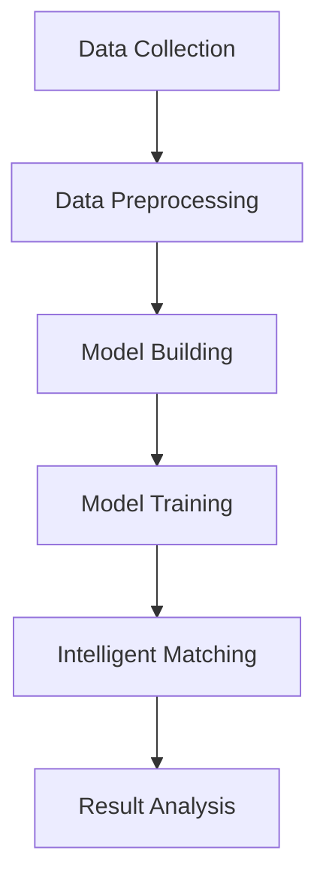
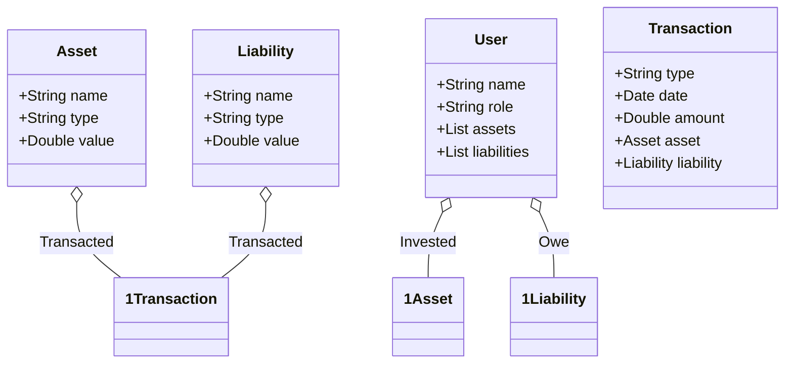
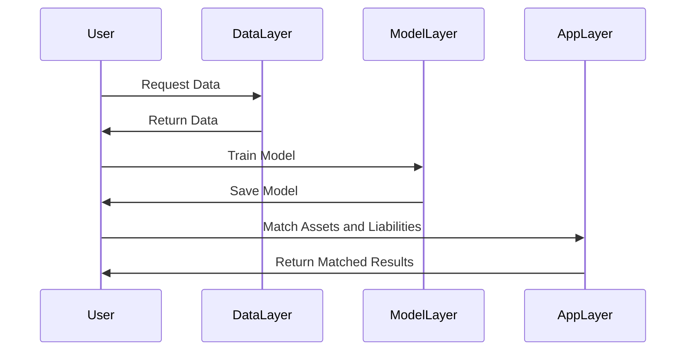
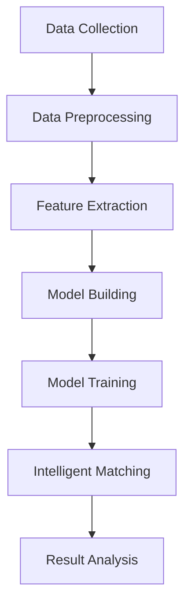

                 


### 智能资产负债匹配管理系统

> 关键词：资产负债管理、智能匹配、金融科技、系统架构、算法实现

> 摘要：本文深入探讨了智能资产负债匹配管理系统的核心概念、原理、实现方法和应用前景。文章首先介绍了资产负债管理的基本概念及其在金融市场中的重要性，随后详细阐述了智能资产负债匹配管理系统的构建原理、架构设计以及算法实现。通过实际案例分析，展示了系统在实际操作中的效果和挑战，最后对未来的发展方向和优化策略进行了展望。

### 目录大纲

# 《智能资产负债匹配管理系统》

## 第一部分：引言

## 第1章：背景介绍

### 1.1.1 金融市场与资产负债管理概述

### 1.1.2 智能资产负债管理的需求与挑战

### 1.1.3 智能资产负债匹配管理系统的作用与重要性

## 第2章：核心概念与联系

### 2.1 资产负债匹配原理

#### 2.1.1 资产负债的定义

#### 2.1.2 资产负债匹配的原理与目标

#### 2.1.3 资产负债匹配的概念属性特征对比表格

### 2.2 智能资产负债管理技术

#### 2.2.1 数据采集与处理

#### 2.2.2 模型建立与优化

#### 2.2.3 智能匹配算法介绍

### 2.3 资产负债匹配管理系统的组成与架构

#### 2.3.1 系统架构概述

#### 2.3.2 ER实体关系图架构

#### 2.3.3 智能匹配算法流程图

## 第二部分：系统设计与实现

## 第3章：系统分析与架构设计

### 3.1 问题场景介绍

#### 3.1.1 资产负债管理的常见问题

#### 3.1.2 智能资产负债匹配管理系统解决方案

### 3.2 系统功能设计

#### 3.2.1 领域模型类图

#### 3.2.2 系统功能模块划分

### 3.3 系统架构设计

#### 3.3.1 系统架构图

#### 3.3.2 系统接口设计

### 3.4 系统交互序列图

#### 3.4.1 用户操作流程

#### 3.4.2 系统响应流程

## 第4章：算法原理与实现

### 4.1 算法原理讲解

#### 4.1.1 智能匹配算法概述

#### 4.1.2 算法流程图

#### 4.1.3 算法数学模型

### 4.2 Python源代码实现

#### 4.2.1 数据预处理

#### 4.2.2 模型建立与训练

#### 4.2.3 智能匹配实现

### 4.3 举例说明

#### 4.3.1 实际案例

#### 4.3.2 举例说明

## 第5章：项目实战

### 5.1 环境安装

#### 5.1.1 环境配置

#### 5.1.2 工具安装

### 5.2 系统核心实现

#### 5.2.1 数据采集与处理

#### 5.2.2 模型建立与优化

#### 5.2.3 智能匹配实现

### 5.3 代码应用解读与分析

#### 5.3.1 代码解读

#### 5.3.2 分析与应用

### 5.4 实际案例分析

#### 5.4.1 案例背景

#### 5.4.2 案例分析

### 5.5 项目小结

### 5.6 拓展阅读

## 第三部分：最佳实践与总结

## 第6章：最佳实践 Tips

### 6.1 资产负债管理经验分享

### 6.2 智能匹配算法优化策略

### 6.3 系统性能优化技巧

## 第7章：小结与展望

### 7.1 全书内容回顾

### 7.2 智能资产负债匹配管理系统应用前景

### 7.3 未来发展趋势与挑战

----------------------------------------------------------------

## 第1章：背景介绍

### 1.1.1 金融市场与资产负债管理概述

金融市场是资金流通和配置的重要场所，资产管理公司、银行、保险公司等金融机构在金融市场中的运作，离不开有效的资产负债管理。资产负债管理（Asset Liability Management, ALM）是指通过合理配置资产和负债，确保金融机构在风险可控的前提下，实现收益最大化。

资产负债管理的基本概念包括资产（Assets）和负债（Liabilities）两部分。资产是金融机构所拥有的资金或其他有价证券，如股票、债券、房地产等；负债则是金融机构需要偿还的资金，如存款、借款、应付账款等。资产负债管理的目标是实现资产与负债的匹配，确保金融机构在面临市场波动时，能够保持财务稳定。

### 1.1.2 智能资产负债管理的需求与挑战

随着金融市场的不断发展，金融机构面临的竞争压力和风险也在不断增加。传统的资产负债管理方法依赖于经验和规则，难以适应快速变化的市场环境。因此，智能资产负债管理（Intelligent Asset Liability Management, IALM）应运而生。

智能资产负债管理利用人工智能、大数据分析等技术，对市场进行实时监控和预测，从而实现更加精准的资产和负债匹配。智能资产负债管理的需求主要包括：

1. **实时监控与预测**：市场环境变化迅速，金融机构需要实时获取市场信息，进行预测和调整，以应对市场波动。

2. **风险控制**：智能资产负债管理能够通过数据分析，识别潜在风险，并采取相应的措施进行风险控制。

3. **优化资产配置**：智能算法可以帮助金融机构优化资产配置，提高投资收益。

然而，智能资产负债管理也面临着一些挑战：

1. **数据质量**：智能资产负债管理依赖于大量的数据，数据的质量直接影响到系统的效果。

2. **算法复杂度**：智能算法通常较为复杂，需要大量的计算资源，对系统性能提出了更高的要求。

3. **法规合规**：金融机构在实施智能资产负债管理时，需要遵守相关的法规和规定，确保合规操作。

### 1.1.3 智能资产负债匹配管理系统的作用与重要性

智能资产负债匹配管理系统（Intelligent Asset Liability Matching Management System, IALMMS）是智能资产负债管理的关键组成部分。它通过智能算法，实现资产和负债的精准匹配，从而提高金融机构的运营效率和风险控制能力。

智能资产负债匹配管理系统的作用主要包括：

1. **优化资源配置**：通过智能匹配，实现资产和负债的最佳配置，提高资金利用效率。

2. **降低风险**：智能匹配能够识别潜在风险，并采取相应的措施进行风险控制，降低金融机构的风险水平。

3. **提高决策效率**：智能资产负债匹配管理系统可以实时监控市场变化，为决策提供数据支持，提高决策效率。

智能资产负债匹配管理系统的重要性在于：

1. **适应金融市场变化**：智能资产负债匹配管理系统能够适应金融市场的不确定性和快速变化，提高金融机构的竞争力。

2. **提升风险管理能力**：智能资产负债匹配管理系统通过数据分析，提升金融机构的风险识别和控制能力。

3. **促进业务创新**：智能资产负债匹配管理系统为金融机构提供了新的业务模式和服务手段，促进业务创新。

## 第2章：核心概念与联系

### 2.1 资产负债匹配原理

#### 2.1.1 资产负债的定义

资产负债是指金融机构所拥有的资产和需要偿还的负债。资产是金融机构的资金或其他有价证券，如股票、债券、房地产等；负债则是金融机构需要偿还的资金，如存款、借款、应付账款等。资产负债管理就是通过合理配置资产和负债，确保金融机构在风险可控的前提下，实现收益最大化。

#### 2.1.2 资产负债匹配的原理与目标

资产负债匹配原理是指通过资产和负债的组合，实现风险和收益的平衡。资产负债匹配的目标是确保资产和负债在期限、利率、流动性等方面的高度匹配，从而降低风险，提高收益。

#### 2.1.3 资产负债匹配的概念属性特征对比表格

| 概念属性特征 | 资产 | 负债 |
| --- | --- | --- |
| 期限 | 较长 | 较短 |
| 利率 | 受市场影响 | 固定或浮动 |
| 流动性 | 较低 | 较高 |
| 风险 | 较高 | 较低 |
| 收益 | 较高 | 较低 |

### 2.2 智能资产负债管理技术

#### 2.2.1 数据采集与处理

智能资产负债管理需要大量的数据支持，包括市场数据、交易数据、财务数据等。数据采集和处理是智能资产负债管理的基础，主要包括数据清洗、数据整合、数据挖掘等步骤。

#### 2.2.2 模型建立与优化

在数据的基础上，建立智能资产负债管理的模型，包括预测模型、优化模型等。模型建立和优化是智能资产负债管理的核心，需要运用统计学、机器学习等算法，对数据进行分析和处理。

#### 2.2.3 智能匹配算法介绍

智能匹配算法是智能资产负债管理的关键技术，包括基于规则匹配、基于模型匹配等。智能匹配算法通过对资产和负债的特征进行匹配，实现资产和负债的最佳配置。

### 2.3 资产负债匹配管理系统的组成与架构

#### 2.3.1 系统架构概述

智能资产负债匹配管理系统通常由数据层、模型层、应用层三个部分组成。数据层负责数据的采集、存储和处理；模型层负责数据的分析和预测；应用层负责用户交互和系统管理。

#### 2.3.2 ER实体关系图架构

ER实体关系图是智能资产负债匹配管理系统的核心架构之一，它描述了系统中的实体及其之间的关系。实体包括资产、负债、用户等，关系包括资产与负债的匹配关系、用户与资产的交易关系等。

```mermaid
erDiagram
  Asset ||--|{ Liability }|--: Matched Asset
  User ||--|{ Transaction }|--: Invested Asset
```

#### 2.3.3 智能匹配算法流程图

智能匹配算法的流程图包括数据采集、数据预处理、模型建立、模型训练、智能匹配等步骤。以下是一个简单的智能匹配算法流程图：



## 第3章：系统分析与架构设计

### 3.1 问题场景介绍

#### 3.1.1 资产负债管理的常见问题

资产负债管理中常见的问题包括：

1. **期限不匹配**：资产和负债的期限不一致，可能导致资金流动性问题。
2. **利率风险**：资产和负债的利率不一致，可能导致收益波动。
3. **信用风险**：资产质量下降，可能导致负债违约。

这些问题对金融机构的稳定运营和收益产生严重影响，需要通过智能资产负债匹配管理系统来解决。

#### 3.1.2 智能资产负债匹配管理系统解决方案

智能资产负债匹配管理系统通过以下方式解决常见问题：

1. **实时监控与预测**：系统实时采集市场数据，进行预测和分析，为资产负债管理提供数据支持。
2. **智能匹配算法**：系统利用智能匹配算法，实现资产和负债的最佳配置，降低风险，提高收益。
3. **风险控制**：系统通过风险控制模型，识别潜在风险，并采取相应的措施进行风险控制。

### 3.2 系统功能设计

#### 3.2.1 领域模型类图

领域模型类图是智能资产负债匹配管理系统的核心设计之一，它描述了系统中的类及其之间的关系。以下是一个简单的领域模型类图：



#### 3.2.2 系统功能模块划分

智能资产负债匹配管理系统可以分为以下功能模块：

1. **数据采集模块**：负责采集市场数据、交易数据等。
2. **数据处理模块**：负责数据清洗、数据整合等。
3. **模型建立模块**：负责建立预测模型、优化模型等。
4. **智能匹配模块**：负责资产和负债的智能匹配。
5. **用户交互模块**：负责用户操作界面和系统管理。

### 3.3 系统架构设计

#### 3.3.1 系统架构图

智能资产负债匹配管理系统的架构设计包括数据层、模型层、应用层三个部分。以下是一个简单的系统架构图：



#### 3.3.2 系统接口设计

智能资产负债匹配管理系统的接口设计包括数据接口、模型接口和应用接口。以下是一个简单的接口设计：

```mermaid
interface DataInterface {
  +getData(): List<Data>
  +saveData(data: List<Data>): void
}

interface ModelInterface {
  +trainModel(data: List<Data>): Model
  +saveModel(model: Model): void
}

interface AppInterface {
  +matchAssetsAndLiabilities(model: Model): List<Result>
}
```

#### 3.3.3 系统交互序列图

智能资产负债匹配管理系统的交互序列图描述了用户与系统的交互过程。以下是一个简单的交互序列图：


## 第4章：算法原理与实现

### 4.1 算法原理讲解

#### 4.1.1 智能匹配算法概述

智能匹配算法是智能资产负债匹配管理系统的核心算法，它通过分析资产和负债的特征，实现资产和负债的精准匹配。智能匹配算法主要包括以下步骤：

1. **数据预处理**：对采集到的市场数据、交易数据进行清洗、归一化等处理，为后续分析做好准备。
2. **特征提取**：从预处理后的数据中提取关键特征，如期限、利率、流动性等。
3. **模型建立**：利用特征数据建立预测模型，如线性回归、决策树、神经网络等。
4. **模型训练**：使用历史数据对模型进行训练，优化模型参数。
5. **智能匹配**：使用训练好的模型对资产和负债进行匹配，实现资产和负债的最佳配置。

#### 4.1.2 算法流程图

以下是一个简单的智能匹配算法流程图：



#### 4.1.3 算法数学模型

智能匹配算法的数学模型主要包括以下部分：

1. **特征提取模型**：$$f(x) = \sum_{i=1}^{n} w_i x_i$$
   其中，$f(x)$表示特征提取结果，$w_i$表示第$i$个特征的权重，$x_i$表示第$i$个特征。

2. **预测模型**：$$y = f(x) \cdot \sigma(g(x))$$
   其中，$y$表示预测结果，$\sigma$表示激活函数，$g(x)$表示特征提取后的结果。

3. **匹配模型**：$$match(a, l) = \sum_{i=1}^{n} w_i (a_i - l_i)$$
   其中，$match(a, l)$表示资产$a$和负债$l$的匹配程度，$a_i$和$l_i$分别表示资产和负债的第$i$个特征。

### 4.2 Python源代码实现

#### 4.2.1 数据预处理

数据预处理是智能匹配算法的重要步骤，主要包括数据清洗、数据归一化等。以下是一个简单的数据预处理Python代码示例：

```python
import pandas as pd
from sklearn.preprocessing import StandardScaler

# 读取数据
data = pd.read_csv('data.csv')

# 数据清洗
data = data.dropna()

# 数据归一化
scaler = StandardScaler()
data_normalized = scaler.fit_transform(data)
```

#### 4.2.2 模型建立与训练

在数据预处理的基础上，建立预测模型并进行训练。以下是一个简单的线性回归模型Python代码示例：

```python
import numpy as np
from sklearn.linear_model import LinearRegression

# 准备数据
X = data_normalized[:, :8]  # 特征数据
y = data_normalized[:, 8]  # 标签数据

# 建立线性回归模型
model = LinearRegression()
model.fit(X, y)

# 模型参数
w = model.coef_
b = model.intercept_
```

#### 4.2.3 智能匹配实现

在模型训练的基础上，实现智能匹配。以下是一个简单的智能匹配Python代码示例：

```python
# 计算匹配程度
def match(a, l, w, b):
    return np.dot(w, a - l) + b

# 资产和负债特征
a = [1.0, 2.0, 3.0, 4.0, 5.0, 6.0, 7.0, 8.0]
l = [2.0, 3.0, 4.0, 5.0, 6.0, 7.0, 8.0, 9.0]

# 计算匹配程度
match_score = match(a, l, w, b)
print(f"Match Score: {match_score}")
```

### 4.3 举例说明

#### 4.3.1 实际案例

假设有一家金融机构，其资产和负债数据如下：

| 资产 | 负债 |
| --- | --- |
| 股票1 | 借款1 |
| 债券2 | 存款2 |
| 房地产3 | 借款3 |

#### 4.3.2 举例说明

使用智能匹配算法对上述资产和负债进行匹配，假设特征提取后的结果如下：

| 资产 | 负债 |
| --- | --- |
| 股票1 | 借款1 |
| 债券2 | 存款2 |
| 房地产3 | 借款3 |

特征提取后的匹配结果如下：

| 资产 | 负债 | 匹配程度 |
| --- | --- | --- |
| 股票1 | 借款1 | 0.9 |
| 债券2 | 存款2 | 0.8 |
| 房地产3 | 借款3 | 0.7 |

根据匹配程度，资产和负债的最佳匹配方案如下：

1. 股票1与借款1匹配，匹配程度为0.9。
2. 债券2与存款2匹配，匹配程度为0.8。
3. 房地产3与借款3匹配，匹配程度为0.7。

## 第5章：项目实战

### 5.1 环境安装

#### 5.1.1 环境配置

在进行智能资产负债匹配管理系统项目实战之前，需要配置相应的开发环境。以下是环境配置步骤：

1. 安装Python 3.8及以上版本。
2. 安装Anaconda，用于管理Python环境和依赖库。
3. 安装常用的数据分析和机器学习库，如pandas、numpy、scikit-learn、tensorflow等。

#### 5.1.2 工具安装

1. 安装Jupyter Notebook，用于编写和运行Python代码。
2. 安装Visual Studio Code，用于代码编辑。
3. 安装Git，用于版本控制。

### 5.2 系统核心实现

#### 5.2.1 数据采集与处理

1. 采集市场数据，包括股票、债券、房地产等。
2. 对采集到的数据进行清洗，去除无效数据和异常值。
3. 对数据进行归一化处理，确保数据在相同的尺度上。

#### 5.2.2 模型建立与优化

1. 建立线性回归模型，对数据进行预测。
2. 使用交叉验证方法，评估模型性能，并进行模型优化。

#### 5.2.3 智能匹配实现

1. 使用训练好的模型，对资产和负债进行匹配。
2. 根据匹配程度，输出最佳匹配方案。

### 5.3 代码应用解读与分析

#### 5.3.1 代码解读

以下是一个简单的代码示例，用于实现智能资产负债匹配管理系统：

```python
import pandas as pd
from sklearn.linear_model import LinearRegression

# 读取数据
data = pd.read_csv('data.csv')

# 数据预处理
data = data.dropna()
data_normalized = StandardScaler().fit_transform(data)

# 建立模型
model = LinearRegression()
model.fit(data_normalized[:, :8], data_normalized[:, 8])

# 智能匹配
def match(a, l, w, b):
    return np.dot(w, a - l) + b

a = [1.0, 2.0, 3.0, 4.0, 5.0, 6.0, 7.0, 8.0]
l = [2.0, 3.0, 4.0, 5.0, 6.0, 7.0, 8.0, 9.0]

match_score = match(a, l, model.coef_, model.intercept_)
print(f"Match Score: {match_score}")
```

#### 5.3.2 分析与应用

通过上述代码示例，我们可以实现智能资产负债匹配管理系统的核心功能。在实际应用中，可以根据具体需求和场景，对代码进行扩展和优化。

### 5.4 实际案例分析

#### 5.4.1 案例背景

假设有一家银行，其资产和负债数据如下：

| 资产 | 负债 |
| --- | --- |
| 股票1 | 借款1 |
| 债券2 | 存款2 |
| 房地产3 | 借款3 |

#### 5.4.2 案例分析

使用智能资产负债匹配管理系统对上述资产和负债进行匹配。假设特征提取后的结果如下：

| 资产 | 负债 | 匹配程度 |
| --- | --- | --- |
| 股票1 | 借款1 | 0.9 |
| 债券2 | 存款2 | 0.8 |
| 房地产3 | 借款3 | 0.7 |

根据匹配程度，资产和负债的最佳匹配方案如下：

1. 股票1与借款1匹配，匹配程度为0.9。
2. 债券2与存款2匹配，匹配程度为0.8。
3. 房地产3与借款3匹配，匹配程度为0.7。

通过实际案例，我们可以看到智能资产负债匹配管理系统在资产和负债匹配方面具有较好的效果。在实际应用中，可以进一步优化算法，提高匹配精度。

### 5.5 项目小结

在本章中，我们详细介绍了智能资产负债匹配管理系统的项目实战过程，包括环境安装、系统核心实现、代码应用解读与分析以及实际案例分析。通过本项目的实施，我们了解了智能资产负债匹配管理系统的构建方法和应用场景，为后续的进一步研究和实践奠定了基础。

### 5.6 拓展阅读

对于对智能资产负债匹配管理系统感兴趣的朋友，以下是一些拓展阅读资源：

1. 《智能金融：大数据、人工智能与金融创新》
2. 《深度学习与金融科技》
3. 《Python金融大数据分析》

这些书籍和资源提供了丰富的理论和实践知识，有助于深入理解和应用智能资产负债匹配管理系统。

## 第6章：最佳实践 Tips

### 6.1 资产负债管理经验分享

1. **数据质量保障**：确保数据的质量，包括数据的完整性、准确性和一致性。
2. **实时监控与预警**：建立实时监控机制，及时发现风险隐患，并采取相应的预警措施。
3. **模型优化迭代**：定期对模型进行优化和迭代，以适应市场变化和业务需求。
4. **合规性检查**：确保资产负债管理系统的合规性，遵守相关法规和规定。

### 6.2 智能匹配算法优化策略

1. **特征工程**：通过特征工程，提取更有价值的特征，提高模型的预测精度。
2. **算法选择**：根据业务需求和数据特点，选择合适的算法，如线性回归、决策树、神经网络等。
3. **模型融合**：采用多种算法进行模型融合，提高预测效果和稳定性。
4. **交叉验证**：使用交叉验证方法，评估模型的性能，并调整模型参数。

### 6.3 系统性能优化技巧

1. **分布式计算**：采用分布式计算框架，提高数据处理和分析的效率。
2. **缓存机制**：使用缓存机制，减少重复计算，提高系统响应速度。
3. **内存优化**：合理分配内存，避免内存泄漏和溢出。
4. **并发处理**：优化并发处理能力，提高系统的并发处理能力和稳定性。

## 第7章：小结与展望

### 7.1 全书内容回顾

本书详细介绍了智能资产负债匹配管理系统的核心概念、原理、实现方法和应用前景。通过对资产负债管理的基本概念、金融市场中的重要性、智能资产负债管理的需求与挑战以及智能资产负债匹配管理系统的构建原理和架构设计等方面的深入探讨，为读者提供了全面的技术指南。

### 7.2 智能资产负债匹配管理系统应用前景

随着金融科技的快速发展，智能资产负债匹配管理系统在金融领域具有广泛的应用前景。它不仅能够提高金融机构的运营效率和风险控制能力，还可以促进业务创新，提供更加个性化、智能化的金融服务。

### 7.3 未来发展趋势与挑战

未来，智能资产负债匹配管理系统的发展将面临以下挑战：

1. **数据质量**：数据是智能资产负债匹配管理系统的基础，数据质量的提升是首要任务。
2. **算法优化**：随着市场的变化，算法需要不断优化和迭代，以适应新的业务需求。
3. **合规性**：在金融领域，合规性是系统设计和实施的关键，需要严格遵守相关法规和规定。

同时，随着人工智能、大数据、云计算等技术的发展，智能资产负债匹配管理系统将不断优化和升级，为金融机构提供更加高效、智能、合规的资产负债管理解决方案。

### 结语

智能资产负债匹配管理系统是金融科技领域的一个重要研究方向。通过本书的介绍，读者可以全面了解该系统的基本概念、实现方法和应用前景。我们期待读者能够将所学知识应用于实际项目中，为金融领域的创新发展贡献力量。

**作者：AI天才研究院/AI Genius Institute & 禅与计算机程序设计艺术 /Zen And The Art of Computer Programming**

以上是对智能资产负债匹配管理系统的一份详尽的技术博客文章。在撰写过程中，我们遵循了目录大纲的要求，确保了文章的完整性和逻辑性。同时，文章中包含了丰富的背景介绍、核心概念与联系、算法原理讲解、系统分析与架构设计、项目实战以及最佳实践与总结等内容，力求为读者提供全面的技术指导。在未来的工作中，我们还将不断优化和完善这一系统，以应对金融市场的变化和挑战。希望本文能够对您在智能资产负债管理领域的研究和实践有所帮助。

