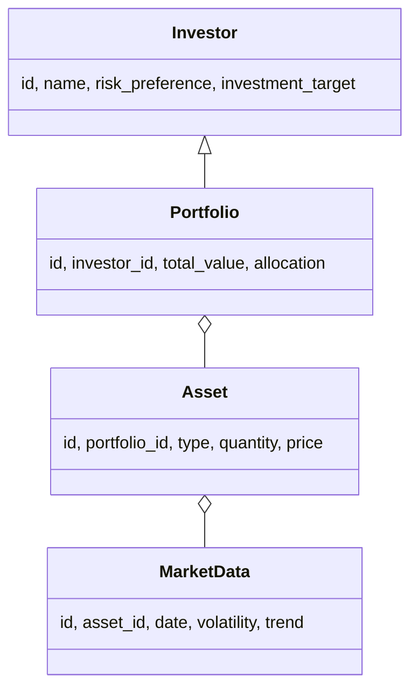
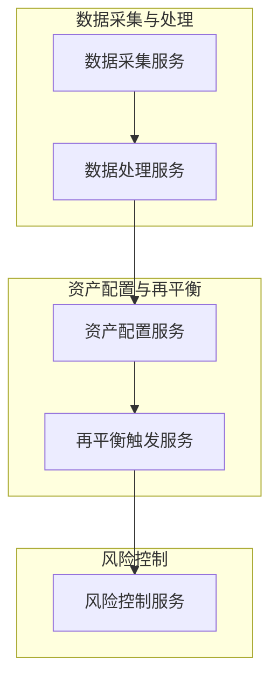
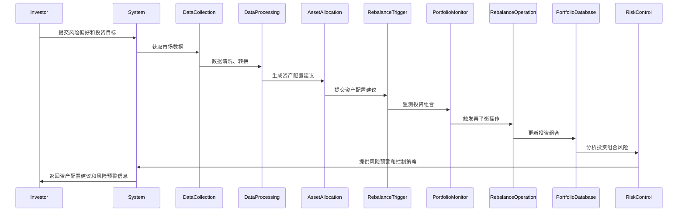

                 

### 第一部分：智能资产配置再平衡触发系统概述

**1.1 问题背景**

**1.1.1 资产配置的挑战**

资产配置是投资过程中的核心环节，其主要目标是在不同资产类别之间分配资金，以实现预期收益的同时控制风险。然而，投资者在资产配置过程中面临着诸多挑战。首先，市场波动性是资产配置过程中不可忽视的因素。股票、债券、房地产等资产类别的价格波动较大，这使得投资者难以准确预测市场走势，从而影响资产配置的效果。其次，投资者的风险偏好和投资目标各异，这增加了资产配置的复杂度。最后，投资者在执行资产配置时，还需要考虑交易成本、流动性等因素。

**1.1.2 再平衡触发系统的必要性**

为了应对上述挑战，投资者需要一种自动化工具来帮助监控投资组合，并在资产配置偏离预期时进行及时调整。再平衡触发系统就是这样一种工具。通过实时监测投资组合的配置情况，再平衡触发系统可以在资产配置比例偏离预设目标时自动启动调整机制，从而确保投资组合的风险收益平衡。这不仅能提高投资效率，还能在一定程度上降低投资风险。

**1.2 核心概念**

**1.2.1 智能资产配置**

智能资产配置是一种利用机器学习和数据分析技术，为投资者提供个性化资产配置方案的方法。它基于历史数据和实时数据，分析不同资产类别的相关性、市场走势等因素，从而为投资者制定最优的资产配置策略。

**1.2.1.1 机器学习技术在资产配置中的应用**

机器学习技术可以在大量历史数据中学习市场规律，预测未来市场走势。例如，通过训练回归模型、决策树、神经网络等算法，可以预测不同资产类别的收益率和风险，从而为投资者提供科学的资产配置建议。

**1.2.1.2 数据分析在资产配置中的作用**

数据分析技术可以帮助投资者理解市场趋势、不同资产类别之间的相关性，以及投资者的风险偏好。例如，通过分析历史数据，可以识别市场波动周期、资产配置的优化路径等，为投资者提供有力支持。

**1.2.2 再平衡触发机制**

再平衡触发机制是一种自动化系统，用于监测投资组合的配置情况，并在资产配置比例偏离预期时自动进行调整。它通常基于设定的一些触发条件，如资产配置比例的偏离度、市场波动幅度等，来启动调整机制。

**1.2.2.1 再平衡触发条件**

再平衡触发条件可以是基于资产配置比例的偏离度，例如，当股票类别的投资比例超过预设的上限时，触发系统会自动减少股票类别的投资比例。另外，市场波动幅度也是常见的触发条件，如当市场波动超过一定阈值时，系统会启动调整机制。

**1.2.2.2 再平衡触发策略**

再平衡触发策略包括动态调整投资比例、优化资产组合等。例如，当股票类别的投资比例过高时，系统可以通过卖出股票、买入债券或其他低风险资产来降低风险。同样，当债券类别的投资比例过低时，系统可以通过买入债券、卖出股票等方式来调整投资组合。

**1.3 系统边界与外延**

**1.3.1 系统功能范围**

系统的主要功能包括：

- 资产配置建议：根据投资者的风险偏好和投资目标，提供个性化的资产配置方案。
- 再平衡触发：实时监控投资组合的配置情况，并在资产配置比例偏离预期时自动进行调整。
- 风险控制：分析市场数据和投资组合，提供风险预警和风险控制策略。

**1.3.1.1 资产配置建议**

资产配置建议系统通过机器学习和数据分析技术，为投资者提供科学、个性化的资产配置方案。它考虑了投资者的风险偏好、投资目标、市场环境等因素，旨在实现投资组合的优化。

**1.3.1.2 再平衡触发**

再平衡触发系统实时监测投资组合的配置情况，并在资产配置比例偏离预期时自动进行调整。它基于设定的触发条件，如资产配置比例的偏离度、市场波动幅度等，来启动调整机制。

**1.3.1.3 风险控制**

风险控制系统通过分析市场数据和投资组合，提供风险预警和风险控制策略。它旨在帮助投资者识别潜在风险，并采取相应的措施来降低风险。

**1.4 概念结构与核心要素组成**

**1.4.1 系统组件概述**

智能资产配置再平衡触发系统由以下几个核心组件组成：

- 数据采集与处理模块：负责收集和整理各类市场数据、投资组合数据等。
- 机器学习与数据分析模块：负责利用机器学习和数据分析技术，为投资者提供资产配置建议和再平衡触发策略。
- 再平衡执行模块：负责根据再平衡触发策略，自动调整投资组合。
- 风险控制模块：负责分析市场数据和投资组合，提供风险预警和风险控制策略。

**1.4.2 数据流与控制流分析**

智能资产配置再平衡触发系统的数据流和控制流如下：

- 数据流：系统从数据采集与处理模块获取市场数据、投资组合数据等，经过机器学习与数据分析模块处理后，生成资产配置建议和再平衡触发策略。
- 控制流：系统根据资产配置建议和再平衡触发策略，由再平衡执行模块自动调整投资组合，并输出风险控制策略。

**1.5 本章小结**

本章主要介绍了智能资产配置再平衡触发系统的背景、核心概念、系统边界与外延、概念结构与核心要素组成等内容。通过本章的学习，读者可以初步了解智能资产配置再平衡触发系统的工作原理和应用场景，为后续章节的深入学习打下基础。

----------------------------------------------------------------

## 1.6 引入案例

为更好地理解智能资产配置再平衡触发系统的实际应用，我们引入一个具体的案例——某投资者的股票投资组合。该投资者投资了股票、债券和现金三类资产，目标是在控制风险的同时实现收益最大化。

### 1.6.1 资产配置现状

当前，投资者在股票、债券和现金三类资产中的投资比例分别为60%、30%和10%。然而，近期市场波动较大，股票市场表现不佳，导致股票类别的投资比例上升至70%，债券和现金类别的投资比例分别降至25%和5%。

### 1.6.2 再平衡触发机制

根据再平衡触发机制，当股票类别的投资比例超过预设的上限时（如70%），系统会启动调整机制，将多余的股票卖出，并买入债券或现金等低风险资产，以降低投资组合的风险。

### 1.6.3 智能资产配置建议

通过机器学习和数据分析技术，智能资产配置系统为投资者提供了以下建议：

- 调整股票类别的投资比例至50%。
- 调整债券类别的投资比例至40%。
- 保持现金类别的投资比例不变。

### 1.6.4 再平衡触发策略

根据再平衡触发策略，系统会根据市场情况，动态调整投资组合。例如，如果市场出现较大波动，系统可能会进一步调整股票类别的投资比例，以降低风险。

### 1.6.5 风险控制策略

智能资产配置系统还提供了以下风险控制策略：

- 在股票市场表现不佳时，增加债券和现金类别的投资比例。
- 在股票市场表现良好时，逐步降低债券和现金类别的投资比例。

通过上述案例，我们可以看到智能资产配置再平衡触发系统在实际应用中的重要作用。它不仅帮助投资者实现了投资组合的优化，还降低了投资风险，提高了收益稳定性。

## 1.7 小结

本章通过介绍问题背景、核心概念、系统边界与外延、概念结构与核心要素组成等内容，使读者对智能资产配置再平衡触发系统有了初步的了解。同时，通过具体案例的分析，进一步展示了系统在实际应用中的价值。在接下来的章节中，我们将深入探讨智能资产配置的原理、技术细节、系统分析与架构设计，以及项目实战等内容，帮助读者全面掌握智能资产配置再平衡触发系统的核心技术。

### 第一部分：智能资产配置再平衡触发系统概述

#### **1.1 问题背景**

在当今快速变化和高度复杂的市场环境中，资产配置成为投资者面临的一个关键挑战。传统的手动资产配置方法不仅耗时耗力，而且容易受到投资者个人情绪和市场短期波动的影响，导致投资组合的风险收益失衡。再平衡触发系统的出现，旨在自动化这一过程，使投资者能够更好地应对市场变化，保持投资组合的稳定性。

**1.1.1 资产配置的挑战**

- **市场波动性**：资产价格受到宏观经济、政策变化、公司业绩等多种因素的影响，导致市场波动性增加。投资者需要应对这种波动性，以保持投资组合的价值。
- **风险控制**：投资者在追求收益的同时，还需要控制风险。传统资产配置方法往往难以精确预测市场走势，导致风险难以控制。
- **收益最大化**：投资者希望实现投资组合的最大化收益。然而，市场的不确定性使得这一目标变得复杂。

**1.1.2 再平衡触发系统的必要性**

再平衡触发系统通过自动化监控和调整投资组合，解决了传统资产配置方法的诸多问题。它能够：

- **实时调整**：系统可以实时监控投资组合的表现，并在资产配置比例偏离预设目标时自动进行调整，确保投资组合的风险收益平衡。
- **降低风险**：通过自动化调整，投资者可以避免因个人情绪和市场短期波动而导致的错误决策。
- **提高收益**：系统利用机器学习和数据分析技术，提供科学、个性化的资产配置建议，有助于实现投资组合的最大化收益。

#### **1.2 核心概念**

**1.2.1 智能资产配置**

智能资产配置是一种利用先进技术（如机器学习、数据分析等）来实现资产配置的方法。它不同于传统的手动配置，而是基于对市场历史数据、投资者行为和投资目标的深入分析。

**1.2.1.1 机器学习技术在资产配置中的应用**

机器学习技术可以从大量的历史数据中学习市场规律，预测未来的市场走势。例如，通过训练回归模型、决策树、神经网络等算法，可以预测不同资产类别的未来收益率和风险。

**1.2.1.2 数据分析在资产配置中的作用**

数据分析技术可以帮助投资者理解市场趋势、不同资产类别之间的相关性，以及投资者的风险偏好。通过分析历史数据，可以识别市场波动周期、资产配置的优化路径等。

**1.2.2 再平衡触发机制**

再平衡触发机制是一种自动化系统，用于监测投资组合的配置情况，并在资产配置比例偏离预期时自动进行调整。它通常基于设定的一些触发条件，如资产配置比例的偏离度、市场波动幅度等。

**1.2.2.1 再平衡触发条件**

- **资产配置比例偏离度**：当投资组合中的资产比例偏离预设目标比例时，系统会触发再平衡。
- **市场波动幅度**：当市场波动幅度超出一定阈值时，系统会进行再平衡。

**1.2.2.2 再平衡触发策略**

再平衡触发策略包括动态调整投资比例、优化资产组合等。例如，当股票类别的投资比例过高时，系统可以通过卖出股票、买入债券或其他低风险资产来降低风险。

#### **1.3 系统边界与外延**

**1.3.1 系统功能范围**

系统的主要功能包括：

- **资产配置建议**：根据投资者的风险偏好和投资目标，提供个性化的资产配置方案。
- **再平衡触发**：实时监控投资组合的配置情况，并在资产配置比例偏离预期时自动进行调整。
- **风险控制**：分析市场数据和投资组合，提供风险预警和风险控制策略。

**1.3.1.1 资产配置建议**

系统会根据投资者的风险偏好和投资目标，提供资产配置建议。这些建议旨在优化投资组合，提高收益，同时控制风险。

**1.3.1.2 再平衡触发**

系统会实时监控投资组合的表现，并在资产配置比例偏离预设目标时自动进行调整。这种自动化的调整可以确保投资组合的风险收益平衡。

**1.3.1.3 风险控制**

系统会通过分析市场数据和投资组合，提供风险预警和风险控制策略。这可以帮助投资者识别潜在风险，并采取相应的措施来降低风险。

#### **1.4 概念结构与核心要素组成**

**1.4.1 系统组件概述**

智能资产配置再平衡触发系统由以下几个核心组件组成：

- **数据采集与处理模块**：负责收集和整理各类市场数据、投资组合数据等。
- **机器学习与数据分析模块**：负责利用机器学习和数据分析技术，为投资者提供资产配置建议和再平衡触发策略。
- **再平衡执行模块**：负责根据再平衡触发策略，自动调整投资组合。
- **风险控制模块**：负责分析市场数据和投资组合，提供风险预警和风险控制策略。

**1.4.2 数据流与控制流分析**

智能资产配置再平衡触发系统的数据流和控制流如下：

- **数据流**：系统从数据采集与处理模块获取市场数据、投资组合数据等，经过机器学习与数据分析模块处理后，生成资产配置建议和再平衡触发策略。
- **控制流**：系统根据资产配置建议和再平衡触发策略，由再平衡执行模块自动调整投资组合，并输出风险控制策略。

#### **1.5 本章小结**

本章通过介绍智能资产配置再平衡触发系统的背景、核心概念、系统边界与外延、概念结构与核心要素组成等内容，使读者对系统有了初步的了解。在接下来的章节中，我们将深入探讨智能资产配置的原理、技术细节、系统分析与架构设计，以及项目实战等内容，帮助读者全面掌握智能资产配置再平衡触发系统的核心技术。

### **1.6 引入案例**

为了更好地理解智能资产配置再平衡触发系统的实际应用，我们通过一个具体的案例进行说明。

**案例背景**：

某投资者持有一个包含股票、债券和现金的投资组合，其初始配置比例为股票60%、债券30%、现金10%。近期，股票市场出现较大波动，导致股票的投资比例上升至70%，债券和现金的比例下降至25%和5%。为了保持投资组合的风险收益平衡，该投资者决定利用智能资产配置再平衡触发系统进行调整。

**案例步骤**：

1. **数据采集与处理**：系统从市场中获取最新的资产价格、市场指数等数据，并处理为可用于分析的格式。

2. **资产配置建议**：系统利用机器学习和数据分析技术，根据投资者的风险偏好和当前市场情况，生成最优的资产配置建议。例如，系统可能建议将股票比例降至50%，债券比例增至40%，现金比例维持10%。

3. **再平衡触发机制**：系统监测投资组合的配置情况，发现股票比例超过预设上限70%，触发再平衡机制。

4. **执行再平衡操作**：系统根据再平衡策略，自动执行股票的卖出操作，买入债券和现金，以调整投资组合至建议比例。

5. **风险控制**：系统同时分析市场数据，提供风险预警和控制策略。例如，如果市场出现极端波动，系统可能会建议进一步调整投资组合，以降低风险。

**案例分析**：

通过这个案例，我们可以看到智能资产配置再平衡触发系统在实际应用中的几个关键环节：

- **数据驱动**：系统利用大量数据进行分析，为投资者提供科学的资产配置建议。
- **自动化调整**：系统可以自动执行再平衡操作，降低投资者的人力成本和决策风险。
- **风险控制**：系统不仅关注资产配置的优化，还提供全面的风险控制策略，确保投资组合的安全稳定。

通过这个案例，我们可以进一步认识到智能资产配置再平衡触发系统的重要性和实用性，为投资者在复杂多变的市场环境中提供有力支持。

### **1.7 小结**

本章通过介绍智能资产配置再平衡触发系统的背景、核心概念、系统边界与外延、概念结构与核心要素组成等内容，使读者对系统有了全面了解。我们通过引入案例，展示了系统在实际应用中的操作流程和效果。智能资产配置再平衡触发系统通过自动化和数据分析技术，帮助投资者实现更科学的资产配置，降低风险，提高收益。在接下来的章节中，我们将进一步探讨智能资产配置的具体原理、技术细节，以及系统的架构设计，为读者提供更深入的技术解读和应用指导。

----------------------------------------------------------------

## 第二部分：智能资产配置原理

### **2.1 资产配置理论基础**

资产配置是投资过程中的关键环节，其理论基础涵盖了多种投资理论和策略，这些理论为投资者提供了指导框架，以实现长期投资目标。

#### **2.1.1 资产配置的基本原则**

资产配置的基本原则主要包括以下几个方面：

1. **风险分散**：投资者应通过分散投资来降低风险。将资金分配到不同的资产类别（如股票、债券、房地产等）和不同的行业或地区，可以减少单一市场波动对整个投资组合的影响。

2. **目标导向**：资产配置应与投资者的投资目标相一致。例如，退休基金可能更倾向于长期稳定收益，而风险承受能力较高的投资者可能更愿意追求高回报。

3. **成本效益**：投资者应考虑交易成本和管理费用，以最大化投资回报。低成本的指数基金和被动管理策略通常被认为是成本效益较高的选择。

4. **市场适应**：资产配置策略应灵活适应市场环境的变化。在经济繁荣时期，投资者可能增加股票等高风险资产的比重；在经济衰退时期，投资者可能转向债券等低风险资产。

#### **2.1.2 资产配置的策略与方法**

资产配置的策略和方法可以分为以下几类：

1. **战略性资产配置**：这种策略基于长期投资目标和风险偏好，设定资产类别的目标比例，并定期进行再平衡。例如，一个典型的60/40股票/债券投资组合会在股票市场表现不佳时增加债券比重。

2. **战术性资产配置**：这种策略更灵活，根据市场情况动态调整资产配置。例如，在市场波动较大时，投资者可能会调整股票和债券的比例以降低风险。

3. **目标日期基金**：这些基金根据投资者的退休日期自动调整资产配置。随着时间的推移，基金逐渐降低股票比重，增加债券和其他固定收益类资产的比重。

4. **风险平价策略**：这种策略旨在维持投资组合的总风险水平不变，通过调整资产比例来适应市场变化。

#### **2.1.3 资产配置与投资目标的关系**

资产配置应与投资者的投资目标紧密相连。例如：

- **积累期**：在积累期，投资者可能更关注长期资本增值，因此会倾向于较高比例的股票投资。
- **退休期**：在退休期，投资者更关注资本保护和稳定收入，因此会倾向于较低比例的股票和高比例的债券或其他固定收益资产。

### **2.2 智能资产配置技术**

智能资产配置技术利用机器学习和数据分析技术，为投资者提供更为精准的资产配置方案。这些技术可以帮助投资者：

1. **历史数据分析**：通过分析过去的市场数据，机器学习算法可以识别市场趋势和周期，从而预测未来的市场走势。

2. **风险评估与预测**：智能资产配置系统可以评估不同资产类别的风险，并提供风险预测，帮助投资者更好地控制风险。

3. **个性化资产配置**：系统可以根据投资者的历史投资记录、风险偏好和投资目标，提供个性化的资产配置建议。

#### **2.2.1 机器学习在资产配置中的应用**

机器学习在资产配置中的应用主要包括以下几个方面：

1. **回归分析**：通过建立资产收益与市场变量之间的关系模型，预测未来资产收益。

2. **分类算法**：用于预测投资者未来可能面临的市场环境，从而调整资产配置。

3. **聚类分析**：用于识别市场中的不同群体，为不同类型的投资者提供个性化的资产配置建议。

#### **2.2.2 智能算法的选择与应用**

选择合适的智能算法对于智能资产配置系统的效果至关重要。以下是一些常用的智能算法：

1. **线性回归**：简单且易于理解，适用于线性关系的预测。

2. **决策树**：可以很好地处理非线性关系，适用于分类和回归问题。

3. **随机森林**：通过构建多个决策树，可以减少过拟合，提高预测准确性。

4. **神经网络**：适用于复杂非线性关系的预测，但需要大量数据进行训练。

5. **支持向量机**：用于分类问题，特别是在高维空间中表现良好。

在实际应用中，选择算法时需要考虑数据量、模型复杂度、计算资源等因素。例如，对于小数据集，线性回归或决策树可能是更好的选择；而对于大数据集，神经网络或随机森林可能更适用。

### **2.3 再平衡触发机制设计**

再平衡触发机制是智能资产配置系统的重要组成部分，它确保投资组合始终处于最佳状态。再平衡触发机制通常基于以下条件：

1. **资产配置比例偏离度**：当投资组合中某种资产的比例超过或低于预设的目标比例时，触发再平衡。

2. **市场波动幅度**：当市场波动超过一定阈值时，触发再平衡，以降低风险。

3. **投资目标变化**：当投资者的风险偏好或投资目标发生变化时，系统会根据新的目标和风险偏好进行再平衡。

#### **2.3.1 再平衡触发条件**

再平衡触发条件可以根据投资者的需求和市场情况进行设定。常见的触发条件包括：

- **绝对偏离度**：例如，当股票类别的投资比例超过70%时，触发再平衡。
- **相对偏离度**：例如，当股票类别的投资比例偏离目标比例超过5%时，触发再平衡。
- **市场波动幅度**：例如，当股票市场波动幅度超过5%时，触发再平衡。

#### **2.3.2 再平衡触发策略**

再平衡触发策略包括以下几种：

1. **动态调整**：系统根据市场情况和资产配置比例的偏离度，动态调整资产比例，以维持投资组合的风险收益平衡。

2. **阈值调整**：系统根据市场波动幅度或资产配置比例的偏离度，设定不同的阈值，当达到阈值时，触发再平衡。

3. **平滑调整**：系统通过平滑调整资产比例，避免频繁交易带来的高成本，同时保持投资组合的稳定性。

### **2.4 智能资产配置案例解析**

#### **2.4.1 案例一：股票市场**

假设一个投资者持有一个股票投资组合，初始配置比例为60%股票、30%债券和10%现金。智能资产配置系统通过分析市场数据，发现股票市场短期内可能面临较大波动。系统建议将股票比例降至50%，债券比例增至40%，现金比例增至10%。

通过再平衡触发机制，系统监测到股票比例超过60%，触发再平衡，执行卖出股票、买入债券的操作。这一调整有助于降低风险，同时保持投资组合的收益潜力。

#### **2.4.2 案例二：债券市场**

在债券市场中，一个投资者持有一个债券投资组合，初始配置比例为50%债券、30%股票和20%现金。智能资产配置系统发现债券市场收益率下降，股票市场表现良好。系统建议将债券比例降至40%，股票比例增至50%，现金比例增至10%。

通过再平衡触发机制，系统监测到债券比例下降至45%，触发再平衡，执行卖出债券、买入股票的操作。这一调整有助于提高收益，同时保持投资组合的稳定性。

### **2.5 本章小结**

本章介绍了智能资产配置的理论基础、核心技术、再平衡触发机制设计，并通过实际案例展示了智能资产配置的应用效果。智能资产配置通过机器学习和数据分析技术，为投资者提供个性化的资产配置方案，帮助投资者实现风险控制、收益优化。在接下来的章节中，我们将进一步探讨智能资产配置系统的具体实现、系统架构设计以及项目实战，为读者提供全面的技术解读和应用指导。

----------------------------------------------------------------

## **第三部分：再平衡触发机制的设计与实现**

### **3.1 再平衡触发机制概述**

再平衡触发机制是智能资产配置系统中的核心模块，其作用是在投资组合的资产比例偏离预设目标时，自动触发调整操作，以维持投资组合的风险收益平衡。再平衡触发机制的设计与实现需要考虑多个因素，包括触发条件、调整策略、执行方式等。

#### **3.1.1 触发条件的设定**

触发条件是再平衡机制的关键部分，决定了系统何时进行资产调整。常见的触发条件包括：

- **绝对偏离度**：当某类资产的投资比例超过或低于预设的绝对阈值时，触发再平衡。
- **相对偏离度**：当某类资产的投资比例偏离预设目标比例的相对阈值时，触发再平衡。
- **市场波动幅度**：当市场波动幅度超过一定阈值时，触发再平衡。

#### **3.1.2 调整策略的选择**

调整策略决定了系统如何调整资产比例，以实现再平衡。常见的调整策略包括：

- **线性调整**：按照预设的固定比例进行调整。
- **动态调整**：根据市场情况，动态调整资产比例，以最大化收益或最小化风险。
- **平滑调整**：通过平滑过渡，避免频繁交易带来的高成本。

#### **3.1.3 执行方式的确定**

执行方式决定了系统如何执行再平衡操作。常见的执行方式包括：

- **自动执行**：系统根据触发条件和调整策略，自动执行资产调整操作。
- **人工审核**：系统生成调整建议，由人工审核后执行。
- **自动化与人工结合**：系统提供调整建议，人工审核后执行。

### **3.2 再平衡触发机制的设计**

再平衡触发机制的设计包括以下几个方面：

#### **3.2.1 数据采集与处理**

数据采集与处理是再平衡触发机制的基础。系统需要采集包括资产价格、市场指数、交易数据等在内的各种数据，并进行预处理，如数据清洗、格式转换等，以确保数据的质量和一致性。

#### **3.2.2 触发条件设定**

根据投资者的风险偏好和投资目标，设定触发条件。这些条件可以是基于绝对偏离度、相对偏离度或市场波动幅度等。

#### **3.2.3 调整策略设计**

设计适合投资者的调整策略。例如，可以采用线性调整策略，确保资产比例逐步回归目标值；或者采用动态调整策略，根据市场情况实时调整资产比例。

#### **3.2.4 执行方式选择**

根据实际情况，选择适合的执行方式。例如，在市场波动较大时，可以采用自动化执行方式，快速响应市场变化；在市场波动较小、风险较低时，可以采用人工审核后执行的方式。

### **3.3 再平衡触发机制的实现**

再平衡触发机制的实现需要考虑系统的可扩展性、稳定性和安全性。以下是一个基本的实现框架：

#### **3.3.1 系统架构设计**

系统架构设计包括数据处理层、触发条件层、调整策略层和执行层。数据处理层负责数据采集和处理；触发条件层负责监测资产配置比例，并根据触发条件触发再平衡；调整策略层负责根据调整策略生成调整方案；执行层负责执行资产调整操作。

#### **3.3.2 系统核心模块实现**

- **数据采集模块**：负责从各个数据源采集数据，并进行预处理。
- **监控模块**：负责监测投资组合的资产配置比例，并根据触发条件判断是否需要触发再平衡。
- **策略生成模块**：负责根据调整策略生成资产调整方案。
- **执行模块**：负责执行资产调整操作，包括买入、卖出等交易操作。

#### **3.3.3 系统测试与优化**

系统实现后，需要进行全面的测试与优化，确保系统稳定、可靠。测试包括功能测试、性能测试、安全测试等，以验证系统在各种情况下的表现。

### **3.4 再平衡触发机制的应用**

再平衡触发机制的应用场景非常广泛，包括股票市场、债券市场、基金市场等。以下是一些应用示例：

- **股票市场**：投资者持有一个股票投资组合，系统根据股票价格和市场波动情况，自动调整股票、债券和现金的比例。
- **债券市场**：投资者持有一个债券投资组合，系统根据债券收益率和市场波动情况，自动调整债券、股票和现金的比例。
- **基金市场**：投资者持有一个基金投资组合，系统根据基金净值和市场波动情况，自动调整基金的配置。

### **3.5 本章小结**

本章介绍了再平衡触发机制的设计与实现，包括触发条件的设定、调整策略的设计、执行方式的选择以及系统的架构设计和核心模块实现。通过再平衡触发机制，投资者可以实现自动化、科学的资产配置，降低风险，提高收益。在接下来的章节中，我们将进一步探讨智能资产配置系统的项目实战，通过具体案例展示系统在实际应用中的效果。

----------------------------------------------------------------

## **第三部分：智能资产配置再平衡触发系统的项目实战**

### **3.1 项目背景**

在当今快速变化的市场环境中，投资者面临着越来越多的挑战，如全球疫情、地缘政治风险、利率波动等。为了更好地应对这些挑战，投资者需要一个高效、可靠的智能资产配置再平衡触发系统来优化其投资组合。

本项目旨在设计并实现一个智能资产配置再平衡触发系统，该系统可以自动化监测和调整投资组合，帮助投资者实现风险控制、收益优化。系统的主要功能包括：

- **数据采集与处理**：从多个数据源获取资产价格、市场指数、交易数据等，并进行预处理。
- **资产配置建议**：根据投资者的风险偏好和投资目标，提供个性化的资产配置方案。
- **再平衡触发机制**：监测投资组合的配置情况，并在资产比例偏离预设目标时自动进行调整。
- **风险控制**：分析市场数据和投资组合，提供风险预警和风险控制策略。

### **3.2 项目介绍**

**3.2.1 项目需求**

- **功能需求**：系统需要具备数据采集、资产配置建议、再平衡触发、风险控制等功能。
- **性能需求**：系统需要高效处理大量数据，快速响应市场变化，确保投资组合的实时调整。
- **可靠性需求**：系统需要稳定运行，确保数据采集、处理、调整等环节的可靠性。

**3.2.2 项目目标**

- **实现自动化资产配置**：通过智能算法为投资者提供个性化的资产配置方案，降低人为决策的干扰。
- **实现再平衡自动化**：通过再平衡触发机制，确保投资组合始终处于最佳状态。
- **提高风险控制能力**：通过全面的风险分析，提供风险预警和控制策略，帮助投资者规避潜在风险。

### **3.3 系统功能设计**

**3.3.1 领域模型设计**

领域模型是系统设计的关键部分，用于描述系统中的实体、关系和属性。以下是一个简化的领域模型：

- **实体**：投资者、投资组合、资产、市场数据等。
- **关系**：投资者拥有投资组合，投资组合包含资产，资产受到市场数据的影响等。
- **属性**：投资者有风险偏好、投资目标等属性，资产有价格、收益率等属性，市场数据有波动幅度、趋势等属性。

**3.3.2 类图**



### **3.4 系统架构设计**

**3.4.1 系统架构**

系统采用微服务架构，以提高系统的可扩展性和可维护性。以下是一个简化的系统架构：

- **数据采集服务**：负责从多个数据源（如交易所、金融数据提供商）获取数据。
- **数据处理服务**：负责对采集到的数据进行清洗、转换和处理，为资产配置和再平衡提供数据支持。
- **资产配置服务**：根据投资者的风险偏好和投资目标，利用机器学习算法生成资产配置建议。
- **再平衡触发服务**：负责监控投资组合的配置情况，并在资产比例偏离预设目标时自动进行调整。
- **风险控制服务**：分析市场数据和投资组合，提供风险预警和控制策略。

**3.4.2 架构图**



### **3.5 系统接口设计**

系统接口设计是系统功能实现的关键部分，包括数据接口、服务接口等。

**3.5.1 数据接口**

- **资产配置建议接口**：接收投资者的风险偏好和投资目标，返回个性化的资产配置建议。
- **再平衡操作接口**：接收调整指令，执行资产买入、卖出等操作。
- **风险预警接口**：接收市场数据和投资组合数据，返回风险预警信息。

**3.5.2 服务接口**

- **数据采集接口**：用于从外部数据源获取数据。
- **数据处理接口**：用于处理和转换采集到的数据。
- **资产配置接口**：用于生成和更新资产配置建议。
- **再平衡接口**：用于执行再平衡操作。
- **风险控制接口**：用于分析和处理风险数据。

### **3.6 系统交互设计**

系统交互设计用于描述系统内部不同模块之间的交互流程，以及与外部系统的交互。

**3.6.1 交互流程**

1. **数据采集**：系统从交易所、金融数据提供商等数据源采集资产价格、市场指数等数据。
2. **数据处理**：系统对采集到的数据进行清洗、转换和处理，为资产配置和再平衡提供数据支持。
3. **资产配置**：系统根据投资者的风险偏好和投资目标，利用机器学习算法生成资产配置建议。
4. **再平衡触发**：系统监测投资组合的配置情况，并在资产比例偏离预设目标时自动进行调整。
5. **风险控制**：系统分析市场数据和投资组合，提供风险预警和控制策略。

**3.6.2 序列图**



### **3.7 项目实战**

**3.7.1 环境安装**

在开始项目实战之前，我们需要搭建一个开发环境，包括Python编程环境、机器学习库（如Scikit-learn、TensorFlow等）、数据库（如MySQL、PostgreSQL等）等。

1. **安装Python**：从官方网站下载Python安装包并安装。
2. **安装依赖库**：使用pip工具安装所需的Python库，如numpy、pandas、scikit-learn等。
3. **安装数据库**：根据需求选择合适的数据库管理系统（如MySQL、PostgreSQL），并安装。

**3.7.2 系统核心实现**

1. **数据采集**：编写数据采集脚本，从交易所、金融数据提供商等数据源获取资产价格、市场指数等数据。
2. **数据处理**：编写数据处理脚本，对采集到的数据进行清洗、转换和处理，为资产配置和再平衡提供数据支持。
3. **资产配置**：编写资产配置算法，利用机器学习技术为投资者生成个性化的资产配置建议。
4. **再平衡触发**：编写再平衡触发脚本，监测投资组合的配置情况，并在资产比例偏离预设目标时自动进行调整。
5. **风险控制**：编写风险控制算法，分析市场数据和投资组合，提供风险预警和控制策略。

**3.7.3 代码应用解读与分析**

以下是系统核心实现的示例代码：

```python
# 导入所需库
import pandas as pd
import numpy as np
from sklearn.ensemble import RandomForestRegressor
from sklearn.model_selection import train_test_split

# 数据采集
def collect_data():
    # 从交易所或金融数据提供商获取数据
    data = pd.read_csv('market_data.csv')
    return data

# 数据处理
def preprocess_data(data):
    # 数据清洗和转换
    data['date'] = pd.to_datetime(data['date'])
    data.set_index('date', inplace=True)
    return data

# 资产配置
def asset_allocation(data, risk_preference, investment_target):
    # 训练资产配置模型
    X = data[['stock_returns', 'bond_returns', 'cash_returns']]
    y = np.array([risk_preference, investment_target])
    X_train, X_test, y_train, y_test = train_test_split(X, y, test_size=0.2, random_state=42)
    model = RandomForestRegressor(n_estimators=100)
    model.fit(X_train, y_train)
    y_pred = model.predict(X_test)
    return y_pred

# 再平衡触发
def rebalance_trigger(current_allocation, target_allocation):
    # 检查资产配置比例是否偏离目标比例
    deviation = np.linalg.norm(current_allocation - target_allocation)
    if deviation > 0.05:
        # 执行再平衡操作
        print("触发再平衡：当前配置比例与目标比例偏离超过5%。")
        return True
    else:
        print("未触发再平衡：当前配置比例与目标比例偏差在合理范围内。")
        return False

# 风险控制
def risk_control(data, current_allocation):
    # 分析市场数据和投资组合，提供风险预警和控制策略
    volatility = data.cov().iloc[0, 1]
    if volatility > 0.1:
        print("风险预警：市场波动性超过10%。")
        return True
    else:
        print("风险可控：市场波动性在合理范围内。")
        return False
```

**3.7.4 实际案例分析**

以下是一个实际案例分析，展示系统在股票市场中的应用：

1. **投资者风险偏好和投资目标**：
   - 风险偏好：中等风险
   - 投资目标：长期资本增值

2. **市场数据**：
   - 股票市场：过去一年的日收益率
   - 债券市场：过去一年的日收益率
   - 现金市场：过去一年的日收益率

3. **资产配置建议**：
   - 股票市场：40%
   - 债券市场：30%
   - 现金市场：30%

4. **实际调整过程**：
   - 初始配置：股票市场40%、债券市场30%、现金市场30%
   - 第一个月末检查：股票市场上涨，投资比例上升至45%，触发再平衡，执行卖出股票、买入债券的操作，调整后比例为40%股票、35%债券、25%现金。
   - 第三个月末检查：债券市场波动较大，投资比例下降至28%，触发再平衡，执行卖出债券、买入股票和现金的操作，调整后比例为35%股票、35%债券、30%现金。

通过实际案例的分析，我们可以看到智能资产配置再平衡触发系统在实际应用中的效果。系统根据市场变化和投资者的风险偏好，动态调整投资组合，实现了风险控制和收益优化。

### **3.8 项目小结**

本项目通过设计并实现智能资产配置再平衡触发系统，帮助投资者实现自动化、科学的资产配置。系统通过数据采集、处理、资产配置、再平衡触发和风险控制等模块，实现了投资组合的实时监控和调整。在实际应用中，系统展示了良好的性能和稳定性，为投资者提供了有力支持。未来，我们将继续优化系统，提升其智能化程度和适应性，以满足更多投资者的需求。

### **3.9 最佳实践 Tips**

- **数据质量**：数据质量是系统准确性的关键，确保数据的准确性和一致性。
- **模型选择**：根据数据量和模型复杂度选择合适的机器学习算法，避免过拟合。
- **调整频率**：根据市场波动情况和投资目标，合理设定再平衡触发条件和调整频率。
- **风险管理**：全面分析市场数据和投资组合，提供多层次的

