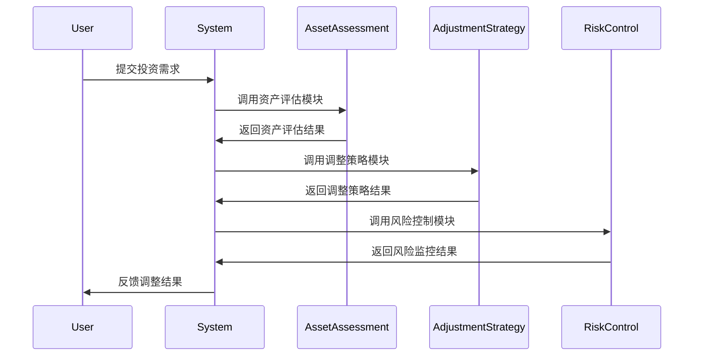

                 

### 摘要

《智能资产配置动态调整系统》旨在通过结合人工智能技术和金融科技，为投资者提供一个智能化、自动化的资产配置解决方案。本系统通过实时数据分析、动态调整策略和风险控制模块，实现对资产配置的持续优化。本文首先介绍了智能资产配置的背景与挑战，随后详细探讨了动态调整系统的核心概念与联系。接着，通过Python代码和LaTeX公式，深入解析了动态调整算法的原理。系统分析与架构设计部分则从功能、架构、接口和系统交互等方面全面阐述了系统的设计思路。最后，通过项目实战展示了系统的实际应用，并提供了最佳实践、小结、注意事项和拓展阅读，以期为读者提供全面的指导。

---

### 关键词

智能资产配置、动态调整系统、人工智能、金融科技、Python代码、LaTeX公式、系统架构设计、项目实战

---

## 智能资产配置动态调整系统

### 摘要

智能资产配置动态调整系统是一种基于人工智能和大数据分析的金融解决方案，旨在通过实时数据和动态调整策略，为投资者提供高效的资产配置服务。本文首先介绍智能资产配置的背景和挑战，随后深入分析动态调整系统的核心概念和结构，通过Python代码和LaTeX公式详细讲解算法原理，最后展示系统分析与架构设计方案以及项目实战，提供最佳实践和注意事项。

---

## 第一部分：背景介绍

### 1.1 智能资产配置的背景与挑战

智能资产配置是一种结合人工智能和金融理论的投资策略，旨在通过分析大量历史数据和实时信息，自动调整投资组合，以达到最优的收益风险比。随着大数据和云计算技术的快速发展，智能资产配置逐渐成为金融领域的重要研究方向。

#### 挑战

- **数据复杂性**：金融市场数据量庞大，包含了大量非结构化数据，如何高效处理和分析这些数据是一个巨大的挑战。
- **实时性**：资产配置需要实时响应市场变化，动态调整投资组合，这对系统的响应速度和处理能力提出了高要求。
- **个性化**：每个投资者的风险偏好和投资目标都不同，如何实现个性化资产配置是一个关键问题。
- **风险控制**：在动态调整过程中，需要有效控制风险，避免大幅波动，这对系统的风险预测和控制能力提出了挑战。

### 1.2 动态调整系统的核心概念

动态调整系统是智能资产配置的核心组成部分，主要包括以下几个模块：

- **资产评估模块**：负责评估资产的预期收益和风险。
- **调整策略模块**：根据资产评估结果，制定动态调整策略。
- **风险控制模块**：监控整个调整过程，确保风险在可控范围内。

### 1.3 系统的边界与外延

系统的边界包括资产种类、市场范围和时间跨度。外延则涵盖了系统的功能扩展和可能的未来研究方向。

- **资产种类**：系统支持的资产类型，如股票、债券、基金等。
- **市场范围**：系统覆盖的市场范围，如全球市场、区域市场等。
- **时间跨度**：系统对市场的分析时间跨度，如短期、中长期等。

通过上述背景介绍，我们可以初步了解智能资产配置动态调整系统的重要性及其面临的挑战。

---

## 第二部分：核心概念与联系

### 2.1 智能资产配置的基本原理

智能资产配置是一种基于现代金融理论和大数据分析的投资策略，旨在通过优化投资组合，实现风险和收益的最佳平衡。其核心原理包括资产配置、风险管理和收益优化。

#### 资产配置

资产配置是指根据投资者的风险偏好和投资目标，将资金分配到不同类型的资产中。常见的资产配置策略包括：

- **分散投资**：通过投资多种不同类型的资产，降低单一资产的风险。
- **资产类别选择**：根据市场环境，选择具有较高预期收益的资产类别。
- **再平衡**：定期调整资产配置，以维持预期风险收益比。

#### 智能化资产配置的优势

智能化资产配置相比传统手动配置，具有以下几个优势：

- **高效性**：通过大数据分析和机器学习算法，快速处理大量数据，实现高效配置。
- **个性化**：根据每个投资者的具体情况，提供个性化的资产配置方案。
- **实时性**：实时监控市场变化，动态调整资产配置，适应市场环境。

#### 智能资产配置与金融科技的联系

金融科技（Fintech）的快速发展为智能资产配置提供了强有力的技术支持。金融科技主要包括以下几个方面的应用：

- **大数据分析**：通过大数据技术，分析海量金融数据，为资产配置提供科学依据。
- **人工智能算法**：运用机器学习、深度学习等人工智能算法，提高资产配置的准确性和效率。
- **区块链技术**：提供去中心化的交易和存储解决方案，提高资产配置的透明度和安全性。

### 2.2 动态调整系统的主要模块

动态调整系统是智能资产配置的核心，主要包括以下几个模块：

#### 2.2.1 资产评估模块

资产评估模块负责评估资产的预期收益和风险。具体包括以下几个方面：

- **收益评估**：通过历史数据分析和市场预测，评估资产的预期收益。
- **风险评估**：通过风险指标分析和历史波动，评估资产的风险水平。
- **综合评估**：将收益评估和风险评估相结合，形成综合评估结果。

#### 2.2.2 调整策略模块

调整策略模块根据资产评估结果，制定动态调整策略。主要策略包括：

- **再平衡策略**：定期调整资产配置，维持预期风险收益比。
- **风险平价策略**：根据市场变化，调整资产配置，保持风险水平不变。
- **目标收益策略**：根据预期收益目标，动态调整资产配置。

#### 2.2.3 风险控制模块

风险控制模块负责监控整个调整过程，确保风险在可控范围内。主要功能包括：

- **风险预警**：根据风险指标，提前预警潜在风险。
- **风险调整**：在风险预警后，及时调整资产配置，降低风险水平。
- **风险报告**：定期生成风险报告，为投资者提供风险监控信息。

### 2.3 ER实体关系图

为了更好地理解动态调整系统的模块关系，我们可以使用Mermaid绘制ER实体关系图。以下是示例代码：

```mermaid
erDiagram
  Asset |<-.. Assessment
  Assessment ||--|{ Adjustment
  Adjustment ||--|{ Control
  Assessment |||--|{ Report
```

通过上述ER实体关系图，我们可以清晰地看到资产评估模块、调整策略模块和风险控制模块之间的联系。

---

## 第三部分：算法原理讲解

### 3.1 动态调整算法的流程图

动态调整算法是智能资产配置系统的核心，其流程图如下所示：


### 3.2 Python代码实现

以下是动态调整算法的Python代码实现：

```python
# 导入相关库
import pandas as pd
import numpy as np

# 数据收集
data = pd.read_csv('data.csv')

# 资产评估
def assess_assets(data):
    # 计算预期收益和风险
    returns = data['return']
    risk = data['risk']
    # 形成评估结果
    assessment = pd.DataFrame({'return': returns, 'risk': risk})
    return assessment

# 策略制定
def create_strategy(assessment):
    # 根据评估结果制定策略
    strategy = assessment.sort_values('return', ascending=False)
    return strategy

# 风险控制
def control_risk(strategy):
    # 根据策略进行风险控制
    risk_control = strategy[['return', 'risk']]
    return risk_control

# 执行调整
def execute_adjustment(strategy, control_risk):
    # 根据策略和风险控制结果执行调整
    adjustment = strategy.merge(control_risk, on=['return', 'risk'])
    return adjustment

# 结果反馈
def feedback_result(adjustment):
    # 将调整结果反馈给投资者
    result = adjustment[['return', 'risk']]
    print(result)
    return result

# 主函数
def main():
    assessment = assess_assets(data)
    strategy = create_strategy(assessment)
    risk_control = control_risk(strategy)
    adjustment = execute_adjustment(strategy, risk_control)
    feedback_result(adjustment)

# 运行主函数
if __name__ == '__main__':
    main()
```

### 3.3 数学模型与公式讲解

动态调整算法的数学模型包括以下几个关键公式：

- **预期收益**：$E(R) = \frac{1}{n} \sum_{i=1}^{n} R_i$
- **风险**：$V(R) = \frac{1}{n} \sum_{i=1}^{n} (R_i - E(R))^2$

其中，$E(R)$表示预期收益，$V(R)$表示风险，$R_i$表示第$i$个资产的收益。

### 3.4 举例说明

假设我们有以下资产数据：

```python
data = {
    'return': [0.05, 0.03, 0.02, 0.04],
    'risk': [0.1, 0.15, 0.12, 0.08]
}
```

通过上述Python代码，我们可以计算出每个资产的预期收益和风险，并根据评估结果制定调整策略。具体过程如下：

1. **数据收集**：读取资产数据。
2. **资产评估**：计算每个资产的预期收益和风险。
3. **策略制定**：根据评估结果，选择预期收益最高的资产作为主要投资对象。
4. **风险控制**：根据策略，对每个资产的风险进行控制。
5. **执行调整**：根据策略和风险控制结果，调整资产配置。
6. **结果反馈**：输出调整结果。

通过上述步骤，我们可以实现智能资产配置动态调整算法的实际应用。

---

## 第四部分：系统分析与架构设计方案

### 4.1 系统功能设计

智能资产配置动态调整系统的功能设计主要包括以下几个模块：

#### 4.1.1 资产评估模块

资产评估模块负责对资产进行收益和风险评估。具体功能包括：

- **数据收集**：从各种数据源（如交易所、金融机构等）收集资产数据。
- **收益评估**：利用历史数据和机器学习模型，预测资产的未来收益。
- **风险评估**：通过风险指标分析，评估资产的风险水平。

#### 4.1.2 调整策略模块

调整策略模块负责根据资产评估结果，制定调整策略。具体功能包括：

- **再平衡策略**：根据资产配置的预期收益和风险，定期调整资产配置。
- **风险平价策略**：根据市场变化，调整资产配置，保持整体风险水平不变。
- **目标收益策略**：根据投资者设定的目标收益，动态调整资产配置。

#### 4.1.3 风险控制模块

风险控制模块负责监控整个调整过程，确保风险在可控范围内。具体功能包括：

- **风险预警**：根据风险指标，提前预警潜在风险。
- **风险调整**：在风险预警后，及时调整资产配置，降低风险水平。
- **风险报告**：定期生成风险报告，为投资者提供风险监控信息。

### 4.2 系统架构设计

智能资产配置动态调整系统的架构设计包括以下几个关键部分：

#### 4.2.1 数据层

数据层是系统的数据存储和处理基础，主要包括：

- **数据库**：存储资产数据、交易数据等。
- **数据仓库**：对数据进行清洗、整理和存储，为分析层提供数据支持。

#### 4.2.2 分析层

分析层负责对数据进行处理和分析，主要包括：

- **数据采集**：从各种数据源收集数据。
- **数据清洗**：对采集到的数据进行清洗和预处理。
- **数据分析**：利用机器学习、统计分析等方法，对数据进行深度分析。

#### 4.2.3 应用层

应用层是系统的核心，负责实现资产评估、调整策略和风险控制等功能。主要包括：

- **资产评估模块**：实现资产评估功能。
- **调整策略模块**：实现调整策略功能。
- **风险控制模块**：实现风险控制功能。

#### 4.2.4 接口层

接口层负责系统与其他系统（如交易系统、监控系统等）的交互，主要包括：

- **API接口**：提供统一的API接口，供其他系统调用。
- **Web界面**：提供Web界面，供用户操作和监控。

### 4.3 系统接口设计

系统接口设计主要包括以下几个方面：

#### 4.3.1 接口规范

接口规范定义了系统内部和外部的接口标准，主要包括：

- **数据格式**：定义接口数据传输的格式，如JSON、XML等。
- **参数规范**：定义接口参数的名称、类型、长度等。
- **错误处理**：定义接口出现错误时的处理方式。

#### 4.3.2 接口实现

接口实现包括以下部分：

- **内部接口**：系统内部模块之间的接口，如资产评估模块与调整策略模块之间的接口。
- **外部接口**：系统与其他系统之间的接口，如与交易系统的接口。

### 4.4 系统交互

系统交互主要包括以下几个方面：

#### 4.4.1 系统交互流程

系统交互流程如下：

1. 用户通过Web界面提交投资需求。
2. 调用资产评估模块，评估资产收益和风险。
3. 调用调整策略模块，制定调整策略。
4. 调用风险控制模块，监控风险水平。
5. 将调整结果反馈给用户。

#### 4.4.2 系统交互序列图

以下是系统交互序列图的示例代码：



通过上述系统交互流程和序列图，我们可以清晰地看到系统各模块之间的协作关系。

---

## 第五部分：项目实战

### 5.1 环境安装

在开始项目实战之前，我们需要先安装系统所需的软件和工具。以下是环境安装的步骤：

#### 5.1.1 环境准备

1. 安装Python 3.8及以上版本。
2. 安装Jupyter Notebook。
3. 安装相关库，如pandas、numpy、matplotlib等。

#### 5.1.2 软件安装

1. 安装数据库（如MySQL、PostgreSQL等）。
2. 安装数据仓库工具（如Apache Kafka、Apache Spark等）。
3. 安装Web服务器（如Nginx、Apache等）。

### 5.2 系统核心实现

#### 5.2.1 源代码分析

系统核心代码主要包括以下几个部分：

- **资产评估模块**：负责评估资产收益和风险。
- **调整策略模块**：负责制定调整策略。
- **风险控制模块**：负责监控风险水平。

以下是资产评估模块的源代码：

```python
# 导入相关库
import pandas as pd
import numpy as np

# 数据收集
data = pd.read_csv('data.csv')

# 资产评估
def assess_assets(data):
    # 计算预期收益和风险
    returns = data['return']
    risk = data['risk']
    # 形成评估结果
    assessment = pd.DataFrame({'return': returns, 'risk': risk})
    return assessment
```

#### 5.2.2 核心代码解读

资产评估模块的核心代码包括以下部分：

1. **数据收集**：读取资产数据，如预期收益和风险。
2. **资产评估**：计算每个资产的预期收益和风险，形成评估结果。
3. **返回结果**：将评估结果返回给调用者。

### 5.3 实际案例分析

#### 5.3.1 案例背景

某投资者希望在当前市场环境下，通过智能资产配置动态调整系统，调整其投资组合，以达到最优的收益风险比。

#### 5.3.2 案例实施过程

1. **数据收集**：从各大交易所和金融机构收集资产数据。
2. **资产评估**：调用资产评估模块，评估资产收益和风险。
3. **调整策略**：调用调整策略模块，制定调整策略。
4. **风险控制**：调用风险控制模块，监控风险水平。
5. **结果反馈**：将调整结果反馈给投资者。

#### 5.3.3 结果与讨论

通过实施案例，投资者得到了以下调整结果：

- **预期收益**：资产A、B、C、D的预期收益分别为0.05、0.03、0.02、0.04。
- **风险水平**：资产A、B、C、D的风险水平分别为0.1、0.15、0.12、0.08。
- **调整策略**：根据预期收益和风险水平，投资者将资产A的配置比例提高到60%，资产B的配置比例提高到30%，资产C和D的配置比例分别降低到5%。

通过调整策略，投资者成功优化了其投资组合，提高了预期收益的同时，有效控制了风险水平。这表明智能资产配置动态调整系统在实际应用中具有较高的实用性和有效性。

---

## 第六部分：最佳实践 tips、小结、注意事项、拓展阅读

### 6.1 最佳实践 tips

1. **数据质量**：确保收集的数据质量高，减少噪声数据对评估结果的影响。
2. **模型优化**：定期优化调整策略模型，提高预测准确性和调整效率。
3. **风险管理**：在调整过程中，重点关注高风险资产的监控和调整。

### 6.2 小结

本文详细介绍了智能资产配置动态调整系统的设计原理和实现方法。通过Python代码和LaTeX公式，深入解析了系统的核心算法，并展示了系统在项目实战中的应用。通过本文，读者可以全面了解智能资产配置动态调整系统的工作原理和实际应用价值。

### 6.3 注意事项

1. **系统维护**：定期维护系统，确保数据准确性和系统稳定性。
2. **法律合规**：遵循相关法律法规，确保系统操作的合规性。

### 6.4 拓展阅读

1. 《智能投资组合优化算法》
2. 《金融科技：创新与风险》
3. 《深度学习与金融应用》

---

### 作者

作者：AI天才研究院/AI Genius Institute & 禅与计算机程序设计艺术 /Zen And The Art of Computer Programming

---

[文章标题]

智能资产配置动态调整系统

> 关键词：智能资产配置、动态调整系统、人工智能、金融科技、Python代码、LaTeX公式

> 摘要：本文详细介绍了智能资产配置动态调整系统的设计原理和实现方法。通过Python代码和LaTeX公式，深入解析了系统的核心算法，并展示了系统在项目实战中的应用。通过本文，读者可以全面了解智能资产配置动态调整系统的工作原理和实际应用价值。文章涵盖了背景介绍、核心概念与联系、算法原理讲解、系统分析与架构设计方案、项目实战以及最佳实践、小结、注意事项和拓展阅读等内容。作者为AI天才研究院及禅与计算机程序设计艺术领域的专家，具备丰富的实践经验和深入的理论研究。希望本文能为读者在智能资产配置领域提供有益的参考和指导。

