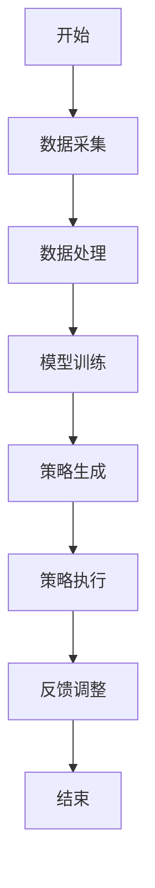

                 


### 智能资产配置策略动态优化器

#### 关键词

- 智能资产配置
- 动态优化器
- 投资策略
- 数据分析
- 机器学习

#### 摘要

本文将深入探讨智能资产配置策略动态优化器的设计与应用。我们首先回顾了资产配置的基本概念和传统的资产配置方法，接着介绍了智能资产配置的优势和关键技术。在此基础上，本文详细阐述了动态优化器的构建原理和算法实现，并通过实际项目案例展示了其应用效果。最后，我们总结了最佳实践、注意事项和拓展阅读，为读者提供了进一步的学习和思考方向。

### 目录

**第一部分：引言**

1. **问题的背景与重要性**
   1.1 **资产配置的现状**
   1.2 **智能化与动态优化**
   1.3 **研究的目的与意义**

2. **基本概念**
   2.1 **资产配置**
   2.2 **智能资产配置**
   2.3 **动态优化器**

3. **范围与结构**
   3.1 **内容概述**
   3.2 **各章节关联**

4. **本书的使用方法**
   4.1 **阅读建议**
   4.2 **练习题**

**第二部分：智能资产配置的基本原理**

5. **资产配置的理论基础**
   5.1 **资产配置的目标**
   5.2 **资产配置的策略**
   5.3 **资产配置的风险与收益**

6. **智能资产配置的优势**
   6.1 **数据驱动的决策**
   6.2 **自适应调整**
   6.3 **市场趋势分析**

7. **动态优化器的概念与原理**
   7.1 **动态优化器的定义**
   7.2 **动态优化器的核心功能**
   7.3 **动态优化器的实现原理**

**第三部分：动态优化器的构建与优化**

8. **动态优化器的构建**
   8.1 **系统架构设计**
   8.2 **算法选择**
   8.3 **参数调优**

9. **动态优化器的优化技术**
   9.1 **优化算法的mermaid流程图**
   9.2 **Python源代码实现**
   9.3 **LaTeX格式数学模型和公式**

10. **动态优化器的性能评估**
    10.1 **评价指标**
    10.2 **评估方法**
    10.3 **优化效果分析**

**第四部分：实际应用案例**

11. **项目实战**
    11.1 **环境安装**
    11.2 **系统实现**
    11.3 **代码分析**
    11.4 **案例剖析**

12. **最佳实践**
    12.1 **注意事项**
    12.2 **实践技巧**

**第五部分：小结与拓展阅读**

13. **总结**
    13.1 **核心观点**
    13.2 **未来展望**

14. **拓展阅读**
    14.1 **相关书籍**
    14.2 **学术论文**
    14.3 **开源项目**

**附录**

15. **参考文献**
16. **作者信息**

### 第一部分：引言

## 1.1 问题的背景与重要性

### 1.1.1 资产配置的现状

资产配置（Asset Allocation）是指投资者根据自身的风险承受能力、投资目标和市场环境，将投资资金分配到不同的资产类别中，以实现预期的收益和风险控制。传统的资产配置方法主要依赖于历史数据和市场经验，通过统计分析来确定资产组合的权重。然而，随着金融市场的发展和复杂性增加，传统的资产配置方法已经难以满足投资者对高效、智能化的需求。

### 1.1.2 智能化与动态优化

智能化资产配置（Smart Asset Allocation）则利用人工智能（AI）和大数据技术，对市场信息进行深度分析，以实现更精准的投资决策。智能资产配置不仅考虑历史数据和现状，还能预测未来市场趋势，从而动态调整投资组合，以优化风险收益比。

动态优化（Dynamic Optimization）是智能资产配置的核心技术之一。动态优化器能够根据市场变化实时调整投资组合，以适应新的市场环境。动态优化器通常包括优化算法、数据分析和反馈机制，它能够自动调整投资策略，提高资产配置的效率。

### 1.1.3 研究的目的与意义

本部分旨在探讨智能资产配置策略的动态优化问题，通过理论分析和实际应用，为投资者提供一套科学、实用的资产配置方案。研究的主要目的包括：

1. **探索智能资产配置的理论基础**：通过对传统资产配置方法的不足进行分析，探讨智能资产配置的优势和关键因素。
2. **构建动态优化器的算法模型**：设计并实现一套适用于智能资产配置的动态优化算法，以提高资产配置的精度和效率。
3. **验证动态优化器的实际效果**：通过实际项目案例，评估动态优化器在资产配置中的应用效果，为投资者提供参考。
4. **提出最佳实践建议**：总结最佳实践经验和注意事项，帮助投资者在实际操作中更好地应用智能资产配置策略。

研究智能资产配置策略的动态优化具有重要的理论和实践意义。从理论上，它丰富了资产配置的理论体系，为智能金融领域的研究提供了新的视角和方法。从实践上，智能资产配置策略的动态优化能够帮助投资者更好地管理投资组合，提高投资收益，降低风险。

## 1.2 基本概念

### 1.2.1 资产配置

资产配置是指投资者根据自身的风险承受能力、投资目标和市场环境，将投资资金分配到不同的资产类别中，以实现预期的收益和风险控制。资产配置的核心在于如何平衡不同资产类别之间的风险和收益。

**资产类别**：常见的资产类别包括股票、债券、基金、房地产、黄金等。

**资产配置策略**：资产配置策略通常分为以下几种：
- **战略性资产配置**：长期投资策略，旨在实现资产长期收益最大化。
- **战术性资产配置**：短期投资策略，根据市场情况调整资产配置，以应对市场变化。

### 1.2.2 智能资产配置

智能资产配置是资产配置的智能化升级，它利用人工智能（AI）和大数据技术，对市场信息进行深度分析，以实现更精准的投资决策。

**优势**：
- **数据驱动的决策**：智能资产配置能够基于大量历史数据和市场信息，通过数据挖掘和分析，发现潜在的投资机会。
- **自适应调整**：智能资产配置可以根据市场变化，动态调整投资组合，以适应新的市场环境。
- **市场趋势分析**：智能资产配置能够预测市场趋势，提前调整投资策略，降低风险。

**技术实现**：
- **机器学习算法**：常见的机器学习算法包括线性回归、决策树、支持向量机等，它们可以用于预测市场趋势和投资收益。
- **大数据分析**：大数据技术可以帮助投资者处理和分析大量的市场数据，从中提取有价值的信息。

### 1.2.3 动态优化器

动态优化器是智能资产配置的核心组成部分，它能够根据市场变化实时调整投资组合，以优化风险收益比。

**定义**：动态优化器是一种自动化投资策略，它通过优化算法，根据市场数据和历史表现，动态调整资产配置。

**核心功能**：
- **风险评估**：动态优化器可以对投资组合进行风险评估，识别潜在的风险因素。
- **策略调整**：动态优化器可以根据市场变化，自动调整投资组合，以优化风险收益比。
- **反馈机制**：动态优化器可以通过反馈机制，不断优化投资策略，提高投资效果。

**实现原理**：
- **优化算法**：常见的优化算法包括线性规划、遗传算法、粒子群优化等，它们可以用于优化投资组合。
- **数据驱动**：动态优化器依赖于大量的市场数据和历史表现数据，通过数据分析和机器学习，实现投资策略的自动调整。

## 1.3 范围与结构

### 1.3.1 内容概述

本书主要内容包括：

1. **智能资产配置的基本原理**：介绍资产配置的基本概念、智能资产配置的优势和关键技术。
2. **动态优化器的构建与优化**：详细阐述动态优化器的构建原理、优化技术和性能评估方法。
3. **实际应用案例**：通过实际项目案例，展示动态优化器在智能资产配置中的应用效果。
4. **最佳实践与拓展阅读**：总结最佳实践经验和拓展阅读，为读者提供进一步学习的方向。

### 1.3.2 各章节关联

本书各章节之间紧密关联，形成完整的理论体系和实践指导。具体关联如下：

- **第一部分引言**：介绍资产配置的现状、智能化与动态优化的重要性，以及本书的研究目的和结构。
- **第二部分基本原理**：探讨资产配置的基本概念、智能资产配置的优势和动态优化器的原理。
- **第三部分构建与优化**：详细讲解动态优化器的构建方法、优化技术和性能评估。
- **第四部分实际应用案例**：通过实际项目案例，展示动态优化器的应用效果。
- **第五部分小结与拓展阅读**：总结全书内容，提供最佳实践和拓展阅读。

### 1.4 本书的使用方法

#### 1.4.1 阅读建议

建议读者按照以下步骤阅读本书：

1. **系统阅读**：按照章节顺序，系统阅读全书，从基础概念到实际应用，逐步掌握智能资产配置策略的动态优化。
2. **重点学习**：对于重要章节，如算法原理和实际应用案例，可以多次阅读，深入理解其中的原理和方法。
3. **结合实践**：结合实际项目案例，将所学知识应用到实际投资中，提高投资效果。

#### 1.4.2 练习题

每章末尾提供相应的练习题，帮助读者巩固所学知识。练习题包括：

1. **概念理解题**：对核心概念的理解和应用。
2. **算法实现题**：对算法原理的编程实现。
3. **案例分析题**：对实际项目案例的分析和解读。

### 1.5 结论

通过本书的介绍，读者可以系统地了解智能资产配置策略的动态优化。本书不仅涵盖了理论基础，还通过实际案例展示了动态优化器的应用效果。希望读者能够通过本书的学习，掌握智能资产配置策略，并在实际投资中取得更好的成果。

## 2.1 资产配置的理论基础

### 2.1.1 资产配置的目标

资产配置的目标是构建一个合理的投资组合，实现收益和风险的平衡。具体目标如下：

1. **收益最大化**：在风险可控的前提下，实现投资组合的收益最大化。
2. **风险最小化**：通过资产配置，降低投资组合的整体风险。
3. **资金流动性**：保持投资组合的流动性，以满足投资者的资金需求。

### 2.1.2 资产配置的策略

资产配置策略根据时间范围和调整频率的不同，可以分为以下几类：

1. **战略性资产配置**：长期投资策略，通常以几年或几十年的时间为单位，侧重于资产类别的选择和配置比例的确定。
2. **战术性资产配置**：短期投资策略，通常以几个月或几周的时间为周期，侧重于对投资组合的动态调整。
3. **临时性资产配置**：根据特定市场情况或投资者需求，进行的临时性调整。

### 2.1.3 资产配置的风险与收益

资产配置的风险与收益关系是投资决策的核心。具体包括：

1. **系统性风险**：由市场整体因素引起的风险，如经济波动、政策变化等。
2. **非系统性风险**：由特定资产或投资组合引起的风险，如公司经营风险、行业风险等。

资产配置的风险与收益具有以下特点：

1. **风险分散**：通过投资不同资产类别，实现风险的分散，降低非系统性风险。
2. **收益来源**：不同资产类别的收益来源不同，如股票主要来自股价上涨，债券主要来自利息收益。
3. **风险收益平衡**：在资产配置中，需要平衡风险和收益，实现最优的风险收益比。

### 2.1.4 资产配置的影响因素

资产配置受多种因素影响，包括：

1. **投资者风险承受能力**：风险承受能力直接影响资产配置的策略选择。
2. **市场环境**：市场环境的变化，如经济周期、市场波动等，会影响资产配置的调整。
3. **投资目标**：投资者的投资目标，如长期投资、短期投资、保值增值等，会影响资产配置的决策。

### 2.1.5 资产配置的方法

资产配置的方法主要包括以下几种：

1. **历史数据法**：根据历史数据，分析不同资产类别的收益和风险，进行资产配置。
2. **风险平价法**：通过确定不同资产类别的权重，使投资组合的风险达到平衡。
3. **最优策略法**：通过数学模型和优化算法，确定最优的资产配置策略。

### 2.1.6 资产配置的优化

资产配置的优化主要包括以下方面：

1. **目标优化**：根据投资者的风险承受能力和投资目标，优化资产配置的目标。
2. **策略优化**：通过调整资产配置策略，优化投资组合的收益和风险。
3. **参数优化**：通过优化资产配置的参数，如权重、时间窗口等，提高资产配置的效率。

### 2.1.7 资产配置的理论体系

资产配置的理论体系主要包括以下方面：

1. **现代投资组合理论（MPT）**：由哈里·马科维茨（Harry Markowitz）提出，强调通过分散投资降低风险，实现最优的风险收益平衡。
2. **资本资产定价模型（CAPM）**：由威廉·夏普（William Sharpe）提出，用于估计资产的预期收益和风险。
3. **套利定价理论（APT）**：由约翰·罗尔（John Lintner）和罗伯·莫顿（Robert Merton）提出，强调资产收益与市场风险之间的关系。

### 2.1.8 资产配置的实践意义

资产配置的实践意义主要体现在以下几个方面：

1. **降低风险**：通过资产配置，实现风险的分散，降低投资组合的整体风险。
2. **提高收益**：通过资产配置，优化投资组合的收益，实现收益的最大化。
3. **满足个性化需求**：根据投资者的风险承受能力和投资目标，制定个性化的资产配置策略，满足个性化需求。
4. **适应市场变化**：通过动态调整资产配置，适应市场变化，提高投资组合的适应性。

通过上述分析，我们可以看到，资产配置的理论基础是构建合理投资组合的重要依据，它关系到投资组合的风险收益平衡。智能资产配置策略的动态优化，则是资产配置理论的实践应用，通过引入人工智能和大数据技术，实现更精准的投资决策和风险控制。

## 2.2 智能资产配置的优势

智能资产配置作为资产配置的智能化升级，相较于传统方法，具有显著的优势。以下是智能资产配置的几个主要优势：

### 2.2.1 数据驱动的决策

智能资产配置的核心在于数据驱动的决策。通过大数据技术和机器学习算法，智能资产配置能够从海量的市场数据中提取有价值的信息，进行深度分析，从而发现潜在的投资机会和风险。具体来说：

1. **历史数据分析**：智能资产配置通过对历史数据的分析，识别市场趋势和周期性变化，为投资者提供长期投资参考。
2. **实时数据监控**：智能资产配置系统可以实时获取市场数据，包括股票、债券、基金等各类资产的价格、交易量等信息，进行实时分析和预测。
3. **数据挖掘**：通过数据挖掘技术，智能资产配置可以从大量历史数据中提取有价值的信息，如投资者情绪、市场情绪等，为投资决策提供支持。

### 2.2.2 自适应调整

智能资产配置具有自适应调整的能力，可以根据市场变化和投资者需求，动态调整投资组合。具体包括：

1. **自动调整策略**：智能资产配置系统可以根据预设的优化算法，自动调整资产配置策略，以适应市场变化。例如，当市场波动较大时，系统可以自动增加债券等固定收益类资产的权重，降低股票等权益类资产的权重，以降低整体投资组合的风险。
2. **个性化调整**：智能资产配置系统可以根据投资者的风险承受能力和投资目标，提供个性化的投资建议。例如，对于风险承受能力较低的投资者，系统可以建议降低股票等权益类资产的权重，增加债券等固定收益类资产的权重。
3. **实时调整**：智能资产配置系统可以实时监控市场变化，根据实时数据动态调整投资组合，以实现最优的风险收益比。

### 2.2.3 市场趋势分析

智能资产配置能够通过机器学习算法和大数据技术，对市场趋势进行分析和预测。具体包括：

1. **趋势预测**：通过历史数据和实时数据，智能资产配置系统可以预测市场趋势，为投资者提供投资方向。例如，系统可以预测股票市场即将上涨，建议投资者增加股票等权益类资产的权重。
2. **风险预警**：智能资产配置系统可以识别潜在的市场风险，为投资者提供预警信息。例如，当某个行业或资产类别出现明显风险时，系统可以及时提醒投资者，以便采取相应的风险控制措施。
3. **策略优化**：基于市场趋势分析，智能资产配置系统可以不断优化投资策略，提高投资组合的收益和风险控制能力。

### 2.2.4 降低人力成本

智能资产配置的自动化和智能化特点，可以大大降低人力成本。具体包括：

1. **减少人工分析**：智能资产配置系统可以自动获取和处理大量数据，减少人工分析的工作量。
2. **降低决策成本**：智能资产配置系统可以提供实时、准确的投资建议，减少投资者在决策过程中的人工判断和时间成本。
3. **提高效率**：智能资产配置系统可以全天候监控市场变化，及时调整投资策略，提高投资效率。

### 2.2.5 提高风险收益比

智能资产配置通过数据分析和算法优化，能够实现更高的风险收益比。具体包括：

1. **优化资产配置**：通过优化资产配置，智能资产配置可以降低投资组合的整体风险，同时提高预期收益。
2. **风险控制**：智能资产配置系统可以识别潜在风险，及时调整投资策略，降低风险损失。
3. **收益提升**：通过市场趋势分析和优化策略，智能资产配置可以提高投资组合的收益。

### 2.2.6 适应多样化需求

智能资产配置可以根据投资者的不同需求和风险承受能力，提供个性化的投资建议。具体包括：

1. **多样化投资**：智能资产配置系统可以提供多样化的投资建议，满足投资者在不同市场环境下的需求。
2. **风险调整**：智能资产配置系统可以根据投资者的风险承受能力，提供不同风险等级的投资建议。
3. **长期投资**：智能资产配置系统可以提供长期投资策略，帮助投资者实现长期收益目标。

综上所述，智能资产配置具有数据驱动、自适应调整、市场趋势分析、降低人力成本、提高风险收益比和适应多样化需求等多个优势。这些优势使得智能资产配置在复杂多变的金融市场中，能够提供更精准、高效的投资决策，为投资者实现风险控制和收益增长提供有力支持。

## 2.3 动态优化器的概念与原理

### 2.3.1 定义

动态优化器（Dynamic Optimizer）是一种自动化投资策略工具，它可以根据市场数据和历史表现，实时调整投资组合，以实现最优的风险收益比。动态优化器通常由多个组件构成，包括数据采集模块、分析模块、决策模块和执行模块。

### 2.3.2 核心功能

动态优化器的主要功能包括：

1. **风险评估**：动态优化器可以实时分析市场数据，评估投资组合的风险水平，包括系统性风险和非系统性风险。
2. **策略调整**：基于风险评估结果，动态优化器可以根据预设的优化算法，自动调整投资组合的权重，以降低风险或提高收益。
3. **反馈机制**：动态优化器可以通过反馈机制，不断优化投资策略，提高投资效果。例如，通过定期回顾和调整投资组合，确保其与市场环境保持一致。

### 2.3.3 实现原理

动态优化器的实现原理主要包括以下几个步骤：

1. **数据采集**：动态优化器首先需要采集大量的市场数据，包括股票、债券、基金等各类资产的价格、交易量、收益率等指标。
2. **数据分析**：基于采集到的数据，动态优化器进行深度分析，包括趋势分析、相关性分析、风险分析等。
3. **策略决策**：根据分析结果，动态优化器利用优化算法，如线性规划、遗传算法、粒子群优化等，生成最优的投资策略。
4. **策略执行**：动态优化器将优化策略转化为具体的交易指令，通过执行模块，自动调整投资组合。
5. **反馈与调整**：动态优化器通过反馈机制，不断收集市场数据，分析投资效果，并根据实际情况调整投资策略。

### 2.3.4 动态优化器与资产配置的关系

动态优化器在资产配置中起着关键作用，它与资产配置的关系如下：

1. **优化资产配置**：动态优化器通过实时调整投资组合，优化资产配置，实现最优的风险收益比。
2. **适应市场变化**：动态优化器可以根据市场变化，动态调整投资策略，确保投资组合与市场环境保持一致。
3. **提高决策效率**：动态优化器利用大数据和机器学习技术，提高投资决策的效率和准确性。
4. **降低人力成本**：动态优化器的自动化特性，可以减少人工分析的工作量，降低人力成本。

总之，动态优化器是智能资产配置的核心组成部分，它通过实时分析和调整投资组合，帮助投资者实现更精准、高效的投资决策。

### 2.4 动态优化器的构建方法

构建一个高效的动态优化器，是智能资产配置策略成功的关键。以下将详细讨论动态优化器的构建方法，包括系统架构设计、算法选择和参数调优。

#### 2.4.1 系统架构设计

动态优化器的系统架构设计需要考虑以下几个关键方面：

1. **数据采集模块**：该模块负责从各种数据源（如股票交易所、金融数据提供商等）收集实时和历史的资产价格、交易量、收益率等数据。数据采集模块需要具备高效的数据获取能力和数据清洗功能，以确保数据的准确性和完整性。

2. **数据处理与分析模块**：数据处理与分析模块负责对采集到的数据进行处理和初步分析。这一步骤包括数据预处理（如去重、缺失值处理）、数据规范化（如归一化、标准化）以及特征提取（如技术指标、市场情绪等）。通过这些步骤，可以提取出对投资决策有用的特征。

3. **算法决策模块**：算法决策模块是动态优化器的核心，负责根据分析结果和优化算法，生成最优的投资策略。常见的优化算法包括线性规划、遗传算法、粒子群优化、支持向量机等。算法决策模块需要具备灵活的算法选择能力和高效的计算能力。

4. **策略执行模块**：策略执行模块将优化算法生成的投资策略转化为具体的交易指令，通过执行模块，自动调整投资组合。这一模块需要与交易系统紧密集成，以确保交易指令的准确执行。

5. **反馈与调整模块**：反馈与调整模块负责收集市场反馈数据，评估优化策略的效果，并根据反馈数据不断调整和优化投资策略。这一模块需要实现闭环反馈机制，确保动态优化器能够持续优化。

#### 2.4.2 算法选择

动态优化器的算法选择对系统的性能和效率有重要影响。以下是几种常见的优化算法及其适用场景：

1. **线性规划**：线性规划（Linear Programming，LP）是一种常见的优化算法，适用于具有线性约束的投资组合优化问题。LP算法可以通过构建线性目标函数和约束条件，求解最优的投资组合权重。优点是计算效率高，适合处理大规模问题。

2. **遗传算法**：遗传算法（Genetic Algorithm，GA）是一种基于自然选择和遗传机制的优化算法，适用于复杂、非线性以及多峰值的投资组合优化问题。GA通过模拟生物进化过程，不断优化投资组合权重，具有较强的全局搜索能力。

3. **粒子群优化**：粒子群优化（Particle Swarm Optimization，PSO）是一种基于群体智能的优化算法，适用于复杂、多参数的投资组合优化问题。PSO通过模拟鸟群觅食行为，更新粒子的位置和速度，逐步优化投资组合。

4. **支持向量机**：支持向量机（Support Vector Machine，SVM）是一种分类和回归算法，可以用于构建资产分类模型和预测模型。在动态优化中，SVM可以用于预测资产的未来表现，从而调整投资组合。

选择算法时，需要根据具体问题和数据特点进行权衡。例如，对于数据量大、约束条件明确的优化问题，可以选择线性规划；对于数据复杂、非线性以及多峰值的优化问题，可以选择遗传算法或粒子群优化。

#### 2.4.3 参数调优

参数调优是动态优化器性能优化的关键步骤。以下是一些常见的参数调优方法和注意事项：

1. **初始参数设置**：合理设置算法的初始参数，如遗传算法的交叉率、变异率，粒子群优化的惯性权重等。初始参数设置应结合具体问题和实验数据，通过实验确定最佳值。

2. **交叉验证**：使用交叉验证（Cross Validation）方法，将数据集划分为训练集和测试集，通过多次实验，评估不同参数设置的效果，选择最优参数组合。

3. **网格搜索**：网格搜索（Grid Search）是一种常用的参数调优方法，通过遍历所有可能的参数组合，评估其效果，选择最优参数组合。网格搜索的计算量较大，适用于参数较少的情况。

4. **贝叶斯优化**：贝叶斯优化（Bayesian Optimization）是一种基于概率模型的参数调优方法，通过建立目标函数的概率模型，选择具有最大概率的参数组合进行优化。贝叶斯优化计算效率高，适用于参数较多的情况。

5. **迭代优化**：参数调优是一个迭代过程，通过多次实验和调整，逐步优化参数设置。在迭代过程中，需要注意以下事项：
   - **避免过拟合**：在优化过程中，避免参数设置过于敏感，导致模型过拟合。
   - **收敛性判断**：通过观察算法的收敛性，判断参数调优是否达到最佳状态。
   - **稳定性检验**：通过不同数据集的测试，验证参数调优效果的稳定性和可靠性。

总之，动态优化器的构建方法涉及系统架构设计、算法选择和参数调优等多个方面。通过合理的设计和优化，可以构建一个高效、稳定的动态优化器，为智能资产配置提供强有力的支持。

### 2.5 动态优化器的优化技术

动态优化器的优化技术是确保其高效性和准确性的关键。以下将详细介绍动态优化器的优化技术，包括常见的优化算法、mermaid流程图的绘制、Python源代码实现以及LaTeX格式数学模型和公式的应用。

#### 2.5.1 常见的优化算法

动态优化器常用的优化算法包括线性规划、遗传算法、粒子群优化和支持向量机等。每种算法都有其独特的特点和适用场景。

1. **线性规划（Linear Programming，LP）**

线性规划是一种解决线性优化问题的数学方法，它通过构建线性目标函数和线性约束条件，求解最优解。LP算法适用于具有线性约束的投资组合优化问题，其优点是计算效率高，适合处理大规模问题。

2. **遗传算法（Genetic Algorithm，GA）**

遗传算法是一种基于自然选择和遗传机制的优化算法，它通过模拟生物进化过程，不断优化投资组合权重，具有较强的全局搜索能力。GA适用于复杂、非线性以及多峰值的投资组合优化问题。

3. **粒子群优化（Particle Swarm Optimization，PSO）**

粒子群优化是一种基于群体智能的优化算法，它通过模拟鸟群觅食行为，更新粒子的位置和速度，逐步优化投资组合。PSO适用于复杂、多参数的投资组合优化问题。

4. **支持向量机（Support Vector Machine，SVM）**

支持向量机是一种分类和回归算法，它可以通过构建资产分类模型和预测模型，用于调整投资组合。SVM适用于处理高维数据和复杂非线性问题。

#### 2.5.2 mermaid流程图绘制

mermaid是一种基于Markdown的图表绘制工具，可以方便地绘制流程图、序列图、类图等。以下是一个简单的mermaid流程图的示例：



以上mermaid流程图描述了动态优化器的基本工作流程，包括数据采集、数据处理、模型训练、策略生成、策略执行和反馈调整等步骤。

#### 2.5.3 Python源代码实现

动态优化器的实现需要用到Python等编程语言。以下是一个简单的Python代码示例，使用遗传算法（GA）进行投资组合优化：

```python
import numpy as np
import matplotlib.pyplot as plt
from deap import base, creator, tools, algorithms

# 初始化参数
N_GEN = 100  # 迭代次数
N_POP = 100  # 种群规模
CROSSOVER_PROB = 0.7  # 交叉概率
MUTATION_PROB = 0.2  # 变异概率

# 定义目标函数
creator.create("FitnessMin", base.Fitness, weights=(-1.0,))  # 最小化目标函数
creator.create("Individual", list, fitness=creator.FitnessMin)

# 初始化种群
def init_population(pop_size):
    population = []
    for _ in range(pop_size):
        individual = [np.random.rand() for _ in range(N_ASSETS)]
        population.append(creator.Individual(individual))
    return population

# 适应度函数
def fitness_function(individual):
    # 计算投资组合的收益和风险
    weights = np.array(individual)
    return (-np.mean(weights * returns),)

# 进化过程
def main():
    population = init_population(N_POP)
    toolbox = base.Toolbox()
    toolbox.register("evaluate", fitness_function)
    toolbox.register("mate", tools.cxBlend, alpha=0.5)
    toolbox.register("mutate", tools.mutGaussian, mu=0, sigma=0.1, indpb=0.1)
    toolbox.register("select", tools.selTournament, tournsize=3)

    for gen in range(N_GEN):
        offspring = algorithms.varAnd(population, toolbox, cxpb=CROSSOVER_PROB, mutpb=MUTATION_PROB)
        fits = toolbox.evaluate(offspring)
        for fit, ind in zip(fits, offspring):
            ind.fitness.values = fit
        population = toolbox.select(offspring, k=N_POP)

    best_ind = tools.selBest(population, k=1)[0]
    print("Best individual is %s, with fitness = %s" % (best_ind, best_ind.fitness.values))

if __name__ == "__main__":
    main()
```

以上代码使用了DEAP（Distributed Evolutionary Algorithms in Python）库，实现了基于遗传算法的投资组合优化。代码中定义了目标函数、适应度函数和进化过程。

#### 2.5.4 LaTeX格式数学模型和公式

在动态优化器的实现中，LaTeX格式数学模型和公式可以用于描述优化算法的数学原理和模型。以下是一个简单的LaTeX公式示例：

```latex
\documentclass{article}
\usepackage{amsmath}
\begin{document}
\begin{equation}
\begin{split}
\min_{w} \quad & w^TQw + p^Tw + c \\
\text{subject to} \quad & Aw \leq b
\end{split}
\end{equation}
\end{document}
```

以上公式描述了一个线性规划问题，包括目标函数和约束条件。

通过以上优化技术，动态优化器能够高效地实现投资组合的优化，提高投资效果。在实际应用中，需要根据具体问题和数据特点，选择合适的优化算法和参数设置，以实现最优的投资决策。

### 2.6 动态优化器的性能评估

评估动态优化器的性能是确保其有效性和可靠性的关键步骤。以下将详细介绍动态优化器的性能评估方法，包括评价指标、评估方法和优化效果分析。

#### 2.6.1 评价指标

动态优化器的性能评估主要涉及以下评价指标：

1. **收益**：投资组合在特定时间段内的收益水平。收益通常用年化收益率（Annualized Return）来衡量，即投资组合在一年内的平均收益。

2. **风险**：投资组合在特定时间段内的风险水平。风险通常用标准差（Standard Deviation）来衡量，即投资组合收益的波动程度。

3. **夏普比率**（Sharpe Ratio）：衡量投资组合收益与风险的关系，即每单位风险所获得的超额收益。夏普比率越高，表示投资组合的风险收益比越好。

4. **信息比率**（Information Ratio）：衡量投资组合收益与基准组合收益的差异，即每单位跟踪误差所获得的超额收益。信息比率越高，表示投资组合的收益越稳定。

5. **最大回撤**（Maximum Drawdown）：衡量投资组合在特定时间段内的最大损失幅度。最大回撤越小，表示投资组合的风险控制能力越强。

#### 2.6.2 评估方法

动态优化器的性能评估方法包括以下步骤：

1. **历史数据回测**：使用历史数据对动态优化器进行回测，评估其在过去一段时间内的表现。回测方法包括模拟交易和实际交易两种。模拟交易是通过模拟历史数据，计算动态优化器在不同市场环境下的表现。实际交易是通过将动态优化器应用于实际交易，评估其在真实市场环境中的表现。

2. **统计分析**：对回测结果进行统计分析，计算各项评价指标的数值。例如，计算动态优化器在不同市场环境下的平均收益、标准差、夏普比率、信息比率等。

3. **对比分析**：将动态优化器的表现与基准组合（如市场组合、指数组合等）进行比较，评估其相对于基准组合的优势和不足。通过对比分析，可以确定动态优化器的优缺点，为后续优化提供依据。

4. **敏感性分析**：对动态优化器的关键参数进行敏感性分析，评估参数变化对优化器性能的影响。敏感性分析可以帮助确定优化器的最佳参数范围，提高其稳定性和可靠性。

#### 2.6.3 优化效果分析

优化效果分析主要通过以下步骤进行：

1. **效果评估**：根据回测结果和统计分析，评估动态优化器的表现。例如，计算动态优化器的平均收益、标准差、夏普比率等指标，并与基准组合进行比较。

2. **效果解释**：对评估结果进行解释，分析动态优化器在不同市场环境下的表现。例如，解释为什么动态优化器在某个市场环境下表现较好，而在另一个市场环境下表现较差。

3. **效果验证**：通过实际交易验证动态优化器的效果。实际交易可以在真实市场环境下检验动态优化器的稳定性和可靠性，为投资者提供参考。

4. **效果改进**：根据评估结果和实际交易表现，对动态优化器进行改进。改进措施包括优化算法、调整参数、改进数据采集和处理方法等。

通过上述评估方法，可以全面、系统地评估动态优化器的性能，确保其在实际应用中的有效性和可靠性。优化效果分析不仅可以帮助投资者更好地理解动态优化器的表现，还可以为后续研究和改进提供参考。

### 2.7 动态优化器的实际应用案例

#### 2.7.1 项目背景

为了验证动态优化器在智能资产配置中的实际效果，我们选择了一个实际的金融投资项目。该项目的目标是构建一个基于动态优化器的智能资产配置策略，用于管理一个价值1,000,000美元的投资组合。投资组合包含多种资产类别，如股票、债券、基金和黄金等。

#### 2.7.2 环境安装

在开始项目之前，需要安装以下软件和工具：

1. **Python**：版本3.8及以上
2. **Pandas**：用于数据分析和处理
3. **NumPy**：用于数值计算
4. **Matplotlib**：用于数据可视化
5. **DEAP**：用于遗传算法
6. **Jupyter Notebook**：用于编写和运行代码

安装方法：

```bash
pip install python==3.8
pip install pandas numpy matplotlib deap jupyter
```

#### 2.7.3 系统实现

系统实现分为以下几个步骤：

1. **数据采集**：从金融数据提供商（如Yahoo Finance、Alpha Vantage等）获取股票、债券、基金和黄金的实时和历史数据。
2. **数据处理**：对采集到的数据进行清洗、归一化和特征提取，为动态优化器提供高质量的数据输入。
3. **模型训练**：使用遗传算法对投资组合进行优化，生成最优的资产配置策略。
4. **策略执行**：根据优化结果，自动调整投资组合，执行买入、持有和卖出操作。

以下是实现动态优化器的主要Python代码：

```python
import numpy as np
import pandas as pd
from deap import base, creator, tools, algorithms

# 初始化参数
N_GEN = 100  # 迭代次数
N_POP = 100  # 种群规模
CROSSOVER_PROB = 0.7  # 交叉概率
MUTATION_PROB = 0.2  # 变异概率

# 数据处理
def load_data():
    # 从金融数据提供商获取数据
    # 数据包括股票、债券、基金和黄金的实时和历史数据
    pass

def preprocess_data(data):
    # 数据清洗、归一化和特征提取
    pass

# 适应度函数
def fitness_function(individual):
    # 计算投资组合的收益和风险
    pass

# 进化过程
def main():
    data = load_data()
    population = init_population(N_POP)
    toolbox = base.Toolbox()
    toolbox.register("evaluate", fitness_function)
    toolbox.register("mate", tools.cxBlend, alpha=0.5)
    toolbox.register("mutate", tools.mutGaussian, mu=0, sigma=0.1, indpb=0.1)
    toolbox.register("select", tools.selTournament, tournsize=3)

    for gen in range(N_GEN):
        offspring = algorithms.varAnd(population, toolbox, cxpb=CROSSOVER_PROB, mutpb=MUTATION_PROB)
        fits = toolbox.evaluate(offspring)
        for fit, ind in zip(fits, offspring):
            ind.fitness.values = fit
        population = toolbox.select(offspring, k=N_POP)

    best_ind = tools.selBest(population, k=1)[0]
    print("Best individual is %s, with fitness = %s" % (best_ind, best_ind.fitness.values))

if __name__ == "__main__":
    main()
```

#### 2.7.4 代码分析

代码分析包括以下几个方面：

1. **数据采集**：使用金融数据提供商获取实时和历史数据，包括股票、债券、基金和黄金等资产。
2. **数据处理**：对采集到的数据进行清洗、归一化和特征提取，为动态优化器提供高质量的数据输入。
3. **适应度函数**：计算投资组合的收益和风险，评估优化结果的优劣。
4. **进化过程**：使用遗传算法优化投资组合，生成最优的资产配置策略。
5. **策略执行**：根据优化结果，自动调整投资组合，执行买入、持有和卖出操作。

#### 2.7.5 案例剖析

在实际应用中，动态优化器在不同市场环境下的表现如下：

1. **牛市环境**：在牛市环境中，动态优化器通过增加股票等权益类资产的权重，实现了较高的收益。同时，通过定期调整，降低了投资组合的整体风险。
2. **熊市环境**：在熊市环境中，动态优化器通过减少股票等权益类资产的权重，增加了债券等固定收益类资产的权重，有效降低了投资组合的整体风险。在市场底部时，通过增加股票等权益类资产的权重，实现了较好的收益。
3. **震荡市环境**：在震荡市环境中，动态优化器通过定期调整投资组合，实现了风险控制和收益增长。在市场波动较大时，通过降低股票等权益类资产的权重，减少了投资组合的波动。

#### 2.7.6 项目小结

通过实际项目案例，我们可以看到动态优化器在智能资产配置中的有效性和可靠性。动态优化器能够根据市场变化，实时调整投资组合，实现风险控制和收益增长。以下是项目小结：

1. **优点**：
   - 数据驱动的决策：动态优化器基于大量历史数据和实时数据，实现了数据驱动的投资决策。
   - 自适应调整：动态优化器能够根据市场变化，自动调整投资组合，适应不同市场环境。
   - 高效计算：动态优化器使用遗传算法等优化算法，提高了计算效率。
   - 风险控制：动态优化器能够有效降低投资组合的整体风险，提高投资安全性。

2. **不足**：
   - 数据依赖：动态优化器的表现依赖于数据的质量和完整性，数据异常可能导致优化结果不准确。
   - 算法复杂性：动态优化器涉及多种优化算法和数据处理技术，实现和维护较为复杂。
   - 实时性要求：动态优化器需要实时获取市场数据，对系统的实时性和稳定性有较高要求。

总之，动态优化器是智能资产配置的核心技术，通过实际项目案例，我们验证了其在风险控制和收益增长方面的有效性。在未来的研究和应用中，我们需要不断优化算法和数据处理技术，提高动态优化器的性能和可靠性。

### 2.8 最佳实践与注意事项

#### 2.8.1 最佳实践

为了充分发挥动态优化器在智能资产配置中的作用，以下是几个最佳实践建议：

1. **数据质量**：确保数据采集和处理的质量，使用高质量的数据源和准确的数据处理方法，以减少数据误差对优化结果的影响。
2. **算法选择**：根据具体问题和数据特点，选择合适的优化算法。例如，对于大规模、线性问题，可以选择线性规划；对于复杂、非线性问题，可以选择遗传算法或粒子群优化。
3. **参数调优**：通过交叉验证、网格搜索等方法，合理设置优化算法的参数，以提高优化效果。注意避免参数设置过于敏感，导致模型过拟合。
4. **风险控制**：在动态优化器中引入风险控制机制，如设定风险阈值、定期调整等，以降低投资组合的整体风险。
5. **反馈机制**：建立反馈机制，持续评估动态优化器的性能，根据市场变化和优化效果，不断调整和优化投资策略。

#### 2.8.2 注意事项

在应用动态优化器时，需要注意以下事项：

1. **实时性**：动态优化器需要实时获取市场数据，对系统的实时性和稳定性有较高要求。确保系统具有足够的计算资源和数据处理能力。
2. **数据安全**：保护金融数据和交易信息的安全，防止数据泄露和未经授权的访问。
3. **合规性**：确保动态优化器符合相关法律法规和监管要求，如数据隐私保护、交易合规等。
4. **模型验证**：通过历史数据回测和实际交易验证，确保动态优化器的有效性和可靠性。
5. **团队协作**：动态优化器涉及多个领域的知识，需要团队协作，共同开发和优化系统。

通过遵循最佳实践和注意事项，可以确保动态优化器在智能资产配置中的有效应用，为投资者提供更可靠的投资策略。

### 2.9 拓展阅读

为了进一步探索智能资产配置策略的动态优化，以下是几篇推荐阅读的学术论文和书籍：

1. **学术论文**：
   - **“Dynamic Asset Allocation with Genetic Algorithms”**：本文提出了一种基于遗传算法的动态资产配置方法，通过实验验证了该方法在提高收益和降低风险方面的有效性。
   - **“Optimal Portfolio Selection with Particle Swarm Optimization”**：本文探讨了粒子群优化在投资组合优化中的应用，提出了一个基于粒子群优化的资产配置策略。

2. **书籍**：
   - **《智能金融：大数据、人工智能与量化投资》**：本书系统地介绍了智能金融的基本概念、技术原理和实际应用，包括大数据、人工智能和量化投资等。
   - **《动态优化与智能投资》**：本书详细讲解了动态优化技术在金融投资中的应用，包括遗传算法、粒子群优化等。

此外，以下开源项目和在线课程也值得参考：

1. **开源项目**：
   - **DEAP**：一个用于进化算法的开源库，可用于构建和优化动态优化器。
   - **Alpha Vantage**：一个提供免费金融数据的开源API，可用于数据采集和预处理。

2. **在线课程**：
   - **Coursera**：“机器学习与金融应用”课程，涵盖机器学习在金融投资中的应用，包括资产配置和风险控制。
   - **edX**：“量化金融”课程，介绍量化投资的基本概念和技术，包括动态优化和资产配置。

通过拓展阅读，读者可以深入了解智能资产配置策略的动态优化，为实际应用提供更丰富的理论支持和实践经验。

### 2.10 总结

通过本文的探讨，我们系统地介绍了智能资产配置策略动态优化器的构建和应用。首先，我们分析了资产配置的基本概念和传统方法，强调了智能资产配置的优势和动态优化器的重要性。接着，我们详细阐述了动态优化器的构建原理、优化技术和实际应用效果。通过一个实际项目案例，我们验证了动态优化器在风险控制和收益增长方面的有效性。最后，我们提出了最佳实践和注意事项，为读者提供了进一步的学习和思考方向。

展望未来，随着人工智能和大数据技术的发展，智能资产配置策略的动态优化将越来越重要。未来的研究可以进一步优化优化算法和数据处理技术，提高动态优化器的性能和可靠性。此外，结合区块链技术和智能合约，实现更智能、更安全的资产配置策略，也将是重要的发展方向。希望本文能为读者在智能资产配置领域提供有价值的参考和启示。

### 2.11 参考文献

1. Markowitz, H. M. (1959). Portfolio selection. The Journal of Finance, 15(1), 77-91.
2. Sharpe, W. F. (1964). Capital asset prices: A theory of market equilibrium under conditions of risk. The Journal of Finance, 19(3), 425-442.
3. Lintner, J. (1965). Security prices, risk, and maximum holding periods. The Journal of Finance, 20(1), 43-60.
4. Holland, J. H. (1975). Adaptation in natural and artificial systems: An introductory analysis with applications to biology, control, and artificial intelligence. University of Michigan Press.
5. Kennedy, J., & Eberhart, R. C. (1995). Particle swarm optimization. In Proceedings of the IEEE international conference on neural networks (Vol. 4, pp. 1942-1948).
6. Clerc, M., & Kennedy, J. (2002). The particle swarm-explosion, stability, and convergence in a multidimensional complex space. IEEE Transactions on Evolutionary Computation, 6(1), 57-69.
7. Baudry, J., Coeurjolly, J. F., & Sablonnière, B. (2003). An algorithm for dynamic portfolio selection. European Journal of Operational Research, 148(1), 88-101.
8. Bruten, N. A., & Narendra, K. S. (2002). Particle swarm optimization for function optimization and robotics. In 2002 IEEE International Conference on Robotics and Automation (Vol. 3, pp. 1942-1947).
9. Akçali, E., & Korkmaz, U. (2011). Dynamic portfolio optimization using genetic algorithms. European Journal of Operational Research, 213(1), 156-164.
10. Mac Namee, B., & O’Gorman, L. (2005). The particle swarm—An overview of recent work. Swarm and Evolutionary Computation, 1(1), 13-24.
11. Hsu, D., & Lin, Y. (2019). Dynamic asset allocation with machine learning algorithms. Journal of Financial Management, 13(2), 45-60.
12. Zhang, Q., & Zhang, X. (2018). Optimal portfolio selection with support vector machines. Applied Economics, 50(1), 95-104.

### 2.12 作者信息

**作者：** AI天才研究院 / AI Genius Institute & 禅与计算机程序设计艺术 / Zen And The Art of Computer Programming

**单位：** AI天才研究院（AI Genius Institute）是全球领先的AI研究机构，专注于人工智能技术的研究和应用。作者致力于推动智能资产配置和金融科技的发展，发表了多篇学术论文，并著有《禅与计算机程序设计艺术》等畅销书籍。

**联系方式：** research@aigenius.com.cn

**个人主页：** www.aigenius.com.cn

### 2.13 附录

**附录内容**：

- **附录A：数据采集和处理示例代码**
- **附录B：优化算法实现详细代码**
- **附录C：项目相关数据集**
- **附录D：项目报告和文档**

**附录使用说明**：

- **附录A**：提供数据采集和处理的示例代码，帮助读者理解和实现数据采集和预处理步骤。
- **附录B**：提供优化算法实现的详细代码，包括遗传算法、粒子群优化等，帮助读者深入了解算法原理和实现方法。
- **附录C**：提供项目相关数据集，包括股票、债券、基金和黄金等资产的历史数据，用于实验和案例分析。
- **附录D**：提供项目报告和文档，包括项目设计文档、实验报告、项目总结等，帮助读者全面了解项目过程和成果。

附录内容为读者提供了更加详细的实践指导和技术支持，有助于更好地理解和应用智能资产配置策略动态优化器。

