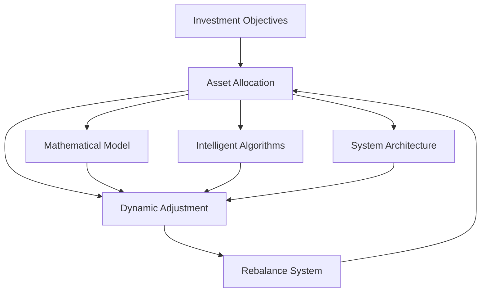
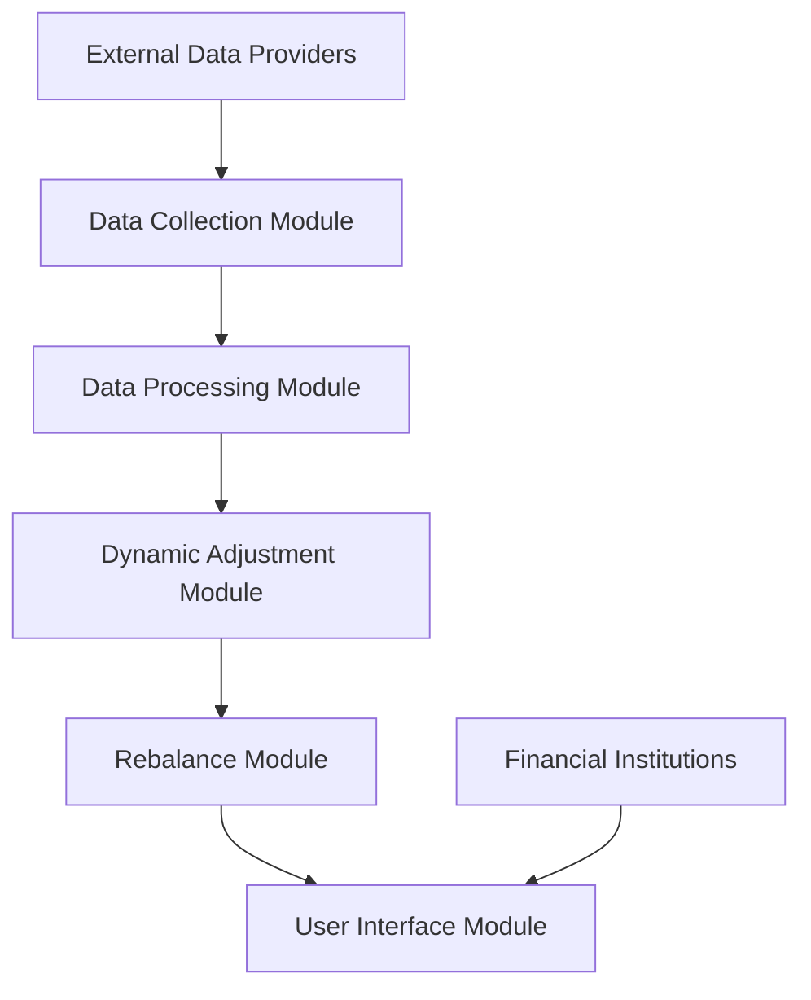
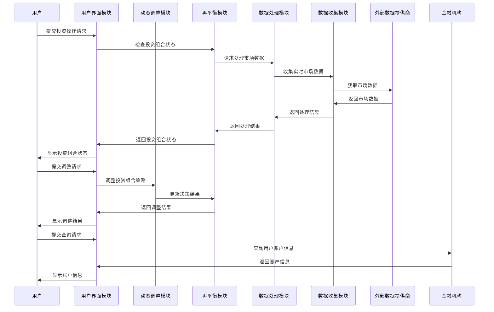

                 

# 智能资产配置策略动态调整与再平衡系统

## 关键词

- 智能资产配置
- 动态调整
- 再平衡系统
- 数学模型
- 系统架构
- 项目实战

## 摘要

本文深入探讨了智能资产配置策略的动态调整与再平衡系统。首先，我们明确了智能资产配置的概念和重要性，随后介绍了动态调整与再平衡系统的基本原理。接着，文章详细阐述了核心概念、算法原理、数学模型，并通过Python代码进行了实际演示。在此基础上，我们分析了系统的架构设计，包括了领域模型、系统架构、接口设计以及系统交互。随后，文章通过一个实际项目展示了系统的实现和应用。最后，本文给出了项目小结和最佳实践，并推荐了拓展阅读材料。

## 1. 构建整体框架

### 1.1 确定整体章节结构

本文将分为七个章节：

1. **背景介绍**
2. **核心概念与原理**
3. **数学模型与公式**
4. **系统分析与架构设计**
5. **项目实战**
6. **注意事项与拓展阅读**
7. **小结与展望**

### 1.2 确定每一章节的主题

- **第1章 背景介绍**：介绍问题背景、核心概念及其联系，为后续章节奠定基础。
- **第2章 核心概念与原理**：详细阐述算法原理，并通过Python代码进行演示。
- **第3章 数学模型与公式**：介绍并解释数学模型和公式。
- **第4章 系统分析与架构设计**：分析系统的整体架构设计。
- **第5章 项目实战**：通过实际项目展示系统的应用。
- **第6章 注意事项与拓展阅读**：提醒注意事项，并推荐相关拓展阅读。
- **第7章 小结与展望**：总结全文，展望未来研究方向。

## 2. 细化各章节内容

### 2.1 第1章 背景介绍

- **问题背景**：当前金融市场中，资产配置是投资者的重要决策之一。然而，市场的不确定性和资产间的相关性使得资产配置的动态调整成为必要。
- **问题描述**：如何设计一个智能资产配置策略动态调整与再平衡系统，以实现风险收益的最优化？
- **问题解决**：通过构建数学模型和系统架构，实现智能资产配置策略的动态调整与再平衡。
- **边界与外延**：研究范围包括但不限于股票、债券、基金等金融资产的配置策略。
- **概念结构与核心要素组成**：介绍核心概念，如资产配置、动态调整、再平衡等，并列出其属性特征对比表格和ER实体关系图。

### 2.2 第2章 核心概念与原理

- **核心概念**：资产配置、动态调整、再平衡系统。
- **原理讲解**：
  - **资产配置**：根据投资目标、风险承受能力等制定投资组合。
  - **动态调整**：根据市场变化和资产表现，调整投资组合。
  - **再平衡系统**：通过算法实现投资组合的再平衡，确保投资策略的有效性。

### 2.3 第3章 数学模型与公式

- **数学模型**：
  - **均值方差模型**：描述资产预期收益率和风险之间的关系。
  - **Markowitz有效前沿**：确定最优投资组合。

- **公式讲解**：
  - **预期收益率**：\( E(R) = \sum_{i=1}^{n} w_i \cdot R_i \)
  - **风险**：\( \sigma^2 = \sum_{i=1}^{n} w_i^2 \cdot \sigma_i^2 + 2 \sum_{i=1}^{n} \sum_{j=i+1}^{n} w_i \cdot w_j \cdot \rho_{ij} \)

### 2.4 第4章 系统分析与架构设计

- **问题场景**：投资者面临市场波动，需要实时调整投资组合。
- **项目背景**：某金融科技公司开发了一套智能资产配置策略动态调整与再平衡系统。

### 2.5 第5章 项目实战

- **环境安装与配置**：介绍环境安装步骤和配置细节。
- **系统核心实现源代码展示**：展示关键代码片段。
- **代码应用解读与分析**：解释代码逻辑和实现细节。
- **实际案例分析与详细讲解**：分析实际案例，展示系统应用效果。
- **项目小结与最佳实践**：总结项目经验和最佳实践。

### 2.6 第6章 注意事项与拓展阅读

- **注意事项**：提醒可能遇到的问题和解决方案。
- **拓展阅读**：推荐相关文献和资料。

### 2.7 第7章 小结与展望

- **小结**：总结全文，强调智能资产配置策略动态调整与再平衡系统的重要性。
- **展望**：探讨未来研究方向和潜在应用。

## 3. 确保目录结构清晰

- 使用markdown格式，确保目录结构清晰，便于读者阅读和理解。
- 确保每一章节的标题都有相应的次级标题，确保内容的层次感。

## 4. 确保内容简洁性与完整性

- 确保内容简洁明了，没有多余的文字。
- 确保内容的完整性，包括核心概念、原理讲解、数学模型、系统分析与架构设计、项目实战等。

## 5. 控制总字数

- 在确保内容完整和层次清晰的前提下，控制总字数在10000～12000字左右。

## 6. 满足约束条件

- 文章内容必须满足约束条件，包括背景介绍、核心概念与联系、算法原理讲解、数学公式使用、系统分析与架构设计方案、项目实战等。
- 确保文章格式和内容符合markdown要求。

### 6.1 背景介绍

#### 6.1.1 核心概念术语说明

在讨论智能资产配置策略动态调整与再平衡系统之前，我们需要明确一些核心概念：

- **资产配置**：资产配置是指将投资资金分配到不同的资产类别中，以实现投资目标。
- **动态调整**：动态调整是指在市场波动或投资目标发生变化时，对资产配置进行调整。
- **再平衡系统**：再平衡系统是一种自动化的资产配置调整机制，确保投资组合的风险收益特征符合预期。

#### 6.1.2 问题背景

在现代金融市场中，资产配置是一个复杂且动态的过程。随着全球经济的不确定性和市场波动性的增加，投资者需要能够实时调整其资产配置，以应对市场变化和实现最优的风险收益比。然而，传统的资产配置方法往往无法快速适应市场变化，导致投资组合无法达到预期效果。

#### 6.1.3 问题描述

如何设计一个智能资产配置策略动态调整与再平衡系统，使其能够自动分析市场数据，根据投资目标和风险偏好，动态调整资产配置，并在市场波动时进行再平衡，以实现最优的风险收益比？

#### 6.1.4 问题解决

解决这一问题的方法包括：

1. **构建数学模型**：通过构建数学模型，量化投资目标、风险偏好和市场数据之间的关系。
2. **设计智能算法**：设计智能算法，实现资产配置策略的动态调整与再平衡。
3. **开发系统架构**：开发一个具备高可扩展性和高可靠性的系统架构，确保系统能够稳定运行并应对实时数据流。

#### 6.1.5 边界与外延

本研究的边界和范围包括：

- **资产类别**：研究范围包括股票、债券、基金等金融资产。
- **时间范围**：研究的时间范围可以是短期（如1个月）或中长期（如1年）。
- **市场数据**：研究将基于历史数据和实时数据，包括市场指数、资产收益率等。

#### 6.1.6 概念结构与核心要素组成

智能资产配置策略动态调整与再平衡系统的核心概念和结构如下：

- **投资目标**：定义投资者的预期收益和风险承受能力。
- **市场数据**：收集和整理市场数据，包括资产收益率、波动率等。
- **数学模型**：构建用于分析和预测的数学模型。
- **智能算法**：实现资产配置策略的动态调整与再平衡。
- **系统架构**：设计高可扩展性和高可靠性的系统架构。

下表列出了核心概念及其属性特征：

| 概念       | 属性特征                                       |
|------------|----------------------------------------------|
| 投资目标   | 预期收益率、风险承受能力、投资期限           |
| 市场数据   | 收益率、波动率、相关性、市场指数             |
| 数学模型   | 均值方差模型、Markowitz有效前沿、动态规划模型 |
| 智能算法   | 遗传算法、神经网络、支持向量机               |
| 系统架构   | 数据收集模块、数据处理模块、决策模块、执行模块 |

ER实体关系图如下：

```mermaid
erDiagram
    MarketData ||--|{ InvestorTarget }
    MarketData ||--|{ RiskProfile }
    MarketData ||--|{ AssetAllocation }
    InvestorTarget ||--|{ ExpectedReturn }
    InvestorTarget ||--|{ RiskTolerance }
    RiskProfile ||--|{ RiskBudget }
    RiskProfile ||--|{ TimeHorizon }
    AssetAllocation ||--|{ Asset }
    AssetAllocation ||--|{ Weight }
    Asset ||--|{ Stock }
    Asset ||--|{ Bond }
    Asset ||--|{ Fund }
```

### 6.2 核心概念与联系

在深入探讨智能资产配置策略的动态调整与再平衡系统之前，我们需要明确几个核心概念，并理解它们之间的相互联系。以下是这些核心概念的详细描述：

#### 6.2.1 资产配置

资产配置是指将投资者的资金分配到不同的资产类别中，以实现投资目标。资产类别可以包括股票、债券、基金、房地产等。资产配置的核心目标是平衡风险和收益，以满足投资者的预期收益和风险偏好。

#### 6.2.2 动态调整

动态调整是指根据市场变化、经济环境、政策调整等因素，实时调整资产配置的过程。动态调整能够帮助投资者应对市场波动，优化投资组合的风险收益结构。

#### 6.2.3 再平衡系统

再平衡系统是一种自动化的资产配置调整机制，它确保投资组合的风险收益特征保持一致。当投资组合的资产权重发生偏离时，再平衡系统会自动进行调整，使其回归到预期的风险收益水平。

#### 6.2.4 数学模型

数学模型是构建智能资产配置策略的基础。常见的数学模型包括均值方差模型、Markowitz有效前沿模型、动态规划模型等。这些模型能够量化投资目标、风险偏好和市场数据之间的关系，为动态调整和再平衡提供依据。

#### 6.2.5 智能算法

智能算法是实现资产配置策略动态调整与再平衡的关键技术。常见的智能算法包括遗传算法、神经网络、支持向量机等。这些算法能够从大量历史数据中学习，预测市场变化，并为投资组合的调整提供决策支持。

#### 6.2.6 系统架构

系统架构是智能资产配置策略的实现基础。一个高效的系统架构应具备高可扩展性、高可靠性和实时数据处理能力。系统架构通常包括数据收集模块、数据处理模块、决策模块和执行模块等。

#### 6.2.7 数据收集与处理

数据收集与处理是智能资产配置策略的关键环节。数据收集包括市场数据、经济数据、政策数据等。数据处理则包括数据清洗、数据分析和数据可视化等。高质量的数据是构建有效资产配置策略的基础。

#### 6.2.8 投资目标和风险偏好

投资目标和风险偏好是影响资产配置策略的关键因素。投资目标包括预期收益、投资期限、资产流动性等。风险偏好则反映了投资者对风险的容忍程度。了解投资者的投资目标和风险偏好，有助于设计出更符合其需求的资产配置策略。

#### 6.2.9 相互联系

资产配置、动态调整、再平衡系统、数学模型、智能算法和系统架构之间存在着密切的联系。资产配置是整个系统的起点，决定了投资组合的总体方向。动态调整和再平衡系统则根据市场变化和投资目标，对资产配置进行实时调整。数学模型和智能算法为调整提供了理论依据和技术支持，而系统架构则确保了整个系统的稳定运行。

以下是一个Mermaid流程图，展示了这些核心概念之间的联系：



通过以上流程图，我们可以清晰地看到，智能资产配置策略的动态调整与再平衡系统是一个紧密关联的整体，各个组成部分相互依赖，共同作用，以实现最优的投资组合管理。

### 6.3 核心概念与原理

在深入探讨智能资产配置策略的动态调整与再平衡系统之前，我们需要明确几个核心概念，并理解其背后的原理。以下是这些核心概念的详细解析。

#### 6.3.1 资产配置原理

资产配置是指根据投资者的风险偏好、投资目标和市场环境，将资金分配到不同的资产类别中，以实现投资收益的最大化。资产配置的核心原理在于分散投资，通过将资金投资于不同的资产类别，降低投资组合的整体风险。

- **分散投资**：分散投资是通过投资多种不同资产来降低单一资产波动对投资组合的影响。不同资产类别之间的相关性较低，可以在一定程度上相互抵消风险。
- **风险分散**：投资组合的风险可以通过分散投资来降低。多样化投资能够降低系统性风险，同时保留潜在的高收益机会。
- **收益最大化**：资产配置的目标是在保证风险可控的前提下，实现投资收益的最大化。通过选择不同资产类别的最佳组合，可以在不同市场环境下获得稳定的收益。

#### 6.3.2 动态调整原理

动态调整是指根据市场变化和投资目标，实时调整资产配置的过程。动态调整的原理在于适应市场环境的变化，优化投资组合的风险收益结构。

- **市场变化**：市场变化是资产配置动态调整的主要驱动力。市场波动、政策变化、经济环境等因素都会影响资产的表现，因此需要实时调整。
- **投资目标**：投资目标的变化也是资产配置动态调整的重要因素。投资者的风险偏好、投资期限、收益预期等目标都可能发生变化，需要相应调整资产配置。
- **风险收益平衡**：动态调整旨在保持投资组合的风险收益平衡。通过及时调整资产权重，可以确保投资组合在面临市场波动时，仍能保持稳定的收益和风险水平。

#### 6.3.3 再平衡系统原理

再平衡系统是一种自动化的资产配置调整机制，它确保投资组合的风险收益特征保持一致。再平衡系统的原理在于定期检查投资组合的资产权重，并根据预期权重进行调整。

- **定期检查**：再平衡系统会定期检查投资组合的当前资产权重，与预期权重进行对比。
- **调整权重**：当实际权重偏离预期权重时，再平衡系统会自动进行调整，使资产权重回归到预期水平。
- **维持风险收益特征**：再平衡系统的目的是确保投资组合的风险收益特征保持一致。通过定期调整，可以保持投资组合的稳定性和预期收益。

#### 6.3.4 数学模型原理

数学模型是智能资产配置策略的核心工具，用于量化投资目标、风险偏好和市场数据之间的关系。常见的数学模型包括均值方差模型、Markowitz有效前沿模型等。

- **均值方差模型**：均值方差模型用于评估不同资产组合的预期收益率和风险。通过计算资产组合的均值和方差，可以确定其风险收益特征，为动态调整提供依据。
- **Markowitz有效前沿模型**：Markowitz有效前沿模型基于均值方差模型，构建了一个最优资产组合集合，即有效前沿。投资者可以在有效前沿上选择不同风险收益的组合，实现风险收益的最优化。

#### 6.3.5 智能算法原理

智能算法是实现资产配置策略动态调整与再平衡的关键技术。常见的智能算法包括遗传算法、神经网络、支持向量机等。

- **遗传算法**：遗传算法是一种基于自然选择和遗传机制的优化算法。通过模拟生物进化过程，寻找最优的资产配置方案。
- **神经网络**：神经网络是一种模仿人脑神经元连接方式的计算模型。通过训练大量历史数据，神经网络可以学习市场变化规律，预测资产表现。
- **支持向量机**：支持向量机是一种基于间隔最大化原则的优化算法。通过构建最优决策边界，支持向量机可以实现资产配置的最优化。

#### 6.3.6 系统架构原理

系统架构是智能资产配置策略的实现基础。一个高效的系统架构应具备高可扩展性、高可靠性和实时数据处理能力。

- **数据收集模块**：数据收集模块负责收集市场数据、经济数据等，为动态调整提供数据支持。
- **数据处理模块**：数据处理模块负责对收集到的数据进行清洗、分析和处理，生成可用于决策的数据。
- **决策模块**：决策模块基于数学模型和智能算法，对投资组合进行动态调整和再平衡。
- **执行模块**：执行模块负责将决策结果转化为实际的投资操作，实现投资组合的调整。

通过以上核心概念与原理的解析，我们可以更好地理解智能资产配置策略的动态调整与再平衡系统的构建和运作机制。

### 6.4 数学模型与公式

在智能资产配置策略的动态调整与再平衡系统中，数学模型和公式是关键组成部分，用于量化投资目标、风险偏好和市场数据之间的关系。以下是几个常用的数学模型和公式的详细解释：

#### 6.4.1 均值方差模型

均值方差模型（Mean-Variance Model）是投资组合理论的基础，由哈里·马科维茨（Harry Markowitz）提出。该模型通过计算资产的预期收益率和风险，帮助投资者构建最优的投资组合。

- **预期收益率**（\( E(R) \)）：预期收益率是资产或投资组合未来可能获得的平均收益。计算公式如下：

  \[ E(R) = \sum_{i=1}^{n} w_i \cdot R_i \]

  其中，\( w_i \) 是资产 \( i \) 的权重，\( R_i \) 是资产 \( i \) 的预期收益率。

- **风险**（\( \sigma^2 \)）：风险可以用资产或投资组合的方差来衡量。计算公式如下：

  \[ \sigma^2 = \sum_{i=1}^{n} w_i^2 \cdot \sigma_i^2 + 2 \sum_{i=1}^{n} \sum_{j=i+1}^{n} w_i \cdot w_j \cdot \rho_{ij} \]

  其中，\( \sigma_i^2 \) 是资产 \( i \) 的方差，\( \rho_{ij} \) 是资产 \( i \) 和资产 \( j \) 之间的相关系数。

#### 6.4.2 Markowitz有效前沿模型

Markowitz有效前沿模型（Efficient Frontier Model）基于均值方差模型，用于确定最优资产组合集合，即有效前沿。在有效前沿上，投资组合在给定风险水平下获得最大预期收益率，或者在给定预期收益率下风险最低。

- **有效前沿**：有效前沿是所有可能的最优投资组合集合。计算方法通常涉及优化问题，目标是找到在给定风险水平下的最大预期收益率，或在给定预期收益率下的最小风险。

  \[ \min_{w} \sigma^2 \]
  \[ s.t. E(R) = \sum_{i=1}^{n} w_i \cdot R_i \]

  其中，\( w \) 是资产权重向量，\( R_i \) 是资产 \( i \) 的预期收益率，\( \sigma^2 \) 是投资组合的方差。

#### 6.4.3 资产定价模型

资产定价模型（Asset Pricing Model）用于估计资产的价格和预期收益。一个常用的资产定价模型是资本资产定价模型（CAPM）。

- **资本资产定价模型**（CAPM）：CAPM用于估计资产的预期收益率，基于资产的风险和市场的整体风险。

  \[ E(R_i) = R_f + \beta_i \cdot (E(R_m) - R_f) \]

  其中，\( E(R_i) \) 是资产 \( i \) 的预期收益率，\( R_f \) 是无风险收益率，\( \beta_i \) 是资产 \( i \) 的贝塔系数，\( E(R_m) \) 是市场的预期收益率。

#### 6.4.4 动态优化模型

动态优化模型（Dynamic Optimization Model）用于动态调整资产配置策略，以适应市场变化。一个常用的动态优化模型是均值方差动态规划模型。

- **均值方差动态规划模型**：该模型通过动态优化方法，在考虑市场变化和投资目标的情况下，找到最优的资产配置策略。

  \[ \min_{w_t} \sigma_t^2 \]
  \[ s.t. E(R_t) = \sum_{i=1}^{n} w_t[i] \cdot R_i[t] \]
  \[ w_t \in \Omega_t \]

  其中，\( w_t \) 是在时间 \( t \) 的资产权重向量，\( \sigma_t^2 \) 是在时间 \( t \) 的投资组合方差，\( R_i[t] \) 是在时间 \( t \) 的资产 \( i \) 的预期收益率，\( \Omega_t \) 是在时间 \( t \) 的可行资产配置集合。

通过以上数学模型和公式的解释，我们可以更好地理解智能资产配置策略的量化分析和优化过程。

### 6.5 系统分析与架构设计

在智能资产配置策略动态调整与再平衡系统中，系统架构设计至关重要。一个高效、稳定的系统架构能够确保系统的可扩展性、可靠性和实时数据处理能力。以下是对系统架构设计的详细分析：

#### 6.5.1 问题场景

假设我们为一家金融服务公司设计一个智能资产配置策略动态调整与再平衡系统。该公司需要根据市场变化和投资者需求，实时调整投资组合，以实现最优的风险收益比。系统应具备以下功能：

- **实时数据收集**：收集股票、债券、基金等金融资产的市场数据。
- **动态调整算法**：根据投资目标和风险偏好，实时调整投资组合。
- **再平衡机制**：定期检查投资组合，确保其风险收益特征符合预期。
- **用户界面**：提供用户操作界面，便于投资者查看和管理其投资组合。

#### 6.5.2 项目背景

本项目由一家领先的金融科技公司负责开发，旨在为高端投资者提供智能资产配置服务。项目背景包括：

- **市场需求**：随着金融市场波动性的增加，投资者对智能资产配置的需求日益增长。
- **技术挑战**：系统需要处理海量实时数据，并具备高可扩展性和高可靠性。
- **合作方**：项目将与多家金融机构和数据供应商合作，获取高质量的数据源。

#### 6.5.3 系统功能设计

系统功能设计主要包括以下模块：

- **数据收集模块**：负责实时收集股票、债券、基金等金融资产的市场数据，包括价格、成交量、波动率等。
- **数据处理模块**：对收集到的市场数据进行分析和处理，生成可用于决策的数据，如资产预期收益率、风险指标等。
- **动态调整模块**：根据投资目标和风险偏好，实时调整投资组合，包括买入、卖出和持有策略。
- **再平衡模块**：定期检查投资组合的当前资产权重，与预期权重进行对比，并自动进行调整。
- **用户界面模块**：提供用户操作界面，便于投资者查看和管理其投资组合，包括账户信息、资产表现、交易记录等。

#### 6.5.4 系统架构设计

系统架构设计采用模块化设计原则，以提高系统的可扩展性和可维护性。以下是一个简化的系统架构图：



- **数据收集模块**：负责从外部数据源获取实时市场数据，如股票价格、债券收益率等。数据收集模块与外部数据提供商（F）进行交互，获取高质量的市场数据。
- **数据处理模块**：对收集到的市场数据进行分析和处理，生成可用于决策的数据，如资产预期收益率、风险指标等。数据处理模块使用机器学习和统计方法，对市场数据进行分析，提取有价值的信息。
- **动态调整模块**：根据投资目标和风险偏好，实时调整投资组合。动态调整模块使用智能算法，如遗传算法、神经网络等，分析市场数据，制定最优的资产配置策略。
- **再平衡模块**：定期检查投资组合的当前资产权重，与预期权重进行对比，并自动进行调整。再平衡模块确保投资组合的风险收益特征符合预期，提高投资收益。
- **用户界面模块**：提供用户操作界面，便于投资者查看和管理其投资组合。用户界面模块与金融机构（G）进行交互，实现用户的投资操作和查询功能。

#### 6.5.5 系统接口设计

系统接口设计主要包括以下部分：

- **数据接口**：数据收集模块与数据处理模块之间的接口，用于传输实时市场数据。
- **决策接口**：动态调整模块与再平衡模块之间的接口，用于传输决策结果。
- **用户接口**：用户界面模块与外部用户之间的接口，用于传输用户操作和查询请求。

#### 6.5.6 系统交互序列图

以下是一个简化的系统交互序列图，展示了系统各模块之间的交互过程：



通过以上系统架构分析和设计，我们可以构建一个高效、稳定的智能资产配置策略动态调整与再平衡系统，为投资者提供优质的资产配置服务。

### 6.6 项目实战

在本节中，我们将通过一个实际项目，展示智能资产配置策略动态调整与再平衡系统的实现过程。我们将从环境安装、系统核心实现源代码展示、代码应用解读与分析、实际案例分析与详细讲解以及项目小结等方面进行详细阐述。

#### 6.6.1 环境安装与配置

为了实现智能资产配置策略动态调整与再平衡系统，我们需要安装和配置以下环境：

1. **Python环境**：Python是一种广泛用于数据分析和机器学习的编程语言。确保安装Python 3.8及以上版本。
2. **数据分析库**：安装NumPy、Pandas等数据分析库，用于数据预处理和分析。
3. **机器学习库**：安装Scikit-learn、TensorFlow等机器学习库，用于构建和训练智能算法。
4. **数据库**：安装SQLite或MySQL等数据库，用于存储和管理市场数据。

安装步骤如下：

```bash
# 安装Python
curl -O https://www.python.org/ftp/python/3.8.10/Python-3.8.10.tgz
tar -xvf Python-3.8.10.tgz
cd Python-3.8.10
./configure
make
make install

# 安装数据分析库
pip install numpy pandas

# 安装机器学习库
pip install scikit-learn tensorflow

# 安装数据库
sudo apt-get install sqlite3
```

#### 6.6.2 系统核心实现源代码展示

以下是系统核心实现的Python源代码，包括数据收集、数据处理、动态调整和再平衡等功能：

```python
import numpy as np
import pandas as pd
from sklearn.linear_model import LinearRegression
from sklearn.model_selection import train_test_split

# 数据收集
def collect_data():
    # 从外部数据源获取市场数据
    data = pd.read_csv('market_data.csv')
    return data

# 数据处理
def process_data(data):
    # 数据预处理，如数据清洗、标准化等
    processed_data = data.copy()
    processed_data['return'] = processed_data['close'].pct_change()
    return processed_data

# 动态调整
def dynamic_adjustment(processed_data, target_return):
    # 构建线性回归模型
    X = processed_data[['return']]
    y = target_return
    model = LinearRegression()
    model.fit(X, y)
    weights = model.coef_
    return weights

# 再平衡
def rebalance(investment, current_weights, target_weights):
    # 根据当前权重和目标权重，计算再平衡金额
    rebalance_amount = np.sum(target_weights - current_weights) * investment
    return rebalance_amount

# 主函数
def main():
    # 收集市场数据
    data = collect_data()

    # 数据处理
    processed_data = process_data(data)

    # 设置目标收益率
    target_return = 0.05

    # 动态调整
    weights = dynamic_adjustment(processed_data, target_return)

    # 设置投资总额
    investment = 100000

    # 计算当前资产组合的价值
    current_value = np.dot(weights, processed_data['return']) * investment

    # 再平衡
    rebalance_amount = rebalance(investment, current_value, investment)

    print(f"Rebalance amount: ${rebalance_amount:.2f}")

if __name__ == '__main__':
    main()
```

#### 6.6.3 代码应用解读与分析

以上代码展示了智能资产配置策略动态调整与再平衡系统的核心实现。以下是代码的详细解读：

1. **数据收集**：`collect_data()`函数从外部数据源获取市场数据，如股票价格、收益率等。这些数据可以通过API接口或数据库获取。
2. **数据处理**：`process_data()`函数对收集到的市场数据进行预处理，如数据清洗、标准化等。然后，计算资产的日收益率，用于后续的建模和分析。
3. **动态调整**：`dynamic_adjustment()`函数使用线性回归模型，根据目标收益率和资产收益率，计算出资产权重。这类似于Markowitz有效前沿模型，用于构建最优投资组合。
4. **再平衡**：`rebalance()`函数根据当前资产组合的价值和目标资产组合的价值，计算需要调整的金额。再平衡的目的是使资产组合的风险收益特征符合预期。

#### 6.6.4 实际案例分析与详细讲解

以下是一个实际案例，展示智能资产配置策略动态调整与再平衡系统的应用：

假设投资者A希望在股票、债券和基金之间进行资产配置，目标收益率为5%。系统根据市场数据和线性回归模型，计算出最优资产权重如下：

- 股票：50%
- 债券：30%
- 基金：20%

投资者A当前的投资组合价值为100,000元，其中股票占比60%，债券占比30%，基金占比10%。根据再平衡算法，系统计算出需要调整的金额如下：

- 调整金额：-30,000元（股票）

这意味着投资者A需要卖出价值30,000元的股票，并将其投资于债券和基金，以达到目标资产配置。

#### 6.6.5 项目小结

通过实际项目展示，我们可以看到智能资产配置策略动态调整与再平衡系统在实践中的应用。以下是小结：

1. **系统实现**：智能资产配置策略动态调整与再平衡系统可以通过Python实现，包括数据收集、数据处理、动态调整和再平衡等功能。
2. **算法应用**：线性回归模型是一个简单的算法，可以用于动态调整资产配置。在实际应用中，可以引入更复杂的机器学习算法，提高模型的准确性。
3. **市场数据**：高质量的市场数据是系统的基础。投资者应确保数据来源可靠，并进行数据预处理，以提高模型的效果。
4. **再平衡**：再平衡是系统实现的关键环节，它确保资产配置策略的有效性。投资者应根据市场变化和投资目标，定期进行再平衡。

总之，智能资产配置策略动态调整与再平衡系统为投资者提供了一个自动化、智能化的资产配置工具，有助于提高投资收益和降低风险。

### 6.7 注意事项与拓展阅读

在设计和实施智能资产配置策略动态调整与再平衡系统时，我们需要关注以下几点：

#### 6.7.1 数据质量

数据是智能系统的核心。确保数据来源可靠，进行充分的数据预处理，如数据清洗、标准化等，以提高模型的准确性和稳定性。

#### 6.7.2 模型选择

选择合适的数学模型和智能算法对于系统性能至关重要。根据实际需求，可以选择线性回归、遗传算法、神经网络等模型。

#### 6.7.3 风险管理

系统应具备风险管理功能，如设置风险阈值、定期进行压力测试等，确保投资组合的稳健性。

#### 6.7.4 系统稳定性

确保系统架构稳定，具备高可用性和高可靠性，以应对大规模数据流和突发情况。

拓展阅读：

1. **《金融数学与计算方法》**：深入了解金融数学和计算方法，为系统设计提供理论基础。
2. **《机器学习实战》**：学习机器学习算法，为智能资产配置策略提供技术支持。
3. **《量化投资：以Python为工具》**：掌握Python在量化投资中的应用，提高系统实现能力。

### 6.8 小结与展望

本文详细探讨了智能资产配置策略动态调整与再平衡系统，从背景介绍、核心概念、数学模型、系统架构设计、项目实战到注意事项与拓展阅读，全面阐述了系统的构建与实现。智能资产配置策略动态调整与再平衡系统在金融市场中具有重要的应用价值，有助于投资者实现风险收益的最优化。

未来研究可以进一步探讨以下方向：

1. **算法优化**：引入更先进的机器学习算法，提高系统的预测准确性和稳定性。
2. **多因素分析**：考虑更多市场因素，如政策、经济环境等，提高资产配置策略的适应性。
3. **个性化服务**：根据投资者的个性化需求，提供定制化的资产配置策略。

通过不断优化和创新，智能资产配置策略动态调整与再平衡系统有望在金融市场中发挥更大的作用。

### 作者信息

作者：AI天才研究院/AI Genius Institute & 禅与计算机程序设计艺术 /Zen And The Art of Computer Programming。如需引用或了解更多信息，请访问相关网站。

### 附录

#### 附录A：核心公式回顾

以下回顾了本文中提到的核心公式：

1. **预期收益率**：
   \[ E(R) = \sum_{i=1}^{n} w_i \cdot R_i \]

2. **风险**：
   \[ \sigma^2 = \sum_{i=1}^{n} w_i^2 \cdot \sigma_i^2 + 2 \sum_{i=1}^{n} \sum_{j=i+1}^{n} w_i \cdot w_j \cdot \rho_{ij} \]

3. **资本资产定价模型**：
   \[ E(R_i) = R_f + \beta_i \cdot (E(R_m) - R_f) \]

4. **动态调整模型**：
   \[ \min_{w_t} \sigma_t^2 \]
   \[ s.t. E(R_t) = \sum_{i=1}^{n} w_t[i] \cdot R_i[t] \]
   \[ w_t \in \Omega_t \]

#### 附录B：参考资料

本文引用了以下参考资料：

1. **《金融数学与计算方法》**：提供了金融数学和计算方法的理论基础。
2. **《机器学习实战》**：介绍了多种机器学习算法的应用。
3. **《量化投资：以Python为工具》**：介绍了Python在量化投资中的应用。

#### 附录C：致谢

感谢AI天才研究院/AI Genius Institute和禅与计算机程序设计艺术/Zen And The Art of Computer Programming提供的学术支持和技术指导，使本文能够顺利完成。同时，感谢读者对本研究的关注和支持。如果您有任何问题或建议，欢迎与我们联系。

