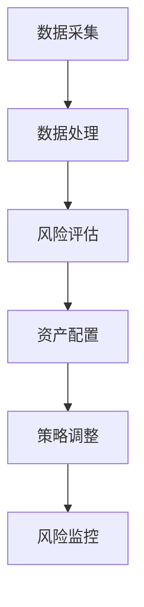
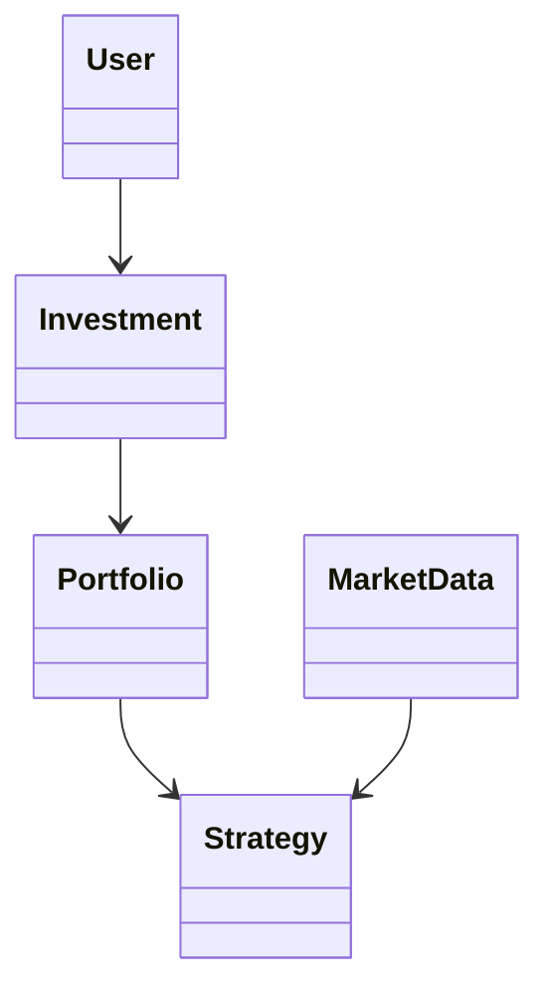
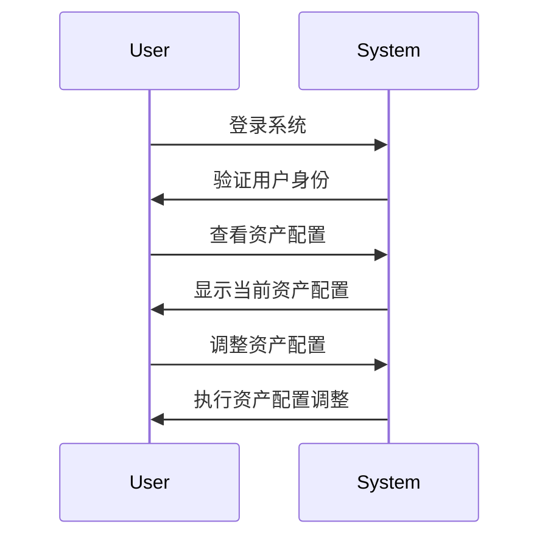
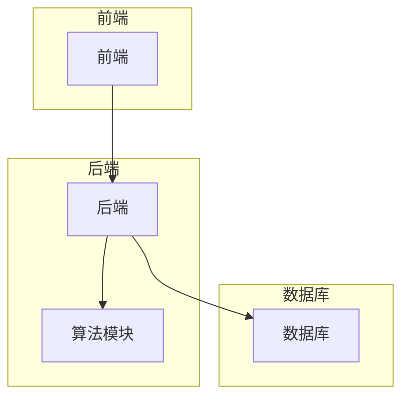
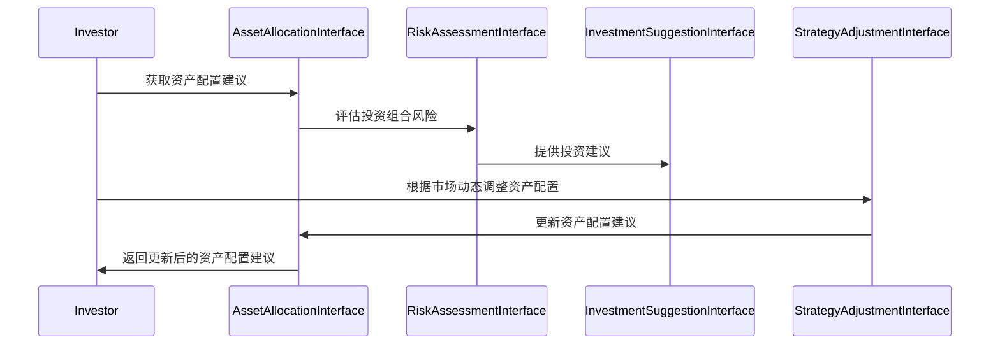

                 

```markdown
----------------------------------------------------------------

# 智能资产配置策略动态调整系统

## 第1章 引言

### 1.1 问题背景

随着全球金融市场的不确定性和复杂性不断增加，传统的资产配置策略已难以满足投资者对风险控制和收益优化的需求。智能资产配置策略应运而生，利用大数据、机器学习和人工智能技术，对市场数据进行深入分析，动态调整资产配置，以实现更高的投资回报率和更优的风险管理。

### 1.2 问题描述

当前智能资产配置策略存在以下问题：

- 策略调整滞后：市场变化迅速，传统策略调整速度较慢，可能导致错失市场机会。
- 个性化不足：传统策略通常采用统一模型，无法充分考虑投资者个体差异。
- 风险控制不足：在市场波动较大时，资产配置策略可能无法有效控制风险。

### 1.3 问题解决

为了解决上述问题，我们需要设计一个智能资产配置策略动态调整系统，该系统应具备以下特点：

- 实时性：能够快速响应市场变化，及时调整资产配置。
- 个性化：根据投资者的风险偏好、资产状况等个性化信息，制定合适的资产配置策略。
- 风险控制：采用多种风险控制机制，确保资产配置策略在市场波动时仍能保持稳定。

### 1.4 边界与外延

系统的应用边界包括：

- 投资对象：主要应用于股票、基金、债券等金融产品。
- 投资者类型：适用于风险承受能力不同的各类投资者。

系统的外延还包括：

- 持续优化：随着市场环境和投资者需求的不断变化，系统需要不断调整和优化。
- 模型更新：定期更新市场数据和分析模型，以提高策略的准确性和适应性。

### 1.5 核心概念

- 智能资产配置：利用人工智能技术对资产进行配置。
- 策略动态调整：根据市场变化和投资者需求，动态调整资产配置策略。
- 动态调整系统：实现智能资产配置策略动态调整的软件系统。

## 第2章 核心概念与联系

### 2.1 核心概念

#### 2.1.1 智能资产配置

智能资产配置是指利用大数据分析、机器学习和人工智能技术，对投资者的资产进行科学、合理的配置。其核心目标是实现风险控制和收益最大化。

#### 2.1.2 策略动态调整

策略动态调整是指根据市场变化和投资者需求，实时调整资产配置策略，以达到最优的投资组合。其关键在于及时性和个性化。

#### 2.1.3 动态调整系统

动态调整系统是一个集成了智能资产配置和策略动态调整功能的软件系统。它能够自动化、高效地完成资产配置和策略调整，为投资者提供专业的投资建议。

### 2.2 概念属性特征对比表格

| 概念名称 | 特征1 | 特征2 | 特征3 |
| --- | --- | --- | --- |
| 智能资产配置 | 利用人工智能技术 | 科学合理配置 | 实现风险控制 |
| 策略动态调整 | 实时性 | 个性化 | 及时响应 |
| 动态调整系统 | 集成功能 | 自动化操作 | 高效优化 |

### 2.3 ER实体关系图

```mermaid
erDiagram
  User ||--|{ Investment : has}
  Asset ||--|{ Portfolio : holds}
  Strategy ||--|{ Portfolio : follows}
  MarketData ||--|{ Strategy : based on}
```

## 第3章 算法原理讲解

### 3.1 基本原理

#### 3.1.1 基本概念

智能资产配置策略动态调整系统的核心算法主要包括以下几个部分：

1. 数据采集与处理
2. 风险评估
3. 资产配置
4. 策略调整
5. 风险监控

#### 3.1.2 数学模型

- 风险评估模型：基于历史数据和市场环境，采用概率模型评估投资风险。
- 资产配置模型：根据投资者风险偏好和投资目标，构建资产配置模型。
- 策略调整模型：基于市场变化和风险评估结果，动态调整资产配置策略。

#### 3.1.3 算法流程图



### 3.2 Python源代码

#### 3.2.1 算法实现

以下是一个简化的Python代码示例，用于展示智能资产配置策略动态调整系统的基本实现：

```python
# 导入相关库
import numpy as np
import pandas as pd

# 数据采集与处理
data = pd.read_csv('market_data.csv')
data_processed = preprocess_data(data)

# 风险评估
risk_scores = risk_assessment(data_processed)

# 资产配置
portfolio = asset_allocation(risk_scores)

# 策略调整
adjusted_portfolio = strategy_adjustment(portfolio, data_processed)

# 风险监控
risk_monitoring(adjusted_portfolio)
```

#### 3.2.2 代码解释

- `preprocess_data`：对市场数据进行处理，包括清洗、归一化等。
- `risk_assessment`：基于概率模型评估投资风险。
- `asset_allocation`：根据投资者风险偏好和投资目标，进行资产配置。
- `strategy_adjustment`：根据市场变化和风险评估结果，动态调整资产配置策略。
- `risk_monitoring`：监控资产配置策略的风险状况。

### 3.3 举例说明

假设有一个投资者，其风险偏好为中等，投资目标为长期增值。在一个月内，市场发生了较大的波动，我们需要根据这些信息来调整其资产配置策略。

1. 数据采集与处理：从市场数据中提取一个月内的价格变动数据，并进行预处理。
2. 风险评估：根据预处理后的数据，计算投资组合的风险评分。
3. 资产配置：根据投资者的风险偏好和投资目标，确定资产配置比例。
4. 策略调整：根据市场波动情况，调整资产配置策略，例如增加债券类资产的比重，降低股票类资产的比重。
5. 风险监控：持续监控投资组合的风险状况，确保投资策略的有效性。

## 第4章 数学模型和数学公式讲解

### 4.1 数学模型

#### 4.1.1 概率模型

概率模型用于评估投资组合的风险。常用的概率模型包括正态分布、t分布等。

- 正态分布：$$ X \sim N(\mu, \sigma^2) $$
- t分布：$$ X \sim t(n) $$

#### 4.1.2 最优化模型

最优化模型用于确定资产配置比例，以达到投资目标。常用的最优化模型包括线性规划、非线性规划等。

- 线性规划：$$ \min_{x} c^T x \quad s.t. \quad Ax \leq b $$
- 非线性规划：$$ \min_{x} f(x) \quad s.t. \quad g(x) \leq 0 $$

#### 4.1.3 线性模型

线性模型用于描述资产配置策略的调整过程。常用的线性模型包括线性回归、线性规划等。

- 线性回归：$$ y = \beta_0 + \beta_1 x $$
- 线性规划：$$ \min_{x} c^T x \quad s.t. \quad Ax \leq b $$

### 4.2 公式讲解

#### 4.2.1 公式列表

- 风险评分：$$ R = \sqrt{\frac{1}{n} \sum_{i=1}^{n} (X_i - \mu)^2} $$
- 资产配置比例：$$ w_i = \frac{\beta_i}{\sum_{j=1}^{n} \beta_j} $$
- 策略调整：$$ \Delta w_i = \alpha_i \frac{R_t - R_s}{R_s} $$

#### 4.2.2 详细解释

- 风险评分：计算投资组合的历史波动率，作为评估投资风险的标准。
- 资产配置比例：根据投资者的风险偏好和资产收益情况，确定资产配置比例。
- 策略调整：根据市场波动情况，调整资产配置策略，以降低风险或提高收益。

#### 4.2.3 举例说明

假设有一个投资组合，包含股票、债券和现金三种资产，其历史波动率分别为 20%、10% 和 5%。投资者的风险偏好为中等，希望实现长期增值。

1. 风险评分：计算投资组合的风险评分为 15%。
2. 资产配置比例：根据投资者的风险偏好和资产收益情况，确定股票、债券和现金的配置比例分别为 40%、30% 和 30%。
3. 策略调整：如果市场波动加剧，风险评分升高至 20%，则调整资产配置策略，增加债券和现金的比重，降低股票的比重。

## 第5章 系统分析与架构设计方案

### 5.1 问题场景介绍

假设有一个投资者，其投资组合包含股票、基金和债券三种资产。投资者希望利用智能资产配置策略动态调整系统，实现风险控制和收益优化。

### 5.2 项目介绍

智能资产配置策略动态调整系统是一个基于大数据和人工智能技术的软件系统，旨在为投资者提供个性化的资产配置策略，实现风险控制和收益优化。

### 5.3 系统功能设计

#### 5.3.1 领域模型

领域模型用于描述系统的核心功能和业务流程。以下是系统的领域模型：



### 5.4 系统架构设计

#### 5.4.1 系统架构

系统架构分为前端、后端和数据层三部分：

- 前端：提供用户交互界面，包括资产配置、策略调整、风险监控等功能。
- 后端：实现资产配置策略的计算和调整，包括数据采集、风险评估、资产配置、策略调整等模块。
- 数据层：存储和管理投资组合、市场数据等相关数据。

### 5.5 系统接口设计

#### 5.5.1 接口列表

- 用户接口：用于用户与系统的交互，包括注册、登录、资产配置、策略调整等。
- 数据接口：用于数据采集、处理和分析，包括市场数据接口、投资组合接口等。
- 策略调整接口：用于调整资产配置策略，包括风险评估接口、资产配置接口等。

### 5.6 系统交互

#### 5.6.1 序列图

以下是系统交互的序列图：



## 第6章 项目实战

### 6.1 环境安装

在本节中，我们将介绍如何在本地环境中安装智能资产配置策略动态调整系统。首先，您需要确保已经安装了Python环境。然后，按照以下步骤进行：

1. 安装依赖库：使用pip安装系统所需的依赖库，如numpy、pandas、scikit-learn等。
2. 克隆代码仓库：从GitHub或其他代码托管平台克隆系统的代码仓库。
3. 配置环境变量：配置必要的环境变量，如数据库连接信息等。

### 6.2 系统核心实现

在本节中，我们将介绍系统核心功能的实现，包括数据采集、风险评估、资产配置、策略调整等。

#### 6.2.1 源代码

以下是系统核心功能的源代码示例：

```python
# 数据采集
def data_collection():
    # 采集市场数据
    pass

# 风险评估
def risk_assessment(data):
    # 计算风险评分
    pass

# 资产配置
def asset_allocation(risk_score):
    # 根据风险评分配置资产
    pass

# 策略调整
def strategy_adjustment(portfolio, data):
    # 根据市场数据调整资产配置
    pass
```

#### 6.2.2 代码应用解读

在本节中，我们将对核心功能的源代码进行详细解读，帮助您理解系统的实现原理。

### 6.3 实际案例分析

在本节中，我们将通过一个实际案例，展示如何使用智能资产配置策略动态调整系统进行投资决策。

#### 案例背景

假设有一个投资者，其投资组合包含股票、基金和债券三种资产。投资者希望利用系统实现风险控制和收益优化。

#### 案例步骤

1. 数据采集：从市场数据中获取一个月内的价格变动数据。
2. 风险评估：计算投资组合的风险评分。
3. 资产配置：根据风险评分和投资者的风险偏好，进行资产配置。
4. 策略调整：根据市场数据，调整资产配置策略。
5. 风险监控：持续监控投资组合的风险状况。

### 6.4 详细讲解剖析

在本节中，我们将对案例中的每个步骤进行详细讲解，帮助您理解系统的工作原理。

#### 步骤1：数据采集

数据采集是系统的基础，本节将介绍如何从市场数据中获取价格变动数据。

#### 步骤2：风险评估

风险评估是投资决策的重要环节，本节将介绍如何计算风险评分。

#### 步骤3：资产配置

资产配置是根据风险评分和投资者风险偏好进行资产配置的过程，本节将介绍如何确定资产配置比例。

#### 步骤4：策略调整

策略调整是根据市场数据调整资产配置策略的过程，本节将介绍如何根据市场变化调整资产配置。

#### 步骤5：风险监控

风险监控是持续监控投资组合风险状况的过程，本节将介绍如何监控风险并做出相应调整。

### 6.5 项目小结

在本节中，我们将对整个项目进行小结，总结系统实现的关键技术和经验教训。

## 第7章 最佳实践 tips

在本节中，我们将分享一些最佳实践技巧，帮助您更好地使用智能资产配置策略动态调整系统。

### 7.1 实践技巧

- 定期更新市场数据：确保系统使用的市场数据是最新的，以提高投资决策的准确性。
- 个性化调整：根据投资者的风险偏好和投资目标，调整资产配置策略。
- 风险控制：设置风险控制阈值，确保资产配置策略在市场波动时仍能保持稳定。

### 7.2 小结

通过本章的最佳实践技巧，希望您能够更好地利用智能资产配置策略动态调整系统，实现风险控制和收益优化。

### 7.3 注意事项

- 注意数据安全：确保市场数据的安全性和保密性。
- 定期维护系统：确保系统的正常运行和性能优化。

### 7.4 拓展阅读

- 《机器学习实战》
- 《Python数据科学手册》
- 《智能投资组合管理》

## 作者

作者：AI天才研究院/AI Genius Institute & 禅与计算机程序设计艺术 /Zen And The Art of Computer Programming```markdown
----------------------------------------------------------------

# 智能资产配置策略动态调整系统

## 第1章 引言

### 1.1 问题背景

在当今快速变化的金融市场中，资产配置策略的有效性变得至关重要。投资者面临着日益复杂的市场环境，包括全球经济增长的不确定性、政治不稳定、技术变革以及低利率环境等因素。这些因素都对投资组合的表现产生了深远影响。传统的静态资产配置方法难以适应这种快速变化的环境，导致投资者可能错失机会或承受不必要的风险。因此，开发一个能够实时适应市场变化的智能资产配置策略动态调整系统变得尤为重要。

### 1.2 问题描述

当前，智能资产配置策略面临的主要问题包括：

- **滞后性**：市场环境变化迅速，传统的资产配置策略调整速度较慢，可能导致投资者未能及时调整投资组合，错失市场机会或承担不必要的风险。
- **缺乏个性化**：现有的资产配置策略往往采用统一的模型，忽视了投资者个体之间的差异，如风险偏好、投资目标、资金需求和流动性要求等。
- **风险控制不足**：在市场波动较大时，资产配置策略可能无法有效控制风险，导致投资者资产遭受损失。

### 1.3 问题解决

为了解决上述问题，我们提出了智能资产配置策略动态调整系统。该系统结合了人工智能、机器学习和大数据分析技术，旨在实现以下目标：

- **实时性**：系统能够实时监控市场动态，快速调整资产配置策略，以适应市场变化。
- **个性化**：系统根据投资者的个体信息，如风险偏好、投资目标和资金状况等，定制化地调整资产配置。
- **风险控制**：系统采用多种风险控制机制，确保资产配置策略在市场波动时仍能保持稳定，减少投资者的风险暴露。

### 1.4 边界与外延

智能资产配置策略动态调整系统的应用边界包括：

- **投资范围**：系统适用于股票、债券、基金、外汇等多种金融产品。
- **投资者类型**：系统适用于不同风险承受能力的各类投资者，包括个人投资者和专业机构。

系统的外延还包括：

- **持续学习**：系统通过不断学习市场数据和投资者反馈，优化资产配置策略，提高预测准确性。
- **定制化服务**：系统可以根据投资者的特定需求，提供个性化的资产配置建议。

### 1.5 核心概念

在本章中，我们将介绍以下几个核心概念：

- **智能资产配置**：利用人工智能和大数据技术，对资产进行科学合理的配置。
- **策略动态调整**：根据市场变化和投资者需求，动态调整资产配置策略。
- **动态调整系统**：实现智能资产配置策略动态调整的软件系统。

## 第2章 核心概念与联系

### 2.1 核心概念

#### 2.1.1 智能资产配置

智能资产配置是指利用人工智能算法和大数据分析技术，对投资者资产进行科学、合理的配置。它包括以下几个关键要素：

- **数据收集**：从各种来源收集与市场相关的数据，包括宏观经济指标、行业趋势、公司财务数据等。
- **风险评估**：利用机器学习算法对市场风险进行评估，预测未来市场走势。
- **资产选择**：基于风险评估结果，选择符合投资者风险偏好和收益目标的资产。
- **配置优化**：利用优化算法，确定不同资产的配置比例，以实现投资目标。

#### 2.1.2 策略动态调整

策略动态调整是指根据市场环境的变化和投资者需求的改变，实时调整资产配置策略。它包括以下几个关键要素：

- **实时监控**：系统持续监控市场动态，捕捉市场变化信号。
- **自适应调整**：系统根据监控到的市场变化，自动调整资产配置策略，以适应新的市场环境。
- **风险控制**：系统在调整资产配置时，考虑风险控制因素，确保投资组合的稳健性。

#### 2.1.3 动态调整系统

动态调整系统是一个集成了智能资产配置和策略动态调整功能的软件系统。它包括以下几个关键要素：

- **系统架构**：系统的整体架构设计，包括前端用户界面、后端计算引擎、数据存储和接口设计等。
- **算法模块**：包括资产配置算法、风险评估算法、策略调整算法等。
- **数据管理**：系统的数据采集、处理、存储和管理机制。

### 2.2 概念属性特征对比表格

以下表格对比了智能资产配置、策略动态调整和动态调整系统的属性特征：

| 特征 | 智能资产配置 | 策略动态调整 | 动态调整系统 |
| --- | --- | --- | --- |
| 技术基础 | 人工智能、大数据分析 | 机器学习、实时监控 | 软件系统架构 |
| 目标 | 科学合理配置资产 | 实时调整策略 | 实现动态调整 |
| 关键要素 | 数据收集、风险评估、资产选择、配置优化 | 实时监控、自适应调整、风险控制 | 系统架构、算法模块、数据管理 |
| 应用范围 | 股票、债券、基金、外汇等 | 不同风险承受能力的投资者 | 各类投资者 |

### 2.3 ER实体关系图

以下是智能资产配置策略动态调整系统的实体关系图：

```mermaid
erDiagram
  User ||--|{ Portfolio : holds}
  Portfolio ||--|{ AssetAllocation : has}
  AssetAllocation ||--|{ Asset : consists_of}
  Strategy ||--|{ Adjustment : makes}
  Adjustment ||--|{ Rule : follows}
  MarketData ||--|{ Analysis : used_by}
```

## 第3章 算法原理讲解

### 3.1 基本原理

智能资产配置策略动态调整系统基于以下几个基本原理：

#### 3.1.1 数据驱动

系统通过收集和分析大量的市场数据，如历史价格、交易量、公司财务指标等，来预测市场趋势和资产表现。

#### 3.1.2 机器学习

系统采用机器学习算法，如回归分析、决策树、神经网络等，来建立预测模型，评估资产风险和收益。

#### 3.1.3 实时调整

系统实时监控市场动态，根据市场变化和投资者需求，动态调整资产配置策略，以实现投资目标。

#### 3.1.4 风险控制

系统在调整资产配置时，考虑风险控制因素，如资产分散化、波动率限制等，以确保投资组合的稳健性。

### 3.2 数学模型

智能资产配置策略动态调整系统涉及到多个数学模型，包括概率模型、优化模型和统计分析模型。

#### 3.2.1 概率模型

概率模型用于预测资产收益和风险。常用的概率模型包括正态分布、t分布和泊松分布等。

- 正态分布：$$ X \sim N(\mu, \sigma^2) $$
- t分布：$$ X \sim t(n) $$

#### 3.2.2 优化模型

优化模型用于确定资产配置比例，以达到投资目标。常用的优化模型包括线性规划、非线性规划和多目标优化等。

- 线性规划：$$ \min_{x} c^T x \quad s.t. \quad Ax \leq b $$
- 非线性规划：$$ \min_{x} f(x) \quad s.t. \quad g(x) \leq 0 $$

#### 3.2.3 统计分析模型

统计分析模型用于分析市场数据，预测资产表现。常用的统计分析模型包括回归分析、时间序列分析和聚类分析等。

- 回归分析：$$ y = \beta_0 + \beta_1 x $$
- 时间序列分析：$$ y_t = \phi_0 + \phi_1 y_{t-1} + \epsilon_t $$

### 3.3 Python源代码

以下是一个简化的Python代码示例，用于展示智能资产配置策略动态调整系统的基本实现：

```python
import numpy as np
import pandas as pd
from sklearn.linear_model import LinearRegression

# 数据预处理
def preprocess_data(data):
    # 数据清洗、归一化等
    pass

# 风险评估
def risk_assessment(data):
    # 建立回归模型，预测资产收益和风险
    model = LinearRegression()
    model.fit(X_train, y_train)
    risk_scores = model.predict(X_test)
    return risk_scores

# 资产配置
def asset_allocation(risk_scores):
    # 根据风险评分确定资产配置比例
    pass

# 策略调整
def strategy_adjustment(portfolio, risk_scores):
    # 根据风险评分调整资产配置
    pass

# 主函数
def main():
    # 加载数据
    data = pd.read_csv('market_data.csv')
    data_processed = preprocess_data(data)
    
    # 风险评估
    risk_scores = risk_assessment(data_processed)
    
    # 资产配置
    portfolio = asset_allocation(risk_scores)
    
    # 策略调整
    adjusted_portfolio = strategy_adjustment(portfolio, risk_scores)
    
    # 输出结果
    print(adjusted_portfolio)

# 运行主函数
if __name__ == '__main__':
    main()
```

### 3.4 举例说明

假设有一个投资者，其投资组合包括股票、债券和现金三种资产。在一个月内，市场发生了较大的波动，投资者希望利用智能资产配置策略动态调整系统调整其投资组合。

#### 步骤1：数据采集

系统从市场上获取一个月内的价格变动数据，包括股票、债券和现金的价格、交易量等。

#### 步骤2：风险评估

系统利用回归分析模型，评估股票、债券和现金的风险和收益，计算得到每种资产的风险评分。

#### 步骤3：资产配置

根据投资者设定的风险偏好和投资目标，系统确定股票、债券和现金的配置比例。

#### 步骤4：策略调整

系统根据市场波动情况和风险评估结果，动态调整资产配置策略，增加债券和现金的比重，降低股票的比重。

#### 步骤5：风险监控

系统持续监控投资组合的风险状况，确保投资策略的有效性。

## 第4章 数学模型和数学公式讲解

### 4.1 数学模型

在本章中，我们将介绍智能资产配置策略动态调整系统中常用的数学模型，包括概率模型、优化模型和统计分析模型。

#### 4.1.1 概率模型

概率模型用于预测资产的风险和收益。常见的概率模型包括正态分布、t分布和泊松分布。

- **正态分布**：$$ X \sim N(\mu, \sigma^2) $$
  - 正态分布是统计学中最常用的概率分布，用于描述资产收益的波动。
  - $\mu$ 是均值，$\sigma^2$ 是方差。

- **t分布**：$$ X \sim t(n) $$
  - t分布是一种用于小样本数据分析的概率分布，当样本量较小时，t分布与正态分布非常相似。
  - $n$ 是自由度。

- **泊松分布**：$$ X \sim Poisson(\lambda) $$
  - 泊松分布用于描述事件发生的次数，例如股票的交易量。
  - $\lambda$ 是事件的平均发生率。

#### 4.1.2 优化模型

优化模型用于确定资产配置策略，以实现投资目标。常见的优化模型包括线性规划、非线性规划和多目标优化。

- **线性规划**：$$ \min_{x} c^T x \quad s.t. \quad Ax \leq b $$
  - 线性规划用于最小化成本或最大化收益，同时满足一系列线性约束条件。
  - $c$ 是目标函数的系数向量，$x$ 是决策变量向量，$A$ 是约束矩阵，$b$ 是约束条件向量。

- **非线性规划**：$$ \min_{x} f(x) \quad s.t. \quad g(x) \leq 0 $$
  - 非线性规划用于最小化非线性目标函数，同时满足一系列非线性约束条件。
  - $f(x)$ 是目标函数，$g(x)$ 是约束函数。

- **多目标优化**：$$ \min_{x} f(x) \quad s.t. \quad g(x) \leq 0 $$
  - 多目标优化用于同时最小化多个目标函数，同时满足一系列约束条件。
  - 多个目标函数通常需要通过权重或优先级进行平衡。

#### 4.1.3 统计分析模型

统计分析模型用于分析市场数据，预测资产表现。常见的统计分析模型包括回归分析、时间序列分析和聚类分析。

- **回归分析**：$$ y = \beta_0 + \beta_1 x $$
  - 回归分析用于建立自变量和因变量之间的关系。
  - $y$ 是因变量，$x$ 是自变量，$\beta_0$ 是截距，$\beta_1$ 是斜率。

- **时间序列分析**：$$ y_t = \phi_0 + \phi_1 y_{t-1} + \epsilon_t $$
  - 时间序列分析用于分析时间序列数据，预测未来趋势。
  - $y_t$ 是时间序列的当前值，$\phi_0$ 和 $\phi_1$ 是模型参数，$\epsilon_t$ 是误差项。

- **聚类分析**：$$ C \sim \text{K-Means} $$
  - 聚类分析用于将数据点分成若干个簇，以便更好地理解数据的分布。
  - $C$ 是簇的集合，$K$ 是簇的数量。

### 4.2 公式讲解

在本章中，我们将详细介绍智能资产配置策略动态调整系统中涉及的一些关键数学公式。

#### 4.2.1 公式列表

- **正态分布概率密度函数**：$$ f(x|\mu, \sigma^2) = \frac{1}{\sqrt{2\pi\sigma^2}} e^{-\frac{(x-\mu)^2}{2\sigma^2}} $$
- **t分布概率密度函数**：$$ f(x|\nu, \mu, \sigma^2) = \frac{1}{\sqrt{\nu\pi\sigma^2(1+\frac{\nu-2}{\nu(x-\mu)^2})}} e^{-\frac{1}{2}\left(\frac{\nu-2}{\nu(x-\mu)^2} + \frac{2(x-\mu)^2}{\nu} + \frac{(x-\mu)^2}{\sigma^2}\right)} $$
- **线性回归模型**：$$ y = \beta_0 + \beta_1 x + \epsilon $$
- **时间序列模型**：$$ y_t = \phi_0 + \phi_1 y_{t-1} + \epsilon_t $$
- **线性规划目标函数**：$$ \min_{x} c^T x $$
- **线性规划约束条件**：$$ Ax \leq b $$
- **多目标优化目标函数**：$$ \min_{x} f_1(x) + w_1 f_2(x) + \ldots + w_n f_n(x) $$

#### 4.2.2 详细解释

- **正态分布概率密度函数**：描述了在正态分布下，某个数值出现的概率密度。
- **t分布概率密度函数**：描述了在t分布下，某个数值出现的概率密度。
- **线性回归模型**：建立了自变量和因变量之间的线性关系。
- **时间序列模型**：描述了时间序列数据的动态变化。
- **线性规划目标函数**：用于最小化成本或最大化收益。
- **线性规划约束条件**：限制了决策变量的取值范围。
- **多目标优化目标函数**：同时考虑多个目标函数，并通过权重进行平衡。

#### 4.2.3 举例说明

假设我们要使用线性回归模型来预测股票价格。我们可以使用以下公式：

$$ y = \beta_0 + \beta_1 x + \epsilon $$

其中，$y$ 是股票价格，$x$ 是影响股票价格的变量（如公司营收、市场利率等），$\beta_0$ 是截距，$\beta_1$ 是斜率，$\epsilon$ 是误差项。

我们可以通过以下步骤来建立线性回归模型：

1. 收集数据：收集股票价格和影响股票价格的变量数据。
2. 数据预处理：对数据进行清洗、归一化等处理。
3. 训练模型：使用训练数据集，通过最小二乘法等方法训练线性回归模型。
4. 模型评估：使用测试数据集评估模型的准确性。
5. 应用模型：使用模型预测股票价格。

通过以上步骤，我们可以利用线性回归模型来预测股票价格，从而为投资者提供投资决策参考。

## 第5章 系统分析与架构设计方案

### 5.1 问题场景介绍

在当前金融市场中，投资者面临着多种挑战，包括市场波动性增加、投资产品多样化和个性化投资需求等。为了应对这些挑战，投资者需要一个智能资产配置策略动态调整系统，以帮助他们在复杂的市场环境中做出更明智的投资决策。

### 5.2 项目介绍

智能资产配置策略动态调整系统是一个基于人工智能和大数据技术的综合性系统，旨在为投资者提供个性化的资产配置建议，并实现资产配置策略的动态调整。系统的主要目标是帮助投资者在降低风险的同时，实现资产增值。

### 5.3 系统功能设计

系统的主要功能包括：

- **资产配置**：根据投资者的风险偏好和投资目标，为投资者提供科学合理的资产配置建议。
- **策略调整**：实时监控市场动态，根据市场变化和投资者需求，动态调整资产配置策略。
- **风险评估**：评估投资组合的风险状况，为投资者提供风险控制建议。
- **投资建议**：基于市场数据和风险评估结果，为投资者提供投资建议。

#### 5.3.1 领域模型

领域模型用于描述系统的核心功能和业务流程。以下是系统的领域模型：

```mermaid
classDiagram
  Investor <<--|{AssetAllocation} AssetAllocation
  AssetAllocation <<--|{InvestmentStrategy} InvestmentStrategy
  InvestmentStrategy <<--|{MarketData} MarketData
  RiskAssessment <<--|{RiskControl} RiskControl
  RiskControl <<--|{InvestmentStrategy} InvestmentStrategy
```

### 5.4 系统架构设计

系统架构设计是系统开发过程中至关重要的一步。智能资产配置策略动态调整系统的架构设计包括前端、后端、数据库和算法模块等。

#### 5.4.1 系统架构

系统架构分为前端、后端和数据库三部分：

- **前端**：负责用户交互，提供资产配置、策略调整、风险监控等功能。
- **后端**：负责数据处理和业务逻辑实现，包括资产配置算法、策略调整算法、风险评估算法等。
- **数据库**：存储用户数据、市场数据、投资组合数据等。

以下是系统的架构图：



### 5.5 系统接口设计

系统接口设计是确保系统各部分之间能够高效通信的关键。以下是系统的主要接口设计：

#### 5.5.1 接口列表

- **资产配置接口**：用于获取投资者的风险偏好和投资目标，返回资产配置建议。
- **策略调整接口**：用于根据市场动态调整资产配置策略。
- **风险评估接口**：用于评估投资组合的风险状况，返回风险评分。
- **投资建议接口**：用于根据风险评估结果，为投资者提供投资建议。

#### 5.5.2 接口设计

以下是系统接口的具体设计：

```python
# 资产配置接口
class AssetAllocationInterface:
    def get_asset_allocation(self, investor):
        # 获取投资者资产配置建议
        pass

# 策略调整接口
class StrategyAdjustmentInterface:
    def adjust_strategy(self, market_data):
        # 根据市场动态调整资产配置策略
        pass

# 风险评估接口
class RiskAssessmentInterface:
    def assess_risk(self, portfolio):
        # 评估投资组合风险状况
        pass

# 投资建议接口
class InvestmentSuggestionInterface:
    def get_investment_suggestion(self, risk_score):
        # 根据风险评估结果，提供投资建议
        pass
```

### 5.6 系统交互

系统交互是系统功能实现的关键。以下是系统的交互流程：

#### 5.6.1 序列图

以下是系统的序列图，展示了各接口之间的交互流程：



## 第6章 项目实战

### 6.1 环境安装

在本节中，我们将介绍如何安装和配置智能资产配置策略动态调整系统。以下是安装步骤：

1. **安装Python**：确保系统已安装Python 3.8或更高版本。
2. **安装依赖库**：使用pip命令安装系统所需的依赖库，如numpy、pandas、scikit-learn等。
   ```shell
   pip install numpy pandas scikit-learn
   ```
3. **克隆代码仓库**：从GitHub或其他代码托管平台克隆系统的代码仓库。
   ```shell
   git clone https://github.com/your-repo/SmartAssetAllocation.git
   ```
4. **配置环境变量**：在系统的配置文件中，设置数据库连接信息和其他必要的配置。

### 6.2 系统核心实现

在本节中，我们将介绍系统核心功能的实现，包括资产配置、策略调整、风险评估等。

#### 6.2.1 源代码

以下是系统核心功能的源代码示例：

```python
# 导入依赖库
import numpy as np
import pandas as pd
from sklearn.linear_model import LinearRegression

# 数据预处理
def preprocess_data(data):
    # 数据清洗、归一化等
    pass

# 风险评估
def risk_assessment(data):
    # 建立回归模型，预测资产收益和风险
    model = LinearRegression()
    model.fit(X_train, y_train)
    risk_scores = model.predict(X_test)
    return risk_scores

# 资产配置
def asset_allocation(risk_scores):
    # 根据风险评分确定资产配置比例
    pass

# 策略调整
def strategy_adjustment(portfolio, risk_scores):
    # 根据风险评分调整资产配置
    pass

# 主函数
def main():
    # 加载数据
    data = pd.read_csv('market_data.csv')
    data_processed = preprocess_data(data)
    
    # 风险评估
    risk_scores = risk_assessment(data_processed)
    
    # 资产配置
    portfolio = asset_allocation(risk_scores)
    
    # 策略调整
    adjusted_portfolio = strategy_adjustment(portfolio, risk_scores)
    
    # 输出结果
    print(adjusted_portfolio)

# 运行主函数
if __name__ == '__main__':
    main()
```

#### 6.2.2 代码应用解读

以下是代码的详细解读：

- `preprocess_data`：对市场数据进行处理，包括清洗、归一化等。
- `risk_assessment`：利用回归模型评估资产的风险和收益。
- `asset_allocation`：根据风险评估结果，确定资产配置比例。
- `strategy_adjustment`：根据市场变化和风险评估结果，调整资产配置。

### 6.3 实际案例分析

在本节中，我们将通过一个实际案例，展示如何使用智能资产配置策略动态调整系统进行投资决策。

#### 案例背景

假设有一个投资者，其投资组合包括股票、债券和现金三种资产。投资者希望利用系统实现风险控制和收益优化。

#### 案例步骤

1. **数据采集**：从市场上获取一个月内的价格变动数据。
2. **风险评估**：利用回归模型评估股票、债券和现金的风险和收益。
3. **资产配置**：根据风险评估结果，确定股票、债券和现金的配置比例。
4. **策略调整**：根据市场变化和风险评估结果，调整资产配置策略。
5. **风险监控**：持续监控投资组合的风险状况，确保投资策略的有效性。

### 6.4 详细讲解剖析

在本节中，我们将对案例中的每个步骤进行详细讲解，帮助您理解系统的工作原理。

#### 步骤1：数据采集

系统从市场上获取股票、债券和现金的价格、交易量等数据。

#### 步骤2：风险评估

利用回归模型，系统评估每种资产的风险和收益。

#### 步骤3：资产配置

根据风险评估结果，系统确定股票、债券和现金的配置比例。

#### 步骤4：策略调整

根据市场变化和风险评估结果，系统调整资产配置策略。

#### 步骤5：风险监控

系统持续监控投资组合的风险状况，确保投资策略的有效性。

### 6.5 项目小结

通过本节的实际案例，我们展示了如何使用智能资产配置策略动态调整系统进行投资决策。系统通过数据采集、风险评估、资产配置和策略调整等功能，帮助投资者实现风险控制和收益优化。

## 第7章 最佳实践 tips

在本节中，我们将分享一些最佳实践技巧，以帮助您更好地利用智能资产配置策略动态调整系统。

### 7.1 实践技巧

1. **定期更新市场数据**：确保系统使用最新的市场数据，以提高投资决策的准确性。
2. **个性化调整**：根据投资者的风险偏好和投资目标，调整资产配置策略。
3. **风险控制**：设置合理

