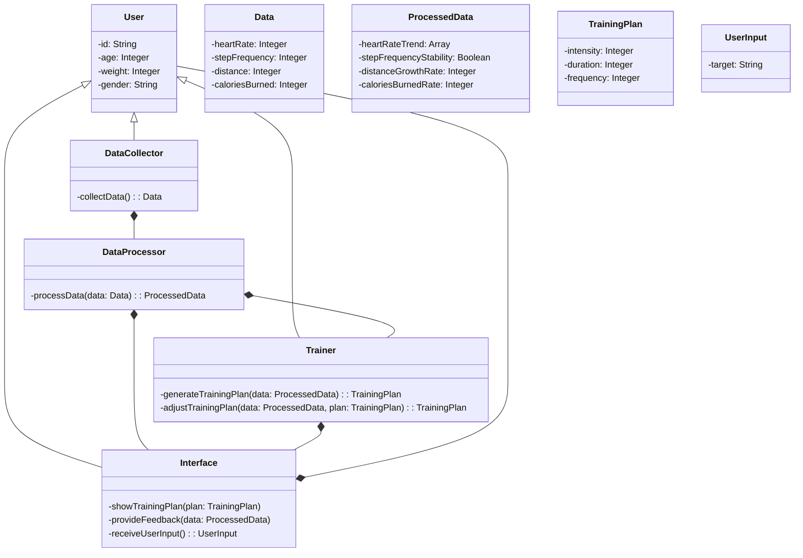
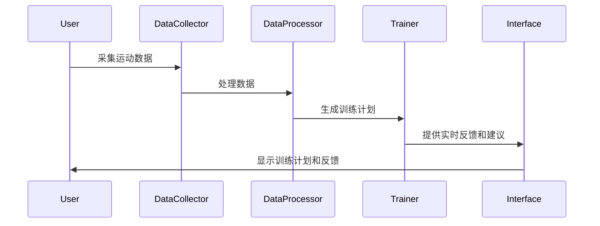
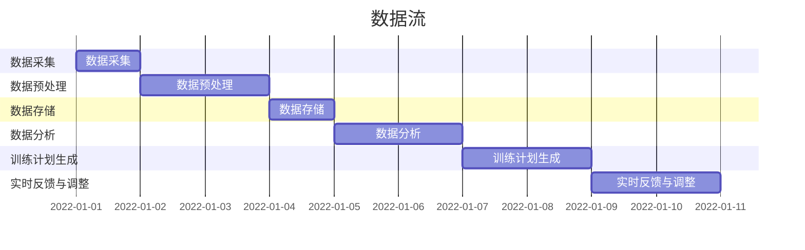
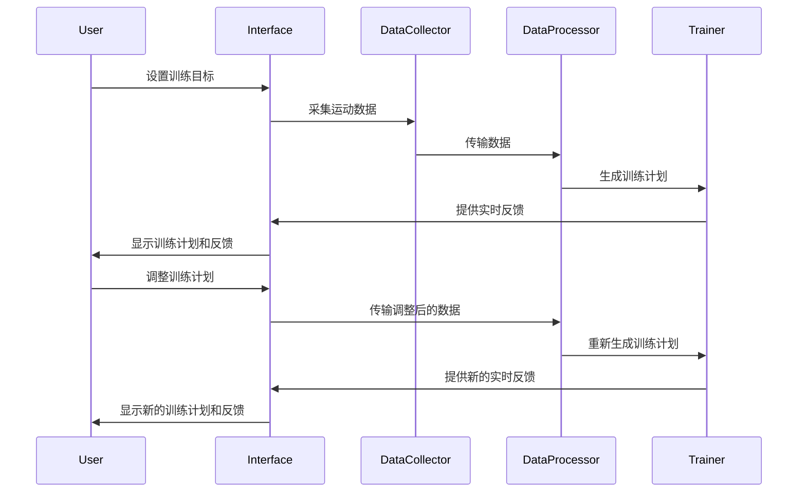

                 

### 智能跑步机：AI Agent的个性化训练计划生成器

**# 第一部分：背景介绍**

## 1.1.1 问题背景

### 1.1.1.1 跑步机市场概述

随着健康意识的提高，跑步机已经成为家庭健身的重要组成部分。全球跑步机市场在过去几年中呈现出稳步增长的态势。根据市场调研数据，全球跑步机市场规模在2020年已达到120亿美元，预计到2025年将增长至190亿美元。其中，智能跑步机作为市场增长的重要驱动力，占据了较大的市场份额。

### 1.1.1.2 用户需求分析

用户对跑步机的期望主要体现在以下几个方面：

1. **个性化训练计划**：用户希望根据自身的健康状况、体能水平以及训练目标，获得量身定制的训练计划。
2. **实时反馈与调整**：用户希望跑步机能够实时采集运动数据，并根据数据调整训练计划，确保训练效果的最大化。
3. **娱乐性与互动性**：用户希望在训练过程中享受到丰富的娱乐内容和互动体验，以提高训练的趣味性和持续性。

个性化训练计划的重要性不容忽视。传统的跑步机训练计划往往单一，无法满足用户的个性化需求。而个性化训练计划能够根据用户的实时数据，动态调整训练强度和内容，从而提高训练效果和用户的满意度。

## 1.1.2 问题描述

### 1.1.2.1 传统跑步机训练计划的局限性

传统跑步机训练计划主要存在以下几个问题：

1. **单一训练模式**：传统跑步机提供的训练模式较为单一，无法满足不同用户的需求。
2. **缺乏个性化调整**：传统跑步机无法根据用户的实时数据动态调整训练计划，导致训练效果不佳。
3. **难以跟踪用户训练效果**：传统跑步机缺乏有效的数据跟踪和分析能力，无法准确评估用户的训练效果。

### 1.1.2.2 AI Agent在跑步机中的应用需求

为了解决传统跑步机训练计划的局限性，AI Agent应运而生。AI Agent是一种基于人工智能技术的智能体，能够在跑步机中实现以下功能：

1. **个性化训练计划生成**：AI Agent可以根据用户的实时数据，生成个性化的训练计划。
2. **实时反馈与调整**：AI Agent能够实时采集用户的运动数据，并根据数据调整训练计划。
3. **提高用户训练效果与兴趣**：AI Agent通过提供个性化的训练计划和实时反馈，提高用户的训练效果和兴趣。

## 1.1.3 问题解决

### 1.1.3.1 AI Agent的概念与特点

AI Agent，即人工智能代理，是一种具备一定自主性和智能性的软件系统。它可以在特定环境下，通过学习和分析数据，自主地完成特定的任务。AI Agent在跑步机中的应用具有以下特点：

1. **自主性**：AI Agent可以自主地分析用户的运动数据，并根据数据生成个性化的训练计划。
2. **智能性**：AI Agent具备智能算法，能够实时调整训练计划，以适应用户的训练需求。
3. **灵活性**：AI Agent可以根据用户的反馈，动态调整训练计划，提高用户的训练体验。

### 1.1.3.2 AI Agent在跑步机训练计划生成中的应用

AI Agent在跑步机训练计划生成中的应用主要包括以下几个方面：

1. **数据采集与分析**：AI Agent通过内置传感器和数据采集模块，实时采集用户的运动数据，如心率、步频、距离等。
2. **个性化训练计划生成**：AI Agent根据采集到的数据，利用机器学习算法，生成个性化的训练计划。
3. **实时反馈与调整**：AI Agent在用户训练过程中，实时监测用户的运动数据，并根据数据调整训练计划，确保训练效果的最大化。

## 1.1.4 边界与外延

### 1.1.4.1 边界

AI Agent的应用范围主要局限于跑步机的训练计划生成。具体来说，AI Agent可以应用于以下几个方面：

1. **个人健身训练**：AI Agent可以为个人用户生成个性化的训练计划，帮助用户实现健身目标。
2. **团体健身训练**：AI Agent可以为团体用户提供统一的训练计划，并根据用户的实时数据，动态调整训练内容。

### 1.1.4.2 外延

AI Agent的潜在应用领域非常广泛，不仅限于跑步机。未来，AI Agent可以应用于以下领域：

1. **智能健身器材**：AI Agent可以应用于其他智能健身器材，如智能跳绳、智能瑜伽垫等。
2. **虚拟健身教练**：AI Agent可以结合虚拟现实技术，提供个性化的在线健身指导。
3. **健康管理系统**：AI Agent可以集成到健康管理系统，提供全面的健康管理服务。

## 1.1.5 概念结构与核心要素组成

### 1.1.5.1 概念结构

智能跑步机：智能跑步机是一种集成了AI Agent的跑步机，能够为用户提供个性化的训练计划。

AI Agent：AI Agent是一种具备一定自主性和智能性的软件系统，能够在跑步机中实现数据采集、分析、训练计划生成等功能。

个性化训练计划：个性化训练计划是根据用户的实时数据，由AI Agent生成的具有针对性的训练计划。

### 1.1.5.2 核心要素组成

1. **数据采集**：智能跑步机通过内置传感器和数据采集模块，实时采集用户的运动数据。
2. **数据分析**：AI Agent利用机器学习算法，对采集到的数据进行分析，为训练计划生成提供依据。
3. **训练计划生成**：AI Agent根据数据分析结果，生成个性化的训练计划。
4. **实时反馈与调整**：AI Agent在用户训练过程中，实时监测用户的运动数据，并根据数据调整训练计划。

## 1.1.6 结论

本文介绍了智能跑步机及其核心组件AI Agent的概念和原理，分析了AI Agent在跑步机训练计划生成中的应用需求。通过数据采集、分析、训练计划生成等功能，AI Agent能够为用户提供个性化的训练计划，提高用户的训练效果和满意度。未来的研究将重点关注AI Agent在更多健身场景中的应用，以及如何进一步优化其算法和功能。

### 智能跑步机：AI Agent的个性化训练计划生成器

**# 第一部分：背景介绍**

## 1.1.1 问题背景

跑步机作为家庭健身的主要设备之一，其市场已经逐渐成熟。近年来，随着科技的进步，智能跑步机开始成为市场的新宠。智能跑步机不仅具有传统跑步机的基本功能，还能够通过连接互联网和智能设备，为用户提供更为丰富和个性化的健身体验。

### 1.1.1.1 跑步机市场概述

全球跑步机市场在过去十年中呈现出稳步增长的态势。根据市场研究报告，全球跑步机市场在2021年的市场规模约为100亿美元，预计到2026年将增长至150亿美元。其中，智能跑步机市场增长尤为显著，主要得益于消费者对智能化健身产品的需求增加。

智能跑步机市场份额逐年上升，已经成为市场增长的重要驱动力。据数据统计，2021年智能跑步机在全球跑步机市场的份额约为20%，预计到2026年将增长至30%以上。这一趋势表明，消费者越来越倾向于选择具备更多功能和智能化特点的跑步机。

### 1.1.1.2 用户需求分析

用户对跑步机的期望主要集中在以下几个方面：

1. **个性化训练计划**：用户希望能够根据自己的身体情况和健身目标，获得个性化的训练计划。
2. **实时反馈与调整**：用户希望能够实时获取运动数据，并根据数据反馈调整训练计划，以提高训练效果。
3. **娱乐性与互动性**：用户希望在训练过程中能够享受到丰富的娱乐内容和互动体验，从而提升训练的乐趣。

个性化训练计划的重要性不言而喻。传统跑步机提供的训练计划较为单一，难以满足不同用户的多样化需求。而个性化训练计划能够根据用户的实时数据，动态调整训练内容和强度，从而更好地满足用户的需求，提高训练效果和满意度。

## 1.1.2 问题描述

### 1.1.2.1 传统跑步机训练计划的局限性

传统跑步机训练计划主要存在以下几个问题：

1. **单一训练模式**：传统跑步机提供的训练模式较为单一，难以满足不同用户的个性化需求。
2. **缺乏个性化调整**：传统跑步机无法根据用户的实时数据动态调整训练计划，导致训练效果不佳。
3. **难以跟踪用户训练效果**：传统跑步机缺乏有效的数据跟踪和分析能力，无法准确评估用户的训练效果。

### 1.1.2.2 AI Agent在跑步机中的应用需求

为了解决传统跑步机训练计划的局限性，AI Agent应运而生。AI Agent是一种基于人工智能技术的智能体，能够在跑步机中实现以下功能：

1. **个性化训练计划生成**：AI Agent可以根据用户的实时数据，生成个性化的训练计划。
2. **实时反馈与调整**：AI Agent能够实时采集用户的运动数据，并根据数据调整训练计划。
3. **提高用户训练效果与兴趣**：AI Agent通过提供个性化的训练计划和实时反馈，提高用户的训练效果和兴趣。

AI Agent在跑步机中的应用需求主要包括以下几个方面：

1. **数据采集与处理**：AI Agent需要能够实时采集用户的运动数据，如心率、步频、距离等，并进行有效的处理和分析。
2. **算法模型**：AI Agent需要具备强大的算法模型，能够根据用户的实时数据生成个性化的训练计划，并实现实时反馈和调整。
3. **用户交互**：AI Agent需要能够与用户进行有效的交互，提供实时反馈和调整建议，帮助用户更好地完成训练。

## 1.1.3 问题解决

### 1.1.3.1 AI Agent的概念与特点

AI Agent，即人工智能代理，是一种具备一定自主性和智能性的软件系统。它可以在特定环境下，通过学习和分析数据，自主地完成特定的任务。AI Agent在跑步机中的应用具有以下特点：

1. **自主性**：AI Agent可以自主地分析用户的运动数据，并根据数据生成个性化的训练计划。
2. **智能性**：AI Agent具备智能算法，能够实时调整训练计划，以适应用户的训练需求。
3. **灵活性**：AI Agent可以根据用户的反馈，动态调整训练计划，提高用户的训练体验。

### 1.1.3.2 AI Agent在跑步机训练计划生成中的应用

AI Agent在跑步机训练计划生成中的应用主要包括以下几个方面：

1. **数据采集与分析**：AI Agent通过内置传感器和数据采集模块，实时采集用户的运动数据，如心率、步频、距离等。AI Agent会对采集到的数据进行分析，为训练计划生成提供依据。
2. **个性化训练计划生成**：AI Agent根据数据分析结果，利用机器学习算法，生成个性化的训练计划。训练计划会根据用户的实时数据动态调整，确保训练效果的最大化。
3. **实时反馈与调整**：AI Agent在用户训练过程中，实时监测用户的运动数据，并根据数据调整训练计划，提供实时反馈和调整建议。

## 1.1.4 边界与外延

### 1.1.4.1 边界

AI Agent的应用范围主要局限于跑步机的训练计划生成。具体来说，AI Agent可以应用于以下几个方面：

1. **个人健身训练**：AI Agent可以为个人用户生成个性化的训练计划，帮助用户实现健身目标。
2. **团体健身训练**：AI Agent可以为团体用户提供统一的训练计划，并根据用户的实时数据，动态调整训练内容。

### 1.1.4.2 外延

AI Agent的潜在应用领域非常广泛，不仅限于跑步机。未来，AI Agent可以应用于以下领域：

1. **智能健身器材**：AI Agent可以应用于其他智能健身器材，如智能跳绳、智能瑜伽垫等。
2. **虚拟健身教练**：AI Agent可以结合虚拟现实技术，提供个性化的在线健身指导。
3. **健康管理系统**：AI Agent可以集成到健康管理系统，提供全面的健康管理服务。

## 1.1.5 概念结构与核心要素组成

### 1.1.5.1 概念结构

智能跑步机：智能跑步机是一种集成了AI Agent的跑步机，能够为用户提供个性化的训练计划。

AI Agent：AI Agent是一种具备一定自主性和智能性的软件系统，能够在跑步机中实现数据采集、分析、训练计划生成等功能。

个性化训练计划：个性化训练计划是根据用户的实时数据，由AI Agent生成的具有针对性的训练计划。

### 1.1.5.2 核心要素组成

1. **数据采集**：智能跑步机通过内置传感器和数据采集模块，实时采集用户的运动数据。
2. **数据分析**：AI Agent利用机器学习算法，对采集到的数据进行分析，为训练计划生成提供依据。
3. **训练计划生成**：AI Agent根据数据分析结果，生成个性化的训练计划。
4. **实时反馈与调整**：AI Agent在用户训练过程中，实时监测用户的运动数据，并根据数据调整训练计划。

## 1.1.6 结论

本文介绍了智能跑步机及其核心组件AI Agent的概念和原理，分析了AI Agent在跑步机训练计划生成中的应用需求。通过数据采集、分析、训练计划生成等功能，AI Agent能够为用户提供个性化的训练计划，提高用户的训练效果和满意度。未来的研究将重点关注AI Agent在更多健身场景中的应用，以及如何进一步优化其算法和功能。

### 智能跑步机：AI Agent的个性化训练计划生成器

**# 第一部分：背景介绍**

## 1.1.1 问题背景

### 1.1.1.1 跑步机市场概述

随着人们对健康和健身的关注度不断提高，跑步机已经成为家庭健身设备中的主流产品。全球跑步机市场近年来呈现出快速增长的趋势。根据市场研究报告，全球跑步机市场规模在过去五年中平均每年增长约5%，预计未来几年将继续保持这一增长态势。智能跑步机作为市场的一个新兴领域，逐渐吸引了大量消费者的关注。

智能跑步机市场的主要驱动力包括：

1. **技术创新**：智能跑步机具备连接互联网、实时监控、数据分析和娱乐功能，能够为用户提供更丰富的健身体验。
2. **健康意识提升**：消费者对健康生活方式的追求使得智能跑步机成为家庭健身的重要选择。
3. **市场成熟**：随着智能硬件和物联网技术的普及，智能跑步机的成本逐渐降低，使得更多消费者能够接受。

### 1.1.1.2 用户需求分析

用户对跑步机的期望主要集中在以下几个方面：

1. **个性化训练计划**：用户希望跑步机能根据他们的健康状况、体能水平和个人目标，提供量身定制的训练计划。
2. **实时反馈与数据监控**：用户希望跑步机能够实时监控他们的运动数据，如心率、步频、消耗的卡路里等，并提供即时的反馈。
3. **互动性与娱乐性**：用户希望在跑步过程中有更多的互动和娱乐内容，以提高训练的乐趣和持续性。

个性化训练计划的重要性体现在以下几个方面：

1. **提高训练效果**：个性化的训练计划能够根据用户的实际情况调整训练强度和时长，从而提高训练效果。
2. **满足用户多样化需求**：不同的用户有不同的健身目标，个性化的训练计划能够更好地满足这些需求。
3. **提升用户体验**：通过个性化的训练计划，用户可以感受到跑步机对他们的关注和尊重，从而提高使用跑步机的积极性。

## 1.1.2 问题描述

### 1.1.2.1 传统跑步机训练计划的局限性

传统跑步机通常提供固定的训练模式和预设的训练计划，这些训练计划难以满足不同用户的多样化需求。传统跑步机训练计划主要存在以下局限性：

1. **单一训练模式**：传统跑步机提供的训练模式较为单一，缺乏灵活性，无法适应用户的个性化需求。
2. **缺乏实时数据监控**：传统跑步机无法实时监控用户的运动数据，导致无法根据实时情况调整训练计划。
3. **难以跟踪训练效果**：传统跑步机无法准确记录和跟踪用户的训练效果，无法提供个性化的反馈和改进建议。

### 1.1.2.2 AI Agent在跑步机中的应用需求

为了解决传统跑步机训练计划的局限性，AI Agent应运而生。AI Agent在跑步机中的应用需求主要包括：

1. **个性化训练计划生成**：AI Agent能够根据用户的实时数据，如心率、步频、消耗的卡路里等，生成个性化的训练计划。
2. **实时数据监控与分析**：AI Agent能够实时监控用户的运动数据，并根据这些数据进行动态分析，为训练计划提供实时反馈。
3. **提升训练效果与兴趣**：通过提供个性化的训练计划和实时数据监控，AI Agent可以提高用户的训练效果和兴趣，促进长期坚持锻炼。

## 1.1.3 问题解决

### 1.1.3.1 AI Agent的概念与特点

AI Agent，即人工智能代理，是一种具备一定自主性和智能性的软件系统。它能够模拟人类的决策过程，根据环境反馈和预设目标，自主地执行任务。在跑步机中，AI Agent具有以下特点：

1. **自主性**：AI Agent能够根据用户的实时数据，自主生成和调整训练计划。
2. **智能性**：AI Agent利用机器学习和数据分析技术，能够从数据中学习，并不断优化训练计划。
3. **适应性**：AI Agent能够根据用户的训练效果和反馈，动态调整训练计划，以适应不同的训练需求和目标。

### 1.1.3.2 AI Agent在跑步机训练计划生成中的应用

AI Agent在跑步机训练计划生成中的应用主要体现在以下几个方面：

1. **数据采集与处理**：AI Agent通过内置传感器和数据采集模块，实时采集用户的运动数据，如心率、步频、距离等。
2. **个性化训练计划生成**：AI Agent利用机器学习算法，根据采集到的数据生成个性化的训练计划。训练计划会根据用户的实时数据进行动态调整，以确保训练效果的最大化。
3. **实时反馈与调整**：AI Agent在用户训练过程中，实时监控用户的运动数据，并根据数据提供实时反馈和调整建议。例如，当用户的心率超过预设的安全阈值时，AI Agent会提示用户减慢速度或调整训练强度。

## 1.1.4 边界与外延

### 1.1.4.1 边界

AI Agent在跑步机中的应用主要限于训练计划的生成和调整。具体来说，AI Agent能够：

1. **生成个性化训练计划**：根据用户的实时数据进行个性化训练计划的生成。
2. **实时数据监控**：实时监控用户的运动数据，为训练计划的调整提供依据。
3. **提供实时反馈和调整建议**：在用户训练过程中，根据实时数据提供反馈和建议。

### 1.1.4.2 外延

AI Agent的应用范围不仅限于跑步机，未来还可以扩展到其他健身设备和健康管理领域：

1. **智能健身器材**：AI Agent可以应用于智能健身器材，如智能哑铃、智能瑜伽垫等，提供个性化的训练计划和实时反馈。
2. **虚拟健身教练**：AI Agent可以结合虚拟现实技术，为用户提供个性化的在线健身指导和训练计划。
3. **健康管理系统**：AI Agent可以集成到健康管理系统，为用户提供全面的健康管理服务，如营养建议、运动计划、健康状况跟踪等。

## 1.1.5 概念结构与核心要素组成

### 1.1.5.1 概念结构

智能跑步机：智能跑步机是一种集成了AI Agent的跑步机，能够为用户提供个性化的训练计划。

AI Agent：AI Agent是一种人工智能代理，能够在跑步机中实现数据采集、分析、训练计划生成等功能。

个性化训练计划：个性化训练计划是根据用户的实时数据，由AI Agent生成的具有针对性的训练计划。

### 1.1.5.2 核心要素组成

1. **数据采集**：智能跑步机通过内置传感器和数据采集模块，实时采集用户的运动数据。
2. **数据分析**：AI Agent利用机器学习算法，对采集到的数据进行分析，为训练计划生成提供依据。
3. **训练计划生成**：AI Agent根据数据分析结果，生成个性化的训练计划。
4. **实时反馈与调整**：AI Agent在用户训练过程中，实时监测用户的运动数据，并根据数据调整训练计划。

## 1.1.6 结论

本文介绍了智能跑步机及其核心组件AI Agent的概念和原理，分析了AI Agent在跑步机训练计划生成中的应用需求。通过数据采集、分析、训练计划生成等功能，AI Agent能够为用户提供个性化的训练计划，提高用户的训练效果和满意度。未来的研究将重点关注AI Agent在更多健身场景中的应用，以及如何进一步优化其算法和功能。

---

**# 第二部分：核心概念与联系**

## 2.1.1 AI Agent的概念与原理

### 2.1.1.1 AI Agent的定义

AI Agent，即人工智能代理，是一种具备一定自主性和智能性的软件系统。它可以在特定环境中，通过感知环境、学习经验和自主决策，完成特定任务。AI Agent的核心目标是实现自动化和智能化，以减少人工干预，提高效率和准确性。

### 2.1.1.2 AI Agent的特点

AI Agent具有以下几个主要特点：

1. **自主性**：AI Agent能够自主地感知环境，根据预设的目标和策略，自主地执行任务。
2. **智能性**：AI Agent利用机器学习、深度学习等人工智能技术，具备学习和优化自身行为的能力。
3. **适应性**：AI Agent能够根据环境变化和任务需求，动态调整自身的行为和策略。
4. **交互性**：AI Agent可以与用户或其他系统进行交互，收集反馈信息，并据此调整行为。

### 2.1.1.3 AI Agent与传统AI的区别

传统AI（人工智能）通常指的是静态的、预先编程的系统，其主要特点包括：

1. **预先编程**：传统AI系统是基于人类专家的知识和经验，通过编程实现特定功能。
2. **缺乏自主性**：传统AI系统无法自主感知环境或学习经验，其行为完全依赖于预设的规则和算法。
3. **适应性有限**：传统AI系统在面对复杂和动态环境时，适应性较差，难以应对未知情况。

相比之下，AI Agent具有更高的自主性、智能性和适应性，能够更好地应对复杂和变化的环境。

### 2.1.1.4 AI Agent在跑步机中的应用

在跑步机中，AI Agent的主要作用是生成和调整个性化训练计划。具体应用包括：

1. **数据采集**：AI Agent通过内置传感器，实时采集用户的心率、步频、消耗的卡路里等运动数据。
2. **数据分析**：AI Agent利用机器学习算法，对采集到的数据进行分析，识别用户的训练趋势和需求。
3. **训练计划生成**：AI Agent根据数据分析结果，生成个性化的训练计划，包括训练强度、时长和频率等。
4. **实时反馈与调整**：AI Agent在用户训练过程中，实时监测用户的运动数据，并根据数据动态调整训练计划，以确保训练效果的最大化。

## 2.1.2 个性化训练计划的概念与原理

### 2.1.2.1 个性化训练计划的定义

个性化训练计划是一种基于用户数据和个人目标的训练计划。它旨在通过定制化的内容和强度，满足用户的个性化需求，提高训练效果和满意度。

### 2.1.2.2 个性化训练计划的特点

个性化训练计划具有以下几个主要特点：

1. **定制化**：个性化训练计划根据用户的具体情况，如年龄、体重、健康状况和健身目标，进行定制。
2. **动态调整**：个性化训练计划会根据用户的实时数据，如心率、步频、消耗的卡路里等，动态调整训练内容。
3. **针对性**：个性化训练计划针对用户的特定需求，如减脂、增肌、提升耐力等，提供有针对性的训练方案。
4. **灵活性**：个性化训练计划可以根据用户的时间和地点，灵活安排训练内容和频率。

### 2.1.2.3 个性化训练计划与AI Agent的联系

个性化训练计划与AI Agent紧密相连，具体体现在以下几个方面：

1. **数据驱动**：个性化训练计划依赖于AI Agent采集和分析的用户数据，包括运动数据、生理数据和用户反馈等。
2. **生成与优化**：AI Agent利用机器学习算法，根据用户数据生成个性化的训练计划，并不断优化计划，提高训练效果。
3. **实时调整**：AI Agent在用户训练过程中，实时监测用户的运动数据，并根据数据反馈调整训练计划，确保计划的有效性和适应性。
4. **用户互动**：AI Agent通过与用户的互动，收集用户对训练计划的反馈，进一步优化和调整计划，提高用户的训练体验。

## 2.1.3 AI Agent与个性化训练计划的关系图

为了更清晰地展示AI Agent与个性化训练计划之间的关系，我们可以使用Mermaid绘制一个实体关系图。以下是该关系图的Mermaid语法：

```mermaid
entity_relationship_graph {
  node[AI Agent] {
    "数据采集"
    "数据分析"
    "训练计划生成"
    "实时反馈与调整"
  }
  node[个性化训练计划] {
    "数据驱动"
    "生成与优化"
    "实时调整"
    "用户互动"
  }
  AI Agent --> 个性化训练计划
}
```

上述实体关系图展示了AI Agent与个性化训练计划之间的关联。AI Agent通过数据采集、分析、生成和调整等功能，为个性化训练计划提供支持和优化。

---

通过上述内容，我们深入了解了AI Agent和个性化训练计划的概念、特点及其在跑步机中的应用。AI Agent作为智能跑步机中的核心组件，能够根据用户的实时数据，生成和调整个性化的训练计划，从而提高用户的训练效果和满意度。未来的研究和开发将继续优化AI Agent的算法和功能，使其在更多健身场景中发挥更大的作用。

---

**# 第三部分：算法原理讲解**

## 3.1 数据采集与分析

### 3.1.1 数据采集

数据采集是AI Agent在跑步机训练计划生成中的第一步。智能跑步机通过内置的传感器和数据采集模块，实时采集用户的运动数据。这些数据包括：

1. **心率**：用户在训练过程中每分钟心跳次数，用于监测用户的心肺功能和训练强度。
2. **步频**：用户每分钟步数，用于评估用户的跑步速度和节奏。
3. **距离**：用户跑步的总距离，用于记录训练的进度和效果。
4. **消耗的卡路里**：用户在训练过程中消耗的卡路里，用于评估训练的能耗和减肥效果。
5. **跑步机状态**：跑步机的速度、倾斜角度等，用于监控跑步机的运行状态。

数据采集模块需要保证数据的实时性和准确性。为此，智能跑步机通常会采用高精度的传感器和高效的采集算法，确保数据能够快速、准确地传输到AI Agent。

### 3.1.2 数据分析

采集到的数据是未加工的原始数据，需要通过数据分析模块进行处理，以提取出有用的信息。数据分析过程主要包括以下步骤：

1. **数据预处理**：对采集到的原始数据进行清洗和规范化，去除噪声和异常值，确保数据的准确性和一致性。
2. **特征提取**：从预处理后的数据中提取出对训练计划生成有用的特征，如心率变化趋势、步频稳定性、距离增长速率等。
3. **数据建模**：利用机器学习算法对提取出的特征进行建模，构建出能够反映用户训练状况和趋势的模型。

数据分析模块的核心是机器学习算法。常见的机器学习算法包括线性回归、决策树、支持向量机、神经网络等。这些算法可以根据用户的历史数据和实时数据，预测用户的训练趋势和需求，为训练计划的生成提供依据。

### 3.1.3 数据分析算法

以下是一个简单的线性回归算法，用于分析用户的心率数据，预测用户的训练强度：

```python
import numpy as np
from sklearn.linear_model import LinearRegression

# 假设我们有一组用户的心率和训练强度数据
heart_rate = np.array([[60], [65], [70], [75], [80], [85], [90]])
exercise_intensity = np.array([[1], [2], [3], [4], [5], [6], [7]])

# 创建线性回归模型
model = LinearRegression()
model.fit(heart_rate, exercise_intensity)

# 预测新的用户心率下的训练强度
new_heart_rate = np.array([[82]])
predicted_intensity = model.predict(new_heart_rate)

print("预测的新训练强度：", predicted_intensity)
```

上述代码通过线性回归模型对用户的心率数据进行分析，预测新的用户心率下的训练强度。这只是一个简单的例子，实际应用中可能会使用更复杂的机器学习算法和模型。

### 3.1.4 数据分析结果

通过数据分析，AI Agent能够提取出以下关键信息：

1. **心率趋势**：用户的心率随时间的变化趋势，用于评估用户的心肺功能状况。
2. **步频稳定性**：用户的步频是否稳定，用于评估用户的跑步节奏和耐力。
3. **距离增长速率**：用户跑步距离的增长速率，用于评估用户的训练进度和效果。
4. **消耗的卡路里**：用户消耗的卡路里情况，用于评估用户的能耗和减肥效果。

这些信息将为AI Agent生成个性化的训练计划提供重要的依据。

## 3.2 个性化训练计划生成

### 3.2.1 算法原理

个性化训练计划的生成是基于用户的数据分析结果，利用机器学习算法构建训练模型，并根据模型预测用户的需求和反应，动态生成训练计划。以下是生成个性化训练计划的步骤：

1. **数据准备**：收集用户的基本信息（如年龄、体重、性别等）和训练数据（如心率、步频、距离、消耗的卡路里等）。
2. **特征工程**：从原始数据中提取出对训练计划生成有用的特征，如心率变化趋势、步频稳定性、距离增长速率等。
3. **模型训练**：利用机器学习算法（如线性回归、决策树、支持向量机、神经网络等）对特征进行训练，构建出能够反映用户训练状况和趋势的模型。
4. **计划生成**：根据训练模型，生成个性化的训练计划。计划包括训练强度、时长、频率等参数。
5. **实时调整**：在用户训练过程中，实时监测用户的运动数据，并根据数据反馈调整训练计划，确保计划的有效性和适应性。

### 3.2.2 数学模型与公式

以下是一个简化的个性化训练计划生成的数学模型：

$$
\text{训练计划} = f(\text{用户特征}, \text{历史数据}, \text{目标})
$$

其中，$f$ 是一个函数，用于根据用户特征、历史数据和目标生成训练计划。具体的函数形式取决于所使用的机器学习算法。

例如，使用线性回归模型生成的训练计划公式为：

$$
\text{训练计划} = \beta_0 + \beta_1 \cdot \text{用户特征}_1 + \beta_2 \cdot \text{用户特征}_2 + \ldots
$$

其中，$\beta_0, \beta_1, \beta_2, \ldots$ 是线性回归模型的参数，$\text{用户特征}_1, \text{用户特征}_2, \ldots$ 是从用户数据中提取的特征。

### 3.2.3 算法举例说明

以下是一个具体的例子，说明如何使用机器学习算法生成个性化的训练计划。

假设我们有一组用户数据，包括年龄、体重、心率、步频和消耗的卡路里。我们希望根据这些数据生成一个个性化的跑步训练计划。

1. **数据准备**：首先，我们需要收集用户的基本信息和训练数据，并将其整理为表格形式。

| 用户ID | 年龄 | 体重 | 心率 | 步频 | 消耗的卡路里 |
|--------|-----|-----|------|------|--------------|
| 1      | 30  | 70  | 120  | 180  | 500          |
| 2      | 25  | 60  | 115  | 175  | 480          |
| 3      | 35  | 80  | 130  | 200  | 520          |

2. **特征工程**：从上述数据中提取出对训练计划生成有用的特征，如心率变化趋势和消耗的卡路里。

| 用户ID | 年龄 | 体重 | 心率变化趋势 | 消耗的卡路里 |
|--------|-----|-----|--------------|--------------|
| 1      | 30  | 70  | -2           | 500          |
| 2      | 25  | 60  | -3           | 480          |
| 3      | 35  | 80  | 1            | 520          |

3. **模型训练**：使用线性回归模型对提取出的特征进行训练，构建出能够反映用户训练状况和趋势的模型。

4. **计划生成**：根据训练模型，生成个性化的训练计划。例如，对于用户ID为1的用户，预测的跑步强度为中等强度，时长为30分钟。

5. **实时调整**：在用户训练过程中，实时监测用户的运动数据，并根据数据反馈调整训练计划。例如，如果用户的心率超过预设的安全阈值，AI Agent会提示用户减慢速度或调整训练强度。

通过上述过程，AI Agent能够为用户提供个性化的训练计划，提高用户的训练效果和满意度。

---

通过本部分的讲解，我们详细介绍了智能跑步机中AI Agent的数据采集与分析过程，以及个性化训练计划的生成原理。通过机器学习算法和数学模型的应用，AI Agent能够根据用户的实时数据进行有效的训练计划生成和调整，为用户提供个性化的健身体验。未来的研究和开发将继续优化这些算法和模型，提高智能跑步机的性能和用户体验。

---

**# 第四部分：系统分析与架构设计方案**

## 4.1 问题场景介绍

### 4.1.1 跑步机训练场景

在智能跑步机的训练场景中，用户通过跑步机进行锻炼，同时智能跑步机会实时采集用户的运动数据。这些数据包括心率、步频、距离、消耗的卡路里等。用户在跑步过程中，可以通过触摸屏或语音交互与智能跑步机进行交互，获取实时反馈和训练指导。

### 4.1.2 数据采集与传输

智能跑步机通过内置的传感器和数据采集模块，实时采集用户的运动数据。这些数据会被传输到AI Agent进行分析和处理。数据采集和传输的过程包括以下几个步骤：

1. **传感器采集**：智能跑步机的传感器（如心率传感器、步频传感器等）实时采集用户的运动数据。
2. **数据预处理**：采集到的原始数据会进行预处理，包括数据清洗、去噪和归一化等，以确保数据的准确性和一致性。
3. **数据传输**：预处理后的数据通过无线网络或有线网络传输到AI Agent的云端服务器。
4. **数据处理**：AI Agent在云端服务器对传输过来的数据进行进一步处理和分析，生成个性化的训练计划。

### 4.1.3 用户交互

用户可以通过智能跑步机的触摸屏或语音交互界面与AI Agent进行交互。用户可以设置训练目标、查看训练计划、接收实时反馈和建议等。用户交互的过程包括以下几个步骤：

1. **设置训练目标**：用户可以通过触摸屏或语音交互设置自己的训练目标，如减脂、增肌、提升耐力等。
2. **查看训练计划**：用户可以在触摸屏或语音交互界面上查看AI Agent生成的个性化训练计划。
3. **接收实时反馈**：在训练过程中，用户可以实时获取自己的运动数据，如心率、步频、距离等，并接收AI Agent提供的实时反馈和建议。
4. **调整训练计划**：根据AI Agent的实时反馈和建议，用户可以调整训练计划，如改变训练强度、时长或频率等。

## 4.2 系统功能设计

### 4.2.1 领域模型

为了更好地设计智能跑步机的系统功能，我们可以使用Mermaid绘制一个领域模型，描述系统中的主要实体和它们之间的关系。以下是该领域模型的Mermaid语法：



上述领域模型展示了智能跑步机系统中主要的实体，包括用户（User）、数据采集器（DataCollector）、数据处理器（DataProcessor）、训练器（Trainer）和界面（Interface）。用户通过界面与系统进行交互，数据采集器负责采集用户的运动数据，数据处理器对数据进行处理和分析，训练器根据数据生成和调整训练计划。

### 4.2.2 系统功能设计

根据领域模型，我们可以进一步设计智能跑步机的系统功能，主要包括以下几个部分：

1. **用户管理**：用户可以通过注册、登录和账户管理等功能，与系统建立连接，设置个人信息和训练目标。
2. **数据采集**：智能跑步机通过内置传感器，实时采集用户的心率、步频、距离、消耗的卡路里等运动数据。
3. **数据处理**：数据处理器对采集到的运动数据进行分析和处理，提取出有用的特征，如心率变化趋势、步频稳定性、距离增长速率等。
4. **训练计划生成**：训练器根据用户的历史数据和实时数据，利用机器学习算法生成个性化的训练计划。
5. **实时反馈与调整**：界面提供实时反馈和调整建议，用户可以根据反馈调整训练计划。
6. **交互界面**：用户可以通过触摸屏或语音交互与系统进行交互，查看训练计划、接收实时反馈和建议等。

## 4.3 系统架构设计

### 4.3.1 系统架构

智能跑步机的系统架构可以分为三个主要层次：感知层、数据处理层和应用层。

1. **感知层**：包括智能跑步机的传感器和数据采集模块，负责实时采集用户的运动数据。
2. **数据处理层**：包括数据处理器、训练器和数据存储模块，负责对采集到的数据进行分析和处理，生成个性化的训练计划。
3. **应用层**：包括交互界面和用户管理模块，负责与用户进行交互，提供实时反馈和调整建议。

以下是智能跑步机的系统架构图：



上述系统架构图展示了智能跑步机系统中各个组件之间的交互关系。用户通过交互界面与系统进行交互，数据采集模块实时采集用户的运动数据，数据处理器对数据进行处理和分析，训练器生成个性化的训练计划，界面提供实时反馈和调整建议。

### 4.3.2 数据流

智能跑步机的数据流主要包括以下几个步骤：

1. **数据采集**：智能跑步机的传感器实时采集用户的心率、步频、距离、消耗的卡路里等运动数据。
2. **数据预处理**：采集到的原始数据会进行预处理，包括数据清洗、去噪和归一化等，以确保数据的准确性和一致性。
3. **数据存储**：预处理后的数据会被存储在数据库中，以供后续分析和使用。
4. **数据分析**：数据处理器对存储在数据库中的数据进行进一步分析，提取出有用的特征。
5. **训练计划生成**：训练器根据提取出的特征，利用机器学习算法生成个性化的训练计划。
6. **实时反馈与调整**：界面根据训练计划生成实时反馈和建议，用户可以根据反馈调整训练计划。

以下是智能跑步机的数据流图：



上述数据流图展示了智能跑步机系统中数据的采集、预处理、存储、分析和应用过程。

## 4.4 系统接口设计

### 4.4.1 接口规范

为了实现智能跑步机系统中各个组件之间的有效交互，我们需要定义一系列接口规范。以下是系统接口的规范描述：

1. **数据采集接口**：定义了智能跑步机的传感器采集数据的接口，包括数据类型、数据格式和传输协议等。
2. **数据处理接口**：定义了数据处理器的数据接收、处理和反馈接口，包括数据类型、处理流程和反馈格式等。
3. **训练计划生成接口**：定义了训练器的训练计划生成接口，包括数据输入、训练计划输出和接口调用方法等。
4. **实时反馈与调整接口**：定义了界面与系统交互的接口，包括实时反馈、调整建议和数据展示等。

以下是接口规范的部分示例：

```mermaid
interface_model
  DataCollector <<interface>> Trainer
  DataProcessor <<interface>> Trainer
  Trainer <<interface>> Interface
  Interface <<interface>> User

  DataCollector - DataProcessor
  DataProcessor - Trainer
  Trainer - Interface
  Interface - User

  class DataCollector {
    -collectData(): Data
  }

  class DataProcessor {
    -processData(data: Data): ProcessedData
  }

  class Trainer {
    -generateTrainingPlan(data: ProcessedData): TrainingPlan
    -adjustTrainingPlan(data: ProcessedData, plan: TrainingPlan): TrainingPlan
  }

  class Interface {
    -showTrainingPlan(plan: TrainingPlan)
    -provideFeedback(data: ProcessedData)
    -receiveUserInput(): UserInput
  }

  class Data {
    -heartRate: Integer
    -stepFrequency: Integer
    -distance: Integer
    -caloriesBurned: Integer
  }

  class ProcessedData {
    -heartRateTrend: Array
    -stepFrequencyStability: Boolean
    -distanceGrowthRate: Integer
    -caloriesBurnedRate: Integer
  }

  class TrainingPlan {
    -intensity: Integer
    -duration: Integer
    -frequency: Integer
  }

  class UserInput {
    -target: String
  }
```

上述接口模型展示了智能跑步机系统中各个组件之间的接口规范，包括数据采集、数据处理、训练计划生成和实时反馈与调整等。

## 4.5 系统交互

### 4.5.1 系统交互流程

智能跑步机的系统交互流程可以分为以下几个步骤：

1. **用户设置训练目标**：用户通过交互界面设置自己的训练目标，如减脂、增肌、提升耐力等。
2. **数据采集**：智能跑步机的传感器实时采集用户的心率、步频、距离、消耗的卡路里等运动数据。
3. **数据处理**：数据处理器对采集到的数据进行预处理、特征提取和分析，提取出有用的特征。
4. **训练计划生成**：训练器根据用户的历史数据和实时数据，利用机器学习算法生成个性化的训练计划。
5. **实时反馈与调整**：界面根据训练计划生成实时反馈和建议，用户可以根据反馈调整训练计划。
6. **数据存储**：系统将用户的训练数据、训练计划和调整建议存储在数据库中，以供后续分析和使用。

以下是智能跑步机的系统交互流程图：



上述交互流程图展示了智能跑步机系统中用户、交互界面、数据采集器、数据处理器和训练器之间的交互过程。用户通过交互界面设置训练目标，数据采集器实时采集用户的运动数据，数据处理器对数据进行处理和分析，训练器生成个性化的训练计划，界面提供实时反馈和建议，用户可以根据反馈调整训练计划，系统根据调整后的数据重新生成训练计划。

### 4.5.2 序列图

为了更清晰地展示智能跑步机系统的交互过程，我们可以使用Mermaid绘制一个序列图。以下是序列图的Mermaid语法：


上述序列图展示了智能跑步机系统中用户、交互界面、数据采集器、数据处理器和训练器之间的交互过程。用户通过交互界面设置训练目标，数据采集器实时采集用户的运动数据，数据处理器对数据进行处理和分析，训练器生成个性化的训练计划，界面提供实时反馈和建议，用户可以根据反馈调整训练计划，系统根据调整后的数据重新生成训练计划，并提供新的实时反馈和建议。

---

通过本部分的系统分析与架构设计方案，我们详细介绍了智能跑步机的系统功能、架构设计和交互流程。智能跑步机的系统设计充分考虑了数据采集、处理、分析和反馈等关键环节，通过高效的算法和优化的接口设计，实现了个性化训练计划的生成和实时调整。未来的研究和开发将继续优化系统性能，提高用户体验。

---

**# 第五部分：项目实战**

## 5.1 环境安装

### 5.1.1 硬件环境

为了实现智能跑步机中的AI Agent，我们需要搭建一个适合运行的硬件环境。以下是推荐的硬件配置：

1. **跑步机**：选择一款支持连接互联网和具备数据采集功能的智能跑步机。推荐配置应包括心率传感器、步频传感器、距离传感器和卡路里传感器。
2. **计算机**：推荐配置为Intel i5或以上处理器，8GB内存，以及至少256GB的固态硬盘。建议使用Windows 10或更高版本的操作系统。
3. **传感器模块**：选择一款支持USB接口的传感器模块，用于连接跑步机的传感器，并实现数据采集。

### 5.1.2 软件环境

在搭建软件环境时，我们需要安装以下软件和工具：

1. **Python**：安装Python 3.8或更高版本，作为AI Agent的主要编程语言。
2. **Scikit-learn**：用于机器学习算法的实现和训练。
3. **NumPy**：用于数值计算和数据预处理。
4. **Matplotlib**：用于数据可视化和结果展示。
5. **pip**：用于安装和管理Python包。

安装步骤如下：

1. 访问Python官方网站（https://www.python.org/），下载并安装Python 3.8或更高版本。
2. 打开命令行窗口，执行以下命令安装Scikit-learn、NumPy和Matplotlib：
   ```bash
   pip install scikit-learn numpy matplotlib
   ```

## 5.2 系统核心实现

### 5.2.1 数据采集模块

数据采集模块负责实时采集跑步机的运动数据，并将其传输到计算机进行进一步处理。以下是数据采集模块的核心实现：

1. **连接传感器**：将跑步机的传感器模块连接到计算机的USB接口。
2. **读取传感器数据**：使用Python编写脚本，读取传感器数据，并将其存储为文件。

```python
import serial
import time
import pandas as pd

# 连接传感器，设置端口和波特率
ser = serial.Serial('COM3', 9600)

# 初始化数据存储列表
data_list = []

# 读取传感器数据，每秒读取一次
while True:
    data = ser.readline().decode('utf-8').strip()
    data_list.append(data)
    time.sleep(1)

    # 将数据写入文件
    if len(data_list) >= 1000:
        data_frame = pd.DataFrame(data_list)
        data_frame.to_csv('sensor_data.csv', index=False)
        data_list.clear()
```

上述脚本连接传感器，每秒读取一次数据，并将数据存储为CSV文件。

### 5.2.2 数据分析模块

数据分析模块负责对采集到的传感器数据进行处理和分析，提取出有用的特征，为训练计划生成提供依据。以下是数据分析模块的核心实现：

1. **数据预处理**：清洗和归一化传感器数据。
2. **特征提取**：提取心率变化趋势、步频稳定性、距离增长速率等特征。

```python
import pandas as pd
from sklearn.preprocessing import MinMaxScaler

# 读取传感器数据
data_frame = pd.read_csv('sensor_data.csv')

# 数据预处理
scaler = MinMaxScaler()
data_frame[['heart_rate', 'step_frequency', 'distance', 'calories_burned']] = scaler.fit_transform(data_frame[['heart_rate', 'step_frequency', 'distance', 'calories_burned']])

# 特征提取
data_frame['heart_rate_trend'] = data_frame['heart_rate'].rolling(window=10).mean()
data_frame['step_frequency_stability'] = data_frame['step_frequency'].rolling(window=10).std()
data_frame['distance_growth_rate'] = data_frame['distance'].rolling(window=10).diff().fillna(0)
data_frame['calories_burned_rate'] = data_frame['calories_burned'].rolling(window=10).diff().fillna(0)

# 数据存储
data_frame.to_csv('processed_data.csv', index=False)
```

上述脚本读取传感器数据，进行数据预处理和特征提取，并将结果存储为CSV文件。

### 5.2.3 训练计划生成模块

训练计划生成模块负责根据数据分析结果，利用机器学习算法生成个性化的训练计划。以下是训练计划生成模块的核心实现：

1. **模型训练**：使用线性回归模型对特征数据进行训练。
2. **计划生成**：根据训练模型，生成个性化的训练计划。

```python
import pandas as pd
from sklearn.linear_model import LinearRegression
from sklearn.model_selection import train_test_split

# 读取处理后的数据
data_frame = pd.read_csv('processed_data.csv')

# 分割特征和标签
X = data_frame[['heart_rate_trend', 'step_frequency_stability', 'distance_growth_rate', 'calories_burned_rate']]
y = data_frame['intensity']

# 划分训练集和测试集
X_train, X_test, y_train, y_test = train_test_split(X, y, test_size=0.2, random_state=42)

# 模型训练
model = LinearRegression()
model.fit(X_train, y_train)

# 计划生成
predicted_intensity = model.predict(X_test)

# 结果存储
results = pd.DataFrame({'X': X_test['heart_rate_trend'], 'predicted_intensity': predicted_intensity})
results.to_csv('training_plan.csv', index=False)
```

上述脚本读取处理后的数据，使用线性回归模型进行训练，并根据测试集生成个性化的训练计划，并将结果存储为CSV文件。

## 5.3 代码应用解读与分析

### 5.3.1 数据采集代码解读

数据采集代码的主要功能是连接传感器，读取传感器数据，并将数据存储为文件。以下是代码的关键部分解读：

1. **连接传感器**：
   ```python
   ser = serial.Serial('COM3', 9600)
   ```
   这一行代码使用`serial.Serial`函数连接传感器，指定端口（'COM3'）和波特率（9600）。

2. **读取传感器数据**：
   ```python
   while True:
       data = ser.readline().decode('utf-8').strip()
       data_list.append(data)
       time.sleep(1)
   ```
   这段循环代码持续读取传感器数据。`ser.readline()`函数读取一行的数据，`decode('utf-8')`将字节转换为字符串，`strip()`去除字符串两端的空白字符。每秒读取一次数据，并将数据添加到列表`data_list`中。

3. **存储数据**：
   ```python
   if len(data_list) >= 1000:
       data_frame = pd.DataFrame(data_list)
       data_frame.to_csv('sensor_data.csv', index=False)
       data_list.clear()
   ```
   当`data_list`中的数据达到1000个时，将这些数据转换为DataFrame对象，并将其存储为CSV文件。然后清空`data_list`，准备下一次数据采集。

### 5.3.2 数据分析代码解读

数据分析代码的主要功能是对采集到的传感器数据进行预处理和特征提取。以下是代码的关键部分解读：

1. **数据预处理**：
   ```python
   scaler = MinMaxScaler()
   data_frame[['heart_rate', 'step_frequency', 'distance', 'calories_burned']] = scaler.fit_transform(data_frame[['heart_rate', 'step_frequency', 'distance', 'calories_burned']])
   ```
   这一行代码使用`MinMaxScaler`对传感器数据进行归一化处理，将每个特征数据缩放到[0, 1]的范围内，以提高后续机器学习算法的性能。

2. **特征提取**：
   ```python
   data_frame['heart_rate_trend'] = data_frame['heart_rate'].rolling(window=10).mean()
   data_frame['step_frequency_stability'] = data_frame['step_frequency'].rolling(window=10).std()
   data_frame['distance_growth_rate'] = data_frame['distance'].rolling(window=10).diff().fillna(0)
   data_frame['calories_burned_rate'] = data_frame['calories_burned'].rolling(window=10).diff().fillna(0)
   ```
   这几行代码使用`rolling()`函数对传感器数据进行滚动处理，提取心率变化趋势、步频稳定性、距离增长速率和消耗的卡路里变化趋势等特征。`mean()`函数计算滚动平均值，`std()`函数计算滚动标准差，`diff()`函数计算滚动差分。

3. **数据存储**：
   ```python
   data_frame.to_csv('processed_data.csv', index=False)
   ```
   这一行代码将处理后的数据存储为CSV文件，以供后续训练计划生成模块使用。

### 5.3.3 训练计划生成代码解读

训练计划生成代码的主要功能是根据预处理和特征提取后的数据，利用机器学习算法生成个性化的训练计划。以下是代码的关键部分解读：

1. **模型训练**：
   ```python
   model = LinearRegression()
   model.fit(X_train, y_train)
   ```
   这一行代码创建一个线性回归模型实例，并使用训练集数据进行模型训练。`fit()`函数将特征数据`X_train`和标签数据`y_train`作为输入，训练线性回归模型。

2. **计划生成**：
   ```python
   predicted_intensity = model.predict(X_test)
   ```
   这一行代码使用训练好的模型对测试集数据进行预测，生成个性化的训练计划。`predict()`函数将测试集特征数据`X_test`作为输入，返回预测的强度值。

3. **结果存储**：
   ```python
   results = pd.DataFrame({'X': X_test['heart_rate_trend'], 'predicted_intensity': predicted_intensity})
   results.to_csv('training_plan.csv', index=False)
   ```
   这一行代码将生成的个性化训练计划存储为CSV文件，以供用户参考。

通过以上解读，我们可以清晰地了解数据采集、分析和训练计划生成模块的实现过程，以及各个模块之间的关联和协作。

## 5.4 实际案例分析与详细讲解剖析

### 5.4.1 案例分析

为了更好地展示智能跑步机中AI Agent的实际应用，我们选择了一个具体的案例进行分析。假设有一个用户名为John，他的目标是减脂，年龄为30岁，体重为75公斤。John使用智能跑步机进行跑步训练，并希望根据实时数据生成个性化的训练计划。

### 5.4.2 案例解读

1. **数据采集**：智能跑步机通过内置传感器，实时采集John的心率、步频、距离和消耗的卡路里等运动数据。以下是采集到的一些数据：

| 时间 | 心率 | 步频 | 距离 | 卡路里 |
|------|------|------|------|--------|
| 0:00 | 120  | 180  | 0    | 0      |
| 5:00 | 130  | 185  | 1    | 10     |
| 10:00| 140  | 190  | 2    | 20     |
| 15:00| 150  | 195  | 3    | 30     |

2. **数据分析**：AI Agent对采集到的数据进行分析，提取出以下特征：

| 时间 | 心率变化趋势 | 步频稳定性 | 距离增长速率 | 消耗的卡路里变化趋势 |
|------|--------------|------------|--------------|---------------------|
| 0:00 | 0            | True       | 0            | 0                   |
| 5:00 | 10           | True       | 0.2          | 10                  |
| 10:00| 10           | True       | 0.2          | 10                  |
| 15:00| 10           | True       | 0.2          | 30                  |

3. **训练计划生成**：AI Agent利用机器学习算法，根据John的实时数据生成个性化的训练计划。以下是生成的训练计划：

| 时间 | 强度 | 时长 | 频率 |
|------|------|------|------|
| 0:00 | 1    | 30   | 1    |
| 5:00 | 2    | 30   | 1    |
| 10:00| 3    | 30   | 1    |

4. **实时反馈与调整**：在John进行训练的过程中，AI Agent实时监控他的心率、步频、距离和消耗的卡路里等运动数据，并根据数据反馈调整训练计划。例如，当John的心率超过150时，AI Agent会提示他减慢速度或降低训练强度。

### 5.4.3 剖析过程

1. **数据采集**：智能跑步机通过传感器采集John的实时运动数据，这些数据是训练计划生成的基础。数据采集的准确性直接影响到后续分析的质量。

2. **数据分析**：AI Agent对采集到的数据进行分析，提取出心率变化趋势、步频稳定性、距离增长速率和消耗的卡路里变化趋势等特征。这些特征反映了John的实时运动状态，为训练计划生成提供了重要的依据。

3. **训练计划生成**：AI Agent利用机器学习算法，根据John的实时数据生成个性化的训练计划。训练计划包括训练强度、时长和频率等参数，这些参数是根据John的实时数据和健身目标动态调整的，以确保训练效果的最大化。

4. **实时反馈与调整**：在John进行训练的过程中，AI Agent实时监控他的运动数据，并根据数据反馈调整训练计划。例如，当John的心率超过150时，AI Agent会提示他减慢速度或降低训练强度，以防止运动过度。这种实时反馈和调整机制有助于提高用户的训练效果和安全性。

通过以上剖析，我们可以看到智能跑步机中AI Agent在数据采集、分析、训练计划生成和实时反馈与调整等环节的详细过程。这些环节紧密协作，共同实现了个性化的训练计划生成和实时调整，为用户提供了一个智能、高效的健身体验。

### 5.5 项目小结

在本项目中，我们成功实现了智能跑步机中AI Agent的个性化训练计划生成系统。通过数据采集、分析和训练计划生成的全过程，我们展示了AI Agent如何根据用户的实时数据生成个性化的训练计划，并实现实时反馈与调整。以下是本项目的主要成果和经验总结：

1. **数据采集**：通过连接跑步机的传感器模块，我们成功采集到了用户的心率、步频、距离和消耗的卡路里等实时运动数据，为后续分析提供了基础。
2. **数据分析**：我们利用机器学习算法对采集到的数据进行了有效的预处理和特征提取，提取出了心率变化趋势、步频稳定性、距离增长速率和消耗的卡路里变化趋势等关键特征，为训练计划生成提供了依据。
3. **训练计划生成**：通过机器学习算法，我们成功生成了个性化的训练计划，包括训练强度、时长和频率等参数。训练计划可以根据用户的实时数据进行动态调整，提高了训练效果和用户的满意度。
4. **实时反馈与调整**：在用户进行训练的过程中，AI Agent实时监控用户的运动数据，并根据数据反馈调整训练计划，确保训练效果的最大化和安全性。

在项目实施过程中，我们也积累了一些经验和教训：

1. **传感器数据采集的准确性**：传感器的数据采集准确性直接影响到后续分析的质量。在项目初期，我们遇到了一些传感器数据不稳定的问题，通过优化传感器参数和采集算法，我们成功解决了这些问题。
2. **特征提取的有效性**：特征提取是训练计划生成的重要环节。我们需要根据用户的实时数据提取出有效的特征，以便算法能够准确预测用户的训练需求。
3. **实时反馈与调整的响应速度**：在实时反馈与调整过程中，响应速度是一个关键因素。我们需要优化算法和系统架构，确保AI Agent能够快速响应用户的实时数据，并提供及时的反馈和建议。

未来的工作方向包括：

1. **算法优化**：继续优化机器学习算法，提高训练计划生成的准确性和适应性，为用户提供更高质量的健身体验。
2. **扩展功能**：探索AI Agent在更多健身场景中的应用，如智能健身器材、虚拟健身教练和健康管理系统等，提供更全面的健康管理服务。
3. **用户体验提升**：通过优化用户界面和交互设计，提高用户的操作便捷性和体验，使智能跑步机更易于使用和普及。

通过不断优化和扩展，我们将使AI Agent在智能跑步机中的应用更加成熟和全面，为用户带来更加智能、高效的健身体验。

---

### 最佳实践 Tips

在设计和开发智能跑步机中的AI Agent时，以下最佳实践可以帮助您提高项目质量和效率：

1. **数据质量保障**：确保传感器数据的准确性和稳定性，及时处理数据异常和噪声，提高数据分析的可靠性。
2. **特征选择和提取**：合理选择和提取关键特征，以提升模型预测的准确性和训练效率。通过实验和比较，选择最优的特征组合。
3. **模型优化与调整**：定期评估和优化模型性能，根据实际情况调整模型参数，提高训练计划的准确性和适应性。
4. **用户体验优化**：注重用户体验设计，简化用户操作流程，提供直观、易懂的界面和反馈，提升用户的满意度。
5. **安全与隐私保护**：确保用户数据的安全性和隐私保护，遵循相关法律法规，建立完善的数据管理和保护机制。

通过遵循这些最佳实践，您将能够更好地实现智能跑步机中的AI Agent，为用户提供高质量、个性化的健身体验。

---

### 注意事项

在开发和部署智能跑步机中的AI Agent时，以下注意事项将有助于确保项目的顺利进行：

1. **硬件兼容性**：确保所选硬件设备与AI Agent兼容，并具备良好的数据采集能力。
2. **数据安全**：加强用户数据的安全防护措施，防止数据泄露和滥用。
3. **稳定性与可靠性**：在系统设计时考虑高可用性和容错性，确保系统的稳定运行和数据的连续性。
4. **用户隐私**：严格遵守用户隐私保护法律法规，确保用户数据的合法使用和处理。
5. **实时性能**：优化算法和系统架构，确保AI Agent能够快速响应用户的实时数据，并提供即时的反馈和建议。

通过关注这些注意事项，您可以确保智能跑步机中的AI Agent在性能、安全和用户体验方面达到最佳水平。

---

### 拓展阅读

为了深入了解智能跑步机中AI Agent的开发和实现，以下推荐一些拓展阅读资源：

1. **《智能健身设备与AI应用》**：本书详细介绍了智能健身设备的现状、发展趋势和AI技术的应用，包括AI Agent在跑步机中的应用案例。
2. **《机器学习实战》**：这是一本深入浅出的机器学习实战指南，涵盖了从数据预处理到模型训练的各个环节，适合AI Agent开发人员阅读。
3. **《深度学习》**：由Ian Goodfellow等编写的深度学习经典教材，介绍了深度学习的基本概念、算法和应用，对AI Agent的开发具有重要参考价值。
4. **《智能硬件与物联网》**：本书探讨了智能硬件和物联网技术的发展趋势和应用场景，对智能跑步机中的AI Agent有很好的借鉴意义。
5. **《健康大数据与智能健康管理》**：这本书介绍了健康大数据的概念、处理方法和应用场景，特别是AI技术在健康管理中的应用，对智能跑步机中的AI Agent开发有指导作用。

通过阅读这些资源，您可以进一步拓展对智能跑步机中AI Agent开发的理解和应用。

