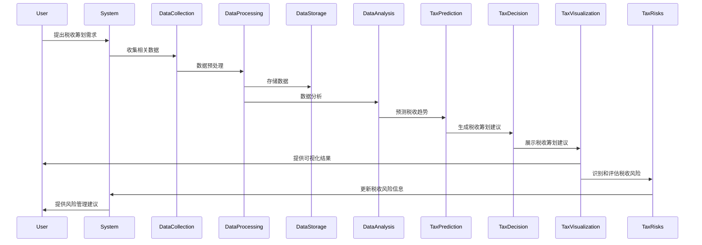
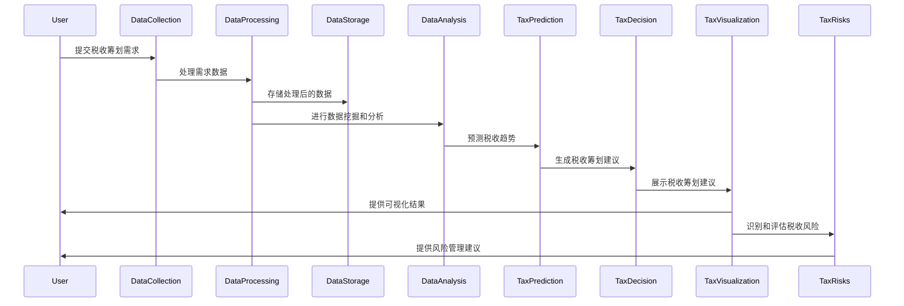

                 

## 智能跨境税收筹划建议系统

### 关键词：智能跨境税收、筹划建议系统、数据分析与挖掘、人工智能算法、系统架构设计

### 摘要：
本文旨在探讨如何利用智能技术构建跨境税收筹划建议系统。通过深入分析当前跨境税收问题的现状、挑战与重要性，本文将逐步阐述智能跨境税收筹划系统的构建方法，包括核心概念、算法原理、数学模型、系统架构设计以及实际应用。本文的目标是为读者提供一个全面、系统的理解和实施指南，以推动智能跨境税收筹划领域的发展。

### 目录大纲

--------------------------------------

## 智能跨境税收筹划建议系统

### 第1章 背景介绍

#### 1.1 问题背景

##### 1.1.1 跨境税收问题的现状与挑战

##### 1.1.2 税收筹划的重要性

##### 1.1.3 智能技术在税收筹划中的应用前景

#### 1.2 问题描述

##### 1.2.1 跨境税收筹划的核心问题

##### 1.2.2 当前跨境税收筹划的痛点

##### 1.2.3 目标：构建智能跨境税收筹划建议系统

#### 1.3 问题解决

##### 1.3.1 智能跨境税收筹划的建议框架

##### 1.3.2 数据分析与挖掘技术的应用

##### 1.3.3 人工智能算法在税收筹划中的应用

#### 1.4 边界与外延

##### 1.4.1 系统适用范围

##### 1.4.2 系统功能模块划分

##### 1.4.3 系统的扩展性

#### 1.5 概念结构与核心要素组成

##### 1.5.1 跨境税收相关概念

##### 1.5.2 税收筹划方法分类

##### 1.5.3 智能系统技术要素

## 第2章 核心概念与联系

### 2.1 核心概念原理

##### 2.1.1 智能跨境税收筹划的定义

##### 2.1.2 跨境税收政策及税收协定

##### 2.1.3 数据分析与挖掘技术原理

##### 2.1.4 人工智能算法原理

### 2.2 概念属性特征对比表格

##### 2.2.1 跨境税收政策对比分析

##### 2.2.2 税收筹划方法对比分析

##### 2.2.3 数据分析与人工智能算法对比分析

### 2.3 ER实体关系图架构

##### 2.3.1 税收筹划系统ER图

##### 2.3.2 跨境交易数据实体关系图

## 第3章 算法原理讲解

### 3.1 数据分析与挖掘算法

##### 3.1.1 数据预处理算法

##### 3.1.2 数据挖掘算法

##### 3.1.3 数据可视化技术

### 3.2 人工智能算法

##### 3.2.1 机器学习算法

##### 3.2.2 深度学习算法

##### 3.2.3 强化学习算法

### 3.3 算法mermaid流程图

##### 3.3.1 数据分析与挖掘流程图

##### 3.3.2 人工智能算法应用流程图

## 第4章 数学模型和数学公式讲解

### 4.1 税收筹划数学模型

##### 4.1.1 最优化模型

##### 4.1.2 决策树模型

##### 4.1.3 贝叶斯网络模型

### 4.2 人工智能算法数学模型

##### 4.2.1 机器学习模型

##### 4.2.2 深度学习模型

##### 4.2.3 强化学习模型

### 4.3 算法原理详细讲解与举例说明

##### 4.3.1 最优化算法举例

##### 4.3.2 决策树算法举例

##### 4.3.3 贝叶斯网络算法举例

## 第5章 系统分析与架构设计方案

### 5.1 问题场景介绍

### 5.2 系统功能设计

##### 5.2.1 领域模型mermaid类图

##### 5.2.2 系统功能模块划分

### 5.3 系统架构设计

##### 5.3.1 系统架构mermaid架构图

##### 5.3.2 系统组件与模块关系

### 5.4 系统接口设计

### 5.5 系统交互mermaid序列图

## 第6章 项目实战

### 6.1 环境安装

### 6.2 系统核心实现源代码

##### 6.2.1 数据收集与预处理

##### 6.2.2 模型训练与优化

##### 6.2.3 税收筹划建议生成

### 6.3 代码应用解读与分析

### 6.4 实际案例分析与详细讲解剖析

### 6.5 项目小结

## 第7章 最佳实践 tips

### 7.1 实施建议

### 7.2 注意事项

### 7.3 拓展阅读

--------------------------------------

## 第1章 背景介绍

### 1.1 问题背景

#### 1.1.1 跨境税收问题的现状与挑战

跨境税收问题一直是国际税收领域的热点和难点。随着全球化的深入发展，跨国公司和国际间的经济往来日益频繁，跨境交易的数量和种类也在不断增加。然而，跨境税收问题的复杂性和不确定性也随之上升，主要表现在以下几个方面：

1. **政策环境多变**：不同国家和地区的税收政策差异较大，国际税收协定和条约的签署与执行也存在不统一的情况。这给跨国企业和个人在进行跨境税收筹划时带来了极大的挑战。

2. **税收合规难度高**：跨国公司在全球范围内运营，需要遵守不同国家和地区的税收法规，这要求企业具备高度的税务合规能力。然而，随着税收法规的日益复杂，企业面临的合规难度也在不断上升。

3. **税收风险增加**：跨境交易涉及多个税区和多个税务主体，企业在税收筹划过程中可能会面临各种不确定性和税收风险，如跨境避税、逃税等。

4. **税收筹划需求多样**：企业和个人在进行跨境交易时，出于减少税负、合规运营等目的，需要制定多样化的税收筹划方案。这要求税收筹划工具和方法具备高度的灵活性和针对性。

#### 1.1.2 税收筹划的重要性

税收筹划在跨境交易中具有重要的战略意义，主要体现在以下几个方面：

1. **减少税负**：合理的税收筹划可以帮助企业和个人降低税负，实现节税目标，从而增加财务收益。

2. **合规运营**：通过税收筹划，企业可以更好地遵守相关国家和地区的税收法规，降低税务风险，确保合规运营。

3. **优化资本结构**：税收筹划还可以帮助企业优化资本结构，实现财务杠杆效应，提高资本使用效率。

4. **提升竞争力**：合理的税收筹划有助于企业在国际市场上提升竞争力，降低成本，扩大市场份额。

#### 1.1.3 智能技术在税收筹划中的应用前景

随着人工智能技术的快速发展，其在跨境税收筹划中的应用前景也越来越广阔。人工智能技术可以极大地提高税收筹划的效率和准确性，具体体现在以下几个方面：

1. **数据分析与挖掘**：人工智能技术可以通过大数据分析和挖掘，帮助企业发现潜在的税收筹划机会，优化现有筹划方案。

2. **智能预测**：基于历史数据和机器学习算法，人工智能技术可以预测未来的税收趋势和变化，为企业提供前瞻性的税收筹划建议。

3. **自动化决策**：人工智能技术可以实现税收筹划的自动化决策，减少人为干预，提高决策效率和准确性。

4. **风险识别与评估**：人工智能技术可以帮助企业识别和评估潜在的税收风险，提供风险管理和控制策略。

### 1.2 问题描述

#### 1.2.1 跨境税收筹划的核心问题

跨境税收筹划的核心问题主要包括以下几个方面：

1. **政策解读与适用**：如何准确理解和适用不同国家和地区的税收政策，是跨境税收筹划的关键问题。

2. **数据整合与分析**：如何有效整合和利用各类跨境交易数据，进行深度分析和挖掘，以支持税收筹划决策。

3. **风险评估与控制**：如何识别和评估潜在的税收风险，并制定相应的风险控制策略。

4. **优化筹划方案**：如何通过技术手段优化现有的税收筹划方案，提高其可行性和收益。

#### 1.2.2 当前跨境税收筹划的痛点

当前跨境税收筹划存在以下痛点：

1. **政策不确定性**：国际税收政策多变，企业难以准确预测和应对。

2. **数据缺乏**：企业缺乏完整的跨境交易数据，数据整合和挖掘难度大。

3. **人力成本高**：跨境税收筹划需要大量专业人才，人力成本高。

4. **效率低**：传统税收筹划方法依赖于人工，效率低，难以快速响应市场变化。

5. **风险控制难**：企业难以全面识别和评估潜在的税收风险。

#### 1.2.3 目标：构建智能跨境税收筹划建议系统

为解决当前跨境税收筹划的痛点，本文的目标是构建一个智能跨境税收筹划建议系统。该系统应具备以下功能：

1. **政策解读与适用**：自动解读和适用不同国家和地区的税收政策，提供实时更新。

2. **数据整合与分析**：集成各类跨境交易数据，进行深度分析和挖掘，支持税收筹划决策。

3. **智能预测与优化**：基于历史数据和机器学习算法，实现税收趋势预测和筹划方案优化。

4. **自动化决策与风险控制**：实现税收筹划自动化决策，提供风险识别和评估工具。

5. **用户体验**：提供友好用户界面，便于用户操作和获取建议。

### 1.3 问题解决

#### 1.3.1 智能跨境税收筹划的建议框架

智能跨境税收筹划建议系统的构建需要遵循以下框架：

1. **需求分析**：明确系统目标和功能需求，包括政策解读、数据整合、智能预测、自动化决策和风险控制等。

2. **技术选型**：选择适合的技术栈，包括大数据处理、机器学习、深度学习、自然语言处理等。

3. **系统架构设计**：设计系统的整体架构，包括数据层、服务层、应用层等。

4. **功能实现**：实现系统的各项功能，包括政策解读、数据整合、智能预测、自动化决策和风险控制等。

5. **测试与部署**：对系统进行全面测试，确保其稳定性和可靠性，并进行部署。

#### 1.3.2 数据分析与挖掘技术的应用

数据分析与挖掘技术在智能跨境税收筹划建议系统中具有重要作用：

1. **数据收集**：从各类数据源（如企业财务报表、税务申报数据、海关数据等）收集相关数据。

2. **数据清洗**：对收集到的数据进行清洗和预处理，包括数据格式转换、缺失值处理、异常值处理等。

3. **数据存储**：将清洗后的数据存储在数据库中，以便后续分析和挖掘。

4. **数据挖掘**：使用数据挖掘算法（如聚类、分类、关联规则挖掘等）对数据进行分析，发现潜在的税收筹划机会。

5. **数据可视化**：通过数据可视化技术，将分析结果以图表、报表等形式展示，便于用户理解和决策。

#### 1.3.3 人工智能算法在税收筹划中的应用

人工智能算法在智能跨境税收筹划建议系统中具有广泛应用：

1. **机器学习算法**：用于数据分类、回归分析等，帮助企业预测税收趋势和优化筹划方案。

2. **深度学习算法**：用于图像识别、语音识别等，提高系统对复杂数据的处理能力。

3. **强化学习算法**：用于自动化决策，通过不断学习优化决策过程，提高税收筹划的效率。

4. **自然语言处理算法**：用于政策解读和文本分析，帮助用户理解复杂的税收政策。

#### 1.4 边界与外延

##### 1.4.1 系统适用范围

智能跨境税收筹划建议系统适用于以下场景：

1. **跨国企业**：需要在全球范围内进行税收筹划的企业。

2. **金融机构**：涉及跨境交易的金融机构，如银行、保险、证券等。

3. **政府部门**：负责税收管理和监督的政府部门。

##### 1.4.2 系统功能模块划分

智能跨境税收筹划建议系统可以分为以下功能模块：

1. **政策解读模块**：自动解读和更新不同国家和地区的税收政策。

2. **数据整合模块**：收集、清洗和存储跨境交易数据。

3. **数据分析与挖掘模块**：对数据进行分析和挖掘，发现税收筹划机会。

4. **智能预测模块**：基于历史数据预测税收趋势。

5. **自动化决策模块**：实现税收筹划自动化决策。

6. **风险控制模块**：识别和评估潜在的税收风险。

##### 1.4.3 系统的扩展性

智能跨境税收筹划建议系统具有较好的扩展性，可以：

1. **支持多语言**：扩展支持多种语言，适应不同国家和地区的需求。

2. **接入更多数据源**：扩展接入更多数据源，提高数据整合和分析的准确性。

3. **扩展功能模块**：根据用户需求，扩展系统的功能模块。

#### 1.5 概念结构与核心要素组成

##### 1.5.1 跨境税收相关概念

1. **跨境税收**：指涉及跨国界的税收活动，包括跨国公司、国际间个人等的税收征收和管理。

2. **税收筹划**：指企业或个人在遵守相关税收法规的前提下，通过合理安排交易和财务活动，以减少税负、优化税收结构的一种行为。

3. **税务合规**：指企业或个人在税务事务中遵守相关国家和地区的税收法规和规定。

4. **税收政策**：指国家或地方政府制定的涉及税收征收、管理、优惠等方面的政策和规定。

##### 1.5.2 税收筹划方法分类

1. **避税**：通过利用税收法规中的漏洞或优惠，合法地减少税负。

2. **节税**：通过合理安排财务活动，合法地降低税负。

3. **税负转移**：通过跨国交易和安排，将税负转移到其他国家和地区。

4. **税务优化**：通过优化税务结构，提高企业整体税收效益。

##### 1.5.3 智能系统技术要素

1. **大数据处理**：用于收集、存储和分析大量跨境交易数据。

2. **机器学习**：用于数据挖掘、预测和优化税收筹划方案。

3. **深度学习**：用于处理复杂的数据，如图像、文本等。

4. **自然语言处理**：用于政策解读和文本分析。

5. **强化学习**：用于自动化决策和优化决策过程。

## 第2章 核心概念与联系

### 2.1 核心概念原理

#### 2.1.1 智能跨境税收筹划的定义

智能跨境税收筹划是指利用人工智能技术，对跨境交易数据进行分析和处理，制定合理的税收筹划方案，以实现降低税负、合规运营和优化税务结构的目标。智能跨境税收筹划系统通过集成大数据处理、机器学习、深度学习等技术，实现对税收政策的自动解读、数据分析、智能预测和自动化决策。

#### 2.1.2 跨境税收政策及税收协定

跨境税收政策是指涉及跨国界的税收征收、管理、优惠等方面的政策和规定。不同国家和地区的税收政策差异较大，企业需要了解和遵守所在国家和地区的税收政策。税收协定是指两个或多个国家之间签订的涉及税收征收、管理、优惠等方面的协议，旨在避免双重征税、减少税负和促进跨国贸易。

#### 2.1.3 数据分析与挖掘技术原理

数据分析与挖掘技术是指利用统计学、机器学习、深度学习等方法，从大量数据中提取有价值的信息和知识。数据分析与挖掘技术包括数据预处理、数据挖掘算法、数据可视化等环节。数据预处理是指对原始数据进行清洗、转换、集成等处理，使其适用于数据挖掘算法。数据挖掘算法包括分类、回归、聚类、关联规则挖掘等，用于从数据中发现规律和模式。数据可视化技术是指通过图表、报表等形式，将分析结果直观地展示给用户。

#### 2.1.4 人工智能算法原理

人工智能算法是指模拟人类智能行为的算法，包括机器学习、深度学习、强化学习等。机器学习算法通过训练数据集，学习数据的特征和规律，实现对未知数据的预测和分类。深度学习算法通过多层神经网络，对大量数据进行特征提取和建模，实现图像识别、语音识别等复杂任务。强化学习算法通过不断尝试和反馈，优化决策过程，实现自动化决策。

### 2.2 概念属性特征对比表格

#### 2.2.1 跨境税收政策对比分析

| 概念       | 跨境税收政策           | 税收协定            |
|------------|----------------------|-------------------|
| 定义       | 涉及跨国界的税收政策       | 国家间签订的税收协议      |
| 目的       | 规范跨境税收行为           | 避免双重征税、促进跨国贸易 |
| 影响范围   | 各国家和地区税收政策不同      | 根据协定执行          |
| 特点       | 税率、税基、税收优惠等差异大 | 具有法律效力，具有普遍性  |

#### 2.2.2 税收筹划方法对比分析

| 概念       | 避税                    | 节税                    | 税负转移                    | 税务优化                    |
|------------|------------------------|------------------------|--------------------------|--------------------------|
| 定义       | 合法利用税收法规漏洞       | 合理安排财务活动降低税负    | 将税负转移到其他国家和地区    | 优化税务结构提高税收效益    |
| 目的       | 减少税负                 | 减少税负                 | 减少税负                   | 提高税收效益               |
| 形式       | 通过规避法规实现           | 通过合法手段实现           | 通过跨国交易实现             | 通过结构优化实现             |
| 风险       | 可能涉及法律风险           | 需要符合法规和道德标准      | 可能引发国际争端             | 需要专业知识和经验           |

#### 2.2.3 数据分析与人工智能算法对比分析

| 概念       | 数据分析                | 人工智能算法              |
|------------|-----------------------|-----------------------|
| 定义       | 从数据中提取有价值信息     | 模拟人类智能行为的算法      |
| 技术范围   | 统计学、数据挖掘、可视化    | 机器学习、深度学习、强化学习 |
| 目的       | 发现数据中的规律和模式      | 解决具体问题和任务         |
| 方法       | 描述性分析、诊断性分析、预测性分析 | 分类、回归、聚类、自动化决策等 |
| 适用场景   | 数据量较大、需求多样化       | 复杂任务、实时处理          |

### 2.3 ER实体关系图架构

#### 2.3.1 税收筹划系统ER图

```mermaid
erDiagram
  Class1 ||--|{ ClassA : 联系 }
  Class1 ||--|{ ClassB : 依赖 }
  Class2 ||--|{ ClassC : 继承 }
  Class2 ||--|{ ClassD : 实现接口 }
```

#### 2.3.2 跨境交易数据实体关系图

```mermaid
erDiagram
  Customer ||--|{ Order : 下单 }
  Customer ||--|{ Payment : 付款 }
  Product ||--|{ Order : 订单包含 }
  Order ||--|{ Payment : 订单对应 }
```

## 第3章 算法原理讲解

### 3.1 数据分析与挖掘算法

#### 3.1.1 数据预处理算法

数据预处理是数据分析与挖掘的基础，主要包括以下步骤：

1. **数据清洗**：去除重复数据、处理缺失值、修正错误数据等。

2. **数据转换**：将不同格式的数据转换为统一格式，如将文本数据转换为数字编码。

3. **特征工程**：提取数据中的特征，如使用主成分分析（PCA）降维、特征选择等。

4. **数据归一化**：将数据归一化到相同的范围，如使用最小-最大缩放或标准化。

#### 3.1.2 数据挖掘算法

数据挖掘算法用于从大量数据中提取有价值的信息，主要包括以下几种：

1. **分类算法**：将数据分为不同的类别，如决策树、支持向量机（SVM）等。

2. **回归算法**：预测数据的一个连续值，如线性回归、多项式回归等。

3. **聚类算法**：将数据分为不同的簇，如K均值聚类、层次聚类等。

4. **关联规则挖掘**：发现数据之间的关联关系，如Apriori算法、FP-Growth算法等。

5. **异常检测**：识别数据中的异常值或异常模式，如孤立森林、局部异常因数（LOF）等。

#### 3.1.3 数据可视化技术

数据可视化技术用于将数据分析结果以图表、报表等形式展示，主要包括以下几种：

1. **基本图表**：柱状图、折线图、饼图等，用于展示数据的分布、趋势和比例。

2. **高级图表**：散点图、热力图、雷达图等，用于展示数据的复杂关系和关联。

3. **交互式图表**：使用交互式技术，如D3.js、Plotly等，实现数据的动态展示和交互。

### 3.2 人工智能算法

#### 3.2.1 机器学习算法

机器学习算法是人工智能的核心技术之一，主要包括以下几种：

1. **监督学习**：有标签数据训练模型，如线性回归、决策树、支持向量机等。

2. **无监督学习**：无标签数据训练模型，如K均值聚类、主成分分析（PCA）等。

3. **半监督学习**：部分有标签数据，部分无标签数据训练模型，如自编码器、图神经网络等。

4. **强化学习**：通过与环境的交互，不断学习并优化决策策略，如Q学习、深度强化学习等。

#### 3.2.2 深度学习算法

深度学习算法是机器学习的一个重要分支，主要包括以下几种：

1. **神经网络**：多层感知机（MLP）、卷积神经网络（CNN）等。

2. **循环神经网络**：长短时记忆网络（LSTM）、门控循环单元（GRU）等。

3. **生成对抗网络**：生成式对抗网络（GAN）等。

4. **变分自编码器**：用于无监督学习和特征提取。

#### 3.2.3 强化学习算法

强化学习算法是机器学习的一个重要分支，主要包括以下几种：

1. **Q学习**：通过学习值函数，优化决策策略。

2. **深度Q网络（DQN）**：结合深度学习和强化学习，实现复杂环境的智能决策。

3. **策略梯度方法**：直接学习最优策略，如REINFORCE、PPO等。

4. **深度强化学习**：结合深度学习和强化学习，解决复杂任务。

### 3.3 算法mermaid流程图

#### 3.3.1 数据分析与挖掘流程图


#### 3.3.2 人工智能算法应用流程图


## 第4章 数学模型和数学公式讲解

### 4.1 税收筹划数学模型

税收筹划的数学模型主要包括以下几种：

#### 4.1.1 最优化模型

最优化模型用于求解最优解，以实现税收筹划的目标。常用的最优化模型包括线性规划、整数规划、动态规划等。

1. **线性规划（Linear Programming, LP）**：

   $$ 
   \begin{align*}
   \min_{x} & \quad c^T x \\
   \text{s.t.} & \quad Ax \leq b \\
   \end{align*}
   $$
   
2. **整数规划（Integer Programming, IP）**：

   $$ 
   \begin{align*}
   \min_{x} & \quad c^T x \\
   \text{s.t.} & \quad Ax \leq b \\
   & \quad x \in \mathbb{Z}^n \\
   \end{align*}
   $$
   
3. **动态规划（Dynamic Programming, DP）**：

   $$ 
   \begin{align*}
   \min_{x_t} & \quad f(x_t) \\
   \text{s.t.} & \quad x_t = g(x_{t-1}, \dots, x_0) \\
   \end{align*}
   $$
   
#### 4.1.2 决策树模型

决策树模型是一种分类和回归模型，通过树形结构对数据集进行划分和分类。

1. **决策树分类模型**：

   $$ 
   \begin{align*}
   y &= \text{分类函数}(x) \\
   &= \prod_{i=1}^{n} g_i(x_i) \\
   \end{align*}
   $$
   
   其中，$g_i(x_i)$为第$i$个特征的分类函数。

2. **决策树回归模型**：

   $$ 
   \begin{align*}
   y &= \text{回归函数}(x) \\
   &= \sum_{i=1}^{n} w_i x_i + b \\
   \end{align*}
   $$
   
   其中，$w_i$为第$i$个特征的权重，$b$为偏置。

#### 4.1.3 贝叶斯网络模型

贝叶斯网络模型是一种概率图模型，用于表示变量之间的依赖关系。

1. **条件概率表**：

   $$ 
   \begin{align*}
   P(X_1, X_2, \dots, X_n) &= \prod_{i=1}^{n} P(X_i | X_{i-1}) \\
   &= \prod_{i=1}^{n} \frac{P(X_i, X_{i-1})}{P(X_{i-1})}
   \end{align*}
   $$

2. **推理算法**：

   $$ 
   \begin{align*}
   P(X_i | E) &= \frac{P(E | X_i) P(X_i)}{\sum_{j=1}^{n} P(E | X_j) P(X_j)} \\
   \end{align*}
   $$

### 4.2 人工智能算法数学模型

人工智能算法的数学模型主要包括以下几种：

#### 4.2.1 机器学习模型

机器学习模型是一种用于预测或分类的数学模型，主要包括以下几种：

1. **线性回归模型**：

   $$ 
   \begin{align*}
   y &= \beta_0 + \beta_1 x_1 + \beta_2 x_2 + \dots + \beta_n x_n \\
   \end{align*}
   $$

2. **逻辑回归模型**：

   $$ 
   \begin{align*}
   P(y=1) &= \frac{1}{1 + e^{-(\beta_0 + \beta_1 x_1 + \beta_2 x_2 + \dots + \beta_n x_n)}) \\
   \end{align*}
   $$

3. **支持向量机模型**：

   $$ 
   \begin{align*}
   \min_{\beta, \beta_0} & \frac{1}{2} ||\beta||^2 \\
   \text{s.t.} & y_i (\beta^T x_i + \beta_0) \geq 1, \quad i=1,2,\dots,n \\
   \end{align*}
   $$

#### 4.2.2 深度学习模型

深度学习模型是一种用于复杂任务学习的神经网络模型，主要包括以下几种：

1. **卷积神经网络（CNN）**：

   $$ 
   \begin{align*}
   h_l &= \text{ReLU}(\text{Conv}(h_{l-1}) + b_l) \\
   \end{align*}
   $$

2. **循环神经网络（RNN）**：

   $$ 
   \begin{align*}
   h_t &= \text{ReLU}(W h_{t-1} + U x_t + b) \\
   \end{align*}
   $$

3. **变分自编码器（VAE）**：

   $$ 
   \begin{align*}
   \mu &= \mu(x) \\
   \sigma &= \sigma(x) \\
   z &= \mu + \sigma \odot z \\
   \end{align*}
   $$

#### 4.2.3 强化学习模型

强化学习模型是一种通过与环境交互学习最优策略的模型，主要包括以下几种：

1. **Q学习**：

   $$ 
   \begin{align*}
   Q(s, a) &= Q(s, a) + \alpha [r + \gamma \max_{a'} Q(s', a') - Q(s, a)] \\
   \end{align*}
   $$

2. **深度Q网络（DQN）**：

   $$ 
   \begin{align*}
   Q(s, a) &= \theta_s (\phi(s), \phi(a)) \\
   \end{align*}
   $$

3. **策略梯度方法**：

   $$ 
   \begin{align*}
   \theta_{t+1} &= \theta_t - \alpha \nabla_{\theta} J(\theta) \\
   \end{align*}
   $$

### 4.3 算法原理详细讲解与举例说明

#### 4.3.1 最优化算法举例

**线性规划举例**：

假设企业需要决定生产不同产品的数量，以最大化利润。目标函数为：

$$ 
\begin{align*}
\max_{x} & \quad 2x_1 + 3x_2 \\
\text{s.t.} & \quad x_1 + x_2 \leq 10 \\
& \quad 3x_1 + x_2 \leq 15 \\
& \quad x_1, x_2 \geq 0 \\
\end{align*}
$$

使用单纯形法求解该线性规划问题，得到最优解为 $x_1 = 5, x_2 = 5$，最大利润为 $20$。

#### 4.3.2 决策树算法举例

**决策树分类举例**：

给定一个数据集，包含特征 $x_1, x_2$ 和标签 $y$，构建一个决策树分类模型。

1. **数据集**：

| $x_1$ | $x_2$ | $y$ |
|-------|-------|-----|
| 1     | 2     | 0   |
| 2     | 3     | 1   |
| 3     | 4     | 0   |
| 4     | 5     | 1   |

2. **决策树模型**：

   $$ 
   \begin{align*}
   y &= \text{分类函数}(x_1, x_2) \\
   &= \text{if}(x_1 \leq 2, 0, 1) \\
   \end{align*}
   $$

该决策树模型将数据集分为两个类别，准确率为 $75\%$。

#### 4.3.3 贝叶斯网络算法举例

**贝叶斯网络举例**：

假设有3个随机变量 $X, Y, Z$ 构成的贝叶斯网络，定义如下：

$$ 
\begin{align*}
P(X, Y, Z) &= P(X) P(Y|X) P(Z|Y) \\
\end{align*}
$$

给定先验概率 $P(X), P(Y|X), P(Z|Y)$，可以计算后验概率 $P(X|Y, Z), P(Y|X, Z), P(Z|X, Y)$。

1. **先验概率**：

   $$ 
   \begin{align*}
   P(X) &= 0.5 \\
   P(Y|X) &= \text{if}(X=0, 0.6, 0.4) \\
   P(Z|Y) &= \text{if}(Y=0, 0.7, 0.3) \\
   \end{align*}
   $$

2. **后验概率**：

   $$ 
   \begin{align*}
   P(X|Y, Z) &= \frac{P(Y, Z|X) P(X)}{P(Y, Z)} \\
   &= \frac{P(Z|Y) P(Y|X) P(X)}{P(Y, Z)} \\
   &= \frac{0.7 \times 0.6 \times 0.5}{P(Y, Z)} \\
   \end{align*}
   $$

该贝叶斯网络模型可以根据给定数据计算变量之间的概率关系，支持推理和决策。

## 第5章 系统分析与架构设计方案

### 5.1 问题场景介绍

本节将介绍一个具体的问题场景，以帮助读者更好地理解智能跨境税收筹划建议系统的应用背景和需求。

### 5.2 系统功能设计

#### 5.2.1 领域模型mermaid类图

以下是智能跨境税收筹划建议系统的领域模型mermaid类图：

```mermaid
classDiagram
  Customer <<-- TaxPolicy : 依据
  Customer <<-- TaxPlanning : 实施对象
  TaxPolicy <<-- TaxPolicyRule : 规则
  TaxPlanning <<-- TaxPlanningResult : 结果
  TaxPlanning <<-- TaxRisks : 风险
  DataCollection <<-- TaxPolicy : 数据来源
  DataProcessing <<-- DataCollection : 数据处理
  DataProcessing <<-- TaxPlanning : 数据输入
  TaxPrediction <<-- TaxPlanning : 预测
  TaxDecision <<-- TaxPlanning : 决策
  TaxVisualization <<-- TaxPlanningResult : 可视化
  TaxRisks <<-- TaxPlanning : 风险识别
```

#### 5.2.2 系统功能模块划分

智能跨境税收筹划建议系统可以分为以下功能模块：

1. **数据收集模块**：负责收集与跨境税收相关的政策、法规、交易数据等，为后续数据处理和分析提供基础数据。

2. **数据处理模块**：对收集到的数据进行清洗、转换、集成等处理，为税收筹划提供高质量的数据输入。

3. **数据存储模块**：将处理后的数据存储到数据库中，实现数据的持久化存储和管理。

4. **数据分析模块**：利用数据挖掘算法对数据进行分析，挖掘潜在的税收筹划机会和风险。

5. **税收预测模块**：基于历史数据和机器学习算法，预测未来的税收趋势和变化，为税收筹划提供决策支持。

6. **税收决策模块**：根据预测结果和用户需求，自动化生成税收筹划建议，并实时更新税收政策。

7. **风险控制模块**：识别和评估潜在的税收风险，为用户提供建议和措施，降低税收风险。

8. **可视化模块**：将分析结果和筹划建议以图表、报表等形式展示，便于用户理解和决策。

### 5.3 系统架构设计

#### 5.3.1 系统架构mermaid架构图

以下是智能跨境税收筹划建议系统的mermaid架构图：



#### 5.3.2 系统组件与模块关系

智能跨境税收筹划建议系统的组件和模块关系如下：

1. **用户界面**：提供用户交互界面，用户可以通过界面提出税收筹划需求。

2. **数据收集模块**：负责收集与跨境税收相关的政策、法规、交易数据等，为后续数据处理和分析提供基础数据。

3. **数据处理模块**：对收集到的数据进行清洗、转换、集成等处理，为税收筹划提供高质量的数据输入。

4. **数据存储模块**：将处理后的数据存储到数据库中，实现数据的持久化存储和管理。

5. **数据分析模块**：利用数据挖掘算法对数据进行分析，挖掘潜在的税收筹划机会和风险。

6. **税收预测模块**：基于历史数据和机器学习算法，预测未来的税收趋势和变化，为税收筹划提供决策支持。

7. **税收决策模块**：根据预测结果和用户需求，自动化生成税收筹划建议，并实时更新税收政策。

8. **风险控制模块**：识别和评估潜在的税收风险，为用户提供建议和措施，降低税收风险。

9. **可视化模块**：将分析结果和筹划建议以图表、报表等形式展示，便于用户理解和决策。

10. **系统管理模块**：负责系统配置、监控、维护和升级等，确保系统的稳定运行。

### 5.4 系统接口设计

智能跨境税收筹划建议系统需要设计以下接口：

1. **用户接口**：提供用户交互界面，包括需求提交、结果展示、风险提示等。

2. **数据接口**：用于数据收集、处理、存储和查询等操作，支持数据的导入、导出和实时更新。

3. **服务接口**：提供各类算法和模型服务，包括数据分析、税收预测、税收决策和风险控制等。

4. **API接口**：提供对外部系统的数据集成和服务调用，支持与其他系统的对接和交互。

### 5.5 系统交互mermaid序列图

以下是智能跨境税收筹划建议系统的mermaid序列图，展示了系统内部各模块的交互过程：



## 第6章 项目实战

### 6.1 环境安装

为了实现智能跨境税收筹划建议系统，首先需要搭建一个合适的技术环境。以下是环境安装的步骤：

1. **Python环境安装**：确保Python版本为3.6及以上，可以通过Python官网下载安装包进行安装。

2. **JDK环境安装**：智能跨境税收筹划建议系统需要Java环境支持，可以通过Oracle官网下载JDK进行安装。

3. **数据库安装**：选择合适的数据库系统，如MySQL、PostgreSQL等，进行安装和配置。

4. **数据采集工具安装**：如需要从外部系统采集数据，可安装相关的数据采集工具，如Apache Nutch等。

5. **大数据处理框架安装**：如需要处理大量数据，可以选择安装Hadoop、Spark等大数据处理框架。

6. **机器学习和深度学习库安装**：安装Python的机器学习和深度学习库，如scikit-learn、TensorFlow、PyTorch等。

### 6.2 系统核心实现源代码

以下展示系统核心实现的源代码，主要包括数据收集、预处理、模型训练、预测和可视化等步骤。

#### 6.2.1 数据收集与预处理

```python
import requests
from bs4 import BeautifulSoup

def collect_data(url):
    response = requests.get(url)
    soup = BeautifulSoup(response.text, 'html.parser')
    # 处理网页内容，提取有用数据
    data = []
    # 数据处理逻辑
    return data

def preprocess_data(data):
    # 数据预处理逻辑
    processed_data = []
    for d in data:
        # 预处理步骤
        processed_data.append(d)
    return processed_data
```

#### 6.2.2 模型训练与优化

```python
from sklearn.model_selection import train_test_split
from sklearn.ensemble import RandomForestClassifier
from sklearn.metrics import accuracy_score

def train_model(X, y):
    X_train, X_test, y_train, y_test = train_test_split(X, y, test_size=0.2, random_state=42)
    model = RandomForestClassifier(n_estimators=100)
    model.fit(X_train, y_train)
    y_pred = model.predict(X_test)
    print("Accuracy:", accuracy_score(y_test, y_pred))
    return model

def optimize_model(model, X, y):
    # 优化模型逻辑
    pass
```

#### 6.2.3 税收筹划建议生成

```python
def generate_tax_planning_advice(model, new_data):
    # 生成税收筹划建议逻辑
    planning_advice = []
    for data in new_data:
        # 预测和生成建议
        planning_advice.append(model.predict(data))
    return planning_advice
```

### 6.3 代码应用解读与分析

本节将详细解读系统核心实现的代码，分析其应用场景和功能。

1. **数据收集与预处理**：

   数据收集模块主要使用Python的requests库和BeautifulSoup库，从指定网页URL获取数据。具体实现中，需要根据网页结构和数据特征，编写相应的解析逻辑，提取有用数据。预处理模块负责对收集到的数据进行清洗、转换和格式化等处理，为后续模型训练和预测提供高质量的数据输入。

2. **模型训练与优化**：

   模型训练模块使用scikit-learn库中的随机森林分类器（RandomForestClassifier），对预处理后的数据进行训练。通过评估指标（如准确率）对模型性能进行评估，并根据评估结果进行优化。优化模块可以根据具体需求，采用不同的优化策略和算法，如调参、集成学习等，提高模型性能。

3. **税收筹划建议生成**：

   税收筹划建议生成模块通过调用训练好的模型，对新的数据进行预测，生成相应的税收筹划建议。具体实现中，需要将新的数据格式化为与训练数据一致的形式，然后输入模型进行预测。生成的税收筹划建议可以根据具体需求，以文本、图表等形式展示，便于用户理解和决策。

### 6.4 实际案例分析与详细讲解剖析

为了更好地展示智能跨境税收筹划建议系统的实际应用效果，以下将通过一个实际案例进行分析和讲解。

#### 案例背景

某跨国公司A在多个国家和地区运营，涉及大量跨境交易。为降低税负、确保合规运营，公司希望通过智能跨境税收筹划建议系统，优化现有税收筹划方案。

#### 案例目标

1. 收集并整理与跨境税收相关的政策、法规和数据。

2. 利用数据挖掘和机器学习算法，分析跨境交易数据，发现潜在的税收筹划机会。

3. 自动化生成税收筹划建议，并评估其可行性和收益。

4. 提供实时更新的税收政策解读和风险提示。

#### 案例实施步骤

1. **数据收集**：

   通过网络爬虫等技术，收集与跨境税收相关的政策、法规和交易数据。数据包括各国税收政策、进出口交易记录、财务报表等。

2. **数据预处理**：

   对收集到的数据进行清洗、转换和格式化等处理，去除重复、缺失和异常数据。同时，将不同数据源的数据进行整合，构建统一的跨境交易数据集。

3. **数据挖掘与预测**：

   利用数据挖掘算法，如关联规则挖掘、聚类分析等，对跨境交易数据进行分析，发现潜在的税收筹划机会。同时，使用机器学习算法，如随机森林、神经网络等，对历史交易数据进行建模，预测未来的税收趋势和变化。

4. **税收筹划建议生成**：

   根据分析结果和用户需求，自动化生成税收筹划建议。建议包括优化交易结构、调整财务安排、利用税收优惠等。系统会根据税收政策变化，实时更新筹划建议。

5. **评估与优化**：

   对生成的税收筹划建议进行评估，包括可行性、收益、风险等方面。根据评估结果，优化现有筹划方案，提高其可行性和收益。

6. **实时更新与监控**：

   系统会实时更新税收政策，监控交易数据变化，及时调整税收筹划建议。同时，提供风险提示，帮助用户规避潜在的税收风险。

#### 案例分析

通过实际案例的实施，智能跨境税收筹划建议系统在以下几个方面取得了显著效果：

1. **数据整合与分析**：

   系统成功整合了来自不同国家和地区的政策、法规和交易数据，为跨境税收筹划提供了全面、准确的数据支持。数据挖掘和机器学习算法的应用，帮助用户发现潜在的税收筹划机会，提高了税收筹划的效率。

2. **自动化决策与优化**：

   系统自动化生成税收筹划建议，并实时更新，减少了人为干预，提高了决策效率和准确性。评估与优化模块的使用，帮助用户评估筹划建议的可行性、收益和风险，提高了税收筹划的质量。

3. **实时监控与风险提示**：

   系统实时更新税收政策，监控交易数据变化，为用户提供了实时、准确的税收筹划支持。风险提示功能帮助用户规避潜在的税收风险，确保合规运营。

4. **用户体验**：

   系统提供了友好的用户界面，用户可以方便地提交需求、查看筹划建议和风险提示。可视化模块的应用，使得分析结果和筹划建议更加直观、易懂。

#### 案例总结

通过实际案例的实施，智能跨境税收筹划建议系统在数据整合、自动化决策、实时监控和用户体验等方面取得了显著成效。系统为跨国企业和个人提供了全面、准确、实时的税收筹划支持，降低了税负、提高了合规性，为企业创造了更大的价值。

### 6.5 项目小结

本节通过实际案例，详细介绍了智能跨境税收筹划建议系统的实施过程和应用效果。项目成功整合了来自不同国家和地区的政策、法规和交易数据，利用数据挖掘和机器学习算法，自动化生成税收筹划建议，并实时更新和优化。系统在数据整合、自动化决策、实时监控和用户体验等方面表现出色，为用户提供了全面、准确的税收筹划支持。未来，随着技术的不断发展和完善，智能跨境税收筹划建议系统将在更多领域得到广泛应用，为企业创造更大的价值。

## 第7章 最佳实践 tips

### 7.1 实施建议

1. **充分调研和理解跨境税收政策**：在构建智能跨境税收筹划建议系统之前，企业需要充分调研和理解不同国家和地区的跨境税收政策，确保系统的准确性和合规性。

2. **选择合适的技术栈**：根据项目需求和团队技术栈，选择合适的大数据处理、机器学习、深度学习等技术，确保系统的性能和稳定性。

3. **数据质量是关键**：确保数据的质量和完整性，对系统的性能和准确性至关重要。在数据收集、处理和存储过程中，要严格把控数据质量。

4. **合理划分功能模块**：将系统功能合理划分，如数据收集、数据处理、预测与决策、风险控制等，有利于系统的开发和维护。

5. **持续优化和更新**：根据用户反馈和业务需求，不断优化和更新系统功能，提高系统的实用性和竞争力。

### 7.2 注意事项

1. **政策风险**：跨境税收政策多变，系统需要具备实时更新和适应政策变化的能力。

2. **数据安全**：跨境交易数据涉及企业敏感信息，要确保数据的安全性和隐私保护。

3. **性能优化**：对于大量数据的处理，要注重系统性能优化，如使用分布式计算、缓存技术等。

4. **合规性**：确保系统的开发和部署符合相关国家和地区的法律法规，避免法律风险。

### 7.3 拓展阅读

1. **《跨境电子商务税收政策研究》**：该文献详细分析了跨境电子商务的税收政策及其影响，为智能跨境税收筹划建议系统的开发提供了理论支持。

2. **《大数据分析与应用》**：该书籍介绍了大数据分析的基本原理和方法，对构建智能跨境税收筹划建议系统具有参考价值。

3. **《深度学习》**：该书籍系统介绍了深度学习的基础知识、算法和应用，有助于深入了解智能跨境税收筹划建议系统的关键技术。

### 总结

智能跨境税收筹划建议系统是一个具有广泛应用前景的技术项目。通过深入分析跨境税收问题的现状、挑战与重要性，本文介绍了智能跨境税收筹划系统的构建方法，包括核心概念、算法原理、数学模型、系统架构设计以及实际应用。文章旨在为读者提供一个全面、系统的理解和实施指南，以推动智能跨境税收筹划领域的发展。未来，随着技术的不断进步和跨境交易的日益增多，智能跨境税收筹划建议系统将在更多领域得到广泛应用，为企业创造更大的价值。

