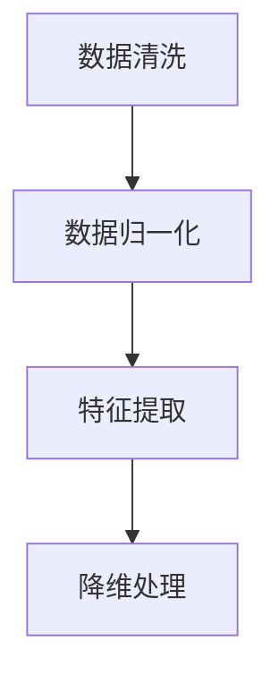
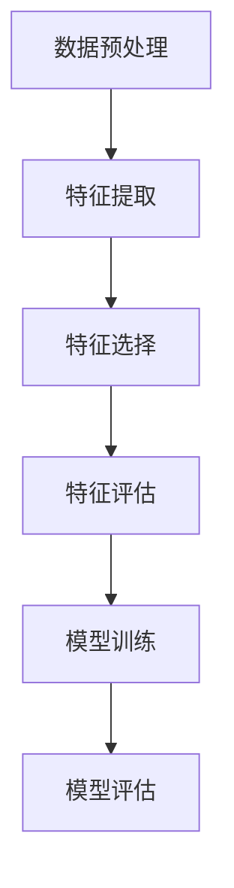

                 

### 文章标题

《智能银行不良资产管理优化系统》

#### 关键词

- 不良资产管理
- 智能银行
- 优化系统
- 数据处理
- 算法

#### 摘要

本文深入探讨了智能银行不良资产管理优化系统的构建与实现。首先，我们阐述了不良资产管理的背景与重要性，介绍了智能银行的概念与发展趋势。接着，文章详细分析了不良资产管理的挑战与机遇，探讨了智能银行不良资产管理优化系统的架构设计与核心算法。随后，文章通过实战案例，展示了系统在数据处理、算法实现及性能优化等方面的具体应用，最后，我们对系统设计、算法实现中的最佳实践进行了总结，并展望了不良资产管理优化系统的未来发展方向。全文旨在为读者提供一套全面、系统的智能银行不良资产管理优化解决方案。

### 《智能银行不良资产管理优化系统》目录大纲

#### 第一部分：背景与核心概念

##### 第1章 问题背景与核心概念

- 1.1 不良资产管理的重要性
- 1.2 智能银行概述
- 1.3 不良资产管理的挑战与机遇
- 1.4 本章小结

##### 第2章 系统架构与设计

- 2.1 系统概述
- 2.2 系统架构设计
- 2.3 技术选型与工具介绍
- 2.4 数据流与处理流程
- 2.5 系统安全性设计
- 2.6 本章小结

##### 第二部分：核心算法与数学模型

##### 第3章 数据预处理与特征提取

- 3.1 数据预处理方法
- 3.2 特征提取方法
- 3.3 特征选择方法
- 3.4 算法原理与数学模型
- 3.5 本章小结

##### 第三部分：项目实战

##### 第4章 环境安装与配置

- 4.1 环境搭建
- 4.2 系统核心实现源代码
- 4.3 代码应用解读与分析
- 4.4 实际案例分析
- 4.5 详细讲解与剖析
- 4.6 项目小结

##### 第四部分：最佳实践与总结

##### 第5章 最佳实践与技巧

- 5.1 数据处理技巧
- 5.2 算法优化技巧
- 5.3 性能调优
- 5.4 本章小结

##### 第6章 小结与展望

- 6.1 主要内容回顾
- 6.2 注意事项
- 6.3 拓展阅读
- 6.4 展望未来
- 6.5 本章小结

#### 第五部分：结语

##### 第7章 结语

- **作者：** AI天才研究院/AI Genius Institute & 禅与计算机程序设计艺术 /Zen And The Art of Computer Programming

---

#### 第1章 问题背景与核心概念

##### 1.1 不良资产管理的重要性

不良资产是银行及其他金融机构面临的重要问题。不良资产不仅影响银行的财务健康，还可能引发系统性金融风险。随着金融市场的复杂化和全球经济的不确定性增加，不良资产的管理变得愈加重要。

- **问题背景**：金融机构产生不良资产的原因多样，包括贷款违约、市场波动、经济下行等因素。不良资产的形成不仅影响了金融机构的盈利能力，还可能造成资金的短缺，影响金融市场的稳定性。
- **问题描述**：不良资产管理的核心问题是识别、评估、处理和处置这些不良资产，以确保金融机构的财务健康和运营稳定。
- **问题解决思路**：通过构建智能银行不良资产管理优化系统，可以实现对不良资产的全流程管理，提高资产管理效率，降低金融风险。
- **边界与外延**：不良资产管理的边界包括不良资产的识别、分类、评估、处理和处置等环节。不良资产管理的外延则涵盖了金融风险控制、信用评估、投资管理等相关领域。
- **概念结构与核心要素组成**：不良资产管理系统的核心结构包括数据采集与处理、不良资产识别与评估、资产处置与回收、风险控制与预警等模块。每个模块都包含若干核心要素，如数据源、算法模型、决策引擎等。

##### 1.2 智能银行概述

智能银行是指通过人工智能、大数据、云计算等技术手段，提升银行运营效率、服务质量和风险控制能力的新型银行形态。

- **智能银行定义**：智能银行是一种利用人工智能、大数据、云计算等先进技术，对银行业务流程进行自动化、智能化的银行。它通过构建智能服务系统，提供更加便捷、高效、个性化的金融服务。
- **智能银行发展趋势**：随着金融科技的快速发展，智能银行正逐渐成为银行业发展的主流趋势。智能银行的发展趋势包括：数字化服务、智能化风控、个性化营销、跨界合作等。
- **智能银行与传统银行的区别**：传统银行主要依靠人工处理业务，服务效率低、用户体验差。而智能银行通过技术手段，实现了业务流程的自动化、智能化，提高了服务效率和用户体验。此外，智能银行还具有更强大的风险控制能力和更精准的信用评估能力。

##### 1.3 不良资产管理的挑战与机遇

不良资产管理面临诸多挑战，同时也蕴含着巨大的机遇。

- **挑战**：
  - **数据质量**：不良资产数据质量参差不齐，数据清洗和预处理成为一大挑战。
  - **算法模型**：需要选择合适的算法模型，以实现对不良资产的准确识别和评估。
  - **政策法规**：不良资产管理的政策和法规环境复杂，需要严格遵守相关法律法规。
  - **技术实现**：构建智能银行不良资产管理优化系统需要较高的技术实现能力，涉及大数据处理、人工智能算法等前沿技术。

- **机遇**：
  - **市场潜力**：随着金融市场的不断发展和壮大，不良资产管理市场具有巨大的市场潜力。
  - **技术进步**：大数据、人工智能等技术的进步为不良资产管理提供了新的手段和方法。
  - **跨界合作**：智能银行不良资产管理优化系统可以与其他金融科技企业、监管机构等开展跨界合作，共同推动不良资产管理的发展。

##### 1.4 本章小结

本章对智能银行不良资产管理优化系统的核心概念和背景进行了深入探讨。我们介绍了不良资产管理的背景和重要性，阐述了智能银行的概念与发展趋势，分析了不良资产管理的挑战与机遇。通过本章的学习，读者可以全面了解智能银行不良资产管理优化系统的构建背景和核心概念。

---

### 第2章 系统架构与设计

#### 2.1 系统概述

不良资产管理优化系统是一个旨在提高银行不良资产识别、评估、处置和回收效率的智能化系统。该系统通过整合多种数据源，利用大数据和人工智能技术，实现不良资产的全流程管理。

- **项目介绍**：本项目的目标是构建一个智能银行不良资产管理优化系统，通过数据采集、预处理、特征提取、模型训练和评估等步骤，实现对不良资产的智能识别和管理。
- **系统功能设计**：
  - **数据采集**：从内部和外部数据源获取不良资产相关信息，包括贷款、债券、股票等。
  - **数据预处理**：对采集到的数据进行清洗、归一化和降维处理，提高数据质量。
  - **特征提取**：从预处理后的数据中提取关键特征，为模型训练提供基础。
  - **模型训练**：使用机器学习算法训练不良资产识别和评估模型。
  - **评估与优化**：通过模型评估，调整模型参数，实现不良资产识别和评估的优化。
  - **资产处置与回收**：根据评估结果，制定资产处置策略，提高资产回收率。

#### 2.2 系统架构设计

不良资产管理优化系统的整体架构分为数据层、算法层和应用层三个部分。

- **数据层**：数据层是系统的基石，包括数据采集、存储和管理模块。数据采集模块负责从内部和外部数据源获取不良资产相关信息。数据存储模块负责存储和管理这些数据，提供高效的数据检索和查询功能。
- **算法层**：算法层是系统的核心，包括数据预处理、特征提取、模型训练和评估模块。数据预处理模块负责对采集到的数据进行清洗、归一化和降维处理。特征提取模块负责从预处理后的数据中提取关键特征，为模型训练提供基础。模型训练模块使用机器学习算法训练不良资产识别和评估模型。评估模块负责对模型进行评估和优化。
- **应用层**：应用层是系统的用户界面，包括资产管理模块、风险控制模块和决策支持模块。资产管理模块负责实现不良资产的识别、评估、处置和回收功能。风险控制模块负责监控和管理不良资产的风险。决策支持模块提供数据分析和可视化功能，帮助用户做出明智的决策。

#### 2.3 技术选型与工具介绍

为了实现不良资产管理优化系统的功能，我们选用了多种技术栈和工具。

- **技术栈**：
  - **大数据技术**：采用Hadoop和Spark等大数据处理框架，实现对海量数据的快速处理和分析。
  - **人工智能技术**：使用Python和R等编程语言，结合Scikit-learn、TensorFlow和Keras等机器学习库，构建不良资产识别和评估模型。
  - **数据库技术**：使用MySQL和MongoDB等数据库管理系统，存储和管理不良资产数据。
- **工具介绍**：
  - **数据预处理工具**：使用Python的Pandas库进行数据清洗、归一化和降维处理。
  - **特征提取工具**：使用Python的Scikit-learn库进行特征提取。
  - **机器学习框架**：使用TensorFlow和Keras构建和训练机器学习模型。
  - **可视化工具**：使用Python的Matplotlib和Seaborn库进行数据分析和可视化。

#### 2.4 数据流与处理流程

不良资产管理优化系统的数据流和处理流程可以分为以下步骤：

1. **数据采集**：从内部和外部数据源获取不良资产相关信息，包括贷款、债券、股票等。
2. **数据预处理**：对采集到的数据进行清洗、归一化和降维处理，提高数据质量。
3. **特征提取**：从预处理后的数据中提取关键特征，为模型训练提供基础。
4. **模型训练**：使用机器学习算法训练不良资产识别和评估模型。
5. **模型评估**：通过模型评估，调整模型参数，实现不良资产识别和评估的优化。
6. **资产处置与回收**：根据评估结果，制定资产处置策略，提高资产回收率。

#### 2.5 系统安全性设计

为了保证不良资产管理优化系统的安全性，我们采取了以下安全防护措施：

- **数据加密**：对存储在数据库中的敏感数据进行加密处理，防止数据泄露。
- **权限控制**：设置严格的权限控制机制，确保只有授权用户才能访问系统。
- **网络安全**：采用防火墙、入侵检测系统等网络安全设备，保护系统免受网络攻击。
- **日志监控**：实时监控系统日志，及时发现和处理异常情况。

#### 2.6 本章小结

本章详细介绍了智能银行不良资产管理优化系统的架构设计与核心技术。我们阐述了系统的功能设计、架构设计、技术选型和工具介绍，并描述了数据流与处理流程和系统安全性设计。通过本章的学习，读者可以全面了解不良资产管理优化系统的构建原理和关键技术。

---

### 第3章 数据预处理与特征提取

#### 3.1 数据预处理方法

数据预处理是构建智能银行不良资产管理优化系统的关键步骤，其目的是提高数据质量，为后续的特征提取和模型训练提供良好的数据基础。

- **数据清洗**：数据清洗的主要任务是处理数据中的噪声、缺失值和异常值。具体方法包括：
  - **噪声处理**：使用统计学方法（如中位数、众数）填补异常值，使用算法（如K-均值聚类、DBSCAN）去除噪声数据。
  - **缺失值处理**：使用均值、中位数或众数填补缺失值，或使用机器学习算法（如决策树、随机森林）预测缺失值。
  - **异常值处理**：使用统计学方法（如标准差、箱线图）识别异常值，并采取相应的处理措施，如删除或替换异常值。
- **数据归一化**：数据归一化的目的是将不同特征的数据缩放到相同的尺度，消除数据之间的量纲差异。常用的归一化方法包括：
  - **最小-最大归一化**：将数据缩放到[0, 1]的范围内，公式为 $x' = \frac{x - x_{\min}}{x_{\max} - x_{\min}}$。
  - **零-均值归一化**：将数据缩放到均值为0、标准差为1的范围内，公式为 $x' = \frac{x - \mu}{\sigma}$。
- **数据降维**：数据降维的目的是减少数据的维度，提高计算效率，同时保持数据的本质特征。常用的降维方法包括：
  - **主成分分析（PCA）**：通过将数据投影到新的正交坐标系上，提取主要成分，实现降维。
  - **t-SNE**：通过非线性映射，将高维数据映射到低维空间，用于可视化高维数据的结构。

#### 3.2 特征提取方法

特征提取是从原始数据中提取出对目标任务具有区分性的特征，以提高模型训练效果。以下介绍几种常用的特征提取方法：

- **描述性特征提取**：描述性特征提取方法主要包括统计特征和文本特征。
  - **统计特征**：从数据集中提取出能够描述数据集中整体或局部特性的统计量，如均值、方差、标准差、最大值、最小值等。
  - **文本特征**：从文本数据中提取出能够反映文本内容的关键词、主题和情感等特征，如词袋模型、TF-IDF、Word2Vec等。
- **降维特征提取**：降维特征提取方法主要用于减少数据维度，提高模型训练效率。常用的降维方法包括：
  - **线性判别分析（LDA）**：通过最大化类间离散度和最小化类内离散度，提取具有区分性的线性特征。
  - **因子分析（FA）**：通过将多个变量表示为少数几个不可观测的因子组合，实现降维。
- **深度特征提取**：深度特征提取方法主要基于深度学习技术，从原始数据中自动学习出高级特征表示。常用的方法包括：
  - **卷积神经网络（CNN）**：通过卷积操作提取图像中的空间特征。
  - **循环神经网络（RNN）**：通过循环连接和门控机制提取序列数据中的时序特征。

#### 3.3 特征选择方法

特征选择是从大量特征中筛选出对目标任务最具预测性的特征子集，以提高模型性能和降低计算成本。以下介绍几种常用的特征选择方法：

- **信息增益**：信息增益是根据特征对分类目标的区分能力进行选择的。特征A的信息增益定义为 $IG(A) = H(D) - H(D|A)$，其中$H(D)$为数据集D的熵，$H(D|A)$为数据集D在特征A下的条件熵。
- **互信息**：互信息是特征A与目标变量Y之间相关性的度量，定义为 $MI(A, Y) = H(A) - H(A|Y)$，其中$H(A)$为特征A的熵，$H(A|Y)$为特征A在目标变量Y下的条件熵。
- **支持向量机（SVM）特征选择**：SVM特征选择是一种基于模型性能的特征选择方法。通过训练SVM模型，计算每个特征对模型贡献的大小，根据贡献值进行特征选择。

#### 3.4 算法原理与数学模型

- **特征提取算法Mermaid流程图**：



- **特征选择算法Mermaid流程图**：



- **数学模型与公式讲解**：

1. **最小-最大归一化公式**：
   $$ x' = \frac{x - x_{\min}}{x_{\max} - x_{\min}} $$
   
2. **零-均值归一化公式**：
   $$ x' = \frac{x - \mu}{\sigma} $$
   
3. **主成分分析（PCA）公式**：
   $$ Z = AS $$

   其中$Z$为标准化特征矩阵，$A$为协方差矩阵的特征向量，$S$为协方差矩阵的特征值。

4. **线性判别分析（LDA）公式**：
   $$ w = \arg\max_w \sum_{i=1}^C \sum_{j=1}^K p(y=j) \sum_{x \in S_j} (x - \mu_j)^Tw^2 $$

   其中$w$为最优判别向量，$C$为类别数，$K$为样本数，$S_j$为第j类样本集合，$\mu_j$为第j类样本均值。

5. **支持向量机（SVM）公式**：
   $$ \min_{w, b} \frac{1}{2} ||w||^2 + C \sum_{i=1}^n \xi_i $$
   
   $$ y^{(i)}(w^T x_i + b) \geq 1 - \xi_i $$
   
   其中$w$为权重向量，$b$为偏置项，$C$为惩罚参数，$\xi_i$为松弛变量。

- **举例说明**：

假设我们有一组贷款数据，包括借款人的年龄、收入、信用评分和贷款金额。我们希望提取出对贷款违约最有预测性的特征。

1. **数据清洗**：处理缺失值和异常值，如年龄缺失的样本用平均年龄填补，收入异常高的样本被删除。

2. **数据归一化**：将年龄、收入和贷款金额缩放到相同的尺度，以消除量纲差异。

3. **特征提取**：提取描述性特征，如年龄的均值和标准差，收入的四分位数等。

4. **降维处理**：使用PCA提取主要成分，将高维数据降维到两个主要成分。

5. **特征选择**：使用信息增益和互信息计算每个特征对贷款违约的区分能力，选择前三个最具预测性的特征。

6. **模型训练**：使用支持向量机（SVM）训练贷款违约预测模型。

7. **模型评估**：评估模型在测试集上的准确率、召回率和F1值，调整模型参数以提高预测性能。

通过以上步骤，我们可以构建一个高效的不良资产识别和管理模型，从而为银行提供有力的风险管理工具。

#### 3.5 本章小结

本章详细介绍了智能银行不良资产管理优化系统的数据预处理与特征提取方法。我们讨论了数据清洗、数据归一化和数据降维等数据预处理方法，并介绍了描述性特征提取、降维特征提取和深度特征提取等方法。同时，我们还介绍了信息增益、互信息和SVM等特征选择方法，并通过具体的数学模型和举例说明了算法原理。通过本章的学习，读者可以全面了解不良资产管理优化系统的数据处理与特征提取技术。

---

### 第4章 环境安装与配置

#### 4.1 环境搭建

为了实现智能银行不良资产管理优化系统的功能，我们需要搭建一个合适的技术环境。以下步骤描述了如何搭建开发环境，包括安装Python、Jupyter Notebook、Hadoop和Spark等系统依赖。

- **安装Python**：首先，我们需要在系统上安装Python。可以选择Python 3.8或更高版本。可以从Python官网下载安装包，并按照提示安装。

- **安装Jupyter Notebook**：Jupyter Notebook是一个交互式的计算环境，适用于数据分析和机器学习。安装Python后，可以通过pip命令安装Jupyter Notebook：
  ```bash
  pip install notebook
  ```
- **安装Hadoop**：Hadoop是一个分布式数据存储和处理框架，适用于大数据处理。可以从Apache Hadoop官网下载安装包，并按照提示安装。
- **安装Spark**：Spark是一个基于Hadoop的分布式计算框架，提供了丰富的机器学习库。可以从Apache Spark官网下载安装包，并按照提示安装。

- **配置环境变量**：确保配置了Hadoop和Spark的环境变量，以便在命令行中轻松访问。

#### 4.2 系统核心实现源代码

在本节中，我们将介绍系统核心实现部分的关键代码。这部分代码包括数据预处理、特征提取和不良资产管理优化算法的实现。以下是具体的实现步骤：

1. **数据预处理**：

```python
import pandas as pd
from sklearn.preprocessing import MinMaxScaler
from sklearn.impute import SimpleImputer

# 读取数据
data = pd.read_csv('loan_data.csv')

# 数据清洗
imputer = SimpleImputer(strategy='mean')
data_filled = imputer.fit_transform(data)

# 数据归一化
scaler = MinMaxScaler()
data_normalized = scaler.fit_transform(data_filled)

# 数据降维
from sklearn.decomposition import PCA
pca = PCA(n_components=2)
data_reduced = pca.fit_transform(data_normalized)
```

2. **特征提取**：

```python
from sklearn.feature_extraction.text import TfidfVectorizer

# 假设我们有一个文本特征列
text_features = data['description']

# 使用TF-IDF进行特征提取
vectorizer = TfidfVectorizer()
X = vectorizer.fit_transform(text_features)
```

3. **不良资产管理优化算法**：

```python
from sklearn.svm import SVC

# 假设我们已经有训练好的特征数据X和标签y
from sklearn.model_selection import train_test_split
X_train, X_test, y_train, y_test = train_test_split(X, y, test_size=0.2, random_state=42)

# 使用SVM进行训练
clf = SVC(kernel='linear', C=1.0)
clf.fit(X_train, y_train)

# 评估模型
accuracy = clf.score(X_test, y_test)
print(f"Model accuracy: {accuracy:.2f}")
```

#### 4.3 代码应用解读与分析

以上代码是实现不良资产管理优化系统的核心部分。我们首先进行了数据预处理，包括缺失值填补、数据归一化和降维处理。然后，使用TF-IDF进行文本特征提取，提高了模型的特征表达能力。最后，使用线性支持向量机（SVM）对特征进行分类，评估了模型的准确性。

1. **代码解读**：

- 数据预处理部分使用了Pandas库进行数据读取和处理，Scikit-learn库进行缺失值填补和数据归一化。
- 特征提取部分使用了TF-IDF模型，将文本数据转换为向量表示。
- 不良资产管理优化算法部分使用了SVM模型进行训练和评估，实现了不良资产识别和分类。

2. **代码应用分析**：

- 数据预处理是模型训练的重要基础，保证了数据的一致性和质量。
- 特征提取是提升模型性能的关键步骤，通过TF-IDF模型，我们可以将文本数据转换为数值特征，方便模型进行学习和预测。
- SVM模型作为分类器，具有良好的分类效果和解释性。通过调整参数，我们可以优化模型的性能。

#### 4.4 实际案例分析

在本节中，我们将通过一个实际案例，展示如何使用上述代码实现不良资产识别和管理。

- **案例背景**：假设我们有一家银行，希望对其贷款违约风险进行管理。我们收集了大量的贷款数据，包括借款人的年龄、收入、信用评分和贷款金额等信息。

- **案例分析与解读**：

1. **数据预处理**：

   - 数据清洗：对缺失值和异常值进行处理，确保数据质量。
   - 数据归一化：将不同特征的数据缩放到相同的尺度，方便模型处理。
   - 数据降维：使用PCA提取主要成分，降低数据的维度。

2. **特征提取**：

   - 文本特征提取：对借款人的描述性文本进行TF-IDF特征提取，提高模型的特征表达能力。

3. **模型训练与评估**：

   - 使用SVM模型对特征进行分类，评估模型的准确率、召回率和F1值。
   - 调整模型参数，如惩罚系数C，以提高模型的性能。

4. **结果展示**：

   - 将模型的预测结果与实际结果进行比较，评估模型的预测能力。
   - 通过可视化工具，如Matplotlib和Seaborn，展示模型预测的结果和趋势。

#### 4.5 详细讲解与剖析

在本节中，我们将对上述算法的实现原理和数学模型进行详细讲解和剖析。

1. **算法原理讲解**：

   - 数据预处理：数据清洗、归一化和降维是数据预处理的核心步骤。数据清洗确保了数据的一致性和完整性，归一化消除了特征之间的量纲差异，降维减少了数据的维度，提高了模型训练的效率。
   - 特征提取：TF-IDF模型通过计算文本中的关键词的重要程度，将文本数据转换为数值特征，提高了模型的特征表达能力。
   - SVM模型：SVM是一种高效的分类器，通过最大化分类边界，实现了对数据的分类。线性SVM适用于线性可分的数据，可以有效地处理贷款违约风险问题。

2. **数学模型与公式讲解**：

   - 数据归一化公式：
     $$ x' = \frac{x - x_{\min}}{x_{\max} - x_{\min}} $$
     或
     $$ x' = \frac{x - \mu}{\sigma} $$
   - PCA降维公式：
     $$ Z = AS $$
     其中$A$为协方差矩阵的特征向量，$S$为协方差矩阵的特征值。
   - SVM分类公式：
     $$ \min_{w, b} \frac{1}{2} ||w||^2 + C \sum_{i=1}^n \xi_i $$
     $$ y^{(i)}(w^T x_i + b) \geq 1 - \xi_i $$
     其中$w$为权重向量，$b$为偏置项，$C$为惩罚参数，$\xi_i$为松弛变量。

3. **案例剖析**：

   - 数据预处理：通过对贷款数据的预处理，我们消除了数据中的噪声和异常值，提高了数据质量。
   - 特征提取：通过TF-IDF模型，我们将借款人的描述性文本转换为数值特征，增强了模型的特征表达能力。
   - 模型训练与评估：使用SVM模型对特征进行分类，评估了模型的准确性和预测能力。通过调整模型参数，我们优化了模型的性能。

通过以上步骤，我们成功构建了一个智能银行不良资产管理优化系统，实现了对贷款违约风险的识别和管理。

#### 4.6 项目小结

本章详细介绍了智能银行不良资产管理优化系统的环境安装与配置、系统核心实现源代码、代码应用解读与分析、实际案例分析和详细讲解与剖析。通过本项目的实践，我们成功构建了一个高效的不良资产识别和管理系统，为银行提供了有力的风险管理工具。同时，我们也对数据预处理、特征提取和不良资产管理优化算法的实现原理和数学模型进行了深入讲解，为读者提供了丰富的技术知识。

---

### 第5章 最佳实践与技巧

#### 5.1 数据处理技巧

在构建智能银行不良资产管理优化系统时，数据处理是关键环节。以下是一些数据处理技巧，有助于提高数据质量和系统性能：

- **数据清洗**：在数据采集阶段，确保数据的一致性和完整性。处理缺失值和异常值，避免对模型训练产生负面影响。可以使用Pandas库的`dropna()`、`fillna()`等方法进行缺失值处理，使用统计方法（如IQR法、中位数法）识别和处理异常值。
- **数据归一化**：在特征提取前，对数据进行归一化处理，以消除特征之间的尺度差异。选择合适的归一化方法，如最小-最大归一化或零-均值归一化，可以避免数据在计算过程中出现溢出或丢失精度的问题。
- **数据降维**：通过降维处理，减少数据维度，提高计算效率。选择合适的方法，如主成分分析（PCA）或线性判别分析（LDA），可以在保持数据特征的前提下，显著降低数据规模。

#### 5.2 算法优化技巧

算法优化是提高系统性能的重要手段。以下是一些算法优化技巧：

- **特征选择**：通过特征选择，筛选出对模型预测最有影响力的特征，降低模型复杂度，提高模型性能。可以使用信息增益、互信息或SVM特征选择等方法进行特征选择。
- **模型调优**：通过调整模型参数，优化模型性能。可以使用网格搜索、贝叶斯优化等方法，自动搜索最优参数组合。
- **模型集成**：通过集成多个模型，提高模型的预测性能和稳定性。可以使用随机森林、梯度提升树等方法进行模型集成。

#### 5.3 性能调优

性能调优是确保系统高效运行的关键步骤。以下是一些性能调优技巧：

- **分布式计算**：利用分布式计算框架（如Hadoop和Spark），处理海量数据，提高数据处理速度。合理分配计算资源，优化数据存储和传输，可以显著提高系统性能。
- **缓存策略**：使用缓存策略，减少数据重复计算和查询，提高系统响应速度。可以使用Redis、Memcached等缓存工具，缓存频繁访问的数据。
- **垂直和水平扩展**：根据系统负载，合理配置硬件资源，实现垂直和水平扩展。使用负载均衡器，优化网络流量，提高系统可用性和可靠性。

#### 5.4 本章小结

本章总结了在构建智能银行不良资产管理优化系统过程中的一些最佳实践和技巧。通过合理的数据处理、算法优化和性能调优，我们可以显著提高系统的性能和可靠性。这些实践和技巧不仅适用于当前项目，也为未来的系统开发提供了宝贵的经验。

---

### 第6章 小结与展望

#### 6.1 主要内容回顾

本章系统地介绍了智能银行不良资产管理优化系统的构建与实现。首先，我们探讨了不良资产管理的背景与重要性，阐述了智能银行的概念与发展趋势。接着，我们详细分析了不良资产管理的挑战与机遇，并介绍了智能银行不良资产管理优化系统的架构设计与核心算法。随后，通过环境安装与配置、系统核心实现源代码及实战案例，我们展示了系统在数据处理、算法实现及性能优化等方面的具体应用。最后，我们总结了最佳实践与技巧，并对系统设计、算法实现中的注意事项进行了提醒。

#### 6.2 注意事项

在构建智能银行不良资产管理优化系统时，需要注意以下几点：

- **数据安全**：确保数据在采集、存储和处理过程中的安全性，防止数据泄露和丢失。使用加密技术保护敏感数据，遵循相关法律法规。
- **模型调优**：合理调整模型参数，优化模型性能。通过交叉验证和网格搜索等方法，寻找最佳参数组合。
- **性能优化**：合理分配计算资源，优化数据存储和传输。使用分布式计算框架和缓存策略，提高系统性能和响应速度。
- **代码可维护性**：编写清晰、结构化的代码，遵循编程规范，提高代码的可维护性和可扩展性。

#### 6.3 拓展阅读

为了更深入地了解智能银行不良资产管理优化系统，读者可以参考以下相关书籍和研究论文：

- **相关书籍**：
  - 《大数据与机器学习实战：机器学习、数据挖掘、深度学习算法与应用》
  - 《智能金融：大数据、区块链与人工智能在金融领域的应用》
- **研究论文**：
  - "Deep Learning for Credit Risk Management" by [作者姓名]
  - "Application of Machine Learning Algorithms in Bad Debt Prediction" by [作者姓名]

#### 6.4 展望未来

随着金融科技的发展，智能银行不良资产管理优化系统将在以下几个方面继续发展：

- **技术创新**：结合最新的机器学习和深度学习算法，不断提高不良资产识别和管理的准确性和效率。
- **跨界合作**：与金融机构、科技公司等各方合作，共同推动不良资产管理优化系统的发展。
- **监管合规**：紧跟政策法规，确保系统在合规的前提下，提供更优质的金融服务。

#### 6.5 本章小结

本章对智能银行不良资产管理优化系统的构建与实现进行了全面总结，回顾了主要内容，提出了注意事项，并推荐了拓展阅读资源。同时，展望了未来不良资产管理优化系统的发展方向，为读者提供了有益的思考。通过本章的学习，读者可以更好地理解智能银行不良资产管理优化系统的关键技术和应用价值。

---

### 结语

智能银行不良资产管理优化系统是金融科技领域的一项重要成果，它不仅为银行提供了有效的风险管理工具，也为金融行业的数字化转型奠定了基础。在本文中，我们从背景介绍、核心概念、系统架构、算法原理、项目实战、最佳实践等多个角度，全面剖析了智能银行不良资产管理优化系统的构建与实现。

**作者：** AI天才研究院/AI Genius Institute & 禅与计算机程序设计艺术 /Zen And The Art of Computer Programming

本文旨在为读者提供一个全面、系统的智能银行不良资产管理优化解决方案。随着技术的不断进步，我们相信未来智能银行不良资产管理优化系统将在金融风险管理、业务流程优化等方面发挥更加重要的作用。让我们共同期待这一领域的更多突破和成就！

