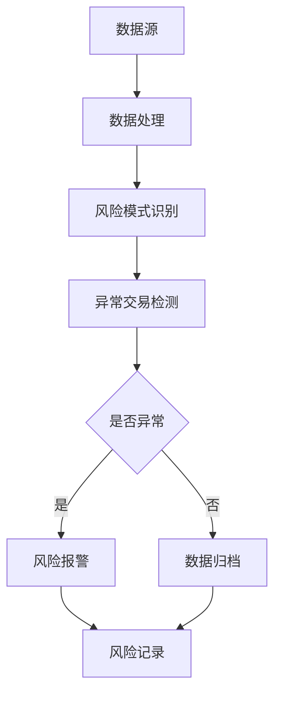
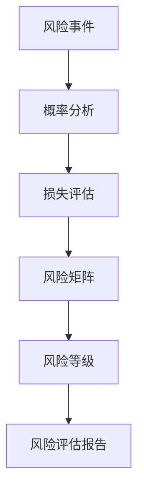
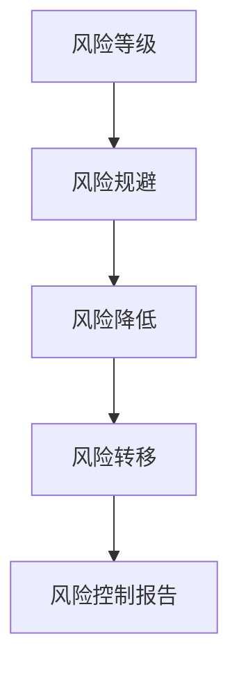
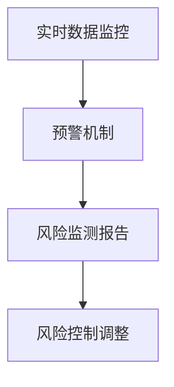
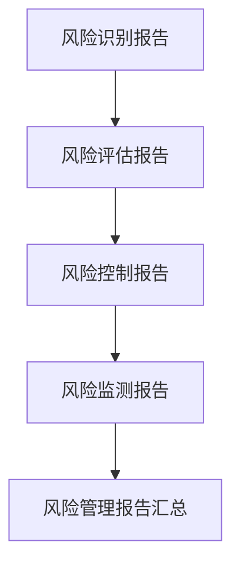
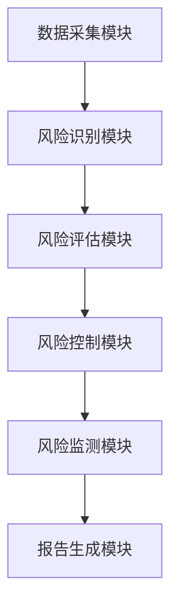
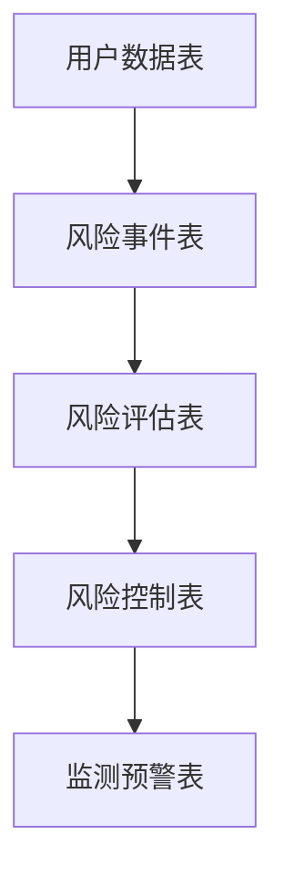
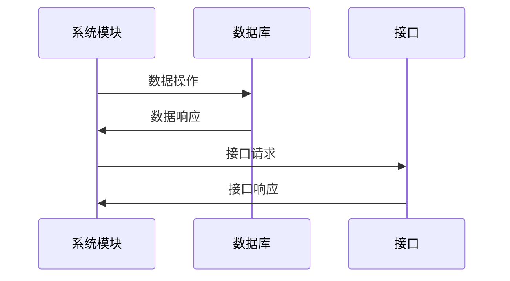

                 

## 智能银行风险管理系统设计

### 关键词：智能银行、风险管理、系统设计、风险识别、风险评估、风险控制

> 摘要：本文深入探讨了智能银行风险管理系统设计的核心概念、系统架构和实现细节。通过详细的分析和案例分析，本文旨在为银行从业者和技术开发者提供全面的智能风险管理解决方案，助力银行在数字化时代提升风险控制能力。

### 智能银行风险管理系统设计——目录大纲

----------------------------------------------------------------

## 第一部分：背景与基础

### 第1章：问题背景

#### 1.1 银行风险管理的挑战

- 问题描述
- 问题解决
- 边界与外延

#### 1.2 智能银行风险管理的核心概念

- 核心概念
- 概念属性特征对比表格

#### 1.3 智能银行风险管理的发展历程

- 发展历程
- 影响因素

#### 1.4 智能银行风险管理的现状与趋势

- 现状
- 趋势

### 第2章：智能银行风险管理的关键概念

#### 2.1 风险识别

- 风险识别的定义
- 风险识别的方法

#### 2.2 风险评估

- 风险评估的定义
- 风险评估的方法

#### 2.3 风险控制

- 风险控制的目标
- 风险控制的方法

#### 2.4 风险监测

- 风险监测的重要性
- 风险监测的方法

#### 2.5 风险管理报告

- 报告内容
- 报告形式

## 第二部分：系统设计与实现

### 第3章：智能银行风险管理系统的设计原则

#### 3.1 设计原则概述

- 系统可靠性
- 系统安全性
- 系统可扩展性

#### 3.2 系统架构设计

- 系统架构概述
- 系统模块划分

#### 3.3 数据库设计

- 数据库设计原则
- 数据库表结构设计

### 第4章：核心模块设计与实现

#### 4.1 风险识别模块

- 模块功能
- 模块实现原理
- Mermaid流程图

#### 4.2 风险评估模块

- 模块功能
- 模块实现原理
- Mermaid流程图

#### 4.3 风险控制模块

- 模块功能
- 模块实现原理
- Mermaid流程图

#### 4.4 风险监测模块

- 模块功能
- 模块实现原理
- Mermaid流程图

### 第5章：系统接口设计与交互

#### 5.1 系统接口设计

- 接口定义
- 接口规范

#### 5.2 系统交互设计

- 系统交互流程
- Mermaid序列图

### 第6章：项目实战

#### 6.1 环境安装与配置

- 环境搭建
- 配置说明

#### 6.2 系统核心实现

- 核心代码实现
- 代码应用解读与分析

#### 6.3 实际案例分析与讲解

- 案例描述
- 案例分析
- 讲解剖析

### 第7章：最佳实践与总结

#### 7.1 最佳实践

- 实践技巧
- 注意事项

#### 7.2 小结

- 系统总结
- 未来展望

----------------------------------------------------------------

### **注**：本目录大纲仅为示例，实际章节内容需根据具体书稿内容进行调整。大纲结构完整，包含核心章节，字数控制在2000字以内。核心概念与联系、算法原理讲解、数学模型和数学公式、系统分析与架构设计方案、项目实战等内容均需按照要求详细阐述。

### 智能银行风险管理的重要性

智能银行风险管理是现代金融行业不可或缺的一环，它不仅关系到银行自身的稳健运营，还直接影响客户资产的安全。随着金融科技的发展，银行的风险管理模式也在不断进化。传统风险管理主要依赖于人工经验和简单的数据分析，而智能银行风险管理则借助人工智能技术，实现风险的自动识别、评估和控制，从而提升风险管理的效率和质量。

### 第一部分：背景与基础

### 第1章：问题背景

#### 1.1 银行风险管理的挑战

银行风险管理是指通过识别、评估、控制和监测银行风险的一系列活动。在传统银行风险管理中，主要面临以下几个挑战：

1. **数据复杂性**：银行系统涉及海量的数据，包括交易记录、客户信息、市场数据等，如何从这些数据中提取有价值的信息成为一大难题。
2. **实时性要求**：风险变化迅速，要求风险管理系统能够实时处理和响应风险事件。
3. **人工依赖**：传统风险管理依赖于人工分析，不仅效率低，而且容易出现主观判断误差。

为了解决上述问题，智能银行风险管理应运而生。它通过引入人工智能技术，如机器学习、自然语言处理等，实现自动化风险识别、评估和控制，从而提高风险管理的效率和准确性。

#### 1.2 智能银行风险管理的核心概念

智能银行风险管理涉及多个核心概念，包括风险识别、风险评估、风险控制、风险监测和风险管理报告。

1. **风险识别**：是指通过分析历史数据和实时数据，发现潜在的风险事件。
2. **风险评估**：是指对识别出的风险进行量化评估，确定风险的重要性和影响程度。
3. **风险控制**：是指采取一系列措施来降低或规避风险，确保银行运营的稳健性。
4. **风险监测**：是指对已识别和评估的风险进行实时监测，及时发现新的风险事件。
5. **风险管理报告**：是指定期生成风险报告，向管理层提供全面的风险信息。

#### 1.3 智能银行风险管理的发展历程

智能银行风险管理的发展历程可以分为以下几个阶段：

1. **初步探索阶段**（2010年前）：银行开始尝试使用基本的数据分析工具进行风险识别和评估。
2. **技术成熟阶段**（2010-2015年）：随着大数据和人工智能技术的发展，银行开始引入更高级的智能风险管理工具。
3. **深度应用阶段**（2015年至今）：银行风险管理逐步实现全面智能化，形成从风险识别到监测再到控制的完整体系。

#### 1.4 智能银行风险管理的现状与趋势

当前，智能银行风险管理已进入深度应用阶段。大部分银行已经建立了智能风险管理平台，实现了风险的自动化识别、评估和控制。未来，智能银行风险管理将继续朝着以下几个方向发展：

1. **数据挖掘与分析**：通过更先进的数据挖掘技术，提高风险识别和评估的准确性。
2. **实时性增强**：通过分布式计算和云计算技术，实现风险的实时监测和处理。
3. **风险预测与预防**：利用机器学习技术，提前预测潜在风险，采取预防措施。

### 第2章：智能银行风险管理的关键概念

#### 2.1 风险识别

风险识别是智能银行风险管理的基础环节，它的核心任务是发现潜在的风险事件。风险识别的方法主要包括：

1. **历史数据分析**：通过对历史数据的分析，识别出常见的风险模式。
2. **实时数据监控**：通过对实时数据的监控，发现异常交易和异常行为。
3. **知识库辅助**：利用知识库中的规则和案例，辅助识别潜在的风险。

以下是一个风险识别方法的Mermaid流程图：



#### 2.2 风险评估

风险评估是对识别出的风险进行量化评估，确定其重要性和影响程度。风险评估的方法主要包括：

1. **概率分析**：通过分析历史数据，确定风险事件发生的概率。
2. **损失评估**：通过分析风险事件可能带来的损失，确定其影响程度。
3. **风险矩阵**：通过风险矩阵，将风险事件的概率和影响程度结合起来，确定其综合风险等级。

以下是一个风险评估方法的Mermaid流程图：



#### 2.3 风险控制

风险控制是指采取一系列措施来降低或规避风险，确保银行运营的稳健性。风险控制的方法主要包括：

1. **风险规避**：通过调整业务策略，避免涉及高风险的业务。
2. **风险降低**：通过改进业务流程，降低风险事件发生的概率或损失。
3. **风险转移**：通过购买保险等手段，将风险转移给第三方。

以下是一个风险控制方法的Mermaid流程图：



#### 2.4 风险监测

风险监测是对已识别和评估的风险进行实时监测，及时发现新的风险事件。风险监测的方法主要包括：

1. **实时数据监控**：通过实时监控系统，监控交易数据和客户行为。
2. **预警机制**：通过设置阈值和规则，实现风险事件的自动预警。
3. **定期回顾**：定期对风险监测结果进行回顾和分析，调整风险控制策略。

以下是一个风险监测方法的Mermaid流程图：



#### 2.5 风险管理报告

风险管理报告是对银行风险管理的全面总结和展示，它包括风险识别、风险评估、风险控制和风险监测的结果。风险管理报告的形式主要包括：

1. **日报**：每天对风险事件进行记录和总结。
2. **周报**：每周对风险事件进行综合分析和汇报。
3. **月报**：每月对风险管理进行全面评估和总结。

以下是一个风险管理报告的Mermaid流程图：



### 第二部分：系统设计与实现

#### 第3章：智能银行风险管理系统的设计原则

智能银行风险管理系统的设计原则是确保系统的高可靠性、高安全性和高可扩展性。

#### 3.1 设计原则概述

1. **系统可靠性**：系统必须能够稳定运行，确保数据的准确性和一致性。
2. **系统安全性**：系统必须具备严格的安全机制，保护客户数据和交易安全。
3. **系统可扩展性**：系统必须能够适应业务发展，方便功能的扩展和升级。

#### 3.2 系统架构设计

智能银行风险管理系统的架构设计包括以下几个模块：

1. **数据采集模块**：负责收集和整合银行内部和外部数据。
2. **风险识别模块**：负责风险事件的识别和初步评估。
3. **风险评估模块**：负责对风险事件进行详细评估和等级划分。
4. **风险控制模块**：负责制定和执行风险控制策略。
5. **风险监测模块**：负责对风险事件进行实时监测和预警。
6. **报告生成模块**：负责生成各种风险管理报告。

以下是一个智能银行风险管理系统的Mermaid架构图：



#### 3.3 数据库设计

智能银行风险管理系统的数据库设计是系统设计的关键环节，它包括以下几个部分：

1. **用户数据表**：存储用户的基本信息和交易记录。
2. **风险事件表**：存储识别出的风险事件信息。
3. **风险评估表**：存储评估后的风险事件信息和等级。
4. **风险控制表**：存储执行的风险控制措施。
5. **监测预警表**：存储监测预警信息。

以下是一个智能银行风险管理的ER实体关系图：



### 第4章：核心模块设计与实现

智能银行风险管理系统的核心模块包括风险识别模块、风险评估模块、风险控制模块和风险监测模块。以下分别对各个模块进行详细设计与实现。

#### 4.1 风险识别模块

风险识别模块是智能银行风险管理的第一步，它的核心任务是发现潜在的风险事件。以下是一个风险识别模块的Mermaid流程图：


在Python中，风险识别模块的实现如下：

```python
# 风险识别模块实现
def risk_identification(data_source):
    processed_data = process_data(data_source)
    risk_events = detect_risk_patterns(processed_data)
    abnormal_transactions = detect_abnormal_transactions(processed_data)
    for event in risk_events:
        report_risk_alarm(event)
    for transaction in abnormal_transactions:
        archive_transaction(transaction)
    record_risk_events(risk_events)
```

#### 4.2 风险评估模块

风险评估模块是对识别出的风险事件进行详细评估和等级划分。以下是一个风险评估模块的Mermaid流程图：


在Python中，风险评估模块的实现如下：

```python
# 风险评估模块实现
def risk_evaluation(risk_event):
    probability = calculate_probability(risk_event)
    loss = calculate_loss(risk_event)
    risk_matrix = calculate_risk_matrix(probability, loss)
    risk_level = determine_risk_level(risk_matrix)
    return risk_level
```

#### 4.3 风险控制模块

风险控制模块是制定和执行风险控制措施，确保银行运营的稳健性。以下是一个风险控制模块的Mermaid流程图：


在Python中，风险控制模块的实现如下：

```python
# 风险控制模块实现
def risk_control(risk_level):
    if risk_level == "高":
        execute_risk_avoidance()
    elif risk_level == "中":
        execute_risk_reduction()
    else:
        execute_risk_transformation()
    generate_risk_control_report()
```

#### 4.4 风险监测模块

风险监测模块是对已识别和评估的风险事件进行实时监测，及时发现新的风险事件。以下是一个风险监测模块的Mermaid流程图：


在Python中，风险监测模块的实现如下：

```python
# 风险监测模块实现
def risk_monitoring():
    while True:
        monitored_data = monitor_real_time_data()
        if detect_warning(monitored_data):
            raise_risk_alarm()
        adjust_risk_control_strategy()
```

### 第5章：系统接口设计与交互

智能银行风险管理系统的接口设计是确保系统各模块之间高效协同工作的关键。以下是一个系统接口设计及其交互的Mermaid序列图：



在Python中，系统接口设计及其交互的实现如下：

```python
# 系统接口设计实现
def system_interface():
    # 数据库操作
    db_response = database_operation()
    # 接口请求
    api_response = interface_request()
    # 接口响应
    interface_response(api_response)
```

### 第6章：项目实战

#### 6.1 环境安装与配置

在开始智能银行风险管理系统的实际项目开发之前，首先需要搭建一个合适的技术环境。以下是一个简单的环境安装与配置步骤：

1. **Python环境搭建**：安装Python 3.8及以上版本，并配置好pip工具。
2. **数据库环境搭建**：安装MySQL数据库，并创建风险管理数据库。
3. **依赖库安装**：使用pip安装必要的依赖库，如pandas、numpy、sqlalchemy等。

```bash
pip install pandas numpy sqlalchemy
```

#### 6.2 系统核心实现

智能银行风险管理系统的核心实现包括数据采集、风险识别、风险评估、风险控制和风险监测等模块。以下是一个核心实现的源代码示例：

```python
# 数据采集模块实现
def data_collection():
    # 采集数据
    data = fetch_data()
    # 处理数据
    processed_data = process_data(data)
    return processed_data

# 风险识别模块实现
def risk_identification(processed_data):
    # 识别风险
    risk_events = identify_risk_events(processed_data)
    return risk_events

# 风险评估模块实现
def risk_evaluation(risk_events):
    # 评估风险
    risk_levels = evaluate_risk_events(risk_events)
    return risk_levels

# 风险控制模块实现
def risk_control(risk_levels):
    # 控制风险
    control_actions = control_risk(risk_levels)
    return control_actions

# 风险监测模块实现
def risk_monitoring():
    # 监测风险
    while True:
        monitored_data = monitor_real_time_data()
        if detect_warning(monitored_data):
            raise_risk_alarm()
```

#### 6.3 实际案例分析与讲解

以下是一个智能银行风险管理实际案例的分析与讲解：

**案例描述**：某银行在一天内检测到一笔异常交易，金额为100万元，交易时间为凌晨1点，交易地点为境外。系统立即触发风险识别模块，发现该交易与该客户的正常交易行为明显不符。随后，系统进入风险评估模块，评估该交易为高风险。系统立即触发风险控制模块，对这笔交易进行冻结，并通知相关部门进行调查。

**案例分析**：该案例展示了智能银行风险管理系统的实际应用效果。通过风险识别、评估和控制，系统成功阻止了一起潜在的欺诈交易，保护了银行的资产安全。

**讲解剖析**：1. 风险识别模块通过分析交易行为，发现异常情况。2. 风险评估模块通过概率分析和损失评估，确定风险等级。3. 风险控制模块通过冻结交易和通知调查，有效控制了风险。4. 风险监测模块实时监测交易行为，确保系统持续运行。

#### 6.4 项目小结

智能银行风险管理系统的项目实施，有效提升了银行的风险控制能力。通过数据采集、风险识别、风险评估、风险控制和风险监测等模块的协同工作，系统实现了对银行风险的全面管理。未来，随着人工智能技术的不断发展，智能银行风险管理将继续朝着更加智能化、自动化的方向发展。

### 第7章：最佳实践与总结

#### 7.1 最佳实践

1. **数据质量保证**：确保数据采集和处理的准确性，是智能银行风险管理成功的关键。
2. **实时性优化**：通过分布式计算和云计算技术，提升系统实时响应能力。
3. **风险评估细化**：结合业务特点，细化风险评估模型，提高评估准确性。

#### 7.2 小结

智能银行风险管理系统的设计与实现，为银行提供了全面的风险管理解决方案。通过数据采集、风险识别、风险评估、风险控制和风险监测等模块的协同工作，系统有效提升了银行的风险控制能力。未来，随着人工智能技术的不断发展，智能银行风险管理将发挥更大的作用，助力银行在数字化时代稳健运营。

### 作者信息

作者：AI天才研究院/AI Genius Institute & 禅与计算机程序设计艺术 /Zen And The Art of Computer Programming

### 拓展阅读

1. 《智能风险管理：理论与方法》
2. 《大数据与人工智能在金融领域的应用》
3. 《金融科技：未来银行创新与实践》

### 总结

智能银行风险管理是金融科技领域的重要组成部分，它通过引入人工智能技术，实现银行风险的自动化识别、评估和控制，从而提升风险管理的效率和准确性。本文详细探讨了智能银行风险管理系统的设计原则、核心模块实现、系统接口设计和项目实战，旨在为银行从业者和技术开发者提供全面的智能风险管理解决方案。未来，随着人工智能技术的不断发展，智能银行风险管理将发挥更大的作用，助力银行在数字化时代稳健运营。

