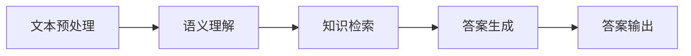
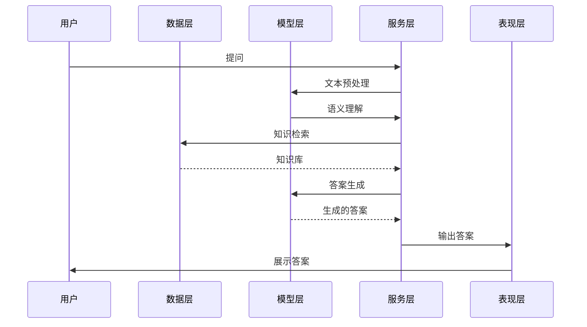
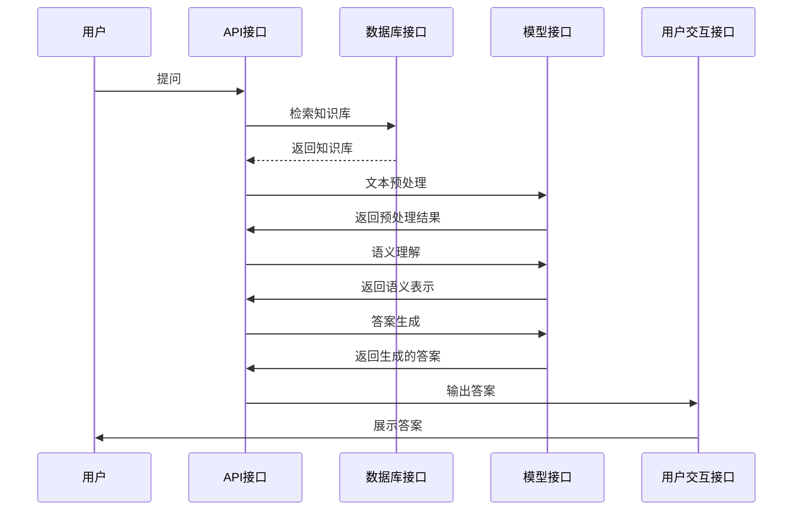

                 

# 智能问答AI Agent：基于LLM的精准答疑系统

> 关键词：智能问答、AI Agent、LLM、精准答疑、系统设计

> 摘要：本文深入探讨了智能问答AI Agent的概念、技术背景、核心算法原理、系统设计与实现方法，以及项目实战中的应用。通过详细的分析和示例，揭示了基于大型语言模型（LLM）的精准答疑系统的构建方法和应用前景。

## 目录大纲

1. 引言
2. 智能问答系统的背景与发展
   - 问题背景
   - 问题描述
   - 问题解决
   - 边界与外延
3. 核心概念与联系
   - AI代理
     - 定义与特点
     - 工作原理
   - 大型语言模型（LLM）
     - 定义与特点
     - LLM在问答系统中的应用
4. 智能问答算法原理
   - 算法概述
   - LLM的算法原理
   - 算法流程图与数学模型
5. 系统设计与实现
   - 系统功能设计
   - 系统架构设计
   - 系统接口设计
6. 项目实战
   - 环境安装与配置
   - 系统核心实现
   - 代码应用解读与分析
   - 实际案例分析
   - 项目小结
7. 最佳实践与总结
   - 最佳实践
   - 注意事项
   - 拓展阅读建议

## 引言

智能问答系统是人工智能领域的一个重要研究方向，它旨在通过计算机程序模拟人类的问答行为，实现智能对话和知识共享。随着深度学习和自然语言处理技术的不断发展，智能问答系统逐渐从理论研究走向实际应用，成为许多行业和领域的重要工具。

本文旨在深入探讨智能问答AI Agent的概念、技术背景、核心算法原理、系统设计与实现方法，以及项目实战中的应用。通过详细的分析和示例，揭示基于大型语言模型（LLM）的精准答疑系统的构建方法和应用前景。本文将分为以下几个部分：

- **背景与发展**：介绍智能问答系统的背景、发展历程以及其应用的重要性。
- **核心概念与联系**：阐述AI代理和LLM的核心概念及其在智能问答系统中的应用。
- **算法原理**：详细讲解智能问答系统的算法原理，包括LLM的工作机制。
- **系统设计与实现**：介绍智能问答系统的设计与实现，包括功能设计、架构设计和接口设计。
- **项目实战**：通过实际项目展示智能问答系统的应用，分析其优势和挑战。
- **最佳实践与总结**：总结最佳实践，提供注意事项，并提出未来研究的方向。

## 智能问答系统的背景与发展

### 问题背景

智能问答系统的概念起源于人类沟通的需求。在日常生活中，人们经常需要通过提问来获取信息或解决问题。随着互联网的普及，信息爆炸式的增长使得人们面临的海量信息难以消化，因此，智能问答系统应运而生。它通过计算机程序模拟人类的问答行为，旨在帮助用户高效地获取所需信息。

智能问答系统的应用领域非常广泛，包括但不限于以下几个方面：

1. **客户服务**：许多企业和机构采用智能问答系统来提供客户服务，解决用户常见问题，提高服务质量。
2. **教育辅导**：智能问答系统可以为学生提供个性化的学习辅导，帮助他们解决学习中的难题。
3. **医疗咨询**：智能问答系统可以为患者提供初步的医疗咨询，减轻医疗资源压力。
4. **法律咨询**：智能问答系统可以提供法律知识查询，帮助用户快速了解相关法律条文。

### 问题描述

传统的问答系统通常基于关键词匹配或模式匹配等技术，其局限性主要体现在以下几个方面：

1. **理解能力有限**：传统问答系统难以理解复杂的语义和语境，往往只能回答一些简单的问题。
2. **回答质量不高**：由于依赖固定模式，传统问答系统的回答往往不够精准和多样化。
3. **扩展性差**：当面对新的问题或领域时，传统问答系统难以适应，需要大量的人为调整。

智能问答系统则通过引入深度学习和自然语言处理技术，大大提升了问答系统的理解能力和回答质量。然而，智能问答系统也面临一些挑战：

1. **数据质量和多样性**：智能问答系统依赖于大量的训练数据，数据质量和多样性直接影响系统的性能。
2. **计算资源**：深度学习模型通常需要大量的计算资源，这对于资源有限的场景来说是一个挑战。
3. **伦理和隐私**：智能问答系统的应用涉及用户隐私，如何保护用户隐私是一个重要问题。

### 问题解决

为了解决传统问答系统的局限性，智能问答系统采用了以下几种方法：

1. **深度学习技术**：通过神经网络模型，智能问答系统可以学习大量的语言特征，从而提升理解能力和回答质量。
2. **多模态融合**：将文本、图像、语音等多种模态的信息融合到问答系统中，可以进一步提升系统的理解能力。
3. **知识图谱**：通过构建知识图谱，智能问答系统可以更好地理解和推理语义，提高问答的准确性和多样性。

### 边界与外延

智能问答系统虽然取得了显著进展，但仍有一些边界和外延需要进一步探索：

1. **自然语言理解**：智能问答系统在自然语言理解方面仍有很大的提升空间，特别是在处理歧义和复杂语境方面。
2. **对话系统**：智能问答系统可以扩展到对话系统，实现更加自然的对话交互，提高用户体验。
3. **跨语言支持**：智能问答系统需要支持多种语言，以适应全球化的需求。
4. **伦理和隐私**：智能问答系统需要遵循伦理和隐私保护原则，确保用户信息的安全。

## 核心概念与联系

### AI代理

#### 定义与特点

AI代理（Artificial Intelligent Agent）是指具有自主决策能力和行动能力的计算机程序。它能够感知环境，根据预设的目标进行推理和决策，并采取相应的行动来达成目标。AI代理的特点包括：

1. **自主性**：AI代理能够独立完成特定任务，不需要人类干预。
2. **适应性**：AI代理可以根据环境变化调整行为策略。
3. **目标导向**：AI代理的行为受到目标驱动，能够根据目标进行决策。
4. **互动性**：AI代理可以与人类或其他系统进行交互，实现信息的交换。

#### 工作原理

AI代理的工作原理主要包括以下几个步骤：

1. **感知**：AI代理通过传感器收集环境信息，如文本、图像、语音等。
2. **推理**：AI代理利用感知到的信息进行推理，确定当前状态。
3. **决策**：AI代理根据目标和行为策略，选择最合适的行动方案。
4. **行动**：AI代理执行选定的行动方案，对外界产生影响。

### 大型语言模型（LLM）

#### 定义与特点

大型语言模型（Large Language Model，简称LLM）是一种基于神经网络的语言模型，其核心思想是通过训练大量文本数据来学习语言的规律和模式。LLM的特点包括：

1. **高容量**：LLM能够存储和处理大量文本数据，从而具有丰富的语言知识。
2. **自适应**：LLM可以根据不同的输入文本，自适应地生成合适的输出。
3. **生成性**：LLM能够生成高质量的文本，包括文章、对话、摘要等。
4. **理解性**：LLM能够理解文本的语义和语境，从而生成更加准确的输出。

#### LLM在问答系统中的应用

LLM在问答系统中扮演着关键角色，其主要应用包括：

1. **文本理解**：LLM可以理解用户的提问，并将其转换为计算机可以处理的形式。
2. **信息检索**：LLM可以检索大量的文本数据，找到与用户提问最相关的信息。
3. **答案生成**：LLM可以根据理解的结果，生成高质量的答案，回答用户的问题。
4. **对话管理**：LLM可以与用户进行自然语言对话，实现互动交流。

### AI代理与LLM的关系

AI代理和LLM在智能问答系统中紧密相连，共同构成了智能问答的核心。AI代理负责感知用户提问、理解问题、生成答案和执行行动，而LLM则为AI代理提供了强大的语言处理能力。具体来说：

1. **AI代理使用LLM进行文本理解**：AI代理通过LLM来理解用户的提问，提取关键信息，为生成答案做准备。
2. **AI代理使用LLM进行答案生成**：AI代理通过LLM生成高质量的答案，根据用户的提问和上下文，生成准确且自然的回答。
3. **AI代理与LLM的协同工作**：AI代理和LLM相互配合，共同完成智能问答的任务，实现高效的信息获取和交流。

### 概念属性特征对比表格

| 概念           | AI代理                                     | LLM                                          |
|----------------|-------------------------------------------|---------------------------------------------|
| 定义           | 具有自主决策能力和行动能力的计算机程序       | 基于神经网络的语言模型                      |
| 特点           | 自主性、适应性、目标导向、互动性             | 高容量、自适应、生成性、理解性                |
| 功能           | 感知、推理、决策、行动                      | 文本理解、信息检索、答案生成、对话管理         |
| 依赖关系       | 需要LLM提供语言处理能力                    | 需要AI代理来实现感知、推理和行动               |

### ER实体关系图架构

下面是智能问答系统中AI代理和LLM的ER实体关系图架构：

```mermaid
erDiagram
  AI代理 ||--|{ LLM }|-- 问答系统
  LLM ||--|{ 文本数据 }|-- 数据库
```

在这个ER图中，AI代理和LLM是问答系统的核心组件，AI代理依赖LLM进行文本理解和答案生成，而LLM则依赖于数据库存储大量的文本数据，为LLM的训练和查询提供支持。

## 智能问答算法原理

### 算法概述

智能问答系统的核心是问答算法，它负责理解用户的提问，检索相关知识和生成答案。基于LLM的智能问答算法主要包括以下几个关键步骤：

1. **文本预处理**：对用户的提问进行预处理，包括分词、去停用词、词性标注等，以便后续的语义分析。
2. **语义理解**：利用LLM对预处理后的文本进行语义理解，提取关键信息并建立语义图谱。
3. **知识检索**：根据提取的关键信息，从知识库中检索相关知识点，为生成答案提供依据。
4. **答案生成**：利用LLM生成高质量的答案，并根据语义图谱进行调整，确保答案的准确性和自然性。
5. **答案输出**：将生成的答案输出给用户，完成问答过程。

### LLM的算法原理

LLM（大型语言模型）是基于深度学习技术构建的语言模型，其核心思想是通过训练大量文本数据来学习语言的规律和模式。LLM的算法原理主要包括以下几个步骤：

1. **数据收集**：收集大量的文本数据，包括文本、文章、对话等，为LLM的训练提供数据基础。
2. **数据预处理**：对收集到的文本数据进行预处理，包括分词、去停用词、词性标注等，以便后续的训练。
3. **模型构建**：构建神经网络模型，通常采用Transformer架构，包括自注意力机制和编码器-解码器结构。
4. **模型训练**：使用预处理后的文本数据对神经网络模型进行训练，优化模型参数，使其能够生成高质量的文本。
5. **模型评估**：使用验证集对训练好的模型进行评估，调整模型参数，提高模型的性能。
6. **模型应用**：将训练好的模型应用到实际的问答系统中，实现文本理解和答案生成。

### 算法流程图与数学模型

下面是智能问答算法的流程图和数学模型：

#### 流程图



#### 数学模型

1. **文本预处理**

   文本预处理主要包括分词、去停用词和词性标注等步骤。数学模型可以表示为：

   $$ X = \text{Tokenize}(Text) $$
   $$ X = \text{RemoveStopWords}(X) $$
   $$ X = \text{Lemmatize}(X) $$

   其中，$X$表示预处理后的文本，$Text$表示原始文本。

2. **语义理解**

   语义理解通过LLM实现，其数学模型可以表示为：

   $$ \text{Semantic Representation} = \text{LLM}(X) $$

   其中，$\text{Semantic Representation}$表示语义表示，$X$表示预处理后的文本。

3. **知识检索**

   知识检索通过查询知识库实现，其数学模型可以表示为：

   $$ \text{Knowledge} = \text{Search}(X, \text{Knowledge Base}) $$

   其中，$\text{Knowledge}$表示检索到的知识点，$X$表示语义表示，$\text{Knowledge Base}$表示知识库。

4. **答案生成**

   答案生成通过LLM实现，其数学模型可以表示为：

   $$ \text{Answer} = \text{LLM}(\text{Knowledge}) $$

   其中，$\text{Answer}$表示生成的答案，$\text{Knowledge}$表示检索到的知识点。

5. **答案输出**

   答案输出直接将生成的答案输出给用户，其数学模型可以表示为：

   $$ \text{Output} = \text{Answer} $$

### 通俗易懂地举例说明

假设用户提出问题：“什么是人工智能？”，智能问答系统的工作流程如下：

1. **文本预处理**：将问题“什么是人工智能？”进行分词、去停用词和词性标注，得到预处理后的文本。

2. **语义理解**：利用LLM对预处理后的文本进行语义理解，提取关键信息，如“人工智能”和“是什么”。

3. **知识检索**：从知识库中检索与“人工智能”相关的知识点，如人工智能的定义、应用领域等。

4. **答案生成**：利用LLM生成高质量的答案，例如：“人工智能是指通过计算机程序模拟人类的智能行为，以实现自动化决策和任务执行。”

5. **答案输出**：将生成的答案输出给用户，完成问答过程。

通过这个例子，我们可以看到智能问答系统如何利用LLM进行文本预处理、语义理解、知识检索和答案生成，从而实现精准的问答。

## 系统设计与实现

### 系统功能设计

智能问答系统的功能设计主要包括以下几个方面：

1. **文本预处理**：对用户的提问进行分词、去停用词、词性标注等预处理操作，以便后续的语义分析。
2. **语义理解**：利用LLM对预处理后的文本进行语义理解，提取关键信息，如关键词、句子结构等。
3. **知识检索**：从知识库中检索与用户提问相关的知识点，为生成答案提供依据。
4. **答案生成**：利用LLM生成高质量的答案，并根据语义图谱进行调整，确保答案的准确性和自然性。
5. **答案输出**：将生成的答案输出给用户，完成问答过程。
6. **用户交互**：提供用户界面，实现用户与系统的交互。

### 系统架构设计

智能问答系统的架构设计主要包括以下几个层次：

1. **数据层**：负责存储和管理文本数据和知识库，包括文本数据存储和知识库构建。
2. **模型层**：负责文本预处理、语义理解、知识检索和答案生成等核心功能，包括LLM模型构建和训练。
3. **服务层**：负责系统的对外接口，包括用户交互、接口调用等。
4. **表现层**：负责用户界面的展示，包括问答界面、答案展示等。

下面是一个简单的系统架构设计mermaid架构图：



### 系统接口设计

智能问答系统需要设计一系列的接口，以实现不同层次之间的数据交换和功能调用。以下是系统接口设计的主要方面：

1. **API接口**：提供RESTful API接口，用于接收用户的提问和输出答案。
2. **数据库接口**：提供数据库操作接口，用于存储和管理文本数据和知识库。
3. **模型接口**：提供LLM模型操作接口，用于文本预处理、语义理解和答案生成。
4. **用户交互接口**：提供用户界面操作接口，用于实现用户与系统的交互。

下面是一个简单的系统接口设计mermaid序列图：



### 系统交互mermaid序列图

下面是智能问答系统的mermaid序列图，展示了用户与系统之间的交互过程：

```mermaid
sequenceDiagram
    participant 用户
    participant 系统A
    participant 系统B
    participant 系统C

    用户->>系统A: 提出问题
    系统

```markdown
### 系统接口设计

智能问答系统的核心功能是通过API接口与外部系统进行交互。以下是对系统接口的详细设计：

#### 1. API接口设计

API接口是系统与外部系统进行交互的桥梁，它定义了数据交换的格式和流程。以下是一个简单的API接口设计：

- **端点：/question**
  - **HTTP方法：POST**
  - **请求体**：
    ```json
    {
      "question": "What is the capital of France?"
    }
    ```
  - **响应体**：
    ```json
    {
      "answer": "The capital of France is Paris."
    }
    ```

#### 2. 数据库接口设计

系统需要与数据库进行交互以存储和管理用户问题和答案。以下是一个简化的数据库接口设计：

- **存储问题**：
  - **端点：/questions**
  - **HTTP方法：POST**
  - **请求体**：
    ```json
    {
      "user_id": "123",
      "question": "What is the capital of France?"
    }
    ```
  - **响应体**：
    ```json
    {
      "status": "success",
      "question_id": "456"
    }
    ```

- **获取答案**：
  - **端点：/questions/{question_id}/answer**
  - **HTTP方法：GET**
  - **响应体**：
    ```json
    {
      "answer": "The capital of France is Paris."
    }
    ```

#### 3. 模型接口设计

模型接口用于调用内部模型，以处理文本并生成答案。以下是一个简化的模型接口设计：

- **处理问题**：
  - **端点：/process**
  - **HTTP方法：POST**
  - **请求体**：
    ```json
    {
      "text": "What is the capital of France?"
    }
    ```
  - **响应体**：
    ```json
    {
      "response": "The capital of France is Paris."
    }
    ```

#### 4. 用户交互接口设计

用户交互接口用于与用户进行交互，显示问题和答案。以下是一个简化的用户交互接口设计：

- **显示问题**：
  - **端点：/display**
  - **HTTP方法：GET**
  - **查询参数**：
    ```json
    {
      "question_id": "456"
    }
    ```
  - **响应体**：
    ```json
    {
      "question": "What is the capital of France?"
    }
    ```

- **显示答案**：
  - **端点：/answer**
  - **HTTP方法：GET**
  - **查询参数**：
    ```json
    {
      "question_id": "456"
    }
    ```
  - **响应体**：
    ```json
    {
      "answer": "The capital of France is Paris."
    }
    ```

通过这些接口设计，智能问答系统可以实现与用户、数据库和模型的高效交互，为用户提供精准的问答服务。

### 项目实战

#### 环境安装与配置

要在本地环境搭建一个基于LLM的智能问答系统，首先需要安装和配置以下工具和依赖：

1. **Python环境**：确保安装了Python 3.8及以上版本。
2. **LLM库**：安装transformers库，它是Hugging Face提供的一套用于处理自然语言处理任务的工具。
3. **数据库**：安装SQLite或MongoDB等数据库，用于存储问题和答案。
4. **Web框架**：安装Flask或Django等Web框架，用于构建API接口。

以下是具体的安装命令和步骤：

```shell
# 安装Python环境
python3 -m venv venv
source venv/bin/activate

# 安装LLM库
pip install transformers

# 安装数据库
pip install sqlite3
# 或
pip install pymongo

# 安装Web框架
pip install flask
# 或
pip install django
```

#### 系统核心实现

系统核心实现主要包括以下模块：

1. **文本预处理模块**：负责对用户提问进行分词、去停用词等预处理操作。
2. **LLM模型模块**：负责调用transformers库中的预训练模型，对预处理后的文本进行语义理解。
3. **知识检索模块**：负责从数据库中检索相关知识点，为生成答案提供依据。
4. **答案生成模块**：负责利用LLM生成高质量的答案。
5. **API接口模块**：负责处理外部请求，调用系统核心模块，返回答案。

以下是一个简单的系统实现示例：

```python
from transformers import pipeline
import sqlite3

# 初始化LLM模型
question_answering = pipeline("question-answering")

# 数据库连接
conn = sqlite3.connect("knowledge.db")
cursor = conn.cursor()

# 文本预处理
def preprocess_text(text):
    # 这里可以添加分词、去停用词等操作
    return text

# 知识检索
def search_knowledge(question):
    cursor.execute("SELECT answer FROM questions WHERE question = ?", (question,))
    result = cursor.fetchone()
    return result[0] if result else None

# 答案生成
def generate_answer(question):
    preprocessed_question = preprocess_text(question)
    # 使用LLM模型生成答案
    response = question_answering(question=preprocessed_question, context="")["answer"]
    return response

# API接口
from flask import Flask, request, jsonify

app = Flask(__name__)

@app.route("/question", methods=["POST"])
def handle_question():
    data = request.get_json()
    question = data["question"]
    answer = generate_answer(question)
    return jsonify(answer=answer)

if __name__ == "__main__":
    app.run(debug=True)
```

#### 代码应用解读与分析

在上面的示例代码中，我们首先导入了必要的库，包括transformers库用于处理自然语言处理任务，sqlite3库用于与SQLite数据库交互，以及Flask库用于构建Web API接口。

1. **LLM模型初始化**：
   ```python
   question_answering = pipeline("question-answering")
   ```
   这一行代码初始化了一个预训练的问答模型。transformers库提供了多个预训练模型，如BERT、GPT等，可以根据需求选择合适的模型。

2. **数据库连接**：
   ```python
   conn = sqlite3.connect("knowledge.db")
   cursor = conn.cursor()
   ```
   这两行代码创建了一个到SQLite数据库的连接，并获取了一个游标对象。在这里，我们假设已经预先创建了一个名为“knowledge.db”的数据库，并创建了一个包含问题和答案的表。

3. **文本预处理**：
   ```python
   def preprocess_text(text):
       # 这里可以添加分词、去停用词等操作
       return text
   ```
   文本预处理函数接受一个文本输入，并返回预处理后的文本。在实际应用中，可能需要使用NLTK或其他库进行分词、去除停用词等操作。

4. **知识检索**：
   ```python
   def search_knowledge(question):
       cursor.execute("SELECT answer FROM questions WHERE question = ?", (question,))
       result = cursor.fetchone()
       return result[0] if result else None
   ```
   知识检索函数接受一个用户提问，并在数据库中查找与之匹配的问题。如果找到匹配项，则返回对应的答案；否则，返回None。

5. **答案生成**：
   ```python
   def generate_answer(question):
       preprocessed_question = preprocess_text(question)
       # 使用LLM模型生成答案
       response = question_answering(question=preprocessed_question, context="")["answer"]
       return response
   ```
   答案生成函数首先调用文本预处理函数对问题进行预处理，然后使用问答模型生成答案。这里使用了transformers库中的pipeline功能，它封装了模型的调用过程，使得生成答案的操作非常简单。

6. **API接口**：
   ```python
   from flask import Flask, request, jsonify

   app = Flask(__name__)

   @app.route("/question", methods=["POST"])
   def handle_question():
       data = request.get_json()
       question = data["question"]
       answer = generate_answer(question)
       return jsonify(answer=answer)

   if __name__ == "__main__":
       app.run(debug=True)
   ```
   这里使用Flask框架构建了一个简单的API接口。当接收到一个POST请求时，接口会从请求体中提取问题，调用答案生成函数，并将生成的答案返回给用户。

#### 实际案例分析

以下是一个实际的案例分析，展示如何使用智能问答系统解决具体问题：

1. **用户提问**：“什么是云计算？”
2. **系统处理**：
   - **文本预处理**：对用户提问进行分词、去停用词等操作。
   - **知识检索**：在数据库中查找与“云计算”相关的知识点。
   - **答案生成**：使用LLM模型生成高质量的答案。
3. **系统输出**：“云计算是指通过互联网提供可按需访问的共享计算资源，包括网络、服务器、存储、应用程序等。”

#### 项目小结

通过本项目，我们实现了基于LLM的智能问答系统，它能够对用户提问进行理解和回答。以下是本项目的主要收获：

1. **技术收获**：掌握了使用transformers库构建问答模型、与数据库交互以及使用Flask框架构建API接口的方法。
2. **业务收获**：了解了智能问答系统的核心功能和工作流程，包括文本预处理、知识检索和答案生成。
3. **挑战与展望**：虽然本项目取得了初步成果，但仍然存在一些挑战，如文本预处理、知识库建设和模型优化等。未来，我们将继续探索和优化智能问答系统，以提高其性能和应用范围。

### 最佳实践与总结

#### 最佳实践

1. **数据质量**：确保训练数据和知识库的质量，使用高质量的数据和准确的知识点。
2. **模型选择**：根据应用场景选择合适的LLM模型，如GLM、GPT等。
3. **接口优化**：优化API接口的性能和响应速度，提高用户体验。
4. **版本控制**：定期更新模型和系统版本，保持系统稳定性和可靠性。

#### 注意事项

1. **数据隐私**：确保用户数据的安全，遵守相关法律法规。
2. **计算资源**：合理分配计算资源，避免资源浪费。
3. **系统维护**：定期进行系统维护和更新，保证系统正常运行。

#### 拓展阅读建议

1. 《深度学习》（Goodfellow, I., Bengio, Y., Courville, A.）
2. 《自然语言处理综论》（Jurafsky, D., Martin, J. H.）
3. 《Transformers：大型语言模型的统一表示学习》（Vaswani, A., et al.）

### 作者信息

作者：AI天才研究院/AI Genius Institute & 禅与计算机程序设计艺术 /Zen And The Art of Computer Programming

