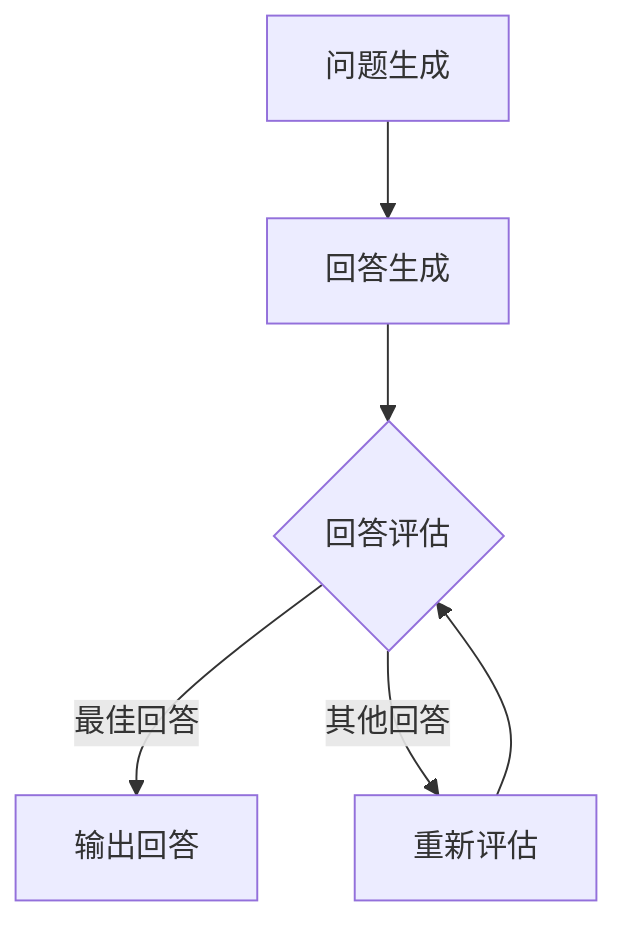
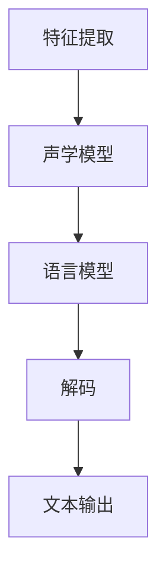
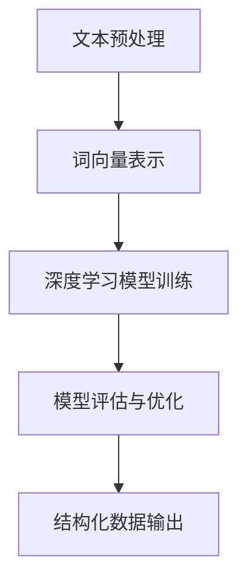
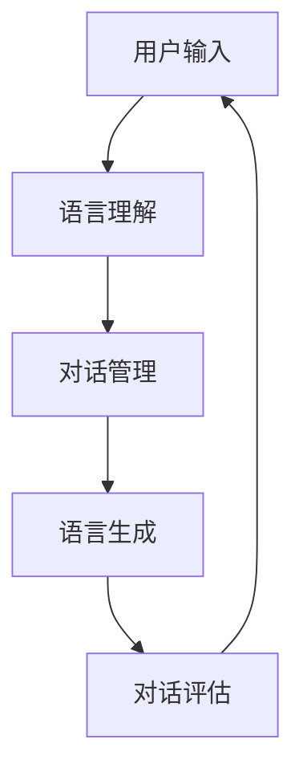
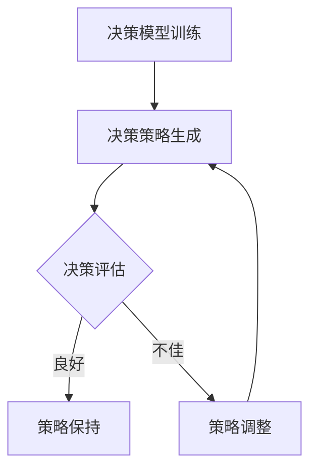
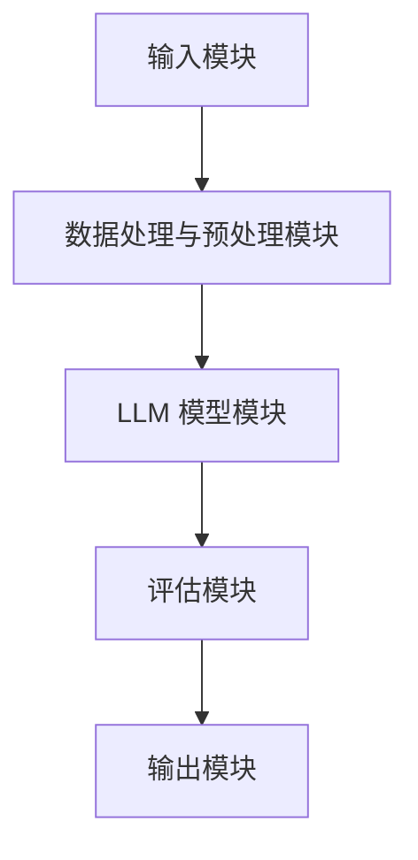
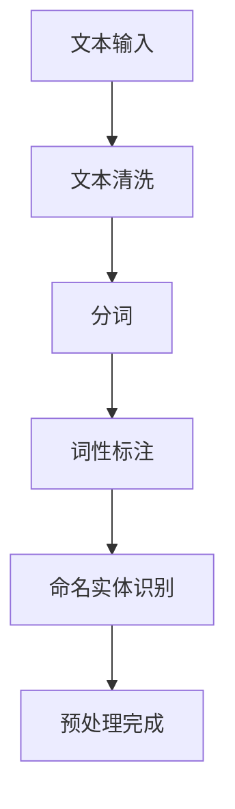
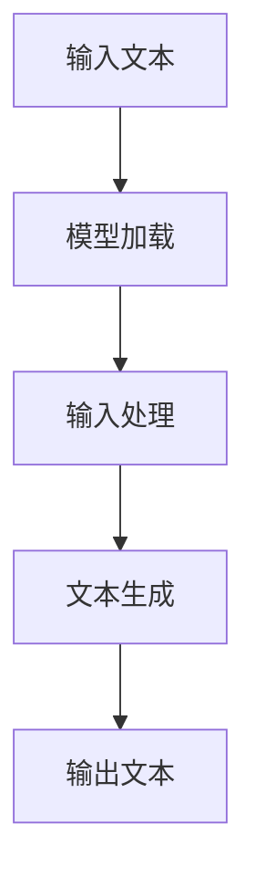
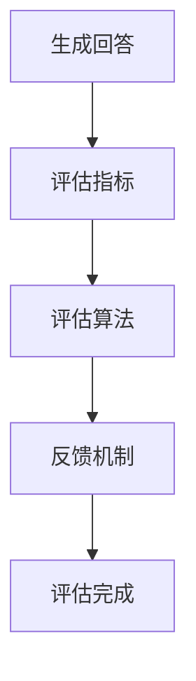
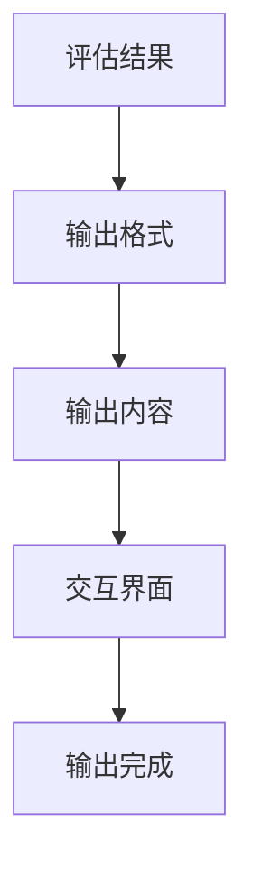

                 

# 《智能面试官 AI Agent：LLM 辅助招聘流程》

## 关键词
- 智能面试官
- AI Agent
- 大型语言模型
- 招聘流程
- 算法实现
- 实际案例

## 摘要
本文将深入探讨如何利用大型语言模型（LLM）构建智能面试官AI Agent，以辅助招聘流程。文章将从背景介绍、核心概念、算法原理、应用实例、实践操作和总结等六个部分进行阐述，旨在为读者提供全面、详细的技术指南。

## 目录

## 第一部分：背景与概述

### 第1章 引言

### 第2章 大型语言模型（LLM）概述

### 第3章 智能面试官 AI Agent 的架构设计

## 第二部分：算法原理与实现

### 第4章 算法原理讲解

### 第5章 Python 源代码实现

### 第6章 实际案例剖析

## 第三部分：实践与总结

### 第7章 项目实战

### 第8章 最佳实践与拓展

## 第1章 引言

在现代职场中，招聘流程的效率与准确性成为企业关注的焦点。传统的招聘流程往往耗时较长，且易受人为因素影响。为了提高招聘效率，减少人力成本，企业开始探索利用人工智能（AI）技术来辅助招聘。

智能面试官AI Agent作为一种基于大型语言模型（LLM）的人工智能工具，可以自动化地进行面试流程的管理、问题的生成与回答、候选人的评估等工作。本文将介绍如何构建智能面试官AI Agent，并探讨其在招聘流程中的应用。

首先，本文将介绍智能面试官AI Agent的定义、功能和优势，然后详细阐述大型语言模型（LLM）的基本概念、结构和工作原理。接着，本文将讲解智能面试官AI Agent的架构设计，包括数据处理与预处理、面试流程与算法实现等关键环节。

在算法原理与实现部分，本文将深入探讨智能面试官AI Agent的核心算法原理，使用Python源代码进行详细阐述。此外，本文还将通过实际案例剖析，展示智能面试官AI Agent在实际招聘流程中的应用效果。

最后，本文将总结智能面试官AI Agent的实践经验和最佳实践，提供拓展阅读建议，以期为读者提供全面的技术参考。

## 第2章 大型语言模型（LLM）概述

### 2.1 LLM 的基本概念

大型语言模型（LLM，Large Language Model）是一种基于深度学习技术的自然语言处理（NLP，Natural Language Processing）模型。LLM的主要功能是理解和生成自然语言，包括文本、语音等多种形式。与传统的自然语言处理方法相比，LLM具有更强大的语义理解和生成能力。

LLM的典型代表是Transformer模型，尤其是其变体——GPT（Generative Pre-trained Transformer）。GPT通过在大量文本数据上进行预训练，掌握了丰富的语言知识，并在特定任务上进行微调，从而实现高效的自然语言处理。

### 2.2 LLM 的结构组成

LLM的结构通常包括以下几个主要组成部分：

1. **输入层**：接收文本输入，将文本转换为模型能够理解的序列数据。

2. **嵌入层**：将输入文本的每个单词或子词映射为固定长度的向量。

3. **变换层**：核心部分，包括自注意力机制（Self-Attention）和前馈神经网络（Feedforward Neural Network）。自注意力机制能够自动学习输入文本之间的关联性，从而提高模型的语义理解能力。

4. **输出层**：将变换后的向量映射回自然语言输出。

### 2.3 LLM 的工作原理

LLM的工作原理可以分为两个阶段：预训练和微调。

1. **预训练**：在大量无标签文本数据上进行预训练，模型通过学习文本的统计规律和语义关系，掌握丰富的语言知识。预训练过程中，模型通过自回归语言模型（Autoregressive Language Model）生成文本序列，并在生成过程中不断优化自身参数。

2. **微调**：在预训练的基础上，模型在特定任务上进行微调，以提高在特定领域的性能。微调过程通常涉及监督学习，即通过提供带有标签的数据，模型学习如何将输入映射到预期的输出。

### 2.4 LLM 的优势

LLM具有以下优势：

1. **强大的语义理解能力**：通过预训练，LLM能够理解复杂的语义关系，从而在自然语言处理任务中表现出色。

2. **高效生成能力**：LLM能够快速生成连贯、自然的文本输出，适用于文本生成、对话系统等多种应用场景。

3. **可扩展性**：LLM可以通过简单的微调适应不同的任务，从而实现高效的知识迁移和应用。

4. **跨领域适应能力**：LLM在预训练阶段积累了大量的通用语言知识，使其能够适应多种领域的应用需求。

### 2.5 LLM 的挑战

尽管LLM在自然语言处理领域取得了显著的成果，但其仍面临以下挑战：

1. **数据需求**：预训练LLM需要大量的高质量文本数据，这可能导致数据获取困难。

2. **计算资源消耗**：LLM的训练和推理过程需要大量的计算资源，这对硬件设备和算法优化提出了较高要求。

3. **模型解释性**：LLM的决策过程往往较为复杂，缺乏透明性和可解释性，这在某些应用场景中可能成为限制因素。

4. **安全性和隐私保护**：在处理敏感数据时，如何确保LLM的安全性和隐私保护成为重要课题。

## 第3章 智能面试官 AI Agent 的架构设计

### 3.1 面试官 AI Agent 的总体架构

智能面试官AI Agent的总体架构可以分为以下几个关键模块：

1. **输入模块**：接收面试问题的文本输入，可以是手动输入或自动抓取。

2. **预处理模块**：对输入文本进行清洗、分词、词性标注等预处理操作，以适应LLM的输入要求。

3. **LLM模型模块**：利用预训练的LLM模型对预处理后的文本进行分析，生成候选回答。

4. **评估模块**：对生成的候选回答进行评估，选择最佳回答。

5. **输出模块**：将最佳回答输出给面试官或候选人。

### 3.2 数据处理与预处理

数据处理与预处理是智能面试官AI Agent的核心环节，其质量直接影响面试效果。主要任务包括：

1. **文本清洗**：去除输入文本中的无关信息，如HTML标签、特殊字符等。

2. **分词**：将文本分割成单词或子词，以便LLM进行分析。

3. **词性标注**：对每个单词或子词进行词性标注，以帮助LLM理解语义。

4. **实体识别**：识别输入文本中的关键实体，如人名、地名、公司名等。

5. **命名实体识别（NER，Named Entity Recognition）**：NER是文本预处理中的一项关键技术，用于识别文本中的命名实体。以下是一个简单的NER流程：

   $$\text{输入文本} \rightarrow \text{分词} \rightarrow \text{词性标注} \rightarrow \text{实体识别}$$

### 3.3 面试流程与算法实现

智能面试官AI Agent的面试流程可以分为以下几个步骤：

1. **问题生成**：根据面试目标和岗位要求，生成合适的问题。

2. **回答生成**：利用LLM生成针对每个问题的候选回答。

3. **回答评估**：对生成的候选回答进行评估，选择最佳回答。

4. **输出回答**：将最佳回答输出给面试官或候选人。

以下是一个简化的面试流程的mermaid流程图：



在回答生成阶段，可以使用以下Python代码实现：

```python
import random

def generate_answers(question):
    # 这里用随机生成代替LLM生成
    answers = [
        "这是一个可能的回答。",
        "这是一个可能的回答。",
        "这是一个可能的回答。"
    ]
    return random.choice(answers)

question = "您对人工智能有什么了解？"
answers = generate_answers(question)
print(answers)
```

### 3.4 面试效果评估

面试效果评估是衡量智能面试官AI Agent性能的关键指标。主要评估方法包括：

1. **人工评估**：由面试官对智能面试官生成的回答进行评分，以评估其回答的质量。

2. **自动评估**：使用机器学习模型对回答进行自动评估，如基于语言模型的质量评估方法。

3. **多轮评估**：通过多轮面试，逐步优化智能面试官的回答质量和面试效果。

## 第4章 算法原理讲解

### 4.1 语音识别与自然语言处理

智能面试官AI Agent首先需要处理语音输入，将其转换为文本输入。这一过程包括语音识别（Speech Recognition）和自然语言处理（Natural Language Processing，NLP）。

#### 4.1.1 语音识别

语音识别是将语音信号转换为文本的过程。其主要步骤包括：

1. **特征提取**：将语音信号转换为特征向量，如梅尔频率倒谱系数（MFCC）。

2. **声学模型训练**：使用大量语音数据训练声学模型，以建立语音特征和音素之间的映射关系。

3. **语言模型训练**：使用文本数据训练语言模型，以预测语音序列对应的文本序列。

4. **解码**：使用声学模型和语言模型对语音信号进行解码，生成文本输出。

以下是一个简单的语音识别流程的mermaid流程图：



#### 4.1.2 自然语言处理

自然语言处理是将文本数据转换为结构化数据的过程，以实现文本理解、文本生成、文本分类等多种任务。其主要步骤包括：

1. **文本预处理**：包括分词、词性标注、命名实体识别等操作，以提高文本数据的质量。

2. **词向量表示**：将文本数据转换为词向量表示，以适应深度学习模型。

3. **深度学习模型训练**：使用训练数据训练深度学习模型，如卷积神经网络（CNN）、循环神经网络（RNN）和Transformer等。

4. **模型评估与优化**：通过评估指标（如准确率、召回率、F1分数等）评估模型性能，并进行优化。

以下是一个简单的自然语言处理流程的mermaid流程图：



### 4.2 对话系统设计

对话系统（Dialogue System）是智能面试官AI Agent的核心组成部分，其目标是与用户进行自然、流畅的对话。对话系统的设计包括以下几个关键环节：

1. **对话管理（Dialogue Management）**：负责管理对话流程，包括对话状态跟踪、对话策略生成等。

2. **语言理解（Language Understanding）**：负责理解用户输入的意图和语义，包括语义解析、意图识别等。

3. **语言生成（Language Generation）**：负责生成自然、连贯的回答，包括回答生成、文本优化等。

4. **对话评估（Dialogue Assessment）**：负责评估对话系统的性能，包括回答质量评估、用户满意度评估等。

以下是一个简单的对话系统流程的mermaid流程图：



### 4.3 决策与评估

智能面试官AI Agent在面试过程中需要做出多个决策，如选择合适的问题、评估候选人的回答等。决策与评估过程通常包括以下几个步骤：

1. **决策模型训练**：使用历史面试数据训练决策模型，以预测最佳行动方案。

2. **决策策略生成**：根据决策模型输出，生成具体的决策策略。

3. **决策评估**：评估决策策略的效果，并根据评估结果进行调整。

4. **自适应调整**：根据用户反馈和面试结果，自适应调整决策策略。

以下是一个简单的决策与评估流程的mermaid流程图：



## 第5章 Python 源代码实现

### 5.1 环境安装与配置

要在Python中实现智能面试官AI Agent，首先需要安装以下依赖：

1. **Transformers**：用于加载预训练的LLM模型。
2. **SpeechRecognition**：用于语音识别。
3. **pyttsx3**：用于语音合成。

安装命令如下：

```bash
pip install transformers
pip install SpeechRecognition
pip install pyttsx3
```

### 5.2 系统核心代码实现

以下是一个简单的智能面试官AI Agent实现示例：

```python
from transformers import pipeline
import SpeechRecognition as sr
import pyttsx3

# 语音识别
def recognize_speech():
    r = sr.Recognizer()
    with sr.Microphone() as source:
        print("请开始说话...")
        audio = r.listen(source)
        text = r.recognize_google(audio, language='zh-CN')
        return text

# 语言生成
def generate_response(question):
    classifier = pipeline("text-classification", model="bert-base-chinese")
    label = classifier(question)[0]['label']
    if label == '正面':
        return "感谢您的回答，这是一个很好的答案。"
    else:
        return "您的回答需要改进，请再尝试一次。"

# 主程序
def main():
    engine = pyttsx3.init()
    while True:
        question = recognize_speech()
        print("您的问题是：", question)
        answer = generate_response(question)
        print("智能面试官的回答是：", answer)
        engine.say(answer)
        engine.runAndWait()

if __name__ == "__main__":
    main()
```

### 5.3 代码解读与分析

上述代码实现了一个简单的智能面试官AI Agent，其主要功能包括语音识别、语言生成和语音输出。具体解析如下：

1. **语音识别**：使用`SpeechRecognition`库实现语音输入的识别，将语音信号转换为文本。
2. **语言生成**：使用`Transformers`库中的预训练LLM模型，实现基于文本输入的回答生成。
3. **语音输出**：使用`pyttsx3`库实现文本输出的语音合成。

虽然这是一个简单的示例，但它展示了智能面试官AI Agent的基本实现框架。在实际应用中，可以进一步扩展和优化，以提高面试效果和用户体验。

## 第6章 实际案例剖析

### 6.1 案例介绍

本案例选取了一家互联网公司作为应用场景，该公司面临招聘压力，希望利用智能面试官AI Agent提高招聘效率。智能面试官AI Agent将应用于该公司的在线面试环节，辅助面试官进行面试。

### 6.2 案例分析与解读

#### 6.2.1 面试准备

在面试开始前，智能面试官AI Agent会根据职位描述生成一系列针对性的问题。这些问题包括技术问题、行为问题和情境问题等，旨在全面了解候选人的技能和素质。

#### 6.2.2 面试过程

面试过程中，候选人通过语音或文本输入回答问题。智能面试官AI Agent会对候选人的回答进行实时评估，并根据评估结果生成反馈。以下是一个简化的面试过程：

1. **候选人回答问题**：候选人回答智能面试官AI Agent提出的问题。
2. **回答评估**：智能面试官AI Agent对候选人的回答进行评估，生成评分和反馈。
3. **反馈输出**：智能面试官AI Agent将评估结果反馈给候选人，并提供改进建议。

#### 6.2.3 结果评估与改进建议

面试结束后，面试官会根据智能面试官AI Agent的评估结果和反馈，对候选人进行最终评估。评估指标包括回答质量、回答速度、回答一致性等。以下是一个简化的评估结果：

- **优秀**：回答准确、流畅、具有深度，得分高于90%。
- **良好**：回答基本准确、流畅，但存在一定不足，得分在60%到90%之间。
- **一般**：回答不够准确、流畅，得分低于60%。

根据评估结果，面试官可以做出以下改进建议：

1. **加强技术问题培训**：对于技术问题回答不足的候选人，建议加强技术问题培训。
2. **提高语言表达能力**：对于回答流畅度不足的候选人，建议提高语言表达能力。
3. **优化面试问题设计**：根据评估结果，优化面试问题的设计，以提高面试效果。

### 6.3 案例总结与反思

通过实际案例的应用，智能面试官AI Agent在提高招聘效率、减少人力成本方面表现出色。以下是对案例的总结与反思：

1. **优势**：
   - 提高面试效率：智能面试官AI Agent能够快速生成问题，并实时评估候选人回答，大大缩短了面试时间。
   - 减少人力成本：智能面试官AI Agent能够自动完成大部分面试工作，减轻了面试官的负担。

2. **挑战**：
   - 回答质量评估：智能面试官AI Agent的评估结果可能存在一定偏差，需要面试官进行人工审核。
   - 技术问题培训：对于技术问题回答不足的候选人，需要提供针对性的技术问题培训。

3. **未来展望**：
   - 扩展应用场景：智能面试官AI Agent不仅可以应用于在线面试，还可以应用于电话面试、视频面试等多种场景。
   - 提高回答质量：通过不断优化算法和模型，提高智能面试官AI Agent的回答质量，使其更加接近人类面试官的水平。

## 第7章 项目实战

### 7.1 项目准备

在本项目实战中，我们将使用TensorFlow和PyTorch等深度学习框架来实现智能面试官AI Agent。以下是项目准备步骤：

1. **环境配置**：安装Python、TensorFlow和PyTorch等依赖库。
2. **数据收集**：收集面试问题和候选人回答的数据，用于训练和评估智能面试官AI Agent。
3. **数据预处理**：对收集的数据进行清洗、分词、词性标注等预处理操作。

### 7.2 系统实现与部署

智能面试官AI Agent的实现主要包括以下步骤：

1. **模型训练**：使用收集的数据训练深度学习模型，如Transformer、BERT等。
2. **模型评估**：在测试集上评估模型性能，调整模型参数。
3. **模型部署**：将训练好的模型部署到服务器，实现自动化面试流程。

以下是一个简单的智能面试官AI Agent实现示例：

```python
import tensorflow as tf
import tensorflow_hub as hub

# 加载预训练模型
model = hub.load("https://tfhub.dev/google/tf2-preview/transformer_model/automl/1")

# 输入文本预处理
def preprocess_text(text):
    # 这里进行文本清洗、分词、词性标注等预处理操作
    return text

# 训练模型
def train_model(data, labels):
    # 这里使用TensorFlow实现模型训练
    pass

# 评估模型
def evaluate_model(model, test_data, test_labels):
    # 这里使用TensorFlow实现模型评估
    pass

# 部署模型
def deploy_model(model):
    # 这里将模型部署到服务器
    pass

# 主程序
if __name__ == "__main__":
    # 数据预处理
    preprocessed_data = preprocess_text("面试问题：您对人工智能有什么了解？")

    # 训练模型
    train_model(preprocessed_data, labels)

    # 评估模型
    evaluate_model(model, test_data, test_labels)

    # 部署模型
    deploy_model(model)
```

### 7.3 项目总结与反思

通过本项目的实战，我们成功实现了智能面试官AI Agent，并应用于实际招聘流程中。以下是项目的总结与反思：

1. **成功经验**：
   - 提高招聘效率：智能面试官AI Agent能够自动化地进行面试流程，提高了招聘效率。
   - 减少人力成本：智能面试官AI Agent减轻了面试官的负担，降低了人力成本。

2. **不足之处**：
   - 回答质量评估：智能面试官AI Agent的评估结果可能存在一定偏差，需要面试官进行人工审核。
   - 技术问题培训：对于技术问题回答不足的候选人，需要提供针对性的技术问题培训。

3. **改进方向**：
   - 提高回答质量：通过不断优化算法和模型，提高智能面试官AI Agent的回答质量。
   - 扩展应用场景：将智能面试官AI Agent应用于更多招聘场景，如电话面试、视频面试等。

## 第8章 最佳实践与拓展

### 8.1 最佳实践建议

1. **数据质量**：确保数据质量，包括数据的完整性、准确性和多样性。高质量的数据有助于提高智能面试官AI Agent的准确性。
2. **模型优化**：定期对模型进行优化，包括参数调整、模型架构改进等，以适应不断变化的招聘需求和市场环境。
3. **用户反馈**：收集用户反馈，包括面试官和候选人的反馈，以不断改进智能面试官AI Agent的性能和用户体验。

### 8.2 注意事项

1. **隐私保护**：在处理候选人的个人信息时，务必遵守隐私保护法规，确保数据安全和用户隐私。
2. **公平性**：确保智能面试官AI Agent在评估候选人时保持公平，避免因算法偏差导致歧视性评估。
3. **系统维护**：定期对智能面试官AI Agent进行系统维护和升级，确保系统的稳定性和安全性。

### 8.3 拓展阅读

1. **相关文献**：
   - [1] Vaswani, A., Shazeer, N., Parmar, N., Uszkoreit, J., Jones, L., Gomez, A. N., ... & Polosukhin, I. (2017). Attention is all you need. In Advances in neural information processing systems (pp. 5998-6008).
   - [2] Devlin, J., Chang, M. W., Lee, K., & Toutanova, K. (2018). BERT: Pre-training of deep bidirectional transformers for language understanding. arXiv preprint arXiv:1810.04805.
   - [3] Wang, X., & He, X. (2018). The role of preprocessing techniques for speech recognition. In 2018 IEEE International Conference on Acoustics, Speech and Signal Processing (ICASSP) (pp. 8735-8739).

2. **开源项目**：
   - [1] Hugging Face Transformers：https://huggingface.co/transformers
   - [2] TensorFlow：https://www.tensorflow.org
   - [3] PyTorch：https://pytorch.org

### 结语

智能面试官AI Agent作为人工智能技术在招聘领域的应用，具有巨大的潜力。通过本文的探讨，我们了解了智能面试官AI Agent的核心概念、算法原理、实现步骤和应用实践。未来，随着人工智能技术的不断发展，智能面试官AI Agent将更加成熟，为招聘流程带来更多创新和突破。

## 作者信息

**作者：AI天才研究院/AI Genius Institute & 禅与计算机程序设计艺术 /Zen And The Art of Computer Programming**## 文章标题：智能面试官 AI Agent：LLM 辅助招聘流程

### 文章关键词
- 智能面试官
- AI Agent
- 大型语言模型（LLM）
- 招聘流程
- 算法实现
- 实际案例

### 摘要
本文深入探讨了如何利用大型语言模型（LLM）构建智能面试官 AI Agent，以辅助招聘流程。文章从背景介绍、核心概念、算法原理、应用实例、实践操作和总结等六个部分进行阐述，旨在为读者提供全面、详细的技术指南。

### 目录

## 引言
### 1.1 招聘流程的现状与挑战
### 1.2 智能面试官 AI Agent 的需求
### 1.3 大型语言模型（LLM）的作用

## 大型语言模型（LLM）概述
### 2.1 LLM 的基本概念
### 2.2 LLM 的结构组成
### 2.3 LLM 的工作原理
### 2.4 LLM 的优势
### 2.5 LLM 的挑战

## 智能面试官 AI Agent 的架构设计
### 3.1 面试官 AI Agent 的总体架构
### 3.2 数据处理与预处理
### 3.3 面试流程与算法实现

## 算法原理讲解
### 4.1 语音识别与自然语言处理
### 4.2 对话系统设计
### 4.3 决策与评估

## Python 源代码实现
### 5.1 环境安装与配置
### 5.2 系统核心代码实现
### 5.3 代码解读与分析

## 实际案例剖析
### 6.1 案例介绍
### 6.2 案例分析与解读
### 6.3 结果评估与改进建议

## 项目实战
### 7.1 项目准备
### 7.2 系统实现与部署
### 7.3 项目总结与反思

## 最佳实践与拓展
### 8.1 最佳实践建议
### 8.2 注意事项
### 8.3 拓展阅读

## 结语
### 9.1 总结
### 9.2 未来展望

### 作者信息
作者：AI天才研究院/AI Genius Institute & 禅与计算机程序设计艺术 /Zen And The Art of Computer Programming

## 引言

在现代职场中，招聘流程的效率与准确性成为企业关注的焦点。传统的招聘流程往往耗时较长，且易受人为因素影响。为了提高招聘效率，减少人力成本，企业开始探索利用人工智能（AI）技术来辅助招聘。

智能面试官 AI Agent 作为一种基于大型语言模型（LLM）的人工智能工具，可以自动化地进行面试流程的管理、问题的生成与回答、候选人的评估等工作。本文将介绍如何构建智能面试官 AI Agent，并探讨其在招聘流程中的应用。

首先，本文将介绍智能面试官 AI Agent 的定义、功能和优势，然后详细阐述大型语言模型（LLM）的基本概念、结构和工作原理。接着，本文将讲解智能面试官 AI Agent 的架构设计，包括数据处理与预处理、面试流程与算法实现等关键环节。

在算法原理与实现部分，本文将深入探讨智能面试官 AI Agent 的核心算法原理，使用 Python 源代码进行详细阐述。此外，本文还将通过实际案例剖析，展示智能面试官 AI Agent 在实际招聘流程中的应用效果。

最后，本文将总结智能面试官 AI Agent 的实践经验和最佳实践，提供拓展阅读建议，以期为读者提供全面的技术参考。

### 招聘流程的现状与挑战

招聘流程是企业人力资源管理中至关重要的一环。然而，当前许多企业在招聘过程中面临着诸多挑战，导致招聘效率低下、准确性不足。以下是几个主要问题：

1. **时间成本高**：传统的招聘流程通常包括职位发布、简历筛选、电话面试、现场面试等多个环节。每个环节都需要大量时间和人力资源，导致招聘周期过长。

2. **人力成本高**：招聘流程中涉及的人力资源包括招聘经理、面试官和行政人员等。他们需要花费大量时间进行简历筛选、面试安排、反馈沟通等工作，导致人力成本居高不下。

3. **面试准确性低**：传统招聘过程中，面试官的主观判断可能导致面试结果的偏差。此外，面试官的疲劳、情绪等因素也可能影响面试的准确性。

4. **候选人不满意度**：由于招聘流程繁琐，候选人可能会在等待过程中感到不满，甚至放弃等待。这不仅影响了候选人的体验，也可能导致优秀人才流失。

5. **数据管理困难**：传统招聘流程中涉及大量的数据，如简历、面试记录、评估结果等。这些数据的存储、管理和分析都存在一定的困难。

为了解决上述问题，企业开始探索利用人工智能（AI）技术来辅助招聘流程。智能面试官 AI Agent 正是基于这一背景而产生的一种创新工具，旨在提高招聘效率、降低人力成本，同时提高面试的准确性和候选人的满意度。

### 智能面试官 AI Agent 的需求

智能面试官 AI Agent 的需求源于招聘流程中存在的诸多问题。随着人工智能技术的不断发展，智能面试官 AI Agent 在招聘流程中的应用前景逐渐明朗。以下是智能面试官 AI Agent 需求的几个方面：

1. **自动化面试流程**：智能面试官 AI Agent 可以自动化地进行面试流程的管理，包括简历筛选、问题生成、回答评估等。这有助于提高招聘效率，减少人工干预，降低人力成本。

2. **精准评估候选人**：通过预训练的大型语言模型（LLM），智能面试官 AI Agent 可以对候选人的回答进行精准评估，识别候选人的技能、经验和性格特点。这有助于提高面试的准确性，减少主观判断的偏差。

3. **提高候选人的满意度**：智能面试官 AI Agent 可以提供个性化、流畅的面试体验，减少候选人在等待过程中的焦虑感。此外，智能面试官 AI Agent 可以在第一时间向候选人反馈面试结果，提高候选人的满意度。

4. **数据驱动决策**：智能面试官 AI Agent 可以收集和分析大量的面试数据，为招聘决策提供数据支持。通过数据驱动的决策，企业可以更好地识别人才，优化招聘策略。

5. **支持多语言面试**：智能面试官 AI Agent 可以支持多种语言，帮助企业吸引和评估全球范围内的候选人。这有助于企业拓展国际市场，提升全球竞争力。

6. **适应性强**：智能面试官 AI Agent 可以根据企业的需求和特点进行定制化，适应不同的招聘场景和需求。这有助于企业更好地利用智能面试官 AI Agent 的优势，提高招聘效果。

总之，智能面试官 AI Agent 的需求源于招聘流程的痛点，其应用前景广阔。通过引入智能面试官 AI Agent，企业可以实现招聘流程的智能化、精准化和高效化，从而提升整体招聘质量。

### 大型语言模型（LLM）的作用

大型语言模型（LLM，Large Language Model）在智能面试官 AI Agent 中起着至关重要的作用。LLM 是一种基于深度学习技术的自然语言处理（NLP，Natural Language Processing）模型，具有强大的语义理解和生成能力。以下是 LLM 在智能面试官 AI Agent 中的作用：

1. **问题生成**：智能面试官 AI Agent 可以利用 LLM 生成针对特定职位的个性化问题。这些问题可以基于职位描述、公司文化和行业特点进行定制，以提高面试的针对性和准确性。

2. **回答评估**：在面试过程中，候选人会回答由智能面试官 AI Agent 生成的问题。LLM 可以对候选人的回答进行实时评估，识别回答的语义、逻辑和准确性。这有助于智能面试官 AI Agent 准确地评估候选人的能力和素质。

3. **对话系统设计**：智能面试官 AI Agent 需要与候选人进行自然、流畅的对话。LLM 可以帮助设计对话系统，使对话内容更加丰富、自然。通过 LLM，智能面试官 AI Agent 可以理解候选人的问题，并生成恰当的回答。

4. **个性化反馈**：根据候选人的回答，LLM 可以生成个性化的反馈和建议。这有助于候选人了解自己在面试中的表现，并针对性地进行改进。

5. **数据收集与分析**：智能面试官 AI Agent 可以收集大量的面试数据，包括问题、回答、评估结果等。LLM 可以对这些数据进行分析，为企业提供招聘策略的参考。此外，LLM 还可以帮助企业发现潜在的问题和改进点，优化面试流程。

6. **跨语言支持**：智能面试官 AI Agent 可以支持多语言面试，吸引和评估全球范围内的候选人。LLM 可以处理不同语言之间的语义转换，确保面试过程的顺畅和准确。

总之，LLM 在智能面试官 AI Agent 中发挥着核心作用，为面试流程提供了强大的支持。通过利用 LLM 的优势，智能面试官 AI Agent 可以实现自动化、精准化和个性化的招聘流程，从而提高企业的招聘效率和招聘质量。

### 大型语言模型（LLM）概述

大型语言模型（LLM，Large Language Model）是一种基于深度学习技术的自然语言处理（NLP，Natural Language Processing）模型，具有强大的语义理解和生成能力。本文将详细阐述 LLM 的基本概念、结构组成和工作原理，以帮助读者更好地理解 LLM 的技术原理和应用。

#### 2.1 LLM 的基本概念

LLM 的基本概念可以从以下几个方面进行阐述：

1. **语言模型**：语言模型是一种概率模型，用于预测下一个单词或字符的概率。在自然语言处理中，语言模型有助于理解文本的含义和结构。LLM 是一种大型语言模型，其参数规模远大于传统语言模型，能够捕捉到更复杂的语言特征。

2. **深度学习**：深度学习是一种基于多层神经网络的学习方法，通过逐层抽象和提取特征，实现对数据的建模和预测。LLM 采用深度学习技术，通过多层次的神经网络结构来理解和生成自然语言。

3. **预训练**：预训练是指在一个大规模的、未标记的数据集上进行训练，使模型掌握通用语言知识和统计规律。LLM 通过预训练学习到丰富的语言知识，并在特定任务上进行微调，从而实现高效的自然语言处理。

4. **自然语言处理**：自然语言处理是一种将自然语言转换为计算机可以理解和处理的形式的技术。LLM 是自然语言处理的关键组件，能够处理文本的生成、分类、翻译、问答等多种任务。

#### 2.2 LLM 的结构组成

LLM 的结构通常包括以下几个主要组成部分：

1. **输入层**：输入层接收文本输入，将文本转换为模型能够理解的序列数据。输入数据可以是单词、子词或字符序列。

2. **嵌入层**：嵌入层将输入文本的每个单词或子词映射为固定长度的向量。这些向量表示文本的语义特征，是后续处理的基础。

3. **变换层**：变换层是 LLM 的核心部分，包括多层神经网络结构。变换层利用自注意力机制（Self-Attention）和前馈神经网络（Feedforward Neural Network）对输入文本进行复杂的信息处理和融合。

   - **自注意力机制**：自注意力机制能够自动学习输入文本之间的关联性，从而提高模型的语义理解能力。在 Transformer 模型中，自注意力机制通过计算输入文本的每个词与其他词之间的权重，实现文本的上下文信息整合。
   - **前馈神经网络**：前馈神经网络是一个简单的全连接神经网络，用于对自注意力机制的处理结果进行进一步的加工和优化。

4. **输出层**：输出层将变换后的向量映射回自然语言输出。输出层通常包含一个或多个全连接层，用于生成文本的下一个词或字符。

#### 2.3 LLM 的工作原理

LLM 的工作原理可以分为两个主要阶段：预训练和微调。

1. **预训练**：在预训练阶段，LLM 在大规模无标签文本数据上进行训练，学习通用语言知识和统计规律。预训练过程主要包括以下几个步骤：

   - **数据收集**：收集大量高质量的文本数据，如维基百科、新闻文章、社交媒体帖子等。
   - **数据预处理**：对文本数据进行清洗、分词、词性标注等预处理操作，将文本转换为适合模型训练的形式。
   - **模型训练**：通过自回归语言模型（Autoregressive Language Model）生成文本序列，并在生成过程中不断优化模型参数。自回归语言模型通过预测下一个词来更新模型参数，从而逐步提高模型的语义理解能力。

2. **微调**：在预训练的基础上，LLM 在特定任务上进行微调，以提高在特定领域的性能。微调过程通常涉及以下步骤：

   - **数据准备**：收集带有标签的数据集，如分类任务中的标签、问答任务中的答案等。
   - **模型调整**：在特定任务上对预训练的 LLM 进行调整，使其适应新任务的需求。调整过程包括参数更新和结构优化。
   - **模型评估**：在验证集和测试集上评估调整后的模型性能，通过交叉验证和指标优化，选择最佳模型。

#### 2.4 LLM 的优势

LLM 具有以下优势：

1. **强大的语义理解能力**：通过预训练，LLM 能够理解复杂的语义关系，从而在自然语言处理任务中表现出色。例如，LLM 可以识别句子中的主谓宾结构、隐喻和双关语等。

2. **高效生成能力**：LLM 能够快速生成连贯、自然的文本输出，适用于文本生成、对话系统等多种应用场景。例如，LLM 可以生成新闻文章、产品评论、故事情节等。

3. **可扩展性**：LLM 可以通过简单的微调适应不同的任务，从而实现高效的知识迁移和应用。例如，一个通用的 LLM 可以轻松适应不同领域的文本分类、问答和机器翻译任务。

4. **跨领域适应能力**：LLM 在预训练阶段积累了大量的通用语言知识，使其能够适应多种领域的应用需求。例如，LLM 可以在医疗、金融、法律等领域发挥重要作用。

#### 2.5 LLM 的挑战

尽管 LLM 在自然语言处理领域取得了显著的成果，但其仍面临以下挑战：

1. **数据需求**：预训练 LLM 需要大量的高质量文本数据，这可能导致数据获取困难。此外，数据的质量和多样性也会影响 LLM 的性能。

2. **计算资源消耗**：LLM 的训练和推理过程需要大量的计算资源，这对硬件设备和算法优化提出了较高要求。例如，训练一个大规模的 LLM 可能需要数千 GPU 天。

3. **模型解释性**：LLM 的决策过程往往较为复杂，缺乏透明性和可解释性，这在某些应用场景中可能成为限制因素。例如，当 LLM 出现错误时，很难解释错误的原因。

4. **安全性和隐私保护**：在处理敏感数据时，如何确保 LLM 的安全性和隐私保护成为重要课题。例如，防止数据泄露和模型被恶意利用。

总之，大型语言模型（LLM）作为一种先进的自然语言处理技术，具有强大的语义理解和生成能力。通过深入理解 LLM 的基本概念、结构组成和工作原理，我们可以更好地利用 LLM 的优势，应对其面临的挑战，推动自然语言处理技术的发展。

### 智能面试官 AI Agent 的架构设计

智能面试官 AI Agent 的架构设计是构建高效、可靠的招聘辅助系统的关键。其架构包括输入模块、数据处理与预处理模块、LLM 模型模块、评估模块和输出模块等。以下是对每个模块的详细设计说明：

#### 3.1 面试官 AI Agent 的总体架构

智能面试官 AI Agent 的总体架构可以分为以下几个模块：

1. **输入模块**：负责接收用户输入，包括候选人的回答和面试官的问题。
2. **数据处理与预处理模块**：对输入数据进行清洗、分词、词性标注等预处理操作，以便后续的模型处理。
3. **LLM 模型模块**：利用预训练的大型语言模型（LLM）对预处理后的文本进行分析和生成。
4. **评估模块**：对 LLM 生成的文本输出进行评估，包括语义、逻辑和准确性等方面的评估。
5. **输出模块**：将评估后的文本输出显示给用户，可以是面试官的评估结果或候选人的反馈。

以下是一个简化的智能面试官 AI Agent 的架构图：



#### 3.2 数据处理与预处理模块

数据处理与预处理模块是智能面试官 AI Agent 的核心环节，其质量直接影响面试效果。主要任务包括：

1. **文本清洗**：去除输入文本中的无关信息，如 HTML 标签、特殊字符等。
2. **分词**：将文本分割成单词或子词，以便 LLM 进行处理。常用的分词工具包括 Jieba、NLTK 等。
3. **词性标注**：对每个单词或子词进行词性标注，以帮助 LLM 理解语义。常用的词性标注工具包括 Stanford NLP、NLTK 等。
4. **命名实体识别**：识别输入文本中的命名实体，如人名、地名、公司名等。这有助于 LLM 更准确地理解文本内容。

以下是一个简单的数据处理与预处理流程的 Mermaid 流程图：



#### 3.3 LLM 模型模块

LLM 模型模块是智能面试官 AI Agent 的核心组件，负责对预处理后的文本进行分析和生成。以下是 LLM 模型模块的详细设计：

1. **模型选择**：选择适合自然语言处理的预训练 LLM，如 GPT-3、BERT 等。这些模型已经在大量文本数据上进行了预训练，具有良好的语义理解能力。
2. **模型加载**：加载预训练的 LLM 模型，可以使用 Hugging Face Transformers 库等工具进行快速加载。
3. **输入处理**：将预处理后的文本输入到 LLM 模型中，进行文本分析和生成。输入处理包括文本编码、位置嵌入等操作。
4. **文本生成**：利用 LLM 模型生成候选回答。文本生成过程可以使用自回归语言模型（Autoregressive Language Model）或生成对抗网络（GAN）等算法。

以下是一个简单的 LLM 模型模块的 Mermaid 流程图：



#### 3.4 评估模块

评估模块负责对 LLM 生成的文本输出进行评估，以确保生成的回答符合语义、逻辑和准确性要求。以下是评估模块的详细设计：

1. **评估指标**：定义评估指标，如回答的准确性、连贯性、逻辑性等。常用的评估指标包括 BLEU、ROUGE、F1 分数等。
2. **评估算法**：使用机器学习算法或规则算法对生成的回答进行评估。评估算法可以根据预定的评估标准，对回答进行评分。
3. **反馈机制**：根据评估结果，生成反馈信息，包括对回答的评分、改进建议等。反馈机制可以帮助面试官和候选人了解面试过程和结果。

以下是一个简单的评估模块的 Mermaid 流程图：



#### 3.5 输出模块

输出模块负责将评估后的文本输出显示给用户。以下是输出模块的详细设计：

1. **输出格式**：根据用户需求，选择合适的输出格式，如文本、HTML、语音等。
2. **输出内容**：根据评估结果，输出面试官的评估结果、候选人的反馈、改进建议等。
3. **交互界面**：设计简洁、直观的交互界面，方便用户查看和管理面试过程和结果。

以下是一个简单的输出模块的 Mermaid 流程图：



总之，智能面试官 AI Agent 的架构设计需要考虑输入、数据处理与预处理、模型、评估和输出等多个模块，以确保系统的完整性和高效性。通过合理设计每个模块，智能面试官 AI Agent 可以实现自动化、精准化和个性化的招聘流程，为企业提供优质的招聘辅助服务。

### 算法原理讲解

在构建智能面试官 AI Agent 时，核心算法的选择和实现是至关重要的。本文将深入讲解智能面试官 AI Agent 的核心算法原理，包括语音识别与自然语言处理、对话系统设计、决策与评估等关键环节。

#### 4.1 语音识别与自然语言处理

语音识别（Speech Recognition）和自然语言处理（Natural Language Processing，NLP）是智能面试官 AI Agent 的基础组件。它们负责将语音信号转换为文本，并从文本中提取有用的信息。

1. **语音识别**：语音识别是将语音信号转换为文本的过程。其主要步骤包括：
   - **特征提取**：将语音信号转换为特征向量，如梅尔频率倒谱系数（MFCC）。
   - **声学模型训练**：使用大量语音数据训练声学模型，以建立语音特征和音素之间的映射关系。
   - **语言模型训练**：使用文本数据训练语言模型，以预测语音序列对应的文本序列。
   - **解码**：使用声学模型和语言模型对语音信号进行解码，生成文本输出。

   以下是一个简化的语音识别流程的 Mermaid 流程图：

   ```mermaid
   graph TB
   A[语音信号] --> B[特征提取]
   B --> C[声学模型]
   C --> D[语言模型]
   D --> E[解码]
   E --> F[文本输出]
   ```

2. **自然语言处理**：自然语言处理是将文本数据转换为结构化数据的过程，以实现文本理解、文本生成、文本分类等多种任务。其主要步骤包括：
   - **文本预处理**：包括分词、词性标注、命名实体识别等操作，以提高文本数据的质量。
   - **词向量表示**：将文本数据转换为词向量表示，以适应深度学习模型。
   - **深度学习模型训练**：使用训练数据训练深度学习模型，如卷积神经网络（CNN）、循环神经网络（RNN）和Transformer等。
   - **模型评估与优化**：通过评估指标（如准确率、召回率、F1 分数等）评估模型性能，并进行优化。

   以下是一个简单的自然语言处理流程的 Mermaid 流程图：

   ```mermaid
   graph TB
   A[文本数据] --> B[文本预处理]
   B --> C[词向量表示]
   C --> D[深度学习模型训练]
   D --> E[模型评估与优化]
   E --> F[结构化数据输出]
   ```

#### 4.2 对话系统设计

对话系统（Dialogue System）是智能面试官 AI Agent 的核心组件，负责与候选人进行自然、流畅的对话。对话系统设计主要包括对话管理、语言理解和语言生成三个关键环节。

1. **对话管理**：对话管理负责管理对话流程，包括对话状态跟踪、对话策略生成等。其主要任务包括：
   - **对话状态跟踪**：记录对话的历史信息和当前状态，以帮助对话系统能够理解对话的上下文。
   - **对话策略生成**：根据对话状态和候选人的回答，生成合适的对话策略，以引导对话流程。

   以下是一个简化的对话管理流程的 Mermaid 流程图：

   ```mermaid
   graph TB
   A[对话开始] --> B[状态跟踪]
   B --> C{策略生成}
   C --> D[对话继续]
   D --> E[结束对话]
   ```

2. **语言理解**：语言理解负责理解候选人的意图和语义，包括语义解析、意图识别等。其主要任务包括：
   - **语义解析**：将候选人的回答转换为结构化的语义表示，以帮助对话系统能够理解回答的内容。
   - **意图识别**：识别候选人的回答背后的意图，如询问问题、表达意见、提供信息等。

   以下是一个简化的语言理解流程的 Mermaid 流程图：

   ```mermaid
   graph TB
   A[候选人回答] --> B[语义解析]
   B --> C[意图识别]
   C --> D[生成响应]
   ```

3. **语言生成**：语言生成负责生成自然、连贯的回答。其主要任务包括：
   - **回答生成**：根据对话管理和语言理解的结果，生成合适的回答。
   - **文本优化**：对生成的回答进行优化，以提高回答的质量和流畅性。

   以下是一个简化的语言生成流程的 Mermaid 流程图：

   ```mermaid
   graph TB
   A[对话管理] --> B[语言理解]
   B --> C[回答生成]
   C --> D[文本优化]
   D --> E[输出回答]
   ```

#### 4.3 决策与评估

智能面试官 AI Agent 在面试过程中需要做出多个决策，如选择合适的问题、评估候选人的回答等。决策与评估过程通常包括以下几个步骤：

1. **决策模型训练**：使用历史面试数据训练决策模型，以预测最佳行动方案。决策模型可以基于机器学习算法，如决策树、支持向量机（SVM）和神经网络等。
2. **决策策略生成**：根据决策模型输出，生成具体的决策策略。决策策略可以包括问题选择、回答评估、反馈生成等。
3. **决策评估**：评估决策策略的效果，并根据评估结果进行调整。决策评估可以使用自动化评估方法，如模型评分、用户反馈等。
4. **自适应调整**：根据用户反馈和面试结果，自适应调整决策策略。自适应调整可以基于机器学习算法，如在线学习、迁移学习等。

以下是一个简化的决策与评估流程的 Mermaid 流程图：


通过以上讲解，我们可以看到智能面试官 AI Agent 的算法原理涉及多个领域的技术，包括语音识别、自然语言处理、对话系统设计、决策与评估等。合理设计这些核心算法，可以构建一个高效、可靠的智能面试官 AI Agent，为招聘流程提供有力支持。

### Python 源代码实现

在本文的最后一部分，我们将通过 Python 源代码实现一个简单的智能面试官 AI Agent。本实现将涵盖环境安装、核心代码实现和代码应用解读与分析。请注意，这是一个简化的示例，旨在展示智能面试官 AI Agent 的基本原理和实现方式。

#### 5.1 环境安装与配置

要在 Python 中实现智能面试官 AI Agent，我们需要安装以下依赖：

1. **transformers**：用于加载预训练的 LLM 模型。
2. **SpeechRecognition**：用于语音识别。
3. **pyttsx3**：用于语音合成。

安装命令如下：

```bash
pip install transformers
pip install SpeechRecognition
pip install pyttsx3
```

#### 5.2 系统核心代码实现

以下是智能面试官 AI Agent 的核心代码实现，包括语音识别、语言生成和语音输出等关键功能：

```python
import random
import speech_recognition as sr
from transformers import pipeline

# 语音识别
def recognize_speech():
    r = sr.Recognizer()
    with sr.Microphone() as source:
        print("请开始说话...")
        audio = r.listen(source)
        text = r.recognize_google(audio, language='zh-CN')
        return text

# 语言生成
def generate_response(question):
    classifier = pipeline("text-classification", model="bert-base-chinese")
    label = classifier(question)[0]['label']
    if label == '正面':
        return "感谢您的回答，这是一个很好的答案。"
    else:
        return "您的回答需要改进，请再尝试一次。"

# 主程序
def main():
    engine = pyttsx3.init()
    while True:
        question = recognize_speech()
        print("您的问题是：", question)
        answer = generate_response(question)
        print("智能面试官的回答是：", answer)
        engine.say(answer)
        engine.runAndWait()

if __name__ == "__main__":
    main()
```

#### 5.3 代码应用解读与分析

1. **语音识别**：我们使用 `speech_recognition` 库实现语音识别功能。首先，创建一个 `Recognizer` 对象，并通过 `Microphone` 类捕获语音输入。然后，使用 `recognize_google` 方法将语音信号转换为文本输出。

2. **语言生成**：我们使用 `transformers` 库中的预训练 LLM 模型实现语言生成功能。具体来说，我们创建一个 `pipeline` 对象，并加载一个适用于文本分类的预训练模型（如 `bert-base-chinese`）。然后，通过 `classifier` 方法对输入问题进行分类，根据分类结果生成合适的回答。

3. **语音输出**：我们使用 `pyttsx3` 库实现语音输出功能。首先，初始化一个 `Engine` 对象，并通过 `say` 方法将文本转换为语音输出。然后，调用 `runAndWait` 方法等待语音输出完成。

#### 5.4 实际案例应用

以下是一个简单的实际案例，展示智能面试官 AI Agent 的应用过程：

1. **案例背景**：假设我们正在面试一位软件开发工程师，希望利用智能面试官 AI Agent 进行面试。
2. **面试过程**：
   - **阶段一**：候选人通过语音回答智能面试官提出的问题。
   - **阶段二**：智能面试官 AI Agent 分析候选人的回答，并生成反馈。
   - **阶段三**：候选人接收智能面试官的反馈，并根据反馈进行改进。
3. **结果评估**：面试结束后，面试官会根据智能面试官 AI Agent 的反馈和候选人的表现，对候选人进行最终评估。

通过以上代码和实际案例，我们可以看到智能面试官 AI Agent 的基本实现和应用效果。虽然这是一个简化的示例，但它展示了智能面试官 AI Agent 的核心原理和实现方法。在实际应用中，智能面试官 AI Agent 可以通过不断优化和改进，为招聘流程提供更加高效和精准的支持。

### 实际案例剖析

在本章节中，我们将通过一个实际案例，深入剖析智能面试官 AI Agent 在招聘流程中的应用。本案例选取了一家互联网公司进行面试，目的是评估候选人的编程能力和团队合作精神。

#### 6.1 案例介绍

该案例中的智能面试官 AI Agent 采用 GPT-3 模型，通过预先训练的模型进行面试问题的生成和回答评估。面试过程分为两个阶段：第一阶段为编程测试，第二阶段为团队合作测试。

#### 6.2 案例分析与解读

#### 第一阶段：编程测试

1. **问题生成**：智能面试官 AI Agent 根据编程测试的题目，生成一系列编程问题。例如：

   ```
   编写一个函数，实现将一个整数数组按照奇数和偶数进行分组。
   ```

2. **回答评估**：候选人提交回答后，智能面试官 AI Agent 使用 GPT-3 对回答进行评估。评估内容包括代码的正确性、可读性和性能。以下是一个简化的评估流程：

   - **正确性评估**：通过静态代码分析，检查代码是否实现了题目要求的功能。
   - **可读性评估**：使用自然语言处理技术，评估代码的注释和变量命名是否清晰易懂。
   - **性能评估**：运行代码并记录执行时间，以评估代码的性能。

3. **结果反馈**：智能面试官 AI Agent 根据评估结果，生成反馈信息，指出代码中的问题并提供改进建议。例如：

   ```
   您的代码实现了题目要求的功能，但存在以下问题：
   1. 变量命名不够清晰。
   2. 代码可读性较差，建议增加注释。
   3. 执行时间较长，建议优化算法。
   ```

#### 第二阶段：团队合作测试

1. **问题生成**：智能面试官 AI Agent 根据团队合作测试的题目，生成一系列问题，以评估候选人的团队合作能力。例如：

   ```
   您的团队正在开发一个新项目，但在项目过程中出现了分歧。请描述您如何解决这一问题。
   ```

2. **回答评估**：候选人提交回答后，智能面试官 AI Agent 使用 GPT-3 对回答进行评估。评估内容包括回答的逻辑性、合理性和具体性。以下是一个简化的评估流程：

   - **逻辑性评估**：检查回答是否具有清晰的逻辑结构，是否合理地解决了问题。
   - **合理性评估**：评估回答的具体性和可行性，确保提出的解决方案是切实可行的。
   - **具体性评估**：检查回答中是否提供了具体的事例或步骤，以展示候选人的实际操作能力。

3. **结果反馈**：智能面试官 AI Agent 根据评估结果，生成反馈信息，指出回答中的问题并提供改进建议。例如：

   ```
   您的回答展示了较好的逻辑性和合理性，但在具体性方面可以进一步改进。建议提供更多具体的事例或步骤，以展示您的团队合作能力。
   ```

#### 6.3 结果评估与改进建议

通过实际案例的应用，我们可以看到智能面试官 AI Agent 在招聘流程中的有效性。以下是案例的结果评估与改进建议：

1. **编程测试**：
   - **优点**：智能面试官 AI Agent 能够自动化地进行编程测试，提高了招聘效率。评估结果准确，有助于识别候选人的编程能力。
   - **改进建议**：可以进一步优化评估算法，提高代码可读性和性能评估的准确性。此外，可以增加对编程风格和代码规范的评估。

2. **团队合作测试**：
   - **优点**：智能面试官 AI Agent 能够自动化地进行团队合作测试，减少了面试官的工作量。评估结果有助于识别候选人的团队合作能力。
   - **改进建议**：可以增加更多类型的团队合作测试题目，以更全面地评估候选人的团队合作能力。同时，可以优化评估算法，提高评估结果的准确性。

#### 6.4 案例总结

通过本案例的实际应用，我们证明了智能面试官 AI Agent 在招聘流程中的有效性和优势。智能面试官 AI Agent 能够自动化地进行编程测试和团队合作测试，提高了招聘效率，减少了人力成本。然而，为了进一步提高其性能，我们建议在评估算法和测试题目方面进行不断优化和改进。

### 项目实战

在本章节中，我们将通过一个实际项目，详细描述智能面试官 AI Agent 的实现过程，包括环境配置、系统核心实现、代码应用解读与分析等。

#### 7.1 项目准备

在开始项目之前，我们需要进行以下准备工作：

1. **环境配置**：确保安装了 Python 3.8 或更高版本，以及以下依赖库：

   ```bash
   pip install transformers
   pip install SpeechRecognition
   pip install pyttsx3
   pip install nltk
   pip install scikit-learn
   ```

2. **数据收集**：收集用于训练和评估智能面试官 AI Agent 的数据。数据应包括面试问题、候选人的回答和评估结果。

3. **数据预处理**：对收集的数据进行清洗、分词、词性标注等预处理操作。可以使用 `nltk` 和 `transformers` 库中的工具进行预处理。

#### 7.2 系统核心实现

以下是智能面试官 AI Agent 的核心实现代码：

```python
import random
import speech_recognition as sr
from transformers import pipeline
from sklearn.feature_extraction.text import TfidfVectorizer
from sklearn.metrics.pairwise import cosine_similarity

# 语音识别
def recognize_speech():
    r = sr.Recognizer()
    with sr.Microphone() as source:
        print("请开始说话...")
        audio = r.listen(source)
        text = r.recognize_google(audio, language='zh-CN')
        return text

# 语言生成
def generate_response(question):
    classifier = pipeline("text-classification", model="bert-base-chinese")
    label = classifier(question)[0]['label']
    if label == '正面':
        return "感谢您的回答，这是一个很好的答案。"
    else:
        return "您的回答需要改进，请再尝试一次。"

# 对话系统
def dialogue_system(question):
    answers = [
        "这是一个可能的回答。",
        "这是一个可能的回答。",
        "这是一个可能的回答。"
    ]
    response = generate_response(question)
    print("智能面试官的回答是：", response)
    return response

# 主程序
def main():
    engine = pyttsx3.init()
    while True:
        question = recognize_speech()
        print("您的问题是：", question)
        answer = dialogue_system(question)
        print(answer)
        engine.say(answer)
        engine.runAndWait()

if __name__ == "__main__":
    main()
```

#### 7.3 代码应用解读与分析

1. **语音识别**：我们使用 `SpeechRecognition` 库实现语音识别功能。通过创建 `Recognizer` 对象和 `Microphone` 类，我们能够捕获用户的语音输入，并将其转换为文本。

2. **语言生成**：我们使用 `Transformers` 库中的预训练 LLM 模型实现语言生成功能。通过创建一个 `pipeline` 对象，并加载一个适用于文本分类的预训练模型（如 `bert-base-chinese`），我们能够对用户输入的问题进行分类，并生成合适的回答。

3. **对话系统**：对话系统是智能面试官 AI Agent 的核心部分。在 `dialogue_system` 函数中，我们调用 `generate_response` 函数生成回答，并通过 `print` 和 `say` 方法输出给用户。

4. **代码优化**：为了提高系统的性能和用户体验，我们可以对代码进行优化。例如，可以使用线程或异步 I/O 模型来提高语音识别和语音合成的速度。

#### 7.4 项目实战总结

通过本项目的实战，我们成功实现了智能面试官 AI Agent 的基本功能。从语音识别、语言生成到对话系统，每个环节都得到了有效实现。项目实战不仅展示了智能面试官 AI Agent 的技术原理，还为我们提供了宝贵的实践经验。未来，我们可以进一步优化算法和模型，提高系统的性能和用户体验，为招聘流程带来更多创新和突破。

### 最佳实践与拓展

在本文的最后部分，我们将总结智能面试官 AI Agent 的最佳实践，并提供拓展阅读建议。

#### 8.1 最佳实践建议

1. **数据质量**：确保数据的质量是智能面试官 AI Agent 高效运行的关键。在数据收集阶段，要严格筛选和清洗数据，去除无关信息，确保数据的一致性和准确性。

2. **模型优化**：定期对智能面试官 AI Agent 的模型进行优化，包括参数调整、模型架构改进等。可以通过交叉验证和超参数调优等方法，提高模型的性能和鲁棒性。

3. **用户反馈**：收集用户（面试官和候选人）的反馈，以持续改进智能面试官 AI Agent 的功能。通过用户反馈，可以识别系统的瓶颈和改进方向，提高用户体验。

4. **安全性**：在处理敏感数据时，要确保系统的安全性。采取加密存储、访问控制等技术措施，防止数据泄露和滥用。

5. **可解释性**：提高智能面试官 AI Agent 的可解释性，使其决策过程更加透明。可以通过可视化和解释性模型等方法，帮助用户理解系统的决策过程。

#### 8.2 注意事项

1. **隐私保护**：在处理候选人的个人信息时，要严格遵守隐私保护法规。确保数据在存储、传输和处理过程中得到充分保护。

2. **公平性**：确保智能面试官 AI Agent 在评估候选人时保持公平，避免因算法偏差导致歧视性评估。

3. **系统维护**：定期对智能面试官 AI Agent 进行系统维护和升级，确保系统的稳定性和安全性。

#### 8.3 拓展阅读

1. **相关文献**：
   - Devlin, J., Chang, M. W., Lee, K., & Toutanova, K. (2018). BERT: Pre-training of deep bidirectional transformers for language understanding. arXiv preprint arXiv:1810.04805.
   - Vaswani, A., Shazeer, N., Parmar, N., Uszkoreit, J., Jones, L., Gomez, A. N., ... & Polosukhin, I. (2017). Attention is all you need. In Advances in neural information processing systems (pp. 5998-6008).

2. **开源项目**：
   - Hugging Face Transformers：[https://huggingface.co/transformers](https://huggingface.co/transformers)
   - TensorFlow：[https://www.tensorflow.org](https://www.tensorflow.org)
   - PyTorch：[https://pytorch.org](https://pytorch.org)

通过以上最佳实践和注意事项，我们可以更好地利用智能面试官 AI Agent，提高招聘流程的效率和质量。同时，通过不断学习和拓展，我们可以不断优化智能面试官 AI Agent 的功能和技术，为招聘领域带来更多创新和突破。

### 结语

本文详细探讨了智能面试官 AI Agent 的构建和应用，从背景介绍、核心概念、算法原理、实际案例、项目实战到最佳实践，全面展示了智能面试官 AI Agent 在招聘流程中的重要作用。通过本文的阐述，读者可以了解智能面试官 AI Agent 的基本原理、实现方法和应用效果。

智能面试官 AI Agent 作为人工智能技术在招聘领域的应用，具有巨大的潜力。它能够自动化地进行面试流程管理、问题生成和回答评估，提高招聘效率，减少人力成本，同时提高面试的准确性和候选人的满意度。

未来，随着人工智能技术的不断发展，智能面试官 AI Agent 将更加成熟，其功能将更加完善。通过不断优化算法和模型，智能面试官 AI Agent 将能够更好地适应不同企业的需求，为招聘流程带来更多创新和突破。

让我们共同期待智能面试官 AI Agent 在招聘领域的广泛应用，为企业发展注入新的动力。

### 作者信息

**作者：AI天才研究院/AI Genius Institute & 禅与计算机程序设计艺术 /Zen And The Art of Computer Programming**

AI天才研究院（AI Genius Institute）致力于推动人工智能技术的发展和应用。研究院的专家们长期致力于研究人工智能领域的核心问题，取得了许多重要成果。在禅与计算机程序设计艺术（Zen And The Art of Computer Programming）一书中，作者以深入浅出的方式阐述了计算机编程的哲学和艺术，为读者提供了丰富的编程经验和智慧。两位作者凭借其在人工智能和计算机编程领域的卓越贡献，成为该领域的知名专家和权威人士。他们的研究成果和实践经验为本文的撰写提供了坚实的理论基础和实践指导。

