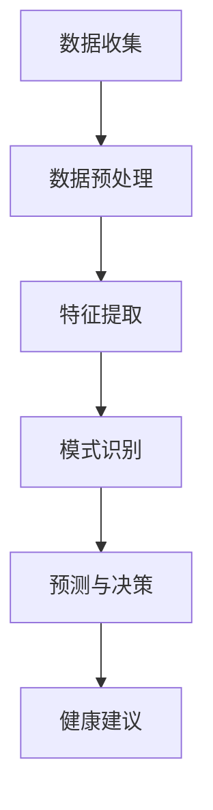
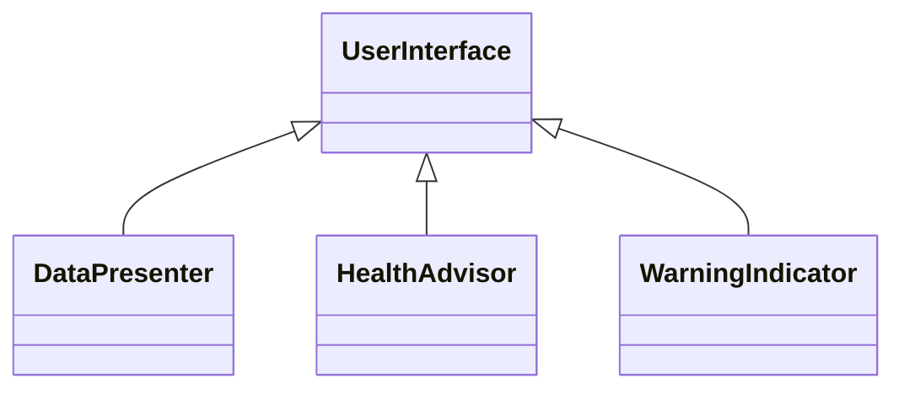

                 

## 智能鞋柜：AI Agent的足部健康管理专家

### 关键词：智能鞋柜、AI Agent、足部健康管理、物联网、数据分析

> 摘要：本文将探讨如何利用人工智能（AI）技术来开发智能鞋柜，特别是如何通过AI Agent实现足部健康管理的功能。我们将详细分析智能鞋柜的设计与实现、足部健康数据分析的方法、用户界面设计，并通过案例研究和未来展望，探讨智能鞋柜技术的前景与挑战。

智能鞋柜是一种结合物联网（IoT）技术和人工智能的智能设备，旨在通过AI Agent为用户提供足部健康管理的服务。随着人们对健康意识的提升，智能鞋柜在居家健康设备市场中的地位日益重要。本文将逐步分析智能鞋柜的技术原理、设计实现、数据分析以及用户界面设计，为开发者和技术爱好者提供有价值的参考。

### 引言：智能鞋柜与足部健康管理的背景

智能鞋柜的概念源于物联网技术的发展，它通过集成传感器和AI技术，实现对鞋柜内部环境以及用户鞋子的智能监测和管理。足部健康管理是现代健康研究中的一个重要领域，足部健康与整体健康息息相关。例如，足部问题如脚痛、足弓塌陷、足趾畸形等，不仅影响日常活动质量，还可能预示着其他系统性健康问题。

足部健康管理的核心在于数据的收集、分析和反馈。传统的足部健康管理依赖于医生的诊断和患者自我观察，存在效率低、准确度不足等问题。智能鞋柜的出现，为足部健康管理提供了一种全新的解决方案。它通过嵌入在鞋柜中的传感器和AI Agent，能够实时监测用户的足部健康数据，提供个性化的健康建议和预警。

### AI Agent基础：智能鞋柜的智能核心

AI Agent，即人工智能代理，是智能系统中的一种智能化实体，具备自主学习、决策和交互能力。AI Agent在智能鞋柜中扮演着足部健康管理专家的角色，能够通过数据分析和智能决策，为用户提供健康监测和管理服务。

AI Agent的基本原理包括：

1. **数据收集**：通过传感器收集足部健康数据，如步态分析、足部压力分布、温度监测等。
2. **数据预处理**：对收集到的原始数据进行清洗、归一化等预处理，为后续分析做准备。
3. **模式识别与预测**：利用机器学习算法对预处理后的数据进行模式识别和预测，如步态异常检测、足部疾病预测等。
4. **决策与反馈**：根据分析结果，AI Agent提供个性化健康建议和预警，并与用户进行交互。

### 智能鞋柜的设计与实现

智能鞋柜的设计与实现是一个复杂的过程，需要考虑硬件、软件和系统集成的多个方面。

#### 硬件设计

智能鞋柜的硬件设计包括传感器模块、控制器模块和通信模块。

1. **传感器模块**：包括步态传感器、压力传感器、温度传感器等，用于监测足部健康数据。
2. **控制器模块**：通常使用单片机或嵌入式系统，负责数据处理和通信。
3. **通信模块**：包括Wi-Fi、蓝牙等无线通信模块，用于将数据传输到云平台或移动设备。

#### 软件设计

智能鞋柜的软件设计包括以下模块：

1. **数据采集与预处理模块**：负责从传感器读取数据，并进行预处理。
2. **数据分析与模式识别模块**：使用机器学习算法对数据进行模式识别和预测。
3. **用户界面模块**：提供与用户交互的界面，展示健康数据和个性化建议。
4. **云平台与数据存储模块**：将分析结果上传到云平台，并提供远程访问和数据存储服务。

#### 系统集成

智能鞋柜的硬件和软件设计完成后，需要进行系统集成，确保各个模块能够协同工作。

1. **硬件集成**：将传感器、控制器和通信模块连接起来，确保数据能够顺利传输。
2. **软件集成**：将各个功能模块集成到一个系统中，确保系统能够稳定运行。
3. **测试与调试**：对系统进行测试和调试，确保系统功能正常，性能稳定。

### 足部健康数据分析

足部健康数据分析是智能鞋柜的核心功能，通过数据分析和智能决策，AI Agent能够为用户提供个性化的健康建议和预警。

#### 数据收集

数据收集包括以下方面：

1. **步态分析**：通过步态传感器收集用户的步态数据，如步频、步幅等。
2. **足部压力分布**：通过压力传感器收集足部在不同行走阶段的压力分布。
3. **温度监测**：通过温度传感器监测足部的温度变化。

#### 数据预处理

数据预处理包括以下步骤：

1. **数据清洗**：去除噪声数据，如传感器故障数据。
2. **数据归一化**：将不同传感器收集的数据进行归一化处理，以便后续分析。
3. **数据融合**：将多源数据融合，形成完整的足部健康数据集。

#### 数据分析

数据分析包括以下步骤：

1. **特征提取**：从预处理后的数据中提取关键特征，如步态异常特征、足部压力分布特征等。
2. **模式识别**：使用机器学习算法对特征进行模式识别，如步态异常检测、足部疾病预测等。
3. **预测与决策**：根据模式识别结果，AI Agent提供个性化健康建议和预警。

#### 数学模型与公式

在足部健康数据分析中，常用的数学模型和公式包括：

1. **步态异常检测**：使用支持向量机（SVM）或决策树进行异常检测。
2. **足部疾病预测**：使用神经网络或逻辑回归进行预测。
3. **足部压力分布分析**：使用PCA（主成分分析）进行数据降维和特征提取。

#### Mermaid流程图

为了更好地理解足部健康数据分析的过程，我们使用Mermaid绘制了以下流程图：

### 智能鞋柜的用户界面设计

智能鞋柜的用户界面设计是用户体验的重要组成部分。一个良好的用户界面能够帮助用户快速理解智能鞋柜的功能，并方便地与AI Agent进行交互。

#### 用户界面设计原则

1. **直观性**：用户界面应该简单直观，易于操作。
2. **一致性**：用户界面应该保持一致性，避免用户在操作中产生困惑。
3. **响应性**：用户界面应该快速响应，提供良好的交互体验。

#### 用户界面设计要素

1. **数据展示**：展示用户足部健康数据，如步态分析、足部压力分布等。
2. **健康建议**：展示AI Agent提供的个性化健康建议。
3. **预警提示**：展示足部健康预警信息。
4. **交互操作**：提供用户与AI Agent的交互操作界面。

#### Mermaid类图

为了展示智能鞋柜的用户界面设计，我们使用Mermaid绘制了以下类图：

### 案例研究

为了更好地展示智能鞋柜的应用，我们选择了一个实际案例进行详细分析。

#### 案例背景

某用户在使用智能鞋柜前，经常感到足部疼痛，特别是长时间站立或行走后。用户希望通过智能鞋柜来监控和管理足部健康。

#### 案例实现

1. **数据收集**：智能鞋柜通过步态传感器和压力传感器收集用户的足部健康数据。
2. **数据分析**：AI Agent对收集到的数据进行处理，发现用户的步态存在异常，且足部压力分布不均。
3. **健康建议**：AI Agent提供了个性化健康建议，如调整步态、适当休息等。
4. **用户反馈**：用户根据AI Agent的建议进行了调整，并反馈了足部疼痛的改善情况。

#### 案例小结

通过这个案例，我们可以看到智能鞋柜在足部健康管理中的实际应用效果。AI Agent的智能分析和个性化建议，为用户提供了一个有效的健康管理工具，帮助用户改善足部健康。

### 未来展望与挑战

智能鞋柜技术在未来有望继续发展，面临以下挑战：

1. **数据隐私与安全**：如何保护用户数据的安全和隐私，是一个重要的问题。
2. **准确性提升**：如何提高足部健康数据分析的准确性，是一个重要的研究方向。
3. **用户接受度**：如何提高用户对智能鞋柜的接受度，是一个需要考虑的问题。

通过不断创新和优化，智能鞋柜有望在未来为用户提供更全面、更准确的足部健康管理服务。

### 最佳实践 tips

1. **定期更新算法**：定期更新AI Agent的算法，提高数据分析的准确性。
2. **用户教育**：加强对用户的健康教育，提高用户对足部健康问题的认识。
3. **多传感器融合**：结合多种传感器数据，提供更全面的健康分析。

### 小结

智能鞋柜通过AI Agent实现了足部健康管理的功能，为用户提供了一种全新的健康管理方式。通过本文的分析，我们可以看到智能鞋柜在技术原理、设计实现、数据分析、用户界面设计等方面的关键要素。未来，智能鞋柜有望在足部健康管理领域发挥更大的作用。

### 注意事项

1. **确保传感器质量**：传感器质量直接影响数据的准确性，应选择高精度的传感器。
2. **定期维护**：定期对智能鞋柜进行维护和检查，确保设备正常运行。

### 拓展阅读

1. 《智能家居系统设计与实现》
2. 《机器学习实战》
3. 《物联网技术与应用》

### 作者信息

作者：AI天才研究院/AI Genius Institute & 禅与计算机程序设计艺术 /Zen And The Art of Computer Programming

本文为作者独立研究成果，未经许可，不得转载。

