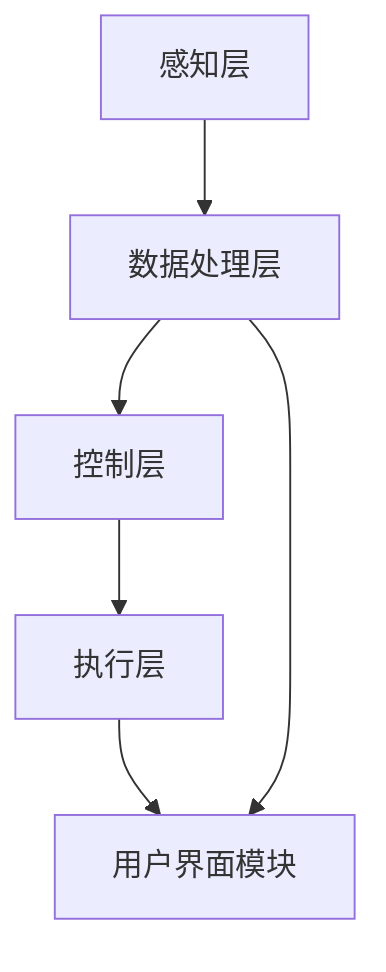

                 

### 智能鞋柜的背景与重要性

#### 1.1 智能鞋柜的概念与功能

智能鞋柜，顾名思义，是一种结合了人工智能（AI）技术的鞋类存储设备。它不仅能够为用户提供基础的鞋类存放功能，还能够通过内置的传感器和算法，对鞋内环境进行实时监测和管理。智能鞋柜的主要功能包括自动除臭、湿度控制、紫外线杀菌以及智能提醒等。

**定义与功能解析**：

1. **自动除臭**：通过传感器监测鞋内湿度、温度和气体浓度，一旦检测到异味，智能鞋柜便会启动除臭模块，利用活性炭、光触媒或等离子净化等技术去除异味。
2. **湿度控制**：鞋柜内置湿度传感器，能够实时监测鞋内湿度，当湿度超出设定范围时，鞋柜会自动启动除湿功能，保持鞋内干燥环境，预防真菌滋生。
3. **紫外线杀菌**：部分智能鞋柜配备紫外线杀菌灯，能够定期对鞋内进行杀菌处理，有效消除细菌和病毒，提升鞋子的卫生状况。
4. **智能提醒**：通过手机App连接，智能鞋柜可以提醒用户更换鞋子或进行清洁保养，提高鞋子的使用寿命。

#### 1.2 智能鞋柜的市场需求分析

智能鞋柜作为一个新兴的智能家居产品，其市场需求逐渐显现。以下是对市场需求的深度分析：

**市场驱动力**：

1. **生活品质提升**：随着生活水平的提高，消费者对家居环境和个人卫生的要求越来越高。智能鞋柜能够提供更高效的鞋类管理，满足用户对高品质生活的追求。
2. **健康意识增强**：空气污染和细菌病毒传播是现代生活中的常见问题，智能鞋柜通过自动除臭、杀菌等功能，能够有效改善鞋内环境，提升用户健康水平。
3. **智能家居普及**：智能家居市场的快速发展，使得智能设备逐渐走进千家万户。智能鞋柜作为智能家居的一部分，能够增强用户对智能家居系统的依赖。

**市场潜力**：

1. **家庭用户需求**：家庭用户对鞋柜的需求主要是为了改善家居环境和提高生活质量，智能鞋柜正好满足了这一需求。
2. **商业用户需求**：酒店、商场等商业场所对鞋柜的需求则更多体现在管理效率和用户体验上，智能鞋柜能够提供更加便捷和高效的鞋类管理服务。

#### 1.3 智能鞋柜的发展趋势

智能鞋柜作为智能家居产品的一环，未来的发展潜力巨大。以下是对其发展前景的展望：

**技术进步**：

1. **传感器技术**：随着传感器技术的不断发展，智能鞋柜的监测精度和功能将得到进一步提升，能够提供更加智能和精准的鞋内环境管理。
2. **算法优化**：AI算法的优化将使得智能鞋柜的除臭、杀菌等功能更加高效和精准，用户体验得到显著提升。
3. **物联网集成**：智能鞋柜将更加紧密地与智能家居系统集成，实现设备间的互联互通，提供更加全面和智能的家居解决方案。

**市场前景**：

1. **产品多样化**：随着技术的进步和用户需求的多样化，智能鞋柜的产品形态将越来越丰富，满足不同场景和用户需求。
2. **全球化市场**：智能家居市场的全球化趋势将推动智能鞋柜在国际市场的扩展，为国内企业带来更多发展机遇。

**产业生态**：

1. **产业链完善**：智能鞋柜的产业链将逐步完善，涉及传感器、控制器、软件平台等环节，为整个产业的发展奠定基础。
2. **跨界合作**：智能鞋柜与其他智能家居产品、电商平台等的跨界合作，将推动智能鞋柜市场的快速发展。

通过以上分析，我们可以看到智能鞋柜在智能家居市场中的重要性和发展潜力。未来，随着技术的不断进步和市场需求的不断增长，智能鞋柜有望成为智能家居产品中的一颗璀璨明星。

#### 2.1 AI Agent的基本原理

AI Agent，即人工智能代理，是人工智能领域中的一个重要概念。它代表了能够自主行动、感知环境和实现目标的人工智能系统。AI Agent的基本原理主要涉及以下几个方面：

**定义与核心特征**：

AI Agent的定义可以简述为：一种能够在特定环境中执行任务、自主决策并与其他实体进行交互的智能实体。其核心特征包括自主性、适应性、学习性和协同性。

1. **自主性**：AI Agent具有独立的决策能力，可以根据环境和目标自主选择行动方案，无需人工干预。
2. **适应性**：AI Agent能够根据环境变化调整自身行为，以实现最优的目标。
3. **学习性**：AI Agent具备学习能力，可以通过不断收集信息和反馈来优化自身的行为策略。
4. **协同性**：AI Agent可以在多Agent系统中与其他Agent进行合作，共同完成任务。

**架构与组件**：

AI Agent通常由以下组件构成：

1. **感知模块**：用于获取环境信息，如传感器数据、图像、声音等。
2. **决策模块**：基于感知模块提供的信息，通过算法进行决策，选择最佳行动方案。
3. **执行模块**：执行决策模块生成的行动方案，实现目标。
4. **学习模块**：根据执行结果和环境反馈，不断调整和优化行为策略。

**工作机制**：

AI Agent的工作机制可以概括为以下步骤：

1. **感知**：AI Agent通过感知模块获取当前环境信息。
2. **决策**：决策模块对感知信息进行处理，生成行动方案。
3. **执行**：执行模块按照决策方案进行行动。
4. **反馈**：执行结果和环境反馈通过感知模块传递给学习模块。
5. **优化**：学习模块根据反馈信息调整行为策略，优化决策过程。

**应用领域**：

AI Agent在多个领域都有着广泛的应用，如：

1. **智能家居**：如智能灯泡、智能门锁等，通过AI Agent实现设备的自主控制和用户互动。
2. **自动驾驶**：自动驾驶汽车中的AI Agent负责感知环境、做出驾驶决策。
3. **电子商务**：AI Agent可以分析用户行为，提供个性化推荐和客服服务。
4. **医疗健康**：AI Agent可以协助医生进行诊断、治疗和健康监测。

通过了解AI Agent的基本原理和工作机制，我们可以更好地理解其在智能鞋柜中的应用，以及如何通过AI技术提升鞋履管理和使用体验。

#### 2.2 AI Agent在鞋履除臭中的应用

AI Agent在智能鞋柜中的一项重要应用便是鞋履除臭。通过智能感知、自主决策和学习优化，AI Agent能够高效地检测和消除鞋内异味，提升鞋履的使用体验和卫生状况。

**原理与机制**：

AI Agent的鞋履除臭主要基于以下几个原理和机制：

1. **实时监测**：AI Agent通过内置传感器（如气体传感器、湿度传感器等）实时监测鞋内的气体成分、温度和湿度等环境参数。
2. **数据分析**：感知模块收集到的数据会被传输到决策模块，通过机器学习和数据挖掘技术进行分析，判断是否存在异味。
3. **智能决策**：一旦检测到异味，决策模块会根据训练好的算法模型，选择合适的除臭策略，如启动除臭装置、调节湿度或温度等。
4. **自主执行**：执行模块根据决策结果，自动启动相应的除臭设备，如活性炭除臭模块、臭氧发生器或光触媒装置等。

**技术实现**：

1. **传感器技术**：选用高灵敏度的气体传感器，能够精准检测出鞋内的低浓度有害气体。
2. **机器学习算法**：使用深度学习或强化学习算法，训练模型以识别和预测异味，从而提高除臭的效率和准确性。
3. **智能控制器**：控制器负责协调传感器、执行装置和机器学习算法，确保除臭过程的自动化和智能化。

**实际案例**：

一个典型的实际案例是某智能家居品牌推出的智能鞋柜。该鞋柜内置了多种传感器，如气体传感器、湿度传感器和温度传感器等，能够实时监测鞋内的环境参数。当检测到异味时，AI Agent会启动除臭装置，通过以下步骤实现除臭：

1. **异味检测**：AI Agent通过气体传感器检测到鞋内异味。
2. **启动除臭装置**：决策模块决定启动活性炭除臭模块，通过活性炭的吸附作用去除异味。
3. **数据记录与反馈**：AI Agent记录除臭过程的相关数据，并反馈给用户，提示除臭完成。

**效果评估**：

AI Agent的鞋履除臭技术在实际应用中取得了显著的效果。通过自动除臭，鞋内异味得到了有效控制，不仅提升了鞋子的使用寿命，也改善了用户的居住环境。此外，用户还可以通过手机App实时监控鞋柜的除臭状态，增强了使用体验和满意度。

通过上述实际案例，我们可以看到AI Agent在鞋履除臭中的强大应用潜力。未来，随着AI技术的不断进步，智能鞋柜的除臭功能将更加智能和高效，为用户带来更加舒适和健康的居住环境。

#### 2.3 AI Agent在鞋履保养中的应用

AI Agent不仅在鞋履除臭方面具有显著效果，在鞋履保养方面同样发挥着重要作用。通过智能感知和自主决策，AI Agent能够对鞋履进行全面的保养，延长鞋子的使用寿命，提升用户体验。

**原理与机制**：

AI Agent在鞋履保养中的应用主要基于以下几个原理和机制：

1. **实时监测**：AI Agent通过传感器（如温度传感器、湿度传感器和磨损传感器等）实时监测鞋子的使用状态和环境条件。
2. **数据收集与分析**：感知模块收集到的数据会被传输到决策模块，通过机器学习和数据分析技术，对鞋子的磨损程度、湿度、温度等参数进行分析，判断鞋子是否需要保养。
3. **智能决策**：决策模块根据分析结果，选择合适的保养策略，如调节湿度、温度，启动清洁或保养程序等。
4. **自主执行**：执行模块根据决策模块的指令，自动启动相应的保养设备，如湿度调节器、清洁装置或保养液喷洒装置等。

**技术实现**：

1. **传感器技术**：选用高精度的传感器，如温度传感器、湿度传感器和磨损传感器，能够精准地监测鞋子的各项参数。
2. **机器学习算法**：通过深度学习或强化学习算法，训练模型以识别鞋子的磨损程度、湿度、温度等参数，从而制定最优的保养方案。
3. **智能控制器**：控制器负责协调传感器、执行装置和机器学习算法，确保保养过程的自动化和智能化。

**实际案例**：

一个典型的实际案例是某品牌智能鞋柜中的保养功能。该智能鞋柜内置了多种传感器，能够实时监测鞋子的使用状态和环境条件。以下是一个具体的保养流程：

1. **状态监测**：AI Agent通过传感器监测到鞋子的磨损程度达到一定阈值，同时鞋内湿度偏高。
2. **启动保养程序**：决策模块根据分析结果，决定启动保养程序，首先启动湿度调节器，降低鞋内湿度。
3. **清洁鞋面**：同时，执行模块启动清洁装置，通过喷洒清洁液对鞋面进行清洁。
4. **保养鞋底**：当湿度适宜后，AI Agent决定对鞋底进行保养，启动保养液喷洒装置，均匀涂抹保养液。
5. **完成保养**：AI Agent记录保养过程的数据，并通过手机App向用户发送保养完成的提示。

**效果评估**：

AI Agent在鞋履保养中的应用效果显著。通过智能监测和自主决策，智能鞋柜能够及时发现鞋子的保养需求，并采取相应的保养措施，有效延长了鞋子的使用寿命。此外，用户可以通过手机App实时了解鞋子的保养状态，增强了使用体验和满意度。

通过上述实际案例，我们可以看到AI Agent在鞋履保养中的重要作用。未来，随着AI技术的不断进步，智能鞋柜的保养功能将更加智能和全面，为用户提供更加优质和便捷的鞋履管理服务。

### 智能鞋柜的硬件设计原则

#### 3.1 智能鞋柜硬件的选择标准

智能鞋柜的硬件设计是确保其功能实现和性能表现的关键。选择合适的硬件不仅能够提升智能鞋柜的性能和用户体验，还能降低成本和维护难度。以下是智能鞋柜硬件选择的主要标准：

**可靠性**：智能鞋柜需要长时间运行，因此所选硬件必须具备高可靠性。特别是传感器和执行器，要求能够稳定工作，避免因硬件故障导致系统失效。

**精度**：传感器是智能鞋柜的核心组件，其精度直接影响到数据的准确性。选择高精度的传感器，如高灵敏度的温度传感器、湿度传感器和气体传感器，能够确保环境监测数据的可靠性。

**稳定性**：硬件需要在各种环境条件下稳定工作，包括高温、低温、湿度变化等。稳定性好的硬件能够保证系统在长时间运行过程中不出现性能下降或故障。

**功耗**：智能鞋柜通常需要持续运行，功耗较低的硬件可以延长电池寿命，降低能耗。尤其是在没有外部电源的情况下，低功耗设计尤为重要。

**兼容性**：硬件需要与其他组件（如控制器、通信模块等）兼容，确保系统的整体协调工作。选择通用性较强的硬件组件，可以方便后续的升级和维护。

**成本**：在满足上述条件的基础上，成本也是一个重要的考虑因素。选择性价比高的硬件，可以在保证性能的同时，控制整体项目成本。

#### 3.2 智能鞋柜硬件的设计流程

智能鞋柜硬件设计流程可以分为以下几个步骤：

**需求分析**：明确智能鞋柜的功能需求，如除臭、湿度控制、杀菌、智能提醒等。根据需求，确定所需的硬件组件和性能指标。

**方案设计**：基于需求分析，设计智能鞋柜的硬件方案。选择合适的传感器、控制器、执行器和电源系统，并确定各组件的连接方式和布局。

**选型与评估**：根据方案设计，对所选硬件进行选型和评估，确保其满足性能和可靠性要求。评估内容包括硬件的规格、价格、供应商稳定性等。

**原型制作**：制作智能鞋柜的硬件原型，并进行初步测试。测试内容包括各组件的功能性、兼容性、稳定性等，以验证设计方案的可行性。

**优化与迭代**：根据测试结果，对硬件方案进行优化和迭代。可能涉及组件更换、电路调整、软件优化等，以确保最终产品的性能和稳定性。

**生产与测试**：完成硬件优化后，进行批量生产。生产过程中，需进行严格的测试和质量控制，确保每个产品符合设计要求。

#### 3.3 智能鞋柜硬件的关键技术

智能鞋柜硬件的关键技术包括传感器技术、控制器技术和电源技术等。以下分别进行介绍：

**传感器技术**：

传感器是智能鞋柜获取环境信息的关键组件，主要包括温度传感器、湿度传感器和气体传感器等。关键技术包括：

1. **高精度**：选择高精度传感器，确保监测数据的准确性。
2. **稳定性**：传感器需要在各种环境条件下稳定工作，避免因温度、湿度变化等原因导致的测量误差。
3. **低功耗**：低功耗设计可以延长智能鞋柜的电池寿命，适合长时间运行。

**控制器技术**：

控制器是智能鞋柜的“大脑”，负责接收传感器数据、处理信息、生成决策并控制执行器。关键技术包括：

1. **处理能力**：控制器需具备足够的处理能力，能够实时处理大量传感器数据，快速生成决策。
2. **兼容性**：控制器需要与各种传感器和执行器兼容，确保系统的整体协调性。
3. **可靠性**：控制器需要具备高可靠性，避免因故障导致整个系统的失效。

**电源技术**：

智能鞋柜通常采用电池供电，电源技术包括电池选择、充电管理和电源管理电路等。关键技术包括：

1. **电池选择**：选择合适的电池类型，如锂离子电池，确保高能量密度和长续航时间。
2. **充电管理**：实现安全、高效的充电过程，包括电流和电压的调节、充电状态的监测等。
3. **电源管理**：设计高效的电源管理电路，确保各组件的稳定供电，延长电池寿命。

通过上述关键技术的设计和应用，智能鞋柜能够实现高效、稳定和智能的鞋类管理，为用户提供优质的使用体验。

#### 4.1 智能传感器的设计与应用

智能传感器是智能鞋柜的重要组成部分，其设计与应用直接影响到鞋柜的功能实现和用户体验。以下详细探讨智能传感器的类型、工作原理以及应用。

**类型**：

智能鞋柜中常用的传感器主要包括以下几种：

1. **温度传感器**：用于监测鞋内温度，确保鞋履在适宜的温度下存放，避免因过高或过低的温度影响鞋子的舒适性和使用寿命。
2. **湿度传感器**：用于监测鞋内湿度，通过调节湿度控制鞋柜内的干燥程度，防止霉菌滋生。
3. **气体传感器**：用于检测鞋内的气体成分，如挥发性有机化合物（VOCs）、氨气等，通过检测这些有害气体，实现自动除臭功能。
4. **磨损传感器**：用于监测鞋底的磨损情况，通过分析鞋底的磨损数据，提供保养建议，延长鞋子的使用寿命。

**工作原理**：

智能传感器的工作原理主要基于物理、化学和生物原理，具体包括：

1. **温度传感器**：利用半导体材料的电阻随温度变化的特性，通过测量电阻值变化来确定温度。常见的温度传感器有热敏电阻、热电偶等。
2. **湿度传感器**：通过电容、电阻或离子迁移等方式，测量环境中的湿度。例如，电容式湿度传感器利用介电常数的变化来测量湿度。
3. **气体传感器**：利用气体分子与传感器材料之间的化学反应或物理吸附作用，将气体浓度转化为电信号输出。常见的气体传感器有半导体气体传感器、电化学气体传感器等。
4. **磨损传感器**：通过测量鞋底表面的纹理变化或摩擦系数的变化，来评估鞋底的磨损情况。常见的磨损传感器有光学传感器、压力传感器等。

**应用**：

智能传感器的应用在智能鞋柜中发挥了关键作用，以下为具体应用：

1. **温度监测与控制**：温度传感器实时监测鞋内温度，若温度超出设定范围，控制器会启动加热或制冷装置，确保鞋内温度适宜。例如，在冬季寒冷天气中，加热装置可以保持鞋子的温暖，防止冻伤。

2. **湿度监测与控制**：湿度传感器用于监测鞋内湿度，当湿度超出设定范围时，控制器会启动除湿或加湿装置，调节鞋内湿度。例如，在潮湿环境中，除湿装置可以去除鞋内的湿气，防止霉变。

3. **气体监测与除臭**：气体传感器用于检测鞋内挥发性有机化合物（VOCs）和其他有害气体。一旦检测到异味，控制器会启动除臭装置，如活性炭除臭模块或臭氧发生器，自动清除异味，提升鞋子的卫生状况。

4. **磨损监测与保养提示**：磨损传感器用于监测鞋底的磨损情况，通过数据分析，提供保养建议。例如，当鞋底磨损到一定程度时，智能鞋柜会通过App向用户发送保养提醒，建议用户进行清洁或更换鞋底。

通过上述应用，智能传感器不仅提升了智能鞋柜的功能性，还增强了用户的体验。智能传感器的实时监测和数据反馈，使得鞋柜能够自动、高效地管理鞋履，为用户带来更加舒适、健康的使用环境。

#### 4.2 控制器的选型与优化

控制器是智能鞋柜的核心部件，其性能直接影响智能鞋柜的稳定运行和功能实现。因此，在智能鞋柜的硬件设计中，控制器的选型和优化至关重要。以下将详细讨论控制器的选型标准和优化方法。

**选型标准**：

1. **处理能力**：控制器需要具备足够的处理能力，能够实时处理传感器采集的数据，进行决策并控制执行器。高性能的微处理器或嵌入式系统是首选，如ARM Cortex系列处理器，其处理速度快、功耗低，适合智能鞋柜的需求。
2. **兼容性**：控制器需要兼容各种传感器和执行器，支持常见的通信协议（如I2C、SPI、UART等），确保系统组件之间的协调工作。
3. **稳定性**：控制器应具备高稳定性，能够在各种环境下可靠运行，避免因环境变化导致的性能下降或故障。
4. **功耗**：控制器需要具备低功耗特性，以延长智能鞋柜的电池寿命。尤其在无线供电或电池供电的系统中，低功耗控制器的选择至关重要。
5. **扩展性**：控制器应具备良好的扩展性，以便未来升级或增加新功能。例如，支持添加额外的传感器接口或执行器接口。

**优化方法**：

1. **硬件优化**：在硬件层面，可以选择高性能、低功耗的微控制器或嵌入式系统。同时，设计合理的热管理方案，确保控制器在高温环境下稳定运行。使用高效电源管理电路，降低整体功耗。
2. **软件优化**：在软件层面，优化控制器程序的算法，提高数据处理效率和决策速度。采用多线程处理或多任务调度，提高系统的响应速度和稳定性。使用静态代码分析工具，查找和修复潜在的软件漏洞。
3. **通信优化**：优化控制器与传感器、执行器之间的通信，使用高效的数据传输协议和通信协议，减少数据传输的延迟和错误率。使用数据压缩技术，降低传输数据量，提高通信效率。
4. **自诊断与容错**：设计控制器自诊断机制，实时监测系统状态，一旦发现故障，立即进行错误处理和容错操作，确保系统的连续运行。
5. **散热设计**：针对控制器的高温问题，采用散热设计，如增加散热片、风扇或液冷系统，确保控制器在长时间运行中保持稳定的工作温度。

通过上述选型和优化方法，智能鞋柜的控制器能够实现高效、稳定和智能的运行，为用户提供优质的使用体验。

#### 4.3 电源系统的设计与保障

智能鞋柜的电源系统设计是确保其稳定运行和长时间使用的关键。合理的电源系统设计不仅能够提高系统的可靠性和续航能力，还能降低功耗和延长电池寿命。以下将详细探讨智能鞋柜电源系统的设计与保障措施。

**电源系统设计原则**：

1. **稳定性**：电源系统必须确保稳定的输出电压和电流，避免因电压波动或电流不稳定导致设备损坏或功能失效。
2. **安全性**：电源系统设计要符合安全标准，包括防短路、过载保护和电池安全等，确保在使用过程中不会发生安全事故。
3. **高效性**：电源系统应采用高效电源转换技术，如开关电源，以提高能源利用率，降低能量损失。
4. **可扩展性**：电源系统应具备一定的扩展性，以便未来增加新功能或更换电池类型。
5. **可维护性**：电源系统设计应便于维护和更换，降低维修成本和停机时间。

**电源系统组成**：

1. **电池**：智能鞋柜通常使用锂离子电池，因其高能量密度、长循环寿命和良好的安全性。电池应具备足够的容量，以满足系统长时间运行的需求。
2. **充电模块**：充电模块负责为电池充电，并确保充电过程安全、高效。常见的充电技术包括快速充电和智能充电，后者可以根据电池状态动态调整充电电流和电压，提高充电效率和电池寿命。
3. **电源管理电路**：电源管理电路负责将电池的直流电转换为设备所需的低压直流电，并提供电压和电流调节功能。常见的电源管理电路包括稳压器、充电控制器和电压监测器等。
4. **储能装置**：除了电池，智能鞋柜还可以配备储能装置，如超级电容器，用于在电池电量较低时提供额外的电力，提高系统的应急能力。

**设计步骤**：

1. **需求分析**：根据智能鞋柜的功能需求和运行环境，确定电源系统的电压、电流和功率需求。
2. **电池选型**：选择适合的电池类型和规格，如锂离子电池，确保电池容量和循环寿命满足系统需求。
3. **充电模块设计**：设计充电模块，选择合适的充电技术，如快速充电和智能充电，确保充电过程高效、安全。
4. **电源管理电路设计**：设计电源管理电路，包括电压调节、电流控制和电压监测等，确保电源系统稳定、高效运行。
5. **储能装置设计**：如果需要，设计储能装置，如超级电容器，以提供额外的电力支持。

**保障措施**：

1. **电池防护**：设计电池防护电路，防止过充、过放和短路等异常情况，确保电池安全。
2. **电源监控**：实时监控电源系统的电压、电流和功率，及时发现和解决异常情况。
3. **应急处理**：设计应急处理机制，如电池电量过低时的报警功能，确保系统在紧急情况下能够及时响应和处理。
4. **定期维护**：定期对电源系统进行维护和检查，确保各组件正常工作，延长系统寿命。

通过合理的电源系统设计和有效的保障措施，智能鞋柜能够实现稳定、高效和长时间运行，为用户提供可靠的使用体验。

### 智能鞋柜的软件设计与开发

#### 5.1 智能鞋柜软件的需求分析

智能鞋柜的软件设计是确保其功能实现和用户需求满足的关键环节。为了设计出高效的软件系统，必须对智能鞋柜的功能需求进行详细分析。以下是智能鞋柜软件的主要需求：

1. **环境监测**：软件需要支持对鞋柜内温度、湿度、气体成分等环境参数的实时监测和记录。具体需求包括：
   - 实时数据采集和显示。
   - 数据存储和查询功能。
   - 异常数据报警功能。

2. **除臭功能**：软件需要支持自动除臭功能，通过传感器监测到异味时，自动启动除臭装置。具体需求包括：
   - 异味检测算法设计。
   - 除臭装置的控制逻辑。
   - 除臭效果的评估和反馈。

3. **湿度控制**：软件需要支持自动调节湿度，以保持鞋柜内适宜的湿度环境。具体需求包括：
   - 湿度监测和调节算法设计。
   - 湿度控制装置的控制逻辑。
   - 湿度调节效果的评估和反馈。

4. **杀菌功能**：软件需要支持定期杀菌功能，通过紫外线或臭氧等杀菌方式，保持鞋柜内的卫生。具体需求包括：
   - 杀菌装置的控制逻辑。
   - 杀菌周期的设定和提醒。
   - 杀菌效果的评估和反馈。

5. **智能提醒**：软件需要支持智能提醒功能，通过手机App或语音提示，提醒用户进行鞋履更换或清洁保养。具体需求包括：
   - 鞋履更换提醒。
   - 鞋履保养提醒。
   - 智能提醒机制的设置和调整。

6. **用户交互**：软件需要提供友好的用户交互界面，支持用户对鞋柜进行设置和控制。具体需求包括：
   - 用户界面设计。
   - 设置和调整功能的实现。
   - 实时数据和历史数据的展示。

7. **数据安全**：软件需要确保用户数据的安全，包括用户隐私保护和数据加密等。具体需求包括：
   - 用户数据加密存储。
   - 数据传输加密。
   - 用户权限管理。

#### 5.2 智能鞋柜软件的架构设计

智能鞋柜软件的架构设计是确保其功能模块化和系统扩展性的关键。以下是智能鞋柜软件的总体架构设计：

**1. 系统架构概述**：

智能鞋柜软件架构采用分层设计，包括感知层、数据处理层、控制层和应用层。各层功能如下：

- **感知层**：主要负责数据采集，包括温度传感器、湿度传感器、气体传感器等。
- **数据处理层**：负责对采集到的数据进行预处理、存储和管理，包括数据清洗、数据转换和数据存储。
- **控制层**：负责对感知层数据进行处理，生成控制指令，驱动执行层。
- **应用层**：负责与用户交互，包括用户界面和功能模块。

**2. 功能模块设计**：

- **数据采集模块**：负责从传感器获取环境数据，并进行初步处理。
- **数据处理模块**：负责对采集到的数据进行分析和处理，包括数据清洗、特征提取、异常检测等。
- **控制模块**：负责根据处理结果生成控制指令，驱动执行层。
- **执行模块**：负责执行控制模块生成的指令，包括启动除臭装置、湿度调节装置、杀菌装置等。
- **用户界面模块**：负责与用户交互，提供设置和调整功能，以及实时数据和历史数据的展示。

**3. 通信协议设计**：

智能鞋柜软件架构中的各层之间需要通过通信协议进行数据交互。以下是常用的通信协议：

- **感知层与数据处理层**：采用I2C、SPI等短距离通信协议，确保数据传输的稳定性和低延迟。
- **数据处理层与控制层**：采用MQTT、HTTP等长距离通信协议，确保数据传输的高效性和可靠性。
- **控制层与执行层**：采用GPIO、PWM等直接控制协议，确保控制指令的快速响应。

**4. 软件架构图**：

智能鞋柜软件架构图如下所示：

#### 5.3 智能鞋柜软件的核心功能实现

智能鞋柜软件的核心功能包括环境监测、除臭功能、湿度控制、杀菌功能、智能提醒和用户交互等。以下将详细讨论这些功能的实现。

**1. 环境监测功能实现**：

环境监测功能是智能鞋柜的基础功能，通过传感器实时监测鞋柜内的温度、湿度和气体成分。以下是实现步骤：

- **数据采集**：使用温度传感器、湿度传感器和气体传感器采集环境数据。
- **数据预处理**：对采集到的数据进行滤波、去噪等预处理，以提高数据的准确性和稳定性。
- **数据存储**：将预处理后的数据存储在数据库中，以便后续分析和查询。
- **异常检测**：通过机器学习算法，对环境数据进行分析，检测异常情况，如温度过高、湿度异常等，并触发报警。

**2. 除臭功能实现**：

除臭功能通过检测鞋内异味，并自动启动除臭装置来实现。以下是实现步骤：

- **异味检测**：使用气体传感器检测鞋内气体成分，通过机器学习算法识别异味。
- **除臭装置控制**：根据检测到的异味，自动启动活性炭除臭模块、臭氧发生器或光触媒装置等，进行除臭处理。
- **除臭效果评估**：通过再次检测气体成分，评估除臭效果，并记录除臭日志。

**3. 湿度控制功能实现**：

湿度控制功能通过调节鞋柜内的湿度，保持适宜的存储环境。以下是实现步骤：

- **湿度监测**：使用湿度传感器监测鞋柜内的湿度。
- **湿度调节**：根据湿度监测结果，自动启动除湿或加湿装置，调节鞋柜内的湿度。
- **湿度调节效果评估**：通过再次监测湿度，评估调节效果，并记录湿度调节日志。

**4. 杀菌功能实现**：

杀菌功能通过定期对鞋柜进行杀菌处理，保持鞋柜内的卫生。以下是实现步骤：

- **杀菌周期设定**：用户可以通过手机App设定杀菌周期，如每周一次。
- **杀菌装置控制**：定期启动紫外线杀菌灯或臭氧发生器，进行杀菌处理。
- **杀菌效果评估**：通过传感器监测杀菌效果，如细菌和病毒数量减少，并记录杀菌日志。

**5. 智能提醒功能实现**：

智能提醒功能通过手机App或语音提示，提醒用户进行鞋履更换或清洁保养。以下是实现步骤：

- **提醒规则设定**：用户可以通过手机App设定提醒规则，如鞋履更换周期、保养周期等。
- **提醒机制实现**：根据设定规则，定期发送提醒通知，包括手机App通知和语音提示。
- **提醒反馈**：用户可以确认已完成的提醒事项，以便系统记录和调整提醒策略。

**6. 用户交互功能实现**：

用户交互功能通过友好的用户界面，提供设置和调整功能，以及实时数据和历史数据的展示。以下是实现步骤：

- **用户界面设计**：设计直观、易用的用户界面，包括首页、设置页、数据展示页等。
- **功能模块实现**：实现用户交互功能，包括环境监测、除臭设置、湿度控制、杀菌设置等。
- **实时数据展示**：实时展示鞋柜内的温度、湿度、气体成分等数据，并提供历史数据查询功能。

通过上述功能的实现，智能鞋柜软件能够为用户提供高效、智能和便捷的鞋类管理服务，提升用户的居住体验和健康水平。

### 鞋履除臭技术原理

鞋履除臭是智能鞋柜中的一个关键功能，通过多种技术手段去除鞋内异味，提高鞋子的卫生状况和使用体验。以下是鞋履除臭的基本原理、常见方法和AI Agent在该技术中的应用。

#### 6.1 鞋履除臭的基本原理

鞋履除臭的核心在于消除鞋内产生的有害气体和异味。鞋内异味主要来源于以下几个因素：

1. **汗水**：脚部出汗时，汗液中的有机物质与细菌反应产生挥发性有机化合物（VOCs），如硫化氢、氨气等。
2. **细菌和霉菌**：鞋内潮湿环境容易滋生细菌和霉菌，它们在代谢过程中产生恶臭气体。
3. **鞋材**：鞋材在长时间使用过程中，可能会分解产生异味。

鞋履除臭的基本原理包括以下几种：

1. **吸附**：利用活性炭、硅胶等吸附材料，吸附并捕捉鞋内异味分子，降低气体浓度。
2. **氧化**：利用氧化剂（如臭氧、过氧化氢等）将有害气体分解成无害物质，从根本上消除异味。
3. **分解**：利用光触媒等分解剂，在光照条件下将有害气体分解成水分子和二氧化碳，实现除臭。
4. **中和**：利用碱性或酸性物质中和有害气体，减少异味。

#### 6.2 常见的鞋履除臭方法

根据基本原理，常见的鞋履除臭方法包括以下几种：

1. **活性炭除臭**：活性炭具有多孔结构，能够高效吸附异味分子。在鞋柜中，活性炭除臭模块可以定期更换或清洗，确保除臭效果。
2. **光触媒除臭**：光触媒在紫外光照射下，能够催化分解有害气体，将其转化为无害物质。该方法适用于光照条件良好的环境，如智能鞋柜内置的紫外线杀菌灯。
3. **臭氧除臭**：臭氧具有很强的氧化能力，能够分解有机化合物，消除异味。臭氧发生器常用于鞋柜中的除臭装置，但需注意臭氧对人体有害，需控制臭氧浓度和除臭时间。
4. **通风换气**：通过自然通风或机械通风，将鞋柜内有害气体排出，降低异味浓度。智能鞋柜可以通过自动开关门或通风口，实现定时通风换气。

#### 6.3 AI Agent在除臭技术中的应用

AI Agent在鞋履除臭技术中发挥着重要作用，通过智能感知和自主决策，提高除臭效率和用户体验。以下是AI Agent在除臭技术中的应用：

1. **智能感知**：AI Agent通过传感器实时监测鞋内气体成分、温度和湿度等参数，精确识别异味源。
2. **自主决策**：基于机器学习算法，AI Agent分析感知数据，判断异味程度和类型，选择最优除臭方法。例如，当检测到高浓度硫化氢时，AI Agent会优先选择臭氧除臭。
3. **自动化执行**：AI Agent根据决策结果，自动启动相应的除臭装置，如活性炭除臭模块或臭氧发生器。
4. **动态调整**：AI Agent根据除臭效果和用户反馈，动态调整除臭策略，提高除臭效率和用户体验。例如，如果某种除臭方法效果不佳，AI Agent会尝试更换其他方法。

通过AI Agent的应用，智能鞋柜能够实现高效、智能的鞋履除臭，为用户提供清洁、健康的存储环境。未来，随着AI技术的不断发展，鞋履除臭技术将更加智能和高效，进一步提升用户的生活品质。

### 鞋履保养技术原理

鞋履保养是保证鞋子使用寿命和舒适性的关键环节。智能鞋柜通过多种技术手段对鞋履进行保养，以延长鞋子的使用寿命和提升使用体验。以下是鞋履保养的基本原理、常见方法和AI Agent在保养技术中的应用。

#### 7.1 鞋履保养的基本原理

鞋履保养的核心在于维护鞋子的结构完整性和舒适性。鞋履在使用过程中，鞋面、鞋底和鞋垫等部位会受到磨损和污染。因此，保养需要从以下几个方面进行：

1. **清洁**：定期清除鞋面上的污垢和灰尘，保持鞋子的整洁。
2. **防潮**：防止鞋内湿度过高，避免霉菌滋生。
3. **防磨损**：通过适当的保养措施，减少鞋面和鞋底的磨损。
4. **防变形**：定期调整鞋垫和鞋底，防止鞋子变形，影响舒适性和使用寿命。

鞋履保养的基本原理包括以下几种：

1. **物理保养**：通过物理方法，如刷洗、擦拭和打磨等，清除鞋面的污垢和磨损。
2. **化学保养**：通过化学方法，如使用清洁剂、保养油和鞋乳等，对鞋面和鞋底进行清洁和养护。
3. **消毒**：通过消毒方法，如紫外线杀菌和臭氧处理等，消除鞋内的细菌和霉菌，保持鞋子的卫生。
4. **调适**：通过调适鞋垫和鞋底，确保鞋子的舒适度和稳定性。

#### 7.2 常见的鞋履保养方法

根据保养原理，常见的鞋履保养方法包括以下几种：

1. **清洁保养**：使用清洁剂或洗涤剂，配合刷子或海绵，对鞋面进行清洁。对于污渍较严重的部位，可以使用专门的清洁剂进行局部处理。清洁后，用干燥的布擦拭鞋面，防止水分残留。
2. **防潮保养**：在鞋柜中放置干燥剂或活性炭，吸收鞋内的湿气，防止霉菌滋生。智能鞋柜可以通过自动除湿功能，调节鞋柜内的湿度，保持鞋内干燥。
3. **防磨损保养**：使用鞋油或保养油，对鞋面和鞋底进行涂抹，形成保护层，减少磨损。定期使用磨砂纸或抛光剂，对鞋底进行打磨，防止鞋底磨损。
4. **消毒保养**：使用紫外线杀菌灯或臭氧发生器，定期对鞋内进行消毒处理，消除细菌和霉菌。智能鞋柜可以通过设定消毒周期，自动启动消毒装置，保持鞋内卫生。
5. **调适保养**：定期检查鞋垫和鞋底，确保其位置和状态正常。如有必要，可以更换鞋垫或调整鞋底，以维持鞋子的舒适度和稳定性。

#### 7.3 AI Agent在保养技术中的应用

AI Agent在鞋履保养技术中发挥着重要作用，通过智能感知和自主决策，提高保养效率和用户体验。以下是AI Agent在保养技术中的应用：

1. **智能感知**：AI Agent通过传感器实时监测鞋子的使用状态和环境条件，如温度、湿度、磨损程度等。
2. **自主决策**：基于机器学习算法，AI Agent分析感知数据，判断鞋子的保养需求，选择最佳的保养方案。例如，当检测到鞋垫磨损严重时，AI Agent会建议更换鞋垫。
3. **自动化执行**：AI Agent根据决策结果，自动启动相应的保养装置，如清洁装置、除湿装置、消毒装置等，进行保养操作。
4. **动态调整**：AI Agent根据保养效果和用户反馈，动态调整保养策略，提高保养效率和用户体验。例如，如果某种保养方法效果不佳，AI Agent会尝试更换其他方法。

通过AI Agent的应用，智能鞋柜能够实现高效、智能的鞋履保养，为用户提供舒适、健康的穿着体验。未来，随着AI技术的不断发展，鞋履保养技术将更加智能和高效，进一步提升用户的生活品质。

#### 8.1 智能鞋柜的除臭方案设计

智能鞋柜的除臭方案设计旨在通过先进的AI技术和传感器应用，实现对鞋内异味的自动检测和消除，确保鞋柜内环境的清新和卫生。以下是具体的除臭方案设计步骤：

**1. 传感器选择**：

选择高精度、高灵敏度的气体传感器，如MQ-135传感器用于检测氨气、硫化氢等有害气体，以及NTC温度传感器和湿度传感器，用于监测鞋柜内的温度和湿度。传感器应具备良好的稳定性和抗干扰能力，确保数据的准确性和可靠性。

**2. 数据采集与预处理**：

智能鞋柜通过传感器实时采集鞋柜内的环境数据，包括温度、湿度和气体成分。传感器数据需要经过预处理，包括滤波、去噪和归一化处理，以消除噪声和异常值，确保数据的有效性。

**3. 异味检测算法**：

基于机器学习算法，如支持向量机（SVM）、决策树和神经网络等，对预处理后的传感器数据进行训练和模型优化。通过构建异味检测模型，能够准确识别鞋内是否有异味，并判断异味的类型和程度。

**4. 除臭策略生成**：

根据检测到的异味情况，智能鞋柜会生成相应的除臭策略。策略包括：

- **活性炭吸附**：当气体传感器检测到低浓度异味时，启动活性炭吸附装置，通过活性炭的多孔结构吸附异味分子。
- **臭氧氧化**：当气体传感器检测到高浓度异味时，启动臭氧发生器，利用臭氧的强氧化性分解有害气体。
- **通风换气**：当湿度传感器检测到高湿度时，自动打开鞋柜通风口，进行自然或机械通风，降低湿度，减少异味。

**5. 自动执行与反馈**：

智能鞋柜根据生成的除臭策略，自动执行相应的除臭操作。同时，通过传感器实时监测除臭效果，并将数据反馈至用户界面或手机App，确保用户了解除臭过程和效果。

**6. 调整与优化**：

根据用户反馈和除臭效果的评估，AI Agent会不断调整除臭策略，优化除臭效果。例如，若某种除臭方法效果不佳，AI Agent会尝试更换其他方法，或调整除臭装置的工作参数。

通过上述设计步骤，智能鞋柜能够实现高效、智能的除臭功能，为用户提供清新、健康的鞋柜环境。

#### 8.2 智能鞋柜的保养方案设计

智能鞋柜的保养方案设计旨在通过AI技术和智能感知，实现对鞋柜内部环境、鞋履状态和功能模块的全面监测和保养，确保鞋柜的长期稳定运行和最佳使用效果。以下是具体的保养方案设计步骤：

**1. 需求分析与目标确定**：

首先，进行需求分析，明确智能鞋柜需要实现的功能，如湿度控制、杀菌、除臭、清洁等。根据需求，确定保养方案的目标，如延长鞋柜使用寿命、提高鞋履舒适度、保持鞋柜内部卫生等。

**2. 传感器选择**：

选择适用于鞋柜保养的传感器，包括温度传感器、湿度传感器、气体传感器（用于检测挥发性有机化合物）、磨损传感器（用于监测鞋底磨损）等。传感器应具备高精度、高稳定性和低功耗的特性。

**3. 监测数据采集**：

通过传感器实时采集鞋柜内外的环境数据，包括温度、湿度、气体成分、鞋底磨损程度等。数据采集系统需要能够处理大量传感器数据，并进行预处理，如滤波、去噪和归一化，确保数据的有效性和准确性。

**4. 数据分析与判断**：

利用机器学习和数据分析算法，对采集到的传感器数据进行处理和分析，判断鞋柜内部环境、鞋履状态和功能模块的健康状况。例如，根据温度和湿度数据，判断是否需要启动除湿或加湿装置；根据气体传感器数据，判断是否需要启动杀菌或除臭装置。

**5. 自动保养策略生成**：

根据数据分析结果，生成自动保养策略。保养策略包括：

- **湿度调节**：当湿度传感器检测到过高或过低的湿度时，启动除湿或加湿装置，调节鞋柜内的湿度。
- **杀菌消毒**：根据气体传感器数据和杀菌周期的设定，启动紫外线杀菌灯或臭氧发生器，进行杀菌消毒。
- **清洁保养**：根据鞋底磨损情况和清洁周期的设定，启动清洁装置，对鞋履进行清洁。
- **除臭处理**：根据气体传感器数据和除臭策略，启动除臭装置，如活性炭吸附、臭氧氧化等。

**6. 自动执行与实时反馈**：

根据生成的保养策略，自动执行相应的保养操作。同时，通过传感器实时监测保养效果，并将数据反馈至用户界面或手机App，确保用户了解保养过程和效果。例如，若湿度调节效果不理想，AI Agent会调整湿度调节策略，或通知用户进行手动干预。

**7. 调整与优化**：

根据用户反馈和保养效果的评估，AI Agent会不断调整保养策略，优化保养效果。例如，若某种保养方法效果不佳，AI Agent会尝试更换其他方法，或调整保养装置的工作参数。

通过上述设计步骤，智能鞋柜能够实现高效、智能的保养功能，为用户提供长期的稳定运行和最佳使用体验。

#### 8.3 智能鞋柜的除臭与保养方案实施与评估

智能鞋柜的除臭与保养方案的实施和评估是确保其功能有效性和用户体验的关键环节。以下详细描述具体的实施步骤和评估方法。

**实施步骤**：

1. **硬件安装与调试**：

   - 按照设计方案，安装传感器、执行器和控制器等硬件组件。确保各组件位置合理，连接可靠。
   - 对传感器和执行器进行调试，确保其正常工作，包括灵敏度校准和响应时间测试。

2. **软件部署与配置**：

   - 部署智能鞋柜的软件系统，包括感知层、数据处理层、控制层和应用层。确保软件系统能够稳定运行，各功能模块正常工作。
   - 配置用户界面，包括实时数据展示、设置和调整功能。确保用户界面友好、直观。

3. **环境监测与数据采集**：

   - 启动智能鞋柜，开始实时监测鞋柜内的环境参数，包括温度、湿度、气体成分等。确保传感器数据采集准确、及时。
   - 通过数据处理模块对采集到的数据进行预处理、分析和存储，为后续评估提供基础数据。

4. **除臭与保养操作**：

   - 根据生成的除臭和保养策略，自动执行相应的操作，如启动除臭装置、湿度调节装置和杀菌装置。
   - 监测执行操作的效果，记录除臭和保养过程的数据，包括操作时间、执行效果和用户反馈。

**评估方法**：

1. **功能测试**：

   - 通过模拟不同环境条件，测试智能鞋柜的除臭和保养功能是否正常。例如，在模拟高湿度、高温度或高污染的环境中，验证除臭和杀菌装置的效果。
   - 检查传感器数据的准确性和实时性，确保数据能够准确反映鞋柜内的环境状况。

2. **用户体验评估**：

   - 通过用户调查问卷，收集用户对智能鞋柜的使用体验和满意度。关注用户对除臭效果、保养效果和操作便利性的评价。
   - 对用户反馈进行分析，识别潜在问题和改进方向。

3. **性能评估**：

   - 测量智能鞋柜的功耗，评估其能源利用效率。确保在长时间运行中，智能鞋柜的功耗在可接受范围内。
   - 评估智能鞋柜的稳定性和可靠性，包括系统故障率和维修频率。

4. **数据分析和优化**：

   - 对收集到的环境数据和分析结果进行深入分析，评估除臭和保养策略的有效性。
   - 根据分析结果，调整和优化策略，提高除臭和保养效果。例如，根据异味检测数据，优化活性炭吸附参数或臭氧发生器的工作频率。

通过上述实施步骤和评估方法，智能鞋柜的除臭与保养方案能够得到有效验证和优化，确保其功能实现和用户体验达到预期目标。

### 智能鞋柜的实际应用场景

智能鞋柜作为一种结合人工智能和物联网技术的智能家居产品，其应用场景广泛且多样。以下详细探讨智能鞋柜在家庭、商业及其他场景中的实际应用。

#### 9.1 家庭应用场景

在家庭环境中，智能鞋柜能够极大地提升用户的居住品质和生活便利性。

1. **个人卫生管理**：

   智能鞋柜通过实时监测和自动除臭功能，能够有效消除鞋内异味，保持鞋柜内空气清新。例如，用户可以在家中每次脱鞋后，将鞋子放入智能鞋柜，鞋柜会自动检测并启动除臭装置，减少异味产生，防止细菌滋生。

2. **鞋类保养**：

   智能鞋柜的湿度控制和杀菌功能，可以防止鞋内湿度过高导致的霉变和细菌滋生。当鞋柜检测到鞋内湿度超出设定范围时，会自动启动除湿装置。同时，定期进行的紫外线杀菌和臭氧消毒，能够有效杀灭鞋内的细菌和病毒，提升鞋子的卫生状况。

3. **智能提醒**：

   智能鞋柜可以通过手机App向用户发送提醒通知，如更换鞋子或进行清洁保养。这对于有特定鞋履保养需求的用户（如运动鞋、工作鞋等）尤为重要，有助于用户养成良好的鞋履保养习惯，延长鞋子的使用寿命。

#### 9.2 商业应用场景

在商业环境中，智能鞋柜的应用能够提升管理效率和用户体验。

1. **酒店管理**：

   酒店通常需要为客人提供舒适的住宿环境，智能鞋柜能够为客人提供卫生、清新的鞋类存放解决方案。酒店可以在客房内配置智能鞋柜，客人可以在每次入住时将鞋子放入鞋柜，鞋柜会自动进行除臭和杀菌处理，提高房间卫生水平。

2. **商场零售**：

   商场零售企业可以通过智能鞋柜提升用户体验和购物满意度。例如，商场可以在试鞋区配置智能鞋柜，试鞋后，顾客可以将鞋子放入鞋柜进行除臭处理，避免试鞋过程中带来的异味影响其他顾客。此外，商场还可以通过智能鞋柜的数据分析功能，了解顾客的鞋履偏好和保养需求，为商品营销提供数据支持。

3. **办公楼和公共场所**：

   在办公楼和公共场所，智能鞋柜可以作为员工和用户的鞋类存放设备。通过智能鞋柜的除臭和杀菌功能，能够有效改善办公环境和公共场所的卫生状况，提升工作和生活质量。

#### 9.3 其他应用场景

除了家庭和商业环境，智能鞋柜在其他场景中也有着广泛的应用潜力。

1. **健身中心和体育馆**：

   健身中心和体育馆用户较多，鞋柜内的异味和细菌问题尤为突出。智能鞋柜的除臭和杀菌功能，能够有效解决这一问题，提供一个清洁、健康的鞋类存放环境。

2. **户外活动**：

   户外活动者，如徒步旅行者、登山者等，需要在户外长时间穿着鞋履，鞋内环境容易受到污染。智能鞋柜的除臭和保养功能，能够帮助户外活动者保持鞋子的卫生和舒适度，提升户外活动的体验。

3. **医疗场所**：

   在医院和诊所等医疗场所，鞋柜内的卫生状况直接关系到患者的健康。智能鞋柜的杀菌和消毒功能，可以有效减少病菌传播，为患者提供一个安全、干净的鞋类存放环境。

通过在多种实际应用场景中的推广和应用，智能鞋柜不仅提升了用户的居住和工作环境，也为商业运营和管理提供了高效、智能的解决方案。未来，随着技术的不断进步，智能鞋柜将在更多场景中发挥其独特的价值。

### 智能鞋柜案例分析

智能鞋柜在智能家居中的应用已经取得了显著的成效，以下将详细探讨三个实际案例：智能家居中的智能鞋柜、酒店管理中的智能鞋柜以及商场零售中的智能鞋柜。

#### 10.1 案例一：智能家居中的智能鞋柜

某智能家居品牌推出的智能鞋柜是一款集除臭、杀菌、湿度控制和智能提醒等多功能于一体的智能家居设备。以下是其具体实施和效果分析：

**实施过程**：

1. **硬件安装**：

   智能鞋柜的硬件包括传感器、控制器、活性炭除臭模块、紫外线杀菌灯和湿度调节器等。在用户家中安装时，技术人员首先确认安装位置，确保鞋柜能够方便地存放鞋类，并具备良好的通风条件。

2. **软件部署**：

   随后，技术人员安装智能鞋柜的软件系统，包括感知层、数据处理层、控制层和应用层。用户可以通过手机App与智能鞋柜进行连接，实时监控鞋柜的工作状态和监测数据。

3. **环境监测与数据采集**：

   智能鞋柜通过传感器实时监测鞋柜内的温度、湿度、气体成分等环境参数。系统会自动采集并处理数据，为后续的除臭和保养操作提供依据。

4. **除臭与保养操作**：

   当智能鞋柜检测到鞋内存在异味时，会自动启动活性炭除臭模块和紫外线杀菌灯，进行除臭和杀菌处理。此外，当湿度传感器检测到湿度超出设定范围时，鞋柜会启动湿度调节器，保持鞋柜内适宜的湿度。

**效果分析**：

1. **除臭效果**：

   用户反馈，智能鞋柜的除臭效果显著，特别是对于穿着时间较长的鞋履，能够有效去除异味，使鞋柜内保持清新。

2. **杀菌效果**：

   定期进行的紫外线杀菌和活性炭吸附，能够有效杀灭鞋内的细菌和病毒，提升鞋柜的卫生状况，用户对杀菌效果表示满意。

3. **用户体验**：

   智能鞋柜的智能提醒功能受到了用户的欢迎，用户可以通过手机App收到保养提醒，及时进行鞋履更换和清洁保养，提高了鞋履的使用寿命和居住环境的质量。

#### 10.2 案例二：酒店管理中的智能鞋柜

某五星级酒店在其客房内配置了智能鞋柜，用于提升客房卫生和用户满意度。以下是其具体实施和效果分析：

**实施过程**：

1. **硬件安装**：

   酒店在每间客房内安装了智能鞋柜，确保每位客人都能方便地存放鞋子。鞋柜的安装位置靠近床边，便于客人在睡前放置鞋子。

2. **软件部署**：

   酒店技术人员为每间客房的智能鞋柜安装了专用的软件系统，通过酒店内部网络与中央控制系统连接，实现统一管理。

3. **环境监测与数据采集**：

   智能鞋柜每天会自动进行一次环境监测，记录温度、湿度、气体成分等数据。系统会定期将数据上传至中央控制系统，供酒店管理人员进行分析。

4. **除臭与保养操作**：

   智能鞋柜在每次客人入住后，会自动进行除臭和杀菌处理，保持鞋柜内的卫生。酒店管理人员可以根据系统数据，调整鞋柜的除臭和保养策略。

**效果分析**：

1. **卫生状况**：

   智能鞋柜的自动除臭和杀菌功能，显著提升了客房的卫生状况，减少了细菌和病毒的传播风险，受到了酒店管理人员和客人的好评。

2. **用户体验**：

   客人反馈，智能鞋柜的设计和功能十分贴心，尤其是除臭功能，使他们在入住期间能够享受到清新的鞋柜环境，提升了住宿体验。

3. **运营效率**：

   智能鞋柜的数据监测和自动操作功能，提高了酒店的管理效率。酒店管理人员可以通过中央控制系统实时监控每间客房的鞋柜状态，及时处理异常情况，减少了人力成本。

#### 10.3 案例三：商场零售中的智能鞋柜

某大型商场在其试鞋区配置了智能鞋柜，旨在提升购物体验和环境卫生。以下是其具体实施和效果分析：

**实施过程**：

1. **硬件安装**：

   智能鞋柜安装在试鞋区的入口处，方便顾客试鞋后存放鞋子。鞋柜采用透明设计，顾客可以直观地看到鞋柜内的状况。

2. **软件部署**：

   商场为智能鞋柜部署了专用的软件系统，与商场内部网络连接，实现实时数据传输和管理。

3. **环境监测与数据采集**：

   智能鞋柜实时监测试鞋区内的温度、湿度和气体成分，确保试鞋区内的环境舒适和卫生。

4. **除臭与保养操作**：

   当检测到异味时，智能鞋柜会自动启动除臭功能，为顾客提供一个清新的试鞋环境。此外，智能鞋柜还具备自动杀菌功能，定期对鞋柜内部进行消毒处理。

**效果分析**：

1. **购物体验**：

   顾客反馈，智能鞋柜的除臭和杀菌功能有效提升了购物体验，尤其是在试鞋过程中，能够避免因异味影响购物情绪。

2. **环境卫生**：

   智能鞋柜的自动除臭和杀菌功能，显著改善了试鞋区的环境卫生，减少了细菌和病毒的传播，提升了商场的卫生管理水平和用户满意度。

3. **运营管理**：

   商场管理人员可以通过智能鞋柜的监控系统，实时监控试鞋区的环境状况，及时发现和处理异常情况，提高了试鞋区的运营效率和管理水平。

通过以上三个实际案例，我们可以看到智能鞋柜在智能家居、酒店管理和商场零售中的广泛应用和显著效果。未来，随着智能鞋柜技术的不断发展和完善，它将在更多场景中发挥更大的作用，为用户带来更加便捷、卫生和舒适的鞋类管理体验。

### 智能鞋柜的发展趋势

智能鞋柜作为一种新兴的智能家居产品，正随着人工智能和物联网技术的快速发展而逐渐成熟。未来，智能鞋柜将在技术、市场和产品形态等方面呈现出以下发展趋势：

#### 11.1 技术发展趋势

1. **传感器技术**：随着传感器技术的进步，智能鞋柜的监测精度和功能将得到显著提升。新型高灵敏度、高可靠性的传感器将使得鞋柜能够更加精准地监测温度、湿度和气体成分，提高除臭和保养的效率。

2. **AI算法优化**：AI算法的持续优化将使得智能鞋柜的自主决策能力得到提升。深度学习和强化学习算法的应用将使得鞋柜能够通过大量数据训练，实现更智能的除臭和保养策略。

3. **物联网集成**：智能鞋柜将与智能家居系统更加紧密地集成，实现设备间的互联互通。通过物联网技术，鞋柜可以与其他智能家居设备（如智能灯泡、智能门锁等）联动，提供更加智能化和一体化的家居解决方案。

4. **5G技术应用**：随着5G网络的普及，智能鞋柜的数据传输速度和稳定性将大幅提升，为实时监测和远程控制提供技术支持。高速网络使得鞋柜能够快速响应环境变化，提升用户体验。

#### 11.2 市场发展趋势

1. **家庭市场**：随着生活水平的提高，消费者对家居环境和个人卫生的要求越来越高，智能鞋柜在家庭市场中的应用前景广阔。未来，智能鞋柜将更加注重用户体验，提供多样化、个性化的功能。

2. **商业市场**：酒店、商场等商业场所对智能鞋柜的需求也在不断增加。智能鞋柜能够提升商业场所的卫生管理和用户体验，降低运营成本。未来，智能鞋柜将在商业市场中占据越来越重要的地位。

3. **全球化市场**：随着智能家居市场的全球化，智能鞋柜有望在国际市场取得突破。国内企业将通过技术创新和品牌推广，进入更多国际市场，拓展业务范围。

#### 11.3 未来产品形态

1. **多功能集成**：未来的智能鞋柜将具备更加丰富的功能，如自动清洗、智能调色、个性化存储等。通过集成多种功能，智能鞋柜将实现更全面的鞋类管理，提升用户的生活品质。

2. **模块化设计**：智能鞋柜将采用模块化设计，用户可以根据需求自由组合和更换模块，如增加传感器模块、执行器模块等。模块化设计将提高产品的灵活性和可扩展性，满足不同用户的需求。

3. **个性化定制**：智能鞋柜将支持个性化定制，用户可以根据自己的喜好和需求，定制鞋柜的颜色、材质和功能。通过个性化定制，智能鞋柜将更加贴合用户的实际需求，提升用户体验。

4. **智能化交互**：智能鞋柜将实现更加智能化和人性化的交互方式，如语音控制、面部识别等。用户可以通过语音指令或面部识别，与鞋柜进行互动，实现便捷的操作和管理。

通过上述发展趋势，我们可以看到智能鞋柜未来发展的广阔前景。随着技术的不断进步和市场的不断扩大，智能鞋柜将不仅仅是一个家居设备，更将成为提升生活品质和健康管理的重要工具。未来，智能鞋柜将在更多场景中发挥其独特价值，为用户带来更加便捷、舒适和健康的居住环境。

### 智能鞋柜的发展前景与挑战

智能鞋柜作为智能家居领域的一个重要创新产品，其发展前景广阔，但也面临着诸多挑战。以下是智能鞋柜在发展过程中可能遇到的机遇和挑战，以及相应的解决方案。

#### 12.1 发展前景

1. **市场需求增长**：随着生活水平的提高，消费者对家居品质和卫生健康的关注度不断提升。智能鞋柜能够提供自动除臭、湿度控制和杀菌等功能，满足消费者对高质量生活的需求。预计未来智能鞋柜的市场需求将持续增长。

2. **技术创新推动**：人工智能和物联网技术的快速发展为智能鞋柜提供了强大支持。通过AI算法的优化和物联网技术的应用，智能鞋柜的监测精度和智能化程度将显著提升，为用户带来更好的使用体验。

3. **商业应用拓展**：智能鞋柜不仅在家庭市场中有广泛的应用，还可在酒店、商场等商业场所得到应用。通过提升管理效率和用户体验，智能鞋柜有望在商业市场中占据一席之地，进一步拓展市场份额。

4. **全球化市场**：随着智能家居市场的全球化，智能鞋柜有潜力进入更多国际市场。通过品牌推广和技术创新，国内企业可以在国际市场上占据优势，实现业务的全球化布局。

#### 12.2 面临的挑战

1. **技术难题**：智能鞋柜的发展依赖于传感器技术、AI算法和物联网技术。传感器精度和稳定性、算法优化以及数据传输速度等技术难题，可能影响智能鞋柜的性能和用户体验。

2. **市场认可度**：尽管智能鞋柜具有众多优势，但消费者对其认知度和接受度仍有待提高。市场推广和用户教育是提升市场认可度的重要途径。

3. **安全性问题**：智能鞋柜涉及到用户数据的安全性问题，包括传感器数据的安全传输和存储。确保数据安全和用户隐私是智能鞋柜发展的关键。

4. **成本控制**：智能鞋柜的硬件和软件成本较高，可能影响其市场竞争力。降低成本、提高性价比是智能鞋柜在市场中立足的重要策略。

#### 12.3 未来解决方案探讨

1. **技术创新**：

   - **传感器技术**：研发更高精度、更低功耗的传感器，提高监测精度和稳定性。
   - **AI算法**：优化AI算法，提高数据处理效率和除臭、保养效果。
   - **物联网技术**：采用更高效的物联网协议，提高数据传输速度和稳定性。

2. **市场推广**：

   - **用户教育**：通过线上线下的宣传和教育活动，提高消费者对智能鞋柜的认知和接受度。
   - **合作推广**：与家居、酒店、商场等行业的合作伙伴进行联合推广，扩大市场影响力。

3. **安全性提升**：

   - **数据加密**：采用加密技术，确保数据传输和存储的安全性。
   - **用户隐私保护**：设计隐私保护机制，确保用户数据不被泄露。

4. **成本控制**：

   - **规模化生产**：通过规模化生产降低硬件成本。
   - **模块化设计**：采用模块化设计，降低开发成本和产品复杂性。
   - **技术创新**：研发低成本、高性能的硬件和软件，降低整体成本。

通过技术创新、市场推广、安全性提升和成本控制等多方面的努力，智能鞋柜有望克服面临的挑战，实现更加快速和健康的发展。未来，智能鞋柜将成为智能家居领域的重要成员，为用户带来更加便捷、舒适和健康的生活方式。

### 总结

通过本文的详细探讨，我们全面了解了智能鞋柜的背景、原理、设计与应用，以及其在除臭与保养方面的技术实现。智能鞋柜作为智能家居领域的一个重要创新产品，具有广阔的市场前景和实际应用价值。

智能鞋柜通过AI Agent和物联网技术，实现了对鞋内环境的实时监测和智能管理。其核心功能包括自动除臭、湿度控制和杀菌等，有效提升了鞋子的卫生状况和使用寿命。同时，智能鞋柜通过手机App与用户进行互动，提供了便捷的用户体验。

智能鞋柜的发展得益于传感器技术、AI算法和物联网技术的不断进步。未来，智能鞋柜将朝着多功能集成、模块化设计和个性化定制等方向发展，为用户带来更加智能和高效的鞋类管理体验。

尽管智能鞋柜在技术、市场和安全等方面面临一定的挑战，但通过持续的技术创新和市场推广，这些问题有望得到有效解决。我们期待智能鞋柜能够不断发展，为用户带来更加便捷、舒适和健康的居住环境。

**作者：AI天才研究院/AI Genius Institute & 禅与计算机程序设计艺术 /Zen And The Art of Computer Programming**。

