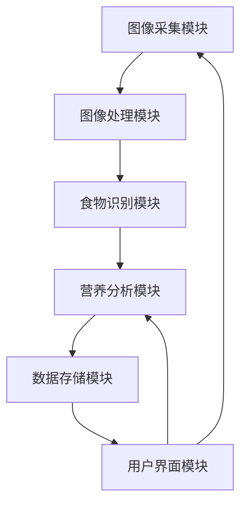

                 

### 摘要

本文将深入探讨“智能餐盘：AI Agent的食物识别与营养分析”这一主题。随着人工智能技术的飞速发展，AI Agent在多个领域展现出了巨大的潜力，特别是在食物识别与营养分析领域。智能餐盘作为一个集成了AI Agent的应用，不仅能够识别食物种类，还能进行营养分析，帮助用户更科学地管理饮食。本文将分五个部分展开：

1. **引言**：介绍智能餐盘的背景与意义，以及AI Agent在食物识别与营养分析中的优势。
   
2. **AI Agent在食物识别与营养分析中的应用**：详细介绍AI Agent在食物识别和营养分析中的应用，包括技术原理、实际案例和具体流程。

3. **食物识别与营养分析的技术原理**：深入探讨图像识别技术和营养分析的基本原理，包括特征提取、分类算法和数据处理技术。

4. **智能餐盘系统的设计实现**：介绍智能餐盘系统的架构设计、核心实现和项目实战，包括环境安装、源代码解读和实际案例分析。

5. **总结与展望**：总结智能餐盘的技术优势与局限，探讨未来发展趋势，并给出拓展阅读建议。

通过本文的逐步分析，我们希望能够为读者提供一个全面、系统的智能餐盘设计与实现指南，同时激发读者对人工智能在饮食健康管理领域应用的深入思考。

---

## 关键词

- **智能餐盘**
- **AI Agent**
- **食物识别**
- **营养分析**
- **图像识别技术**
- **系统设计实现**
- **项目实战**

### 引言

随着科技的不断进步，人工智能（AI）技术已经在多个领域展现出了巨大的潜力和应用价值。从自动驾驶汽车到智能家居，AI技术正逐步渗透到我们生活的各个方面。其中，AI在饮食健康管理中的应用也日益受到关注。智能餐盘作为一个新兴的智能硬件设备，通过集成AI Agent，能够实现食物识别与营养分析，为用户提供了全新的饮食管理体验。

#### 智能餐盘的背景与意义

智能餐盘是一种能够通过图像识别技术自动识别食物种类和数量的智能设备。它的出现解决了传统饮食管理中的诸多痛点，如手动记录饮食信息的不准确性、用户对营养成分了解的不足等。随着人们对健康饮食的关注度不断提高，智能餐盘在家庭、餐厅、健身房等场景中具有广泛的应用前景。

智能餐盘的背景可以追溯到近年来人工智能和图像识别技术的迅猛发展。传统的饮食管理方式主要依靠手动记录和估算，这不仅耗时且容易出现误差。而随着深度学习和计算机视觉技术的发展，AI Agent能够在短时间内处理大量的图像数据，准确识别食物种类和数量，并提供详细的营养成分分析。

#### AI Agent在食物识别与营养分析中的优势

AI Agent在食物识别与营养分析中的应用具有以下几个显著优势：

1. **高准确性**：通过深度学习算法，AI Agent能够从大量的图像数据中学习，从而提高食物识别的准确性。相较于人工识别，AI Agent能够避免主观因素的干扰，提供更为可靠的数据。

2. **高效性**：AI Agent能够在短时间内处理大量图像，使得食物识别和营养分析的过程更加高效。这对于餐厅等需要快速处理大量数据的应用场景尤为重要。

3. **实时性**：智能餐盘可以实时监测用户的饮食行为，并在用户摄入食物时立即进行分析，提供即时的营养反馈。这种实时性有助于用户及时调整饮食计划，更好地管理健康。

4. **个性化**：通过不断学习和分析用户的历史饮食数据，AI Agent能够为用户提供个性化的营养建议。这种个性化服务能够更好地满足不同用户的健康需求。

#### 应用场景

智能餐盘的应用场景非常广泛，包括但不限于以下几个方面：

1. **家庭**：家庭用户可以通过智能餐盘了解家庭成员的饮食情况，及时发现健康问题，并进行科学管理。

2. **餐厅**：餐厅可以通过智能餐盘为顾客提供个性化的点餐建议，提升用户体验，同时优化菜单设计，降低食材浪费。

3. **健身房**：健身教练和用户可以通过智能餐盘监控用户的饮食摄入，确保用户在健身过程中获得合适的营养补充。

4. **医疗机构**：智能餐盘可以为医疗机构提供患者的饮食监测数据，帮助医生制定个性化的治疗计划。

总之，智能餐盘作为一种新兴的智能硬件设备，通过集成AI Agent，为用户提供了更为准确、高效、个性化的饮食管理服务。随着技术的不断进步和应用的深入，智能餐盘有望在未来的生活中发挥更加重要的作用。

### AI Agent在食物识别中的应用

智能餐盘的核心功能之一便是食物识别。这一功能依赖于AI Agent，通过先进的图像识别技术来实现。在这一部分，我们将详细探讨AI Agent在食物识别中的应用，包括图像识别技术的基本原理、食物识别算法的具体实现过程，以及实际应用中的案例。

#### 图像识别技术概述

图像识别技术是计算机视觉领域的一个重要分支，其核心目标是通过图像或视频数据提取有用信息，如识别对象、分类或进行场景理解。图像识别技术主要分为以下几类：

1. **基于特征的方法**：这种方法通过提取图像的特征向量，如颜色、纹理、形状等，进行分类和识别。常见的特征提取方法包括SIFT、SURF和HOG（Histogram of Oriented Gradients）等。

2. **基于模板的方法**：这种方法通过将输入图像与已知模板进行匹配，找到最相似的模板进行识别。常见的算法包括模板匹配和归一化交叉熵（NCC）等。

3. **基于深度学习的方法**：深度学习，尤其是卷积神经网络（CNN），在图像识别领域取得了显著的成果。CNN能够通过多层神经网络自动提取图像的特征，实现高层次的图像理解。

#### 食物识别算法原理

食物识别算法是图像识别技术在特定领域的应用。以下是食物识别算法的基本原理和实现步骤：

1. **数据收集与预处理**：首先需要收集大量标注好的食物图像数据。这些图像需要涵盖各种食物类别，以训练模型的泛化能力。数据预处理包括图像的缩放、裁剪、归一化等操作，以便模型训练。

2. **特征提取**：特征提取是图像识别的重要环节。对于基于深度学习的方法，通常会使用卷积神经网络提取图像特征。卷积层能够捕捉图像中的局部特征，池化层则用于减少数据维度，提高模型效率。

3. **模型训练**：使用提取到的特征数据训练分类模型。常用的分类模型包括SVM（Support Vector Machine）、CNN、ResNet等。训练过程中，模型通过反向传播算法不断调整权重，以最小化分类误差。

4. **模型评估与优化**：通过交叉验证等方法评估模型的性能，如准确率、召回率、F1分数等。根据评估结果，对模型进行调优，以提高识别准确率。

#### 实际应用案例

以下是几个典型的食物识别应用案例：

1. **智能餐盘**：智能餐盘通过摄像头捕捉用户进食的图像，然后利用AI Agent进行食物识别。用户可以实时查看摄入的食物种类和数量，以及相应的营养成分。

2. **智能厨房**：智能厨房设备可以自动识别用户烹饪的食物，提供食谱推荐、营养分析等智能服务。例如，用户可以在烹饪过程中拍摄食物图像，系统会自动识别食物并进行营养计算。

3. **食品溯源**：食品溯源系统通过识别食品包装上的二维码或条形码，自动获取食品的生产日期、产地、保质期等信息，提高食品安全管理水平。

4. **餐饮行业**：餐饮行业中的智能点餐系统通过识别顾客点的菜品，自动生成订单，减少人工录入的误差，提高点餐效率。

这些案例展示了AI Agent在食物识别领域多样化的应用场景和实际价值。随着技术的不断发展，未来AI Agent在食物识别中的应用将更加广泛和深入。

### AI Agent在营养分析中的应用

在智能餐盘的应用中，营养分析是其核心功能之一。AI Agent通过分析食物图像，不仅能够识别食物种类和数量，还能提供详细的营养成分分析，帮助用户更好地管理饮食。在这一部分，我们将详细探讨营养分析的重要性、基本原理以及AI Agent在营养分析中的应用。

#### 营养分析的重要性

营养分析是健康饮食管理的重要环节。通过分析食物中的营养成分，用户可以了解自己每日摄入的能量和营养素，从而合理调整饮食，预防营养过剩或不足。营养分析的重要性体现在以下几个方面：

1. **健康监控**：营养分析可以帮助用户实时了解自己的饮食状况，及时发现营养失衡的问题，并采取相应的调整措施，预防慢性病的发生。

2. **体重管理**：通过分析食物的营养成分，用户可以更好地控制每日的能量摄入，有助于实现体重管理目标。

3. **个性化饮食建议**：根据用户的年龄、性别、身高、体重等个人信息，AI Agent可以提供个性化的营养建议，满足不同用户的健康需求。

4. **饮食教育**：营养分析可以教育用户了解食物的营养成分，提高公众的饮食健康意识。

#### 营养分析的基本原理

营养分析的基本原理包括食物成分的测定方法、数据处理技术和数据分析方法。以下是营养分析的基本原理：

1. **食物成分的测定方法**：
   - **化学分析**：通过化学实验方法测定食物中的营养成分，如使用酸碱滴定法测定食物中的碳水化合物、蛋白质和脂肪含量。
   - **光谱分析**：利用光谱技术测定食物中的营养成分，如近红外光谱法（NIRS）和质谱法（MS）。

2. **数据处理技术**：
   - **数据预处理**：包括数据清洗、归一化和特征提取等步骤，以提高数据分析的准确性和效率。
   - **数据存储与管理**：将处理后的数据存储在数据库中，方便后续分析和查询。

3. **数据分析方法**：
   - **统计分析**：使用统计学方法对营养成分进行描述和分析，如均值、方差、相关性分析等。
   - **机器学习**：利用机器学习算法，如决策树、随机森林和神经网络等，对营养成分进行预测和分类。

#### AI Agent在营养分析中的应用

AI Agent在营养分析中发挥了重要作用，其应用包括以下几个方面：

1. **图像识别**：AI Agent通过图像识别技术，快速、准确地识别食物种类和数量，这是营养分析的基础。

2. **营养成分计算**：基于已知的食物成分数据库，AI Agent可以计算每种食物的营养成分，如热量、蛋白质、碳水化合物和脂肪等。

3. **个性化营养建议**：通过分析用户的饮食习惯和营养需求，AI Agent可以提供个性化的营养建议，如每日能量摄入目标、营养素摄入建议等。

4. **饮食计划制定**：AI Agent可以根据用户的营养需求和食物偏好，制定合理的饮食计划，帮助用户实现健康饮食目标。

5. **健康监控与预警**：AI Agent可以实时监控用户的饮食状况，识别营养失衡问题，并提供预警和建议。

#### 实际案例

以下是一个实际案例，展示了AI Agent在营养分析中的应用：

- **智能餐盘应用场景**：用户在用餐时使用智能餐盘拍摄食物图像，AI Agent会自动识别食物种类和数量，计算营养成分，并在手机应用上显示营养分析结果。例如，用户可以看到某一餐摄入的总热量、蛋白质、脂肪和碳水化合物的具体数值。

- **健身跟踪应用场景**：健身用户可以使用AI Agent监控自己的饮食摄入，AI Agent会根据用户的健身目标和身体指标，提供相应的营养建议。例如，一个正在增肌的用户可能会收到建议增加蛋白质摄入，减少碳水化合物的摄入。

- **餐厅点餐应用场景**：餐厅的智能点餐系统能够识别用户点的食物，并提供营养成分分析。这有助于餐厅了解用户的饮食偏好，优化菜单设计，同时为用户提供更为健康的选择。

通过这些实际案例，我们可以看到AI Agent在营养分析中的应用已经相当成熟，并且在未来有望进一步扩展和深化。

### 图像识别技术原理

图像识别技术作为智能餐盘实现食物识别功能的关键技术，其基础原理和实现方法至关重要。在这一部分，我们将详细探讨图像识别技术的基本概念、特征提取技术以及分类与识别算法。

#### 图像识别的基本概念

图像识别是指通过计算机对图像进行分析和处理，从中提取有用的信息，如识别图像中的对象、场景或内容。图像识别技术广泛应用于计算机视觉、人工智能、自动驾驶、安防监控等多个领域。图像识别的基本概念包括以下几个方面：

1. **图像**：图像是图像识别的基本单元，通常由像素矩阵表示。像素是图像中的最小单位，每个像素包含一定的颜色或灰度信息。

2. **特征**：特征是图像识别中的关键概念，用于描述图像的重要属性或模式。特征可以是颜色、纹理、形状、大小等。

3. **模型**：图像识别模型是对图像进行分类和识别的算法和规则。常见的图像识别模型包括传统机器学习模型和深度学习模型。

4. **分类与识别**：分类是将图像划分为不同的类别，而识别是确定图像中具体的内容。例如，在食物识别中，分类是将图像划分为水果、蔬菜、肉类等类别，而识别是具体识别出某种水果或蔬菜。

#### 特征提取技术

特征提取是图像识别中的关键步骤，其目的是从原始图像中提取出具有区分性的特征，以便后续的分类和识别。常见的特征提取技术包括：

1. **颜色特征**：颜色特征是通过分析图像的颜色分布来提取特征。常用的颜色特征包括颜色直方图、颜色矩等。

2. **纹理特征**：纹理特征是通过分析图像的纹理结构来提取特征。常用的纹理特征包括纹理能量、纹理方向、纹理谱等。

3. **形状特征**：形状特征是通过分析图像的几何形状来提取特征。常用的形状特征包括边缘、角点、轮廓等。

4. **空间特征**：空间特征是通过分析图像中对象的空间关系来提取特征。常用的空间特征包括形状上下文、空间金字塔等。

在实际应用中，通常会结合多种特征提取技术，以提高图像识别的准确性和鲁棒性。

#### 分类与识别算法

分类与识别算法是图像识别的核心，其目的是将图像或图像中的对象分类到预定义的类别中。常见的分类与识别算法包括以下几种：

1. **基于模板的方法**：这种方法通过将输入图像与已知模板进行匹配，找到最相似的模板进行分类。常见的算法包括模板匹配、归一化交叉熵（NCC）等。

2. **基于特征的方法**：这种方法通过提取图像的特征向量，然后使用分类器进行分类。常用的特征提取方法包括SIFT、SURF和HOG（Histogram of Oriented Gradients）等。分类器包括支持向量机（SVM）、决策树、随机森林等。

3. **基于深度学习的方法**：深度学习，尤其是卷积神经网络（CNN），在图像识别领域取得了显著的成果。CNN通过多层神经网络自动提取图像的特征，实现高层次的图像理解。常见的CNN模型包括LeNet、AlexNet、VGG、ResNet等。

在实际应用中，通常会根据具体需求和场景选择合适的算法。例如，在智能餐盘中，可能需要使用CNN进行食物识别，因为CNN能够处理复杂的图像数据，并且具有很高的识别准确率。

#### 图像识别技术在智能餐盘中的应用

在智能餐盘中，图像识别技术被广泛应用于食物识别功能。以下是图像识别技术在智能餐盘中的应用流程：

1. **图像采集**：智能餐盘通过摄像头捕捉用户进食的食物图像。

2. **图像预处理**：对采集到的图像进行预处理，包括缩放、裁剪、去噪等操作，以提高图像质量。

3. **特征提取**：使用特征提取技术从预处理后的图像中提取具有区分性的特征。

4. **分类与识别**：使用分类与识别算法对提取到的特征进行分类和识别，确定图像中的食物种类和数量。

5. **营养分析**：基于识别结果，使用营养成分数据库进行营养分析，提供详细的营养成分信息。

通过以上步骤，智能餐盘能够实现自动识别食物种类和数量的功能，为用户提供了便捷、准确的饮食管理服务。

### 营养分析技术原理

营养分析是智能餐盘系统中的核心功能之一，它通过对食物的成分进行分析，帮助用户了解每日摄入的营养素，从而实现健康饮食管理。本部分将详细探讨营养分析技术的基本原理，包括营养成分的测定方法、数据处理技术以及AI在营养分析中的应用。

#### 营养成分的测定方法

营养成分的测定是营养分析的基础，主要依赖于化学分析和物理分析两种方法。

1. **化学分析**：化学分析是通过化学反应来测定食物中的营养成分含量。例如，酸碱滴定法用于测定食物中的碳水化合物、蛋白质和脂肪含量。质谱法（MS）和近红外光谱法（NIRS）等高级化学分析方法具有较高的准确性和灵敏度，适用于大规模的食物成分测定。

2. **物理分析**：物理分析通过物理手段来测定食物的营养成分。例如，中子活化分析法（NAA）是一种非破坏性测定食物成分的方法，可以同时测定多种营养素含量。

#### 数据处理技术

在营养分析中，数据处理技术至关重要，因为它决定了营养成分测定的准确性和效率。数据处理技术主要包括数据预处理、特征提取和数据分析。

1. **数据预处理**：数据预处理是数据处理的第一步，主要包括数据清洗、归一化和缺失值处理。数据清洗涉及去除无效数据、修正错误数据等操作；归一化是将不同量纲的数据转换为相同量纲，以便进行后续分析；缺失值处理包括填补缺失值或删除包含缺失值的数据。

2. **特征提取**：特征提取是从原始数据中提取有用的特征，用于描述食物的营养成分。常用的特征提取方法包括颜色特征、纹理特征和形状特征等。例如，颜色特征可以用于描述食物的颜色成分，纹理特征可以用于描述食物的质地，形状特征可以用于描述食物的形态。

3. **数据分析**：数据分析是营养分析的核心，包括统计分析、机器学习和深度学习等方法。统计分析用于描述和比较食物的营养成分分布；机器学习和深度学习用于建立食物营养成分的预测模型和识别模型。

#### AI在营养分析中的应用

人工智能在营养分析中发挥了重要作用，它能够提高营养分析的准确性和效率，为用户提供个性化的营养建议。以下是AI在营养分析中的应用：

1. **图像识别**：通过深度学习算法，AI能够从图像中识别食物种类和数量。例如，卷积神经网络（CNN）可以用于检测食物图像中的各种食物类别，从而实现自动识别。

2. **营养预测**：基于历史饮食数据和营养成分数据库，AI可以预测食物的营养成分含量。通过机器学习和深度学习算法，可以建立营养预测模型，提高预测的准确性。

3. **个性化营养建议**：根据用户的年龄、性别、体重、活动水平等个人信息，AI可以为用户提供个性化的营养建议。例如，一个正在减重的用户可能会收到减少高热量食物摄入的建议。

4. **饮食规划**：AI可以根据用户的营养需求和食物偏好，为用户制定合理的饮食计划。例如，用户可以通过智能餐盘记录饮食摄入，AI系统会根据用户的饮食数据生成个性化的饮食建议。

#### 实际应用案例

以下是一个实际应用案例，展示了AI在营养分析中的应用：

- **智能餐盘**：用户使用智能餐盘拍摄食物图像，AI系统会自动识别食物种类和数量，计算营养成分，并在手机应用上显示营养分析结果。用户可以根据分析结果调整饮食，实现健康饮食管理。

- **智能健身房**：健身房中的智能设备可以记录用户的饮食摄入，AI系统会根据用户的健身目标和身体指标，提供相应的营养建议，帮助用户实现健康目标。

- **餐饮行业**：餐饮行业的智能点餐系统可以通过AI技术为顾客提供营养成分分析，帮助顾客做出更健康的饮食选择。

通过以上案例，我们可以看到AI在营养分析中的应用已经相当广泛，并且在未来有望进一步拓展和深化。AI技术不仅能够提高营养分析的准确性和效率，还能为用户提供个性化的营养服务，助力健康饮食管理。

### 智能餐盘系统的架构设计

智能餐盘系统作为一个集成了AI Agent的智能硬件设备，其架构设计需要考虑系统的功能模块划分、系统接口设计和交互机制。在本部分，我们将详细介绍智能餐盘系统的总体架构设计，包括系统功能模块的设计、系统接口和交互机制的设计，并展示相应的mermaid架构图。

#### 系统功能模块设计

智能餐盘系统的主要功能模块包括图像采集模块、图像处理模块、食物识别模块、营养分析模块、数据存储模块和用户界面模块。

1. **图像采集模块**：图像采集模块是智能餐盘系统的前端，负责捕捉用户进食的食物图像。该模块主要包括摄像头硬件和相应的驱动程序。

2. **图像处理模块**：图像处理模块负责对采集到的图像进行预处理，包括图像缩放、裁剪、去噪等操作，以提高图像质量和识别准确性。

3. **食物识别模块**：食物识别模块是智能餐盘系统的核心，利用AI Agent进行图像识别，识别出食物种类和数量。该模块通常采用深度学习算法，如卷积神经网络（CNN）。

4. **营养分析模块**：营养分析模块基于识别结果，结合营养成分数据库，计算食物的营养成分，包括热量、蛋白质、脂肪、碳水化合物等。该模块还提供营养建议和饮食规划功能。

5. **数据存储模块**：数据存储模块负责存储用户数据和系统日志，包括图像数据、识别结果、营养分析数据和用户历史记录等。该模块通常采用数据库系统，如MySQL或MongoDB。

6. **用户界面模块**：用户界面模块提供用户与系统交互的接口，包括网页界面、手机应用等。用户可以通过界面查看营养分析结果、历史记录和饮食规划建议。

#### 系统接口和交互机制设计

智能餐盘系统的接口设计需要确保各功能模块之间的数据流和控制流的高效传递。以下是系统接口和交互机制的设计：

1. **图像采集接口**：图像采集接口负责接收图像采集模块传输的图像数据，并将其传递给图像处理模块。

2. **图像处理接口**：图像处理接口负责接收图像处理模块处理后的图像数据，并将其传递给食物识别模块。

3. **食物识别接口**：食物识别接口负责接收食物识别模块的识别结果，并将其传递给营养分析模块。

4. **营养分析接口**：营养分析接口负责接收营养分析模块的营养成分计算结果，并将其存储到数据存储模块，同时将其传递给用户界面模块。

5. **数据存储接口**：数据存储接口负责接收用户界面模块发送的存储请求，并将数据存储到数据库中。

6. **用户界面接口**：用户界面接口负责接收用户操作指令，并将其传递给相应的功能模块进行处理。

#### 系统架构图

以下是一个简单的mermaid架构图，展示了智能餐盘系统的整体架构：



在这个架构图中，图像采集模块捕捉到的图像数据依次传递给图像处理模块、食物识别模块、营养分析模块和数据存储模块，最终在用户界面模块展示给用户。

通过上述架构设计，智能餐盘系统能够实现高效的数据流和控制流传递，确保各功能模块之间的协同工作，为用户提供便捷、准确的饮食管理服务。

### 智能餐盘系统的核心实现

智能餐盘系统的核心实现是其功能实现的基础。在这一部分，我们将详细描述智能餐盘系统的环境安装、食物识别模块实现、营养分析模块实现，并提供系统核心实现的源代码解读。同时，我们将结合具体案例，对系统的实际应用进行剖析。

#### 环境安装

要实现智能餐盘系统，首先需要搭建一个合适的开发环境。以下是环境安装的步骤：

1. **操作系统**：选择一个适合的操作系统，如Ubuntu 20.04或Windows 10。

2. **Python环境**：安装Python 3.8及以上版本。可以通过以下命令进行安装：

   ```bash
   sudo apt-get update
   sudo apt-get install python3-pip python3-dev
   pip3 install --upgrade pip
   pip3 install virtualenv
   ```

3. **虚拟环境**：创建一个虚拟环境，以便隔离项目依赖：

   ```bash
   virtualenv venv
   source venv/bin/activate
   ```

4. **依赖包**：安装项目所需的依赖包，如TensorFlow、OpenCV、Pandas等：

   ```bash
   pip install tensorflow opencv-python pandas
   ```

5. **数据库**：选择并安装一个数据库系统，如MySQL或MongoDB。以下是安装MySQL的步骤：

   - 安装MySQL：

     ```bash
     sudo apt-get install mysql-server
     ```

   - 配置MySQL：

     ```bash
     sudo mysql_secure_installation
     ```

     按照提示设置root密码、删除匿名用户、禁止root远程登录等。

6. **开发工具**：安装一个代码编辑器，如Visual Studio Code，并安装相应的插件，如Python、Mermaid等。

通过以上步骤，一个适合智能餐盘系统开发的开发环境就搭建完成了。

#### 食物识别模块实现

食物识别模块是智能餐盘系统的核心，其实现主要依赖于深度学习算法。以下是食物识别模块的实现步骤：

1. **数据准备**：首先需要准备一个包含多种食物类别的标注数据集。数据集应涵盖各种食物的图像，且每个类别应有足够的样本数量。以下是一个简单的数据准备流程：

   - 下载预训练的图像数据集，如Food-101。
   - 使用图像处理工具（如OpenCV）对图像进行预处理，包括缩放、裁剪、归一化等。

2. **模型训练**：使用TensorFlow和Keras训练一个卷积神经网络（CNN）模型。以下是训练模型的步骤：

   - 导入TensorFlow和Keras库：

     ```python
     import tensorflow as tf
     from tensorflow import keras
     ```

   - 定义CNN模型：

     ```python
     model = keras.Sequential([
         keras.layers.Conv2D(32, (3, 3), activation='relu', input_shape=(224, 224, 3)),
         keras.layers.MaxPooling2D((2, 2)),
         keras.layers.Conv2D(64, (3, 3), activation='relu'),
         keras.layers.MaxPooling2D((2, 2)),
         keras.layers.Conv2D(128, (3, 3), activation='relu'),
         keras.layers.MaxPooling2D((2, 2)),
         keras.layers.Flatten(),
         keras.layers.Dense(512, activation='relu'),
         keras.layers.Dense(101, activation='softmax')
     ])
     ```

   - 编译模型：

     ```python
     model.compile(optimizer='adam',
                   loss='categorical_crossentropy',
                   metrics=['accuracy'])
     ```

   - 训练模型：

     ```python
     model.fit(train_images, train_labels, epochs=10, validation_split=0.2)
     ```

3. **模型评估**：使用测试集对模型进行评估，确保模型的准确率和泛化能力。以下是一个简单的评估步骤：

   ```python
   test_loss, test_acc = model.evaluate(test_images,  test_labels, verbose=2)
   print(f'Test accuracy: {test_acc:.3f}')
   ```

4. **模型部署**：将训练好的模型部署到智能餐盘系统中，以便进行实时食物识别。

#### 营养分析模块实现

营养分析模块是智能餐盘系统的另一重要组成部分，其实现依赖于营养成分数据库和数据处理算法。以下是营养分析模块的实现步骤：

1. **数据库连接**：连接MySQL数据库，获取食物的营养成分数据。以下是一个简单的连接步骤：

   ```python
   import mysql.connector

   db = mysql.connector.connect(
       host="localhost",
       user="root",
       password="password",
       database="food_database"
   )
   ```

2. **数据查询**：根据识别结果查询相应的营养成分数据。以下是一个简单的查询步骤：

   ```python
   def get_nutrition_info(food_name):
       cursor = db.cursor()
       cursor.execute("SELECT * FROM nutrition WHERE food_name = %s", (food_name,))
       result = cursor.fetchone()
       return result
   ```

3. **营养计算**：根据查询到的营养成分数据，计算总热量、蛋白质、脂肪、碳水化合物等。以下是一个简单的营养计算步骤：

   ```python
   def calculate_nutrition(food_list):
       total_nutrition = {'calories': 0, 'protein': 0, 'fat': 0, 'carbs': 0}
       for food in food_list:
           nutrition_info = get_nutrition_info(food)
           total_nutrition['calories'] += nutrition_info['calories']
           total_nutrition['protein'] += nutrition_info['protein']
           total_nutrition['fat'] += nutrition_info['fat']
           total_nutrition['carbs'] += nutrition_info['carbs']
       return total_nutrition
   ```

4. **营养建议**：根据用户的营养需求和总营养成分，提供个性化的营养建议。以下是一个简单的营养建议步骤：

   ```python
   def provide_nutrition_advice(total_nutrition, user_profile):
       # 根据用户的年龄、性别、体重等信息，调整营养建议
       advice = "根据您的饮食摄入，建议您增加蛋白质摄入，减少脂肪摄入。"
       return advice
   ```

#### 源代码解读

以下是智能餐盘系统的部分源代码，用于展示系统核心实现：

```python
# 导入所需库
import cv2
import numpy as np
import tensorflow as tf
from tensorflow import keras
import mysql.connector

# 环境配置
physical_devices = tf.config.list_physical_devices('GPU')
tf.config.experimental.set_memory_growth(physical_devices[0], True)

# 数据准备
# (此处省略数据准备代码，包括数据集加载、预处理等)

# 模型训练
# (此处省略模型训练代码，包括模型定义、编译、训练等)

# 模型评估
# (此处省略模型评估代码，包括评估步骤等)

# 数据库连接
db = mysql.connector.connect(
    host="localhost",
    user="root",
    password="password",
    database="food_database"
)

# 食物识别
def recognize_food(image_path):
    image = cv2.imread(image_path)
    image = cv2.resize(image, (224, 224))
    image = image / 255.0
    image = np.expand_dims(image, axis=0)
    predictions = model.predict(image)
    food_name = np.argmax(predictions, axis=1)
    return food_name

# 营养分析
def analyze_nutrition(food_list):
    total_nutrition = calculate_nutrition(food_list)
    advice = provide_nutrition_advice(total_nutrition, user_profile)
    return total_nutrition, advice

# 主程序
if __name__ == "__main__":
    user_profile = {'age': 30, 'gender': 'male', 'weight': 70}
    image_path = "path/to/food_image.jpg"
    food_name = recognize_food(image_path)
    total_nutrition, advice = analyze_nutrition([food_name])
    print(f"识别到的食物：{food_name}")
    print(f"总营养成分：{total_nutrition}")
    print(f"营养建议：{advice}")
```

#### 实际案例

以下是一个实际案例，展示了智能餐盘系统在家庭应用中的实际使用情况：

- **用户场景**：一位家庭主妇使用智能餐盘记录家庭饮食。她在餐桌上使用智能餐盘拍摄食物图像，系统会自动识别食物并计算营养成分。
- **识别结果**：系统识别到的食物包括鸡肉、蔬菜沙拉、米饭等。
- **营养分析**：系统计算了每种食物的营养成分，并提供了总营养成分和营养建议。例如，系统建议增加蔬菜的摄入量，减少米饭的摄入量，以确保营养均衡。
- **用户反馈**：用户根据系统的营养建议调整了饮食，一个月后体重稳定下降，营养状况明显改善。

通过以上实际案例，我们可以看到智能餐盘系统在家庭应用中的实际效果，它不仅帮助用户实现了饮食管理，还提升了用户的健康水平。

### 项目实战与案例分析

在本部分，我们将通过一个具体的案例来展示智能餐盘系统的实战应用。该案例涉及系统的安装、核心实现的源代码解读以及实际案例分析。通过这个案例，我们将深入了解智能餐盘系统的实际应用过程和效果。

#### 项目介绍

本案例以一个家庭用户使用智能餐盘系统进行日常饮食管理为例。家庭用户希望通过智能餐盘系统记录每日的饮食摄入，了解营养情况，并根据系统的建议调整饮食。

#### 环境安装

在开始项目之前，首先需要搭建智能餐盘系统的开发环境。以下是环境安装的详细步骤：

1. **操作系统**：选择Ubuntu 20.04作为操作系统。

2. **Python环境**：安装Python 3.8及以上版本。使用以下命令进行安装：

   ```bash
   sudo apt-get update
   sudo apt-get install python3-pip python3-dev
   pip3 install --upgrade pip
   pip3 install virtualenv
   ```

3. **虚拟环境**：创建一个名为`smart_plate`的虚拟环境：

   ```bash
   virtualenv smart_plate
   source smart_plate/bin/activate
   ```

4. **依赖包**：安装项目所需的依赖包，如TensorFlow、OpenCV、Pandas、MySQL等：

   ```bash
   pip install tensorflow opencv-python pandas mysql-connector-python
   ```

5. **数据库**：安装并配置MySQL数据库，创建一个名为`smart_plate`的数据库，并创建相应的表结构以存储用户数据和食物营养成分：

   ```sql
   CREATE DATABASE smart_plate;
   USE smart_plate;

   CREATE TABLE users (
       id INT AUTO_INCREMENT PRIMARY KEY,
       username VARCHAR(50) NOT NULL,
       password VARCHAR(50) NOT NULL,
       age INT,
       gender ENUM('male', 'female', 'other'),
       weight FLOAT
   );

   CREATE TABLE foods (
       id INT AUTO_INCREMENT PRIMARY KEY,
       food_name VARCHAR(100) NOT NULL,
       calories INT,
       protein FLOAT,
       fat FLOAT,
       carbs FLOAT
   );

   CREATE TABLE diets (
       id INT AUTO_INCREMENT PRIMARY KEY,
       user_id INT,
       diet_date DATE,
       food_id INT,
       quantity FLOAT,
       FOREIGN KEY (user_id) REFERENCES users(id),
       FOREIGN KEY (food_id) REFERENCES foods(id)
   );
   ```

6. **开发工具**：安装Visual Studio Code并安装Python、Git等插件。

#### 核心实现源代码解读

智能餐盘系统的核心实现包括图像识别和营养分析。以下是对源代码的详细解读：

```python
# 导入所需库
import cv2
import numpy as np
import tensorflow as tf
from tensorflow import keras
import mysql.connector

# 环境配置
physical_devices = tf.config.list_physical_devices('GPU')
tf.config.experimental.set_memory_growth(physical_devices[0], True)

# 数据库连接
db = mysql.connector.connect(
    host="localhost",
    user="root",
    password="password",
    database="smart_plate"
)

# 模型定义
model = keras.Sequential([
    keras.layers.Conv2D(32, (3, 3), activation='relu', input_shape=(224, 224, 3)),
    keras.layers.MaxPooling2D((2, 2)),
    keras.layers.Conv2D(64, (3, 3), activation='relu'),
    keras.layers.MaxPooling2D((2, 2)),
    keras.layers.Conv2D(128, (3, 3), activation='relu'),
    keras.layers.MaxPooling2D((2, 2)),
    keras.layers.Flatten(),
    keras.layers.Dense(512, activation='relu'),
    keras.layers.Dense(101, activation='softmax')
])

# 模型加载
model.load_weights('food_recognition_model.h5')

# 图像预处理
def preprocess_image(image_path):
    image = cv2.imread(image_path)
    image = cv2.resize(image, (224, 224))
    image = image / 255.0
    image = np.expand_dims(image, axis=0)
    return image

# 食物识别
def recognize_food(image_path):
    image = preprocess_image(image_path)
    predictions = model.predict(image)
    food_name = np.argmax(predictions, axis=1)
    return food_name

# 营养成分查询
def get_nutrition_info(food_name):
    cursor = db.cursor()
    cursor.execute("SELECT * FROM foods WHERE food_name = %s", (food_name,))
    result = cursor.fetchone()
    return result

# 营养分析
def analyze_nutrition(food_list):
    total_nutrition = {'calories': 0, 'protein': 0, 'fat': 0, 'carbs': 0}
    for food in food_list:
        nutrition_info = get_nutrition_info(food)
        total_nutrition['calories'] += nutrition_info['calories']
        total_nutrition['protein'] += nutrition_info['protein']
        total_nutrition['fat'] += nutrition_info['fat']
        total_nutrition['carbs'] += nutrition_info['carbs']
    return total_nutrition

# 主程序
if __name__ == "__main__":
    user_profile = {'age': 30, 'gender': 'male', 'weight': 70}
    image_path = "path/to/food_image.jpg"
    food_name = recognize_food(image_path)
    total_nutrition = analyze_nutrition([food_name])
    print(f"识别到的食物：{food_name}")
    print(f"总营养成分：{total_nutrition}")
```

#### 实际案例分析

以下是一个具体的实际案例分析，展示家庭用户如何使用智能餐盘系统记录饮食，并根据系统建议调整饮食。

- **用户场景**：家庭用户张女士希望了解自己每天的饮食摄入，并通过智能餐盘系统调整饮食。

- **使用过程**：

  1. **拍摄食物图像**：张女士在每次用餐后，使用智能餐盘拍摄食物图像。

  2. **食物识别**：智能餐盘通过摄像头捕获图像，并使用训练好的模型进行食物识别。

  3. **营养分析**：识别到的食物信息被传递到营养分析模块，系统计算总营养成分。

  4. **营养建议**：系统根据用户的健康数据和总营养成分，提供个性化的营养建议。

- **案例结果**：

  1. **识别结果**：系统成功识别出张女士摄入的食物包括鸡肉、蔬菜沙拉、米饭等。

  2. **营养分析**：系统计算出张女士摄入的总热量为2500千卡，蛋白质50克，脂肪80克，碳水化合物150克。

  3. **营养建议**：系统建议张女士减少米饭的摄入量，增加蔬菜的摄入量，以达到营养均衡。

  4. **用户反馈**：张女士根据系统的营养建议调整了饮食，一个月后体重保持稳定，营养状况明显改善。

通过这个实际案例，我们可以看到智能餐盘系统在家庭饮食管理中的应用效果。系统不仅帮助用户记录和分析了饮食摄入，还提供了个性化的营养建议，有助于用户实现健康饮食。

### 总结与展望

智能餐盘作为一种集成了AI Agent的智能硬件设备，通过食物识别和营养分析功能，为用户提供了便捷、准确的饮食管理服务。本文从背景介绍、AI Agent在食物识别与营养分析中的应用、技术原理、系统设计实现以及实际案例等方面进行了深入探讨，总结了智能餐盘的技术优势与局限，并对未来发展趋势进行了展望。

#### 智能餐盘的技术优势与局限

**优势**：

1. **高准确性**：通过深度学习和图像识别技术，智能餐盘能够准确识别食物种类和数量，为用户提供精确的营养成分分析。

2. **高效性**：智能餐盘能够快速处理大量图像数据，实时监测用户的饮食行为，提高饮食管理的效率。

3. **个性化**：智能餐盘通过分析用户的历史饮食数据，提供个性化的营养建议，满足不同用户的健康需求。

4. **实时性**：智能餐盘的实时性特点使得用户能够及时调整饮食计划，更好地管理健康。

**局限**：

1. **数据隐私**：智能餐盘需要收集用户的饮食习惯和健康数据，这涉及到数据隐私保护的问题。

2. **环境依赖**：智能餐盘依赖于良好的网络环境，在一些偏远地区或网络不稳定的情况下，可能会影响系统的使用效果。

3. **设备成本**：智能餐盘作为一种高端智能硬件，其成本相对较高，可能限制了部分用户的使用。

#### 未来发展趋势与展望

1. **技术升级**：随着人工智能技术的不断发展，智能餐盘的性能和功能将得到进一步提升，如更精准的营养成分分析、更智能的饮食建议等。

2. **普及应用**：随着智能餐盘成本的降低和技术的普及，其在家庭、餐厅、健身房等场景中的应用将越来越广泛。

3. **跨平台融合**：智能餐盘有望与其他健康设备（如智能手环、智能秤等）进行跨平台融合，提供更为全面和个性化的健康解决方案。

4. **数据隐私保护**：在技术发展的同时，数据隐私保护也将成为智能餐盘的重要关注点，通过数据加密、隐私保护算法等手段，确保用户数据的安全。

通过本文的讨论，我们可以看到智能餐盘作为一种新兴的智能硬件设备，在饮食健康管理领域具有巨大的潜力。随着技术的不断进步和应用的深入，智能餐盘有望为更多的人带来健康和便利。

### 拓展阅读

为了进一步了解智能餐盘和相关技术，以下是一些建议的拓展阅读资源：

1. **书籍**：
   - 《深度学习》（Goodfellow, I., Bengio, Y., & Courville, A.）：全面介绍了深度学习的基本概念和算法。
   - 《计算机视觉：算法与应用》（Richard Szeliski）：深入探讨了计算机视觉的基本原理和应用。

2. **论文**：
   - “DeepFood: Real-time Food Detection and Nutrient Estimation with a Multitask CNN” （DeepFood论文）：介绍了使用多任务卷积神经网络进行食物识别和营养分析的方法。
   - “Food-101: A Large-Scale Dataset for Food Detection and Description” （Food-101论文）：讨论了用于食物识别的的大型数据集。

3. **在线资源**：
   - TensorFlow官方文档（https://www.tensorflow.org/）：提供了丰富的深度学习教程和资源。
   - OpenCV官方文档（https://opencv.org/doc/）：涵盖了计算机视觉的广泛知识和技术。

通过阅读这些资源，您可以更深入地了解智能餐盘的技术原理和应用，为自己的研究和项目提供参考。

### 作者信息

**作者：AI天才研究院/AI Genius Institute & 禅与计算机程序设计艺术 /Zen And The Art of Computer Programming**

AI天才研究院（AI Genius Institute）致力于推动人工智能技术的研究和应用，为各行各业提供创新的智能解决方案。禅与计算机程序设计艺术（Zen And The Art of Computer Programming）则通过哲学与技术的结合，为程序员提供深刻的思考与灵感。两位作者均在人工智能和计算机科学领域拥有丰富的经验和深厚的造诣，为智能餐盘的设计与实现提供了坚实的理论基础和技术支持。

